# Part 022 — Order-to-Activate End-to-End Saga

## 1. Posisi Part Ini Dalam Seri

Kita sudah membahas:

- party/customer/account/agreement;
- product catalog dan offering;
- qualification/configuration;
- quote-to-order;
- product order;
- subscription lifecycle;
- charging/billing;
- service catalog CFS/RFS;
- service order;
- resource inventory;
- activation/provisioning;
- fallout/manual workflow;
- appointment/field service/workforce.

Sekarang kita gabungkan semuanya menjadi satu journey paling penting dalam telco BSS/OSS:

> **Order-to-Activate** — dari customer membeli produk sampai service aktif, inventory konsisten, billing/charging siap, dan customer bisa memakai layanan.

Part ini bukan sekadar diagram alur. Ini adalah blueprint cara berpikir top engineer ketika mendesain fulfillment telco carrier-grade.

## 2. Kaufman Skill Target

Target performa part ini:

> Kamu mampu merancang Order-to-Activate Saga di Java BSS/OSS yang menghubungkan product order, service decomposition, service order, resource allocation, appointment/field work, activation, service inventory, product inventory, charging/billing trigger, customer notification, dan fallout dengan consistency model yang eksplisit.

Sub-skill yang harus dikuasai:

1. membedakan commercial order, fulfillment order, technical command, dan inventory state;
2. memahami end-to-end lifecycle dari order acceptance sampai active subscription;
3. membuat saga boundary yang tidak berubah menjadi distributed transaction palsu;
4. mendesain event choreography dan orchestration secara seimbang;
5. membuat correlation id dan causality chain;
6. menangani partial completion, cancellation, amendment, retry, dan compensation;
7. menentukan completion semantics yang aman;
8. membuat reconciliation untuk stuck order;
9. menjaga customer-visible state berbeda dari internal technical state;
10. menguji scenario matrix order-to-activate.

## 3. Mental Model: Order-to-Activate Bukan Satu Workflow Linear

Pemula melihat Order-to-Activate seperti ini:

```text
Order -> Provision -> Active
```

Engineer berpengalaman melihatnya seperti ini:

```text
Commercial Commitment
  -> Fulfillment Plan
    -> Service Construction
      -> Resource Allocation
        -> Field/Activation Side Effects
          -> Technical Verification
            -> Inventory Commit
              -> Commercial Inventory Update
                -> Charging/Billing Readiness
                  -> Customer Notification
```

Top engineer menambahkan dimensi lain:

- setiap langkah bisa retry;
- setiap langkah bisa timeout;
- sebagian langkah irreversible;
- sebagian langkah butuh manual repair;
- state customer tidak sama dengan state internal;
- completion harus dibuktikan;
- cancellation bisa datang kapan saja;
- amendment bisa mengubah graph;
- event bisa duplicate/out-of-order;
- external system bisa eventually consistent;
- billing tidak boleh mulai sebelum service benar-benar aktif, kecuali business policy menyatakan lain.

## 4. Canonical Journey

Contoh order FTTH:

1. Customer memilih product offering: `Home Fiber 1Gbps`.
2. Qualification memastikan address serviceable.
3. Quote mengunci price, discount, validity, dan configuration.
4. Product order dibuat.
5. Product order accepted setelah validation/credit/fraud/payment policy.
6. Product order item didekomposisi menjadi service intent.
7. Service order dibuat untuk `Internet Access Service`.
8. Resource reservation dilakukan: ONT, router, logical service id, VLAN/profile, access port.
9. Appointment dibuat untuk installation.
10. Work order dikirim ke field workforce.
11. Teknisi memasang ONT/router dan submit evidence.
12. Activation command dikirim ke OLT/BNG/RADIUS/DNS/IPAM/charging systems.
13. Technical verification dilakukan.
14. Service inventory menjadi active.
15. Product inventory/subscription menjadi active.
16. Charging/billing readiness event dikirim.
17. Customer diberi notification bahwa service aktif.
18. Product order completed.

Diagram:

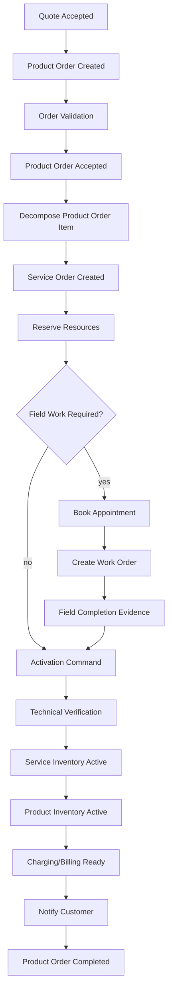

## 5. The Four-Layer Model

Order-to-Activate harus dipisahkan minimal menjadi empat layer:

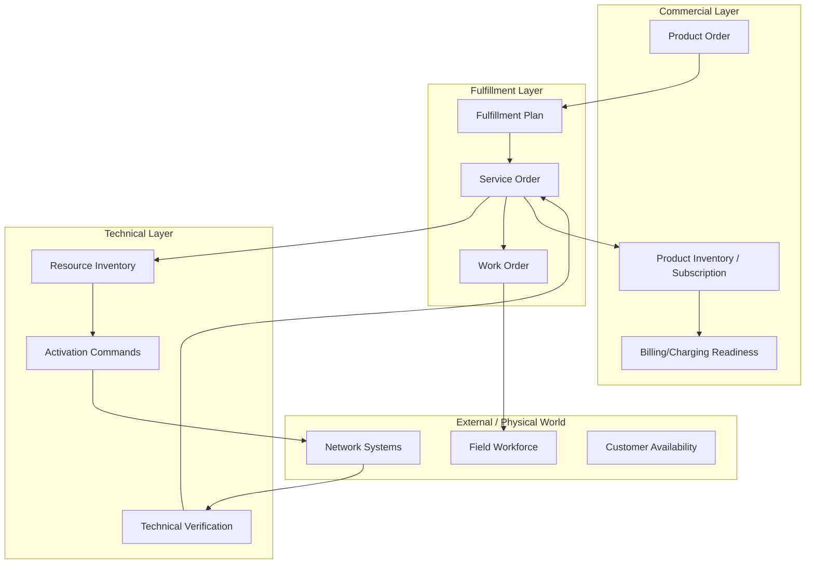

### 5.1 Commercial Layer

Commercial layer menjawab:

- apa yang dibeli customer;
- harga dan agreement mana yang berlaku;
- apakah customer entitled;
- subscription/product inventory state apa;
- kapan billing/charging dimulai;
- apa yang terlihat di channel/customer care.

### 5.2 Fulfillment Layer

Fulfillment layer menjawab:

- pekerjaan apa yang harus dilakukan;
- service apa yang harus dibuat/ubah/hapus;
- urutan dependency apa;
- fallout apa yang terjadi;
- kapan order item bisa dianggap fulfilled.

### 5.3 Technical Layer

Technical layer menjawab:

- resource apa yang dipakai;
- network/platform mana yang dikonfigurasi;
- command apa yang dikirim;
- verification apa yang membuktikan hasil;
- bagaimana reconciliation dilakukan.

### 5.4 External / Physical Layer

External layer berisi hal yang tidak sepenuhnya dikendalikan transaction Java:

- network element;
- vendor platform;
- field workforce;
- customer availability;
- logistics;
- subcontractor.

## 6. Order State Semantics

### 6.1 Product Order State

Product order harus customer/commercial-oriented.

State minimal:

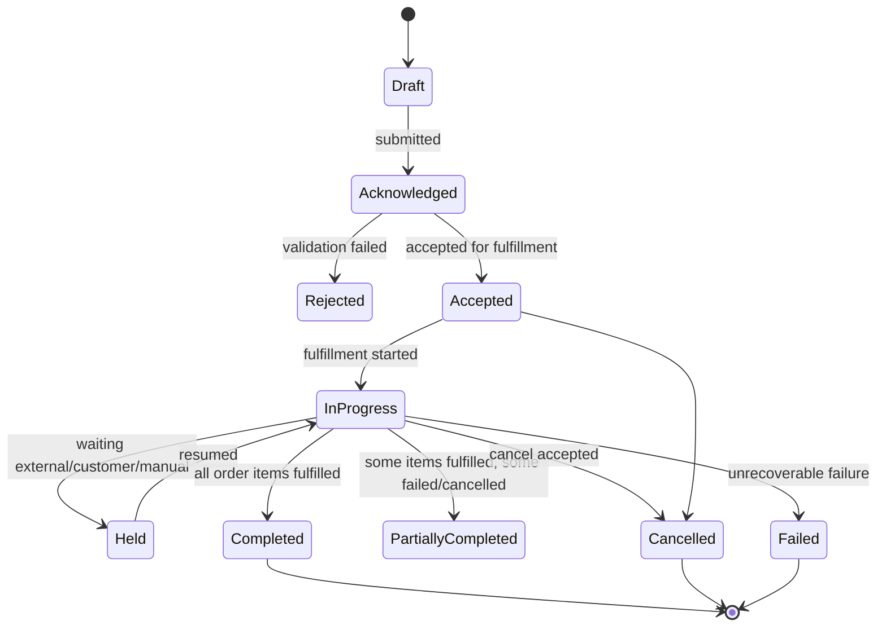

Product order should not expose every technical detail. Customer care needs enough reason/status, but not vendor command internals.

### 6.2 Service Order State

Service order is fulfillment-oriented.

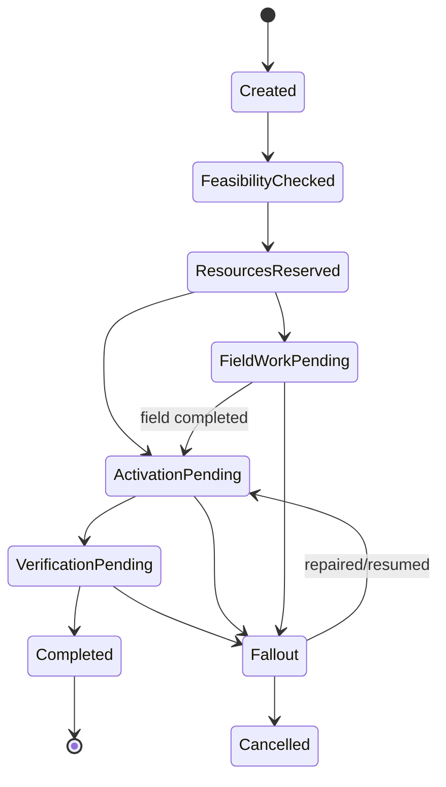

### 6.3 Resource State

Resource state should not be forced to mirror service/product state.

Example MSISDN/SIM/resource states:

```text
AVAILABLE -> RESERVED -> ASSIGNED -> ACTIVATING -> ACTIVE -> SUSPENDED -> RELEASE_PENDING -> QUARANTINED -> AVAILABLE
```

### 6.4 Activation Command State

Activation command state must handle uncertainty:

```text
CREATED -> SENT -> ACCEPTED -> VERIFYING -> SUCCEEDED
                     |          -> UNKNOWN -> RECONCILED_SUCCEEDED
                     |          -> UNKNOWN -> RECONCILED_FAILED
                     -> REJECTED
SENT -> TIMEOUT -> UNKNOWN
```

Never convert timeout directly to failed if external side-effect may still have occurred.

## 7. Saga Boundary

A saga is a long-running business transaction split into local transactions and compensating actions.

Order-to-Activate is a saga because:

- it spans many components;
- it calls external systems;
- it cannot hold a database transaction across hours/days;
- steps can be irreversible;
- compensation is business-specific;
- final consistency matters more than immediate atomicity.

### 7.1 What Is Inside the Saga?

Inside Order-to-Activate saga:

- product order acceptance;
- fulfillment plan generation;
- service order creation;
- resource reservation;
- appointment/work order;
- activation command;
- verification;
- inventory update;
- billing/charging readiness;
- notification;
- fallout/resume.

Outside the saga:

- product catalog authoring;
- generic customer profile management;
- long-term billing cycle execution;
- long-term network assurance;
- unrelated CRM interactions.

### 7.2 Saga Owner

Do not casually make Product Order component own all technical steps.

Common patterns:

| Pattern | Owner | Fit |
|---|---|---|
| Product Order Orchestrates Everything | Product Order Management | Simple stack, but risks commercial/technical coupling |
| Dedicated Fulfillment Orchestrator | Fulfillment/Saga component | Good for complex telco fulfillment |
| Service Order Owns Technical Fulfillment | Service Order Management | Good when product decomposition is clean |
| Pure Event Choreography | No central owner | Works only with strong observability and simple dependencies |

Recommended pattern for carrier-grade system:

> Product Order owns commercial promise. Fulfillment Orchestrator/Service Order owns technical execution. Components communicate with explicit commands/events and shared correlation.

## 8. Orchestration vs Choreography

### 8.1 Orchestration

A central orchestrator commands steps.

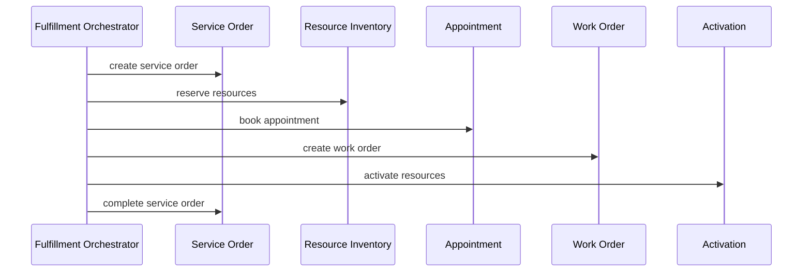

Pros:

- easier to understand;
- central visibility;
- easier dependency handling;
- easier timeout/escalation.

Cons:

- can become god service;
- tight coupling to all steps;
- orchestrator schema can become giant;
- versioning can be hard.

### 8.2 Choreography

Each component reacts to events.

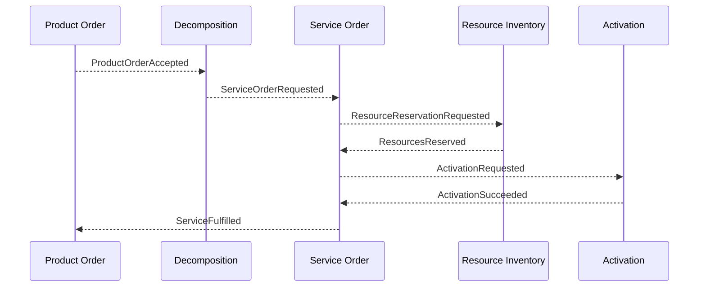

Pros:

- loose coupling;
- components remain autonomous;
- scalable event-driven model.

Cons:

- harder to reason end-to-end;
- hidden dependencies;
- difficult timeout ownership;
- harder customer support unless correlation is excellent.

### 8.3 Hybrid Pattern

Use hybrid:

- event choreography for state publication;
- command orchestration for required dependency steps;
- central saga state for observability and timeout;
- component-local invariants remain inside each component.

## 9. Correlation and Causality

Every message in Order-to-Activate must carry:

```text
correlationId       = end-to-end journey id
causationId         = message/event that caused this message
productOrderId      = commercial order
productOrderItemId  = commercial order item
serviceOrderId      = fulfillment order
serviceOrderItemId  = service item
resourceReservationId
activationCommandId
workOrderId
appointmentId
customerId/accountId where appropriate
```

Correlation lets support answer:

> “Why is this customer order stuck?”

Causality lets engineering answer:

> “Which event caused this wrong provisioning command?”

## 10. Event Set

Core events:

```text
QuoteAccepted
ProductOrderCreated
ProductOrderAccepted
ProductOrderRejected
ProductOrderFulfillmentStarted
ProductOrderHeld
ProductOrderCompleted
ProductOrderFailed

FulfillmentPlanGenerated
ServiceOrderCreated
ServiceOrderStarted
ServiceOrderHeld
ServiceOrderCompleted
ServiceOrderFalloutRaised

ResourcesReserved
ResourceReservationFailed
AppointmentConfirmed
WorkOrderCompleted
ActivationCommandCreated
ActivationCommandSucceeded
ActivationCommandUnknown
ActivationCommandFailed
TechnicalVerificationSucceeded
TechnicalVerificationFailed
ServiceInventoryActivated
ProductInventoryActivated
ChargingReadinessConfirmed
BillingReadinessConfirmed
CustomerNotificationRequested
```

Event rules:

1. events are facts, not requests;
2. commands request action;
3. event names use past tense;
4. event payload must be versioned;
5. event must contain correlation id;
6. never publish event before local commit;
7. outbox pattern is mandatory for critical events;
8. consumers must be idempotent.

## 11. Command Set

Core commands:

```text
AcceptProductOrder
GenerateFulfillmentPlan
CreateServiceOrder
ReserveResources
BookAppointment
CreateWorkOrder
DispatchWorkOrder
SubmitActivationCommand
VerifyTechnicalState
ActivateServiceInventory
ActivateProductInventory
ConfirmChargingReadiness
ConfirmBillingReadiness
NotifyCustomer
RaiseFallout
ResumeFulfillment
CancelFulfillment
CompensateResourceReservation
```

Command rules:

1. commands have intent and idempotency key;
2. command handler owns validation;
3. command result may be accepted/rejected/async;
4. command must not assume synchronous completion unless contract says so;
5. retry must not duplicate side effects.

## 12. Fulfillment Plan

A fulfillment plan is the executable graph generated from product order item and catalog/decomposition rules.

Example:

```yaml
planId: fp-1001
sourceProductOrderItemId: poi-777
productOffering: HOME_FIBER_1G
steps:
  - id: create-internet-service
    type: SERVICE_ORDER_ITEM
    serviceSpec: INTERNET_ACCESS_CFS
    dependsOn: []
  - id: reserve-ont
    type: RESOURCE_RESERVATION
    resourceSpec: ONT
    dependsOn: [create-internet-service]
  - id: reserve-router
    type: RESOURCE_RESERVATION
    resourceSpec: WIFI_ROUTER
    dependsOn: [create-internet-service]
  - id: book-installation
    type: APPOINTMENT
    workType: FTTH_INSTALLATION
    dependsOn: [reserve-ont, reserve-router]
  - id: field-installation
    type: WORK_ORDER
    dependsOn: [book-installation]
  - id: activate-network
    type: ACTIVATION
    target: OLT_BNG_RADIUS
    dependsOn: [field-installation]
  - id: verify-service
    type: VERIFICATION
    dependsOn: [activate-network]
  - id: activate-inventories
    type: INVENTORY_COMMIT
    dependsOn: [verify-service]
  - id: billing-ready
    type: BILLING_TRIGGER
    dependsOn: [activate-inventories]
```

### 12.1 Plan Invariants

1. plan is generated from versioned product/service catalog snapshot;
2. plan is immutable once execution starts, except via controlled amendment;
3. each step has owner component;
4. each step has timeout policy;
5. each step has retry policy;
6. each step has compensation policy when possible;
7. each step has completion evidence requirement;
8. plan graph must be acyclic unless explicitly modeled as loop/retry.

## 13. Java Saga State Model

```java
public enum SagaStepState {
    NOT_STARTED,
    STARTED,
    WAITING,
    SUCCEEDED,
    FAILED,
    COMPENSATING,
    COMPENSATED,
    SKIPPED,
    UNKNOWN
}

public record SagaStep(
    String stepId,
    String type,
    List<String> dependsOn,
    SagaStepState state,
    Instant startedAt,
    Instant completedAt,
    String externalRef
) {}

public final class OrderToActivateSaga {
    private final UUID sagaId;
    private final UUID productOrderId;
    private final UUID productOrderItemId;
    private SagaState state;
    private final Map<String, SagaStep> steps;
    private final List<DomainEvent> events = new ArrayList<>();

    public List<Command> nextCommands() {
        return steps.values().stream()
            .filter(this::isRunnable)
            .map(this::toCommand)
            .toList();
    }

    public void markSucceeded(String stepId, String externalRef) {
        SagaStep step = requireStep(stepId);
        // replace with immutable copy in production code
        events.add(new SagaStepSucceeded(sagaId, stepId, externalRef));
        if (allTerminalSucceeded()) {
            state = SagaState.COMPLETED;
            events.add(new OrderToActivateCompleted(sagaId, productOrderId, productOrderItemId));
        }
    }

    public void markFailed(String stepId, FailureReason reason) {
        SagaStep step = requireStep(stepId);
        if (isRecoverable(reason)) {
            state = SagaState.HELD;
            events.add(new SagaHeldForFallout(sagaId, stepId, reason.code()));
        } else {
            state = SagaState.FAILED;
            events.add(new OrderToActivateFailed(sagaId, stepId, reason.code()));
        }
    }

    private boolean isRunnable(SagaStep step) {
        return step.state() == SagaStepState.NOT_STARTED
            && step.dependsOn().stream().allMatch(this::isSucceeded);
    }

    private Command toCommand(SagaStep step) {
        return switch (step.type()) {
            case "RESOURCE_RESERVATION" -> new ReserveResources(sagaId, step.stepId());
            case "APPOINTMENT" -> new BookAppointment(sagaId, step.stepId());
            case "WORK_ORDER" -> new CreateWorkOrder(sagaId, step.stepId());
            case "ACTIVATION" -> new SubmitActivationCommand(sagaId, step.stepId());
            case "VERIFICATION" -> new VerifyTechnicalState(sagaId, step.stepId());
            case "INVENTORY_COMMIT" -> new CommitInventoryActivation(sagaId, step.stepId());
            case "BILLING_TRIGGER" -> new ConfirmBillingReadiness(sagaId, step.stepId());
            default -> throw new IllegalArgumentException("unknown step type: " + step.type());
        };
    }
}
```

This is a sketch, not a framework prescription. In production, prefer immutable step replacement and strict transition guards.

## 14. Local Transaction Pattern

Each component should follow:

```text
receive command/event
  -> validate idempotency
  -> load aggregate
  -> execute state transition
  -> persist aggregate
  -> persist outbox events
  -> commit local transaction
  -> outbox publisher sends events
```

Never do:

```text
begin DB transaction
  -> call network/vendor/FSM/payment external API
  -> wait
  -> update DB
commit
```

External side effects must be decoupled from database transactions.

## 15. Outbox / Inbox

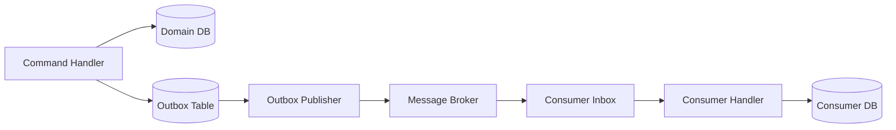

Inbox protects consumers from duplicate events.

Outbox protects publishers from lost events after local commit.

For Order-to-Activate, this is not optional.

## 16. Completion Semantics

When is Order-to-Activate complete?

Bad answer:

> Activation API returned 200.

Better answer:

> The required service/resource states have been verified, service inventory is active, product inventory is active, charging/billing readiness policy has passed, and customer-visible state has been updated.

Completion criteria:

1. all mandatory service order items completed;
2. all required resources assigned/active;
3. activation commands succeeded or reconciled succeeded;
4. technical verification passed;
5. service inventory active with correct relationships;
6. product inventory/subscription active;
7. charging/billing readiness confirmed;
8. customer notification emitted;
9. no blocking fallout remains;
10. audit evidence complete.

## 17. Billing and Charging Trigger Timing

Billing too early creates disputes.

Billing too late leaks revenue.

Common policies:

| Policy | Meaning | Risk |
|---|---|---|
| Bill on order acceptance | billing starts when order accepted | high dispute risk if service delayed |
| Bill on service activation | billing starts when technical service active | common for access service |
| Bill on customer acceptance | billing starts after customer confirms | lower dispute, revenue delay |
| Bill on first usage | billing starts when usage appears | may be unsuitable for recurring access |
| Bill on scheduled date | enterprise contract date | needs explicit agreement |

The system must make this a policy decision, not hidden code.

## 18. Cancellation Semantics

Cancellation is easy before side effects, hard after.

### 18.1 Before Acceptance

Cancel quote/cart/order draft: simple.

### 18.2 After Product Order Accepted But Before Resource Reservation

Cancel product order and stop saga. No technical compensation.

### 18.3 After Resource Reservation

Release resource reservation.

Potential complications:

- reserved MSISDN release may need quarantine;
- reserved number may be customer-selected and should be held for a period;
- reserved CPE may need warehouse release.

### 18.4 After Field Dispatch

Need cancel work order/FSM dispatch. Possible fee or supervisor approval.

### 18.5 After Activation

Need deactivation or rollback.

But rollback is not always inverse:

- number porting cannot always be instantly reversed;
- SIM activation may require deactivation/quarantine;
- network profile delete can affect existing service if mapping wrong;
- customer may already have usage.

Therefore compensation must be explicit per step.

## 19. Amendment Semantics

Amendment means changing an in-flight order.

Examples:

- customer changes appointment;
- customer upgrades selected speed before activation;
- address correction;
- add static IP;
- replace device type;
- change contact person;
- cancel one item in bundle.

Rules:

1. amendment must target specific order item/step;
2. amendment must know current step state;
3. amendment must be allowed/denied by policy;
4. amendment may require re-qualification;
5. amendment may regenerate part of fulfillment plan;
6. amendment must preserve audit lineage;
7. downstream components must receive delta, not ambiguous full replace.

## 20. Partial Completion

Bundle orders often partially complete.

Example:

- mobile SIM active;
- fixed broadband delayed;
- OTT subscription active;
- static IP failed.

Do not reduce this to a single boolean.

Model:

```text
ProductOrder = PARTIALLY_COMPLETED
  item 1 mobile = COMPLETED
  item 2 broadband = HELD
  item 3 OTT = COMPLETED
```

Customer communication must be item-aware.

Billing must be item-aware.

Assurance must be item-aware.

## 21. Fallout Integration

When saga step fails:

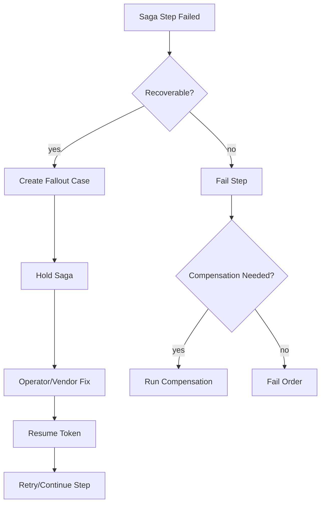

Fallout must include:

- saga id;
- failed step id;
- source order item;
- failure reason;
- suggested repair action;
- safe retry information;
- affected customer/service/resource;
- SLA impact;
- owner group;
- resume command.

## 22. Reconciliation

Reconciliation catches mismatches:

1. product order in progress but no active saga;
2. saga waiting for event beyond timeout;
3. resource reserved but no service order progress;
4. activation command unknown but network state active;
5. work order completed but service order not updated;
6. service inventory active but product inventory pending;
7. product inventory active but billing readiness missing;
8. billing active but service inventory not active;
9. customer notified active but technical verification failed.

Reconciliation query examples:

```sql
-- product order stuck after service order complete
select po.product_order_id, so.service_order_id
from product_order po
join service_order so on so.product_order_id = po.product_order_id
where po.state = 'IN_PROGRESS'
  and so.state = 'COMPLETED'
  and po.updated_at < now() - interval '30 minutes';

-- activation unknown too long
select activation_command_id, target_system, correlation_id
from activation_command
where state = 'UNKNOWN'
  and updated_at < now() - interval '10 minutes';
```

## 23. Customer-Visible State vs Internal State

Internal state can be noisy:

```text
RESOURCE_RESERVED
WORK_ORDER_DISPATCHED
ACTIVATION_SENT
VERIFICATION_PENDING
```

Customer-visible state should be meaningful:

```text
Order received
Preparing your installation
Appointment confirmed
Technician on the way
Installing your service
Activating your service
Service active
Action needed: please reschedule
Delayed: we are fixing a technical issue
```

Do not expose raw internal state to customers.

Create mapping:

```java
public CustomerOrderStatus toCustomerStatus(ProductOrder order, SagaSummary saga) {
    if (order.isRejected()) return CustomerOrderStatus.CANNOT_PROCESS;
    if (saga.hasCustomerActionRequired()) return CustomerOrderStatus.ACTION_REQUIRED;
    if (saga.hasAppointmentConfirmed()) return CustomerOrderStatus.APPOINTMENT_CONFIRMED;
    if (saga.isInActivation()) return CustomerOrderStatus.ACTIVATING_SERVICE;
    if (order.isCompleted()) return CustomerOrderStatus.SERVICE_ACTIVE;
    if (saga.isDelayedByProvider()) return CustomerOrderStatus.DELAYED;
    return CustomerOrderStatus.IN_PROGRESS;
}
```

## 24. Observability Model

Order-to-Activate needs business observability, not only logs.

Trace dimensions:

```text
correlation_id
product_order_id
product_order_item_id
service_order_id
service_order_item_id
saga_id
step_id
resource_id
activation_command_id
work_order_id
customer_account_id
channel
region
product_offering
```

Metrics:

```text
order_to_activate_started_total
order_to_activate_completed_total
order_to_activate_failed_total
order_to_activate_duration_seconds
order_to_activate_step_duration_seconds
order_to_activate_fallout_total
order_to_activate_resume_total
resource_reservation_latency
field_work_wait_time
activation_unknown_total
technical_verification_failed_total
billing_readiness_delay_total
```

Dashboards:

- orders by state;
- stuck orders by step;
- duration by product/region/channel;
- fallout reason top N;
- activation unknown backlog;
- field work dependency backlog;
- billing readiness gap;
- revenue delay from pending activation.

## 25. Sequence Diagram: Full Happy Path

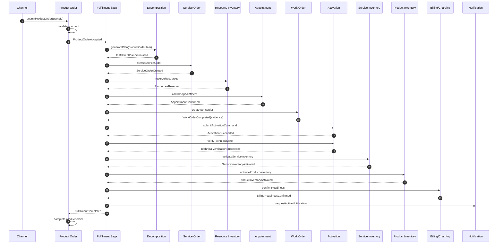

## 26. Failure Scenario: Activation Timeout

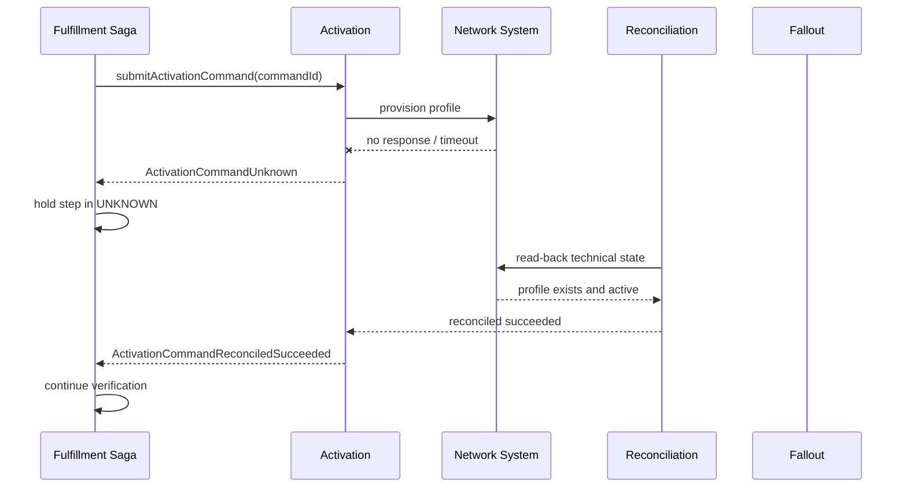

Important:

- timeout is not failed;
- saga holds or waits for reconciliation;
- retry must use same idempotency key or safe read-before-write;
- customer state should say “Activating your service”, not “Failed”.

## 27. Failure Scenario: Field No-Access

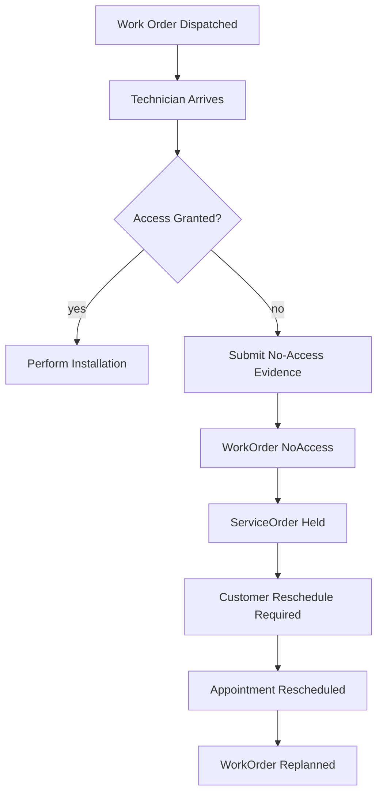

No-access should not trigger technical rollback if no technical side effect occurred. It should update appointment/work order/service order state and customer communication.

## 28. Failure Scenario: Billing Readiness Missing

If service is active but billing readiness fails:

- customer should not lose service;
- order may be technically complete but commercially pending;
- revenue assurance alert is needed;
- billing readiness retry/reconciliation should run;
- product order completion policy must decide whether this is blocker.

For many operators, billing readiness is mandatory before product order completed. For some, service activation event can complete order while billing gap goes to revenue assurance. The policy must be explicit.

## 29. Anti-Patterns

### Anti-Pattern 1: Single Mega Order Table

One table with columns:

```text
order_status, service_status, resource_status, activation_status, technician_status, billing_status
```

This becomes impossible to reason about.

Use separate aggregates and a saga/read model.

### Anti-Pattern 2: Product Order Calls Every Downstream System Directly

Product order becomes god service and cannot evolve.

### Anti-Pattern 3: Synchronous End-to-End HTTP Chain

Order submit waits for resource reservation, activation, field work, and billing. This fails in real telco.

Use async saga.

### Anti-Pattern 4: Completion Based On Last API Success

Activation API success is not equal to service active. Verify state.

### Anti-Pattern 5: No Correlation ID

Without correlation, operations cannot debug stuck orders.

### Anti-Pattern 6: No Explicit Compensation

“Rollback” is not a generic technical operation. Each step needs business compensation.

### Anti-Pattern 7: Exposing Internal State To Customer

Customers need meaningful status, not `SERVICE_ORDER_ITEM_WAITING_ACTIVATION_CALLBACK`.

## 30. Scenario Matrix

Minimum scenario matrix:

| Scenario | Expected Behavior |
|---|---|
| New mobile activation success | product/service/resource active, charging ready, notification sent |
| FTTH install success | appointment/work order completed, activation verified, billing ready |
| Appointment no-access | order held, customer reschedule required, no technical failure |
| Resource reservation failed | fallout or alternative resource selection |
| Activation timeout then read-back success | continue saga after reconciliation |
| Activation timeout then read-back absent | safe retry or fallout |
| Duplicate ProductOrderAccepted event | no duplicate saga |
| Duplicate WorkOrderCompleted callback | idempotent completion |
| Cancel before reservation | stop saga cleanly |
| Cancel after reservation | release/quarantine resources |
| Cancel after activation | deactivate/compensate according to policy |
| Billing readiness failed | service active but commercial gap handled by policy |
| Service inventory active but product inventory pending | reconciliation fixes/alerts |
| Partial bundle success | item-level state and billing/customer communication |
| Amendment changes appointment | replan appointment/work order only |
| Amendment changes speed after activation | new modify order, not mutation of completed activation |

## 31. Testing Strategy

### 31.1 Aggregate Unit Tests

- product order acceptance;
- saga step transition;
- service order state transition;
- resource reservation release;
- activation unknown handling;
- work order completion validation.

### 31.2 Contract Tests

- product order to fulfillment event schema;
- resource reservation command;
- appointment confirmation command;
- activation command result;
- billing readiness event;
- customer notification request.

### 31.3 End-to-End Simulation

Create a deterministic simulator:

```text
FakeResourceInventory
FakeAppointmentService
FakeWorkforceService
FakeActivationGateway
FakeBillingReadiness
```

Each fake supports:

- success;
- rejection;
- timeout;
- duplicate callback;
- delayed event;
- out-of-order event.

### 31.4 Chaos Scenarios

Inject:

- broker redelivery;
- database deadlock;
- activation timeout;
- field callback delay;
- reconciliation detects mismatch;
- saga service restart mid-flow;
- duplicate command from retry;
- stale catalog snapshot.

## 32. Production Read Model

Do not force support teams to inspect 12 systems.

Create Order-to-Activate read model:

```json
{
  "correlationId": "ota-7788",
  "productOrderId": "po-1001",
  "customerVisibleStatus": "ACTIVATING_SERVICE",
  "internalState": "IN_PROGRESS",
  "currentBlockingStep": "activation-network",
  "steps": [
    {"id": "service-order", "state": "SUCCEEDED"},
    {"id": "resource-reservation", "state": "SUCCEEDED"},
    {"id": "appointment", "state": "SUCCEEDED"},
    {"id": "work-order", "state": "SUCCEEDED"},
    {"id": "activation", "state": "UNKNOWN", "lastUpdated": "2026-06-29T09:10:00+07:00"}
  ],
  "customerActionRequired": false,
  "providerActionRequired": true,
  "falloutCaseId": null,
  "estimatedNextAction": "activation reconciliation"
}
```

This read model is not the system of record. It is operational projection.

## 33. Implementation Structure

Example Java module/package structure:

```text
com.example.telco.ota
  api
    ProductOrderAcceptedConsumer
    SagaCommandController
    SagaQueryController
  application
    OrderToActivateApplicationService
    SagaCommandDispatcher
    TimeoutScheduler
    ReconciliationScheduler
  domain
    OrderToActivateSaga
    FulfillmentPlan
    SagaStep
    SagaPolicy
    CompensationPolicy
  integration
    ProductOrderClient
    ServiceOrderClient
    ResourceInventoryClient
    AppointmentClient
    WorkOrderClient
    ActivationClient
    BillingReadinessClient
  persistence
    SagaRepository
    OutboxRepository
    InboxRepository
    SagaReadModelRepository
  projection
    OrderToActivateProjector
  observability
    SagaMetrics
    SagaTracing
```

Package rule:

- domain does not import HTTP clients;
- application orchestrates commands;
- integration maps external contracts;
- persistence handles DB/outbox/inbox;
- projection builds operational view.

## 34. Design Checklist

Before you call your Order-to-Activate design production-ready:

- Is product order separated from service order?
- Is service decomposition versioned?
- Is fulfillment plan explicit?
- Are step dependencies represented as graph?
- Are all external side effects idempotent?
- Are timeout and unknown states modeled?
- Is cancellation policy step-aware?
- Is amendment policy step-aware?
- Is compensation explicit per step?
- Is field work handled through work order/evidence?
- Is billing/charging trigger policy explicit?
- Is customer-visible status mapped separately?
- Are outbox/inbox patterns implemented?
- Are correlation and causation ids present everywhere?
- Is reconciliation implemented?
- Is support read model available?
- Are scenario tests automated?

## 35. Practice: Build A Mini Order-to-Activate Simulator

Exercise:

> Implement a mini OTA simulator for `Home Fiber 1Gbps` with product order, service order, resource reservation, appointment, work order, activation, verification, inventory activation, and billing readiness.

Rules:

1. use in-memory repositories first;
2. represent saga plan as graph;
3. every step emits events;
4. every consumer is idempotent;
5. activation can return success/fail/timeout;
6. work order can return completed/no-access;
7. reconciliation can convert timeout to success/fail;
8. expose a read model endpoint;
9. write scenario tests for success, no-access, activation timeout, duplicate events, and cancellation.

Expected learning:

- you will see why single transaction is impossible;
- you will see why customer status must differ from internal state;
- you will see why idempotency is not optional;
- you will see why fallout/resume must be first-class;
- you will understand telco fulfillment as controlled uncertainty.

## 36. Ringkasan

Order-to-Activate adalah backbone BSS/OSS fulfillment. Ia bukan satu endpoint, bukan satu status, dan bukan satu workflow linear. Ia adalah saga lintas commercial, fulfillment, technical, dan physical world.

Mental model utama:

> Product Order adalah janji komersial. Service Order adalah instruksi fulfillment. Resource Inventory adalah control ledger teknis. Activation adalah side-effect boundary. Work Order adalah pekerjaan fisik. Saga adalah koordinasi end-to-end. Completion adalah bukti bahwa customer benar-benar bisa memakai service dan monetization siap.

Setelah part ini, kita berpindah dari fulfillment ke assurance: bagaimana sistem mendeteksi fault, alarm, event, trouble ticket, QoS/QoE, dan service impact setelah layanan aktif.

## 37. Referensi

- TM Forum, **TMF622 Product Ordering Management API** — standard mechanism for placing product orders.
- TM Forum, **TMF641 Service Ordering Management API** — standard mechanism for placing service orders.
- TM Forum, **TMF637 Product Inventory Management API** — product inventory lifecycle reference.
- TM Forum, **TMF638 Service Inventory Management API** — service inventory reference.
- TM Forum, **TMF639 Resource Inventory Management API** — resource inventory reference.
- TM Forum, **TMF646 Appointment Management API** — appointment booking and slot search.
- TM Forum, **TMF702 Resource Activation and Configuration API** — resource activation/configuration boundary.
