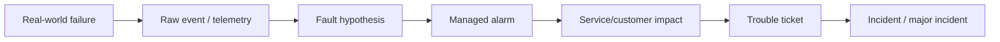
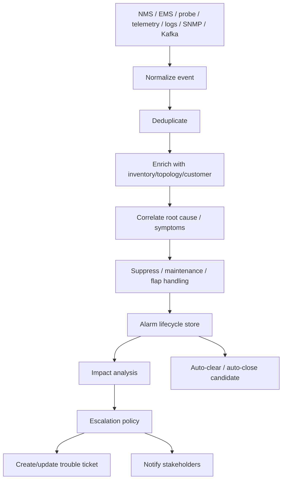
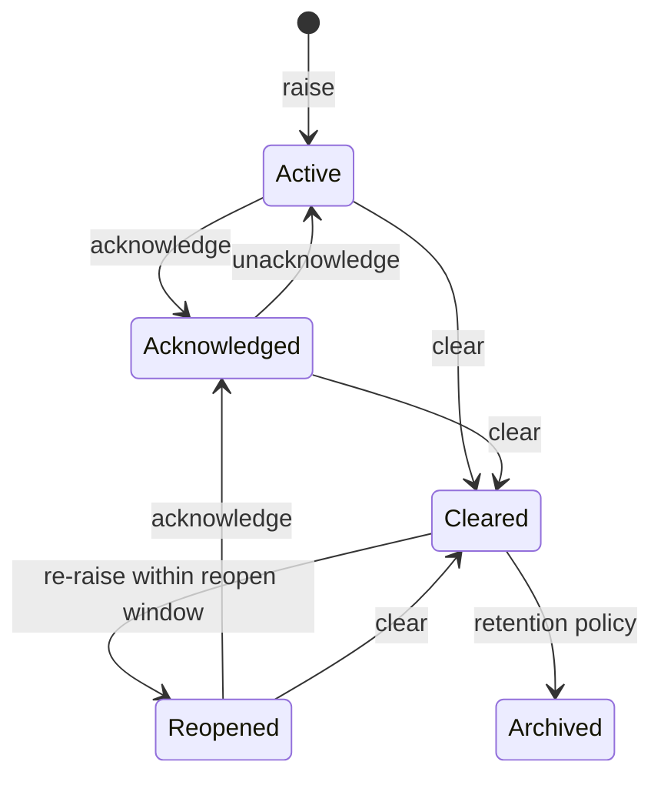
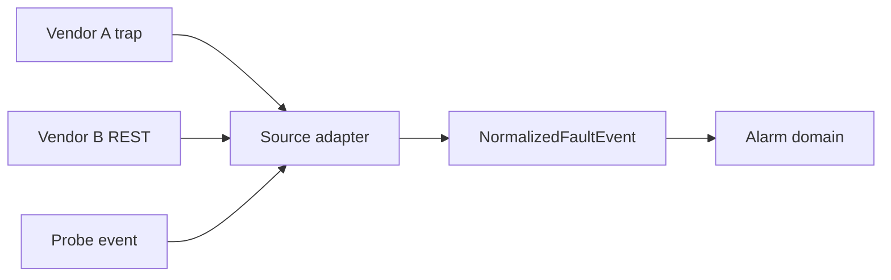
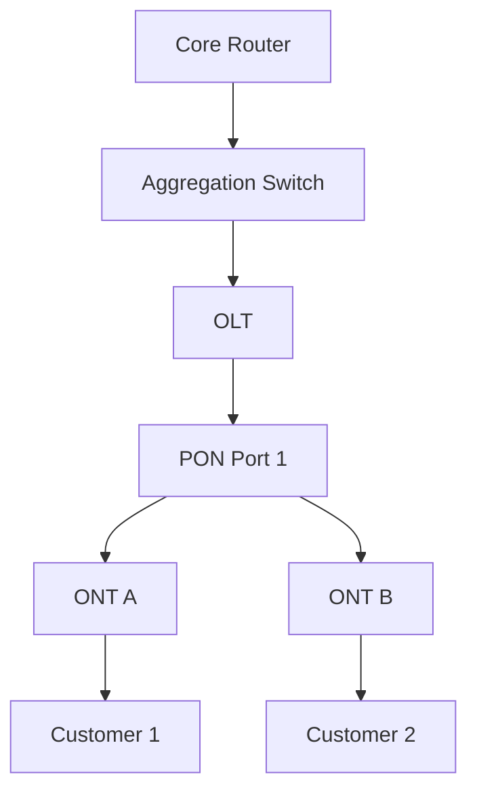
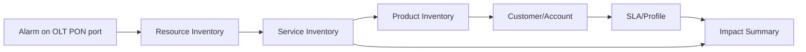
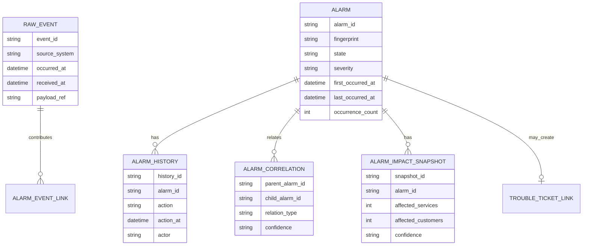
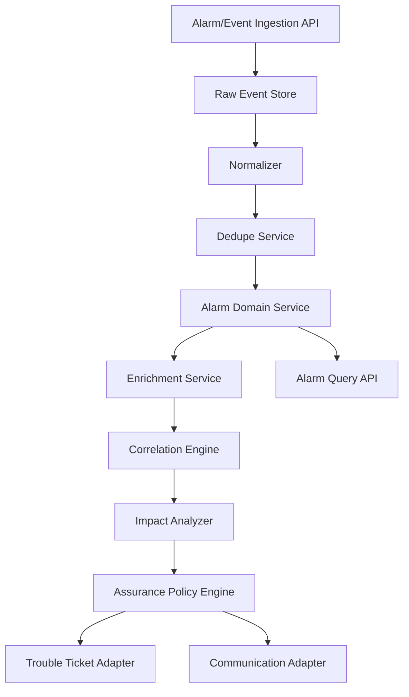

# Part 023 — Assurance: Fault, Alarm & Event Management

Pada part sebelumnya kita sudah membangun fulfillment path: product order, service order, resource inventory, provisioning, fallout, field service, dan order-to-activate saga. Sekarang kita masuk ke sisi lain dari OSS: **assurance**.

Fulfillment menjawab pertanyaan:

> Bagaimana layanan dibuat, diubah, dan diaktifkan?

Assurance menjawab pertanyaan:

> Setelah layanan aktif, bagaimana kita tahu bahwa layanan masih berjalan, apa yang rusak, siapa yang terdampak, dan tindakan apa yang harus dilakukan?

Untuk engineer Java, assurance bukan sekadar menerima alarm dari NMS lalu menaruhnya di database. Assurance adalah sistem **sense-making**: mengubah ribuan sinyal teknis menjadi sedikit keputusan operasional yang benar.

---

## 1. Kaufman Target Performance

Setelah menyelesaikan part ini, target performa Anda adalah mampu:

1. Mendesain alarm management component yang tahan terhadap event storm.
2. Membedakan event, fault, alarm, symptom, root cause, trouble ticket, dan incident.
3. Membuat lifecycle alarm yang tidak kehilangan evidence.
4. Mendesain deduplication, correlation, suppression, enrichment, dan escalation.
5. Menurunkan alarm teknis menjadi customer/service impact.
6. Membangun Java pipeline untuk assurance dengan idempotency, ordering tolerance, dan audit trail.
7. Menentukan kapan alarm harus menjadi trouble ticket, kapan cukup menjadi observability signal, dan kapan harus disuppress.

Ini bukan materi NOC operator saja. Ini materi untuk engineer yang ingin bisa mendesain OSS yang dipakai operator jaringan sungguhan.

---

## 2. Mental Model: Alarm Is Not the Failure

Kesalahan umum:

> “Ada alarm berarti ada failure.”

Lebih tepat:

> Alarm adalah representasi operasional dari kondisi abnormal yang dilaporkan, disimpulkan, atau dikorelasikan oleh sistem monitoring/manajemen.

Failure adalah keadaan real-world. Event adalah sinyal. Fault adalah penyebab teknis. Alarm adalah artefak manajemen. Ticket adalah artefak kerja. Incident adalah artefak koordinasi.



Boundary penting:

| Concept | Makna | Contoh |
|---|---|---|
| Event | Sesuatu terjadi | Interface down trap, KPI threshold breach, heartbeat missed |
| Fault | Kondisi teknis abnormal | Fiber cut, port failure, power failure, BGP session down |
| Alarm | Fault yang dikelola secara lifecycle | CRITICAL alarm pada OLT, active/cleared/acknowledged |
| Symptom | Efek turunan | Banyak CPE offline karena upstream device down |
| Root cause | Penyebab utama yang menjelaskan symptom | Aggregation switch down |
| Impact | Konsekuensi ke service/customer/SLA | 2.300 broadband customers affected |
| Ticket | Unit kerja untuk investigasi/repair | Trouble ticket assigned to field ops |
| Incident | Koordinasi lintas tim untuk gangguan signifikan | Regional outage bridge |

Jika model Anda mencampur semua ini menjadi satu tabel `network_event`, sistem akan cepat hancur saat volume dan kompleksitas naik.

---

## 3. Reference Model: Where TM Forum Fits

Untuk alarm dan event management, referensi praktis yang sering dipakai:

- **TMF642 Alarm Management API**: standardized alarm management interface; alarm bisa terkait layer resource, service, atau customer.
- **TMF688 Event Management API**: enterprise event management interface untuk create/manage/receive service-related events, termasuk automation workflow, outage, SLA violation, dan trigger trouble ticket.
- **TMF621 Trouble Ticket Management API**: standardized interface untuk create/track/manage trouble ticket.
- **TMF638 Service Inventory** dan **TMF639 Resource Inventory**: sumber topology/relationship untuk impact analysis.
- **TMF641 Service Order** dan **TMF622 Product Order**: korelasi gangguan dengan provisioning/change yang sedang berjalan.

Jangan perlakukan API standar sebagai internal persistence model. Gunakan sebagai **northbound/southbound contract** dan vocabulary.

---

## 4. Assurance Pipeline Overview

Sistem assurance carrier-grade biasanya memiliki pipeline seperti ini:



Prinsip desain:

1. **Raw event immutable** — simpan input awal untuk audit dan replay.
2. **Managed alarm mutable but versioned** — state alarm berubah, tapi perubahan harus diaudit.
3. **Correlation explainable** — operator harus tahu mengapa alarm A disuppress oleh root alarm B.
4. **Impact recomputable** — customer impact harus bisa dihitung ulang saat topology berubah.
5. **Ticket creation controlled** — jangan membuat ticket untuk setiap alarm.
6. **Clearing is not deletion** — alarm yang clear tetap menjadi evidence historis.

---

## 5. Event vs Alarm: Design Boundary

### 5.1 Event

Event adalah fakta temporal. Ia terjadi sekali.

Contoh:

```json
{
  "sourceSystem": "ems-olt-east-01",
  "eventType": "LINK_DOWN",
  "nativeId": "OLT-112/PON-3/1:LINK_DOWN:2026-06-29T10:15:22Z",
  "occurredAt": "2026-06-29T10:15:22Z",
  "receivedAt": "2026-06-29T10:15:25Z",
  "resourceRef": "olt-112:pon-3/1",
  "severity": "MAJOR",
  "payload": {
    "vendorCode": "PON_LOS",
    "message": "Loss of signal on PON port"
  }
}
```

Event harus:

- immutable;
- idempotent berdasarkan source + native id + occurrence time;
- bisa terlambat datang;
- bisa duplikat;
- bisa out-of-order;
- tidak selalu menghasilkan alarm.

### 5.2 Alarm

Alarm adalah stateful projection dari satu atau lebih event.

Contoh:

```json
{
  "alarmId": "alm-20260629-000981",
  "fingerprint": "OLT-112|PON-3/1|PON_LOS",
  "state": "ACTIVE",
  "severity": "MAJOR",
  "probableCause": "LOSS_OF_SIGNAL",
  "affectedResource": "olt-112:pon-3/1",
  "firstOccurredAt": "2026-06-29T10:15:22Z",
  "lastOccurredAt": "2026-06-29T10:18:05Z",
  "occurrenceCount": 17,
  "ackState": "UNACKNOWLEDGED",
  "correlationState": "ROOT_CAUSE_CANDIDATE"
}
```

Alarm harus:

- punya lifecycle;
- punya severity saat ini;
- bisa di-acknowledge;
- bisa clear;
- punya ownership;
- punya history;
- bisa terkait ticket;
- bisa terkait customer/service impact.

---

## 6. Alarm Lifecycle State Machine

Minimal lifecycle:



Carrier-grade lifecycle biasanya membutuhkan state tambahan:

| State | Makna |
|---|---|
| `ACTIVE` | Kondisi abnormal masih berlaku |
| `ACKNOWLEDGED` | Operator menerima alarm untuk investigasi |
| `SUPPRESSED` | Alarm tidak ditampilkan/ditindak karena root cause/maintenance/flap policy |
| `CLEARED` | Kondisi abnormal sudah selesai |
| `REOPENED` | Alarm clear lalu muncul lagi dalam window tertentu |
| `ESCALATED` | Alarm sudah melewati policy escalation |
| `TICKETED` | Alarm sudah terkait trouble ticket |
| `ARCHIVED` | Tidak aktif dan hanya disimpan untuk histori/compliance |

Ingat: state alarm bukan cuma UI concern. State memengaruhi automation, ticketing, SLA, notification, dan analytics.

---

## 7. Alarm Fingerprint

Dedupe bergantung pada fingerprint. Fingerprint adalah identitas logis alarm, bukan event ID.

Contoh fingerprint:

```text
source-domain + managed-object + probable-cause + specific-problem + service-affecting-flag
```

Contoh:

```text
ACCESS|OLT-112/PON-3/1|LOSS_OF_SIGNAL|PON_LOS|SERVICE_AFFECTING
```

Fingerprint yang terlalu sempit menyebabkan duplicate alarm. Fingerprint yang terlalu luas menyebabkan alarm berbeda tercampur.

### 7.1 Bad Fingerprint

```text
nativeEventId
```

Masalah: setiap trap baru menjadi alarm baru.

### 7.2 Better Fingerprint

```text
managedObject + probableCause + specificProblem
```

Masalah tersisa: belum cukup untuk multi-domain/multi-vendor.

### 7.3 Production Fingerprint

```text
normalizedDomain + normalizedManagedObjectRef + normalizedCause + normalizedProblem + serviceAffecting + tenant
```

Tambahkan tenant jika platform multi-operator atau MVNO/MVNE.

---

## 8. Java Aggregate Design

Alarm lifecycle cocok sebagai aggregate karena ada invariant stateful.

```java
public final class Alarm {
    private final AlarmId id;
    private final AlarmFingerprint fingerprint;
    private AlarmState state;
    private AlarmSeverity severity;
    private AckState ackState;
    private Instant firstOccurredAt;
    private Instant lastOccurredAt;
    private long occurrenceCount;
    private TroubleTicketRef ticketRef;
    private final List<AlarmChange> history;

    public void raise(NormalizedFaultEvent event) {
        if (state == AlarmState.CLEARED && withinReopenWindow(event.occurredAt())) {
            state = AlarmState.REOPENED;
        } else if (state == AlarmState.ARCHIVED) {
            throw new IllegalStateException("Archived alarm cannot be raised");
        } else {
            state = AlarmState.ACTIVE;
        }

        severity = severity.max(event.severity());
        lastOccurredAt = max(lastOccurredAt, event.occurredAt());
        occurrenceCount++;
        history.add(AlarmChange.raised(event.eventId(), event.occurredAt()));
    }

    public void clear(ClearEvent event) {
        if (state == AlarmState.ARCHIVED) return;
        if (event.occurredAt().isBefore(firstOccurredAt)) {
            history.add(AlarmChange.ignoredOutOfOrderClear(event.eventId()));
            return;
        }
        state = AlarmState.CLEARED;
        history.add(AlarmChange.cleared(event.eventId(), event.occurredAt()));
    }

    public void acknowledge(OperatorId operatorId, Instant at) {
        if (state == AlarmState.CLEARED || state == AlarmState.ARCHIVED) {
            throw new IllegalStateException("Cannot acknowledge inactive alarm");
        }
        ackState = AckState.ACKNOWLEDGED;
        history.add(AlarmChange.acknowledged(operatorId, at));
    }
}
```

Key point:

- `raise()` bukan insert sederhana; ia update lifecycle.
- `clear()` harus tahan out-of-order event.
- `acknowledge()` adalah operator action, bukan network event.
- history harus immutable.
- severity escalation/de-escalation perlu policy eksplisit.

---

## 9. Normalization Layer

Alarm source sangat heterogen:

- SNMP traps;
- syslog;
- EMS/NMS REST webhook;
- gNMI telemetry;
- Kafka stream;
- vendor proprietary TCP feed;
- cloud-native Prometheus/Alertmanager;
- Kubernetes events;
- VNF/CNF lifecycle events;
- synthetic probe results.

Jangan biarkan domain alarm memahami payload vendor.



Canonical event minimal:

```java
public record NormalizedFaultEvent(
    EventId eventId,
    String sourceSystem,
    Instant occurredAt,
    Instant receivedAt,
    ManagedObjectRef managedObject,
    AlarmSeverity severity,
    ProbableCause probableCause,
    SpecificProblem specificProblem,
    boolean serviceAffecting,
    Map<String, String> attributes
) {}
```

Anti-pattern:

```java
public record AlarmEvent(Map<String, Object> payload) {}
```

Map payload membuat semua rule menjadi stringly-typed dan sulit diuji.

---

## 10. Deduplication

Deduplication menjawab:

> Apakah event ini merepresentasikan alarm baru, update alarm lama, atau duplicate yang harus diabaikan?

Ada dua level dedupe:

### 10.1 Event Dedupe

Tujuan: mencegah raw event yang sama diproses ulang.

Key:

```text
sourceSystem + nativeEventId
```

atau bila native ID buruk:

```text
sourceSystem + managedObject + probableCause + occurredAt + payloadHash
```

### 10.2 Alarm Dedupe

Tujuan: menggabungkan event berulang menjadi satu managed alarm.

Key:

```text
alarmFingerprint
```

Pseudo-flow:

```java
public AlarmProcessingResult process(NormalizedFaultEvent event) {
    if (eventStore.exists(event.eventId())) {
        return AlarmProcessingResult.duplicateEvent(event.eventId());
    }

    eventStore.append(event);

    AlarmFingerprint fingerprint = fingerprintFactory.from(event);
    Alarm alarm = alarmRepository.findOpenByFingerprint(fingerprint)
        .orElseGet(() -> Alarm.newAlarm(fingerprint, event));

    alarm.raise(event);
    alarmRepository.save(alarm);

    return AlarmProcessingResult.updated(alarm.id());
}
```

Production concern:

- unique constraint untuk event ID;
- optimistic locking untuk alarm update;
- partition by fingerprint untuk stream processing;
- late clear event handling;
- reopen window;
- occurrence count cap agar field tidak overflow;
- metadata retention policy.

---

## 11. Severity Model

Severity bukan dekorasi UI. Ia memengaruhi SLA, routing, notification, dan escalation.

Typical normalized severity:

| Severity | Meaning |
|---|---|
| `CRITICAL` | Service/resource failure with severe impact |
| `MAJOR` | Significant degradation or localized failure |
| `MINOR` | Limited degradation, warning condition |
| `WARNING` | Potential issue, no immediate service impact |
| `INDETERMINATE` | Severity unknown or vendor ambiguous |
| `CLEARED` | Clear event or resolved condition |

Jangan langsung percaya severity vendor. Vendor A `MAJOR` bisa setara Vendor B `CRITICAL`. Buat mapping:

```yaml
vendorSeverityMapping:
  huawei:
    critical: CRITICAL
    major: MAJOR
    minor: MINOR
  vendor-x:
    emergency: CRITICAL
    alert: MAJOR
    warn: MINOR
```

Lalu tambahkan policy:

```text
if serviceAffecting=true and affectedCustomers > 1000 then severity >= CRITICAL
if maintenanceWindowActive=true then suppress unless safety alarm
if rootCauseAlarmExists=true then child symptoms inherit suppression
```

---

## 12. Enrichment

Raw alarm jarang cukup untuk action. Enrichment menambahkan context.

Sources:

- resource inventory;
- service inventory;
- topology graph;
- product inventory;
- customer/account data;
- SLA profile;
- maintenance window;
- recent change/order;
- location/site hierarchy;
- device ownership;
- partner domain;
- field workforce zone.

Example enriched alarm:

```json
{
  "alarmId": "alm-20260629-000981",
  "resource": "OLT-112/PON-3/1",
  "site": "JKT-EAST-HUB-03",
  "affectedServices": 482,
  "affectedCustomers": 471,
  "enterpriseCustomers": 3,
  "goldSlaCustomers": 17,
  "activeMaintenanceWindow": false,
  "recentChange": "chg-20260629-043",
  "recommendedQueue": "ACCESS-FIBER-NOC"
}
```

Enrichment harus version-aware. Jika topology berubah setelah alarm terjadi, Anda harus bisa menjelaskan:

- impact saat alarm pertama kali dihitung;
- impact saat ini;
- sumber data topology yang dipakai;
- timestamp snapshot.

---

## 13. Correlation

Correlation menjawab:

> Dari banyak alarm, mana root cause dan mana symptom?

### 13.1 Rule-Based Correlation

Contoh rule:

```text
IF OLT uplink down
AND many ONT offline under same OLT within 5 minutes
THEN suppress ONT offline alarms as symptoms of OLT uplink down
```

Rule ini membutuhkan topology.



Jika `Agg` down, ratusan alarm di bawahnya mungkin hanya symptom.

### 13.2 Temporal Correlation

Contoh:

```text
Multiple link-down events in same region within 2 minutes -> possible upstream power/fiber event.
```

Butuh event-time window, bukan processing-time semata.

### 13.3 Topology Correlation

Contoh:

```text
If parent node has CRITICAL alarm, child reachability alarms become suppressed symptoms.
```

### 13.4 Change Correlation

Contoh:

```text
If alarm starts within change window and affected resource is in change scope, attach changeRef and route to change owner.
```

### 13.5 ML-Assisted Correlation

Bisa dipakai, tapi jangan mulai dari ML. Carrier-grade assurance perlu explainability. ML output sebaiknya menjadi `correlationCandidate`, bukan automatic truth.

---

## 14. Suppression

Suppression bukan menghapus alarm. Suppression adalah keputusan tampilan/aksi.

Jenis suppression:

| Type | Meaning |
|---|---|
| Maintenance suppression | Alarm terjadi selama maintenance window |
| Topology suppression | Alarm adalah symptom dari parent/root alarm |
| Flapping suppression | Alarm naik-turun terlalu cepat |
| Duplicate suppression | Alarm identik sudah aktif |
| Policy suppression | Alarm tidak service-affecting atau low-value |
| Dependency suppression | Alarm dari domain partner sedang menunggu upstream provider |

Data yang wajib disimpan:

```json
{
  "suppressed": true,
  "suppressionReason": "TOPOLOGY_ROOT_CAUSE",
  "suppressedByAlarmId": "alm-20260629-000940",
  "policyVersion": "assurance-policy-2026.06.29",
  "decidedAt": "2026-06-29T10:16:02Z"
}
```

Anti-pattern:

> Menghapus child alarm dari database karena “sudah ada root alarm”.

Itu merusak forensic analysis, KPI, RCA, dan vendor dispute.

---

## 15. Flapping Alarm Handling

Flapping terjadi saat alarm active-clear-active-clear berulang dalam waktu pendek.

Contoh:

```text
PON_LOS active 10:00
PON_LOS clear 10:01
PON_LOS active 10:02
PON_LOS clear 10:03
```

Policy:

```text
if transitions(active<->clear) >= 4 within 10 minutes:
  mark alarm as FLAPPING
  suppress notification storm
  keep alarm visible as unstable condition
  escalate if duration exceeds threshold
```

State tambahan:

```java
public enum StabilityState {
    STABLE,
    FLAPPING,
    DAMPENED
}
```

Jangan auto-close ticket terlalu cepat untuk alarm flapping. Gunakan clear stability window:

```text
Alarm can be auto-closed only if cleared for 15 minutes and no related active symptoms remain.
```

---

## 16. Alarm-to-Ticket Policy

Tidak semua alarm menjadi trouble ticket.

Decision matrix:

| Condition | Action |
|---|---|
| CRITICAL + service affecting + no active ticket | Create ticket |
| MAJOR + repeated 3 times in 1 hour | Create ticket |
| Alarm under maintenance window | Suppress, no ticket unless safety exception |
| Child symptom of active root alarm | Link to root ticket, no new ticket |
| Low severity non-service-affecting | Keep alarm only |
| Enterprise SLA customer affected | Create/accelerate ticket |
| Alarm after recent change | Attach change, route to change owner |

Policy output:

```java
public record AssuranceDecision(
    AlarmId alarmId,
    DecisionType type,
    Optional<TicketIntent> ticketIntent,
    Optional<NotificationIntent> notificationIntent,
    List<String> reasons,
    String policyVersion
) {}
```

Make policy explainable:

```text
Ticket created because:
- alarm severity = CRITICAL
- serviceAffecting = true
- affectedCustomers = 482
- no active root ticket exists
- no maintenance window active
- policy version = assurance-policy-2026.06.29
```

---

## 17. Impact Analysis

Impact analysis menghubungkan alarm teknis ke service/customer.



Output impact:

```json
{
  "affectedResources": 1,
  "affectedServices": 482,
  "affectedProducts": 471,
  "affectedCustomers": 471,
  "highPriorityCustomers": 17,
  "estimatedBlastRadius": "JKT-EAST-HUB-03/PON-3/1",
  "confidence": "HIGH",
  "inventorySnapshotAt": "2026-06-29T10:16:00Z"
}
```

Impact confidence penting:

| Confidence | Meaning |
|---|---|
| `HIGH` | Topology and inventory complete |
| `MEDIUM` | Topology complete but service/customer mapping partially stale |
| `LOW` | Unknown resource, inferred mapping, or stale inventory |

Jangan tampilkan angka customer terdampak tanpa confidence.

---

## 18. Event Ordering and Time Semantics

Assurance systems harus membedakan:

| Time | Meaning |
|---|---|
| `occurredAt` | waktu event terjadi di source |
| `receivedAt` | waktu event diterima platform |
| `processedAt` | waktu event diproses pipeline |
| `effectiveAt` | waktu perubahan state dianggap berlaku |
| `clearedAt` | waktu kondisi clear terjadi |

Failure mode:

```text
clear event arrives before raise event
```

Jangan langsung buang clear event. Simpan sebagai pending clear dengan TTL atau process as out-of-order evidence.

Simplified algorithm:

```java
if (clearEvent.occurredAt().isBefore(alarm.firstOccurredAt())) {
    recordOutOfOrderClear(clearEvent);
    return;
}

if (clearEvent.occurredAt().isAfter(alarm.lastOccurredAt())) {
    alarm.clear(clearEvent);
}
```

Pada stream architecture, partition by fingerprint membantu ordering per alarm, tapi tidak menjamin ordering antar-source.

---

## 19. Storage Model

Pisahkan raw event, alarm state, alarm history, correlation, dan impact.



Indexing essentials:

- `raw_event(source_system, native_event_id)` unique;
- `alarm(fingerprint, state)`;
- `alarm(state, severity, last_occurred_at)`;
- `alarm_history(alarm_id, action_at)`;
- `alarm_correlation(parent_alarm_id)`;
- `impact_snapshot(alarm_id, calculated_at)`.

---

## 20. Java Component Blueprint



Suggested packages:

```text
com.example.telco.assurance.alarm
  domain
    Alarm
    AlarmState
    AlarmSeverity
    AlarmFingerprint
    AlarmHistory
  application
    ProcessFaultEventUseCase
    AcknowledgeAlarmUseCase
    ClearAlarmUseCase
    SuppressAlarmUseCase
  policy
    AlarmToTicketPolicy
    SuppressionPolicy
    FlappingPolicy
  correlation
    CorrelationEngine
    TopologyCorrelationRule
  impact
    ImpactAnalyzer
    ImpactSnapshot
  adapter
    inbound
      AlarmIngestionController
      EventConsumer
    outbound
      TroubleTicketClient
      ServiceInventoryClient
      ResourceInventoryClient
      CommunicationClient
```

Rule of thumb:

- Domain package tidak tahu REST/Kafka/vendor.
- Adapter package tidak memutuskan lifecycle business.
- Policy package explainable dan versioned.
- Query API boleh read-optimized, tapi command path harus invariant-safe.

---

## 21. API Design: Ingestion vs Management

Pisahkan API untuk ingestion dan API untuk alarm management.

### 21.1 Ingestion API

Untuk source system:

```http
POST /internal/assurance/fault-events
Idempotency-Key: ems-olt-east-01:abc-123
```

Payload canonical atau near-canonical.

### 21.2 Management API

Untuk OSS UI, NOC, automation, northbound integration:

```http
GET /alarms?state=ACTIVE&severity=CRITICAL
POST /alarms/{alarmId}/acknowledge
POST /alarms/{alarmId}/suppress
POST /alarms/{alarmId}/link-ticket
GET /alarms/{alarmId}/impact
GET /alarms/{alarmId}/history
```

External northbound dapat mengikuti TMF642-style resource model, tetapi internal API boleh berbeda selama mapping jelas.

---

## 22. Event Storm Protection

Assurance system akan menerima storm saat outage besar.

Proteksi:

1. Backpressure di ingestion.
2. Partition by alarm fingerprint.
3. Batch enrichment.
4. Async impact recalculation.
5. Token bucket per source system.
6. Circuit breaker untuk inventory dependency.
7. Degraded mode: create alarm without full enrichment, enrich later.
8. Dead-letter queue dengan replay.
9. Bulk correlation instead of per-event expensive graph query.
10. UI sampling/aggregation untuk storm view.

Mode degradasi yang benar:

```text
Event accepted -> raw stored -> minimal alarm raised -> enrichment pending -> correlation pending -> impact pending
```

Mode degradasi yang salah:

```text
Inventory down -> reject all alarms
```

Dalam assurance, kehilangan event bisa lebih buruk daripada alarm yang belum enriched.

---

## 23. Operational Observability for Assurance Itself

Assurance platform juga harus diamati.

Metrics:

| Metric | Meaning |
|---|---|
| `fault_events_received_total` | input volume |
| `fault_events_duplicate_total` | duplicate rate |
| `alarm_created_total` | new alarm volume |
| `alarm_updated_total` | update volume |
| `alarm_cleared_total` | clear volume |
| `alarm_storm_detected_total` | storm events |
| `alarm_enrichment_latency_seconds` | enrichment latency |
| `alarm_correlation_latency_seconds` | correlation latency |
| `impact_calculation_latency_seconds` | impact latency |
| `ticket_creation_failures_total` | ticket adapter failures |
| `dlq_events_total` | replay risk |

Golden questions:

- Apakah event masuk tapi alarm tidak dibuat?
- Apakah alarm dibuat tapi tidak enriched?
- Apakah alarm critical tidak masuk ticket?
- Apakah ticket dibuat duplicate?
- Apakah clear event tidak menutup alarm?
- Apakah correlation suppress terlalu agresif?

---

## 24. Common Failure Modes

### 24.1 Duplicate Tickets

Cause:

- fingerprint buruk;
- ticket policy tidak idempotent;
- race condition saat alarm storm.

Mitigation:

- unique key pada active ticket per root alarm;
- ticket intent idempotency key;
- optimistic locking;
- root-cause grouping.

### 24.2 Alarm Never Clears

Cause:

- clear event mapping salah;
- out-of-order handling buruk;
- vendor clear uses different probable cause;
- missed clear event.

Mitigation:

- normalize raise/clear pair;
- periodic source reconciliation;
- stale alarm review;
- auto-clear only with evidence.

### 24.3 Suppression Hides Real Customer Impact

Cause:

- maintenance window terlalu luas;
- topology relation salah;
- child alarm suppressed tanpa impact aggregation.

Mitigation:

- suppression audit;
- impact rolled up to root alarm;
- maintenance exception policy;
- confidence scoring.

### 24.4 Inventory Staleness Breaks Impact

Cause:

- resource inventory tidak update;
- planned/discovered mismatch;
- service inventory incomplete.

Mitigation:

- impact confidence;
- reconciliation jobs;
- fallback heuristic;
- topology snapshot version.

### 24.5 Event Storm Takes Down OSS

Cause:

- synchronous enrichment per event;
- no backpressure;
- expensive graph traversal in hot path;
- UI query scans active alarms.

Mitigation:

- streaming partition;
- async enrichment;
- materialized impact index;
- storm mode UI;
- source throttling.

---

## 25. Practice: Design a Fiber Cut Assurance Flow

Scenario:

- Aggregation switch `AGG-JKT-19` loses uplink.
- 12 OLTs become unreachable.
- 9.800 broadband services affected.
- 43 enterprise circuits affected.
- EMS sends 18.000 events in 3 minutes.
- Maintenance window is not active.
- A planned change occurred 20 minutes before on adjacent device.

Design:

1. fingerprint strategy;
2. dedupe rule;
3. root-cause correlation;
4. suppressed symptom policy;
5. impact calculation;
6. ticket creation;
7. customer notification candidate;
8. incident escalation condition;
9. event storm control;
10. auto-clear condition.

Expected high-level answer:

```text
Root alarm: AGG-JKT-19 uplink failure
Symptoms: OLT unreachable, ONT offline, service probe failures
Ticket: one major network trouble ticket
Incident: yes, because enterprise + high customer count threshold exceeded
Suppression: child alarms hidden from primary queue but linked as symptoms
Impact: roll up all affected services/customers to root alarm
Change correlation: attach nearby change as candidate, not proof
Auto-clear: require uplink restored + OLT reachable + probe recovery + stability window
```

---

## 26. Engineering Checklist

Sebelum menganggap alarm management siap produksi, periksa:

- [ ] raw event immutable dan replayable;
- [ ] event dedupe dan alarm dedupe terpisah;
- [ ] fingerprint policy versioned;
- [ ] alarm lifecycle punya audit history;
- [ ] severity normalized;
- [ ] clear event mapping diuji per vendor;
- [ ] out-of-order event ditangani;
- [ ] flapping policy ada;
- [ ] suppression explainable;
- [ ] correlation menyimpan parent-child evidence;
- [ ] impact calculation punya confidence;
- [ ] ticket creation idempotent;
- [ ] maintenance window integrated;
- [ ] recent change correlation ada;
- [ ] degraded mode untuk dependency outage;
- [ ] DLQ dan replay process tersedia;
- [ ] active alarm query tidak full scan;
- [ ] storm protection diuji;
- [ ] operator actions audited;
- [ ] data retention policy jelas.

---

## 27. Key Takeaways

1. Alarm bukan failure; alarm adalah managed representation dari kondisi abnormal.
2. Assurance bukan log ingestion; assurance adalah decision pipeline.
3. Event immutable, alarm stateful, ticket actionable.
4. Dedupe, correlation, suppression, enrichment, dan impact analysis adalah core OSS capability.
5. Jangan membuat ticket untuk semua alarm.
6. Suppression harus menyimpan evidence, bukan menghapus fakta.
7. Impact analysis tanpa topology/inventory confidence mudah menyesatkan.
8. Java design yang baik memisahkan source adapter, domain lifecycle, policy engine, correlation, impact, dan ticket adapter.

---

## 28. References

- TM Forum — TMF642 Alarm Management API.
- TM Forum — TMF688 Event Management API.
- TM Forum — TMF621 Trouble Ticket Management API.
- TM Forum — TMF638 Service Inventory Management API.
- TM Forum — TMF639 Resource Inventory Management API.
- TM Forum — TMF681 Communication Management API.

