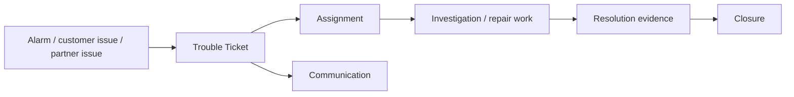
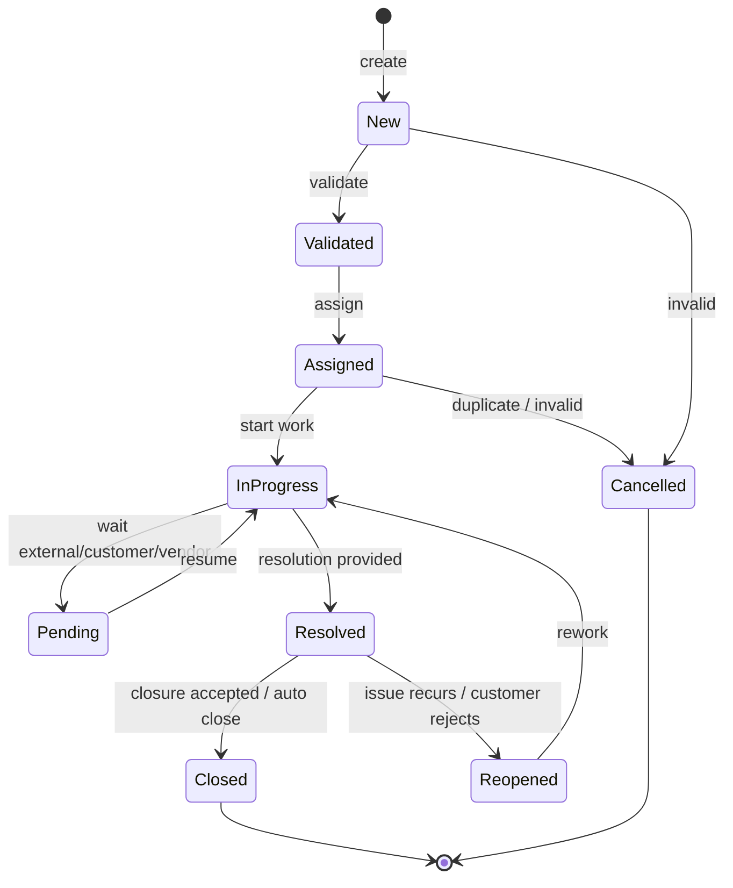
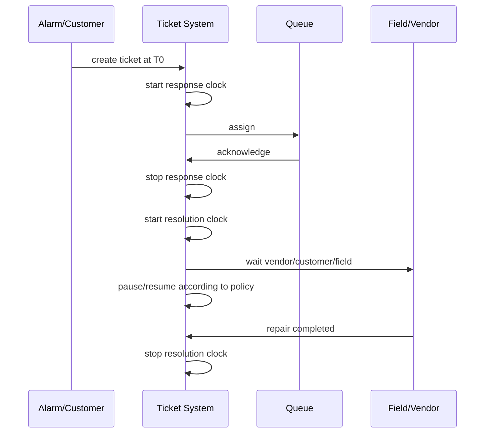
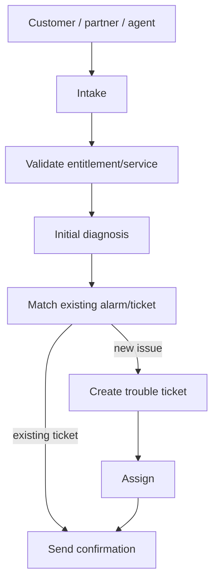
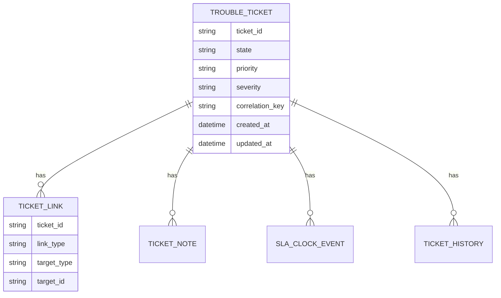
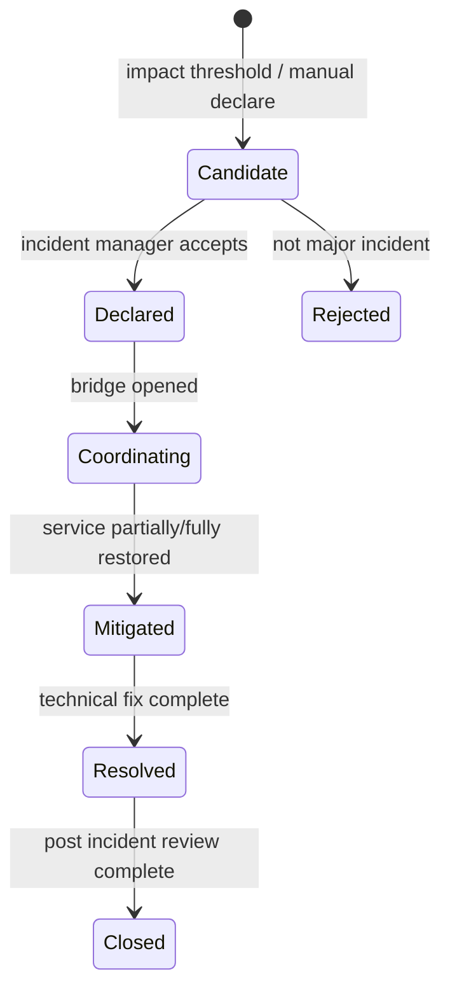
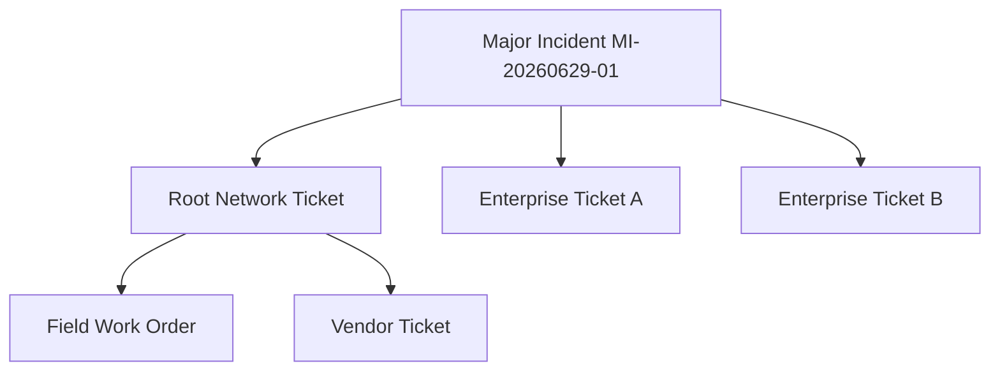

# Part 024 — Trouble Ticket & Incident Lifecycle

Part 023 membahas alarm sebagai managed representation dari kondisi abnormal. Sekarang kita masuk ke artefak kerja yang mengubah insight menjadi tindakan: **trouble ticket** dan **incident**.

Di telco, trouble ticket bukan sekadar “support case”. Ticket adalah unit koordinasi lintas domain: NOC, field ops, customer care, enterprise support, vendor, partner provider, billing, SLA office, dan kadang regulator.

Jika alarm management menjawab:

> Apa yang rusak dan siapa terdampak?

Trouble ticket management menjawab:

> Siapa harus melakukan apa, sebelum kapan, dengan bukti apa, dan bagaimana pelanggan/partner diberi tahu?

---

## 1. Kaufman Target Performance

Setelah part ini, target performa Anda adalah mampu:

1. Mendesain trouble ticket lifecycle yang sesuai operasi telco.
2. Memisahkan alarm, ticket, work order, incident, complaint, dan case.
3. Mendesain SLA clock yang benar: pause, resume, breach, escalation.
4. Membuat assignment/routing model berbasis domain, skill, geography, priority, dan impact.
5. Mendesain closure evidence, customer confirmation, dan post-incident data.
6. Menghindari duplicate ticket, zombie ticket, dan premature closure.
7. Mengimplementasikan state machine ticket di Java dengan auditability dan idempotency.
8. Menghubungkan ticket dengan alarm, impact, customer communication, work order, field service, dan major incident.

---

## 2. Mental Model: Ticket Is a Work Contract

Trouble ticket harus dipahami sebagai **work contract**, bukan hanya record.

Ticket menyimpan:

- problem statement;
- affected entity;
- priority/severity;
- ownership;
- SLA target;
- lifecycle state;
- investigation history;
- customer/partner communication;
- linked alarms/services/resources/orders;
- resolution evidence;
- closure reason;
- audit trail.



Ticket yang baik membuat pekerjaan bisa dilanjutkan oleh tim lain tanpa kehilangan konteks.

---

## 3. Ticket vs Incident vs Work Order vs Complaint

| Artefak | Tujuan | Owner umum | Contoh |
|---|---|---|---|
| Trouble Ticket | Mengelola gangguan/masalah sampai resolved | NOC/support/partner ops | Broadband customer cannot connect |
| Incident | Koordinasi gangguan signifikan lintas tim | Incident commander / major incident manager | Regional outage |
| Work Order | Eksekusi pekerjaan lapangan/teknis spesifik | Field workforce / technician | Replace ONT, repair fiber |
| Complaint | Keluhan formal/customer dissatisfaction | Customer care/regulatory team | Repeated outage complaint |
| Change | Perubahan terencana | Change manager/network ops | Upgrade router software |
| Problem | RCA jangka panjang untuk penyebab berulang | Problem manager | Repeated BNG crash pattern |

Boundary:

- Satu incident bisa memiliki banyak trouble ticket.
- Satu trouble ticket bisa memicu beberapa work order.
- Satu alarm bisa linked ke ticket tanpa ticket baru.
- Satu customer complaint bisa refer ke ticket teknis.
- Satu change bisa menyebabkan ticket, tetapi bukan ticket itu sendiri.

---

## 4. Reference Model: TMF621 and Adjacent APIs

TM Forum **TMF621 Trouble Ticket Management API** memberikan standardized client interface untuk creating, tracking, dan managing trouble tickets. Dalam sistem nyata, TMF621 sering berinteraksi dengan:

- **TMF642 Alarm Management**: alarm-to-ticket;
- **TMF688 Event Management**: event-driven orchestration;
- **TMF681 Communication Management**: notification ke party/user;
- **TMF646 Appointment Management**: appointment bila butuh field visit;
- **TMF641 Service Order** dan **TMF622 Product Order**: korelasi dengan fulfillment;
- **TMF638/TMF639**: service/resource inventory untuk impact dan assignment;
- **TMF672 User Roles and Permissions** atau IAM internal: authorization;
- **TMF632 Party Management** dan **TMF629 Customer Management**: customer/party context.

Sekali lagi: gunakan standar sebagai interoperability boundary, bukan memaksa internal aggregate mengikuti semua field eksternal.

---

## 5. Trouble Ticket Lifecycle

Lifecycle sederhana:



Production lifecycle sering membutuhkan state tambahan:

| State | Meaning |
|---|---|
| `NEW` | Ticket dibuat, belum diverifikasi |
| `VALIDATED` | Scope dan basic data valid |
| `ASSIGNED` | Owner queue/team/person sudah ditentukan |
| `IN_PROGRESS` | Investigasi/perbaikan aktif |
| `PENDING_CUSTOMER` | Menunggu customer action/confirmation/access |
| `PENDING_VENDOR` | Menunggu vendor/partner/upstream provider |
| `PENDING_FIELD` | Menunggu field work/appointment/material |
| `PENDING_CHANGE` | Menunggu change window/remediation planned |
| `RESOLVED` | Solusi diterapkan, monitoring/confirmation berjalan |
| `CLOSED` | Ticket final closed dengan evidence |
| `REOPENED` | Masalah muncul kembali dalam reopen window |
| `CANCELLED` | Ticket invalid/duplicate/not needed |

Jangan terlalu banyak state jika operation tidak bisa membedakannya. State harus punya konsekuensi operasional.

---

## 6. Ticket Data Model

Minimal aggregate:

```java
public final class TroubleTicket {
    private final TroubleTicketId id;
    private TicketState state;
    private TicketPriority priority;
    private TicketSeverity severity;
    private String title;
    private String description;
    private AffectedEntity affectedEntity;
    private Assignment assignment;
    private SlaClock slaClock;
    private Resolution resolution;
    private Closure closure;
    private final List<TicketLink> links;
    private final List<TicketNote> notes;
    private final List<TicketHistory> history;

    public void assign(QueueId queueId, OperatorId actor, Instant at) {
        requireState(TicketState.VALIDATED, TicketState.REOPENED, TicketState.NEW);
        this.assignment = Assignment.toQueue(queueId, at);
        this.state = TicketState.ASSIGNED;
        history.add(TicketHistory.assigned(actor, queueId, at));
    }

    public void startWork(OperatorId actor, Instant at) {
        requireState(TicketState.ASSIGNED, TicketState.PENDING_VENDOR, TicketState.PENDING_CUSTOMER, TicketState.PENDING_FIELD);
        this.state = TicketState.IN_PROGRESS;
        slaClock.resume(at, "work_started");
        history.add(TicketHistory.stateChanged(actor, TicketState.IN_PROGRESS, at));
    }

    public void resolve(Resolution resolution, OperatorId actor, Instant at) {
        requireState(TicketState.IN_PROGRESS);
        if (!resolution.hasEvidence()) {
            throw new IllegalArgumentException("Resolution evidence is required");
        }
        this.resolution = resolution;
        this.state = TicketState.RESOLVED;
        slaClock.stopResolutionClock(at);
        history.add(TicketHistory.resolved(actor, resolution, at));
    }

    public void close(Closure closure, OperatorId actor, Instant at) {
        requireState(TicketState.RESOLVED);
        if (!closure.isValidFor(resolution)) {
            throw new IllegalArgumentException("Closure must match resolution evidence");
        }
        this.closure = closure;
        this.state = TicketState.CLOSED;
        history.add(TicketHistory.closed(actor, closure, at));
    }
}
```

Key invariant:

- ticket closed harus punya resolution;
- ticket resolved harus punya evidence;
- ticket pending harus punya reason;
- ticket reopened harus punya reopen reason;
- ticket cancelled harus punya cancellation reason;
- assignment change harus diaudit;
- priority change harus diaudit dan punya reason;
- customer-affecting ticket tidak boleh silent close tanpa policy.

---

## 7. Priority vs Severity vs Impact vs Urgency

Banyak sistem gagal karena mencampur priority dan severity.

| Dimension | Meaning | Example |
|---|---|---|
| Severity | Tingkat teknis masalah | Core router down, single CPE offline |
| Impact | Siapa/berapa yang terdampak | 10.000 customers, 1 VIP enterprise |
| Urgency | Seberapa cepat harus ditangani | SLA 2 jam, regulatory deadline |
| Priority | Keputusan scheduling/queue | P1/P2/P3/P4 |

Formula umum:

```text
priority = f(severity, impact, urgency, SLA, customer tier, regulatory risk, recurrence)
```

Contoh policy:

```text
P1 if:
  - CRITICAL severity and affectedCustomers > 5000
  - or any emergency service affected
  - or gold enterprise outage with SLA < 2h
  - or regulator-facing incident

P2 if:
  - MAJOR service affecting
  - or repeated customer outage within 30 days

P3 if:
  - single customer degradation without premium SLA

P4 if:
  - non-service-affecting request or low-risk defect
```

Priority harus bisa berubah saat impact berubah. Tetapi perubahan priority harus versioned dan audited.

---

## 8. SLA Clock Semantics

SLA clock adalah sumber sengketa. Desainnya harus eksplisit.

Ada beberapa clock:

| Clock | Meaning |
|---|---|
| Response clock | waktu sampai ticket diacknowledge/assigned/responded |
| Resolution clock | waktu sampai service restored/resolved |
| Customer update clock | interval update customer |
| Vendor clock | waktu provider/vendor merespons |
| Field arrival clock | waktu sampai teknisi hadir |

SLA tidak boleh hanya field `dueDate`.



### 8.1 Pause Rules

Tidak semua pending state boleh pause SLA.

| Pending reason | Pause SLA? | Note |
|---|---:|---|
| Waiting customer access | Usually yes | must capture evidence |
| Waiting internal team | No | internal delay tetap tanggung jawab CSP |
| Waiting vendor/upstream | Depends | commercial SLA may continue; operational sub-clock may pause |
| Waiting field appointment customer-selected | Maybe | depends contract |
| Waiting maintenance window | Usually no for unplanned outage | unless agreed |

Simpan SLA decision sebagai audit record:

```json
{
  "clock": "RESOLUTION",
  "action": "PAUSE",
  "reason": "WAITING_CUSTOMER_ACCESS",
  "policyVersion": "sla-policy-enterprise-2026.06",
  "at": "2026-06-29T11:00:00Z",
  "evidenceRef": "call-recording-883812"
}
```

---

## 9. Assignment and Routing

Assignment bukan hanya round-robin.

Routing inputs:

- affected domain: RAN, transport, IP core, fixed access, BSS, charging, billing;
- geography/site/region;
- technology: GPON, DOCSIS, LTE, 5G SA, MPLS, SD-WAN;
- customer segment: consumer, SME, enterprise, wholesale;
- SLA/tier;
- alarm root cause;
- recent change owner;
- vendor/partner ownership;
- field workforce zone;
- skill/certification;
- queue load;
- time of day/on-call schedule.

Example decision:

```java
public record AssignmentDecision(
    QueueId queueId,
    Optional<OperatorId> assignee,
    List<String> reasons,
    String policyVersion
) {}
```

Policy example:

```text
IF affectedDomain = ACCESS_FIBER
AND probableCause = FIBER_CUT
AND region = JKT_EAST
THEN queue = FIELD_FIBER_JKT_EAST

IF enterpriseGoldCustomer = true
THEN add watcher = ENTERPRISE_SUPPORT

IF recentChangeOwner exists within 2h
THEN add watcher = CHANGE_OWNER
```

---

## 10. Ticket Creation from Alarm

Alarm-to-ticket creation must be idempotent.

Bad design:

```java
if (alarm.isCritical()) {
    ticketClient.createTicket(alarm);
}
```

Good design:

```java
public TicketIntent decideTicketIntent(AlarmImpact impact, Alarm alarm) {
    TicketCorrelationKey key = TicketCorrelationKey.rootAlarm(alarm.rootAlarmId());

    if (ticketRepository.existsActiveByCorrelationKey(key)) {
        return TicketIntent.linkExisting(key, alarm.id());
    }

    if (policy.requiresTicket(alarm, impact)) {
        return TicketIntent.create(
            key,
            titleFrom(alarm, impact),
            priorityFrom(alarm, impact),
            linksFrom(alarm, impact)
        );
    }

    return TicketIntent.none("Policy does not require ticket");
}
```

Correlation key examples:

```text
ROOT_ALARM:alm-20260629-000940
CUSTOMER_SERVICE:svc-88212:connectivity_down
ENTERPRISE_SITE:site-4412:wan_outage
PARTNER_CIRCUIT:partner-x:circuit-ABCD:loss_of_signal
```

---

## 11. Customer-Initiated Ticket

Tidak semua ticket berasal dari alarm. Banyak berasal dari customer care, portal, enterprise API, atau partner.

Flow:



Important:

- validate customer entitlement;
- check active outage before creating duplicate;
- capture symptom in customer language;
- map customer service to service inventory;
- avoid exposing internal alarm IDs externally;
- communicate customer-facing reference ID.

Example:

```text
Customer says: "Internet mati."
System maps:
- customer account: CA-1182
- product inventory: broadband subscription PI-881
- service inventory: CFS broadband SVC-552
- resource: ONT-998, OLT-112/PON-3/1
- active root alarm: AGG-JKT-19 uplink down
Action:
- link customer case to active network ticket
- do not create separate field ticket
- send outage notification with estimated update schedule
```

---

## 12. Ticket Linking Model

Tickets must link to many entities.



Common link types:

| Link Type | Target |
|---|---|
| `AFFECTS_SERVICE` | Service inventory item |
| `AFFECTS_RESOURCE` | Resource inventory item |
| `AFFECTS_PRODUCT` | Product inventory item/subscription |
| `AFFECTS_CUSTOMER` | Customer/account |
| `CAUSED_BY_ALARM` | Alarm/root alarm |
| `RELATED_ALARM` | Symptom alarm |
| `REQUIRES_WORK_ORDER` | Field work order |
| `RELATED_CHANGE` | Change request |
| `RELATED_ORDER` | Product/service order |
| `PART_OF_INCIDENT` | Major incident |
| `DUPLICATE_OF` | Existing ticket |
| `PARENT_OF` / `CHILD_OF` | Ticket hierarchy |

Link model harus typed. Jangan hanya field `relatedId` string.

---

## 13. Notes, Comments, and Audit

Pisahkan:

| Artifact | Purpose | Editable? |
|---|---|---:|
| Note | Human-entered progress note | Usually append-only |
| Comment | Customer/partner-visible discussion | Append-only/moderated |
| History | System audit state/action log | Immutable |
| Evidence | Proof attachment/reference | Immutable after closure |
| Internal diagnosis | Technical details not customer-visible | Controlled |

Audit history minimal:

```json
{
  "action": "PRIORITY_CHANGED",
  "from": "P3",
  "to": "P1",
  "actor": "system:impact-policy",
  "reason": "affectedCustomers increased from 120 to 8200",
  "at": "2026-06-29T11:12:44Z",
  "policyVersion": "priority-policy-2026.06"
}
```

Regulated/enterprise contexts membutuhkan evidence kuat untuk:

- who changed what;
- why;
- based on what data;
- when;
- what customer was told;
- whether SLA was breached;
- whether closure was justified.

---

## 14. Resolution and Closure

Resolution bukan closure.

```text
Resolved = technical/service restoration or workaround applied.
Closed = ticket finalization accepted by policy/customer/operator.
```

Resolution evidence examples:

- alarm cleared and stable for 15 minutes;
- service probe success;
- customer CPE reachable;
- field technician completion photo/signoff;
- vendor RFO received;
- customer confirmation;
- billing adjustment created;
- workaround applied and approved.

Closure reason examples:

| Closure reason | Meaning |
|---|---|
| `FIXED` | Root/service issue repaired |
| `WORKAROUND_APPLIED` | Temporary workaround accepted |
| `DUPLICATE` | Another ticket owns work |
| `NO_FAULT_FOUND` | Cannot reproduce; evidence required |
| `CUSTOMER_CANCELLED` | Customer withdraws request |
| `OUT_OF_SCOPE` | Not CSP responsibility |
| `AUTO_CLOSED` | Policy-based after stability window |

Anti-pattern:

> Close ticket when technician clicks “done” without service verification.

Better:

```text
Technician completion -> ticket resolved candidate -> service verification -> customer/monitoring confirmation -> closed
```

---

## 15. Reopen Semantics

Reopen harus dikontrol.

Reopen condition:

```text
If same issue recurs within reopen window and affected entity matches, reopen existing ticket instead of creating new ticket.
```

Example reopen window:

| Ticket type | Reopen window |
|---|---:|
| Consumer broadband outage | 24–72 hours |
| Enterprise SLA outage | 7 days |
| Repeated intermittent issue | 14–30 days |
| Billing/charging dispute | billing cycle dependent |

Reopen must store:

- reopen reason;
- triggering event/customer complaint;
- time since closure;
- whether SLA clock restarts or continues;
- whether priority should be escalated;
- whether problem management should be triggered.

---

## 16. Escalation

Escalation types:

| Type | Meaning |
|---|---|
| Functional escalation | move to more capable team |
| Hierarchical escalation | notify manager/incident owner |
| SLA escalation | due date approaching/breached |
| Customer escalation | VIP/regulatory/customer complaint |
| Technical escalation | vendor/product engineering needed |
| Incident escalation | convert/link to major incident |

Escalation policy example:

```text
IF P1 and unassigned for > 5 minutes -> notify NOC lead
IF P1 and no progress note for > 15 minutes -> escalate to incident manager
IF enterprise SLA breach risk > 80% -> notify service manager
IF repeated reopen count >= 3 -> create problem candidate
```

Escalation should create tasks/notifications, not just send email.

---

## 17. Major Incident Lifecycle

Incident is coordination, not simply high priority ticket.

Major incident state machine:



Incident data:

- incident commander;
- affected domains;
- linked root tickets;
- impact summary;
- timeline;
- communication cadence;
- executive updates;
- regulator/customer commitments;
- mitigation actions;
- root cause analysis;
- post-incident actions.

A single major incident can group many tickets:



---

## 18. Customer Communication

Communication must be policy-driven.

Triggers:

- ticket created;
- ticket assigned;
- major update;
- SLA breach risk;
- appointment booked;
- field technician en route;
- service restored;
- ticket closed;
- incident declared/resolved;
- RFO available.

Communication payload should be customer-safe:

```text
Bad:
"AGG-JKT-19 BGP adjacency flap due to vendor card failure."

Better:
"We detected a network issue affecting broadband services in your area. Our field and network teams are working on restoration. Next update: 14:00 WIB."
```

Use communication abstraction:

```java
public record CommunicationIntent(
    PartyRef recipient,
    CommunicationTemplate template,
    Map<String, String> variables,
    CommunicationChannel channel,
    TroubleTicketId ticketId
) {}
```

Communication history is evidence. Store:

- recipient;
- channel;
- template version;
- message content or content hash;
- send status;
- timestamp;
- failure reason;
- opt-out/consent status if relevant.

---

## 19. Partner and Wholesale Tickets

Partner tickets require extra care.

Differences from internal tickets:

- external reference mapping;
- SLA may be governed by interconnect/wholesale agreement;
- status mapping between systems;
- information visibility restrictions;
- attachment/evidence exchange;
- escalation path across organizations;
- dispute and settlement implications.

State mapping example:

| Internal state | Partner state |
|---|---|
| `NEW` | `acknowledged` |
| `ASSIGNED` | `inProgress` |
| `PENDING_VENDOR` | `held` |
| `RESOLVED` | `resolved` |
| `CLOSED` | `closed` |

Never expose internal queue names, vendor details, or unrelated customer impact to partner APIs.

---

## 20. Java Workflow Implementation Options

Ticket lifecycle bisa diimplementasikan dengan beberapa pendekatan.

### 20.1 Aggregate + Domain Methods

Cocok jika lifecycle cukup jelas dan team ingin strong invariants.

```java
class TroubleTicket {
    void assign(...)
    void startWork(...)
    void pend(...)
    void resolve(...)
    void close(...)
}
```

### 20.2 State Machine Library

Cocok jika transition banyak dan ingin declarative transition guard.

```text
Transition: IN_PROGRESS -> PENDING_VENDOR
Guard: pendingReason required
Action: pause vendor sub-clock, notify vendor coordinator
```

### 20.3 BPMN/Workflow Engine

Cocok jika ticket resolution melibatkan banyak human task, approval, timer, escalation, dan cross-system orchestration.

Gunakan workflow engine untuk process orchestration, tetapi tetap simpan ticket sebagai domain aggregate. Jangan jadikan workflow variables sebagai source of truth utama.

Recommended split:

```text
Ticket aggregate = state, invariant, audit, lifecycle truth
Workflow engine = tasks, timers, human work orchestration
Event bus = integration and async side effects
```

---

## 21. Command Design

Commands harus semantik, bukan CRUD mentah.

Good commands:

```text
CreateTroubleTicket
ValidateTroubleTicket
AssignTroubleTicket
StartInvestigation
PlaceTicketOnHold
ResumeTicket
AddDiagnosticNote
LinkAlarmToTicket
EscalateTicket
ResolveTicket
CloseTicket
ReopenTicket
CancelTicketAsDuplicate
```

Bad commands:

```text
PATCH /ticket/{id} { "state": "CLOSED" }
```

PATCH bebas membuat invariant bocor. External API bisa terlihat RESTful, tetapi internal application layer harus command-based.

---

## 22. Idempotency and Concurrency

Ticket system menerima trigger dari:

- alarm policy;
- customer care;
- portal;
- mobile app;
- partner API;
- field app;
- batch reconciliation;
- incident bridge;
- workflow timer.

Concurrency cases:

1. Alarm policy membuat ticket saat customer care juga membuat ticket.
2. Field app resolve saat NOC reopen.
3. Vendor update pending saat SLA timer escalates.
4. Duplicate alarm tries to create duplicate ticket.
5. Customer confirms restored while monitoring still failing.

Controls:

- correlation key unique for active tickets;
- optimistic locking on ticket aggregate;
- idempotency key for external create/update;
- transition guard;
- command audit;
- reconciliation job for mismatched states;
- merge/duplicate workflow.

Example unique constraint:

```sql
CREATE UNIQUE INDEX uq_active_ticket_correlation
ON trouble_ticket(correlation_key)
WHERE state NOT IN ('CLOSED', 'CANCELLED');
```

---

## 23. Query Model for Operations

Ticket command model tidak harus sama dengan query model.

NOC membutuhkan:

- active P1/P2 tickets;
- tickets by queue;
- SLA breach risk;
- tickets by customer/site;
- tickets linked to incident;
- tickets waiting vendor/customer;
- tickets with no update within threshold;
- reopened tickets;
- duplicate candidates;
- tickets by alarm/root cause.

Read model example:

```text
ticket_ops_view
- ticket_id
- external_ref
- state
- priority
- queue
- assignee
- affected_customer_count
- affected_enterprise_count
- sla_due_at
- sla_breach_risk
- last_note_at
- last_customer_update_at
- incident_id
- root_alarm_id
```

Jangan query langsung dari event history untuk dashboard utama. Materialize operational view.

---

## 24. Metrics for Ticket Operations

Metrics:

| Metric | Meaning |
|---|---|
| `tickets_created_total` | volume intake |
| `tickets_by_priority` | workload severity |
| `ticket_assignment_latency_seconds` | time to assign |
| `ticket_first_response_latency_seconds` | response SLA |
| `ticket_resolution_latency_seconds` | resolution time |
| `ticket_reopen_total` | quality signal |
| `ticket_duplicate_total` | correlation quality |
| `ticket_sla_breach_total` | SLA failure |
| `ticket_pending_duration_seconds` | blocked work |
| `ticket_no_update_age_seconds` | stale ticket risk |
| `incident_declared_total` | major incident volume |

Do not only measure average resolution time. Percentiles and breach risk matter more.

---

## 25. Anti-Patterns

### 25.1 Ticket as Generic Case Table

One table with arbitrary JSON fields for every workflow.

Result:

- no invariant;
- bad SLA logic;
- poor reporting;
- unpredictable state transitions.

### 25.2 State Change by UI Dropdown

Operator can move any ticket to any state.

Result:

- closed without resolution;
- pending without reason;
- SLA manipulated;
- audit weak.

### 25.3 One Alarm, One Ticket

Result:

- thousands of duplicate tickets during outage;
- NOC overloaded;
- no root cause grouping.

### 25.4 Auto-Close Too Early

Result:

- reopen storm;
- customer dissatisfaction;
- SLA dispute.

### 25.5 Pending State Abuse

All delayed tickets moved to pending to hide SLA risk.

Mitigation:

- pending reason taxonomy;
- pause eligibility policy;
- evidence requirement;
- manager dashboard for long pending.

### 25.6 Customer Communication as Side Email

Result:

- no communication evidence;
- inconsistent messaging;
- regulatory/commercial risk.

---

## 26. Practice: Design Ticket Lifecycle for Enterprise Fiber Outage

Scenario:

- Enterprise customer reports WAN down at branch site.
- Alarm exists for transport circuit loss.
- Root cause likely partner last-mile provider.
- SLA restoration target: 4 hours.
- Customer requires update every 30 minutes.
- Field visit may be required.

Design:

1. ticket creation command;
2. correlation key;
3. linked entities;
4. initial priority;
5. SLA clocks;
6. assignment queue;
7. partner ticket mapping;
8. communication schedule;
9. pending vendor rules;
10. closure evidence.

Expected answer:

```text
Create one enterprise trouble ticket linked to customer service, circuit resource, root alarm, and partner provider.
Priority P1 or P2 depending contract and impact.
Start response and resolution clocks at report/auto-detect time according to SLA policy.
Assign to enterprise transport queue; create partner ticket with external reference.
Customer update timer every 30 minutes.
Pending vendor may start vendor sub-clock, but customer-facing SLA may continue unless contract allows pause.
Resolve only after circuit restored and service probe passes.
Close after customer confirmation or monitoring stability window.
```

---

## 27. Engineering Checklist

Before shipping trouble ticket lifecycle:

- [ ] ticket lifecycle state machine explicit;
- [ ] transition guards implemented;
- [ ] audit trail immutable;
- [ ] priority/severity/impact/urgency separated;
- [ ] SLA clocks modeled as events, not only due date;
- [ ] pending reason taxonomy defined;
- [ ] SLA pause policy versioned;
- [ ] assignment policy explainable;
- [ ] alarm-to-ticket idempotency key exists;
- [ ] duplicate ticket detection exists;
- [ ] link model typed;
- [ ] closure evidence required;
- [ ] reopen policy defined;
- [ ] customer communication logged;
- [ ] partner ticket state mapping defined;
- [ ] incident escalation rule defined;
- [ ] stale ticket dashboard exists;
- [ ] query model optimized;
- [ ] authorization by queue/customer/domain enforced;
- [ ] external visibility controlled.

---

## 28. Key Takeaways

1. Trouble ticket adalah work contract, bukan record CRUD.
2. Incident adalah koordinasi lintas tim, bukan sekadar P1 ticket.
3. Severity, impact, urgency, dan priority harus dipisah.
4. SLA clock harus berbasis event dan policy, bukan hanya due date.
5. Alarm-to-ticket harus idempotent dan root-cause aware.
6. Closure membutuhkan evidence.
7. Pending state harus dikontrol agar tidak menjadi tempat menyembunyikan SLA breach.
8. Java implementation harus command-based, audited, concurrent-safe, dan workflow-aware.

---

## 29. References

- TM Forum — TMF621 Trouble Ticket Management API.
- TM Forum — TMF642 Alarm Management API.
- TM Forum — TMF688 Event Management API.
- TM Forum — TMF681 Communication Management API.
- TM Forum — TMF646 Appointment Management API.
- TM Forum — TMF638 Service Inventory Management API.
- TM Forum — TMF639 Resource Inventory Management API.

