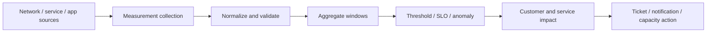
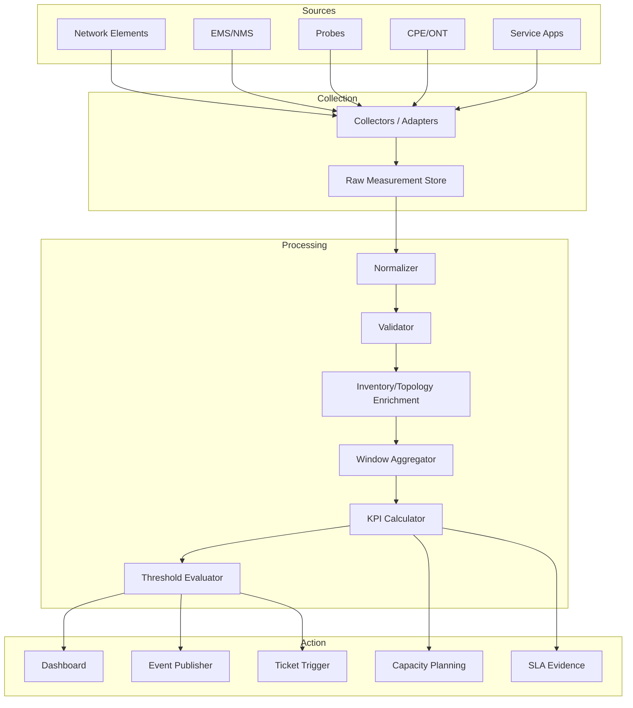
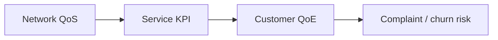
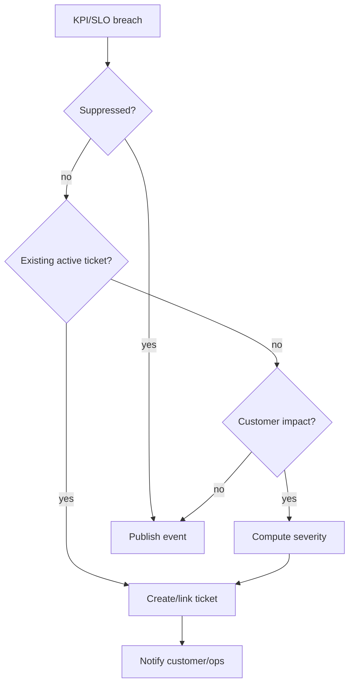
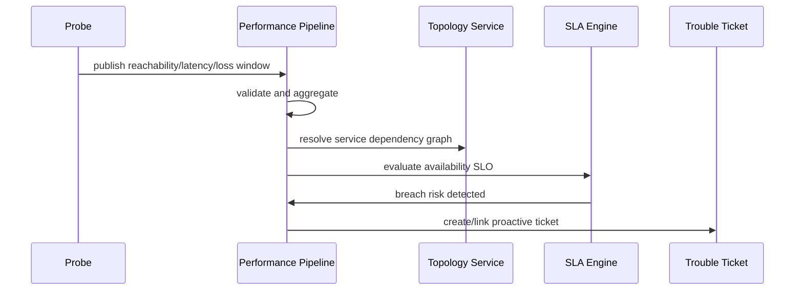

# Part 025 — Performance, QoS, QoE & KPI Pipelines

Part 023 dan Part 024 membahas **fault/alarm** dan **trouble ticket**. Keduanya berangkat dari kondisi yang sudah terlihat sebagai problem. Part ini membahas sisi lain dari assurance: **performance management** dan **service quality management**.

Di telco, tidak semua degradasi muncul sebagai alarm. Banyak masalah muncul sebagai pola:

- throughput turun perlahan;
- latency meningkat hanya di jam sibuk;
- packet loss terjadi hanya untuk segmen tertentu;
- voice drop meningkat di cell tertentu;
- video buffering naik untuk customer tier tertentu;
- SLA enterprise hampir breach walaupun belum ada incident besar;
- kapasitas sudah mendekati saturasi tetapi belum fault.

Alarm menjawab:

> Apa yang sedang abnormal secara event/fault?

Performance dan quality pipeline menjawab:

> Apakah layanan masih memenuhi kualitas yang dijanjikan, untuk siapa, di mana, dan sampai kapan kondisi ini aman?

---

## 1. Kaufman Target Performance

Setelah part ini, target performa Anda adalah mampu:

1. Membedakan metric, counter, gauge, KPI, KQI, QoS, QoE, SLO, SLA, dan threshold.
2. Mendesain pipeline ingestion untuk performance measurement carrier-grade.
3. Mendesain aggregation window, lateness handling, watermark, dan backfill.
4. Menentukan authoritative metric grain: raw, normalized, aggregated, customer-facing.
5. Menghubungkan measurement dengan service, resource, topology, customer, dan ticket.
6. Mendesain thresholding dan anomaly detection tanpa menciptakan alert storm.
7. Menyimpan evidence SLA yang defensible untuk enterprise/regulatory context.
8. Mengimplementasikan Java components untuk KPI pipeline dengan idempotency, auditability, dan replayability.
9. Menghindari kesalahan umum: average-of-average, wrong denominator, metric drift, dimension explosion, dan false precision.

---

## 2. Mental Model: Performance Is Not Observability

Kita sudah punya seri Java observability. Namun **telco performance management** bukan sekadar application observability.

Application observability mengukur sistem software:

- request rate;
- error rate;
- latency;
- heap;
- GC;
- thread pool;
- trace span;
- database time.

Telecom performance management mengukur **network/service/customer quality**:

- radio access utilization;
- packet loss;
- jitter;
- call setup success rate;
- session drop rate;
- P95 latency per APN/slice/enterprise site;
- bandwidth usage per service instance;
- ONT optical power;
- BNG session count;
- cell congestion;
- SLA availability;
- quality score.

Keduanya bisa memakai pipeline teknologi yang mirip, tetapi model domainnya berbeda.



Ingat invariant utama:

> Metric tidak bernilai operasional sampai Anda tahu grain, window, denominator, dimension, ownership, dan action-nya.

---

## 3. Core Vocabulary

### 3.1 Measurement

Measurement adalah nilai observasi terhadap objek tertentu pada waktu tertentu.

Contoh:

```text
resourceId     = cell-123
metricName     = downlink_prb_utilization
value          = 82.4
unit           = percent
observedAt     = 2026-06-29T10:00:00+07:00
window         = PT5M
source         = ran-pm-adapter-a
```

Measurement harus punya minimal:

- subject: apa yang diukur;
- metric name: apa variabelnya;
- value;
- unit;
- time/window;
- source;
- quality flag.

Tanpa ini, measurement akan menjadi angka tanpa konteks.

### 3.2 Counter, Gauge, Event, Sample

| Jenis | Makna | Contoh | Trap |
|---|---|---|---|
| Counter | Nilai meningkat kumulatif | total dropped calls | reset counter harus dideteksi |
| Gauge | Nilai saat ini | active sessions | jangan di-sum antar waktu tanpa makna |
| Event | Kejadian diskrit | session dropped | perlu deduplication |
| Sample | Observasi periodik | latency sample | perlu sampling bias handling |

Counter sering perlu dihitung sebagai delta:

```text
success_rate = (success_delta / attempt_delta) * 100
```

Bukan:

```text
success_rate = average(success_counter)
```

### 3.3 KPI

KPI adalah metric yang sudah diberi makna operasional/bisnis.

Contoh:

- call setup success rate;
- drop call rate;
- average throughput;
- availability;
- mean time to restore;
- percent service orders completed within SLA;
- packet loss over enterprise access link.

KPI tidak hanya angka. KPI harus punya:

- definition;
- formula;
- denominator;
- inclusion/exclusion criteria;
- aggregation rule;
- target threshold;
- owner;
- escalation policy;
- evidence retention.

### 3.4 KQI

KQI atau Key Quality Indicator lebih dekat ke pengalaman layanan.

Contoh:

- video streaming quality score;
- VoLTE call quality;
- enterprise VPN quality;
- broadband browsing experience;
- gaming latency experience.

KQI biasanya turunan dari beberapa KPI:

```text
Broadband QoE Score = f(latency, packetLoss, jitter, throughput, outageMinutes, customerTier)
```

### 3.5 QoS

QoS adalah kualitas teknis yang bisa dikontrol/dijamin oleh network policy.

Contoh:

- latency bound;
- bandwidth class;
- priority class;
- packet delay budget;
- guaranteed bit rate;
- access class;
- slice/service profile.

QoS menjawab:

> Apa perlakuan teknis yang diberikan network terhadap traffic/service ini?

### 3.6 QoE

QoE adalah kualitas yang dirasakan user/customer.

QoE menjawab:

> Apakah customer merasakan layanan ini baik?

QoE bisa turun walaupun QoS terlihat normal, karena:

- CPE bermasalah;
- Wi-Fi rumah buruk;
- aplikasi pihak ketiga lambat;
- device customer bermasalah;
- DNS/resolver bermasalah;
- konten/CDN tertentu bermasalah;
- congestion hanya terjadi pada jalur tertentu.

### 3.7 SLO dan SLA

SLO adalah target objektif internal/kontraktual. SLA adalah komitmen formal yang punya konsekuensi.

Contoh:

```text
SLO: Monthly availability >= 99.95%
SLA: Jika monthly availability < 99.95%, customer berhak service credit 10%.
```

SLA membutuhkan evidence yang defensible:

- data source jelas;
- formula jelas;
- time zone jelas;
- exclusion window jelas;
- maintenance window jelas;
- customer-impact scope jelas;
- audit trail perubahan jelas.

---

## 4. TM Forum Reference Boundary

Dalam ekosistem TM Forum, beberapa API/area yang relevan:

- **TMF628 Performance Management**: standardized mechanism untuk performance management seperti measurement production job, measurement collection job, ad hoc collection, dan event notification.
- **TMF657 Service Quality Management**: akses ke Service Level Specifications, Service Level Objectives, dan threshold terkait.
- **TMF649 Performance Thresholding Management**: boundary untuk thresholding performance.
- **TMF688 Event Management**: event enterprise untuk automation, outage, SLA violation, trigger trouble ticket, dan orchestration.
- **TMF621 Trouble Ticket Management**: ticket saat threshold/SLA/quality issue harus ditindak.
- **TMF638 Service Inventory** dan **TMF639 Resource Inventory**: mapping measurement ke service/resource.
- **TMF686 Topology Management**: graph overlay relasi untuk correlation dan impact.

Jangan salah paham: Anda tidak harus menyalin API ini menjadi internal table. Pakai sebagai **external contract** dan **semantic reference**.

---

## 5. Measurement Grain

Kesalahan paling mahal dalam KPI pipeline adalah grain yang kabur.

Grain adalah level detail natural dari data.

Contoh grain:

| Domain | Grain contoh |
|---|---|
| RAN | cell, sector, carrier, band, gNodeB, tracking area |
| Core | UPF, AMF, SMF, PCF, CHF, APN/DNN, slice |
| Fixed access | OLT, PON port, ONT, splitter, service port |
| IP/MPLS | router, interface, VRF, LSP, BGP peer |
| Broadband | subscriber session, BNG, access loop, CPE |
| Enterprise | site, circuit, UNI, EVC, VPN, service instance |
| Customer | product instance, service instance, billing account |

Setiap KPI harus menyatakan grain input dan grain output.

Contoh:

```text
Input grain:
  cellId + 5-minute window

Output grain:
  region + 1-hour window

Aggregation:
  weighted average by traffic volume
```

Bukan:

```text
average all cell utilizations by region
```

Karena cell dengan traffic besar dan cell kecil tidak boleh punya bobot sama jika metric mewakili customer experience.

---

## 6. Time Model

Performance pipeline harus membedakan beberapa waktu.

| Waktu | Makna |
|---|---|
| observedAt | waktu kondisi terjadi/diukur |
| collectedAt | waktu collector mengambil data |
| receivedAt | waktu platform menerima data |
| processedAt | waktu pipeline memproses data |
| publishedAt | waktu hasil dipublikasikan |
| effectiveWindow | periode yang diwakili measurement |

Model Java minimal:

```java
public record MeasurementTime(
    Instant observedAt,
    Instant collectedAt,
    Instant receivedAt,
    Instant processedAt,
    Instant windowStart,
    Instant windowEnd,
    ZoneId sourceTimeZone
) {
    public MeasurementTime {
        if (!windowStart.isBefore(windowEnd)) {
            throw new IllegalArgumentException("windowStart must be before windowEnd");
        }
    }
}
```

### Lateness

Data telco sering terlambat karena:

- NE tidak reachable;
- file batch terlambat;
- mediation backlog;
- vendor EMS maintenance;
- timezone conversion error;
- backfill setelah outage collector.

Pipeline harus punya policy:

| Policy | Cocok untuk |
|---|---|
| strict cutoff | dashboard near-real-time |
| watermark + late update | KPI operational |
| backfill correction | SLA evidence |
| immutable correction record | regulatory/enterprise dispute |

Jangan overwrite agregat historis tanpa correction trail.

---

## 7. Metric Quality Flag

Tidak semua measurement setara. Setiap data point perlu quality flag.

Contoh:

```text
VALID
MISSING
PARTIAL
ESTIMATED
LATE
DUPLICATE
OUT_OF_RANGE
COUNTER_RESET
SOURCE_UNAVAILABLE
RECALCULATED
```

Quality flag penting karena KPI harus bisa menjawab:

- apakah angka ini valid;
- apakah data lengkap;
- apakah dihitung dari sample parsial;
- apakah ada backfill;
- apakah customer bisa dikenai SLA breach berdasar data ini;
- apakah evidence bisa dipakai dalam dispute.

Model:

```java
public enum MeasurementQuality {
    VALID,
    MISSING,
    PARTIAL,
    ESTIMATED,
    LATE,
    DUPLICATE,
    OUT_OF_RANGE,
    COUNTER_RESET,
    SOURCE_UNAVAILABLE,
    RECALCULATED
}
```

---

## 8. Architecture: Performance Pipeline



### Component boundary

| Component | Responsibility | Tidak boleh melakukan |
|---|---|---|
| Collector | Ambil data dari source | Mengubah definisi KPI |
| Normalizer | Ubah vendor format ke canonical measurement | Membuat ticket |
| Validator | Cek range, unit, duplicate, reset | Menentukan RCA |
| Enricher | Tambah service/resource/customer/topology context | Mengubah raw fact |
| Aggregator | Windowing dan rollup | Mengabaikan lateness policy |
| KPI Calculator | Formula KPI/KQI | Mengubah source data |
| Threshold Evaluator | Bandingkan KPI dengan SLO/threshold | Membuka ticket tanpa dedup policy |
| Evidence Store | Simpan hasil defensible | Menghapus correction history |

---

## 9. Raw Store vs KPI Store vs Evidence Store

Jangan campur semua dalam satu tabel.

### Raw Measurement Store

Menyimpan data sebagaimana diterima setelah minimal envelope normalization.

Tujuan:

- replay;
- audit;
- debugging;
- vendor dispute;
- backfill;
- formula recalculation.

### Normalized Measurement Store

Menyimpan metric dengan name/unit/dimension canonical.

Tujuan:

- query internal;
- reuse antar KPI;
- validation konsisten;
- cross-vendor comparison.

### KPI Store

Menyimpan hasil formula KPI.

Tujuan:

- dashboard;
- threshold evaluation;
- SLA monitoring;
- ticket trigger.

### Evidence Store

Menyimpan hasil yang sudah dipakai untuk keputusan formal.

Tujuan:

- SLA dispute;
- customer report;
- regulatory audit;
- executive reporting.

Invariant:

> Evidence store harus immutable secara bisnis. Correction harus berupa versi baru/correction event, bukan silent update.

---

## 10. Canonical Measurement Model

Contoh model minimal:

```java
public record Measurement(
    MeasurementId id,
    MeasurementSubject subject,
    MetricName metricName,
    BigDecimal value,
    UnitOfMeasure unit,
    MeasurementWindow window,
    Map<String, String> dimensions,
    MeasurementSource source,
    MeasurementQuality quality,
    Instant receivedAt,
    String idempotencyKey
) {}
```

Subject:

```java
public sealed interface MeasurementSubject
    permits ResourceSubject, ServiceSubject, CustomerSubject, SiteSubject {
}

public record ResourceSubject(String resourceId, String resourceType) implements MeasurementSubject {}
public record ServiceSubject(String serviceId, String serviceType) implements MeasurementSubject {}
public record CustomerSubject(String customerId) implements MeasurementSubject {}
public record SiteSubject(String siteId) implements MeasurementSubject {}
```

Metric definition:

```java
public record MetricDefinition(
    MetricName name,
    UnitOfMeasure canonicalUnit,
    MetricKind kind,
    Set<String> requiredDimensions,
    BigDecimal minValue,
    BigDecimal maxValue,
    AggregationPolicy aggregationPolicy
) {}

public enum MetricKind {
    COUNTER,
    GAUGE,
    RATE,
    RATIO,
    EVENT_COUNT,
    SCORE
}
```

---

## 11. Metric Naming

Metric naming harus stabil.

Buruk:

```text
latency
speed
drops
quality
usage
```

Lebih baik:

```text
ip.packet.loss.ratio
ip.round_trip.latency.p95_ms
voice.call.drop.rate
ran.prb.downlink.utilization.percent
broadband.session.active.count
enterprise.vpn.availability.percent
```

Rule naming:

1. domain prefix;
2. subject jelas;
3. measure jelas;
4. statistic jelas bila agregat;
5. unit jelas;
6. tidak mengandung vendor implementation detail;
7. tidak berubah saat source berubah.

---

## 12. Unit Normalization

Vendor A mengirim latency dalam `ms`, vendor B dalam `microseconds`, vendor C dalam `seconds`. Canonical metric harus punya unit tunggal.

```java
public interface UnitConverter {
    BigDecimal convert(BigDecimal value, UnitOfMeasure from, UnitOfMeasure to);
}
```

Untuk persen, hati-hati:

```text
0.82   bisa berarti 82% atau 0.82%
82     bisa berarti 82% atau raw ratio salah kirim
```

Rule:

- ratio disimpan 0..1;
- percent disimpan 0..100;
- metric definition wajib menentukan canonical unit;
- validator harus menolak range yang absurd kecuali ada explicit override.

---

## 13. Aggregation Window

Window umum:

- 1 minute;
- 5 minutes;
- 15 minutes;
- 1 hour;
- day;
- billing month;
- SLA month.

Window design harus menjawab:

- apakah tumbling, sliding, session, atau calendar window;
- timezone;
- lateness cutoff;
- correction policy;
- partial data rule;
- missing data rule.

```java
public record AggregationWindow(
    Instant start,
    Instant end,
    WindowKind kind,
    ZoneId calendarZone,
    Duration allowedLateness
) {}

public enum WindowKind {
    TUMBLING,
    SLIDING,
    SESSION,
    CALENDAR
}
```

### Average-of-average trap

Salah:

```text
region_latency_avg = average(cell_latency_avg)
```

Benar jika sample count tersedia:

```text
region_latency_avg = sum(cell_latency_avg * cell_sample_count) / sum(cell_sample_count)
```

Untuk percentile, lebih rumit. P95 gabungan tidak bisa dihitung dari average P95 setiap cell kecuali Anda punya distribution sketch/histogram.

---

## 14. Denominator Discipline

Banyak KPI telco rusak karena denominator tidak eksplisit.

Contoh call setup success rate:

```text
CSSR = successful_call_setups / attempted_call_setups
```

Pertanyaan:

- Apakah emergency call masuk?
- Apakah retry dihitung attempt baru?
- Apakah failure karena customer device dihitung?
- Apakah barred subscriber dihitung?
- Apakah network maintenance dikecualikan?
- Apakah roaming included?
- Apakah enterprise/private network included?

KPI definition harus menyimpan inclusion/exclusion rule.

```java
public record KpiDefinition(
    String kpiCode,
    String name,
    String formulaVersion,
    List<MetricName> inputs,
    String denominatorDefinition,
    List<String> inclusionRules,
    List<String> exclusionRules,
    AggregationPolicy aggregationPolicy,
    EvidencePolicy evidencePolicy
) {}
```

---

## 15. Thresholding

Threshold adalah decision boundary. Jangan treat threshold sebagai hard-coded number.

Jenis threshold:

| Jenis | Contoh | Catatan |
|---|---|---|
| Static | latency > 100ms | sederhana, rawan false positive |
| Time-of-day | busy hour threshold | cocok untuk traffic pattern |
| Baseline | > 2 sigma dari normal | butuh historical baseline |
| Percentile | P95 latency > target | cocok untuk user experience |
| Consecutive breach | 3 window berturut-turut | mengurangi noise |
| Burn rate | SLA budget burn terlalu cepat | cocok SLO monitoring |
| Multi-signal | latency tinggi + packet loss tinggi | lebih stabil |

Threshold model:

```java
public record ThresholdRule(
    String ruleId,
    String kpiCode,
    Scope scope,
    ThresholdExpression expression,
    Duration evaluationWindow,
    int consecutiveBreachesRequired,
    Severity severity,
    ActionPolicy actionPolicy,
    boolean enabled
) {}
```

### Hysteresis

Tanpa hysteresis, alarm kualitas bisa flapping.

```text
raise if packet_loss > 2.0% for 3 windows
clear if packet_loss < 1.0% for 3 windows
```

Raise threshold dan clear threshold sebaiknya berbeda.

---

## 16. SLO Burn Rate

SLO burn rate berguna untuk availability dan error budget.

Contoh:

```text
Monthly availability target = 99.95%
Allowed downtime per 30 days ≈ 21.6 minutes
```

Jika dalam 1 jam service sudah downtime 10 menit, service sudah membakar hampir setengah budget bulanan.

Burn rate membantu mendeteksi:

- breach yang belum terjadi tetapi hampir pasti terjadi;
- customer premium yang perlu prioritas;
- site enterprise yang sedang kritis;
- maintenance yang tidak boleh diperpanjang.

---

## 17. QoS and QoE Mapping

QoS tidak selalu sama dengan QoE.



Contoh fixed broadband:

| Layer | Metric |
|---|---|
| Access | optical power, line error, sync speed |
| IP | packet loss, latency, DNS success |
| Service | throughput, session stability |
| Experience | streaming stall, browsing delay |
| Business | complaint, churn risk, SLA credit |

QoE pipeline sering memerlukan kombinasi:

- network measurement;
- application probe;
- device telemetry;
- trouble ticket history;
- complaint data;
- customer tier;
- topology impact;
- order/change context.

---

## 18. SLA Evidence Design

SLA evidence harus defensible. Untuk enterprise telco, customer bisa menantang laporan SLA.

Evidence harus mencatat:

- contract/agreement reference;
- service instance;
- measurement source;
- formula version;
- time window;
- included outage minutes;
- excluded outage minutes;
- maintenance windows;
- force majeure exclusions bila ada;
- correction history;
- generated report version.

```java
public record SlaEvidence(
    String evidenceId,
    String agreementId,
    String serviceId,
    String sloCode,
    String formulaVersion,
    Instant periodStart,
    Instant periodEnd,
    BigDecimal computedValue,
    BigDecimal targetValue,
    SlaResult result,
    List<EvidenceSourceRef> sources,
    List<ExclusionRef> exclusions,
    Instant generatedAt
) {}
```

Anti-pattern:

- SLA report dihitung langsung dari dashboard query ad hoc;
- formula berubah tanpa versioning;
- maintenance exclusion ditambahkan manual tanpa audit;
- missing data dianggap service up;
- outage dihitung dari alarm, bukan customer impact;
- timezone tidak jelas.

---

## 19. From KPI Breach to Action

Tidak semua threshold breach harus membuat ticket.

Decision matrix:

| Kondisi | Action |
|---|---|
| single low-severity breach | dashboard / observation |
| repeated breach | event + watchlist |
| customer-impacting breach | trouble ticket |
| SLA burn rate high | proactive ticket / notification |
| capacity trend saturation | capacity planning item |
| correlated with active incident | link to incident, no duplicate ticket |
| maintenance window active | suppress or annotate |
| known planned degradation | customer notification only |

Pipeline action:



---

## 20. Java Component Blueprint

```text
performance-management-service
├── adapter
│   ├── ran
│   ├── core
│   ├── fixed
│   └── probe
├── application
│   ├── ingest
│   ├── normalize
│   ├── aggregate
│   ├── calculate
│   ├── threshold
│   └── evidence
├── domain
│   ├── measurement
│   ├── metricdefinition
│   ├── kpi
│   ├── threshold
│   ├── slo
│   └── evidence
├── infrastructure
│   ├── kafka
│   ├── objectstore
│   ├── timeseries
│   ├── relational
│   └── inventoryclient
└── api
    ├── ingestion
    ├── query
    ├── report
    └── admin
```

### Domain services

```java
public interface MeasurementIngestionService {
    IngestionResult ingest(RawMeasurementBatch batch);
}

public interface KpiCalculator {
    KpiResult calculate(KpiDefinition definition, MeasurementWindow window, Scope scope);
}

public interface ThresholdEvaluator {
    List<ThresholdBreach> evaluate(KpiResult result);
}

public interface SlaEvidenceService {
    SlaEvidence generateEvidence(SloDefinition slo, BillingPeriod period, ServiceId serviceId);
}
```

### Idempotency

Ingestion idempotency key:

```text
sourceSystem + sourceFileId + sourceRecordId
```

Atau:

```text
sourceSystem + subjectId + metricName + windowStart + windowEnd + dimensionsHash
```

Jangan gunakan `receivedAt` dalam idempotency key.

---

## 21. Storage Choices

| Data | Storage cocok | Catatan |
|---|---|---|
| raw files | object storage | murah, replayable |
| normalized measurements | time-series / columnar | high volume query |
| KPI result | time-series + relational index | dashboard dan threshold |
| definitions | relational/document | versioned config |
| evidence | relational/object immutable | audit dan report |
| events | Kafka/event log | action integration |

Jangan memilih storage hanya karena familiar. Pilih berdasarkan:

- write volume;
- query pattern;
- retention;
- correction need;
- auditability;
- replay cost;
- cardinality.

---

## 22. Dimension Explosion

Performance data bisa meledak karena dimension terlalu banyak.

Contoh buruk:

```text
metric = latency
labels = customerId, subscriberId, deviceId, appId, cellId, siteId, city, productId, planId, firmware, vendor, model, ip, sessionId
```

Masalah:

- storage mahal;
- query lambat;
- cardinality tak terkendali;
- dashboard tidak stabil;
- alert rule sulit;
- retention mahal.

Prinsip:

1. Bedakan **measurement dimension** dan **enrichment dimension**.
2. Simpan high-cardinality identifier di reference field, bukan label untuk semua query.
3. Precompute common rollup.
4. Gunakan topology/inventory join untuk impact, bukan menempel semua dimensi ke metric.
5. Retention berbeda untuk grain berbeda.

---

## 23. Missing Data Is Data

Jika measurement hilang, itu bukan berarti kualitas baik.

Missing data bisa berarti:

- collector down;
- network partition;
- NE down;
- vendor EMS tidak publish;
- credential expired;
- file corrupt;
- schema berubah;
- source decommissioned.

Policy:

| Kondisi | Perlakuan |
|---|---|
| missing single source | mark partial |
| missing critical source | raise platform data quality alarm |
| missing during customer outage | do not assume service up |
| missing during SLA report | include evidence caveat/correction |
| repeated missing | ticket collector/data platform |

Data quality alarm harus dipisahkan dari network alarm.

---

## 24. Performance Pipeline Failure Modes

| Failure | Gejala | Mitigasi |
|---|---|---|
| Duplicate records | KPI spike | idempotency + duplicate detection |
| Counter reset | negative delta | reset detection |
| Unit mismatch | KPI absurd | metric definition + validation |
| Late file | historical KPI changes | watermark + correction |
| Missing dimension | cannot map impact | quarantine + repair workflow |
| Schema drift | parser failure | schema registry + contract test |
| Cardinality explosion | storage cost spike | label governance |
| Average-of-average | wrong executive KPI | weighted aggregation |
| Wrong timezone | SLA dispute | explicit calendar zone |
| Silent backfill overwrite | audit failure | immutable correction |

---

## 25. KPI Formula Versioning

Formula berubah karena:

- regulatory change;
- contract change;
- vendor source change;
- new topology model;
- denominator correction;
- business policy change.

Formula versioning harus eksplisit.

```java
public record FormulaVersion(
    String formulaId,
    String version,
    Instant effectiveFrom,
    Instant effectiveTo,
    String expression,
    String approvedBy,
    Instant approvedAt
) {}
```

Aturan:

- hasil KPI menyimpan formula version;
- backfill menyimpan formula version yang dipakai;
- laporan SLA tidak boleh berubah diam-diam saat formula baru rilis;
- perubahan formula formal harus punya approval.

---

## 26. Example: Enterprise VPN Availability

### Requirement

Enterprise customer memiliki SLA:

```text
Monthly availability >= 99.95%
```

Service terdiri dari:

- primary access circuit;
- backup access circuit;
- PE router interface;
- CPE;
- VPN service instance;
- monitoring probe.

### Availability definition

```text
service unavailable if:
  primary path down AND backup path down
  OR VPN probe failure confirmed for 3 consecutive windows
  OR PE/CPE reachability failure confirmed and customer traffic affected
```

### Exclusion

- scheduled maintenance approved;
- customer power issue;
- customer CPE unplugged;
- force majeure if contract allows;
- customer-requested suspension.

### Pipeline



### Java decision

```java
public final class AvailabilityEvaluator {
    public AvailabilityResult evaluate(ServiceGraph graph, List<KpiResult> kpis, ExclusionCalendar exclusions) {
        boolean primaryDown = kpis.stream().anyMatch(k -> k.code().equals("PRIMARY_PATH_DOWN") && k.isBreached());
        boolean backupDown = kpis.stream().anyMatch(k -> k.code().equals("BACKUP_PATH_DOWN") && k.isBreached());
        boolean excluded = exclusions.appliesTo(graph.serviceId(), kpis.getFirst().window());

        if (excluded) {
            return AvailabilityResult.excluded("approved-maintenance");
        }
        if (primaryDown && backupDown) {
            return AvailabilityResult.unavailable("all-paths-down");
        }
        return AvailabilityResult.available();
    }
}
```

---

## 27. Practice: Build a Mini KPI Engine

Latihan 90 menit:

1. Buat `MetricDefinition` untuk:
   - `ip.packet.loss.ratio`;
   - `ip.round_trip.latency.p95_ms`;
   - `enterprise.vpn.availability.percent`.
2. Buat ingestion endpoint untuk batch measurement.
3. Simpan raw event dan normalized measurement.
4. Hitung rolling 15-minute KPI.
5. Buat threshold rule:
   - packet loss > 1% selama 3 window;
   - P95 latency > 100ms selama 2 window.
6. Publish `QualityBreachDetected` event.
7. Pastikan idempotent ingestion.
8. Tambahkan late record dan correction event.

Acceptance criteria:

- duplicate batch tidak menggandakan KPI;
- missing data menghasilkan quality flag;
- threshold tidak flapping;
- KPI result menyimpan formula version;
- evidence bisa dijelaskan dari raw measurement.

---

## 28. Interview-Level Questions

1. Mengapa P95 gabungan tidak bisa dihitung dari rata-rata P95 per cell?
2. Apa perbedaan QoS dan QoE dalam desain OSS?
3. Bagaimana Anda mendesain lateness policy untuk SLA evidence?
4. Kapan KPI breach harus menjadi ticket dan kapan cukup event?
5. Bagaimana menangani counter reset dari network element?
6. Bagaimana mencegah dimension explosion?
7. Apa konsekuensi missing data dalam SLA report?
8. Bagaimana formula KPI harus di-versioning?
9. Bagaimana menghubungkan KPI dengan topology impact?
10. Mengapa performance management telco berbeda dari application observability?

---

## 29. Common Anti-Patterns

1. **Dashboard-first architecture**: fokus visualisasi, bukan data correctness.
2. **No metric dictionary**: setiap tim menamai metric sendiri.
3. **Silent formula change**: KPI historis berubah tanpa audit.
4. **Average-of-average**: rollup salah.
5. **All labels everywhere**: cardinality meledak.
6. **Missing equals healthy**: source hilang dianggap OK.
7. **Threshold hard-coded**: tidak bisa dikontrol business/ops.
8. **No suppression policy**: KPI breach membuat alert storm.
9. **No SLA evidence store**: laporan enterprise tidak defensible.
10. **No topology context**: KPI tahu ada masalah, tetapi tidak tahu siapa terdampak.

---

## 30. Ringkasan

Performance, QoS, QoE, dan KPI pipeline adalah bagian inti OSS assurance. Di level top engineer, Anda tidak cukup tahu cara mengumpulkan metric. Anda harus mampu menjelaskan:

- apa yang diukur;
- grain-nya apa;
- window-nya apa;
- formula-nya apa;
- denominator-nya apa;
- siapa owner-nya;
- apa action-nya;
- bagaimana evidence-nya dipertahankan;
- bagaimana measurement dihubungkan ke service, resource, topology, customer, SLA, ticket, dan capacity planning.

Part berikutnya akan membahas **Service Impact & Topology Correlation**: bagaimana measurement/alarm/ticket menjadi insight customer impact melalui graph relasi service-resource-customer.

---

## References

- TM Forum, `TMF628 Performance Management API REST Specification`: https://www.tmforum.org/resources/interface/tmf628-performance-management-api-rest-specification-r14-5-0/
- TM Forum, `TMF657 Service Quality Management API`: https://www.tmforum.org/open-digital-architecture/open-apis/service-quality-management-management-api-TMF657/v4.0
- TM Forum, `TMF649 Performance Thresholding Management API`, listed in Open API Directory: https://www.tmforum.org/open-digital-architecture/open-apis
- TM Forum, `TMF688 Event Management API`: https://www.tmforum.org/open-digital-architecture/open-apis/event-management-api-TMF688/v4.0
- TM Forum, `TMF638 Service Inventory API User Guide v5.0.0`: https://www.tmforum.org/resources/specifications/tmf638-service-inventory-api-user-guide-v5-0-0/
- TM Forum, `TMF639 Resource Inventory Management API REST Specification`: https://www.tmforum.org/resources/specification/tmf639-resource-inventory-management-api-rest-specification-r17-0-1/
