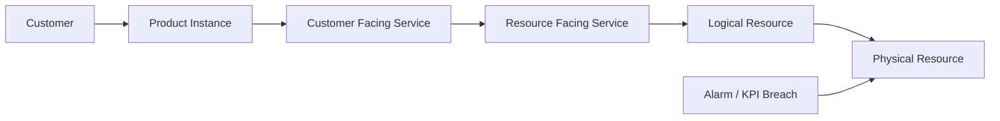
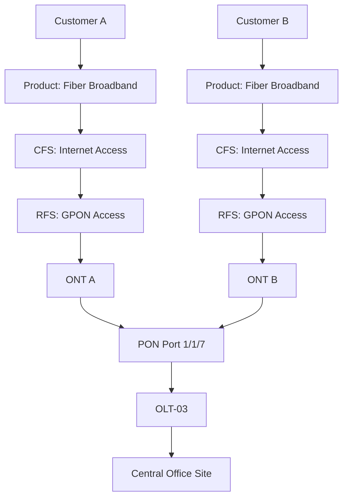
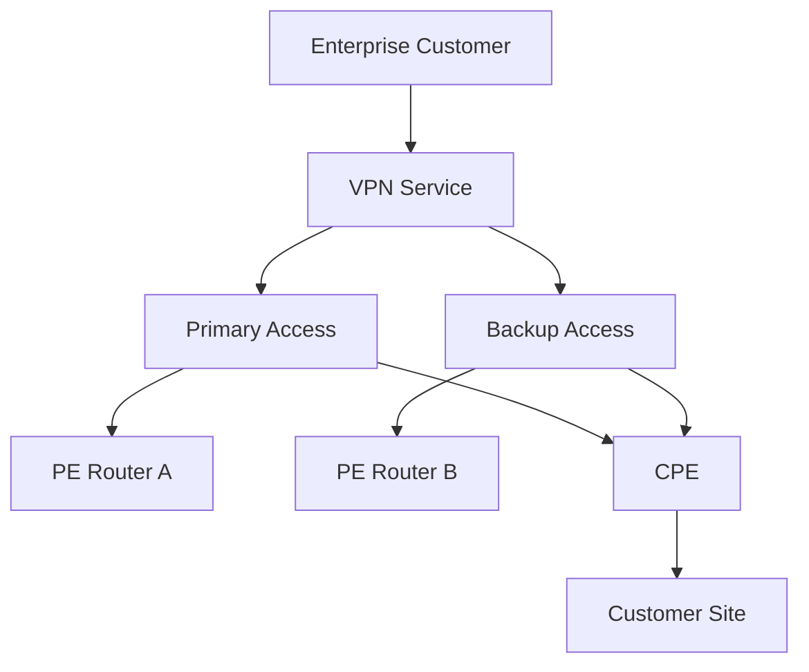
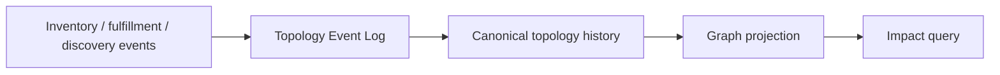
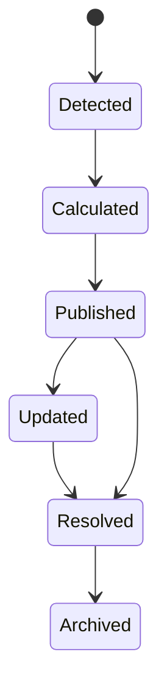

# Part 026 — Service Impact & Topology Correlation

Part 025 membahas performance, QoS, QoE, dan KPI pipeline. Namun metric dan alarm belum cukup. Dalam operasi telco, pertanyaan terpenting biasanya bukan hanya:

> Apa yang rusak?

Melainkan:

> Siapa terdampak, seberapa besar dampaknya, apa kemungkinan akar masalahnya, dan tindakan mana yang paling mengurangi dampak?

Inilah domain **service impact analysis** dan **topology correlation**.

Tanpa topology correlation, NOC akan melihat ribuan alarm. Dengan topology correlation yang baik, sistem bisa mengatakan:

```text
Root candidate:
  OLT-PON-07 degraded optical signal

Impacted:
  3 enterprise VPN services
  421 broadband subscriptions
  1 mobile backhaul link

Priority:
  Critical because enterprise SLA burn rate high and mobile backhaul redundancy unavailable
```

---

## 1. Kaufman Target Performance

Setelah part ini, target performa Anda adalah mampu:

1. Mendesain graph topology service-resource-customer untuk OSS assurance.
2. Membedakan physical topology, logical topology, service topology, dan customer impact topology.
3. Menghubungkan alarm, KPI breach, trouble ticket, work order, change, inventory, dan customer.
4. Mendesain blast radius analysis untuk customer/service impact.
5. Mendesain RCA candidate ranking tanpa mengklaim kepastian palsu.
6. Menangani topology freshness, stale relation, planned change, dan discovered-vs-planned mismatch.
7. Mengimplementasikan Java topology service dengan graph query, versioning, dan caching strategy.
8. Menghindari anti-pattern: flat inventory lookup, static CMDB, over-correlation, dan noisy RCA.

---

## 2. Mental Model: Impact Is a Graph Question

Service impact bukan sekadar atribut pada alarm.

Impact adalah hasil traversal graph:



Jika alarm terjadi di physical resource, Anda perlu berjalan **ke atas** menuju service dan customer. Jika complaint datang dari customer, Anda perlu berjalan **ke bawah** menuju resource dan network condition.

```text
Fault-to-customer direction:
  resource -> service -> product -> customer

Complaint-to-resource direction:
  customer -> product -> service -> resource
```

---

## 3. Core Vocabulary

### 3.1 Topology

Topology adalah graph relasi antar entity yang relevan untuk operasi.

Node bisa berupa:

- customer;
- account;
- product instance;
- service instance;
- CFS;
- RFS;
- logical resource;
- physical resource;
- site;
- device;
- port;
- link;
- network function;
- slice;
- partner service;
- ticket;
- change;
- alarm.

Edge bisa berupa:

- depends on;
- contains;
- hosted on;
- connected to;
- terminates at;
- assigned to;
- realizes;
- supports;
- impacts;
- protected by;
- redundant with;
- owned by;
- managed by.

### 3.2 Dependency

Dependency adalah relasi yang mempengaruhi availability/quality.

Contoh:

```text
Enterprise VPN Service depends on PE Interface
PE Interface hosted on Router
Router powered by Site Power System
VPN Access depends on Last-Mile Circuit
Last-Mile Circuit terminated at Customer Site
```

### 3.3 Blast Radius

Blast radius adalah kumpulan entity yang terdampak oleh fault/degradation tertentu.

Blast radius harus punya dimensi:

- jumlah customer;
- jumlah service;
- tier customer;
- SLA exposure;
- revenue exposure;
- geography;
- redundancy state;
- criticality;
- regulatory sensitivity.

### 3.4 Root Cause Candidate

RCA candidate adalah hipotesis, bukan kebenaran.

Sistem correlation sebaiknya mengatakan:

```text
candidate = OLT-3/PON-7
confidence = 0.82
reason = upstream alarm + downstream service degradation + temporal precedence + topology fanout
```

Bukan:

```text
root cause = OLT-3/PON-7
```

Kepastian palsu membuat operator salah percaya dan mengabaikan evidence lain.

---

## 4. Reference Model: TMF638, TMF639, TMF686, TMF688

Dalam TM Forum boundary:

- **TMF638 Service Inventory** menyediakan mekanisme standardized untuk query/manipulate service inventory.
- **TMF639 Resource Inventory** menyediakan mekanisme standardized untuk query/manipulate resource inventory.
- **TMF686 Topology Management** mengelola topology discovery service yang memberikan overlay view relasi dalam bentuk directed graph dari satu atau lebih Open API producers.
- **TMF688 Event Management** dapat dipakai untuk enterprise event, automation workflow, outage notification, SLA violation, dan trigger trouble ticket.
- **TMF642 Alarm Management** dan **TMF621 Trouble Ticket Management** menjadi sumber dan target operasional correlation.

Prinsip arsitektur:

> Inventory adalah sumber entity; topology adalah sumber relasi operasional; correlation adalah reasoning di atas graph dan event stream.

---

## 5. Four Topologies

### 5.1 Physical Topology

Physical topology merepresentasikan real-world physical resources:

- tower;
- cabinet;
- OLT;
- splitter;
- fiber segment;
- router chassis;
- card;
- port;
- power system;
- cooling;
- customer premises;
- CPE;
- antenna.

Physical topology penting untuk field service, physical fault, site outage, dan geography.

### 5.2 Logical Topology

Logical topology merepresentasikan network construct:

- VLAN;
- VRF;
- LSP;
- tunnel;
- BGP peer;
- IP subnet;
- APN/DNN;
- network slice;
- QoS policy;
- service chain.

Logical topology penting untuk service impact yang tidak terlihat dari physical connection saja.

### 5.3 Service Topology

Service topology merepresentasikan bagaimana CFS/RFS disusun.

Contoh:

```text
Enterprise Internet Access CFS
  depends on Access RFS
  depends on IP Transit RFS
  depends on CPE Management RFS
  depends on DNS Resolver RFS
```

Service topology penting untuk fulfillment, assurance, SLA, dan customer reporting.

### 5.4 Customer Impact Topology

Customer impact topology adalah projection dari graph untuk customer-facing decision.

Contoh:

```text
Fault on PE router interface
  -> impacts 12 enterprise services
  -> impacts 4 platinum customers
  -> impacts 2 regulated public-sector customers
  -> potential SLA credit exposure IDR X
```

Customer impact topology tidak harus menampilkan semua detail network. Ia harus menampilkan relasi yang relevan untuk tindakan.

---

## 6. Graph Modeling

### Node

```java
public record TopologyNode(
    String nodeId,
    NodeType type,
    String displayName,
    Map<String, String> attributes,
    Instant validFrom,
    Instant validTo,
    String sourceSystem,
    TopologyConfidence confidence
) {}
```

### Edge

```java
public record TopologyEdge(
    String edgeId,
    String fromNodeId,
    String toNodeId,
    EdgeType type,
    Direction direction,
    Map<String, String> attributes,
    Instant validFrom,
    Instant validTo,
    String sourceSystem,
    TopologyConfidence confidence
) {}
```

### Node type

```java
public enum NodeType {
    CUSTOMER,
    ACCOUNT,
    PRODUCT_INSTANCE,
    SERVICE_INSTANCE,
    CFS,
    RFS,
    LOGICAL_RESOURCE,
    PHYSICAL_RESOURCE,
    SITE,
    DEVICE,
    PORT,
    LINK,
    NETWORK_FUNCTION,
    SLICE,
    ALARM,
    TICKET,
    CHANGE,
    WORK_ORDER
}
```

### Edge type

```java
public enum EdgeType {
    OWNS,
    SUBSCRIBES_TO,
    REALIZES,
    DEPENDS_ON,
    HOSTED_ON,
    CONNECTED_TO,
    TERMINATES_AT,
    ASSIGNED_TO,
    PROTECTED_BY,
    REDUNDANT_WITH,
    IMPACTS,
    CAUSED_BY,
    RELATED_TO
}
```

---

## 7. Direction Matters

Edge direction harus konsisten.

Rekomendasi:

```text
A DEPENDS_ON B
```

Artinya A membutuhkan B untuk berfungsi.

Contoh:

```text
ServiceInstance DEPENDS_ON LogicalResource
LogicalResource DEPENDS_ON PhysicalResource
PhysicalResource HOSTED_ON Site
```

Fault impact traversal:

```text
reverse DEPENDS_ON traversal
```

Complaint RCA traversal:

```text
forward DEPENDS_ON traversal
```

Jika direction tidak konsisten, semua query impact akan kacau.

---

## 8. Example: Fixed Broadband Impact



Jika `PON Port 1/1/7` alarm, impact traversal menemukan Customer A dan Customer B.

Jika Customer A complaint, traversal ke bawah menemukan ONT A, PON Port, OLT, Site, lalu correlation engine memeriksa apakah ada alarm/KPI breach di node tersebut.

---

## 9. Example: Enterprise VPN with Redundancy



Impact rule:

```text
VPN impacted if:
  primary path degraded AND backup path degraded
  OR CPE unreachable
  OR PE policy misconfigured
```

Jika hanya primary down tetapi backup sehat, customer mungkin tidak hard down, tetapi SLA risk dan redundancy risk meningkat.

Graph harus menyimpan semantics:

```text
Primary PROTECTED_BY Backup
```

atau:

```text
VPN DEPENDS_ON anyOf(Primary, Backup)
```

Relasi `anyOf`/`allOf` penting. Tidak semua dependency bersifat wajib semua.

---

## 10. Dependency Semantics: allOf, anyOf, quorum, degraded

Dependency bukan hanya edge sederhana.

| Semantics | Makna | Contoh |
|---|---|---|
| allOf | semua dependency harus sehat | service chain firewall + NAT + router |
| anyOf | salah satu cukup | primary/backup access |
| quorum | minimal N dari M sehat | distributed DNS resolvers |
| degraded | masih jalan tetapi kualitas turun | bandwidth reduced |
| weighted | impact berdasar traffic/customer weight | mobile cell sectors |

Model:

```java
public sealed interface DependencyPolicy
    permits AllOfPolicy, AnyOfPolicy, QuorumPolicy, WeightedPolicy {
}

public record AllOfPolicy(List<String> dependencyNodeIds) implements DependencyPolicy {}
public record AnyOfPolicy(List<String> dependencyNodeIds) implements DependencyPolicy {}
public record QuorumPolicy(List<String> dependencyNodeIds, int requiredHealthy) implements DependencyPolicy {}
public record WeightedPolicy(Map<String, BigDecimal> weights, BigDecimal failureThreshold) implements DependencyPolicy {}
```

---

## 11. Impact State

Jangan hanya `impacted=true/false`.

Gunakan state lebih kaya:

```java
public enum ImpactState {
    NOT_IMPACTED,
    AT_RISK,
    DEGRADED,
    PARTIALLY_DOWN,
    DOWN,
    UNKNOWN
}
```

Contoh:

| Kondisi | State |
|---|---|
| primary path down, backup healthy | AT_RISK |
| packet loss 2% | DEGRADED |
| 30% users in area affected | PARTIALLY_DOWN |
| all dependencies failed | DOWN |
| topology stale / missing data | UNKNOWN |

`UNKNOWN` lebih jujur daripada false negative.

---

## 12. Topology Freshness

Topology bisa stale.

Penyebab:

- fulfillment belum update inventory;
- field technician mengganti port tanpa update;
- discovery terlambat;
- migration belum sinkron;
- partner inventory berbeda;
- CPE swapped;
- resource reused tanpa quarantine cukup;
- planned change belum reflected.

Setiap node/edge harus punya freshness metadata:

- source system;
- discoveredAt;
- lastVerifiedAt;
- confidence;
- validFrom/validTo;
- version;
- reconciliation status.

```java
public record TopologyConfidence(
    ConfidenceLevel level,
    String reason,
    Instant lastVerifiedAt
) {}

public enum ConfidenceLevel {
    HIGH,
    MEDIUM,
    LOW,
    UNKNOWN
}
```

Impact result harus menyertakan confidence.

---

## 13. Planned vs Discovered vs Actual

Telco inventory punya tiga realitas:

| View | Sumber | Digunakan untuk |
|---|---|---|
| Planned | order/change/design | future state, orchestration |
| Discovered | network discovery/EMS/NMS | actual observed network |
| Active/Operational | reconciled state | assurance decision |

Correlation sebaiknya memakai operational view, tetapi tetap melihat planned change.

Contoh:

```text
Alarm on port X.
Inventory says service moved to port Y yesterday.
Discovery still sees traffic on port X.
```

Jika correlation hanya percaya inventory planned, impact salah.

Rule:

- fulfillment writes intended relation;
- discovery observes actual relation;
- reconciliation creates operational relation;
- assurance uses operational relation plus confidence.

---

## 14. Correlation Inputs

Correlation engine menerima banyak signal:

| Signal | Contoh |
|---|---|
| Alarm | link down, optical low, CPU high |
| KPI breach | packet loss, latency, availability |
| Event | config changed, service activated, maintenance started |
| Ticket | customer complaint, known issue |
| Change | planned upgrade, migration |
| Work order | field repair, installation |
| Inventory delta | resource moved, new dependency |
| Probe result | synthetic test failed |
| Usage pattern | traffic dropped to zero |

Correlation tidak boleh hanya rule alarm. Correlation yang baik menggabungkan topology + temporal sequence + severity + symptom similarity.

---

## 15. Correlation Output

Output minimal:

```java
public record CorrelationResult(
    String correlationId,
    List<RootCauseCandidate> rootCauseCandidates,
    List<ImpactedEntity> impactedEntities,
    ImpactSummary summary,
    List<RecommendedAction> recommendedActions,
    ConfidenceLevel confidence,
    List<EvidenceRef> evidence,
    Instant computedAt
) {}
```

Root cause candidate:

```java
public record RootCauseCandidate(
    String entityId,
    NodeType entityType,
    BigDecimal score,
    List<String> reasons
) {}
```

Impact summary:

```java
public record ImpactSummary(
    int impactedCustomers,
    int impactedServices,
    int impactedEnterpriseServices,
    BigDecimal revenueExposure,
    BigDecimal slaCreditExposure,
    Severity recommendedSeverity
) {}
```

---

## 16. Scoring Root Cause Candidates

Scoring heuristik sederhana:

```text
score = topologyFanoutWeight
      + temporalPrecedenceWeight
      + severityWeight
      + symptomMatchWeight
      + knownFailurePatternWeight
      - maintenanceSuppressionWeight
      - lowConfidenceTopologyPenalty
```

Faktor:

| Faktor | Makna |
|---|---|
| topology fanout | node upstream dari banyak symptom lebih mungkin root |
| temporal precedence | root biasanya muncul sebelum downstream symptom |
| severity | critical alarm lebih kuat dari warning |
| symptom match | fault type cocok dengan symptom |
| change proximity | change dekat waktu issue bisa menjadi candidate |
| redundancy semantics | backup sehat mengurangi impact |
| topology confidence | stale edge menurunkan confidence |
| recurrence | pattern historis menaikkan prior |

Jangan membuat model yang tidak bisa dijelaskan. Operator perlu alasan.

---

## 17. RCA Is Not Always Single Root

Beberapa incident punya multi-root:

- fiber cut + backup path misconfigured;
- DNS issue + caching problem;
- mobile congestion + policy misconfiguration;
- billing suspension bug + provisioning stale state;
- partner circuit outage + local CPE failure.

Graph model harus bisa menyatakan:

```text
root candidates:
  1. Partner circuit outage, confidence 0.71
  2. CPE unreachable, confidence 0.64
  3. Recent config change, confidence 0.56
```

Dan bukan memaksa satu root.

---

## 18. Service Impact Algorithm

Simplified algorithm:

```text
Input:
  affected node(s), alarm/KPI/event evidence, topology graph

Steps:
  1. Normalize affected entity references.
  2. Load topology neighborhood with depth policy.
  3. Traverse reverse dependency edges to impacted services/customers.
  4. Apply dependency semantics: allOf/anyOf/quorum/weighted.
  5. Calculate impact state for each service.
  6. Enrich with customer tier, SLA, product, geography.
  7. Check active maintenance/change windows.
  8. Check existing incidents/tickets.
  9. Rank root cause candidates.
  10. Emit impact result and recommended action.
```

Pseudo-code:

```java
public final class ServiceImpactAnalyzer {
    public ImpactAnalysis analyze(AffectedSignal signal) {
        TopologySubgraph graph = topologyRepository.loadNeighborhood(
            signal.affectedEntityId(),
            TraversalPolicy.assuranceDefault()
        );

        List<ServiceImpact> services = graph.reverseDependsOnTraversal(signal.affectedEntityId())
            .stream()
            .filter(NodePredicates::isService)
            .map(service -> evaluateServiceImpact(service, graph, signal))
            .toList();

        List<CustomerImpact> customers = customerImpactProjector.project(services, graph);
        List<RootCauseCandidate> candidates = rcaRanker.rank(signal, graph, services);

        return new ImpactAnalysis(signal.id(), services, customers, candidates, Instant.now());
    }
}
```

---

## 19. Traversal Policy

Traversal tanpa batas akan mahal dan noisy.

Traversal policy harus mengatur:

- edge types allowed;
- direction;
- max depth;
- node type stop conditions;
- temporal validity;
- confidence threshold;
- tenant/customer security;
- service class filter;
- expansion budget.

```java
public record TraversalPolicy(
    Set<EdgeType> allowedEdges,
    Direction direction,
    int maxDepth,
    Set<NodeType> stopAt,
    ConfidenceLevel minimumConfidence,
    Instant asOf
) {}
```

Contoh:

```text
For resource fault impact:
  direction = reverse DEPENDS_ON
  maxDepth = 8
  stopAt = CUSTOMER
  minimumConfidence = MEDIUM
```

---

## 20. Topology API Patterns

API internal yang berguna:

```http
GET /topology/nodes/{id}
GET /topology/nodes/{id}/neighbors?depth=3&edgeType=DEPENDS_ON
GET /topology/impact?entityId=resource-123&asOf=2026-06-29T10:00:00Z
GET /topology/paths?from=service-1&to=resource-9
POST /topology/query
```

Untuk advanced query, jangan memaksakan REST sederhana. Gunakan query DSL internal yang terkontrol.

Contoh request:

```json
{
  "startNodeId": "resource:olt-03:pon-1-1-7",
  "direction": "REVERSE",
  "edgeTypes": ["DEPENDS_ON", "REALIZES"],
  "maxDepth": 6,
  "asOf": "2026-06-29T10:00:00Z",
  "stopAt": ["CUSTOMER"]
}
```

---

## 21. Java Architecture Blueprint

```text
service-impact-topology-service
├── api
│   ├── topology-query
│   ├── impact-analysis
│   ├── correlation-result
│   └── admin
├── application
│   ├── topology-ingestion
│   ├── graph-build
│   ├── graph-query
│   ├── impact-analysis
│   ├── rca-ranking
│   └── projection
├── domain
│   ├── node
│   ├── edge
│   ├── dependency-policy
│   ├── impact-state
│   ├── correlation
│   └── confidence
├── infrastructure
│   ├── graphdb
│   ├── relational
│   ├── event-stream
│   ├── inventory-client
│   ├── alarm-client
│   └── ticket-client
└── worker
    ├── topology-reconciler
    ├── impact-recalculator
    └── stale-edge-detector
```

Component invariant:

- topology service owns graph representation;
- inventory owns entity lifecycle;
- correlation owns reasoning result;
- ticket system owns work contract;
- alarm system owns alarm lifecycle;
- service inventory owns service state;
- resource inventory owns resource state.

---

## 22. Graph Store vs Relational Store

Graph store cocok untuk traversal. Relational store cocok untuk transactional records, audit, and projections.

Hybrid pattern:

| Data | Store |
|---|---|
| node/edge canonical history | relational/event store |
| current query graph | graph database/search index |
| impact result | relational/document |
| RCA evidence | object/relational |
| snapshot export | object storage |

Jangan jadikan graph database sebagai satu-satunya source of truth tanpa audit model.

Recommended pattern:



Graph projection bisa dibangun ulang dari canonical history.

---

## 23. Topology Versioning

Impact analysis harus bisa menjawab “berdasarkan topology pada waktu kejadian”.

`asOf` query penting:

```text
What services were dependent on resource R at 2026-06-29 10:05?
```

Bukan hanya:

```text
What services depend on R now?
```

Karena service bisa dipindah setelah outage.

Model valid-time:

```java
public record Validity(
    Instant validFrom,
    Instant validTo
) {
    boolean activeAt(Instant t) {
        return !t.isBefore(validFrom) && (validTo == null || t.isBefore(validTo));
    }
}
```

---

## 24. Change-Aware Correlation

Change sering menjadi penyebab incident.

Correlation harus melihat:

- change yang sedang berjalan;
- change yang baru selesai;
- rollback;
- maintenance window;
- impacted CI/service list;
- implementation team;
- planned topology delta.

Rule contoh:

```text
If KPI breach starts within 15 minutes after change on dependent resource,
increase RCA candidate score for that change.
```

Tetapi hati-hati: proximity bukan proof.

Output harus:

```text
Recent change CHG-123 is a candidate because it modified PE router policy 8 minutes before VPN packet loss started.
```

Bukan:

```text
CHG-123 caused the issue.
```

---

## 25. Maintenance and Suppression

Jika maintenance aktif, impact tidak hilang. Yang berubah adalah tindakan dan komunikasi.

Maintenance window bisa:

- suppress alarm notification;
- annotate SLA exclusion;
- prevent duplicate ticket;
- trigger planned customer communication;
- alter priority;
- change escalation path.

Namun jangan menghapus evidence.

```text
Alarm during maintenance:
  store alarm
  store impact
  annotate as planned maintenance
  suppress duplicate incident if expected
```

---

## 26. Customer Impact Scoring

Customer impact score bisa menghitung:

```text
score = severityWeight
      + customerTierWeight
      + slaExposureWeight
      + revenueExposureWeight
      + regulatoryWeight
      + affectedServiceCountWeight
      + redundancyRiskWeight
      + durationWeight
```

Contoh:

| Faktor | Nilai |
|---|---:|
| enterprise platinum | +30 |
| SLA breach risk | +25 |
| public safety customer | +40 |
| redundancy lost | +15 |
| > 500 residential customers | +20 |
| planned maintenance | -20 |

Scoring harus transparan. NOC harus tahu mengapa prioritas naik.

---

## 27. Multi-Tenant and Security

Topology graph berisi data sensitif:

- customer relation;
- enterprise circuits;
- network architecture;
- site location;
- partner dependency;
- public-sector customer;
- high-value accounts.

Security requirement:

- tenant isolation;
- role-based graph filtering;
- customer data minimization;
- masking high-risk identifiers;
- audit setiap query impact;
- no raw topology dump untuk channel tidak berwenang;
- partner hanya melihat subset topology yang relevan.

Graph query harus melewati authorization, bukan direct DB access.

---

## 28. Topology Reconciliation

Topology harus direkonsiliasi dari banyak sumber:

- service inventory;
- resource inventory;
- fulfillment orders;
- activation systems;
- discovery;
- EMS/NMS;
- field completion;
- partner API;
- manual correction.

Reconciliation rule:

| Conflict | Rule contoh |
|---|---|
| planned vs discovered berbeda | mark discrepancy, lower confidence |
| service says resource assigned, resource absent | create reconciliation exception |
| resource discovered with no owner | orphan resource workflow |
| customer service active, no path found | critical topology gap |
| field changed port manually | create correction event with audit |

Topology gap adalah operational risk.

---

## 29. Impact Result Lifecycle

Impact result juga punya lifecycle.



Impact bisa berubah saat:

- topology diperbaiki;
- alarm baru muncul;
- KPI breach clear;
- customer complaint masuk;
- service dipindah;
- maintenance dimulai/selesai;
- ticket resolved;
- discovery backfill datang.

Jangan treat impact sebagai one-time calculation.

---

## 30. Event Model

Events:

```text
TopologyNodeDiscovered
TopologyEdgeCreated
TopologyEdgeExpired
TopologyConfidenceChanged
ImpactAnalysisRequested
ImpactAnalysisCompleted
CustomerImpactDetected
RootCauseCandidateRanked
ImpactResolved
TopologyDiscrepancyDetected
```

Contoh event:

```json
{
  "eventType": "CustomerImpactDetected",
  "eventId": "evt-123",
  "correlationId": "corr-456",
  "affectedEntityId": "resource:olt-03:pon-1-1-7",
  "impactState": "DEGRADED",
  "impactedCustomers": 421,
  "impactedServices": 424,
  "confidence": "HIGH",
  "computedAt": "2026-06-29T10:12:00Z"
}
```

---

## 31. Performance Concerns

Graph traversal bisa mahal.

Optimizations:

1. cache hot neighborhoods;
2. precompute service-to-resource closure for common paths;
3. maintain reverse index from resource to impacted service;
4. limit traversal depth;
5. use topology snapshots;
6. use async recalculation for large blast radius;
7. stream result progressively;
8. separate online impact query from offline analytics.

Trade-off:

- precompute cepat tetapi bisa stale;
- live traversal fresh tetapi mahal;
- hybrid biasanya terbaik.

---

## 32. Testing Strategy

Test yang harus ada:

### Unit test

- dependency policy evaluation;
- edge direction;
- state calculation;
- scoring function;
- suppression rule.

### Contract test

- inventory client;
- alarm client;
- ticket client;
- topology API.

### Scenario test

- fiber cut impacts many customers;
- enterprise VPN primary down but backup healthy;
- stale topology produces unknown confidence;
- planned maintenance suppresses duplicate incident;
- customer complaint finds no topology path;
- change causes KPI breach candidate.

### Replay test

Replay historical incident:

```text
Given topology snapshot at incident time
And alarm/KPI/ticket events in original order
When correlation engine runs
Then it should rank the known root candidate in top N
And identify impacted services within accepted tolerance
```

---

## 33. Example: Correlation Scenario

### Situation

At 10:00, packet loss spikes for 200 broadband customers. At 09:58, optical warning alarm appears on OLT PON port. At 10:03, multiple customer complaints arrive. At 10:05, KPI breach confirms degraded service.

### Correlation reasoning

```text
1. Alarm precedes symptoms.
2. Alarm node is upstream of affected ONTs.
3. Multiple customer complaints share same PON dependency.
4. Packet loss KPI breach occurs in same dependency subtree.
5. No planned maintenance active.
6. Topology confidence high from recent discovery.
```

### Output

```text
Root candidate:
  resource:olt-03:pon-1-1-7
  confidence: 0.88

Impact:
  421 residential broadband subscriptions DEGRADED
  3 enterprise backup circuits AT_RISK

Recommended action:
  create priority P1 network ticket
  dispatch field check if optical degradation persists for 2 windows
  notify customer care with affected area list
```

---

## 34. Anti-Patterns

1. **Flat inventory lookup**: hanya join resource-to-service tanpa graph semantics.
2. **Static CMDB fantasy**: menganggap topology selalu benar.
3. **No valid-time**: impact dihitung dengan topology sekarang, bukan saat kejadian.
4. **One root cause only**: memaksa single RCA untuk multi-root incident.
5. **No confidence**: output terlihat pasti padahal data lemah.
6. **No dependency semantics**: primary/backup dianggap sama seperti all-of dependency.
7. **Ignoring planned change**: korelasi kehilangan penyebab umum.
8. **Over-correlation**: semua alarm digabung menjadi satu incident besar tanpa bukti.
9. **No suppression evidence**: alarm maintenance hilang dari audit.
10. **Graph DB as magic**: memilih graph database tetapi tidak mendesain model relasi dan query policy.

---

## 35. Practice: Build a Mini Impact Analyzer

Latihan 120 menit:

1. Buat topology kecil:
   - 2 customer;
   - 2 product instance;
   - 2 service instance;
   - 2 ONT;
   - 1 PON port;
   - 1 OLT;
   - 1 site.
2. Buat edge `DEPENDS_ON` dari service ke resource.
3. Inject alarm di PON port.
4. Traversal reverse dependency untuk menemukan impacted service/customer.
5. Tambahkan dependency policy primary/backup.
6. Tambahkan `TopologyConfidence`.
7. Tambahkan maintenance window.
8. Emit `CustomerImpactDetected`.
9. Buat test untuk stale topology.

Acceptance criteria:

- impact traversal menemukan customer yang benar;
- primary-only failure menghasilkan `AT_RISK`, bukan `DOWN`;
- stale topology menurunkan confidence;
- maintenance tidak menghapus evidence;
- duplicate alarm tidak membuat duplicate impact record;
- impact result memiliki evidence refs.

---

## 36. Interview-Level Questions

1. Apa perbedaan service inventory dan topology?
2. Mengapa service impact adalah graph problem?
3. Bagaimana Anda memodelkan primary/backup dependency?
4. Apa bedanya planned, discovered, dan operational topology?
5. Bagaimana menghitung blast radius dari alarm di resource?
6. Bagaimana menangani stale topology?
7. Mengapa RCA output sebaiknya candidate ranking, bukan absolute root cause?
8. Bagaimana planned change mempengaruhi correlation?
9. Bagaimana melindungi topology data dari unauthorized access?
10. Apa trade-off precomputed graph projection vs live traversal?

---

## 37. Ringkasan

Service Impact & Topology Correlation adalah lapisan yang mengubah data teknis menjadi keputusan operasional.

Engineer top-level harus mampu membangun model yang menjawab:

- resource mana yang bermasalah;
- service mana yang tergantung pada resource itu;
- customer mana yang terdampak;
- apakah impact down, degraded, at-risk, atau unknown;
- apakah ada redundancy;
- apakah ada planned change/maintenance;
- apakah ada ticket/incident aktif;
- siapa harus bertindak;
- seberapa confident sistem terhadap reasoning-nya.

Part berikutnya akan masuk ke **Network Inventory, Discovery & Reconciliation**: bagaimana planned inventory, discovered inventory, dan operational topology dijaga konsisten dalam lingkungan OSS brownfield.

---

## References

- TM Forum, `TMF686 Topology Management API`: https://www.tmforum.org/open-digital-architecture/open-apis/topology-management-api-TMF686/v4.0
- TM Forum, `TMF638 Service Inventory API User Guide v5.0.0`: https://www.tmforum.org/resources/specifications/tmf638-service-inventory-api-user-guide-v5-0-0/
- TM Forum, `TMF639 Resource Inventory Management API REST Specification`: https://www.tmforum.org/resources/specification/tmf639-resource-inventory-management-api-rest-specification-r17-0-1/
- TM Forum, `TMF688 Event Management API`: https://www.tmforum.org/open-digital-architecture/open-apis/event-management-api-TMF688/v4.0
- TM Forum, `TMF920A Topology Discovery Service Management API Component Suite Profile`: https://www.tmforum.org/resources/specifications/tmf920a-topology-discovery-service-management-api-component-suite-profile-v1-0-0/
