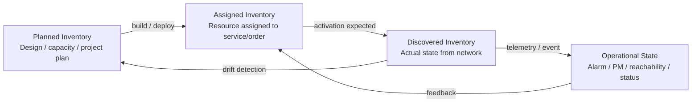
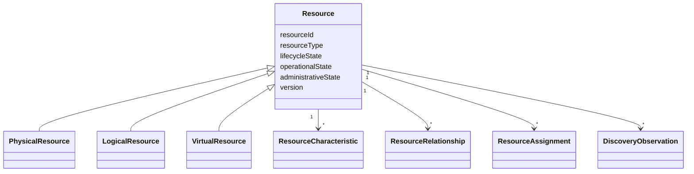
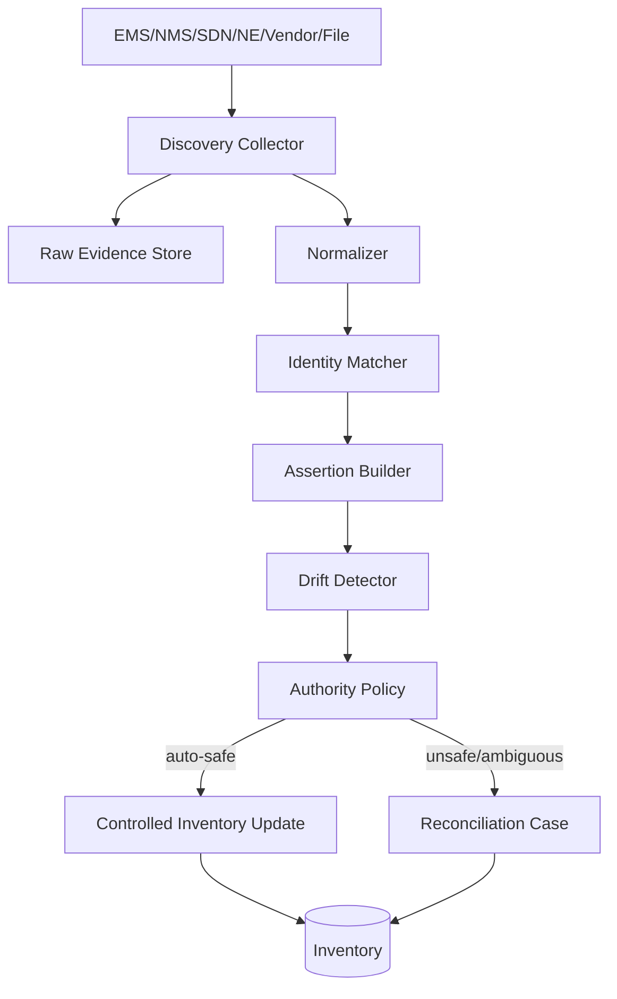
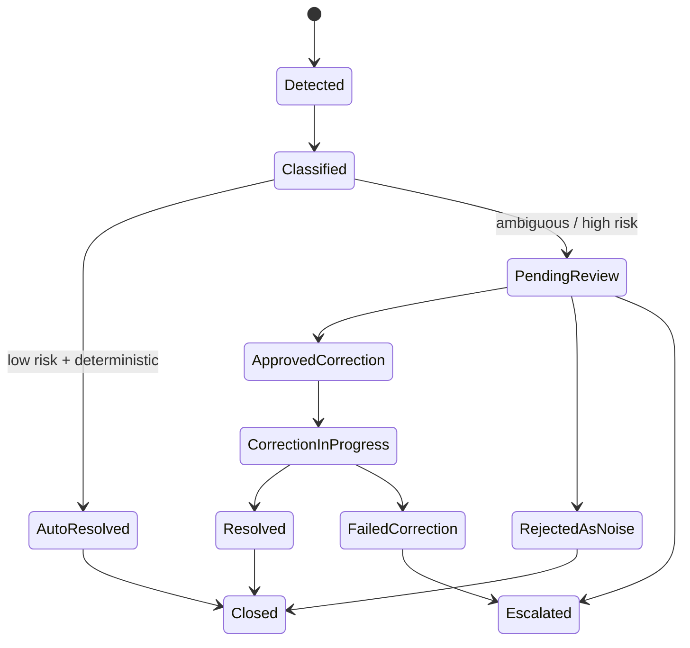
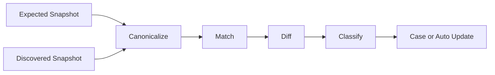
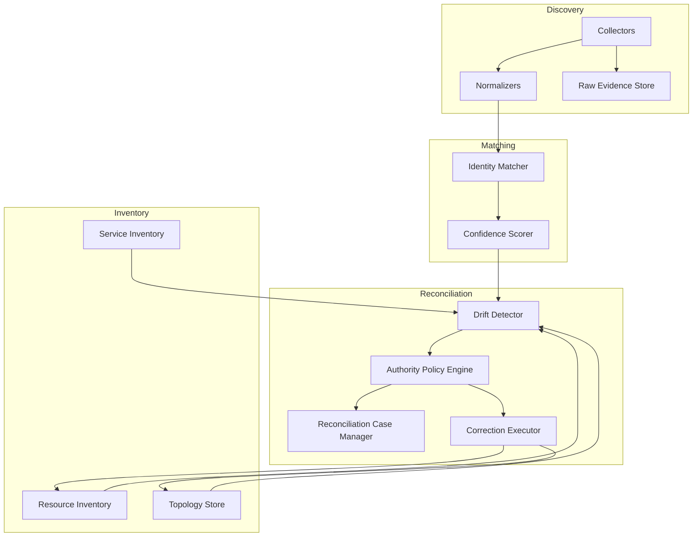
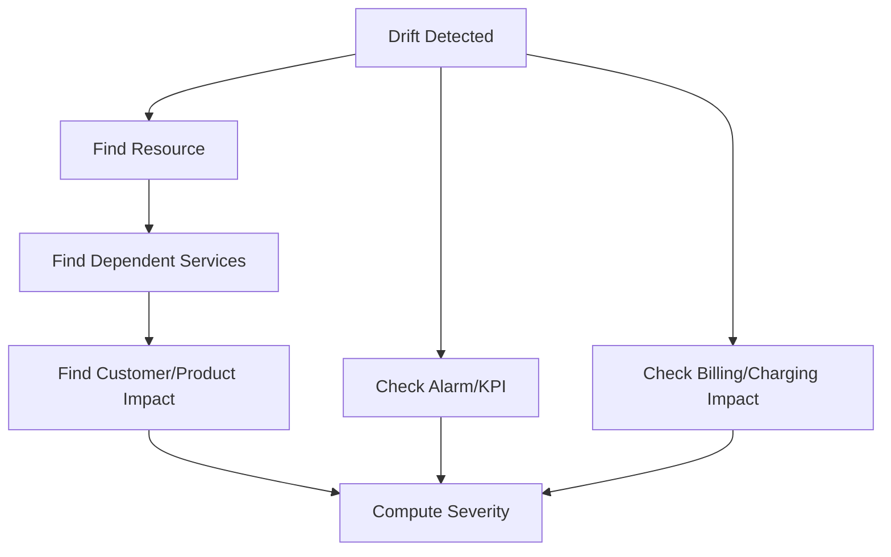

# Part 027 — Network Inventory, Discovery & Reconciliation

Di part sebelumnya kita sudah membahas **service impact** dan **topology correlation**. Sekarang kita masuk ke salah satu sumber kebenaran paling sulit dalam OSS: **network inventory**.

Di sistem telco nyata, inventory bukan sekadar tabel perangkat. Inventory adalah model operasional tentang **apa yang direncanakan**, **apa yang tercatat sebagai aktif**, **apa yang ditemukan di jaringan**, dan **apa yang sedang berubah**.

Masalah besarnya: keempat hal itu sering tidak sama.

Seorang engineer BSS/OSS level tinggi tidak hanya bisa membuat CRUD inventory. Ia harus bisa menjawab:

- apakah resource ini benar-benar ada di jaringan?
- apakah inventory merepresentasikan konfigurasi aktual?
- apakah resource ini sedang dipakai customer?
- apakah perubahan di lapangan sudah masuk sistem?
- apakah provisioning berhasil tetapi inventory gagal update?
- apakah discovery menemukan drift yang aman dikoreksi otomatis?
- kapan inventory boleh menjadi authoritative source?
- kapan network element harus menjadi authoritative source?
- kapan perbedaan harus menjadi fallout/reconciliation case?

Kita akan membangun mental model, invariant, dan blueprint Java untuk menjawab semua itu.

---

## 1. Target Skill Berdasarkan Kaufman

Dalam framework Josh Kaufman, kita mulai dengan **target performance level**, bukan daftar topik.

Setelah part ini, targetnya:

> Kamu mampu merancang dan mengimplementasikan inventory/discovery/reconciliation subsystem untuk OSS telco yang dapat mempertahankan konsistensi antara planned inventory, service inventory, resource inventory, discovered network state, dan operational topology walaupun jaringan berubah, provisioning asynchronous, dan sebagian data berasal dari vendor/legacy system.

Bukan targetnya:

- hafal semua field TMF639.
- membuat CRUD `Resource`.
- membuat sync job sederhana.
- menyalin SID schema ke database.
- memperlakukan discovery sebagai import file biasa.

Target performanya adalah kemampuan desain sistem dengan failure model yang jelas.

---

## 2. Skill Decomposition

Network inventory terdiri dari beberapa sub-skill:

| Sub-skill | Pertanyaan Kunci |
|---|---|
| Inventory semantics | Resource apa yang sedang dimodelkan? Physical, logical, virtual, network function, port, circuit, slice, IP, SIM, service endpoint? |
| Inventory state model | Apakah resource planned, reserved, assigned, active, retired, quarantined, faulty, unknown? |
| Discovery ingestion | Bagaimana membaca state aktual dari EMS/NMS/SDN/controller/NE/vendor API/file dump? |
| Identity resolution | Bagaimana mencocokkan discovered object dengan inventory object? |
| Drift detection | Bagaimana mendeteksi perbedaan yang bermakna, bukan noise? |
| Authoritative source policy | Untuk atribut tertentu, siapa yang benar: inventory, service order, activation system, network element, manual engineer? |
| Reconciliation workflow | Apa yang otomatis, apa yang butuh approval, apa yang menjadi fallout? |
| Evidence and audit | Bagaimana membuktikan kapan drift ditemukan, siapa/apa yang memperbaiki, dan dampaknya ke customer? |
| Java implementation | Bagaimana membuat pipeline idempotent, scalable, safe, observable, dan testable? |

---

## 3. Mental Model: Inventory Bukan Satu Kebenaran Tunggal

Kesalahan umum adalah menganggap inventory sebagai **single source of truth** untuk semua hal. Di OSS nyata, lebih tepat berpikir:

> Inventory adalah curated operational truth yang dibangun dari beberapa source of record dengan policy, evidence, reconciliation, dan lifecycle governance.

Ada beberapa jenis truth:

| Truth Type | Contoh | Sifat |
|---|---|---|
| Planned truth | Site akan dipasang OLT baru, port akan dialokasikan, fiber route direncanakan | Future-facing, belum tentu ada di jaringan |
| Commercial truth | Customer membeli paket enterprise DIA 100 Mbps | Berasal dari BSS/product order |
| Service truth | CFS/RFS aktif untuk customer tertentu | Berasal dari fulfillment/service inventory |
| Resource truth | VLAN, port, CPE, IP, SIM, circuit ter-assign | Berasal dari resource inventory/allocation |
| Discovered truth | Controller menemukan interface up/down, card terpasang, route ada | Berasal dari network discovery |
| Operational truth | Alarm, KPI, reachability, current state | Time-sensitive, dapat berubah cepat |
| Financial truth | Resource/customer sudah billable | Berasal dari charging/billing readiness |

Kalau semua ini dipaksa menjadi satu tabel `network_inventory`, sistem akan cepat rapuh.

---

## 4. Planned vs Assigned vs Discovered vs Operational

Minimal, bedakan empat layer berikut.



### Planned inventory

Planned inventory menjawab:

- resource apa yang seharusnya tersedia?
- kapasitas apa yang direncanakan?
- relasi topology apa yang diharapkan?
- kapan resource masuk service window?

Contoh:

- OLT planned di site tertentu.
- card/slot planned.
- fiber route planned.
- IP pool planned.
- 5G slice subnet planned.

### Assigned inventory

Assigned inventory menjawab:

- resource ini dipakai oleh service/order/customer mana?
- resource ini reserved atau committed?
- resource ini boleh dipakai ulang atau tidak?
- resource ini dalam provisioning state apa?

Contoh:

- MSISDN assigned ke subscription.
- VLAN assigned ke broadband service.
- port OLT assigned ke ONT.
- static IP assigned ke enterprise customer.

### Discovered inventory

Discovered inventory menjawab:

- apa yang benar-benar ditemukan di jaringan?
- attribute apa yang dibaca dari controller/vendor?
- kapan terakhir ditemukan?
- kualitas confidence-nya berapa?

Contoh:

- ONT serial number ditemukan di OLT.
- port status ditemukan `up`.
- interface configured bandwidth 100M.
- route policy ada di router.

### Operational state

Operational state menjawab:

- sekarang resource sehat atau tidak?
- alarm apa yang aktif?
- KPI apa yang melanggar threshold?
- apakah resource unreachable?

Operational state tidak selalu harus mengubah inventory. Banyak operational event bersifat transient.

---

## 5. Core Domain Objects

### 5.1 Resource

`Resource` adalah entity yang merepresentasikan sesuatu yang dapat digunakan untuk menyediakan service.

Contoh resource:

- physical: rack, shelf, slot, card, port, fiber, CPE, ONT, antenna, router.
- logical: VLAN, VRF, IP address, MSISDN, IMSI, APN, QoS profile, route target.
- virtual: VNF, CNF, VM, container workload, network slice subnet.
- software-defined: SDN flow, policy, service chain.

Jangan campur semua ke satu model datar.

Gunakan taxonomy:



### 5.2 ResourceRelationship

Relationship lebih penting daripada field.

Contoh relationship:

| Relationship | Meaning |
|---|---|
| `contains` | shelf contains slot, router contains port |
| `connectedTo` | port connected to port/fiber/circuit |
| `dependsOn` | service depends on resource |
| `assignedTo` | resource assigned to service/customer/order |
| `realizedBy` | logical resource realized by physical/virtual resource |
| `protectedBy` | primary path protected by backup path |
| `terminatesAt` | circuit terminates at UNI/NNI/site |
| `memberOf` | resource member of pool/slice/group |

### 5.3 DiscoveryObservation

Jangan langsung update resource dari discovery mentah.

Discovery menghasilkan observation:

```java
public record DiscoveryObservation(
    String observationId,
    String sourceSystem,
    String discoveryRunId,
    String nativeObjectType,
    String nativeObjectId,
    Instant observedAt,
    Map<String, Object> attributes,
    ObservationConfidence confidence,
    String rawEvidenceRef
) {}
```

Observation adalah evidence, bukan langsung truth.

### 5.4 InventoryAssertion

Setelah observation diproses, sistem membuat assertion:

```java
public record InventoryAssertion(
    String assertionId,
    String resourceId,
    String attributePath,
    Object assertedValue,
    AssertionSource source,
    AssertionStrength strength,
    Instant validFrom,
    Instant observedAt,
    String evidenceRef
) {}
```

Assertion memungkinkan beberapa source menyatakan hal berbeda tentang atribut yang sama.

---

## 6. Lifecycle State vs Operational State vs Administrative State

Jangan gunakan satu field `status`.

Gunakan minimal tiga axis.

| Axis | Meaning | Contoh |
|---|---|---|
| Lifecycle state | posisi resource dalam lifecycle bisnis/engineering | `planned`, `installed`, `reserved`, `assigned`, `active`, `retired` |
| Operational state | kondisi runtime | `up`, `down`, `degraded`, `unknown` |
| Administrative state | kebijakan operator | `unlocked`, `locked`, `maintenance`, `barred` |

Contoh:

- port bisa `active` secara lifecycle, `down` secara operational, dan `unlocked` secara administrative.
- router bisa `installed`, `up`, tetapi `maintenance`.
- MSISDN bisa `assigned`, operational tidak relevan, dan administratively `barred` karena fraud.

### Anti-pattern

```java
// buruk
resource.status = "ACTIVE";
```

`ACTIVE` tidak menjawab:

- aktif secara inventory?
- aktif secara network?
- aktif secara billing?
- aktif secara administratif?
- aktif untuk customer?

Model yang lebih baik:

```java
public record ResourceState(
    LifecycleState lifecycle,
    OperationalState operational,
    AdministrativeState administrative,
    BillingReadiness billingReadiness,
    ReconciliationState reconciliation
) {}
```

---

## 7. Discovery Architecture

Discovery pipeline sebaiknya diperlakukan sebagai ingestion + normalization + matching + assertion + reconciliation.



### 7.1 Collector

Collector mengambil data dari:

- EMS/NMS API.
- NETCONF/RESTCONF/gNMI.
- SNMP walk.
- SDN controller.
- cloud/NFV/CNF orchestrator.
- vendor CSV dump.
- activation read-back.
- field engineer mobile app.

Collector tidak boleh melakukan business decision berat.

Tugasnya:

- read source.
- preserve raw evidence.
- tag source/time/run id.
- publish normalized candidate.
- handle pagination/retry/backoff.

### 7.2 Raw evidence store

Raw evidence wajib disimpan untuk audit dan debugging.

Contoh storage:

- object storage untuk payload mentah.
- hash untuk immutability check.
- metadata table untuk discovery run.
- retention policy berbeda per source.

Tanpa raw evidence, reconciliation akan menjadi debat opini.

### 7.3 Normalizer

Normalizer mengubah vendor-specific data menjadi canonical observation.

Contoh mapping:

| Vendor Field | Normalized Field |
|---|---|
| `ifName` | `interface.name` |
| `admin-status` | `administrativeState` |
| `oper-status` | `operationalState` |
| `ontSerial` | `resource.serialNumber` |
| `vlan-id` | `logicalResource.vlanId` |

Normalizer harus menyimpan original value, bukan hanya normalized value.

### 7.4 Identity matcher

Identity matching menjawab:

> Discovered object ini adalah resource inventory yang mana?

Match strategy:

| Strategy | Contoh | Risiko |
|---|---|---|
| Exact ID | vendor resource id sama | ID vendor bisa berubah saat replacement |
| Serial number | CPE/ONT/router serial | duplicate/format issue |
| Composite natural key | site + shelf + slot + port | topology rename dapat memecah match |
| Service binding | VLAN + circuit id + customer ref | data bisa stale |
| Graph match | relationship pattern | mahal dan kompleks |
| Manual resolution | operator mapping | human error |

Gunakan confidence score.

```java
public record MatchCandidate(
    String discoveredObjectId,
    String inventoryResourceId,
    MatchStrategy strategy,
    double confidence,
    List<String> reasons
) {}
```

### 7.5 Drift detector

Drift adalah perbedaan antara expected inventory assertion dan discovered assertion.

Tidak semua perbedaan adalah masalah.

Contoh drift bermakna:

- port inventory assigned, tetapi discovered empty.
- bandwidth configured 50M, service says 100M.
- VLAN di network tidak ada di inventory.
- resource discovered di site yang tidak ada planned inventory.
- serial number CPE berbeda dari inventory.
- resource inventory active, tetapi network element tidak reachable selama threshold tertentu.

Contoh yang mungkin noise:

- counter berubah.
- transient operational status flap.
- timestamp berbeda.
- vendor field default berbeda.
- interface description otomatis berubah karena template.

---

## 8. Authoritative Source Policy

Setiap atribut harus punya policy.

Contoh:

| Attribute | Authoritative Source | Discovery Role | Auto-correct? |
|---|---|---|---|
| `resource.serialNumber` | Field installation/activation evidence | validate | sometimes |
| `port.operationalState` | Network element | source of current state | yes for operational axis |
| `assignedServiceId` | Service inventory/order system | detect illegal usage | no |
| `configuredBandwidth` | Service order/config intent | validate network config | maybe via activation correction |
| `rackLocation` | Planning/field engineering | detect mismatch | requires approval |
| `ipAddressAssignment` | IPAM/resource inventory | detect rogue config | no unless policy allows |
| `interfaceDescription` | Template/config system | validate naming drift | auto if low-risk |

Policy jangan hardcode di job.

Representasikan sebagai config/versioned rule:

```yaml
authorityPolicies:
  - resourceType: ACCESS_PORT
    attributePath: operationalState
    authoritativeSource: NETWORK_DISCOVERY
    allowedAutoCorrection: true
    correctionMode: INVENTORY_UPDATE
  - resourceType: ACCESS_PORT
    attributePath: assignedServiceId
    authoritativeSource: SERVICE_INVENTORY
    allowedAutoCorrection: false
    correctionMode: RECONCILIATION_CASE
  - resourceType: BROADBAND_SERVICE
    attributePath: configuredBandwidth
    authoritativeSource: SERVICE_ORDER_INTENT
    allowedAutoCorrection: true
    correctionMode: NETWORK_RECONFIGURATION
    approvalRequiredAboveRisk: MEDIUM
```

---

## 9. Reconciliation Case Model

Reconciliation bukan sekadar update otomatis.

Ia adalah workflow untuk menyelesaikan perbedaan antar-source.



### Case fields

```java
public class ReconciliationCase {
    private ReconciliationCaseId id;
    private String resourceId;
    private String serviceId;
    private DriftType driftType;
    private Severity severity;
    private RiskLevel riskLevel;
    private ReconciliationState state;
    private List<DriftEvidence> evidences;
    private List<ProposedCorrection> proposedCorrections;
    private Instant detectedAt;
    private Instant dueAt;
    private String ownerTeam;
    private long version;
}
```

### DriftType examples

- `MISSING_IN_INVENTORY`
- `MISSING_IN_NETWORK`
- `ATTRIBUTE_MISMATCH`
- `RELATIONSHIP_MISMATCH`
- `ILLEGAL_ASSIGNMENT`
- `DUPLICATE_RESOURCE`
- `ORPHAN_RESOURCE`
- `STALE_OPERATIONAL_STATE`
- `UNKNOWN_TOPOLOGY_EDGE`
- `CONFIGURATION_DRIFT`

---

## 10. Auto-correction Decision Matrix

Tidak semua drift boleh diperbaiki otomatis.

| Drift | Auto-correct? | Reason |
|---|---:|---|
| operational state changed to down | yes, operational axis only | network is source for runtime status |
| inventory missing a discovered unused port | maybe | safe if source trusted and no customer impact |
| service assigned to port but network empty | no | could break customer or indicate failed provisioning |
| interface description mismatch | maybe | low-risk if generated by template |
| IP assigned in network but not IPAM | no | possible rogue config/security issue |
| CPE serial mismatch after field visit with signed evidence | yes/maybe | requires field evidence confidence |
| customer service active but no discovered bearer | no | possible outage; create assurance/ticket |
| duplicate MSISDN assignment | no | severe business issue; freeze and escalate |

Rule of thumb:

> Auto-correct facts that are low-risk, reversible, deterministic, and whose authoritative source is clear. Escalate anything that can affect customer service, billing, legal compliance, security, or resource uniqueness.

---

## 11. Inventory Reconciliation Algorithms

### 11.1 Snapshot comparison

Digunakan untuk batch discovery.



Kelebihan:

- mudah diaudit.
- cocok untuk nightly reconciliation.
- baik untuk full inventory check.

Kekurangan:

- mahal untuk jaringan besar.
- hasil bisa stale.
- sulit untuk near-real-time.

### 11.2 Event-driven reconciliation

Digunakan untuk perubahan cepat.

Sources:

- activation completed.
- alarm cleared.
- resource created by SDN controller.
- field engineer submitted completion.
- vendor change event.

Kelebihan:

- cepat.
- cocok untuk provisioning feedback.
- mengurangi batch load.

Kekurangan:

- event loss/duplication harus ditangani.
- butuh replay.
- sequence bisa out-of-order.

### 11.3 Hybrid reconciliation

Praktik terbaik biasanya hybrid:

- event-driven untuk near-real-time correction.
- periodic batch untuk safety net.
- targeted reconciliation setelah provisioning/change.
- on-demand reconciliation untuk incident/fallout.

---

## 12. Java Component Blueprint



### Suggested packages

```text
com.example.telco.oss.inventory
  domain
    Resource.java
    ResourceRelationship.java
    ResourceState.java
    ResourceAssignment.java
  discovery
    DiscoveryRun.java
    DiscoveryObservation.java
    CollectorPort.java
    Normalizer.java
  matching
    MatchCandidate.java
    IdentityMatcher.java
    ConfidenceScorer.java
  reconciliation
    Drift.java
    DriftDetector.java
    AuthorityPolicy.java
    ReconciliationCase.java
    ProposedCorrection.java
    CorrectionExecutor.java
  application
    RunDiscoveryUseCase.java
    ReconcileResourceUseCase.java
    ApplyCorrectionUseCase.java
  infrastructure
    tmf639
    tmf638
    vendor
    persistence
```

---

## 13. Idempotency and Versioning

Discovery jobs sering retry.

Gunakan natural idempotency key:

```text
discoveryRunId + sourceSystem + nativeObjectType + nativeObjectId + observedAtBucket
```

Untuk correction:

```text
reconciliationCaseId + correctionType + targetResourceId + expectedVersion
```

### Optimistic locking

Inventory update harus versioned.

```java
public void applyCorrection(ResourceId id, ProposedCorrection correction, long expectedVersion) {
    Resource resource = repository.findById(id)
        .orElseThrow(ResourceNotFoundException::new);

    if (resource.version() != expectedVersion) {
        throw new ConcurrentInventoryChangeException(id, expectedVersion, resource.version());
    }

    resource.apply(correction);
    repository.save(resource);
}
```

Jika version berubah, jangan paksa overwrite. Re-run drift detection.

---

## 14. Handling Unknown State

Di OSS, `UNKNOWN` adalah state kelas satu.

Jangan ubah unknown menjadi failed terlalu cepat.

Contoh:

- discovery source timeout.
- EMS maintenance.
- vendor API partial response.
- network partition.
- credential expired.
- collector bug.

Model:

```java
public enum DiscoveryCompleteness {
    COMPLETE,
    PARTIAL,
    SOURCE_UNAVAILABLE,
    OBJECT_UNREACHABLE,
    UNKNOWN
}
```

Jika discovery partial, jangan hapus resource yang tidak muncul. Tandai run incomplete.

Anti-pattern fatal:

```java
if (!discoveredIds.contains(resource.id())) {
    resource.markMissing(); // buruk jika discovery partial
}
```

Lebih aman:

```java
if (run.isCompleteFor(resource.scope())) {
    driftDetector.detectMissing(resource);
} else {
    observationLog.recordIncompleteCoverage(resource.scope(), run.id());
}
```

---

## 15. Scope and Coverage

Discovery harus punya scope eksplisit.

Contoh scope:

- by network element.
- by site.
- by region.
- by resource type.
- by service type.
- by IP pool.
- by slice.
- by customer segment.

```java
public record DiscoveryScope(
    ScopeType type,
    String value,
    Set<ResourceType> resourceTypes,
    boolean fullCoverageExpected
) {}
```

Tanpa scope, kita tidak tahu apakah object yang tidak ditemukan benar-benar missing atau hanya tidak termasuk discovery run.

---

## 16. Drift Severity and Customer Impact

Drift severity harus memperhitungkan customer impact.



Severity factors:

- service dependency count.
- VIP/enterprise/customer priority.
- SLA severity.
- active alarm correlation.
- billing risk.
- security risk.
- redundancy availability.
- planned maintenance window.
- resource scarcity.

Contoh rule:

```text
IF driftType = MISSING_IN_NETWORK
AND assignedServiceCount > 0
AND any(service.slaTier in [GOLD, PLATINUM])
THEN severity = CRITICAL
```

---

## 17. Reconciliation and TM Forum Boundaries

Gunakan standar sebagai boundary interoperability, bukan sebagai internal domain absolut.

Relevant TM Forum boundaries:

| Area | API/Model | Use |
|---|---|---|
| Resource inventory | TMF639 | query/manipulate resource inventory |
| Service inventory | TMF638 | query/manipulate service inventory |
| Topology | TMF686 | directed graph overlay of relationships |
| Event management | TMF688 | event publishing/subscription for automation and orchestration |
| Resource order | TMF652 | resource order lifecycle |
| Resource pool | TMF685 | resource reservation/pool handling at pre-order phase |
| Performance | TMF628 | PM jobs and performance event notification |

Pola implementasi:

- internal domain model boleh berbeda.
- expose TMF API melalui adapter/anti-corruption layer.
- jangan menyebar TMF DTO ke seluruh domain internal.
- simpan semantic mapping dan version compatibility.

---

## 18. Database Design Considerations

Inventory biasanya membutuhkan kombinasi storage.

| Need | Storage Pattern |
|---|---|
| transactional resource lifecycle | relational DB |
| relationship traversal/topology | graph DB or relational graph table |
| raw discovery payload | object storage |
| observation/event stream | log/event store |
| search/filter | search index |
| time-series operational data | time-series DB |
| audit trail | append-only audit table/event store |

Jangan memaksa semuanya ke satu database kalau workload sangat berbeda.

### Minimal relational sketch

```sql
resource(
  id,
  type,
  lifecycle_state,
  operational_state,
  administrative_state,
  source_system,
  external_ref,
  version,
  created_at,
  updated_at
)

resource_characteristic(
  resource_id,
  name,
  value_json,
  value_hash,
  source,
  effective_from,
  effective_to
)

resource_relationship(
  id,
  from_resource_id,
  relationship_type,
  to_resource_id,
  valid_from,
  valid_to,
  source
)

discovery_run(
  id,
  source_system,
  scope_type,
  scope_value,
  started_at,
  completed_at,
  completeness,
  evidence_uri
)

discovery_observation(
  id,
  discovery_run_id,
  native_object_type,
  native_object_id,
  observed_at,
  normalized_hash,
  raw_evidence_uri,
  match_status
)

reconciliation_case(
  id,
  resource_id,
  drift_type,
  severity,
  risk_level,
  state,
  detected_at,
  due_at,
  version
)
```

---

## 19. Failure Modes

| Failure Mode | Symptom | Mitigation |
|---|---|---|
| Partial discovery treated as full | resources wrongly marked missing | discovery scope/completeness model |
| Vendor ID changes | duplicate resources created | composite matching + confidence + manual merge |
| Auto-correction too aggressive | customer service broken | authority policy + risk gate |
| Inventory stale after provisioning | service active but resource missing | activation read-back + targeted reconciliation |
| Discovery storm | job overloads OSS/network | rate limit + schedule + scope partition |
| Out-of-order events | old state overwrites new | timestamp/version/source priority |
| Duplicate observations | false drift noise | idempotency key + hash dedup |
| Field engineer manual change invisible | drift later discovered unexpectedly | change process + mobile field completion evidence |
| Legacy source disagreement | constant reconciliation cases | source authority matrix |
| Topology relation stale | wrong impact analysis | relationship freshness + TTL |

---

## 20. Design Checklist

Sebelum membangun inventory reconciliation subsystem, jawab:

- Apa resource taxonomy-nya?
- Attribute mana yang authoritative source-nya network?
- Attribute mana yang authoritative source-nya inventory/order/planning?
- Apakah discovery run punya scope dan completeness?
- Apakah raw evidence disimpan?
- Bagaimana identity matching dilakukan?
- Bagaimana confidence dihitung?
- Apa yang boleh auto-correct?
- Apa yang harus menjadi reconciliation case?
- Bagaimana correction diaudit?
- Bagaimana customer impact dihitung?
- Bagaimana partial failure ditangani?
- Bagaimana inventory change event dipublish?
- Bagaimana topology update tervalidasi?
- Bagaimana performance dan event storm dikontrol?

---

## 21. Practice: Build a Mini Reconciliation Engine

### Scenario

Inventory mengatakan:

```json
{
  "resourceId": "PORT-OLT-01-1-3-12",
  "type": "PON_PORT",
  "lifecycleState": "ASSIGNED",
  "operationalState": "UP",
  "assignedServiceId": "SVC-10001",
  "configuredBandwidth": "100M",
  "ontSerial": "ONT-A1"
}
```

Discovery mengatakan:

```json
{
  "nativeObjectId": "olt01/1/3/12",
  "operationalState": "UP",
  "configuredBandwidth": "50M",
  "ontSerial": "ONT-B9"
}
```

### Task

Buat:

1. normalized observation.
2. match candidate.
3. drift list.
4. authority decision.
5. reconciliation case.
6. proposed correction.

Expected reasoning:

- operational state tidak drift.
- configured bandwidth drift; source of intent mungkin service order/service inventory.
- ONT serial drift; perlu field/activation evidence.
- jangan auto-update jika bisa memengaruhi customer.
- buat reconciliation case severity high karena assigned service aktif.

---

## 22. Summary

Network inventory bukan CRUD resource.

Inventory adalah curated operational truth yang hidup di antara:

- planned engineering data.
- service/order intent.
- resource assignment.
- discovered network state.
- operational telemetry.
- manual field evidence.
- reconciliation governance.

Untuk engineer Java BSS/OSS, skill yang penting adalah:

- memisahkan lifecycle/operational/administrative state.
- memperlakukan discovery sebagai evidence.
- membuat identity matching dengan confidence.
- mendesain authority policy per attribute.
- membatasi auto-correction berdasarkan risk.
- membuat reconciliation case yang auditable.
- menjaga topology freshness untuk impact analysis.

Jika part 018 menjelaskan **resource inventory dan allocation**, part ini menjelaskan bagaimana inventory tetap benar ketika jaringan nyata berubah dan tidak selalu mengikuti sistem.

---

## References

- TM Forum TMF639 Resource Inventory Management API — standardized mechanism to query and manipulate resource inventory.
- TM Forum TMF638 Service Inventory Management API — standardized mechanism to query and manipulate service inventory.
- TM Forum TMF686 Topology Management API — topology discovery service and directed graph relationship overlay.
- TM Forum TMF688 Event Management API — enterprise event management interface for automation, outage/SLA notification, trouble ticket triggering, and orchestration scenarios.
- TM Forum TMF652 Resource Order Management API — resource order lifecycle.
- TM Forum TMF685 Resource Pool Management API — resource reservation/pool handling, especially around pre-order phase.
- TM Forum TMF628 Performance Management API — measurement jobs and performance event notifications.
