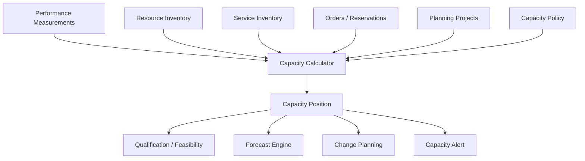
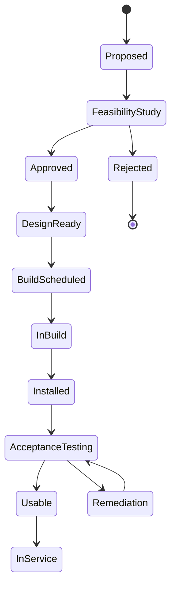
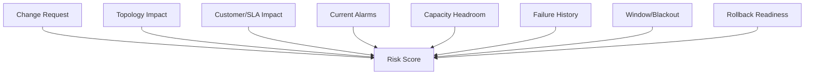
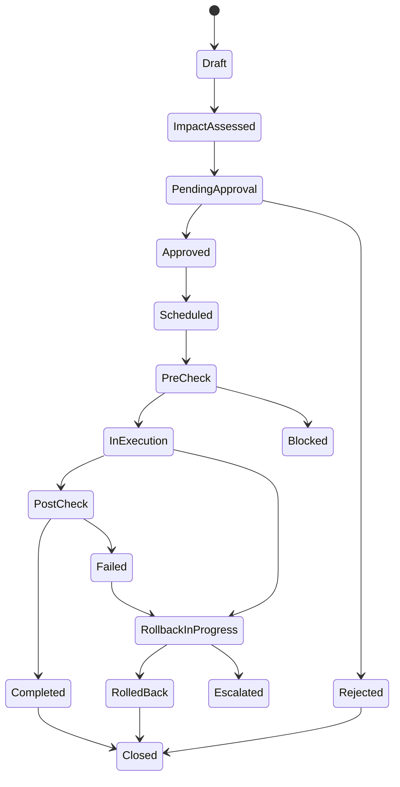
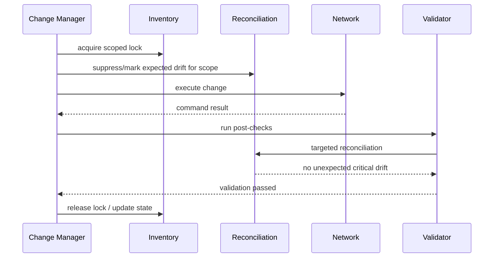
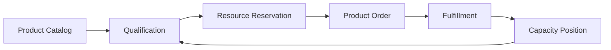
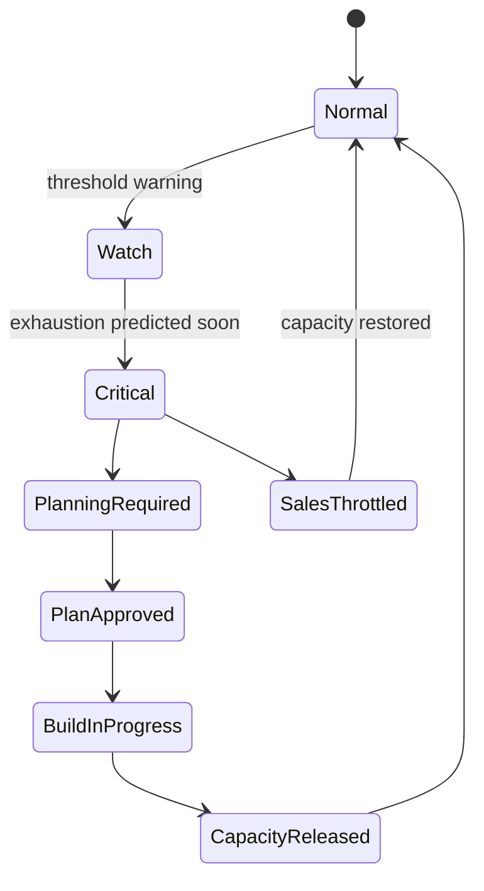

# Part 028 — Planning, Capacity & Network Change

Setelah memahami inventory, discovery, dan reconciliation, kita masuk ke kemampuan OSS yang lebih strategis: **planning, capacity, dan network change**.

Di telco, perubahan jaringan bukan sekadar deploy konfigurasi. Perubahan dapat memengaruhi ribuan customer, SLA enterprise, interconnect, roaming, emergency service, lawful intercept, billing, dan revenue assurance.

Seorang engineer BSS/OSS level tinggi harus bisa merancang sistem yang menjawab:

- kapasitas mana yang akan habis?
- resource mana yang aman dipakai untuk order baru?
- perubahan jaringan mana yang berisiko tinggi?
- customer mana yang terdampak maintenance?
- apakah change window bertabrakan dengan event bisnis?
- apakah kapasitas planned sudah menjadi installed?
- apakah after-change verification membuktikan service kembali normal?
- apakah inventory, topology, assurance, dan billing sudah disinkronkan setelah change?

Part ini membahas mental model dan blueprint Java untuk menjawab pertanyaan tersebut.

---

## 1. Target Skill Berdasarkan Kaufman

Target setelah part ini:

> Kamu mampu merancang capacity planning dan network change subsystem yang menghubungkan performance data, resource inventory, service topology, product demand, work order, change approval, maintenance notification, after-change validation, dan reconciliation sehingga perubahan jaringan dapat dilakukan secara aman, auditable, dan customer-impact-aware.

Bukan targetnya:

- membuat kalender maintenance sederhana.
- membuat dashboard utilization.
- menghafal ITIL change terminology.
- menulis job forecasting dummy.
- membuat approval form tanpa integrasi topology/assurance.

Skill utamanya adalah **mengubah sinyal operasional menjadi keputusan planning dan controlled execution**.

---

## 2. Skill Decomposition

| Sub-skill | Pertanyaan Kunci |
|---|---|
| Capacity semantics | Kapasitas apa yang diukur: port, bandwidth, IP, SIM, license, CPU, spectrum, slice, technician slot? |
| Utilization modeling | Bagaimana mengukur usage, committed usage, reserved capacity, headroom, oversubscription? |
| Forecasting | Kapan kapasitas habis dan confidence-nya berapa? |
| Demand integration | Bagaimana product order, sales forecast, campaign, enterprise project memengaruhi capacity plan? |
| Planning workflow | Bagaimana planned resource berubah menjadi installed/usable resource? |
| Change risk scoring | Apa customer/service/resource impact dari change? |
| Change window governance | Kapan change boleh dilakukan, siapa approval, blackout window apa? |
| Maintenance notification | Siapa yang harus diberi tahu dan bukti apa yang dibutuhkan? |
| After-change validation | Bagaimana membuktikan change sukses/tidak? |
| Java platform design | Bagaimana membuat subsystem event-driven, auditable, dan testable? |

---

## 3. Mental Model: Capacity adalah Constraint, Bukan Dashboard

Capacity bukan sekadar angka utilization.

> Capacity adalah constraint yang menentukan apakah order bisa dijual, service bisa diprovision, jaringan bisa tumbuh, dan SLA bisa dipertahankan.

Capacity memengaruhi:

- product offering qualification.
- serviceability check.
- resource reservation.
- order feasibility.
- activation scheduling.
- network expansion.
- maintenance planning.
- assurance priority.
- revenue assurance.

Jika capacity system hanya dashboard, ia terlambat. Sistem yang baik harus bisa memberi sinyal ke pre-ordering dan fulfillment.

---

## 4. Capacity Types in Telecom

| Capacity Type | Example | Planning Question |
|---|---|---|
| Physical port | OLT PON port, switch port, router port | Port tersedia cukup untuk order baru? |
| Bandwidth | backhaul, peering, access uplink, bearer | Headroom cukup untuk committed traffic? |
| Logical identifier | VLAN, VRF, MSISDN, IMSI, IP address | Pool akan habis kapan? |
| License | firewall session, EPC/5GC session, VNF license | License cukup untuk growth? |
| Compute | CNF/VNF CPU/memory/storage | Cluster cukup untuk scaling? |
| Radio | spectrum, PRB, cell capacity | Cell congested atau tidak? |
| Slice | S-NSSAI capacity, slice subnet | Slice SLA cukup? |
| Workforce | technician slot, truck roll | Appointment bisa dijadwalkan? |
| Device stock | CPE, ONT, SIM, router | Fulfillment bisa selesai? |
| Numbering | MSISDN ranges, short codes | Numbering pool masih aman? |

Capacity harus dikaitkan dengan resource/service/product, bukan berdiri sendiri.

---

## 5. Capacity State Model

Gunakan beberapa angka, bukan satu `availableCapacity`.

```java
public record CapacityPosition(
    String capacityPoolId,
    CapacityUnit unit,
    BigDecimal installed,
    BigDecimal usable,
    BigDecimal reserved,
    BigDecimal assigned,
    BigDecimal consumed,
    BigDecimal blocked,
    BigDecimal plannedExpansion,
    BigDecimal safetyBuffer,
    Instant measuredAt,
    String evidenceRef
) {
    public BigDecimal sellable() {
        return usable.subtract(reserved).subtract(assigned).subtract(safetyBuffer);
    }
}
```

### Meaning

| Field | Meaning |
|---|---|
| installed | kapasitas fisik/logical yang sudah ada |
| usable | kapasitas yang boleh dipakai setelah policy/health/filter |
| reserved | kapasitas di-hold untuk order/quote/proyek |
| assigned | kapasitas sudah committed ke service |
| consumed | usage aktual dari telemetry |
| blocked | tidak boleh dipakai karena fault/maintenance/regulatory |
| plannedExpansion | kapasitas yang direncanakan tapi belum usable |
| safetyBuffer | buffer untuk resilience/oversubscription policy |

---

## 6. Utilization vs Commitment vs Reservation

Jangan campur tiga konsep ini.

| Concept | Source | Example |
|---|---|---|
| Utilization | telemetry/performance | backhaul 72% average during busy hour |
| Commitment | service/order contract | customer committed 100 Mbps DIA |
| Reservation | pre-order/order workflow | VLAN/IP/port held for pending order |

Contoh problem:

- Utilization masih rendah, tetapi committed bandwidth sudah melebihi policy.
- Commitment rendah, tetapi busy-hour utilization tinggi karena oversubscription buruk.
- Reservation tinggi karena banyak order pending/fallout, sehingga order baru harus ditahan.

Capacity decision harus membaca ketiganya.

---

## 7. Capacity Data Flow



Capacity position harus menjadi reusable fact untuk:

- product qualification.
- service qualification.
- resource reservation.
- network planning.
- sales throttling.
- procurement.
- change approval.

---

## 8. Capacity Policy

Policy menentukan bagaimana angka diterjemahkan menjadi keputusan.

Contoh:

```yaml
capacityPolicies:
  - poolType: ACCESS_PON_PORT
    unit: PORT
    minSafetyBuffer: 2
    allowOversubscription: false
    qualificationThreshold: 1
  - poolType: BACKHAUL_BANDWIDTH
    unit: MBPS
    busyHourPercentile: 95
    maxUtilizationBeforeExpansion: 75
    maxCommittedOverInstalledRatio: 1.5
    safetyBufferPercent: 20
  - poolType: IPV4_POOL
    unit: ADDRESS
    minRemainingPercent: 10
    exhaustionWarningDays: 90
  - poolType: TECHNICIAN_SLOT
    unit: SLOT
    bookingHorizonDays: 14
    overbookingAllowed: false
```

Policy harus versioned karena keputusan order/feasibility harus bisa diaudit.

---

## 9. Forecasting Without Fantasy

Forecasting capacity tidak harus dimulai dengan machine learning.

Mulai dari model sederhana:

- moving average.
- busy-hour trend.
- percentile usage trend.
- depletion rate.
- committed growth rate.
- seasonal factor.
- known campaign/project demand.

### Simple depletion model

```java
public record DepletionForecast(
    String poolId,
    Instant forecastedExhaustionDate,
    Duration confidenceWindow,
    BigDecimal currentSellable,
    BigDecimal averageDailyNetConsumption,
    ForecastConfidence confidence
) {}
```

Pseudo-code:

```java
BigDecimal averageDailyConsumption = usageHistory.averageDailyNetConsumption(last90Days);
BigDecimal sellable = capacityPosition.sellable();

if (averageDailyConsumption.signum() <= 0) {
    return Forecast.noDepletionExpected(poolId);
}

BigDecimal daysToExhaustion = sellable.divide(averageDailyConsumption, RoundingMode.CEILING);
return Forecast.exhaustsAt(now.plus(daysToExhaustion.longValue(), ChronoUnit.DAYS));
```

Tambahkan known demand:

```text
projectedConsumption = historicalConsumption + confirmedOrders + campaignForecast + enterpriseProjectDemand
```

### Jangan overfit

Banyak capacity failure bukan karena model statistik kurang canggih, tetapi karena:

- inventory salah.
- reservation tidak dilepas.
- project delay tidak masuk forecast.
- telemetry missing.
- business campaign tidak disinkronkan.
- safety buffer tidak diterapkan.
- capacity pool boundary salah.

---

## 10. Planning Workflow

Planning mengubah intent menjadi usable capacity.



### Planning objects

| Object | Meaning |
|---|---|
| CapacityPlan | strategic plan to add/modify capacity |
| PlanningProject | executable project/work package |
| PlannedResource | resource expected to exist after project |
| BuildTask | field/network/software task |
| AcceptanceTest | validation before usable state |
| CapacityRelease | formal transition into sellable/usable capacity |

Planned capacity tidak boleh otomatis menjadi sellable sebelum acceptance.

---

## 11. Change Management: Network Change as Controlled Risk

Network change adalah controlled modification terhadap production network/resource/service/topology.

Jenis change:

| Type | Example |
|---|---|
| Standard change | known low-risk config template |
| Normal change | capacity upgrade, route change, firmware upgrade |
| Emergency change | outage repair, critical security fix |
| Bulk change | mass CPE migration, numbering migration |
| Planned maintenance | scheduled downtime/degradation |
| Service-affecting change | change may interrupt customer service |
| Non-service-affecting change | expected no customer impact, still validated |

OSS yang baik tidak hanya menyimpan change ticket. Ia menghitung risiko berdasarkan topology dan customer impact.

---

## 12. Change Risk Scoring

Risk score harus menggabungkan banyak dimensi.



Example model:

```java
public record ChangeRiskScore(
    String changeId,
    int score,
    RiskLevel level,
    List<RiskFactor> factors,
    List<String> requiredApprovals,
    boolean customerNotificationRequired,
    boolean maintenanceWindowRequired
) {}
```

Risk factors:

- number of impacted services.
- number of impacted customers.
- enterprise/VIP/SLA tier.
- redundancy availability.
- active alarms on target resources.
- capacity headroom after change.
- historical failure rate for similar change.
- rollback plan existence.
- blackout window conflict.
- regulatory/emergency service exposure.
- vendor/field dependency.

---

## 13. Customer Impact-Aware Maintenance

Maintenance tidak boleh hanya berisi resource list.

Maintenance harus tahu:

- service yang terdampak.
- customer yang terdampak.
- SLA impact.
- expected downtime/degradation.
- notification deadline.
- escalation path.
- rollback trigger.
- after-change validation criteria.

```java
public record MaintenanceImpact(
    String maintenanceId,
    List<String> resourceIds,
    List<String> serviceIds,
    List<String> customerIds,
    ImpactType impactType,
    Instant plannedStart,
    Instant plannedEnd,
    Duration expectedInterruption,
    List<NotificationRequirement> notifications
) {}
```

### Notification decision

| Impact | Notification |
|---|---|
| no service impact expected | internal only, unless SLA requires |
| degraded service | notify enterprise/VIP if threshold exceeded |
| planned outage | customer notification required |
| emergency change | post-facto notification may be allowed by policy |
| regulatory service affected | special approval/escalation |

---

## 14. Change Window and Blackout Rules

Change window rules harus explicit.

Contoh:

```yaml
changeWindows:
  - name: ACCESS_NETWORK_STANDARD
    allowedDays: [TUESDAY, WEDNESDAY, THURSDAY]
    startLocalTime: "00:00"
    endLocalTime: "05:00"
    maxExpectedOutageMinutes: 30

blackoutRules:
  - name: BILL_CYCLE_PEAK
    appliesTo: [BILLING_ADJACENT_SYSTEMS, CHARGING_PATH]
    fromDayOfMonth: 28
    toDayOfMonth: 3
  - name: ENTERPRISE_CRITICAL_EVENT
    appliesToCustomerSegment: ENTERPRISE_GOLD
    source: CUSTOMER_AGREEMENT
```

Pastikan timezone jelas. Telco multi-region sering gagal karena maintenance window ditafsirkan lokal vs UTC.

---

## 15. Change Execution State Machine



### Pre-check examples

- target resources reachable.
- no critical active alarm on target.
- capacity headroom adequate.
- backup path healthy.
- rollback artifact available.
- inventory lock acquired.
- conflicting change absent.
- customer notification sent if required.

### Post-check examples

- resource operational state healthy.
- service test passed.
- alarm baseline normal.
- KPI within threshold.
- inventory updated.
- topology updated.
- reconciliation no critical drift.
- impacted customers restored.

---

## 16. Inventory Locking and Change Collision

Network change can collide with order fulfillment, activation, reconciliation, or another change.

Use scoped locks.

```java
public record InventoryLock(
    String lockId,
    LockScope scope,
    String ownerType,
    String ownerId,
    Instant acquiredAt,
    Instant expiresAt
) {}
```

Lock scope examples:

- resource id.
- site.
- topology subgraph.
- IP pool.
- slice subnet.
- service id.

Avoid global lock.

Collision policy:

| Conflict | Policy |
|---|---|
| order activation vs maintenance outage | block or reschedule activation |
| two changes same router | require sequencing |
| reconciliation auto-correction during change | suspend auto-correction for scope |
| field work and remote config | coordinate via work order |
| capacity reservation during expansion | allow if planned capacity is not yet sellable? usually no |

---

## 17. Java Component Blueprint

```mermaid
flowchart TB
  subgraph Signals
    PM[Performance API / Telemetry]
    INV[Resource Inventory]
    SVC[Service Inventory]
    ORD[Orders / Reservations]
    TOPO[Topology]
    ALARM[Alarm/Event]
  end

  subgraph Capacity
    Calc[Capacity Calculator]
    Forecast[Forecast Engine]
    Alert[Capacity Alert Manager]
    Policy[Capacity Policy]
  end

  subgraph Planning
    Plan[Planning Project Manager]
    Design[Planned Resource Designer]
    Release[Capacity Release]
  end

  subgraph Change
    Change[Change Manager]
    Impact[Impact Analyzer]
    Risk[Risk Scorer]
    Approval[Approval Workflow]
    Executor[Change Executor]
    Validation[Post-Change Validator]
  end

  PM --> Calc
  INV --> Calc
  SVC --> Calc
  ORD --> Calc
  TOPO --> Impact
  ALARM --> Risk
  Calc --> Forecast
  Policy --> Calc
  Forecast --> Alert
  Alert --> Plan
  Plan --> Design
  Design --> Release
  Release --> INV
  Change --> Impact
  Impact --> Risk
  Risk --> Approval
  Approval --> Executor
  Executor --> Validation
  Validation --> INV
```

### Suggested package structure

```text
com.example.telco.oss.planning
  capacity
    CapacityPool.java
    CapacityPosition.java
    CapacityPolicy.java
    CapacityCalculator.java
    ForecastEngine.java
    CapacityAlert.java
  planning
    CapacityPlan.java
    PlanningProject.java
    PlannedResource.java
    CapacityRelease.java
  change
    NetworkChange.java
    ChangeImpact.java
    ChangeRiskScore.java
    ChangeWindowPolicy.java
    MaintenanceImpact.java
    ChangeApproval.java
    ChangeExecution.java
    PostChangeValidation.java
  application
    CalculateCapacityUseCase.java
    ForecastExhaustionUseCase.java
    AssessChangeImpactUseCase.java
    ApproveChangeUseCase.java
    ExecuteChangeUseCase.java
  infrastructure
    tmf628
    tmf639
    tmf638
    tmf686
    vendor
    persistence
```

---

## 18. Capacity Calculator Example

```java
public final class CapacityCalculator {
    private final CapacityPolicyRepository policyRepository;
    private final ReservationRepository reservationRepository;
    private final AssignmentRepository assignmentRepository;
    private final TelemetryRepository telemetryRepository;

    public CapacityPosition calculate(CapacityPool pool, Instant at) {
        CapacityPolicy policy = policyRepository.findFor(pool.type());

        BigDecimal installed = pool.installedCapacity();
        BigDecimal blocked = pool.blockedCapacity();
        BigDecimal reserved = reservationRepository.sumActiveReservations(pool.id(), at);
        BigDecimal assigned = assignmentRepository.sumAssignments(pool.id(), at);
        BigDecimal consumed = telemetryRepository.busyHourConsumption(pool.id(), policy.busyHourWindow(), at);
        BigDecimal safetyBuffer = policy.calculateSafetyBuffer(installed, consumed, assigned);

        BigDecimal usable = installed.subtract(blocked);

        return new CapacityPosition(
            pool.id().value(),
            pool.unit(),
            installed,
            usable,
            reserved,
            assigned,
            consumed,
            blocked,
            pool.plannedExpansion(),
            safetyBuffer,
            at,
            pool.evidenceRef()
        );
    }
}
```

Important nuance:

- `consumed` is telemetry usage.
- `assigned` is service commitment.
- `reserved` is pending demand.
- `usable` excludes blocked capacity.
- `sellable()` excludes safety buffer.

---

## 19. Change Impact Analyzer Example

```java
public final class ChangeImpactAnalyzer {
    private final TopologyQuery topologyQuery;
    private final ServiceInventory serviceInventory;
    private final CustomerProfileClient customerProfileClient;
    private final SlaRepository slaRepository;

    public ChangeImpact assess(NetworkChange change) {
        Set<ResourceId> targetResources = change.targetResources();
        Set<ResourceId> affectedSubgraph = topologyQuery.downstreamResources(targetResources);
        List<ServiceRef> services = serviceInventory.findServicesDependingOn(affectedSubgraph);

        List<CustomerImpact> customerImpacts = services.stream()
            .map(service -> {
                CustomerProfile profile = customerProfileClient.findByService(service.id());
                SlaProfile sla = slaRepository.findForService(service.id());
                return CustomerImpact.from(service, profile, sla);
            })
            .toList();

        return new ChangeImpact(change.id(), affectedSubgraph, services, customerImpacts);
    }
}
```

Do not assess change based only on device list. Use topology.

---

## 20. After-Change Validation

Change is not complete when command succeeds.

Change is complete when expected business/operational invariants are restored.

Validation sources:

- activation command result.
- device read-back.
- inventory update.
- topology relation update.
- alarm check.
- KPI check.
- synthetic test.
- service test.
- customer-impact check.
- reconciliation drift check.

### Validation model

```java
public record ValidationCriterion(
    String name,
    ValidationSource source,
    Duration timeout,
    boolean mandatory,
    String expectedExpression
) {}

public record ValidationResult(
    String criterionName,
    ValidationStatus status,
    String evidenceRef,
    Instant checkedAt
) {}
```

Example criteria:

```yaml
postChangeValidation:
  - name: target-resource-reachable
    source: NETWORK_READBACK
    mandatory: true
    timeout: PT10M
  - name: no-critical-alarm
    source: ALARM_SYSTEM
    mandatory: true
    timeout: PT15M
  - name: service-test-pass
    source: SERVICE_TEST
    mandatory: true
    timeout: PT20M
  - name: inventory-reconciled
    source: RECONCILIATION
    mandatory: true
    timeout: PT30M
```

---

## 21. Change and Reconciliation Integration

During change, expected drift may appear temporarily.

Example:

- interface removed then recreated.
- route moved to backup path.
- card replaced with new serial.
- VLAN migrated.
- CPE swapped.

Reconciliation system must know change window.



Do not disable reconciliation globally. Suppress only scoped expected drift.

---

## 22. Capacity and Order Qualification Integration

Capacity planning harus memberi sinyal ke pre-order/order.



Decision examples:

| Condition | Qualification Result |
|---|---|
| sellable capacity sufficient | qualified |
| capacity sufficient but technician slot unavailable | qualified with appointment constraint |
| capacity insufficient but planned expansion soon | qualified with future availability date |
| capacity exhausted and no plan | not qualified |
| capacity unknown due inventory drift | qualified uncertain or manual feasibility required |

---

## 23. Capacity Alert Lifecycle



Capacity alert harus action-oriented.

Bad alert:

> Region A utilization 80%.

Good alert:

> Backhaul pool `JKT-WEST-BH-01` predicted to breach 75% busy-hour utilization within 42 days. 1,284 services affected, 92 gold SLA services. Recommended actions: approve expansion project `CAP-2026-018`, throttle new 1Gbps offers for affected coverage zones, reserve 20% safety buffer.

---

## 24. Failure Modes

| Failure Mode | Symptom | Mitigation |
|---|---|---|
| planned capacity treated as sellable | orders sold before network ready | capacity release gate + acceptance test |
| utilization only, commitment ignored | overselling committed services | combine consumed + assigned + reserved |
| stale inventory in forecast | forecast inaccurate | reconciliation freshness requirement |
| capacity alert not tied to action | ignored dashboard | alert lifecycle + planning workflow |
| change impact based on resource list only | missed affected customers | topology-based impact analysis |
| no blackout rules | change during billing/campaign peak | explicit blackout policy |
| global reconciliation suppression | real drift hidden | scoped expected drift handling |
| command success treated as change success | hidden service impact | post-change validation criteria |
| rollback untested | failed emergency recovery | rollback readiness risk factor |
| capacity pool boundary wrong | false available capacity | pool modeling review and reconciliation |

---

## 25. Design Checklist

Before implementing planning/capacity/change subsystem:

- What capacity units exist?
- What is the capacity pool boundary?
- What are installed, usable, reserved, assigned, consumed, blocked, safety buffer?
- Which telemetry defines utilization?
- Which inventory source defines installed capacity?
- Which order/reservation source defines pending demand?
- Which service inventory defines commitment?
- What is the policy for oversubscription?
- Is capacity position versioned and auditable?
- How does qualification consume capacity?
- How is planned capacity released into usable capacity?
- How is change impact computed from topology?
- What are approval thresholds?
- What are blackout and change window rules?
- What evidence is required before closure?
- What reconciliation must run after change?
- How are customer notifications proven?

---

## 26. Practice: Capacity and Change Design

### Scenario

A telco region has:

- installed backhaul capacity: 10 Gbps.
- busy-hour P95 consumed: 7.1 Gbps.
- assigned committed bandwidth: 13 Gbps due oversubscription.
- active reservations: 1.2 Gbps.
- safety buffer policy: 20% installed capacity.
- planned expansion: +10 Gbps, not yet accepted.
- 74 gold enterprise services depend on this backhaul.
- sales campaign will add expected 2 Gbps committed demand in 45 days.

### Task

Design:

1. capacity position.
2. sellable capacity.
3. forecast decision.
4. qualification behavior for new 1 Gbps order.
5. change plan for expansion.
6. risk score factors.
7. post-change validation criteria.

Expected reasoning:

- planned expansion is not sellable until accepted.
- safety buffer is 2 Gbps.
- usable sellable may already be negative depending policy.
- new 1 Gbps order should require manual feasibility or future availability.
- expansion change is high-impact because many gold services depend on it.
- post-change validation must include telemetry, alarm, topology, inventory, and service tests.

---

## 27. Summary

Planning, capacity, dan network change adalah layer yang mengubah OSS dari reactive menjadi proactive.

Capacity bukan dashboard. Ia adalah constraint yang memengaruhi:

- qualification.
- reservation.
- fulfillment.
- planning.
- assurance.
- change approval.
- revenue protection.

Network change bukan ticket biasa. Ia adalah controlled risk yang harus:

- menghitung topology/customer/SLA impact.
- mematuhi change window dan blackout policy.
- mengunci scope yang tepat.
- menekan expected drift secara terbatas.
- menjalankan pre-check dan post-check.
- membuktikan hasil dengan evidence.
- memperbarui inventory/topology/reconciliation.

Jika Part 027 menjaga inventory tetap benar terhadap jaringan aktual, Part 028 memastikan jaringan berubah dengan rencana, kapasitas, risiko, dan bukti yang dapat dipertanggungjawabkan.

---

## References

- TM Forum TMF628 Performance Management API — performance management resources such as Measurement Production Job, Measurement Collection Job, Ad hoc Collection, and event notifications.
- TM Forum TMF639 Resource Inventory Management API — standardized mechanism to query and manipulate resource inventory.
- TM Forum TMF638 Service Inventory Management API — standardized mechanism to query and manipulate service inventory.
- TM Forum TMF686 Topology Management API — topology discovery service providing directed graph relationship overlay.
- TM Forum TMF688 Event Management API — enterprise event interface for automation workflows, outage/SLA notifications, trouble ticket triggering, and orchestration scenarios.
- TM Forum TMF652 Resource Order Management API — resource order creation/update/retrieval lifecycle.
- TM Forum TMF685 Resource Pool Management API — resource reservation and pool handling, especially for pre-order phase.
