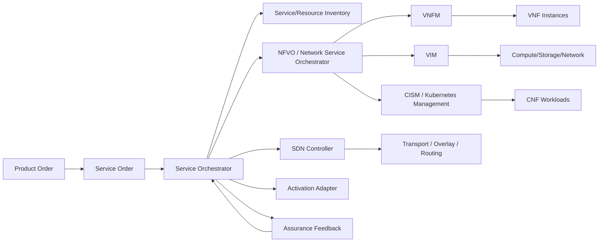
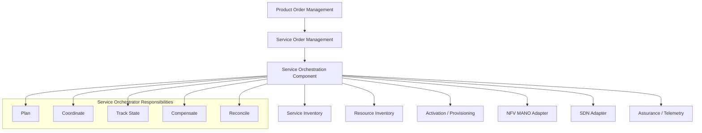
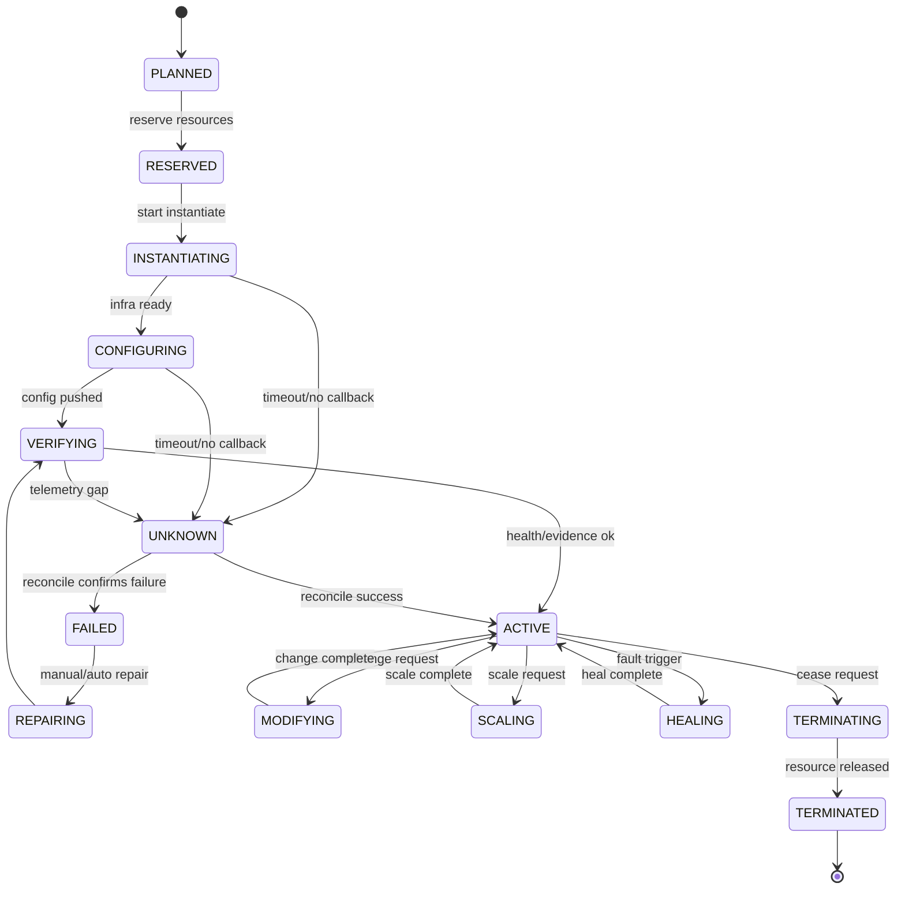
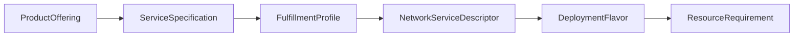
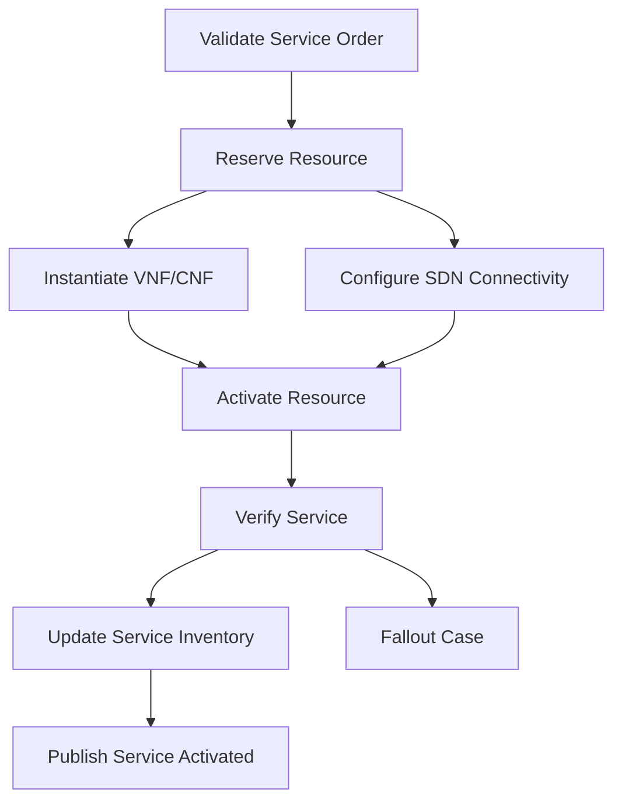
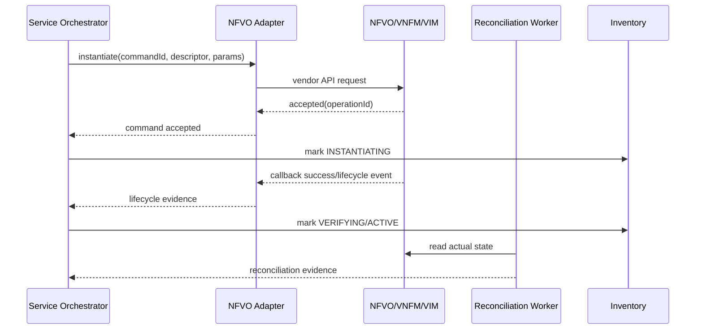
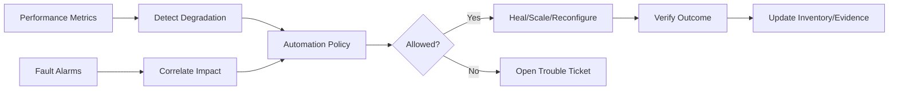

# Part 029 — NFV/SDN/MANO & Service Orchestration

Bagian ini membahas cara berpikir dan mendesain **service orchestration** untuk network modern: NFV, SDN, MANO, VNF, CNF, resource placement, lifecycle automation, dan Java component boundary.

Kita tidak akan mengulang Java concurrency, messaging, observability, security, atau BPMN yang sudah dibahas di seri lain. Di sini semua skill tersebut diasumsikan sebagai prasyarat dan dipakai untuk membangun orchestration layer yang telco-grade.

## 1. Target Skill Berdasarkan Kaufman

Setelah menyelesaikan bagian ini, target praktisnya bukan sekadar tahu istilah NFVO/VNFM/VIM. Targetnya adalah mampu:

1. membaca product/service fulfillment requirement dan menerjemahkannya menjadi network service lifecycle plan;
2. memisahkan peran BSS, service order, service orchestrator, NFVO/VNFM/VIM/CISM, SDN controller, dan activation adapter;
3. mendesain Java orchestration component yang tahan terhadap long-running operation, partial failure, unknown state, dan reconciliation;
4. membuat model state machine untuk instantiate, modify, scale, heal, terminate, dan rollback network service;
5. menentukan kapan workflow engine, state machine, event choreography, dan external orchestrator perlu dipakai;
6. menghindari anti-pattern: orchestration monster, vendor-lock schema leakage, non-idempotent southbound call, dan inventory drift.

Kaufman framing-nya:

| Kaufman Step | Dalam NFV/SDN/MANO |
|---|---|
| Deconstruct skill | Pisahkan skill menjadi domain model, lifecycle, orchestration, adapter, reconciliation, assurance feedback. |
| Learn enough to self-correct | Pahami standar/role utama sehingga bisa mengecek apakah desain salah boundary. |
| Remove practice barrier | Gunakan mini domain model dan fake NFVO/SDN adapter agar latihan tidak tergantung lab network mahal. |
| Practice deliberately | Simulasikan instantiate/scale/fail/reconcile dengan state machine dan event log. |

## 2. Mental Model Utama

**Service orchestration adalah penerjemahan intent bisnis/layanan menjadi perubahan jaringan yang terkendali, terukur, dan dapat direkonsiliasi.**

BSS biasanya berbicara dalam istilah:

- customer;
- product;
- subscription;
- product order;
- agreement;
- SLA;
- charge;
- entitlement.

OSS fulfillment berbicara dalam istilah:

- service;
- resource;
- topology;
- activation;
- inventory;
- work order;
- network change;
- alarm;
- performance.

NFV/SDN/MANO berbicara dalam istilah:

- network service;
- network function;
- VNF/CNF;
- descriptor;
- flavor/profile;
- deployment unit;
- compute/network/storage resource;
- lifecycle operation;
- placement;
- scaling;
- healing;
- termination.

Kesalahan umum engineer aplikasi adalah mengira orchestration hanya “workflow yang memanggil API vendor”. Pada telco, orchestration harus menjaga **lifecycle contract** antar layer.



## 3. Standard Compass

Gunakan standar sebagai **kompas boundary**, bukan sebagai schema internal mentah.

| Standard Area | Peran Arsitektural |
|---|---|
| ETSI NFV MANO | Menjelaskan architectural framework untuk management and orchestration capability seperti NFVO, VNFM, VIM, WIM, dan container infrastructure management function. |
| TM Forum ODA | Membantu memecah BSS/OSS menjadi reusable components dan Open APIs untuk cloud-native telco stack. |
| TMF641 Service Ordering | Boundary order layanan dari layer fulfillment. |
| TMF638 Service Inventory | Boundary inventory service instance. |
| TMF639 Resource Inventory | Boundary inventory resource. |
| TMF702 Resource Activation | Boundary activation/configuration resource. |
| TMF640 Service Activation | Masih sering ditemukan di landscape lama, tetapi perlu dicek terhadap Open API version yang dipakai organisasi karena beberapa API berubah/tergantikan tergantung versi. |
| MEF LSO | Berguna untuk orchestration lintas provider/domain, terutama enterprise connectivity. |

Aturan praktis:

> Jangan membiarkan descriptor/vendor model bocor sampai ke Product Order atau Customer API. Descriptor adalah technical realization, bukan commercial contract.

## 4. Vocabulary Inti

### 4.1 Network Service

Network Service adalah komposisi network functions dan connectivity yang bersama-sama memberikan capability jaringan. Contoh:

- enterprise SD-WAN service;
- virtual firewall service;
- mobile packet core slice component;
- private 5G local breakout;
- managed router service;
- broadband BNG-backed service.

Network service berbeda dari product.

| Product | Service | Network Service |
|---|---|---|
| Apa yang dijual | Apa yang diberikan ke customer | Bagaimana network capability diwujudkan |
| Commercial | Logical/customer-facing | Technical/resource-facing |
| Berisi price/terms | Berisi entitlement/SLA | Berisi VNF/CNF/connectivity lifecycle |

### 4.2 VNF, CNF, PNF

| Type | Makna | Contoh |
|---|---|---|
| PNF | Physical Network Function | physical router, legacy appliance, physical firewall |
| VNF | Virtual Network Function | VM-based firewall, VM-based EPC component |
| CNF | Cloud-native Network Function | containerized UPF, cloud-native policy function, microservice-based network function |

Dalam platform Java BSS/OSS, jangan mendesain business logic yang terlalu peduli apakah fungsi dijalankan sebagai PNF/VNF/CNF. Yang perlu diketahui fulfillment adalah:

- capability apa yang dibutuhkan;
- descriptor/profile/flavor mana yang valid;
- lifecycle operation apa yang tersedia;
- state dan evidence apa yang membuktikan operasi berhasil.

### 4.3 NFVO, VNFM, VIM, CISM, WIM

| Komponen | Pertanyaan yang dijawab |
|---|---|
| NFVO | Network service apa yang harus dibuat, dimodifikasi, diskalakan, atau dihentikan? |
| VNFM | Bagaimana lifecycle VNF dikelola? |
| VIM | Resource virtualisasi mana yang menyediakan compute/storage/network? |
| CISM | Cluster/container infrastructure mana yang menjalankan CNF? |
| WIM | Bagaimana WAN/inter-site connectivity diatur? |
| SDN Controller | Bagaimana forwarding, overlay, routing, tunnel, atau network policy dikonfigurasi? |

## 5. Boundary Arsitektur

Service orchestration bukan tempat semua logic ditempatkan. Ia harus menjadi layer yang mengkoordinasi capability, bukan mengganti semua sistem downstream.



### 5.1 Yang Boleh Ada di Service Orchestrator

- decomposition dari service specification ke fulfillment plan;
- sequencing dan dependency graph;
- call orchestration ke NFVO/SDN/activation adapter;
- command idempotency;
- lifecycle state tracking;
- compensation policy;
- reconciliation policy;
- event publication;
- evidence collection;
- SLA-aware execution.

### 5.2 Yang Tidak Boleh Bocor ke Service Orchestrator

- pricing rules;
- invoice calculation;
- customer identity merge;
- raw vendor-specific exception yang dipakai business flow;
- SQL join langsung ke semua inventory;
- direct SSH/telnet command tanpa command envelope;
- manual override tanpa audit;
- assumption bahwa timeout berarti failure.

## 6. Lifecycle Operation Model

Network service lifecycle minimal:



State `UNKNOWN` wajib ada. Dalam sistem telco, downstream call bisa timeout sementara operasi tetap sukses di network. Kalau timeout langsung dianggap gagal, sistem akan memicu duplicate provisioning, double charging readiness, atau inventory corruption.

## 7. Java Domain Model Minimal

Model ini bukan schema final, melainkan starting point untuk deliberate practice.

```java
public enum NetworkServiceState {
    PLANNED,
    RESERVED,
    INSTANTIATING,
    CONFIGURING,
    VERIFYING,
    ACTIVE,
    MODIFYING,
    SCALING,
    HEALING,
    TERMINATING,
    TERMINATED,
    UNKNOWN,
    FAILED,
    REPAIRING
}

public record NetworkServiceId(String value) {}
public record ServiceOrderId(String value) {}
public record CorrelationId(String value) {}
public record DescriptorId(String value, String version) {}

public record LifecycleCommand(
    String commandId,
    NetworkServiceId networkServiceId,
    String operation,
    DescriptorId descriptorId,
    Map<String, Object> parameters,
    CorrelationId correlationId
) {}

public record LifecycleEvidence(
    String evidenceId,
    NetworkServiceId networkServiceId,
    String sourceSystem,
    String observedState,
    Instant observedAt,
    Map<String, Object> facts
) {}
```

Aggregate behavior harus memvalidasi transition, bukan sekadar setter.

```java
public final class NetworkServiceInstance {
    private final NetworkServiceId id;
    private NetworkServiceState state;
    private long version;

    public void markInstantiateStarted(String commandId) {
        requireState(NetworkServiceState.RESERVED);
        this.state = NetworkServiceState.INSTANTIATING;
        recordEvent(new InstantiateStarted(id, commandId, Instant.now()));
    }

    public void markUnknown(String commandId, String reason) {
        if (!Set.of(
            NetworkServiceState.INSTANTIATING,
            NetworkServiceState.CONFIGURING,
            NetworkServiceState.VERIFYING,
            NetworkServiceState.MODIFYING,
            NetworkServiceState.SCALING,
            NetworkServiceState.HEALING,
            NetworkServiceState.TERMINATING
        ).contains(this.state)) {
            throw new IllegalStateException("Cannot mark UNKNOWN from " + this.state);
        }
        this.state = NetworkServiceState.UNKNOWN;
        recordEvent(new LifecycleStateUnknown(id, commandId, reason, Instant.now()));
    }

    public void reconcileAsActive(LifecycleEvidence evidence) {
        requireState(NetworkServiceState.UNKNOWN, NetworkServiceState.VERIFYING);
        if (!"ACTIVE".equals(evidence.observedState())) {
            throw new IllegalArgumentException("Evidence does not prove ACTIVE");
        }
        this.state = NetworkServiceState.ACTIVE;
        recordEvent(new NetworkServiceActivated(id, evidence.evidenceId(), Instant.now()));
    }
}
```

## 8. Descriptor and Profile Modeling

Descriptor adalah technical contract untuk deployment. Product offering tidak boleh bergantung langsung pada descriptor detail.



### 8.1 Descriptor Versioning Rule

- descriptor version immutable setelah dipakai oleh active service;
- new deployment menggunakan latest approved version;
- existing service modify harus mengecek compatibility matrix;
- rollback membutuhkan descriptor sebelumnya tetap tersedia;
- descriptor approval harus punya security and operational certification.

### 8.2 Compatibility Matrix

| Change | Existing Instance Impact | Strategy |
|---|---|---|
| Add optional parameter | Low | allow rolling adoption |
| Rename parameter | High | create new descriptor version with mapping adapter |
| Change resource flavor | Medium/High | migration plan required |
| Change network interface | High | maintenance window and topology validation |
| Change image only | Medium | health-check and rollback policy required |

## 9. Orchestration Plan Design

Service orchestration perlu model plan eksplisit.

```java
public record OrchestrationPlan(
    String planId,
    ServiceOrderId serviceOrderId,
    List<PlanStep> steps,
    CompensationPolicy compensationPolicy
) {}

public record PlanStep(
    String stepId,
    String name,
    StepType type,
    List<String> dependsOn,
    RetryPolicy retryPolicy,
    TimeoutPolicy timeoutPolicy,
    boolean requiresEvidence
) {}

enum StepType {
    RESERVE_RESOURCE,
    INSTANTIATE_NETWORK_SERVICE,
    CONFIGURE_CONNECTIVITY,
    ACTIVATE_RESOURCE,
    VERIFY_TELEMETRY,
    UPDATE_INVENTORY,
    NOTIFY_BILLING_READINESS,
    RELEASE_RESOURCE
}
```

Dependency graph lebih aman daripada hard-coded sequence karena fulfillment telco sering paralel sebagian.



## 10. Southbound Adapter Pattern

Southbound adapter adalah anti-corruption boundary. Ia menerjemahkan domain command menjadi vendor/protocol call, lalu menormalisasi response menjadi domain evidence.



### 10.1 Adapter Contract

Setiap adapter harus menjawab:

1. apakah command diterima?  
2. apakah command sudah pernah dikirim?  
3. apakah operation sedang berjalan?  
4. apakah operation selesai?  
5. evidence apa yang membuktikan hasil?  
6. bagaimana membaca actual state?  
7. bagaimana membatalkan atau mengompensasi?  
8. bagaimana mengklasifikasikan error?

### 10.2 Error Classification

| Error Type | Meaning | Handling |
|---|---|---|
| Validation error | request invalid | fail fast, no retry |
| Capacity error | insufficient infra | fallout or alternative placement |
| Conflict error | resource already exists/locked | read actual state, reconcile |
| Timeout | result unknown | mark UNKNOWN, schedule reconcile |
| Transient transport error | call may not reach target | retry with idempotency key |
| Vendor internal error | target failed | retry limited, then fallout |
| Inconsistent callback | callback contradicts inventory | quarantine and reconcile |

## 11. Placement and Capacity

NFV/CNF orchestration harus memperhatikan placement. Placement tidak hanya soal “ada CPU”. Untuk telco, placement mencakup:

- latency;
- locality;
- availability zone;
- redundancy model;
- regulatory/data residency constraint;
- transport reachability;
- hardware acceleration;
- slice/service class;
- tenant isolation;
- maintenance window;
- current fault domain status.

```java
public record PlacementConstraint(
    String region,
    String zone,
    Integer maxLatencyMs,
    boolean requiresHardwareAcceleration,
    String isolationLevel,
    Set<String> forbiddenFaultDomains
) {}
```

Prinsip:

> Placement decision harus explainable. Jika service gagal dibuat karena capacity, sistem harus bisa menjelaskan constraint mana yang tidak terpenuhi.

## 12. VNF/CNF Lifecycle Nuance

### 12.1 VNF Lifecycle

VNF cenderung VM-oriented:

- instantiate VM;
- attach network interfaces;
- bootstrap configuration;
- wait health;
- register with EMS/NMS;
- update inventory;
- manage scale/heal through VNFM.

### 12.2 CNF Lifecycle

CNF cenderung Kubernetes/cloud-native:

- validate namespace/tenant;
- apply helm/operator/custom resource;
- wait pod readiness;
- validate service endpoint;
- configure network attachment/policy;
- integrate with observability;
- manage upgrade/rollback.

CNF tidak otomatis berarti lebih sederhana. Telco CNF tetap membutuhkan lifecycle governance, version compatibility, admission control, resource quota, observability, and rollback evidence.

## 13. SDN Integration

SDN controller biasanya mengatur:

- overlay network;
- tunnel;
- VLAN/VXLAN;
- route policy;
- QoS policy;
- ACL/security group;
- service chaining;
- traffic steering.

Jangan jadikan service orchestrator sebagai mini SDN controller. Service orchestrator harus mengirim **intent atau policy-level request**, bukan mengelola forwarding table detail kecuali benar-benar domain-nya.

```java
public record ConnectivityIntent(
    String intentId,
    String serviceInstanceId,
    Endpoint aEnd,
    Endpoint zEnd,
    BandwidthProfile bandwidth,
    LatencyProfile latency,
    SecurityPolicy securityPolicy
) {}
```

## 14. Closed-Loop Automation

Service orchestration tidak berhenti setelah active. Ia harus menerima assurance feedback.



Closed-loop automation harus punya guardrail:

- max automation frequency;
- blast-radius limit;
- tenant/customer restriction;
- maintenance window awareness;
- rollback condition;
- human approval threshold;
- audit event for every decision.

## 15. Reconciliation as First-Class Capability

NFV/SDN operations sering asynchronous. Karena itu reconciliation bukan batch tambahan, melainkan core capability.

Reconciliation sources:

- orchestrator operation status;
- NFVO actual state;
- VIM/CISM actual resource;
- SDN controller state;
- service inventory;
- resource inventory;
- assurance telemetry;
- customer-facing service status.

Reconciliation questions:

1. Apakah service yang dianggap active benar-benar active?
2. Apakah resource yang reserved sudah assigned atau masih dangling?
3. Apakah network path sesuai intent?
4. Apakah descriptor version sesuai expected?
5. Apakah scaling result tercatat di inventory?
6. Apakah termination melepaskan semua resource?
7. Apakah assurance menunjukkan service sehat?

## 16. Idempotency and Operation Identity

Setiap lifecycle operation harus punya identity stabil.

```java
public record OperationIdentity(
    String operationId,
    String idempotencyKey,
    String externalOperationId,
    String serviceInstanceId,
    String operationType,
    Instant requestedAt
) {}
```

Rule:

- retry menggunakan idempotency key sama;
- duplicate callback harus aman;
- callback tanpa operation id harus direkonsiliasi dengan correlation facts;
- operation id tidak boleh direuse lintas service instance;
- external operation id disimpan sebagai evidence, bukan primary business id.

## 17. Observability Khusus Orchestration

Metric umum latency/error tidak cukup. Tambahkan domain metric:

| Metric | Purpose |
|---|---|
| lifecycle_operation_started_total | volume operation per type |
| lifecycle_operation_completed_total | completion rate |
| lifecycle_operation_unknown_total | downstream ambiguity rate |
| reconciliation_correction_total | drift correction count |
| fallout_created_total | manual intervention rate |
| activation_evidence_lag_seconds | delay from command to evidence |
| descriptor_version_deployment_total | version rollout visibility |
| compensation_invoked_total | rollback/compensation rate |
| resource_dangling_total | leaked resource indicator |

Trace harus membawa:

- product order id;
- service order id;
- service instance id;
- network service id;
- operation id;
- idempotency key;
- external operation id;
- tenant/customer segment bila aman.

## 18. Common Failure Scenarios

### 18.1 Timeout but Success

Flow:

1. orchestrator calls NFVO instantiate;
2. HTTP timeout;
3. NFVO actually accepted and executes;
4. orchestrator retries without idempotency;
5. duplicate network service created.

Correct behavior:

- command uses idempotency key;
- timeout becomes `UNKNOWN`;
- reconciliation reads NFVO by correlation id;
- duplicate prevention happens before new attempt.

### 18.2 Inventory Says Active, Network Says Missing

Possible causes:

- manual network deletion;
- failed termination incorrectly marked active;
- inventory update before activation evidence;
- migration drift.

Handling:

- quarantine service impact;
- create reconciliation case;
- block further modification until authority decision;
- do not silently recreate without customer impact analysis.

### 18.3 Scaling Loop Storm

Assurance triggers scale-out repeatedly.

Prevention:

- cool-down window;
- max scale per interval;
- confirmation from multiple signals;
- rollback condition;
- budget/capacity guard;
- ticket escalation after repeated failure.

## 19. Anti-Patterns

| Anti-Pattern | Why Dangerous | Better Pattern |
|---|---|---|
| One orchestration mega-service | impossible ownership and release risk | bounded orchestration per capability/domain |
| Raw vendor schema as domain model | lock-in and brittle upstream coupling | anti-corruption adapter |
| Timeout equals failure | duplicate provisioning | unknown + reconciliation |
| No operation identity | unsafe retry | idempotency key + operation store |
| Inventory updated before evidence | false activation | evidence-driven state transition |
| Descriptor mutable in place | untraceable change | immutable descriptor version |
| Closed-loop without guardrail | runaway automation | policy, limit, approval threshold |
| Manual fix outside system | invisible drift | audited fallout action |

## 20. Practice: Mini NFV Service Orchestrator

Bangun mini exercise berikut.

### 20.1 Scope

Implementasikan service `ManagedFirewallService`.

Input:

- service order id;
- customer site id;
- bandwidth profile;
- firewall package;
- region;
- redundancy flag.

Output:

- network service instance;
- resource reservation;
- NFVO operation;
- SDN connectivity intent;
- activation evidence;
- service inventory state.

### 20.2 Required Failure Simulation

Simulasikan:

1. NFVO timeout but later success;
2. SDN conflict because route already exists;
3. resource reservation expired;
4. VNF health check failed;
5. duplicate callback;
6. manual repair resumes workflow;
7. termination leaves dangling resource;
8. reconciliation corrects inventory.

### 20.3 Acceptance Criteria

Sistem dianggap benar jika:

- no duplicate network service on retry;
- no active inventory without evidence;
- every external call has operation identity;
- timeout becomes unknown;
- reconciliation can move unknown to active/failed;
- fallout case has resume token;
- termination releases reserved/assigned resources;
- trace can follow product order to NFVO operation.

## 21. Java Package Blueprint

```text
com.example.telco.orchestration
  ├── api
  │   ├── ServiceOrchestrationController.java
  │   └── dto
  ├── application
  │   ├── StartLifecycleOperationUseCase.java
  │   ├── HandleLifecycleEvidenceUseCase.java
  │   ├── ReconcileNetworkServiceUseCase.java
  │   └── CompensateOperationUseCase.java
  ├── domain
  │   ├── NetworkServiceInstance.java
  │   ├── OrchestrationPlan.java
  │   ├── LifecycleOperation.java
  │   ├── Descriptor.java
  │   └── event
  ├── adapter
  │   ├── nfvo
  │   ├── sdn
  │   ├── inventory
  │   └── assurance
  ├── persistence
  │   ├── OperationStore.java
  │   └── NetworkServiceRepository.java
  └── worker
      ├── OperationTimeoutWorker.java
      └── ReconciliationWorker.java
```

## 22. Design Review Checklist

Gunakan checklist ini saat review sistem service orchestration:

- Apakah product/service/network service boundary jelas?
- Apakah descriptor version immutable?
- Apakah setiap lifecycle operation punya idempotency key?
- Apakah timeout menghasilkan `UNKNOWN`, bukan langsung failed?
- Apakah ada reconciliation worker?
- Apakah state transition evidence-driven?
- Apakah adapter menormalisasi error vendor?
- Apakah closed-loop automation punya guardrail?
- Apakah manual repair masuk audit log?
- Apakah inventory update terjadi setelah activation evidence?
- Apakah termination menghapus semua resource?
- Apakah customer impact dihitung sebelum modify/terminate?
- Apakah topology dan assurance digunakan untuk verify?

## 23. Key Takeaways

1. NFV/SDN/MANO bukan sekadar infrastruktur; ia mengubah fulfillment menjadi lifecycle automation.
2. Service orchestration harus menjaga state, evidence, idempotency, and reconciliation.
3. Timeout dalam telco adalah unknown state, bukan automatic failure.
4. Descriptor/version/profile harus berada di technical realization layer, bukan bocor ke commercial layer.
5. Carrier-grade orchestration membutuhkan closed-loop automation, tetapi selalu dengan guardrail dan audit.
6. Java design yang baik memisahkan aggregate lifecycle, operation store, adapter, reconciliation, dan evidence handling.

## 24. Latihan Reflektif

Jawab tanpa melihat materi:

1. Mengapa service orchestrator tidak boleh menggantikan NFVO atau SDN controller?
2. Apa bedanya product, service, network service, dan resource?
3. Mengapa `UNKNOWN` state wajib ada?
4. Bagaimana mencegah duplicate VNF/CNF creation saat retry?
5. Apa evidence minimum sebelum service inventory boleh ditandai active?
6. Apa risiko descriptor mutable?
7. Kapan closed-loop automation harus membuka ticket, bukan melakukan self-healing?

Jika jawabanmu bisa menjelaskan konsekuensi failure dan reconciliation, bukan sekadar definisi istilah, berarti fondasi NFV/SDN/MANO untuk BSS/OSS sudah mulai matang.
