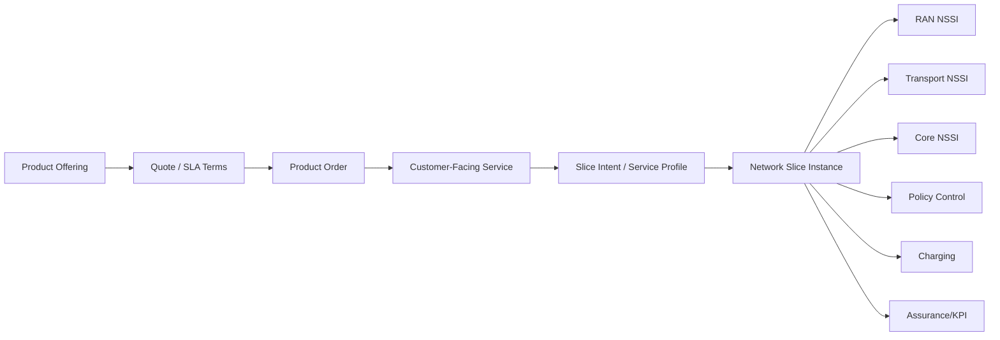
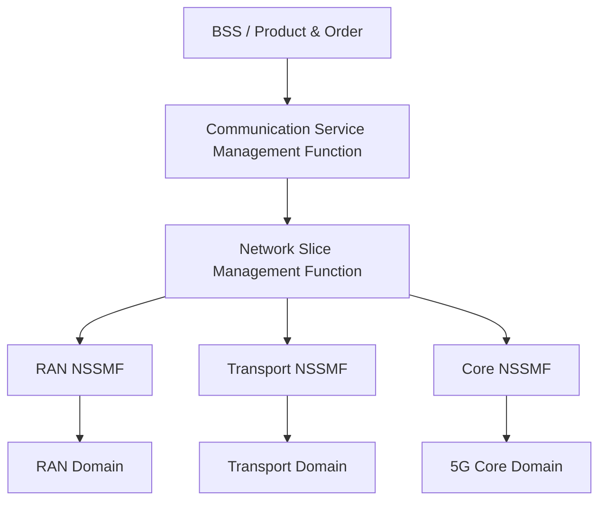
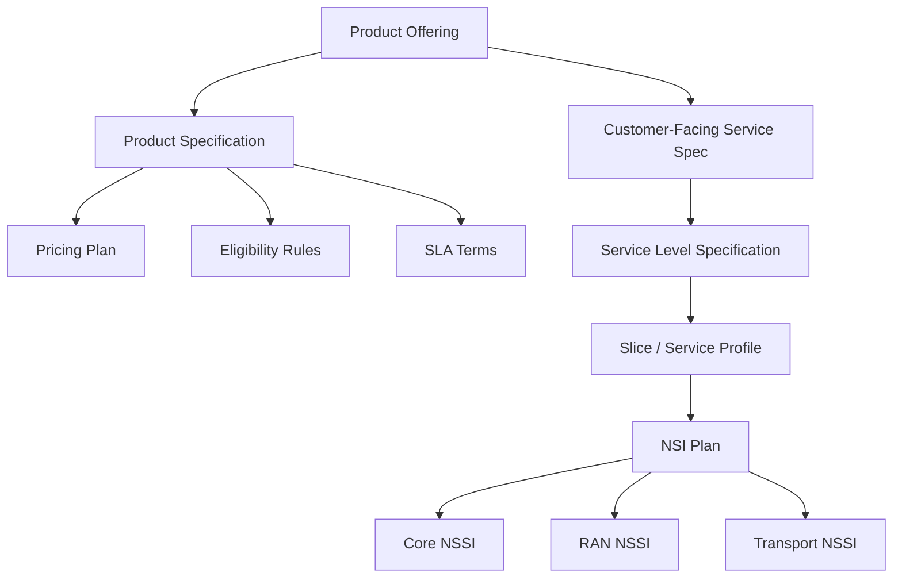
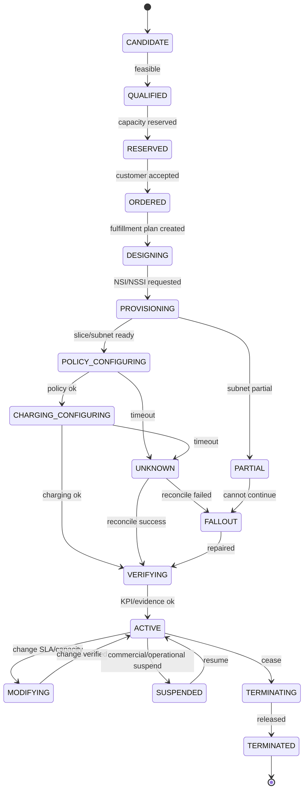
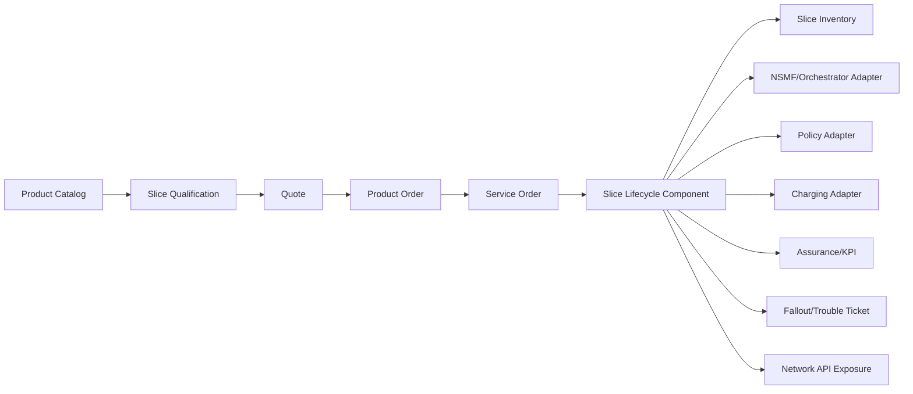
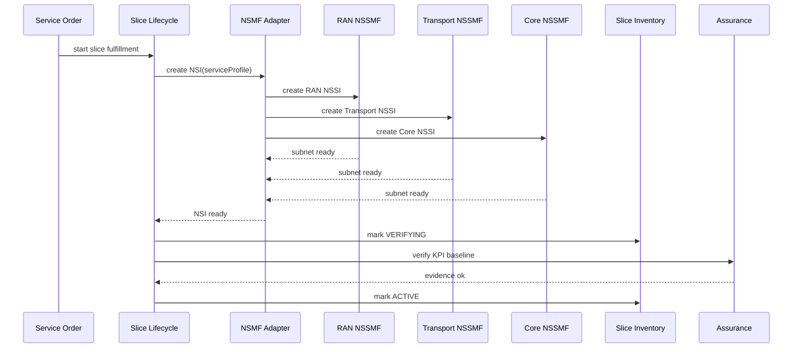
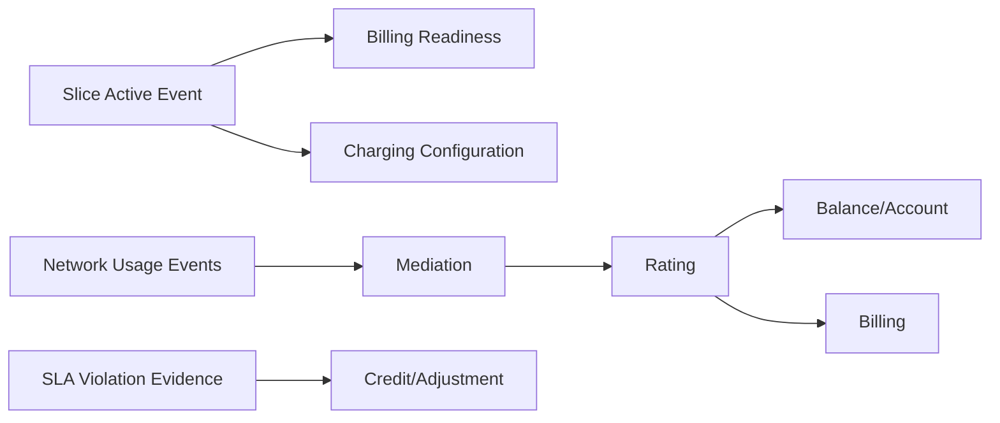
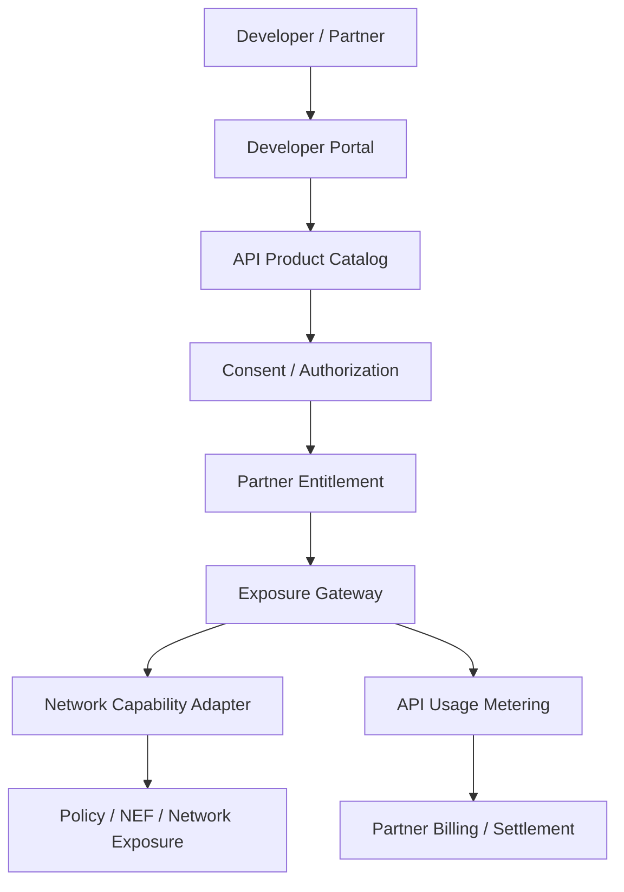

# Part 030 — 5G Core, Slicing, Policy & Exposure

Bagian ini membahas bagaimana 5G mengubah BSS/OSS: dari menjual connectivity generik menjadi menjual **programmable network capability** dengan SLA/SLS, policy, charging, assurance, and exposure APIs.

Ini bukan tutorial radio network atau packet core detail. Fokus kita adalah arsitektur Java BSS/OSS: bagaimana order, catalog, qualification, service orchestration, charging, policy, assurance, dan network API exposure saling terhubung.

## 1. Target Skill Berdasarkan Kaufman

Setelah bagian ini, target skill-nya:

1. memahami network slicing sebagai productized service capability, bukan hanya fitur core network;
2. memetakan product offering ke service profile, SLS, slice profile, NSI/NSSI, dan fulfillment lifecycle;
3. membedakan CSMF, NSMF, NSSMF, policy, charging, assurance, dan exposure boundary;
4. mendesain Java component untuk slice order, slice inventory, slice lifecycle, policy adapter, charging adapter, dan assurance feedback;
5. memahami failure model: slice active but SLA violated, partial subnet readiness, policy mismatch, charging mismatch, and exposure risk;
6. membuat state machine dan event contract untuk slice lifecycle yang bisa diaudit.

Kaufman deconstruction:

| Sub-Skill | Output Praktis |
|---|---|
| Slice vocabulary | Bisa membedakan S-NSSAI, NSI, NSSI, service profile, SLS, slice profile. |
| BSS mapping | Bisa memetakan offer/quote/order/SLA ke slice lifecycle. |
| OSS orchestration | Bisa merancang CSMF/NSMF/NSSMF integration boundary. |
| Policy and charging | Bisa menjelaskan PCF/CHF/OCS/BSS charging readiness boundary. |
| Assurance loop | Bisa menghubungkan KPI/KQI/SLA violation ke ticket/remediation. |
| Exposure | Bisa memodelkan network capability sebagai API product yang aman. |

## 2. Mental Model: Slice as a Productized Network Promise

Network slice bukan sekadar “virtual network”. Dari perspektif BSS/OSS, slice adalah:

> kontrak capability jaringan yang dikemas sebagai product/service, diwujudkan oleh kombinasi subnet, policy, resource, charging, dan assurance evidence.



BSS tidak boleh langsung memanipulasi technical slice subnet. BSS harus menyatakan commercial/service intent. OSS/management layer menerjemahkannya ke technical realization.

## 3. Vocabulary Inti

### 3.1 S-NSSAI and Slice Selection

Dalam 5G, slice selection direpresentasikan dengan konsep seperti S-NSSAI. Untuk BSS/OSS engineer, yang penting bukan menghafal semua detail protokol, tetapi memahami bahwa slice/service class perlu identity yang bisa:

- dikaitkan dengan subscription entitlement;
- dikaitkan dengan device/SIM/UE policy;
- dikaitkan dengan SLA/SLS;
- dikaitkan dengan charging treatment;
- dikaitkan dengan assurance KPI;
- dikaitkan dengan lifecycle and inventory.

### 3.2 NSI and NSSI

| Term | Makna BSS/OSS |
|---|---|
| NSI | Network Slice Instance end-to-end yang memenuhi service profile tertentu. |
| NSSI | Network Slice Subnet Instance pada domain tertentu, misalnya RAN, transport, atau core. |
| Service Profile | Deskripsi high-level kebutuhan layanan. |
| Slice Profile | Deskripsi teknis/management untuk realisasi slice/subnet. |
| SLS | Service Level Specification; pernyataan target level layanan yang perlu dimonitor. |
| SLA | Agreement komersial/legal dengan konsekuensi bisnis. |

### 3.3 CSMF, NSMF, NSSMF



Mental model:

- **CSMF** memahami communication service requirement dari customer/service layer;
- **NSMF** mengelola lifecycle network slice instance end-to-end;
- **NSSMF** mengelola lifecycle slice subnet di masing-masing domain.

Dalam Java architecture, kita sering tidak mengimplementasikan semua fungsi ini dari nol. Kita mengintegrasikan BSS/OSS platform dengan orchestrator/vendor/domain manager yang memainkan role tersebut.

## 4. Standard Compass

Referensi standar yang membantu boundary:

| Area | Mengapa Penting |
|---|---|
| 3GPP SA5 slice management | Menjelaskan management aspect untuk slice, termasuk penggunaan GST/SLS dan service profile dalam slice management. |
| 3GPP TS 28.541 family | Relevan untuk management and orchestration information model terkait slicing. |
| 3GPP charging architecture | Memberi boundary charging 5G, termasuk charging function dan charging data. |
| TM Forum ODA/Open APIs | Memetakan catalog/order/inventory/trouble ticket/performance/service qualification ke BSS/OSS component boundary. |
| GSMA Generic Slice Template / GST | Berguna sebagai template business-to-technical requirement untuk slice. |
| GSMA Open Gateway / CAMARA | Relevan untuk network capability exposure sebagai API product. |

Aturan praktis:

> Jangan mencampur SLA legal, SLS technical target, dan metric actual. Ketiganya harus terhubung, tetapi tidak boleh menjadi satu field generik bernama `sla`.

## 5. Product-to-Slice Mapping

Contoh product offering:

> “Private 5G Premium Manufacturing Slice — low latency, high reliability, local breakout, 500 devices, factory site A, 99.95% availability.”

Mapping-nya:



### 5.1 Design Rule

Product catalog tidak menyimpan semua technical parameter mentah. Product catalog menyimpan commercial/service selection dan referensi ke fulfillment profile.

```java
public record SliceProductOffering(
    String offeringId,
    String name,
    String marketSegment,
    String fulfillmentProfileId,
    List<String> eligibleRegions,
    List<String> supportedDeviceClasses
) {}

public record SliceFulfillmentProfile(
    String profileId,
    String version,
    ServiceLevelSpec serviceLevelSpec,
    SliceProfileTemplate sliceProfileTemplate,
    ChargingProfile chargingProfile,
    PolicyProfile policyProfile
) {}
```

## 6. Slice Lifecycle State Machine

Slice lifecycle harus long-running dan evidence-driven.



Important states:

- `PARTIAL`: some subnet/domain has completed but end-to-end slice is not ready;
- `UNKNOWN`: system does not know result of an operation;
- `VERIFYING`: technical ready is not enough; KPI/evidence must confirm;
- `FALLOUT`: human or controlled automation needed.

## 7. Java Component Architecture



### 7.1 Package Blueprint

```text
com.example.telco.slice
  ├── api
  │   ├── SliceLifecycleController.java
  │   └── dto
  ├── application
  │   ├── QualifySliceUseCase.java
  │   ├── StartSliceLifecycleUseCase.java
  │   ├── ConfigureSlicePolicyUseCase.java
  │   ├── ConfigureSliceChargingUseCase.java
  │   ├── HandleSliceEvidenceUseCase.java
  │   ├── ReconcileSliceUseCase.java
  │   └── TerminateSliceUseCase.java
  ├── domain
  │   ├── SliceService.java
  │   ├── SliceLifecycleOperation.java
  │   ├── ServiceLevelSpec.java
  │   ├── SliceProfile.java
  │   ├── SlicePolicy.java
  │   ├── SliceChargingProfile.java
  │   └── event
  ├── adapter
  │   ├── nsmf
  │   ├── nssmf
  │   ├── pcf
  │   ├── chf
  │   ├── assurance
  │   └── exposure
  └── persistence
      ├── SliceRepository.java
      ├── SliceOperationStore.java
      └── SliceEvidenceStore.java
```

## 8. Domain Model

```java
public enum SliceLifecycleState {
    CANDIDATE,
    QUALIFIED,
    RESERVED,
    ORDERED,
    DESIGNING,
    PROVISIONING,
    PARTIAL,
    POLICY_CONFIGURING,
    CHARGING_CONFIGURING,
    VERIFYING,
    ACTIVE,
    MODIFYING,
    SUSPENDED,
    TERMINATING,
    TERMINATED,
    UNKNOWN,
    FALLOUT
}

public record SliceServiceId(String value) {}
public record ProductOrderId(String value) {}
public record ServiceOrderId(String value) {}

public record ServiceLevelSpec(
    String specId,
    String version,
    Integer maxLatencyMs,
    Double availabilityTargetPercent,
    Integer maxJitterMs,
    Integer packetLossPpm,
    BandwidthCommitment bandwidth,
    List<KpiTarget> kpiTargets
) {}

public record SliceProfile(
    String profileId,
    String version,
    String sliceType,
    String region,
    String siteId,
    Integer maxDevices,
    String isolationLevel,
    Map<String, Object> technicalAttributes
) {}

public record SliceService(
    SliceServiceId id,
    ProductOrderId productOrderId,
    ServiceOrderId serviceOrderId,
    ServiceLevelSpec sls,
    SliceProfile sliceProfile,
    SliceLifecycleState state
) {}
```

### 8.1 Avoid Generic Attribute Swamp

Network slicing sering menggoda engineer untuk membuat `Map<String,Object> attributes` sebagai domain model utama. Ini cepat, tetapi berbahaya.

Gunakan typed model untuk invariant penting:

- max latency;
- availability target;
- device count;
- isolation level;
- region/site;
- charging profile;
- policy profile;
- slice class;
- lifecycle state.

Gunakan dynamic attributes hanya untuk vendor-specific extension yang tidak menentukan invariant utama.

## 9. Slice Qualification

Slice qualification menjawab:

1. apakah area/site didukung?
2. apakah device/SIM/subscription eligible?
3. apakah capacity tersedia?
4. apakah requested latency feasible?
5. apakah isolation level dapat diberikan?
6. apakah required RAN/transport/core domain ready?
7. apakah charging/policy capability tersedia?
8. apakah SLA/SLS bisa dipenuhi dengan evidence historis?

```java
public record SliceQualificationRequest(
    String customerId,
    String siteId,
    String offeringId,
    Integer requestedDevices,
    Integer requestedLatencyMs,
    String isolationLevel,
    String expectedTrafficProfile
) {}

public record SliceQualificationResult(
    boolean qualified,
    List<String> reasons,
    String fulfillmentProfileId,
    Instant validUntil,
    Map<String, Object> feasibilityEvidence
) {}
```

Qualification result harus punya TTL. Capacity dan feasibility berubah.

## 10. NSI/NSSI Orchestration

Slice fulfillment biasanya multi-domain.



### 10.1 Partial Readiness

Partial readiness is normal.

Example:

- core NSSI ready;
- transport NSSI ready;
- RAN NSSI delayed;
- end-to-end NSI not active.

Correct behavior:

- do not mark customer service active;
- store partial evidence;
- keep operation in `PARTIAL` or `PROVISIONING`;
- start SLA clock only when activation criteria says so;
- trigger fallout if partial state exceeds threshold.

## 11. Policy Control Boundary

Policy determines how sessions are treated:

- QoS class/treatment;
- access control;
- data usage policy;
- traffic steering;
- application-specific treatment;
- roaming/domain restriction;
- enterprise policy.

From BSS/OSS perspective, policy configuration must be tied to:

- subscription entitlement;
- product offering;
- slice/service identity;
- device/SIM identity;
- charging profile;
- customer agreement;
- security/consent boundary.

```java
public record PolicyProfile(
    String profileId,
    String version,
    String qosTreatment,
    List<String> allowedApplications,
    String trafficSteeringPolicy,
    String roamingPolicy,
    String enforcementMode
) {}

public record PolicyConfigurationCommand(
    String commandId,
    SliceServiceId sliceServiceId,
    String subscriberGroupId,
    PolicyProfile policyProfile,
    String idempotencyKey
) {}
```

Policy adapter rule:

> Policy adapter must be deterministic and evidence-driven. A policy update is not complete because API returned 200; it is complete when the target state can be observed or accepted by authoritative policy system.

## 12. Charging Boundary

5G charging can involve online/offline/hybrid models. BSS/OSS architecture must avoid mixing “usage rating” and “network lifecycle”.

Slice charging dimensions may include:

- recurring charge for slice subscription;
- setup charge;
- device count tier;
- committed bandwidth;
- burst bandwidth;
- QoS class;
- API usage;
- SLA breach credit;
- usage-based charging;
- enterprise settlement.



### 12.1 Charging Readiness Event

```java
public record SliceChargingReady(
    String eventId,
    SliceServiceId sliceServiceId,
    String chargingProfileId,
    String billingAccountId,
    Instant effectiveFrom,
    String activationEvidenceId
) {}
```

Do not emit charging ready before activation evidence. Otherwise customer may be billed for an unusable slice.

## 13. Assurance and SLA/SLS Evidence

A slice can be technically active but commercially unhealthy.

Examples:

- NSI is active but latency exceeds SLS;
- core NSSI healthy but transport congested;
- policy configured but QoS not enforced;
- charging configured but usage feed missing;
- customer API exposure says available but network capability degraded.

Assurance model should track:

- per-slice KPI;
- per-subnet KPI;
- customer-impact KPI;
- SLA/SLS compliance;
- threshold breach;
- breach duration;
- evidence used for dispute/credit.

```java
public record SliceKpiObservation(
    SliceServiceId sliceServiceId,
    String kpiName,
    BigDecimal observedValue,
    BigDecimal targetValue,
    String window,
    Instant windowStart,
    Instant windowEnd,
    boolean breach
) {}
```

## 14. Exposure: From Network Capability to API Product

5G enables exposing network capabilities to application developers and partners. Examples:

- quality on demand;
- device location verification;
- SIM swap check;
- number verification;
- edge/cloud routing;
- network status;
- slice/QoS request.

BSS/OSS must treat exposed network APIs as products:



Key design principles:

- network API must be governed like product;
- entitlement and consent are first-class;
- API usage must be metered;
- partner settlement must be supported;
- sensitive identifiers must be minimized/tokenized;
- exposure gateway must not bypass policy/security;
- developer-facing SLA must map to network capability and assurance.

## 15. Security and Tenant Isolation

Slicing introduces strong isolation expectation. But “slice” does not automatically mean secure isolation at all layers.

Security controls:

- tenant-aware identity;
- role-based and attribute-based access;
- network resource isolation;
- namespace/project isolation for CNF;
- policy separation;
- log/metric tenant tagging;
- encrypted secrets;
- per-tenant audit;
- least-privilege adapter credentials;
- data minimization for exposure APIs;
- breach isolation runbook.

### 15.1 Dangerous Assumption

> “Because it is a private slice, all traffic and data are isolated.”

Better thinking:

- define isolation level explicitly;
- prove it via technical controls;
- monitor it continuously;
- record evidence;
- map it to customer agreement;
- define limitation in product and SLA terms.

## 16. Failure Scenarios

### 16.1 Slice Active but SLA Violated

Possible causes:

- under-provisioned transport;
- RAN congestion;
- UPF placement too far;
- policy profile mismatch;
- noisy neighbor;
- telemetry window mismatch;
- customer device/application issue.

Handling:

- do not mark slice failed automatically;
- create SLA breach evidence;
- correlate per-domain KPIs;
- trigger remediation or ticket;
- calculate breach duration;
- inform billing/credit process if agreement requires.

### 16.2 Policy Configured for Wrong Subscriber Group

Impact:

- wrong QoS;
- wrong access;
- security exposure;
- charging mismatch.

Prevention:

- policy command references stable subscriber group id;
- policy response must include applied target;
- reconciliation compares expected vs actual;
- sensitive changes use maker-checker for enterprise/high-risk accounts.

### 16.3 Charging Starts Before Slice Usable

Impact:

- customer dispute;
- revenue adjustment;
- regulatory risk;
- trust erosion.

Prevention:

- charging readiness emitted only after activation evidence;
- billable start date stored separately from technical request time;
- failed/partial slice does not trigger recurring charge;
- activation evidence id linked to billable event.

### 16.4 Exposure API Bypasses Consent

Impact:

- privacy breach;
- partner abuse;
- regulatory exposure;
- customer harm.

Prevention:

- explicit consent model;
- tokenization;
- purpose limitation;
- audit per API call;
- rate limit;
- partner entitlement;
- revocation propagation.

## 17. Event Contracts

### 17.1 Slice Ordered

```json
{
  "eventType": "SliceServiceOrdered",
  "eventId": "evt-001",
  "sliceServiceId": "slice-123",
  "productOrderId": "po-456",
  "serviceOrderId": "so-789",
  "fulfillmentProfileId": "private5g-premium-v3",
  "requestedAt": "2026-06-29T10:15:00Z"
}
```

### 17.2 Slice Active

```json
{
  "eventType": "SliceServiceActivated",
  "eventId": "evt-002",
  "sliceServiceId": "slice-123",
  "nsiId": "nsi-abc",
  "activationEvidenceId": "ev-999",
  "effectiveFrom": "2026-06-29T11:00:00Z",
  "serviceLevelSpecId": "sls-premium-001"
}
```

### 17.3 SLS Breach Detected

```json
{
  "eventType": "SliceSlsBreachDetected",
  "eventId": "evt-003",
  "sliceServiceId": "slice-123",
  "kpiName": "latencyMs",
  "target": 20,
  "observed": 37,
  "windowStart": "2026-06-29T12:00:00Z",
  "windowEnd": "2026-06-29T12:05:00Z",
  "impactAssessmentId": "impact-777"
}
```

## 18. Database/Invariants

Important tables or aggregates:

- `slice_service`;
- `slice_lifecycle_operation`;
- `slice_profile_version`;
- `service_level_spec_version`;
- `slice_subnet_instance`;
- `slice_policy_configuration`;
- `slice_charging_configuration`;
- `slice_evidence`;
- `slice_kpi_observation`;
- `slice_reconciliation_case`;
- `exposure_api_entitlement`.

Critical invariants:

1. active slice must have activation evidence;
2. billable slice must have charging readiness evidence;
3. policy configuration must reference subscriber/service target;
4. SLS target version must be immutable after activation;
5. slice profile version must be traceable to order;
6. partial subnet must not create active customer service;
7. terminated slice must release policy, charging, resource, and exposure entitlement;
8. partner API entitlement must not outlive customer consent/agreement.

## 19. Observability Metrics

| Metric | Meaning |
|---|---|
| slice_order_started_total | incoming slice orders |
| slice_activation_duration_seconds | order-to-active duration |
| slice_partial_total | partial subnet readiness count |
| slice_unknown_total | ambiguous lifecycle operations |
| slice_sls_breach_total | SLS breach count |
| policy_configuration_failed_total | policy provisioning failure |
| charging_readiness_lag_seconds | delay from active to charging ready |
| exposure_api_denied_total | denied partner/developer calls |
| exposure_api_usage_total | billable API usage |
| slice_reconciliation_correction_total | drift correction count |

## 20. Capstone Exercise for This Part

Design mini service: **Private 5G Factory Slice**.

### 20.1 Requirements

- one enterprise customer;
- one factory site;
- 500 devices;
- max latency 20 ms;
- availability 99.95%;
- local breakout;
- premium QoS;
- monthly recurring charge;
- usage-based overage;
- partner API access for device status;
- SLA breach credit.

### 20.2 Build These Components

1. Product offering mapping to fulfillment profile.
2. Slice qualification API.
3. Slice lifecycle state machine.
4. Fake NSMF adapter.
5. Fake policy adapter.
6. Fake charging adapter.
7. Assurance KPI evaluator.
8. Exposure API entitlement checker.
9. Reconciliation worker.
10. Fallout case creation.

### 20.3 Simulate Failures

- RAN NSSI delayed;
- policy timeout but success;
- charging config fails;
- latency breach after activation;
- partner API call without consent;
- slice termination leaves policy active;
- duplicate NSMF callback;
- SLS formula version changed after activation.

### 20.4 Acceptance Criteria

- slice not active until all required evidence exists;
- billing not ready until activation evidence exists;
- policy retry is idempotent;
- partial state does not start SLA clock;
- SLS breach creates evidence and ticket/credit path;
- partner API call checks entitlement and consent;
- termination releases policy/charging/exposure;
- reconciliation detects stale policy after termination.

## 21. Common Anti-Patterns

| Anti-Pattern | Consequence | Better Pattern |
|---|---|---|
| Treat slice as product id only | no technical lifecycle control | separate product, CFS, NSI/NSSI |
| Put all technical params in catalog | brittle catalog and vendor lock-in | fulfillment profile and versioned mapping |
| Start billing at order submit | customer dispute | billable start after activation evidence |
| Ignore partial subnet readiness | false active service | explicit partial state |
| One SLA field | legal/technical/metric confusion | SLA, SLS, KPI separated |
| Exposure API bypasses BSS | no entitlement/settlement/audit | API product + consent + metering |
| Assume policy API 200 means applied | hidden mismatch | evidence/read-back/reconciliation |
| Slice assurance only at network layer | no customer impact view | customer-service-resource KPI correlation |

## 22. Key Takeaways

1. Network slicing is a BSS/OSS lifecycle problem, not just a 5G core feature.
2. Product offering maps to CFS, SLS, slice profile, NSI/NSSI, policy, charging, and assurance.
3. CSMF/NSMF/NSSMF separation helps prevent business intent from leaking into domain-specific orchestration detail.
4. A slice must not become billable before activation evidence exists.
5. SLA, SLS, KPI, and actual observation must be modeled separately.
6. Exposure APIs turn network capability into API products, requiring entitlement, consent, metering, and settlement.
7. Java implementation should emphasize lifecycle state machine, evidence store, idempotency, reconciliation, and tenant-safe security.

## 23. Latihan Reflektif

Jawab dengan reasoning:

1. Mengapa slice bukan sekadar subscription attribute?
2. Apa beda SLA, SLS, KPI target, dan KPI observation?
3. Kapan slice boleh ditandai active?
4. Kapan charging readiness boleh dipublish?
5. Bagaimana menangani NSI partial readiness?
6. Mengapa exposure API harus masuk product/partner governance?
7. Apa risiko policy mismatch terhadap charging dan customer experience?
8. Bagaimana kamu mendesain reconciliation untuk slice termination?

Jika kamu bisa menjawab dengan menyebut lifecycle, evidence, financial impact, and customer impact, maka kamu sudah mulai berpikir seperti engineer BSS/OSS yang siap menghadapi 5G programmable network.
