# Part 031 — Partner, MVNO, Wholesale & Settlement

> Goal: mampu mendesain sistem Java BSS/OSS yang mendukung partner ecosystem: MVNO, reseller, dealer, wholesale buyer, wholesale supplier, MVNE, enterprise partner, dan inter-provider commercial relationship tanpa mencampuradukkan partner dengan customer retail biasa.

Pada part sebelumnya kita sudah membahas order, fulfillment, inventory, assurance, capacity, dan orchestration. Sekarang kita naik satu level: **operator tidak selalu menjual dan mengoperasikan layanan sendirian**.

Di telco nyata, banyak layanan berjalan melalui relasi partner:

- MNO menjual kapasitas ke MVNO.
- MVNO menjual layanan ke end customer memakai network host.
- MVNE menyediakan platform BSS/OSS untuk beberapa MVNO.
- Reseller menjual product offering milik operator.
- Wholesale provider menyediakan access, transport, IP transit, cloud connectivity, atau last-mile circuit.
- Dealer/channel partner melakukan acquisition, KYC, device bundling, SIM distribution, atau customer support terbatas.
- Partner digital memakai exposed network APIs untuk identity, SIM-swap, number verification, location, quality-on-demand, atau fraud prevention.

Kesalahan umum engineer adalah menganggap partner hanyalah `customer_type = PARTNER`. Itu berbahaya.

Partner bukan hanya pembeli. Partner adalah **economic actor**, **operational actor**, **contractual actor**, dan kadang **delegated control-plane actor**.

---

## 1. Kaufman Skill Map

Berdasarkan pendekatan Josh Kaufman, kita tidak mulai dari semua detail telco wholesale. Kita pecah skill menjadi unit yang bisa dilatih cepat.

### 1.1 Target Performance

Setelah part ini, kamu harus bisa:

1. Membedakan **customer**, **partner**, **supplier**, **reseller**, **MVNO**, **MVNE**, dan **wholesale provider**.
2. Mendesain bounded context Java untuk partner onboarding, catalog exposure, delegated order, service handoff, wholesale settlement, dan reconciliation.
3. Menentukan kapan partner diperlakukan sebagai:
   - channel,
   - tenant,
   - supplier,
   - commercial account,
   - operational peer,
   - API consumer,
   - API provider.
4. Membuat lifecycle partner yang audit-safe: onboarding, agreement, enablement, operation, billing, settlement, dispute, suspension, termination.
5. Mencegah common failure: data leakage antar partner, double settlement, orphan order, invisible SLA breach, dan settlement mismatch.

### 1.2 Deconstruct the Skill

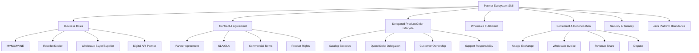

### 1.3 Learn Enough to Self-Correct

Pertanyaan koreksi diri:

- Apakah sistem bisa menjelaskan **siapa customer komersial** dan **siapa pengguna akhir**?
- Apakah partner memiliki agreement terpisah dari customer agreement?
- Apakah settlement bisa direkonstruksi dari event mentah sampai invoice?
- Apakah order dari partner punya correlation ID dan idempotency key lintas boundary?
- Apakah partner bisa melihat data partner lain? Jika iya, desainnya salah.
- Apakah kita tahu siapa yang bertanggung jawab saat order gagal: retail channel, MVNO, MNO host, MVNE, atau wholesale supplier?

---

## 2. Mental Model: Partner Is Not Just a Customer

Di BSS retail biasa:

```text
Customer -> Product Order -> Subscription -> Usage -> Bill -> Payment
```

Di partner ecosystem:

```text
Partner Agreement -> Delegated Rights -> Partner Order/Usage -> Settlement -> Dispute/Reconciliation
```

Kadang ada dua lifecycle berjalan paralel:

```text
End Customer Lifecycle       Partner Commercial Lifecycle
-----------------------      ----------------------------
Customer signs up            Partner has wholesale agreement
SIM activated                MNO reserves IMSI/MSISDN
Usage generated              Rated retail + wholesale usage generated
Customer pays MVNO           MVNO settles wholesale charge to MNO
Customer complains           MVNO raises partner trouble ticket to MNO
```

Intinya:

> Retail billing answers: “berapa customer harus bayar?”  
> Wholesale settlement answers: “berapa partner harus bayar/terima berdasarkan agreement?”

Keduanya tidak selalu sama.

---

## 3. Partner Role Taxonomy

### 3.1 MNO

**Mobile Network Operator** memiliki spectrum/license, radio/core network, numbering resources, dan biasanya full BSS/OSS.

Dalam partner model, MNO bisa menjadi:

- host network untuk MVNO,
- wholesale supplier,
- API provider,
- roaming partner,
- last-mile provider untuk enterprise service.

### 3.2 MVNO

**Mobile Virtual Network Operator** menjual layanan mobile tanpa memiliki radio network penuh.

Tipe umum:

| Type | Network Control | BSS Ownership | Typical Complexity |
|---|---:|---:|---:|
| Branded reseller | rendah | rendah | rendah |
| Light/thin MVNO | terbatas | sebagian | sedang |
| Full MVNO | tinggi untuk core/BSS tertentu | tinggi | tinggi |

Dalam sistem Java, perbedaan ini memengaruhi:

- siapa owner customer master data,
- siapa owner catalog,
- siapa owner charging,
- siapa mengirim order activation,
- siapa menerima usage/CDR,
- siapa menangani trouble ticket level-1/level-2,
- siapa menerbitkan invoice ke end customer.

### 3.3 MVNE

**Mobile Virtual Network Enabler** menyediakan platform dan operasi untuk MVNO.

MVNE biasanya memiliki:

- multi-tenant BSS,
- provisioning adapter,
- SIM lifecycle,
- rating/charging integration,
- reporting/settlement,
- API gateway untuk MVNO.

Architectural implication:

> MVNE platform harus memisahkan tenant secara keras, tetapi tetap bisa memakai shared network adapter dan shared host integration.

### 3.4 Reseller / Dealer / Channel Partner

Reseller/dealer biasanya tidak memiliki lifecycle network penuh. Mereka berperan pada:

- acquisition,
- KYC,
- SIM/device sale,
- product recommendation,
- order capture,
- payment collection,
- basic support.

Mereka mungkin tidak boleh melihat:

- full charging data,
- network topology,
- customer lain,
- settlement detail partner lain,
- internal fallout reason tertentu.

### 3.5 Wholesale Buyer / Supplier

Wholesale relationship bisa dua arah:

- Operator membeli access/circuit dari provider lain.
- Operator menjual service ke provider lain.

Ini berbeda dari reseller.

Wholesale biasanya punya:

- partner-facing product catalog,
- inter-provider order,
- external service identifier,
- SLA/OLA,
- partner trouble ticket,
- wholesale invoice,
- dispute and adjustment.

### 3.6 Digital API Partner

Partner digital menggunakan network API capabilities, misalnya:

- number verification,
- SIM-swap check,
- device location,
- quality-on-demand,
- fraud signal,
- identity assurance.

Modelnya mirip API product business:

- API product catalog,
- developer app,
- consent,
- token scope,
- quota,
- monetization,
- usage metering,
- billing/settlement.

---

## 4. Core Domain Objects

Jangan mulai dari tabel. Mulai dari konsep.

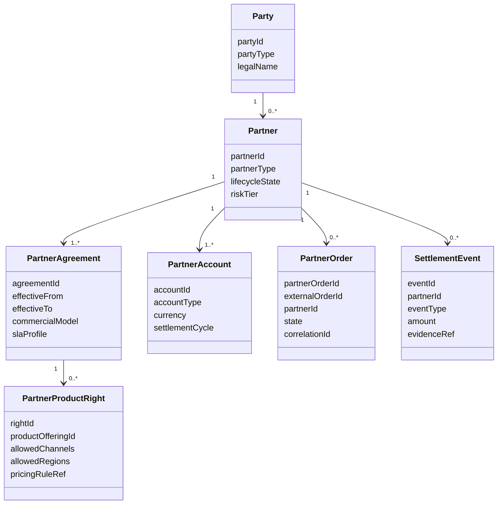

### 4.1 Partner

`Partner` adalah party role dengan operational/commercial capability.

Field penting:

- `partnerId`
- `partyId`
- `partnerType`
- `lifecycleState`
- `riskTier`
- `onboardingStatus`
- `allowedApiProducts`
- `allowedChannels`
- `dataResidencyPolicy`
- `supportResponsibility`

Contoh state:

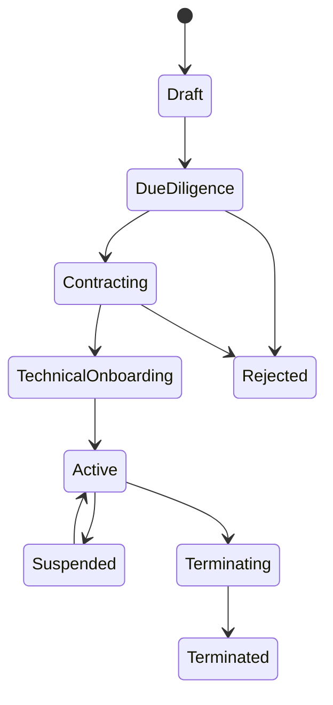

### 4.2 Partner Agreement

Agreement menentukan apa yang boleh dilakukan partner.

Jangan letakkan semua rule di account atau product catalog. Agreement adalah sumber legal/commercial terms.

Isi penting:

- effective period,
- territory,
- product rights,
- channel rights,
- SLA/OLA,
- settlement cycle,
- tax rule,
- discount/revenue share,
- liability,
- data sharing permission,
- support split,
- termination clause.

### 4.3 Partner Product Right

Partner mungkin boleh menjual product A, tetapi tidak boleh menjual bundle B; boleh menjual di region X, tetapi tidak di region Y.

Object ini menjawab:

```text
Can partner P expose offering O to channel C in market M at time T?
```

### 4.4 Partner Account

Partner account berbeda dari billing account retail.

Jenis account:

- wholesale payable account,
- wholesale receivable account,
- commission account,
- revenue share account,
- API usage account,
- deposit/guarantee account.

### 4.5 Partner Order

Partner order adalah inbound order dari partner atau outbound order ke supplier.

Invariants:

- `externalOrderId` harus unik per partner.
- `correlationId` harus dibawa sepanjang lifecycle.
- order response harus idempotent.
- partner-visible state tidak harus sama dengan internal state.
- order cancellation harus punya semantic cut-off.

### 4.6 Settlement Event

Settlement event adalah unit ekonomi untuk partner settlement.

Contoh:

- activated SIM wholesale fee,
- monthly wholesale subscription charge,
- usage-based charge,
- revenue share credit,
- commission debit/credit,
- SLA penalty,
- adjustment,
- dispute reversal.

Settlement event harus traceable ke evidence.

---

## 5. Partner Lifecycle

### 5.1 Onboarding

Partner onboarding bukan hanya membuat akun API.

Tahapan umum:

1. Business qualification.
2. Legal due diligence.
3. Agreement drafting and signing.
4. Technical onboarding.
5. Security review.
6. Catalog enablement.
7. Sandbox testing.
8. Production certification.
9. Go-live approval.

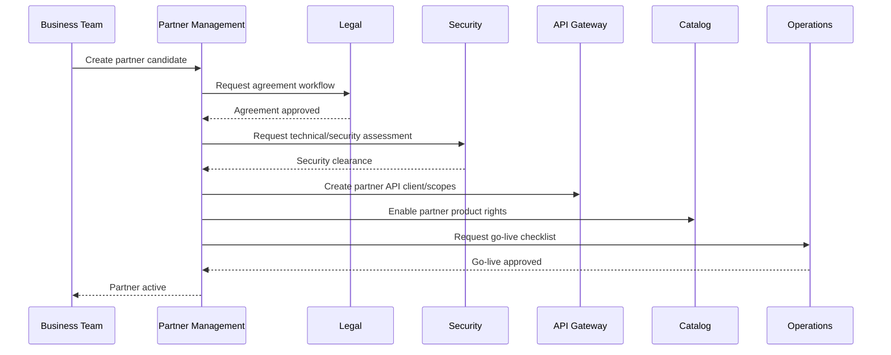

### 5.2 Enablement

Enablement berarti partner diberi kemampuan tertentu.

Contoh enablement:

- can-query-catalog,
- can-submit-order,
- can-activate-sim,
- can-query-order-status,
- can-raise-ticket,
- can-download-usage-report,
- can-access-settlement-statement,
- can-use-network-api-product.

Jangan encode sebagai boolean tersebar.

Gunakan capability model:

```java
public record PartnerCapability(
    PartnerId partnerId,
    CapabilityCode code,
    CapabilityScope scope,
    Instant effectiveFrom,
    Optional<Instant> effectiveTo,
    CapabilityState state
) {}
```

### 5.3 Operation

Saat aktif, partner akan melakukan:

- catalog synchronization,
- eligibility/qualification,
- quote/order submission,
- service status query,
- ticket submission,
- usage report retrieval,
- invoice/settlement retrieval,
- dispute submission.

### 5.4 Suspension

Partner bisa disuspend karena:

- unpaid settlement,
- fraud risk,
- security incident,
- regulatory violation,
- contract breach,
- abnormal traffic/API abuse,
- excessive order fallout.

Suspension harus granular.

Bad design:

```text
partner.status = SUSPENDED
```

Better design:

```text
partner active, but capability ORDER_SUBMISSION suspended
partner active, but settlement payout held
partner active, but API_PRODUCT_QOD disabled
partner active, but new SIM activation blocked
```

### 5.5 Termination

Termination perlu mengatur:

- new order stop,
- in-flight order treatment,
- customer migration,
- number/resource release,
- final bill/settlement,
- dispute window,
- data retention,
- API credential revocation,
- operational contacts.

---

## 6. MVNO Architecture Patterns

### 6.1 Branded Reseller Pattern

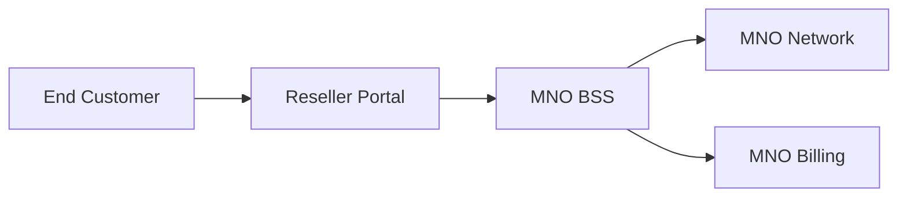

Characteristics:

- customer often belongs to MNO,
- reseller is channel/commission partner,
- reseller has limited support scope,
- settlement is commission-based.

Suitable when partner has weak technical capability.

### 6.2 Light MVNO Pattern

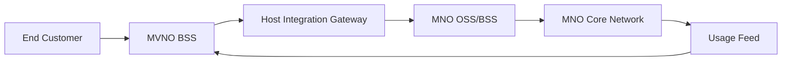

Characteristics:

- MVNO owns customer relationship,
- host network owns core resources,
- activation and usage pass through integration gateway,
- settlement is wholesale usage/subscription-based.

### 6.3 Full MVNO Pattern

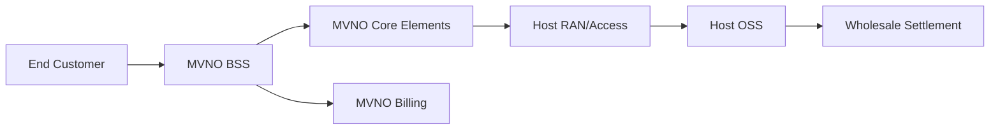

Characteristics:

- MVNO owns more service control,
- host provides access/RAN/roaming-like capabilities,
- integration is more complex,
- reconciliation across network, usage, and wholesale bill becomes critical.

---

## 7. Wholesale Product and Order Model

Wholesale product is not just discounted retail product.

Retail offering:

```text
Unlimited 5G Plan for consumer
```

Wholesale offering:

```text
Mobile access capacity package
SIM activation product
GB usage wholesale tier
Enterprise last-mile access service
E-Line connectivity service
Number verification API usage package
```

### 7.1 Wholesale Catalog

Wholesale catalog should contain:

- wholesale product specification,
- partner eligibility,
- SLA/SLO,
- price model,
- orderable actions,
- resource constraints,
- service location constraints,
- technical handoff model,
- interface/API contract version,
- support process.

### 7.2 Partner Product Projection

Internal catalog should not be exposed directly to all partners.

Use projection:

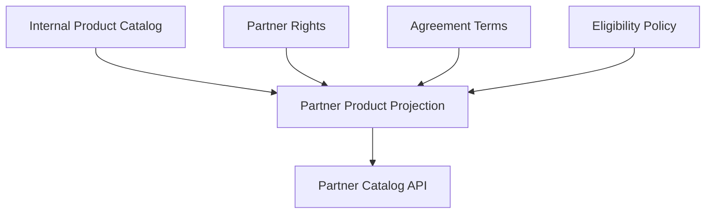

Projection result is partner-specific:

```json
{
  "partnerId": "mvno-17",
  "offeringId": "wholesale-mobile-access-5g",
  "version": "2026.06",
  "allowedActions": ["add", "modify", "disconnect"],
  "markets": ["ID-JKT", "ID-BDG"],
  "slaProfile": "gold-wholesale",
  "priceModelRef": "agreement-2026-tiered-data"
}
```

### 7.3 Inbound Partner Order

Inbound order from partner must be normalized.

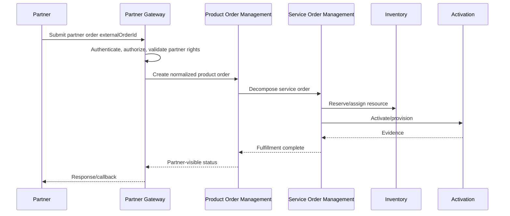

### 7.4 Outbound Supplier Order

When our operator buys wholesale service from another provider:

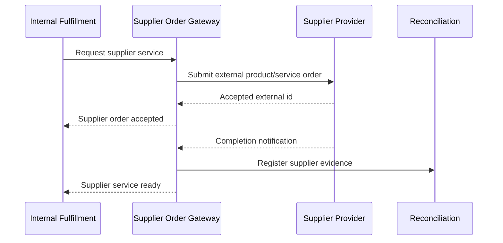

Important invariant:

> Supplier order state must not be the only source of truth for customer-visible fulfillment. It is evidence inside your own orchestration lifecycle.

---

## 8. Settlement Models

### 8.1 Commission

Dealer/reseller gets commission for acquisition or renewal.

```text
commission = eligibleOrderValue * commissionRate
```

Risk:

- clawback after cancellation,
- fraud sales,
- duplicate acquisition,
- wrong channel attribution.

### 8.2 Retail-Minus

Partner sells to end customer; wholesale charge is retail value minus margin.

```text
wholesale_due = retail_charge - partner_margin
```

Risk:

- partner changes retail pricing independently,
- tax mismatch,
- discount attribution dispute.

### 8.3 Cost-Plus

Provider charges partner base cost plus markup.

```text
wholesale_due = cost_basis + markup
```

Risk:

- cost basis not transparent,
- delayed usage/cost data,
- dispute around included resource.

### 8.4 Tiered Usage

Usage price changes by volume tier.

```text
0-10 TB      = $x / GB
10-50 TB     = $y / GB
50 TB+       = $z / GB
```

Risk:

- incorrect tier window,
- late usage events,
- aggregation by wrong partner/account/product.

### 8.5 Revenue Share

Revenue is split between operator and partner.

```text
partner_share = net_revenue * share_percentage
```

Need clarity:

- gross vs net revenue,
- tax inclusion,
- refund treatment,
- bad debt treatment,
- adjustment treatment,
- dispute window.

### 8.6 SLA Penalty / Service Credit

When provider misses SLA:

```text
credit = eligible_monthly_charge * penalty_percentage
```

Need evidence:

- impacted service,
- measured outage,
- excluded maintenance window,
- customer/partner affected,
- SLA clause.

---

## 9. Settlement Pipeline

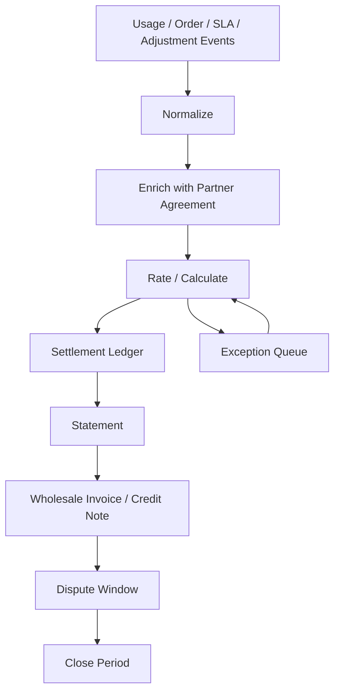

### 9.1 Settlement Event Invariants

A settlement event must have:

- partner ID,
- account ID,
- agreement version,
- event source,
- event time,
- processing time,
- product/service/resource reference,
- amount or quantity,
- currency/unit,
- evidence reference,
- idempotency key,
- correction chain.

### 9.2 Ledger, Not Mutable Amount Table

Do not update settlement amount in place.

Use ledger entries:

```text
+ original usage charge
- reversal for duplicate usage
+ corrected usage charge
- SLA credit
+ manual adjustment approved by maker-checker
```

This allows audit and dispute resolution.

### 9.3 Settlement Period Close

Period close should be explicit:

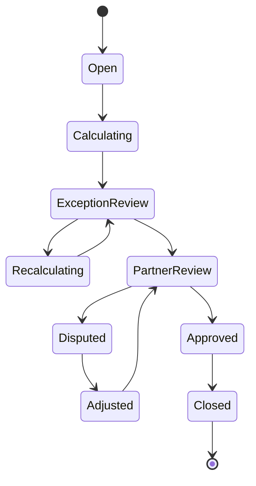

Invariant:

> Once period is closed, corrections must be posted as adjustment entries in a later period, not by mutating the closed statement.

---

## 10. Reconciliation for Partner Ecosystem

Partner reconciliation compares multiple views of reality.

| Reconciliation | Compare | Detects |
|---|---|---|
| Order reconciliation | partner order vs internal order | missing/orphan/wrong state |
| Service reconciliation | partner service vs internal service inventory | wrong active/suspended/terminated state |
| Resource reconciliation | SIM/MSISDN/IP/circuit assigned vs reported | leakage or ghost resource |
| Usage reconciliation | partner usage feed vs network feed | missing/duplicate usage |
| Settlement reconciliation | ledger vs statement vs invoice | wrong money |
| SLA reconciliation | performance outage vs credit | unpaid penalty |

### 10.1 Partner Order Reconciliation

Typical query:

```sql
select external_order_id, partner_id, count(*)
from partner_order
where created_at >= :period_start
  and created_at < :period_end
group by external_order_id, partner_id
having count(*) > 1;
```

This catches duplicate external orders.

### 10.2 Usage Reconciliation

Identity must include enough dimensions:

```text
partnerId + agreementId + serviceId + usageType + eventTime + networkEventId
```

Weak identity causes double charge or missed charge.

### 10.3 Settlement Reconciliation

Use three-way matching:

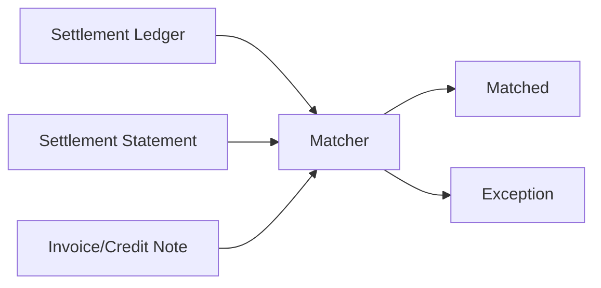

Common mismatches:

- tax rounding,
- currency conversion date,
- late usage event,
- partner agreement version mismatch,
- duplicate order activation fee,
- cancelled order still charged,
- terminated service still active in supplier system.

---

## 11. Tenancy and Data Isolation

Partner systems often become multi-tenant accidentally.

### 11.1 Isolation Levels

| Level | Meaning | Risk |
|---|---|---|
| Logical row-level | shared DB, partner_id filter | filter bug can leak data |
| Schema-level | separate schema per partner | operational complexity |
| Database-level | separate database per partner | strong isolation, higher cost |
| Runtime-level | separate deployment | strongest isolation, highest operational overhead |

For MVNE platform, choose explicitly.

### 11.2 Non-Negotiable Invariants

- Every partner-facing query must be scoped by authenticated partner context.
- Partner ID from request body must not override authenticated principal.
- Cross-partner operation must require privileged internal role.
- Logs must avoid leaking sensitive end-customer identifiers.
- Report/export jobs must use same authorization model as API query.
- Async callbacks must be signed and target verified endpoint per partner.

### 11.3 Partner Context Object

```java
public record PartnerContext(
    PartnerId partnerId,
    Set<PartnerCapabilityCode> capabilities,
    Set<MarketCode> allowedMarkets,
    Set<ProductOfferingId> allowedOfferings,
    DataAccessPolicy dataAccessPolicy,
    CorrelationId correlationId
) {}
```

Every partner command should carry `PartnerContext`.

Do not pass raw `partnerId` string everywhere.

---

## 12. API Gateway and Contract Strategy

### 12.1 Partner Gateway Responsibilities

Partner Gateway is not just reverse proxy.

Responsibilities:

- authenticate partner,
- authorize capability,
- enforce quota/rate limit,
- validate contract version,
- normalize external IDs,
- map partner-visible errors,
- apply data masking,
- generate correlation ID,
- enforce idempotency,
- emit audit events,
- route to internal components.

### 12.2 Contract Versioning

Partner APIs need longer support window than internal APIs.

Recommended:

```text
/api/partner/v1/orders
/api/partner/v2/orders
```

But avoid only URL versioning. Track contract per partner:

```text
partner_id | api_product | version | effective_from | sunset_at | migration_state
```

### 12.3 Partner-Visible Error Model

Internal error:

```text
HLR_TIMEOUT_VENDOR_5678
```

Partner-visible error:

```json
{
  "code": "ACTIVATION_PENDING_VERIFICATION",
  "message": "Activation status is not final. Query order status later or wait for callback.",
  "retryable": true,
  "correlationId": "..."
}
```

Never expose vendor/network internals to partner unless contractually required.

---

## 13. Java Component Blueprint

```text
com.example.telco.partner
├── api
│   ├── PartnerOrderController.java
│   ├── PartnerCatalogController.java
│   └── PartnerSettlementController.java
├── application
│   ├── SubmitPartnerOrderUseCase.java
│   ├── EnablePartnerCapabilityUseCase.java
│   ├── GenerateSettlementStatementUseCase.java
│   └── ReconcilePartnerUsageUseCase.java
├── domain
│   ├── Partner.java
│   ├── PartnerAgreement.java
│   ├── PartnerCapability.java
│   ├── PartnerOrder.java
│   ├── PartnerProductRight.java
│   ├── SettlementLedger.java
│   └── SettlementPeriod.java
├── policy
│   ├── PartnerAuthorizationPolicy.java
│   ├── ProductRightPolicy.java
│   ├── SettlementEligibilityPolicy.java
│   └── SuspensionPolicy.java
├── integration
│   ├── ProductOrderClient.java
│   ├── CatalogProjectionClient.java
│   ├── UsageFeedClient.java
│   └── SupplierOrderClient.java
└── persistence
    ├── PartnerRepository.java
    ├── PartnerOrderRepository.java
    └── SettlementLedgerRepository.java
```

### 13.1 SubmitPartnerOrderUseCase

```java
public final class SubmitPartnerOrderUseCase {
    private final PartnerRepository partnerRepository;
    private final ProductRightPolicy productRightPolicy;
    private final PartnerOrderRepository partnerOrderRepository;
    private final InternalProductOrderClient productOrderClient;
    private final PartnerAuditSink auditSink;

    public PartnerOrderReceipt submit(PartnerContext ctx, SubmitPartnerOrderCommand command) {
        var partner = partnerRepository.requireActive(ctx.partnerId());

        partner.requireCapability(PartnerCapabilityCode.SUBMIT_ORDER);

        productRightPolicy.assertCanOrder(
            partner,
            command.offeringId(),
            command.market(),
            command.requestedAction()
        );

        return partnerOrderRepository.findByExternalOrderId(ctx.partnerId(), command.externalOrderId())
            .map(existing -> existing.toReceipt())
            .orElseGet(() -> createNewOrder(ctx, partner, command));
    }

    private PartnerOrderReceipt createNewOrder(
        PartnerContext ctx,
        Partner partner,
        SubmitPartnerOrderCommand command
    ) {
        var partnerOrder = PartnerOrder.accepted(
            ctx.partnerId(),
            command.externalOrderId(),
            command.normalizedItems(),
            ctx.correlationId()
        );

        partnerOrderRepository.save(partnerOrder);

        var internalOrderId = productOrderClient.createOrder(
            partnerOrder.toInternalProductOrderRequest(partner.agreementRef())
        );

        partnerOrder.linkInternalOrder(internalOrderId);
        partnerOrderRepository.save(partnerOrder);

        auditSink.recordPartnerOrderAccepted(partnerOrder);
        return partnerOrder.toReceipt();
    }
}
```

Key design points:

- idempotency is checked before creating internal order,
- partner rights are checked before order acceptance,
- internal order is not exposed as primary partner identity,
- audit is domain-level, not only HTTP log.

---

## 14. Failure Modes and Controls

### 14.1 Data Leakage

Failure:

- partner A sees partner B customer/order/report.

Controls:

- authenticated partner context,
- repository-level scoping,
- API contract tests,
- export job authorization,
- tenant-aware observability.

### 14.2 Double Settlement

Failure:

- same usage event charged twice.

Controls:

- settlement event idempotency key,
- duplicate detector,
- ledger correction instead of mutation,
- reconciliation report.

### 14.3 Orphan Partner Order

Failure:

- partner order accepted, internal order not created, no visible failure.

Controls:

- transactional outbox,
- pending order monitor,
- reconciliation by external order ID,
- partner callback retry.

### 14.4 Wrong Partner Agreement Version

Failure:

- usage rated using new agreement although event occurred under old terms.

Controls:

- event-time agreement resolution,
- agreement version stored in settlement event,
- reproducible rating function.

### 14.5 Partner Suspension Race

Failure:

- partner is suspended while orders are in-flight.

Controls:

- capability-level suspension,
- in-flight policy,
- explicit cut-off timestamp,
- deterministic decision log.

### 14.6 Callback Storm

Failure:

- partner endpoint down, retry creates storm.

Controls:

- exponential backoff,
- dead-letter queue,
- callback delivery state,
- partner endpoint health state,
- rate limit per partner.

---

## 15. Partner Operations Dashboard

A top-tier BSS/OSS platform should expose partner operations state.

Minimum views:

- partner lifecycle state,
- active capabilities,
- agreement version,
- API error rate,
- order acceptance/completion/fallout rate,
- average order completion time,
- SLA breaches,
- open partner tickets,
- settlement period state,
- reconciliation exceptions,
- unpaid invoices,
- suspended capabilities.

This is not vanity dashboard. It is control plane.

---

## 16. Testing Strategy

### 16.1 Contract Tests

For every partner API:

- accepted payload,
- rejected payload,
- idempotent retry,
- duplicate external ID,
- unauthorized offering,
- suspended capability,
- partner-visible error mapping,
- callback signature verification.

### 16.2 Settlement Golden Tests

Prepare fixtures:

```text
agreement version A
usage events: E1, E2, duplicate E2, late E3
expected ledger entries
expected statement
expected invoice amount
expected correction entry
```

### 16.3 Tenancy Tests

Tests must prove:

- partner A cannot query partner B order,
- report export respects partner scope,
- callback endpoint belongs to partner,
- manual admin actions are audited,
- internal privileged access requires explicit role.

---

## 17. Common Anti-Patterns

### 17.1 Partner as Customer Flag

```text
customer.type = MVNO
```

This collapses legal, commercial, operational, and tenancy concepts.

### 17.2 Settlement as Monthly SQL Report

If settlement is just a report, you cannot audit corrections.

Use ledger.

### 17.3 Exposing Internal Catalog Directly

Partner catalog must be projection filtered by agreement, market, capability, and API version.

### 17.4 No External ID Discipline

Partner order systems retry. Without external ID + idempotency, you will duplicate orders.

### 17.5 One Global Partner Admin Role

Partner operations need scoped roles:

- partner support agent,
- partner finance viewer,
- partner technical admin,
- internal partner manager,
- internal settlement approver,
- internal security officer.

### 17.6 No Dispute Lifecycle

Settlement without dispute lifecycle creates manual spreadsheet chaos.

---

## 18. Decision Checklist

Before building partner/MVNO/wholesale capability, answer:

1. Is the partner a buyer, seller, channel, supplier, tenant, or API consumer?
2. Who owns the end customer relationship?
3. Who owns billing to the end customer?
4. Who owns resource assignment?
5. Who receives usage/CDR/rated event?
6. Who handles customer trouble tickets?
7. What is the settlement model?
8. How is agreement version selected for event-time calculation?
9. What data can partner see?
10. What happens when partner is suspended?
11. How are disputes handled?
12. How do we reconcile partner order, service, usage, and money?

---

## 19. Practice Task

Design a lightweight MVNO host platform.

Requirements:

- MVNO owns customer and retail billing.
- MNO owns network activation and wholesale charging.
- MVNO submits SIM activation order via API.
- MNO returns activation status asynchronously.
- MNO sends daily usage summary to MVNO.
- MNO produces monthly wholesale settlement.
- MVNO can dispute usage rows within 15 days.
- MNO can suspend new activations if unpaid invoice exceeds threshold.

Deliverables:

1. Partner lifecycle state machine.
2. Partner order state machine.
3. Settlement ledger schema.
4. API contract sketch.
5. Reconciliation controls.
6. Failure mode table.

---

## 20. Key Takeaways

- Partner is not just a customer. Partner is a contractual, economic, operational, and often technical actor.
- MVNO, MVNE, reseller, dealer, wholesale buyer, supplier, and digital API partner require different boundaries.
- Agreement versioning is central to rights, pricing, settlement, and dispute.
- Partner-facing APIs need strong idempotency, capability authorization, data scoping, and partner-visible error mapping.
- Settlement should be ledger-based, evidence-backed, and reconcilable.
- Multi-tenancy and data isolation are first-class architecture decisions.
- The best partner platform is not only API-driven; it is audit-driven, reconciliation-driven, and lifecycle-driven.

---

## 21. References

- TM Forum Open Digital Architecture and Open APIs.
- TM Forum Business Partner domain and SID concepts.
- TM Forum Product Ordering, Product Catalog, Account, Billing, Trouble Ticket, and Process Flow API families.
- GSMA Open Gateway and CAMARA concepts for network API partner exposure.
- Industry MVNO/MVNE operating models.

