# Part 032 — MEF LSO & Inter-Provider Orchestration

> Goal: mampu memahami MEF Lifecycle Service Orchestration sebagai reference architecture untuk mengotomasi lifecycle layanan connectivity lintas domain/provider, lalu menerjemahkannya ke desain Java BSS/OSS yang aman, idempotent, auditable, dan partner-ready.

Part 031 membahas partner/MVNO/wholesale dari sisi commercial ecosystem. Part ini fokus ke **inter-provider service orchestration**, terutama untuk enterprise connectivity dan NaaS-style service lifecycle.

Contoh kasus:

- Enterprise membeli connectivity global.
- Provider A memiliki customer relationship.
- Provider A tidak memiliki semua access network.
- Provider A membeli local access dari Provider B di negara/kota tertentu.
- Provider B membeli last mile dari Provider C.
- Semua provider harus melakukan quote, order, service activation, assurance, ticketing, billing, dan change lifecycle secara terkoordinasi.

Tanpa standar/interface yang jelas, proses ini berubah menjadi email, spreadsheet, portal manual, dan SLA breach yang sulit dibuktikan.

MEF LSO memberi cara berpikir: **lifecycle service orchestration lintas domain dan provider**.

---

## 1. Kaufman Skill Map

### 1.1 Target Performance

Setelah part ini, kamu harus bisa:

1. Menjelaskan apa itu MEF LSO dan mengapa penting untuk inter-provider lifecycle.
2. Membedakan interface reference points seperti Cantata, Sonata, Legato, Presto, dan Adagio secara arsitektural.
3. Mendesain Java boundary untuk inter-provider quote/order/service/ticket/status/settlement.
4. Memodelkan correlation antara customer order internal dan provider order eksternal.
5. Menangani asynchronous lifecycle, partial completion, SLA, dispute, dan reconciliation.
6. Menentukan kapan memakai TM Forum Open APIs, kapan memakai MEF LSO APIs, dan kapan perlu anti-corruption layer.

### 1.2 Deconstruct the Skill

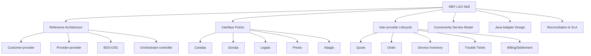

### 1.3 Self-Correction Questions

- Can we trace one enterprise service from customer contract to each supplier order?
- Can we answer which provider owns which service segment?
- Can we map provider-visible lifecycle to customer-visible lifecycle without leaking internal complexity?
- Can cancellation/change requests be propagated safely across provider boundaries?
- Can we prove whether an SLA breach was caused by our domain or supplier domain?
- Can supplier status be stale without corrupting our service inventory?

---

## 2. Mental Model: Orchestrating Across Trust Boundaries

Internal service orchestration assumes you control most systems.

Inter-provider orchestration assumes:

- the other party has its own lifecycle,
- the other party has its own identifiers,
- status is delayed/asynchronous,
- semantics differ,
- cancellation and amendment rules differ,
- SLA evidence must be exchanged,
- data visibility is restricted,
- commercial settlement follows contract terms.

Therefore, design around **trust boundaries**.

```text
Customer intent
  -> Our commercial order
    -> Our service orchestration
      -> External provider order(s)
        -> External provider service(s)
          -> Evidence/status/cost/SLA back to us
```

Do not let external state directly drive internal truth. External state is evidence.

---

## 3. MEF LSO in One Page

MEF LSO, or Lifecycle Service Orchestration, is a reference architecture and framework for automating service lifecycle across network domains and service providers.

The practical goal is simple:

> reduce manual coordination across providers and domains for services such as Carrier Ethernet, IP VPN, SD-WAN, cloud connectivity, NaaS, and other enterprise digital services.

### 3.1 Why It Exists

Enterprise connectivity often spans:

- multiple geographies,
- multiple access providers,
- multiple technologies,
- multiple operational domains,
- multiple commercial agreements.

Manual operation leads to:

- slow quote response,
- inconsistent feasibility checks,
- long order lead time,
- poor status visibility,
- delayed trouble ticket escalation,
- fragmented SLA evidence,
- settlement disputes.

LSO provides a standard framework to automate these interactions.

### 3.2 LSO as Boundary Map

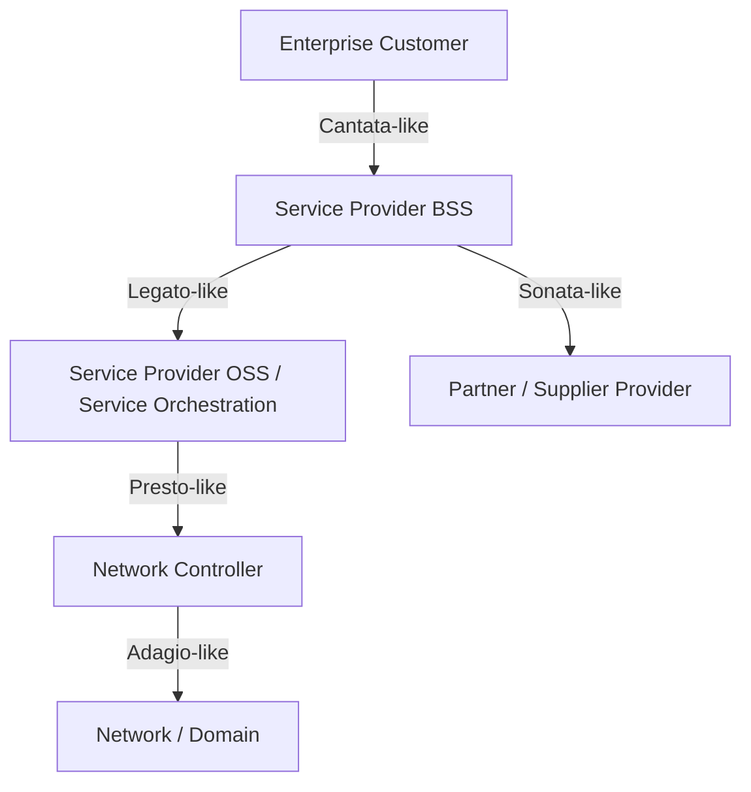

This diagram is simplified. The important part is **separating interaction boundaries**:

- customer-provider,
- provider-provider,
- BSS-OSS,
- orchestrator-controller,
- controller-network.

---

## 4. Interface Reference Points

Names vary across MEF material versions and implementation profiles, but the common mental model is valuable.

### 4.1 Cantata: Customer to Service Provider

Cantata-style boundary supports customer-facing lifecycle:

- product/service discovery,
- quote,
- order,
- appointment/status,
- trouble ticket,
- billing/invoice query,
- service performance visibility.

In your Java architecture, Cantata maps to:

```text
Customer Portal / Enterprise API / Partner API -> BSS edge
```

### 4.2 Sonata: Service Provider to Partner Provider

Sonata-style boundary supports east-west provider interaction.

Typical use:

- provider A requests quote/order from provider B,
- provider B returns feasibility/status/completion,
- provider A raises trouble ticket to provider B,
- provider A obtains service inventory or performance information from provider B.

In Java architecture:

```text
SupplierGateway -> ExternalProviderAPI
```

This is the most relevant boundary for inter-provider orchestration.

### 4.3 Legato: Business Applications to Service Orchestration

Legato-style boundary connects BSS/business applications to service orchestration within a provider domain.

In Java architecture:

```text
Product Order / Commercial Fulfillment -> Service Orchestration
```

This looks similar to what we covered in service order management, but with a MEF service model lens.

### 4.4 Presto: Service Orchestration to Network Control

Presto-style boundary connects service orchestration to network control/domain control.

In Java architecture:

```text
ServiceOrchestrator -> SDN Controller / NFV MANO / Domain Controller
```

### 4.5 Adagio: Network Control to Network Resource

Adagio-style boundary covers lower-level control and resource-facing operations.

In a BSS/OSS Java engineer role, you may not implement Adagio directly, but you must understand that below your orchestration layer there are controller/network realities that may produce delayed, partial, or conflicting evidence.

---

## 5. When to Use TM Forum vs MEF LSO

This is a common confusion.

### 5.1 TM Forum Strength

TM Forum Open APIs and ODA are strong for:

- CSP enterprise architecture,
- BSS/OSS component boundaries,
- product/customer/order/billing/trouble ticket/service/resource APIs,
- internal and external interoperability,
- canonical telecom lifecycle vocabulary.

### 5.2 MEF LSO Strength

MEF LSO is strong for:

- connectivity service lifecycle,
- enterprise service automation,
- inter-provider quote/order/ticket/status,
- east-west provider APIs,
- MEF-defined service/product models,
- NaaS and carrier ethernet style automation.

### 5.3 Practical Architecture

You usually do not choose one globally.

You map:

```text
Internal BSS/OSS components -> TM Forum-inspired APIs/models
Inter-provider connectivity lifecycle -> MEF LSO-inspired APIs/models
Internal anti-corruption layer -> maps between both
```

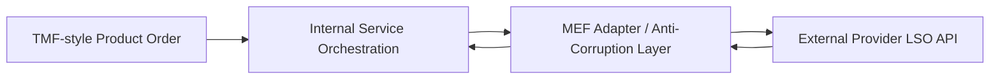

---

## 6. Inter-Provider Order Lifecycle

### 6.1 Scenario

Customer orders enterprise connectivity:

```text
HQ Jakarta <-> Branch Tokyo, 1 Gbps, protected, SLA Gold
```

Our provider owns Jakarta domain but needs partner for Tokyo local loop.

Lifecycle:

1. Customer quote request.
2. Internal feasibility check.
3. Supplier quote request.
4. Combined quote response.
5. Customer order.
6. Internal service decomposition.
7. Supplier order submission.
8. Supplier delivery milestones.
9. Internal activation.
10. End-to-end verification.
11. Customer completion.
12. Supplier settlement.

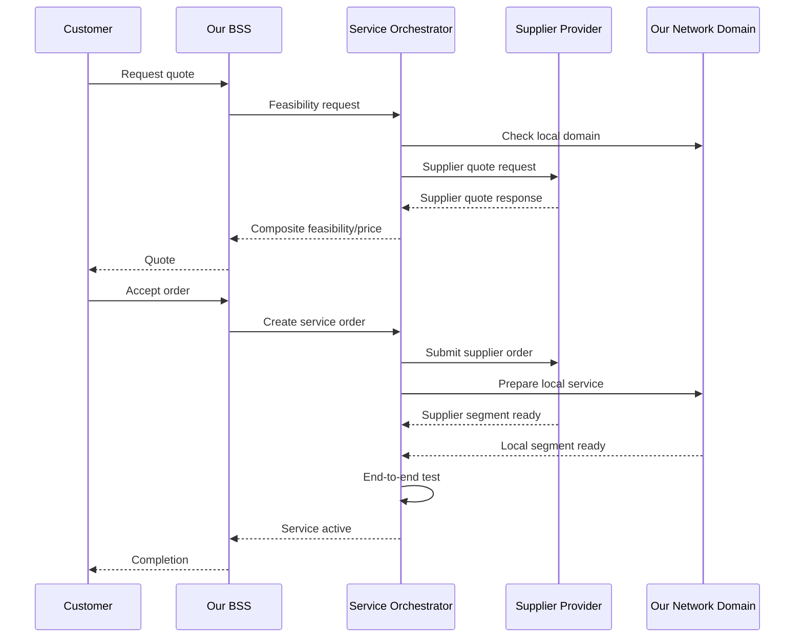

### 6.2 Internal vs External State

Bad design:

```text
internal_service.state = supplier_order.state
```

Better design:

```text
supplier_order.state is evidence used by internal orchestration policy
```

Internal service state should be derived from:

- customer order state,
- internal domain state,
- supplier segment state,
- test evidence,
- commercial policy,
- change/fallout status.

---

## 7. Identifier Strategy

Inter-provider lifecycle creates many IDs.

| Identifier | Owner | Purpose |
|---|---|---|
| customerOrderId | our BSS | customer/commercial lifecycle |
| serviceOrderId | our OSS | internal fulfillment lifecycle |
| serviceId | our inventory | customer-facing service instance |
| supplierOrderId | supplier | external order tracking |
| supplierServiceId | supplier | external service reference |
| correlationId | shared per transaction | tracing across boundary |
| buyerId/sellerId | commercial parties | provider identity |
| location/site ID | party-dependent | service location mapping |

Rules:

- Never overwrite internal ID with supplier ID.
- Store supplier IDs as external references.
- Make correlation searchable.
- Require idempotency for outbound submit.
- Handle supplier re-keying or corrected ID carefully.

```java
public record ExternalProviderReference(
    ProviderId providerId,
    ExternalSystemCode systemCode,
    ExternalReferenceType referenceType,
    String externalId,
    Instant observedAt
) {}
```

---

## 8. Java Domain Model

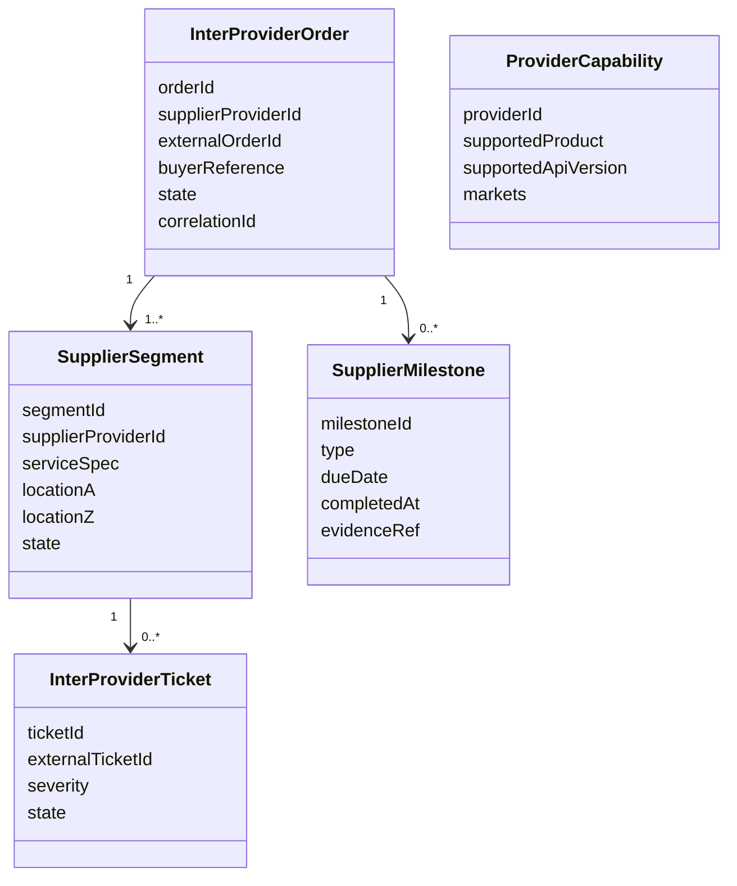

### 8.1 InterProviderOrder

State machine:

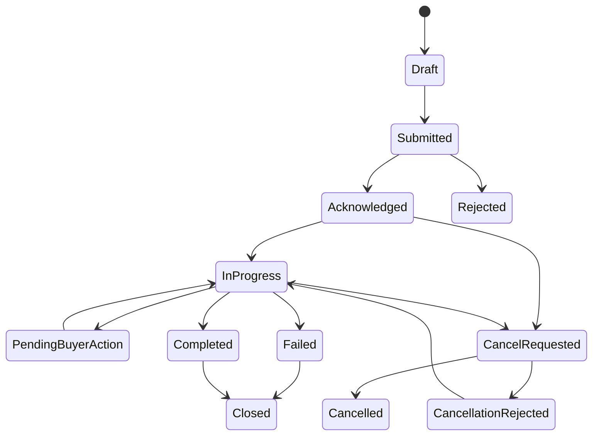

Important:

- `Completed` by supplier does not mean customer service is active.
- `PendingBuyerAction` must carry required action and SLA impact.
- `CancellationRejected` must not be ignored.

### 8.2 SupplierSegment

A supplier segment is a portion of the end-to-end service delivered by external provider.

Fields:

- `segmentId`,
- `supplierProviderId`,
- `serviceSpecRef`,
- `locationRef`,
- `bandwidth`,
- `protection`,
- `slaProfile`,
- `externalServiceId`,
- `state`,
- `evidenceRefs`.

### 8.3 ProviderCapability

Provider capability answers:

```text
Can provider X supply service Y at location Z with SLA S via interface version V?
```

This supports supplier selection and quote routing.

---

## 9. Supplier Gateway Pattern

Do not put external provider API calls inside service orchestration domain directly.

Use Supplier Gateway.

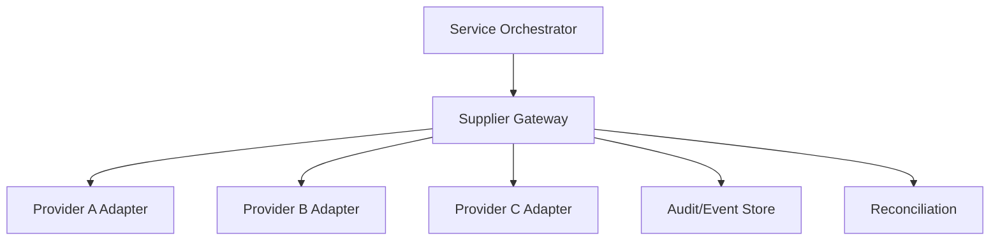

Supplier Gateway responsibilities:

- provider selection,
- API contract adaptation,
- authentication/token management,
- idempotency,
- external ID mapping,
- callback verification,
- error normalization,
- retry/backoff,
- timeout policy,
- external state polling,
- evidence capture,
- audit event emission.

### 9.1 Anti-Corruption Layer

External provider model may not match your model.

Example:

Provider says:

```json
{
  "status": "Done",
  "subStatus": "Installed but pending acceptance"
}
```

Internal normalized state:

```text
SUPPLIER_DELIVERED_PENDING_ACCEPTANCE
```

Do not leak provider-specific `Done` into internal orchestration.

---

## 10. Idempotent Outbound Order Submission

Inter-provider APIs are often unreliable. Network timeout does not mean order failed.

### 10.1 Outbound Idempotency Key

Use deterministic idempotency key:

```text
supplierProviderId + internalServiceOrderId + segmentId + action + version
```

### 10.2 Command Store

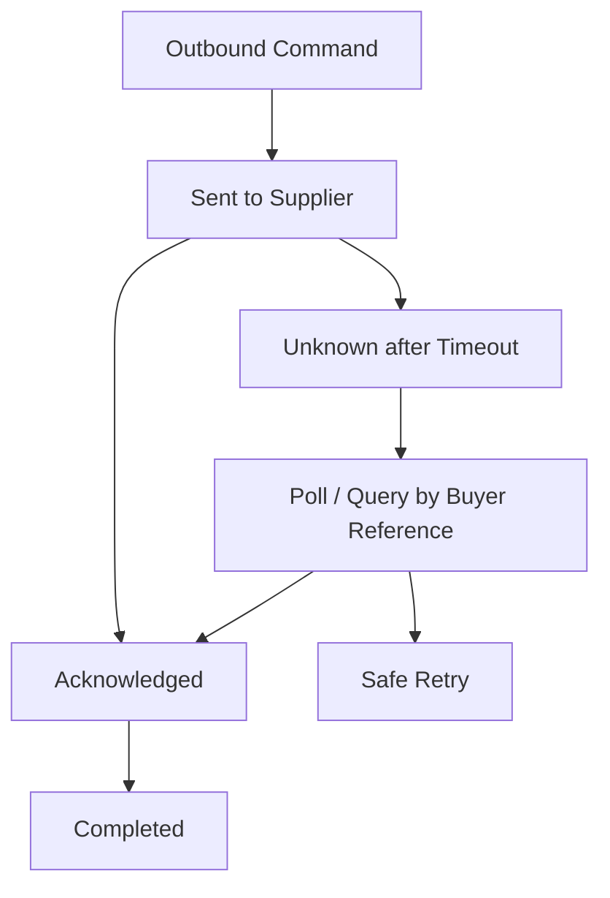

### 10.3 Timeout Handling

Wrong:

```java
catch (TimeoutException e) {
    markSupplierOrderFailed();
}
```

Right:

```java
catch (TimeoutException e) {
    markSupplierOrderUnknown(commandId);
    scheduleSupplierStatusRecovery(commandId);
}
```

Timeout means unknown, not failure.

---

## 11. Quote and Feasibility Flow

### 11.1 Why Quote is Hard

Composite quote depends on:

- our domain availability,
- supplier availability,
- supplier price,
- currency,
- lead time,
- installation constraints,
- SLA,
- location normalization,
- expiration time.

### 11.2 Composite Quote

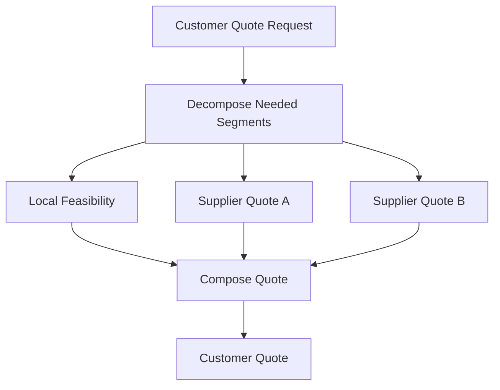

Quote must retain supplier evidence:

```text
customerQuoteId
  supplierQuoteRef[]
  costBasis
  leadTimeBasis
  expiryTime
  assumptions
```

If customer accepts after supplier quote expiry, revalidation is required.

---

## 12. Trouble Ticket Federation

Enterprise customer reports outage.

Potential cause:

- our access domain,
- supplier local loop,
- cloud provider segment,
- customer CPE,
- planned maintenance,
- configuration drift.

Ticket flow:

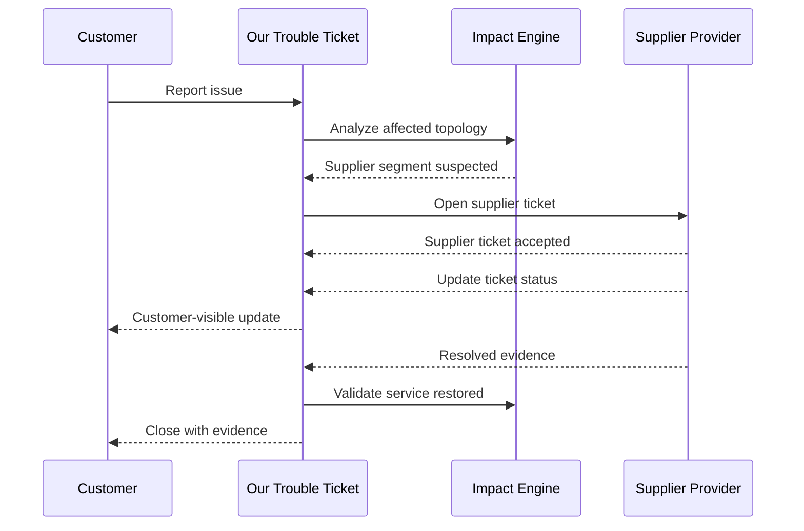

### 12.1 Ticket State Mapping

Supplier states may differ.

| Supplier State | Internal Normalized State |
|---|---|
| New | SUPPLIER_TICKET_OPEN |
| Assigned | SUPPLIER_INVESTIGATING |
| Waiting Customer | WAITING_BUYER_ACTION |
| Resolved | SUPPLIER_RESOLVED_PENDING_VALIDATION |
| Closed | SUPPLIER_CLOSED |

Internal ticket closes only after our validation and customer-visible closure policy.

---

## 13. Service Inventory Federation

Your inventory should know external supplier segment references, but not become a mirror of supplier inventory.

### 13.1 Federated View

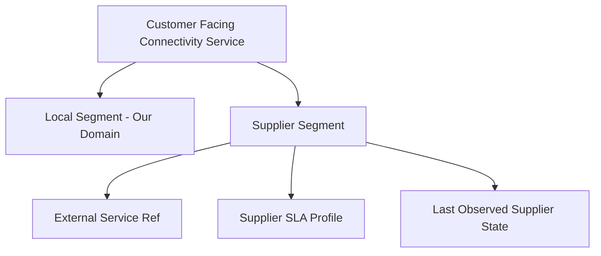

### 13.2 Freshness

External status has freshness.

```java
public record SupplierStateObservation(
    SupplierSegmentId segmentId,
    SupplierState state,
    Instant observedAt,
    ObservationSource source,
    EvidenceRef evidenceRef
) {
    public boolean isStale(Clock clock, Duration maxAge) {
        return observedAt.plus(maxAge).isBefore(clock.instant());
    }
}
```

Do not make decisions from stale external state without policy.

---

## 14. SLA and OLA Across Providers

Customer SLA may depend on supplier OLA.

```text
Customer SLA: 99.9% monthly availability
Supplier OLA: repair within 4 hours for local access
Internal OLA: detect and escalate within 15 minutes
```

If supplier breaches OLA, customer SLA may still be affected.

Need clear attribution:

- outage start,
- outage end,
- affected service segment,
- responsible domain,
- excluded maintenance window,
- customer impact,
- supplier evidence,
- customer credit eligibility,
- supplier penalty eligibility.

### 14.1 SLA Evidence Chain

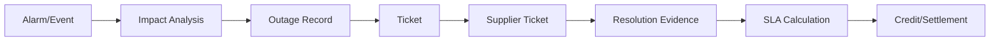

Without evidence chain, SLA settlement becomes negotiation, not computation.

---

## 15. Change Management Across Providers

Customer requests bandwidth upgrade.

Potential impacts:

- supplier must modify local loop,
- new delivery date needed,
- service may require outage window,
- price changes,
- SLA changes,
- rollback plan needed.

### 15.1 Change Lifecycle

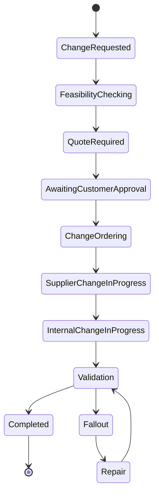

### 15.2 Dangerous Assumption

Bad assumption:

> If supplier can change, we can change.

Better:

> Supplier feasibility is one input. Internal inventory, customer contract, maintenance window, service dependency, and billing impact also decide.

---

## 16. Java Package Blueprint

```text
com.example.telco.lso
├── api
│   ├── SupplierQuoteCallbackController.java
│   ├── SupplierOrderCallbackController.java
│   └── SupplierTicketCallbackController.java
├── application
│   ├── RequestSupplierQuoteUseCase.java
│   ├── SubmitSupplierOrderUseCase.java
│   ├── HandleSupplierOrderUpdateUseCase.java
│   ├── OpenSupplierTicketUseCase.java
│   └── ReconcileSupplierServiceUseCase.java
├── domain
│   ├── InterProviderOrder.java
│   ├── SupplierSegment.java
│   ├── SupplierQuote.java
│   ├── SupplierMilestone.java
│   ├── InterProviderTicket.java
│   └── SupplierStateObservation.java
├── adapter
│   ├── mef
│   │   ├── MefSonataOrderAdapter.java
│   │   ├── MefSonataQuoteAdapter.java
│   │   └── MefSonataTicketAdapter.java
│   └── legacy
│       └── LegacySupplierPortalAdapter.java
├── policy
│   ├── SupplierSelectionPolicy.java
│   ├── SupplierStateMappingPolicy.java
│   ├── SupplierTimeoutPolicy.java
│   └── SupplierSlaAttributionPolicy.java
└── persistence
    ├── InterProviderOrderRepository.java
    ├── SupplierSegmentRepository.java
    └── SupplierObservationRepository.java
```

---

## 17. Example Use Case: Submit Supplier Order

```java
public final class SubmitSupplierOrderUseCase {
    private final InterProviderOrderRepository repository;
    private final SupplierGateway supplierGateway;
    private final SupplierSelectionPolicy supplierSelectionPolicy;
    private final OutboundCommandStore commandStore;

    public SupplierOrderReceipt submit(SubmitSupplierOrderCommand command) {
        var supplier = supplierSelectionPolicy.selectFor(command.segmentRequirement());

        var order = InterProviderOrder.create(
            command.internalServiceOrderId(),
            command.segmentId(),
            supplier.providerId(),
            command.serviceSpec(),
            command.correlationId()
        );

        repository.save(order);

        var outboundCommand = OutboundSupplierCommand.submitOrder(
            order.orderId(),
            supplier.providerId(),
            command.idempotencyKey(),
            order.toSupplierRequest()
        );

        commandStore.save(outboundCommand);

        try {
            var response = supplierGateway.submitOrder(supplier, outboundCommand);
            order.markAcknowledged(response.externalOrderId(), response.evidenceRef());
            outboundCommand.markAcknowledged(response.externalOrderId());
        } catch (SupplierTimeoutException ex) {
            order.markSubmissionUnknown();
            outboundCommand.markUnknownAfterTimeout();
        } catch (SupplierRejectedException ex) {
            order.markRejected(ex.normalizedReason());
            outboundCommand.markRejected(ex.normalizedReason());
        }

        repository.save(order);
        commandStore.save(outboundCommand);

        return order.toReceipt();
    }
}
```

Important choices:

- supplier selected before order submission,
- outbound command is persisted,
- timeout results in unknown state,
- supplier rejection is normalized,
- external order ID is stored as external reference,
- internal orchestration decides next action.

---

## 18. Reconciliation Loops

Inter-provider reconciliation is mandatory.

### 18.1 Order Reconciliation

Compare:

- our outbound command,
- supplier order status,
- callback history,
- internal orchestration state.

Detect:

- command sent but no supplier record,
- supplier completed but internal still waiting,
- supplier cancelled but internal active,
- duplicate supplier order.

### 18.2 Service Reconciliation

Compare:

- our service inventory,
- supplier service state,
- observed performance,
- customer-facing service status.

Detect:

- supplier segment inactive but customer service active,
- supplier segment active but no billing/settlement record,
- supplier service ID missing,
- stale status observation.

### 18.3 Ticket Reconciliation

Compare:

- internal ticket,
- supplier ticket,
- alarm/outage evidence,
- customer notifications.

Detect:

- supplier ticket resolved but internal ticket not validated,
- internal major incident has no supplier escalation,
- SLA clock mismatch.

---

## 19. Observability for Inter-Provider Lifecycle

Minimum telemetry:

- supplier API latency,
- supplier error rate,
- callback delay,
- order completion lead time,
- order fallout by supplier,
- quote response time,
- quote-to-order conversion,
- supplier ticket MTTA/MTTR,
- stale supplier state count,
- reconciliation exception count,
- SLA breach attribution by domain/provider.

Trace should cross:

```text
customer quote -> internal order -> service order -> supplier quote/order -> callback -> activation -> SLA evidence
```

Use correlation IDs that can be shared externally without exposing internal IDs.

---

## 20. Security and Trust

Inter-provider automation exposes sensitive business and network operations.

Controls:

- mutual TLS or equivalent strong client authentication,
- signed callbacks,
- per-provider API credentials,
- scoped token per capability,
- payload validation,
- replay protection,
- audit trail,
- data minimization,
- endpoint allow-list,
- separate sandbox/certification environment,
- certificate rotation process.

Never assume external provider is inside your trust boundary.

---

## 21. Anti-Patterns

### 21.1 Portal Scraping as Permanent Integration

Temporary bridge may be necessary, but permanent portal scraping creates invisible operational risk.

### 21.2 Treating Supplier Completion as Customer Completion

Supplier segment ready is not end-to-end service active.

### 21.3 No External State Freshness

External state observed last week should not drive today’s customer promise.

### 21.4 No Buyer Reference

If supplier cannot query by buyer reference/idempotency key, timeout recovery is fragile.

### 21.5 Manual SLA Attribution

If every SLA breach needs manual blame assignment, your topology/evidence model is insufficient.

### 21.6 One Adapter for All Providers with `if supplier == X`

Use provider-specific adapter behind common Supplier Gateway interface. Keep mapping isolated.

---

## 22. Design Checklist

Before implementing MEF LSO/inter-provider orchestration, answer:

1. Which lifecycle is customer-facing, internal, and supplier-facing?
2. Which provider owns each service segment?
3. What are the reference IDs at each boundary?
4. What is the idempotency key for outbound order?
5. What happens after timeout?
6. How do we map supplier state to internal normalized state?
7. How do we detect stale supplier status?
8. How do we handle supplier cancellation rejection?
9. How do we calculate SLA attribution?
10. How do we reconcile supplier inventory with internal service inventory?
11. How do we expose status to customer without leaking supplier complexity?
12. How do we settle supplier cost and service credit?

---

## 23. Practice Task

Design an inter-provider enterprise connectivity flow.

Scenario:

- Customer orders 1 Gbps connectivity between Jakarta and Singapore.
- Our operator owns Jakarta metro network.
- Supplier owns Singapore local access.
- Supplier requires site survey before quote is final.
- Customer accepts quote.
- Supplier misses committed delivery date.
- Customer requests bandwidth upgrade after activation.

Deliverables:

1. Sequence diagram for quote.
2. Sequence diagram for order.
3. Supplier order state machine.
4. Service inventory object model.
5. SLA attribution model.
6. Reconciliation job design.
7. Failure mode table.

---

## 24. Key Takeaways

- MEF LSO is a lifecycle orchestration framework for services across domains/providers, especially connectivity and enterprise digital services.
- Inter-provider orchestration is not just API integration; it is lifecycle, evidence, SLA, identity, and settlement coordination across trust boundaries.
- Cantata, Sonata, Legato, Presto, and Adagio are useful mental boundaries even when your implementation uses different concrete APIs.
- TM Forum and MEF are complementary: TM Forum is strong for CSP BSS/OSS component model; MEF LSO is strong for connectivity lifecycle automation across providers.
- External supplier state must be treated as evidence, not as direct internal truth.
- Timeout means unknown, not failed.
- Reconciliation is not optional; it is the mechanism that keeps inter-provider automation honest.

---

## 25. References

- MEF 55.1 Lifecycle Service Orchestration Reference Architecture and Framework.
- MEF LSO API/interface reference point descriptions such as Sonata, Cantata, Legato, Presto, and Adagio.
- TM Forum Open Digital Architecture and Open APIs for product order, service order, trouble ticket, inventory, billing, and performance management.
- ETSI NFV MANO and SDN/NFV orchestration concepts from previous part.

