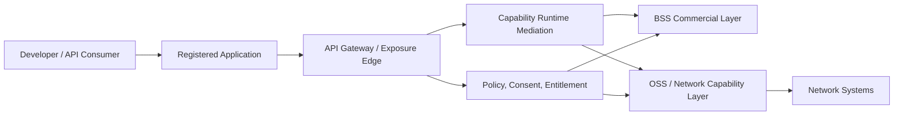
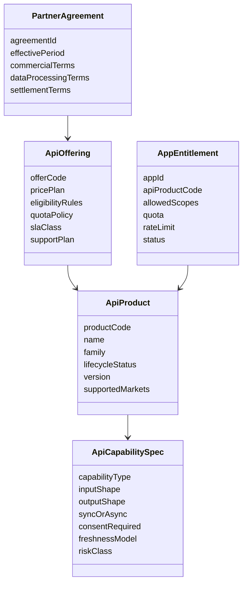
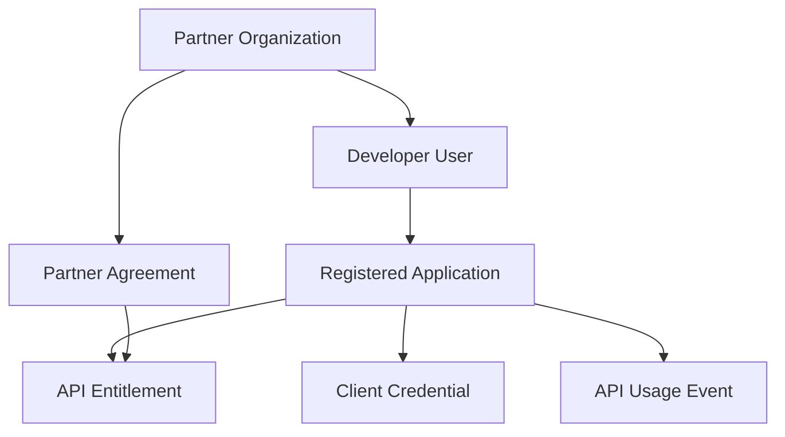
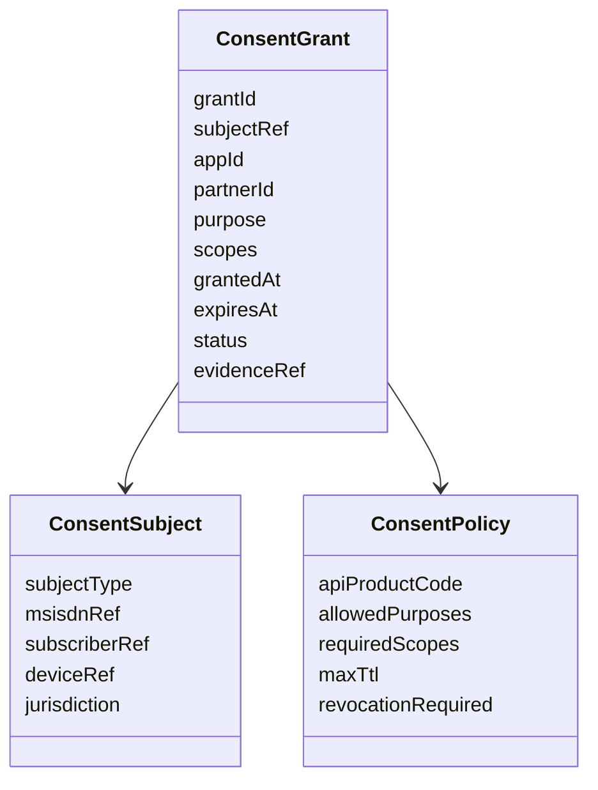
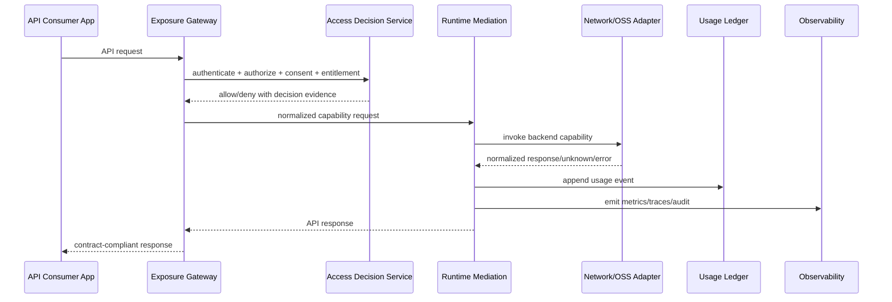
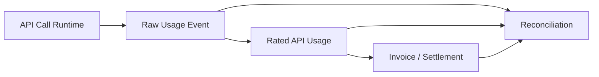
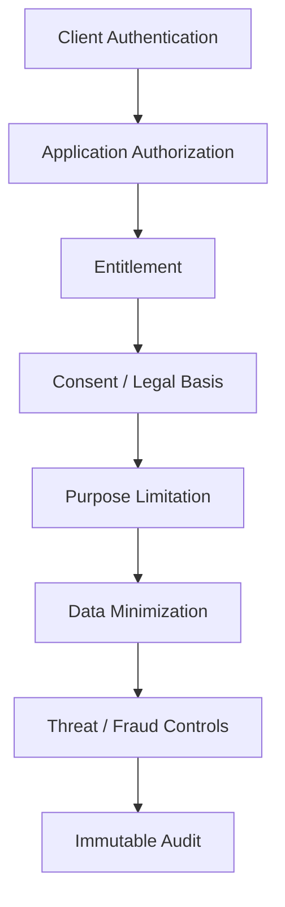
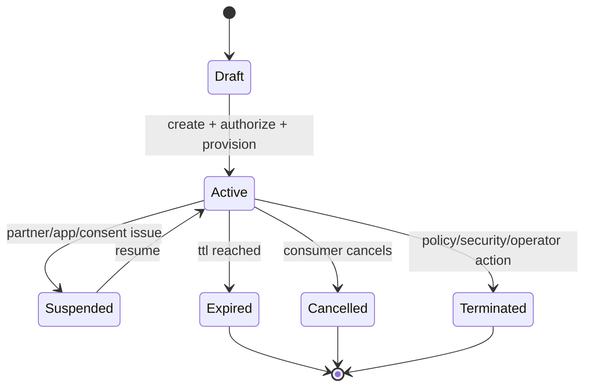
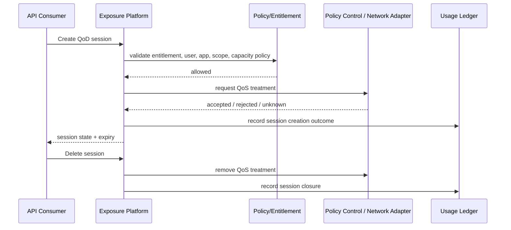
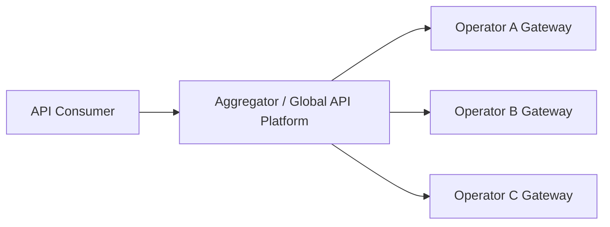

------
title: Learn Java Telecom BSS/OSS - Part 033
description: GSMA Open Gateway, CAMARA, and network API exposure from the viewpoint of a Java BSS/OSS platform engineer.
series: learn-java-telecom-bss-oss
seriesTitle: Learn Java Telecom BSS/OSS
order: 33
partTitle: GSMA Open Gateway, CAMARA & Network APIs
tags:
- java
- telecom
- bss
- oss
- gsma
- camara
- open-gateway
- network-apis
- api-monetization
- platform-architecture
date: 2026-06-29
---

# Part 033 — GSMA Open Gateway, CAMARA & Network APIs

> Goal: understand how a telecom operator exposes network capabilities as productized APIs, and how a Java BSS/OSS platform should model, secure, monetize, operate, and reconcile those APIs.

This part is not about writing another REST controller. It is about exposing a carrier network capability safely enough that banks, fintechs, media platforms, cloud providers, logistics platforms, fraud engines, IoT platforms, and enterprise developers can consume it without knowing the internal shape of the operator network.

The key shift:

> Traditional BSS sells subscriptions. Open Gateway-style platforms sell programmable network capabilities.

That means the platform must connect four worlds:

1. **Developer-facing API experience** — stable API surface, documentation, onboarding, credentials, sandbox, quotas.
2. **Commercial BSS** — offer, agreement, price, invoice, settlement, entitlement, partner account.
3. **Network/OSS capability** — location, SIM swap, device status, QoS, edge discovery, carrier billing, event subscription.
4. **Trust and compliance** — consent, privacy, lawful use, data minimization, audit, revocation, fraud controls.

Officially, CAMARA is an open source Linux Foundation project that defines, develops, and tests APIs, working with the GSMA Operator Platform Group to align requirements and publish definitions. GSMA Open Gateway northbound service APIs are defined within the CAMARA project. TM Forum also positions Open Gateway Operate APIs as the monetization and operationalization layer around GSMA Open Gateway service APIs.

## 1. Kaufman framing

To become effective quickly, deconstruct this domain into five sub-skills:

| Sub-skill | What you must be able to do |
|---|---|
| API capability modeling | Turn network functions into productized, versioned, consent-aware API products. |
| Partner/developer onboarding | Model app, developer, partner, credentials, contract, entitlement, quota, and settlement. |
| Runtime mediation | Route API calls to operator/network/aggregator backends with policy, consent, throttling, normalization, and observability. |
| Monetization and charging | Price API calls, sessions, subscriptions, QoS reservations, refunds, and revenue-share. |
| Operational governance | Detect abuse, reconcile usage, manage incidents, rotate credentials, revoke access, and prove compliance. |

Your first performance target:

> Design a Java platform component that exposes a CAMARA-style SIM Swap API product, supports developer onboarding, validates consent, enforces quota, invokes internal telco services, records billable usage, and produces auditable evidence.

That target is small enough to practice, but representative enough to include the real hard parts.

## 2. Mental model: network API exposure is not just API gateway

A typical mistake is to map this domain to:

```text
consumer -> API Gateway -> backend service -> response
```

That is insufficient. A telco network API platform has at least three planes:



The gateway is only the front door. The actual platform includes:

- developer identity;
- application identity;
- partner account;
- API product;
- entitlement;
- user consent;
- network capability adapter;
- call evidence;
- billable usage event;
- fraud/risk signal;
- incident/ticket integration;
- compliance audit trail.

## 3. Core vocabulary

| Term | Meaning |
|---|---|
| API Product | Commercially packaged API capability, such as SIM Swap, Number Verification, QoD, Location Verification. |
| API Capability | The underlying technical function exposed by network/back-office systems. |
| Developer | Human or organization building consuming applications. |
| Application | Registered client that receives credentials and calls APIs. |
| Partner | Contracting legal/commercial entity; may own many developers/apps. |
| Consent Subject | The end user/subscriber/device/person whose data or network state is involved. |
| Consent Grant | Evidence that the subject authorized a specific purpose/scope/duration. |
| Entitlement | Right of an app/partner to consume a specific API product under limits. |
| API Usage Event | Immutable record of an API call or billable unit. |
| Capability Invocation | Internal normalized command/query sent to a network or OSS/BSS backend. |
| Aggregator | Intermediary that exposes common APIs across multiple operators. |

## 4. CAMARA API families and BSS/OSS implications

GSMA's Open Gateway API descriptions group APIs into families such as authentication/fraud prevention, location services, communication quality, device information, computing services, and payments/charging.

### 4.1 Authentication and fraud prevention

Examples:

- Number Verification;
- SIM Swap;
- Device Swap;
- Number Recycling;
- KYC Match;
- KYC Age Verification;
- Call Forwarding Signal.

BSS/OSS implications:

- requires subscriber/device/account lookup;
- requires strict privacy/data minimization;
- requires anti-fraud controls;
- often integrates with banking/fintech use cases;
- may require consent or legitimate-interest policy depending on jurisdiction and product design;
- responses must not leak internal subscriber inventory details.

Design principle:

> Return the answer the API contract promises, not the internal data you happen to know.

For example, a SIM swap API should not expose IMSI, ICCID, HLR/HSS/UDM data, SIM profile metadata, or internal activation event history unless the API contract explicitly requires it.

### 4.2 Location services

Examples:

- Location Verification;
- Location Retrieval;
- Geofencing Subscription;
- Region Device Count;
- Population Density Data.

BSS/OSS implications:

- high privacy sensitivity;
- precision and freshness must be explicitly modeled;
- consent and purpose limitation are central;
- network fallback behavior must be defined;
- location unavailable is not the same as user not in location;
- aggregation/anonymization may be required for population APIs.

State invariant:

```text
No precise user/device location response may be emitted without a valid legal basis, scope, purpose, and audit record.
```

### 4.3 Communication quality

Examples:

- Quality on Demand;
- QoS Provisioning;
- QoS Profiles;
- Connectivity Insights;
- Application Profiles.

BSS/OSS implications:

- connects BSS product/offer to policy control and network slice/QoS capabilities;
- may require reservation, activation, expiry, and cancellation;
- must handle partial capability across geography, RAT, device type, plan, roaming status;
- must align with charging and SLA evidence;
- requires network impact controls to avoid degrading other users.

Critical distinction:

| Query-style API | Command-style API |
|---|---|
| Number Verification | QoS Provisioning |
| SIM Swap check | Quality on Demand session creation |
| Device Reachability check | Carrier Billing charge/refund |
| Location Verification | Geofencing subscription creation |

Command-style APIs require lifecycle management, not just request/response handling.

### 4.4 Device information

Examples:

- Device Reachability Status;
- Connected Network Type;
- Device Roaming Status;
- Device Identifier.

BSS/OSS implications:

- freshness matters;
- network state may be inconsistent across systems;
- response can become stale immediately;
- roaming may involve external networks and partner uncertainty;
- exposed state must not reveal sensitive topology.

### 4.5 Computing and edge discovery

Example:

- Simple Edge Discovery.

BSS/OSS implications:

- requires mapping device/network location to edge zones;
- must account for reachability, capacity, tenant eligibility, and commercial agreement;
- often intersects with enterprise private network, CDN, low-latency gaming, IoT, and industrial applications.

### 4.6 Payments and charging

Examples:

- Carrier Billing;
- Carrier Billing Refund.

BSS/OSS implications:

- payment authorization;
- wallet/balance/invoice integration;
- refund lifecycle;
- dispute handling;
- settlement with partner/merchant;
- anti-fraud and spend limits.

This is not only an API. It is a regulated financial-like workflow.

## 5. Productizing a network API

A network API becomes sellable only when it has a product model.



Minimum product metadata:

| Metadata | Why it matters |
|---|---|
| API family | Routing, security profile, documentation grouping. |
| capability version | Backend and contract compatibility. |
| market/country/operator coverage | API may not be available in every geography/network. |
| consent requirement | Runtime policy decision. |
| sensitivity class | Logging, masking, audit retention. |
| sync/async behavior | Client expectation and lifecycle model. |
| billable unit | per request, per successful response, per session, per subscription, per event. |
| SLA/SLO class | support and operational priority. |
| quota policy | commercial and technical protection. |
| refund policy | especially for carrier billing or failed QoS sessions. |

## 6. Developer onboarding model

A strong platform separates **partner**, **developer**, **application**, and **credential**.



Avoid this anti-pattern:

```text
api_key -> partner_id -> allowed APIs
```

It fails because:

- apps need separate lifecycle;
- credentials rotate independently;
- quota often applies per app and per partner;
- incidents may need to suspend one app without disabling all partner access;
- settlement may group usage across apps;
- consent redirect URLs belong to app-level configuration;
- security posture differs by app.

Recommended aggregate boundaries:

```text
PartnerAccount
  PartnerAgreement
  BillingProfile
  SettlementProfile

DeveloperProfile
  UserIdentity
  RoleMembership

DeveloperApplication
  AppRegistration
  RedirectUri
  CredentialSet
  WebhookEndpoint
  AppRiskProfile

ApiEntitlement
  ApiProductRef
  ScopeSet
  QuotaPolicy
  RateLimitPolicy
  EffectivePeriod

ApiUsageLedger
  ApiUsageEvent
  BillableUsageEvent
  SettlementEvent
```

## 7. Consent and authorization

Consent is not a Boolean. It has dimensions.



A runtime authorization decision should evaluate:

1. Is the application authenticated?
2. Is the partner agreement active?
3. Is the app entitled to this API product and scope?
4. Is the API available for the requested market/network?
5. Is there a valid consent or lawful basis?
6. Is the request inside quota/rate/spend limits?
7. Does the target number/device/subscriber match policy constraints?
8. Is the request suspicious or blocked by fraud policy?
9. Is the network capability currently available?
10. Is enough evidence recorded to defend the decision later?

Do not spread these checks randomly across controllers, adapters, and downstream systems. Model them as a decision pipeline.

```java
public record NetworkApiAccessRequest(
    AppId appId,
    PartnerId partnerId,
    ApiProductCode apiProductCode,
    Set<ApiScope> requestedScopes,
    SubjectReference subject,
    Purpose purpose,
    Market market,
    Instant requestedAt,
    CorrelationId correlationId
) {}

public sealed interface AccessDecision permits AccessDecision.Allow, AccessDecision.Deny {
    record Allow(DecisionId decisionId, Set<ApiScope> grantedScopes, EvidenceRef evidenceRef)
        implements AccessDecision {}

    record Deny(DecisionId decisionId, DenialReason reason, EvidenceRef evidenceRef)
        implements AccessDecision {}
}
```

## 8. Runtime mediation pattern

A network API call should move through deterministic stages.



Important invariant:

```text
Every externally visible response must be traceable to an access decision, backend invocation attempt, and usage/audit event.
```

## 9. Capability adapter design

Internal network systems are heterogeneous. The CAMARA/Open Gateway-facing surface must remain stable even if internal systems differ by market, vendor, generation, or acquisition history.

Use an anti-corruption adapter:

```java
public interface SimSwapCapability {
    SimSwapResult check(SimSwapQuery query);
}

public record SimSwapQuery(
    NormalizedMsisdn msisdn,
    Duration lookbackWindow,
    Market market,
    DecisionId accessDecisionId,
    CorrelationId correlationId
) {}

public sealed interface SimSwapResult {
    record Changed(boolean changed, Instant lastChangeAt, Freshness freshness) implements SimSwapResult {}
    record Unknown(UnknownReason reason, RetryAdvice retryAdvice) implements SimSwapResult {}
    record NotEligible(EligibilityReason reason) implements SimSwapResult {}
}
```

Do not expose vendor errors directly:

```text
HLR_TIMEOUT
UDM_503
SQL_NO_ROW
VENDOR_CODE_18492
```

Normalize to domain outcomes:

| Backend outcome | External/runtime normalized meaning |
|---|---|
| Target not found in serving operator | not eligible / not found depending API contract |
| Timeout | unknown, retryable/non-retryable depending policy |
| Source unavailable | capability temporarily unavailable |
| Consent missing | denied by policy |
| No SIM change | negative result with freshness metadata |
| Recent SIM change | positive result with policy-controlled granularity |

## 10. Usage ledger and monetization

Every call may create multiple records:

| Record | Purpose |
|---|---|
| Access decision event | Proves authorization/denial path. |
| Invocation event | Proves backend attempt and outcome. |
| API usage event | Product/platform usage analytics. |
| Billable usage event | Rating/billing input. |
| Settlement event | Partner/operator/aggregator revenue share. |
| Security event | Fraud/abuse monitoring. |

Example usage event:

```java
public record ApiUsageEvent(
    UsageEventId id,
    AppId appId,
    PartnerId partnerId,
    ApiProductCode apiProductCode,
    ApiOperation operation,
    Market market,
    Instant occurredAt,
    UsageOutcome outcome,
    BillableUnit billableUnit,
    Optional<Money> estimatedCharge,
    CorrelationId correlationId,
    EvidenceRef evidenceRef
) {}
```

Billable unit design:

| API type | Possible billable unit |
|---|---|
| SIM Swap check | per successful request or per request attempted. |
| Number Verification | per verification. |
| Location Verification | per response, possibly tiered by accuracy/freshness. |
| QoD session | per session, duration, reserved bandwidth, or successful activation. |
| Geofencing | per subscription plus per event. |
| Carrier Billing | percentage fee, flat fee, refund-adjusted. |
| Edge Discovery | per lookup or subscription/enterprise bundle. |

A mature platform separates usage capture from rating:



## 11. Quota, throttling, and spend controls

Do not implement only technical rate limiting. Telco API exposure needs multi-dimensional limits.

| Limit type | Example |
|---|---|
| Per credential | 100 requests/second. |
| Per app | 1 million SIM Swap calls/month. |
| Per partner | $100k monthly spend cap. |
| Per subscriber | max N sensitive checks/hour. |
| Per API product | QoD sessions capped by region capacity. |
| Per geography | limited market rollout. |
| Per risk score | lower limit for newly onboarded apps. |
| Per incident mode | emergency throttle during outage/attack. |

A good rate limiter answer is not just allow/deny:

```java
public sealed interface ConsumptionDecision {
    record Allowed(QuotaSnapshot snapshot) implements ConsumptionDecision {}
    record SoftLimited(RetryAfter retryAfter, QuotaSnapshot snapshot) implements ConsumptionDecision {}
    record HardDenied(LimitReason reason, QuotaSnapshot snapshot) implements ConsumptionDecision {}
}
```

## 12. Security model

Network APIs are sensitive because they expose privileged telecom knowledge. Security should be layered:



Controls to model explicitly:

- OAuth2/OIDC client authentication where applicable;
- mTLS or signed request support for high-risk partners;
- credential rotation and revocation;
- webhook signature validation;
- consent grant validation;
- token scope to API scope mapping;
- partner/app risk classification;
- encrypted sensitive identifiers;
- MSISDN tokenization or reference indirection;
- log redaction;
- abuse detection;
- replay protection;
- idempotency keys for commands;
- non-repudiation evidence for chargeable operations.

## 13. Privacy and data minimization

Privacy is not only a legal concern. It is an architecture constraint.

For each API response, ask:

1. What is the minimum answer required by the contract?
2. Does the consumer need raw data or a decision?
3. Can precision be reduced?
4. Can timestamp granularity be reduced?
5. Can the subscriber/device be represented as a reference rather than a clear identifier?
6. Should the data be cached, and for how long?
7. What must be removed from logs, traces, metrics, and dead-letter queues?

Example:

| Weak design | Better design |
|---|---|
| Return exact SIM activation timestamp to every partner. | Return policy-defined age bucket or boolean if the contract allows. |
| Log full MSISDN in traces. | Log stable hashed/tokenized subject reference. |
| Share raw cell location. | Share location verification decision or bounded accuracy. |
| Keep request payload forever. | Keep evidence hash + minimal regulated audit fields. |

## 14. API lifecycle and versioning

For Open Gateway/CAMARA-style APIs, versioning has several layers:

| Layer | Versioned artifact |
|---|---|
| External API contract | OpenAPI/spec release. |
| API product | Commercial package version. |
| Capability adapter | Backend implementation version. |
| Policy model | Consent/entitlement/eligibility policy version. |
| Rating model | Price/rating rule version. |
| Evidence schema | Audit/usage event schema version. |

Do not conflate them.

A new API spec version does not automatically mean:

- new price;
- new backend;
- new consent scope;
- new quota;
- new SLA;
- new customer agreement.

Model compatibility explicitly:

```java
public record ApiContractCompatibility(
    ApiProductCode product,
    ApiVersion externalVersion,
    CapabilityVersion capabilityVersion,
    PolicyVersion policyVersion,
    CompatibilityStatus status,
    Optional<Instant> sunsetAt
) {}
```

## 15. Subscription-style APIs

Some APIs create ongoing subscriptions, for example geofencing or device status notification.

That means the platform must manage lifecycle:



Subscription invariants:

- no active subscription without active entitlement;
- no active subject-bound subscription without valid consent/legal basis;
- no event delivery without registered and verified webhook/channel;
- no charge without subscription or event evidence;
- termination must stop backend watch jobs;
- webhook failures must have retry and dead-letter policy;
- subscriber revocation must propagate quickly.

## 16. Quality on Demand and QoS provisioning lifecycle

Quality-related APIs are different because they can modify network behavior.

A safer lifecycle:



Important model fields:

```java
public record QodSession(
    QodSessionId id,
    AppId appId,
    PartnerId partnerId,
    SubjectReference subject,
    QosProfileRef profile,
    Market market,
    Instant requestedStart,
    Instant effectiveStart,
    Instant expiresAt,
    QodSessionState state,
    NetworkEvidenceRef networkEvidenceRef
) {}
```

Failure modes:

| Failure | Correct handling |
|---|---|
| Backend accepts but confirmation lost | state `UNKNOWN`, reconcile. |
| App retries create | idempotency key prevents duplicate session. |
| QoS cannot be applied in region | reject with clear reason, no charge unless contract says attempt is billable. |
| User revokes consent mid-session | terminate or suspend depending policy. |
| Session expiry job fails | reconciliation detects expired active session. |

## 17. Aggregator and multi-operator model

Open Gateway ecosystems often involve aggregators and many operators. A platform must handle routing.



Routing dimensions:

- MSISDN country code and number portability;
- serving operator vs home operator;
- roaming status;
- market availability;
- partner entitlement by operator;
- operator-specific policy;
- capability availability;
- latency/SLA;
- fallback behavior.

Do not hard-code country-code routing. Number portability and MVNO arrangements can break naive assumptions.

## 18. Java component blueprint

A practical Java module layout:

```text
com.acme.telco.opengateway
  api
    rest
    webhook
    dto
  application
    accessdecision
    capability
    onboarding
    usage
    subscription
  domain
    partner
    application
    entitlement
    consent
    apiproduct
    capability
    usage
    settlement
  infrastructure
    gateway
    oauth
    policy
    ledger
    adapter
      simswap
      numberverification
      location
      qod
      carrierbilling
    persistence
    messaging
    observability
```

Component boundaries:

| Component | Responsibility |
|---|---|
| Developer Portal | registration, docs, sandbox, app lifecycle. |
| Partner Management | partner account, agreement, settlement profile. |
| API Product Catalog | product, offering, version, quota, price, lifecycle. |
| Access Decision Service | authentication, entitlement, consent, policy, risk. |
| Capability Runtime | normalized command/query execution. |
| Capability Adapters | network/BSS/OSS backend integration. |
| Usage Ledger | immutable usage and billing events. |
| Settlement Engine | partner/operator revenue sharing. |
| Abuse/Fraud Monitor | anomaly detection and blocking. |
| API Operations | incidents, health, rollback, status page, support. |

## 19. Persistence model

Do not put everything into a generic `api_call_log`.

Suggested persistence separation:

| Store | Content |
|---|---|
| Product catalog store | API product metadata, offer, version, price. |
| Partner store | partner profile, agreement, settlement terms. |
| Application store | registered apps, credentials, redirect URIs, webhook endpoints. |
| Entitlement store | app/API/scope/quota grants. |
| Consent store | consent grant, status, evidence, expiry. |
| Usage ledger | immutable usage events. |
| Invocation store | backend invocation attempts and outcome. |
| Subscription store | API subscriptions and lifecycle. |
| Audit store | security/compliance evidence. |

## 20. Event model

Events should support both business and operational reconciliation.

```text
ApiProductPublished
ApiProductDeprecated
PartnerAgreementActivated
DeveloperApplicationRegistered
CredentialRotated
ApiEntitlementGranted
ApiEntitlementSuspended
ConsentGrantCreated
ConsentGrantRevoked
NetworkApiAccessAllowed
NetworkApiAccessDenied
CapabilityInvocationStarted
CapabilityInvocationCompleted
CapabilityInvocationUnknown
ApiUsageRecorded
BillableApiUsageRecorded
ApiSubscriptionCreated
ApiSubscriptionTerminated
WebhookDeliveryFailed
ApiAbuseDetected
PartnerSettlementCalculated
```

Never rely only on gateway access logs. They are useful, but they are not sufficient as commercial or compliance evidence.

## 21. Operational model

Expose these operational dashboards:

| Dashboard | Questions answered |
|---|---|
| API Product Health | Is this API usable right now? By market/operator/version? |
| Partner/App Health | Which apps are failing, throttled, or abusive? |
| Capability Backend Health | Which backend/vendor/operator path is degraded? |
| Consent/Auth Denials | Are denials expected or caused by config/policy issue? |
| Usage-to-Billing | Are all usage events rated and billed/settled? |
| Subscription Orphans | Are there subscriptions active externally but missing internally, or vice versa? |
| SLA/SLO | Are API latency/error/availability commitments met? |
| Privacy/Audit | Can we prove access decisions and minimization? |

Metrics examples:

```text
api_requests_total{api_product,operation,market,outcome}
api_access_denials_total{api_product,reason}
api_capability_invocation_latency_ms{capability,backend,market}
api_usage_events_recorded_total{api_product,billable_unit}
api_quota_denials_total{partner,api_product,limit_type}
api_subscription_active{api_product,market}
api_webhook_delivery_failures_total{api_product,partner}
api_unknown_backend_outcomes_total{capability,backend}
```

## 22. Testing strategy

Test at five layers:

| Layer | Test focus |
|---|---|
| Contract | API spec compatibility, response shape, error semantics. |
| Policy | entitlement, consent, purpose, jurisdiction, quota, risk decisions. |
| Adapter | backend normalization, timeout/unknown, vendor error mapping. |
| Ledger | usage event idempotency, billing unit correctness, replay safety. |
| End-to-end | app onboarding to billable API call and reconciliation. |

A useful test scenario:

```gherkin
Scenario: SIM Swap API call with valid partner, app, entitlement, and consent
  Given partner P has an active agreement for SIM_SWAP
  And application A belongs to partner P
  And application A has entitlement SIM_SWAP:check
  And consent exists for subject S and purpose fraud-prevention
  And backend returns last SIM change at 2026-06-01T10:00:00Z
  When A calls SIM Swap for subject S with lookback 7 days
  Then the platform returns changed=false
  And an access decision event is stored
  And a capability invocation event is stored
  And an API usage event is stored
  And no raw IMSI or ICCID is exposed
```

## 23. Common anti-patterns

| Anti-pattern | Why it fails |
|---|---|
| Treating Open Gateway as just API gateway configuration | Misses consent, entitlement, monetization, settlement, and operational evidence. |
| Putting partner, developer, app, and credential into one table | Breaks lifecycle and security isolation. |
| Logging raw MSISDN/device/location everywhere | Creates privacy and compliance risk. |
| Hard-coding API availability per country | Fails with operator routing, MVNO, portability, roaming, phased rollout. |
| Billing from gateway logs | Gateway logs are not a reliable commercial ledger. |
| Exposing backend errors to consumers | Leaks internal network/vendor details and destabilizes contracts. |
| No subscription reconciliation | Leaves stale geofence/QoS/device subscriptions active. |
| One quota dimension | Cannot express spend, partner, app, subject, region, and risk controls. |
| No sunset/version governance | API changes become impossible without breaking partners. |

## 24. Design exercise

Design an Open Gateway-style platform for three APIs:

1. SIM Swap;
2. Location Verification;
3. Quality on Demand.

For each API, define:

- API product;
- billable unit;
- consent/legal basis requirement;
- entitlement model;
- quota policy;
- backend capability adapter;
- privacy minimization rule;
- usage event schema;
- operational SLO;
- reconciliation scenario.

Then answer:

1. Which API is pure query?
2. Which API creates lifecycle state?
3. Which API has the highest privacy risk?
4. Which API has the highest network operational risk?
5. Which API needs refund/compensation logic?

## 25. Top 1% mental model

A top-tier engineer does not see network APIs as endpoints. They see them as controlled exposure of scarce, sensitive, regulated, monetizable capabilities.

The right model is:

```text
API product = contract + entitlement + consent + capability adapter + usage ledger + operating model
```

When designing such a platform, always ask:

- Who is allowed to call this?
- On whose behalf?
- For what purpose?
- Under which commercial terms?
- With which network capability?
- With what precision/freshness?
- What is billable?
- What must be auditable?
- What happens when the network answer is unknown?
- How do we revoke, reconcile, refund, and prove correctness?

## References

- GSMA Open Gateway API Descriptions — https://www.gsma.com/solutions-and-impact/gsma-open-gateway/gsma-open-gateway-api-descriptions/
- CAMARA Project — https://camaraproject.org/
- CAMARA GitHub organization and API portfolio guidance — https://github.com/camaraproject
- TM Forum CAMARA/Open Gateway overview — https://www.tmforum.org/oda/open-apis/partners/camara
