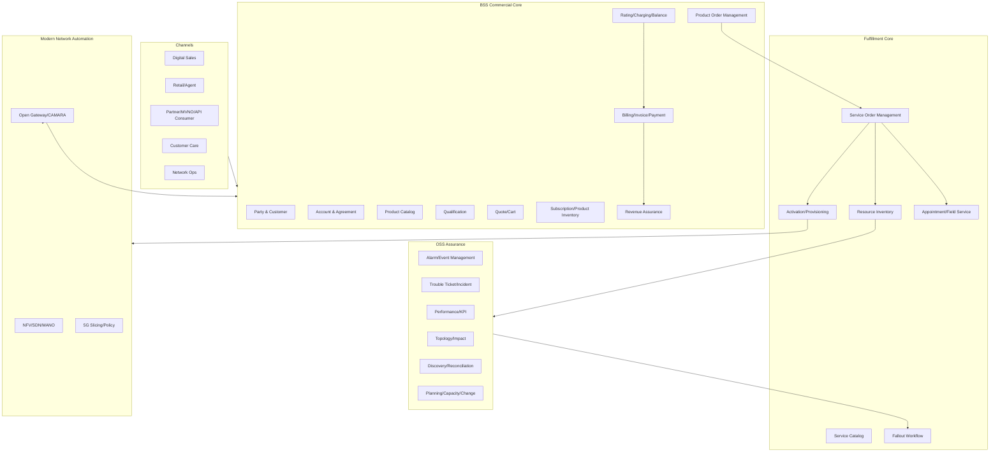
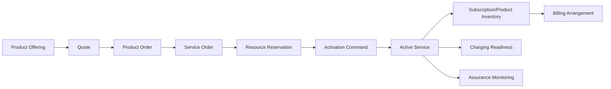
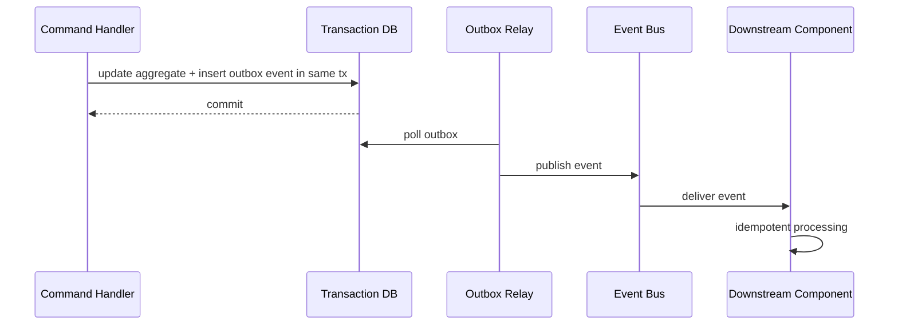
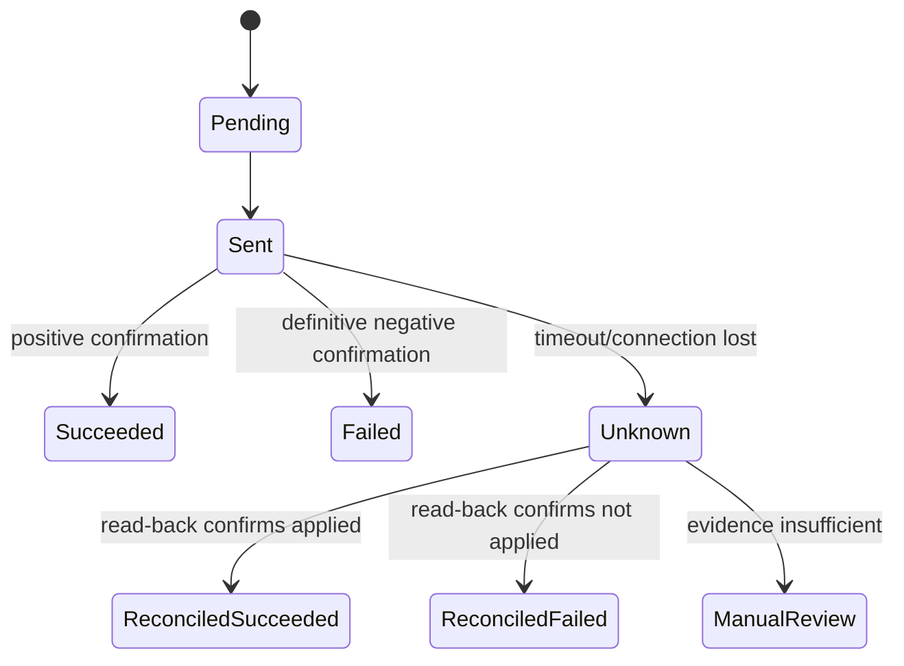
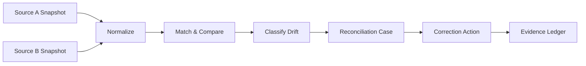
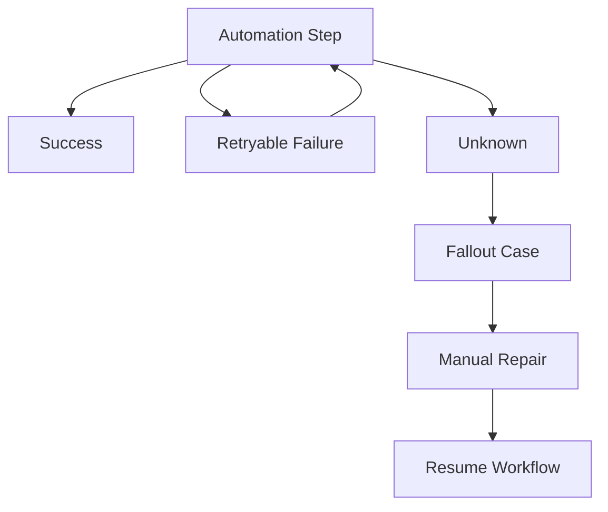
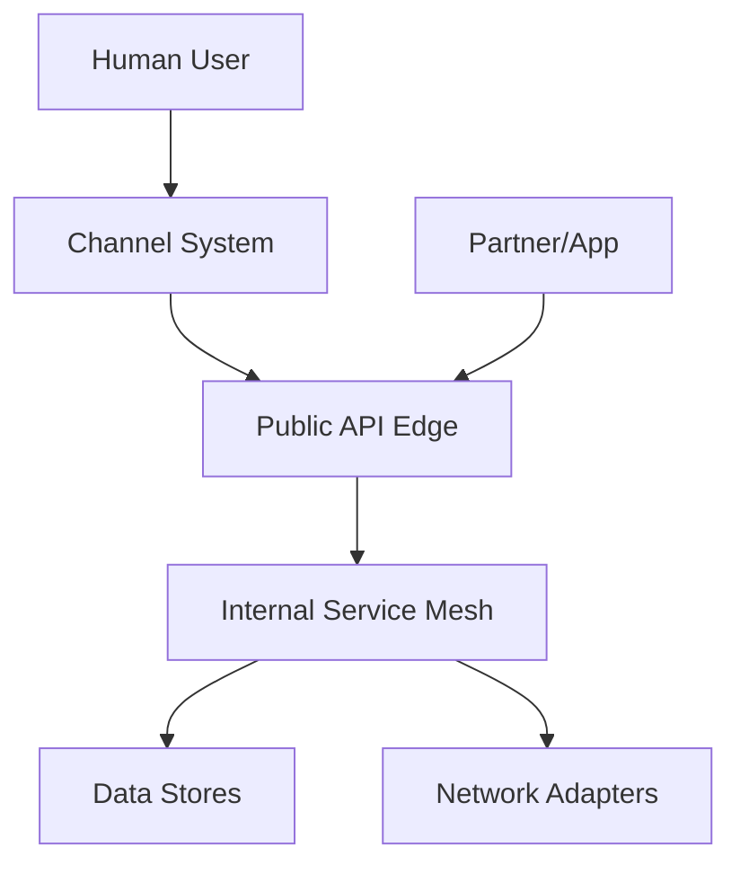
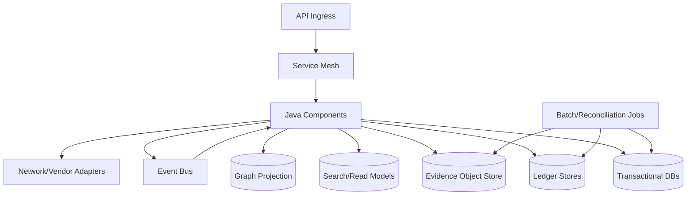

------
title: Learn Java Telecom BSS/OSS - Part 034
description: A carrier-grade Java platform blueprint for BSS/OSS systems: domains, components, contracts, data, resilience, security, operability, reconciliation, and governance.
series: learn-java-telecom-bss-oss
seriesTitle: Learn Java Telecom BSS/OSS
order: 34
partTitle: Carrier-Grade Java BSS/OSS Platform Blueprint
tags:
- java
- telecom
- bss
- oss
- architecture
- platform-engineering
- carrier-grade
- tm-forum
- oda
- reliability
- reconciliation
date: 2026-06-29
---

# Part 034 — Carrier-Grade Java BSS/OSS Platform Blueprint

> Goal: assemble everything from the previous parts into a coherent Java platform architecture that can survive real telecom complexity: long-running lifecycle, partial failure, vendor fragmentation, compliance, monetization, reconciliation, and operational pressure.

This part is the architectural synthesis before the capstone.

A BSS/OSS platform is not a collection of CRUD services. It is an operational nervous system for a communications provider.

It must answer:

- what can be sold;
- to whom;
- under which agreement;
- whether it is feasible;
- how it is ordered;
- how it is decomposed;
- what resources are needed;
- how those resources are activated;
- whether the service is working;
- who is affected when it fails;
- what is charged;
- what must be reconciled;
- what evidence proves the lifecycle was correct.

## 1. Kaufman framing

The performance target for this part:

> Design a carrier-grade Java BSS/OSS platform blueprint that can support quote-to-activate, subscription lifecycle, charging/billing, assurance, network inventory, partner APIs, and operational reconciliation using explicit bounded contexts, stable contracts, event lineage, and recovery workflows.

The sub-skills:

| Sub-skill | Observable capability |
|---|---|
| Domain partitioning | Separate BSS, OSS, network, partner, and platform concerns without losing end-to-end lifecycle. |
| Contract design | Define API/event contracts that survive vendor and system variation. |
| State machine design | Make order, subscription, service, resource, ticket, and API subscription states explicit and auditable. |
| Reliability design | Treat timeout, duplicate, stale data, and partial activation as first-class outcomes. |
| Reconciliation design | Build mechanisms that continuously prove and repair cross-system consistency. |
| Operability design | Expose health, lineage, SLO, fallout, impact, and human repair pathways. |

## 2. Platform north star

The platform should optimize for these invariants:

```text
1. No commercial promise without captured terms and eligibility evidence.
2. No fulfillment action without an accepted order and stable decomposition snapshot.
3. No resource assignment without allocation ownership and lifecycle state.
4. No activation side effect without idempotency and read-back evidence.
5. No customer-visible active service without inventory and billing/charging readiness alignment.
6. No billable charge without traceable usage/order/agreement evidence.
7. No assurance ticket without impacted entity and lifecycle ownership.
8. No external network API access without entitlement, consent/legal basis, and audit evidence.
9. No manual repair without maker-checker, reason, and immutable audit.
10. No architectural shortcut that prevents reconciliation.
```

Carrier-grade does not mean "never fails". It means the system can identify, contain, explain, and repair failure without corrupting customer, network, or financial state.

## 3. Reference architecture



This map is not a deployment topology. It is a responsibility topology.

## 4. Component ownership matrix

| Component | Owns | Does not own |
|---|---|---|
| Product Catalog | product/offering/pricing/eligibility metadata | customer instance state, active subscription state |
| Qualification | feasibility decision and evidence | final order acceptance, activation |
| Quote/Cart | commercial intent and price snapshot | actual fulfillment state |
| Product Order | accepted commercial execution contract | low-level network commands |
| Service Catalog | CFS/RFS decomposition templates | customer commercial pricing |
| Service Order | fulfillment execution graph | product offer design |
| Resource Inventory | resource lifecycle, reservation, assignment | commercial customer promise |
| Activation | side-effect execution and evidence | resource ownership policy |
| Subscription Inventory | customer-owned product/service entitlement state | raw network topology |
| Charging | usage rating, balance, quota | invoice layout and collection process |
| Billing | invoice, receivable, payment allocation, collection | online network quota decision |
| Alarm/Event | technical events and alarm lifecycle | customer SLA compensation |
| Ticket/Incident | work contract and resolution evidence | raw metric collection |
| Topology/Impact | dependency graph and blast radius | authoritative resource assignment |
| Open Gateway | API product exposure, app entitlement, usage ledger | internal network implementation |

Boundary rule:

> A component may reference another component's identity and published facts, but must not mutate another component's state directly.

## 5. Canonical lifecycle graph

Most telecom lifecycle bugs happen because teams optimize a local flow and ignore cross-domain state.

The platform should model the lifecycle graph explicitly:



The core idea:

> Every state transition must have a predecessor, an owner, evidence, and a recovery path.

## 6. State machine catalogue

Every major aggregate should have explicit states.

| Aggregate | Essential states |
|---|---|
| Quote | DRAFT, PRICED, VALIDATED, PRESENTED, ACCEPTED, EXPIRED, CANCELLED |
| ProductOrder | DRAFT, ACKNOWLEDGED, ACCEPTED, IN_PROGRESS, HELD, COMPLETED, CANCELLED, FAILED |
| ServiceOrder | ACKNOWLEDGED, IN_PROGRESS, PENDING_DEPENDENCY, HELD, PARTIAL, COMPLETED, FAILED, CANCELLED |
| ResourceReservation | REQUESTED, HELD, CONFIRMED, RELEASED, EXPIRED, FAILED |
| ActivationCommand | PENDING, SENT, ACKNOWLEDGED, SUCCEEDED, FAILED, UNKNOWN, RECONCILED |
| Subscription | PENDING_ACTIVE, ACTIVE, SUSPENDED, PENDING_TERMINATION, TERMINATED |
| BillRun | SCHEDULED, EXTRACTING, RATING_LOCKED, GENERATING, APPROVED, ISSUED, FAILED |
| Alarm | RAISED, ACKNOWLEDGED, SUPPRESSED, CLEARED, CLOSED |
| TroubleTicket | NEW, ASSIGNED, IN_PROGRESS, PENDING_CUSTOMER, PENDING_VENDOR, RESOLVED, CLOSED, REOPENED |
| API Entitlement | REQUESTED, ACTIVE, SUSPENDED, REVOKED, EXPIRED |

Bad sign:

```text
status = "PROCESSING"
```

If `PROCESSING` lasts days and nobody knows whether the system is waiting for resource, activation, field service, external partner, credit, or manual repair, the model is too weak.

## 7. Java architectural style

Recommended style:

```text
Hexagonal architecture + domain events + workflow orchestration + reconciliation jobs + evidence ledger
```

A package shape for each component:

```text
com.acme.telco.<component>
  api
    rest
    events
    dto
  application
    command
    query
    workflow
    policy
  domain
    model
    state
    event
    invariant
  infrastructure
    persistence
    messaging
    adapter
    security
    observability
```

Example for product order:

```text
com.acme.telco.productorder
  api.rest.ProductOrderController
  api.events.ProductOrderEventPublisher
  application.command.SubmitProductOrderHandler
  application.workflow.ProductOrderLifecycleService
  application.policy.OrderAcceptancePolicy
  domain.model.ProductOrder
  domain.model.ProductOrderItem
  domain.state.ProductOrderState
  domain.event.ProductOrderAccepted
  domain.invariant.ProductOrderInvariants
  infrastructure.persistence.ProductOrderRepositoryJpa
  infrastructure.messaging.ServiceOrderClient
  infrastructure.observability.ProductOrderTelemetry
```

## 8. Aggregate design rules

Use aggregates to protect invariants, not to mirror database tables.

| Aggregate | Strong invariants |
|---|---|
| ProductOrder | accepted order snapshot is immutable except allowed amendments/cancellation. |
| ProductOrderItemGraph | dependencies must be acyclic unless explicitly modeled as staged cycles. |
| ResourcePool | no resource can be confirmed to two active assignments. |
| ActivationCommand | same command intent cannot produce duplicate backend side effects. |
| BalanceAccount | no unauthorized negative balance; reservation/deduction must be ledger-backed. |
| Bill | issued bill is immutable; correction uses adjustment/credit note. |
| TroubleTicket | closure requires resolution evidence and valid actor. |
| ConsentGrant | revoked/expired consent cannot authorize new access. |

Avoid mega-aggregates like:

```text
Customer360Aggregate
TelcoOrderAggregate
BssOssEverythingAggregate
```

They create locking, persistence, ownership, and release coupling.

## 9. Event design

Events are not logs. They are facts other components can rely on.

Event design guidelines:

| Guideline | Explanation |
|---|---|
| Name in past tense | `ProductOrderAccepted`, not `AcceptProductOrder`. |
| Include identity, not full world state | Avoid over-sharing and coupling. |
| Include version and occurredAt | Supports compatibility and replay. |
| Include causation/correlation | Enables lineage and RCA. |
| Include evidence reference | Enables audit without bloating events. |
| Avoid ambiguous payloads | External consumers need stable meaning. |

Example event:

```java
public record ProductOrderAcceptedEvent(
    EventId eventId,
    ProductOrderId orderId,
    CustomerId customerId,
    ChannelId channelId,
    OrderVersion orderVersion,
    Instant occurredAt,
    CorrelationId correlationId,
    CausationId causationId,
    EvidenceRef acceptanceEvidenceRef
) {}
```

Event categories:

| Category | Examples |
|---|---|
| Commercial | QuoteAccepted, ProductOrderAccepted, SubscriptionActivated |
| Fulfillment | ServiceOrderCreated, ResourceReserved, ActivationSucceeded |
| Monetization | UsageRated, BalanceReserved, BillIssued, PaymentAllocated |
| Assurance | AlarmRaised, TroubleTicketCreated, ImpactCalculated |
| Governance | ConsentRevoked, EntitlementSuspended, ManualRepairApproved |
| Reconciliation | DriftDetected, CorrectionApplied, UnknownOutcomeResolved |

## 10. Command design

Commands express intent, not data mutation.

```java
public record ActivateServiceCommand(
    ServiceOrderId serviceOrderId,
    ServiceInstanceId serviceInstanceId,
    ActivationPlanId activationPlanId,
    IdempotencyKey idempotencyKey,
    ActorRef actor,
    CorrelationId correlationId
) {}
```

Command handler responsibilities:

1. load relevant aggregate;
2. validate state transition;
3. evaluate policy;
4. append domain event or persist command intent;
5. call side-effect port only where appropriate;
6. record evidence;
7. publish event after transaction boundary.

Do not call network adapters before persisting intent. If the process crashes after the side effect but before persistence, reconciliation becomes painful.

## 11. Contract strategy

A carrier-grade platform should use multiple contract types:

| Contract type | Used for |
|---|---|
| REST APIs | synchronous commands/queries, partner integration, channel integration. |
| Async events | lifecycle facts, cross-component propagation. |
| Bulk/file contracts | legacy CDRs, batch billing, partner settlement, migration. |
| Workflow contracts | long-running orchestration state and human task contracts. |
| Adapter contracts | vendor/backend system integration. |
| Reconciliation contracts | snapshots, extracts, comparison files, correction commands. |

Contract maturity ladder:

```text
Ad hoc JSON -> documented API -> versioned OpenAPI/AsyncAPI -> contract tests -> conformance profile -> certification/compatibility suite
```

For TM Forum-aligned APIs, treat the standard as an external interoperability contract, not automatically as your internal aggregate model.

## 12. Data architecture

Different data classes need different storage patterns.

| Data class | Storage pattern |
|---|---|
| Master/reference data | versioned catalog/config store. |
| Transaction state | relational store with optimistic locking. |
| Ledger data | append-only immutable ledger. |
| Events | durable event stream/outbox. |
| Metrics/time series | time-series database or streaming analytics. |
| Topology graph | graph store or graph-projection over canonical inventory. |
| Search/read models | denormalized projection. |
| Evidence/audit | immutable object store + indexed metadata. |

Rule:

> Do not force every telco data problem into one database model.

### 12.1 Transactional tables

Good for:

- product order;
- service order;
- resource reservation;
- subscription;
- ticket;
- partner agreement;
- API entitlement.

Need:

- optimistic locking;
- explicit status transitions;
- idempotency table;
- outbox table;
- audit metadata.

### 12.2 Ledger tables

Good for:

- usage;
- balance;
- billing adjustments;
- payment allocation;
- settlement;
- API monetization.

Need:

- append-only semantics;
- reversal/correction entries;
- no destructive update;
- event identity/deduplication;
- reconciliation reference.

### 12.3 Graph projections

Good for:

- service impact;
- topology;
- resource dependency;
- customer blast radius;
- assurance correlation.

Need:

- source-of-truth metadata;
- freshness timestamp;
- confidence score;
- planned/discovered/operational state separation.

## 13. Outbox and idempotency

Telco flows are long-running and distributed. The outbox pattern should be default.



Idempotency strategy:

| Boundary | Idempotency key |
|---|---|
| API command | client-supplied or generated business key. |
| Order submission | channel order ref + customer + offer snapshot. |
| Resource reservation | order item + resource type + reservation purpose. |
| Activation | service instance + activation action + command version. |
| Usage event | source event id + event type + source system. |
| Payment | payment provider transaction id. |
| Ticket creation from alarm | alarm fingerprint + impacted entity + open window. |

## 14. Handling `UNKNOWN`

In telecom, `UNKNOWN` is a first-class state.

Examples:

- network activation timed out;
- partner order API did not respond;
- payment provider returned ambiguous status;
- field technician app lost connection;
- alarm clear event was missed;
- resource discovery conflicts with inventory;
- QoD backend accepted but confirmation was lost.

Bad handling:

```text
timeout => FAILED
```

Better handling:



Rule:

> Only a definitive negative outcome should become `FAILED`. Timeout means uncertainty, not failure.

## 15. Reconciliation architecture

Reconciliation is not an afterthought. It is the platform's self-healing and truth-finding mechanism.



Reconciliation types:

| Type | Example |
|---|---|
| Order-to-service | Product order completed but no active service inventory. |
| Service-to-resource | Active service references missing resource assignment. |
| Resource-to-network | Inventory says MSISDN active but HLR/UDM says absent. |
| Usage-to-charge | Usage events not rated. |
| Charge-to-bill | Rated charges not invoiced. |
| Payment-to-account | Payment captured but not allocated. |
| Alarm-to-ticket | major alarm has no linked incident. |
| Partner-to-settlement | usage billed but not settlement-accounted. |
| API subscription-to-backend | geofence subscription active in backend but cancelled in platform. |

Reconciliation engine model:

```java
public record ReconciliationCase(
    ReconciliationCaseId id,
    ReconciliationType type,
    EntityRef primaryEntity,
    DriftClassification classification,
    Severity severity,
    SourceSnapshotRef leftSnapshot,
    SourceSnapshotRef rightSnapshot,
    List<CorrectionOption> correctionOptions,
    ReconciliationState state,
    Instant detectedAt
) {}
```

Correction should be controlled:

| Correction class | Approval |
|---|---|
| Safe metadata projection rebuild | automatic. |
| Idempotent missing event replay | automatic with guard. |
| Resource state correction | policy-based, often maker-checker. |
| Customer-visible subscription change | manual approval. |
| Billing correction | financial approval and audit. |
| Network deactivation | high-risk manual approval. |

## 16. Fallout workflow integration

Every automation boundary should know how to produce fallout.



Fallout case must contain:

- failed/unknown step;
- owning component;
- business entity affected;
- customer impact;
- SLA/priority;
- evidence bundle;
- allowed repair actions;
- maker/checker requirement;
- resume token;
- communication requirement.

## 17. Security and privacy blueprint

Security boundaries:



Controls by layer:

| Layer | Controls |
|---|---|
| Human user | MFA, RBAC/ABAC, maker-checker, privileged session audit. |
| Channel | client identity, channel entitlement, fraud/risk policy. |
| Partner/app | OAuth2/OIDC, mTLS for high risk, app credential lifecycle, scopes. |
| Service-to-service | workload identity, least privilege, policy enforcement. |
| Data | encryption, tokenization, retention, masking, access audit. |
| Network adapter | command authorization, credential vault, dual control for destructive ops. |
| Operations | break-glass workflow, emergency change audit, incident command roles. |

Sensitive telco identifiers:

| Identifier | Handling principle |
|---|---|
| MSISDN | tokenize/hash in logs and analytics; clear value only where necessary. |
| IMSI | highly sensitive; avoid exposure outside resource/network boundary. |
| ICCID | inventory-sensitive; mask in UI and logs. |
| IMEI/device id | personal/device sensitive; purpose-bound access. |
| Location | strict minimization and consent/legal basis. |
| Network topology | operationally sensitive; least-privilege access. |

## 18. Observability blueprint

Observability must be aligned to business lifecycle, not only CPU/HTTP metrics.

### 18.1 Golden signals per domain

| Domain | Signals |
|---|---|
| Quote/Order | order acceptance rate, fallout rate, average completion time, cancel/amend rate. |
| Fulfillment | service order queue depth, activation unknown rate, resource reservation conflict rate. |
| Charging | rating latency, reservation failure rate, balance inconsistency count. |
| Billing | bill run duration, invoice failure count, payment allocation lag. |
| Assurance | alarm storm rate, ticket SLA breach, impact calculation freshness. |
| Open Gateway | API latency/error, entitlement denial reason, quota breach, usage ledger lag. |
| Reconciliation | drift count, correction success rate, unresolved high-severity cases. |

### 18.2 Trace correlation

Every lifecycle should carry:

```text
correlation_id
causation_id
business_entity_id
order_id/service_order_id/subscription_id/ticket_id
customer_id/partner_id where authorized
component_name
operation_name
```

Do not put sensitive raw identifiers directly into trace tags.

### 18.3 Audit vs observability

| Observability | Audit |
|---|---|
| operational diagnosis | legal/financial/compliance evidence |
| may be sampled | should be complete for regulated actions |
| shorter retention | governed retention |
| engineering audience | compliance/business/legal/customer-care audience |
| traces/logs/metrics | immutable evidence records |

## 19. Deployment topology

A possible Kubernetes/cloud-native topology:



Deployment principles:

- isolate public API edge from internal components;
- isolate network adapter credentials and network reachability;
- separate high-throughput usage ingestion from order workflow;
- separate read projections from authoritative write stores;
- run reconciliation jobs with bounded concurrency and audit;
- support market/operator-specific configuration without code forks;
- use progressive rollout per product/market/channel;
- design emergency kill switches for risky capabilities.

## 20. Multi-tenancy and market variation

Telecom platforms often serve:

- multiple brands;
- multiple countries;
- multiple lines of business;
- MVNO partners;
- enterprise customers;
- wholesale suppliers;
- regulatory partitions.

Do not model tenant as only `tenant_id`.

Tenant/market dimensions:

```text
brand
legal entity
country / jurisdiction
network operator
billing entity
partner / wholesale segment
product line
channel
regulatory regime
```

Configuration strategy:

| Config type | Examples | Governance |
|---|---|---|
| Product config | offers, eligibility, prices | catalog lifecycle approval. |
| Policy config | consent, quota, risk, credit | controlled policy rollout. |
| Runtime config | timeouts, retries, backend routing | ops change management. |
| Market config | tax, numbering, regulatory rules | country owner approval. |
| Adapter config | vendor endpoints, credentials | secure operations. |

## 21. Release and compatibility strategy

A carrier-grade platform cannot rely on big-bang releases.

Use:

- backwards-compatible API changes;
- event schema evolution;
- feature flags;
- market/country rollout gates;
- canary per partner/channel;
- adapter fallback;
- shadow mode for reconciliation;
- dual-write only with strong migration plan;
- data backfill scripts with audit and rollback;
- sunset policy for external API versions.

Compatibility checklist:

```text
[ ] Is REST contract backward compatible?
[ ] Are events backward compatible?
[ ] Are consumers tested against new schema?
[ ] Are database migrations expand/contract safe?
[ ] Can the feature be disabled per market/partner/channel?
[ ] Are reconciliation rules updated?
[ ] Are dashboards and alerts updated?
[ ] Are customer-care tools ready?
[ ] Is operational runbook updated?
[ ] Is rollback behavior known?
```

## 22. Runbook-driven design

For every major component, create runbooks before production.

Runbook template:

```text
Component:
Business owner:
Technical owner:
Critical entities:
Primary dashboards:
Main alerts:
Common failure modes:
Customer impact:
Immediate containment:
Diagnosis queries:
Safe correction actions:
Unsafe correction actions:
Escalation path:
Communication template:
Post-incident reconciliation:
```

Example failure modes:

| Failure | Runbook response |
|---|---|
| Activation unknown spike | pause new activations for affected backend, reconcile unknown commands, route fallout. |
| Order completion lag | inspect service order dependency queue, resource pool conflict, adapter health. |
| Usage rating lag | protect balance/billing cutoff, replay usage stream, verify idempotency. |
| Alarm storm | activate storm suppression, protect ticketing, preserve raw event sample. |
| API abuse | throttle app/partner, preserve evidence, notify security/commercial owner. |

## 23. Architecture decision records

For this domain, ADRs should be mandatory for:

- aggregate boundary changes;
- state machine changes;
- external API version changes;
- billing/charging semantics;
- reconciliation correction policy;
- manual repair permissions;
- sensitive data handling;
- vendor adapter behavior;
- timeout/unknown policy;
- event schema compatibility.

ADR skeleton:

```md
# ADR: <decision>

## Context

## Decision

## Consequences

## Alternatives considered

## Invariants protected

## Failure modes introduced

## Migration / rollback plan

## Observability / reconciliation impact
```

## 24. Platform maturity model

| Level | Characteristics |
|---|---|
| 0 — Siloed | separate systems, manual reconciliation, inconsistent customer state. |
| 1 — Integrated | point-to-point integrations, basic lifecycle, weak observability. |
| 2 — Componentized | bounded contexts, API/event contracts, explicit ownership. |
| 3 — Reconciled | systematic drift detection, correction workflow, evidence ledger. |
| 4 — Automated | orchestration, policy-driven activation, closed-loop assurance, safe rollback. |
| 5 — Ecosystem-ready | partner APIs, Open Gateway exposure, multi-operator settlement, conformance mindset. |

The goal is not to jump to level 5 everywhere. The goal is to know where each domain sits and what risk it carries.

## 25. Architecture review checklist

Use this checklist when reviewing any Java BSS/OSS component.

### Domain boundary

```text
[ ] Is the component owner clear?
[ ] Are aggregate invariants explicit?
[ ] Is the component avoiding foreign state mutation?
[ ] Are standard/API models separated from internal models?
[ ] Are state transitions explicit and validated?
```

### Lifecycle and workflow

```text
[ ] Are long-running states modeled?
[ ] Is cancellation/amendment behavior defined?
[ ] Are timeout and unknown outcomes modeled?
[ ] Is fallout generated when automation cannot proceed?
[ ] Is manual repair auditable?
```

### Data and consistency

```text
[ ] Is idempotency implemented at external and internal boundaries?
[ ] Is outbox/event publication reliable?
[ ] Are read models separated from write models?
[ ] Is reconciliation designed before production?
[ ] Are correction actions controlled?
```

### Security and privacy

```text
[ ] Are sensitive identifiers minimized?
[ ] Are access decisions logged as evidence?
[ ] Are privileged actions maker-checker protected?
[ ] Are credentials vaulted and rotated?
[ ] Are logs/traces free from raw sensitive identifiers?
```

### Operability

```text
[ ] Are business KPIs observable?
[ ] Are technical SLIs observable?
[ ] Are alerts tied to customer/business impact?
[ ] Are runbooks available?
[ ] Are dashboards useful for L1/L2/L3 and engineering?
```

### Commercial correctness

```text
[ ] Can every billable event be traced to source evidence?
[ ] Can every adjustment be traced to authority and reason?
[ ] Can partner settlement be reconciled?
[ ] Are price/rating versions captured?
[ ] Are agreement terms effective-dated?
```

## 26. Capstone preparation

The final part will ask you to design a mini BSS/OSS platform. Prepare these artifacts:

1. Bounded context map.
2. Product-to-service decomposition diagram.
3. Product order state machine.
4. Service order state machine.
5. Resource reservation model.
6. Activation command model.
7. Charging/billing evidence flow.
8. Assurance impact graph.
9. Open Gateway API product model.
10. Reconciliation matrix.
11. Failure mode table.
12. Architecture review checklist.

## 27. Top 1% mental model

The difference between average and top-tier BSS/OSS architecture is not knowing more acronyms. It is knowing which truth belongs where, what state transitions mean, which failures are ambiguous, and how to prove the system is correct after weeks or months of distributed activity.

The carrier-grade architecture equation:

```text
carrier-grade platform = explicit lifecycle + stable contracts + idempotent side effects + immutable evidence + reconciliation + operational repair
```

When in doubt, ask:

1. What is the source of truth?
2. Who owns this state?
3. What event proves the transition?
4. What happens if the call times out?
5. Can a retry duplicate side effects?
6. What would customer care see?
7. What would finance audit see?
8. What would network ops see?
9. How do we reconcile this tomorrow?
10. How do we correct it without hiding history?

## References

- TM Forum Open Digital Architecture — https://www.tmforum.org/open-digital-architecture/
- TM Forum ODA Components and Canvas — https://www.tmforum.org/open-digital-architecture/components-canvas/
- TM Forum Open APIs — https://www.tmforum.org/open-digital-architecture/open-apis/
- TM Forum Information Framework SID — https://www.tmforum.org/open-digital-architecture/information-framework-sid/
- TM Forum eTOM Business Process Framework — https://www.tmforum.org/open-digital-architecture/business-process-framework-etom/
- ETSI NFV MANO architectural framework — https://www.etsi.org/deliver/etsi_gs/NFV/001_099/006/04.04.01_60/gs_NFV006v040401p.pdf
- GSMA Open Gateway API Descriptions — https://www.gsma.com/solutions-and-impact/gsma-open-gateway/gsma-open-gateway-api-descriptions/
- CAMARA Project — https://camaraproject.org/
