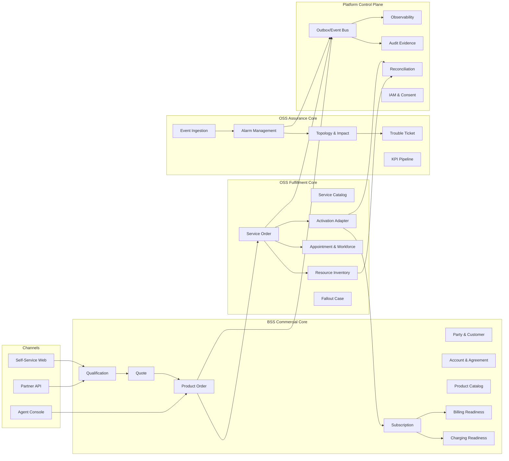
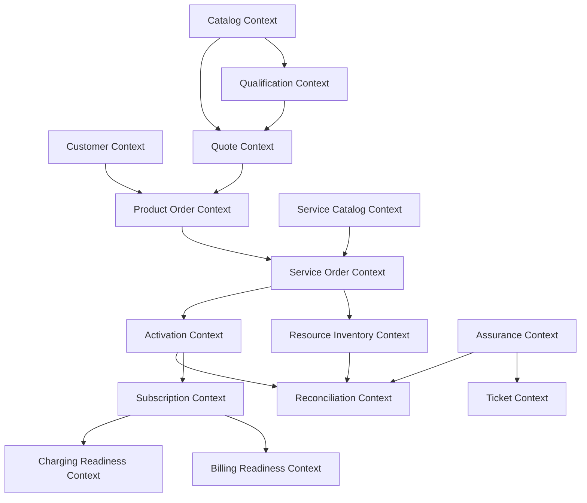
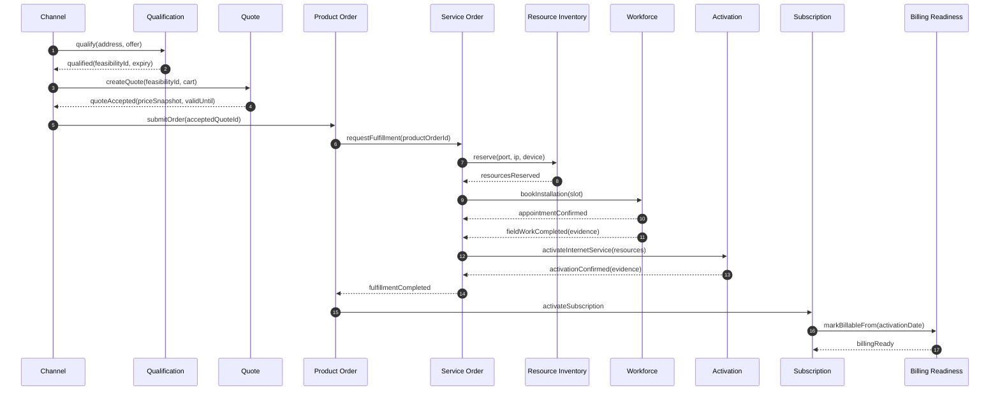
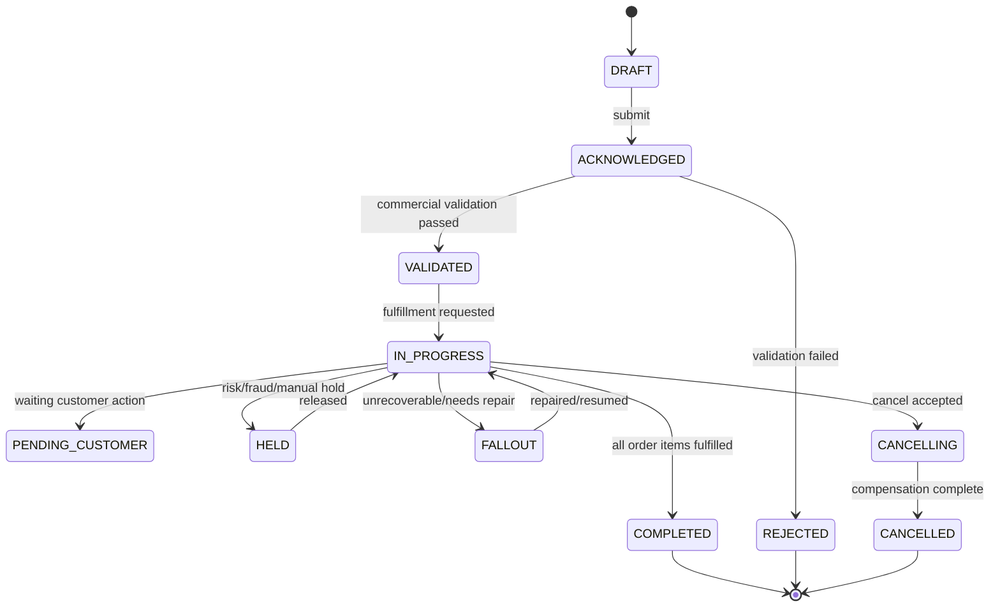
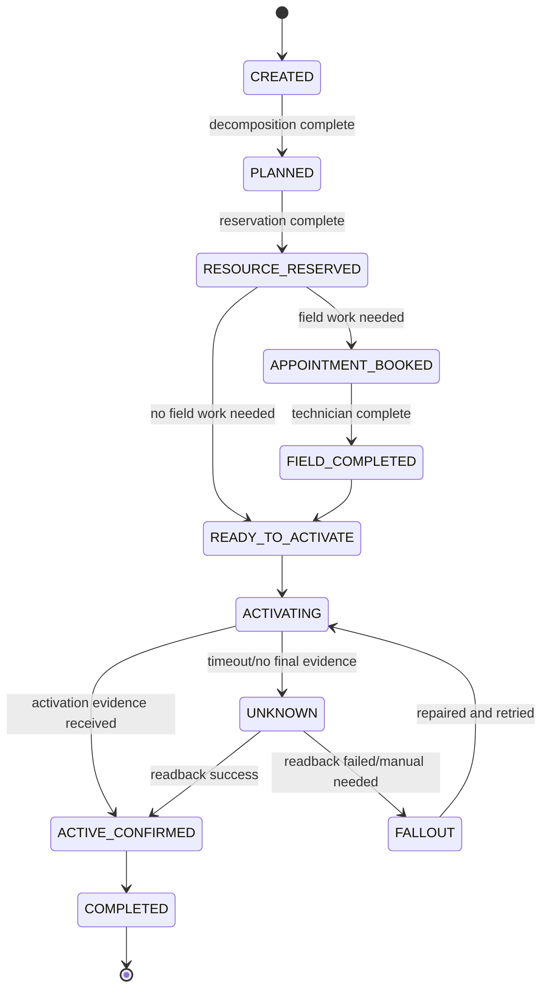
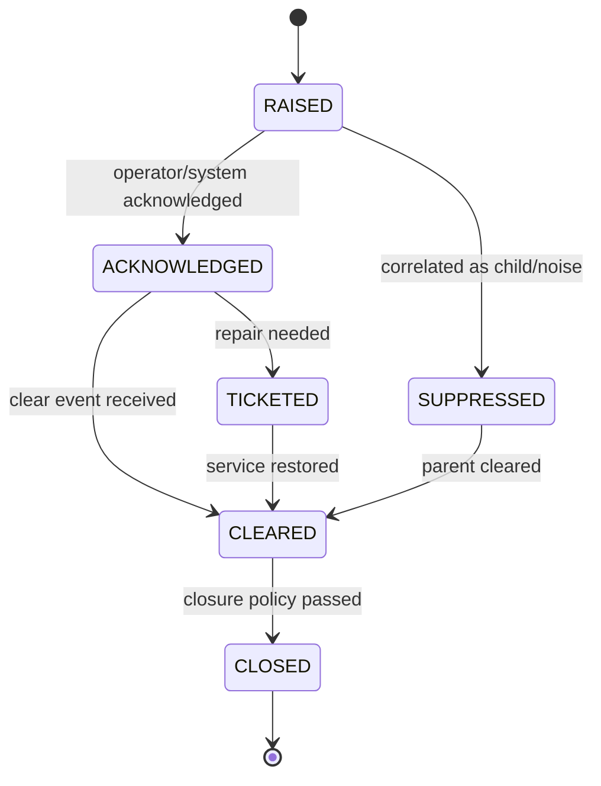
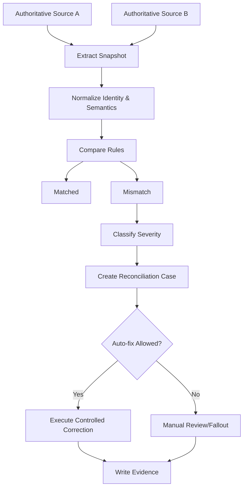

# Part 035 — Capstone: Mini BSS/OSS & Top 1% Assessment

Part ini adalah penutup seri. Tujuannya bukan menambah domain baru, tetapi menyatukan seluruh materi menjadi satu **capstone architecture** yang bisa dipakai untuk menguji apakah kita benar-benar memahami Java Telecom BSS/OSS pada level praktis.

Jika bagian sebelumnya membangun komponen secara bertahap, bagian ini menuntut kita berpikir seperti architect/operator yang harus menjawab pertanyaan berikut:

> Bagaimana membangun mini BSS/OSS yang cukup kecil untuk dipahami, tetapi cukup realistis untuk menguji catalog, qualification, order, fulfillment, inventory, activation, charging readiness, billing readiness, assurance, fallout, reconciliation, dan operability?

Kita akan membangun mental model, target system, bounded context, data ownership, event contract, lifecycle, failure mode, dan assessment rubric.

---

## 1. Kaufman Frame: Apa Skill Akhir yang Ingin Dikuasai?

Dalam kerangka Josh Kaufman, skill harus dipecah menjadi target performance yang konkret. Untuk seri ini, target akhirnya bukan “tahu istilah BSS/OSS”, melainkan:

> Mampu merancang, mengimplementasikan, menguji, mengoperasikan, dan mengkritik platform Java BSS/OSS carrier-grade untuk skenario order-to-activate dan assure-to-resolve.

Skill akhir ini terdiri dari lima kemampuan besar.

| Kemampuan | Makna Praktis |
|---|---|
| Domain modeling | Bisa membedakan party, customer, account, agreement, product, service, resource, order, ticket, usage, bill, dan topology tanpa mencampur lifecycle-nya. |
| Lifecycle architecture | Bisa mendesain state machine yang tidak ambigu untuk order, subscription, service, resource, ticket, alarm, payment, dan fallout. |
| Integration architecture | Bisa menghubungkan BSS, OSS, network, partner, charging, billing, field service, assurance, dan external API tanpa distributed transaction palsu. |
| Operational correctness | Bisa menangani retry, duplicate event, timeout, partial completion, stale topology, inconsistent inventory, manual repair, reconciliation, dan audit. |
| Java implementation judgment | Bisa memilih aggregate boundary, event contract, idempotency strategy, outbox, workflow engine, persistence pattern, testing strategy, observability, dan deployment model secara defensible. |

Top 1% engineer di domain ini bukan orang yang paling hafal standar, melainkan orang yang mampu menjaga **semantic correctness** di tengah integrasi vendor, data drift, order fallout, charge leakage, pressure bisnis, dan network uncertainty.

---

## 2. Capstone Problem Statement

Kita akan merancang mini telco platform bernama **JTelco Mini OSS/BSS**.

### 2.1 Scope Produk

Platform harus mendukung satu produk awal:

> **Fiber Home Internet 100 Mbps + Static IP Add-on + Router Rental**

Produk ini dipilih karena cukup sederhana untuk dipahami, tetapi memiliki semua kompleksitas dasar telco:

- qualification berbasis alamat dan kapasitas jaringan;
- product catalog dan price plan;
- quote dan product order;
- service decomposition ke internet access, static IP, router rental;
- resource allocation untuk port, ONT/router, IP address;
- appointment dan field work;
- activation ke network adapter;
- subscription activation;
- billing readiness;
- assurance event dan trouble ticket;
- reconciliation planned vs discovered inventory.

### 2.2 Scope Channel

Platform menerima order dari dua channel:

1. **Digital self-service channel** untuk pelanggan retail.
2. **Partner reseller channel** untuk order yang datang dari partner.

Perbedaan channel harus memengaruhi audit, eligibility, pricing, settlement, dan entitlement, tetapi tidak boleh merusak lifecycle dasar order.

### 2.3 Non-Goals

Capstone ini tidak membangun seluruh telco stack. Kita sengaja tidak memasukkan:

- full CRM UI;
- full tax engine;
- complete ERP/GL integration;
- complete network discovery parser;
- real 5G core integration;
- real mediation CDR platform;
- massive multi-country localization.

Non-goal penting karena sistem telco mudah membengkak menjadi monster. Top engineer tahu kapan harus berkata: **ini bukan boundary komponen ini**.

---

## 3. Target Architecture at a Glance



Architecture ini sengaja dipisah menjadi tiga plane:

1. **Commercial plane**: apa yang dijual, kepada siapa, dengan agreement apa, dan kapan customer berhak menerima service.
2. **Fulfillment plane**: bagaimana service benar-benar diwujudkan melalui resource, field work, dan network activation.
3. **Assurance plane**: bagaimana gangguan dideteksi, dikorelasikan, diprioritaskan, dan diselesaikan.

Platform control plane melintasi semuanya: audit, events, reconciliation, IAM, observability.

---

## 4. Core Invariants

Sebelum coding, tetapkan invariants. Invariant adalah aturan yang tidak boleh dilanggar walaupun terjadi retry, duplicate message, partial failure, manual repair, atau vendor timeout.

### 4.1 Commercial Invariants

| Invariant | Alasan |
|---|---|
| Product offering version pada quote/order tidak boleh berubah diam-diam. | Customer menerima harga dan konfigurasi tertentu. |
| Product order acceptance bukan activation. | Order valid secara komersial belum berarti service aktif di network. |
| Subscription active harus punya fulfillment evidence yang cukup. | Mencegah billing terhadap service yang belum benar-benar siap. |
| Billing readiness harus berdasarkan commercial state + activation evidence. | Menghindari premature billing dan revenue dispute. |
| Partner order harus punya partner agreement context. | Untuk settlement, authorization, dan audit. |

### 4.2 Fulfillment Invariants

| Invariant | Alasan |
|---|---|
| Resource reservation tidak sama dengan assignment. | Reservation bisa expire/cancel; assignment menunjukkan resource dipakai oleh service. |
| Activation timeout menghasilkan state `UNKNOWN`, bukan otomatis failed/success. | Network adapter sering tidak deterministik dari sudut pandang caller. |
| Every side effect must be idempotent. | Retry adalah perilaku normal, bukan edge case. |
| Service order completion harus didukung evidence. | Completion tanpa evidence membuat reconciliation mustahil. |
| Manual fallout action harus auditable. | Operator manusia adalah bagian dari system of record. |

### 4.3 Assurance Invariants

| Invariant | Alasan |
|---|---|
| Event bukan alarm. | Event adalah signal; alarm adalah managed condition dengan lifecycle. |
| Alarm duplicate harus dikonsolidasikan. | Event storm tidak boleh menghasilkan ticket storm. |
| Ticket closure membutuhkan resolution evidence. | Mencegah false closure. |
| Service impact harus berdasarkan topology snapshot yang diketahui. | Impact calculation harus reproducible. |
| KPI breach harus menyimpan formula version. | KPI tanpa versi formula tidak dapat diaudit. |

---

## 5. Domain Boundaries

Capstone ini menggunakan bounded context berikut.



### 5.1 Rule of Ownership

Setiap context harus punya satu jenis ownership yang jelas.

| Context | Owns | Does Not Own |
|---|---|---|
| Product Catalog | product offering/specification/version/price metadata | customer order, activated subscription |
| Quote | commercial proposal snapshot | network execution |
| Product Order | customer purchase intent and commercial execution | resource allocation detail |
| Service Order | fulfillment task graph | product pricing |
| Resource Inventory | resource pool, reservation, assignment | product eligibility |
| Activation | command/evidence against network systems | long-term customer commercial contract |
| Subscription | active commercial entitlement | network command history |
| Billing Readiness | billable state projection | invoice rendering engine in detail |
| Assurance | events, alarms, impact | order capture |
| Ticket | repair work contract | raw network metric storage |
| Reconciliation | mismatch detection and correction proposal | original transactional ownership |

Kaidahnya sederhana:

> Jangan biarkan satu context menulis data yang menjadi source of truth context lain.

Boleh membuat projection. Tidak boleh mencuri ownership.

---

## 6. Java Project Structure

Capstone ini bisa diimplementasikan sebagai modular monolith terlebih dahulu, kemudian dipisah menjadi services setelah boundary stabil.

```text
jtelco/
  build.gradle.kts
  settings.gradle.kts
  platform-bom/
  shared-kernel/
    src/main/java/com/example/jtelco/shared/
      id/
      money/
      time/
      event/
      audit/
      validation/
  commercial/
    catalog/
    qualification/
    quote/
    productorder/
    subscription/
    billingreadiness/
    chargingreadiness/
  fulfillment/
    servicecatalog/
    serviceorder/
    resourceinventory/
    appointment/
    activation/
    fallout/
  assurance/
    eventingestion/
    alarm/
    topology/
    ticket/
    kpi/
  controlplane/
    outbox/
    reconciliation/
    observability/
    iam/
    auditlog/
  adapters/
    rest/
    messaging/
    persistence/
    network/
    partner/
    billing/
    workforce/
```

### 6.1 Package Discipline

Gunakan package berdasarkan domain, bukan layer teknis global.

Hindari ini:

```text
controller/
service/
repository/
dto/
entity/
```

Lebih baik:

```text
commercial/productorder/
  api/
  application/
  domain/
  infra/
  event/
```

Alasannya: BSS/OSS adalah domain-heavy. Jika package diatur berdasarkan layer generik, dependency domain akan menyebar dan invariant susah dijaga.

---

## 7. End-to-End Lifecycle: Fiber Order

### 7.1 Happy Path



Happy path hanya separuh cerita. Capstone harus membuktikan sistem tetap benar saat happy path tidak terjadi.

### 7.2 Failure Paths yang Wajib Disimulasikan

| Scenario | Expected Behavior |
|---|---|
| Qualification expired sebelum checkout | Quote/order harus ditolak atau revalidated. |
| Resource reservation berhasil tetapi appointment gagal | Reservation harus dilepas atau diperpanjang secara eksplisit. |
| Field technician menandai complete tetapi activation gagal | Service order masuk fallout; subscription belum active. |
| Activation command timeout | Command state menjadi `UNKNOWN`; sistem melakukan read-back/reconciliation. |
| Duplicate product order submission | Idempotency mengembalikan order yang sama, bukan membuat order baru. |
| Partner mengirim cancel setelah service order started | Cancellation policy harus mengevaluasi tahap fulfillment. |
| Billing readiness menerima duplicate activation event | Projection tetap idempotent. |
| Alarm storm dari OLT | Deduplication dan suppression mencegah ticket storm. |
| Discovered topology beda dengan assigned inventory | Reconciliation case dibuat, bukan silent overwrite. |
| Manual repair dilakukan operator | Semua action terekam sebagai audit evidence. |

---

## 8. State Machines

### 8.1 Product Order State Machine



### 8.2 Service Order State Machine



### 8.3 Alarm State Machine



---

## 9. API Contract Sketch

Capstone tidak perlu mengimplementasikan semua TMF API. Namun kita harus punya API style yang disiplin.

### 9.1 Product Order Request

```json
{
  "externalId": "web-20260629-0001",
  "channel": "SELF_SERVICE",
  "customerId": "cus_123",
  "billingAccountId": "ba_456",
  "acceptedQuoteId": "quote_789",
  "requestedCompletionDate": "2026-07-03",
  "orderItems": [
    {
      "action": "ADD",
      "offeringId": "fiber-home-100m",
      "offeringVersion": "2026.06",
      "configuration": {
        "installationAddressId": "addr_001",
        "staticIp": true,
        "routerRental": true
      }
    }
  ]
}
```

Key rule:

- `externalId` dipakai untuk idempotency di boundary channel.
- `acceptedQuoteId` membawa commercial snapshot.
- `offeringVersion` eksplisit.
- configuration adalah customer intent, bukan activation command.

### 9.2 Activation Command

```json
{
  "commandId": "actcmd_001",
  "serviceOrderItemId": "soi_100",
  "targetSystem": "OLT_ADAPTER",
  "operation": "ACTIVATE_FIBER_ACCESS",
  "idempotencyKey": "soi_100:activate:v1",
  "resources": {
    "ontSerial": "ONT123456789",
    "oltPortId": "OLT-01/1/2/3",
    "staticIp": "203.0.113.10"
  },
  "expectedServiceSpecVersion": "fiber-access-rfs:2026.06"
}
```

Activation command harus tersimpan sebelum dikirim. Jika network timeout, command tetap punya identity yang bisa direkonsiliasi.

---

## 10. Event Contract Catalogue

Event harus dibagi menjadi domain event, integration event, dan audit event.

| Event | Producer | Consumer | Purpose |
|---|---|---|---|
| `QualificationCompleted` | Qualification | Quote, Channel | Menyatakan result feasibility dengan expiry. |
| `QuoteAccepted` | Quote | Product Order | Menyediakan commercial snapshot untuk order. |
| `ProductOrderAccepted` | Product Order | Service Order | Memulai fulfillment. |
| `ServiceOrderPlanned` | Service Order | Resource Inventory | Memulai reservation/allocation. |
| `ResourceReserved` | Resource Inventory | Service Order | Evidence reservation resource. |
| `AppointmentConfirmed` | Appointment | Service Order | Field work slot terkunci. |
| `FieldWorkCompleted` | Workforce Adapter | Service Order | Evidence installasi. |
| `ActivationConfirmed` | Activation | Service Order, Subscription | Evidence network service active. |
| `SubscriptionActivated` | Subscription | Billing, Charging, Customer Notification | Entitlement dan billable readiness. |
| `AlarmRaised` | Assurance | Topology, Ticket | Fault lifecycle. |
| `TroubleTicketCreated` | Ticket | Customer Notification, SLA | Repair lifecycle. |
| `ReconciliationMismatchDetected` | Reconciliation | Fallout, Operations | Drift/mismatch handling. |

### 10.1 Event Envelope

```json
{
  "eventId": "evt_01HZ...",
  "eventType": "ActivationConfirmed",
  "eventVersion": 3,
  "occurredAt": "2026-06-29T10:15:30Z",
  "publishedAt": "2026-06-29T10:15:31Z",
  "producer": "activation-service",
  "correlationId": "corr_order_123",
  "causationId": "actcmd_001",
  "tenantId": "retail-id",
  "subject": {
    "type": "serviceOrderItem",
    "id": "soi_100"
  },
  "payload": {}
}
```

Envelope bukan dekorasi. Ia adalah alat debugging, audit, replay, dan reconciliation.

---

## 11. Persistence Blueprint

### 11.1 Transactional Tables

```text
product_order
product_order_item
product_order_state_transition
service_order
service_order_item
service_order_dependency
resource_pool
resource_reservation
resource_assignment
activation_command
activation_result
subscription
subscription_state_transition
alarm
alarm_event
trouble_ticket
fallout_case
reconciliation_case
outbox_event
audit_log
```

### 11.2 Tables that Must Be Append-Friendly

Gunakan append-oriented design untuk data yang perlu audit:

- state transitions;
- activation command/result;
- balance ledger;
- rating decision;
- invoice line derivation;
- fallout action;
- manual repair action;
- reconciliation observation;
- alarm lifecycle events;
- ticket comments/evidence.

Dalam telco, `UPDATE status = ...` saja tidak cukup. Kita perlu tahu:

- siapa/apa yang mengubah state;
- kapan berubah;
- dari state apa ke state apa;
- berdasarkan evidence apa;
- correlation id apa;
- apakah action manual atau otomatis;
- apakah result final atau sementara.

---

## 12. Reconciliation as a First-Class Capability

Top engineer tidak memperlakukan reconciliation sebagai batch script pinggiran. Dalam BSS/OSS, reconciliation adalah safety mechanism utama.

### 12.1 Reconciliation Types

| Type | Example |
|---|---|
| Order vs Subscription | Order completed tetapi subscription tidak active. |
| Service Order vs Activation | Service order completed tetapi activation evidence hilang. |
| Resource Inventory vs Network | IP assigned di inventory tetapi tidak configured di network. |
| Billing vs Subscription | Active subscription belum masuk billable projection. |
| Charging vs Balance | Usage deducted tetapi ledger event hilang. |
| Partner vs Internal | Partner order state berbeda dari internal order state. |
| Alarm vs Ticket | Critical alarm tidak memiliki ticket aktif. |

### 12.2 Reconciliation Flow



Rule penting:

> Reconciliation boleh mengusulkan correction; ia tidak boleh sembarangan overwrite source of truth tanpa policy.

---

## 13. Fallout Design

Fallout adalah tempat sistem mengakui bahwa automation tidak cukup. Namun fallout yang buruk akan menjadi black hole.

### 13.1 Good Fallout Case

Sebuah fallout case yang baik punya:

- `caseId`;
- source entity dan source state;
- failure category;
- severity;
- customer impact;
- SLA clock;
- suggested repair action;
- allowed correction action;
- audit trail;
- resume token;
- ownership queue;
- escalation path;
- closure evidence.

### 13.2 Bad Fallout Case

Hindari fallout yang hanya berisi:

```text
status = ERROR
message = provisioning failed
```

Itu bukan fallout management. Itu hanya error logging yang diberi UI.

---

## 14. Observability Blueprint

Observability di capstone harus menjawab pertanyaan operasional, bukan sekadar menampilkan CPU/memory.

### 14.1 Golden Questions

| Question | Signal Needed |
|---|---|
| Berapa order yang stuck di fulfillment > SLA? | order state age histogram |
| Berapa activation command `UNKNOWN` lebih dari 10 menit? | activation command status gauge |
| Produk mana paling sering gagal qualification? | qualification decision counter by reason |
| Resource pool mana hampir habis? | available/reserved/assigned resource gauge |
| Partner mana punya mismatch state tertinggi? | partner reconciliation mismatch rate |
| Alarm mana menghasilkan ticket storm? | alarm-to-ticket ratio |
| Berapa subscription active tapi belum billable? | subscription billing readiness mismatch |
| Berapa fallout case reopened? | fallout reopen counter |

### 14.2 Trace Model

Gunakan correlation id yang bertahan dari channel sampai activation.

```text
correlationId = order journey id
causationId = immediate command/event that caused this action
externalId = channel/partner supplied identity
businessKey = human meaningful reference
```

Trace yang bagus memungkinkan kita mengikuti:

```text
quote -> product order -> service order -> reservation -> appointment -> activation -> subscription -> billing readiness
```

---

## 15. Testing Strategy

### 15.1 Test Pyramid for BSS/OSS

| Test Type | Purpose |
|---|---|
| Domain unit test | State machine, invariant, pricing snapshot, decomposition rule. |
| Repository test | Optimistic locking, unique constraint, idempotency key, append log. |
| Contract test | API/event compatibility between contexts. |
| Saga test | End-to-end lifecycle with simulated async events. |
| Adapter test | Network/workforce/billing adapter behavior under timeout/duplicate/error. |
| Reconciliation test | Mismatch detection and correction policy. |
| Load test | Event storm, batch reconciliation, order burst, qualification burst. |
| Chaos/failure test | Partial failure, bus delay, duplicate message, stale read, out-of-order event. |
| Operational drill | Manual fallout repair, rollback, re-drive, evidence retrieval. |

### 15.2 Must-Have Scenario Tests

```text
1. submit same order twice -> exactly one product order
2. activation timeout then readback success -> service order completes
3. activation timeout then readback mismatch -> fallout created
4. reservation expires before appointment -> order paused/replanned
5. partner cancel after field dispatch -> policy-based cancellation/fallout
6. duplicate ActivationConfirmed -> subscription activated once
7. billing readiness delayed -> reconciliation detects gap
8. alarm storm from same resource -> one managed alarm, controlled ticket creation
9. topology stale -> impact marked uncertain, not falsely precise
10. manual repair -> audit evidence and resume token preserved
```

---

## 16. Architecture Decision Records

Capstone harus menghasilkan ADR. Berikut ADR minimal.

### ADR-001: Modular Monolith First, Service Extraction Later

**Decision:** implementasi awal menggunakan modular monolith dengan strict package boundary dan evented internal integration.

**Reasoning:** domain masih perlu stabil. Terlalu cepat memecah menjadi microservices akan menciptakan distributed complexity sebelum semantic boundary matang.

**Consequences:**

- deployment awal lebih sederhana;
- boundary bisa diuji dengan architecture test;
- extraction path tetap tersedia melalui event/API boundary;
- perlu disiplin dependency rule.

### ADR-002: Outbox for Domain Events

**Decision:** semua integration event keluar melalui transactional outbox.

**Reasoning:** order/fulfillment/activation tidak boleh kehilangan event ketika DB commit berhasil tetapi publish gagal.

**Consequences:**

- event delivery at-least-once;
- consumers harus idempotent;
- outbox relay harus observable;
- duplicate event adalah normal.

### ADR-003: Timeout Produces UNKNOWN for Network Commands

**Decision:** activation timeout tidak langsung dianggap failed.

**Reasoning:** banyak network system bisa menjalankan command walaupun caller timeout.

**Consequences:**

- perlu readback/reconciliation;
- UX harus mampu menampilkan pending technical verification;
- retry harus memakai idempotency key.

### ADR-004: Billing Readiness Is Projection, Not Order Status

**Decision:** billing readiness dihitung dari subscription + activation evidence + commercial policy.

**Reasoning:** order completed tidak selalu sama dengan billable. Ada grace period, activation date, partial service, dispute, dan policy.

**Consequences:**

- billing projection bisa tertunda;
- perlu reconciliation subscription vs billing readiness;
- invoice engine tidak membaca order langsung.

---

## 17. Security, Privacy, and Compliance Checklist

Telco BSS/OSS memegang data sensitif: identity, address, billing, usage, device, SIM, location, partner commercial information, network topology.

### 17.1 Minimum Controls

| Area | Control |
|---|---|
| Identity | Strong service identity, user identity, partner identity, tenant context. |
| Authorization | Domain-level permission: view customer, modify order, repair fallout, access resource identifier. |
| PII | Masking for MSISDN, IMSI, ICCID, address, email, payment reference. |
| Audit | Every manual business action must be auditable. |
| Consent | API exposure and network capability use must carry consent or lawful basis. |
| Segregation | Partner cannot see other partner/customer data. |
| Secret handling | Network adapter credentials isolated and rotated. |
| Data retention | Usage, billing, audit, and operational logs have explicit retention policy. |
| Break-glass | Emergency access must be time-bound and heavily audited. |

### 17.2 Common Security Failure

The most common failure is not exotic crypto. It is leaking identifiers through logs, events, dashboards, exports, partner callbacks, and support tools.

Rule:

> Treat observability and support interfaces as data exposure surfaces.

---

## 18. Performance and Scale Targets

Capstone target tidak perlu selevel national telco, tetapi harus punya scale thinking.

| Workload | Baseline Target |
|---|---|
| Qualification burst | 200 requests/second with cache and graceful degradation. |
| Product order submission | exactly-once business effect under retry. |
| Activation command | at-least-once send with idempotent vendor command key. |
| Event ingestion | tolerate burst 10x normal without ticket storm. |
| Reconciliation job | resumable, partitioned, checkpointed. |
| Dashboard query | query projection, not raw transactional tables. |
| Resource allocation | safe under concurrent allocation attempts. |

Top engineer selalu bertanya:

- apa path synchronous?
- apa path asynchronous?
- apa yang boleh eventual?
- apa yang harus linearizable?
- apa yang bisa diproyeksikan?
- apa yang butuh lock/unique constraint?
- apa yang bisa di-reconcile?

---

## 19. Implementation Milestones

### Milestone 1 — Domain Skeleton

Deliverables:

- project structure;
- shared identity/value objects;
- product offering seed data;
- quote aggregate;
- product order aggregate;
- state transition log;
- outbox skeleton.

Exit criteria:

- product order can be submitted idempotently;
- quote snapshot is preserved;
- state transition history is append-only.

### Milestone 2 — Fulfillment Skeleton

Deliverables:

- service catalog mapping;
- service order aggregate;
- resource reservation;
- activation command store;
- simulated activation adapter.

Exit criteria:

- product order creates service order;
- resource reservation is concurrency-safe;
- activation timeout creates `UNKNOWN`;
- readback can complete or create fallout.

### Milestone 3 — Subscription and Billing Readiness

Deliverables:

- subscription aggregate;
- subscription activation from fulfillment evidence;
- billing readiness projection;
- reconciliation rule: active subscription without billing readiness.

Exit criteria:

- subscription activates exactly once;
- duplicate activation event is harmless;
- missing billing projection creates reconciliation case.

### Milestone 4 — Assurance

Deliverables:

- event ingestion;
- alarm lifecycle;
- deduplication key;
- topology projection;
- trouble ticket creation policy.

Exit criteria:

- duplicate/frequent events become one managed alarm;
- critical impacted service creates ticket;
- ticket closure requires evidence.

### Milestone 5 — Operations Hardening

Deliverables:

- dashboards;
- runbooks;
- audit query;
- replay/re-drive tool;
- fallout repair console;
- chaos scenario tests.

Exit criteria:

- operator can repair a stuck order safely;
- every repair is auditable;
- reconciliation can resume after failure;
- delayed/duplicate events do not corrupt lifecycle.

---

## 20. Top 1% Assessment Rubric

Gunakan rubric ini untuk menilai diri sendiri atau kandidat architect/tech lead.

### 20.1 Domain Mastery

| Level | Signal |
|---|---|
| Basic | Bisa menjelaskan BSS vs OSS secara umum. |
| Intermediate | Bisa membedakan catalog, order, inventory, activation, billing, assurance. |
| Advanced | Bisa mendesain lifecycle product-to-service-to-resource dengan failure path. |
| Top 1% | Bisa menemukan semantic bug sebelum production: premature billing, false activation, resource leak, duplicate charging, stale topology, partner settlement mismatch. |

### 20.2 Architecture Mastery

| Level | Signal |
|---|---|
| Basic | Bisa membuat microservice diagram. |
| Intermediate | Bisa menentukan API/event antar service. |
| Advanced | Bisa mendesain saga, outbox, idempotency, reconciliation, and fallout. |
| Top 1% | Bisa menjelaskan trade-off consistency per lifecycle, menghindari distributed transaction palsu, dan memastikan operator bisa memperbaiki sistem tanpa merusak audit. |

### 20.3 Java Implementation Mastery

| Level | Signal |
|---|---|
| Basic | Bisa membuat REST endpoint dan repository. |
| Intermediate | Bisa membuat aggregate dan service layer. |
| Advanced | Bisa membuat idempotent command handler, state machine, event publisher, adapter ACL, dan test harness. |
| Top 1% | Bisa membuktikan correctness di bawah retry, duplicate event, concurrent allocation, timeout, replay, schema evolution, dan manual repair. |

### 20.4 Operational Mastery

| Level | Signal |
|---|---|
| Basic | Bisa melihat log error. |
| Intermediate | Bisa membuat dashboard. |
| Advanced | Bisa menentukan SLO, alert, trace, metric, and runbook. |
| Top 1% | Bisa menjawab “berapa customer terdampak, order mana stuck, apakah aman re-drive, apa source of truth, dan evidence apa yang membuktikan state?” dalam menit, bukan hari. |

---

## 21. Review Questions

Jawab pertanyaan ini tanpa melihat materi sebelumnya.

1. Apa beda product order completed, service order completed, subscription active, dan billing ready?
2. Kenapa activation timeout tidak boleh langsung dianggap failed?
3. Kenapa resource reservation tidak boleh disamakan dengan assignment?
4. Kapan quote harus membawa price snapshot?
5. Apa risiko memakai SID sebagai database schema mentah?
6. Bagaimana cara mencegah duplicate order dari retry channel?
7. Bagaimana membedakan event, alarm, incident, dan trouble ticket?
8. Kenapa topology freshness penting dalam service impact analysis?
9. Bagaimana reconciliation case berbeda dari fallout case?
10. Apa invariant terpenting agar billing tidak lebih cepat dari activation evidence?
11. Bagaimana partner agreement memengaruhi order dan settlement?
12. Apa yang harus terjadi jika service order complete tetapi subscription tidak active?
13. Apa yang harus terjadi jika network sudah active tetapi activation result event hilang?
14. Bagaimana mendesain event envelope agar replay/debugging feasible?
15. Apa minimum evidence untuk menutup trouble ticket?

Jika jawaban masih berbentuk definisi dangkal, ulangi part terkait. Jika jawaban sudah menyertakan state, ownership, failure mode, dan recovery path, pemahaman sudah matang.

---

## 22. Final Capstone Exercise

Bangun atau desain minimal implementation dengan requirement berikut.

### 22.1 Functional Requirements

1. Customer bisa melakukan qualification alamat.
2. Customer bisa membuat quote dari qualified offer.
3. Customer bisa submit product order dari accepted quote.
4. Product order didekomposisi menjadi service order.
5. Service order melakukan resource reservation.
6. Jika butuh installasi, appointment dibuat.
7. Setelah field completion, activation command dikirim.
8. Activation success mengaktifkan subscription.
9. Subscription active membuat billing readiness projection.
10. Duplicate event tidak mengubah business outcome.
11. Activation timeout masuk `UNKNOWN` dan diselesaikan dengan readback.
12. Mismatch dibuat sebagai reconciliation/fallout case.
13. Alarm dari resource active dapat menghasilkan trouble ticket.
14. Ticket closure membutuhkan resolution evidence.

### 22.2 Non-Functional Requirements

1. Semua external command idempotent.
2. Semua lifecycle transition append-only.
3. Semua integration event memakai outbox.
4. Semua manual repair auditable.
5. Semua critical state punya age metric.
6. Semua reconciliation job resumable.
7. Semua identifiers sensitif termasking di log.
8. Semua API write punya idempotency key atau external reference.
9. Semua read model boleh stale tetapi harus jelas freshness-nya.
10. Semua correction action punya policy.

### 22.3 Deliverables

- architecture diagram;
- bounded context map;
- aggregate model;
- state machine diagram;
- event catalogue;
- database schema outline;
- API contract sketch;
- failure-mode matrix;
- reconciliation rules;
- observability dashboard list;
- test scenario suite;
- runbook untuk stuck order dan activation unknown.

---

## 23. Common Capstone Mistakes

### Mistake 1 — Membuat `OrderService` yang Mengatur Semuanya

Ini menciptakan god service yang tahu customer, catalog, resource, activation, billing, dan ticket sekaligus.

Better:

- Product Order owns commercial execution.
- Service Order owns fulfillment execution.
- Activation owns network side effect.
- Subscription owns entitlement.
- Billing Readiness owns billable projection.

### Mistake 2 — Menganggap Kafka/Event Bus sebagai Solusi Consistency

Event bus hanya transport. Consistency tetap ditentukan oleh:

- ownership;
- idempotency;
- ordering assumption;
- deduplication;
- reconciliation;
- state transition rules.

### Mistake 3 — Tidak Memodelkan `UNKNOWN`

Sistem enterprise nyata sering tidak tahu hasil final command. Kalau model hanya punya success/failed, engineer akan membuat asumsi palsu.

### Mistake 4 — Manual Repair Tanpa Audit

Operator akan memperbaiki data. Pertanyaannya bukan apakah manual repair terjadi, tetapi apakah manual repair bisa dipertanggungjawabkan.

### Mistake 5 — Billing Membaca Order Langsung

Billing readiness harus berasal dari entitlement dan activation evidence, bukan hanya order intent.

### Mistake 6 — Topology Dipakai Seolah Selalu Fresh

Topology bisa stale. Impact analysis harus punya confidence/freshness metadata.

---

## 24. Mental Model Akhir

Simpan mental model berikut:

```text
Customer buys a Product.
Product decomposes into Services.
Services require Resources.
Resources are assigned and activated in Network.
Activation creates evidence.
Evidence activates Subscription.
Subscription enables Charging and Billing.
Events reveal faults.
Faults become Alarms.
Alarms create Tickets when action is needed.
Topology explains impact.
Reconciliation protects truth.
Fallout protects automation boundaries.
Audit protects defensibility.
```

Jika satu kalimat ini bisa dijelaskan dengan state machine, data ownership, event contract, dan failure mode, maka kita tidak lagi sekadar mengenal BSS/OSS. Kita sudah mampu merancangnya.

---

## 25. Where to Go Next

Setelah seri ini, materi lanjutan yang paling natural adalah:

1. **Java Telco Charging & Billing Deep Dive**  
   Fokus pada OCS/CHF, rating engine, balance ledger, invoice generation, taxation, dunning, dispute, and revenue assurance.

2. **Java Telco Network Automation & Closed-Loop Assurance**  
   Fokus pada telemetry, alarm correlation, topology graph, RCA, policy-driven remediation, NFV/CNF orchestration, and safety gates.

3. **TM Forum ODA Implementation Handbook in Java**  
   Fokus pada mapping ODA component, Open API conformance, Canvas runtime, event model, and component governance.

4. **Java Enterprise Case Management for Telco Operations**  
   Fokus pada fallout, trouble ticket, incident, escalation, SLA, maker-checker, audit evidence, and regulatory defensibility.

5. **5G Network Exposure Platform with Java**  
   Fokus pada GSMA Open Gateway/CAMARA-style API exposure, consent, entitlement, partner onboarding, quota, monetization, and API product lifecycle.

---

## 26. Series Completion

Seri **Learn Java Telecom BSS/OSS** selesai di sini.

Kita telah menutup 35 bagian:

- Kaufman skill map;
- BSS/OSS domain language;
- TM Forum/3GPP/ETSI/MEF/GSMA reference models;
- ODA component thinking;
- SID-inspired modeling;
- customer/account/agreement;
- catalog/offer/qualification/quote/order;
- subscription/charging/billing/revenue assurance;
- service catalog/order/resource inventory/activation/fallout;
- appointment/field service/order-to-activate;
- assurance/alarm/ticket/KPI/topology;
- inventory discovery/reconciliation/planning/change;
- NFV/SDN/MANO/5G slicing;
- partner/MVNO/MEF LSO/Open Gateway;
- carrier-grade Java platform blueprint;
- capstone and top 1% assessment.

Final reminder:

> Telco BSS/OSS excellence is not about having many services. It is about preserving lifecycle truth across commercial intent, operational execution, network uncertainty, financial consequence, and human repair.

Jika sistem menjaga kebenaran itu, arsitektur bisa berkembang. Jika tidak, sistem akan terlihat modern tetapi rapuh secara operasional.
