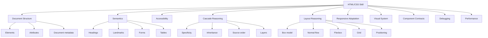
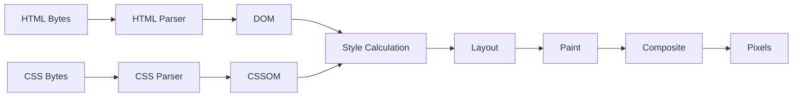
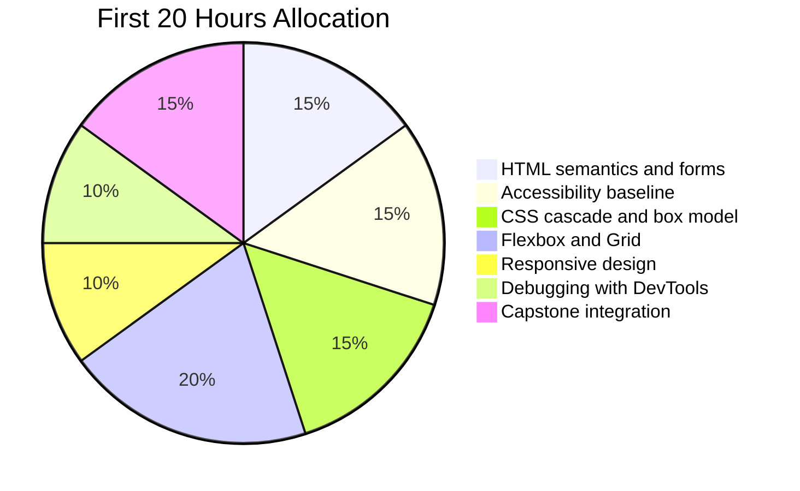
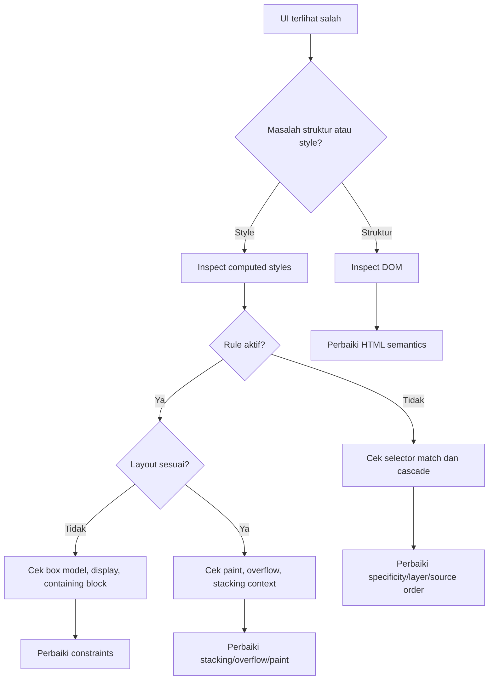
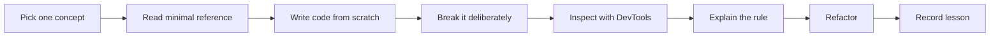

# Part 01 — The First 20 Hours for HTML/CSS: Target Skill, Scope, and Practice System

## 1. Tujuan Part Ini

Part ini bukan pengantar HTML/CSS biasa. Tujuannya adalah membangun **sistem belajar** yang membuat HTML dan CSS cepat menjadi skill praktis, bukan kumpulan hafalan tag dan properti.

Sebagai software engineer, kamu kemungkinan sudah paham konsep seperti struktur data, API contract, modularity, state, lifecycle, runtime, debugging, dan testing. HTML/CSS akan lebih cepat dikuasai jika diperlakukan dengan cara yang sama:

- HTML adalah **struktur dokumen dan semantic contract**.
- CSS adalah **constraint system** yang mengubah struktur menjadi layout dan presentasi.
- Browser adalah **runtime engine** yang melakukan parsing, cascade resolution, layout, paint, dan compositing.
- Accessibility adalah **output contract** terhadap user, browser, assistive technology, keyboard, dan automated agents.
- Responsive UI adalah **adaptation system**, bukan sekadar media query.
- Maintainable CSS adalah **architecture problem**, bukan style preference.

Framework dari Josh Kaufman dalam *The First 20 Hours* cocok untuk HTML/CSS karena skill ini sangat mudah disalahpahami. Banyak orang belajar terlalu lama pada level tutorial, tetapi tetap tidak mampu menjelaskan kenapa satu layout rusak, kenapa selector tidak menang, kenapa tombol tidak accessible, atau kenapa UI terlihat benar tetapi gagal di production.

Referensi pendekatan belajar Kaufman yang dipakai dalam seri ini adalah prinsip rapid skill acquisition: menentukan target performa, memecah skill menjadi sub-skill, belajar secukupnya untuk praktik, menghilangkan hambatan latihan, dan berkomitmen pada minimal 20 jam praktik terarah. Ringkasan publik tentang pendekatan ini dapat dilihat pada artikel WIRED tentang *The First 20 Hours*.

---

## 2. Target Performa

Kaufman menekankan bahwa skill perlu didefinisikan sebagai **target performa**, bukan sebagai daftar topik. Jadi target kita bukan:

> “Saya ingin tahu HTML dan CSS.”

Target yang lebih tepat:

> “Saya mampu membangun halaman aplikasi web yang semantik, accessible, responsive, maintainable, dan bisa dijelaskan secara teknis dari struktur HTML, cascade CSS, layout, sampai rendering browser.”

Dalam konteks software engineer, target performa minimal setelah 20 jam pertama adalah:

1. Bisa membuat struktur dokumen HTML yang valid dan semantik.
2. Bisa membuat form yang usable dan accessible.
3. Bisa membaca dan memprediksi cascade CSS.
4. Bisa membuat layout dengan normal flow, Flexbox, dan Grid tanpa trial-and-error berlebihan.
5. Bisa membuat UI responsive dengan strategi yang jelas.
6. Bisa memakai DevTools untuk menemukan akar masalah CSS.
7. Bisa membuat komponen UI kecil yang punya state, variant, spacing, typography, dan responsive behavior.
8. Bisa menjelaskan trade-off antara semantic HTML, ARIA, CSS architecture, performance, dan maintainability.

Target ini sengaja tidak berbunyi “menguasai semua fitur HTML/CSS”. HTML dan CSS adalah bagian dari Web Platform yang terus berkembang. Skill top-tier bukan berasal dari hafalan seluruh properti, tetapi dari kemampuan membangun mental model yang benar, melakukan diagnosis, dan membuat keputusan yang defensible.

---

## 3. Definisi “Top 1%” untuk HTML/CSS

Istilah “top 1%” sering terdengar kabur. Dalam seri ini, definisinya dibuat operasional.

Seorang engineer yang sangat kuat dalam HTML/CSS bukan hanya bisa membuat tampilan sesuai desain. Ia mampu:

- memilih elemen HTML berdasarkan makna, bukan tampilan;
- meminimalkan kebutuhan JavaScript karena memanfaatkan kemampuan native browser;
- memahami efek cascade, specificity, inheritance, source order, layer, dan scope;
- merancang layout yang stabil terhadap variasi konten, bahasa, device, zoom, dan ukuran font;
- membangun komponen yang memiliki contract jelas untuk state, variant, token, dan accessibility;
- menemukan bug dengan DevTools secara sistematis;
- menghindari CSS entropy pada codebase besar;
- mempertimbangkan performance, Core Web Vitals, layout shift, font loading, dan asset loading;
- menulis UI yang bisa diuji, di-review, dan dipertahankan oleh tim.

Top-tier HTML/CSS engineer tidak sekadar bertanya:

> “Bagaimana cara membuat ini terlihat sama seperti Figma?”

Ia bertanya:

> “Apa struktur informasinya? Apa semantic contract-nya? Bagaimana perilakunya terhadap keyboard, screen reader, responsive container, zoom, data ekstrem, loading state, error state, dan perubahan desain jangka panjang?”

---

## 4. Scope Skill: Apa yang Termasuk dan Tidak Termasuk

HTML/CSS sering tercampur dengan JavaScript, framework, bundler, design tools, dan UI library. Untuk 20 jam pertama, kita perlu membatasi scope agar latihan tajam.

### 4.1 Termasuk

Yang termasuk dalam scope utama:

- dokumen HTML;
- elemen, atribut, content model, dan semantic HTML;
- forms;
- tables;
- images dan media;
- accessibility dasar;
- CSS syntax;
- selectors;
- cascade, inheritance, specificity, layers;
- box model;
- normal flow;
- Flexbox;
- Grid;
- positioning;
- stacking context;
- responsive design;
- typography;
- color dan theming;
- CSS custom properties;
- DevTools debugging;
- dasar performance HTML/CSS.

### 4.2 Tidak Menjadi Fokus Awal

Yang tidak menjadi fokus utama dalam 20 jam pertama:

- React/Vue/Svelte component model;
- Tailwind secara mendalam;
- CSS-in-JS secara mendalam;
- browser extension;
- canvas drawing;
- WebGL;
- advanced animation choreography;
- complete SEO strategy;
- build tool optimization;
- design theory secara penuh;
- full WCAG audit mendalam;
- cross-browser legacy support untuk browser lama.

Bukan berarti hal-hal tersebut tidak penting. Namun, Kaufman mendorong kita untuk menghindari over-research. Untuk skill acquisition awal, kita perlu belajar cukup untuk bisa praktik dan memperbaiki diri.

---

## 5. Deconstruction: HTML/CSS Dipecah Menjadi Sub-Skill

HTML/CSS terlihat luas karena sebenarnya terdiri dari beberapa sub-skill yang berbeda. Jika semua dipelajari sekaligus, kamu akan merasa banyak properti tetapi sedikit pemahaman. Maka kita pecah menjadi unit yang bisa dilatih.



Sub-skill paling penting untuk 20 jam pertama adalah:

1. **Semantic document modelling**  
   Kemampuan memetakan informasi ke struktur HTML yang benar.

2. **Cascade reasoning**  
   Kemampuan memprediksi style mana yang diterapkan dan kenapa.

3. **Layout reasoning**  
   Kemampuan memahami bagaimana browser menghitung ukuran dan posisi elemen.

4. **Accessibility baseline**  
   Kemampuan membuat UI yang bisa digunakan dengan keyboard dan assistive technology.

5. **Debugging loop**  
   Kemampuan memakai DevTools untuk melihat computed style, box model, layout overlay, dan accessibility tree.

---

## 6. Mental Model Utama

### 6.1 HTML Bukan Template

HTML sering dianggap template untuk “menaruh div”. Itu keliru.

HTML adalah representasi struktur dokumen. Browser, crawler, reader mode, screen reader, form engine, password manager, autofill, dan accessibility API membaca HTML untuk memahami halaman.

Contoh buruk:

```html
<div class="title">Case Details</div>
<div class="label">Status</div>
<div class="value">Under Review</div>
<div class="button">Submit</div>
```

Masalahnya:

- tidak ada heading;
- label/value tidak punya struktur yang jelas;
- tombol bukan tombol native;
- keyboard interaction tidak otomatis;
- screen reader tidak mendapatkan role yang benar.

Versi lebih baik:

```html
<section aria-labelledby="case-details-title">
  <h2 id="case-details-title">Case Details</h2>

  <dl>
    <dt>Status</dt>
    <dd>Under Review</dd>
  </dl>

  <button type="button">Submit</button>
</section>
```

Perbedaannya bukan estetika. Perbedaannya adalah **contract**.

### 6.2 CSS Bukan Dekorasi

CSS bukan sekadar warna dan layout. CSS adalah sistem deklaratif untuk menyelesaikan constraint:

- elemen ini harus berada dalam alur dokumen;
- item ini boleh tumbuh tetapi tidak boleh mengecil di bawah ukuran tertentu;
- container ini punya grid track yang fleksibel;
- spacing mengikuti token;
- warna mengikuti theme;
- layout berubah saat container sempit;
- preferensi reduced motion harus dihormati.

CSS bukan imperative instruction seperti:

> “ambil elemen ini, hitung ukuran, lalu posisikan di x=100 y=200.”

CSS lebih dekat ke constraint declaration:

```css
.card-list {
  display: grid;
  grid-template-columns: repeat(auto-fit, minmax(16rem, 1fr));
  gap: 1rem;
}
```

Artinya:

- buat grid;
- isi sebanyak mungkin kolom;
- setiap kolom minimal 16rem;
- jika ada ruang, bagi rata dengan `1fr`;
- beri jarak antar item 1rem.

Browser menyelesaikan detailnya.

### 6.3 Browser Adalah Runtime

HTML/CSS tidak “langsung menjadi tampilan”. Browser melakukan pipeline:



Ketika layout rusak, biasanya penyebabnya ada pada salah satu layer:

- struktur HTML salah;
- cascade tidak terkontrol;
- intrinsic size tidak dipahami;
- formatting context berubah;
- overflow tidak dipertimbangkan;
- stacking context tidak disadari;
- responsive constraint tidak lengkap.

---

## 7. Prinsip Belajar Berdasarkan Kaufman

Framework Kaufman dapat diterjemahkan menjadi sistem berikut.

### 7.1 Choose a Lovable Project

Untuk HTML/CSS, proyek latihan harus cukup menarik dan realistis. Hindari latihan yang terlalu mainan seperti “buat kartu profil” saja. Untuk software engineer, proyek yang lebih baik adalah:

> **Mini internal case management UI**

Fitur capstone:

- application shell;
- sidebar navigation;
- top bar;
- case summary;
- status timeline;
- evidence table;
- action form;
- modal/dialog;
- responsive layout;
- dark mode;
- print-friendly page.

Kenapa proyek ini bagus?

- Ada data kompleks.
- Ada form.
- Ada table.
- Ada navigasi.
- Ada status.
- Ada hierarchy.
- Ada kebutuhan accessibility.
- Ada kebutuhan responsive.
- Ada kebutuhan maintainability.

### 7.2 Focus on One Skill at a Time

Jangan campur dulu dengan React, Tailwind, animation library, atau design system framework. Selama 20 jam pertama:

- pakai HTML;
- pakai CSS native;
- pakai sedikit JavaScript hanya jika diperlukan untuk demo interaksi;
- fokus ke browser behavior;
- latih dengan DevTools.

### 7.3 Define Target Performance Level

Target performa 20 jam pertama:

> Bisa membangun satu halaman aplikasi responsif yang valid secara struktur, usable dengan keyboard, memiliki layout stabil, dan CSS-nya bisa dijelaskan line-by-line.

Bukan target:

- menjadi designer visual profesional;
- menghafal semua tag;
- menguasai semua CSS module;
- membuat framework sendiri;
- membuat clone aplikasi kompleks.

### 7.4 Deconstruct the Skill

Skill dipecah menjadi unit latihan:

| Sub-skill | Latihan | Bukti Kompetensi |
|---|---|---|
| Semantic HTML | Markup halaman case detail | Heading, landmark, form, table benar |
| Forms | Buat action form | Label, validation, fieldset, error state |
| Cascade | Debug konflik selector | Bisa jelaskan rule yang menang |
| Box model | Buat card dan panel | Ukuran/spacing stabil |
| Flexbox | Toolbar dan nav | Alignment predictable |
| Grid | Dashboard layout | Responsive tanpa banyak breakpoint |
| Responsive | Container-based layout | Komponen adaptif |
| Accessibility | Keyboard smoke test | Semua interactive element dapat dicapai |
| Debugging | DevTools checklist | Bisa menemukan akar masalah |

### 7.5 Obtain Critical Tools

Tools minimal:

- browser modern: Chrome, Edge, Firefox, atau Safari;
- DevTools;
- code editor;
- formatter;
- local static server;
- HTML validator opsional;
- accessibility checker opsional;
- browser compatibility reference seperti MDN dan Baseline;
- official specifications untuk klarifikasi.

### 7.6 Remove Barriers to Practice

Hambatan utama belajar HTML/CSS biasanya bukan sulitnya syntax, tetapi friction:

- terlalu cepat masuk framework;
- terlalu banyak copy-paste;
- tidak punya proyek latihan;
- tidak memakai DevTools;
- takut melihat spec;
- mencoba menghafal seluruh properti;
- tidak punya checklist debugging.

Solusinya:

- buat folder latihan tetap;
- buat template `index.html` dan `styles.css`;
- jalankan lokal dengan static server;
- simpan snippet latihan;
- batasi waktu baca;
- setiap konsep harus langsung dipakai dalam mini exercise.

---

## 8. Rencana 20 Jam Pertama

Rencana ini tidak dimaksudkan sebagai batas kemampuan final. Ini adalah sprint awal untuk melewati fase “tidak nyaman” dan membangun fondasi.



### 8.1 Jam 1–2: Setup dan Browser Mental Model

Tujuan:

- tahu bagaimana HTML/CSS menjadi pixel;
- setup folder latihan;
- membuat dokumen HTML dasar;
- membuka DevTools dan melihat DOM, CSS, computed styles.

Latihan:

1. Buat `index.html`.
2. Tambahkan heading, paragraph, link, button, form kecil.
3. Tambahkan `styles.css`.
4. Inspect elemen dengan DevTools.
5. Lihat box model dan computed styles.

Checklist:

- Bisa menjelaskan perbedaan source HTML dan DOM.
- Bisa menemukan stylesheet yang sedang aktif.
- Bisa melihat style mana yang overridden.

### 8.2 Jam 3–5: Semantic HTML

Tujuan:

- menghindari `div` soup;
- memahami heading hierarchy;
- membuat document outline yang masuk akal;
- memilih elemen berdasarkan makna.

Latihan:

Buat halaman `Case Details` dengan struktur:

- `header`;
- `nav`;
- `main`;
- `section`;
- `article` jika ada konten independen;
- `dl` untuk metadata;
- `table` untuk evidence;
- `form` untuk action.

Contoh struktur awal:

```html
<body>
  <header class="app-header">
    <a href="/" class="brand">RegOps</a>
    <nav aria-label="Primary navigation">
      <ul>
        <li><a href="/cases">Cases</a></li>
        <li><a href="/reports">Reports</a></li>
      </ul>
    </nav>
  </header>

  <main>
    <h1>Case CASE-2026-001</h1>

    <section aria-labelledby="summary-title">
      <h2 id="summary-title">Summary</h2>
      <dl>
        <dt>Status</dt>
        <dd>Under Review</dd>
        <dt>Priority</dt>
        <dd>High</dd>
      </dl>
    </section>
  </main>
</body>
```

Checklist:

- Halaman punya satu `h1` utama.
- Landmark jelas.
- Navigasi punya label.
- Data key-value memakai struktur yang tepat.
- Tombol memakai `button`, bukan `div`.

### 8.3 Jam 6–8: Forms dan Accessibility Baseline

Tujuan:

- membuat form yang bisa dipakai dengan keyboard;
- memahami relasi label-input;
- menggunakan validasi native;
- memahami accessible name.

Latihan:

Buat form aksi kasus:

```html
<form class="action-form">
  <fieldset>
    <legend>Case Action</legend>

    <label for="decision">Decision</label>
    <select id="decision" name="decision" required>
      <option value="">Choose decision</option>
      <option value="approve">Approve</option>
      <option value="escalate">Escalate</option>
      <option value="reject">Reject</option>
    </select>

    <label for="notes">Notes</label>
    <textarea id="notes" name="notes" required minlength="20"></textarea>

    <button type="submit">Submit decision</button>
  </fieldset>
</form>
```

Checklist:

- Setiap input punya label.
- Field terkait dibungkus `fieldset` dan `legend` jika relevan.
- Tombol submit jelas.
- Tab order mengikuti urutan visual.
- Focus visible tidak dihilangkan.

### 8.4 Jam 9–11: CSS Cascade dan Box Model

Tujuan:

- memahami rule mana yang menang;
- mengontrol specificity;
- memahami margin, padding, border, width, height;
- memakai `box-sizing: border-box` dengan sadar.

Latihan:

Buat base CSS:

```css
*,
*::before,
*::after {
  box-sizing: border-box;
}

body {
  margin: 0;
  font-family: system-ui, sans-serif;
  line-height: 1.5;
}

img,
picture,
svg {
  max-width: 100%;
  display: block;
}
```

Lalu buat konflik selector:

```css
.card p {
  color: gray;
}

.card .summary {
  color: black;
}

:where(.card) .summary {
  margin-block-start: 0;
}
```

Gunakan DevTools untuk menjawab:

- rule mana yang menang;
- kenapa menang;
- apakah karena specificity, source order, inheritance, atau user-agent style.

### 8.5 Jam 12–15: Flexbox dan Grid

Tujuan:

- memakai Flexbox untuk layout satu dimensi;
- memakai Grid untuk layout dua dimensi;
- menghindari layout berdasarkan magic number.

Latihan Flexbox:

```css
.toolbar {
  display: flex;
  align-items: center;
  justify-content: space-between;
  gap: 1rem;
}
```

Latihan Grid:

```css
.case-layout {
  display: grid;
  grid-template-columns: minmax(0, 2fr) minmax(18rem, 1fr);
  gap: 1.5rem;
}

@media (max-width: 48rem) {
  .case-layout {
    grid-template-columns: 1fr;
  }
}
```

Checklist:

- Flexbox dipakai untuk alignment dalam satu axis.
- Grid dipakai untuk struktur layout dua dimensi.
- `minmax(0, 1fr)` dipahami sebagai cara menghindari overflow tak terduga.
- `gap` dipakai daripada margin antar child jika tujuannya spacing layout.

### 8.6 Jam 16–17: Responsive Design

Tujuan:

- memahami viewport;
- membuat layout adaptif;
- memakai media query secukupnya;
- memahami fluid sizing.

Latihan:

```css
.page {
  width: min(100% - 2rem, 72rem);
  margin-inline: auto;
}

h1 {
  font-size: clamp(1.75rem, 1.25rem + 2vw, 3rem);
}
```

Checklist:

- Layout tidak horizontal scroll pada mobile.
- Typography tidak terlalu kecil/besar.
- Container punya max width.
- Spacing tetap proporsional.

### 8.7 Jam 18–19: Debugging

Tujuan:

- membangun debugging flow yang repeatable.

Flow:



Checklist DevTools:

- Elements panel;
- Styles panel;
- Computed panel;
- Box model;
- Flex/Grid overlay;
- Accessibility panel;
- Responsive mode.

### 8.8 Jam 20: Integration

Tujuan:

- menggabungkan semua sub-skill dalam satu halaman.

Deliverable:

- satu file HTML;
- satu file CSS;
- halaman case detail responsive;
- semantic landmarks;
- form accessible;
- table readable;
- layout stabil;
- DevTools-debuggable.

---

## 9. Learning Loop Harian

Setiap sesi latihan sebaiknya mengikuti loop ini:



Contoh:

- konsep: Flexbox alignment;
- baca: ringkasan `align-items`, `justify-content`, `gap`;
- tulis: toolbar;
- rusak: ubah width, tambah teks panjang, tambah tombol;
- inspect: lihat ukuran item;
- jelaskan: kenapa item shrink atau overflow;
- refactor: tambah `min-width: 0` jika perlu;
- catat: “Flex item punya min-size default yang bisa menyebabkan overflow.”

---

## 10. Anti-Pattern Belajar

### 10.1 Menghafal Tag dan Properti

HTML/CSS tidak efektif dipelajari dengan menghafal seluruh daftar. Lebih baik kuasai decision model:

- Apakah ini navigasi? Pakai `nav`.
- Apakah ini heading? Pakai `h1`–`h6` berdasarkan hierarchy.
- Apakah ini aksi? Pakai `button`.
- Apakah ini navigasi ke resource? Pakai `a`.
- Apakah ini data tabular? Pakai `table`.
- Apakah ini grouping form? Pakai `fieldset` dan `legend`.

### 10.2 Div-First Thinking

`div` valid, tetapi tidak memiliki makna. Gunakan `div` saat tidak ada elemen semantik yang lebih tepat, biasanya untuk layout wrapper.

Rule praktis:

> Jika elemen punya makna domain, cari elemen semantik dulu. Jika hanya wrapper layout, `div` boleh.

### 10.3 CSS by Accretion

CSS by accretion terjadi saat setiap bug diperbaiki dengan menambah rule baru tanpa memahami rule lama.

Gejalanya:

```css
.card { margin: 16px; }
.page .card { margin: 20px; }
#dashboard .page .card { margin: 24px !important; }
```

Solusi:

- pahami cascade;
- batasi specificity;
- gunakan layer;
- gunakan token;
- hapus rule yang tidak perlu;
- refactor ke component contract.

### 10.4 Framework-First Learning

Framework dapat mempercepat delivery, tetapi bisa menutupi pemahaman. Jika kamu belajar Tailwind, React, atau component library sebelum memahami HTML/CSS, kamu mungkin bisa menyusun UI tetapi tidak bisa mendiagnosis bug dasar.

Urutan yang lebih baik:

1. HTML semantics.
2. CSS cascade dan layout.
3. Accessibility.
4. Debugging.
5. Baru framework abstraction.

---

## 11. Baseline Engineering Standards

Untuk setiap UI yang kamu buat selama seri ini, gunakan standar minimum berikut.

### 11.1 HTML Standard

- Dokumen punya `<!doctype html>`.
- `html` punya atribut `lang`.
- `head` punya `meta charset` dan `meta viewport`.
- Halaman punya title yang spesifik.
- Struktur heading tidak acak.
- Landmark utama jelas.
- Interactive element memakai elemen native jika tersedia.

### 11.2 CSS Standard

- Gunakan `box-sizing: border-box` secara global.
- Hindari selector terlalu spesifik.
- Gunakan class untuk styling utama.
- Gunakan `:where()` untuk specificity rendah jika cocok.
- Gunakan custom properties untuk token.
- Gunakan logical properties jika layout perlu international-friendly.
- Jangan hilangkan outline focus tanpa replacement.
- Hindari magic number jika bisa diganti constraint.

### 11.3 Accessibility Standard

- Semua interactive element dapat diakses keyboard.
- Focus visible.
- Form label eksplisit.
- Error message terhubung ke input jika memungkinkan.
- Contrast cukup.
- Gunakan native semantics sebelum ARIA.
- Jangan memakai `div` sebagai button kecuali benar-benar membangun seluruh interaction contract.

### 11.4 Responsive Standard

- Tidak ada horizontal overflow di viewport kecil.
- Layout tetap usable pada zoom tinggi.
- Text tidak terkunci dengan fixed height.
- Images/media tidak overflow container.
- Breakpoint berdasarkan kebutuhan layout, bukan device name.

---

## 12. Practice Project: Regulatory Case UI

Selama seri ini, kita akan menggunakan proyek contoh yang cukup kompleks tetapi masih bisa dikerjakan tanpa framework.

### 12.1 Domain

Aplikasi internal untuk melihat dan memproses enforcement case.

Core entities:

- Case;
- Subject;
- Evidence;
- Action;
- Decision;
- Timeline;
- Assignment;
- Risk flag.

### 12.2 UI Screens

Minimal screens:

1. Case list.
2. Case detail.
3. Evidence table.
4. Action form.
5. Timeline.
6. Dashboard summary.
7. Settings/theme page.

### 12.3 Why This Domain Works

Domain ini bagus untuk latihan HTML/CSS karena memaksa kita menangani:

- data padat;
- long text;
- status visual;
- forms;
- tables;
- responsive layout;
- accessibility;
- error states;
- auditability;
- hierarchy informasi.

---

## 13. Folder Latihan

Gunakan struktur sederhana:

```txt
html-css-lab/
  part-01/
    index.html
    styles.css
  part-02/
    index.html
    styles.css
  shared/
    reset.css
    tokens.css
```

Untuk server lokal, kamu bisa memakai salah satu:

```bash
python3 -m http.server 8080
```

atau jika memakai Node.js:

```bash
npx serve .
```

Tujuannya bukan tool tertentu. Tujuannya adalah membuka halaman melalui HTTP lokal, bukan hanya `file://`, supaya perilaku resource loading lebih realistis.

---

## 14. Minimal Starter Template

Gunakan ini sebagai baseline awal.

```html
<!doctype html>
<html lang="en">
  <head>
    <meta charset="utf-8" />
    <meta name="viewport" content="width=device-width, initial-scale=1" />
    <title>RegOps Case UI</title>
    <link rel="stylesheet" href="styles.css" />
  </head>
  <body>
    <header class="app-header">
      <a href="/" class="brand">RegOps</a>
      <nav aria-label="Primary navigation">
        <ul class="nav-list">
          <li><a href="/cases">Cases</a></li>
          <li><a href="/reports">Reports</a></li>
          <li><a href="/settings">Settings</a></li>
        </ul>
      </nav>
    </header>

    <main class="page">
      <h1>Case CASE-2026-001</h1>
      <p>
        This page is used to review an enforcement case, inspect evidence,
        and submit a decision.
      </p>
    </main>
  </body>
</html>
```

CSS awal:

```css
*,
*::before,
*::after {
  box-sizing: border-box;
}

body {
  margin: 0;
  font-family: system-ui, -apple-system, BlinkMacSystemFont, "Segoe UI", sans-serif;
  line-height: 1.5;
  color: #111827;
  background: #ffffff;
}

a {
  color: inherit;
}

img,
picture,
svg,
video {
  display: block;
  max-width: 100%;
}

button,
input,
textarea,
select {
  font: inherit;
}

.page {
  width: min(100% - 2rem, 72rem);
  margin-inline: auto;
  padding-block: 2rem;
}
```

Catatan: warna di atas hanya baseline latihan. Pada part theming nanti, warna akan dipindahkan ke token.

---

## 15. Rubric Evaluasi Part 01

Kamu dianggap paham part ini jika bisa menjawab:

1. Apa target performa HTML/CSS setelah 20 jam pertama?
2. Mengapa HTML bukan sekadar template?
3. Mengapa CSS lebih tepat dipahami sebagai constraint system?
4. Apa lima sub-skill terpenting dalam HTML/CSS?
5. Apa perbedaan belajar HTML/CSS untuk delivery cepat vs competence jangka panjang?
6. Bagaimana kamu akan membagi 20 jam praktik?
7. Apa anti-pattern belajar paling berbahaya?
8. Kenapa DevTools adalah bagian dari proses belajar, bukan hanya alat debugging saat ada bug?

---

## 16. Latihan Wajib

### Latihan 1 — Define Your Target

Tulis target performa personal dalam format:

```txt
Dalam 20 jam, saya ingin mampu membuat [jenis UI] yang [kriteria kualitas],
serta mampu menjelaskan [aspek teknis] menggunakan [alat feedback].
```

Contoh:

```txt
Dalam 20 jam, saya ingin mampu membuat halaman case management responsive
yang semantik, accessible via keyboard, dan layout-nya stabil, serta mampu
menjelaskan cascade dan layout menggunakan browser DevTools.
```

### Latihan 2 — Build the Starter Page

Buat halaman starter dari template di atas. Lalu tambahkan:

- section summary;
- table evidence;
- form action;
- footer.

Jangan fokus ke tampilan dulu. Fokus ke struktur.

### Latihan 3 — Explain Your Markup

Untuk setiap elemen utama, tulis alasan:

```txt
Saya memakai <nav> karena ...
Saya memakai <main> karena ...
Saya memakai <section> karena ...
Saya memakai <dl> karena ...
Saya memakai <button> karena ...
```

Jika kamu tidak bisa menjelaskan elemen yang dipakai, kemungkinan markup-nya belum intentional.

---

## 17. Ringkasan

HTML/CSS tidak perlu dipelajari sebagai lautan tag dan properti. Untuk software engineer, jalur tercepat adalah membangun mental model:

- HTML sebagai semantic document contract;
- CSS sebagai cascade dan layout constraint system;
- browser sebagai runtime rendering engine;
- accessibility sebagai engineering output;
- DevTools sebagai feedback loop;
- practice project sebagai arena integrasi.

Part berikutnya akan membedah bagaimana browser mengubah HTML dan CSS menjadi DOM, CSSOM, render tree, layout, paint, compositing, dan akhirnya pixel di layar.

---

## References

- [WIRED — How to learn a new skill in 20 hours](https://www.wired.com/story/learn-new-skills-in-20)
- [WHATWG HTML Living Standard](https://html.spec.whatwg.org/)
- [MDN Web Docs — HTML](https://developer.mozilla.org/en-US/docs/Web/HTML)
- [MDN Web Docs — CSS](https://developer.mozilla.org/en-US/docs/Web/CSS)
- [MDN Web Docs — Critical rendering path](https://developer.mozilla.org/en-US/docs/Web/Performance/Guides/Critical_rendering_path)
