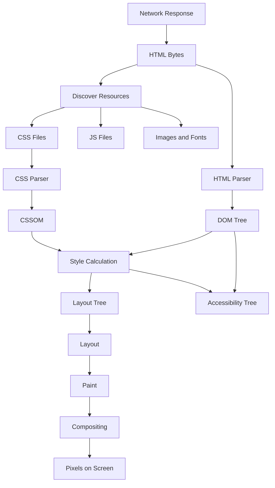
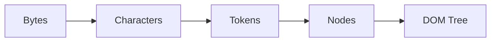
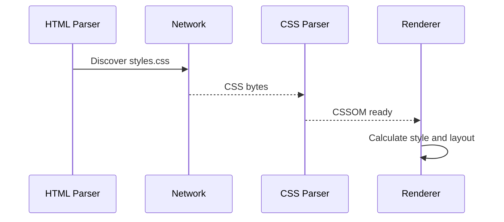
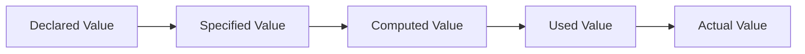
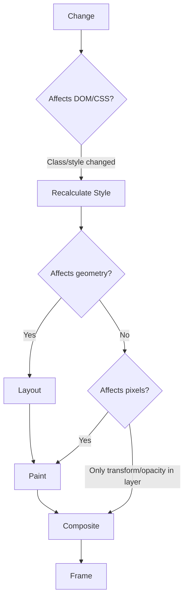
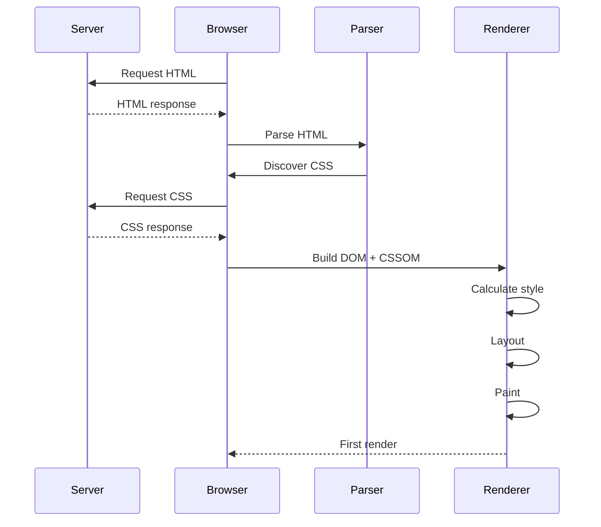
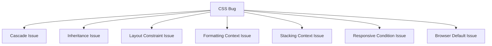
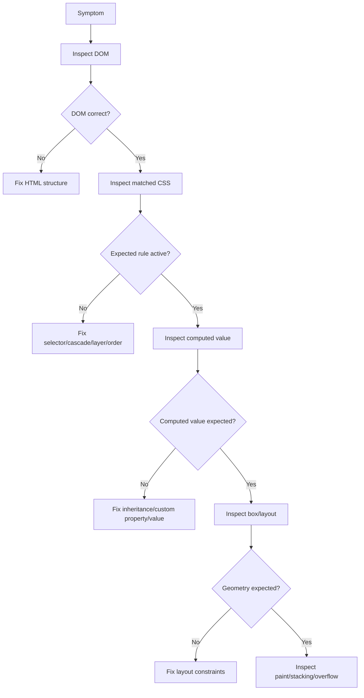

# Part 02 — How the Web Renders: From HTML, CSS, DOM, CSSOM to Pixels

## 1. Tujuan Part Ini

Part ini menjawab pertanyaan fundamental:

> Bagaimana HTML dan CSS berubah menjadi tampilan visual di browser?

Jawaban yang dangkal adalah “browser membaca HTML dan CSS lalu menampilkannya.” Jawaban itu tidak cukup untuk engineer. Kita perlu memahami pipeline karena sebagian besar bug HTML/CSS berasal dari salah satu tahap berikut:

- parsing HTML;
- pembentukan DOM;
- loading resource;
- parsing CSS;
- pembentukan CSSOM;
- cascade dan computed style;
- render tree;
- layout;
- paint;
- compositing;
- invalidation ketika ada perubahan.

MDN mendefinisikan critical rendering path sebagai rangkaian langkah yang dipakai browser untuk mengubah HTML, CSS, dan JavaScript menjadi pixel di layar. Pipeline ini melibatkan DOM, CSSOM, render tree, dan layout. Detail implementasi berbeda antar browser engine, tetapi mental model ini cukup stabil untuk debugging dan performance reasoning.

---

## 2. Browser Sebagai Runtime Engine

Software engineer biasanya terbiasa dengan runtime seperti JVM, CLR, Node.js, atau Go runtime. Browser juga runtime, tetapi input utamanya adalah dokumen dan resource graph.

Input:

- HTML;
- CSS;
- JavaScript;
- images;
- fonts;
- media;
- metadata;
- network response headers.

Output:

- DOM;
- CSSOM;
- accessibility tree;
- layout tree/render tree;
- painted layers;
- composited frame;
- interactive page.

Mental model:



Setiap node dalam diagram punya failure mode. Jika kamu bisa menempatkan bug pada tahap yang benar, debugging menjadi jauh lebih cepat.

---

## 3. HTML Bytes to DOM

### 3.1 HTML Adalah Stream, Bukan Object Tree Sejak Awal

Browser menerima HTML sebagai byte stream. Byte stream ini didecode menjadi karakter, lalu diparse menjadi token, lalu node, lalu tree.

Simplified pipeline:



Contoh HTML:

```html
<!doctype html>
<html lang="en">
  <head>
    <meta charset="utf-8" />
    <title>Case UI</title>
    <link rel="stylesheet" href="styles.css" />
  </head>
  <body>
    <main>
      <h1>Case CASE-2026-001</h1>
      <p>Status: Under Review</p>
    </main>
  </body>
</html>
```

DOM konseptual:

```txt
Document
└── html[lang="en"]
    ├── head
    │   ├── meta[charset="utf-8"]
    │   ├── title
    │   └── link[rel="stylesheet"]
    └── body
        └── main
            ├── h1
            └── p
```

DOM bukan sekadar salinan source HTML. Browser bisa memperbaiki markup, menambahkan node implisit, dan mengubah struktur efektif.

### 3.2 Browser Forgiveness

HTML parser bersifat forgiving. Jika markup invalid, browser sering tetap menampilkan sesuatu.

Contoh:

```html
<ul>
  <li>First
  <li>Second
</ul>
```

Browser akan menutup `li` pertama secara implisit. Ini valid dalam beberapa aturan HTML karena `li` boleh tidak ditulis closing tag-nya dalam konteks tertentu.

Namun ada kasus yang lebih berbahaya:

```html
<p>
  This is a paragraph.
  <div>This div is not allowed inside p.</div>
</p>
```

Browser akan menutup `p` sebelum `div`. DOM aktual tidak sama dengan yang kamu bayangkan.

Konsekuensi engineering:

- CSS selector mungkin match elemen berbeda;
- accessibility tree bisa berbeda;
- layout bisa terlihat aneh;
- event delegation bisa tidak sesuai asumsi;
- hydration pada framework bisa mismatch.

### 3.3 DOM vs Source HTML

Source HTML adalah teks yang dikirim atau ditulis. DOM adalah tree aktual setelah parsing dan mutation.

Perbedaan penting:

| Aspek | Source HTML | DOM |
|---|---|---|
| Bentuk | teks | object tree |
| Dibaca oleh | parser | browser APIs, CSS selector matching, JS |
| Bisa invalid | ya | browser membuat tree efektif |
| Bisa berubah setelah load | tidak langsung | ya, melalui JavaScript dan browser behavior |
| Dilihat di | View Source | DevTools Elements |

Debugging rule:

> Untuk debugging runtime, percaya DevTools Elements/DOM, bukan hanya View Source.

---

## 4. Resource Discovery

Saat parser membaca HTML, browser menemukan resource eksternal.

Contoh:

```html
<link rel="stylesheet" href="styles.css" />
<script src="app.js"></script>

```

Resource discovery penting karena memengaruhi rendering order.

### 4.1 CSS Resource

CSS biasanya render-blocking untuk initial render karena browser perlu CSSOM untuk menghitung style sebelum layout. Tanpa CSS, browser tidak tahu ukuran, display, font, warna, dan constraint yang memengaruhi layout.

Simplified:



### 4.2 JavaScript Resource

JavaScript dapat memblokir parsing HTML jika tidak memakai `defer`, `async`, atau module semantics. JavaScript juga dapat membaca dan mengubah DOM/CSSOM.

Contoh blocking klasik:

```html
<script src="app.js"></script>
```

Lebih aman untuk banyak halaman:

```html
<script src="app.js" defer></script>
```

Atau module:

```html
<script type="module" src="app.js"></script>
```

Dalam seri HTML/CSS ini, JavaScript bukan fokus utama. Tetapi kamu perlu tahu efeknya terhadap rendering karena script dapat:

- menghentikan parser;
- membaca style;
- memaksa layout calculation;
- menambah/menghapus class;
- mengubah DOM;
- menyebabkan layout shift.

### 4.3 Images dan Fonts

Images tidak selalu memblokir initial render, tetapi dapat menyebabkan layout shift jika ukuran tidak diketahui. Fonts dapat memengaruhi layout karena metric font menentukan ukuran teks.

Praktik penting:

```html

```

Atribut `width` dan `height` membantu browser menghitung aspect ratio sebelum gambar selesai dimuat.

---

## 5. CSS Bytes to CSSOM

CSS juga diparse menjadi object model: CSSOM.

Contoh CSS:

```css
body {
  margin: 0;
  font-family: system-ui, sans-serif;
}

.case-summary {
  display: grid;
  gap: 1rem;
}
```

CSSOM konseptual:

```txt
CSSStyleSheet
├── CSSStyleRule selector="body"
│   ├── margin: 0
│   └── font-family: system-ui, sans-serif
└── CSSStyleRule selector=".case-summary"
    ├── display: grid
    └── gap: 1rem
```

CSSOM digunakan bersama DOM untuk menentukan style final tiap elemen.

---

## 6. Cascade, Specified Values, Computed Values, Used Values

Sebelum layout, browser harus menentukan nilai style. Ini tidak sesederhana “ambil CSS terakhir”. Browser menjalankan cascade algorithm.

### 6.1 Cascade Inputs

Style bisa berasal dari beberapa origin:

- user-agent stylesheet;
- user stylesheet;
- author stylesheet;
- inline style;
- animation;
- transition.

Lalu dipengaruhi:

- importance (`!important`);
- cascade layer;
- specificity;
- scope proximity;
- source order.

MDN menjelaskan cascade sebagai algoritma yang menggabungkan nilai properti dari berbagai sumber untuk menentukan nilai akhir yang diterapkan pada elemen.

### 6.2 Value Lifecycle

Nilai CSS melewati beberapa tahap:



Contoh:

```css
.card {
  width: 50%;
}
```

Tahapan:

- declared value: `50%`;
- specified value: value yang menang setelah cascade;
- computed value: masih bisa berupa percentage tergantung property;
- used value: pixel konkret setelah layout container diketahui;
- actual value: nilai final setelah pembulatan/rendering detail.

Konsekuensi:

> Saat DevTools menunjukkan `width: 50%`, ukuran aktual di layar tetap bergantung pada layout parent.

---

## 7. Render Tree / Layout Tree

Browser tidak langsung melayout seluruh DOM. Ia membuat tree internal untuk node yang perlu ditampilkan.

Contoh:

```html
<body>
  <main>
    <h1>Case</h1>
    <p hidden>This is hidden.</p>
    <p class="note">Visible note.</p>
  </main>
</body>
```

```css
.note {
  display: block;
}
```

Elemen dengan `hidden` atau `display: none` tidak masuk layout tree. Tetapi elemen dengan `visibility: hidden` tetap mengambil ruang.

Perbedaan penting:

| Teknik | Masuk layout? | Terlihat? | Dapat focus? | Catatan |
|---|---:|---:|---:|---|
| `display: none` | tidak | tidak | tidak | hilang dari layout dan umumnya accessibility tree |
| `visibility: hidden` | ya | tidak | tidak | ruang tetap ada |
| `opacity: 0` | ya | tidak secara visual | bisa, tergantung elemen | sering berbahaya untuk accessibility |
| off-screen positioning | ya/tidak tergantung teknik | tidak di viewport | bisa | sering dipakai untuk visually-hidden utility |

---

## 8. Layout

Layout adalah proses menghitung ukuran dan posisi elemen.

Browser perlu menjawab:

- berapa lebar elemen ini?
- berapa tinggi elemen ini?
- di mana posisinya?
- bagaimana teks membungkus?
- bagaimana Flexbox membagi ruang?
- bagaimana Grid membuat track?
- apakah terjadi overflow?
- apa containing block-nya?

### 8.1 Layout Dipengaruhi Banyak Faktor

Layout sebuah elemen dipengaruhi oleh:

- display type;
- writing mode;
- containing block;
- width/height/min/max;
- intrinsic size konten;
- font metrics;
- box model;
- position;
- overflow;
- flex/grid context;
- aspect ratio;
- replaced element behavior;
- viewport/container size.

### 8.2 Contoh Layout Constraint

```css
.panel {
  width: min(100% - 2rem, 64rem);
  margin-inline: auto;
}
```

Makna:

- lebar panel adalah nilai terkecil antara `100% - 2rem` dan `64rem`;
- panel tidak akan melebihi viewport minus spacing;
- panel tidak akan melebar lebih dari 64rem;
- `margin-inline: auto` memusatkan panel secara horizontal pada writing mode default.

### 8.3 Layout Bugs yang Umum

#### Bug 1 — Horizontal Overflow

```css
.page {
  width: 100vw;
  padding: 1rem;
}
```

Masalah:

- `100vw` dapat memasukkan lebar scrollbar;
- padding menambah ukuran jika box-sizing tidak sesuai;
- hasilnya horizontal scroll.

Lebih aman:

```css
.page {
  width: min(100% - 2rem, 72rem);
  margin-inline: auto;
}
```

#### Bug 2 — Flex Item Tidak Mau Mengecil

```css
.row {
  display: flex;
}

.title {
  white-space: nowrap;
  overflow: hidden;
  text-overflow: ellipsis;
}
```

Jika `.title` tetap overflow, sering kali perlu:

```css
.title {
  min-width: 0;
}
```

Alasannya: flex item memiliki default min-size behavior yang dapat mempertahankan intrinsic content size.

#### Bug 3 — Grid Item Overflow

```css
.layout {
  display: grid;
  grid-template-columns: 1fr 20rem;
}
```

Jika kolom utama berisi konten panjang, `1fr` bisa tidak mengecil seperti yang diharapkan. Versi lebih defensif:

```css
.layout {
  display: grid;
  grid-template-columns: minmax(0, 1fr) 20rem;
}
```

---

## 9. Paint

Setelah layout, browser tahu posisi dan ukuran. Tahap berikutnya adalah paint: menggambar visual box.

Yang dipaint:

- background;
- border;
- text;
- shadow;
- images;
- outline;
- decorations.

Paint order dipengaruhi oleh stacking context dan aturan painting browser.

Contoh:

```css
.card {
  background: white;
  border: 1px solid #d1d5db;
  box-shadow: 0 1px 2px rgb(0 0 0 / 0.08);
}
```

Properti seperti `box-shadow` dan `filter` bisa meningkatkan biaya paint, terutama jika dipakai pada banyak elemen atau berubah setiap frame.

---

## 10. Compositing

Browser dapat memecah halaman menjadi layer dan menggabungkannya di compositor.

Properti yang sering terkait compositing:

- `transform`;
- `opacity`;
- video;
- fixed/sticky element;
- canvas;
- beberapa kondisi `will-change`.

Animasi yang baik biasanya mengubah `transform` atau `opacity`, bukan `width`, `height`, `top`, atau `left`.

Contoh kurang baik:

```css
.drawer {
  left: -20rem;
  transition: left 200ms ease;
}

.drawer[open] {
  left: 0;
}
```

Lebih baik:

```css
.drawer {
  transform: translateX(-100%);
  transition: transform 200ms ease;
}

.drawer[open] {
  transform: translateX(0);
}
```

Kenapa?

- perubahan `left` dapat memicu layout;
- perubahan `transform` sering bisa ditangani compositor;
- lebih stabil untuk animasi.

Catatan: jangan sembarangan memakai `will-change`. Properti itu adalah hint ke browser dan bisa boros memory jika dipakai terlalu luas.

---

## 11. Recalculate Style, Layout, Paint, Composite

Halaman web tidak statis. Ketika DOM atau CSS berubah, browser perlu melakukan invalidation.

Contoh perubahan:

```js
document.querySelector(".panel").classList.add("is-expanded");
```

Jika class baru mengubah `color`, mungkin hanya style/paint yang berubah. Jika mengubah `width`, layout bisa berubah. Jika mengubah `transform`, mungkin cukup compositing.

Mental model biaya:



Urutan biaya kasar:

1. Composite-only biasanya paling murah.
2. Paint lebih mahal.
3. Layout lebih mahal karena bisa memengaruhi banyak elemen.
4. Forced synchronous layout bisa sangat mahal jika terjadi berulang.

---

## 12. Critical Rendering Path

Critical rendering path adalah jalur yang harus dilalui browser untuk render awal.

Simplified:



Yang perlu dipahami:

- HTML parsing bisa mulai sebelum seluruh dokumen selesai diunduh.
- CSS eksternal dapat memblokir render karena style dibutuhkan untuk layout.
- JavaScript dapat memblokir parser tergantung cara dimuat.
- Fonts dan images dapat memengaruhi layout stability.

---

## 13. Why CSS Bugs Feel Weird

CSS bugs terasa aneh karena CSS bukan imperative code. Banyak engineer terbiasa mencari “baris yang mengeksekusi bug”. Dalam CSS, masalah sering muncul dari interaksi global:

- rule A menang karena specificity;
- rule B diwariskan dari parent;
- rule C dari user-agent stylesheet;
- width item tergantung intrinsic size konten;
- parent menjadi containing block karena `position` atau `transform`;
- z-index tidak bekerja karena stacking context berbeda;
- media query aktif karena viewport, bukan container;
- overflow tersembunyi oleh ancestor.

Debugging CSS perlu cara berpikir graph, bukan stack trace.



---

## 14. Browser Defaults: User-Agent Stylesheet

Bahkan tanpa CSS, browser punya default stylesheet.

Contoh efek default:

- `body` punya margin default;
- heading punya font size dan margin;
- `button` punya native styling;
- `ul` punya padding/margin;
- form controls punya default rendering;
- `table` punya table layout behavior.

Ini sebabnya halaman HTML polos tetap terlihat terstruktur.

Contoh reset ringan:

```css
body {
  margin: 0;
}

h1,
h2,
h3,
p,
figure,
blockquote,
dl,
dd {
  margin-block: 0;
}
```

Reset bukan kewajiban absolut. Reset adalah keputusan arsitektur. Tujuannya mengurangi variasi default yang tidak diinginkan, bukan menghapus semua behavior native.

---

## 15. Rendering and Accessibility Tree

Browser tidak hanya membuat visual tree. Browser juga mengekspos accessibility tree ke assistive technology.

Input accessibility tree:

- DOM semantics;
- ARIA attributes;
- labels;
- roles;
- states;
- visibility;
- disabled state;
- focusability;
- computed styles tertentu.

Contoh:

```html
<button type="button">Escalate case</button>
```

Browser dapat mengekspos:

```txt
Role: button
Name: Escalate case
State: focusable, enabled
```

Bandingkan:

```html
<div class="button">Escalate case</div>
```

Secara visual bisa sama jika diberi CSS, tetapi accessibility contract berbeda. `div` tidak otomatis punya role button, tidak otomatis keyboard-activatable, dan tidak otomatis masuk form behavior.

Prinsip:

> Native element menghasilkan contract browser yang gratis. Custom element harus membayar ulang contract itu dengan kode dan testing.

---

## 16. DevTools Mental Model

DevTools adalah microscope untuk pipeline browser.

| DevTools Area | Pipeline yang Dilihat | Pertanyaan |
|---|---|---|
| Elements | DOM | Apakah struktur aktual sesuai asumsi? |
| Styles | Cascade | Rule mana aktif/overridden? |
| Computed | Final computed value | Nilai akhir properti apa? |
| Box model | Layout | Ukuran/margin/padding/border berapa? |
| Layout overlay | Flex/Grid | Track/axis/gap seperti apa? |
| Accessibility | Accessibility tree | Role/name/state benar? |
| Network | Resource loading | CSS/font/image dimuat kapan? |
| Performance | Render cost | Layout/paint/composite mahal? |

Debugging flow:



---

## 17. Example: Diagnose a Layout Bug

### 17.1 Buggy HTML

```html
<main class="page">
  <section class="case-layout">
    <article class="case-main">
      <h1>Case CASE-2026-001</h1>
      <p class="case-title">
        Extremely long case title that should truncate instead of breaking the layout
      </p>
    </article>

    <aside class="case-sidebar">
      <h2>Assignment</h2>
      <p>Assigned to Enforcement Unit Alpha</p>
    </aside>
  </section>
</main>
```

### 17.2 Buggy CSS

```css
.case-layout {
  display: grid;
  grid-template-columns: 1fr 20rem;
  gap: 1rem;
}

.case-title {
  white-space: nowrap;
  overflow: hidden;
  text-overflow: ellipsis;
}
```

Symptom: halaman overflow horizontal.

### 17.3 Diagnosis

Kemungkinan penyebab:

- Grid column `1fr` mempertahankan intrinsic minimum size.
- `.case-title` mencoba truncate, tetapi parent grid track tidak boleh mengecil cukup kecil.

### 17.4 Fix

```css
.case-layout {
  display: grid;
  grid-template-columns: minmax(0, 1fr) 20rem;
  gap: 1rem;
}

.case-main {
  min-width: 0;
}

.case-title {
  white-space: nowrap;
  overflow: hidden;
  text-overflow: ellipsis;
}
```

Pelajaran:

- text truncation bukan hanya urusan element teks;
- parent layout constraint ikut menentukan;
- `minmax(0, 1fr)` dan `min-width: 0` adalah alat defensif untuk layout kompleks.

---

## 18. Example: Diagnose a Cascade Bug

### 18.1 HTML

```html
<button class="button button-danger" type="button">
  Delete evidence
</button>
```

### 18.2 CSS

```css
.button-danger {
  background: red;
}

button.button {
  background: gray;
}
```

Symptom: tombol tetap abu-abu, bukan merah.

### 18.3 Diagnosis

`button.button` lebih spesifik daripada `.button-danger`.

Specificity konseptual:

```txt
.button-danger => 0-1-0
button.button  => 0-1-1
```

### 18.4 Fix yang Lebih Baik

Jangan menaikkan specificity tanpa pikir panjang. Rancang class variant:

```css
.button {
  background: var(--button-bg, gray);
}

.button-danger {
  --button-bg: red;
}
```

Dengan pattern ini:

- base component tetap stabil;
- variant mengubah token;
- tidak perlu specificity war.

---

## 19. Rendering-Oriented Coding Principles

### 19.1 Reserve Space for Media

```html

```

Atau CSS:

```css
.chart-placeholder {
  aspect-ratio: 2 / 1;
}
```

Tujuan: mencegah layout shift.

### 19.2 Prefer Intrinsic and Constraint-Based Layout

Kurang fleksibel:

```css
.card {
  width: 320px;
}
```

Lebih adaptif:

```css
.card-grid {
  display: grid;
  grid-template-columns: repeat(auto-fit, minmax(min(100%, 18rem), 1fr));
  gap: 1rem;
}
```

### 19.3 Avoid Unnecessary Layout Dependencies

Kurang baik:

```css
.panel {
  height: 400px;
}
```

Lebih resilient:

```css
.panel {
  min-block-size: 20rem;
}
```

Fixed height sering gagal saat:

- teks lebih panjang;
- font lebih besar;
- bahasa berubah;
- user zoom;
- viewport kecil;
- error message muncul.

### 19.4 Animate Cheap Properties

Prefer:

```css
.toast {
  transform: translateY(1rem);
  opacity: 0;
  transition:
    transform 160ms ease,
    opacity 160ms ease;
}

.toast.is-visible {
  transform: translateY(0);
  opacity: 1;
}
```

Hindari animasi layout-heavy jika tidak perlu.

---

## 20. Browser Rendering as Failure Model

Saat UI rusak, gunakan failure model ini.

### 20.1 HTML Failure

Gejala:

- CSS selector tidak match;
- screen reader output salah;
- form tidak submit field tertentu;
- DOM berbeda dari source;
- hydration mismatch.

Cek:

- DevTools Elements;
- valid nesting;
- landmark;
- label association;
- duplicate id.

### 20.2 CSS Cascade Failure

Gejala:

- rule dicoret di DevTools;
- style berubah setelah import file lain;
- variant tidak menang;
- `!important` mulai tersebar.

Cek:

- origin;
- layer;
- specificity;
- source order;
- inheritance;
- custom property value.

### 20.3 Layout Failure

Gejala:

- overflow horizontal;
- item tidak align;
- grid terlalu lebar;
- sticky tidak bekerja;
- element absolute salah posisi;
- text tidak truncate.

Cek:

- display;
- containing block;
- min/max size;
- `min-width: 0`;
- overflow;
- flex/grid overlay;
- writing mode/logical properties.

### 20.4 Paint/Stacking Failure

Gejala:

- z-index tidak bekerja;
- overlay tertutup;
- shadow terpotong;
- focus ring hilang;
- element terlihat tetapi tidak bisa diklik.

Cek:

- stacking context;
- overflow clipping;
- top layer;
- pointer-events;
- opacity;
- transform;
- position.

### 20.5 Performance Failure

Gejala:

- initial render lambat;
- layout shift;
- animation jank;
- font flicker;
- scroll berat.

Cek:

- render-blocking CSS;
- unused CSS;
- font loading;
- image dimensions;
- layout thrashing;
- paint-heavy effects;
- excessive DOM complexity.

---

## 21. Latihan Wajib

### Latihan 1 — Draw the Rendering Pipeline

Tanpa melihat materi, gambar ulang pipeline:

```txt
HTML -> DOM
CSS -> CSSOM
DOM + CSSOM -> style calculation
style -> layout tree
layout tree -> layout
layout -> paint
paint -> composite
composite -> pixels
```

Lalu jelaskan setiap tahap dalam satu kalimat.

### Latihan 2 — DOM vs Source

Buat HTML invalid:

```html
<p>
  Paragraph starts here.
  <div>Invalid nested div.</div>
  Paragraph continues here.
</p>
```

Buka di browser. Bandingkan:

- View Source;
- DevTools Elements.

Tulis perbedaannya.

### Latihan 3 — Cascade Debugging

Buat konflik selector:

```css
.alert {
  color: red;
}

main .alert {
  color: blue;
}

:where(main) .alert {
  background: yellow;
}
```

Jawab:

1. Warna teks apa yang aktif?
2. Kenapa?
3. Apa specificity masing-masing selector?
4. Kenapa `:where(main)` tidak menaikkan specificity?

### Latihan 4 — Layout Debugging

Buat layout grid dua kolom dengan teks panjang. Buat overflow terjadi. Lalu perbaiki dengan:

```css
grid-template-columns: minmax(0, 1fr) 20rem;
```

Tambahkan juga:

```css
.main-column {
  min-width: 0;
}
```

Jelaskan kenapa dua perubahan ini membantu.

### Latihan 5 — Paint and Composite

Buat dua animasi drawer:

1. versi `left`;
2. versi `transform`.

Gunakan Performance panel untuk membandingkan apakah layout lebih sering terjadi pada versi pertama.

---

## 22. Rubric Evaluasi Part 02

Kamu dianggap paham part ini jika bisa menjawab:

1. Apa perbedaan source HTML dan DOM?
2. Kenapa CSS bisa render-blocking?
3. Apa itu CSSOM?
4. Apa yang dilakukan cascade sebelum layout?
5. Apa perbedaan computed value dan used value?
6. Kenapa `display: none` berbeda dari `visibility: hidden`?
7. Apa yang dihitung pada tahap layout?
8. Apa yang terjadi pada tahap paint?
9. Kenapa `transform` sering lebih baik untuk animasi daripada `left`?
10. Bagaimana DevTools membantu menemukan bug pada DOM, cascade, layout, dan accessibility?

---

## 23. Ringkasan

Browser rendering pipeline adalah fondasi untuk HTML/CSS engineering.

Urutan mental model:

1. Browser menerima HTML sebagai bytes.
2. HTML diparse menjadi DOM.
3. Browser menemukan CSS, JS, images, fonts, dan resource lain.
4. CSS diparse menjadi CSSOM.
5. DOM dan CSSOM dipakai untuk style calculation.
6. Browser membuat layout/render tree untuk node yang perlu ditampilkan.
7. Layout menghitung ukuran dan posisi.
8. Paint menggambar visual.
9. Compositing menggabungkan layer menjadi frame.
10. Perubahan DOM/CSS dapat memicu recalculation, layout, paint, atau composite.

Skill penting bukan hanya tahu istilah. Skill penting adalah mampu memakai pipeline ini untuk debugging:

- Jika struktur salah, cek DOM.
- Jika style salah, cek cascade/computed value.
- Jika posisi salah, cek layout/box model.
- Jika overlay salah, cek stacking/paint.
- Jika lambat, cek critical rendering path dan invalidation.

Part berikutnya akan membahas dokumen, resource, URL, origin, metadata, dan hubungan HTML dengan resource graph sebuah halaman web.

---

## References

- [WHATWG HTML Living Standard](https://html.spec.whatwg.org/)
- [MDN Web Docs — Critical rendering path](https://developer.mozilla.org/en-US/docs/Web/Performance/Guides/Critical_rendering_path)
- [MDN Web Docs — Populating the page: how browsers work](https://developer.mozilla.org/en-US/docs/Web/Performance/Guides/How_browsers_work)
- [MDN Web Docs — CSS cascading and inheritance](https://developer.mozilla.org/en-US/docs/Web/CSS/Guides/Cascade)
- [MDN Web Docs — Specificity](https://developer.mozilla.org/en-US/docs/Web/CSS/Guides/Cascade/Specificity)
- [MDN Web Docs — CSS](https://developer.mozilla.org/en-US/docs/Web/CSS)
