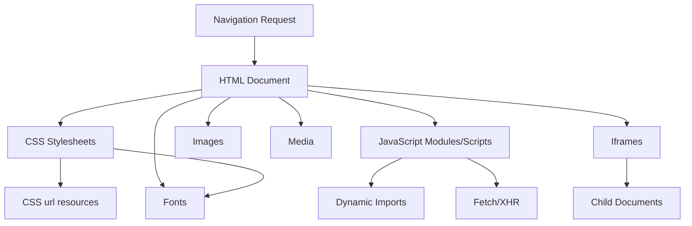
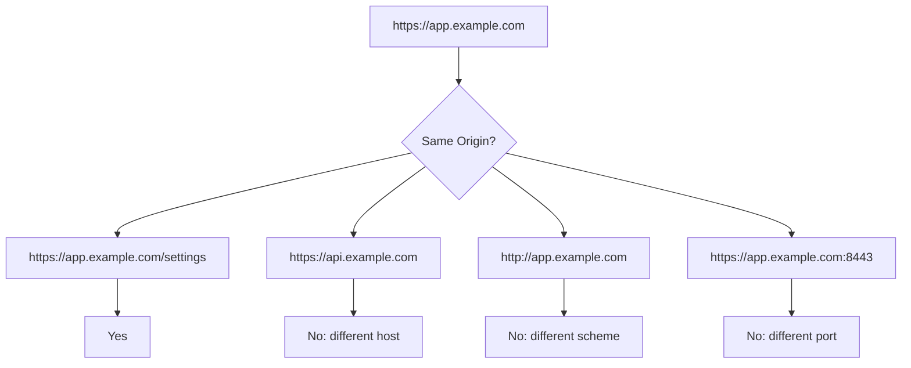
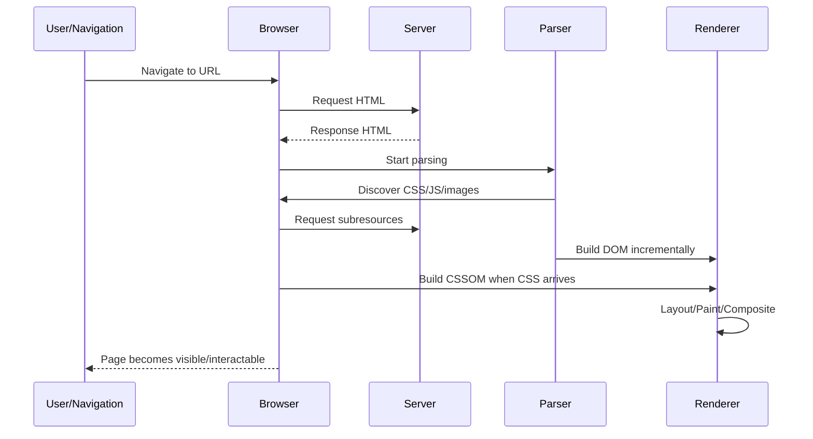
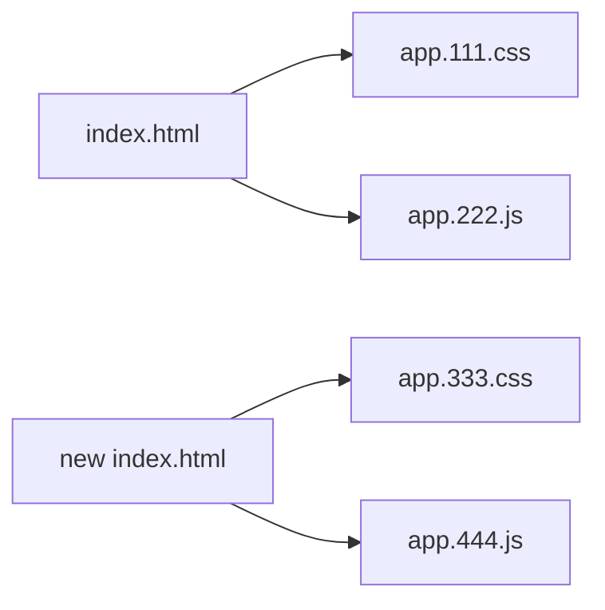
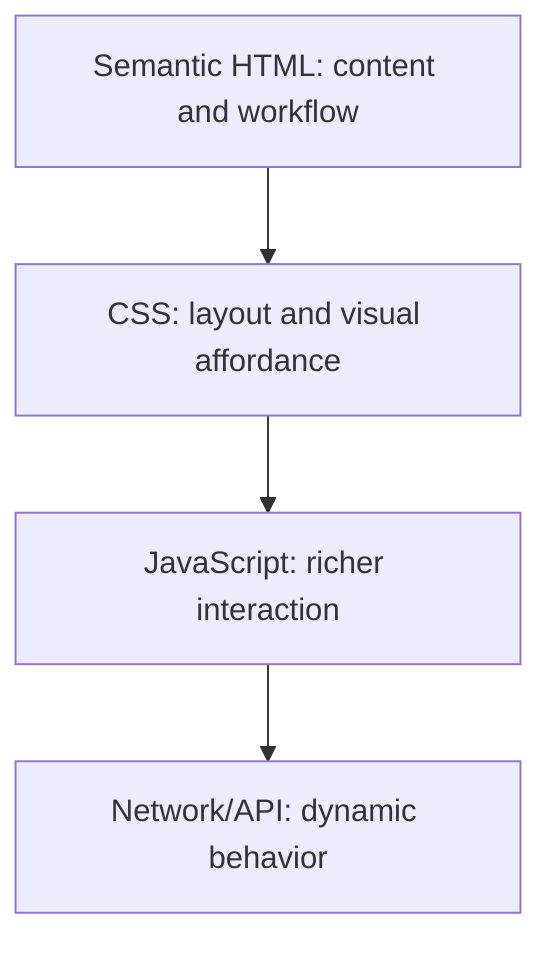
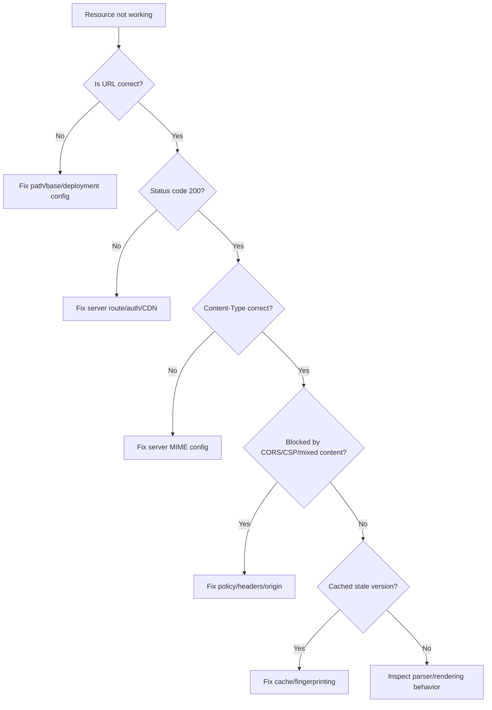

# Part 03 — Documents, Resources, URLs, Origins, and the Browser Contract

## 1. Tujuan Part Ini

Pada Part 02, kita melihat browser sebagai runtime yang mengubah HTML dan CSS menjadi pixel. Part ini mundur satu level: sebelum browser bisa membuat DOM, CSSOM, layout, dan paint, browser harus menjawab pertanyaan yang lebih fundamental:

> Dokumen apa yang sedang dimuat, dari mana asalnya, resource apa saja yang dibutuhkan, dan batas keamanan apa yang berlaku?

HTML/CSS tidak hidup dalam ruang kosong. Satu halaman web adalah kombinasi dari:

- dokumen HTML,
- URL dokumen,
- base URL,
- stylesheet,
- script,
- gambar,
- font,
- media,
- iframe,
- metadata,
- origin,
- policy,
- cache,
- network priority,
- dan browser lifecycle.

Sebagai software engineer, mental model ini penting karena banyak bug frontend bukan berasal dari tag atau property CSS, tetapi dari resource graph yang salah:

- asset tidak muncul karena relative URL salah,
- stylesheet tidak ter-load karena path salah,
- font gagal karena CORS,
- iframe diblokir karena security policy,
- script duplicate fetch karena preload keliru,
- metadata salah sehingga preview social media rusak,
- layout shift karena image dimension tidak dideklarasikan,
- route SPA refresh 404 karena server tidak mengerti path,
- cache membuat perubahan CSS tidak terlihat,
- CSP memblokir inline style atau external font.

Target part ini adalah membuat kamu melihat HTML document sebagai **entry point runtime** dan **resource contract**.

---

## 2. Mental Model: Web Page sebagai Document + Resource Graph

Satu halaman web bukan hanya satu file. Browser menerima dokumen awal, biasanya HTML, lalu dokumen itu menunjuk ke resource lain.



Halaman web lebih tepat dipahami sebagai **directed graph**:

- root node: HTML document,
- edges: referensi resource,
- nodes: CSS, JS, image, font, media, nested documents,
- constraints: URL resolution, origin, MIME type, CORS, CSP, cache, priority.

Contoh sederhana:

```html
<!doctype html>
<html lang="en">
  <head>
    <meta charset="utf-8" />
    <meta name="viewport" content="width=device-width, initial-scale=1" />
    <title>Case Management</title>
    <link rel="stylesheet" href="/assets/app.css" />
    <script type="module" src="/assets/app.js"></script>
  </head>
  <body>
    <main>
      <h1>Case Detail</h1>
      
    </main>
  </body>
</html>
```

Dari markup ini, browser tidak hanya membaca tag. Browser membuat keputusan:

| Referensi | Artinya |
|---|---|
| `/assets/app.css` | Ambil stylesheet dari origin yang sama, path absolut terhadap host. |
| `/assets/app.js` | Ambil JavaScript module dari origin yang sama. |
| `./evidence/photo-001.jpg` | Resolve relatif terhadap URL dokumen atau base URL. |
| `lang="en"` | Bahasa dokumen untuk accessibility, typography, spell checking, translation. |
| `viewport` | Instruksi layout viewport pada perangkat mobile. |

Kesalahan di salah satu keputusan ini dapat menghasilkan bug yang terlihat seperti bug HTML/CSS, padahal akarnya adalah **kontrak resource**.

---

## 3. HTML Document sebagai Entry Point

HTML document adalah titik awal yang mendefinisikan:

1. struktur dokumen,
2. metadata,
3. resource dependency,
4. semantic tree,
5. scripting hooks,
6. rendering hints,
7. navigation behavior.

Minimal HTML document modern:

```html
<!doctype html>
<html lang="en">
  <head>
    <meta charset="utf-8" />
    <meta name="viewport" content="width=device-width, initial-scale=1" />
    <title>Document Title</title>
  </head>
  <body>
    <main>
      <h1>Hello, web platform.</h1>
    </main>
  </body>
</html>
```

Setiap bagian punya fungsi.

## 3.1 `<!doctype html>`

Doctype modern menginstruksikan browser menggunakan **standards mode**.

Tanpa doctype, browser dapat masuk ke quirks mode atau limited-quirks mode. Dampaknya dapat terlihat pada:

- box model,
- table layout,
- image alignment,
- percentage height,
- font metrics,
- compatibility behavior lama.

Rule praktis:

> Selalu mulai dokumen HTML dengan `<!doctype html>`.

Ini bukan dekorasi. Ini runtime mode switch.

## 3.2 `<html lang="...">`

`lang` menyatakan bahasa utama dokumen.

```html
<html lang="id">
```

Dampaknya:

- screen reader pronunciation,
- browser translation,
- hyphenation,
- spell check,
- search indexing,
- typography behavior tertentu.

Untuk konten multilingual, gunakan `lang` lokal:

```html
<p lang="id">Kasus sedang dalam proses eskalasi.</p>
<p lang="en">The case is pending supervisory review.</p>
```

Failure mode umum:

```html
<html>
```

Halaman tetap tampil, tetapi semantic contract untuk bahasa hilang.

## 3.3 `<head>` vs `<body>`

`<head>` berisi metadata dan resource hints. `<body>` berisi konten yang dipresentasikan ke user.

```html
<head>
  <title>Case Dashboard</title>
  <link rel="stylesheet" href="/app.css" />
</head>
<body>
  <main>...</main>
</body>
```

Jangan menyimpan konten utama di `<head>`. Browser mungkin memindahkan node secara implisit saat parsing, tetapi itu berarti kamu menyerahkan struktur dokumen ke error recovery.

---

## 4. URL: Identitas Resource

URL adalah identitas dan lokasi resource. Di web platform, URL bukan string biasa. URL memiliki struktur.

Contoh:

```text
https://app.example.com/cases/123?tab=evidence#timeline
```

Komponen konseptual:

| Komponen | Nilai |
|---|---|
| scheme | `https` |
| host | `app.example.com` |
| path | `/cases/123` |
| query | `tab=evidence` |
| fragment | `timeline` |

Untuk frontend engineer, URL penting karena mempengaruhi:

- routing,
- relative asset path,
- origin,
- caching,
- service worker scope,
- form submission,
- anchor navigation,
- canonical identity,
- browser history.

---

## 5. Absolute URL, Root-Relative URL, Relative URL

HTML banyak memakai URL-like attribute:

- `href`,
- `src`,
- `action`,
- `poster`,
- `srcset`,
- `cite`,
- `data`,
- CSS `url(...)`.

Penting membedakan jenis URL.

## 5.1 Absolute URL

```html

```

Absolute URL menyertakan scheme dan host. Ia tidak bergantung pada lokasi dokumen.

Gunakan untuk:

- CDN lintas host,
- canonical URL,
- Open Graph image,
- resource publik absolut.

Risiko:

- origin berbeda,
- CORS,
- mixed content jika `http`,
- dependency ke domain eksternal,
- privacy dan availability risk.

## 5.2 Root-Relative URL

```html
<link rel="stylesheet" href="/assets/app.css" />
```

Path dimulai dari root origin saat ini.

Jika dokumen berada di:

```text
https://app.example.com/cases/123
```

Maka:

```text
/assets/app.css
```

menjadi:

```text
https://app.example.com/assets/app.css
```

Root-relative URL stabil untuk aplikasi yang di-deploy di domain root. Tetapi hati-hati jika aplikasi di-host di subpath:

```text
https://example.com/internal/case-app/
```

`/assets/app.css` akan menunjuk ke:

```text
https://example.com/assets/app.css
```

bukan:

```text
https://example.com/internal/case-app/assets/app.css
```

## 5.3 Relative URL

```html


```

Relative URL di-resolve terhadap base URL dokumen.

Jika dokumen:

```text
https://app.example.com/cases/123/details.html
```

Maka:

| URL | Resolved URL |
|---|---|
| `evidence/photo.jpg` | `https://app.example.com/cases/123/evidence/photo.jpg` |
| `./evidence/photo.jpg` | `https://app.example.com/cases/123/evidence/photo.jpg` |
| `../shared/logo.svg` | `https://app.example.com/cases/shared/logo.svg` |

Relative path sering menjadi sumber bug ketika:

- file dipindahkan,
- routing SPA memakai nested path,
- HTML di-generate dari template berbeda,
- base tag digunakan,
- asset pipeline mengubah output directory.

---

## 6. Base URL dan `<base>`

HTML dapat mendefinisikan base URL eksplisit:

```html
<head>
  <base href="https://cdn.example.com/app/" />
</head>
```

Setelah itu, relative URL dapat berubah meaning:

```html

```

Akan di-resolve terhadap:

```text
https://cdn.example.com/app/images/logo.svg
```

bukan terhadap URL dokumen.

`<base>` powerful tetapi berbahaya karena efeknya global terhadap URL relatif dalam dokumen.

Rule engineering:

> Jangan gunakan `<base>` kecuali kamu benar-benar membutuhkan dan sudah menguji semua relative URL, anchor link, form action, dan asset path.

Failure mode:

```html
<base href="/admin/" />
<a href="#audit-log">Audit log</a>
```

Anchor lokal bisa berubah perilaku karena base URL mempengaruhi resolution.

---

## 7. Origin: Security Boundary Browser

Origin adalah boundary keamanan penting. Secara konseptual, origin terdiri dari:

```text
scheme + host + port
```

Contoh:

| URL | Origin |
|---|---|
| `https://app.example.com/cases` | `https://app.example.com:443` |
| `https://api.example.com/cases` | `https://api.example.com:443` |
| `http://app.example.com/cases` | `http://app.example.com:80` |
| `https://app.example.com:8443/cases` | `https://app.example.com:8443` |

Perbedaan scheme, host, atau port berarti origin berbeda.



Origin mempengaruhi:

- cookie scope,
- localStorage/sessionStorage,
- fetch/XHR,
- canvas tainting,
- font loading,
- iframe scripting,
- CORS,
- service worker,
- security policy.

HTML/CSS engineer tidak harus menjadi security specialist, tetapi harus tahu bahwa setiap cross-origin resource adalah boundary decision.

---

## 8. Same-Origin Policy dan CORS dari Perspektif HTML/CSS

Same-Origin Policy membatasi bagaimana dokumen atau script dari satu origin dapat membaca resource dari origin lain.

Namun, web juga mengizinkan banyak bentuk embedding lintas origin:

```html

<script src="https://cdn.example.com/lib.js"></script>
<link rel="stylesheet" href="https://cdn.example.com/theme.css" />
<iframe src="https://partner.example.com/widget"></iframe>
```

Embedding tidak selalu sama dengan membaca isi resource.

Contoh penting:

- `` bisa menampilkan gambar cross-origin, tetapi canvas yang menggambar gambar itu bisa menjadi tainted.
- `<script src="...">` bisa menjalankan script cross-origin jika tidak diblokir policy, tetapi ini berarti kamu mempercayai script tersebut.
- Font cross-origin sering membutuhkan header CORS yang benar.
- `fetch()` dari JavaScript tunduk pada CORS.
- CSS dapat memuat resource lain lewat `url(...)`, tetapi availability dan policy tetap penting.

Rule praktis:

> Setiap resource cross-origin harus dianggap sebagai dependency eksplisit dengan risiko availability, security, privacy, dan caching.

---

## 9. Resource Types dan Cara Browser Memperlakukannya

Tidak semua resource sama. Browser memberi perlakuan berbeda berdasarkan context.

| Resource | HTML/CSS Reference | Dampak Rendering |
|---|---|---|
| HTML document | navigation, iframe | root atau child document |
| CSS | `<link rel="stylesheet">` | render-blocking secara default |
| JS classic | `<script src>` | parser-blocking kecuali `defer`/`async` |
| JS module | `<script type="module">` | deferred by default secara umum |
| Image | ``, CSS `url()` | mempengaruhi layout/paint |
| Font | `@font-face` | mempengaruhi text rendering dan layout shift |
| Video/audio | `<video>`, `<audio>` | media pipeline |
| JSON/data | `fetch()` | tidak langsung render kecuali app memakai data |
| Iframe | `<iframe>` | nested browsing context |

Bagi HTML/CSS, dua resource paling penting pada initial render adalah:

- CSS,
- font/image yang mempengaruhi layout.

---

## 10. Stylesheet Loading Contract

Stylesheet eksternal umum:

```html
<link rel="stylesheet" href="/assets/app.css" />
```

Kontraknya:

1. browser menemukan link di `<head>`,
2. browser request CSS,
3. CSS di-parse menjadi CSSOM,
4. CSSOM dipakai bersama DOM untuk render tree,
5. rendering dapat tertunda sampai stylesheet penting tersedia.

Failure mode:

```html
<link rel="stylesheet" href="styles/app.css" />
```

Jika dokumen diakses dari:

```text
/cases/123
```

relative path bisa menjadi:

```text
/cases/styles/app.css
```

bukan:

```text
/styles/app.css
```

Solusi bergantung deployment:

```html
<link rel="stylesheet" href="/styles/app.css" />
```

atau bundler-generated URL.

---

## 11. Script Loading Contract: `defer`, `async`, dan `module`

Walaupun seri ini fokus HTML/CSS, script loading mempengaruhi dokumen dan rendering.

## 11.1 Classic Script Default

```html
<script src="/app.js"></script>
```

Classic script tanpa attribute dapat memblokir parsing HTML saat ditemukan.

## 11.2 `defer`

```html
<script src="/app.js" defer></script>
```

`defer` membuat script diunduh paralel dan dieksekusi setelah dokumen selesai diparse, sebelum `DOMContentLoaded`.

Gunakan untuk script yang butuh DOM tetapi tidak harus memblokir parser.

## 11.3 `async`

```html
<script src="/analytics.js" async></script>
```

`async` mengunduh paralel dan mengeksekusi segera saat siap. Urutan relatif dengan script lain tidak dijamin.

Gunakan untuk script independen seperti analytics, bukan untuk dependency chain UI.

## 11.4 Module Script

```html
<script type="module" src="/app.js"></script>
```

Module script punya behavior berbeda dari classic script, termasuk dependency graph dan strict mode. Secara praktis, untuk app modern, `type="module"` adalah default yang lebih baik bila build target mendukung.

---

## 12. Resource Hints: `preload`, `modulepreload`, `prefetch`, `preconnect`

Resource hints adalah cara memberi sinyal ke browser. Ini bukan jaminan mutlak, tetapi dapat memperbaiki startup performance jika dipakai benar.

## 12.1 `preload`

```html
<link rel="preload" href="/fonts/inter.woff2" as="font" type="font/woff2" crossorigin />
```

Gunakan untuk resource penting yang dibutuhkan segera tetapi tidak cepat ditemukan parser.

Contoh cocok:

- font critical,
- hero image,
- CSS background image penting,
- file yang ditemukan terlambat.

Anti-pattern:

```html
<link rel="preload" href="/everything.css" as="style" />
<link rel="preload" href="/hero.jpg" as="image" />
<link rel="preload" href="/below-the-fold.jpg" as="image" />
<link rel="preload" href="/analytics.js" as="script" />
```

Terlalu banyak preload menurunkan kualitas prioritization browser.

## 12.2 `modulepreload`

```html
<link rel="modulepreload" href="/assets/app.js" />
```

`modulepreload` relevan untuk JavaScript module graph. Berbeda dari `preload`, browser dapat memperlakukan resource sebagai module, termasuk parsing/compilation dan module map.

## 12.3 `prefetch`

```html
<link rel="prefetch" href="/cases/next" />
```

`prefetch` untuk resource yang kemungkinan dibutuhkan pada navigasi berikutnya, bukan initial critical rendering.

## 12.4 `preconnect`

```html
<link rel="preconnect" href="https://fonts.gstatic.com" crossorigin />
```

`preconnect` membantu browser membuka koneksi lebih awal ke origin lain.

Gunakan hemat. Terlalu banyak preconnect dapat membuang koneksi.

---

## 13. Images as Layout Participants

Image bukan hanya visual asset. Image berpartisipasi dalam layout.

Buruk:

```html

```

Lebih baik:

```html

```

`width` dan `height` membantu browser menghitung aspect ratio sebelum image selesai diunduh, mengurangi layout shift.

Untuk responsive images:

```html

```

Mental model:

- `srcset` menyediakan kandidat,
- `sizes` memberi tahu slot display size,
- browser memilih resource terbaik berdasarkan viewport, DPR, network, dan heuristics.

Failure mode umum:

```html

```

Tanpa `sizes`, browser memakai default tertentu yang sering membuat image terlalu besar diunduh.

---

## 14. Fonts as Runtime Dependency

Web font sering menjadi sumber performance dan layout problem.

```css
@font-face {
  font-family: "Inter";
  src: url("/fonts/inter.woff2") format("woff2");
  font-display: swap;
}

body {
  font-family: "Inter", system-ui, sans-serif;
}
```

Pertanyaan engineering:

- Apakah font benar-benar perlu?
- Apakah format modern tersedia?
- Apakah file subset dipakai?
- Apakah `font-display` sudah didefinisikan?
- Apakah fallback metrics menyebabkan layout shift besar?
- Apakah font cross-origin memerlukan CORS?

Rule praktis:

> Font adalah dependency rendering. Perlakukan seperti dependency performance, bukan sekadar asset desain.

---

## 15. CSS `url(...)` dan Relative Path

CSS punya URL resolution sendiri berdasarkan lokasi stylesheet, bukan lokasi HTML.

Contoh struktur:

```text
/public
  /index.html
  /styles/app.css
  /images/bg.png
```

Di `index.html`:

```html
<link rel="stylesheet" href="/styles/app.css" />
```

Di `app.css`:

```css
.hero {
  background-image: url("../images/bg.png");
}
```

`../images/bg.png` di-resolve relatif terhadap `/styles/app.css`, bukan `/index.html`.

Kesalahan umum:

```css
.hero {
  background-image: url("./images/bg.png");
}
```

Ini menunjuk ke:

```text
/styles/images/bg.png
```

bukan:

```text
/images/bg.png
```

Dalam build pipeline modern, bundler sering mengubah path asset. Tetapi mental model dasarnya tetap penting untuk debugging.

---

## 16. Iframe sebagai Nested Document

`iframe` memuat dokumen lain dalam nested browsing context.

```html
<iframe
  src="https://partner.example.com/widget"
  title="Partner risk scoring widget"
></iframe>
```

Kontrak penting:

- `title` wajib untuk accessibility.
- `src` menentukan child document.
- origin child bisa sama atau berbeda.
- parent dan child punya boundary security.
- ukuran iframe mempengaruhi layout parent.
- loading iframe dapat mahal.

Untuk security, gunakan `sandbox` jika memungkinkan:

```html
<iframe
  src="https://partner.example.com/widget"
  title="Partner risk scoring widget"
  sandbox="allow-scripts allow-forms"
></iframe>
```

`sandbox` tanpa token sangat restriktif. Tambahkan capability hanya jika dibutuhkan.

Failure mode:

```html
<iframe src="https://partner.example.com/widget"></iframe>
```

Masalah:

- tidak ada accessible name,
- tidak ada sandbox,
- tidak ada sizing strategy,
- dependency eksternal tidak eksplisit secara risiko.

---

## 17. Metadata sebagai Contract

Metadata bukan kosmetik. Metadata mempengaruhi cara dokumen dipahami browser, search engine, social platform, dan tools.

## 17.1 Charset

```html
<meta charset="utf-8" />
```

Letakkan sangat awal di `<head>`. UTF-8 adalah default realistis untuk web modern.

## 17.2 Viewport

```html
<meta name="viewport" content="width=device-width, initial-scale=1" />
```

Tanpa viewport meta, mobile browser dapat memakai layout viewport lebar virtual yang membuat responsive CSS terlihat gagal.

Hindari:

```html
<meta name="viewport" content="width=device-width, initial-scale=1, user-scalable=no" />
```

Mematikan zoom sering merusak accessibility.

## 17.3 Title

```html
<title>Case #REG-2026-001 — Enforcement Platform</title>
```

Title dipakai oleh:

- browser tab,
- bookmarks,
- search result,
- screen reader context,
- history.

Buat title spesifik, bukan generic.

## 17.4 Description

```html
<meta
  name="description"
  content="Review case status, evidence, timeline, and enforcement actions."
/>
```

Description bukan ranking magic, tetapi mempengaruhi snippet dan document summary di banyak context.

## 17.5 Canonical

```html
<link rel="canonical" href="https://app.example.com/cases/REG-2026-001" />
```

Canonical membantu menyatakan URL utama untuk konten yang bisa diakses dari beberapa URL.

## 17.6 Open Graph

```html
<meta property="og:title" content="Case Management Dashboard" />
<meta property="og:description" content="Operational dashboard for enforcement lifecycle tracking." />
<meta property="og:image" content="https://app.example.com/assets/preview.png" />
<meta property="og:type" content="website" />
```

Untuk aplikasi internal, Open Graph mungkin tidak relevan. Untuk public content, social preview rusak jika metadata tidak disiapkan.

---

## 18. Link Relations: More Than Stylesheets

`<link>` tidak hanya untuk CSS.

```html
<link rel="icon" href="/favicon.ico" />
<link rel="manifest" href="/site.webmanifest" />
<link rel="canonical" href="https://example.com/docs/html-css" />
<link rel="preload" href="/fonts/inter.woff2" as="font" crossorigin />
<link rel="stylesheet" href="/assets/app.css" />
```

Setiap `rel` menyatakan relationship antara dokumen saat ini dan resource lain.

Engineering rule:

> Jangan copy-paste `<link>` tags tanpa mengetahui relationship dan cost-nya.

---

## 19. Form `action` dan URL Contract

Form adalah bagian HTML yang langsung berhubungan dengan resource dan URL.

```html
<form method="post" action="/cases/REG-2026-001/actions">
  <label for="note">Action note</label>
  <textarea id="note" name="note" required></textarea>
  <button type="submit">Submit action</button>
</form>
```

Kontrak:

- `action` adalah target URL,
- `method` menentukan HTTP method yang digunakan browser form,
- `name` pada input menentukan payload key,
- validasi HTML bisa mencegah submit sebelum network request.

Jika `action` relatif:

```html
<form action="actions" method="post">
```

Maka target tergantung URL dokumen/base URL.

Untuk enterprise app, explicit path sering lebih aman:

```html
<form action="/cases/REG-2026-001/actions" method="post">
```

Tetapi untuk portable component, relative action bisa berguna. Pilih berdasarkan deployment model.

---

## 20. Anchor, Fragment, and Document Navigation

Anchor link:

```html
<a href="#audit-log">Audit log</a>

<section id="audit-log">
  <h2>Audit log</h2>
</section>
```

Fragment `#audit-log` menunjuk ke element dengan `id="audit-log"`.

Kontrak:

- `id` harus unik dalam dokumen,
- browser dapat scroll ke target,
- URL fragment berubah,
- screen reader dan keyboard user mendapat context jika focus management benar.

Untuk fixed header, gunakan CSS:

```css
section {
  scroll-margin-top: 5rem;
}
```

Jangan menambal anchor scroll dengan JavaScript jika CSS cukup.

---

## 21. Document Lifecycle Ringkas

Lifecycle awal dokumen kira-kira:



Beberapa event yang sering disebut:

- `DOMContentLoaded`: HTML sudah diparse, deferred scripts sudah selesai.
- `load`: semua resource penting seperti images/subframes selesai dimuat.

Untuk HTML/CSS engineer, yang penting bukan menghafal event, tetapi memahami bahwa dokumen menjadi visible/interactable secara bertahap.

---

## 22. Browser Forgiveness dan Konsekuensinya

Browser sangat toleran terhadap kesalahan.

Contoh:

```html
<html>
  <head>
    <title>Broken-ish</title>
  <body>
    <p>Paragraph one
    <p>Paragraph two
```

Browser tetap menampilkan halaman.

Namun tolerance bukan berarti markup benar. Browser melakukan error recovery. Efeknya:

- DOM hasil parsing bisa berbeda dari yang kamu kira,
- CSS selector bisa match node yang tidak kamu bayangkan,
- accessibility tree bisa buruk,
- automation test bisa flaky,
- behavior berbeda antar edge case.

Rule:

> HTML yang “jalan” belum tentu HTML yang valid, maintainable, atau accessible.

---

## 23. MIME Type dan Content-Type

Browser tidak hanya melihat extension file. Server mengirim `Content-Type`.

Contoh:

```http
Content-Type: text/html; charset=utf-8
```

Untuk CSS:

```http
Content-Type: text/css
```

Untuk JavaScript module:

```http
Content-Type: text/javascript
```

Jika server mengirim tipe salah, browser bisa menolak atau memperlakukan resource berbeda.

Failure mode umum pada deployment:

- file CSS dikirim sebagai `text/plain`,
- JS module dikirim sebagai `application/octet-stream`,
- SVG tidak punya MIME yang benar,
- HTML fallback dikirim untuk asset path sehingga CSS request mendapat HTML.

Gejala:

- stylesheet tidak diterapkan,
- module script gagal,
- console menunjukkan MIME type error,
- network tab menunjukkan response HTML untuk file `.css`.

Debugging rule:

> Saat asset gagal, jangan hanya cek path. Cek status code, final URL, content-type, response body, cache, dan initiator.

---

## 24. Cache dan Fingerprinting

Browser cache dapat membuat bug terlihat membingungkan.

Production build biasanya memakai fingerprint:

```text
/app.8f3a2c91.css
/app.77d91e03.js
```

Jika isi file berubah, nama file berubah. Ini memungkinkan cache panjang:

```http
Cache-Control: public, max-age=31536000, immutable
```

Untuk HTML document, cache biasanya lebih pendek karena HTML menunjuk ke asset versi terbaru.

Mental model:



Anti-pattern:

```text
/app.css
/app.js
```

lalu cache panjang tanpa invalidation strategy. User bisa melihat HTML baru dengan CSS lama atau sebaliknya.

---

## 25. Content Security Policy Overview

Content Security Policy atau CSP adalah header yang membatasi resource apa yang boleh dimuat atau dieksekusi.

Contoh konseptual:

```http
Content-Security-Policy: default-src 'self'; img-src 'self' https://cdn.example.com; style-src 'self'; script-src 'self'
```

Dampak ke HTML/CSS:

- inline `<style>` bisa diblokir,
- inline `style="..."` bisa diblokir,
- external stylesheet dari domain lain bisa diblokir,
- font dari CDN bisa diblokir,
- image dari host tidak diizinkan bisa gagal,
- inline event handler seperti `onclick="..."` bisa diblokir.

Rule:

> HTML/CSS production harus kompatibel dengan security policy, bukan hanya berjalan di local dev.

---

## 26. Progressive Enhancement sebagai Browser Contract

Progressive enhancement berarti membangun pengalaman dasar yang bekerja dengan HTML semantik, lalu menambahkan CSS dan JavaScript sebagai peningkatan.

Layering:



Contoh form:

```html
<form method="post" action="/cases/123/notes">
  <label for="note">Note</label>
  <textarea id="note" name="note" required></textarea>
  <button type="submit">Save note</button>
</form>
```

Dengan CSS, form menjadi rapi. Dengan JS, submit bisa asynchronous. Tetapi workflow dasar tetap jelas.

Ini penting untuk:

- accessibility,
- resilience,
- testability,
- regulatory defensibility,
- graceful degradation,
- crawling/document extraction.

---

## 27. Deployment Context: Root App vs Subpath App

Banyak bug muncul karena dev environment berbeda dari production.

Dev:

```text
http://localhost:5173/
```

Production:

```text
https://example.com/apps/enforcement/
```

Jika HTML memakai:

```html
<link rel="stylesheet" href="/assets/app.css" />
```

Maka production mencari:

```text
https://example.com/assets/app.css
```

Padahal asset mungkin berada di:

```text
https://example.com/apps/enforcement/assets/app.css
```

Solusi bisa berupa:

- konfigurasi base path di bundler,
- relative asset URL,
- server rewrite yang benar,
- deployment root yang konsisten,
- `<base>` dengan kontrol ketat.

Checklist deployment:

- Apakah app di domain root atau subpath?
- Apakah routing client-side butuh fallback ke `index.html`?
- Apakah asset fingerprinted?
- Apakah `base` path bundler sesuai?
- Apakah canonical URL benar?
- Apakah service worker scope benar?

---

## 28. SPA Routing dan HTML Fallback

Single Page Application sering memakai client-side route:

```text
/cases/REG-2026-001/evidence
```

Saat user refresh halaman, browser request URL itu ke server. Jika server tidak dikonfigurasi, hasilnya 404.

Server harus mengirim HTML entry point untuk route yang dikelola client:

```text
/cases/REG-2026-001/evidence -> index.html
```

Tetapi hati-hati: server tidak boleh mengirim `index.html` untuk asset yang hilang.

Buruk:

```text
/assets/app.css -> index.html
```

Gejala:

- CSS gagal karena response HTML,
- MIME type error,
- blank page.

Rule:

> Fallback SPA harus membedakan document navigation dan asset request.

---

## 29. Practical Resource Debugging Flow

Saat halaman rusak, gunakan flow berikut.



DevTools checklist:

1. Network tab: request URL.
2. Status code.
3. Response headers.
4. Content-Type.
5. Response body.
6. Initiator.
7. Timing.
8. Cache status.
9. Console errors.
10. Security/CORS/CSP messages.

---

## 30. Case Study: Broken CSS in Nested Route

Problem:

```html
<link rel="stylesheet" href="styles/app.css" />
```

Works at:

```text
https://app.example.com/
```

Breaks at:

```text
https://app.example.com/cases/123
```

Why?

Relative URL `styles/app.css` resolves against current document URL.

At `/`, it becomes:

```text
https://app.example.com/styles/app.css
```

At `/cases/123`, depending URL interpretation, it may become:

```text
https://app.example.com/cases/styles/app.css
```

Fix options:

```html
<link rel="stylesheet" href="/styles/app.css" />
```

or build-generated:

```html
<link rel="stylesheet" href="/assets/app.8f3a2c91.css" />
```

or subpath-aware:

```html
<link rel="stylesheet" href="./styles/app.css" />
```

if document and asset are deployed together in a portable directory.

The right answer depends on deployment invariant.

---

## 31. Case Study: Font Works Locally, Fails in Production

Symptoms:

- text renders with fallback font,
- DevTools shows font request blocked,
- CSS loaded correctly,
- console says CORS issue or CSP violation.

Possible causes:

1. Font served from CDN without CORS headers.
2. CSS references `https://cdn.example.com/font.woff2` but CSP `font-src` does not allow it.
3. Wrong MIME type.
4. Font path rewritten incorrectly by bundler.
5. Cache serves stale CSS pointing to deleted font.

Debug flow:

- Inspect computed font family.
- Open Network tab filtered by Font.
- Check final URL.
- Check status code.
- Check response headers.
- Check CSP console errors.
- Check CSS source map or built CSS path.

---

## 32. Engineering Checklist: Document and Resource Contract

Before shipping an HTML/CSS page, verify:

### Document

- `<!doctype html>` exists.
- `<html lang="...">` exists.
- `<meta charset="utf-8">` appears early.
- viewport meta exists and does not disable zoom.
- `<title>` is specific.
- body has meaningful landmarks.

### URLs

- Asset paths work on deep routes.
- Deployment subpath is handled.
- No accidental mixed content.
- Cross-origin dependency is intentional.
- Canonical URL is correct if public content.

### Resources

- CSS loads with correct MIME type.
- Critical CSS is not delayed unnecessarily.
- Fonts have fallback and `font-display` strategy.
- Images have width/height or aspect-ratio strategy.
- Iframes have `title` and sandbox where appropriate.

### Security/Policy

- CSP does not break styles/fonts/images.
- No unnecessary inline event handlers.
- Third-party resources are reviewed.
- CORS requirements are understood.

### Performance

- Preload is limited to truly critical resources.
- Modulepreload is used only when useful.
- Prefetch does not compete with initial render.
- Fingerprinted assets are cacheable.
- HTML cache strategy allows updates.

---

## 33. Practice: Build a Resource-Aware Document

Create `index.html` for a small internal app called **Enforcement Case Console**.

Requirements:

1. Valid document shell.
2. Correct language.
3. Correct viewport.
4. Specific title.
5. External stylesheet.
6. Module script.
7. Favicon link.
8. One responsive image with `width`, `height`, `srcset`, and `sizes`.
9. One same-page anchor to audit log.
10. One form with explicit action.
11. One iframe with `title` and `sandbox`.
12. No unnecessary inline style.

Starter:

```html
<!doctype html>
<html lang="en">
  <head>
    <meta charset="utf-8" />
    <meta name="viewport" content="width=device-width, initial-scale=1" />
    <title>Enforcement Case Console</title>
    <link rel="icon" href="/favicon.ico" />
    <link rel="stylesheet" href="/assets/app.css" />
    <script type="module" src="/assets/app.js"></script>
  </head>
  <body>
    <a href="#audit-log">Skip to audit log</a>
    <main>
      <h1>Case REG-2026-001</h1>
    </main>
  </body>
</html>
```

Evaluation:

- Open in browser.
- Inspect Network tab.
- Confirm all paths resolve.
- Validate document structure.
- Disable CSS and confirm content still makes sense.
- Simulate nested route if possible.

---

## 34. Common Anti-Patterns

## 34.1 Treating URL as String Concatenation

Bad:

```js
const asset = base + "/" + path;
```

Better mental model:

- URL has parsing rules,
- path normalization matters,
- base URL matters,
- encoded characters matter.

## 34.2 Overusing Absolute External Resources

Bad:

```html
<link rel="stylesheet" href="https://random-cdn.example.com/theme.css" />
```

Risks:

- third-party availability,
- privacy leakage,
- CSP complexity,
- cache uncertainty,
- supply-chain risk.

## 34.3 Preloading Everything

Bad:

```html
<link rel="preload" href="/app.css" as="style" />
<link rel="preload" href="/app.js" as="script" />
<link rel="preload" href="/dashboard.js" as="script" />
<link rel="preload" href="/settings.js" as="script" />
<link rel="preload" href="/avatar.jpg" as="image" />
```

Preload should express criticality. If everything is critical, nothing is.

## 34.4 Ignoring Deployment Path

A page that works only at `/` but fails at `/app/` is not production-ready.

## 34.5 Using HTML Fallback for Every Request

SPA fallback is useful for navigation, but harmful when it hides missing asset problems.

---

## 35. Summary

HTML document is not just markup. It is the browser's entry point into a resource graph.

Key ideas:

- A web page is a document plus resource graph.
- URL resolution depends on document URL and base URL.
- Origin is a security boundary.
- Cross-origin resources are explicit dependencies.
- CSS, fonts, images, scripts, and iframes have different loading contracts.
- Metadata affects browser, accessibility, search, and sharing contexts.
- Resource hints improve performance only when used carefully.
- Deployment path and cache strategy are part of frontend correctness.
- Debug resource bugs through URL, status, MIME type, policy, cache, and initiator.

The next part moves from document/resource contract into HTML grammar itself: elements, attributes, trees, content categories, void elements, global attributes, and why invalid HTML can appear to work while producing bad DOM and accessibility output.

---

## 36. References

- WHATWG HTML Living Standard: https://html.spec.whatwg.org/
- WHATWG URL Standard: https://url.spec.whatwg.org/
- MDN — URL API: https://developer.mozilla.org/en-US/docs/Web/API/URL/URL
- MDN — Same-origin policy: https://developer.mozilla.org/en-US/docs/Web/Security/Same-origin_policy
- MDN — rel=preload: https://developer.mozilla.org/en-US/docs/Web/HTML/Reference/Attributes/rel/preload
- MDN — rel=modulepreload: https://developer.mozilla.org/en-US/docs/Web/HTML/Reference/Attributes/rel/modulepreload
- MDN — rel=prefetch: https://developer.mozilla.org/en-US/docs/Web/HTML/Reference/Attributes/rel/prefetch
