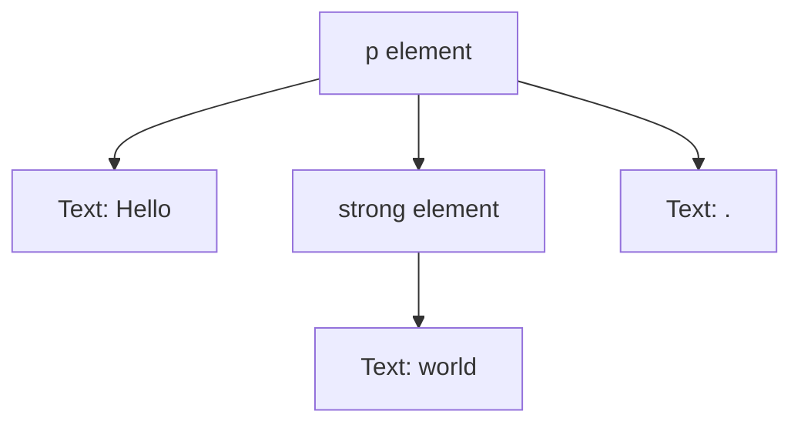
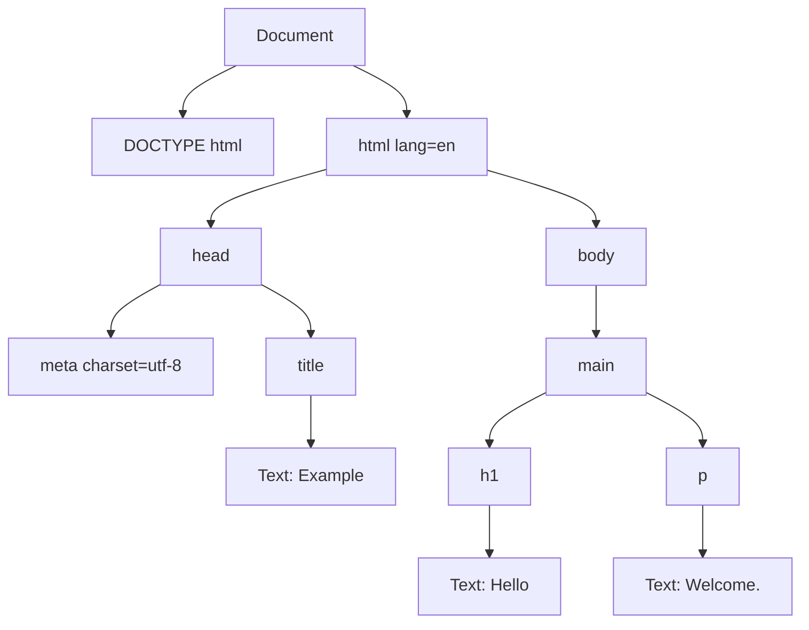
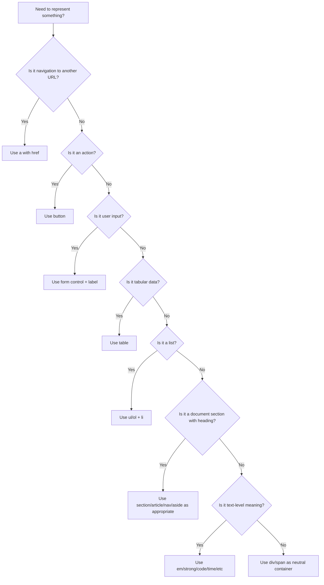

# Part 04 — HTML Fundamentals: Elements, Attributes, Trees, and Content Categories

## 1. Tujuan Part Ini

Part ini membahas grammar dasar HTML secara serius. Bukan karena kamu perlu menghafal semua tag, tetapi karena HTML adalah **structured language** yang menghasilkan tree. Browser, CSS, JavaScript, accessibility API, crawler, test runner, dan automation tools bekerja di atas tree itu.

Kesalahan umum saat belajar HTML adalah menganggap HTML sebagai teks yang kebetulan punya angle bracket. Akibatnya orang menulis markup berdasarkan tampilan, bukan berdasarkan struktur dan aturan nesting.

Target part ini:

- memahami element, tag, attribute, node, dan tree,
- membedakan markup source dan DOM hasil parsing,
- memahami global attributes,
- memahami boolean/enumerated attributes,
- memahami void elements,
- memahami content categories,
- memahami phrasing/flow/interactive/palpable content,
- memahami transparent content model,
- mengenali invalid HTML yang tetap terlihat bekerja,
- membangun kebiasaan menulis HTML yang valid, semantic, accessible, dan maintainable.

Mental model utama:

> HTML yang kamu tulis adalah input. DOM yang browser bangun adalah output. CSS dan accessibility bekerja pada output, bukan pada niatmu.

---

## 2. Element vs Tag vs Node

Istilah ini sering dicampur. Untuk engineering, bedakan dengan jelas.

## 2.1 Tag

Tag adalah token dalam source HTML.

```html
<p>Hello</p>
```

Di sini:

- `<p>` adalah start tag,
- `</p>` adalah end tag.

## 2.2 Element

Element adalah unit struktur yang direpresentasikan oleh tag dan kontennya.

```html
<p>Hello</p>
```

Element `p` terdiri dari:

- start tag `<p>`,
- content `Hello`,
- end tag `</p>`.

## 2.3 Node

Node adalah objek dalam DOM tree.

DOM dapat berisi:

- document node,
- element node,
- text node,
- comment node,
- attribute representation,
- document type node.

Source:

```html
<p>Hello <strong>world</strong>.</p>
```

Tree konseptual:



HTML source bukan DOM tree langsung. Browser melakukan parsing, error recovery, insertion mode, dan tree construction.

---

## 3. HTML Document Tree

Minimal dokumen:

```html
<!doctype html>
<html lang="en">
  <head>
    <meta charset="utf-8" />
    <title>Example</title>
  </head>
  <body>
    <main>
      <h1>Hello</h1>
      <p>Welcome.</p>
    </main>
  </body>
</html>
```

Tree konseptual:



CSS selector, DOM API, accessibility tree, dan layout engine beroperasi pada struktur semacam ini.

Contoh CSS:

```css
main > p {
  max-width: 65ch;
}
```

Selector ini tidak mencari teks source. Ia match DOM element `p` yang child langsung dari `main`.

---

## 4. Attribute: Data pada Element

Attribute memberikan informasi tambahan pada element.

```html
<a href="/cases/123" class="case-link" data-case-id="123">Open case</a>
```

Attribute:

| Attribute | Fungsi |
|---|---|
| `href` | URL tujuan hyperlink |
| `class` | token untuk styling/selection |
| `data-case-id` | custom data untuk app logic |

General form:

```html
<element attribute="value">Content</element>
```

Attribute value biasanya string. Browser/DOM API dapat memproyeksikannya menjadi tipe lain tergantung property.

---

## 5. Attribute vs DOM Property

HTML attribute dan DOM property berhubungan, tetapi tidak identik.

```html
<input id="amount" value="100" />
```

Di JavaScript:

```js
const input = document.querySelector("#amount");

console.log(input.getAttribute("value")); // initial attribute value
console.log(input.value);                 // current property value
```

Jika user mengubah nilai input, `input.value` berubah, tetapi attribute `value` di markup tidak otomatis berubah.

Mengapa ini penting untuk HTML/CSS?

- Form state tidak selalu tercermin pada attribute.
- CSS selector attribute membaca attribute, bukan dynamic property.
- Hydration mismatch bisa terjadi jika server HTML dan client state berbeda.
- Test automation perlu tahu apakah memeriksa attribute atau property.

Contoh:

```css
input[value=""] {
  border-color: red;
}
```

Ini tidak reliable untuk current input value karena selector membaca attribute, bukan live user input property.

---

## 6. Quoted vs Unquoted Attributes

Valid:

```html
<input type="text" name="caseId" />
<input type=text name=caseId />
```

Namun praktik production:

> Selalu quote attribute values.

Alasan:

- lebih konsisten,
- lebih aman untuk value yang mengandung spasi/simbol,
- lebih mudah dibaca,
- lebih stabil untuk formatter,
- mengurangi edge case parser.

Buruk:

```html
<a href=/cases/123?tab=audit log>Audit</a>
```

Value akan terpotong atau diparse tidak sesuai niat.

Baik:

```html
<a href="/cases/123?tab=audit%20log">Audit</a>
```

---

## 7. Boolean Attributes

Boolean attribute benar jika attribute hadir, salah jika tidak hadir.

Contoh:

```html
<input type="checkbox" checked />
<button disabled>Submit</button>
<option selected>Open</option>
```

Ini juga benar:

```html
<button disabled="disabled">Submit</button>
<button disabled="">Submit</button>
```

Yang sering salah:

```html
<button disabled="false">Submit</button>
```

Pada boolean attribute, presence matters. `disabled="false"` tetap disabled karena attribute hadir.

Rule:

```html
<button disabled>Submit</button>
```

atau hapus attribute:

```html
<button>Submit</button>
```

Dalam framework modern, pastikan binding boolean menghasilkan attribute presence/absence, bukan string `"false"`.

---

## 8. Enumerated Attributes

Beberapa attribute menerima daftar nilai tertentu.

Contoh:

```html
<button type="submit">Save</button>
<button type="button">Cancel</button>
```

`type` pada button adalah contoh attribute dengan nilai terbatas. Jika salah, browser menggunakan default tertentu.

Failure mode umum:

```html
<button>Cancel</button>
```

Di dalam form, default `button` adalah submit. Tombol cancel bisa tanpa sengaja submit form.

Lebih aman:

```html
<button type="button">Cancel</button>
<button type="submit">Save</button>
```

Rule enterprise form:

> Semua `<button>` di dalam form harus punya `type` eksplisit.

---

## 9. Global Attributes

Global attributes dapat dipakai pada semua HTML elements, walaupun efeknya bisa berbeda.

Yang paling sering penting:

| Attribute | Fungsi |
|---|---|
| `id` | unique identifier dalam dokumen |
| `class` | token klasifikasi/styling |
| `style` | inline style; gunakan sangat terbatas |
| `title` | advisory text; jangan jadikan satu-satunya informasi penting |
| `lang` | bahasa konten |
| `dir` | arah teks |
| `hidden` | menyembunyikan element dari rendering dan accessibility tree secara umum |
| `tabindex` | mengatur focusability/order; gunakan hati-hati |
| `data-*` | custom data attributes |
| `role` | ARIA role; gunakan jika native semantics tidak cukup |
| `aria-*` | accessibility states/properties |
| `contenteditable` | membuat konten editable |
| `inert` | membuat subtree tidak interaktif |

## 9.1 `id`

```html
<section id="audit-log">
  <h2>Audit log</h2>
</section>
```

`id` harus unik dalam dokumen.

Dipakai oleh:

- fragment navigation,
- label association,
- ARIA references,
- CSS selector,
- JavaScript selection.

Failure mode:

```html
<h2 id="status">Current status</h2>
<h2 id="status">Previous status</h2>
```

Duplicate ID menyebabkan anchor, ARIA, dan JS behavior tidak reliable.

## 9.2 `class`

```html
<article class="case-card case-card--urgent">...</article>
```

`class` berisi space-separated tokens. Gunakan untuk styling dan behavior hooks jika perlu.

Engineering rule:

- `class` untuk styling/component identity,
- `data-*` untuk state/configuration,
- ARIA untuk accessibility state,
- jangan campur semuanya tanpa disiplin.

## 9.3 `data-*`

```html
<tr data-case-id="REG-2026-001" data-status="escalated">
  ...
</tr>
```

Cocok untuk metadata aplikasi yang tidak punya semantic HTML attribute native.

CSS bisa membaca:

```css
tr[data-status="escalated"] {
  font-weight: 600;
}
```

Namun jangan menyimpan data sensitif di HTML hanya karena hidden secara visual. User bisa membaca source/DOM.

## 9.4 `hidden`

```html
<p hidden>This is not currently relevant.</p>
```

`hidden` berarti konten tidak relevan saat ini. Jangan gunakan untuk menyembunyikan visual saja jika konten masih harus tersedia untuk screen reader.

## 9.5 `tabindex`

```html
<div tabindex="0">Focusable custom region</div>
```

Gunakan sangat hati-hati.

Rules:

- `tabindex="0"`: masuk urutan tab natural.
- `tabindex="-1"`: bisa difokuskan via script, tidak masuk urutan tab.
- positive tabindex: hampir selalu anti-pattern.

Buruk:

```html
<button tabindex="5">Save</button>
<button tabindex="1">Cancel</button>
```

Ini menciptakan focus order artifisial yang sulit dipelihara.

---

## 10. Element Categories by Purpose

HTML punya banyak element. Jangan mulai dari menghafal semuanya. Mulai dari kategori fungsi:

| Kategori Praktis | Contoh |
|---|---|
| Document metadata | `title`, `meta`, `link`, `style`, `base` |
| Sectioning | `main`, `section`, `article`, `nav`, `aside` |
| Grouping content | `p`, `ul`, `ol`, `li`, `div`, `blockquote`, `figure` |
| Text-level semantics | `a`, `em`, `strong`, `code`, `time`, `span` |
| Embedded content | `img`, `picture`, `video`, `audio`, `iframe`, `svg` |
| Tabular data | `table`, `caption`, `thead`, `tbody`, `tr`, `th`, `td` |
| Forms | `form`, `label`, `input`, `textarea`, `select`, `button` |
| Interactive | `details`, `summary`, `dialog`, `button`, `a` |
| Scripting | `script`, `template`, `slot`, `canvas` |

Engineering principle:

> Pilih element berdasarkan meaning dan behavior bawaan, lalu style dengan CSS.

Jangan memilih element berdasarkan default appearance.

Buruk:

```html
<div class="button" onclick="saveCase()">Save</div>
```

Baik:

```html
<button type="button">Save</button>
```

Button native memberikan:

- keyboard activation,
- focus behavior,
- accessible role,
- disabled behavior,
- form integration.

---

## 11. Content Categories: Grammar HTML

HTML mendefinisikan content categories untuk menjelaskan element mana boleh berada di mana.

Kategori yang penting dipahami:

- metadata content,
- flow content,
- sectioning content,
- heading content,
- phrasing content,
- embedded content,
- interactive content,
- palpable content,
- script-supporting elements.

Ini bukan teori kosong. Ini menjawab pertanyaan seperti:

- Bolehkah `<div>` di dalam `<p>`?
- Bolehkah `<button>` di dalam `<a>`?
- Bolehkah `<a>` membungkus card?
- Bolehkah heading di dalam section?
- Bolehkah input berada di label?

---

## 12. Flow Content

Flow content adalah mayoritas konten yang boleh muncul di body.

Contoh:

- `div`,
- `p`,
- `section`,
- `article`,
- `header`,
- `footer`,
- `ul`,
- `ol`,
- `table`,
- `form`,
- `h1`-`h6`,
- `a`,
- `button`,
- `img`,
- `span`,
- text.

`body` umumnya menerima flow content.

```html
<body>
  <header>...</header>
  <main>
    <section>...</section>
  </main>
  <footer>...</footer>
</body>
```

Flow content adalah kategori besar, bukan berarti semua flow content boleh di semua tempat. Parent element tetap punya content model sendiri.

---

## 13. Phrasing Content

Phrasing content adalah konten inline/text-level yang membentuk paragraf.

Contoh:

- text,
- `a`,
- `span`,
- `strong`,
- `em`,
- `code`,
- `time`,
- `img`,
- `input`,
- `label`,
- `abbr`,
- `small`.

Contoh valid:

```html
<p>
  Case <strong>REG-2026-001</strong> was escalated on
  <time datetime="2026-06-26">26 June 2026</time>.
</p>
```

Contoh invalid:

```html
<p>
  Case summary:
  <div>Escalated to supervisor</div>
</p>
```

`div` bukan phrasing content. Browser akan menutup `<p>` sebelum `<div>`.

Source yang kamu tulis:

```html
<p>Case summary: <div>Escalated</div></p>
```

DOM yang mungkin terbentuk secara konseptual:

```html
<p>Case summary: </p>
<div>Escalated</div>
<p></p>
```

Dampaknya:

- CSS selector bisa tidak match sesuai ekspektasi,
- spacing berubah,
- accessibility structure membingungkan,
- test snapshot tidak sesuai.

---

## 14. Sectioning Content

Sectioning content membuat bagian dokumen.

Contoh:

- `article`,
- `section`,
- `nav`,
- `aside`.

`main` bukan sectioning content dalam pengertian yang sama, tetapi landmark utama dokumen.

Contoh:

```html
<main>
  <h1>Case REG-2026-001</h1>

  <section aria-labelledby="status-heading">
    <h2 id="status-heading">Status</h2>
    <p>Escalated.</p>
  </section>

  <section aria-labelledby="evidence-heading">
    <h2 id="evidence-heading">Evidence</h2>
    <p>3 documents attached.</p>
  </section>
</main>
```

Use `section` when:

- bagian punya heading,
- bagian adalah grouping tematis,
- bagian masuk akal di outline dokumen.

Jangan gunakan `section` sebagai pengganti `div` untuk styling.

Buruk:

```html
<section class="card">
  <p>Just a visual box.</p>
</section>
```

Lebih baik:

```html
<div class="card">
  <p>Just a visual box.</p>
</div>
```

Jika card adalah artikel mandiri:

```html
<article class="case-card">
  <h2>Case REG-2026-001</h2>
  <p>Escalated.</p>
</article>
```

---

## 15. Heading Content

Heading content:

- `h1`,
- `h2`,
- `h3`,
- `h4`,
- `h5`,
- `h6`,
- `hgroup` dalam penggunaan tertentu.

Heading membangun struktur navigasi dan pemahaman dokumen.

Baik:

```html
<h1>Case Detail</h1>
<section>
  <h2>Status</h2>
  <section>
    <h3>Status History</h3>
  </section>
</section>
```

Buruk:

```html
<h1>Case Detail</h1>
<h4>Status</h4>
<h2>Status History</h2>
```

Jangan memilih heading berdasarkan ukuran default. Gunakan CSS untuk ukuran.

```html
<h2 class="heading heading--small">Status</h2>
```

```css
.heading--small {
  font-size: 1rem;
}
```

---

## 16. Interactive Content

Interactive content adalah konten yang user dapat operasikan.

Contoh:

- `a` dengan `href`,
- `button`,
- `input`,
- `select`,
- `textarea`,
- `details`,
- `summary`,
- `label`,
- `iframe`,
- `audio controls`,
- `video controls`.

Rule penting:

> Jangan menaruh interactive content di dalam interactive content jika content model melarang atau behavior menjadi ambigu.

Buruk:

```html
<a href="/cases/123" class="case-card">
  <h2>Case REG-2026-001</h2>
  <button type="button">Archive</button>
</a>
```

Masalah:

- button di dalam link menciptakan target interaksi nested,
- keyboard/focus behavior membingungkan,
- screen reader output bisa buruk,
- click event conflict.

Lebih baik:

```html
<article class="case-card">
  <h2>
    <a href="/cases/123">Case REG-2026-001</a>
  </h2>
  <button type="button">Archive</button>
</article>
```

Jika seluruh card harus clickable, pertimbangkan pseudo overlay dengan link terpisah, tetapi jaga tombol tetap independen.

---

## 17. Palpable Content

Palpable content secara sederhana adalah konten yang menghasilkan sesuatu yang dapat dirasakan/dipresentasikan kepada user.

Contoh:

```html
<section>
  <h2>Evidence</h2>
  <p>No evidence uploaded.</p>
</section>
```

Section ini punya content nyata.

Buruk:

```html
<section></section>
```

Empty section biasanya smell. Untuk placeholder layout, pakai `div` atau render conditionally.

---

## 18. Embedded Content

Embedded content memasukkan resource lain ke dokumen.

Contoh:

- `img`,
- `picture`,
- `iframe`,
- `video`,
- `audio`,
- `canvas`,
- `svg`,
- `object`,
- `embed`.

Contoh image:

```html

```

Contoh SVG inline:

```html
<svg aria-hidden="true" width="16" height="16" viewBox="0 0 16 16">
  <path d="M8 1.5l6 11H2l6-11z" />
</svg>
```

Jika SVG dekoratif, gunakan `aria-hidden="true"`. Jika informatif, beri accessible name.

---

## 19. Metadata Content

Metadata content berada di `<head>`.

Contoh:

```html
<head>
  <meta charset="utf-8" />
  <meta name="viewport" content="width=device-width, initial-scale=1" />
  <title>Case Dashboard</title>
  <link rel="stylesheet" href="/assets/app.css" />
</head>
```

Jangan menaruh visible UI content di `<head>`.

---

## 20. Script-Supporting Elements

Beberapa element mendukung script/template behavior.

Contoh:

```html
<template id="case-row-template">
  <tr>
    <td data-slot="case-id"></td>
    <td data-slot="status"></td>
  </tr>
</template>
```

`template` content tidak langsung dirender. Ia disimpan sebagai fragment yang bisa dikloning oleh JavaScript.

Ini berguna untuk:

- serverless enhancement,
- small widgets,
- custom elements,
- repeated DOM structures.

Tetapi dalam framework modern, template biasanya diwakili oleh JSX/SFC/template syntax framework.

---

## 21. Void Elements

Void elements tidak punya end tag dan tidak boleh punya content.

Contoh umum:

- `area`,
- `base`,
- `br`,
- `col`,
- `embed`,
- `hr`,
- `img`,
- `input`,
- `link`,
- `meta`,
- `source`,
- `track`,
- `wbr`.

Benar:

```html

<input type="text" name="caseId" />
<meta charset="utf-8" />
```

Salah secara model:

```html
Logo</img>
```

`img` tidak membungkus text. Jika butuh caption:

```html
<figure>
  
  <figcaption>Company logo</figcaption>
</figure>
```

Catatan: slash pada `` dalam HTML bukan XML self-closing requirement. Ia sering dipakai untuk konsistensi gaya, tetapi HTML parser memperlakukan void element berdasarkan definisi element, bukan slash.

---

## 22. Optional End Tags

HTML mengizinkan beberapa end tag dihilangkan dalam kondisi tertentu.

Contoh valid:

```html
<ul>
  <li>Open
  <li>Escalated
  <li>Closed
</ul>
```

Namun praktik production:

```html
<ul>
  <li>Open</li>
  <li>Escalated</li>
  <li>Closed</li>
</ul>
```

Rule:

> Tulis end tag eksplisit kecuali ada alasan kuat. Maintainability lebih penting daripada minimalism.

Optional end tag bisa membuat diff dan debugging lebih sulit.

---

## 23. Transparent Content Model

Beberapa element memiliki transparent content model. Artinya content yang boleh di dalamnya bergantung pada parent context.

Contoh paling penting: `a`.

```html
<p>
  Read the <a href="/policy">enforcement policy</a> before submitting.
</p>
```

Di dalam `p`, `a` boleh berisi phrasing content.

HTML modern juga memungkinkan link membungkus block-level content dalam konteks tertentu:

```html
<a href="/cases/123" class="case-card">
  <article>
    <h2>Case REG-2026-001</h2>
    <p>Escalated for review.</p>
  </article>
</a>
```

Namun tetap ada batasan: jangan masukkan interactive content seperti button ke dalam link.

Transparent content model menjelaskan kenapa jawaban “bolehkah `<a>` membungkus div?” tidak cukup dijawab absolut. Harus dilihat context dan child content-nya.

---

## 24. Nesting Rules That Matter in Real Projects

## 24.1 Jangan Taruh `div` di Dalam `p`

Buruk:

```html
<p>
  Summary
  <div>Escalated</div>
</p>
```

Baik:

```html
<div>
  <p>Summary</p>
  <div>Escalated</div>
</div>
```

atau:

```html
<p>
  Summary <span>Escalated</span>
</p>
```

## 24.2 Jangan Nested Button

Buruk:

```html
<button type="button">
  Open actions
  <button type="button">Delete</button>
</button>
```

Baik:

```html
<div class="action-group">
  <button type="button">Open actions</button>
  <button type="button">Delete</button>
</div>
```

## 24.3 Jangan Button di Dalam Link

Buruk:

```html
<a href="/cases/123">
  Case detail
  <button type="button">Archive</button>
</a>
```

Baik:

```html
<a href="/cases/123">Case detail</a>
<button type="button">Archive</button>
```

## 24.4 List Harus Punya List Items

Buruk:

```html
<ul>
  <div>Open</div>
  <div>Closed</div>
</ul>
```

Baik:

```html
<ul>
  <li>Open</li>
  <li>Closed</li>
</ul>
```

## 24.5 Table Structure Harus Konsisten

Buruk:

```html
<table>
  <div>Case REG-001</div>
</table>
```

Baik:

```html
<table>
  <caption>Cases</caption>
  <thead>
    <tr>
      <th scope="col">Case ID</th>
      <th scope="col">Status</th>
    </tr>
  </thead>
  <tbody>
    <tr>
      <td>REG-001</td>
      <td>Open</td>
    </tr>
  </tbody>
</table>
```

---

## 25. `div` and `span`: Neutral Containers

`div` dan `span` tidak salah. Yang salah adalah memakainya saat ada element semantik yang lebih tepat.

`div` adalah generic block-level grouping.

```html
<div class="toolbar">
  <button type="button">Approve</button>
  <button type="button">Reject</button>
</div>
```

`span` adalah generic phrasing container.

```html
<p>
  Status: <span class="status status--escalated">Escalated</span>
</p>
```

Gunakan `div`/`span` ketika:

- grouping hanya visual/layout,
- tidak ada semantic element tepat,
- kamu butuh styling hook,
- kamu tidak ingin menambah landmark/section semantics.

Jangan gunakan `div` untuk mengganti:

- `button`,
- `a`,
- `label`,
- `input`,
- `table`,
- `ul/ol/li`,
- heading.

---

## 26. Native Semantics First

HTML elements punya semantic dan behavior bawaan.

| Kebutuhan | Element yang tepat |
|---|---|
| Navigasi ke URL | `<a href="...">` |
| Menjalankan aksi | `<button type="button">` |
| Submit form | `<button type="submit">` |
| Input teks | `<input type="text">` |
| Pilihan banyak | checkbox / select sesuai konteks |
| Data tabular | `<table>` |
| Daftar item | `<ul>` / `<ol>` |
| Bagian dokumen | `<section>` dengan heading |
| Konten mandiri | `<article>` |
| Navigasi utama | `<nav>` |
| Konten utama | `<main>` |

Anti-pattern:

```html
<div role="button" tabindex="0" onclick="saveCase()">Save</div>
```

Ini mencoba membangun ulang behavior native. Kamu harus menambahkan:

- keyboard Enter,
- keyboard Space,
- focus styling,
- disabled state,
- accessible name,
- pressed state jika toggle,
- form integration jika relevan.

Lebih baik:

```html
<button type="button">Save</button>
```

---

## 27. Comments

HTML comment:

```html
<!-- Audit log is server-rendered for regulatory traceability. -->
<section id="audit-log">...</section>
```

Gunakan comment untuk menjelaskan keputusan yang tidak terlihat dari markup.

Jangan gunakan comment untuk menyimpan informasi sensitif:

```html
<!-- TODO: temporary admin password: ... -->
```

HTML dikirim ke client. User dapat melihatnya.

---

## 28. Whitespace and Text Nodes

HTML whitespace sering collapse secara visual, tetapi tetap bisa menjadi text node.

```html
<button>
  Save
</button>
```

Accessible name umumnya tetap `Save`, tetapi whitespace dapat mempengaruhi inline layout tertentu.

Contoh inline spacing:

```html
<a href="/one">One</a><a href="/two">Two</a>
```

Tidak ada whitespace antara link.

```html
<a href="/one">One</a>
<a href="/two">Two</a>
```

Ada whitespace text node di antara link yang bisa mempengaruhi visual inline layout.

Di CSS modern, lebih baik gunakan layout:

```html
<nav class="nav-links">
  <a href="/one">One</a>
  <a href="/two">Two</a>
</nav>
```

```css
.nav-links {
  display: flex;
  gap: 1rem;
}
```

Jangan mengandalkan whitespace source untuk layout.

---

## 29. Entity References and Escaping

HTML memakai character references untuk karakter tertentu.

```html
<p>Use &lt;button&gt; for actions.</p>
<p>Tom &amp; Jerry</p>
```

Penting untuk security dan correctness:

- `<` dalam text harus di-escape,
- `&` dalam beberapa context harus di-escape,
- user-generated content harus di-escape oleh templating system,
- jangan inject raw HTML dari user.

Buruk:

```html
<p>User note: <script>alert(1)</script></p>
```

Baik secara output escaping:

```html
<p>User note: &lt;script&gt;alert(1)&lt;/script&gt;</p>
```

HTML escaping adalah bagian dari security boundary, terutama pada server-rendered apps.

---

## 30. Invalid HTML That Appears to Work

## 30.1 Paragraph Auto-Closing

Source:

```html
<p>Before<div>Inside?</div>After</p>
```

Konsekuensi:

- browser menutup `p` sebelum `div`,
- `After` mungkin menjadi text node di lokasi berbeda,
- DOM tidak sama dengan source.

## 30.2 Nested Interactive Content

Source:

```html
<button type="button">
  More
  <a href="/details">Details</a>
</button>
```

Konsekuensi:

- activation behavior ambigu,
- keyboard navigation buruk,
- accessibility tree membingungkan.

## 30.3 Duplicate IDs

Source:

```html
<label for="status">Status</label>
<input id="status" />
<select id="status"></select>
```

Konsekuensi:

- label association tidak reliable,
- `document.getElementById` hanya mengembalikan satu,
- fragment navigation ambigu.

## 30.4 Fake Disabled Link

Source:

```html
<a href="/delete" disabled>Delete</a>
```

`disabled` tidak punya efek native pada anchor. Link tetap link.

Lebih baik:

- jangan render link jika tidak tersedia,
- gunakan button disabled untuk action,
- gunakan `aria-disabled` dengan event handling hati-hati jika benar-benar perlu.

## 30.5 Missing Button Type

Source:

```html
<form>
  <button>Cancel</button>
</form>
```

Konsekuensi:

- default submit,
- user klik cancel malah submit form.

---

## 31. Validator Mindset

HTML validator bukan hanya alat akademis. Ia membantu menangkap:

- nesting salah,
- duplicate attributes,
- obsolete attributes,
- missing required attributes,
- invalid child content,
- invalid ARIA references tertentu,
- broken document structure.

Namun validator tidak cukup untuk memastikan:

- UX bagus,
- accessibility interaction benar,
- responsive layout benar,
- business workflow benar,
- security aman.

Gunakan validator sebagai first line of defense, bukan satu-satunya quality gate.

---

## 32. HTML as API Contract

Dalam aplikasi modern, HTML sering menjadi boundary antara:

- server dan browser,
- framework dan DOM,
- component dan CSS,
- UI dan assistive technology,
- test automation dan product behavior.

Contoh component contract:

```html
<article class="case-card" data-status="escalated">
  <h2 class="case-card__title">
    <a href="/cases/REG-2026-001">Case REG-2026-001</a>
  </h2>
  <p class="case-card__summary">Escalated to supervisory review.</p>
  <dl class="case-card__metadata">
    <dt>Owner</dt>
    <dd>Risk Operations</dd>
    <dt>Updated</dt>
    <dd><time datetime="2026-06-26">26 June 2026</time></dd>
  </dl>
</article>
```

Kontraknya:

- article adalah unit mandiri,
- heading memberi nama unit,
- link mengarah ke detail,
- status tersedia sebagai data attribute,
- metadata memakai description list,
- waktu machine-readable lewat `datetime`.

CSS dan JS bisa bekerja di atas struktur yang stabil.

---

## 33. Decision Tree Memilih Element



---

## 34. Practice 1: Fix Invalid Markup

Given:

```html
<div class="case-card" onclick="location.href='/cases/123'">
  <p>
    <div class="status">Escalated</div>
  </p>
  <div class="title">Case REG-2026-001</div>
  <div class="actions">
    <a href="/cases/123">
      Open
      <button>Archive</button>
    </a>
  </div>
</div>
```

Problems:

- clickable `div`,
- `div` inside `p`,
- heading represented as `div`,
- nested interactive content,
- button missing type,
- action mixed with navigation.

Better:

```html
<article class="case-card" data-status="escalated">
  <p class="case-card__status">Escalated</p>

  <h2 class="case-card__title">
    <a href="/cases/123">Case REG-2026-001</a>
  </h2>

  <div class="case-card__actions" aria-label="Case actions">
    <a href="/cases/123">Open</a>
    <button type="button">Archive</button>
  </div>
</article>
```

Further improvement depends on product behavior:

- Is archive immediately destructive?
- Does it need confirmation?
- Should it be a form submit?
- Should status be a badge or text?
- Does the card need summary metadata?

---

## 35. Practice 2: Build a Valid Case Summary Component

Requirements:

1. Component represents one case.
2. It has a heading.
3. Heading links to detail page.
4. It displays status.
5. It displays owner.
6. It displays last updated date machine-readably.
7. It has two actions: assign and close.
8. Actions must not be nested inside the detail link.
9. Buttons must have explicit type.
10. No invalid nesting.

Example solution:

```html
<article class="case-summary" data-status="open">
  <header class="case-summary__header">
    <h2 class="case-summary__title">
      <a href="/cases/REG-2026-001">Case REG-2026-001</a>
    </h2>
    <p class="case-summary__status">Open</p>
  </header>

  <dl class="case-summary__metadata">
    <dt>Owner</dt>
    <dd>Risk Operations</dd>

    <dt>Last updated</dt>
    <dd>
      <time datetime="2026-06-26T09:30:00+07:00">26 June 2026, 09:30</time>
    </dd>
  </dl>

  <div class="case-summary__actions" aria-label="Case actions">
    <button type="button">Assign</button>
    <button type="button">Close</button>
  </div>
</article>
```

Review:

- article has standalone meaning,
- heading names the article,
- link is only the navigational text,
- actions are separate buttons,
- metadata uses `dl`,
- time has machine-readable value,
- status can be selected by `data-status`.

---

## 36. Practice 3: Predict the DOM

Source:

```html
<p>Alpha<div>Beta</div>Gamma</p>
```

Question: What structure does the browser likely produce?

Expected mental answer:

```html
<p>Alpha</p>
<div>Beta</div>
Gamma
<p></p>
```

Exact parser behavior depends on insertion rules, but the important point is:

> The `div` does not remain inside the paragraph.

Use DevTools Elements panel to inspect actual DOM.

---

## 37. Code Review Checklist for HTML Fundamentals

When reviewing HTML, ask:

### Structure

- Is the document tree valid?
- Are headings in logical order?
- Are sections actually sections?
- Are lists represented as lists?
- Is tabular data represented as table?

### Attributes

- Are IDs unique?
- Are labels correctly associated?
- Are boolean attributes used correctly?
- Are button types explicit?
- Are data attributes appropriate and non-sensitive?

### Semantics

- Is navigation represented by links?
- Are actions represented by buttons?
- Are form controls native where possible?
- Are generic div/span used only when semantics are absent?

### Nesting

- No block content inside `p`.
- No nested buttons.
- No button inside link.
- No invalid list children.
- No malformed table structure.

### Accessibility

- Interactive elements are keyboard reachable.
- Accessible names are available.
- `title` attribute is not the only source of critical info.
- `aria-*` is not used to cover avoidable bad HTML.

---

## 38. Common Misconceptions

## 38.1 “HTML Is Easy”

HTML is forgiving, not trivial. The forgiving parser hides mistakes until they become accessibility, automation, or layout bugs.

## 38.2 “Div Is Fine Because CSS Can Style Anything”

CSS can style anything, but CSS cannot automatically restore native semantics and interaction behavior.

## 38.3 “ARIA Can Fix It”

ARIA can supplement semantics, but native elements usually provide stronger behavior with less code.

## 38.4 “If It Looks Right, It Is Right”

Visual correctness is only one output. HTML also outputs:

- DOM structure,
- accessibility tree,
- keyboard behavior,
- form behavior,
- link/navigation behavior,
- machine-readable metadata.

## 38.5 “The Browser Accepted It, So It Is Valid”

Browser error recovery is compatibility behavior, not validation.

---

## 39. Summary

HTML fundamentals are about tree correctness and semantic contracts.

Key ideas:

- Tag is source syntax; element is structural unit; node is DOM representation.
- Browser parses source into DOM, sometimes correcting invalid markup.
- Attributes provide element metadata and behavior configuration.
- Boolean attributes are true by presence, not by string value.
- Global attributes are powerful but easy to misuse.
- Content categories define what can appear where.
- Phrasing content belongs in paragraphs; `div` does not.
- Interactive content must not be nested carelessly.
- Void elements do not contain content.
- `div` and `span` are neutral, not evil.
- Native semantics should be preferred over recreated custom semantics.
- Valid HTML reduces downstream bugs in CSS, JavaScript, accessibility, testing, and production debugging.

Next part will build on this grammar to discuss **semantic HTML**: how to model documents with headings, landmarks, sectioning, article/section/nav/aside/main, lists, figures, quotes, code, time, and semantic decision-making for real product screens.

---

## 40. References

- WHATWG HTML Living Standard: https://html.spec.whatwg.org/
- WHATWG HTML — Element content categories: https://html.spec.whatwg.org/multipage/indices.html
- WHATWG HTML — Introduction and conformance: https://html.spec.whatwg.org/multipage/introduction.html
- MDN — HTML elements reference: https://developer.mozilla.org/en-US/docs/Web/HTML/Reference/Elements
- MDN — HTML global attributes: https://developer.mozilla.org/en-US/docs/Web/HTML/Reference/Global_attributes
- MDN — Content categories: https://developer.mozilla.org/en-US/docs/Web/HTML/Guides/Content_categories
