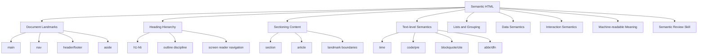
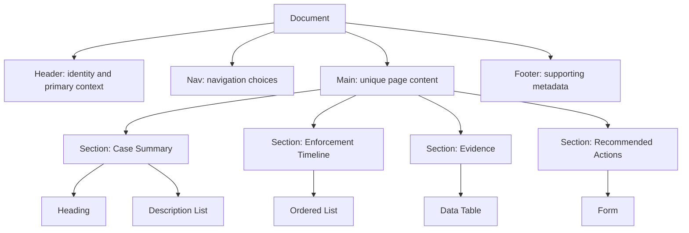
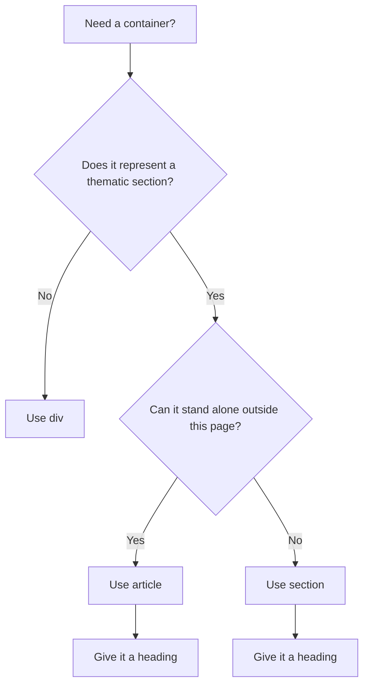
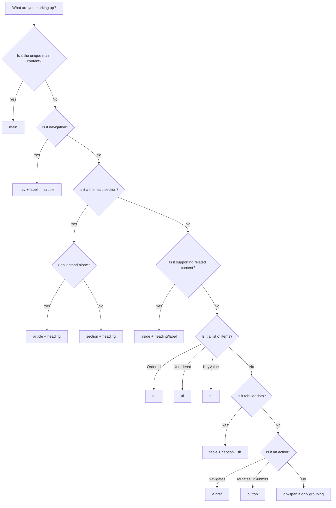

# Part 05 — Semantic HTML: Building Meaningful Documents

## 1. Posisi Part Ini Dalam Roadmap

Pada part sebelumnya, kita membahas grammar HTML: element, attribute, tree, content category, dan kenapa markup yang salah sering tetap “jalan” di browser. Part ini naik satu level: **bagaimana memilih elemen HTML berdasarkan makna, bukan berdasarkan tampilan**.

HTML bukan sekadar cara membuat teks muncul di layar. HTML adalah kontrak struktur antara:

- author/developer,
- browser,
- search engine,
- screen reader,
- user agent non-visual,
- automated testing,
- crawler,
- reader mode,
- translation tools,
- form tools,
- dan sistem lain yang membaca dokumen.

Seorang software engineer yang kuat tidak menulis HTML seperti ini:

```html
<div class="title">Case Detail</div>
<div class="menu">...</div>
<div class="box">...</div>
<div class="button">Submit</div>
```

Ia menulis struktur dengan kontrak makna:

```html
<header>
  <h1>Case Detail</h1>
</header>

<nav aria-label="Case sections">
  ...
</nav>

<main>
  <section aria-labelledby="case-summary-title">
    <h2 id="case-summary-title">Case Summary</h2>
    ...
  </section>
</main>

<button type="submit">Submit</button>
```

Perbedaannya bukan kosmetik. Perbedaannya adalah: dokumen kedua bisa dipahami oleh browser dan assistive technology tanpa harus menebak dari class CSS.

---

## 2. Hubungan Dengan Framework “The First 20 Hours”

Josh Kaufman menekankan empat hal besar dalam skill acquisition:

1. **Deconstruct the skill** menjadi bagian kecil.
2. **Learn enough to self-correct**.
3. **Remove barriers to practice**.
4. **Practice deliberately for at least 20 hours**.

Untuk semantic HTML, kita tidak perlu menghafal semua elemen di awal. Yang perlu dikuasai adalah kemampuan memilih elemen yang benar untuk 90% kasus UI.

### Target Performa Part Ini

Setelah menyelesaikan part ini, kamu harus bisa:

- membedakan struktur dokumen dari styling;
- memilih `main`, `nav`, `header`, `footer`, `section`, `article`, `aside` secara benar;
- menyusun heading hierarchy yang tidak rusak;
- menggunakan list, figure, blockquote, time, address, code, pre secara tepat;
- menghindari `div soup`;
- melakukan semantic review pada halaman aplikasi internal;
- membangun skeleton HTML untuk halaman enterprise seperti dashboard, case detail, workflow, dan audit trail.

### Skill yang Didekonstruksi



---

## 3. Mental Model: HTML Is a Meaning Tree

HTML membentuk tree. Tetapi semantic HTML membentuk **meaning tree**.



CSS boleh mengubah tampilan. Tetapi semantic tree harus tetap masuk akal bahkan jika CSS dimatikan.

Coba buka halaman HTML tanpa CSS. Jika urutan dokumen masih bisa dibaca, heading-nya jelas, navigasi bisa dikenali, form bisa dipakai, dan tabel masih bermakna, maka HTML kamu berada di jalur yang benar.

---

## 4. Prinsip Dasar Semantic HTML

### 4.1 Semantics Is Not About Pretty Markup

Semantic HTML bukan tentang membuat source code terlihat rapi. Semantic HTML adalah tentang **representasi makna yang bisa diproses**.

Contoh buruk:

```html
<div class="heading-large">Investigation Summary</div>
<div class="paragraph">This case was escalated due to repeated violations.</div>
```

Masalah:

- browser tidak tahu bahwa teks pertama adalah heading;
- screen reader tidak bisa membuat navigasi heading;
- automated accessibility testing akan kehilangan struktur;
- reader mode dan crawler tidak punya sinyal yang kuat;
- CSS class menjadi satu-satunya pembawa makna.

Contoh lebih baik:

```html
<section aria-labelledby="investigation-summary-title">
  <h2 id="investigation-summary-title">Investigation Summary</h2>
  <p>This case was escalated due to repeated violations.</p>
</section>
```

Makna tidak lagi bergantung pada class.

### 4.2 Use Native Semantics First

Urutan prioritas:

1. pakai elemen HTML native;
2. jika native tidak cukup, pakai attribute HTML yang tepat;
3. jika masih tidak cukup, baru pertimbangkan ARIA;
4. jika butuh ARIA terlalu banyak, kemungkinan desain interaksinya perlu ditinjau ulang.

Contoh:

```html
<button>Approve case</button>
```

Lebih baik daripada:

```html
<div role="button" tabindex="0">Approve case</div>
```

Karena `button` sudah membawa:

- role button,
- keyboard behavior,
- focusability,
- disabled behavior,
- form association,
- default interaction semantics.

### 4.3 Structure Before Style

Jangan mulai dari “saya ingin layout dua kolom”. Mulai dari:

- apa informasi utama halaman?
- apa navigasi?
- apa bagian dokumen?
- apa heading masing-masing bagian?
- apa yang list?
- apa yang tabel?
- apa yang action?
- apa yang status?
- apa yang metadata?

Setelah struktur jelas, CSS tinggal membuatnya tampil sesuai desain.

---

## 5. Heading Hierarchy

Heading adalah tulang belakang dokumen. Banyak user screen reader menavigasi halaman melalui daftar heading. Search engine dan tools lain juga memakai heading sebagai sinyal struktur, meskipun bukan satu-satunya sinyal.

### 5.1 Aturan Praktis

Gunakan heading untuk membentuk outline dokumen:

```html
<h1>Case Detail</h1>

<h2>Case Summary</h2>
<h2>Involved Parties</h2>
<h2>Evidence</h2>
<h2>Enforcement Timeline</h2>
<h2>Recommended Actions</h2>
```

Jika ada subbagian:

```html
<h2>Evidence</h2>

<h3>Uploaded Documents</h3>
<h3>External Reports</h3>
<h3>Officer Notes</h3>
```

### 5.2 Jangan Pilih Heading Karena Ukuran Font

Buruk:

```html
<h4>Case Detail</h4>
```

Dipilih karena desainnya kecil.

Benar:

```html
<h1 class="page-title">Case Detail</h1>
```

Lalu CSS mengatur ukuran:

```css
.page-title {
  font-size: 1.5rem;
}
```

HTML menjelaskan makna. CSS menjelaskan tampilan.

### 5.3 Jangan Lompat Level Tanpa Alasan

Hindari:

```html
<h1>Case Detail</h1>
<h4>Evidence</h4>
```

Lebih baik:

```html
<h1>Case Detail</h1>
<h2>Evidence</h2>
```

Lompatan heading tidak selalu invalid secara parsing, tetapi biasanya menandakan struktur yang kacau. Dalam sistem enterprise besar, heading yang kacau membuat halaman sulit dinavigasi, sulit diuji, dan sulit direview.

### 5.4 Satu `h1` atau Banyak `h1`?

Secara teknis HTML modern tidak melarang banyak `h1`. Namun untuk aplikasi dan dokumentasi produksi, gunakan aturan sederhana:

- satu `h1` untuk topik utama halaman;
- `h2` untuk section utama;
- `h3` dan seterusnya untuk subseksi.

Ini lebih predictable untuk user, tester, dan engineer lain.

### 5.5 Heading Untuk Komponen Reusable

Masalah umum di component-based UI:

```html
<Card title="Evidence" />
<Card title="Officer Notes" />
```

Komponen `Card` tidak tahu apakah title harus `h2`, `h3`, atau `h4`.

Solusi yang lebih baik: parent menentukan heading level atau komponen menerima slot heading.

```html
<section class="case-section" aria-labelledby="evidence-title">
  <h2 id="evidence-title">Evidence</h2>

  <article class="card" aria-labelledby="uploaded-documents-title">
    <h3 id="uploaded-documents-title">Uploaded Documents</h3>
    ...
  </article>
</section>
```

Dalam design system, jangan hard-code semua card title sebagai `h2`.

---

## 6. Landmark Elements

Landmark membantu user memahami wilayah utama halaman.

Elemen penting:

- `main`
- `nav`
- `header`
- `footer`
- `aside`
- `section` dengan accessible name
- `form` dengan accessible name dalam beberapa konteks

### 6.1 `main`

`main` berisi konten utama yang unik untuk halaman.

```html
<body>
  <header>...</header>
  <nav aria-label="Primary navigation">...</nav>

  <main>
    <h1>Case Detail</h1>
    ...
  </main>
</body>
```

Aturan praktis:

- biasanya satu `main` per halaman;
- jangan taruh global navigation di dalam `main`;
- jangan taruh footer global di dalam `main`;
- skip link biasanya menuju `main`.

```html
<a class="skip-link" href="#main-content">Skip to main content</a>

<main id="main-content">
  <h1>Case Detail</h1>
</main>
```

### 6.2 `nav`

`nav` untuk blok navigasi utama atau penting, bukan semua kumpulan link.

Baik:

```html
<nav aria-label="Primary navigation">
  <ul>
    <li><a href="/cases">Cases</a></li>
    <li><a href="/reports">Reports</a></li>
    <li><a href="/settings">Settings</a></li>
  </ul>
</nav>
```

Baik untuk navigasi lokal:

```html
<nav aria-label="Case sections">
  <ul>
    <li><a href="#summary">Summary</a></li>
    <li><a href="#evidence">Evidence</a></li>
    <li><a href="#timeline">Timeline</a></li>
  </ul>
</nav>
```

Tidak perlu:

```html
<nav>
  <a href="/terms">Terms</a>
</nav>
```

Satu link kecil di footer belum tentu perlu `nav`, kecuali memang bagian navigasi yang signifikan.

### 6.3 Multiple `nav` Must Be Named

Jika halaman punya lebih dari satu `nav`, beri label:

```html
<nav aria-label="Primary navigation">...</nav>
<nav aria-label="Case navigation">...</nav>
<nav aria-label="Pagination">...</nav>
```

Tanpa label, screen reader mungkin hanya mengumumkan beberapa “navigation” tanpa konteks.

### 6.4 `header`

`header` adalah konten pembuka untuk page atau section.

Global header:

```html
<header class="app-header">
  <a href="/" class="brand">RegOps</a>
  <nav aria-label="Primary navigation">...</nav>
</header>
```

Section header:

```html
<section aria-labelledby="evidence-title">
  <header>
    <h2 id="evidence-title">Evidence</h2>
    <p>Documents and references collected during investigation.</p>
  </header>
  ...
</section>
```

`header` tidak selalu berarti top-of-page. Ia bisa menjadi header untuk section atau article.

### 6.5 `footer`

`footer` berisi metadata atau informasi penutup untuk page/section.

Global footer:

```html
<footer>
  <p>&copy; 2026 Example Regulatory Platform</p>
</footer>
```

Article footer:

```html
<article>
  <h2>Enforcement Notice Published</h2>
  <p>...</p>
  <footer>
    <p>Published by Enforcement Operations Unit</p>
  </footer>
</article>
```

### 6.6 `aside`

`aside` untuk konten yang berhubungan tetapi bukan alur utama.

Contoh:

```html
<main>
  <article>
    <h1>Case Detail</h1>
    ...
  </article>

  <aside aria-labelledby="case-context-title">
    <h2 id="case-context-title">Related Context</h2>
    <ul>
      <li><a href="/cases/123/history">Case history</a></li>
      <li><a href="/entities/acme">Entity profile</a></li>
    </ul>
  </aside>
</main>
```

`aside` bukan sinonim “sidebar”. Sidebar yang berisi primary navigation lebih tepat `nav`.

---

## 7. Sectioning Content

Elemen sectioning umum:

- `section`
- `article`
- `nav`
- `aside`

### 7.1 `section`

Gunakan `section` untuk bagian tematik dari dokumen. Hampir selalu perlu heading.

Baik:

```html
<section aria-labelledby="risk-assessment-title">
  <h2 id="risk-assessment-title">Risk Assessment</h2>
  <p>...</p>
</section>
```

Buruk:

```html
<section>
  <div class="card">...</div>
</section>
```

Jika tidak bisa memberi heading yang bermakna, mungkin kamu hanya butuh `div`.

### 7.2 `article`

`article` untuk konten yang bisa berdiri sendiri atau didistribusikan ulang.

Cocok untuk:

- blog post,
- news item,
- comment,
- case note,
- audit log entry,
- notification item,
- activity feed item.

Contoh audit log:

```html
<article class="audit-entry" aria-labelledby="audit-101-title">
  <h3 id="audit-101-title">Status changed to Escalated</h3>
  <p>
    <time datetime="2026-06-26T09:30:00+07:00">
      26 June 2026, 09:30
    </time>
  </p>
  <p>Changed by Enforcement Officer A.</p>
</article>
```

Kenapa `article`? Karena tiap entry dapat berdiri sendiri sebagai unit informasi.

### 7.3 `section` vs `article`

Decision rule:

- Apakah konten ini bagian dari topik besar dan bergantung pada konteks halaman? Gunakan `section`.
- Apakah konten ini bisa berdiri sendiri jika diambil keluar dari halaman? Gunakan `article`.
- Apakah hanya wrapper untuk layout/styling? Gunakan `div`.



### 7.4 Nested Sections

Baik:

```html
<main>
  <h1>Case Detail</h1>

  <section aria-labelledby="evidence-title">
    <h2 id="evidence-title">Evidence</h2>

    <section aria-labelledby="documents-title">
      <h3 id="documents-title">Documents</h3>
      ...
    </section>

    <section aria-labelledby="witness-title">
      <h3 id="witness-title">Witness Statements</h3>
      ...
    </section>
  </section>
</main>
```

Nested section harus mencerminkan nested meaning, bukan nested CSS layout.

---

## 8. Grouping Content

### 8.1 Paragraph: `p`

Gunakan `p` untuk paragraf, bukan untuk membungkus semua hal.

Benar:

```html
<p>This case was escalated because three consecutive reporting deadlines were missed.</p>
```

Buruk:

```html
<p>
  <div>Case status: Escalated</div>
</p>
```

`p` tidak boleh membungkus block content seperti `div`.

### 8.2 Lists: `ul`, `ol`, `li`

Gunakan list ketika item memang merupakan kumpulan yang setara.

Unordered list:

```html
<ul>
  <li>Missing monthly report</li>
  <li>Incomplete beneficial ownership declaration</li>
  <li>Delayed corrective action response</li>
</ul>
```

Ordered list:

```html
<ol>
  <li>Submit initial assessment.</li>
  <li>Review evidence.</li>
  <li>Escalate case if risk threshold is exceeded.</li>
</ol>
```

Dalam UI enterprise, list sering tersembunyi oleh desain card/grid. Tetapi jika secara makna kontennya adalah daftar, tetap gunakan list.

### 8.3 Description List: `dl`, `dt`, `dd`

Sangat berguna untuk metadata, key-value, summary panel, dan detail entity.

```html
<dl>
  <div>
    <dt>Case ID</dt>
    <dd>CASE-2026-00042</dd>
  </div>
  <div>
    <dt>Status</dt>
    <dd>Escalated</dd>
  </div>
  <div>
    <dt>Assigned Officer</dt>
    <dd>Jane Doe</dd>
  </div>
</dl>
```

`dl` lebih semantik daripada table jika datanya berupa pasangan istilah-deskripsi atau key-value, bukan matriks data.

### 8.4 `figure` and `figcaption`

Gunakan untuk konten ilustratif yang punya caption.

```html
<figure>
  
  <figcaption>Risk score trend for ACME Corp, January–June 2026.</figcaption>
</figure>
```

Jika caption menjelaskan gambar, `figure` membuat relasi itu eksplisit.

### 8.5 `hr`

`hr` bukan sekadar garis visual. Ia mewakili thematic break.

Benar:

```html
<p>The initial assessment concluded that the breach was minor.</p>
<hr />
<p>After new evidence was submitted, the case was escalated.</p>
```

Jika hanya butuh border visual, gunakan CSS.

---

## 9. Text-Level Semantics

Text-level semantics sering diabaikan, padahal sangat berguna dalam dokumen kompleks.

### 9.1 `strong` vs `b`

`strong` berarti importance.

```html
<p><strong>Action required:</strong> Submit the remediation plan before 30 June.</p>
```

`b` hanya menarik perhatian tanpa importance semantik.

```html
<p><b>New</b> regulation update available.</p>
```

Dalam aplikasi enterprise, biasanya `strong` lebih sering benar daripada `b`, tetapi jangan pakai `strong` hanya untuk bold style.

### 9.2 `em` vs `i`

`em` berarti stress emphasis.

```html
<p>This rule applies to <em>all</em> regulated entities.</p>
```

`i` untuk alternate voice atau istilah tertentu.

```html
<p>The report uses the term <i>beneficial owner</i> as defined in policy.</p>
```

### 9.3 `code`, `pre`, and `kbd`

Inline code:

```html
<p>The API returns <code>422 Unprocessable Entity</code> for validation errors.</p>
```

Preformatted block:

```html
<pre><code>{
  "status": "ESCALATED",
  "reason": "Repeated non-compliance"
}</code></pre>
```

Keyboard input:

```html
<p>Press <kbd>Tab</kbd> to move to the next field.</p>
```

### 9.4 `time`

Gunakan `time` untuk tanggal/waktu yang machine-readable.

```html
<time datetime="2026-06-26">26 June 2026</time>
```

Untuk date-time:

```html
<time datetime="2026-06-26T09:30:00+07:00">
  26 June 2026, 09:30 WIB
</time>
```

Manfaat:

- crawler dan tools bisa membaca waktu secara eksplisit;
- format tampilan bisa localized;
- test bisa mencari data waktu secara konsisten;
- timeline lebih semantik.

### 9.5 `abbr`

```html
<p>
  The <abbr title="Financial Intelligence Unit">FIU</abbr> submitted an external report.
</p>
```

Gunakan jika abbreviation tidak umum bagi semua user.

### 9.6 `mark`

`mark` untuk highlight relevansi.

```html
<p>
  Search result: Entity name matched <mark>ACME Trading</mark> in three records.
</p>
```

Jangan gunakan `mark` sebagai generic yellow background.

### 9.7 `small`

`small` untuk side comments, disclaimers, caveats, legal fine print.

```html
<p><small>This recommendation does not constitute a final enforcement decision.</small></p>
```

Jangan gunakan `small` hanya karena ingin font kecil.

---

## 10. Links and Buttons: Semantic Boundary

Ini sangat penting. Banyak bug aksesibilitas dimulai dari kesalahan membedakan link dan button.

### 10.1 Link Navigates

Gunakan `a` jika action membawa user ke resource/location lain.

```html
<a href="/cases/CASE-2026-00042">Open case</a>
```

### 10.2 Button Performs an Action

Gunakan `button` jika action mengubah state, membuka dialog, submit form, atau memicu operasi.

```html
<button type="button">Open evidence dialog</button>
<button type="submit">Submit recommendation</button>
```

### 10.3 Anti-pattern

Buruk:

```html
<a href="#" onclick="approveCase()">Approve</a>
```

Masalah:

- link palsu;
- keyboard behavior bisa salah;
- screen reader mengumumkan link, bukan button;
- href `#` mengubah URL fragment;
- fallback tanpa JS buruk.

Lebih baik:

```html
<button type="button">Approve</button>
```

### 10.4 Button Type

Dalam form, default `button` adalah submit. Maka biasakan eksplisit:

```html
<button type="button">Cancel</button>
<button type="submit">Save</button>
```

Ini mencegah bug form tersubmit tanpa sengaja.

---

## 11. Tables Are Semantic Data Structures

Table akan dibahas mendalam di part 07, tetapi semantic boundary-nya penting di sini.

Gunakan table untuk data tabular:

```html
<table>
  <caption>Open enforcement cases by severity</caption>
  <thead>
    <tr>
      <th scope="col">Case ID</th>
      <th scope="col">Entity</th>
      <th scope="col">Severity</th>
      <th scope="col">Due Date</th>
    </tr>
  </thead>
  <tbody>
    <tr>
      <td>CASE-2026-00042</td>
      <td>ACME Corp</td>
      <td>High</td>
      <td><time datetime="2026-06-30">30 June 2026</time></td>
    </tr>
  </tbody>
</table>
```

Jangan gunakan table untuk layout dua kolom.

Untuk key-value summary, pertimbangkan `dl`.

---

## 12. Semantic HTML for Enterprise Screens

Aplikasi enterprise sering penuh dengan layout kompleks: sidebar, tab, cards, summary panel, timeline, data table, action bar. Risiko terbesar adalah semua berubah menjadi `div`.

### 12.1 Case Detail Page Skeleton

```html
<body>
  <a href="#main-content" class="skip-link">Skip to main content</a>

  <header class="app-header">
    <a href="/" class="brand">RegOps</a>

    <nav aria-label="Primary navigation">
      <ul>
        <li><a href="/cases">Cases</a></li>
        <li><a href="/entities">Entities</a></li>
        <li><a href="/reports">Reports</a></li>
      </ul>
    </nav>
  </header>

  <main id="main-content">
    <header class="page-header">
      <p>
        <a href="/cases">Cases</a>
      </p>
      <h1>Case CASE-2026-00042</h1>
      <p>Repeated reporting non-compliance for ACME Corp.</p>
    </header>

    <nav aria-label="Case sections">
      <ul>
        <li><a href="#summary">Summary</a></li>
        <li><a href="#evidence">Evidence</a></li>
        <li><a href="#timeline">Timeline</a></li>
        <li><a href="#actions">Actions</a></li>
      </ul>
    </nav>

    <section id="summary" aria-labelledby="summary-title">
      <h2 id="summary-title">Summary</h2>

      <dl>
        <div>
          <dt>Status</dt>
          <dd>Escalated</dd>
        </div>
        <div>
          <dt>Severity</dt>
          <dd>High</dd>
        </div>
        <div>
          <dt>Due Date</dt>
          <dd><time datetime="2026-06-30">30 June 2026</time></dd>
        </div>
      </dl>
    </section>

    <section id="evidence" aria-labelledby="evidence-title">
      <h2 id="evidence-title">Evidence</h2>
      ...
    </section>

    <section id="timeline" aria-labelledby="timeline-title">
      <h2 id="timeline-title">Timeline</h2>
      ...
    </section>

    <section id="actions" aria-labelledby="actions-title">
      <h2 id="actions-title">Actions</h2>
      ...
    </section>
  </main>

  <footer>
    <p>&copy; 2026 RegOps</p>
  </footer>
</body>
```

### 12.2 Workflow Stepper

Jika stepper adalah urutan proses, gunakan ordered list.

```html
<nav aria-label="Case workflow">
  <ol>
    <li>
      <a href="/cases/42/intake" aria-current="step">Intake</a>
    </li>
    <li>
      <a href="/cases/42/assessment">Assessment</a>
    </li>
    <li>
      <a href="/cases/42/enforcement">Enforcement</a>
    </li>
    <li>
      <a href="/cases/42/closure">Closure</a>
    </li>
  </ol>
</nav>
```

`aria-current="step"` menyatakan step aktif secara semantik.

### 12.3 Status Badge

Status sering dibuat sebagai span. Itu tidak selalu salah, tetapi status penting harus punya teks jelas.

```html
<p>
  Status:
  <strong class="status-badge status-badge--escalated">Escalated</strong>
</p>
```

Jangan hanya mengandalkan warna:

```html
<span class="red-dot"></span>
```

Buruk karena user tidak bisa tahu makna tanpa warna.

### 12.4 Timeline

Timeline adalah urutan kejadian. Gunakan `ol`.

```html
<section aria-labelledby="timeline-title">
  <h2 id="timeline-title">Timeline</h2>

  <ol class="timeline">
    <li>
      <article aria-labelledby="event-1-title">
        <h3 id="event-1-title">Initial report submitted</h3>
        <p>
          <time datetime="2026-01-10T14:10:00+07:00">
            10 January 2026, 14:10 WIB
          </time>
        </p>
        <p>Submitted by ACME Corp through the reporting portal.</p>
      </article>
    </li>

    <li>
      <article aria-labelledby="event-2-title">
        <h3 id="event-2-title">Case escalated</h3>
        <p>
          <time datetime="2026-06-01T09:00:00+07:00">
            1 June 2026, 09:00 WIB
          </time>
        </p>
        <p>Escalated after repeated deadline violations.</p>
      </article>
    </li>
  </ol>
</section>
```

### 12.5 Notification List

```html
<section aria-labelledby="notifications-title">
  <h2 id="notifications-title">Notifications</h2>

  <ul>
    <li>
      <article>
        <h3>Evidence upload completed</h3>
        <p><time datetime="2026-06-26T08:45:00+07:00">Today, 08:45</time></p>
        <p>Three documents were uploaded to CASE-2026-00042.</p>
      </article>
    </li>
  </ul>
</section>
```

---

## 13. `div` and `span` Are Not Evil

Semantic HTML bukan berarti anti-`div`.

`div` adalah generic block container. `span` adalah generic inline container. Keduanya tepat jika tidak ada makna khusus.

Contoh `div` yang benar:

```html
<div class="layout-grid">
  <main>...</main>
  <aside>...</aside>
</div>
```

`div` dipakai untuk layout wrapper, bukan menggantikan semantic content.

Contoh `span` yang benar:

```html
<p>
  Case risk score:
  <span class="risk-score">87</span>
</p>
```

Jika angka 87 tidak punya elemen semantik khusus, `span` wajar.

Prinsipnya:

> Gunakan semantic element ketika ada makna. Gunakan `div`/`span` ketika hanya butuh grouping atau styling tanpa makna tambahan.

---

## 14. ARIA and Semantic HTML

ARIA bisa mengubah bagaimana assistive technology memahami elemen. Tetapi ARIA tidak mengubah behavior native.

Buruk:

```html
<div role="button">Submit</div>
```

Elemen ini belum otomatis:

- focusable,
- aktif via Enter/Space,
- terintegrasi dengan form,
- punya disabled behavior,
- punya default browser styling,
- punya proper event behavior.

Lebih baik:

```html
<button type="submit">Submit</button>
```

Rule penting:

> No ARIA is better than bad ARIA.

Gunakan ARIA untuk melengkapi ketika HTML native tidak cukup, bukan untuk mengganti HTML native yang sudah ada.

---

## 15. Semantic Decision Tree



---

## 16. Semantic Review Checklist

Gunakan checklist ini saat code review.

### 16.1 Document Level

- Apakah halaman punya satu topik utama yang jelas?
- Apakah ada `main`?
- Apakah `main` berisi konten unik halaman?
- Apakah global navigation berada di `nav`?
- Apakah multiple navigation diberi `aria-label`?
- Apakah ada skip link untuk layout aplikasi kompleks?

### 16.2 Heading

- Apakah ada `h1` yang jelas?
- Apakah heading level tidak dipilih berdasarkan ukuran font?
- Apakah heading tidak lompat level tanpa alasan?
- Apakah setiap section penting punya heading?
- Apakah komponen reusable tidak hard-code heading level sembarangan?

### 16.3 Sections

- Apakah `section` punya heading?
- Apakah `article` dipakai untuk unit konten yang bisa berdiri sendiri?
- Apakah `aside` benar-benar related/supporting content?
- Apakah wrapper layout memakai `div`, bukan semantic element palsu?

### 16.4 Lists and Data

- Apakah kumpulan item memakai `ul`/`ol`?
- Apakah urutan proses memakai `ol`?
- Apakah key-value memakai `dl`?
- Apakah data tabular memakai `table`?
- Apakah table punya `caption` dan header?

### 16.5 Actions

- Apakah link benar-benar navigasi?
- Apakah button benar-benar action?
- Apakah tidak ada fake button dari `div`/`span`?
- Apakah button di form punya `type` eksplisit?

### 16.6 Text Semantics

- Apakah tanggal memakai `time`?
- Apakah code/config/error code memakai `code`?
- Apakah quote memakai `blockquote` jika relevan?
- Apakah emphasis tidak hanya dipakai untuk styling?

---

## 17. Common Anti-patterns

### 17.1 Div Soup

```html
<div class="page">
  <div class="top">
    <div class="logo">RegOps</div>
    <div class="links">...</div>
  </div>
  <div class="content">
    <div class="title">Case Detail</div>
  </div>
</div>
```

Masalah: semua makna disembunyikan dalam class.

Refactor:

```html
<header>
  <a href="/" class="brand">RegOps</a>
  <nav aria-label="Primary navigation">...</nav>
</header>

<main>
  <h1>Case Detail</h1>
</main>
```

### 17.2 Heading as Visual Utility

```html
<h1 class="small-muted-label">Status</h1>
```

Jika “Status” bukan heading dokumen, jangan pakai heading. Gunakan `dt`, `span`, atau text biasa sesuai konteks.

### 17.3 Clickable Card With Nested Interactive Content

Buruk:

```html
<a href="/cases/42" class="card">
  <h2>CASE-2026-00042</h2>
  <button type="button">Archive</button>
</a>
```

Masalah: interactive content di dalam link. Ini bisa menyebabkan behavior buruk.

Lebih baik:

```html
<article class="case-card">
  <h2>
    <a href="/cases/42">CASE-2026-00042</a>
  </h2>
  <p>ACME Corp</p>
  <button type="button">Archive</button>
</article>
```

### 17.4 Color-only Semantics

```html
<span class="status status--red"></span>
```

Refactor:

```html
<p>Status: <strong class="status status--high">High risk</strong></p>
```

### 17.5 Table Replaced by Div Grid

Buruk:

```html
<div class="grid">
  <div>Case ID</div>
  <div>Entity</div>
  <div>Severity</div>
  <div>CASE-1</div>
  <div>ACME</div>
  <div>High</div>
</div>
```

Jika datanya tabular, gunakan `table`.

---

## 18. Practice: Build Semantic Skeletons

### Latihan 1 — Case Detail Page

Buat semantic skeleton untuk halaman case detail dengan:

- global header,
- primary navigation,
- breadcrumb,
- page title,
- summary key-value,
- evidence table placeholder,
- timeline,
- action form placeholder,
- footer.

Jangan tulis CSS dulu. Fokus hanya HTML.

### Latihan 2 — Dashboard

Buat semantic skeleton untuk dashboard dengan:

- `h1`,
- filter section,
- metric cards,
- chart figure,
- recent activity list,
- table of cases.

Tentukan mana `section`, mana `article`, mana `ul`, mana `table`.

### Latihan 3 — Notification Center

Buat notification center dengan:

- daftar notifikasi,
- tiap notifikasi sebagai unit konten,
- timestamp memakai `time`,
- action button jika ada,
- link ke resource detail.

### Latihan 4 — Refactor Div Soup

Ambil markup ini:

```html
<div class="page">
  <div class="header">
    <div class="brand">RegOps</div>
    <div class="nav">
      <div>Cases</div>
      <div>Reports</div>
    </div>
  </div>
  <div class="main">
    <div class="title">Case Detail</div>
    <div class="section-title">Summary</div>
    <div class="summary-row">
      <div>Status</div>
      <div>Escalated</div>
    </div>
  </div>
</div>
```

Refactor menjadi semantic HTML.

---

## 19. Example Answer: Refactored Semantic Skeleton

```html
<body>
  <header>
    <a href="/" class="brand">RegOps</a>

    <nav aria-label="Primary navigation">
      <ul>
        <li><a href="/cases">Cases</a></li>
        <li><a href="/reports">Reports</a></li>
      </ul>
    </nav>
  </header>

  <main>
    <h1>Case Detail</h1>

    <section aria-labelledby="summary-title">
      <h2 id="summary-title">Summary</h2>

      <dl>
        <div>
          <dt>Status</dt>
          <dd>Escalated</dd>
        </div>
      </dl>
    </section>
  </main>
</body>
```

---

## 20. Production Review Rubric

| Level | Description |
|---|---|
| 1 | Mostly `div`/`span`, visual class names carry all meaning |
| 2 | Basic heading and landmarks exist, but lists/forms/tables are weak |
| 3 | Semantic structure is mostly correct and accessible navigation is possible |
| 4 | Document outline, landmarks, actions, and data structures are deliberate |
| 5 | Semantic HTML acts as stable product contract across UI, testing, accessibility, SEO, and maintainability |

Target kita minimal Level 4 untuk production UI, dan Level 5 untuk design system/core screens.

---

## 21. Mental Model Summary

Semantic HTML menjawab pertanyaan:

> “Apa arti bagian ini dalam dokumen?”

Bukan:

> “Bagaimana tampilannya?”

Jika kamu bingung memilih elemen, lakukan urutan ini:

1. Tentukan makna konten.
2. Pilih elemen native yang paling dekat.
3. Pastikan heading dan landmark masuk akal.
4. Gunakan list/table/dl jika struktur data membutuhkannya.
5. Gunakan `button` untuk action, `a` untuk navigation.
6. Gunakan `div`/`span` hanya untuk grouping/styling ketika tidak ada makna tambahan.
7. Baru styling dengan CSS.

Semantic HTML yang baik membuat CSS, accessibility, testing, dan maintenance menjadi jauh lebih mudah.

---

## 22. Referensi

- WHATWG HTML Living Standard — https://html.spec.whatwg.org/
- WHATWG HTML Text-level Semantics — https://html.spec.whatwg.org/multipage/text-level-semantics.html
- MDN HTML Heading Elements — https://developer.mozilla.org/en-US/docs/Web/HTML/Reference/Elements/Heading_Elements
- MDN HTML Elements Reference — https://developer.mozilla.org/en-US/docs/Web/HTML/Reference/Elements
- WAI Tutorials — Page Structure — https://www.w3.org/WAI/tutorials/page-structure/
- WAI-ARIA Authoring Practices — https://www.w3.org/WAI/ARIA/apg/
