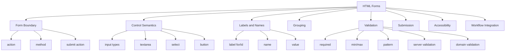
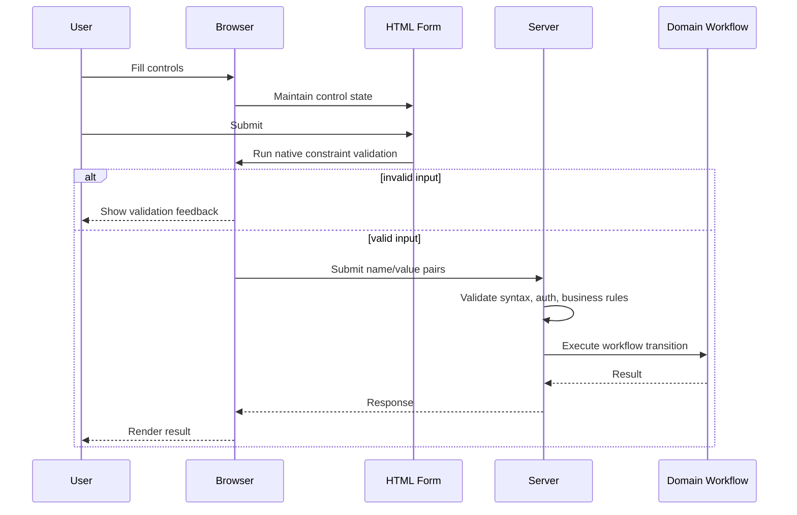
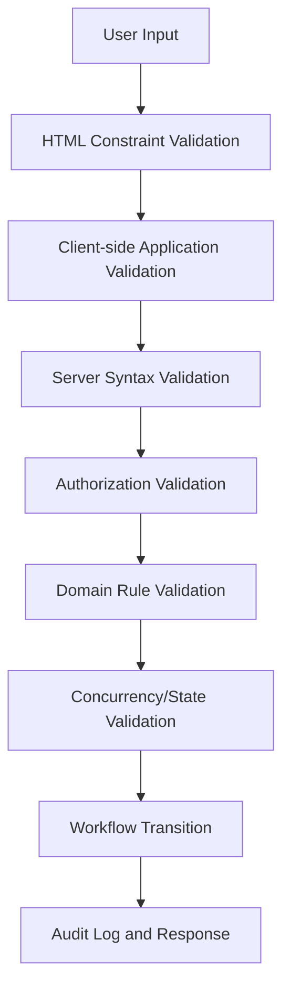
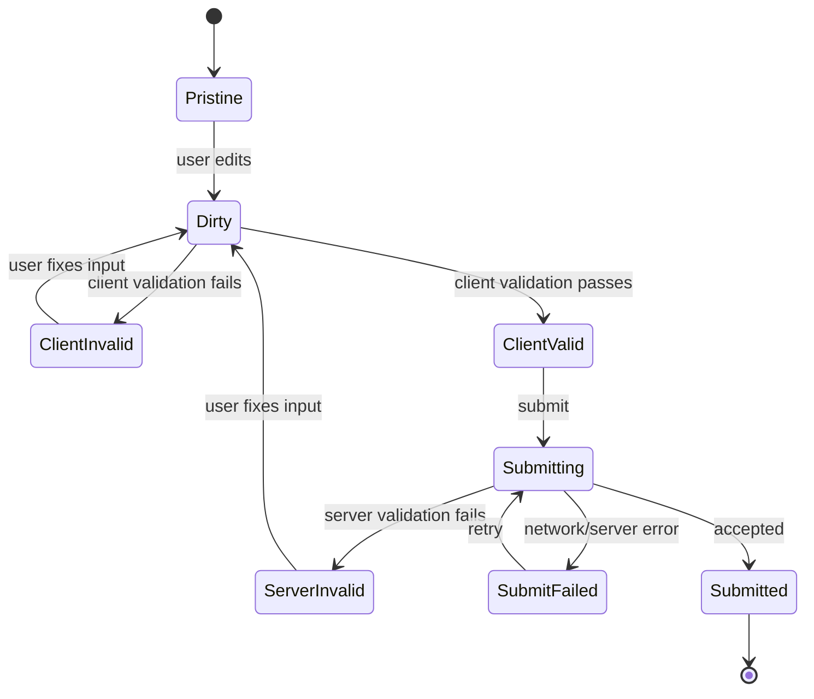

# Part 06 — Forms as Product Workflow: Inputs, Labels, Validation, and Submission

## 1. Kenapa Form Adalah Topik Engineering, Bukan Sekadar UI

Form adalah salah satu boundary paling penting dalam aplikasi web.

Di form, user intent berubah menjadi data. Data itu kemudian:

- divalidasi,
- dikirim,
- disimpan,
- memicu workflow,
- membuat audit trail,
- mengubah status domain,
- menghasilkan keputusan,
- atau menolak input karena melanggar aturan.

Dalam sistem enforcement, case management, internal tools, banking, healthcare, e-commerce, dan regulatory platform, form bukan hanya “beberapa input”. Form adalah **product workflow boundary**.

Contoh:

```html
<form method="post" action="/cases/CASE-2026-00042/recommendations">
  ...
</form>
```

Di balik markup itu ada operasi domain:

- user memberikan rekomendasi;
- sistem memvalidasi role dan permission;
- case status bisa berubah;
- SLA bisa bergerak;
- audit log harus dibuat;
- notification bisa dikirim;
- downstream service bisa dipanggil.

Karena itu, HTML form harus dirancang secara semantik, aksesibel, dan defensible.

---

## 2. Hubungan Dengan Framework “The First 20 Hours”

Dalam pendekatan Josh Kaufman, kita tidak memulai dengan menghafal semua input type. Kita deconstruct skill forms menjadi sub-skill yang sering dipakai.

### Target Performa Part Ini

Setelah part ini, kamu harus bisa:

- membangun form HTML yang bisa dipakai tanpa JavaScript untuk kasus dasar;
- mengasosiasikan label dan input secara benar;
- memilih input type yang tepat;
- memakai `fieldset` dan `legend` untuk group;
- memahami constraint validation native;
- mendesain error state yang accessible;
- memakai `autocomplete` dan `inputmode` dengan tepat;
- membedakan validasi client-side, server-side, dan domain validation;
- membuat form yang cocok untuk aplikasi enterprise.

### Deconstruction



---

## 3. Mental Model: Form as Transaction Boundary

Form adalah deklarasi bahwa beberapa control membentuk satu submission.



Key point:

> Browser validation membantu UX, tetapi server/domain validation tetap wajib.

HTML form bisa mencegah input kosong, format email salah, atau angka di luar range. Tetapi HTML tidak bisa memastikan bahwa user punya permission, case masih open, SLA belum lewat, atau rekomendasi valid menurut policy.

---

## 4. Anatomy of a Form

Form dasar:

```html
<form method="post" action="/cases/CASE-2026-00042/recommendations">
  <div>
    <label for="recommendation">Recommendation</label>
    <textarea id="recommendation" name="recommendation" required></textarea>
  </div>

  <button type="submit">Submit recommendation</button>
</form>
```

Komponen utama:

- `form`: boundary submission;
- `method`: cara HTTP request dikirim;
- `action`: endpoint tujuan;
- form controls: `input`, `textarea`, `select`, `button`;
- `name`: key yang dikirim;
- `value`: value yang dikirim;
- `label`: nama manusia untuk control;
- validation attributes: `required`, `minlength`, `maxlength`, dll;
- submit button.

---

## 5. `form` Element

### 5.1 `action`

`action` adalah URL tujuan submission.

```html
<form action="/cases/search" method="get">
  ...
</form>
```

Jika action kosong atau tidak ada, form submit ke URL dokumen saat ini. Dalam aplikasi modern, sering tetap lebih jelas jika action eksplisit, terutama untuk progressive enhancement.

### 5.2 `method`

Umum:

```html
<form method="get" action="/cases/search">
```

```html
<form method="post" action="/cases/CASE-2026-00042/actions">
```

Praktik:

- `GET` untuk query/search/filter yang tidak mengubah state;
- `POST` untuk operasi yang mengubah state atau membuat resource;
- method lain seperti PUT/PATCH/DELETE biasanya ditangani framework melalui JS atau hidden method override, karena HTML form native hanya mendukung subset method umum.

### 5.3 GET Form

Search form:

```html
<form method="get" action="/cases">
  <label for="query">Search cases</label>
  <input id="query" name="q" type="search" />

  <button type="submit">Search</button>
</form>
```

Submission menghasilkan URL seperti:

```text
/cases?q=late+report
```

Bagus untuk:

- search,
- filter,
- pagination,
- bookmarkable state,
- shareable URLs.

### 5.4 POST Form

State-changing action:

```html
<form method="post" action="/cases/CASE-2026-00042/escalate">
  <label for="reason">Escalation reason</label>
  <textarea id="reason" name="reason" required minlength="20"></textarea>

  <button type="submit">Escalate case</button>
</form>
```

Bagus untuk:

- create,
- update,
- submit,
- approve,
- reject,
- escalate,
- close case.

### 5.5 `enctype`

Untuk file upload:

```html
<form method="post" action="/evidence" enctype="multipart/form-data">
  <label for="evidence-file">Evidence file</label>
  <input id="evidence-file" name="evidenceFile" type="file" />

  <button type="submit">Upload</button>
</form>
```

Tanpa `multipart/form-data`, file upload tidak akan dikirim dengan benar.

### 5.6 `novalidate`

```html
<form method="post" action="/cases" novalidate>
```

`novalidate` mematikan native constraint validation. Jangan pakai kecuali kamu punya alasan kuat dan pengganti yang accessible.

---

## 6. Labels: The Most Important Form Accessibility Primitive

Label menjawab:

> “Control ini untuk apa?”

### 6.1 Explicit Label

```html
<label for="entity-name">Entity name</label>
<input id="entity-name" name="entityName" type="text" />
```

`for` harus cocok dengan `id`.

Ini pattern paling jelas dan mudah direview.

### 6.2 Implicit Label

```html
<label>
  Entity name
  <input name="entityName" type="text" />
</label>
```

Valid, tetapi explicit label sering lebih fleksibel untuk styling dan layout.

### 6.3 Placeholder Is Not Label

Buruk:

```html
<input name="entityName" placeholder="Entity name" />
```

Masalah:

- placeholder hilang saat user mengetik;
- tidak selalu terbaca sebagai label yang stabil;
- contrast sering buruk;
- user bisa lupa field ini untuk apa.

Lebih baik:

```html
<label for="entity-name">Entity name</label>
<input id="entity-name" name="entityName" placeholder="e.g. ACME Corp" />
```

Placeholder boleh memberi contoh, bukan menggantikan label.

### 6.4 Label Text Must Be Specific

Buruk:

```html
<label for="date">Date</label>
```

Lebih baik:

```html
<label for="submission-deadline">Submission deadline</label>
```

Dalam form besar, label generik membuat review, testing, dan user navigation buruk.

### 6.5 Required Indicator

Jangan hanya pakai `*` tanpa penjelasan.

```html
<p><span aria-hidden="true">*</span> Required fields</p>

<label for="reason">
  Escalation reason
  <span aria-hidden="true">*</span>
</label>
<textarea id="reason" name="reason" required></textarea>
```

Tambahkan instruksi di level form:

```html
<p>Fields marked with <span aria-hidden="true">*</span> are required.</p>
```

---

## 7. `name`, `id`, and `value`

Ketiganya sering tertukar.

### 7.1 `id`

`id` mengidentifikasi elemen di dokumen.

Digunakan untuk:

- label association;
- fragment link;
- ARIA reference;
- testing jika diperlukan.

```html
<input id="case-id" name="caseId" type="text" />
<label for="case-id">Case ID</label>
```

### 7.2 `name`

`name` adalah key yang dikirim saat submit.

```html
<input id="case-id" name="caseId" type="text" value="CASE-2026-00042" />
```

Saat submit:

```text
caseId=CASE-2026-00042
```

Jika input tidak punya `name`, value-nya tidak dikirim.

### 7.3 `value`

`value` adalah nilai control.

```html
<input name="status" value="ESCALATED" />
```

Untuk checkbox/radio, `value` menentukan nilai yang dikirim jika selected.

```html
<input type="radio" id="severity-high" name="severity" value="HIGH" />
<label for="severity-high">High</label>
```

---

## 8. Text Inputs

### 8.1 `type="text"`

Default generic text.

```html
<label for="entity-name">Entity name</label>
<input id="entity-name" name="entityName" type="text" autocomplete="organization" />
```

### 8.2 `type="search"`

Untuk search field.

```html
<form method="get" action="/cases">
  <label for="case-search">Search cases</label>
  <input id="case-search" name="q" type="search" />
  <button type="submit">Search</button>
</form>
```

Browser bisa memberikan behavior khusus seperti clear button.

### 8.3 `type="email"`

```html
<label for="contact-email">Contact email</label>
<input id="contact-email" name="contactEmail" type="email" autocomplete="email" />
```

Memberi:

- semantic input email,
- native validation format dasar,
- mobile keyboard yang lebih relevan.

Untuk multiple email:

```html
<input id="recipients" name="recipients" type="email" multiple />
```

### 8.4 `type="url"`

```html
<label for="reference-url">Reference URL</label>
<input id="reference-url" name="referenceUrl" type="url" />
```

### 8.5 `type="tel"`

```html
<label for="phone">Phone number</label>
<input id="phone" name="phone" type="tel" autocomplete="tel" />
```

Jangan gunakan `number` untuk nomor telepon. Nomor telepon bukan angka matematis. Ia bisa punya `+`, leading zero, separator, extension.

### 8.6 `type="password"`

```html
<label for="password">Password</label>
<input id="password" name="password" type="password" autocomplete="current-password" />
```

Untuk password baru:

```html
<input id="new-password" name="newPassword" type="password" autocomplete="new-password" />
```

---

## 9. Numeric Inputs

### 9.1 `type="number"`

```html
<label for="risk-score">Risk score</label>
<input id="risk-score" name="riskScore" type="number" min="0" max="100" step="1" />
```

Gunakan jika value benar-benar angka untuk perhitungan atau range numeric.

Jangan gunakan untuk:

- account number,
- phone number,
- postal code,
- case ID,
- NIK/identifier,
- credit card number.

Identifier bukan number secara domain, walaupun terdiri dari digit.

### 9.2 `inputmode`

Jika butuh keyboard numeric tetapi value tetap text:

```html
<label for="postal-code">Postal code</label>
<input id="postal-code" name="postalCode" type="text" inputmode="numeric" autocomplete="postal-code" />
```

`inputmode` memberi hint keyboard tanpa mengubah semantics.

### 9.3 `min`, `max`, `step`

```html
<input id="priority" name="priority" type="number" min="1" max="5" step="1" />
```

Constraint ini bagus untuk UX, tetapi server tetap harus validasi.

---

## 10. Date and Time Inputs

### 10.1 `type="date"`

```html
<label for="due-date">Due date</label>
<input id="due-date" name="dueDate" type="date" required />
```

Nilai submit biasanya format `YYYY-MM-DD`.

### 10.2 `type="datetime-local"`

```html
<label for="hearing-time">Hearing time</label>
<input id="hearing-time" name="hearingTime" type="datetime-local" />
```

Hati-hati: `datetime-local` tidak menyertakan timezone. Untuk sistem enterprise/regulatory, timezone harus dipikirkan sebagai bagian domain.

### 10.3 `type="month"` and `type="week"`

Cocok untuk input periode jika domain memang membutuhkan itu.

```html
<label for="reporting-month">Reporting month</label>
<input id="reporting-month" name="reportingMonth" type="month" />
```

### 10.4 Date UX Caveat

Native date input berbeda antar browser dan OS. Untuk sistem yang sangat kompleks, date picker custom mungkin dibutuhkan, tetapi jangan mengorbankan:

- label,
- keyboard support,
- parsing yang jelas,
- timezone policy,
- validation,
- error message,
- accessible name.

---

## 11. Choice Controls

### 11.1 Checkbox

Checkbox untuk boolean atau multi-select.

Boolean:

```html
<input id="confirm-accuracy" name="confirmAccuracy" type="checkbox" required />
<label for="confirm-accuracy">I confirm that the information is accurate.</label>
```

Multi-select:

```html
<fieldset>
  <legend>Violation types</legend>

  <div>
    <input id="late-reporting" name="violationTypes" type="checkbox" value="LATE_REPORTING" />
    <label for="late-reporting">Late reporting</label>
  </div>

  <div>
    <input id="incomplete-disclosure" name="violationTypes" type="checkbox" value="INCOMPLETE_DISCLOSURE" />
    <label for="incomplete-disclosure">Incomplete disclosure</label>
  </div>
</fieldset>
```

### 11.2 Radio

Radio untuk pilihan tunggal dari satu set.

```html
<fieldset>
  <legend>Severity</legend>

  <div>
    <input id="severity-low" name="severity" type="radio" value="LOW" />
    <label for="severity-low">Low</label>
  </div>

  <div>
    <input id="severity-medium" name="severity" type="radio" value="MEDIUM" />
    <label for="severity-medium">Medium</label>
  </div>

  <div>
    <input id="severity-high" name="severity" type="radio" value="HIGH" />
    <label for="severity-high">High</label>
  </div>
</fieldset>
```

Semua radio dalam satu group harus memakai `name` yang sama.

### 11.3 Select

```html
<label for="assigned-unit">Assigned unit</label>
<select id="assigned-unit" name="assignedUnit" required>
  <option value="">Select a unit</option>
  <option value="ENFORCEMENT">Enforcement</option>
  <option value="SUPERVISION">Supervision</option>
  <option value="LEGAL">Legal</option>
</select>
```

Untuk required select, opsi kosong membantu browser validation.

### 11.4 `optgroup`

```html
<label for="entity-type">Entity type</label>
<select id="entity-type" name="entityType">
  <optgroup label="Financial Institutions">
    <option value="BANK">Bank</option>
    <option value="INSURANCE">Insurance company</option>
  </optgroup>
  <optgroup label="Non-Financial Institutions">
    <option value="REAL_ESTATE">Real estate company</option>
    <option value="LEGAL_SERVICE">Legal service provider</option>
  </optgroup>
</select>
```

### 11.5 Select vs Radio

Gunakan radio jika:

- opsi sedikit;
- semua opsi penting terlihat;
- user perlu membandingkan pilihan.

Gunakan select jika:

- opsi cukup banyak;
- ruang terbatas;
- pilihan tidak perlu terlihat semua sekaligus.

---

## 12. Textarea

```html
<label for="assessment-notes">Assessment notes</label>
<textarea
  id="assessment-notes"
  name="assessmentNotes"
  rows="6"
  minlength="20"
  maxlength="2000"
  required
></textarea>
```

### 12.1 `rows` Is Not Validation

`rows` hanya tampilan tinggi awal, bukan batas panjang.

Untuk batas panjang:

```html
<textarea maxlength="2000"></textarea>
```

Server tetap harus validasi panjang.

### 12.2 Help Text

```html
<label for="reason">Escalation reason</label>
<p id="reason-help">Explain the specific rule breaches and supporting evidence.</p>
<textarea id="reason" name="reason" aria-describedby="reason-help" required></textarea>
```

`aria-describedby` menghubungkan instruksi dengan control.

---

## 13. Fieldset and Legend

`fieldset` dan `legend` sangat penting untuk grouping control.

### 13.1 Radio Group

```html
<fieldset>
  <legend>Recommended action</legend>

  <div>
    <input id="action-warning" name="recommendedAction" type="radio" value="WARNING" />
    <label for="action-warning">Issue warning</label>
  </div>

  <div>
    <input id="action-penalty" name="recommendedAction" type="radio" value="PENALTY" />
    <label for="action-penalty">Recommend penalty</label>
  </div>
</fieldset>
```

Screen reader dapat mengumumkan group context.

### 13.2 Related Fields

```html
<fieldset>
  <legend>Contact person</legend>

  <div>
    <label for="contact-name">Name</label>
    <input id="contact-name" name="contactName" autocomplete="name" />
  </div>

  <div>
    <label for="contact-email">Email</label>
    <input id="contact-email" name="contactEmail" type="email" autocomplete="email" />
  </div>
</fieldset>
```

### 13.3 Fieldset Is Not Just Border

Jangan gunakan `fieldset` hanya untuk border visual. Jika butuh border, CSS saja. Gunakan `fieldset` ketika ada group semantik.

---

## 14. Buttons

### 14.1 Submit Button

```html
<button type="submit">Submit</button>
```

### 14.2 Non-submit Button

```html
<button type="button">Open preview</button>
```

Dalam form, selalu eksplisit. Tanpa `type`, `button` default-nya submit.

### 14.3 Reset Button

```html
<button type="reset">Reset</button>
```

Gunakan hati-hati. Reset bisa menghapus input user tanpa sadar. Dalam banyak aplikasi enterprise, tombol reset lebih berbahaya daripada berguna.

### 14.4 Multiple Submit Actions

HTML mendukung action berbeda per tombol.

```html
<form method="post" action="/cases/42/recommendations">
  ...

  <button type="submit" name="intent" value="save_draft">
    Save draft
  </button>

  <button type="submit" name="intent" value="submit_for_review">
    Submit for review
  </button>
</form>
```

Server menerima `intent` untuk menentukan operasi.

Untuk action/method berbeda:

```html
<button
  type="submit"
  formaction="/cases/42/recommendations/draft"
  formmethod="post"
>
  Save draft
</button>
```

---

## 15. Native Constraint Validation

Browser punya constraint validation built-in.

Common attributes:

- `required`
- `minlength`
- `maxlength`
- `min`
- `max`
- `step`
- `pattern`
- `type`
- `multiple`

### 15.1 Required

```html
<input id="entity-name" name="entityName" required />
```

### 15.2 Minlength and Maxlength

```html
<textarea id="reason" name="reason" minlength="20" maxlength="2000" required></textarea>
```

### 15.3 Pattern

```html
<label for="case-id">Case ID</label>
<input
  id="case-id"
  name="caseId"
  pattern="CASE-[0-9]{4}-[0-9]{5}"
  placeholder="CASE-2026-00042"
/>
```

Caveat:

- regex pattern harus mudah dipahami;
- error message native bisa tidak cukup jelas;
- server tetap validasi;
- jangan membuat pattern yang terlalu ketat untuk data manusia seperti nama.

### 15.4 Validation Is Not Domain Authorization

HTML bisa memvalidasi:

- field wajib diisi;
- email format dasar;
- angka dalam range;
- panjang minimum;
- pattern dasar.

HTML tidak bisa memvalidasi:

- user berhak approve case;
- case masih dalam state yang bisa diedit;
- action sesuai policy;
- evidence sudah diverifikasi;
- concurrent update conflict;
- SLA exception valid;
- business rule lintas entity.

Jadi gunakan native validation untuk fast feedback, bukan sebagai satu-satunya guard.

---

## 16. Error States

Error state harus:

- terlihat;
- tekstual;
- terhubung ke control;
- bisa ditemukan;
- tidak hanya warna;
- tidak hanya toast sementara;
- tetap ada setelah submit gagal.

### 16.1 Field Error

```html
<div>
  <label for="reason">Escalation reason</label>
  <p id="reason-help">Provide at least 20 characters.</p>
  <textarea
    id="reason"
    name="reason"
    required
    minlength="20"
    aria-describedby="reason-help reason-error"
    aria-invalid="true"
  ></textarea>
  <p id="reason-error">Escalation reason must be at least 20 characters.</p>
</div>
```

### 16.2 Error Summary

Untuk form panjang:

```html
<section aria-labelledby="error-summary-title" tabindex="-1">
  <h2 id="error-summary-title">There are 2 problems with this form</h2>
  <ul>
    <li><a href="#reason">Escalation reason must be at least 20 characters.</a></li>
    <li><a href="#severity-high">Select a severity.</a></li>
  </ul>
</section>
```

Setelah server mengembalikan error, fokus bisa diarahkan ke error summary.

### 16.3 `aria-invalid`

Gunakan ketika field memang invalid.

```html
<input id="contact-email" name="contactEmail" type="email" aria-invalid="true" />
```

Jangan set `aria-invalid="true"` sebelum user berinteraksi atau sebelum validasi dijalankan, kecuali form hasil submit server memang invalid.

### 16.4 Error Message Must Be Actionable

Buruk:

```text
Invalid input.
```

Baik:

```text
Case ID must follow the format CASE-YYYY-NNNNN, for example CASE-2026-00042.
```

### 16.5 Error and Help Text Together

```html
<label for="case-id">Case ID</label>
<p id="case-id-help">Use format CASE-YYYY-NNNNN.</p>
<input
  id="case-id"
  name="caseId"
  aria-describedby="case-id-help case-id-error"
  aria-invalid="true"
/>
<p id="case-id-error">Enter a valid case ID, for example CASE-2026-00042.</p>
```

Order matters for comprehension. Help first, then error if present.

---

## 17. Autocomplete

`autocomplete` gives the browser a hint about the expected data.

```html
<label for="full-name">Full name</label>
<input id="full-name" name="fullName" autocomplete="name" />

<label for="email">Email</label>
<input id="email" name="email" type="email" autocomplete="email" />

<label for="organization">Organization</label>
<input id="organization" name="organization" autocomplete="organization" />
```

### 17.1 Why It Matters

Autocomplete helps:

- reduce typing effort;
- reduce errors;
- improve mobile UX;
- support password managers;
- support address autofill;
- improve accessibility.

### 17.2 Common Tokens

Examples:

```html
<input autocomplete="given-name" />
<input autocomplete="family-name" />
<input autocomplete="email" />
<input autocomplete="tel" />
<input autocomplete="organization" />
<input autocomplete="street-address" />
<input autocomplete="country" />
<input autocomplete="postal-code" />
<input autocomplete="username" />
<input autocomplete="current-password" />
<input autocomplete="new-password" />
```

### 17.3 Sectioned Autocomplete

Untuk billing/shipping:

```html
<input autocomplete="shipping street-address" />
<input autocomplete="billing postal-code" />
```

Untuk repeated sections:

```html
<input autocomplete="section-applicant name" />
<input autocomplete="section-representative name" />
```

### 17.4 Do Not Randomly Turn It Off

```html
<input autocomplete="off" />
```

Kadang diperlukan, tetapi sering merusak UX. Untuk password, gunakan token yang benar, bukan `off`.

---

## 18. Inputmode

`inputmode` memberi hint keyboard.

```html
<input type="text" inputmode="numeric" name="postalCode" />
<input type="text" inputmode="decimal" name="amount" />
<input type="text" inputmode="tel" name="phone" />
<input type="text" inputmode="email" name="emailAlias" />
<input type="text" inputmode="url" name="referenceUrl" />
```

Perbedaan penting:

- `type` menentukan semantics dan validation;
- `inputmode` memberi hint input UI;
- `pattern` memberi constraint format;
- server tetap source of truth.

Untuk postal code:

```html
<input
  id="postal-code"
  name="postalCode"
  type="text"
  inputmode="numeric"
  autocomplete="postal-code"
/>
```

Lebih baik daripada `type="number"` karena postal code bukan angka domain.

---

## 19. Disabled, Readonly, and Hidden

### 19.1 Disabled

```html
<input id="case-id" name="caseId" value="CASE-2026-00042" disabled />
```

Disabled control:

- tidak focusable;
- tidak editable;
- tidak dikirim saat submit.

Jangan gunakan disabled jika value harus dikirim.

### 19.2 Readonly

```html
<input id="case-id" name="caseId" value="CASE-2026-00042" readonly />
```

Readonly control:

- tidak editable;
- bisa focusable;
- biasanya tetap dikirim.

Cocok untuk data yang harus ikut submission tetapi tidak boleh diedit.

### 19.3 Hidden Input

```html
<input type="hidden" name="caseId" value="CASE-2026-00042" />
```

Hidden input bukan security boundary. User bisa memodifikasinya melalui DevTools. Server harus validasi.

### 19.4 Hidden vs Visually Hidden

`hidden` menghapus dari rendering dan accessibility tree.

```html
<p hidden>This is hidden from everyone.</p>
```

Visually hidden class biasanya dipakai untuk teks yang perlu dibaca screen reader tetapi tidak terlihat visual. Implementasinya via CSS dan akan dibahas di part accessibility/CSS.

---

## 20. File Input

```html
<form method="post" action="/evidence/upload" enctype="multipart/form-data">
  <label for="evidence-file">Upload evidence</label>
  <input id="evidence-file" name="evidenceFile" type="file" />

  <button type="submit">Upload evidence</button>
</form>
```

### 20.1 Accept

```html
<input id="evidence-file" name="evidenceFile" type="file" accept=".pdf,image/*" />
```

`accept` adalah hint untuk file picker, bukan security boundary. Server harus validasi MIME, extension, size, malware, dan policy.

### 20.2 Multiple

```html
<input id="evidence-files" name="evidenceFiles" type="file" multiple />
```

### 20.3 File Upload Checklist

- Apakah label menjelaskan file yang diharapkan?
- Apakah format dan ukuran maksimum dijelaskan?
- Apakah error upload terlihat?
- Apakah progress upload accessible?
- Apakah server validasi file?
- Apakah metadata evidence dibuat?
- Apakah audit trail tercatat?

---

## 21. Form Layout Without Breaking Semantics

HTML:

```html
<form method="post" action="/cases/42/recommendations" class="form">
  <div class="form-field">
    <label for="severity">Severity</label>
    <select id="severity" name="severity" required>
      <option value="">Select severity</option>
      <option value="LOW">Low</option>
      <option value="MEDIUM">Medium</option>
      <option value="HIGH">High</option>
    </select>
  </div>

  <div class="form-field">
    <label for="reason">Reason</label>
    <textarea id="reason" name="reason" required></textarea>
  </div>

  <div class="form-actions">
    <button type="button">Cancel</button>
    <button type="submit">Submit</button>
  </div>
</form>
```

CSS wrapper boleh menggunakan `div`. Semantics tetap ada di label/input/select/textarea/button.

Jangan mengubah label menjadi placeholder hanya karena desain ingin “clean”.

---

## 22. Progressive Enhancement Form Strategy

Form yang baik tetap punya baseline tanpa JS.

### 22.1 Baseline HTML

```html
<form method="post" action="/cases/42/escalate">
  ...
  <button type="submit">Escalate case</button>
</form>
```

### 22.2 Enhanced With JavaScript

JavaScript boleh menambahkan:

- autosave;
- async validation;
- dependent fields;
- conditional sections;
- optimistic UI;
- draft persistence;
- inline preview.

Tetapi jika JS gagal, minimal form masih bisa submit atau memberi fallback yang jelas.

### 22.3 Why It Matters

Di production:

- JS bundle bisa gagal load;
- network bisa intermittent;
- CSP bisa memblokir script;
- browser extension bisa mengganggu;
- hydration bisa delay;
- user bisa memakai assistive tech dengan behavior berbeda.

HTML form native adalah safety net.

---

## 23. Domain Validation Layering



### 23.1 HTML Validation

Fast feedback:

- required,
- type email,
- min/max,
- pattern,
- maxlength.

### 23.2 Client App Validation

Useful for:

- dependent fields,
- live preview,
- cross-field checks,
- better error messages.

### 23.3 Server Validation

Mandatory for:

- trust boundary,
- security,
- canonical parsing,
- business rules,
- persistence constraints.

### 23.4 Domain Validation

Examples:

- cannot escalate closed case;
- cannot approve your own recommendation;
- penalty requires legal review;
- evidence must be verified before final decision;
- severity HIGH requires supervisor approval.

HTML cannot encode these rules safely. It can only assist UX.

---

## 24. Enterprise Example: Enforcement Recommendation Form

```html
<form method="post" action="/cases/CASE-2026-00042/recommendations">
  <header>
    <h2>Submit enforcement recommendation</h2>
    <p>
      Provide a recommendation based on verified evidence and applicable policy.
      Fields marked with <span aria-hidden="true">*</span> are required.
    </p>
  </header>

  <input type="hidden" name="caseId" value="CASE-2026-00042" />

  <fieldset>
    <legend>Recommended action <span aria-hidden="true">*</span></legend>

    <div>
      <input
        id="action-warning"
        name="recommendedAction"
        type="radio"
        value="WARNING"
        required
      />
      <label for="action-warning">Issue warning</label>
    </div>

    <div>
      <input
        id="action-penalty"
        name="recommendedAction"
        type="radio"
        value="PENALTY"
      />
      <label for="action-penalty">Recommend penalty</label>
    </div>

    <div>
      <input
        id="action-no-action"
        name="recommendedAction"
        type="radio"
        value="NO_ACTION"
      />
      <label for="action-no-action">No further action</label>
    </div>
  </fieldset>

  <div>
    <label for="severity">
      Severity <span aria-hidden="true">*</span>
    </label>
    <select id="severity" name="severity" required>
      <option value="">Select severity</option>
      <option value="LOW">Low</option>
      <option value="MEDIUM">Medium</option>
      <option value="HIGH">High</option>
    </select>
  </div>

  <div>
    <label for="reason">
      Recommendation rationale <span aria-hidden="true">*</span>
    </label>
    <p id="reason-help">
      Explain the policy basis, evidence, and why the recommended action is proportionate.
    </p>
    <textarea
      id="reason"
      name="reason"
      rows="8"
      minlength="50"
      maxlength="4000"
      required
      aria-describedby="reason-help"
    ></textarea>
  </div>

  <fieldset>
    <legend>Evidence confirmation</legend>

    <div>
      <input id="evidence-verified" name="evidenceVerified" type="checkbox" required />
      <label for="evidence-verified">
        I confirm that the referenced evidence has been reviewed.
      </label>
    </div>

    <div>
      <input id="conflict-check" name="conflictCheckCompleted" type="checkbox" required />
      <label for="conflict-check">
        I confirm that conflict-of-interest checks are complete.
      </label>
    </div>
  </fieldset>

  <div>
    <button type="submit" name="intent" value="save_draft">
      Save draft
    </button>
    <button type="submit" name="intent" value="submit_for_review">
      Submit for review
    </button>
  </div>
</form>
```

Kenapa ini lebih baik:

- `form` punya action/method jelas;
- hidden input hanya metadata, bukan trust boundary;
- radio group pakai `fieldset/legend`;
- label eksplisit;
- required fields dinyatakan;
- textarea punya help text;
- checkbox confirmation punya label lengkap;
- multiple submit intent eksplisit.

---

## 25. Server Error Re-render Example

Setelah server validation gagal, render ulang form dengan error.

```html
<section aria-labelledby="error-summary-title" tabindex="-1">
  <h2 id="error-summary-title">There are 2 problems with your submission</h2>
  <ul>
    <li>
      <a href="#recommended-action-error">
        Select a recommended action.
      </a>
    </li>
    <li>
      <a href="#reason">
        Recommendation rationale must include at least 50 characters.
      </a>
    </li>
  </ul>
</section>

<form method="post" action="/cases/CASE-2026-00042/recommendations">
  <fieldset aria-describedby="recommended-action-error">
    <legend>Recommended action <span aria-hidden="true">*</span></legend>
    ...
    <p id="recommended-action-error">
      Select a recommended action.
    </p>
  </fieldset>

  <div>
    <label for="reason">Recommendation rationale</label>
    <textarea
      id="reason"
      name="reason"
      required
      minlength="50"
      aria-invalid="true"
      aria-describedby="reason-help reason-error"
    >Too short</textarea>
    <p id="reason-help">Explain the policy basis, evidence, and proportionality.</p>
    <p id="reason-error">Recommendation rationale must include at least 50 characters.</p>
  </div>
</form>
```

Error summary membantu user langsung tahu apa yang salah, terutama pada form panjang.

---

## 26. Form State Model

Untuk aplikasi kompleks, pikirkan form sebagai state machine.



State yang harus dipikirkan:

- pristine,
- dirty,
- touched,
- client invalid,
- server invalid,
- submitting,
- submitted,
- failed,
- disabled due to permission,
- readonly due to workflow state,
- conflict due to concurrent update.

HTML memberi fondasi, tetapi aplikasi harus mengelola state ini dengan jelas.

---

## 27. Security and Trust Boundaries

HTML form bukan security layer.

Jangan percaya:

- hidden input,
- disabled field,
- readonly field,
- client-side validation,
- option yang tersedia di UI,
- max/min di browser,
- file accept attribute,
- user role yang disimpan di DOM.

Server harus validasi ulang semua.

Contoh hidden input:

```html
<input type="hidden" name="role" value="SUPERVISOR" />
```

Ini buruk jika server mempercayainya. User bisa mengubah value.

Lebih baik:

- server menentukan role dari session/token;
- form hanya mengirim data yang memang perlu dikirim;
- server memeriksa permission dan workflow state.

---

## 28. Common Form Anti-patterns

### 28.1 Placeholder-only Form

```html
<input placeholder="Email" />
```

Refactor:

```html
<label for="email">Email</label>
<input id="email" name="email" type="email" autocomplete="email" />
```

### 28.2 Missing Name

```html
<label for="reason">Reason</label>
<textarea id="reason"></textarea>
```

Tidak akan terkirim.

Refactor:

```html
<textarea id="reason" name="reason"></textarea>
```

### 28.3 Disabled Value Expected by Server

```html
<input name="caseId" value="CASE-2026-00042" disabled />
```

Disabled tidak dikirim.

Refactor:

```html
<input id="case-id" name="caseId" value="CASE-2026-00042" readonly />
```

Atau server mengambil dari route/session.

### 28.4 Fake Select

```html
<div class="select">
  <div>High</div>
  <div>Medium</div>
  <div>Low</div>
</div>
```

Jika tidak ada alasan kuat, gunakan `select` atau radio.

### 28.5 Color-only Error

```html
<input class="error" />
```

Refactor:

```html
<input aria-invalid="true" aria-describedby="email-error" />
<p id="email-error">Enter a valid email address.</p>
```

### 28.6 Button Without Type

```html
<button>Cancel</button>
```

Dalam form, ini bisa submit.

Refactor:

```html
<button type="button">Cancel</button>
```

### 28.7 Required Field Only Marked By Color

```html
<label class="red">Reason</label>
```

Refactor:

```html
<label for="reason">Reason <span aria-hidden="true">*</span></label>
<textarea id="reason" name="reason" required></textarea>
```

---

## 29. Code Review Checklist

### 29.1 Form Boundary

- Apakah `form` punya `method` dan `action` yang jelas?
- Apakah `GET` dipakai untuk search/filter?
- Apakah `POST` dipakai untuk state-changing operation?
- Apakah file upload memakai `enctype="multipart/form-data"`?

### 29.2 Controls

- Apakah setiap input punya label?
- Apakah `label for` cocok dengan `id`?
- Apakah setiap submitted control punya `name`?
- Apakah input type sesuai domain?
- Apakah phone/postal/account ID tidak salah memakai `type="number"`?

### 29.3 Groups

- Apakah radio group memakai `fieldset` dan `legend`?
- Apakah checkbox group punya group label?
- Apakah related fields dikelompokkan secara masuk akal?

### 29.4 Validation

- Apakah required/min/max/pattern dipakai untuk feedback dasar?
- Apakah error message tekstual dan actionable?
- Apakah error terhubung dengan control via `aria-describedby`?
- Apakah `aria-invalid` hanya dipakai ketika invalid?
- Apakah server-side validation tetap ada?

### 29.5 Submission

- Apakah submit button jelas?
- Apakah non-submit button punya `type="button"`?
- Apakah multiple submit actions memakai `name/value` atau `formaction` dengan jelas?
- Apakah loading/submitting state tidak membuat user kehilangan data?

### 29.6 Accessibility

- Apakah placeholder tidak menggantikan label?
- Apakah instruksi penting terlihat dan terhubung?
- Apakah error summary ada untuk form panjang?
- Apakah form bisa dinavigasi dengan keyboard?
- Apakah focus order masuk akal?

### 29.7 Security

- Apakah hidden input tidak dipercaya sebagai security source?
- Apakah disabled/readonly tidak dipakai sebagai authorization?
- Apakah server memvalidasi permission, workflow state, dan data domain?
- Apakah file upload divalidasi server-side?

---

## 30. Practice

### Latihan 1 — Search Form

Buat form search cases dengan:

- method GET,
- input search,
- label eksplisit,
- filter status select,
- submit button,
- URL query yang bookmarkable.

### Latihan 2 — Enforcement Recommendation Form

Buat form rekomendasi enforcement dengan:

- radio group recommended action,
- select severity,
- textarea rationale,
- evidence confirmation checkbox,
- save draft dan submit for review buttons,
- native validation.

### Latihan 3 — Server Error State

Ambil form dari Latihan 2 dan render ulang dalam kondisi:

- recommended action belum dipilih,
- rationale terlalu pendek,
- error summary di atas form,
- field error terhubung dengan control.

### Latihan 4 — Refactor Anti-pattern

Refactor form ini:

```html
<form>
  <input placeholder="Email" />
  <input placeholder="Phone" type="number" />
  <div class="radio selected">High</div>
  <div class="radio">Medium</div>
  <button>Cancel</button>
  <button>Save</button>
</form>
```

Target:

- label benar,
- type benar,
- radio group benar,
- button type benar,
- submitted data punya `name`.

---

## 31. Example Answer: Refactored Anti-pattern

```html
<form method="post" action="/contacts">
  <div>
    <label for="email">Email</label>
    <input id="email" name="email" type="email" autocomplete="email" />
  </div>

  <div>
    <label for="phone">Phone</label>
    <input id="phone" name="phone" type="tel" autocomplete="tel" />
  </div>

  <fieldset>
    <legend>Severity</legend>

    <div>
      <input id="severity-high" name="severity" type="radio" value="HIGH" checked />
      <label for="severity-high">High</label>
    </div>

    <div>
      <input id="severity-medium" name="severity" type="radio" value="MEDIUM" />
      <label for="severity-medium">Medium</label>
    </div>
  </fieldset>

  <button type="button">Cancel</button>
  <button type="submit">Save</button>
</form>
```

---

## 32. Production Rubric

| Level | Description |
|---|---|
| 1 | Inputs exist visually but labels, names, validation, and semantics are weak |
| 2 | Basic labels and submit work, but grouping/error/accessibility incomplete |
| 3 | Form is usable, submitted data is clear, native validation exists |
| 4 | Form has proper grouping, error states, autocomplete, server re-render strategy |
| 5 | Form is a robust workflow boundary with validation layering, accessibility, auditability, and progressive enhancement |

Target untuk production internal tools minimal Level 4. Untuk critical regulatory workflows, target Level 5.

---

## 33. Mental Model Summary

Form HTML adalah kontrak antara user intent dan system workflow.

Form yang kuat memiliki:

- semantic boundary via `form`;
- correct method/action;
- explicit labels;
- stable names;
- correct input types;
- meaningful grouping;
- helpful instructions;
- native validation;
- accessible error states;
- secure server validation;
- clear workflow intent.

Jangan mulai dari component library. Mulai dari pertanyaan:

> “Data apa yang user submit, untuk operasi domain apa, dengan constraint apa, dan bagaimana user tahu jika inputnya salah?”

Jika jawabannya jelas, HTML form akan jauh lebih mudah dirancang.

---

## 34. Referensi

- WHATWG HTML Forms — https://html.spec.whatwg.org/multipage/forms.html
- MDN HTML Forms Guide — https://developer.mozilla.org/en-US/docs/Learn_web_development/Extensions/Forms
- MDN `input` element — https://developer.mozilla.org/en-US/docs/Web/HTML/Reference/Elements/input
- MDN `autocomplete` attribute — https://developer.mozilla.org/en-US/docs/Web/HTML/Reference/Attributes/autocomplete
- MDN Constraint Validation — https://developer.mozilla.org/en-US/docs/Web/HTML/Guides/Constraint_validation
- W3C WAI Forms Tutorial — https://www.w3.org/WAI/tutorials/forms/
- WCAG 2.2 Labels or Instructions — https://www.w3.org/WAI/WCAG22/Understanding/labels-or-instructions.html
- WCAG 2.2 Error Identification — https://www.w3.org/WAI/WCAG22/Understanding/error-identification.html
