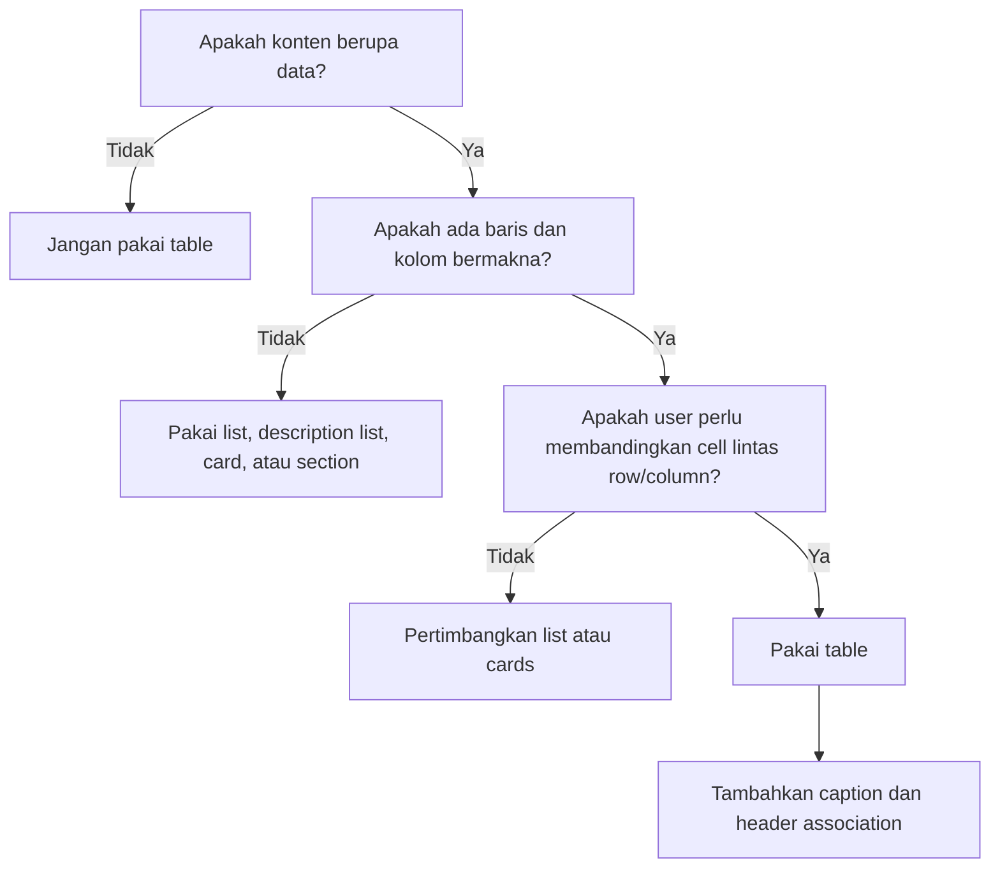
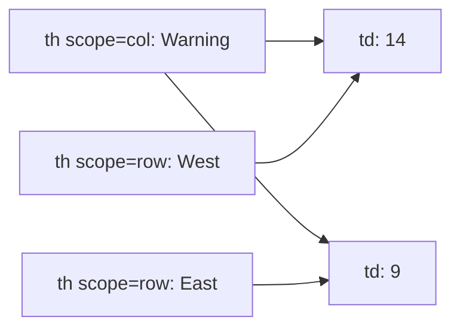
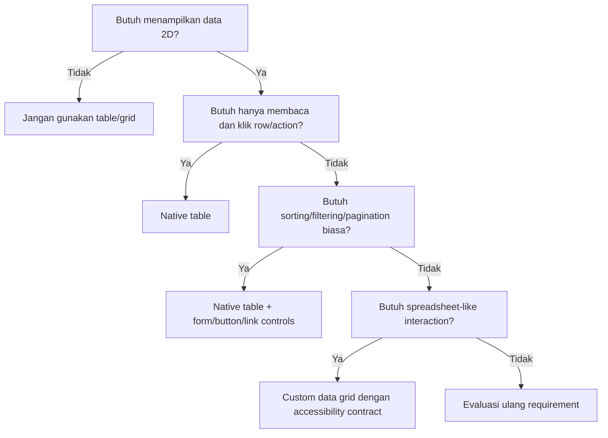

# Part 07 — HTML Tables, Data Semantics, and Complex Enterprise Screens

## 1. Tujuan Pembelajaran

Pada bagian sebelumnya kita membahas form sebagai boundary workflow. Di part ini kita membahas sisi lain dari aplikasi bisnis: **data presentation**. Banyak aplikasi internal, regulatory platform, admin console, enforcement lifecycle system, dan case management tool berisi data padat: daftar kasus, riwayat status, evidence, audit trail, pembayaran, pelanggaran, assignment, SLA, keputusan, dan log aktivitas.

Di titik ini, HTML table bukan sekadar elemen lama. Table adalah primitive semantik untuk menampilkan data dua dimensi. Kesalahan umum developer frontend adalah memperlakukan semua tampilan sebagai kumpulan `div`, lalu mencoba meniru table dengan CSS dan JavaScript. Hasilnya sering tampak benar secara visual, tetapi rapuh untuk keyboard, screen reader, copy-paste, print, browser behavior, dan maintenance.

Setelah menyelesaikan part ini, kamu harus bisa:

1. Menentukan kapan data harus direpresentasikan dengan `<table>` dan kapan tidak.
2. Membuat table yang punya caption, header, body, footer, row header, dan column header yang benar.
3. Memahami `scope`, `headers`, dan `id` sebagai mekanisme asosiasi header-cell.
4. Merancang table untuk data enterprise yang dense tetapi tetap accessible.
5. Menentukan strategi responsive table tanpa merusak semantik.
6. Memahami boundary antara native table dan custom data grid.
7. Melakukan review table dari perspektif accessibility, semantics, layout, dan product workflow.

---

## 2. Hubungan Dengan Framework Kaufman

Josh Kaufman menyarankan skill acquisition dengan cara memecah skill, belajar secukupnya untuk koreksi diri, menghilangkan friction, lalu praktik terarah. Untuk table, sub-skill yang perlu dipecah adalah:

| Sub-skill | Yang Dipelajari | Feedback Cepat |
|---|---|---|
| Data modelling | Apakah data benar-benar dua dimensi? | Bisa dijelaskan baris, kolom, cell, header |
| Semantic markup | `table`, `caption`, `thead`, `tbody`, `th`, `td` | Struktur DOM terbaca jelas |
| Header association | `scope`, `headers`, `id` | Cell bisa dikaitkan dengan header yang benar |
| Accessibility | caption, row header, keyboard, screen reader | Table dapat dipahami tanpa melihat visual |
| Responsive strategy | scroll, stack, card transform, priority columns | Mobile tidak kehilangan konteks |
| Enterprise complexity | sorting, filtering, pagination, selection, bulk actions | Data interaction tetap defensible |
| Data grid boundary | kapan native table cukup, kapan grid perlu ARIA/JS | Tidak membuat ulang browser tanpa alasan |

Tujuan 20 jam pertama bukan menjadi author library data grid. Tujuannya adalah mampu membuat table yang benar, mengerti failure mode, dan tahu kapan kebutuhan sudah melewati kemampuan native table.

---

## 3. Mental Model: Table Adalah Model Data Dua Dimensi

Table cocok ketika data punya relasi **baris x kolom**. Setiap cell adalah nilai di persimpangan satu row dan satu column. Kalau kamu tidak bisa menjelaskan apa arti row dan column, kemungkinan itu bukan table.

Contoh data yang cocok memakai table:

- daftar enforcement case,
- transaksi,
- audit trail,
- evidence inventory,
- daftar user,
- report bulanan,
- comparison matrix,
- policy rule matrix,
- SLA aging report,
- approval history.

Contoh yang biasanya bukan table:

- layout halaman,
- card grid produk,
- navigation menu,
- form layout sederhana,
- hero section,
- dashboard visual cards,
- list artikel biasa.

Rule sederhana:

> Pakai table saat pengguna perlu membandingkan nilai antar baris dan kolom.



---

## 4. Anatomy HTML Table

Struktur dasar table:

```html
<table>
  <caption>Open enforcement cases by risk level</caption>
  <thead>
    <tr>
      <th scope="col">Case ID</th>
      <th scope="col">Subject</th>
      <th scope="col">Risk</th>
      <th scope="col">Status</th>
      <th scope="col">Owner</th>
      <th scope="col">Due date</th>
    </tr>
  </thead>
  <tbody>
    <tr>
      <th scope="row">CASE-2026-00142</th>
      <td>Late disclosure filing</td>
      <td>High</td>
      <td>Investigation</td>
      <td>Ari</td>
      <td>2026-07-03</td>
    </tr>
    <tr>
      <th scope="row">CASE-2026-00143</th>
      <td>Unlicensed activity report</td>
      <td>Critical</td>
      <td>Escalated</td>
      <td>Nadia</td>
      <td>2026-06-29</td>
    </tr>
  </tbody>
</table>
```

Elemen inti:

| Elemen | Makna | Catatan |
|---|---|---|
| `table` | data dua dimensi | bukan layout container umum |
| `caption` | judul/ringkasan table | sebaiknya child pertama dari table |
| `thead` | kelompok header rows | membantu struktur dan styling |
| `tbody` | kelompok body rows | browser bisa menyisipkan implicit `tbody` |
| `tfoot` | kelompok footer/summary rows | cocok untuk total, subtotal, aggregate |
| `tr` | table row | berisi `th` atau `td` |
| `th` | header cell | harus menjelaskan group cell |
| `td` | data cell | nilai aktual |
| `colgroup` | grup kolom | berguna untuk styling/sizing kolom |
| `col` | kolom abstrak | tidak berisi konten |

HTML table tidak sekadar visual. Dengan `th`, `scope`, `caption`, dan struktur yang benar, browser dan assistive technology bisa membentuk hubungan antar cell.

---

## 5. Caption: Nama Table, Bukan Dekorasi

`<caption>` memberi identitas pada table. Ia berfungsi seperti judul lokal untuk kumpulan data. Tanpa caption, pengguna screen reader dapat menemukan table tetapi tidak selalu langsung tahu konteksnya.

Buruk:

```html
<h2>Cases</h2>
<table>
  ...
</table>
```

Lebih baik:

```html
<table>
  <caption>Open enforcement cases awaiting supervisor review</caption>
  ...
</table>
```

Bukan berarti table tidak boleh punya heading di luar. Heading sering tetap berguna untuk struktur halaman. Namun caption membuat table itu sendiri self-contained.

Contoh heading + caption:

```html
<section aria-labelledby="review-queue-title">
  <h2 id="review-queue-title">Supervisor review queue</h2>

  <table>
    <caption>
      Cases assigned to the supervisor review queue, sorted by due date ascending
    </caption>
    ...
  </table>
</section>
```

Prinsip:

- Heading menjelaskan section halaman.
- Caption menjelaskan table spesifik.
- Caption sebaiknya ringkas tetapi cukup untuk memahami dataset.

---

## 6. Header Cells: `th` Bukan Sekadar Bold Text

`<th>` artinya cell tersebut adalah header untuk group cell lain. Secara default browser biasanya membuatnya bold dan centered, tetapi itu efek styling, bukan maknanya.

Column header:

```html
<th scope="col">Risk</th>
```

Row header:

```html
<th scope="row">CASE-2026-00142</th>
```

Mengapa row header penting? Karena pada data table, nilai identitas baris sering bukan sekadar data biasa. Dalam daftar kasus, `Case ID` biasanya adalah anchor utama untuk membaca semua cell di baris tersebut.

Bandingkan:

```html
<tr>
  <td>CASE-2026-00142</td>
  <td>Late disclosure filing</td>
  <td>High</td>
</tr>
```

Dengan:

```html
<tr>
  <th scope="row">CASE-2026-00142</th>
  <td>Late disclosure filing</td>
  <td>High</td>
</tr>
```

Versi kedua memberi tahu bahwa `CASE-2026-00142` adalah label row. Ini membantu interpretasi data, terutama ketika table besar.

---

## 7. `scope`: Asosiasi Header Sederhana

Atribut `scope` digunakan pada `th` untuk menjelaskan cakupan header.

Nilai umum:

| Nilai | Makna |
|---|---|
| `col` | header berlaku untuk kolom |
| `row` | header berlaku untuk baris |
| `colgroup` | header berlaku untuk group kolom |
| `rowgroup` | header berlaku untuk group baris |

Table sederhana biasanya cukup memakai `scope="col"` untuk header kolom dan `scope="row"` untuk row identifier.

```html
<table>
  <caption>Monthly violation counts by region</caption>
  <thead>
    <tr>
      <th scope="col">Region</th>
      <th scope="col">Warning</th>
      <th scope="col">Fine</th>
      <th scope="col">Suspension</th>
    </tr>
  </thead>
  <tbody>
    <tr>
      <th scope="row">West</th>
      <td>14</td>
      <td>3</td>
      <td>1</td>
    </tr>
    <tr>
      <th scope="row">East</th>
      <td>9</td>
      <td>5</td>
      <td>0</td>
    </tr>
  </tbody>
</table>
```

Mental model:



Cell `14` dapat dipahami sebagai: `West / Warning = 14`.

---

## 8. `headers` dan `id`: Untuk Table Kompleks

Untuk table dengan multi-level header, `scope` kadang tidak cukup jelas. Di situ kamu bisa memakai `id` pada `th`, lalu `headers` pada `td` untuk menyebut header mana saja yang menjelaskan cell tersebut.

Contoh:

```html
<table>
  <caption>Case volume and SLA breach by quarter</caption>
  <thead>
    <tr>
      <th id="region" scope="col" rowspan="2">Region</th>
      <th id="q1" scope="colgroup" colspan="2">Q1</th>
      <th id="q2" scope="colgroup" colspan="2">Q2</th>
    </tr>
    <tr>
      <th id="q1-volume" scope="col">Volume</th>
      <th id="q1-breach" scope="col">SLA breach</th>
      <th id="q2-volume" scope="col">Volume</th>
      <th id="q2-breach" scope="col">SLA breach</th>
    </tr>
  </thead>
  <tbody>
    <tr>
      <th id="west" scope="row">West</th>
      <td headers="region west q1 q1-volume">120</td>
      <td headers="region west q1 q1-breach">7</td>
      <td headers="region west q2 q2-volume">138</td>
      <td headers="region west q2 q2-breach">4</td>
    </tr>
  </tbody>
</table>
```

Kapan memakai `headers`?

- Header punya beberapa level.
- `rowspan`/`colspan` membuat hubungan sulit ditebak.
- Setiap data cell perlu mengacu ke beberapa header spesifik.
- Table dipakai untuk laporan resmi, compliance, atau data dense.

Trade-off:

- Lebih eksplisit.
- Lebih verbose.
- Lebih mudah salah jika id tidak konsisten.
- Cocok untuk table kompleks, tidak perlu untuk table sederhana.

Rule praktis:

> Untuk table sederhana, gunakan `scope`. Untuk table kompleks dengan multi-level header, gunakan `headers` + `id` secara eksplisit.

---

## 9. `thead`, `tbody`, dan `tfoot`: Struktur, Bukan Dekorasi

Table bisa jalan tanpa `thead` dan `tbody`, tetapi struktur eksplisit membuat markup lebih mudah dibaca, di-style, dan di-review.

Contoh dengan footer total:

```html
<table>
  <caption>Penalty amounts by enforcement action</caption>
  <thead>
    <tr>
      <th scope="col">Action type</th>
      <th scope="col">Cases</th>
      <th scope="col">Total penalty</th>
    </tr>
  </thead>
  <tbody>
    <tr>
      <th scope="row">Warning</th>
      <td>38</td>
      <td>$0</td>
    </tr>
    <tr>
      <th scope="row">Administrative fine</th>
      <td>12</td>
      <td>$240,000</td>
    </tr>
  </tbody>
  <tfoot>
    <tr>
      <th scope="row">Total</th>
      <td>50</td>
      <td>$240,000</td>
    </tr>
  </tfoot>
</table>
```

`tfoot` cocok untuk:

- total,
- subtotal,
- average,
- summary value,
- balance,
- aggregate.

Jangan pakai `tfoot` hanya untuk tombol pagination. Pagination biasanya berada di luar table karena ia adalah control terhadap dataset, bukan row data.

---

## 10. `colgroup` dan `col`: Styling Kolom Tanpa Mengulang Class

Kadang kamu ingin mengatur lebar atau alignment kolom. `colgroup` bisa membantu.

```html
<table class="case-table">
  <caption>Open cases</caption>
  <colgroup>
    <col class="case-table__id" />
    <col class="case-table__subject" />
    <col class="case-table__risk" />
    <col class="case-table__status" />
  </colgroup>
  <thead>
    <tr>
      <th scope="col">Case ID</th>
      <th scope="col">Subject</th>
      <th scope="col">Risk</th>
      <th scope="col">Status</th>
    </tr>
  </thead>
  <tbody>
    ...
  </tbody>
</table>
```

```css
.case-table {
  width: 100%;
  border-collapse: collapse;
}

.case-table__id {
  width: 12rem;
}

.case-table__risk {
  width: 8rem;
}
```

Namun jangan berharap semua CSS bekerja sama pada `col`. Elemen `col` tidak seperti cell biasa. Biasanya berguna untuk width/background/border tertentu, bukan untuk semua styling.

---

## 11. Layout Table: `table-layout: auto` vs `fixed`

Default table layout adalah `auto`. Browser melihat isi cell untuk menentukan lebar kolom. Ini nyaman tetapi bisa mahal dan tidak predictable untuk data dense.

```css
table {
  table-layout: auto;
}
```

`table-layout: fixed` membuat lebar kolom lebih predictable. Browser menentukan lebar berdasarkan table width, col width, atau row pertama.

```css
.case-table {
  width: 100%;
  table-layout: fixed;
}

.case-table td,
.case-table th {
  overflow: hidden;
  text-overflow: ellipsis;
  white-space: nowrap;
}
```

Trade-off:

| Mode | Kelebihan | Risiko |
|---|---|---|
| `auto` | mengikuti konten | kolom bisa melebar tak terkendali |
| `fixed` | predictable dan cepat | konten panjang bisa terpotong |

Untuk enterprise table, `fixed` sering berguna jika:

- kolom banyak,
- data panjang,
- table harus fit viewport,
- truncation punya tooltip/detail view,
- kolom punya width policy.

Namun truncation tidak boleh menyembunyikan data kritis tanpa cara melihat nilai penuh.

---

## 12. Table Styling Minimal yang Aman

Baseline CSS:

```css
.data-table {
  width: 100%;
  border-collapse: collapse;
  font-size: 0.875rem;
}

.data-table caption {
  text-align: left;
  font-weight: 600;
  margin-block-end: 0.75rem;
}

.data-table th,
.data-table td {
  padding: 0.625rem 0.75rem;
  border-block-end: 1px solid var(--border-subtle, #d9dee7);
  text-align: start;
  vertical-align: top;
}

.data-table thead th {
  font-weight: 600;
}

.data-table tbody tr:hover {
  background: var(--surface-hover, #f6f8fb);
}
```

Catatan:

- Pakai logical property seperti `border-block-end` dan `text-align: start` supaya lebih siap untuk direction/writing mode.
- Jangan menghapus border/focus/visual separation sampai data sulit dibaca.
- Zebra striping boleh, tetapi jangan hanya mengandalkan warna untuk membedakan status.
- `hover` bukan substitusi focus.

---

## 13. Numeric Data: Alignment, Formatting, dan Meaning

Angka sering lebih mudah dibandingkan jika rata kanan atau memakai tabular numbers.

```css
.data-table .is-numeric {
  text-align: end;
  font-variant-numeric: tabular-nums;
}
```

```html
<td class="is-numeric">1,240</td>
<td class="is-numeric">$32,500.00</td>
<td class="is-numeric">98.4%</td>
```

Prinsip formatting angka:

- Gunakan locale yang sesuai.
- Jangan campur unit dalam header dan cell secara ambigu.
- Header boleh menyebut unit: `Penalty amount (USD)`.
- Cell sebaiknya konsisten: semua currency, semua percentage, semua date format.
- Hindari “magic colors” tanpa label teks.

Contoh buruk:

```html
<td class="red">7</td>
```

Lebih baik:

```html
<td>
  <span class="status status--breach">7 SLA breaches</span>
</td>
```

---

## 14. Date dan Time di Table

Gunakan `<time>` ketika nilai adalah tanggal/waktu yang bermakna.

```html
<td>
  <time datetime="2026-07-03">3 Jul 2026</time>
</td>
```

Untuk deadline:

```html
<td>
  <time datetime="2026-06-29T17:00:00+07:00">29 Jun 2026, 17:00 WIB</time>
</td>
```

Prinsip:

- Visual text boleh user-friendly.
- `datetime` harus machine-readable.
- Jangan menyimpan timezone implicit jika data punya dampak SLA/legal.
- Untuk audit/regulatory data, pastikan timestamp jelas: date, time, timezone.

---

## 15. Links, Buttons, dan Actions di Table

Table enterprise sering punya action per row: view, assign, approve, escalate, download, open evidence.

Jangan membuat seluruh row clickable dengan event listener saja tanpa link/button semantik. Screen reader dan keyboard membutuhkan target interaktif yang jelas.

Baik:

```html
<tr>
  <th scope="row">
    <a href="/cases/CASE-2026-00142">CASE-2026-00142</a>
  </th>
  <td>Late disclosure filing</td>
  <td>High</td>
  <td>
    <button type="button">Assign</button>
  </td>
</tr>
```

Jangan:

```html
<tr onclick="location.href='/cases/CASE-2026-00142'">
  <td>CASE-2026-00142</td>
  <td>Late disclosure filing</td>
</tr>
```

Masalah versi buruk:

- tidak keyboard-friendly secara default,
- tidak punya accessible name sebagai link,
- event propagation bisa kacau dengan action lain,
- copy-paste/select text terganggu,
- semantics tidak jelas.

Jika perlu area row besar clickable, tetap sediakan link eksplisit dan pertimbangkan styling link agar affordance jelas.

---

## 16. Sorting: Semantik dan State

HTML table tidak punya sorting native built-in. Sorting biasanya adalah behavior aplikasi. Header kolom dapat berisi button untuk mengubah sorting.

```html
<th scope="col" aria-sort="ascending">
  <button type="button">
    Due date
    <span aria-hidden="true">↑</span>
  </button>
</th>
```

Prinsip:

- Sorting adalah action, jadi gunakan `button`, bukan link jika tidak navigasi.
- Kolom yang sedang sorted dapat memakai `aria-sort` pada `th`.
- Indikator visual harus punya informasi accessible.
- Jangan hanya menampilkan ikon panah tanpa state yang bisa dipahami.

Contoh lebih eksplisit:

```html
<th scope="col" aria-sort="ascending">
  <button type="button" aria-label="Sort by due date, currently ascending">
    Due date
    <span aria-hidden="true">↑</span>
  </button>
</th>
```

Jika sorting mengubah URL/query parameter, link juga bisa valid:

```html
<a href="/cases?sort=dueDate&direction=asc">Due date</a>
```

Decision rule:

| Behavior | Elemen |
|---|---|
| Sorting client-side tanpa navigasi | `button` |
| Sorting server-side via URL | `a` atau form submit |
| Sorting menyebabkan request tetapi tetap semantic action | `button` dalam form |

---

## 17. Filtering dan Search: Di Luar Table, Bukan Di Dalam Header Sembarangan

Filter adalah control dataset. Biasanya filter berada sebelum table dalam form.

```html
<section aria-labelledby="case-list-title">
  <h2 id="case-list-title">Case list</h2>

  <form action="/cases" method="get" class="filter-panel">
    <label for="risk">Risk</label>
    <select id="risk" name="risk">
      <option value="">Any risk</option>
      <option value="critical">Critical</option>
      <option value="high">High</option>
      <option value="medium">Medium</option>
    </select>

    <label for="owner">Owner</label>
    <input id="owner" name="owner" type="search" />

    <button type="submit">Apply filters</button>
  </form>

  <table>
    <caption>Cases matching the selected filters</caption>
    ...
  </table>
</section>
```

Mengapa filter sebaiknya terpisah?

- Semantik lebih jelas.
- Form dapat di-submit server-side.
- URL bisa mencerminkan state filter.
- Test lebih mudah.
- Accessibility lebih jelas.

Untuk enterprise app, state filter penting untuk auditability: user harus bisa share URL, reproduce result, dan memahami kenapa data tertentu muncul.

---

## 18. Pagination: Dataset Navigation

Pagination bukan row data, jadi jangan taruh sebagai row table kecuali benar-benar bagian dari data.

```html
<nav aria-label="Case list pagination" class="pagination">
  <a href="/cases?page=1" aria-label="Go to first page">First</a>
  <a href="/cases?page=2" rel="prev">Previous</a>
  <span aria-current="page">3</span>
  <a href="/cases?page=4" rel="next">Next</a>
  <a href="/cases?page=12" aria-label="Go to last page">Last</a>
</nav>
```

Tambahkan summary dataset:

```html
<p id="case-count">Showing 51–75 of 284 cases.</p>

<table aria-describedby="case-count">
  <caption>Open enforcement cases</caption>
  ...
</table>
```

Prinsip:

- User perlu tahu posisi dalam dataset.
- Pagination control harus keyboard-friendly.
- `aria-current="page"` membantu menandai page aktif.
- Data count membantu orientasi.

---

## 19. Row Selection dan Bulk Actions

Table dengan checkbox selection umum di enterprise UI. Gunakan label yang jelas.

```html
<form action="/cases/bulk-action" method="post">
  <div class="bulk-actions" aria-label="Bulk actions">
    <button type="submit" name="action" value="assign">Assign selected</button>
    <button type="submit" name="action" value="export">Export selected</button>
  </div>

  <table>
    <caption>Cases available for bulk action</caption>
    <thead>
      <tr>
        <th scope="col">
          <span class="visually-hidden">Select</span>
        </th>
        <th scope="col">Case ID</th>
        <th scope="col">Subject</th>
        <th scope="col">Risk</th>
      </tr>
    </thead>
    <tbody>
      <tr>
        <td>
          <input
            type="checkbox"
            name="caseId"
            value="CASE-2026-00142"
            aria-label="Select case CASE-2026-00142"
          />
        </td>
        <th scope="row">
          <a href="/cases/CASE-2026-00142">CASE-2026-00142</a>
        </th>
        <td>Late disclosure filing</td>
        <td>High</td>
      </tr>
    </tbody>
  </table>
</form>
```

Select-all checkbox perlu state indeterminate via JavaScript, tetapi semantic input tetap checkbox.

Hal yang perlu dijaga:

- Jangan hanya memakai row click untuk selection.
- Checkbox harus punya accessible name.
- Bulk action harus jelas berlaku ke selected rows.
- Setelah action, tampilkan result/feedback.
- Untuk data kritis, konfirmasi action destruktif.

---

## 20. Editable Table: Hati-Hati, Ini Sudah Workflow

Editable table terlihat nyaman, tetapi kompleks. Begitu cell bisa diedit, table bukan hanya display. Ia menjadi form, validation surface, interaction model, dan state machine.

Contoh sederhana masih bisa:

```html
<table>
  <caption>Penalty adjustment draft</caption>
  <thead>
    <tr>
      <th scope="col">Case ID</th>
      <th scope="col">Proposed penalty</th>
      <th scope="col">Reason</th>
    </tr>
  </thead>
  <tbody>
    <tr>
      <th scope="row">CASE-2026-00142</th>
      <td>
        <label class="visually-hidden" for="penalty-00142">
          Proposed penalty for CASE-2026-00142
        </label>
        <input id="penalty-00142" name="penalty[CASE-2026-00142]" inputmode="decimal" />
      </td>
      <td>
        <label class="visually-hidden" for="reason-00142">
          Reason for CASE-2026-00142
        </label>
        <input id="reason-00142" name="reason[CASE-2026-00142]" />
      </td>
    </tr>
  </tbody>
</table>
```

Checklist editable table:

- Setiap input punya label.
- Error message terhubung ke input.
- Save behavior jelas: per-cell, per-row, atau whole table.
- Keyboard navigation tidak melawan browser default.
- Unsaved changes terlihat jelas.
- Validation tidak hanya visual.
- Konflik data/concurrency ditangani.

Untuk sistem regulasi atau case management, editable table sering membutuhkan optimistic locking, audit trail, role-based permission, dan confirmation flow.

---

## 21. Responsive Table Strategy

Table adalah salah satu komponen paling sulit untuk responsive design karena data dua dimensi tidak selalu cocok ke layar kecil.

Ada beberapa strategi:

| Strategi | Cocok Untuk | Risiko |
|---|---|---|
| Horizontal scroll | Data dense, banyak kolom | User perlu menyadari ada scroll |
| Priority columns | Kolom tidak semua sama penting | Data tersembunyi bisa kehilangan konteks |
| Stacked rows/cards | Mobile detail view | Semantik table bisa rusak jika markup diubah sembarangan |
| Summary + detail page | Dataset kompleks | Lebih banyak navigasi |
| Column chooser | Power-user enterprise UI | State complexity |

### 21.1 Horizontal Scroll

Strategi paling aman secara semantik adalah membungkus table dalam scroll container.

```html
<div class="table-scroll" tabindex="0" aria-label="Scrollable table: open cases">
  <table>
    <caption>Open enforcement cases</caption>
    ...
  </table>
</div>
```

```css
.table-scroll {
  overflow-x: auto;
  max-inline-size: 100%;
}

.table-scroll:focus {
  outline: 2px solid currentColor;
  outline-offset: 0.25rem;
}
```

Catatan: membuat scroll container focusable dapat membantu keyboard user menemukan area scroll. Namun jangan membuat terlalu banyak elemen focusable tanpa kebutuhan.

### 21.2 Sticky Column dan Header

```css
.case-table thead th {
  position: sticky;
  top: 0;
  background: var(--surface, white);
  z-index: 1;
}

.case-table th:first-child {
  position: sticky;
  left: 0;
  background: var(--surface, white);
  z-index: 2;
}
```

Sticky header/column berguna untuk data besar, tetapi punya failure mode:

- overlap dengan z-index,
- background transparan membuat teks bertumpuk,
- sticky tidak bekerja karena ancestor overflow tertentu,
- mobile viewport sempit,
- print layout buruk.

### 21.3 Stacked Rows

Stacked card pattern sering dipakai mobile, tetapi harus hati-hati.

Salah satu pendekatan memakai `data-label`:

```html
<td data-label="Risk">High</td>
```

```css
@media (max-width: 40rem) {
  .responsive-table thead {
    position: absolute;
    inline-size: 1px;
    block-size: 1px;
    overflow: hidden;
    clip-path: inset(50%);
    white-space: nowrap;
  }

  .responsive-table tr {
    display: block;
    margin-block-end: 1rem;
    border: 1px solid var(--border-subtle, #d9dee7);
  }

  .responsive-table td,
  .responsive-table th[scope="row"] {
    display: grid;
    grid-template-columns: 10rem 1fr;
    gap: 1rem;
  }

  .responsive-table td::before {
    content: attr(data-label);
    font-weight: 600;
  }
}
```

Namun ini punya trade-off. Secara visual menjadi card, tetapi DOM tetap table. Pastikan screen reader behavior tetap dites. Jangan mengubah table menjadi `display: block` secara agresif untuk data yang sangat kompleks tanpa testing.

### 21.4 Summary + Detail

Untuk case management, pendekatan terbaik sering bukan menampilkan semua kolom di mobile, tetapi memilih summary columns dan menyediakan detail page.

Contoh mobile summary:

- Case ID
- Subject
- Risk
- Status
- Due date

Detail lain berada di halaman case detail. Ini lebih sehat daripada memaksa 20 kolom ke layar kecil.

---

## 22. Data Grid: Kapan Native Table Tidak Cukup?

Native table bagus untuk data display. Tetapi kebutuhan enterprise sering berkembang menjadi data grid:

- keyboard cell navigation seperti spreadsheet,
- virtual scrolling,
- column resizing,
- column reordering,
- pinned columns,
- inline editing kompleks,
- row grouping,
- tree data,
- nested rows,
- multi-select dengan range,
- frozen header dengan huge dataset,
- server-side infinite loading.

Saat itu, kamu mungkin butuh custom grid component. Namun custom grid membawa beban besar:

- ARIA roles (`grid`, `row`, `gridcell`, `columnheader`) harus benar,
- keyboard interaction pattern harus eksplisit,
- focus management harus kuat,
- virtualization jangan membuat screen reader kehilangan konteks,
- row count/column count perlu diinformasikan,
- selection state harus accessible,
- performance dan accessibility sering tarik-menarik.

Decision model:



Rule tegas:

> Jangan membangun custom data grid hanya karena ingin style berbeda. Bangun custom data grid hanya saat interaction model memang membutuhkan grid behavior.

---

## 23. Enterprise Case List Example

Berikut contoh table yang lebih realistis untuk case management.

```html
<section aria-labelledby="case-queue-title">
  <h2 id="case-queue-title">High-risk case queue</h2>

  <p id="case-queue-summary">
    Showing high-risk open cases assigned to the enforcement division, sorted by SLA due date.
  </p>

  <form action="/cases" method="get" class="filter-panel">
    <label for="status">Status</label>
    <select id="status" name="status">
      <option value="open">Open</option>
      <option value="investigation">Investigation</option>
      <option value="escalated">Escalated</option>
    </select>

    <label for="owner">Owner</label>
    <input id="owner" name="owner" type="search" autocomplete="off" />

    <button type="submit">Apply filters</button>
  </form>

  <div class="table-scroll" tabindex="0" aria-label="Scrollable high-risk case queue table">
    <table class="data-table" aria-describedby="case-queue-summary">
      <caption>High-risk cases requiring action</caption>
      <thead>
        <tr>
          <th scope="col">Case ID</th>
          <th scope="col">Subject</th>
          <th scope="col">Risk</th>
          <th scope="col">Status</th>
          <th scope="col">Owner</th>
          <th scope="col" aria-sort="ascending">
            <button type="submit" name="sort" value="slaDueDate">
              SLA due date
              <span aria-hidden="true">↑</span>
            </button>
          </th>
          <th scope="col">Last activity</th>
          <th scope="col">
            <span class="visually-hidden">Actions</span>
          </th>
        </tr>
      </thead>
      <tbody>
        <tr>
          <th scope="row">
            <a href="/cases/CASE-2026-00142">CASE-2026-00142</a>
          </th>
          <td>Late disclosure filing</td>
          <td><span class="badge badge--high">High</span></td>
          <td>Investigation</td>
          <td>Ari Pratama</td>
          <td><time datetime="2026-06-29T17:00:00+07:00">29 Jun 2026, 17:00 WIB</time></td>
          <td><time datetime="2026-06-25T14:35:00+07:00">25 Jun 2026, 14:35 WIB</time></td>
          <td>
            <button type="button" aria-label="Assign case CASE-2026-00142">
              Assign
            </button>
          </td>
        </tr>
      </tbody>
    </table>
  </div>
</section>
```

Apa yang benar di contoh ini:

- Section punya heading.
- Filter adalah form terpisah.
- Table punya caption.
- Summary dataset dihubungkan via `aria-describedby`.
- Case ID adalah row header dan link.
- Date/time memakai `<time>` dengan `datetime`.
- Sorting memakai button di header.
- Action button punya accessible name spesifik.
- Horizontal scroll tidak merusak semantik.

---

## 24. Audit Trail Table

Audit trail sering dipakai dalam sistem regulatory. Data ini biasanya perlu immutable, timestamp jelas, actor jelas, action jelas, dan detail perubahan.

```html
<table class="data-table">
  <caption>Audit trail for case CASE-2026-00142</caption>
  <thead>
    <tr>
      <th scope="col">Timestamp</th>
      <th scope="col">Actor</th>
      <th scope="col">Action</th>
      <th scope="col">From</th>
      <th scope="col">To</th>
      <th scope="col">Reason</th>
    </tr>
  </thead>
  <tbody>
    <tr>
      <th scope="row">
        <time datetime="2026-06-25T14:35:21+07:00">25 Jun 2026, 14:35:21 WIB</time>
      </th>
      <td>Nadia Rahman</td>
      <td>Status changed</td>
      <td>Review</td>
      <td>Investigation</td>
      <td>Evidence threshold reached</td>
    </tr>
  </tbody>
</table>
```

Catatan: timestamp bisa menjadi row header jika setiap event audit uniquely identified by time. Namun jika ada audit event ID, event ID dapat menjadi row header dan timestamp menjadi data cell.

---

## 25. Comparison Matrix

Comparison matrix sering punya kolom sebagai opsi dan baris sebagai fitur. Di sini row header sangat penting.

```html
<table>
  <caption>Enforcement workflow capability comparison</caption>
  <thead>
    <tr>
      <th scope="col">Capability</th>
      <th scope="col">Basic workflow</th>
      <th scope="col">Advanced workflow</th>
      <th scope="col">Regulatory workflow</th>
    </tr>
  </thead>
  <tbody>
    <tr>
      <th scope="row">Escalation rules</th>
      <td>Manual</td>
      <td>Configurable</td>
      <td>Configurable with audit trail</td>
    </tr>
    <tr>
      <th scope="row">SLA breach handling</th>
      <td>Notification only</td>
      <td>Auto assignment</td>
      <td>Auto assignment plus supervisor review</td>
    </tr>
  </tbody>
</table>
```

Membuat comparison matrix dengan `div` sering buruk karena relation row/column hilang.

---

## 26. Description List vs Table

Kadang data terlihat seperti table, tetapi sebenarnya key-value detail. Gunakan `<dl>` untuk metadata object, bukan table.

Case detail summary:

```html
<dl class="case-summary">
  <div>
    <dt>Case ID</dt>
    <dd>CASE-2026-00142</dd>
  </div>
  <div>
    <dt>Status</dt>
    <dd>Investigation</dd>
  </div>
  <div>
    <dt>Owner</dt>
    <dd>Ari Pratama</dd>
  </div>
</dl>
```

Table lebih cocok jika ada banyak records dengan field yang sama:

```html
<table>
  <caption>Case assignments</caption>
  <thead>...</thead>
  <tbody>...</tbody>
</table>
```

Rule:

- Satu objek dengan banyak property → `dl`.
- Banyak objek dengan property yang sama → `table`.

---

## 27. Anti-Patterns

### 27.1 Table untuk Layout

```html
<table>
  <tr>
    <td>Sidebar</td>
    <td>Main content</td>
  </tr>
</table>
```

Ini buruk karena table menyatakan data dua dimensi. Untuk layout gunakan CSS Grid/Flexbox.

### 27.2 Div Table Tanpa Alasan

```html
<div class="table">
  <div class="row">
    <div class="cell">Case ID</div>
    <div class="cell">Status</div>
  </div>
</div>
```

Ini menghilangkan semantik table. Jika memang data dua dimensi, pakai table.

### 27.3 Header Visual Pakai `td`

```html
<td class="header">Risk</td>
```

Gunakan `th`.

### 27.4 Semua Header Pakai `scope="col"`

Row header harus `scope="row"`.

### 27.5 Icon-only Status

```html
<td>🔴</td>
```

Tidak cukup. Berikan teks.

```html
<td><span aria-label="Critical risk">🔴 Critical</span></td>
```

### 27.6 Action Tanpa Accessible Name

```html
<button>...</button>
```

Lebih baik:

```html
<button type="button" aria-label="Open actions for case CASE-2026-00142">...</button>
```

---

## 28. Failure Modes pada Complex Enterprise Table

| Failure Mode | Gejala | Penyebab | Solusi |
|---|---|---|---|
| Data terlihat benar tetapi tidak accessible | Screen reader hanya membaca cell tanpa konteks | Tidak ada `th`, `scope`, caption | Tambahkan header association |
| User kehilangan konteks saat scroll horizontal | Tidak tahu kolom apa yang sedang dibaca | Header/first column tidak terlihat | Sticky header/column atau detail view |
| Mobile table tidak usable | 12 kolom dipaksa masuk viewport | Tidak ada responsive strategy | Scroll, priority columns, summary-detail |
| Sorting membingungkan | Panah berubah tetapi state tidak diumumkan | Tidak ada `aria-sort`/label | Tambahkan state semantik |
| Row click tidak keyboard accessible | Mouse bisa, keyboard tidak | `tr onclick` | Gunakan link/button |
| Bulk action salah target | User tidak yakin rows mana terpilih | Checkbox/summary buruk | Label checkbox dan selected count |
| Data kritis terpotong | Ellipsis menyembunyikan nilai | Fixed layout tanpa detail access | Tooltip/detail/expand/copy full value |
| Editable grid kacau | Fokus hilang, validation tidak jelas | Table dipakai sebagai spreadsheet tanpa model | Desain workflow editing |

---

## 29. Review Checklist

Gunakan checklist ini saat code review.

### Semantics

- [ ] Data memang dua dimensi.
- [ ] Table tidak dipakai untuk layout.
- [ ] Ada `<caption>` yang menjelaskan dataset.
- [ ] Header kolom memakai `<th scope="col">`.
- [ ] Header baris memakai `<th scope="row">` jika ada identifier baris.
- [ ] Multi-level header memakai `headers`/`id` jika perlu.
- [ ] `thead`, `tbody`, dan `tfoot` dipakai sesuai kebutuhan.

### Accessibility

- [ ] Table dapat dipahami tanpa visual styling.
- [ ] Icon/status punya teks atau accessible name.
- [ ] Button/link di table punya nama jelas.
- [ ] Sorting state diekspresikan.
- [ ] Pagination punya `nav` dan label.
- [ ] Filter form punya labels.
- [ ] Keyboard interaction tidak bergantung pada row click.

### Data Quality

- [ ] Date/time memakai `<time>` jika bermakna.
- [ ] Angka punya formatting konsisten.
- [ ] Unit jelas.
- [ ] Truncated data bisa diakses penuh.
- [ ] Empty/null values dibedakan dari zero/false.

### Responsive

- [ ] Strategy mobile jelas.
- [ ] Horizontal scroll terlihat/usable.
- [ ] Sticky header/column dites.
- [ ] Data penting tidak hilang.
- [ ] Print/export behavior dipertimbangkan jika relevan.

### Enterprise Workflow

- [ ] Filter state dapat direproduksi.
- [ ] Sorting/pagination konsisten dengan backend.
- [ ] Bulk selection aman.
- [ ] Editable cells punya validation dan save model.
- [ ] Permission/action visibility tidak hanya CSS.

---

## 30. Practice: 90-Minute Drill

Buat halaman `case-queue.html` dan `case-queue.css`.

Requirement:

1. Buat heading `High-risk case queue`.
2. Tambahkan filter form dengan status, owner, dan due date.
3. Buat table dengan minimal 8 kolom:
   - Case ID,
   - Subject,
   - Risk,
   - Status,
   - Owner,
   - SLA due date,
   - Last activity,
   - Action.
4. Gunakan caption.
5. Gunakan `scope="col"` dan `scope="row"`.
6. Gunakan `<time>` untuk tanggal.
7. Tambahkan sorting button di kolom SLA due date.
8. Tambahkan action button per row.
9. Buat horizontal scroll wrapper.
10. Tambahkan CSS minimal untuk readability.
11. Test dengan keyboard.
12. Inspect accessibility tree di DevTools.

Stretch goal:

- Tambahkan bulk selection checkbox.
- Tambahkan pagination.
- Tambahkan sticky first column.
- Buat responsive stacked version dan catat trade-off-nya.

---

## 31. Self-Assessment Rubric

| Level | Kemampuan |
|---|---|
| 1 | Bisa membuat table sederhana tetapi belum memikirkan semantics/accessibility |
| 2 | Bisa memakai `caption`, `th`, `scope`, `thead`, `tbody` dengan benar |
| 3 | Bisa membuat table enterprise dengan sorting/filter/action yang keyboard-friendly |
| 4 | Bisa memilih responsive strategy dan menjelaskan trade-off |
| 5 | Bisa menentukan kapan native table cukup dan kapan custom grid diperlukan |

Target setelah part ini minimal level 3. Untuk top-tier engineering, kejar level 4–5 melalui latihan dan code review.

---

## 32. Key Takeaways

1. Table adalah representasi data dua dimensi, bukan layout primitive.
2. `caption`, `th`, `scope`, dan `headers` adalah bagian dari kontrak makna data.
3. Row header penting untuk data enterprise karena identifier baris sering menjadi anchor interpretasi.
4. Sorting, filtering, pagination, selection, dan editing adalah workflow di sekitar table, bukan sekadar styling.
5. Responsive table harus diputuskan berdasarkan kebutuhan data, bukan hanya ukuran layar.
6. Custom data grid hanya layak jika interaction model memang lebih kompleks dari native table.
7. Table yang baik dapat dibaca, diuji, di-debug, di-print, di-copy, dan dipahami tanpa bergantung pada visual saja.

---

## 33. Referensi Utama

- WHATWG HTML Living Standard — Tables: `https://html.spec.whatwg.org/multipage/tables.html`
- MDN — HTML table accessibility: `https://developer.mozilla.org/en-US/docs/Learn_web_development/Core/Structuring_content/Table_accessibility`
- MDN — `<table>` element: `https://developer.mozilla.org/en-US/docs/Web/HTML/Reference/Elements/table`
- MDN — `<caption>` element: `https://developer.mozilla.org/en-US/docs/Web/HTML/Reference/Elements/caption`
- MDN — `<th>` element: `https://developer.mozilla.org/en-US/docs/Web/HTML/Reference/Elements/th`
- WAI-ARIA Authoring Practices Guide — Grid Pattern: `https://www.w3.org/WAI/ARIA/apg/patterns/grid/`
