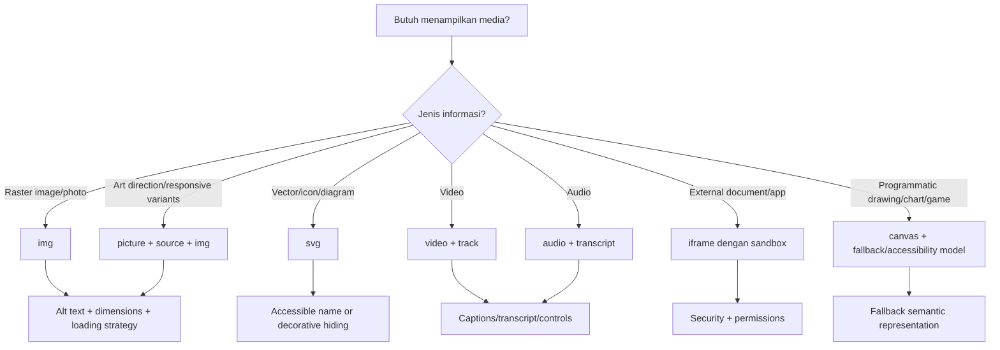
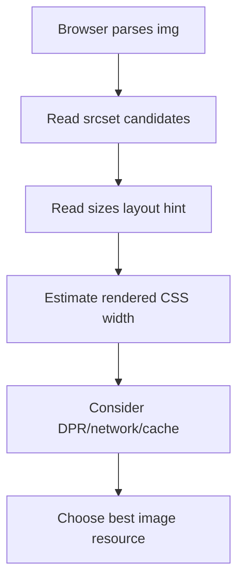
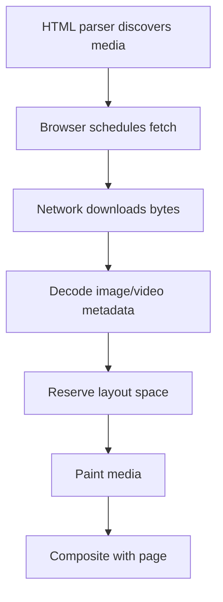

# Part 08 — Media, Embeds, Images, SVG, Canvas Boundaries, and Asset Semantics

## 1. Tujuan Pembelajaran

HTML bukan hanya teks dan form. Aplikasi modern memuat image, ikon, diagram, bukti dokumen, preview file, video, audio, embedded maps, dashboards, SVG, chart, dan canvas. Dalam sistem enterprise atau regulatory case management, media sering membawa nilai evidentiary: foto bukti, dokumen scan, rekaman, file lampiran, screenshot, peta lokasi, signature, atau timeline visual.

Karena itu, media bukan dekorasi belaka. Media adalah bagian dari information architecture, accessibility, performance, security, dan compliance.

Setelah menyelesaikan part ini, kamu harus bisa:

1. Memilih elemen media yang tepat: `img`, `picture`, `video`, `audio`, `iframe`, `svg`, atau `canvas`.
2. Menulis `alt` text yang sesuai konteks.
3. Menggunakan responsive image dengan `srcset`, `sizes`, dan `picture`.
4. Mengurangi layout shift dengan dimensi image yang benar.
5. Memahami lazy loading, decoding, preload, dan trade-off performance.
6. Membuat video/audio lebih accessible dengan captions/transcripts.
7. Menggunakan iframe dengan sandbox/security boundary yang benar.
8. Memahami batas accessibility canvas.
9. Merancang asset strategy yang production-grade.

---

## 2. Media Sebagai Contract, Bukan Dekorasi

Setiap media di halaman harus bisa dijawab:

1. Apa fungsi media ini?
2. Apakah media ini informatif, dekoratif, interaktif, atau evidentiary?
3. Apakah informasi di media tersedia bagi user yang tidak bisa melihat/mendengar?
4. Apakah media memblokir rendering atau memperlambat halaman?
5. Apakah media berasal dari origin tepercaya?
6. Apakah media punya fallback?
7. Apakah media tetap benar di layar kecil, high-DPI, slow network, dan print?

Decision model:



---

## 3. ``: Primitive Utama untuk Image Konten

Gunakan `` untuk image raster seperti foto, screenshot, avatar, bukti visual, preview dokumen, atau ilustrasi yang menjadi bagian konten.

```html

```

Atribut penting:

| Atribut | Fungsi |
|---|---|
| `src` | URL image |
| `alt` | alternative text |
| `width` | intrinsic width hint/layout reservation |
| `height` | intrinsic height hint/layout reservation |
| `loading` | lazy/eager loading hint |
| `decoding` | decode hint |
| `srcset` | kandidat image variants |
| `sizes` | ukuran tampilan image untuk responsive selection |
| `fetchpriority` | prioritas fetch untuk resource tertentu |

Minimal production-quality image biasanya punya:

```html

```

Namun `loading="lazy"` tidak boleh diterapkan secara membabi buta. Hero image above-the-fold biasanya lebih baik eager/default dan mungkin diberi prioritas tinggi.

---

## 4. Alt Text: Makna Berdasarkan Konteks

`alt` bukan deskripsi gambar secara objektif saja. `alt` adalah pengganti fungsi image dalam konteks halaman.

Pertanyaan kunci:

> Jika image gagal dimuat atau user tidak bisa melihat image, informasi apa yang perlu tetap tersedia?

### 4.1 Informative Image

```html

```

Jika chart berisi data kompleks, `alt` singkat saja tidak cukup. Sediakan table atau text summary.

```html
<figure>
  
  <figcaption>SLA breaches by month, January to June 2026.</figcaption>
</figure>

<table>
  <caption>SLA breaches by month</caption>
  ...
</table>
```

### 4.2 Decorative Image

Jika image murni dekoratif, gunakan empty alt.

```html

```

Empty alt membuat assistive technology melewati image. Jangan menulis `alt="decorative image"`.

### 4.3 Functional Image

Jika image berada dalam link/button, alt harus menjelaskan aksi/tujuan.

```html
<a href="/cases/CASE-2026-00142/evidence/scan-01">
  
</a>
```

Buruk:

```html
<a href="/download/report.pdf">
  
</a>
```

Lebih baik:

```html
<a href="/download/report.pdf">
  
  Download enforcement report PDF
</a>
```

### 4.4 Evidence Image

Untuk evidence, alt harus cukup faktual dan tidak membuat klaim yang belum diverifikasi.

```html

```

Hindari:

```html

```

Mengapa? Karena alt text sebaiknya tidak menyimpulkan status legal/faktual jika image hanya evidence. Kesimpulan belongs to case assessment, bukan image description.

---

## 5. `figure` dan `figcaption`

Gunakan `<figure>` ketika media memiliki caption atau dapat berdiri sebagai unit konten.

```html
<figure>
  
  <figcaption>
    Site inspection photo uploaded by Inspector Nadia Rahman on 25 Jun 2026.
  </figcaption>
</figure>
```

`alt` dan `figcaption` tidak harus identik.

- `alt`: alternative text untuk image.
- `figcaption`: caption visible untuk semua user.

Jika caption sudah menjelaskan image sepenuhnya, alt bisa lebih pendek. Namun jangan kosongkan alt untuk image informatif hanya karena ada caption, kecuali informasi image benar-benar tersedia di sekitarnya dan image tidak menambah makna.

---

## 6. Responsive Images: `srcset` dan `sizes`

Masalah responsive image: device berbeda membutuhkan ukuran image berbeda. Mengirim image 2400px ke layar 360px boros bandwidth. Mengirim image kecil ke retina desktop membuat blur.

`srcset` memberi kandidat image. `sizes` memberi tahu browser perkiraan ukuran image di layout.

```html

```

Mental model:

1. Browser membaca `srcset`: kandidat file dan intrinsic width.
2. Browser membaca `sizes`: berapa kira-kira lebar image dalam layout.
3. Browser memperhitungkan device pixel ratio dan kondisi lain.
4. Browser memilih resource yang paling sesuai.



Kesalahan umum:

```html

```

Jika memakai width descriptor (`480w`, `1200w`), sertakan `sizes`. Tanpa `sizes`, browser mengasumsikan default tertentu yang sering tidak sesuai layout.

---

## 7. Density Descriptor: `1x`, `2x`

Untuk image yang ukuran layout-nya tetap, seperti icon raster atau avatar fixed size, density descriptor bisa dipakai.

```html

```

Gunakan `w` descriptor untuk image responsive dengan banyak ukuran layout. Gunakan `x` descriptor untuk image yang ukuran CSS-nya tetap tetapi perlu sharp di high-DPI.

---

## 8. `<picture>`: Art Direction dan Format Switching

`<picture>` digunakan saat kamu tidak hanya ingin ukuran berbeda, tetapi ingin **sumber berbeda berdasarkan kondisi**.

Use cases:

- crop berbeda untuk mobile vs desktop,
- dark mode image variant,
- format modern seperti AVIF/WebP dengan fallback,
- orientation-based image,
- art direction.

Contoh format fallback:

```html
<picture>
  <source srcset="/hero/case-dashboard.avif" type="image/avif" />
  <source srcset="/hero/case-dashboard.webp" type="image/webp" />
  
</picture>
```

Contoh art direction:

```html
<picture>
  <source
    media="(max-width: 40rem)"
    srcset="/evidence/site-photo-crop-mobile.jpg"
  />
  <source
    media="(min-width: 40.001rem)"
    srcset="/evidence/site-photo-wide.jpg"
  />
  
</picture>
```

Rule:

- `picture` harus berisi fallback `img`.
- `source` tidak punya `alt`; `alt` tetap di `img`.
- Gunakan `picture` untuk memilih source, bukan untuk styling layout biasa.

---

## 9. Width dan Height: Mencegah Layout Shift

Selalu berikan dimensi image jika memungkinkan.

```html

```

Browser dapat menghitung aspect ratio sebelum image selesai dimuat, sehingga area layout bisa disiapkan. Ini membantu mengurangi layout shift.

Untuk image fluid:

```css
img {
  max-inline-size: 100%;
  block-size: auto;
}
```

Dengan `width`/`height` di HTML dan `height: auto` di CSS, browser tetap bisa menjaga rasio.

---

## 10. `loading`, `decoding`, dan `fetchpriority`

### 10.1 Lazy Loading

```html

```

Lazy loading cocok untuk image di bawah fold atau gallery panjang. Jangan lazy-load image penting di viewport awal tanpa alasan.

### 10.2 Decoding

```html

```

`decoding="async"` memberi hint agar browser bisa decode image tanpa memblokir pekerjaan lain. Ini bukan magic performance switch, tetapi berguna pada banyak image non-critical.

### 10.3 Fetch Priority

```html

```

Gunakan hati-hati. Jika terlalu banyak resource diberi prioritas tinggi, prioritas kehilangan makna.

Rule praktis:

| Image | Strategy |
|---|---|
| Hero/LCP candidate | jangan lazy, pertimbangkan `fetchpriority="high"` |
| Below-fold content image | `loading="lazy"` |
| Icon kecil inline | sering tidak perlu lazy |
| Evidence gallery panjang | lazy + explicit dimensions |
| Critical logo | default/eager, kecilkan file |

---

## 11. CSS untuk Media Responsif

Baseline:

```css
img,
picture,
video,
canvas,
svg {
  max-inline-size: 100%;
}

img,
video,
canvas,
svg {
  block-size: auto;
}
```

Untuk image crop:

```css
.evidence-thumbnail {
  inline-size: 12rem;
  aspect-ratio: 4 / 3;
  object-fit: cover;
  border-radius: 0.5rem;
}
```

Untuk contain:

```css
.document-preview {
  inline-size: 100%;
  max-block-size: 32rem;
  object-fit: contain;
  background: var(--surface-muted, #f5f7fa);
}
```

`object-fit: cover` bisa memotong informasi. Jangan gunakan untuk evidence image utama jika crop dapat menghilangkan detail penting. Untuk thumbnail boleh, selama ada view penuh.

---

## 12. SVG: Vector, Icon, Diagram, dan Semantics

SVG bisa digunakan sebagai:

1. external image via ``,
2. inline `<svg>...</svg>`,
3. CSS background,
4. sprite/use system.

### 12.1 Decorative Icon

```html
<button type="button">
  <svg aria-hidden="true" focusable="false" width="16" height="16" viewBox="0 0 16 16">
    <path d="..." />
  </svg>
  Assign case
</button>
```

Icon dekoratif disembunyikan dari accessibility tree karena teks tombol sudah menjelaskan aksi.

### 12.2 Informative SVG

```html
<svg
  role="img"
  aria-labelledby="risk-chart-title risk-chart-desc"
  viewBox="0 0 600 400"
>
  <title id="risk-chart-title">Risk distribution chart</title>
  <desc id="risk-chart-desc">
    Critical cases are 12 percent, high risk 28 percent, medium risk 40 percent, and low risk 20 percent.
  </desc>
  ...
</svg>
```

Namun untuk chart kompleks, sediakan data table juga. SVG visual bukan pengganti data accessible.

### 12.3 External SVG via `img`

```html

```

Jika icon hanya menemani teks:

```html

<span>Warning</span>
```

### 12.4 SVG Security

SVG dapat berisi script atau external references tergantung konteks penggunaan. Jangan inline SVG dari sumber tidak tepercaya tanpa sanitization. Untuk user-uploaded SVG, treat as potentially dangerous content.

Prinsip:

- Inline SVG dari codebase sendiri: aman jika reviewed.
- SVG user upload: sanitize atau serve dengan restrictive headers.
- Jangan memberi kemampuan upload SVG mentah lalu inline ke DOM.

---

## 13. Video

HTML video:

```html
<video controls width="1280" height="720" poster="/videos/inspection-poster.jpg">
  <source src="/videos/inspection-summary.webm" type="video/webm" />
  <source src="/videos/inspection-summary.mp4" type="video/mp4" />
  <track
    kind="captions"
    src="/videos/inspection-summary.en.vtt"
    srclang="en"
    label="English captions"
    default
  />
  Your browser does not support the video element.
</video>
```

Atribut penting:

| Atribut | Fungsi |
|---|---|
| `controls` | native controls |
| `poster` | image sebelum playback |
| `width`/`height` | layout reservation |
| `muted` | audio muted |
| `autoplay` | autoplay hint; biasanya perlu muted |
| `playsinline` | mobile inline playback |
| `preload` | metadata/auto/none hint |
| `track` | captions/subtitles/descriptions/chapters |

Prinsip accessibility video:

- Berikan captions untuk dialog/audio penting.
- Berikan transcript untuk konten penting.
- Jangan autoplay video dengan audio.
- Jangan menyembunyikan controls tanpa menyediakan replacement accessible.
- Pastikan keyboard user bisa menjalankan kontrol.

Untuk evidence video, metadata penting:

- source file,
- uploader,
- upload timestamp,
- capture timestamp jika ada,
- duration,
- hash/checksum jika compliance membutuhkan integrity,
- chain of custody di luar HTML.

---

## 14. Audio

```html
<audio controls>
  <source src="/recordings/interview-00142.opus" type="audio/ogg; codecs=opus" />
  <source src="/recordings/interview-00142.mp3" type="audio/mpeg" />
  Your browser does not support the audio element.
</audio>

<p>
  <a href="/recordings/interview-00142-transcript.html">Read transcript</a>
</p>
```

Audio accessibility sangat bergantung pada transcript. Jika audio adalah meeting/interview/evidence, transcript juga membantu search, review, translation, dan audit.

---

## 15. Tracks: Captions, Subtitles, Descriptions, Chapters

`<track>` memakai file WebVTT.

```html
<track
  kind="captions"
  src="/media/interview.en.vtt"
  srclang="en"
  label="English captions"
  default
/>
```

Jenis umum:

| `kind` | Makna |
|---|---|
| `captions` | dialog + sound cues untuk user yang tidak mendengar audio |
| `subtitles` | terjemahan dialog |
| `descriptions` | deskripsi visual untuk user yang tidak melihat video |
| `chapters` | navigasi bagian video |
| `metadata` | data untuk script |

Untuk sistem internal, captions/transcript bukan hanya accessibility. Ia membantu:

- searchability,
- review cepat,
- evidence indexing,
- compliance review,
- audit support.

---

## 16. Iframe: Embed Dengan Boundary

`<iframe>` menanam dokumen lain ke halaman. Ini sering dipakai untuk:

- PDF/document preview,
- map,
- dashboard eksternal,
- payment/identity provider,
- BI report,
- third-party widget,
- sandboxed preview.

```html
<iframe
  src="/documents/CASE-2026-00142/preview"
  title="Preview of evidence document CASE-2026-00142 attachment 01"
  width="100%"
  height="600"
></iframe>
```

`title` wajib secara praktis untuk memberi nama iframe kepada assistive technology.

### 16.1 Sandbox

```html
<iframe
  src="https://reports.example.com/embed/case-risk"
  title="Embedded case risk report"
  sandbox="allow-scripts allow-same-origin"
  referrerpolicy="no-referrer"
></iframe>
```

`sandbox` membatasi kemampuan iframe. Tambahkan permission satu per satu sesuai kebutuhan.

Common sandbox tokens:

| Token | Efek |
|---|---|
| `allow-scripts` | mengizinkan script |
| `allow-forms` | mengizinkan form submission |
| `allow-popups` | mengizinkan popup |
| `allow-same-origin` | mempertahankan same-origin behavior |
| `allow-downloads` | mengizinkan download |

Hati-hati dengan kombinasi `allow-scripts` + `allow-same-origin` untuk konten yang origin-nya sama dan tidak tepercaya. Kombinasi ini bisa melemahkan sandbox.

### 16.2 Permissions Policy

```html
<iframe
  src="https://maps.example.com/embed/location"
  title="Inspection location map"
  allow="geolocation"
></iframe>
```

Jangan memberi permission yang tidak diperlukan. Default mindset: deny by default.

---

## 17. Object, Embed, dan PDF Preview

HTML juga memiliki `<object>` dan `<embed>`, tetapi dalam banyak aplikasi modern, preview dokumen sering lebih baik ditangani oleh dedicated viewer, server-rendered preview, atau iframe ke viewer yang controlled.

Contoh minimal:

```html
<object
  data="/documents/case-report.pdf"
  type="application/pdf"
  width="100%"
  height="600"
>
  <p>
    PDF preview is not available.
    <a href="/documents/case-report.pdf">Download the case report PDF</a>.
  </p>
</object>
```

Prinsip:

- Selalu sediakan fallback link download/open.
- Jangan bergantung pada PDF plugin behavior yang berbeda antar browser.
- Untuk dokumen sensitif, pastikan authz di server, bukan hanya hide URL di UI.

---

## 18. Canvas: Powerful Tetapi Accessibility Boundary

`<canvas>` adalah bitmap drawing surface. Browser tidak tahu objek semantik di dalam canvas kecuali kamu menyediakan alternatif.

```html
<canvas id="riskChart" width="800" height="400">
  Risk chart: Critical 12%, High 28%, Medium 40%, Low 20%.
</canvas>
```

Fallback text di dalam canvas membantu saat canvas tidak supported, tetapi tidak cukup untuk chart kompleks.

Lebih baik:

```html
<figure>
  <canvas id="riskChart" width="800" height="400" aria-describedby="risk-chart-summary"></canvas>
  <figcaption id="risk-chart-summary">
    Risk distribution: Critical 12%, High 28%, Medium 40%, Low 20%.
  </figcaption>
</figure>

<table>
  <caption>Risk distribution data</caption>
  ...
</table>
```

Rule:

> Jika informasi penting hanya ada di canvas, informasi itu hilang bagi banyak user dan automation.

Canvas cocok untuk:

- custom rendering performance,
- game,
- complex visualization,
- image editing,
- map-like interaction,
- waveform,
- large-scale chart dengan custom renderer.

Canvas tidak cocok sebagai default untuk:

- text biasa,
- form,
- table,
- simple chart yang bisa SVG/HTML,
- UI controls.

---

## 19. Chart Accessibility Strategy

Chart bisa dibuat dengan SVG, canvas, atau HTML/CSS. Apa pun teknologinya, aksesibilitas harus dipikirkan sebagai data contract.

Untuk chart:

1. Beri title/summary.
2. Beri data table alternatif.
3. Jangan hanya mengandalkan warna.
4. Beri label langsung bila memungkinkan.
5. Pastikan keyboard/tooltip tidak menjadi satu-satunya cara melihat data.
6. Untuk chart interaktif, expose control sebagai HTML controls.

Contoh:

```html
<section aria-labelledby="sla-chart-title">
  <h2 id="sla-chart-title">SLA breach trend</h2>
  <p id="sla-chart-summary">
    SLA breaches decreased from 18 in January to 7 in June 2026.
  </p>

  <canvas aria-describedby="sla-chart-summary" width="800" height="400"></canvas>

  <table>
    <caption>SLA breaches by month</caption>
    <thead>
      <tr>
        <th scope="col">Month</th>
        <th scope="col">Breaches</th>
      </tr>
    </thead>
    <tbody>
      <tr><th scope="row">January</th><td>18</td></tr>
      <tr><th scope="row">June</th><td>7</td></tr>
    </tbody>
  </table>
</section>
```

---

## 20. Background Images: CSS Bukan Konten

CSS background image tidak punya `alt`. Karena itu, jangan gunakan background image untuk informasi penting.

Dekoratif:

```css
.hero {
  background-image: url('/assets/noise-pattern.png');
}
```

Informatif: gunakan ``.

Buruk:

```html
<div class="evidence-photo"></div>
```

```css
.evidence-photo {
  background-image: url('/evidence/site-photo.jpg');
}
```

Baik:

```html

```

Rule:

- Background image untuk dekorasi/presentation.
- ``/`picture` untuk content.

---

## 21. Icons: SVG, Text, dan Accessible Names

Icon-only button harus punya accessible name.

```html
<button type="button" aria-label="Delete attachment">
  <svg aria-hidden="true" focusable="false" viewBox="0 0 24 24">
    <path d="..." />
  </svg>
</button>
```

Jika ada visible text, icon disembunyikan:

```html
<button type="button">
  <svg aria-hidden="true" focusable="false" viewBox="0 0 24 24">
    <path d="..." />
  </svg>
  Delete attachment
</button>
```

Jangan:

```html
<button>
  
</button>
```

`trash` tidak menjelaskan aksi. Aksi adalah `Delete attachment`.

---

## 22. Avatar dan User Image

Avatar biasanya perlu alt berupa nama orang jika image menggantikan nama. Jika nama sudah visible, avatar bisa dekoratif.

Nama tidak visible:

```html

```

Nama visible:

```html

<span>Nadia Rahman</span>
```

Jika avatar adalah initial fallback:

```html
<span class="avatar" aria-hidden="true">NR</span>
<span>Nadia Rahman</span>
```

---

## 23. Evidence Gallery Pattern

```html
<section aria-labelledby="evidence-gallery-title">
  <h2 id="evidence-gallery-title">Evidence attachments</h2>

  <ul class="evidence-gallery">
    <li>
      <figure>
        <a href="/evidence/CASE-2026-00142/photo-01">
          
        </a>
        <figcaption>
          Photo 01 — Warehouse entrance, uploaded 25 Jun 2026.
        </figcaption>
      </figure>
    </li>
    <li>
      <figure>
        <a href="/evidence/CASE-2026-00142/document-02">
          
        </a>
        <figcaption>
          Document 02 — Inspection report PDF.
        </figcaption>
      </figure>
    </li>
  </ul>
</section>
```

CSS:

```css
.evidence-gallery {
  display: grid;
  grid-template-columns: repeat(auto-fit, minmax(14rem, 1fr));
  gap: 1rem;
  padding: 0;
  list-style: none;
}

.evidence-gallery img {
  inline-size: 100%;
  aspect-ratio: 4 / 3;
  object-fit: cover;
  border: 1px solid var(--border-subtle, #d9dee7);
}
```

Catatan: thumbnail boleh `object-fit: cover`, tetapi detail page harus menyediakan image penuh.

---

## 24. Document Preview Pattern

```html
<section aria-labelledby="document-preview-title">
  <h2 id="document-preview-title">Inspection report preview</h2>

  <iframe
    src="/documents/CASE-2026-00142/inspection-report/preview"
    title="Inspection report PDF preview for case CASE-2026-00142"
    class="document-preview-frame"
  ></iframe>

  <p>
    <a href="/documents/CASE-2026-00142/inspection-report.pdf">
      Open or download the full inspection report PDF
    </a>
  </p>
</section>
```

```css
.document-preview-frame {
  inline-size: 100%;
  block-size: min(70vh, 48rem);
  border: 1px solid var(--border-subtle, #d9dee7);
}
```

Prinsip:

- Iframe punya title.
- Ada fallback link.
- Tinggi responsif.
- Authz di backend tetap wajib.

---

## 25. Performance Mental Model untuk Media

Media sering menjadi penyumbang terbesar ukuran halaman. Optimasi media biasanya memberi dampak lebih besar daripada micro-optimizing selector CSS.

Pipeline sederhana:



Performance levers:

| Lever | Dampak |
|---|---|
| Format tepat | ukuran file lebih kecil |
| Dimensi tepat | tidak mengirim image terlalu besar |
| Compression | bandwidth turun |
| `srcset`/`sizes` | browser memilih resource optimal |
| `width`/`height` | layout shift turun |
| Lazy loading | initial load turun |
| CDN/cache | latency turun |
| Avoid autoplay heavy media | CPU/battery/network turun |

---

## 26. Image Format Strategy

Format umum:

| Format | Cocok Untuk | Catatan |
|---|---|---|
| JPEG | foto | lossy, luas support |
| PNG | screenshot, transparency, lossless | bisa besar |
| WebP | foto/graphic modern | support luas modern |
| AVIF | kompresi sangat baik | encode lebih mahal, support modern |
| SVG | vector/icon/diagram | hati-hati user-uploaded SVG |
| GIF | animasi sederhana lama | sering lebih baik video/WebP/AVIF |

Rule praktis:

- Foto: AVIF/WebP + JPEG fallback jika perlu.
- Icon/vector: SVG.
- Screenshot UI: PNG/WebP tergantung kebutuhan fidelity.
- Animasi berat: video, bukan GIF besar.
- Evidence asli: simpan original, tampilkan derivative optimized untuk UI.

Untuk sistem evidence, jangan mengganti original file dengan compressed derivative. Simpan original untuk integrity; gunakan derivative untuk preview.

---

## 27. Asset Naming dan Metadata

Untuk production system, asset bukan hanya file.

Pertimbangkan metadata:

- original filename,
- content type,
- size,
- width/height/duration,
- uploader,
- upload timestamp,
- capture timestamp,
- checksum/hash,
- storage key,
- access classification,
- retention policy,
- virus scan status,
- derivative variants.

HTML menampilkan sebagian metadata, tetapi sumber kebenaran ada di backend/storage.

Contoh metadata UI:

```html
<figure>
  
  <figcaption>
    Photo 01 — uploaded by Nadia Rahman on
    <time datetime="2026-06-25T14:35:00+07:00">25 Jun 2026, 14:35 WIB</time>.
    SHA-256 verified.
  </figcaption>
</figure>
```

---

## 28. Security Boundaries

### 28.1 User-uploaded Media

Risks:

- malicious SVG,
- content-type spoofing,
- huge decompression bombs,
- malware attachments,
- EXIF privacy leak,
- unauthorized access via direct URL,
- XSS through preview renderer,
- mixed content,
- untrusted iframe.

Mitigations:

- Validate MIME type server-side.
- Store outside executable/static web root where appropriate.
- Serve with safe `Content-Type` and `Content-Disposition`.
- Sanitize SVG or disallow inline SVG uploads.
- Generate safe previews server-side.
- Use signed URLs or authorization checks.
- Strip or control EXIF metadata when needed.
- Virus scan if domain requires it.
- Use CSP and sandbox for risky previews.

### 28.2 Third-party Embeds

Treat third-party iframe as untrusted.

- Use `sandbox`.
- Limit `allow` permissions.
- Use `referrerpolicy`.
- Avoid embedding sensitive data in URL.
- Consider privacy/compliance impact.
- Monitor failure states.

---

## 29. Failure Modes

| Failure Mode | Gejala | Penyebab | Solusi |
|---|---|---|---|
| Layout shift | Konten melompat saat image load | Tidak ada width/height/aspect ratio | Tambahkan dimensions |
| Image terlalu berat | Halaman lambat | Satu image besar untuk semua device | Gunakan responsive images |
| Alt buruk | Screen reader membaca file name atau nonsense | `alt` hilang/salah konteks | Tulis alt berdasarkan fungsi image |
| Decorative image berisik | Screen reader membaca dekorasi | Alt tidak kosong | Gunakan `alt=""` |
| Chart tidak accessible | Data hanya visual | Canvas/SVG tanpa summary/table | Tambahkan text summary dan data table |
| Iframe tidak jelas | User tidak tahu embed apa | Tidak ada `title` | Tambahkan title |
| Embed berbahaya | Third-party punya permission terlalu luas | Sandbox/allow longgar | Least privilege |
| Evidence kehilangan detail | Thumbnail crop dianggap bukti penuh | `object-fit: cover` tanpa detail view | Sediakan full image |
| Video inaccessible | User tidak mendengar audio | Tidak ada captions/transcript | Tambahkan track/transcript |
| SVG XSS risk | User-uploaded SVG dieksekusi | Inline unsanitized SVG | Sanitize/disallow/serve safely |

---

## 30. Media Review Checklist

### Semantics

- [ ] Media memakai elemen yang tepat.
- [ ] Image informatif punya `alt` yang berguna.
- [ ] Image dekoratif punya `alt=""`.
- [ ] Functional image menjelaskan aksi/tujuan.
- [ ] `figure`/`figcaption` dipakai jika media butuh caption.
- [ ] Chart punya summary dan data alternatif.

### Performance

- [ ] Image punya width/height.
- [ ] Responsive image memakai `srcset`/`sizes` jika perlu.
- [ ] Format file sesuai.
- [ ] Below-fold image lazy-loaded.
- [ ] Above-fold critical image tidak dilazy-load sembarangan.
- [ ] File tidak lebih besar dari kebutuhan display.
- [ ] Video tidak autoplay dengan audio.

### Accessibility

- [ ] Video punya captions jika ada audio penting.
- [ ] Audio punya transcript jika penting.
- [ ] Iframe punya title.
- [ ] Icon-only button punya accessible name.
- [ ] Informasi tidak hanya bergantung pada warna/image.
- [ ] Canvas punya fallback/summary.

### Security

- [ ] User-uploaded SVG tidak di-inline tanpa sanitization.
- [ ] Iframe third-party memakai sandbox/allow minimal.
- [ ] Document preview punya fallback link.
- [ ] File access dikontrol server-side.
- [ ] Metadata sensitif tidak bocor tanpa kebutuhan.

### Product/Enterprise

- [ ] Evidence original dan preview derivative dibedakan.
- [ ] Timestamp dan uploader jelas jika relevan.
- [ ] Media failure state tersedia.
- [ ] Download/open full version tersedia.
- [ ] Print/export behavior dipertimbangkan.

---

## 31. Practice: 120-Minute Drill

Buat halaman `case-evidence.html` dan `case-evidence.css`.

Requirement:

1. Heading: `Evidence for CASE-2026-00142`.
2. Buat evidence gallery dengan minimal 6 item:
   - 3 photo thumbnails,
   - 1 PDF/document preview,
   - 1 video evidence,
   - 1 audio recording.
3. Semua image punya `alt` sesuai konteks.
4. Thumbnail memakai `width`, `height`, dan `loading="lazy"`.
5. Buat satu responsive image dengan `srcset` dan `sizes`.
6. Buat satu `picture` dengan WebP/AVIF fallback atau art direction.
7. Video punya `controls`, `poster`, dan `track` captions.
8. Audio punya transcript link.
9. PDF preview memakai `iframe` dengan `title` dan fallback link.
10. Buat chart sederhana dengan canvas atau SVG, tetapi wajib ada text summary dan table alternatif.
11. Tambahkan CSS responsive untuk gallery.
12. Test keyboard dan accessibility tree.

Stretch goal:

- Tambahkan metadata uploader/timestamp/checksum.
- Tambahkan empty/error state untuk media gagal load.
- Tambahkan security notes di komentar kode.
- Tambahkan print stylesheet sederhana.

---

## 32. Self-Assessment Rubric

| Level | Kemampuan |
|---|---|
| 1 | Bisa menaruh image/video tetapi belum memikirkan alt/performance |
| 2 | Bisa membedakan informative/decorative/functional image |
| 3 | Bisa memakai responsive image, captions, iframe title, dan dimensions dengan benar |
| 4 | Bisa merancang evidence/media UI yang accessible, performant, dan secure |
| 5 | Bisa menentukan asset pipeline, security boundary, metadata, dan fallback strategy untuk production system |

Target setelah part ini minimal level 3. Untuk top-tier engineering, kejar level 4–5.

---

## 33. Key Takeaways

1. Media harus diperlakukan sebagai information contract, bukan dekorasi default.
2. `alt` text ditentukan oleh fungsi image dalam konteks halaman.
3. Responsive image membutuhkan `srcset` dan `sizes` agar browser bisa memilih resource yang tepat.
4. `picture` digunakan untuk art direction atau source switching, bukan layout biasa.
5. `width` dan `height` membantu mencegah layout shift.
6. Video/audio membutuhkan captions/transcript jika informasi penting ada di media tersebut.
7. Iframe adalah security boundary; gunakan `title`, `sandbox`, dan permission minimal.
8. Canvas tidak punya semantik internal; informasi penting perlu fallback/summary/data table.
9. Untuk evidence/regulatory systems, original asset, preview derivative, metadata, authorization, dan integrity harus dibedakan.

---

## 34. Referensi Utama

- WHATWG HTML Living Standard — Images: `https://html.spec.whatwg.org/multipage/images.html`
- WHATWG HTML Living Standard — Embedded content: `https://html.spec.whatwg.org/multipage/iframe-embed-object.html`
- MDN — Responsive images: `https://developer.mozilla.org/en-US/docs/Web/HTML/Guides/Responsive_images`
- MDN — `` element: `https://developer.mozilla.org/en-US/docs/Web/HTML/Reference/Elements/img`
- MDN — `<picture>` element: `https://developer.mozilla.org/en-US/docs/Web/HTML/Reference/Elements/picture`
- MDN — `<video>` element: `https://developer.mozilla.org/en-US/docs/Web/HTML/Reference/Elements/video`
- MDN — `<audio>` element: `https://developer.mozilla.org/en-US/docs/Web/HTML/Reference/Elements/audio`
- MDN — `<iframe>` element: `https://developer.mozilla.org/en-US/docs/Web/HTML/Reference/Elements/iframe`
- MDN — SVG element reference: `https://developer.mozilla.org/en-US/docs/Web/SVG/Reference/Element/svg`
- W3C WAI — Images Tutorial: `https://www.w3.org/WAI/tutorials/images/`
