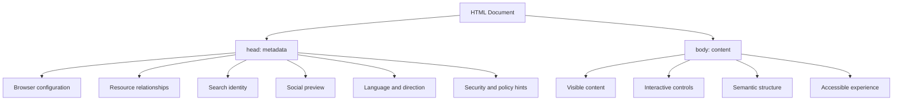
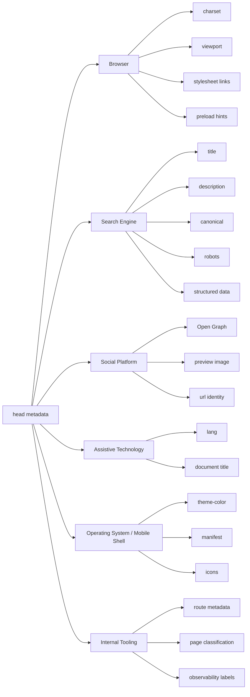
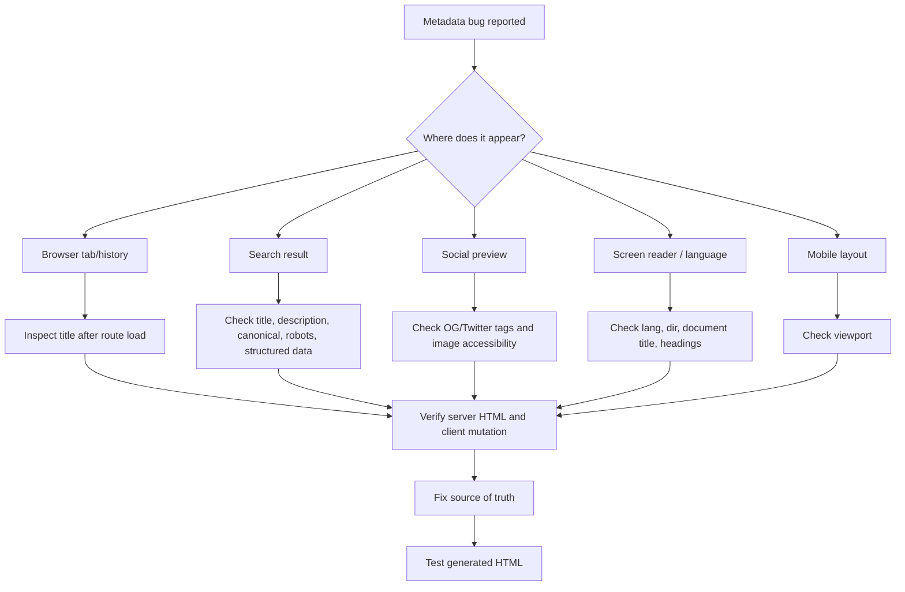

# Part 09 — Metadata, SEO Basics, Social Sharing, Internationalization, and Document Identity

## 0. Posisi Part Ini Dalam Framework Kaufman

Di framework *The First 20 Hours*, kita tidak mulai dengan menghafal semua elemen HTML. Kita mulai dari kemampuan yang menghasilkan performa nyata.

Untuk metadata HTML, target performanya adalah:

> Kamu mampu membuat dokumen HTML yang identitasnya jelas bagi manusia, browser, search engine, social platform, assistive technology, localization system, dan sistem internal engineering.

Metadata sering terlihat kecil karena tidak tampil langsung di halaman. Tetapi dalam sistem production, metadata menentukan:

- bagaimana browser menginterpretasikan dokumen,
- bagaimana halaman muncul di search result,
- bagaimana link tampil saat dibagikan,
- bahasa dan arah teks dokumen,
- canonical identity sebuah resource,
- apakah dokumen boleh diindeks,
- bagaimana analytics, monitoring, dan observability membaca halaman,
- bagaimana dokumen dipahami oleh tooling otomatis.

Kesalahan metadata jarang merusak UI secara kasat mata. Justru karena itu, bug metadata sering lolos sampai production.

---

## 1. Learning Goals

Setelah menyelesaikan part ini, kamu harus bisa:

1. Mendesain `<head>` HTML yang minimal, benar, dan production-ready.
2. Membedakan metadata untuk browser, crawler, social platform, dan user agent lain.
3. Menentukan title, description, canonical URL, robots directive, dan language metadata secara defensible.
4. Memahami batas SEO yang benar-benar berada di area HTML.
5. Menangani halaman multilingual dan bidirectional text secara aman.
6. Membuat metadata policy untuk aplikasi modern, termasuk SSR, SPA, dan enterprise internal tools.
7. Mendeteksi metadata bugs lewat checklist dan debugging flow.

---

## 2. Mental Model: HTML Document Has Two Bodies

Sebuah dokumen HTML punya dua lapisan besar:

1. **Document metadata** di `<head>`
2. **Document content** di `<body>`

`<body>` menjawab:

> Apa yang dilihat dan digunakan user?

`<head>` menjawab:

> Dokumen ini sebenarnya apa, bagaimana harus diproses, dan bagaimana harus direpresentasikan oleh sistem lain?



A useful engineering heuristic:

> `<body>` is the product surface. `<head>` is the product identity and processing contract.

---

## 3. Canonical Minimal HTML Head

Template minimal production-grade:

```html
<!doctype html>
<html lang="en">
  <head>
    <meta charset="utf-8" />
    <meta name="viewport" content="width=device-width, initial-scale=1" />

    <title>Case Detail — Enforcement Platform</title>
    <meta
      name="description"
      content="Review case status, evidence, audit trail, and enforcement actions."
    />

    <link rel="canonical" href="https://example.com/cases/CASE-2026-001" />

    <meta property="og:title" content="Case Detail — Enforcement Platform" />
    <meta
      property="og:description"
      content="Review case status, evidence, audit trail, and enforcement actions."
    />
    <meta property="og:type" content="website" />
    <meta property="og:url" content="https://example.com/cases/CASE-2026-001" />
    <meta property="og:image" content="https://example.com/assets/preview.png" />

    <link rel="icon" href="/favicon.ico" sizes="any" />
    <link rel="icon" href="/icon.svg" type="image/svg+xml" />
  </head>
  <body>
    <main>
      <h1>Case Detail</h1>
    </main>
  </body>
</html>
```

Untuk aplikasi internal yang tidak boleh diindeks:

```html
<meta name="robots" content="noindex, nofollow" />
```

Untuk halaman publik yang boleh diindeks, jangan menambahkan robots directive yang tidak perlu. Default crawler biasanya menganggap halaman boleh diindeks selama tidak diblokir oleh robots, authentication, `noindex`, atau mekanisme lain.

---

## 4. `<head>` Is Not a Dumping Ground

Kesalahan umum di aplikasi modern:

```html
<head>
  <title>App</title>
  <meta name="description" content="" />
  <meta name="keywords" content="dashboard, app, platform, best" />
  <script src="huge-vendor.js"></script>
  <script src="tracking-1.js"></script>
  <script src="tracking-2.js"></script>
  <link rel="stylesheet" href="everything.css" />
</head>
```

Masalahnya bukan hanya estetika. Masalahnya adalah kontrak dokumen tidak jelas.

Metadata yang buruk biasanya punya gejala:

- Semua page punya title yang sama.
- Description kosong atau generik.
- Canonical URL salah.
- Social preview mengambil gambar acak.
- Halaman private tidak diberi `noindex`.
- Halaman multilingual tidak punya `lang` yang benar.
- SPA route tidak memperbarui metadata.
- SSR output dan client output tidak sinkron.
- Resource hints dipakai seperti magic performance booster.

Prinsipnya:

> Every metadata entry must have an owner, reason, and expected consumer.

---

## 5. Metadata Consumer Model

Tidak semua metadata dibaca oleh pihak yang sama.



Ketika metadata salah, tanyakan:

1. Consumer mana yang salah membaca halaman?
2. Metadata mana yang menjadi input consumer tersebut?
3. Apakah metadata itu static, route-specific, user-specific, atau localized?
4. Siapa yang bertanggung jawab menghasilkannya?

---

## 6. Character Encoding: `charset`

Gunakan:

```html
<meta charset="utf-8" />
```

Letakkan sedini mungkin di `<head>`.

`charset` memberi tahu browser bagaimana byte dokumen harus didekode menjadi karakter. Di web modern, `utf-8` adalah default praktis yang harus kamu gunakan kecuali ada legacy constraint ekstrem.

Kesalahan encoding bisa menyebabkan:

- karakter non-ASCII rusak,
- simbol mata uang kacau,
- nama orang atau organisasi salah,
- data regulatory/audit kehilangan integritas tampilan,
- potensi security edge case pada legacy parser.

Checklist:

- Ada `<!doctype html>`.
- Ada `<meta charset="utf-8">`.
- Encoding HTTP header konsisten dengan HTML.
- Build pipeline tidak mengubah encoding file.
- Test dengan karakter multilingual: `é`, `ñ`, `中文`, `العربية`, `日本語`, `₹`, `€`.

---

## 7. Viewport Metadata

Untuk responsive design, gunakan:

```html
<meta name="viewport" content="width=device-width, initial-scale=1" />
```

Tanpa viewport metadata yang benar, mobile browser dapat merender halaman seolah-olah halaman punya layout viewport desktop lalu mengecilkannya. Hasilnya UI terlihat kecil dan responsive CSS tidak bekerja seperti yang kamu harapkan.

Jangan gunakan:

```html
<meta
  name="viewport"
  content="width=device-width, initial-scale=1, maximum-scale=1, user-scalable=no"
/>
```

Masalahnya:

- Membatasi zoom bisa merusak accessibility.
- User dengan low vision membutuhkan zoom.
- CSS responsive yang benar tidak perlu mematikan zoom.

Engineering rule:

> Do not solve layout problems by removing user control.

---

## 8. Document Title

`<title>` adalah salah satu metadata terpenting.

Digunakan oleh:

- browser tab,
- history,
- bookmarks,
- search results,
- screen readers,
- OS-level task switcher,
- analytics/debugging tooling.

Contoh buruk:

```html
<title>Dashboard</title>
```

Contoh lebih baik:

```html
<title>Case CASE-2026-001 — Enforcement Platform</title>
```

Contoh untuk artikel publik:

```html
<title>How CSS Grid Placement Works — Engineering Notes</title>
```

### 8.1 Title Policy

Gunakan pola stabil:

```txt
<Resource Specific Name> — <Product / Site Name>
```

Untuk nested enterprise app:

```txt
<Screen> — <Domain Object> — <Product>
```

Contoh:

```txt
Evidence Review — Case CASE-2026-001 — Enforcement Platform
```

### 8.2 Title Invariants

Title harus:

- unik untuk page penting,
- menjelaskan resource utama,
- tidak bergantung pada visual layout,
- berubah saat SPA route berubah,
- localized sesuai bahasa halaman,
- tidak terlalu panjang,
- tidak misleading.

### 8.3 Title for Error States

Error page juga butuh title jelas:

```html
<title>Case Not Found — Enforcement Platform</title>
```

Bukan:

```html
<title>Error</title>
```

---

## 9. Meta Description

`meta name="description"` memberi ringkasan dokumen.

```html
<meta
  name="description"
  content="Learn how HTML metadata defines document identity, search visibility, social previews, and internationalization behavior."
/>
```

Search engine tidak selalu memakai description persis seperti yang kamu tulis. Namun description tetap berguna sebagai sinyal ringkasan dokumen dan fallback preview.

### 9.1 Description Policy

Description yang baik:

- menjelaskan isi halaman,
- spesifik,
- tidak keyword stuffing,
- tidak clickbait,
- konsisten dengan content body,
- ditulis untuk manusia,
- localized.

Buruk:

```html
<meta
  name="description"
  content="Best platform dashboard app solution case management workflow automation software system"
/>
```

Lebih baik:

```html
<meta
  name="description"
  content="Review case status, assigned officers, evidence, timeline, and available enforcement actions."
/>
```

### 9.2 Internal Apps

Untuk internal apps, description tetap berguna meskipun halaman tidak diindeks:

- browser history,
- internal search,
- documentation tooling,
- route inventory,
- QA automation,
- accessibility context.

---

## 10. Canonical URL

Canonical URL menjawab:

> Dari beberapa URL yang bisa menampilkan konten serupa, URL mana yang dianggap identitas utama dokumen ini?

```html
<link rel="canonical" href="https://example.com/articles/html-metadata" />
```

Ini penting ketika ada variasi URL seperti:

```txt
/articles/html-metadata
/articles/html-metadata?utm_source=newsletter
/articles/html-metadata?ref=twitter
/articles/html-metadata/index.html
```

Semua bisa menampilkan konten sama. Canonical membantu menghindari duplikasi identity.

### 10.1 Canonical Invariants

Canonical harus:

- absolute URL,
- mengarah ke halaman yang valid,
- tidak mengarah ke halaman unrelated,
- konsisten dengan redirect policy,
- tidak berubah karena tracking parameter,
- localized bila halaman localized punya canonical sendiri,
- tidak menunjuk semua halaman ke homepage.

Kesalahan fatal:

```html
<link rel="canonical" href="https://example.com/" />
```

Dipakai di semua halaman karena copy-paste template. Ini membuat setiap halaman mengklaim homepage sebagai identitas utamanya.

---

## 11. Robots Metadata

Robots metadata memberi instruksi indexing/crawling pada crawler yang menghormatinya.

```html
<meta name="robots" content="noindex, nofollow" />
```

Umum dipakai untuk:

- staging environment,
- internal tools,
- private dashboards,
- temporary pages,
- search results pages internal,
- duplicate utility pages.

### 11.1 Important Distinction

`noindex` bukan security boundary.

Jangan berpikir:

> “Halaman ini aman karena ada noindex.”

Yang benar:

> `noindex` hanya indexing directive. Authorization tetap wajib di server/app layer.

### 11.2 Common Directives

```html
<meta name="robots" content="index, follow" />
<meta name="robots" content="noindex, follow" />
<meta name="robots" content="noindex, nofollow" />
<meta name="robots" content="noarchive" />
```

Untuk kebanyakan halaman publik normal, tidak perlu menambahkan `index, follow` karena itu biasanya default behavior.

### 11.3 Environment Policy

Untuk production public site:

```html
<meta name="robots" content="index, follow" />
```

Boleh eksplisit, tetapi tidak wajib.

Untuk staging:

```html
<meta name="robots" content="noindex, nofollow" />
```

Lebih baik lagi, staging juga dilindungi authentication atau network boundary.

---

## 12. Open Graph and Social Preview

Social preview biasanya dikendalikan oleh Open Graph metadata:

```html
<meta property="og:title" content="HTML Metadata for Software Engineers" />
<meta
  property="og:description"
  content="A practical guide to document identity, SEO basics, social previews, and internationalization."
/>
<meta property="og:type" content="article" />
<meta property="og:url" content="https://example.com/articles/html-metadata" />
<meta property="og:image" content="https://example.com/assets/html-metadata-preview.png" />
```

Untuk Twitter/X cards, sering ditambahkan:

```html
<meta name="twitter:card" content="summary_large_image" />
<meta name="twitter:title" content="HTML Metadata for Software Engineers" />
<meta
  name="twitter:description"
  content="A practical guide to document identity, SEO basics, social previews, and internationalization."
/>
<meta name="twitter:image" content="https://example.com/assets/html-metadata-preview.png" />
```

### 12.1 Social Preview Is a Product Surface

Preview link adalah UI.

Jika preview buruk, user bisa melihat:

- title salah,
- description kosong,
- image pecah,
- staging URL muncul,
- konten private tidak sengaja terekspos,
- brand salah,
- bahasa salah.

### 12.2 Social Image Requirements

Policy praktis:

- gunakan absolute HTTPS URL,
- image dapat diakses tanpa login,
- ukuran cukup besar,
- tidak bergantung pada query auth token,
- punya alt-equivalent context di halaman,
- sesuai dengan konten halaman,
- tidak memakai screenshot sensitif.

Untuk internal app, jangan membuat OG image berisi data rahasia.

---

## 13. Structured Data

Structured data memberi mesin representasi eksplisit tentang entity di halaman.

Google Search Central menyatakan JSON-LD sebagai format yang direkomendasikan untuk banyak structured data use case.

Contoh artikel:

```html
<script type="application/ld+json">
{
  "@context": "https://schema.org",
  "@type": "Article",
  "headline": "HTML Metadata for Software Engineers",
  "datePublished": "2026-06-26",
  "dateModified": "2026-06-26",
  "author": {
    "@type": "Person",
    "name": "Engineering Team"
  }
}
</script>
```

### 13.1 Structured Data Is Not Decoration

Structured data harus cocok dengan visible content.

Buruk:

- markup mengatakan halaman adalah `Product`, tetapi halaman hanya blog post,
- rating ditambahkan padahal tidak ada rating visible,
- author palsu,
- tanggal tidak sinkron,
- schema copy-paste dari template lain.

Prinsip:

> Structured data is a machine-readable claim. Treat it like API output.

### 13.2 Engineering Ownership

Structured data sebaiknya diproduksi oleh sumber data yang sama dengan body content.

Jika title artikel di CMS berubah, JSON-LD headline harus ikut berubah.

Jika tanggal update berubah, metadata `dateModified` harus ikut berubah.

Jika author berubah, metadata author harus ikut berubah.

---

## 14. Language: `lang`

Gunakan `lang` pada root document:

```html
<html lang="id">
```

Atau:

```html
<html lang="en">
```

`lang` membantu:

- screen reader pronunciation,
- hyphenation,
- spell checking,
- translation tooling,
- search/language classification,
- typography choices.

### 14.1 Mixed Language Content

Jika bagian kecil dokumen memakai bahasa lain:

```html
<p>
  Dalam konteks CSS, istilah <span lang="en">cascade</span> berarti mekanisme
  resolusi style ketika banyak rule berlaku pada elemen yang sama.
</p>
```

Untuk nama produk, code, atau istilah teknis, tidak selalu perlu `lang`. Gunakan saat pronunciation dan linguistic processing penting.

### 14.2 Language Invariants

- `html lang` harus cocok dengan bahasa utama page.
- Metadata title/description harus localized.
- `alt` text harus bahasa yang sama dengan konteks halaman.
- Error message harus localized.
- Structured data text harus konsisten dengan bahasa page.

---

## 15. Directionality: `dir`

Untuk bahasa left-to-right:

```html
<html lang="en" dir="ltr">
```

Untuk bahasa right-to-left:

```html
<html lang="ar" dir="rtl">
```

Sering kali browser bisa menginfer direction dari language, tetapi aplikasi production sebaiknya eksplisit ketika mendukung RTL.

### 15.1 Use Logical CSS Properties

Agar layout siap untuk RTL, gunakan logical properties:

```css
.card {
  padding-inline: 1rem;
  margin-block-end: 1rem;
  border-inline-start: 4px solid currentColor;
}
```

Daripada:

```css
.card {
  padding-left: 1rem;
  padding-right: 1rem;
  margin-bottom: 1rem;
  border-left: 4px solid currentColor;
}
```

HTML metadata (`dir`) dan CSS architecture harus nyambung.

### 15.2 Bidirectional Text Pitfall

Data enterprise sering mengandung campuran:

- nomor kasus,
- nama orang,
- bahasa Arab/Hebrew,
- kode Latin,
- tanggal,
- nomor telepon,
- currency,
- alamat.

Gunakan elemen seperti `<bdi>` ketika teks embedded punya direction yang tidak boleh mempengaruhi konteks luar:

```html
<p>Assigned officer: <bdi>علي CASE-2026-001</bdi></p>
```

---

## 16. `hreflang` and Localized Alternatives

Untuk halaman publik multilingual, `hreflang` membantu menyatakan alternate language/region versions.

```html
<link rel="alternate" hreflang="en" href="https://example.com/en/html-metadata" />
<link rel="alternate" hreflang="id" href="https://example.com/id/html-metadata" />
<link rel="alternate" hreflang="x-default" href="https://example.com/html-metadata" />
```

### 16.1 Hreflang Invariants

- Setiap alternate harus valid dan indexable jika dimaksudkan untuk search.
- Halaman localized harus saling mereferensikan jika strategi search membutuhkannya.
- Canonical biasanya menunjuk ke versi bahasa itu sendiri, bukan semua ke satu bahasa.
- Jangan pakai `hreflang` jika tidak benar-benar ada localized equivalent.

### 16.2 Wrong Pattern

```html
<link rel="canonical" href="https://example.com/en/article" />
<link rel="alternate" hreflang="id" href="https://example.com/id/article" />
```

Jika halaman saat ini adalah `/id/article`, canonical ke `/en/article` bisa mengirim sinyal bahwa versi Indonesia bukan dokumen utama. Ini sering salah kecuali ada alasan SEO sangat spesifik.

---

## 17. Favicon, Icons, Theme Color, and Manifest

Metadata juga menentukan bagaimana dokumen tampil di browser shell dan OS-like surface.

```html
<link rel="icon" href="/favicon.ico" sizes="any" />
<link rel="icon" href="/icon.svg" type="image/svg+xml" />
<link rel="apple-touch-icon" href="/apple-touch-icon.png" />
<meta name="theme-color" content="#ffffff" />
<link rel="manifest" href="/site.webmanifest" />
```

Untuk PWA atau mobile installable app, manifest menjadi bagian dari identity surface.

Engineering concern:

- Apakah icon sesuai environment?
- Apakah staging dan production mudah dibedakan?
- Apakah theme-color cocok dark mode?
- Apakah manifest tidak mengklaim capability yang tidak dimiliki app?

---

## 18. Resource Relationships in `<head>`

Metadata tidak hanya deskriptif. Beberapa entry di `<head>` mempengaruhi loading.

```html
<link rel="stylesheet" href="/assets/app.css" />
<link rel="preload" href="/fonts/inter.woff2" as="font" type="font/woff2" crossorigin />
<link rel="modulepreload" href="/assets/app.js" />
<link rel="prefetch" href="/next-page-data.json" />
```

### 18.1 Do Not Cargo-Cult Resource Hints

`preload` bukan “make it faster” button.

Jika kamu preload terlalu banyak:

- bandwidth awal penuh,
- resource penting bisa berebut prioritas,
- halaman berikutnya bisa jadi lebih lambat,
- warning muncul di DevTools,
- mobile user dirugikan.

Rule praktis:

> Only preload resources needed for the current navigation and current critical experience.

---

## 19. SEO Basics That Actually Belong to HTML

SEO bukan hanya HTML. Ada content quality, backlinks, crawl budget, performance, structured data policy, server behavior, sitemap, robots.txt, dan banyak hal lain.

Tetapi HTML punya peran nyata pada:

- document title,
- meta description,
- canonical URL,
- headings,
- semantic links,
- alt text,
- structured data,
- crawlable content,
- language metadata,
- indexability directives.

### 19.1 SEO Anti-Patterns in HTML

Buruk:

```html
<h1>Welcome</h1>
<h2>Best Best Best Case Management Software Platform Dashboard Automation</h2>
<p style="display: none">
  enforcement regulatory compliance case management software workflow platform
</p>
```

Masalah:

- heading tidak informatif,
- keyword stuffing,
- hidden content manipulatif,
- tidak membantu user,
- semantic structure buruk.

Lebih baik:

```html
<h1>Regulatory Case Management</h1>
<p>
  Track allegations, evidence, decisions, escalation history, and enforcement
  actions in one auditable workflow.
</p>
```

### 19.2 HTML SEO Is Mostly Information Architecture

Pertanyaan yang benar:

- Apa entity utama halaman ini?
- Apa user intent yang dilayani halaman ini?
- Apakah title menjelaskan entity tersebut?
- Apakah H1 sinkron dengan title?
- Apakah link text memberi konteks?
- Apakah content penting tersedia di HTML, bukan hanya setelah client-side script gagal?
- Apakah metadata route-specific?

---

## 20. SPA and Metadata

Single Page Application sering punya bug metadata:

- semua route title sama,
- description tidak berubah,
- canonical salah,
- social crawler tidak menjalankan JS penuh,
- dynamic route tidak punya server-rendered metadata,
- error route tetap title “App”.

### 20.1 SPA Metadata Rule

Untuk setiap route penting:

```ts
interface RouteMetadata {
  title: string;
  description?: string;
  canonical?: string;
  robots?: "index" | "noindex";
  openGraph?: {
    title: string;
    description: string;
    image?: string;
    type: "website" | "article";
  };
}
```

Metadata harus dianggap bagian dari route contract.

### 20.2 SSR/SSG Preferred for Public SEO-Critical Pages

Untuk halaman publik yang butuh search dan social preview reliable, server-rendered atau statically generated metadata biasanya lebih kuat daripada metadata yang baru muncul setelah JavaScript client berjalan.

Untuk internal apps, client-side metadata masih berguna untuk browser tab, screen reader, history, dan observability.

---

## 21. Enterprise Document Identity

Dalam sistem enterprise, terutama case management/regulatory systems, metadata punya fungsi tambahan:

- audit readability,
- task switching,
- screenshot traceability,
- incident/debug context,
- legal defensibility,
- internal documentation,
- workflow clarity.

Contoh title policy:

```txt
<Case ID> — <Current Workflow State> — <Application Name>
```

Contoh:

```html
<title>CASE-2026-001 — Evidence Review — Enforcement Platform</title>
```

### 21.1 State-Aware Titles

Saat user berada di workflow penting:

```html
<title>CASE-2026-001 — Pending Supervisor Approval — Enforcement Platform</title>
```

Ini membantu ketika user membuka banyak tab.

### 21.2 Avoid Sensitive Metadata Leaks

Jangan masukkan PII atau confidential data ke title/metadata jika:

- browser history bisa tersinkronisasi,
- tab title terlihat saat screen sharing,
- logs merekam title,
- social preview bisa membaca metadata,
- monitoring tool mengekstrak page metadata.

Buruk:

```html
<title>John Doe SSN 123-45-6789 — Fraud Investigation</title>
```

Lebih aman:

```html
<title>CASE-2026-001 — Restricted Investigation</title>
```

---

## 22. Metadata Decision Matrix

| Metadata | Primary Consumer | Required? | Route-Specific? | Common Failure |
|---|---:|---:|---:|---|
| `charset` | Browser | Yes | No | Missing/late charset |
| `viewport` | Browser/mobile | Yes for responsive | No | Disabling zoom |
| `title` | User/browser/search/AT | Yes | Yes | Same title everywhere |
| `description` | Search/social/tooling | Usually | Yes | Empty/generic description |
| `canonical` | Search | Public SEO pages | Yes | All pages canonical to home |
| `robots` | Search crawlers | Conditional | Yes | Private page indexable |
| `og:title` | Social | Public shareable pages | Yes | Mismatch with title |
| `og:image` | Social | Shareable pages | Yes/Template | Broken/private image |
| `lang` | Browser/AT/search | Yes | Localized | Wrong root language |
| `dir` | Browser/layout | For RTL/mixed | Yes | Hardcoded LTR layout |
| `hreflang` | Search | Multilingual public pages | Yes | Bad reciprocal mapping |
| JSON-LD | Search/structured data | Use-case specific | Yes | Data mismatch with page |

---

## 23. Metadata Review Checklist

For every production route:

- [ ] Does the document have exactly one meaningful `<title>`?
- [ ] Is the title unique enough for browser tabs/history?
- [ ] Is the description specific to this page?
- [ ] Is `charset` set to `utf-8`?
- [ ] Is viewport set without disabling zoom?
- [ ] Is `html lang` correct?
- [ ] Is `dir` correct for the language/content?
- [ ] If public, is canonical correct?
- [ ] If private/staging, is indexing blocked by more than metadata?
- [ ] Are social preview tags correct for shareable pages?
- [ ] Are preview images public, non-sensitive, and stable?
- [ ] Is structured data consistent with visible content?
- [ ] Does route transition update metadata in SPA?
- [ ] Are localized pages internally consistent?
- [ ] Are metadata values generated from the same source as body content?

---

## 24. Debugging Flow



---

## 25. Hands-On Practice

### Exercise 1 — Public Article Metadata

Create metadata for an article page:

```txt
Title: CSS Grid Placement Without Guesswork
URL: https://example.com/articles/css-grid-placement
Language: English
Type: Public article
Needs social sharing
```

Must include:

- charset,
- viewport,
- title,
- description,
- canonical,
- Open Graph,
- JSON-LD Article,
- favicon.

### Exercise 2 — Internal Case Detail Metadata

Create metadata for internal route:

```txt
Route: /cases/CASE-2026-001
Screen: Evidence Review
App: Enforcement Platform
Visibility: private/internal
Language: English
```

Must include:

- title,
- noindex robots,
- no sensitive PII,
- viewport,
- lang,
- stable icon,
- no public OG image containing internal data.

### Exercise 3 — Multilingual Page

Create English and Indonesian variants:

```txt
/en/html-metadata
/id/metadata-html
```

Must include:

- correct `lang`,
- localized title,
- localized description,
- canonical per language,
- `hreflang` alternates.

---

## 26. Self-Assessment Rubric

| Level | Capability |
|---:|---|
| 1 | Can add basic title and viewport. |
| 2 | Can produce correct metadata for a single page. |
| 3 | Can make route-specific metadata for SPA/SSR. |
| 4 | Can handle canonical, robots, social preview, and language variants. |
| 5 | Can design metadata policy for a production product with SEO, accessibility, privacy, and localization constraints. |

Target minimal setelah part ini: **Level 4**.

Target top-tier engineer: **Level 5**.

---

## 27. Common Interview / Review Questions

1. Why is `<title>` important beyond SEO?
2. Why should viewport metadata not disable zoom?
3. What is the difference between `canonical` and redirect?
4. Why is `noindex` not a security mechanism?
5. How should metadata work in a SPA route transition?
6. When do you need `hreflang`?
7. Why should structured data match visible content?
8. What metadata could leak sensitive information?
9. How do you debug a wrong social preview?
10. How does `lang` affect accessibility?

---

## 28. Key Takeaways

Metadata is not an afterthought.

It is the machine-readable contract that tells systems:

- what the document is,
- how to display it,
- how to index it,
- how to share it,
- how to pronounce it,
- how to classify it,
- how to distinguish it from related documents.

A strong engineer does not treat `<head>` as boilerplate. A strong engineer treats it as part of product architecture.

---

## 29. References

- WHATWG HTML Living Standard — https://html.spec.whatwg.org/
- WHATWG HTML metadata elements — https://html.spec.whatwg.org/multipage/semantics.html
- MDN: `<head>` — https://developer.mozilla.org/en-US/docs/Web/HTML/Reference/Elements/head
- MDN: `<meta>` — https://developer.mozilla.org/en-US/docs/Web/HTML/Reference/Elements/meta
- MDN: viewport metadata — https://developer.mozilla.org/en-US/docs/Web/HTML/Reference/Elements/meta/name/viewport
- Google Search Central: Structured Data Introduction — https://developers.google.com/search/docs/appearance/structured-data/intro-structured-data
- Google Search Central: General Structured Data Guidelines — https://developers.google.com/search/docs/appearance/structured-data/sd-policies
- Open Graph Protocol — https://ogp.me/
- W3C Internationalization: Language tags in HTML and XML — https://www.w3.org/International/articles/language-tags/
