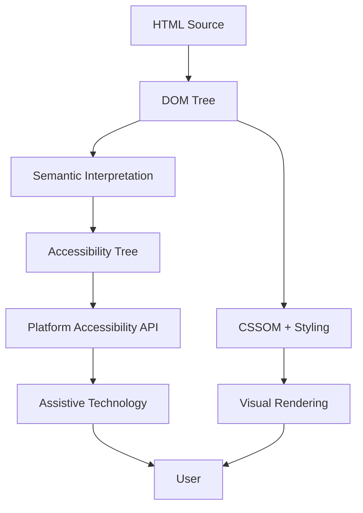
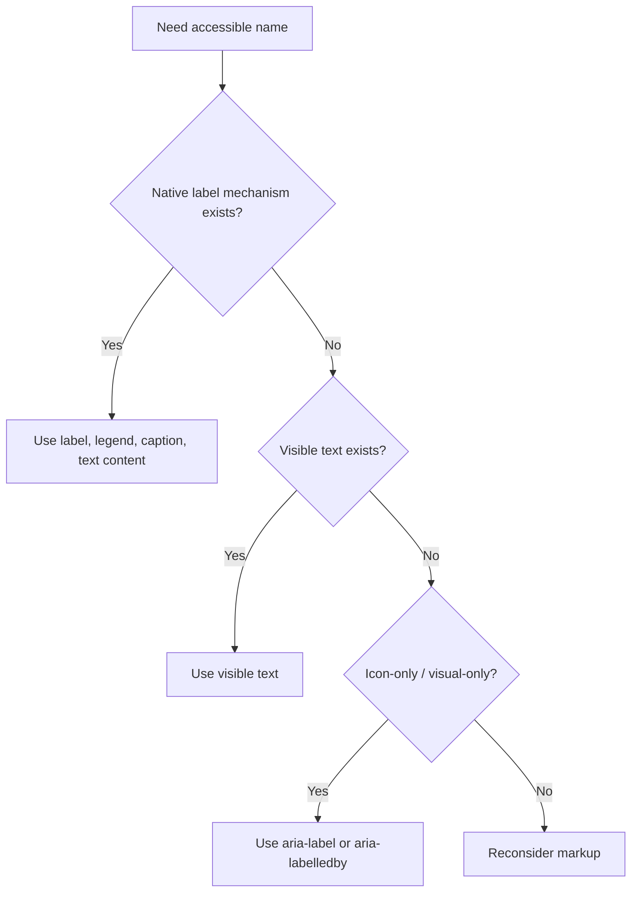
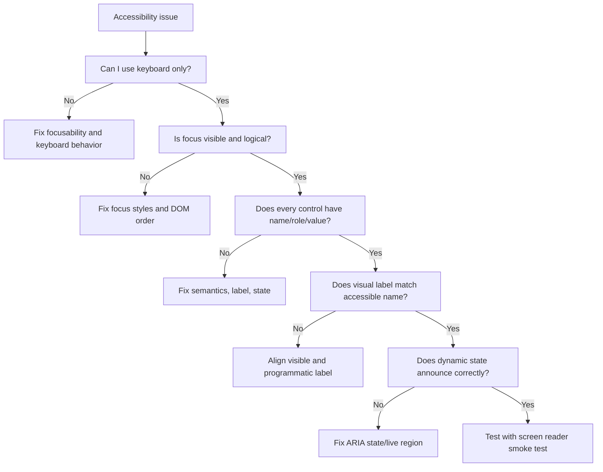

# Part 10 — Accessibility Mental Model: Semantics, Names, Roles, States, and Focus

## 0. Posisi Part Ini Dalam Framework Kaufman

Dalam pendekatan Josh Kaufman, kita tidak memulai accessibility dengan checklist raksasa. Kita mulai dari deconstruction:

> Apa sub-skill kecil yang membuat seseorang mampu membangun UI accessible secara konsisten?

Untuk HTML/CSS, inti accessibility awal bisa direduksi menjadi lima pertanyaan:

1. **What is this thing?** → role/semantics
2. **What is it called?** → accessible name
3. **What is its current condition?** → state/value
4. **How do I operate it?** → keyboard and interaction model
5. **Where am I now?** → focus and navigation context

Jika lima pertanyaan ini bisa dijawab oleh browser dan assistive technology, banyak masalah accessibility besar sudah dicegah sebelum muncul.

---

## 1. Learning Goals

Setelah menyelesaikan part ini, kamu harus bisa:

1. Menjelaskan perbedaan DOM tree, render tree, dan accessibility tree.
2. Memahami kenapa semantic HTML adalah fondasi accessibility.
3. Menentukan accessible name untuk button, link, input, region, dan custom component.
4. Membedakan native role, explicit ARIA role, state, dan property.
5. Mendesain keyboard focus order yang predictable.
6. Menghindari penggunaan ARIA yang merusak semantics native.
7. Men-debug accessibility dengan DevTools dan manual keyboard testing.
8. Membuat review checklist accessibility untuk komponen UI.

---

## 2. Accessibility Is Not a Feature; It Is an Interface Contract

Accessibility sering diperlakukan sebagai:

- “tambahkan aria-label”,
- “cek kontras warna”,
- “pakai screen reader nanti”,
- “urusan compliance”.

Pandangan ini terlalu sempit.

Accessibility adalah kontrak antara UI dan berbagai cara manusia berinteraksi dengan sistem:

- keyboard,
- screen reader,
- screen magnifier,
- voice control,
- switch device,
- high contrast mode,
- reduced motion preference,
- zoom,
- cognitive load constraints,
- motor limitations,
- temporary impairment.

Engineering framing:

> Accessibility is input/output compatibility for humans.

Jika API publik harus jelas name, type, state, dan behavior-nya, UI control juga harus begitu.

---

## 3. The Accessibility Pipeline

Browser tidak hanya membuat DOM dan pixels. Browser juga mengekspos informasi semantic ke platform accessibility API.



Hal penting:

- DOM berisi struktur dokumen.
- Render tree berisi hal yang akan divisualkan.
- Accessibility tree berisi informasi yang relevan untuk assistive technology.
- Tidak semua node DOM masuk accessibility tree.
- CSS dapat mempengaruhi apakah sesuatu terlihat atau tersembunyi.
- ARIA dapat memodifikasi semantic exposure, tetapi tidak mengganti behavior native secara otomatis.

---

## 4. Native Semantics First

HTML native elements membawa semantics dan behavior bawaan.

Contoh:

```html
<button type="button">Approve case</button>
```

Browser sudah tahu:

- role: button,
- accessible name: Approve case,
- focusable: yes,
- keyboard activation: Enter/Space,
- disabled behavior jika ada `disabled`,
- form behavior jika type submit/reset/button.

Bandingkan dengan:

```html
<div class="button">Approve case</div>
```

`div` tidak otomatis punya:

- role button,
- keyboard behavior,
- focusability,
- activation semantics,
- disabled semantics.

Untuk membuat `div` behave seperti button, kamu harus meniru banyak kontrak browser:

```html
<div
  role="button"
  tabindex="0"
  class="button"
  aria-disabled="false"
>
  Approve case
</div>
```

Lalu masih perlu JavaScript untuk:

- handle Enter,
- handle Space,
- prevent scroll pada Space,
- manage disabled behavior,
- emit activation event konsisten.

Kesimpulan:

> Prefer native elements because native elements bundle semantics, focus, keyboard behavior, and platform integration.

---

## 5. Name, Role, Value: The Core Contract

WCAG Success Criterion 4.1.2 membahas bahwa UI components harus memiliki name, role, dan value yang bisa ditentukan secara programmatic.

Untuk setiap interactive component, tanya:

```txt
Name  → Control ini disebut apa?
Role  → Control ini jenis apa?
Value → Nilai/state saat ini apa?
```

Contoh native:

```html
<label for="case-status">Case status</label>
<select id="case-status" name="status">
  <option value="draft">Draft</option>
  <option value="review">In review</option>
  <option value="approved">Approved</option>
</select>
```

Approximate accessibility contract:

```txt
Name: Case status
Role: combobox/select
Value: selected option
State: focusable, enabled
```

Contoh broken:

```html
<select name="status">
  <option value="draft">Draft</option>
</select>
```

Masalah:

- role ada,
- value ada,
- name tidak jelas.

---

## 6. Accessible Name

Accessible name adalah nama programmatic yang dipakai assistive technology untuk menyebut sebuah control atau region.

### 6.1 Button Name

Baik:

```html
<button type="button">Delete evidence</button>
```

Baik untuk icon button:

```html
<button type="button" aria-label="Delete evidence">
  <svg aria-hidden="true" focusable="false" viewBox="0 0 24 24">
    <!-- icon path -->
  </svg>
</button>
```

Buruk:

```html
<button type="button">
  <svg viewBox="0 0 24 24">
    <!-- trash icon -->
  </svg>
</button>
```

Masalah:

- visual user melihat ikon trash,
- screen reader user mungkin hanya mendengar “button”,
- voice control user tidak tahu perintah apa yang harus disebut.

### 6.2 Link Name

Baik:

```html
<a href="/cases/CASE-2026-001">Open case CASE-2026-001</a>
```

Buruk:

```html
<a href="/cases/CASE-2026-001">Click here</a>
```

Link text harus memberi konteks ketika dibaca sendiri.

### 6.3 Input Name

Baik:

```html
<label for="officer-email">Assigned officer email</label>
<input id="officer-email" name="officerEmail" type="email" />
```

Buruk:

```html
<input name="officerEmail" type="email" placeholder="Email" />
```

Placeholder bukan pengganti label. Placeholder hilang saat user mengetik dan sering punya kontras rendah.

---

## 7. Accessible Name Sources: Practical Order

Accessible name bisa berasal dari banyak sumber tergantung element dan algoritma accessible name computation.

Practical mental model:



Prefer order:

1. Native visible label.
2. Visible text content.
3. `aria-labelledby` referencing visible text.
4. `aria-label` only when no visible label exists.

Why prefer visible labels?

- They help everyone.
- They reduce mismatch between visual UI and accessibility tree.
- They help voice control users.
- They are easier to review.

---

## 8. `aria-label` Is Not a Universal Fix

`aria-label` can help. But it can also hide design problems.

Good use:

```html
<button type="button" aria-label="Close dialog">
  <span aria-hidden="true">×</span>
</button>
```

Risky use:

```html
<button type="button" aria-label="Submit enforcement action">
  Continue
</button>
```

Visual text says “Continue”, accessible name says “Submit enforcement action”. This can confuse:

- screen reader users,
- voice control users,
- QA testers,
- documentation.

Rule:

> Accessible name should usually match or include the visible label.

---

## 9. Roles

A role tells assistive technology what kind of object this is.

Native roles:

```html
<button>Save</button>        <!-- button -->
<a href="/cases">Cases</a>  <!-- link -->
<nav>...</nav>              <!-- navigation landmark -->
<main>...</main>            <!-- main landmark -->
<input type="checkbox" />   <!-- checkbox -->
```

Explicit ARIA roles:

```html
<div role="button">Save</div>
<div role="alert">Validation failed</div>
<section role="region" aria-labelledby="evidence-heading">...</section>
```

### 9.1 Do Not Override Native Semantics Without Reason

Bad:

```html
<button role="link">Open case</button>
```

This creates mismatch between expected keyboard behavior and exposed role.

If it navigates, use link:

```html
<a href="/cases/CASE-2026-001">Open case</a>
```

If it performs an action, use button:

```html
<button type="button">Approve case</button>
```

---

## 10. States and Properties

States describe current condition.

Examples:

```html
<button type="button" aria-expanded="false" aria-controls="filters-panel">
  Filters
</button>

<section id="filters-panel" hidden>
  ...
</section>
```

Common states/properties:

| Attribute | Meaning | Common Use |
|---|---|---|
| `aria-expanded` | expanded/collapsed | disclosure, menu button |
| `aria-controls` | control relationship | button controls panel |
| `aria-current` | current item | current page/step |
| `aria-selected` | selected item | tabs/listbox option |
| `aria-checked` | checked state | custom checkbox/switch |
| `aria-invalid` | invalid input | form errors |
| `aria-describedby` | extra description | help/error text |
| `aria-live` | live region | async status updates |
| `disabled` | native disabled | form controls/buttons |
| `readonly` | immutable but focusable input | read-only fields |
| `required` | required native form field | validation |

### 10.1 Native State First

Use native attributes when available:

```html
<input id="terms" type="checkbox" checked />
```

Better than custom:

```html
<div role="checkbox" aria-checked="true" tabindex="0">...</div>
```

Native state usually gives you:

- semantic state,
- keyboard behavior,
- form integration,
- browser validation,
- platform accessibility integration.

---

## 11. Focus

Focus answers:

> Where will keyboard input go now?

A visible pointer user can see mouse location. A keyboard user needs visible focus.

Good:

```css
:focus-visible {
  outline: 3px solid currentColor;
  outline-offset: 3px;
}
```

Bad:

```css
*:focus {
  outline: none;
}
```

Removing focus outline without replacement breaks keyboard navigation.

### 11.1 Sequential Focus Order

Default focus order follows DOM order for focusable elements.

Good DOM order:

```html
<header>...</header>
<nav>...</nav>
<main>
  <h1>Case Detail</h1>
  <button>Approve</button>
  <button>Request changes</button>
</main>
```

Bad pattern:

- visual order changed heavily with CSS,
- DOM order no longer matches reading/order of operation,
- positive `tabindex` used to patch it.

### 11.2 Avoid Positive `tabindex`

Bad:

```html
<button tabindex="3">Save</button>
<button tabindex="1">Cancel</button>
<button tabindex="2">Review</button>
```

Positive tabindex creates manual focus ordering that becomes fragile.

Use:

```html
<button>Cancel</button>
<button>Review</button>
<button>Save</button>
```

Let DOM order express interaction order.

### 11.3 `tabindex` Rules

| Value | Meaning | Use |
|---:|---|---|
| `0` | focusable in normal tab order | custom interactive region when unavoidable |
| `-1` | programmatically focusable, not in tab order | headings/dialog containers after navigation |
| positive | manual tab order | almost always avoid |

---

## 12. Keyboard Interaction

Native controls have expected keyboard behavior.

| Control | Expected Keyboard Behavior |
|---|---|
| Link | Enter activates |
| Button | Enter/Space activates |
| Checkbox | Space toggles |
| Radio group | Arrow keys navigate group |
| Select | Opens/changes via keyboard depending browser/OS |
| Text input | Text editing keys |
| Dialog | Focus moves into dialog and returns after close |

If you build custom controls, you inherit responsibility for matching expected behavior.

Engineering rule:

> If you cannot describe the keyboard contract, you are not ready to build the custom component.

---

## 13. Hidden Content

Different hiding mechanisms have different accessibility effects.

| Mechanism | Visible? | In layout? | Usually in accessibility tree? | Use |
|---|---:|---:|---:|---|
| `hidden` | No | No | No | fully hidden content |
| `display: none` | No | No | No | fully hidden content |
| `visibility: hidden` | No | Space remains | No | rare layout-preserving hide |
| `aria-hidden="true"` | Maybe | Maybe | No | hide decorative/duplicate content from AT |
| `inert` | Visible maybe | Yes | interaction disabled | inactive background/dialog patterns |
| visually-hidden CSS | No visually | Minimal | Yes | screen-reader-only text |

### 13.1 Dangerous Pattern

```html
<button aria-hidden="true">Submit</button>
```

This hides an interactive control from assistive technology while it may still be visible/focusable. Avoid.

### 13.2 Visually Hidden Text

Useful for extra accessible context:

```css
.visually-hidden {
  position: absolute;
  width: 1px;
  height: 1px;
  padding: 0;
  margin: -1px;
  overflow: hidden;
  clip: rect(0 0 0 0);
  white-space: nowrap;
  border: 0;
}
```

```html
<a href="/cases/CASE-2026-001">
  Open
  <span class="visually-hidden">case CASE-2026-001</span>
</a>
```

Use carefully. If context is useful to screen reader users, ask whether it is also useful to visual users.

---

## 14. CSS Can Break Accessibility

CSS is not just visual.

CSS can affect:

- focus visibility,
- visual order,
- contrast,
- text resizing,
- motion,
- hit target size,
- content visibility,
- responsive readability,
- overflow and clipping,
- zoom behavior.

Bad:

```css
.card {
  overflow: hidden;
  height: 2rem;
}
```

If content grows because of translation, zoom, or user font size, text may be clipped.

Bad:

```css
button {
  outline: none;
}
```

Bad:

```css
.container {
  display: flex;
  flex-direction: row-reverse;
}
```

If visual order changes but DOM order does not match user expectation, keyboard navigation becomes confusing.

---

## 15. ARIA: Power Tool, Not Paint

ARIA can change what assistive technology sees. It does not automatically create behavior.

```html
<div role="button" tabindex="0">Approve</div>
```

This exposes something as a button, but it still does not automatically implement native button activation behavior.

### 15.1 Practical ARIA Rules

1. Use native HTML when possible.
2. Do not change native semantics without strong reason.
3. All interactive ARIA controls need keyboard support.
4. Do not hide focusable elements with `aria-hidden`.
5. Accessible names should match visible labels.
6. ARIA state must stay synchronized with UI state.
7. Do not add ARIA just to “look accessible”.

### 15.2 ARIA State Synchronization Bug

Bad:

```html
<button aria-expanded="false" aria-controls="details">Details</button>
<section id="details">...</section>
```

If panel is visible but `aria-expanded="false"`, state lies.

Better:

```html
<button aria-expanded="true" aria-controls="details">Details</button>
<section id="details">...</section>
```

Or if closed:

```html
<button aria-expanded="false" aria-controls="details">Details</button>
<section id="details" hidden>...</section>
```

---

## 16. Landmarks

Landmarks help users navigate page regions.

Native landmark elements:

```html
<header>...</header>
<nav aria-label="Primary">...</nav>
<main>...</main>
<aside>...</aside>
<footer>...</footer>
```

### 16.1 Multiple Navigation Regions

If multiple `nav` elements exist, label them:

```html
<nav aria-label="Primary navigation">...</nav>
<nav aria-label="Case sections">...</nav>
<nav aria-label="Pagination">...</nav>
```

### 16.2 Main Landmark

Usually one primary `<main>` per page.

```html
<main id="main-content">
  <h1>Case Detail</h1>
</main>
```

Skip link:

```html
<a class="skip-link" href="#main-content">Skip to main content</a>
```

---

## 17. Forms Accessibility Revisited

Forms are where accessibility and product correctness meet.

### 17.1 Required Field

```html
<label for="decision">Decision <span aria-hidden="true">*</span></label>
<input id="decision" name="decision" required aria-describedby="decision-help" />
<p id="decision-help">Enter the final enforcement decision.</p>
```

Better if required is explained globally:

```html
<p>Fields marked with * are required.</p>
```

### 17.2 Error Message

```html
<label for="effective-date">Effective date</label>
<input
  id="effective-date"
  name="effectiveDate"
  type="date"
  aria-invalid="true"
  aria-describedby="effective-date-error"
/>
<p id="effective-date-error">Effective date must be today or later.</p>
```

### 17.3 Error Summary

```html
<section aria-labelledby="error-summary-title" tabindex="-1">
  <h2 id="error-summary-title">There are 2 problems with this form</h2>
  <ul>
    <li><a href="#effective-date">Effective date must be today or later.</a></li>
    <li><a href="#decision">Decision is required.</a></li>
  </ul>
</section>
```

Error summary is especially helpful in long enterprise forms.

---

## 18. Dialog Accessibility Preview

Full dialog implementation will be covered later, but mental model matters here.

A modal dialog must usually:

- have an accessible name,
- move focus into dialog when opened,
- prevent interaction with background,
- keep tab focus inside while open,
- close predictably,
- return focus to opener,
- expose correct role/state.

Native baseline:

```html
<dialog aria-labelledby="confirm-title">
  <h2 id="confirm-title">Approve case?</h2>
  <p>This action will move the case to supervisor review.</p>
  <form method="dialog">
    <button value="cancel">Cancel</button>
    <button value="confirm">Approve</button>
  </form>
</dialog>
```

Native `<dialog>` helps, but you still need to test behavior across your target browsers and UX requirements.

---

## 19. Live Regions

Dynamic updates need communication.

Example:

```html
<p role="status" aria-live="polite" id="save-status"></p>
```

Then update text:

```js
document.querySelector("#save-status").textContent = "Draft saved.";
```

Use live regions for:

- async save status,
- validation result summary,
- search result count changes,
- loading complete notification.

Do not overuse `assertive`.

```html
<div role="alert">Payment failed.</div>
```

`alert` can interrupt users. Use only for urgent messages.

---

## 20. Accessibility Debugging Ladder



This ladder prevents random ARIA patching.

---

## 21. Manual Test Protocol

For each page or component:

### Keyboard Test

- [ ] Can I reach all interactive controls with keyboard?
- [ ] Is tab order logical?
- [ ] Is focus visible?
- [ ] Can I activate buttons with Enter/Space?
- [ ] Can I activate links with Enter?
- [ ] Can I escape modal/popover traps?
- [ ] Does focus return to a sensible place?

### Screen Reader Smoke Test

- [ ] Page title is meaningful.
- [ ] H1 describes the page.
- [ ] Landmarks are useful.
- [ ] Buttons have meaningful names.
- [ ] Links make sense out of context.
- [ ] Form inputs announce label and error.
- [ ] Dynamic updates are communicated.

### Visual/Zoom Test

- [ ] UI works at 200% zoom.
- [ ] Text does not clip.
- [ ] Focus indicator is visible.
- [ ] Color is not the only state indicator.
- [ ] Motion is not required to understand content.

---

## 22. Component Contract Template

Use this when designing a component.

```md
# Component Accessibility Contract

## Component
Name: Filter disclosure

## Native Element Preference
Use: `<button>` + controlled panel
Avoid: clickable `<div>`

## Name
Button accessible name: "Filters"
Panel heading: "Filter cases"

## Role
Button: native button
Panel: region only if landmark-like and labelled

## State
Button uses `aria-expanded`
Button uses `aria-controls`
Panel uses `hidden` when collapsed

## Keyboard
Tab reaches button
Enter/Space toggles panel
Focus remains predictable
Escape optional if panel behaves like popover

## Focus
No positive tabindex
Visible focus required

## Failure Cases
State must not say expanded when panel hidden
Panel content must not be focusable when hidden
```

---

## 23. Enterprise UI Accessibility Risks

Enterprise apps often fail accessibility in predictable ways:

### 23.1 Icon-Only Action Columns

```html
<button aria-label="Approve case CASE-2026-001">✓</button>
<button aria-label="Reject case CASE-2026-001">✕</button>
```

Better if visible text can be included at larger breakpoints.

### 23.2 Dense Tables Without Headers

Bad:

```html
<table>
  <tr><td>CASE-001</td><td>Open</td><td>High</td></tr>
</table>
```

Better:

```html
<table>
  <caption>Open enforcement cases</caption>
  <thead>
    <tr>
      <th scope="col">Case ID</th>
      <th scope="col">Status</th>
      <th scope="col">Priority</th>
    </tr>
  </thead>
  <tbody>
    <tr>
      <th scope="row">CASE-001</th>
      <td>Open</td>
      <td>High</td>
    </tr>
  </tbody>
</table>
```

### 23.3 Workflow State Only by Color

Bad:

```html
<span class="badge badge-red"></span>
```

Better:

```html
<span class="badge badge-danger">Overdue</span>
```

### 23.4 Toast-Only Errors

If a form fails and error appears only in a disappearing toast, many users may miss it.

Better:

- persistent inline error,
- error summary,
- focus management,
- optional live region status.

---

## 24. Anti-Patterns

### 24.1 Clickable Div

```html
<div onclick="save()">Save</div>
```

Fix:

```html
<button type="button">Save</button>
```

### 24.2 Link Used as Button

```html
<a href="#" onclick="deleteEvidence()">Delete</a>
```

Fix:

```html
<button type="button">Delete evidence</button>
```

### 24.3 Button Used as Link

```html
<button onclick="location.href='/cases'">Cases</button>
```

Fix:

```html
<a href="/cases">Cases</a>
```

### 24.4 Label-Less Input

```html
<input placeholder="Search" />
```

Fix:

```html
<label for="case-search">Search cases</label>
<input id="case-search" name="q" type="search" />
```

### 24.5 Removing Focus

```css
:focus {
  outline: 0;
}
```

Fix:

```css
:focus-visible {
  outline: 3px solid currentColor;
  outline-offset: 3px;
}
```

---

## 25. Practical Refactoring Example

### Before

```html
<div class="toolbar">
  <div class="icon" onclick="openFilters()">⚙</div>
  <input placeholder="Search" />
  <div class="primary" onclick="approve()">Approve</div>
</div>
```

Problems:

- clickable divs,
- icon button unnamed,
- input has no label,
- Approve is not native button,
- keyboard support missing,
- focus styles likely missing.

### After

```html
<div class="toolbar" aria-label="Case actions">
  <button type="button" aria-label="Open filters" aria-expanded="false" aria-controls="filters-panel">
    <span aria-hidden="true">⚙</span>
  </button>

  <label for="case-search" class="visually-hidden">Search cases</label>
  <input id="case-search" name="q" type="search" placeholder="Search cases" />

  <button type="button">Approve case</button>
</div>

<section id="filters-panel" hidden>
  <h2>Filter cases</h2>
  ...
</section>
```

This is not just “more accessible”. It is more explicit, testable, and maintainable.

---

## 26. Code Review Checklist

For every component PR:

- [ ] Native element used where possible.
- [ ] Interactive controls have meaningful accessible names.
- [ ] Visible label and accessible name are aligned.
- [ ] Role matches behavior.
- [ ] State attributes match actual UI state.
- [ ] Keyboard operation works.
- [ ] Focus order follows DOM/product workflow.
- [ ] Focus indicator is visible.
- [ ] No positive tabindex.
- [ ] No focusable element is hidden from accessibility tree.
- [ ] `aria-hidden` is not applied to interactive controls.
- [ ] Form fields have labels.
- [ ] Errors are programmatically associated.
- [ ] Dynamic updates are announced when necessary.
- [ ] UI works at zoom and with text expansion.

---

## 27. Hands-On Practice

### Exercise 1 — Fix Icon Buttons

Given:

```html
<button><svg><!-- eye --></svg></button>
<button><svg><!-- trash --></svg></button>
```

Refactor so each button has a meaningful accessible name and decorative SVG hidden from accessibility tree.

### Exercise 2 — Form Field Contract

Build a required “Effective date” input with:

- visible label,
- help text,
- required indicator,
- invalid state,
- error message,
- programmatic association.

### Exercise 3 — Keyboard Audit

Take one existing page and navigate only with keyboard.

Record:

- unreachable controls,
- invisible focus,
- illogical order,
- traps,
- controls whose purpose is unclear.

### Exercise 4 — Convert Clickable Divs

Refactor three clickable `div` or `span` controls into correct native elements.

For each, decide:

- is it navigation? → `<a>`
- is it action? → `<button>`
- is it form submission? → `<button type="submit">`

---

## 28. Self-Assessment Rubric

| Level | Capability |
|---:|---|
| 1 | Knows accessibility matters and can add simple labels. |
| 2 | Can use native buttons, links, labels, and headings correctly. |
| 3 | Can reason about name, role, value, focus, and keyboard operation. |
| 4 | Can debug accessibility tree and refactor broken custom components. |
| 5 | Can design component accessibility contracts and enforce them in code review/design system governance. |

Target minimal setelah part ini: **Level 3–4**.

Target top-tier engineer: **Level 5**.

---

## 29. Key Takeaways

Accessibility is not a checklist added after UI is done.

Accessibility emerges from correct contracts:

- semantic HTML,
- meaningful names,
- accurate roles,
- synchronized states,
- keyboard operability,
- visible focus,
- predictable navigation,
- honest dynamic announcements.

The best accessibility fix is often not adding ARIA. It is choosing the correct HTML element and preserving its native behavior.

---

## 30. References

- WCAG 2.2 — https://www.w3.org/TR/WCAG22/
- WCAG 2.2 Understanding: Name, Role, Value — https://www.w3.org/WAI/WCAG22/Understanding/name-role-value
- WCAG 2.2 Understanding: Focus Visible — https://www.w3.org/WAI/WCAG22/Understanding/focus-visible.html
- WCAG 2.2 Understanding: Focus Not Obscured — https://www.w3.org/WAI/WCAG22/Understanding/focus-not-obscured-minimum
- WAI Accessibility Principles — https://www.w3.org/WAI/fundamentals/accessibility-principles/
- WAI ACT Rule: Button has non-empty accessible name — https://www.w3.org/WAI/standards-guidelines/act/rules/97a4e1/
- Accessible Name and Description Computation — https://www.w3.org/TR/accname-1.2/
- WAI-ARIA Authoring Practices Guide — https://www.w3.org/WAI/ARIA/apg/
- WHATWG HTML Living Standard — https://html.spec.whatwg.org/
- MDN Accessibility — https://developer.mozilla.org/en-US/docs/Web/Accessibility
