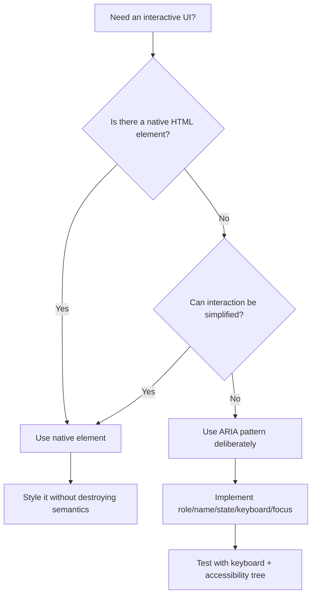
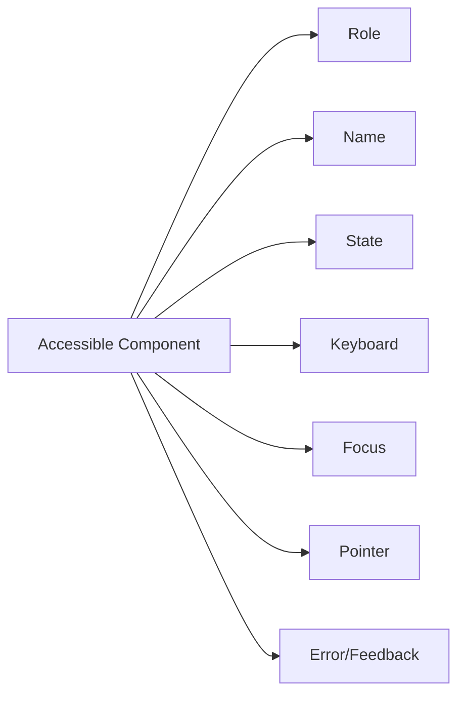
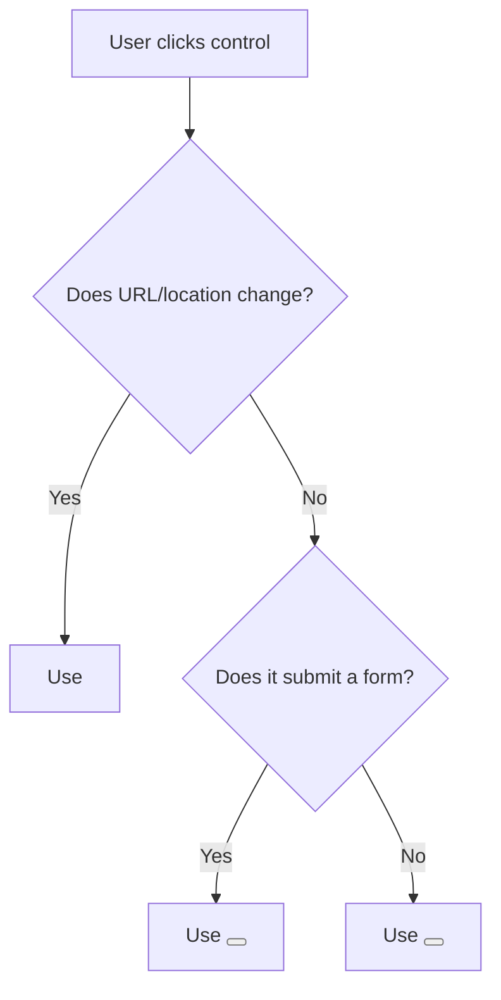
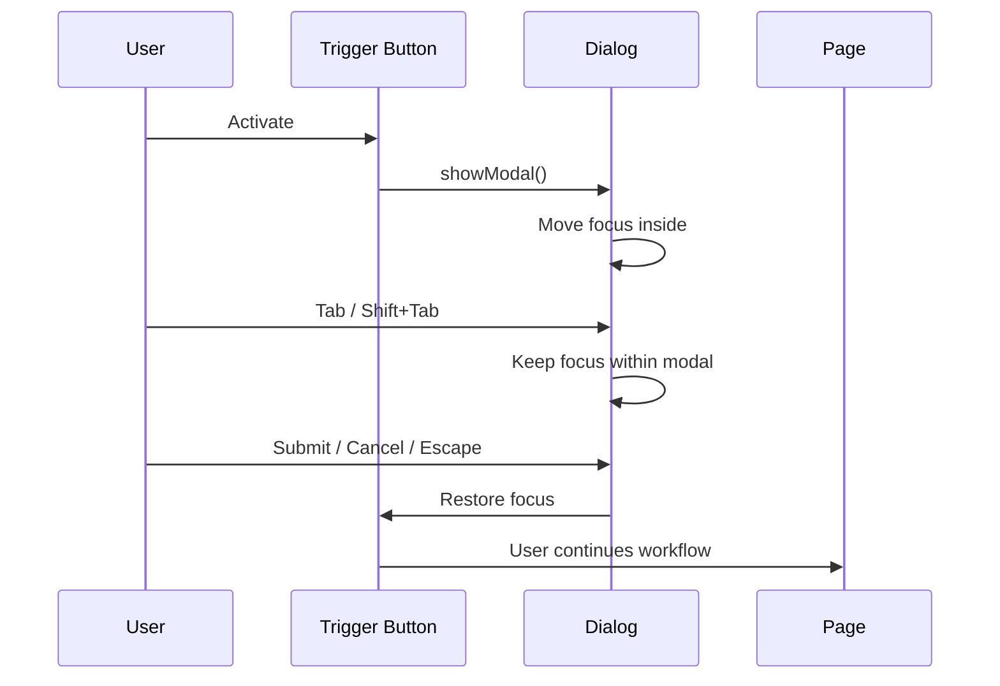
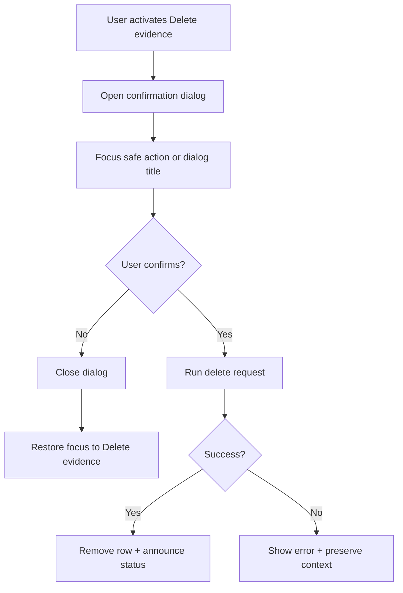
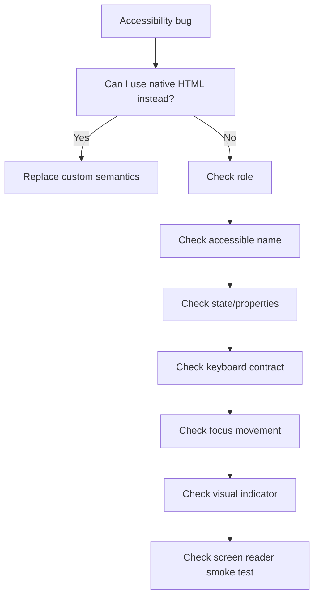

# Part 11 — Practical Accessibility Patterns for Buttons, Links, Dialogs, Menus, Tabs, and Forms

## 1. Posisi Part Ini Dalam Roadmap

Pada part sebelumnya, kita membangun mental model accessibility:

- browser membuat DOM dari HTML;
- sebagian informasi DOM diproyeksikan ke accessibility tree;
- user dengan assistive technology berinteraksi melalui name, role, value/state, focus, dan keyboard contract;
- HTML semantik adalah default terbaik;
- ARIA hanya digunakan untuk menambal semantic gap yang tidak bisa diselesaikan dengan HTML native.

Part ini mengubah mental model tersebut menjadi pattern praktis. Targetnya bukan sekadar “komponen ini lolos Lighthouse”, tetapi mampu membaca sebuah UI dan menjawab:

> “Kontrak interaksi apa yang dijanjikan komponen ini kepada semua user, termasuk keyboard user dan screen reader user?”

Untuk software engineer, accessibility harus diperlakukan seperti protocol design. Setiap interactive component punya kontrak:

- apa role-nya;
- apa namanya;
- apa state-nya;
- apa input yang valid;
- bagaimana focus bergerak;
- bagaimana error diumumkan;
- bagaimana komponen bisa ditutup, dibatalkan, atau dinavigasi;
- bagaimana perilaku tetap masuk akal saat CSS/JS/font/image gagal.

Jika kontrak ini tidak eksplisit, UI akan rapuh.

---

## 2. Tujuan Pembelajaran

Setelah menyelesaikan part ini, kamu harus bisa:

1. membedakan kapan memakai `button`, `a`, `input`, `select`, `dialog`, dan kapan ARIA diperlukan;
2. membuat pola link, button, disclosure, dialog, tab, menu, dan form yang accessible;
3. memahami perbedaan besar antara tampilan visual dan kontrak semantik;
4. mengelola focus untuk modal, popover, validation, dan dynamic UI;
5. mengenali ARIA anti-pattern yang sering merusak native semantics;
6. membuat checklist review accessibility untuk komponen enterprise.

---

## 3. Prinsip Inti: Native First, ARIA Second, Custom Last

Aturan praktis:

> Jika HTML native sudah menyediakan semantic + keyboard behavior + browser integration, gunakan HTML native.

Urutan desain yang defensible:



Native elements biasanya memberi banyak hal gratis:

| Native element | Free contract dari browser |
|---|---|
| `<button>` | role button, keyboard activation, disabled behavior, focusability |
| `<a href>` | role link, navigation semantics, context menu, open in new tab, visited state |
| `<input>` | role sesuai type, label association, validation, autofill, mobile keyboard hints |
| `<select>` | keyboard navigation, option semantics, form integration |
| `<dialog>` | dialog semantics, modal top layer behavior saat `showModal()`, focus behavior yang lebih baik daripada div custom |
| `<summary>` + `<details>` | disclosure behavior, keyboard interaction, expanded/collapsed semantics |

ARIA bisa menambah atau memperjelas semantics, tetapi tidak otomatis memberi behavior. `role="button"` pada `<div>` tidak membuat `Enter`/`Space` bekerja seperti button. Kamu harus mengimplementasikan keyboard behavior, focusability, disabled semantics, dan state sendiri.

---

## 4. Accessible Pattern Anatomy

Setiap component interaktif minimal harus dianalisis dengan tujuh dimensi.



### 4.1 Role

Role menjawab: “Benda ini apa?”

Contoh:

- link;
- button;
- checkbox;
- tab;
- dialog;
- menu item;
- textbox.

Gunakan native role jika memungkinkan. Jangan memberi role yang bertentangan dengan element.

Buruk:

```html
<a href="/delete-account" role="button">Delete account</a>
```

Masalahnya: secara semantik user mengira ini navigasi, tetapi role-nya button. Browser masih bisa memperlakukan beberapa hal sebagai link: URL preview, open in new tab, copy link address. Ini kontrak yang membingungkan.

Lebih baik:

```html
<button type="button">Delete account</button>
```

Atau jika memang navigasi ke halaman konfirmasi:

```html
<a href="/account/delete">Delete account</a>
```

### 4.2 Name

Name menjawab: “Benda ini disebut apa?”

Accessible name bisa berasal dari:

- visible text;
- associated `<label>`;
- `aria-label`;
- `aria-labelledby`;
- `alt` pada image;
- text alternative lain sesuai algoritma accessible name.

Lebih baik visible text menjadi accessible name. `aria-label` boleh dipakai saat tidak ada text visible, misalnya icon-only button.

```html
<button type="button" aria-label="Close dialog">
  <svg aria-hidden="true" focusable="false" viewBox="0 0 24 24">
    <!-- icon path -->
  </svg>
</button>
```

Jika ada text visible, jangan membuat accessible name berbeda tanpa alasan kuat.

Buruk:

```html
<button aria-label="Remove item">Delete</button>
```

Screen reader membaca “Remove item”, user visual melihat “Delete”. Perbedaan ini bisa membingungkan, terutama saat dokumentasi support berkata “klik Delete”.

### 4.3 State

State menjawab: “Kondisinya sekarang apa?”

Contoh state:

- expanded/collapsed;
- selected/unselected;
- checked/unchecked;
- disabled/enabled;
- current page;
- invalid/valid;
- busy/not busy.

HTML native sering sudah menyediakan state.

```html
<input type="checkbox" checked>
<button disabled>Submit</button>
```

ARIA state dipakai saat native tidak cukup:

```html
<button type="button" aria-expanded="false" aria-controls="filter-panel">
  Filters
</button>

<section id="filter-panel" hidden>
  <!-- filter controls -->
</section>
```

### 4.4 Keyboard

Keyboard contract menjawab:

- Apakah bisa dicapai dengan `Tab`?
- Apakah bisa diaktifkan dengan `Enter` atau `Space`?
- Apakah arrow keys punya makna?
- Apakah `Escape` menutup overlay?
- Apakah focus kembali ke trigger?

Jangan membuat komponen yang hanya bisa dipakai mouse.

### 4.5 Focus

Focus menjawab: “User sedang berada di mana?”

Focus bukan detail visual kecil. Focus adalah state navigasi utama untuk keyboard user.

Aturan dasar:

- interactive element harus focusable;
- non-interactive element tidak perlu masuk tab order;
- focus order mengikuti visual/logical order;
- focus indicator harus terlihat;
- setelah dialog/menu ditutup, focus biasanya kembali ke trigger;
- setelah validation error, focus harus membantu user menemukan error, bukan dilempar ke tempat acak.

### 4.6 Pointer

Pointer interaction tetap penting, tetapi bukan satu-satunya input mode.

Pastikan:

- target cukup besar;
- hover bukan satu-satunya cara membuka informasi;
- pointerdown/mousedown tidak merusak focus;
- drag-and-drop punya alternatif keyboard atau fallback.

### 4.7 Feedback

Feedback menjawab: “Apa yang berubah dan bagaimana user tahu?”

Contoh:

- button loading state;
- form error;
- tab panel berubah;
- toast muncul;
- list hasil pencarian diperbarui;
- save berhasil;
- file upload gagal.

Untuk perubahan dinamis, pertimbangkan live region, focus move, inline message, atau status text.

---

## 5. Button Pattern

### 5.1 Kapan Memakai Button

Gunakan `<button>` untuk action:

- submit form;
- open dialog;
- close modal;
- delete item;
- save draft;
- expand panel;
- trigger search;
- toggle setting;
- run command.

Gunakan `<a href>` untuk navigation:

- pindah halaman;
- buka detail record;
- menuju anchor;
- download file jika resource memang link;
- external documentation.

Decision rule:



### 5.2 Button Type

Default `button` di dalam form adalah submit. Ini sering menyebabkan bug.

Selalu tulis `type` secara eksplisit.

```html
<form action="/cases/123/assign" method="post">
  <button type="button" data-action="open-assignee-picker">
    Choose assignee
  </button>

  <button type="submit">
    Assign case
  </button>
</form>
```

### 5.3 Icon Button

Icon-only button butuh accessible name.

```html
<button type="button" class="icon-button" aria-label="Close">
  <svg aria-hidden="true" focusable="false" viewBox="0 0 24 24">
    <path d="..." />
  </svg>
</button>
```

Prinsip:

- icon decorative harus `aria-hidden="true"`;
- button punya `aria-label`;
- jangan mengandalkan `title` sebagai label utama;
- visual focus tetap jelas.

### 5.4 Toggle Button

Toggle button punya dua state: pressed atau not pressed.

```html
<button type="button" aria-pressed="false" id="mute-alerts">
  Mute alerts
</button>
```

Saat aktif:

```html
<button type="button" aria-pressed="true" id="mute-alerts">
  Mute alerts
</button>
```

Catatan penting: label sebaiknya stabil. Jangan mengganti label menjadi “Unmute alerts” sambil juga memakai `aria-pressed`, kecuali kamu benar-benar memahami konsekuensi announcement-nya. Ada dua pola:

**Pola A — stateful toggle:**

```html
<button type="button" aria-pressed="true">
  Mute alerts
</button>
```

Makna: fitur “Mute alerts” sedang pressed/active.

**Pola B — action label:**

```html
<button type="button">
  Unmute alerts
</button>
```

Makna: action berikutnya adalah unmute. Tidak perlu `aria-pressed`.

Jangan campur tanpa alasan.

### 5.5 Loading Button

Masalah umum: button loading tapi user tidak tahu apa yang terjadi.

```html
<button type="submit" aria-describedby="save-status" disabled>
  Saving...
</button>

<p id="save-status" role="status">
  Saving case changes.
</p>
```

Catatan:

- `disabled` mencegah focus pada button di beberapa browser;
- jika status harus diumumkan, gunakan `role="status"` atau live region;
- jangan hanya mengganti warna/spinner tanpa text.

### 5.6 Button Anti-Pattern

Buruk:

```html
<div class="button" onclick="saveCase()">Save</div>
```

Masalah:

- bukan focusable secara default;
- tidak punya role button;
- keyboard activation tidak otomatis;
- disabled state tidak native;
- form integration hilang.

Jika sangat terpaksa custom:

```html
<div
  role="button"
  tabindex="0"
  aria-disabled="false"
  onkeydown="handleButtonKeydown(event)"
  onclick="saveCase()"
>
  Save
</div>
```

Tetapi ini inferior dibanding:

```html
<button type="button" onclick="saveCase()">Save</button>
```

Engineering maturity adalah memilih solusi yang mengurangi kode custom.

---

## 6. Link Pattern

### 6.1 Kapan Memakai Link

Link adalah navigasi ke resource. Link harus punya `href`.

```html
<a href="/cases/CASE-2026-001">View case</a>
```

Tanpa `href`, `<a>` bukan link yang baik.

Buruk:

```html
<a onclick="openCase()">View case</a>
```

Lebih baik:

```html
<a href="/cases/CASE-2026-001">View case</a>
```

Jika SPA ingin intercept navigation, tetap pertahankan `href` agar fallback, copy link, open in new tab, dan semantics tetap ada.

### 6.2 Link Text Harus Bermakna

Buruk:

```html
<a href="/policy">Click here</a>
```

Lebih baik:

```html
<a href="/policy">Read the enforcement policy</a>
```

Untuk tabel:

```html
<a href="/cases/CASE-2026-001">
  CASE-2026-001: Unlicensed activity investigation
</a>
```

Jangan membuat semua link di screen reader terdengar sama.

### 6.3 External Link

```html
<a href="https://example.org/guidance" rel="noreferrer">
  External regulatory guidance
</a>
```

Jika membuka tab baru:

```html
<a href="https://example.org/guidance" target="_blank" rel="noreferrer">
  External regulatory guidance <span class="visually-hidden">opens in a new tab</span>
</a>
```

Catatan:

- hindari `target="_blank"` kecuali ada alasan kuat;
- beri indikasi jika perilaku membuka tab baru penting bagi user;
- `rel="noopener"` biasanya implisit pada browser modern untuk `target="_blank"`, tetapi eksplisit `rel="noreferrer"` atau `noopener` tetap sering dipakai sebagai kebijakan keamanan.

### 6.4 Skip Link

Skip link membantu keyboard user melewati navigasi berulang.

```html
<a class="skip-link" href="#main-content">Skip to main content</a>

<header>...</header>

<main id="main-content" tabindex="-1">
  <h1>Case detail</h1>
  ...
</main>
```

CSS:

```css
.skip-link {
  position: absolute;
  inset-block-start: 0;
  inset-inline-start: 0;
  transform: translateY(-120%);
  padding: 0.75rem 1rem;
  background: Canvas;
  color: CanvasText;
  z-index: 1000;
}

.skip-link:focus {
  transform: translateY(0);
}
```

`tabindex="-1"` pada `main` memungkinkan focus programmatically setelah anchor jump di beberapa situasi.

---

## 7. Disclosure Pattern

Disclosure adalah pola show/hide sederhana. Contoh:

- expand filter panel;
- show advanced options;
- reveal evidence metadata;
- show explanation.

### 7.1 Native Disclosure: details/summary

Jika kebutuhan sederhana, gunakan native.

```html
<details>
  <summary>Advanced filters</summary>

  <form>
    <label for="risk-level">Risk level</label>
    <select id="risk-level" name="riskLevel">
      <option value="">Any</option>
      <option value="high">High</option>
      <option value="medium">Medium</option>
      <option value="low">Low</option>
    </select>
  </form>
</details>
```

Kelebihan:

- keyboard behavior native;
- expanded/collapsed state native;
- tidak perlu JS;
- progressive enhancement bagus.

### 7.2 Custom Disclosure

Jika butuh styling/behavior khusus:

```html
<button
  type="button"
  aria-expanded="false"
  aria-controls="advanced-filters"
  id="advanced-filters-button"
>
  Advanced filters
</button>

<section id="advanced-filters" hidden aria-labelledby="advanced-filters-button">
  ...
</section>
```

JS minimal:

```js
const button = document.querySelector('#advanced-filters-button');
const panel = document.querySelector('#advanced-filters');

button.addEventListener('click', () => {
  const expanded = button.getAttribute('aria-expanded') === 'true';
  button.setAttribute('aria-expanded', String(!expanded));
  panel.hidden = expanded;
});
```

Kontrak:

- button punya `aria-expanded`;
- button menunjuk panel dengan `aria-controls`;
- panel disembunyikan dengan `hidden` saat collapsed;
- focus tidak perlu pindah kecuali ada alasan jelas.

---

## 8. Dialog Pattern

Dialog adalah UI overlay yang meminta user menyelesaikan tugas atau mengambil keputusan.

Contoh:

- confirm delete;
- edit assignee;
- upload evidence;
- review enforcement action;
- add note;
- select reason code.

Dialog paling berisiko karena bisa merusak focus, keyboard navigation, scroll, dan screen reader context.

### 8.1 Modal vs Non-Modal

**Modal dialog** memblokir interaksi dengan konten di belakangnya.

**Non-modal dialog** tidak memblokir halaman utama.

Jangan memakai modal untuk semua hal. Modal menambah cognitive load dan state management.

Gunakan modal jika:

- user harus mengambil keputusan sebelum lanjut;
- action destructive perlu konfirmasi;
- flow pendek dan bounded;
- task benar-benar contextual.

Hindari modal jika:

- konten panjang;
- ada banyak nested interaction;
- user perlu membandingkan dengan informasi di page;
- modal hanya untuk menampilkan informasi yang bisa inline.

### 8.2 Native Dialog

HTML menyediakan `<dialog>`.

```html
<button type="button" id="open-close-case-dialog">
  Close case
</button>

<dialog id="close-case-dialog" aria-labelledby="close-case-title">
  <form method="dialog">
    <h2 id="close-case-title">Close case</h2>
    <p>Are you sure you want to close this case?</p>

    <div class="actions">
      <button type="submit" value="cancel">Cancel</button>
      <button type="submit" value="confirm">Close case</button>
    </div>
  </form>
</dialog>
```

JS:

```js
const trigger = document.querySelector('#open-close-case-dialog');
const dialog = document.querySelector('#close-case-dialog');

trigger.addEventListener('click', () => {
  dialog.showModal();
});

dialog.addEventListener('close', () => {
  if (dialog.returnValue === 'confirm') {
    // Perform close-case command.
  }

  trigger.focus();
});
```

### 8.3 Dialog Contract

Modal dialog harus memenuhi kontrak ini:

1. focus masuk ke dialog saat dibuka;
2. `Tab` dan `Shift+Tab` tidak keluar dari modal;
3. `Escape` menutup dialog jika aman;
4. dialog punya accessible name, biasanya dari heading;
5. focus kembali ke trigger saat ditutup;
6. background tidak bisa dioperasikan;
7. close control tersedia jika flow boleh dibatalkan;
8. content tidak bergantung hanya pada visual overlay.

Diagram focus:



### 8.4 Initial Focus Strategy

Tidak semua dialog harus fokus ke tombol pertama.

Gunakan heuristik:

| Dialog type | Initial focus |
|---|---|
| Simple confirmation | least destructive action, often Cancel |
| Form dialog | first input, or heading if context must be read first |
| Long content dialog | heading/container with `tabindex="-1"` |
| Destructive confirmation | Cancel button or heading; avoid focus on destructive action by default |
| Alert dialog | message/title or safe action |

Contoh long dialog:

```html
<dialog id="terms-dialog" aria-labelledby="terms-title">
  <h2 id="terms-title" tabindex="-1">Terms for enforcement submission</h2>
  <p>Long explanatory content...</p>
  <button type="button" data-close>Close</button>
</dialog>
```

Setelah `showModal()`, fokuskan heading jika perlu:

```js
dialog.showModal();
dialog.querySelector('#terms-title').focus();
```

### 8.5 Alert Dialog

Untuk keputusan penting:

```html
<dialog id="delete-evidence-dialog" aria-labelledby="delete-title" aria-describedby="delete-desc">
  <h2 id="delete-title">Delete evidence file?</h2>
  <p id="delete-desc">
    This removes the file from the case record. This action cannot be undone.
  </p>

  <form method="dialog">
    <button value="cancel">Cancel</button>
    <button value="delete">Delete evidence</button>
  </form>
</dialog>
```

Catatan: Jangan terlalu cepat memberi `role="alertdialog"` jika native dialog dengan heading/description sudah cukup. Gunakan pattern sesuai kebutuhan.

### 8.6 Dialog Anti-Pattern

Buruk:

```html
<div class="modal">
  <div class="modal-content">
    <h2>Delete record?</h2>
    <div onclick="deleteRecord()">OK</div>
  </div>
</div>
```

Masalah:

- tidak ada dialog semantics;
- background mungkin tetap bisa difokuskan;
- close/escape tidak jelas;
- focus tidak dikelola;
- action pakai div;
- screen reader bisa kehilangan konteks.

---

## 9. Popover Pattern

Popover adalah overlay ringan yang biasanya contextual.

Contoh:

- user menu;
- quick filter;
- action list;
- contextual details;
- help content.

HTML modern punya Popover API dengan atribut `popover` untuk banyak use case non-modal.

```html
<button type="button" popovertarget="case-actions">
  Case actions
</button>

<div id="case-actions" popover>
  <ul>
    <li><button type="button">Assign</button></li>
    <li><button type="button">Escalate</button></li>
    <li><button type="button">Export PDF</button></li>
  </ul>
</div>
```

Namun jangan otomatis menyebut popover sebagai menu. Jika isinya hanya beberapa button biasa, mungkin cukup button dalam popover.

### 9.1 Popover vs Dialog vs Disclosure

| Pattern | Blocking? | Typical use | Focus behavior |
|---|---:|---|---|
| Disclosure | No | inline show/hide | focus stays on trigger |
| Popover | Usually no | contextual overlay | depends on interaction |
| Modal dialog | Yes | bounded task/decision | focus moves/trapped inside |

### 9.2 Popover Accessibility Checklist

- trigger adalah button;
- trigger punya nama jelas;
- overlay bisa ditutup;
- keyboard user bisa mencapai isi;
- `Escape` behavior masuk akal;
- focus restore setelah close;
- content tidak hilang saat user mencoba menggerakkan pointer/focus;
- hover-only popover dihindari untuk informasi penting.

---

## 10. Menu Pattern

Menu adalah salah satu pattern yang paling sering disalahgunakan.

Dalam accessibility, “menu” bukan sekadar daftar link vertikal. Menu pattern punya keyboard contract yang mirip aplikasi desktop:

- arrow key navigation;
- menuitem roles;
- focus management khusus;
- typeahead pada beberapa implementation;
- escape untuk close;
- nested menu complexity.

Gunakan menu pattern hanya untuk command menu atau application-like action menu.

### 10.1 Navigation List Bukan Menu

Buruk:

```html
<nav role="menu">
  <a role="menuitem" href="/dashboard">Dashboard</a>
  <a role="menuitem" href="/cases">Cases</a>
  <a role="menuitem" href="/reports">Reports</a>
</nav>
```

Lebih baik:

```html
<nav aria-label="Primary navigation">
  <ul>
    <li><a href="/dashboard">Dashboard</a></li>
    <li><a href="/cases" aria-current="page">Cases</a></li>
    <li><a href="/reports">Reports</a></li>
  </ul>
</nav>
```

Navigation web normal tidak perlu `role="menu"`.

### 10.2 Action Menu

Untuk daftar command contextual:

```html
<button
  type="button"
  id="case-actions-button"
  aria-haspopup="menu"
  aria-expanded="false"
  aria-controls="case-actions-menu"
>
  Actions
</button>

<ul id="case-actions-menu" role="menu" aria-labelledby="case-actions-button" hidden>
  <li role="none">
    <button type="button" role="menuitem">Assign case</button>
  </li>
  <li role="none">
    <button type="button" role="menuitem">Escalate</button>
  </li>
  <li role="none">
    <button type="button" role="menuitem">Export PDF</button>
  </li>
</ul>
```

Minimal keyboard contract:

| Key | Behavior |
|---|---|
| `Enter` / `Space` on trigger | open menu |
| `ArrowDown` on trigger | open menu and focus first item |
| `ArrowUp` on trigger | open menu and focus last item |
| `ArrowDown` inside menu | move to next item |
| `ArrowUp` inside menu | move to previous item |
| `Home` | first item |
| `End` | last item |
| `Escape` | close menu and restore focus to trigger |
| `Tab` | usually close menu and move focus normally |

Jika kamu tidak mengimplementasikan keyboard contract ini, jangan pakai `role="menu"`. Gunakan popover biasa berisi buttons.

### 10.3 Simpler Alternative: Popover With Buttons

```html
<button type="button" popovertarget="actions-popover">Actions</button>

<div id="actions-popover" popover>
  <button type="button">Assign case</button>
  <button type="button">Escalate</button>
  <button type="button">Export PDF</button>
</div>
```

Ini sering lebih cukup untuk web app CRUD/enterprise.

---

## 11. Tabs Pattern

Tabs dipakai untuk mengganti panel konten dalam konteks yang sama.

Contoh:

- Case overview / Evidence / History / Notes;
- Profile / Security / Preferences;
- Draft / Submitted / Approved.

Jangan pakai tabs jika sebenarnya navigasi antar halaman besar. Untuk page navigation, gunakan link/nav.

### 11.1 Tabs Semantics

```html
<div class="tabs">
  <div role="tablist" aria-label="Case sections">
    <button
      type="button"
      role="tab"
      id="tab-overview"
      aria-controls="panel-overview"
      aria-selected="true"
    >
      Overview
    </button>

    <button
      type="button"
      role="tab"
      id="tab-evidence"
      aria-controls="panel-evidence"
      aria-selected="false"
      tabindex="-1"
    >
      Evidence
    </button>

    <button
      type="button"
      role="tab"
      id="tab-history"
      aria-controls="panel-history"
      aria-selected="false"
      tabindex="-1"
    >
      History
    </button>
  </div>

  <section
    role="tabpanel"
    id="panel-overview"
    aria-labelledby="tab-overview"
  >
    <h2>Overview</h2>
    ...
  </section>

  <section
    role="tabpanel"
    id="panel-evidence"
    aria-labelledby="tab-evidence"
    hidden
  >
    <h2>Evidence</h2>
    ...
  </section>

  <section
    role="tabpanel"
    id="panel-history"
    aria-labelledby="tab-history"
    hidden
  >
    <h2>History</h2>
    ...
  </section>
</div>
```

### 11.2 Tabs Keyboard Contract

| Key | Behavior |
|---|---|
| `Tab` | move into selected tab, then tab panel content |
| `ArrowRight` | next tab |
| `ArrowLeft` | previous tab |
| `Home` | first tab |
| `End` | last tab |
| `Enter` / `Space` | activate focused tab if manual activation |

Two activation models:

1. **Automatic activation**: arrow focus also activates tab.
2. **Manual activation**: arrow moves focus, `Enter`/`Space` activates.

Gunakan automatic activation jika panel ringan dan instan. Gunakan manual jika panel mahal, lazy-loaded, atau perubahan konten terlalu besar.

### 11.3 Tabs State Update

Saat tab berubah:

- selected tab: `aria-selected="true"`, `tabindex="0"`;
- unselected tabs: `aria-selected="false"`, `tabindex="-1"`;
- selected panel visible;
- unselected panels hidden;
- focus tetap di tab kecuali ada alasan pindah.

### 11.4 Tabs Anti-Pattern

Buruk:

```html
<div class="tab active">Overview</div>
<div class="tab">Evidence</div>
<div class="tab">History</div>
```

Masalah:

- tidak focusable;
- tidak punya role;
- tidak punya selected state;
- keyboard navigation tidak ada;
- hubungan tab-panel tidak jelas.

Jika tidak mau mengimplementasikan tabs contract, gunakan heading + anchor links atau accordion/disclosure.

---

## 12. Form Pattern Revisited: Accessibility in Workflow Terms

Forms adalah tempat accessibility paling sering berdampak langsung pada conversion, correctness, dan support burden.

### 12.1 Label Is Not Placeholder

Buruk:

```html
<input type="text" name="caseId" placeholder="Case ID">
```

Masalah:

- placeholder hilang saat user mengetik;
- tidak selalu menjadi accessible label yang baik;
- kontras placeholder sering rendah;
- instruksi dan label bercampur.

Baik:

```html
<label for="case-id">Case ID</label>
<input id="case-id" name="caseId" type="text" autocomplete="off">
<p id="case-id-hint">Example: CASE-2026-001</p>
```

Dengan hint terhubung:

```html
<label for="case-id">Case ID</label>
<input
  id="case-id"
  name="caseId"
  type="text"
  aria-describedby="case-id-hint"
>
<p id="case-id-hint">Example: CASE-2026-001</p>
```

### 12.2 Required Fields

```html
<label for="closure-reason">
  Closure reason <span aria-hidden="true">*</span>
</label>
<select id="closure-reason" name="closureReason" required>
  <option value="">Select a reason</option>
  <option value="resolved">Resolved</option>
  <option value="duplicate">Duplicate</option>
  <option value="out-of-scope">Out of scope</option>
</select>
```

Tambahkan instruksi global:

```html
<p id="required-note">
  Fields marked with an asterisk are required.
</p>
```

Atau tulis explicit dalam label:

```html
<label for="closure-reason">Closure reason required</label>
```

Yang penting: required state tidak hanya warna merah atau asterisk visual.

### 12.3 Error Identification

```html
<div class="field">
  <label for="decision-date">Decision date</label>
  <input
    id="decision-date"
    name="decisionDate"
    type="date"
    aria-invalid="true"
    aria-describedby="decision-date-error"
  >
  <p id="decision-date-error" class="field-error">
    Enter a decision date before today.
  </p>
</div>
```

Prinsip:

- field error ditulis dalam text;
- field ditandai invalid;
- error message terhubung via `aria-describedby`;
- jangan hanya mengandalkan border merah;
- error message harus actionable.

### 12.4 Error Summary

Untuk form panjang:

```html
<div class="error-summary" role="alert" tabindex="-1" id="form-errors">
  <h2>There are 3 problems with this submission</h2>
  <ul>
    <li><a href="#decision-date">Decision date must be before today.</a></li>
    <li><a href="#closure-reason">Closure reason is required.</a></li>
    <li><a href="#summary">Summary must be at least 30 characters.</a></li>
  </ul>
</div>
```

Setelah submit gagal:

```js
const summary = document.querySelector('#form-errors');
summary.focus();
```

Ini membantu keyboard/screen reader user langsung tahu bahwa submission gagal dan bisa lompat ke field bermasalah.

### 12.5 Grouping Controls

Radio buttons dan checkboxes sering butuh group label.

```html
<fieldset>
  <legend>Risk level</legend>

  <label>
    <input type="radio" name="riskLevel" value="high">
    High
  </label>

  <label>
    <input type="radio" name="riskLevel" value="medium">
    Medium
  </label>

  <label>
    <input type="radio" name="riskLevel" value="low">
    Low
  </label>
</fieldset>
```

Tanpa `fieldset`/`legend`, setiap radio punya label individual tetapi group question bisa hilang.

### 12.6 Search Form

```html
<form role="search" action="/cases" method="get">
  <label for="case-search">Search cases</label>
  <input id="case-search" name="q" type="search" autocomplete="off">
  <button type="submit">Search</button>
</form>
```

`role="search"` boleh digunakan sebagai landmark search. Untuk HTML modern, kamu juga bisa memakai container semantic jika sesuai.

### 12.7 Multi-Step Form

Multi-step enterprise workflow harus jelas:

- current step;
- completed step;
- upcoming step;
- error di step lain;
- tombol back/next/submit;
- state tersimpan atau belum;
- apa yang terjadi saat reload.

Markup stepper sederhana:

```html
<nav aria-label="Submission progress">
  <ol>
    <li><a href="/submit/details" aria-current="step">Details</a></li>
    <li><a href="/submit/evidence">Evidence</a></li>
    <li><a href="/submit/review">Review</a></li>
  </ol>
</nav>
```

Gunakan `aria-current="step"` untuk langkah aktif.

---

## 13. Focus Management Patterns

### 13.1 Jangan Menghapus Outline Sembarangan

Buruk:

```css
*:focus {
  outline: none;
}
```

Ini membuat keyboard user kehilangan posisi.

Lebih baik:

```css
:focus-visible {
  outline: 3px solid currentColor;
  outline-offset: 3px;
}
```

Kamu boleh mendesain focus ring, tetapi jangan menghilangkannya tanpa pengganti yang jelas.

### 13.2 tabindex Rules

| Value | Meaning | Usage |
|---:|---|---|
| `0` | masuk natural tab order berdasarkan DOM position | custom focusable element jika benar-benar perlu |
| `-1` | bisa difokuskan via JS, tidak masuk tab order | heading after navigation, dialog title, error summary |
| positive number | custom tab order | hampir selalu hindari |

Hindari:

```html
<button tabindex="5">Save</button>
<button tabindex="1">Cancel</button>
```

Positive tabindex menciptakan tab order artifisial yang sulit dirawat.

### 13.3 Focus After Route Change

SPA sering gagal memberi konteks setelah navigation.

Pola:

```html
<main id="main-content" tabindex="-1">
  <h1>Case CASE-2026-001</h1>
</main>
```

Saat route berubah:

```js
document.querySelector('#main-content').focus();
```

Atau fokuskan heading utama.

### 13.4 Focus After Dynamic Insert

Jika user menambahkan note, jangan otomatis memindahkan focus kecuali dibutuhkan. Tetapi beri feedback.

```html
<p role="status" id="note-status"></p>
```

```js
status.textContent = 'Note added.';
```

Jika insert menghasilkan form error, focus ke error summary.

---

## 14. Visually Hidden Text

Kadang informasi perlu tersedia untuk screen reader tetapi tidak terlihat visual.

CSS utility:

```css
.visually-hidden {
  position: absolute;
  width: 1px;
  height: 1px;
  padding: 0;
  margin: -1px;
  overflow: hidden;
  clip: rect(0 0 0 0);
  white-space: nowrap;
  border: 0;
}
```

Contoh:

```html
<a href="/cases/CASE-2026-001">
  View <span class="visually-hidden">case CASE-2026-001</span>
</a>
```

Namun jangan menyembunyikan semua label visual. Accessibility bukan alasan untuk membuat UI lebih ambigu bagi sighted users.

---

## 15. Live Regions

Live region mengumumkan update dinamis.

### 15.1 Status Message

```html
<p role="status" id="save-status"></p>
```

```js
saveStatus.textContent = 'Draft saved at 14:32.';
```

`role="status"` biasanya polite.

### 15.2 Alert Message

```html
<div role="alert">
  Upload failed. The file exceeds the 25 MB limit.
</div>
```

Gunakan alert untuk error penting. Jangan spam alert untuk setiap update kecil.

### 15.3 Loading State

```html
<section aria-busy="true" aria-describedby="loading-cases">
  <p id="loading-cases" role="status">Loading cases...</p>
</section>
```

Setelah selesai:

```html
<section aria-busy="false">
  <!-- loaded content -->
</section>
```

---

## 16. Hidden Content: `hidden`, `display:none`, `visibility:hidden`, `aria-hidden`

Tidak semua “hidden” sama.

| Technique | Visual | Accessibility tree | Layout |
|---|---|---|---|
| `hidden` | hidden | usually hidden | removed |
| `display: none` | hidden | hidden | removed |
| `visibility: hidden` | hidden | hidden | space remains |
| `aria-hidden="true"` | visible unless CSS hides | hidden from accessibility tree | unaffected |
| visually hidden CSS | visually hidden | available | tiny/absolute |

### 16.1 aria-hidden Danger

Buruk:

```html
<button aria-hidden="true">Save</button>
```

Ini menyembunyikan button dari assistive technology tetapi masih terlihat/operable secara visual. Jangan pernah menaruh focusable interactive element di dalam subtree `aria-hidden="true"`.

### 16.2 Icon Hiding

Baik:

```html
<button type="button">
  <svg aria-hidden="true" focusable="false" viewBox="0 0 24 24">...</svg>
  Save
</button>
```

Icon decorative disembunyikan, text tetap menjadi accessible name.

---

## 17. Disabled vs aria-disabled

### 17.1 Native Disabled

```html
<button type="submit" disabled>Submit</button>
```

Native disabled:

- tidak focusable;
- tidak clickable;
- tidak ikut form submission;
- announced sebagai disabled.

### 17.2 aria-disabled

```html
<button type="button" aria-disabled="true">
  Submit
</button>
```

`aria-disabled` hanya semantic. Kamu tetap harus mencegah action di JS.

Kapan berguna?

- item tetap perlu discoverable dalam tab order;
- user perlu membaca alasan disabled;
- custom component tidak mendukung `disabled` native.

Contoh:

```html
<button type="button" aria-disabled="true" aria-describedby="submit-disabled-reason">
  Submit report
</button>
<p id="submit-disabled-reason">Complete all required evidence fields before submitting.</p>
```

JS:

```js
button.addEventListener('click', (event) => {
  if (button.getAttribute('aria-disabled') === 'true') {
    event.preventDefault();
    return;
  }

  submitReport();
});
```

Jangan memakai `aria-disabled` jika native `disabled` sudah cukup.

---

## 18. Enterprise Pattern: Case Action Toolbar

Contoh toolbar pada case management screen:

```html
<section aria-labelledby="case-actions-title" class="case-actions">
  <h2 id="case-actions-title" class="visually-hidden">Case actions</h2>

  <button type="button">Assign</button>
  <button type="button">Escalate</button>
  <button type="button">Request information</button>

  <button
    type="button"
    aria-expanded="false"
    aria-controls="more-actions"
    id="more-actions-button"
  >
    More actions
  </button>

  <div id="more-actions" hidden aria-labelledby="more-actions-button">
    <button type="button">Export PDF</button>
    <button type="button">Print case</button>
    <button type="button">Archive</button>
  </div>
</section>
```

Engineering notes:

- toolbar punya label;
- command adalah button;
- overflow actions memakai disclosure/popover;
- destructive actions sebaiknya memicu confirmation dialog;
- jangan mencampur navigation dan commands tanpa label jelas.

---

## 19. Enterprise Pattern: Destructive Action Flow

Flow delete evidence:



Markup sketch:

```html
<button type="button" id="delete-evidence-17">
  Delete evidence file report.pdf
</button>

<dialog id="delete-evidence-dialog" aria-labelledby="delete-evidence-title">
  <h2 id="delete-evidence-title">Delete evidence file?</h2>
  <p>This action removes report.pdf from the case evidence list.</p>

  <form method="dialog">
    <button value="cancel">Cancel</button>
    <button value="confirm">Delete file</button>
  </form>
</dialog>

<p id="case-status" role="status"></p>
```

Success announcement:

```js
status.textContent = 'Evidence file report.pdf deleted.';
```

---

## 20. CSS and Accessibility

CSS bisa merusak accessibility walaupun HTML benar.

### 20.1 Reordering Visual Layout

```css
.card-actions {
  order: -1;
}
```

Flex/Grid `order` bisa membuat visual order berbeda dari DOM/focus order. Jika perbedaannya signifikan, keyboard user akan mengalami urutan yang membingungkan.

Prinsip:

- DOM order harus mengikuti reading/focus order;
- gunakan CSS order hanya untuk perubahan minor/non-critical;
- jangan membuat mobile/desktop order yang bertentangan dengan logika konten.

### 20.2 Hiding Focus Ring

Sudah dibahas: jangan `outline: none` tanpa pengganti.

### 20.3 Color-Only State

Buruk:

```css
.field.invalid {
  border-color: red;
}
```

Lebih baik:

```html
<input aria-invalid="true" aria-describedby="email-error">
<p id="email-error">Enter a valid email address.</p>
```

Warna boleh memperkuat, tetapi state harus tersedia dalam text/semantics.

### 20.4 Hover-Only Content

Jika tooltip hanya muncul saat hover, keyboard/touch user bisa kehilangan informasi.

Pastikan content penting bisa muncul lewat focus/click atau selalu tersedia.

---

## 21. ARIA Anti-Patterns

### 21.1 Redundant Role

Tidak perlu:

```html
<button role="button">Save</button>
```

`button` sudah punya role button.

### 21.2 Wrong Role

Buruk:

```html
<h2 role="button">Advanced filters</h2>
```

Heading berubah menjadi button sehingga struktur dokumen rusak. Lebih baik:

```html
<h2>Advanced filters</h2>
<button type="button" aria-expanded="false">Show advanced filters</button>
```

Atau:

```html
<h2>
  <button type="button" aria-expanded="false" aria-controls="advanced-filters">
    Advanced filters
  </button>
</h2>
```

### 21.3 aria-label That Overrides Useful Text

Buruk:

```html
<button aria-label="Submit">Submit final enforcement recommendation</button>
```

Screen reader mendapat label lebih miskin daripada visual text.

### 21.4 aria-hidden on Parent With Focusable Children

Buruk:

```html
<div aria-hidden="true">
  <button>Close</button>
</div>
```

Focusable content disembunyikan dari accessibility tree.

### 21.5 Fake Disabled

Buruk:

```html
<button class="disabled">Submit</button>
```

Jika hanya class, button masih aktif secara keyboard/click kecuali JS/CSS menambal. Gunakan `disabled` atau `aria-disabled` dengan behavior yang benar.

---

## 22. Debugging Accessibility Patterns

Gunakan ladder ini:



### 22.1 DevTools Checklist

In browser DevTools:

- inspect element;
- check computed role;
- check accessible name;
- check focusable state;
- inspect aria attributes;
- check hidden/accessibility tree inclusion;
- test CSS state `:focus-visible`;
- test with keyboard only.

### 22.2 Keyboard Smoke Test

Tanpa mouse:

1. reload page;
2. tekan `Tab` sampai semua interactive control utama tercapai;
3. pastikan focus indicator terlihat;
4. aktifkan link/button dengan keyboard;
5. buka/tutup dialog dengan keyboard;
6. submit form invalid;
7. baca error dan pindah ke field bermasalah;
8. pastikan tidak ada keyboard trap;
9. pastikan urutan focus masuk akal;
10. pastikan user bisa menyelesaikan task utama.

---

## 23. Code Review Checklist

Untuk setiap komponen interaktif, tanyakan:

- Apakah element native yang dipakai sudah tepat?
- Jika custom, apakah role/name/state/keyboard/focus lengkap?
- Apakah button punya `type`?
- Apakah link punya `href`?
- Apakah icon-only control punya accessible name?
- Apakah focus indicator terlihat?
- Apakah focus order sesuai DOM dan visual intent?
- Apakah dialog memindahkan dan mengembalikan focus?
- Apakah menu benar-benar menu, atau cukup popover biasa?
- Apakah form control punya label?
- Apakah error ditulis dalam text dan terhubung ke field?
- Apakah state tidak hanya disampaikan dengan warna?
- Apakah `aria-hidden` tidak membungkus interactive content?
- Apakah `disabled`/`aria-disabled` dipakai sesuai behavior?
- Apakah dynamic updates diumumkan saat perlu?

---

## 24. Practice: 90-Minute Drill

Bangun satu halaman “Case Review” kecil dengan elemen berikut:

1. primary navigation dengan `aria-current`;
2. skip link;
3. action toolbar berisi Assign, Escalate, More Actions;
4. disclosure untuk advanced filters;
5. tabs: Overview, Evidence, History;
6. evidence table dengan action Delete;
7. delete confirmation dialog;
8. form “Add note” dengan validation error;
9. status message setelah note tersimpan;
10. visible focus style.

Constraint:

- Tidak boleh memakai `<div onclick>` untuk action;
- Semua control harus bisa dioperasikan dengan keyboard;
- Semua icon-only button harus punya accessible name;
- Error tidak boleh hanya warna;
- Dialog harus restore focus.

---

## 25. Self-Assessment Rubric

| Level | Indikator |
|---|---|
| Beginner | Bisa menambahkan label dan alt text, tetapi masih sering memakai div sebagai button |
| Intermediate | Bisa memilih button/link/form element dengan benar dan menjaga focus dasar |
| Advanced | Bisa mengimplementasikan dialog, tabs, disclosure, error summary, dan dynamic status dengan kontrak jelas |
| Expert | Bisa menghindari custom ARIA yang tidak perlu, membuat component API accessible, dan mereview UI kompleks secara sistematis |

Target seri ini minimal membawa kamu ke level **Advanced**, lalu capstone Part 32 mengarah ke operating model **Expert**.

---

## 26. Ringkasan Mental Model

Accessibility pattern bukan checklist kosmetik. Ia adalah desain kontrak interaksi.

Ingat lima aturan:

1. gunakan HTML native sebelum ARIA;
2. setiap interactive control butuh role, name, state, keyboard, dan focus behavior yang benar;
3. focus adalah state navigasi, bukan detail CSS;
4. dialog/menu/tabs punya keyboard contract khusus;
5. error dan status harus tersedia sebagai text/semantics, bukan hanya warna/spinner.

Jika kamu memegang aturan ini, sebagian besar accessibility bug bisa dicegah sebelum testing.

---

## 27. Referensi Utama

- WAI-ARIA Authoring Practices Guide: https://www.w3.org/WAI/ARIA/apg/
- WAI-ARIA Dialog Modal Pattern: https://www.w3.org/WAI/ARIA/apg/patterns/dialog-modal/
- WCAG 2.2: https://www.w3.org/TR/WCAG22/
- WCAG Focus Visible Understanding: https://www.w3.org/WAI/WCAG22/Understanding/focus-visible.html
- WCAG Error Identification Understanding: https://www.w3.org/WAI/WCAG22/Understanding/error-identification.html
- WCAG Labels or Instructions Understanding: https://www.w3.org/WAI/WCAG21/Understanding/labels-or-instructions.html
- MDN Accessibility: https://developer.mozilla.org/en-US/docs/Web/Accessibility
- HTML Living Standard: https://html.spec.whatwg.org/
