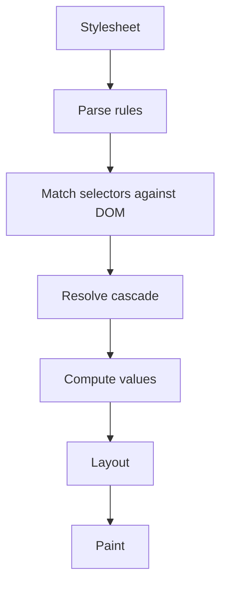
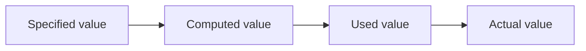
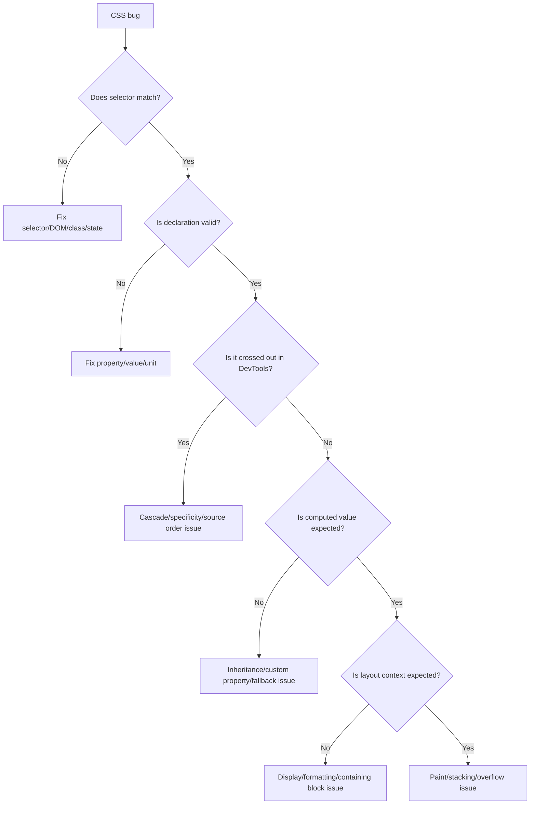

# Part 12 — CSS Fundamentals: Selectors, Declarations, Properties, Values, and Units

## 1. Posisi Part Ini Dalam Roadmap

Setelah membangun fondasi HTML dan accessibility, kita masuk ke CSS. Banyak engineer menganggap CSS sebagai kumpulan properti yang dihafal. Itu framing yang salah.

CSS adalah bahasa deklaratif untuk menyatakan constraint visual atas tree dokumen. Browser kemudian menyelesaikan constraint tersebut melalui cascade, inheritance, formatting contexts, layout algorithms, painting, dan compositing.

Part ini membangun grammar dasar CSS:

- stylesheet;
- rule;
- selector;
- declaration;
- property;
- value;
- unit;
- function;
- custom property;
- invalid declaration behavior;
- debugging mental model.

Part berikutnya akan masuk cascade secara dalam. Jadi part ini fokus pada “cara membaca dan menulis CSS yang valid dan terprediksi”.

---

## 2. Tujuan Pembelajaran

Setelah menyelesaikan part ini, kamu harus bisa:

1. membaca struktur CSS tanpa trial and error;
2. memahami selector sebagai query terhadap element tree;
3. membedakan property, value, keyword, function, dan unit;
4. memilih unit yang sesuai untuk typography, spacing, layout, dan viewport;
5. memakai `calc()`, `min()`, `max()`, `clamp()`, dan `var()` dengan benar;
6. memahami invalid CSS dan fallback behavior;
7. mulai menulis CSS yang scalable sebelum masuk architecture.

---

## 3. CSS Sebagai Bahasa Deklaratif

CSS berbeda dari JavaScript.

JavaScript biasanya imperatif:

```js
const card = document.querySelector('.card');
card.style.padding = '16px';
card.style.border = '1px solid #ddd';
```

CSS deklaratif:

```css
.card {
  padding: 1rem;
  border: 1px solid #ddd;
}
```

Kamu tidak memberi instruksi step-by-step ke browser. Kamu mendeklarasikan rule. Browser menentukan bagaimana rule diterapkan berdasarkan:

- selector match;
- cascade;
- inheritance;
- computed value;
- used value;
- layout algorithm;
- painting order.

Diagram sederhana:



Mental model ini penting: banyak bug CSS bukan karena properti “tidak bekerja”, tetapi karena rule tidak match, kalah cascade, value invalid, atau layout context berbeda dari asumsi.

---

## 4. Anatomy of a CSS Rule

```css
.card {
  padding: 1rem;
  border: 1px solid hsl(0 0% 85%);
  border-radius: 0.5rem;
}
```

Bagian-bagiannya:

| Bagian | Contoh | Makna |
|---|---|---|
| Selector | `.card` | element mana yang ditarget |
| Declaration block | `{ ... }` | kumpulan deklarasi |
| Property | `padding` | aspek style yang diatur |
| Value | `1rem` | nilai property |
| Declaration | `padding: 1rem;` | pasangan property-value |

CSS comments:

```css
/* Layout container for the case summary panel. */
.case-summary {
  padding: 1rem;
}
```

Jangan over-comment property obvious. Comment berguna untuk keputusan, constraint, dan trade-off.

Buruk:

```css
/* Set color to red */
.error {
  color: red;
}
```

Lebih berguna:

```css
/* Keep error text visible in forced-colors mode; do not rely on red alone. */
.error {
  color: var(--color-danger-text);
}
```

---

## 5. Stylesheet Sources

CSS bisa masuk dari beberapa tempat:

### 5.1 External Stylesheet

```html
<link rel="stylesheet" href="/assets/app.css">
```

Ini paling umum untuk production.

Kelebihan:

- cacheable;
- bisa dioptimasi build pipeline;
- separation of concerns;
- mudah dianalisis.

### 5.2 Embedded Style

```html
<style>
  .alert {
    padding: 1rem;
  }
</style>
```

Berguna untuk:

- critical CSS;
- prototyping;
- small examples;
- server-rendered above-the-fold style.

### 5.3 Inline Style

```html
<div style="padding: 1rem; color: red;">...</div>
```

Gunakan sangat selektif.

Masalah:

- sulit override;
- mencampur content dan presentation;
- tidak bisa pseudo-class seperti `:hover`;
- memperburuk maintainability;
- bisa berbenturan dengan CSP.

Inline style masuk cascade dengan bobot tinggi. Part 13 akan membahas ini lebih detail.

---

## 6. Selectors: Query Terhadap Element Tree

Selector menjawab: “Rule ini berlaku untuk element mana?”

HTML:

```html
<article class="case-card" data-status="open">
  <h2>CASE-2026-001</h2>
  <p class="summary">Unlicensed activity investigation.</p>
  <a href="/cases/CASE-2026-001">View case</a>
</article>
```

CSS:

```css
.case-card {
  border: 1px solid #ddd;
}

.case-card[data-status="open"] {
  border-color: orange;
}

.case-card > h2 {
  font-size: 1.25rem;
}
```

Selector tidak “mencari sekali”. Browser mempertahankan style matching secara efisien saat DOM berubah.

---

## 7. Type, Class, and ID Selectors

### 7.1 Type Selector

```css
button {
  font: inherit;
}
```

Menarget semua element berdasarkan tag name.

Cocok untuk base styles:

```css
body {
  margin: 0;
  font-family: system-ui, sans-serif;
}

img {
  max-width: 100%;
  height: auto;
}
```

Hindari type selector untuk komponen spesifik jika struktur HTML bisa berubah.

### 7.2 Class Selector

```css
.case-card {
  padding: 1rem;
}
```

Class selector adalah workhorse CSS architecture karena:

- explicit;
- reusable;
- tidak tergantung tag tertentu;
- specificity relatif rendah;
- cocok untuk component styling.

### 7.3 ID Selector

```css
#main-content {
  outline: none;
}
```

ID selector sangat specific. Gunakan hati-hati.

Dalam CSS architecture modern, ID lebih sering dipakai untuk:

- fragment target;
- label association;
- ARIA relationship;
- JS hook tertentu;
- bukan styling utama.

Buruk:

```css
#case-card #header #title {
  color: blue;
}
```

Ini over-specific dan sulit override.

---

## 8. Attribute Selectors

Attribute selector menarget element berdasarkan attribute.

```css
input[required] {
  border-inline-start: 4px solid currentColor;
}

button[aria-expanded="true"] {
  font-weight: 700;
}

[data-status="escalated"] {
  --badge-color: var(--color-danger);
}
```

Cocok untuk state yang memang direpresentasikan di markup:

- `aria-expanded`;
- `aria-selected`;
- `aria-current`;
- `data-state`;
- `data-status`;
- `required`;
- `disabled`.

Contoh accessible nav:

```css
[aria-current="page"] {
  font-weight: 700;
  text-decoration-thickness: 0.2em;
}
```

Kelebihan: style mengikuti semantic state, bukan class duplikat.

Buruk:

```html
<a href="/cases" aria-current="page" class="active">Cases</a>
```

Jika `active` hanya menduplikasi `aria-current`, kamu menciptakan dua source of truth.

Lebih baik:

```css
[aria-current="page"] {
  font-weight: 700;
}
```

---

## 9. Selector Combinators

Combinator menyatakan hubungan antar element.

### 9.1 Descendant Combinator

```css
.case-card a {
  color: inherit;
}
```

Menarget semua `a` di dalam `.case-card`, sedalam apa pun.

Gunakan hati-hati karena bisa terlalu luas.

### 9.2 Child Combinator

```css
.case-card > h2 {
  margin-block-start: 0;
}
```

Menarget child langsung. Lebih ketat daripada descendant.

### 9.3 Adjacent Sibling

```css
.field-error + .field-hint {
  margin-block-start: 0.25rem;
}
```

Menarget sibling langsung setelah element.

### 9.4 General Sibling

```css
input:checked ~ .details {
  display: block;
}
```

Menarget sibling setelah element, tidak harus langsung.

### 9.5 Maintainability Rule

Semakin banyak combinator, semakin rule tergantung struktur HTML.

Fragile:

```css
.page main section article div div p span {
  color: red;
}
```

Lebih stabil:

```css
.case-status-label {
  color: var(--color-danger-text);
}
```

Gunakan structure-dependent selectors untuk local patterns yang stabil, bukan untuk deep application-wide styling.

---

## 10. Pseudo-Classes

Pseudo-class memilih element berdasarkan state atau posisi.

### 10.1 Interaction State

```css
a:hover {
  text-decoration-thickness: 0.15em;
}

button:active {
  transform: translateY(1px);
}

:focus-visible {
  outline: 3px solid currentColor;
  outline-offset: 3px;
}
```

Catatan:

- `:hover` tidak tersedia di semua input mode;
- jangan menaruh informasi penting hanya pada hover;
- `:focus-visible` berguna untuk focus indicator yang muncul saat relevan.

### 10.2 Form State

```css
input:required {
  border-inline-start: 4px solid currentColor;
}

input:invalid {
  border-color: var(--color-danger-border);
}

input:disabled {
  opacity: 0.6;
  cursor: not-allowed;
}
```

Hati-hati dengan `:invalid`: input kosong yang required bisa invalid sebelum user berinteraksi. UX sering perlu class/state tambahan seperti `data-touched="true"`.

```css
.field[data-touched="true"] input:invalid {
  border-color: var(--color-danger-border);
}
```

### 10.3 Structural State

```css
.case-list > li:first-child {
  border-block-start: 0;
}

.case-list > li:nth-child(even) {
  background: var(--surface-subtle);
}
```

Structural selectors berguna untuk list/table, tetapi jangan pakai untuk state domain yang seharusnya eksplisit.

Buruk:

```css
.workflow-step:nth-child(3) {
  color: green;
}
```

Lebih baik:

```html
<li class="workflow-step" data-state="current">Review</li>
```

```css
.workflow-step[data-state="current"] {
  color: var(--color-accent-text);
}
```

### 10.4 Modern Selector Helpers

#### `:is()`

Mengelompokkan selector.

```css
:is(h1, h2, h3) {
  line-height: 1.2;
}
```

#### `:where()`

Seperti `:is()`, tetapi specificity-nya nol.

```css
:where(ul, ol) {
  padding-inline-start: 1.25rem;
}
```

Berguna untuk reset/base style yang mudah dioverride.

#### `:not()`

Menarget element yang tidak match selector tertentu.

```css
button:not(:disabled) {
  cursor: pointer;
}
```

#### `:has()`

Parent/query relational selector.

```css
.field:has(input:invalid) {
  border-color: var(--color-danger-border);
}
```

Gunakan dengan bijak. `:has()` sangat powerful untuk component state berbasis child state, tetapi tetap pertimbangkan browser support dan complexity.

---

## 11. Pseudo-Elements

Pseudo-element menarget bagian virtual dari element.

```css
.required-label::after {
  content: " *";
}

blockquote::before {
  content: "“";
}

input::placeholder {
  color: color-mix(in srgb, currentColor 60%, transparent);
}
```

Common pseudo-elements:

- `::before`;
- `::after`;
- `::placeholder`;
- `::marker`;
- `::selection`;
- `::backdrop` untuk dialog/popover top layer contexts.

Jangan taruh content penting hanya di `content`. Generated content tidak selalu menjadi bagian accessible name/description dengan cara yang kamu harapkan. Untuk informasi penting, tulis di HTML.

Buruk:

```css
.delete-button::after {
  content: " permanently";
}
```

Jika “permanently” penting, taruh di text/description HTML.

---

## 12. Properties and Values

CSS property punya grammar value tertentu.

```css
.card {
  display: grid;
  grid-template-columns: 1fr 2fr;
  gap: 1rem;
  padding: clamp(1rem, 2vw, 2rem);
}
```

`display` menerima keyword seperti `block`, `inline`, `flex`, `grid`.

`grid-template-columns` menerima track list.

`gap` menerima length/percentage.

`padding` menerima satu sampai empat length/percentage atau fungsi yang menghasilkan length.

CSS tidak mengeksekusi error seperti exception. Jika declaration invalid, browser mengabaikan declaration tersebut dan lanjut membaca rule lain.

```css
.card {
  padding: 1rem;
  color: definitely-not-a-color;
  border: 1px solid #ddd;
}
```

`color` diabaikan; `padding` dan `border` tetap berlaku.

---

## 13. Value Processing: Specified, Computed, Used, Actual

CSS value melewati beberapa fase.



### 13.1 Specified Value

Value yang ditulis author atau diwarisi/default.

```css
.card {
  width: 50%;
}
```

Specified value: `50%`.

### 13.2 Computed Value

Value setelah cascade/inheritance dan beberapa resolusi awal.

Contoh: `font-size: 1rem` bisa computed menjadi `16px` tergantung root font size.

### 13.3 Used Value

Value setelah layout context diketahui.

`width: 50%` baru bisa menjadi used value saat containing block width diketahui.

### 13.4 Actual Value

Value final yang benar-benar dipakai setelah batas device/rendering.

Misalnya subpixel rounding.

Kenapa ini penting?

Karena DevTools bisa menampilkan specified/computed/used secara berbeda. Saat debugging, pastikan kamu tahu fase mana yang sedang kamu lihat.

---

## 14. Units: Absolute, Relative, Viewport, and Container-Aware Thinking

Unit adalah sumber banyak keputusan arsitektural.

### 14.1 `px`

`px` adalah CSS pixel, bukan selalu physical device pixel.

Cocok untuk:

- border hairline;
- shadow offset kecil;
- icon stroke alignment;
- precise UI details.

Tidak ideal sebagai satu-satunya unit typography/spacing jika user preferences harus dihormati.

### 14.2 `em`

`em` relatif ke font-size element saat ini.

```css
.button {
  font-size: 1rem;
  padding: 0.5em 1em;
}
```

Kelebihan: padding mengikuti ukuran teks button.

Jika font button membesar, padding ikut membesar secara proporsional.

### 14.3 `rem`

`rem` relatif ke root font-size.

```css
.card {
  padding: 1rem;
  border-radius: 0.5rem;
}
```

Cocok untuk:

- spacing scale;
- typography scale;
- layout gaps;
- component sizes yang harus konsisten global.

### 14.4 `%`

Percentage relatif ke konteks property.

```css
.sidebar {
  width: 30%;
}

.hero {
  padding-block: 10%;
}
```

Hati-hati: percentage tidak selalu relatif ke dimensi yang kamu kira. Misalnya padding percentage historically relatif ke inline size containing block dalam banyak konteks.

### 14.5 Viewport Units

Common:

- `vw`: viewport width;
- `vh`: viewport height;
- `vmin`;
- `vmax`.

Modern viewport units:

- `svh`: small viewport height;
- `lvh`: large viewport height;
- `dvh`: dynamic viewport height;
- `svw`, `lvw`, `dvw`;
- logical variants seperti `svb`, `dvb` dalam spesifikasi/dukungan modern.

Masalah klasik mobile:

```css
.hero {
  min-height: 100vh;
}
```

Di mobile browser, browser UI/address bar bisa membuat `100vh` tidak sesuai ekspektasi. `100dvh` sering lebih tepat untuk viewport dinamis.

```css
.app-shell {
  min-height: 100dvh;
}
```

Namun tetap cek support dan behavior target browser.

### 14.6 Character Units: `ch`

`ch` kira-kira lebar karakter “0” pada font.

Cocok untuk readable line length:

```css
.article-body {
  max-width: 70ch;
}
```

### 14.7 Line Height Unit: `lh`

`lh` relatif ke computed line-height element.

```css
.icon-inline {
  width: 1lh;
  height: 1lh;
}
```

Cocok untuk alignment yang mengikuti line-height.

---

## 15. Unit Decision Table

| Use case | Preferred unit | Reason |
|---|---|---|
| Body text size | `rem` | respects root scaling |
| Button padding | `em` or `rem` | `em` follows text, `rem` consistent scale |
| Layout container width | `%`, `rem`, `ch`, `min()` | context-aware |
| Readable prose width | `ch` | based on measure |
| Full viewport app shell | `dvh` with fallback | better mobile viewport behavior |
| Border width | `px` | precise visual line |
| Gap/spacing system | `rem` + custom properties | global scale |
| Icon inside text | `em` or `lh` | follows typography |
| Fluid typography | `clamp()` | bounded responsiveness |

---

## 16. Colors

CSS supports many color formats.

Common:

```css
:root {
  --color-text: #1f2937;
  --color-danger: rgb(185 28 28);
  --color-info: hsl(217 91% 60%);
}
```

Modern CSS color syntax allows space-separated values:

```css
.notice {
  color: rgb(30 64 175);
  background: hsl(214 95% 93%);
}
```

Alpha:

```css
.overlay {
  background: rgb(0 0 0 / 0.5);
}
```

Do not encode semantic meaning directly as raw colors everywhere.

Buruk:

```css
.error-message {
  color: #ff0000;
}

.delete-button {
  background: #ff0000;
}
```

Lebih baik:

```css
:root {
  --color-danger-text: #991b1b;
  --color-danger-bg: #fee2e2;
  --color-danger-border: #fca5a5;
}

.error-message {
  color: var(--color-danger-text);
}

.delete-button {
  background: var(--color-danger-bg);
  color: var(--color-danger-text);
  border-color: var(--color-danger-border);
}
```

Part 22 akan membahas color, contrast, theming, dark mode, dan design tokens lebih dalam.

---

## 17. Strings, URLs, and Identifiers

### 17.1 Strings

```css
.required::after {
  content: " *";
}
```

### 17.2 URLs

```css
.hero {
  background-image: url("/assets/case-bg.svg");
}
```

Jangan memakai CSS background image untuk konten informatif yang butuh alt text. Gunakan `` di HTML.

### 17.3 Custom Identifiers

Beberapa property menerima identifier seperti animation name:

```css
@keyframes fade-in {
  from { opacity: 0; }
  to { opacity: 1; }
}

.dialog {
  animation-name: fade-in;
}
```

---

## 18. CSS Functions

CSS functions menghasilkan value.

### 18.1 `calc()`

```css
.main {
  width: calc(100% - 16rem);
}
```

Berguna untuk menggabungkan unit berbeda.

Spacing around operators penting:

```css
/* Good */
width: calc(100% - 2rem);

/* Bad */
width: calc(100%-2rem);
```

### 18.2 `min()`

Ambil nilai terkecil.

```css
.container {
  width: min(100% - 2rem, 72rem);
  margin-inline: auto;
}
```

Makna: container selebar `100% - 2rem`, tetapi tidak lebih dari `72rem`.

### 18.3 `max()`

Ambil nilai terbesar.

```css
.sidebar {
  width: max(18rem, 20vw);
}
```

Makna: sidebar minimal 18rem, atau lebih besar jika 20vw lebih besar.

### 18.4 `clamp()`

Batas minimum, preferred, maksimum.

```css
h1 {
  font-size: clamp(2rem, 5vw, 4rem);
}
```

Makna:

- minimum 2rem;
- preferred 5vw;
- maximum 4rem.

Untuk fluid spacing:

```css
.section {
  padding-block: clamp(2rem, 6vw, 6rem);
}
```

### 18.5 `var()`

Mengambil custom property.

```css
.card {
  padding: var(--space-4);
}
```

Fallback:

```css
.card {
  padding: var(--card-padding, 1rem);
}
```

Jika `--card-padding` tidak tersedia, gunakan `1rem`.

---

## 19. Custom Properties

Custom properties adalah salah satu fitur CSS paling penting untuk architecture modern.

```css
:root {
  --space-1: 0.25rem;
  --space-2: 0.5rem;
  --space-3: 0.75rem;
  --space-4: 1rem;

  --color-surface: white;
  --color-text: #111827;
}

.card {
  padding: var(--space-4);
  background: var(--color-surface);
  color: var(--color-text);
}
```

### 19.1 Custom Properties Inherit

Custom properties inherit by default.

```css
.case-card {
  --accent-color: #2563eb;
}

.case-card__status {
  color: var(--accent-color);
}
```

Ini memungkinkan component-level theming.

### 19.2 Custom Property as Component API

```css
.badge {
  --badge-bg: var(--color-neutral-bg);
  --badge-text: var(--color-neutral-text);

  display: inline-flex;
  align-items: center;
  padding: 0.125rem 0.5rem;
  border-radius: 999px;
  background: var(--badge-bg);
  color: var(--badge-text);
}

.badge[data-status="escalated"] {
  --badge-bg: var(--color-danger-bg);
  --badge-text: var(--color-danger-text);
}
```

Component internal style membaca token lokal. Variant hanya override custom property.

### 19.3 Fallback Chain

```css
.panel {
  border-color: var(--panel-border, var(--color-border, #ddd));
}
```

Makna:

1. gunakan `--panel-border` jika ada;
2. kalau tidak, gunakan `--color-border`;
3. kalau tidak, gunakan `#ddd`.

### 19.4 Invalid at Computed Value Time

Custom property tidak divalidasi saat didefinisikan.

```css
:root {
  --space: red;
}

.card {
  padding: var(--space);
}
```

`--space: red` valid sebagai custom property, tetapi invalid saat dipakai untuk `padding`. Declaration `padding` menjadi invalid.

Ini sering menjadi bug design token.

### 19.5 Typed Custom Properties With `@property`

Modern CSS memungkinkan registrasi custom property.

```css
@property --progress {
  syntax: "<number>";
  inherits: false;
  initial-value: 0;
}
```

Ini berguna untuk animation dan type constraints, tetapi tidak wajib untuk tahap awal. Kita akan kembali ke ini saat membahas architecture dan motion.

---

## 20. Shorthand and Longhand Properties

Shorthand mengatur banyak longhand sekaligus.

```css
.card {
  margin: 1rem 2rem;
}
```

Setara dengan:

```css
.card {
  margin-block-start: 1rem;
  margin-inline-end: 2rem;
  margin-block-end: 1rem;
  margin-inline-start: 2rem;
}
```

Untuk physical properties:

```css
.card {
  margin-top: 1rem;
  margin-right: 2rem;
  margin-bottom: 1rem;
  margin-left: 2rem;
}
```

Hati-hati: shorthand bisa reset longhand yang tidak kamu maksud.

```css
.box {
  background-image: url("/pattern.svg");
  background-size: cover;
}

.box.warning {
  background: yellow;
}
```

`background: yellow` bisa mereset background image/size. Gunakan longhand jika hanya ingin mengubah warna:

```css
.box.warning {
  background-color: yellow;
}
```

---

## 21. Logical Properties

CSS lama banyak memakai physical direction:

```css
.card {
  margin-left: 1rem;
  border-right: 1px solid #ddd;
}
```

Logical properties mengikuti writing mode dan direction:

```css
.card {
  margin-inline-start: 1rem;
  border-inline-end: 1px solid #ddd;
}
```

Common logical properties:

- `margin-block`;
- `margin-inline`;
- `padding-block`;
- `padding-inline`;
- `border-block`;
- `border-inline`;
- `inset-block`;
- `inset-inline`;
- `inline-size`;
- `block-size`.

Gunakan logical properties jika UI perlu lebih siap untuk internationalization dan writing modes.

Part 16 akan membahas writing modes lebih dalam.

---

## 22. Initial, Inherit, Unset, Revert, and Revert-Layer

CSS punya global keywords.

### 22.1 `inherit`

Paksa property mewarisi dari parent.

```css
button {
  font: inherit;
  color: inherit;
}
```

### 22.2 `initial`

Set ke initial value sesuai spec.

```css
.notice {
  color: initial;
}
```

### 22.3 `unset`

Jika property inherited, behave seperti `inherit`; jika tidak, behave seperti `initial`.

```css
.component * {
  all: unset;
}
```

Hati-hati dengan `all: unset`; bisa merusak accessibility/interaction styling jika tidak dipulihkan.

### 22.4 `revert`

Mengembalikan ke value dari origin sebelumnya, misalnya user-agent style.

```css
.custom-list {
  list-style: revert;
}
```

### 22.5 `revert-layer`

Mengembalikan value pada cascade layer sebelumnya. Ini berguna dalam architecture berbasis `@layer`.

Part 13 dan Part 25 akan membahas cascade layer lebih detail.

---

## 23. At-Rules

At-rule diawali `@`.

Contoh:

```css
@media (width >= 48rem) {
  .layout {
    display: grid;
    grid-template-columns: 16rem 1fr;
  }
}
```

Common at-rules:

- `@media`;
- `@supports`;
- `@container`;
- `@layer`;
- `@font-face`;
- `@keyframes`;
- `@property`;
- `@scope`.

Part ini hanya mengenalkan. Detailnya akan muncul di bagian layout, responsive, architecture, dan motion.

### 23.1 `@supports`

Feature query:

```css
.card-grid {
  display: flex;
  flex-wrap: wrap;
}

@supports (display: grid) {
  .card-grid {
    display: grid;
    grid-template-columns: repeat(auto-fit, minmax(16rem, 1fr));
  }
}
```

Ini mendukung progressive enhancement.

### 23.2 `@media`

```css
@media (prefers-reduced-motion: reduce) {
  *,
  *::before,
  *::after {
    animation-duration: 0.01ms;
    animation-iteration-count: 1;
    scroll-behavior: auto;
  }
}
```

Media query bukan hanya width breakpoint. Bisa juga user preference, pointer capability, color scheme, contrast, dan lain-lain.

---

## 24. CSS Error Handling

CSS dirancang forward-compatible. Browser mengabaikan hal yang tidak dipahami.

```css
.card {
  display: grid;
  display: subgrid; /* invalid for display; ignored */
}
```

Jika browser tidak mengenali declaration, declaration diabaikan.

Fallback pattern:

```css
.title {
  font-size: 2rem;
  font-size: clamp(2rem, 4vw, 4rem);
}
```

Browser lama yang tidak mendukung `clamp()` memakai `2rem`. Browser modern memakai declaration kedua.

Namun jangan salah mengira semua fallback sesederhana itu. Untuk layout, fallback sering butuh struktur yang dipikirkan.

---

## 25. Naming and Semantics in CSS

Class name adalah API internal antara HTML dan CSS.

Buruk:

```html
<div class="red big left-box">...</div>
```

Masalah:

- nama berdasarkan tampilan sekarang;
- sulit berubah jika design berubah;
- tidak menjelaskan role component.

Lebih baik:

```html
<section class="case-summary-card">...</section>
```

Atau untuk design-system component:

```html
<section class="card card--elevated">...</section>
```

Guideline:

- gunakan nama berdasarkan komponen, purpose, atau state;
- hindari nama terlalu visual untuk domain component;
- utility class visual boleh jika memang architecture utility-first;
- jangan campur strategi tanpa aturan.

Part 25 akan membahas CSS architecture lebih dalam.

---

## 26. State Styling

State UI harus punya source of truth.

### 26.1 Semantic Attribute State

```html
<button aria-expanded="true">Filters</button>
```

```css
button[aria-expanded="true"] {
  font-weight: 700;
}
```

### 26.2 Data Attribute State

```html
<article class="case-card" data-status="escalated">
  ...
</article>
```

```css
.case-card[data-status="escalated"] {
  --case-accent: var(--color-danger);
}
```

### 26.3 Class State

```html
<div class="toast toast--visible">Saved</div>
```

Class state juga valid, terutama jika state purely visual. Tetapi untuk state yang juga penting bagi accessibility, jangan hanya class.

Buruk:

```html
<button class="expanded">Filters</button>
```

Lebih baik:

```html
<button aria-expanded="true">Filters</button>
```

---

## 27. Practical CSS Baseline Setup

Untuk latihan seri ini, kita akan sering memakai baseline CSS berikut:

```css
*,
*::before,
*::after {
  box-sizing: border-box;
}

html {
  font-family: system-ui, sans-serif;
  line-height: 1.5;
}

body {
  margin: 0;
  color: var(--color-text, #111827);
  background: var(--color-bg, #ffffff);
}

img,
picture,
svg,
video,
canvas {
  max-inline-size: 100%;
}

button,
input,
select,
textarea {
  font: inherit;
}

:focus-visible {
  outline: 3px solid currentColor;
  outline-offset: 3px;
}
```

Catatan:

- `box-sizing: border-box` membuat sizing lebih predictable;
- form controls inherit font agar konsisten;
- media tidak overflow container secara default;
- focus visible tersedia.

Jangan copy reset besar tanpa memahami efeknya. Reset berlebihan bisa menghapus semantic affordance native seperti list markers, button styles, dan focus outlines.

---

## 28. Example: Styling Accessible Case Card

HTML:

```html
<article class="case-card" data-status="escalated">
  <header class="case-card__header">
    <p class="case-card__eyebrow">Escalated case</p>
    <h2 class="case-card__title">
      <a href="/cases/CASE-2026-001">CASE-2026-001</a>
    </h2>
  </header>

  <p class="case-card__summary">
    Unlicensed activity investigation requiring supervisory review.
  </p>

  <dl class="case-card__meta">
    <div>
      <dt>Risk</dt>
      <dd>High</dd>
    </div>
    <div>
      <dt>Owner</dt>
      <dd>A. Rivera</dd>
    </div>
  </dl>
</article>
```

CSS:

```css
.case-card {
  --case-accent: var(--color-border, #d1d5db);

  display: grid;
  gap: var(--space-3, 0.75rem);
  padding: var(--space-4, 1rem);
  border: 1px solid var(--case-accent);
  border-radius: var(--radius-2, 0.5rem);
  background: var(--color-surface, #ffffff);
}

.case-card[data-status="escalated"] {
  --case-accent: var(--color-danger-border, #fca5a5);
}

.case-card__eyebrow {
  margin: 0;
  color: var(--color-muted-text, #6b7280);
  font-size: 0.875rem;
}

.case-card__title {
  margin: 0;
  font-size: clamp(1.125rem, 1rem + 0.5vw, 1.5rem);
  line-height: 1.2;
}

.case-card__summary {
  margin: 0;
  max-inline-size: 70ch;
}

.case-card__meta {
  display: grid;
  grid-template-columns: repeat(auto-fit, minmax(10rem, 1fr));
  gap: var(--space-3, 0.75rem);
  margin: 0;
}

.case-card__meta div {
  display: grid;
  gap: 0.125rem;
}

.case-card__meta dt {
  color: var(--color-muted-text, #6b7280);
  font-size: 0.875rem;
}

.case-card__meta dd {
  margin: 0;
  font-weight: 600;
}
```

Apa yang terjadi:

- state domain `data-status="escalated"` mengubah token lokal `--case-accent`;
- typography fluid dibatasi dengan `clamp()`;
- spacing memakai custom properties dengan fallback;
- `dl` tetap semantic untuk metadata;
- layout responsive tanpa media query.

---

## 29. Debugging Checklist

Saat CSS “tidak bekerja”, jangan menebak. Ikuti urutan ini:



Checklist detail:

- Apakah stylesheet loaded?
- Apakah selector match element?
- Apakah class name typo?
- Apakah property valid?
- Apakah value valid untuk property tersebut?
- Apakah custom property tersedia?
- Apakah declaration kalah cascade?
- Apakah inherited value datang dari parent?
- Apakah layout context sesuai asumsi?
- Apakah element tertutup overlay/overflow?
- Apakah media query/container query sedang aktif?
- Apakah browser mendukung fitur yang dipakai?

---

## 30. Common Beginner-to-Intermediate Failure Modes

### 30.1 Using CSS to Fix Bad HTML

Buruk:

```html
<div class="heading-large">Case detail</div>
```

```css
.heading-large {
  font-size: 2rem;
  font-weight: 700;
}
```

Lebih baik:

```html
<h1>Case detail</h1>
```

CSS memperindah semantics, bukan mengganti semantics.

### 30.2 Overusing `!important`

```css
.button {
  color: white !important;
}
```

`!important` biasanya tanda cascade tidak dikelola. Ada use case valid, tetapi jangan jadikan default.

### 30.3 Magic Numbers

```css
.modal {
  top: 73px;
  left: 228px;
}
```

Jika angka hanya hasil trial and error, kemungkinan layout model salah.

### 30.4 Styling by DOM Depth

```css
.main > div > div > span {
  color: red;
}
```

Ini rapuh. Gunakan class atau semantic attribute.

### 30.5 Pixel-Only Thinking

```css
body {
  font-size: 14px;
}

.card {
  padding: 17px;
}
```

Pixel tidak salah, tetapi jika semua memakai px tanpa scale, UI sulit responsive dan sulit menghormati user preferences.

---

## 31. Practice: CSS Grammar Drill

Ambil HTML berikut:

```html
<section class="case-dashboard" aria-labelledby="dashboard-title">
  <h1 id="dashboard-title">Case dashboard</h1>

  <article class="metric-card" data-trend="up">
    <h2>Open cases</h2>
    <p class="metric-card__value">128</p>
    <p class="metric-card__note">12% increase this month</p>
  </article>

  <article class="metric-card" data-trend="down">
    <h2>Average resolution time</h2>
    <p class="metric-card__value">18 days</p>
    <p class="metric-card__note">3 days faster than last month</p>
  </article>
</section>
```

Tulis CSS dengan constraint:

- gunakan `box-sizing` reset;
- dashboard punya max width dan centered;
- cards responsive memakai grid atau intrinsic sizing;
- typography memakai `rem` dan `clamp()`;
- trend state memakai custom property;
- no ID selector for styling;
- focus style global tetap ada;
- tidak memakai `!important`.

Contoh solusi awal:

```css
*,
*::before,
*::after {
  box-sizing: border-box;
}

:root {
  --space-3: 0.75rem;
  --space-4: 1rem;
  --space-6: 1.5rem;
  --color-surface: #ffffff;
  --color-border: #d1d5db;
  --color-positive: #166534;
  --color-negative: #991b1b;
}

.case-dashboard {
  width: min(100% - 2rem, 72rem);
  margin-inline: auto;
  padding-block: clamp(1.5rem, 4vw, 4rem);
}

.case-dashboard h1 {
  font-size: clamp(2rem, 5vw, 3.5rem);
  line-height: 1.1;
}

.metric-card {
  --trend-color: var(--color-border);

  display: grid;
  gap: var(--space-3);
  padding: var(--space-4);
  border: 1px solid var(--trend-color);
  border-radius: 0.75rem;
  background: var(--color-surface);
}

.metric-card[data-trend="up"] {
  --trend-color: var(--color-positive);
}

.metric-card[data-trend="down"] {
  --trend-color: var(--color-negative);
}

.metric-card__value {
  margin: 0;
  color: var(--trend-color);
  font-size: clamp(2rem, 4vw, 3rem);
  font-weight: 700;
  line-height: 1;
}
```

---

## 32. Self-Assessment Rubric

| Level | Indikator |
|---|---|
| Beginner | Bisa menulis selector dan declaration sederhana, tetapi sering trial-and-error |
| Intermediate | Bisa memilih unit, selector, pseudo-class, dan custom property dengan alasan jelas |
| Advanced | Bisa membaca DevTools, memahami invalid declarations, fallback, computed values, dan state styling |
| Expert | Bisa mendesain token/component CSS yang predictable, extensible, dan kompatibel dengan cascade architecture |

Target part ini: naik dari Beginner/Intermediate ke Intermediate/Advanced.

---

## 33. Ringkasan Mental Model

CSS fundamental bukan daftar properti. Ia adalah grammar untuk membuat constraint visual atas document tree.

Ingat:

1. selector memilih element;
2. declaration menyatakan property-value;
3. browser mengabaikan declaration invalid;
4. unit harus dipilih berdasarkan konteks;
5. custom properties adalah mekanisme token dan component API;
6. pseudo-class/pseudo-element harus dipakai sesuai semantics;
7. CSS yang baik memperkuat HTML, bukan menutupi HTML yang buruk.

Part berikutnya akan membahas hal yang membuat CSS benar-benar terasa “hidup”: **cascade**. Di sana kita akan membongkar specificity, inheritance, source order, cascade layers, dan strategi agar stylesheet skala besar tidak berubah menjadi perang override.

---

## 34. Referensi Utama

- MDN CSS First Steps: https://developer.mozilla.org/en-US/docs/Learn_web_development/Core/Styling_basics
- MDN CSS Selectors: https://developer.mozilla.org/en-US/docs/Web/CSS/CSS_selectors
- MDN CSS Values and Units: https://developer.mozilla.org/en-US/docs/Learn_web_development/Core/Styling_basics/Values_and_units
- MDN Length CSS Type: https://developer.mozilla.org/en-US/docs/Web/CSS/length
- MDN Custom Properties: https://developer.mozilla.org/en-US/docs/Web/CSS/--*
- MDN min(): https://developer.mozilla.org/en-US/docs/Web/CSS/min
- MDN max(): https://developer.mozilla.org/en-US/docs/Web/CSS/max
- web.dev min(), max(), clamp(): https://web.dev/articles/min-max-clamp
- CSS Snapshot / W3C CSS: https://www.w3.org/Style/CSS/
