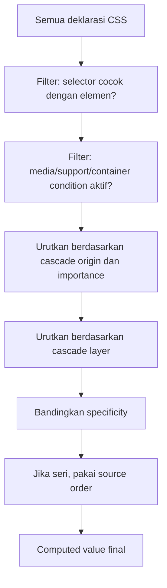
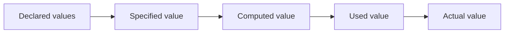
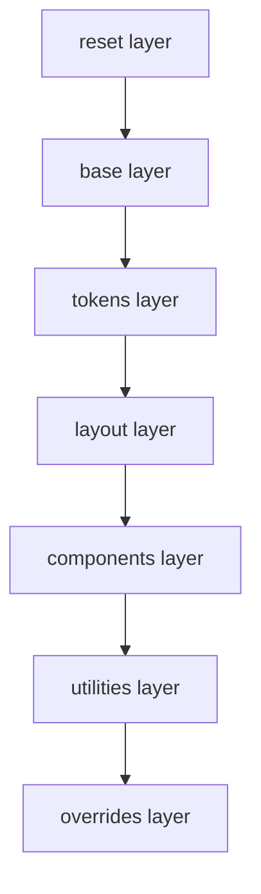
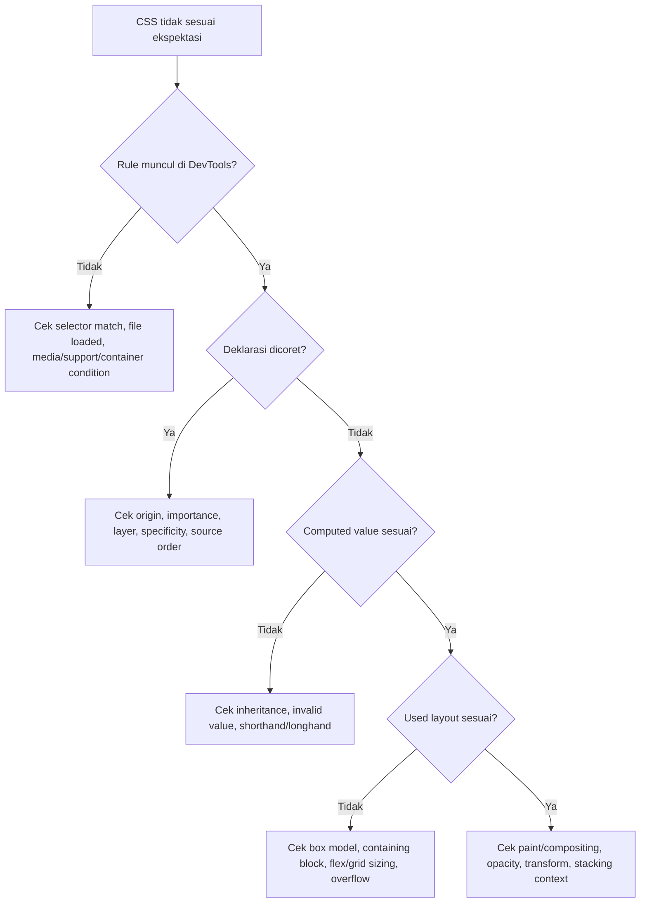

# Part 13 — The Cascade: Specificity, Inheritance, Source Order, Layers, and Scope

## 1. Tujuan Pembelajaran

CSS terasa sulit bukan karena sintaksnya rumit, tetapi karena hasil akhir sebuah properti merupakan hasil resolusi dari banyak sumber: user-agent stylesheet, stylesheet aplikasi, inline style, state pseudo-class, media query, cascade layer, specificity, inheritance, dan source order.

Setelah bagian ini, kamu harus bisa:

1. memprediksi deklarasi CSS mana yang menang tanpa trial-and-error;
2. membaca DevTools `Styles` dan `Computed` panel sebagai bukti, bukan tebakan;
3. merancang struktur CSS yang tidak bergantung pada `!important`;
4. memakai `@layer` untuk arsitektur stylesheet yang scalable;
5. memahami kapan inheritance membantu dan kapan harus diputus;
6. memahami `@scope` sebagai boundary styling modern;
7. membuat debugging flow untuk konflik CSS di aplikasi besar.

Dalam kerangka *The First 20 Hours*, bagian ini adalah latihan **learn enough to self-correct**. Kamu tidak perlu menghafal seluruh properti CSS, tetapi harus menguasai mekanisme keputusan browser ketika beberapa deklarasi bersaing.

---

## 2. Mental Model: CSS Adalah Sistem Resolusi Konflik

CSS bukan sekadar daftar instruksi. CSS adalah sistem resolusi nilai.

Untuk setiap elemen dan setiap properti, browser harus menjawab pertanyaan:

> Dari semua deklarasi yang mungkin berlaku, nilai mana yang akhirnya dipakai?

Contoh:

```css
button {
  color: black;
}

.primary-action {
  color: white;
}

#delete-button {
  color: red;
}
```

Untuk HTML berikut:

```html
<button id="delete-button" class="primary-action">Delete Case</button>
```

Tiga deklarasi `color` cocok. Browser tidak bingung. Browser memakai algoritma cascade.



Kalau kamu bisa mengikuti alur ini, sebagian besar bug CSS menjadi deterministik.

---

## 3. Terminologi Dasar

### 3.1 Declaration

Deklarasi adalah pasangan property dan value.

```css
color: red;
```

### 3.2 Declaration Block

Kumpulan deklarasi dalam `{}`.

```css
.card {
  padding: 1rem;
  border-radius: 0.5rem;
}
```

### 3.3 Rule

Selector + declaration block.

```css
.card { ... }
```

### 3.4 Specified Value

Nilai yang didapat setelah cascade memilih deklarasi.

### 3.5 Computed Value

Nilai setelah inheritance, initial value, relative unit, dan rule CSS tertentu diselesaikan ke bentuk yang dapat dipakai lebih lanjut.

### 3.6 Used Value

Nilai setelah layout mengetahui konteks nyata, misalnya `width: auto`, `height: auto`, atau persentase.

### 3.7 Actual Value

Nilai final setelah batasan device/rendering diterapkan.

Mental modelnya:



DevTools sering menampilkan `computed`, tetapi bug layout sering terjadi di fase `used value`, terutama untuk `%`, `auto`, flex sizing, grid sizing, dan viewport units.

---

## 4. The Cascade Algorithm: Urutan Keputusan

Secara praktis, cascade dapat dipahami sebagai urutan berikut:

1. relevance;
2. origin and importance;
3. cascade layer;
4. specificity;
5. scoping proximity;
6. source order.

Tidak semua developer perlu menghafal semua detail formal, tetapi urutan ini harus menjadi refleks debugging.

---

## 5. Step 1 — Relevance

Deklarasi hanya ikut kompetisi jika relevan.

Deklarasi dianggap relevan jika:

1. selector cocok dengan elemen;
2. kondisi media aktif;
3. kondisi feature query aktif;
4. kondisi container query aktif;
5. rule tidak invalid;
6. property/value didukung browser.

Contoh:

```css
@media (width >= 768px) {
  .layout {
    display: grid;
  }
}
```

Pada viewport lebih kecil dari 768px, deklarasi ini tidak masuk kompetisi sama sekali.

Contoh `@supports`:

```css
.card {
  border: 1px solid #d0d7de;
}

@supports (container-type: inline-size) {
  .card-list {
    container-type: inline-size;
  }
}
```

Jika browser tidak mendukung `container-type`, deklarasi di dalam `@supports` tidak relevan.

### Failure Mode

Developer sering membaca CSS file dan menganggap rule berlaku, padahal condition wrapper tidak aktif.

Debugging rule:

- lihat DevTools apakah rule dicoret karena kalah cascade;
- lihat apakah rule tidak muncul sama sekali karena tidak relevan;
- bedakan “matched but overridden” dengan “not matched”.

---

## 6. Step 2 — Cascade Origin and Importance

CSS datang dari beberapa origin:

1. user-agent stylesheet;
2. user stylesheet;
3. author stylesheet;
4. animations;
5. transitions.

Dalam aplikasi web sehari-hari, yang paling sering terlihat:

- browser default style;
- CSS milik aplikasi;
- inline style;
- `!important`;
- animation/transition.

### 6.1 User-Agent Stylesheet

Browser memberi default style.

Contoh default umum:

```css
h1 {
  display: block;
  font-size: 2em;
  margin-block-start: 0.67em;
  margin-block-end: 0.67em;
  font-weight: bold;
}
```

Ini sebabnya `<h1>` terlihat besar meskipun kamu belum menulis CSS.

### 6.2 Author Stylesheet

CSS yang kamu tulis sebagai pembuat aplikasi.

```css
h1 {
  font-size: 2rem;
}
```

Author stylesheet normal biasanya menang atas user-agent stylesheet normal.

### 6.3 Inline Style

```html
<button style="color: red">Delete</button>
```

Inline style berada pada author origin dengan specificity sangat tinggi untuk deklarasi normal. Dalam praktik, inline style hampir selalu menang terhadap selector CSS biasa kecuali dilawan dengan `!important` pada rule yang relevan.

### 6.4 `!important`

`!important` membalik prioritas normal dalam origin/layer tertentu.

```css
.button {
  color: red !important;
}
```

Gunakan sangat jarang.

Kasus yang masuk akal:

- utility class yang memang didesain sebagai override eksplisit;
- style untuk accessibility emergency, misalnya forced visibility;
- integrasi third-party yang tidak memberi hook lain;
- user stylesheet, bukan application stylesheet.

Kasus yang buruk:

```css
.card-title {
  font-size: 1rem !important;
}
```

Ini biasanya tanda arsitektur selector/layer rusak.

### 6.5 Animations and Transitions

Property yang sedang ditransisikan atau dianimasikan dapat memiliki perilaku cascade khusus. Debugging animasi harus selalu melihat apakah value datang dari CSS rule biasa atau dari animation/transition engine.

Contoh bug:

```css
.panel {
  opacity: 0;
  transition: opacity 200ms ease;
}

.panel[data-open="true"] {
  opacity: 1;
}
```

Ketika transisi aktif, DevTools dapat menunjukkan value yang sedang berubah, bukan hanya declared value statis.

---

## 7. Step 3 — Cascade Layers

Cascade layers memberi cara eksplisit untuk mengurutkan kelompok rule sebelum specificity dibandingkan.

Ini penting untuk aplikasi besar.

Tanpa layer, developer sering menaikkan specificity untuk menang:

```css
/* Awalnya */
.button {
  padding: 0.5rem 1rem;
}

/* Nanti */
.card .toolbar .button.primary {
  padding: 0.75rem 1.25rem;
}

/* Lebih nanti lagi */
#case-detail .card .toolbar button.button.primary {
  padding: 1rem 1.5rem;
}
```

Ini specificity arms race.

Dengan layer:

```css
@layer reset, base, components, utilities;

@layer reset {
  *, *::before, *::after {
    box-sizing: border-box;
  }
}

@layer base {
  button {
    font: inherit;
  }
}

@layer components {
  .button {
    padding: 0.5rem 1rem;
  }
}

@layer utilities {
  .p-lg {
    padding: 1rem 1.5rem;
  }
}
```

Layer yang dideklarasikan belakangan memiliki prioritas lebih tinggi untuk normal declarations.

Dalam contoh:

1. `reset` paling rendah;
2. `base`;
3. `components`;
4. `utilities` paling tinggi.

### 7.1 Layer Mengalahkan Specificity Antar Layer

Ini poin penting.

```css
@layer base, components;

@layer base {
  #submit-button {
    color: red;
  }
}

@layer components {
  .button {
    color: blue;
  }
}
```

Jika elemen cocok dengan kedua rule, `.button` di layer `components` dapat menang atas `#submit-button` di layer `base`, meskipun specificity selector `#submit-button` lebih tinggi.

Layer dibandingkan sebelum specificity.

### 7.2 Unlayered Styles

Deklarasi yang tidak berada di layer memiliki prioritas berbeda dari deklarasi ber-layer. Dalam praktik arsitektur, jangan mencampur CSS ber-layer dan tanpa layer secara sembarangan.

Rekomendasi:

```css
@layer reset, base, tokens, layout, components, utilities, overrides;
```

Lalu masukkan semua CSS aplikasi ke dalam layer yang jelas.

### 7.3 Import dengan Layer

```css
@import url("reset.css") layer(reset);
@import url("base.css") layer(base);
@import url("components.css") layer(components);
```

Ini berguna untuk mengontrol prioritas file CSS tanpa bergantung pada urutan import yang tersebar.

### 7.4 Architecture Pattern

```css
@layer reset, base, tokens, layout, components, utilities;

@layer reset {
  *, *::before, *::after {
    box-sizing: border-box;
  }

  body {
    margin: 0;
  }
}

@layer tokens {
  :root {
    --color-bg: #ffffff;
    --color-fg: #1f2328;
    --space-2: 0.5rem;
    --space-4: 1rem;
    --radius-md: 0.5rem;
  }
}

@layer base {
  body {
    font-family: system-ui, sans-serif;
    color: var(--color-fg);
    background: var(--color-bg);
  }
}

@layer layout {
  .app-shell {
    display: grid;
    grid-template-columns: 16rem 1fr;
    min-block-size: 100dvh;
  }
}

@layer components {
  .case-card {
    padding: var(--space-4);
    border-radius: var(--radius-md);
  }
}

@layer utilities {
  .hidden {
    display: none !important;
  }
}
```

Layer bukan pengganti naming convention. Layer adalah boundary prioritas.

---

## 8. Step 4 — Specificity

Specificity adalah bobot selector.

Model umum:

```text
inline style > id > class/attribute/pseudo-class > type/pseudo-element
```

Sering ditulis sebagai tuple:

```text
A-B-C
```

Dengan penyederhanaan:

- `A`: jumlah ID selector;
- `B`: jumlah class, attribute, dan pseudo-class;
- `C`: jumlah type selector dan pseudo-element.

Contoh:

```css
button { }
/* 0-0-1 */

.button { }
/* 0-1-0 */

button.button { }
/* 0-1-1 */

#submit { }
/* 1-0-0 */

form .field input:invalid { }
/* 0-3-2 */
```

### 8.1 Specificity Bukan Angka Desimal

`0-10-0` tidak otomatis menjadi `1-0-0`.

Sepuluh class selector tidak mengalahkan satu ID selector dalam model specificity standar.

```css
.a.b.c.d.e.f.g.h.i.j {
  color: red;
}
/* 0-10-0 */

#x {
  color: blue;
}
/* 1-0-0 */
```

Jika elemen cocok dengan keduanya, ID menang dalam layer/origin yang sama.

### 8.2 Specificity dan Source Order

Jika specificity sama, rule yang muncul belakangan menang.

```css
.alert {
  color: orange;
}

.alert {
  color: red;
}
```

Hasil: `red`.

### 8.3 Specificity Strategy untuk Tim

Gunakan specificity rendah sebagai default.

Rekomendasi:

```css
.card { }
.card__title { }
.card__actions { }
```

Hindari:

```css
main section article div.card div.header h2.title { }
```

Masalah selector panjang:

1. terlalu terikat pada struktur DOM;
2. sulit override;
3. rapuh saat refactor markup;
4. memicu specificity arms race;
5. sulit dipakai ulang.

---

## 9. Step 5 — Scoping Proximity

CSS modern mengenal scoping lewat `@scope`. Secara mental, `@scope` membatasi rule agar hanya berlaku dalam subtree tertentu.

Contoh:

```css
@scope (.case-card) {
  .title {
    font-weight: 700;
  }
}
```

Rule `.title` hanya berlaku untuk `.title` di dalam `.case-card`.

### 9.1 Mengapa Scope Penting?

Di aplikasi besar, class generik sering bentrok:

```css
.title {
  font-size: 1.5rem;
}
```

Class `.title` dapat muncul di card, modal, sidebar, form section, dan table toolbar.

Dengan `@scope`:

```css
@scope (.modal) {
  .title {
    font-size: 1.25rem;
  }
}

@scope (.case-card) {
  .title {
    font-size: 1rem;
  }
}
```

Scope memberi konteks tanpa harus menaikkan specificity secara ekstrem.

### 9.2 Scope Root dan Scope Limit

Konsep praktis:

- scope root: batas awal area selector berlaku;
- scope limit: batas akhir opsional agar style tidak turun terlalu jauh.

Contoh konseptual:

```css
@scope (.article-body) to (.embedded-widget) {
  p {
    line-height: 1.7;
  }
}
```

Artinya style paragraf berlaku di `.article-body`, tetapi tidak melewati `.embedded-widget`.

### 9.3 Scope Bukan Shadow DOM

`@scope` tidak membuat encapsulation keras seperti Shadow DOM.

`@scope` membantu membatasi matching selector, tetapi cascade, inheritance, custom properties, dan global environment tetap perlu dipahami.

---

## 10. Step 6 — Source Order

Jika semua faktor sebelumnya seri, deklarasi terakhir menang.

```css
.status {
  color: green;
}

.status {
  color: blue;
}
```

Hasil: `blue`.

Source order menjadi berbahaya ketika CSS tersebar di banyak file dan injection runtime tidak jelas.

Contoh masalah di app modern:

1. CSS global dimuat di `layout.tsx`;
2. component CSS dimuat lazy bersama route;
3. CSS-in-JS inject style saat component mount;
4. third-party widget inject style di akhir `<head>`;
5. utility CSS dimuat sebelum component CSS.

Jika arsitektur tidak mengontrol urutan, source order menjadi nondeterministic secara mental walaupun browser tetap deterministik.

---

## 11. Inheritance

Inheritance adalah mekanisme beberapa property mengambil nilai dari parent jika tidak ditentukan secara eksplisit.

Contoh property yang biasanya inherited:

- `color`;
- `font-family`;
- `font-size`;
- `font-weight`;
- `line-height`;
- `text-align`;
- `visibility`;
- `cursor` dalam beberapa konteks.

Contoh property yang biasanya tidak inherited:

- `margin`;
- `padding`;
- `border`;
- `background`;
- `width`;
- `height`;
- `display`;
- `position`.

### 11.1 Inheritance adalah Feature, Bukan Accident

Gunakan inheritance untuk desain global:

```css
body {
  font-family: system-ui, sans-serif;
  color: #1f2328;
  line-height: 1.5;
}
```

Anak elemen akan mewarisi typographic baseline.

### 11.2 Form Controls dan Inheritance

Banyak form controls historically tidak selalu mewarisi font secara konsisten dari parent.

Reset umum:

```css
button,
input,
select,
textarea {
  font: inherit;
}
```

Ini menjaga konsistensi typography.

### 11.3 Inheritance Keywords

CSS menyediakan keyword penting:

```css
.example {
  color: inherit;
  margin: initial;
  all: unset;
  display: revert;
}
```

#### `inherit`

Ambil nilai parent.

```css
.icon-button svg {
  color: inherit;
}
```

#### `initial`

Kembali ke initial value properti menurut spesifikasi CSS, bukan browser default stylesheet.

```css
.box {
  color: initial;
}
```

#### `unset`

Jika property inherited, behave seperti `inherit`. Jika tidak inherited, behave seperti `initial`.

```css
.reset-field {
  border: unset;
}
```

#### `revert`

Mengembalikan nilai ke hasil cascade origin sebelumnya, sering berguna untuk membatalkan author style dan kembali ke browser/user style.

```css
.rich-text button {
  all: revert;
}
```

#### `revert-layer`

Membatalkan deklarasi pada layer saat ini dan mengembalikan ke layer sebelumnya.

```css
@layer components {
  .button.danger {
    color: var(--danger-fg);
  }

  .button.danger.neutralized {
    color: revert-layer;
  }
}
```

### 11.4 `all` Property

```css
.embedded-widget-root {
  all: initial;
}
```

Hati-hati. `all` bisa menghapus style penting seperti font, color, display expectation, bahkan accessibility-related visual affordance.

Gunakan jika benar-benar ingin boundary reset.

---

## 12. Reset vs Normalize vs Base Styles

### 12.1 Reset

Reset menghapus banyak default browser.

Contoh minimal modern:

```css
@layer reset {
  *, *::before, *::after {
    box-sizing: border-box;
  }

  body {
    margin: 0;
  }

  img, picture, video, canvas, svg {
    display: block;
    max-inline-size: 100%;
  }

  button, input, textarea, select {
    font: inherit;
  }
}
```

### 12.2 Normalize

Normalize mempertahankan default yang berguna sambil memperbaiki inkonsistensi antar browser.

### 12.3 Base Styles

Base styles adalah keputusan produk:

```css
@layer base {
  body {
    font-family: system-ui, sans-serif;
    line-height: 1.5;
  }

  a {
    color: var(--link-fg);
  }
}
```

Jangan campur reset dan base dalam satu area tanpa alasan. Reset adalah technical baseline. Base adalah product/design baseline.

---

## 13. Cascade Architecture untuk Aplikasi Besar

Untuk aplikasi enterprise, pakai struktur seperti ini:



### 13.1 Reset Layer

Tujuan: mengurangi inkonsistensi default.

Isi:

- `box-sizing`;
- body margin;
- media max size;
- form font inheritance;
- reduced motion base reset jika diperlukan.

### 13.2 Base Layer

Tujuan: document-level style.

Isi:

- body typography;
- link default;
- heading rhythm;
- focus-visible baseline;
- selection style jika diperlukan;
- document background/foreground.

### 13.3 Tokens Layer

Tujuan: design decisions sebagai variable.

Isi:

- color tokens;
- spacing scale;
- typography scale;
- radius;
- shadow;
- z-index scale;
- motion duration.

### 13.4 Layout Layer

Tujuan: page/layout primitives.

Isi:

- app shell;
- grid containers;
- stack/cluster/sidebar primitives;
- page regions.

### 13.5 Components Layer

Tujuan: component-specific styling.

Isi:

- button;
- card;
- table;
- dialog;
- form field;
- status badge;
- timeline.

### 13.6 Utilities Layer

Tujuan: small, explicit overrides.

Isi:

- spacing utilities;
- display utilities;
- text utilities;
- visibility utilities.

### 13.7 Overrides Layer

Tujuan: compatibility, third-party patch, migration bridge.

Aturan:

- harus kecil;
- harus punya komentar alasan;
- harus punya rencana penghapusan;
- jangan menjadi tempat permanen untuk semua konflik.

---

## 14. Case Study: Button Conflict

HTML:

```html
<div class="case-toolbar">
  <button class="button button--primary" id="approve-case">
    Approve Case
  </button>
</div>
```

CSS:

```css
button {
  color: black;
}

.case-toolbar button {
  color: green;
}

.button {
  color: blue;
}

#approve-case {
  color: red;
}
```

Pertanyaan: warna apa?

Specificity:

```text
button                 0-0-1
.case-toolbar button   0-1-1
.button                0-1-0
#approve-case          1-0-0
```

Jika semua berada pada origin/layer sama dan tanpa `!important`, hasilnya `red`.

Sekarang tambahkan layer:

```css
@layer base, components;

@layer components {
  .button {
    color: blue;
  }
}

@layer base {
  #approve-case {
    color: red;
  }
}
```

Jika layer `components` lebih tinggi dari `base`, `.button` dapat menang atas `#approve-case`. Ini contoh mengapa cascade layers mengubah cara berpikir specificity.

---

## 15. Case Study: Enterprise Form Theme

HTML:

```html
<form class="case-form" data-density="compact">
  <div class="field">
    <label for="case-title">Case title</label>
    <input id="case-title" name="title" required />
  </div>
</form>
```

CSS:

```css
@layer reset, base, tokens, components, utilities;

@layer tokens {
  :root {
    --field-gap: 0.5rem;
    --field-label-fg: #57606a;
    --field-input-border: #d0d7de;
    --field-input-radius: 0.375rem;
  }
}

@layer components {
  .field {
    display: grid;
    gap: var(--field-gap);
  }

  .field label {
    color: var(--field-label-fg);
    font-size: 0.875rem;
  }

  .field input {
    border: 1px solid var(--field-input-border);
    border-radius: var(--field-input-radius);
    padding: 0.625rem 0.75rem;
  }

  .field input:invalid {
    border-color: #cf222e;
  }
}

@layer utilities {
  [data-density="compact"] .field input {
    padding-block: 0.375rem;
  }
}
```

Analisis:

- token menyimpan keputusan desain;
- components menyimpan struktur komponen;
- utilities override secara sengaja untuk density;
- state `:invalid` tetap dekat dengan component;
- tidak ada ID selector;
- tidak ada `!important`.

---

## 16. Common Failure Modes

### 16.1 Specificity Arms Race

Gejala:

```css
.sidebar .menu .item .link.active { }
```

Lalu muncul:

```css
.app .sidebar nav.menu ul li.item a.link.active { }
```

Perbaikan:

- turunkan specificity;
- gunakan layer;
- gunakan state class/data attribute yang jelas;
- desain component API.

### 16.2 Global Class Collision

Gejala:

```css
.title { }
.content { }
.body { }
```

Class terlalu generik.

Perbaikan:

```css
.case-card__title { }
.dialog__content { }
.audit-log__body { }
```

atau pakai `@scope`/CSS Modules/Shadow DOM sesuai stack.

### 16.3 Accidental Inheritance

Gejala:

```css
.sidebar {
  color: #6e7781;
}
```

Tiba-tiba semua icon, button, link, dan badge di sidebar terlihat muted.

Perbaikan:

- tentukan token semantic;
- set color pada component penting;
- gunakan `color: inherit` hanya jika memang inheritance diinginkan.

### 16.4 `!important` Spread

Gejala:

```css
.button { color: blue !important; }
.alert .button { color: red !important; }
```

Perbaikan:

- identifikasi konflik origin/layer/specificity;
- masukkan override ke layer yang tepat;
- pecah variant component;
- hindari global override tak terkontrol.

### 16.5 Inline Style dari Framework

Framework sering mengatur style inline untuk dynamic values.

```html
<div style="width: 72%"></div>
```

Jika perlu override, evaluasi:

- apakah value harus menjadi CSS custom property?
- apakah style sebaiknya dipindah ke class?
- apakah inline style memang contract component?

Contoh lebih baik:

```html
<div class="progress" style="--progress-value: 72%"></div>
```

```css
.progress::before {
  inline-size: var(--progress-value);
}
```

---

## 17. Debugging Flow

Gunakan alur ini setiap kali CSS “tidak bekerja”.



### 17.1 Checklist Cepat di DevTools

1. Apakah stylesheet loaded?
2. Apakah rule matched?
3. Apakah property dicoret?
4. Rule mana yang menang?
5. Apakah layer terlihat?
6. Apakah selector specificity terlalu tinggi?
7. Apakah value invalid?
8. Apakah shorthand menimpa longhand?
9. Apakah property inherited?
10. Apakah layout memakai used value berbeda dari computed expectation?

---

## 18. Code Review Checklist

Gunakan checklist ini saat review CSS:

- Apakah selector cukup rendah specificity-nya?
- Apakah ada ID selector tanpa alasan kuat?
- Apakah ada `!important` tanpa komentar dan justification?
- Apakah CSS baru masuk layer yang benar?
- Apakah class terlalu generik?
- Apakah style component bocor ke component lain?
- Apakah reset/base/components/utilities tercampur?
- Apakah inheritance dipakai dengan sengaja?
- Apakah override bersifat lokal dan bisa dihapus?
- Apakah state styling jelas: `:hover`, `:focus-visible`, `[aria-expanded]`, `[data-state]`?
- Apakah selector bergantung terlalu dalam pada struktur DOM?
- Apakah styling menghapus visible focus?

---

## 19. Deliberate Practice

### Latihan 1 — Predict the Winner

Buat HTML:

```html
<button id="save" class="button primary">Save</button>
```

CSS:

```css
button { color: black; }
.button { color: blue; }
.primary { color: green; }
button.primary { color: orange; }
#save { color: red; }
```

Tentukan pemenang tanpa membuka browser. Lalu validasi dengan DevTools.

### Latihan 2 — Refactor Without `!important`

Ambil CSS ini:

```css
.card .button {
  color: blue !important;
}

.sidebar .card .button.primary {
  color: red !important;
}
```

Refactor dengan:

- layer;
- variant class;
- specificity rendah;
- tanpa `!important`.

### Latihan 3 — Build Layered CSS Skeleton

Buat file:

```text
styles/
  reset.css
  base.css
  tokens.css
  layout.css
  components.css
  utilities.css
```

Import dengan `@layer`, lalu buat halaman kecil:

- header;
- sidebar;
- main content;
- card;
- button;
- form field.

### Latihan 4 — Debug Cascade Conflict

Buat sengaja konflik antara:

- `button`;
- `.button`;
- `.toolbar .button`;
- `[data-variant="danger"]`;
- inline style;
- `!important`.

Gunakan DevTools untuk menjelaskan kenapa value final menang.

---

## 20. Production Heuristics

1. Default ke class selector.
2. Hindari ID selector untuk styling.
3. Pakai type selector hanya untuk reset/base atau konteks semantik yang jelas.
4. Jangan pakai selector berdasarkan struktur DOM terlalu dalam.
5. Pakai `@layer` untuk mengontrol prioritas antar kategori CSS.
6. Gunakan `:where()` untuk menurunkan specificity pada wrapper kompleks.
7. Jangan gunakan `!important` sebagai solusi pertama.
8. Desain custom properties sebagai API component.
9. Pisahkan reset, base, tokens, layout, components, utilities.
10. Debug memakai algoritma cascade, bukan menambah selector sampai menang.

---

## 21. Ringkasan

Cascade adalah inti CSS. Tanpa memahami cascade, CSS akan terasa seperti kumpulan pengecualian. Dengan memahami cascade, kamu bisa memprediksi hasil browser.

Urutan mental yang harus diingat:

```text
relevance → origin/importance → layer → specificity → scope proximity → source order
```

Untuk aplikasi besar, prioritas utama bukan membuat selector “kuat”, tetapi membuat selector **mudah dikalahkan secara sengaja**.

Arsitektur CSS yang sehat bukan yang tidak pernah punya konflik, tetapi yang konflik prioritasnya dapat dijelaskan, dilacak, dan diperbaiki tanpa side effect liar.

---

## 22. Referensi

- CSS Cascading and Inheritance Level 6 — W3C: https://www.w3.org/TR/css-cascade-6/
- CSS Cascading and Inheritance Editor's Draft — CSSWG: https://drafts.csswg.org/css-cascade-6/
- MDN — Specificity: https://developer.mozilla.org/en-US/docs/Web/CSS/Guides/Cascade/Specificity
- MDN — Cascade layers: https://developer.mozilla.org/en-US/docs/Learn_web_development/Core/Styling_basics/Cascade_layers
- MDN — CSS values and units: https://developer.mozilla.org/en-US/docs/Web/CSS/CSS_values_and_units
- MDN — @layer: https://developer.mozilla.org/en-US/docs/Web/CSS/@layer
- MDN — @scope: https://developer.mozilla.org/en-US/docs/Web/CSS/@scope
