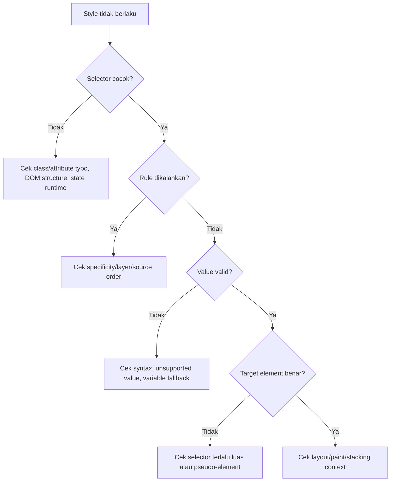

# Part 14 — Selectors Deep Dive: Matching Strategy, Maintainability, and Performance Myths

## 1. Tujuan Pembelajaran

Selector adalah query language untuk memilih elemen yang akan diberi style. Dalam aplikasi kecil, selector terlihat sederhana. Dalam aplikasi besar, selector adalah dependency antara CSS dan struktur HTML.

Setelah bagian ini, kamu harus bisa:

1. memilih selector berdasarkan stabilitas, bukan sekadar yang “works”;
2. memahami specificity dari selector modern seperti `:is()`, `:where()`, `:has()`, dan `:not()`;
3. membedakan selector untuk reset/base, component, state, utility, dan integration boundary;
4. menghindari selector yang rapuh terhadap perubahan DOM;
5. memahami mitos performance selector dan bottleneck CSS yang lebih nyata;
6. menulis selector yang reviewable oleh tim engineering.

Dalam kerangka *The First 20 Hours*, bagian ini adalah deconstruction dari sub-skill CSS: **matching elements intentionally**. Targetnya bukan hafal semua selector, tetapi mampu memilih selector yang maintainable dan bisa diprediksi.

---

## 2. Mental Model: Selector Adalah Dependency

CSS selector mengikat style ke HTML.

```css
.case-card .header h2 {
  font-size: 1rem;
}
```

Selector ini tidak hanya memilih `h2`. Ia menyatakan dependency:

- harus ada ancestor `.case-card`;
- di dalamnya ada `.header`;
- di dalamnya ada `h2`;
- perubahan markup dapat memutus style.

Selector yang lebih stabil:

```css
.case-card__title {
  font-size: 1rem;
}
```

Dependency-nya lebih langsung:

- elemen yang ingin diberi style memiliki class component part.

Dalam engineering terms:

> Selector adalah coupling. Selector panjang biasanya coupling tinggi.

---

## 3. Selector Matching: Cara Berpikir Praktis

Browser engine sangat optimal. Kamu tidak perlu micro-optimize selector dalam mayoritas kasus. Tetapi kamu perlu memahami matching secara praktis.

Selector:

```css
.case-list .case-card[data-status="open"] .case-card__title {
  color: blue;
}
```

Rule ini cocok jika ada elemen `.case-card__title` yang memiliki ancestor `.case-card[data-status="open"]`, yang memiliki ancestor `.case-list`.

Mental model:

```mermaid
flowchart RL
    A[Target element: .case-card__title] --> B[Check ancestor: .case-card[data-status=open]]
    B --> C[Check ancestor: .case-list]
    C --> D[Rule matches]
```

Selector matching sering lebih mudah dipikirkan dari kanan ke kiri: bagian paling kanan adalah target element yang akan distyle.

### 3.1 Key Selector

Dalam selector kompleks, bagian paling kanan sering disebut key selector dalam diskusi performance.

```css
.sidebar nav ul li a.active { }
```

Target-nya `a.active`.

Jika target terlalu luas:

```css
.app * { }
```

Maka rule berpotensi menyentuh banyak elemen.

Namun, masalah utama di aplikasi nyata biasanya bukan selector matching micro-performance, melainkan:

- CSS bundle terlalu besar;
- unused CSS;
- layout thrashing dari JS;
- expensive layout/paint;
- font/image loading;
- complex DOM;
- style invalidation karena perubahan class/state yang luas.

---

## 4. Type Selector

Type selector memilih berdasarkan nama elemen.

```css
button {
  font: inherit;
}

article {
  max-inline-size: 70ch;
}
```

### 4.1 Kapan Cocok

Type selector cocok untuk:

- reset;
- base styles;
- rich text/prose content;
- semantic defaults;
- styling elemen native dengan cakupan jelas.

Contoh:

```css
@layer base {
  h1, h2, h3 {
    line-height: 1.2;
  }

  p {
    margin-block: 0 1rem;
  }
}
```

### 4.2 Kapan Berbahaya

Type selector berbahaya jika dipakai untuk component styling yang harus isolated.

```css
.card button {
  margin-top: 1rem;
}
```

Masalah:

- semua button di card terkena;
- button dalam nested component juga terkena;
- sulit override;
- style bocor ke child component.

Lebih baik:

```css
.card__action {
  margin-block-start: 1rem;
}
```

---

## 5. Class Selector

Class selector adalah default paling sehat untuk aplikasi.

```css
.button { }
.case-card { }
.status-badge { }
```

### 5.1 Mengapa Class Selector Bagus

Class selector:

- explicit;
- reusable;
- specificity rendah;
- tidak bergantung pada elemen tertentu;
- mudah diubah tanpa mengganti semantic HTML;
- cocok untuk component systems.

### 5.2 Naming Strategy

Nama class harus menjawab salah satu hal:

1. component apa?
2. part apa?
3. variant apa?
4. state apa?
5. utility apa?

Contoh:

```css
.case-card { }
.case-card__title { }
.case-card__meta { }
.case-card--selected { }
```

Untuk state yang berasal dari runtime, data attribute sering lebih ekspresif:

```html
<article class="case-card" data-state="selected" data-priority="high">
  ...
</article>
```

```css
.case-card[data-state="selected"] {
  outline: 2px solid var(--focus-ring);
}

.case-card[data-priority="high"] .case-card__priority {
  color: var(--danger-fg);
}
```

---

## 6. ID Selector

ID selector memilih elemen berdasarkan `id`.

```css
#main-navigation { }
```

### 6.1 Gunakan ID untuk Identitas Dokumen, Bukan Styling Umum

ID sangat berguna untuk:

- label association;
- fragment navigation;
- ARIA relationship;
- unique document anchors;
- automated testing in some systems.

Contoh:

```html
<label for="case-title">Case title</label>
<input id="case-title" name="title" />
```

Tetapi ID selector untuk styling sering menciptakan specificity tinggi yang sulit dikalahkan.

```css
#case-title {
  border-color: red;
}
```

Lebih baik:

```css
.form-field__input[aria-invalid="true"] {
  border-color: var(--danger-border);
}
```

### 6.2 Rule of Thumb

Gunakan ID untuk relationship dan navigation. Gunakan class/data attribute untuk styling.

---

## 7. Attribute Selector

Attribute selector memilih berdasarkan attribute.

```css
input[required] { }
button[disabled] { }
[aria-expanded="true"] { }
[data-state="open"] { }
```

### 7.1 Attribute Existence

```css
[required] {
  outline-color: var(--required-indicator);
}
```

Memilih elemen yang punya attribute `required`, terlepas value-nya.

### 7.2 Attribute Exact Value

```css
[data-status="escalated"] {
  color: var(--danger-fg);
}
```

Cocok untuk state machine UI.

### 7.3 Attribute Token Matching

```css
[rel~="noopener"] { }
```

Mencocokkan token dalam daftar whitespace-separated.

### 7.4 Attribute Prefix/Suffix/Substring

```css
a[href^="https://"] { }
a[href$=".pdf"] { }
a[href*="example"] { }
```

Gunakan hati-hati. Selector substring dapat menjadi coupling ke format string.

### 7.5 Attribute Selector untuk State

Untuk component state, attribute selector sangat berguna:

```html
<button class="disclosure" aria-expanded="false" aria-controls="case-filters">
  Filters
</button>
```

```css
.disclosure[aria-expanded="true"] .disclosure__icon {
  rotate: 180deg;
}
```

Ini bagus karena style mengikuti state aksesibilitas yang sudah ada.

---

## 8. Universal Selector

Universal selector memilih semua elemen.

```css
* {
  box-sizing: border-box;
}
```

### 8.1 Kapan Cocok

Cocok untuk reset terbatas:

```css
*, *::before, *::after {
  box-sizing: border-box;
}
```

### 8.2 Kapan Berbahaya

```css
.card * {
  margin: 0;
}
```

Masalah:

- terlalu luas;
- dapat merusak nested component;
- membuat override sulit;
- menyembunyikan dependency.

---

## 9. Combinators

Combinator menjelaskan relationship antar elemen.

### 9.1 Descendant Combinator

```css
.card .title { }
```

Memilih `.title` di mana pun di dalam `.card`.

Risiko: terlalu luas.

### 9.2 Child Combinator

```css
.card > .title { }
```

Memilih direct child.

Lebih ketat, tetapi lebih terikat struktur DOM.

### 9.3 Next Sibling Combinator

```css
.field__label + .field__input { }
```

Memilih sibling langsung setelah elemen tertentu.

Cocok untuk pattern kecil, tetapi rapuh jika markup berubah.

### 9.4 Subsequent Sibling Combinator

```css
input:checked ~ .panel { }
```

Dapat dipakai untuk CSS-only interaction, tetapi hati-hati terhadap readability.

### 9.5 Selector Relationship sebagai Coupling

Semakin banyak combinator, semakin tinggi coupling ke struktur DOM.

```css
/* High coupling */
.page > main > section > div > article > header > h2 { }

/* Lower coupling */
.case-card__title { }
```

---

## 10. Pseudo-Classes

Pseudo-class memilih elemen berdasarkan state, posisi, atau kondisi.

### 10.1 Interaction State

```css
a:hover { }
button:active { }
button:focus-visible { }
input:disabled { }
input:invalid { }
```

Gunakan `:focus-visible` untuk visible keyboard focus.

```css
.button:focus-visible {
  outline: 3px solid var(--focus-ring);
  outline-offset: 2px;
}
```

Jangan hapus outline tanpa mengganti visible focus.

```css
/* Bad */
button:focus {
  outline: none;
}
```

### 10.2 Form State

```css
input:required { }
input:optional { }
input:valid { }
input:invalid { }
input:user-invalid { }
```

Pattern umum:

```css
.field:has(input:required) .field__label::after {
  content: " *";
  color: var(--danger-fg);
}

.field:has(input:user-invalid) .field__error {
  display: block;
}
```

Catatan: `:user-invalid` berguna untuk menghindari error langsung tampil sebelum user berinteraksi, tetapi support harus dicek sesuai target browser.

### 10.3 Structural Pseudo-Classes

```css
li:first-child { }
li:last-child { }
tr:nth-child(even) { }
.card:only-child { }
```

Cocok untuk pattern struktural, tetapi jangan jadikan identity domain.

Buruk:

```css
.form-section:nth-child(3) {
  border-color: red;
}
```

Lebih baik:

```css
.form-section[data-critical="true"] {
  border-color: var(--danger-border);
}
```

### 10.4 Negation dengan `:not()`

```css
.button:not([disabled]) {
  cursor: pointer;
}
```

Modern `:not()` bisa menerima selector list.

```css
.card:not(.card--disabled, .card--archived) {
  box-shadow: var(--shadow-sm);
}
```

Specificity `:not()` mengikuti specificity selector di argumennya.

---

## 11. Pseudo-Elements

Pseudo-element memilih bagian dari elemen atau membuat box virtual.

```css
.button::before { }
.button::after { }
p::first-line { }
input::placeholder { }
```

### 11.1 Decorative Content

```css
.status-badge::before {
  content: "";
  inline-size: 0.5rem;
  block-size: 0.5rem;
  border-radius: 999px;
  background: currentColor;
}
```

Pseudo-element bagus untuk dekorasi.

Jangan taruh informasi penting hanya di `content` CSS jika harus dibaca assistive technology atau dicopy sebagai data.

### 11.2 `::before` dan `::after`

Perlu `content` agar muncul.

```css
.required-label::after {
  content: " *";
}
```

Untuk required indicator, pastikan informasi juga tersedia secara semantik, misalnya `required`, instruksi teks, atau error handling yang benar.

---

## 12. Selector Lists

```css
h1, h2, h3 {
  line-height: 1.2;
}
```

Jika satu selector dalam list invalid pada CSS lama, historisnya seluruh rule bisa invalid. Selector modern seperti `:is()` dan `:where()` membantu membuat selector list lebih manageable.

---

## 13. `:is()`

`:is()` memilih elemen yang cocok dengan salah satu selector dalam argumen.

```css
:is(h1, h2, h3) {
  line-height: 1.2;
}
```

Berguna untuk mengurangi repetisi.

```css
.card :is(h2, h3, h4) {
  margin-block-start: 0;
}
```

### 13.1 Specificity `:is()`

Specificity `:is()` adalah specificity tertinggi dari selector di argumennya.

```css
:is(.card, #featured) h2 { }
```

Karena ada `#featured`, specificity dapat menjadi tinggi.

Rule:

> Jangan masukkan ID selector ke `:is()` kecuali benar-benar sengaja menaikkan specificity.

---

## 14. `:where()`

`:where()` mirip `:is()`, tetapi specificity-nya selalu nol.

```css
:where(h1, h2, h3) {
  line-height: 1.2;
}
```

Ini sangat berguna untuk base styles yang mudah dioverride.

Contoh:

```css
:where(article, aside, nav, section) :where(h1, h2, h3) {
  line-height: 1.2;
}
```

Specificity tetap rendah karena `:where()` tidak menambah bobot.

### 14.1 Pattern untuk Component Root

```css
:where(.prose) :where(h1, h2, h3, p, ul, ol) {
  margin-block-start: 0;
}
```

Ini membuat rich-text base style mudah dioverride oleh component khusus.

### 14.2 `:where()` sebagai Specificity Control

Tanpa `:where()`:

```css
.app-shell .sidebar .nav a {
  color: var(--nav-link-fg);
}
```

Dengan `:where()`:

```css
:where(.app-shell .sidebar .nav) a {
  color: var(--nav-link-fg);
}
```

Bagian wrapper tidak menambah specificity.

---

## 15. `:has()`

`:has()` memilih elemen berdasarkan descendant/relative condition. Ini sering disebut parent selector, meskipun lebih tepat disebut relational pseudo-class.

Contoh:

```css
.field:has(input:required) .field__label::after {
  content: " *";
}
```

Artinya: pilih `.field` yang memiliki `input:required` di dalamnya.

### 15.1 Use Case: Form Field State

```css
.field:has(input:user-invalid) {
  border-color: var(--danger-border);
}

.field:has(input:focus-visible) {
  outline: 2px solid var(--focus-ring);
}
```

### 15.2 Use Case: Card with Media

```css
.card:has(.card__media) {
  display: grid;
  grid-template-columns: 12rem 1fr;
}
```

### 15.3 Use Case: Navigation Active State

```css
.nav-item:has(a[aria-current="page"]) {
  background: var(--nav-active-bg);
}
```

### 15.4 Specificity `:has()`

`:has()` mengambil specificity dari selector paling spesifik dalam argumennya, mirip `:is()` dan `:not()`.

```css
.card:has(#danger-zone) { }
```

Ini dapat membuat specificity tinggi karena `#danger-zone`.

### 15.5 Caution

`:has()` powerful, tetapi jangan dipakai untuk menyembunyikan state model yang seharusnya eksplisit.

Boleh:

```css
.field:has(input:invalid) { }
```

Karena state berasal dari HTML form validity.

Hati-hati:

```css
.page:has(.modal .button .icon.warning) { }
```

Ini coupling tinggi dan sulit dipahami.

---

## 16. `:not()`

`:not()` memilih elemen yang tidak cocok dengan selector tertentu.

```css
.button:not([disabled]) {
  cursor: pointer;
}
```

Use case yang sehat:

```css
.nav-link:not([aria-current="page"]):hover {
  background: var(--nav-hover-bg);
}
```

Use case yang buruk:

```css
*:not(.allowed):not(.also-allowed):not(.legacy-exception) {
  color: red;
}
```

Jika selector penuh negasi, biasanya model class/state tidak jelas.

---

## 17. `:nth-child()` and Friends

Structural selectors berguna untuk pola visual.

```css
tbody tr:nth-child(even) {
  background: var(--table-stripe-bg);
}
```

Dengan syntax modern, `:nth-child()` dapat digabung dengan `of` selector list di browser modern.

```css
.item:nth-child(2n of .item:not([hidden])) {
  background: var(--stripe-bg);
}
```

Gunakan untuk struktur tampilan, bukan domain state.

Buruk:

```css
.workflow-step:nth-child(4) {
  color: red;
}
```

Lebih baik:

```css
.workflow-step[data-state="rejected"] {
  color: var(--danger-fg);
}
```

---

## 18. State Selectors: Class vs Data Attribute vs ARIA

### 18.1 Class State

```html
<button class="button is-loading">Save</button>
```

```css
.button.is-loading {
  cursor: wait;
}
```

Bagus untuk internal visual state.

### 18.2 Data Attribute State

```html
<button class="button" data-state="loading">Save</button>
```

```css
.button[data-state="loading"] {
  cursor: wait;
}
```

Bagus untuk state machine yang punya enum.

### 18.3 ARIA State

```html
<button class="disclosure" aria-expanded="true">Filters</button>
```

```css
.disclosure[aria-expanded="true"] .disclosure__icon {
  rotate: 180deg;
}
```

Bagus jika state tersebut memang bagian dari accessibility contract.

### 18.4 Rule of Thumb

- Gunakan native pseudo-class untuk native state: `:disabled`, `:invalid`, `:checked`.
- Gunakan ARIA attribute jika state perlu diketahui assistive technology.
- Gunakan `data-*` untuk state domain/component.
- Gunakan class untuk variant atau state visual sederhana.

---

## 19. Selector Specificity Patterns

### 19.1 Low-Specificity Component

```css
.button {
  display: inline-flex;
}

.button[data-variant="primary"] {
  background: var(--button-primary-bg);
}

.button[data-size="sm"] {
  min-block-size: 2rem;
}
```

Predictable.

### 19.2 High-Specificity Trap

```css
main .content .toolbar button.button.primary:not(:disabled) { }
```

Sulit override.

### 19.3 Wrapper dengan `:where()`

```css
:where(.admin-shell) .button {
  font-size: 0.875rem;
}
```

Wrapper tidak menaikkan specificity.

### 19.4 Variant tanpa Descendant Berlebih

Buruk:

```css
.card.danger .card-header .title { }
```

Lebih baik:

```css
.card[data-tone="danger"] .card__title { }
```

atau:

```css
.card__title {
  color: var(--card-title-fg);
}

.card[data-tone="danger"] {
  --card-title-fg: var(--danger-fg);
}
```

Ini lebih scalable karena variant mengubah token, bukan semua child selector.

---

## 20. Selector Strategy per Layer

### 20.1 Reset Layer

Gunakan type/universal selector secukupnya.

```css
@layer reset {
  *, *::before, *::after {
    box-sizing: border-box;
  }

  button, input, textarea, select {
    font: inherit;
  }
}
```

### 20.2 Base Layer

Gunakan type selector dan `:where()`.

```css
@layer base {
  :where(h1, h2, h3) {
    line-height: 1.2;
  }

  :where(a) {
    color: var(--link-fg);
  }
}
```

### 20.3 Components Layer

Gunakan class dan data attributes.

```css
@layer components {
  .status-badge { }
  .status-badge[data-status="open"] { }
}
```

### 20.4 Utilities Layer

Gunakan single-purpose classes.

```css
@layer utilities {
  .sr-only { }
  .text-muted { }
  .stack-md { }
}
```

### 20.5 Overrides Layer

Gunakan selector paling sempit yang diperlukan, dengan komentar.

```css
@layer overrides {
  /* Temporary patch for third-party date picker until v3 migration. */
  .case-form .third-party-datepicker [role="gridcell"] {
    min-inline-size: 2.25rem;
  }
}
```

---

## 21. Selector Performance Myths

### 21.1 Myth: “Never Use Descendant Selectors”

Descendant selectors bukan otomatis buruk. Yang buruk adalah descendant selector yang:

- terlalu luas;
- sering berubah karena DOM dinamis;
- menargetkan banyak elemen;
- menciptakan coupling tinggi;
- membuat maintenance sulit.

```css
.prose p {
  margin-block: 0 1rem;
}
```

Ini masuk akal.

```css
.app div div div span {
  color: red;
}
```

Ini buruk terutama karena maintainability, bukan hanya performance.

### 21.2 Myth: “ID Selector Paling Cepat, Maka Pakai ID”

Mesin browser modern sudah sangat optimize selector matching. Memilih ID untuk performance CSS biasanya trade-off buruk karena specificity tinggi.

Pilih selector berdasarkan correctness dan maintainability.

### 21.3 Myth: “`:has()` Selalu Lambat”

`:has()` memang lebih kompleks daripada class sederhana, tetapi browser modern mengoptimalkannya. Risiko utama adalah penggunaan yang terlalu luas.

Lebih aman:

```css
.field:has(input:invalid) { }
```

Berisiko:

```css
body:has(.app * .deep .dynamic-state) { }
```

### 21.4 Bottleneck yang Lebih Sering Nyata

Di production, masalah biasanya datang dari:

- CSS terlalu besar;
- unused utility classes;
- terlalu banyak runtime style injection;
- layout invalidation karena JS mengubah DOM/class besar-besaran;
- complex layout nesting;
- heavy shadows/filters/backdrop filters;
- web font loading;
- large images;
- animation property yang memicu layout/paint.

---

## 22. Maintainability Heuristics

### 22.1 Prefer Direct Class for Component Parts

```css
.case-card__title { }
```

lebih stabil daripada:

```css
.case-card header h2 { }
```

### 22.2 Prefer State Attribute for State Machines

```css
.case-card[data-state="selected"] { }
.case-card[data-state="archived"] { }
.case-card[data-state="escalated"] { }
```

lebih eksplisit daripada:

```css
.case-card.selected { }
.case-card.old { }
.case-card.red { }
```

### 22.3 Prefer Semantic Variant Names

Buruk:

```html
<span class="badge badge--red">Escalated</span>
```

Lebih baik:

```html
<span class="badge" data-tone="danger">Escalated</span>
```

Atau domain-specific:

```html
<span class="case-status" data-status="escalated">Escalated</span>
```

### 22.4 Avoid Styling by Text or Position

CSS tidak memilih berdasarkan text content. Jika style tergantung domain state, representasikan state di markup.

```html
<tr data-risk="high">
  ...
</tr>
```

```css
tr[data-risk="high"] {
  background: var(--risk-high-bg);
}
```

### 22.5 Keep Selectors Shallow

Target sehat:

```css
.component { }
.component__part { }
.component[data-state="x"] { }
.component:has(.component__part) { }
```

Waspada jika selector sering lebih dari 3 relationship.

---

## 23. Case Study: Case Management Card

HTML:

```html
<article class="case-card" data-priority="high" data-state="selected">
  <header class="case-card__header">
    <h2 class="case-card__title">
      <a class="case-card__link" href="/cases/CASE-2026-001">
        CASE-2026-001
      </a>
    </h2>
    <span class="case-card__badge" data-status="escalated">Escalated</span>
  </header>

  <dl class="case-card__meta">
    <div class="case-card__meta-item">
      <dt>Owner</dt>
      <dd>Investigation Unit A</dd>
    </div>
    <div class="case-card__meta-item">
      <dt>Due</dt>
      <dd><time datetime="2026-07-05">5 Jul 2026</time></dd>
    </div>
  </dl>
</article>
```

CSS:

```css
.case-card {
  --case-card-border: var(--border-muted);
  --case-card-bg: var(--surface-default);

  border: 1px solid var(--case-card-border);
  background: var(--case-card-bg);
  border-radius: var(--radius-md);
  padding: var(--space-4);
}

.case-card[data-state="selected"] {
  --case-card-border: var(--accent-border);
}

.case-card[data-priority="high"] {
  --case-card-bg: var(--danger-surface-subtle);
}

.case-card__header {
  display: flex;
  align-items: start;
  justify-content: space-between;
  gap: var(--space-3);
}

.case-card__title {
  margin: 0;
  font-size: var(--font-size-md);
}

.case-card__badge[data-status="escalated"] {
  color: var(--danger-fg);
  background: var(--danger-bg-subtle);
}
```

Kenapa ini bagus:

- selector shallow;
- state eksplisit;
- variant mengubah custom properties;
- DOM dependency terbatas;
- class part jelas;
- mudah diuji dan di-review.

---

## 24. Case Study: Form Field with `:has()`

HTML:

```html
<div class="field">
  <label class="field__label" for="email">Email</label>
  <input class="field__control" id="email" name="email" type="email" required />
  <p class="field__hint">Use your work email.</p>
  <p class="field__error">Enter a valid email address.</p>
</div>
```

CSS:

```css
.field {
  display: grid;
  gap: var(--space-2);
}

.field__error {
  display: none;
  color: var(--danger-fg);
}

.field:has(.field__control:required) .field__label::after {
  content: " *";
  color: var(--danger-fg);
}

.field:has(.field__control:user-invalid) .field__control {
  border-color: var(--danger-border);
}

.field:has(.field__control:user-invalid) .field__error {
  display: block;
}

.field:has(.field__control:focus-visible) {
  outline: 2px solid var(--focus-ring);
  outline-offset: 4px;
}
```

Kenapa ini masuk akal:

- parent `.field` bereaksi terhadap state input;
- markup tidak perlu class `.field--invalid` jika native validity cukup;
- selector tetap scoped ke component;
- condition tidak dimulai dari `body` atau `.page`.

---

## 25. Anti-Patterns

### 25.1 Styling Based on Layout Accident

```css
.card > div:nth-child(2) { }
```

Ini rapuh. Tambah wrapper kecil, style rusak.

### 25.2 Styling Nested Third-Party Internals

```css
.date-picker div div span:nth-child(4) { }
```

Gunakan API theme resmi, wrapper class, CSS variables, atau override layer yang terdokumentasi.

### 25.3 Overusing Global Utility Overrides

```css
.text-red { color: red !important; }
.mt-17 { margin-top: 17px !important; }
```

Utility bagus jika sistematis. Utility kacau jika menjadi escape hatch tanpa desain scale.

### 25.4 Selector Names Based on Visual Only

```css
.red-box { }
.big-text { }
```

Lebih baik:

```css
.alert { }
.alert[data-tone="danger"] { }
```

### 25.5 Combining State and Structure Too Deeply

```css
.page .sidebar .menu li.active > a span.icon { }
```

Lebih baik:

```css
.nav-link[aria-current="page"] .nav-link__icon { }
```

---

## 26. Debugging Selector Problems



### 26.1 Tanda Selector Terlalu Luas

- perubahan satu rule memengaruhi banyak halaman;
- nested component ikut berubah;
- perlu banyak override;
- visual regression sering muncul di area tidak terkait.

### 26.2 Tanda Selector Terlalu Spesifik

- sulit override tanpa `!important`;
- refactor markup memutus style;
- selector berisi banyak ancestor;
- selector berisi ID;
- utility class tidak bisa menang meskipun seharusnya.

---

## 27. Code Review Checklist

Tanyakan ini saat review selector:

- Apakah selector memilih target yang benar dan hanya target itu?
- Apakah selector terlalu bergantung pada struktur DOM?
- Apakah specificity cukup rendah?
- Apakah selector memakai ID untuk styling?
- Apakah state direpresentasikan secara eksplisit?
- Apakah ARIA selector dipakai hanya untuk state yang benar-benar ARIA-relevant?
- Apakah `:has()` dibatasi ke component scope?
- Apakah `:where()` bisa dipakai untuk menurunkan specificity wrapper?
- Apakah `:is()` mengandung ID yang tidak sengaja menaikkan specificity?
- Apakah selector list aman dan readable?
- Apakah selector menembus boundary third-party atau child component?
- Apakah nama class menggambarkan domain/component, bukan warna sementara?

---

## 28. Deliberate Practice

### Latihan 1 — Specificity Drill

Hitung specificity:

```css
button { }
.button { }
button.button { }
#save.button { }
.card[data-state="open"] .card__title { }
:where(.app .sidebar) .nav-link { }
:is(.card, #featured) .title { }
.field:has(input:invalid) .field__error { }
```

Validasi dengan DevTools atau specificity calculator, tetapi hitung manual dulu.

### Latihan 2 — Refactor Selector Rapuh

Refactor CSS ini:

```css
main > section:nth-child(2) div div h2 {
  font-size: 1.25rem;
}

.sidebar ul li.active a span {
  color: blue;
}

.form div:nth-child(3) input {
  border-color: red;
}
```

Target refactor:

- class part jelas;
- state attribute;
- specificity rendah;
- tidak bergantung pada posisi child.

### Latihan 3 — Build Form Field with `:has()`

Buat field component yang mendukung:

- required marker;
- invalid state;
- focus-visible state;
- disabled state;
- hint;
- error message.

Gunakan native attribute/pseudo-class sebanyak mungkin.

### Latihan 4 — Component Token Variant

Buat card component:

```html
<article class="card" data-tone="neutral"></article>
<article class="card" data-tone="danger"></article>
<article class="card" data-tone="success"></article>
```

Variant harus mengubah custom properties di root `.card`, bukan menargetkan semua child satu per satu.

---

## 29. Production Rules of Thumb

1. Gunakan class selector sebagai default.
2. Hindari ID selector untuk styling.
3. Gunakan type selector untuk reset/base/rich text, bukan component internals sembarangan.
4. Jaga selector tetap shallow.
5. Representasikan state dengan native pseudo-class, ARIA, data attribute, atau class secara sengaja.
6. Gunakan `:where()` untuk wrapper context rendah specificity.
7. Gunakan `:is()` untuk mengurangi repetisi, tetapi awasi specificity argumennya.
8. Gunakan `:has()` untuk relational styling yang scoped, bukan global magic.
9. Jangan menulis selector berdasarkan posisi child untuk domain meaning.
10. Review selector sebagai dependency antara CSS dan HTML.

---

## 30. Ringkasan

Selector yang baik bukan selector yang paling pintar. Selector yang baik adalah selector yang:

- memilih target dengan jelas;
- rendah specificity;
- stabil terhadap refactor markup;
- sesuai layer arsitektur;
- menyatakan state secara eksplisit;
- mudah dipahami engineer lain;
- tidak bocor ke komponen lain.

CSS modern memberi alat kuat seperti `:is()`, `:where()`, `:has()`, dan selector list yang lebih fleksibel. Namun, semakin kuat selector, semakin penting disiplin arsitektur.

Mental model final:

```text
Selector = dependency.
Specificity = cost of override.
Combinator = coupling to DOM structure.
State selector = contract between behavior and style.
```

---

## 31. Referensi

- MDN — CSS selectors: https://developer.mozilla.org/en-US/docs/Web/CSS/CSS_selectors
- MDN — Specificity: https://developer.mozilla.org/en-US/docs/Web/CSS/Guides/Cascade/Specificity
- MDN — `:has()`: https://developer.mozilla.org/en-US/docs/Web/CSS/:has
- MDN — `:is()`: https://developer.mozilla.org/en-US/docs/Web/CSS/:is
- MDN — `:where()`: https://developer.mozilla.org/en-US/docs/Web/CSS/:where
- MDN — `:not()`: https://developer.mozilla.org/en-US/docs/Web/CSS/:not
- Selectors Level 4 — W3C: https://www.w3.org/TR/selectors-4/
- CSS Cascading and Inheritance Level 6 — W3C: https://www.w3.org/TR/css-cascade-6/
