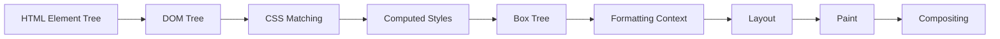
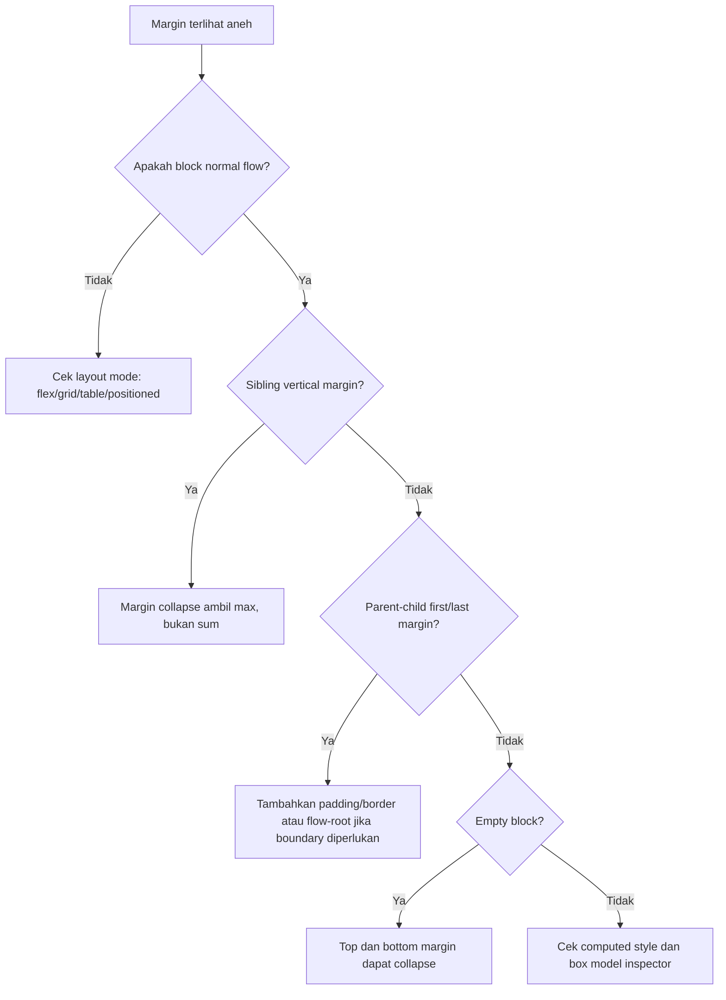
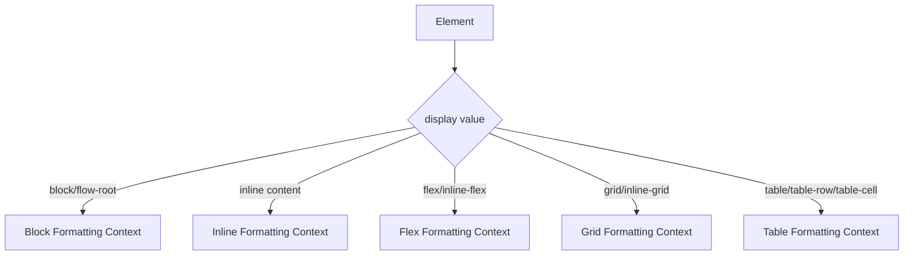
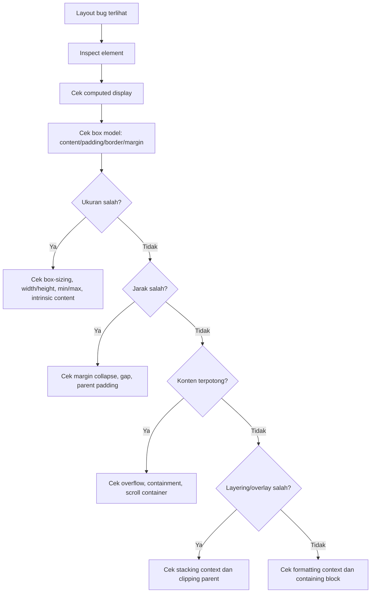

# Part 15 — Box Model, Formatting Contexts, Display, Overflow, and Containment

## 1. Target Skill

Setelah bagian ini, kamu harus bisa melihat sebuah UI dan menjawab pertanyaan berikut tanpa trial and error:

1. Box apa saja yang dibuat browser dari elemen HTML?
2. Ukuran final sebuah elemen berasal dari content, padding, border, margin, atau constraints lain?
3. Kenapa margin tertentu collapse, sementara yang lain tidak?
4. Kenapa `overflow: hidden`, `overflow: auto`, atau `display: flow-root` tiba-tiba mengubah layout?
5. Kenapa child absolute/floating/sticky kadang keluar dari ekspektasi?
6. Kapan perlu membuat formatting context baru?
7. Kapan containment membantu performance, dan kapan malah merusak layout?

Bagian ini adalah fondasi sebelum Flexbox, Grid, positioning, dan responsive design. Banyak bug CSS yang terlihat seperti bug Flexbox/Grid sebenarnya berasal dari kesalahpahaman terhadap box model, formatting context, atau overflow.

---

## 2. Mental Model Utama: CSS Menghasilkan Box Tree

HTML menghasilkan DOM tree. CSS tidak langsung “menghias DOM”; CSS membuat **box tree** yang dipakai browser untuk layout dan paint.

Satu elemen HTML tidak selalu sama dengan satu visual box sederhana. Bergantung pada `display`, pseudo-element, anonymous boxes, dan formatting context, browser dapat membuat struktur box yang berbeda dari DOM.



**Invarian penting:** CSS layout bekerja terhadap box, bukan terhadap tag semata.

Contoh:

```html
<p>Hello <strong>world</strong></p>
```

Secara DOM:

```txt
p
├─ text: "Hello "
└─ strong
   └─ text: "world"
```

Secara layout, browser membangun line boxes, inline boxes, dan fragment yang bisa pecah lintas baris. Jadi ketika kamu memberi `background` pada `strong`, box visualnya dapat terfragmentasi jika teks wrap.

---

## 3. Basic Box Model

Setiap box utama terdiri dari empat area:

```txt
+----------------------------------------------------+
| margin                                             |
|   +--------------------------------------------+   |
|   | border                                     |   |
|   |   +------------------------------------+   |   |
|   |   | padding                            |   |   |
|   |   |   +----------------------------+   |   |   |
|   |   |   | content                    |   |   |   |
|   |   |   +----------------------------+   |   |   |
|   |   +------------------------------------+   |   |
|   +--------------------------------------------+   |
+----------------------------------------------------+
```

Area:

| Area | Fungsi | Mempengaruhi ukuran visual? | Bisa menerima background? |
|---|---|---:|---:|
| content | isi elemen | ya | ya |
| padding | jarak internal | ya | ya |
| border | garis tepi | ya | ya |
| margin | jarak eksternal | ya, terhadap elemen lain | tidak |

Contoh:

```css
.card {
  width: 300px;
  padding: 24px;
  border: 1px solid #ccc;
  margin: 16px;
}
```

Jika `box-sizing: content-box`, total lebar visual border box adalah:

```txt
width + padding-left + padding-right + border-left + border-right
= 300 + 24 + 24 + 1 + 1
= 350px
```

Margin tidak termasuk ukuran border box, tapi memengaruhi jarak terhadap box lain.

---

## 4. `box-sizing`: Content Box vs Border Box

### 4.1 Default: `content-box`

Default CSS adalah:

```css
* {
  box-sizing: content-box;
}
```

Artinya `width` dan `height` hanya mengatur content box.

```css
.panel {
  width: 400px;
  padding: 32px;
  border: 2px solid;
}
```

Lebar border box:

```txt
400 + 32 + 32 + 2 + 2 = 468px
```

Ini sering membuat layout melebar tanpa sengaja.

### 4.2 Praktik Modern: `border-box`

Biasanya production CSS memakai reset berikut:

```css
*,
*::before,
*::after {
  box-sizing: border-box;
}
```

Dengan `border-box`, `width` mencakup content + padding + border.

```css
.panel {
  box-sizing: border-box;
  width: 400px;
  padding: 32px;
  border: 2px solid;
}
```

Lebar border box tetap 400px. Content box otomatis menyesuaikan:

```txt
400 - 32 - 32 - 2 - 2 = 332px
```

### 4.3 Kapan `content-box` Masih Berguna?

`content-box` kadang dipakai ketika ukuran konten harus eksplisit dan padding/border dianggap ornament. Namun untuk layout sistem aplikasi modern, `border-box` lebih predictable.

**Rule of thumb:**

- gunakan global `border-box`,
- jangan override kecuali ada alasan layout yang sangat jelas,
- saat debugging lebar overflow, cek `box-sizing` pertama.

---

## 5. Width, Height, Intrinsic Size, and Constraints

`width` dan `height` bukan satu-satunya penentu ukuran. CSS layout mempertimbangkan:

1. explicit size: `width`, `height`, `inline-size`, `block-size`
2. min/max constraints: `min-width`, `max-width`, `min-height`, `max-height`
3. intrinsic size: ukuran alami konten
4. available space: ruang dari parent/formatting context
5. formatting mode: block, inline, flex, grid, table, positioned
6. aspect ratio
7. overflow behavior

Contoh umum:

```css
.card {
  width: 100%;
  max-width: 48rem;
  min-width: 0;
}
```

Makna:

- ambil ruang parent semaksimal mungkin,
- tapi jangan lebih dari 48rem,
- izinkan menyusut jika konteks layout membutuhkan.

`min-width: 0` terlihat aneh, tetapi penting di Flexbox/Grid karena beberapa item punya minimum intrinsic size yang dapat membuat overflow. Detailnya dibahas di Part 17 dan Part 18.

---

## 6. Margin: Jarak Eksternal, Bukan Layout API Global

Margin adalah jarak di luar border box. Margin sering disalahgunakan sebagai “layout positioning”. Itu berbahaya karena margin memiliki aturan khusus, terutama **margin collapsing**.

### 6.1 Margin Positif

```css
.stack > * + * {
  margin-block-start: 1rem;
}
```

Pattern ini memberi jarak antar sibling tanpa memberi margin atas pada elemen pertama.

### 6.2 Margin Negatif

Margin negatif valid, tapi harus dipakai sebagai teknik eksplisit, bukan patch acak.

```css
.alert {
  margin-inline: -1rem;
}
```

Gunakan margin negatif hanya saat kamu bisa menjelaskan invariant-nya, misalnya “alert melebar sampai edge container karena container punya padding 1rem”.

### 6.3 Auto Margin

`margin: auto` punya perilaku kuat.

Center block element:

```css
.container {
  max-width: 72rem;
  margin-inline: auto;
}
```

Push item dalam flex layout:

```css
.toolbar__danger-action {
  margin-inline-start: auto;
}
```

Dalam normal block flow, horizontal auto margin dapat membagi sisa ruang. Vertical auto margin biasanya tidak bekerja seperti centering kecuali di layout mode tertentu.

---

## 7. Margin Collapsing

Margin collapsing adalah salah satu sumber bug klasik.

Margin vertikal dalam block formatting context dapat collapse dalam beberapa situasi:

1. antara adjacent siblings,
2. antara parent dan first/last child,
3. pada empty block.

Contoh sibling:

```html
<section class="a">A</section>
<section class="b">B</section>
```

```css
.a {
  margin-bottom: 32px;
}

.b {
  margin-top: 24px;
}
```

Jarak antar elemen bukan 56px, melainkan 32px karena margin collapse mengambil nilai terbesar.

### 7.1 Parent-Child Margin Collapse

```html
<div class="card">
  <h2>Title</h2>
</div>
```

```css
.card {
  background: white;
}

.card > h2 {
  margin-top: 2rem;
}
```

Margin `h2` dapat collapse keluar dari parent sehingga terlihat seperti `.card` terdorong turun, bukan isi card yang turun.

Solusi tergantung tujuan:

```css
.card {
  padding-block-start: 1px;
}
```

atau:

```css
.card {
  display: flow-root;
}
```

atau lebih baik secara desain:

```css
.card {
  padding: 1.5rem;
}

.card > :first-child {
  margin-block-start: 0;
}
```

### 7.2 Jangan Menghafal Hack, Pahami Boundary

Margin collapse terjadi dalam block formatting context. Jika kamu membuat formatting context baru, memberikan border/padding, membuat flex/grid container, atau mengubah overflow tertentu, collapse dapat berhenti.



---

## 8. Padding: Internal Spacing yang Stabil

Padding memberi jarak antara content dan border. Padding tidak collapse. Karena itu, padding sering lebih tepat untuk jarak internal container.

```css
.card {
  padding: 1.5rem;
}
```

Gunakan padding untuk:

- jarak isi terhadap container,
- clickable area button/link,
- input internal spacing,
- panel/card layout,
- menjaga visual boundary.

Jangan gunakan padding untuk memisahkan sibling di luar container. Untuk itu gunakan `gap`, stack pattern, atau margin antar sibling.

---

## 9. Border, Outline, and Box Impact

`border` mengambil ruang layout. `outline` tidak mengambil ruang layout.

```css
.button:focus-visible {
  outline: 3px solid currentColor;
  outline-offset: 2px;
}
```

Untuk focus indicator, `outline` sering lebih aman karena tidak mengubah ukuran elemen.

Perbedaan:

| Property | Mengubah ukuran layout? | Cocok untuk |
|---|---:|---|
| `border` | ya | visual boundary permanen |
| `outline` | tidak | focus ring, debug outline |
| `box-shadow` | tidak secara layout | elevation, focus alternatif jika aksesibel |

---

## 10. `display`: Outer and Inner Display

`display` menentukan dua hal:

1. **outer display type**: bagaimana box berpartisipasi di parent formatting context,
2. **inner display type**: bagaimana children dilayout.

Contoh:

```css
.card {
  display: block;
}

.toolbar {
  display: flex;
}

.dashboard {
  display: grid;
}
```

`display: flex` berarti:

- dari luar, elemen berperilaku seperti block-level box,
- dari dalam, children menjadi flex items.

`display: inline-flex` berarti:

- dari luar, elemen berperilaku seperti inline-level box,
- dari dalam, children menjadi flex items.

### 10.1 Common Display Values

| Value | Outer behavior | Inner layout | Catatan |
|---|---|---|---|
| `block` | block-level | flow | default banyak structural elements |
| `inline` | inline-level | flow | tidak menerima width/height seperti block |
| `inline-block` | inline-level | flow-root-like | bisa diberi width/height |
| `flow-root` | block-level | new BFC | bagus untuk clear floats/contain margin |
| `flex` | block-level | flex formatting context | one-dimensional layout |
| `inline-flex` | inline-level | flex formatting context | inline component |
| `grid` | block-level | grid formatting context | two-dimensional layout |
| `inline-grid` | inline-level | grid formatting context | inline grid component |
| `contents` | no principal box | children participate | hati-hati accessibility |
| `none` | no box | children removed visually | juga menghapus dari accessibility tree |

---

## 11. `display: contents`: Berguna tapi Berisiko

`display: contents` membuat elemen tidak menghasilkan principal box. Children-nya seolah-olah naik ke parent layout.

Contoh:

```css
.wrapper {
  display: contents;
}
```

Ini bisa berguna untuk menghilangkan wrapper layout tanpa mengubah DOM. Tetapi ada risiko:

- styling visual wrapper hilang,
- pseudo-element wrapper tidak bekerja seperti biasa,
- beberapa kombinasi historically bermasalah pada accessibility tree,
- event/focus/layout debugging lebih membingungkan.

**Rule of thumb:** gunakan `display: contents` hanya jika wrapper benar-benar structural dan tidak punya role semantik penting, tidak perlu background/border/padding, dan sudah dites accessibility-nya.

---

## 12. Formatting Contexts

Formatting context adalah area yang punya aturan layout sendiri. Semua box dilayout dalam konteks tertentu.

Jenis umum:

1. block formatting context,
2. inline formatting context,
3. flex formatting context,
4. grid formatting context,
5. table formatting context,
6. ruby formatting context.

Bagian ini fokus pada block dan inline. Flex/Grid dibahas mendalam di part berikutnya.



---

## 13. Block Formatting Context atau BFC

BFC adalah boundary layout untuk block boxes dan floats. BFC penting karena:

- menghentikan margin collapse tertentu,
- mengandung floats,
- membuat elemen tidak overlap dengan float di luar,
- menjadi unit layout independen untuk flow tertentu.

BFC dapat dibuat oleh beberapa kondisi, termasuk:

- root element,
- floats,
- absolutely positioned elements,
- `display: flow-root`,
- `overflow` selain `visible`/`clip` dalam kondisi tertentu,
- flex/grid items dalam kondisi tertentu,
- `contain: layout`, `contain: paint`, atau composite containment tertentu.

### 13.1 Use Case: Contain Floats

Legacy float pattern:

```html
<div class="media-object">
  
  <p>Long content...</p>
</div>
```

```css
.media-object__image {
  float: left;
  margin-inline-end: 1rem;
}
```

Parent bisa collapse karena float tidak mengambil ruang normal flow. Solusi modern:

```css
.media-object {
  display: flow-root;
}
```

`flow-root` secara eksplisit membuat BFC. Ini lebih jelas daripada clearfix hack lama.

### 13.2 Use Case: Stop Margin Leakage

```css
.panel {
  display: flow-root;
  padding: 1rem;
}
```

`display: flow-root` menjadikan panel boundary layout yang lebih predictable.

### 13.3 Jangan Pakai `overflow: hidden` sebagai Clearfix Default

Dulu `overflow: hidden` sering dipakai untuk membuat BFC. Masalahnya, ia juga memotong konten yang overflow.

```css
.card {
  overflow: hidden; /* mungkin memotong focus ring, tooltip, shadow */
}
```

Jika tujuanmu membuat BFC, gunakan:

```css
.card {
  display: flow-root;
}
```

Jika tujuanmu clipping, baru gunakan overflow/clipping secara eksplisit.

---

## 14. Inline Formatting Context

Inline formatting context mengatur inline boxes dalam line boxes.

Contoh:

```html
<p>
  Case <strong>#A-1024</strong> is assigned to <a href="/users/12">Maya</a>.
</p>
```

Teks, `strong`, dan `a` berpartisipasi dalam inline formatting context.

Karakteristik:

- inline content mengalir dalam line boxes,
- line boxes wrap berdasarkan available inline size,
- `width` dan `height` tidak bekerja seperti pada block,
- vertical alignment bergantung pada baseline dan line-height,
- padding/border horizontal memengaruhi flow; vertical padding dapat terlihat tapi tidak mendorong line height seperti yang sering dibayangkan.

### 14.1 Inline Box Fragmentation

Inline element bisa terpecah lintas line:

```html
<a class="link" href="/policy">A very long policy document title that wraps</a>
```

```css
.link {
  background: yellow;
  border-radius: 0.25rem;
}
```

Jika link wrap, background mengikuti fragment per line. Ini bukan bug; ini konsekuensi inline formatting.

Jika butuh pill yang tidak terpecah:

```css
.badge {
  display: inline-flex;
  align-items: center;
  white-space: nowrap;
}
```

---

## 15. Overflow: Visible, Hidden, Clip, Scroll, Auto

Overflow mengatur apa yang terjadi ketika content lebih besar dari box.

```css
.panel {
  overflow: auto;
}
```

Nilai umum:

| Value | Makna | Scroll container? | Catatan |
|---|---|---:|---|
| `visible` | konten boleh keluar | tidak | default |
| `hidden` | konten dipotong | programmatic scroll bisa ada | sering memotong focus ring |
| `clip` | konten dipotong ketat | tidak | lebih eksplisit untuk clipping |
| `scroll` | selalu tampilkan scroll mechanism | ya | bisa terlihat noisy |
| `auto` | scroll jika perlu | ya jika overflow | umum untuk panel |

### 15.1 `overflow-x` dan `overflow-y`

```css
.table-shell {
  overflow-x: auto;
  overflow-y: visible;
}
```

Hati-hati: kombinasi overflow axis punya aturan computed value. Kadang satu axis yang bukan `visible` membuat axis lain berubah perilaku. Debug dengan computed styles, bukan hanya authored CSS.

### 15.2 Scroll Container

Saat elemen menjadi scroll container, banyak behavior ikut berubah:

- sticky positioning mencari scroll container terdekat,
- focus scroll behavior berubah,
- anchor navigation bisa scroll container, bukan viewport,
- keyboard scrolling perlu diperhatikan,
- nested scroll dapat mengganggu UX.

Contoh enterprise layout:

```css
.app-shell {
  min-block-size: 100dvh;
  display: grid;
  grid-template-rows: auto 1fr;
}

.app-main {
  overflow: auto;
}
```

Ini membuat main area scroll, bukan seluruh viewport. Cocok untuk aplikasi internal, tapi perlu diuji untuk focus, skip link, dan sticky headers.

---

## 16. Overflow Failure Modes

### 16.1 Horizontal Overflow Misterius

Gejala:

- halaman bisa scroll horizontal,
- layout terlihat sedikit melebar,
- mobile viewport punya blank area kanan.

Penyebab umum:

```css
.hero {
  width: 100vw;
}
```

`100vw` dapat mencakup scrollbar width pada desktop, menyebabkan overflow. Gunakan:

```css
.hero {
  inline-size: 100%;
}
```

atau pastikan konteks memang butuh viewport width.

### 16.2 Focus Ring Terpotong

```css
.card {
  overflow: hidden;
}
```

Jika di dalam card ada button dengan focus outline:

```css
button:focus-visible {
  outline: 3px solid Highlight;
  outline-offset: 3px;
}
```

Outline bisa terpotong oleh parent. Solusi:

- jangan clip jika tidak perlu,
- gunakan `display: flow-root` untuk BFC,
- beri padding cukup,
- gunakan outline/inset focus strategy yang tetap terlihat.

### 16.3 Tooltip/Popover Terpotong

Jika tooltip berada di dalam container `overflow: hidden`, overlay bisa terpotong. Solusinya bukan menaikkan `z-index`; clipping terjadi sebelum stacking di luar clip boundary.

Arsitektur yang lebih benar:

- render overlay di top layer jika memakai `dialog`/popover,
- gunakan portal/root overlay layer di framework,
- hindari menaruh overlay sebagai child dari clipped container,
- desain clipping boundary secara eksplisit.

---

## 17. Stacking Context Preview

Stacking context dibahas detail di Part 19, tetapi perlu preview di sini karena beberapa property box/layout membuat stacking context.

Property yang dapat membuat stacking context antara lain:

- positioned element dengan `z-index` tertentu,
- `opacity` kurang dari 1,
- `transform`, `filter`, `perspective`,
- `contain: paint`,
- `isolation: isolate`,
- beberapa kondisi flex/grid item.

Jika elemen “tidak bisa naik” walau `z-index: 9999`, mungkin ia terjebak dalam stacking context parent. Jangan selesaikan dengan angka lebih besar dulu; cari boundary-nya.

---

## 18. Containment

Containment memberi tahu browser bahwa bagian tertentu dari dokumen relatif independen. Ini dapat membantu performance karena browser bisa membatasi dampak layout/paint/style.

Property:

```css
.widget {
  contain: layout paint;
}
```

Nilai umum:

| Value | Makna |
|---|---|
| `size` | ukuran element tidak bergantung pada children |
| `layout` | layout internal tidak memengaruhi luar seperti normal |
| `style` | scope style effects tertentu |
| `paint` | paint descendants dibatasi pada element |
| `content` | kombinasi umum layout + paint + style |
| `strict` | containment lebih agresif termasuk size |

### 18.1 Kapan Containment Berguna?

Cocok untuk:

- widget independen,
- card list besar,
- offscreen content,
- dashboard panels,
- embed area,
- virtualization-like UI,
- expensive subtree.

Contoh:

```css
.metric-card {
  contain: layout paint;
}
```

### 18.2 Kapan Containment Berbahaya?

`contain: paint` dapat memotong overlay/shadow/focus ring.

`contain: size` dapat membuat ukuran elemen tidak mempertimbangkan children, sehingga layout collapse jika kamu tidak memberi explicit size.

```css
.bad-panel {
  contain: size;
}
```

Jika panel tidak punya explicit size, browser tidak boleh memakai children untuk menentukan size. Ini bisa membuat hasil mengejutkan.

**Rule of thumb:** mulai dari `contain: layout paint` untuk boundary yang jelas; hindari `size` kecuali kamu mengerti konsekuensinya.

---

## 19. `content-visibility`

`content-visibility` memungkinkan browser melewati rendering subtree tertentu sampai dibutuhkan.

```css
.section {
  content-visibility: auto;
  contain-intrinsic-size: auto 600px;
}
```

Konsep:

- `content-visibility: auto` memberi browser izin melewati layout/render untuk offscreen subtree,
- `contain-intrinsic-size` memberi placeholder size agar layout tidak shift besar,
- sangat berguna untuk halaman panjang dengan banyak section.

### 19.1 Use Case

```css
.audit-section {
  content-visibility: auto;
  contain-intrinsic-size: auto 40rem;
}
```

Cocok untuk audit trail panjang, policy document, report sections, atau dashboard dengan banyak panel.

### 19.2 Risiko

- search-in-page, accessibility, focus, dan anchor behavior harus diuji,
- intrinsic placeholder yang salah bisa menyebabkan layout shift,
- jangan pakai membabi buta untuk interactive critical content.

---

## 20. Containing Block

Containing block adalah rectangle referensi untuk menghitung size/position tertentu. Ini sangat penting untuk positioning dan percentage sizes.

Contoh percentage width:

```css
.child {
  width: 50%;
}
```

50% dari apa? Dari containing block.

Untuk `position: absolute`, containing block biasanya ancestor terdekat yang positioned (`position` bukan `static`) atau dibentuk oleh property tertentu seperti transform/contain.

```css
.card {
  position: relative;
}

.card__badge {
  position: absolute;
  inset-block-start: 1rem;
  inset-inline-end: 1rem;
}
```

Badge diposisikan relatif ke `.card`, bukan viewport.

Detail lebih dalam dibahas di Part 19.

---

## 21. Practical Pattern: Stack Layout Without Margin Chaos

Jangan memberi margin atas/bawah acak ke semua component. Buat primitive stack.

```css
.stack {
  display: flex;
  flex-direction: column;
  gap: var(--stack-gap, 1rem);
}
```

HTML:

```html
<section class="card stack" style="--stack-gap: 1.5rem">
  <h2>Case Summary</h2>
  <p>High-priority enforcement case awaiting review.</p>
  <button type="button">Open Case</button>
</section>
```

Keuntungan:

- gap tidak collapse,
- spacing dikontrol parent,
- component child tidak membawa margin global,
- lebih mudah diubah density-nya.

Jika belum ingin Flexbox, bisa memakai sibling margin pattern:

```css
.stack > * {
  margin-block: 0;
}

.stack > * + * {
  margin-block-start: var(--stack-gap, 1rem);
}
```

Namun `gap` di flex/grid lebih bersih jika layout mode cocok.

---

## 22. Practical Pattern: Scrollable Table Shell

Untuk table data enterprise, jangan paksa semua kolom masuk viewport kecil.

```html
<div class="table-shell" tabindex="0" aria-label="Cases table, scroll horizontally if needed">
  <table>
    <caption>Open enforcement cases</caption>
    <!-- rows -->
  </table>
</div>
```

```css
.table-shell {
  overflow-x: auto;
  max-inline-size: 100%;
}

.table-shell table {
  min-inline-size: 64rem;
  border-collapse: collapse;
}
```

Catatan:

- `tabindex="0"` bisa membuat scroll area keyboard-focusable, tapi jangan tambahkan ke semua container tanpa alasan.
- label/description perlu jika scroll area penting bagi pengguna keyboard/screen reader.
- pertimbangkan responsive pattern lain untuk table sederhana.

---

## 23. Practical Pattern: Card Boundary yang Aman

```css
.card {
  display: flow-root;
  padding: 1rem;
  border: 1px solid var(--color-border);
  border-radius: 0.75rem;
  background: var(--color-surface);
}

.card > :first-child {
  margin-block-start: 0;
}

.card > :last-child {
  margin-block-end: 0;
}
```

Kenapa:

- `display: flow-root` membuat layout boundary,
- padding mencegah margin child terlihat bocor secara visual,
- reset first/last child membuat spacing internal predictable,
- tidak memakai `overflow: hidden`, sehingga focus ring/shadow tidak otomatis terpotong.

---

## 24. Debugging Algorithm untuk Box/Layout Bug

Gunakan urutan ini:



### 24.1 Checklist DevTools

Saat inspect:

1. lihat tab Computed,
2. buka box model diagram,
3. cek `display`, `position`, `overflow`, `box-sizing`, `contain`, `width`, `min-width`, `max-width`,
4. toggle property satu per satu,
5. cek parent, bukan hanya element bermasalah,
6. cari scroll container terdekat,
7. cari clipping boundary,
8. cari formatting context baru.

---

## 25. Failure Taxonomy

| Gejala | Penyebab umum | Fix yang tepat |
|---|---|---|
| Card terdorong oleh margin child | parent-child margin collapse | padding, reset first child margin, `flow-root` |
| Horizontal overflow mobile | `100vw`, fixed width, long word, intrinsic size | `max-inline-size: 100%`, wrapping, `min-width: 0` |
| Focus ring hilang | parent `overflow: hidden`/`contain: paint` | jangan clip, beri padding, ubah focus style |
| Tooltip tidak terlihat | clipping parent, bukan z-index | top layer/portal/ubah overflow architecture |
| Parent tidak mengandung float | float keluar normal flow | `display: flow-root` |
| Inline badge pecah aneh | inline fragmentation | `inline-flex`, `white-space: nowrap` |
| Shadow terpotong | overflow/paint containment | hapus clipping atau beri ruang |
| Scroll nested buruk | banyak scroll container | batasi scroll container, desain shell jelas |

---

## 26. Code Review Checklist

Gunakan checklist ini saat review CSS:

- Apakah global `box-sizing: border-box` sudah ada?
- Apakah spacing internal memakai padding, bukan margin child yang bocor?
- Apakah spacing antar item memakai `gap` atau pattern konsisten?
- Apakah `overflow: hidden` dipakai untuk clipping, bukan clearfix?
- Apakah ada focus ring yang bisa terpotong?
- Apakah scroll container disengaja dan bisa dipakai keyboard?
- Apakah `display: contents` tidak merusak semantics/accessibility?
- Apakah `contain` dipakai dengan boundary yang jelas?
- Apakah explicit width/fixed size punya alasan?
- Apakah horizontal overflow diuji pada viewport kecil?
- Apakah layout memakai logical properties jika perlu mendukung RTL/vertical writing?

---

## 27. Practice Set

### Exercise 1 — Debug Margin Collapse

Buat HTML berikut:

```html
<section class="panel">
  <h2>Investigation Summary</h2>
  <p>Pending evidence review.</p>
</section>
```

CSS awal:

```css
.panel {
  background: #fff;
  border: 1px solid #ddd;
}

.panel h2 {
  margin-block-start: 2rem;
}
```

Tugas:

1. Amati jarak atas panel.
2. Jelaskan apakah margin child collapse.
3. Perbaiki dengan minimal dua pendekatan.
4. Tentukan pendekatan terbaik untuk production card.

### Exercise 2 — Build a Safe Card Primitive

Buat `.card` yang:

- punya padding,
- tidak memotong focus ring,
- tidak bocor margin first/last child,
- bisa menjadi layout boundary,
- tidak memakai `overflow: hidden`.

### Exercise 3 — Scrollable Data Region

Buat wrapper table yang:

- tidak menyebabkan whole page horizontal scroll,
- bisa discroll horizontal,
- tetap accessible untuk keyboard,
- punya label yang jelas.

### Exercise 4 — Containment Experiment

Buat 20 card panjang. Terapkan:

```css
.card {
  content-visibility: auto;
  contain-intrinsic-size: auto 20rem;
}
```

Lalu uji:

- scroll behavior,
- search-in-page,
- anchor link,
- layout shift.

Catat trade-off-nya.

---

## 28. Mental Compression

Ingat lima kalimat ini:

1. CSS layout bekerja terhadap box tree, bukan hanya DOM tree.
2. `box-sizing: border-box` membuat ukuran layout lebih predictable.
3. Margin dapat collapse; padding tidak.
4. Formatting context adalah boundary aturan layout.
5. Overflow dan containment bukan kosmetik; keduanya mengubah boundary rendering dan interaction.

---

## 29. Referensi

- MDN — CSS Box Model: https://developer.mozilla.org/en-US/docs/Web/CSS/Guides/Box_model
- MDN — Introduction to the CSS Box Model: https://developer.mozilla.org/en-US/docs/Web/CSS/Guides/Box_model/Introduction
- MDN — Mastering Margin Collapsing: https://developer.mozilla.org/en-US/docs/Web/CSS/Guides/Box_model/Margin_collapsing
- MDN — Formatting Contexts: https://developer.mozilla.org/en-US/docs/Web/CSS/Guides/Display/Formatting_contexts
- MDN — Block Formatting Context: https://developer.mozilla.org/en-US/docs/Web/CSS/Guides/Display/Block_formatting_context
- MDN — display: https://developer.mozilla.org/en-US/docs/Web/CSS/Reference/Properties/display
- MDN — overflow: https://developer.mozilla.org/en-US/docs/Web/CSS/Reference/Properties/overflow
- W3C/CSSWG — CSS Display Module Level 3: https://www.w3.org/TR/css-display-3/
