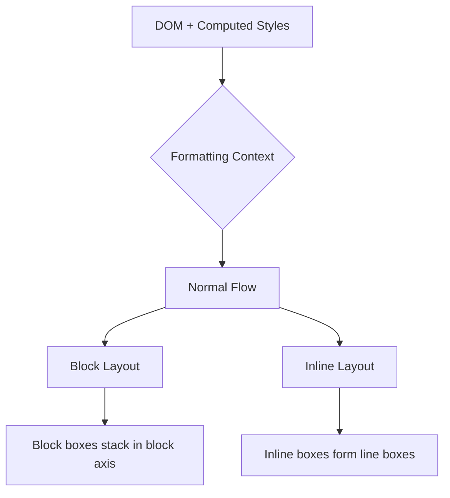
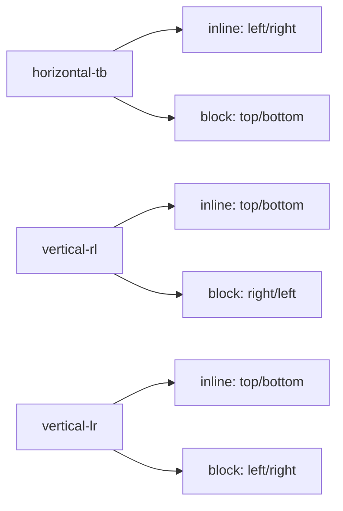
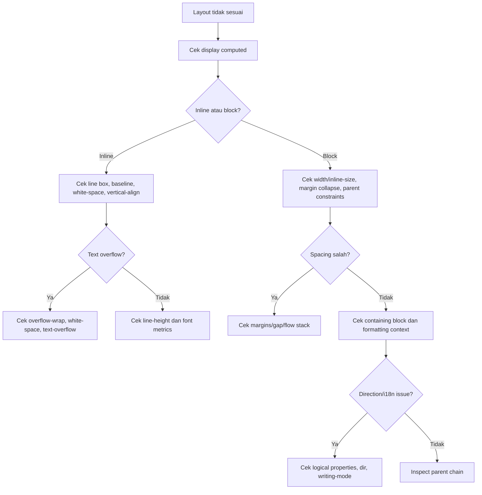

# Part 16 — Normal Flow, Inline Layout, Block Layout, and Writing Modes

## 1. Target Skill

Setelah bagian ini, kamu harus mampu menjelaskan layout default browser sebelum menyentuh Flexbox, Grid, atau positioning.

Target praktis:

1. Menjelaskan bagaimana block boxes tersusun dalam normal flow.
2. Menjelaskan bagaimana inline content membentuk line boxes.
3. Memahami kenapa `width`, `height`, `margin`, `padding`, dan `vertical-align` berperilaku berbeda pada inline elements.
4. Mengontrol text wrapping, whitespace, overflow text, dan baseline alignment.
5. Mendesain CSS yang direction-aware memakai logical properties.
6. Memahami `writing-mode`, `direction`, block axis, dan inline axis.
7. Menghindari layout yang hanya benar untuk bahasa kiri-ke-kanan horizontal.

Part ini penting karena Flexbox dan Grid tidak menghapus normal flow. Banyak component masih bergantung pada block/inline behavior, text layout, baseline, dan writing direction.

---

## 2. Normal Flow: Default Layout Contract Browser

Normal flow adalah cara browser melayout elemen ketika kamu belum mengeluarkannya dari flow dengan positioning, floating, flex, atau grid context tertentu.

Dalam normal flow:

- block-level boxes disusun satu demi satu di block axis,
- inline-level boxes disusun dalam line boxes di inline axis,
- text wrap berdasarkan available inline size,
- margin/padding/border memengaruhi flow sesuai tipe box,
- document tetap readable meskipun CSS minimal.



**Mental model:** normal flow adalah baseline. Layout modern seharusnya memperbaiki/menstrukturkan flow, bukan melawannya tanpa alasan.

---

## 3. Block Layout

Block-level elements dalam normal flow biasanya:

- mengambil available inline size parent,
- dimulai di baris baru,
- disusun berurutan sepanjang block axis,
- menghormati margin/padding/border,
- dapat memiliki width/height.

Contoh:

```html
<main>
  <h1>Case Review</h1>
  <p>Review submitted evidence and determine next action.</p>
  <section>...</section>
</main>
```

Secara default:

```txt
h1
p
section
```

Masing-masing block turun satu demi satu.

### 3.1 Block Size vs Inline Size

Dalam horizontal writing mode seperti English/Indonesian:

- inline axis = kiri ke kanan,
- block axis = atas ke bawah,
- `inline-size` mirip `width`,
- `block-size` mirip `height`.

Namun dalam vertical writing mode, mapping berubah.

Karena itu CSS modern sebaiknya mulai berpikir:

```css
.panel {
  inline-size: min(100%, 64rem);
  margin-inline: auto;
  padding-block: 1.5rem;
  padding-inline: 2rem;
}
```

bukan selalu:

```css
.panel {
  width: min(100%, 64rem);
  margin-left: auto;
  margin-right: auto;
  padding-top: 1.5rem;
  padding-bottom: 1.5rem;
  padding-left: 2rem;
  padding-right: 2rem;
}
```

Logical properties membuat intent lebih dekat ke flow dokumen.

---

## 4. Inline Layout

Inline layout mengatur text dan inline-level boxes.

Contoh:

```html
<p>
  Case <strong>#A-1024</strong> was escalated to
  <a href="/teams/enforcement">Enforcement Review</a>.
</p>
```

Elemen `strong` dan `a` tidak membuat baris baru secara default. Mereka ikut dalam line box.

### 4.1 Line Box

Browser membagi inline content ke dalam line boxes.

```txt
+------------------------------------------------+
| Case #A-1024 was escalated to Enforcement      |
+------------------------------------------------+
| Review.                                        |
+------------------------------------------------+
```

Jika teks panjang, browser wrap ke line box berikutnya.

### 4.2 Inline Element dan Width/Height

```css
a {
  width: 200px;
  height: 48px;
}
```

Pada inline element normal, `width` dan `height` tidak bekerja seperti block. Jika kamu butuh ukuran box, gunakan:

```css
a.button-link {
  display: inline-flex;
  align-items: center;
  justify-content: center;
  min-inline-size: 10rem;
  min-block-size: 2.75rem;
}
```

Jangan ubah semua link menjadi block hanya demi ukuran. Pilih display berdasarkan kontrak komponen.

---

## 5. Inline, Inline-Block, Inline-Flex

| Display | Berada dalam line? | Bisa width/height? | Children layout |
|---|---:|---:|---|
| `inline` | ya | terbatas | inline flow |
| `inline-block` | ya | ya | block formatting context internal |
| `inline-flex` | ya | ya | flex formatting context internal |
| `inline-grid` | ya | ya | grid formatting context internal |

### 5.1 Badge Pattern

```html
<span class="status-badge">Under Review</span>
```

```css
.status-badge {
  display: inline-flex;
  align-items: center;
  gap: 0.375rem;
  padding-block: 0.125rem;
  padding-inline: 0.5rem;
  border-radius: 999px;
  font-size: 0.875rem;
  line-height: 1.25;
  white-space: nowrap;
}
```

Kenapa `inline-flex`?

- badge tetap inline dalam kalimat/table cell,
- padding dan ukuran predictable,
- bisa align icon + text,
- tidak pecah sembarangan karena `white-space: nowrap`.

---

## 6. Baseline Alignment

Inline layout memakai baseline. Baseline adalah garis imajiner tempat teks “duduk”.

Masalah umum:

```html
<button>
  <svg aria-hidden="true">...</svg>
  Save
</button>
```

Icon terlihat turun/naik karena baseline alignment.

Solusi component-level:

```css
.button {
  display: inline-flex;
  align-items: center;
  gap: 0.5rem;
}

.button svg {
  inline-size: 1em;
  block-size: 1em;
  flex: none;
}
```

Jika masih inline biasa, property seperti `vertical-align` memengaruhi alignment terhadap baseline.

```css
.icon {
  vertical-align: -0.125em;
}
```

Namun untuk reusable component, `inline-flex` sering lebih predictable.

---

## 7. `line-height`: Bukan Sekadar Jarak Baris

`line-height` menentukan tinggi line box. Ini memengaruhi readability, vertical rhythm, dan alignment.

```css
body {
  line-height: 1.5;
}
```

Gunakan unitless value untuk inheritance yang lebih predictable:

```css
body {
  line-height: 1.5;
}
```

Hindari:

```css
body {
  line-height: 24px;
}
```

Jika child memiliki font size berbeda, line-height fixed dapat menghasilkan line box terlalu sempit atau terlalu longgar.

### 7.1 Practical Defaults

```css
:root {
  --line-height-body: 1.5;
  --line-height-heading: 1.15;
}

body {
  line-height: var(--line-height-body);
}

h1,
h2,
h3 {
  line-height: var(--line-height-heading);
}
```

Headings biasanya butuh line-height lebih rapat; body text butuh readability lebih longgar.

---

## 8. Whitespace Handling

HTML collapses whitespace secara default dalam normal text flow.

```html
<p>Hello      world</p>
```

Dirender seperti:

```txt
Hello world
```

CSS property `white-space` mengubah perilaku ini.

| Value | Collapse spaces? | Wrap lines? | Preserve newlines? | Use case |
|---|---:|---:|---:|---|
| `normal` | ya | ya | tidak | body text |
| `nowrap` | ya | tidak | tidak | badge, short label |
| `pre` | tidak | tidak | ya | code-like exact text |
| `pre-wrap` | tidak | ya | ya | logs/comments preserving line breaks |
| `pre-line` | ya | ya | ya | user text sederhana |
| `break-spaces` | tidak | ya | ya | precise whitespace rendering |

### 8.1 User-Generated Notes

Untuk catatan user:

```css
.note-body {
  white-space: pre-wrap;
  overflow-wrap: anywhere;
}
```

Ini menjaga line break dari user sekaligus mencegah long token merusak layout.

---

## 9. Text Wrapping and Overflow Text

Long text adalah layout adversary.

Contoh data enterprise:

- case id panjang,
- URL evidence,
- email address,
- legal entity name,
- generated reference number,
- unbroken token dari API.

### 9.1 `overflow-wrap`

```css
.prose {
  overflow-wrap: break-word;
}
```

atau lebih agresif:

```css
.cell {
  overflow-wrap: anywhere;
}
```

`anywhere` mengizinkan break hampir di mana saja untuk mencegah overflow.

### 9.2 `word-break`

```css
.token {
  word-break: break-all;
}
```

Hati-hati: `break-all` bisa membuat teks sulit dibaca. Untuk teks biasa, prefer `overflow-wrap`.

### 9.3 Single-Line Truncation

```css
.truncate {
  overflow: hidden;
  text-overflow: ellipsis;
  white-space: nowrap;
}
```

Invarian:

- harus ada constrained inline size,
- harus `overflow` bukan visible,
- harus nowrap untuk single-line ellipsis.

Untuk table cell:

```css
.case-title {
  max-inline-size: 24rem;
  overflow: hidden;
  text-overflow: ellipsis;
  white-space: nowrap;
}
```

Jangan truncate critical legal/regulatory text tanpa mekanisme reveal. Ellipsis dapat menyembunyikan informasi penting.

---

## 10. Block Flow Spacing

Dalam normal flow, elemen block punya default margin dari user-agent stylesheet.

Contoh default umum:

```css
p {
  margin-block-start: 1em;
  margin-block-end: 1em;
}
```

Browser default membuat dokumen readable tanpa CSS. Namun dalam design system, default margin global sering perlu dikendalikan.

### 10.1 Reset Minimal untuk Flow Content

```css
:where(h1, h2, h3, h4, p, figure, blockquote, dl, dd) {
  margin-block: 0;
}
```

Lalu spacing dikontrol oleh parent:

```css
.flow > * + * {
  margin-block-start: var(--flow-space, 1rem);
}
```

Pattern:

```html
<article class="flow">
  <h1>Policy Violation Summary</h1>
  <p>...</p>
  <h2>Evidence</h2>
  <p>...</p>
</article>
```

```css
.flow {
  --flow-space: 1rem;
}

.flow > * + * {
  margin-block-start: var(--flow-space);
}

.flow > :is(h2, h3) {
  --flow-space: 2rem;
}

.flow > :is(h2, h3) + * {
  --flow-space: 0.75rem;
}
```

Ini lebih sistematis daripada margin random di tiap component.

---

## 11. Replaced Elements in Flow

Replaced elements adalah elemen yang kontennya digantikan oleh resource eksternal atau objek khusus, misalnya:

- `img`,
- `video`,
- `iframe`,
- beberapa `input`,
- `textarea` dalam konteks tertentu.

Mereka punya intrinsic dimensions/aspect ratio.

### 11.1 Responsive Image Default

```css
img,
svg,
video,
canvas {
  max-inline-size: 100%;
  block-size: auto;
}
```

Makna:

- jangan melebihi parent,
- pertahankan aspect ratio.

### 11.2 Image Gap Mystery

`img` default-nya inline. Karena inline box align ke baseline, ada gap bawah seperti descender text.

```html
<div class="avatar-frame">
  
</div>
```

Solusi:

```css
.avatar-frame img {
  display: block;
}
```

atau gunakan layout parent yang sesuai.

---

## 12. Writing Modes

`writing-mode` menentukan apakah line text horizontal atau vertical, dan arah block progression.

Contoh:

```css
.vertical-label {
  writing-mode: vertical-rl;
}
```

Dalam default Latin horizontal:

```txt
inline axis: left -> right
block axis: top -> bottom
```

Dalam vertical writing mode, block dan inline axis berubah.



### 12.1 Why Software Engineers Should Care

Bahkan jika aplikasi utama bahasa Indonesia/English, kamu tetap perlu memahami writing modes karena:

- RTL language support seperti Arabic/Hebrew,
- embedded multilingual content,
- vertical labels/table headers,
- future localization cost,
- CSS logical properties lebih maintainable,
- browser layout model memakai block/inline axis secara internal.

---

## 13. `direction` and Bidirectional Text

`direction` menentukan inline base direction: `ltr` atau `rtl`.

```html
<html lang="ar" dir="rtl">
```

Untuk dokumen, lebih baik set `dir` di HTML daripada CSS:

```html
<html lang="id" dir="ltr">
```

Gunakan CSS `direction` untuk kasus lokal yang benar-benar butuh override.

### 13.1 Bidirectional Content

Contoh UI global:

```html
<p>Reference: <bdi>INV-2026-مرحبا-001</bdi></p>
```

`bdi` membantu mengisolasi directionality teks yang tidak diketahui. Untuk user-generated content multilingual, ini dapat mencegah urutan teks kacau.

---

## 14. Logical Properties

Logical properties mengganti physical properties seperti `left`, `right`, `top`, `bottom`, `width`, dan `height` dengan istilah flow-relative.

| Physical | Logical |
|---|---|
| `width` | `inline-size` |
| `height` | `block-size` |
| `min-width` | `min-inline-size` |
| `max-width` | `max-inline-size` |
| `margin-left` | `margin-inline-start` dalam LTR horizontal |
| `margin-right` | `margin-inline-end` dalam LTR horizontal |
| `padding-top` | `padding-block-start` dalam horizontal-tb |
| `border-left` | `border-inline-start` dalam LTR horizontal |
| `top/right/bottom/left` | `inset-block-start`, `inset-inline-end`, dll. |

### 14.1 Before/After

Physical:

```css
.card {
  width: min(100%, 64rem);
  margin-left: auto;
  margin-right: auto;
  padding-top: 1rem;
  padding-bottom: 1rem;
  padding-left: 1.5rem;
  padding-right: 1.5rem;
  border-left: 4px solid currentColor;
}
```

Logical:

```css
.card {
  inline-size: min(100%, 64rem);
  margin-inline: auto;
  padding-block: 1rem;
  padding-inline: 1.5rem;
  border-inline-start: 4px solid currentColor;
}
```

Logical version lebih expressif: “ukuran mengikuti inline axis, border di awal inline flow”.

---

## 15. Direction-Aware Component Example

Alert component:

```html
<div class="alert" role="status">
  <strong>Case escalated.</strong>
  <span>Supervisor review is required.</span>
</div>
```

```css
.alert {
  display: flex;
  gap: 0.75rem;
  padding-block: 1rem;
  padding-inline: 1rem;
  border-inline-start: 0.25rem solid currentColor;
  border-radius: 0.5rem;
}
```

Di LTR, border muncul kiri. Di RTL, border pindah ke kanan. Ini biasanya yang diinginkan: border menunjukkan “awal baca”, bukan “sisi kiri fisik”.

Jika desain benar-benar butuh sisi kiri fisik, gunakan `border-left`. Tapi itu harus keputusan sadar.

---

## 16. Physical vs Logical Decision Rule

Gunakan logical properties saat:

- spacing berkaitan dengan alur baca,
- layout harus siap RTL/i18n,
- component reusable,
- property mewakili start/end, before/after,
- kamu menulis design system.

Gunakan physical properties saat:

- posisi memang terikat viewport fisik,
- efek visual butuh sisi fisik tertentu,
- canvas/game/map coordinate,
- art direction spesifik,
- fixed brand composition.

Contoh physical yang valid:

```css
.map-pin-tooltip {
  left: 24px;
  top: 40px;
}
```

Karena koordinat map adalah sistem fisik, bukan flow text.

---

## 17. Normal Flow and Source Order

Normal flow mengikuti source order. Ini penting untuk accessibility.

Jangan memakai CSS untuk membuat urutan visual yang berbeda jauh dari urutan DOM tanpa alasan kuat.

Buruk:

```css
.sidebar {
  order: 2;
}

.main-content {
  order: 1;
}
```

Jika DOM:

```html
<aside class="sidebar">Filters</aside>
<main class="main-content">Cases</main>
```

Visual bisa main dulu, tapi keyboard/screen reader tetap source order: sidebar dulu. Ini bisa membingungkan.

**Rule:** source order harus merepresentasikan urutan pengalaman utama. CSS boleh menyesuaikan layout, bukan menipu navigasi.

---

## 18. Flow Layout for Content Pages

Untuk artikel, policy, help page, dan documentation, normal flow adalah layout utama.

```html
<article class="prose flow">
  <h1>Enforcement Policy</h1>
  <p>...</p>
  <h2>Scope</h2>
  <p>...</p>
  <ul>
    <li>...</li>
  </ul>
</article>
```

```css
.prose {
  max-inline-size: 72ch;
  margin-inline: auto;
  padding-inline: 1rem;
  line-height: 1.65;
}

.flow > * + * {
  margin-block-start: var(--flow-space, 1em);
}

.prose :is(h2, h3) {
  --flow-space: 2em;
  line-height: 1.2;
}

.prose :is(h2, h3) + * {
  --flow-space: 0.75em;
}
```

Kenapa `ch`?

- `72ch` kira-kira 72 karakter `0`, bukan sempurna tapi berguna untuk measure.
- Membatasi line length meningkatkan readability.

---

## 19. Flow Layout for Application Screens

Aplikasi internal sering punya shell layout. Namun isi detail page tetap dapat memakai normal flow.

```html
<main class="case-page">
  <header class="case-header flow">
    <p class="eyebrow">Case #A-1024</p>
    <h1>Unauthorized transaction review</h1>
    <p>Assigned to Enforcement Review Team.</p>
  </header>

  <section class="case-section flow" aria-labelledby="summary-title">
    <h2 id="summary-title">Summary</h2>
    <p>...</p>
  </section>
</main>
```

```css
.case-page {
  max-inline-size: 80rem;
  margin-inline: auto;
  padding-block: 2rem;
  padding-inline: 1rem;
}

.case-page > * + * {
  margin-block-start: 2rem;
}

.case-section {
  padding: 1.5rem;
  border: 1px solid var(--color-border);
  border-radius: 0.75rem;
}
```

Tidak semua layout perlu Grid/Flex. Banyak page detail lebih stabil jika memakai flow + small component layout.

---

## 20. Common Normal Flow Bugs

### 20.1 Inline Element Not Taking Width

Gejala:

```css
.link-card {
  width: 100%;
  padding: 1rem;
}
```

Tapi `<a>` tetap tidak memenuhi container.

Penyebab: `<a>` default inline.

Fix:

```css
.link-card {
  display: block;
  padding: 1rem;
}
```

atau jika isinya butuh alignment:

```css
.link-card {
  display: flex;
  align-items: center;
  gap: 1rem;
  padding: 1rem;
}
```

### 20.2 Long Word Breaks Layout

```css
.value {
  overflow-wrap: anywhere;
}
```

Untuk field values dari API, ini sering wajib.

### 20.3 Icon Misaligned With Text

Gunakan `inline-flex` dan `align-items: center`, atau pahami baseline jika tetap inline.

### 20.4 Vertical Centering With Line Height Hack

Buruk:

```css
.button {
  height: 40px;
  line-height: 40px;
}
```

Lebih baik:

```css
.button {
  display: inline-flex;
  align-items: center;
  min-block-size: 2.5rem;
  padding-inline: 1rem;
}
```

Line-height hack rapuh untuk multi-line, icon, dynamic font, dan localization.

---

## 21. Internationalization Failure Modes

| Failure | Penyebab | Solusi |
|---|---|---|
| RTL layout terlihat salah | pakai `left/right` untuk flow | gunakan logical properties |
| Arabic/Hebrew mixed text kacau | direction isolation tidak ada | gunakan `bdi`, `dir`, atau markup sesuai |
| Text terpotong setelah translation | fixed width/height | gunakan min/max, wrapping, flexible layout |
| Button label overflow | asumsi English pendek | allow wrapping atau flexible inline size |
| Vertical label rusak | physical dimensions hardcoded | gunakan writing-mode + logical sizing |
| Table header terlalu panjang | no wrapping strategy | define wrapping/truncation/reveal policy |

---

## 22. Writing Mode Test Harness

Saat membuat component reusable, uji dengan harness sederhana:

```html
<section class="test-harness" dir="ltr">
  <h2>LTR</h2>
  <div class="alert">Case escalated for review.</div>
</section>

<section class="test-harness" dir="rtl">
  <h2>RTL</h2>
  <div class="alert">تم تصعيد الحالة للمراجعة.</div>
</section>

<section class="test-harness vertical">
  <h2>Vertical</h2>
  <div class="alert">縦書きレイアウト</div>
</section>
```

```css
.vertical {
  writing-mode: vertical-rl;
}
```

Tidak semua component harus sempurna di vertical mode, tetapi test ini memaksa kamu melihat apakah CSS terlalu physical.

---

## 23. Debugging Algorithm: Normal Flow



---

## 24. Code Review Checklist

- Apakah source order sesuai urutan pengalaman pengguna?
- Apakah component text bisa wrap saat translation lebih panjang?
- Apakah long token dari API tidak merusak layout?
- Apakah link/button yang butuh ukuran sudah bukan inline biasa?
- Apakah icon-text alignment memakai layout yang predictable?
- Apakah line-height memakai unitless value untuk body text?
- Apakah flow content memakai spacing system, bukan margin acak?
- Apakah property `left/right/top/bottom/width/height` sebaiknya diganti logical property?
- Apakah RTL diuji minimal dengan `dir="rtl"`?
- Apakah truncation tidak menyembunyikan informasi kritikal?
- Apakah replaced elements punya `max-inline-size: 100%` dan dimension/aspect-ratio strategy?

---

## 25. Practice Set

### Exercise 1 — Inline vs Block Link Card

Buat link card:

```html
<a class="case-link" href="/cases/A-1024">
  <strong>Case A-1024</strong>
  <span>Unauthorized transaction review</span>
</a>
```

Tugas:

1. Coba tanpa `display`.
2. Ubah menjadi `display: block`.
3. Ubah menjadi `display: flex`.
4. Jelaskan perbedaan behavior di layout, clickable area, dan text wrapping.

### Exercise 2 — Long Token Defense

Buat field:

```html
<dl class="case-fields">
  <dt>Evidence URL</dt>
  <dd>https://example.com/evidence/very-long-token-without-breaks-...</dd>
</dl>
```

Tugas:

- buat agar tidak horizontal overflow,
- tetap readable,
- tidak langsung truncate tanpa reveal.

### Exercise 3 — Direction-Aware Alert

Buat alert component dengan border di start side.

Tugas:

1. Tampilkan dalam `dir="ltr"`.
2. Tampilkan dalam `dir="rtl"`.
3. Pastikan border berpindah mengikuti reading direction.
4. Jelaskan kapan ini diinginkan dan kapan tidak.

### Exercise 4 — Flow Content System

Buat artikel policy dengan heading, paragraph, list, blockquote.

Tugas:

- reset margin dasar,
- pakai `.flow > * + *`,
- buat spacing heading lebih besar sebelum heading dan lebih kecil setelah heading,
- batasi line length dengan `ch`.

### Exercise 5 — Baseline and Icon Button

Buat tiga button:

1. inline text + svg,
2. inline-block,
3. inline-flex.

Bandingkan alignment icon, height, clickable area, dan robust behavior saat font-size berubah.

---

## 26. Mental Compression

Ingat tujuh kalimat ini:

1. Normal flow adalah baseline layout browser.
2. Block boxes stack di block axis; inline boxes membentuk line boxes di inline axis.
3. Inline element bukan block kecil; width/height dan alignment punya aturan berbeda.
4. `line-height`, baseline, dan whitespace adalah bagian dari layout, bukan hanya typography.
5. Long text dari data nyata harus dianggap adversarial.
6. Logical properties membuat CSS mengikuti alur baca, bukan koordinat fisik.
7. Source order tetap penting walau CSS bisa mengubah tampilan visual.

---

## 27. Referensi

- MDN — Block and Inline Layout in Normal Flow: https://developer.mozilla.org/en-US/docs/Web/CSS/Guides/Display/Block_and_inline_layout
- MDN — Introduction to Formatting Contexts: https://developer.mozilla.org/en-US/docs/Web/CSS/Guides/Display/Formatting_contexts
- MDN — Introduction to Writing Mode Systems: https://developer.mozilla.org/en-US/docs/Web/CSS/Guides/Writing_modes/Writing_mode_systems
- MDN — writing-mode: https://developer.mozilla.org/en-US/docs/Web/CSS/Reference/Properties/writing-mode
- MDN — CSS Logical Properties and Values: https://developer.mozilla.org/en-US/docs/Web/CSS/Guides/Logical_properties_and_values
- MDN — Basic Concepts of Logical Properties and Values: https://developer.mozilla.org/en-US/docs/Web/CSS/Guides/Logical_properties_and_values/Basic_concepts
- MDN — Logical Properties for Sizing: https://developer.mozilla.org/en-US/docs/Web/CSS/Guides/Logical_properties_and_values/Sizing
- W3C/CSSWG — CSS Display Module Level 3: https://www.w3.org/TR/css-display-3/
