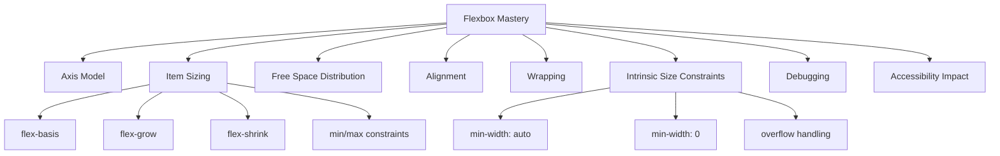
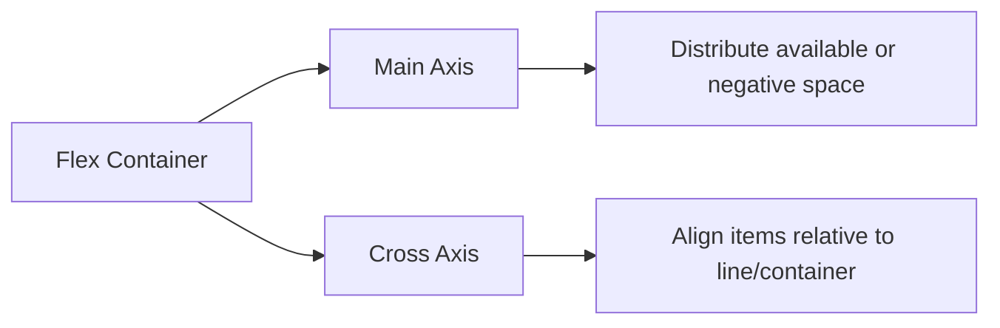
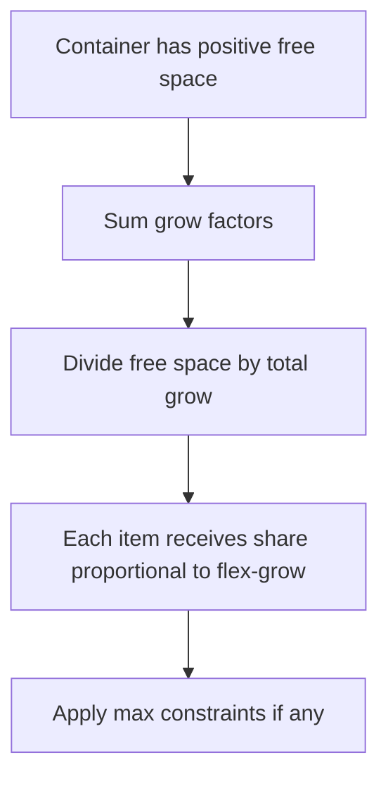
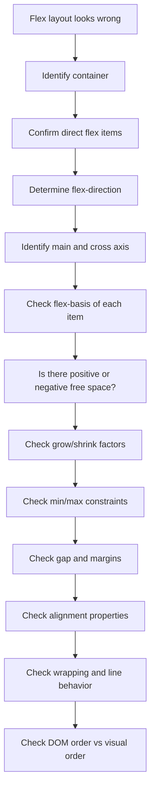

# Part 17 — Flexbox Deep Dive: One-Dimensional Layout Without Guesswork

## Tujuan Bagian Ini

Flexbox sering terlihat sederhana: tambahkan `display: flex`, lalu atur `justify-content` dan `align-items`. Di level produksi, pendekatan itu cepat berubah menjadi trial and error: item tidak mau mengecil, teks overflow, tombol terdorong keluar, layout berubah saat konten panjang, atau urutan visual tidak cocok dengan urutan keyboard.

Bagian ini membangun Flexbox sebagai **model distribusi ruang satu dimensi**. Tujuannya bukan menghafal semua properti, tetapi mampu memprediksi hasil layout sebelum membuka browser.

Setelah menyelesaikan bagian ini, kamu harus mampu:

1. menjelaskan perbedaan main axis dan cross axis,
2. memutuskan kapan memakai Flexbox dan kapan tidak,
3. memahami interaksi `flex-basis`, `flex-grow`, dan `flex-shrink`,
4. memperbaiki bug klasik seperti item tidak bisa mengecil tanpa menebak-nebak,
5. membangun pola komponen umum seperti toolbar, media object, card, split layout, dan action row,
6. men-debug Flexbox dengan proses yang repeatable.

---

## Posisi Dalam Framework Kaufman

Dalam framework *The First 20 Hours*, Flexbox adalah sub-skill yang harus didekonstruksi, bukan dipelajari sebagai daftar properti.

Untuk Flexbox, skill utamanya adalah:

> Mampu menyusun sekelompok item dalam satu arah, mendistribusikan ruang sisa atau ruang negatif, dan mengontrol alignment tanpa merusak semantik HTML.

Decomposition-nya:



Prinsip belajar bagian ini:

- Jangan mulai dari “cara center div”. Mulai dari **axis**.
- Jangan menebak nilai `flex`. Baca sebagai `grow shrink basis`.
- Jangan menyelesaikan semua layout dengan Flexbox. Flexbox bukan Grid.
- Jangan mengubah urutan visual bila urutan DOM punya makna.
- Debug dengan melihat ukuran dasar, ruang sisa, shrink/grow, lalu min/max constraint.

---

## 1. Mental Model Utama: Flexbox Adalah Distribusi Ruang Dalam Satu Dimensi

Flexbox adalah layout model untuk mengatur item dalam satu dimensi: horizontal **atau** vertikal.

Satu dimensi bukan berarti layout-nya hanya bisa satu baris. Flexbox bisa wrap ke beberapa baris, tetapi algoritma sizing utamanya tetap bekerja **per flex line**.



Perbedaan penting:

| Konsep | Arti |
|---|---|
| Main axis | Arah utama item disusun |
| Cross axis | Arah tegak lurus dari main axis |
| Main size | Ukuran item di main axis |
| Cross size | Ukuran item di cross axis |
| Flex container | Elemen dengan `display: flex` atau `inline-flex` |
| Flex item | Anak langsung dari flex container |
| Flex line | Satu baris/kolom item setelah wrapping |

Contoh:

```css
.toolbar {
  display: flex;
  flex-direction: row;
}
```

Pada contoh di atas:

- main axis: kiri ke kanan, bergantung pada writing direction,
- cross axis: atas ke bawah,
- setiap anak langsung `.toolbar` adalah flex item.

Jika diubah:

```css
.sidebar-layout {
  display: flex;
  flex-direction: column;
}
```

Maka:

- main axis: atas ke bawah,
- cross axis: horizontal.

Kesalahan umum: menganggap `justify-content` selalu horizontal dan `align-items` selalu vertikal. Itu salah. Keduanya mengikuti axis, bukan layar.

---

## 2. Kapan Memakai Flexbox

Gunakan Flexbox ketika problem layout dapat dirumuskan seperti ini:

> “Saya punya beberapa item dalam satu arah, dan saya perlu mengontrol jarak, alignment, atau distribusi ruang di antara item tersebut.”

Contoh yang cocok:

- navbar horizontal,
- action toolbar,
- button group,
- card footer dengan tombol kanan,
- media object: avatar + content,
- layout label + value,
- form row kecil,
- tabs list,
- chip list yang wrap,
- center content dalam container,
- split layout sederhana.

Gunakan Grid ketika problem layout dapat dirumuskan seperti ini:

> “Saya punya baris dan kolom yang harus saling berhubungan.”

Contoh yang lebih cocok untuk Grid:

- dashboard dua dimensi,
- form dengan kolom label/input yang align lintas row,
- card grid,
- page shell kompleks,
- matrix layout,
- report layout,
- layout yang membutuhkan area bernama.

Rule of thumb:

| Problem | Layout model yang biasanya cocok |
|---|---|
| Item dalam satu baris/kolom | Flexbox |
| Baris dan kolom eksplisit | Grid |
| Konten dokumen natural | Normal flow |
| Overlay atau floating layer | Positioning/top layer |

---

## 3. Flex Container dan Flex Item

Flexbox aktif pada container:

```css
.actions {
  display: flex;
}
```

HTML:

```html
<div class="actions">
  <button>Save</button>
  <button>Submit</button>
  <button>Cancel</button>
</div>
```

Hanya anak langsung `.actions` yang menjadi flex item. Cucu tidak otomatis ikut.

```html
<div class="actions">
  <div class="group">
    <button>Save</button>
    <button>Submit</button>
  </div>
  <button>Cancel</button>
</div>
```

Pada contoh ini, flex items adalah:

- `.group`,
- button `Cancel`.

Button di dalam `.group` bukan flex item dari `.actions`.

Jika `.group` juga perlu layout Flexbox, deklarasikan sendiri:

```css
.actions,
.actions .group {
  display: flex;
  gap: 0.5rem;
}
```

---

## 4. `display: flex` vs `display: inline-flex`

```css
.block-flex {
  display: flex;
}

.inline-flex {
  display: inline-flex;
}
```

Perbedaan utamanya bukan perilaku anaknya, tetapi perilaku container terhadap parent-nya.

| Nilai | Container berperilaku sebagai |
|---|---|
| `flex` | block-level flex container |
| `inline-flex` | inline-level flex container |

Gunakan `inline-flex` untuk komponen kecil yang harus mengikuti aliran teks atau inline layout:

```css
.badge {
  display: inline-flex;
  align-items: center;
  gap: 0.25rem;
  border-radius: 999px;
  padding-inline: 0.5rem;
}
```

Contoh penggunaan:

```html
<p>
  Status kasus: <span class="badge">Open</span>
</p>
```

Badge tetap berada dalam aliran teks, tetapi isi badge bisa diatur dengan Flexbox.

---

## 5. Axis: `flex-direction`

Properti `flex-direction` menentukan main axis.

```css
.container {
  display: flex;
  flex-direction: row;
}
```

Nilai umum:

| Nilai | Main axis |
|---|---|
| `row` | inline direction |
| `row-reverse` | kebalikan inline direction |
| `column` | block direction |
| `column-reverse` | kebalikan block direction |

Jangan menganggap `row` selalu kiri ke kanan. Dalam dokumen `dir="rtl"`, arah inline bisa kanan ke kiri.

Contoh:

```html
<html lang="ar" dir="rtl">
```

Untuk layout internasional, gunakan logical thinking:

- inline axis mengikuti bahasa/direction,
- block axis mengikuti writing mode,
- hindari terlalu cepat memakai `left` dan `right` untuk konsep visual yang seharusnya logical.

---

## 6. Wrapping: `flex-wrap`

Default Flexbox adalah tidak wrap.

```css
.chips {
  display: flex;
  flex-wrap: nowrap;
}
```

Jika item terlalu banyak, mereka akan mencoba mengecil. Jika tidak bisa mengecil karena intrinsic size atau min-size, mereka overflow.

Untuk chip list:

```css
.chips {
  display: flex;
  flex-wrap: wrap;
  gap: 0.5rem;
}
```

HTML:

```html
<ul class="chips" aria-label="Active filters">
  <li><button>Priority: High</button></li>
  <li><button>Status: Open</button></li>
  <li><button>Owner: Me</button></li>
</ul>
```

Catatan semantik: gunakan list bila kumpulan item memang list. Flexbox tidak mengubah makna HTML.

---

## 7. Gap: Jarak Antar Item Tanpa Margin Hack

Gunakan `gap` untuk jarak antar flex item.

```css
.actions {
  display: flex;
  gap: 0.75rem;
}
```

Dibanding margin:

```css
.actions > * + * {
  margin-left: 0.75rem;
}
```

`gap` lebih sederhana karena:

- tidak menambah jarak di sisi luar container,
- bekerja dengan wrapping,
- direction-aware dalam konteks layout,
- lebih mudah dibaca sebagai properti container.

Gunakan margin ketika jarak adalah tanggung jawab item dalam relasi tertentu, bukan jarak seragam antar semua item.

---

## 8. Properti Item: `flex` Shorthand

Properti paling penting di Flexbox adalah `flex`.

```css
.item {
  flex: 1 1 auto;
}
```

Artinya:

```css
.item {
  flex-grow: 1;
  flex-shrink: 1;
  flex-basis: auto;
}
```

Urutan shorthand:

```txt
flex: <flex-grow> <flex-shrink> <flex-basis>
```

Namun beberapa nilai shorthand punya ekspansi khusus.

| Deklarasi | Makna praktis |
|---|---|
| `flex: initial` | `0 1 auto` |
| `flex: auto` | `1 1 auto` |
| `flex: none` | `0 0 auto` |
| `flex: 1` | biasanya `1 1 0%` |

Perbedaan penting:

```css
.item-a {
  flex: auto; /* basis dari ukuran konten/width */
}

.item-b {
  flex: 1; /* basis efektif 0, ruang dibagi lebih merata */
}
```

`flex: 1` sering dipakai untuk equal columns, tetapi ia bukan “buat item otomatis bagus”. Ia mengubah basis menjadi nol sehingga pembagian ruang lebih equal.

---

## 9. `flex-basis`: Ukuran Awal di Main Axis

`flex-basis` adalah ukuran awal item sebelum ruang sisa atau ruang negatif didistribusikan.

```css
.sidebar {
  flex: 0 0 16rem;
}

.content {
  flex: 1 1 auto;
}
```

Pada `flex-direction: row`, `flex-basis` mirip width awal. Pada `flex-direction: column`, `flex-basis` mirip height awal.

Contoh:

```css
.layout {
  display: flex;
}

.layout__sidebar {
  flex: 0 0 18rem;
}

.layout__main {
  flex: 1 1 auto;
  min-width: 0;
}
```

Interpretasi:

- sidebar tidak grow,
- sidebar tidak shrink,
- basis sidebar 18rem,
- main boleh grow,
- main boleh shrink,
- main perlu `min-width: 0` agar konten panjang tidak memaksa overflow.

---

## 10. `flex-grow`: Distribusi Ruang Positif

Jika total ukuran basis item lebih kecil daripada ukuran container, ada positive free space.

```css
.container {
  display: flex;
}

.a {
  flex: 1 1 0;
}

.b {
  flex: 2 1 0;
}
```

Jika ada 300px ruang positif:

- total grow factor = 1 + 2 = 3,
- `.a` mendapat 100px,
- `.b` mendapat 200px.

Diagram:



Contoh praktis:

```css
.split-actions {
  display: flex;
  gap: 0.75rem;
}

.split-actions__spacer {
  flex: 1;
}
```

HTML:

```html
<div class="split-actions">
  <button>Back</button>
  <span class="split-actions__spacer" aria-hidden="true"></span>
  <button>Save Draft</button>
  <button>Submit</button>
</div>
```

Lebih baik daripada `margin-left: auto`? Tidak selalu. Untuk kasus mendorong grup ke kanan, `margin-inline-start: auto` sering lebih eksplisit.

```css
.actions {
  display: flex;
  gap: 0.75rem;
}

.actions__danger {
  margin-inline-start: auto;
}
```

---

## 11. `flex-shrink`: Distribusi Ruang Negatif

Jika total ukuran basis item lebih besar daripada container, ada negative free space. Item harus mengecil bila `flex-shrink > 0`.

```css
.item {
  flex-shrink: 1;
}
```

Namun shrink tidak semata-mata berdasarkan angka `flex-shrink`. Distribusinya dipengaruhi oleh basis item.

Secara mental:

```txt
shrink pressure ≈ flex-shrink × flex-basis
```

Item besar menyerap lebih banyak shrink daripada item kecil jika faktor shrink sama.

Contoh:

```css
.a {
  flex: 0 1 400px;
}

.b {
  flex: 0 1 100px;
}
```

Jika container kekurangan ruang, `.a` akan mengecil lebih banyak daripada `.b`.

Kesalahan umum:

```css
.title {
  flex: 1;
}
```

Tetapi judul panjang tetap overflow. Penyebabnya sering bukan `flex-shrink`, melainkan min-size default.

Solusi umum:

```css
.title {
  flex: 1 1 auto;
  min-width: 0;
  overflow: hidden;
  text-overflow: ellipsis;
  white-space: nowrap;
}
```

---

## 12. Masalah Klasik: `min-width: auto`

Secara default, flex item punya min-size otomatis. Dalam banyak kasus, item tidak mau mengecil lebih kecil daripada ukuran kontennya.

Contoh bug:

```html
<div class="row">
  <div class="content">
    A very very very very very long case title that should truncate
  </div>
  <button>Open</button>
</div>
```

```css
.row {
  display: flex;
  gap: 0.75rem;
}

.content {
  flex: 1;
  white-space: nowrap;
  overflow: hidden;
  text-overflow: ellipsis;
}
```

Sering masih rusak karena `.content` tidak boleh mengecil melewati min-content width.

Tambahkan:

```css
.content {
  min-width: 0;
}
```

Versi lengkap:

```css
.case-row {
  display: flex;
  align-items: center;
  gap: 0.75rem;
}

.case-row__title {
  flex: 1 1 auto;
  min-width: 0;
  overflow: hidden;
  text-overflow: ellipsis;
  white-space: nowrap;
}

.case-row__action {
  flex: none;
}
```

Rule praktis:

> Jika flex item berisi teks panjang, tabel, input, code block, atau elemen yang bisa overflow, cek apakah item yang harus shrink sudah punya `min-width: 0`.

Untuk `flex-direction: column`, analoginya sering `min-height: 0`.

```css
.app-shell {
  min-height: 100vh;
  display: flex;
  flex-direction: column;
}

.app-shell__body {
  flex: 1 1 auto;
  min-height: 0;
  overflow: auto;
}
```

Tanpa `min-height: 0`, area scroll internal sering tidak bekerja seperti yang diharapkan.

---

## 13. Alignment: `justify-content`, `align-items`, `align-self`, `align-content`

Alignment Flexbox terbagi berdasarkan axis.

| Properti | Bekerja pada | Catatan |
|---|---|---|
| `justify-content` | main axis | distribusi item/space dalam line |
| `align-items` | cross axis | alignment semua item dalam line |
| `align-self` | cross axis | override per item |
| `align-content` | cross axis | alignment antar flex lines saat wrap |

Contoh center sederhana:

```css
.center {
  display: flex;
  justify-content: center;
  align-items: center;
}
```

Ini center di main dan cross axis. Bila `flex-direction: column`, makna horizontal/vertikal berubah.

### `justify-content`

```css
.toolbar {
  display: flex;
  justify-content: space-between;
}
```

Nilai umum:

- `flex-start`,
- `flex-end`,
- `center`,
- `space-between`,
- `space-around`,
- `space-evenly`.

Untuk toolbar enterprise, `space-between` sering membuat jarak terlalu elastis. Lebih stabil memakai group + margin auto.

```html
<div class="toolbar">
  <div class="toolbar__group">
    <button>Filter</button>
    <button>Export</button>
  </div>
  <div class="toolbar__group toolbar__group--end">
    <button>New Case</button>
  </div>
</div>
```

```css
.toolbar {
  display: flex;
  align-items: center;
  gap: 1rem;
}

.toolbar__group {
  display: flex;
  align-items: center;
  gap: 0.5rem;
}

.toolbar__group--end {
  margin-inline-start: auto;
}
```

### `align-items`

```css
.media {
  display: flex;
  align-items: flex-start;
  gap: 1rem;
}
```

Nilai umum:

- `stretch`, default,
- `flex-start`,
- `flex-end`,
- `center`,
- `baseline`.

`baseline` berguna untuk align teks dari elemen berbeda.

```css
.price-row {
  display: flex;
  align-items: baseline;
  gap: 0.5rem;
}
```

---

## 14. `margin: auto` Dalam Flexbox

Auto margin menyerap ruang kosong di axis terkait.

```css
.nav {
  display: flex;
  gap: 1rem;
}

.nav__account {
  margin-inline-start: auto;
}
```

HTML:

```html
<nav class="nav" aria-label="Primary">
  <a href="/cases">Cases</a>
  <a href="/reports">Reports</a>
  <a class="nav__account" href="/account">Account</a>
</nav>
```

`Account` terdorong ke sisi inline-end tanpa perlu spacer element.

Gunakan auto margin ketika satu item/grup harus didorong sejauh mungkin dari item lain.

---

## 15. `order`: Visual Order Bukan DOM Order

Flexbox punya properti `order`:

```css
.secondary {
  order: -1;
}
```

Ini mengubah urutan visual, bukan urutan DOM, keyboard, atau screen reader dalam banyak konteks.

Risiko:

- urutan tab membingungkan,
- screen reader membaca urutan berbeda dari visual,
- focus berpindah tidak natural,
- maintenance sulit karena source order tidak mencerminkan UI.

Gunakan `order` untuk perubahan dekoratif yang tidak mengubah makna atau alur interaksi. Jangan pakai untuk memperbaiki HTML yang urutannya salah.

Lebih baik:

```html
<header class="case-header">
  <div class="case-header__identity">...</div>
  <div class="case-header__actions">...</div>
</header>
```

Lalu layout dengan CSS tanpa membalik makna.

---

## 16. Pattern 1: Media Object

Media object adalah pola klasik: avatar/icon di kiri, content fleksibel di kanan.

```html
<article class="comment">
  
  <div class="comment__body">
    <h3 class="comment__author">Ayu Pratama</h3>
    <p class="comment__text">Reviewed the enforcement evidence package.</p>
  </div>
</article>
```

```css
.comment {
  display: flex;
  align-items: flex-start;
  gap: 1rem;
}

.comment__avatar {
  flex: none;
  border-radius: 999px;
}

.comment__body {
  flex: 1 1 auto;
  min-width: 0;
}

.comment__author {
  margin: 0;
}

.comment__text {
  margin-block: 0.25rem 0;
}
```

Kenapa `min-width: 0` di body? Karena content kanan harus boleh mengecil bila parent sempit.

---

## 17. Pattern 2: Toolbar Dengan Group dan Overflow Strategy

```html
<div class="case-toolbar" role="toolbar" aria-label="Case actions">
  <div class="case-toolbar__group">
    <button>Assign</button>
    <button>Escalate</button>
    <button>Request Evidence</button>
  </div>
  <div class="case-toolbar__group case-toolbar__group--end">
    <button>Save</button>
    <button>Submit</button>
  </div>
</div>
```

```css
.case-toolbar {
  display: flex;
  align-items: center;
  gap: 1rem;
  overflow-x: auto;
}

.case-toolbar__group {
  display: flex;
  align-items: center;
  gap: 0.5rem;
  flex: none;
}

.case-toolbar__group--end {
  margin-inline-start: auto;
}
```

Catatan:

- `role="toolbar"` tidak selalu wajib. Jika menambahkan role ARIA, kamu harus memahami keyboard contract-nya.
- Untuk toolbar biasa, sering cukup pakai container + button native.
- Overflow horizontal bisa lebih baik daripada membuat tombol mengecil sampai tidak usable.

---

## 18. Pattern 3: Card Footer dengan Action Kanan

```html
<article class="case-card">
  <h2>Case #A-1029</h2>
  <p>Pending supervisor review.</p>
  <footer class="case-card__footer">
    <span class="case-card__meta">Updated 2 hours ago</span>
    <a href="/cases/A-1029">Open</a>
  </footer>
</article>
```

```css
.case-card {
  display: flex;
  flex-direction: column;
  gap: 1rem;
}

.case-card__footer {
  display: flex;
  align-items: center;
  gap: 0.75rem;
  margin-block-start: auto;
}

.case-card__footer a {
  margin-inline-start: auto;
}
```

Jika card berada dalam grid dan tinggi antar card berbeda, `margin-block-start: auto` mendorong footer ke bawah selama card punya layout column.

---

## 19. Pattern 4: Equal Columns

```css
.summary-row {
  display: flex;
  gap: 1rem;
}

.summary-row > * {
  flex: 1 1 0;
  min-width: 0;
}
```

`flex: 1 1 0` membuat basis setiap item nol, sehingga ruang container dibagi berdasarkan grow factor, bukan ukuran konten awal.

Untuk card yang harus wrap, tambahkan:

```css
.summary-row {
  display: flex;
  flex-wrap: wrap;
  gap: 1rem;
}

.summary-card {
  flex: 1 1 16rem;
}
```

Artinya:

- card boleh grow,
- card boleh shrink,
- ukuran basis 16rem,
- jika tidak cukup ruang, item wrap.

Namun jika layout utamanya adalah grid card responsif, CSS Grid sering lebih jelas:

```css
.cards {
  display: grid;
  grid-template-columns: repeat(auto-fit, minmax(16rem, 1fr));
  gap: 1rem;
}
```

---

## 20. Pattern 5: Form Row Kecil

```html
<div class="field-row">
  <label for="case-owner">Owner</label>
  <select id="case-owner" name="owner">
    <option>Ayu</option>
    <option>Bima</option>
  </select>
</div>
```

```css
.field-row {
  display: flex;
  align-items: center;
  gap: 0.75rem;
}

.field-row label {
  flex: 0 0 8rem;
}

.field-row select {
  flex: 1 1 auto;
  min-width: 0;
}
```

Untuk form kompleks lintas banyak row, Grid biasanya lebih baik karena label/input perlu align lintas baris.

---

## 21. Pattern 6: App Shell Column dengan Scroll Area

Bug umum di aplikasi internal: header fixed, footer fixed, body scroll tidak benar.

```html
<div class="app-shell">
  <header class="app-shell__header">...</header>
  <main class="app-shell__main">...</main>
</div>
```

```css
.app-shell {
  min-height: 100dvh;
  display: flex;
  flex-direction: column;
}

.app-shell__header {
  flex: none;
}

.app-shell__main {
  flex: 1 1 auto;
  min-height: 0;
  overflow: auto;
}
```

`min-height: 0` penting karena main harus boleh lebih kecil dari kontennya agar `overflow: auto` bekerja di area tersebut.

---

## 22. Flexbox dan Accessibility

Flexbox tidak mengubah semantik HTML. Namun ia bisa menciptakan mismatch antara tampilan visual dan urutan interaksi.

Hal yang harus dijaga:

1. DOM order harus tetap masuk akal bila CSS mati.
2. Urutan visual idealnya sama dengan urutan keyboard.
3. Jangan pakai `order` untuk memindahkan CTA utama sebelum konten bila DOM tetap berbeda.
4. Jangan pakai div clickable karena lebih mudah di-layout. Gunakan `<button>` atau `<a>` sesuai makna.
5. Saat membuat toolbar, pastikan focus state terlihat.
6. Saat item wrap, pastikan urutan pembacaan tetap logis.

Contoh buruk:

```html
<div class="card">
  <button class="primary">Approve</button>
  <h2>Case #A-1029</h2>
  <p>Evidence review required.</p>
</div>
```

Lalu CSS memindahkan button ke bawah. DOM order-nya tetap action sebelum konteks. Ini buruk untuk pembacaan linear.

Lebih baik:

```html
<article class="card">
  <h2>Case #A-1029</h2>
  <p>Evidence review required.</p>
  <footer class="card__actions">
    <button>Approve</button>
  </footer>
</article>
```

---

## 23. Flexbox Failure Modes

| Gejala | Penyebab umum | Solusi |
|---|---|---|
| Teks panjang overflow | min-size auto | `min-width: 0` pada item yang harus shrink |
| Scroll area tidak bekerja | flex column + min-height auto | `min-height: 0` pada child scrollable |
| Tombol mengecil terlalu kecil | item boleh shrink | `flex: none` pada action penting |
| Jarak antar item aneh saat wrap | margin manual | pakai `gap` |
| Layout dua dimensi sulit | Flexbox dipakai untuk problem Grid | gunakan CSS Grid |
| Urutan keyboard tidak cocok visual | `order` | ubah DOM order atau hindari reorder |
| Item tidak equal width | basis masih `auto` | pakai `flex: 1 1 0` |
| Height card tidak sejajar | parent bukan layout yang sesuai | pertimbangkan Grid atau flex column pada card |

---

## 24. Debugging Algorithm

Gunakan urutan berikut saat layout Flexbox rusak.



Praktik di DevTools:

1. pilih flex container,
2. aktifkan Flexbox overlay,
3. lihat arah main axis,
4. inspect computed style item,
5. cek `flex-basis`, `flex-grow`, `flex-shrink`, `min-width`, `min-height`, `overflow`,
6. matikan properti satu per satu untuk menemukan constraint yang dominan.

---

## 25. Decision Matrix

| Kebutuhan | Rekomendasi |
|---|---|
| Item sejajar horizontal | Flexbox |
| Item sejajar vertikal | Flexbox column |
| Card grid responsif | Grid |
| Form label/input lintas banyak row | Grid |
| Tombol kanan dalam footer | Flexbox + `margin-inline-start: auto` |
| Teks panjang harus truncate | Flex item + `min-width: 0` |
| Sidebar fixed + content fluid | Flexbox atau Grid; Grid lebih eksplisit untuk page shell |
| Toolbar wrap | Flexbox + `flex-wrap` + `gap` |
| Layout area bernama | Grid |

---

## 26. Code Review Checklist

Gunakan checklist ini saat review Flexbox:

- Apakah elemen dengan `display: flex` memang container yang benar?
- Apakah item yang diatur adalah anak langsung container?
- Apakah problem-nya benar-benar satu dimensi?
- Apakah `flex` shorthand dipakai dengan pemahaman `grow shrink basis`?
- Apakah item yang harus mengecil memiliki `min-width: 0` atau `min-height: 0` bila diperlukan?
- Apakah action penting diberi `flex: none` agar tidak mengecil berlebihan?
- Apakah jarak antar item memakai `gap` bila jaraknya seragam?
- Apakah `order` tidak merusak urutan DOM, keyboard, atau screen reader?
- Apakah wrapping menghasilkan urutan visual yang masih logis?
- Apakah layout tetap baik saat konten panjang, bahasa berbeda, dan viewport sempit?

---

## 27. Latihan Deliberate Practice

### Latihan 1 — Toolbar Robust

Buat toolbar dengan:

- grup filter kiri,
- grup action kanan,
- jarak konsisten,
- overflow aman di layar kecil,
- focus state visible.

Constraint:

- jangan pakai absolute positioning,
- jangan pakai fixed width kecuali untuk kebutuhan eksplisit,
- jangan pakai `order`.

### Latihan 2 — Case Row Truncation

Buat row berisi:

- status badge,
- judul kasus panjang,
- owner,
- action button.

Target:

- judul truncate dengan ellipsis,
- button tidak mengecil,
- layout tidak overflow.

Pastikan kamu memakai `min-width: 0` di tempat yang tepat.

### Latihan 3 — Scrollable App Shell

Buat app shell:

- header tetap di atas dalam flow,
- main area scrollable,
- footer opsional,
- tinggi viewport memakai `100dvh`,
- tidak ada double scroll yang tidak perlu.

### Latihan 4 — Flex vs Grid Refactor

Ambil layout card grid yang sebelumnya dibuat dengan Flexbox. Refactor ke CSS Grid. Tulis alasan:

- bagian mana yang lebih mudah dengan Flexbox,
- bagian mana yang lebih tepat dengan Grid,
- bug apa yang hilang setelah refactor.

---

## 28. Mini Assessment

Jawab tanpa membuka dokumentasi:

1. Apa perbedaan `flex: auto` dan `flex: 1`?
2. Kenapa `min-width: 0` sering diperlukan pada flex item?
3. Kenapa `justify-content` tidak selalu berarti horizontal alignment?
4. Apa risiko accessibility dari `order`?
5. Kapan `margin-inline-start: auto` lebih baik daripada spacer element?
6. Kapan Flexbox bukan pilihan tepat?
7. Apa perbedaan `align-items` dan `align-content`?
8. Kenapa `flex-shrink` tidak hanya bergantung pada angka shrink factor?

Jika bisa menjawab dan mempraktikkan semua, kamu sudah melewati level “pakai Flexbox dari snippet” menuju level engineering.

---

## 29. Ringkasan Mental Model

Flexbox dapat dipahami dengan lima pertanyaan:

1. Siapa container-nya?
2. Siapa direct item-nya?
3. Apa main axis-nya?
4. Berapa ukuran basis item?
5. Apakah container punya ruang positif atau ruang negatif?

Setelah itu:

- `flex-grow` membagi ruang positif,
- `flex-shrink` menyerap ruang negatif,
- `flex-basis` menentukan ukuran awal,
- `min-width/min-height` dapat membatasi shrink,
- `justify-content` bekerja di main axis,
- `align-items` bekerja di cross axis,
- `gap` mengatur jarak antar item,
- `order` harus dipakai sangat hati-hati.

Flexbox bukan trik centering. Flexbox adalah algoritma layout untuk distribusi ruang satu dimensi.

---

## Referensi

- CSS Flexible Box Layout Module Level 1 — W3C/CSSWG: https://www.w3.org/TR/css-flexbox-1/
- MDN — CSS flexible box layout: https://developer.mozilla.org/en-US/docs/Web/CSS/CSS_flexible_box_layout
- MDN — flex-basis: https://developer.mozilla.org/en-US/docs/Web/CSS/flex-basis
- MDN — flex-grow: https://developer.mozilla.org/en-US/docs/Web/CSS/flex-grow
- MDN — flex-shrink: https://developer.mozilla.org/en-US/docs/Web/CSS/flex-shrink
- MDN — Box alignment in flexbox: https://developer.mozilla.org/en-US/docs/Web/CSS/CSS_box_alignment/Box_alignment_in_flexbox
