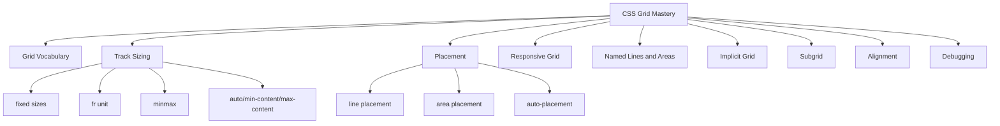
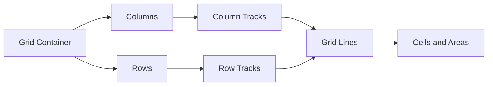
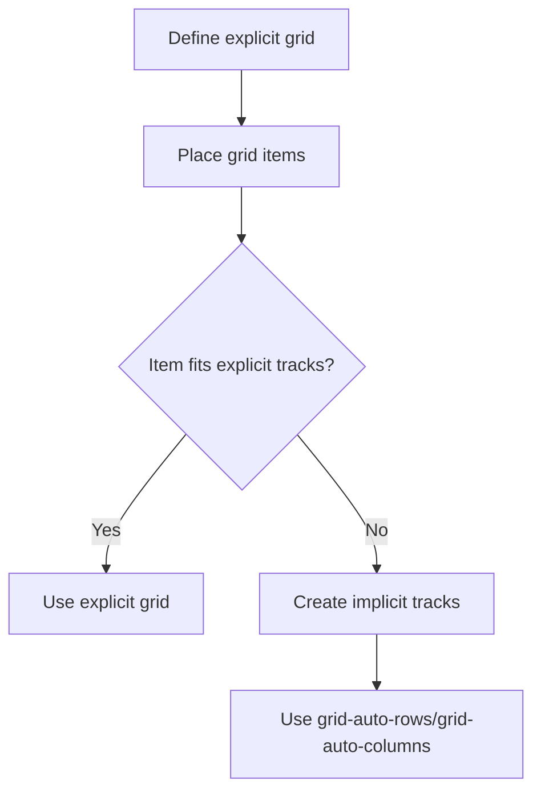
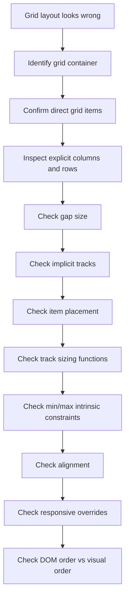

# Part 18 — CSS Grid Deep Dive: Two-Dimensional Layout for Real Interfaces

## Tujuan Bagian Ini

CSS Grid adalah layout system dua dimensi untuk menyusun elemen dalam baris dan kolom. Jika Flexbox menjawab pertanyaan “bagaimana item dibagi sepanjang satu axis?”, Grid menjawab pertanyaan yang lebih struktural:

> “Bagaimana ruang halaman atau komponen dibagi menjadi track, cell, line, dan area yang punya hubungan dua dimensi?”

Bagian ini membangun CSS Grid sebagai model layout untuk interface nyata: dashboard, form enterprise, page shell, report layout, card grid, detail page, dan screen case management.

Setelah menyelesaikan bagian ini, kamu harus mampu:

1. membedakan explicit grid dan implicit grid,
2. memahami track, line, cell, area, dan gap,
3. memakai `fr`, `minmax()`, `repeat()`, `auto-fit`, dan `auto-fill` secara benar,
4. membangun layout responsif tanpa breakpoint berlebihan,
5. memakai named lines dan named areas untuk layout yang maintainable,
6. memahami kapan `subgrid` berguna,
7. men-debug Grid dengan DevTools dan mental model yang repeatable.

---

## Posisi Dalam Framework Kaufman

Dalam framework *The First 20 Hours*, Grid harus dipelajari sebagai sub-skill yang terpisah dari Flexbox. Banyak bug CSS muncul karena developer memakai Flexbox untuk problem dua dimensi atau memakai Grid untuk problem satu dimensi kecil.

Target performa untuk bagian ini:

> Mampu membangun layout dua dimensi yang responsif, semantik, dan maintainable dengan CSS Grid tanpa magic number dan tanpa markup tambahan yang tidak perlu.

Dekomposisi skill:



---

## 1. Mental Model Utama: Grid Adalah Sistem Track dan Placement

Grid terdiri dari:

| Konsep | Arti |
|---|---|
| Grid container | Elemen dengan `display: grid` atau `inline-grid` |
| Grid item | Anak langsung dari grid container |
| Grid line | Garis pembatas row/column |
| Grid track | Ruang antara dua grid line; row atau column |
| Grid cell | Perpotongan satu row track dan satu column track |
| Grid area | Satu atau lebih cell yang digabung |
| Gap | Jarak antar track |

Contoh paling sederhana:

```css
.dashboard {
  display: grid;
  grid-template-columns: 16rem 1fr;
  gap: 1rem;
}
```

Artinya:

- container menjadi grid,
- ada dua column track,
- kolom pertama 16rem,
- kolom kedua mengambil sisa ruang,
- jarak antar track 1rem.

Diagram mental:



---

## 2. Kapan Memakai Grid

Gunakan Grid saat layout punya hubungan dua dimensi.

Cocok untuk:

- page shell,
- dashboard,
- card grid,
- form label/input lintas banyak row,
- report/table-like non-table layout,
- media gallery,
- split panel kompleks,
- area layout dengan header/sidebar/main/footer,
- detail page yang punya metadata panel dan content panel.

Kurang cocok untuk:

- satu baris tombol,
- icon + label,
- navbar kecil,
- action row sederhana,
- chip list sederhana,
- align item dalam satu axis.

Decision table:

| Problem | Pilihan umum |
|---|---|
| “Susun item dalam satu arah” | Flexbox |
| “Buat baris/kolom eksplisit” | Grid |
| “Buat area halaman bernama” | Grid |
| “Tombol kanan dalam toolbar” | Flexbox |
| “Card list responsif” | Grid |
| “Form label sejajar lintas row” | Grid |

---

## 3. Grid Container dan Grid Item

```html
<section class="stats-grid" aria-label="Case summary">
  <article>Open cases: 24</article>
  <article>Overdue: 6</article>
  <article>Escalated: 3</article>
</section>
```

```css
.stats-grid {
  display: grid;
  grid-template-columns: repeat(3, 1fr);
  gap: 1rem;
}
```

Hanya anak langsung `.stats-grid` yang menjadi grid item.

Jika isi card perlu layout sendiri, gunakan layout di dalam card:

```css
.stats-grid > article {
  display: grid;
  gap: 0.5rem;
}
```

CSS Grid tidak mengubah semantik. Gunakan HTML yang benar terlebih dahulu.

---

## 4. Explicit Grid vs Implicit Grid

Explicit grid dibuat oleh:

```css
.grid {
  grid-template-columns: 1fr 1fr 1fr;
  grid-template-rows: auto auto;
}
```

Implicit grid muncul ketika item ditempatkan di luar explicit grid atau jumlah item melebihi track yang didefinisikan.

```css
.grid {
  display: grid;
  grid-template-columns: repeat(3, 1fr);
  grid-auto-rows: minmax(8rem, auto);
}
```

Jika ada 10 item, browser membuat row tambahan secara implisit. `grid-auto-rows` mengontrol ukuran row implisit.

Mental model:



Gunakan explicit grid untuk struktur penting. Gunakan implicit grid untuk daftar item yang jumlahnya dinamis.

---

## 5. Track Sizing: Fixed, Flexible, Content-Based

Contoh fixed + flexible:

```css
.layout {
  display: grid;
  grid-template-columns: 18rem 1fr;
}
```

Contoh tiga kolom equal:

```css
.grid {
  display: grid;
  grid-template-columns: repeat(3, 1fr);
}
```

Contoh content-aware:

```css
.metadata {
  display: grid;
  grid-template-columns: max-content 1fr;
  gap: 0.5rem 1rem;
}
```

Makna praktis:

| Track size | Kegunaan |
|---|---|
| `px/rem` | ukuran eksplisit dan stabil |
| `%` | relatif terhadap container |
| `fr` | bagian dari ruang sisa |
| `auto` | bergantung konten dan konteks |
| `min-content` | ukuran minimum berdasarkan konten |
| `max-content` | ukuran maksimum konten tanpa wrap |
| `fit-content()` | content-based dengan batas maksimum |
| `minmax()` | ukuran minimum dan maksimum track |

---

## 6. `fr` Unit: Fraction of Available Space

`fr` membagi ruang tersedia setelah ukuran fixed, gap, dan content constraints diperhitungkan.

```css
.layout {
  display: grid;
  grid-template-columns: 16rem 1fr 2fr;
  gap: 1rem;
}
```

Jika setelah sidebar dan gap masih ada ruang tersedia, sisa ruang dibagi:

- kolom kedua: 1 bagian,
- kolom ketiga: 2 bagian.

Total = 3 bagian.

Jangan anggap `1fr` selalu sama dengan “sisa ruang penuh”. Jika ada beberapa track `fr`, ruang dibagi relatif.

---

## 7. `minmax()`: Constraint-Based Track Sizing

`minmax(min, max)` mendefinisikan batas bawah dan atas track.

```css
.cards {
  display: grid;
  grid-template-columns: repeat(3, minmax(0, 1fr));
  gap: 1rem;
}
```

Kenapa `minmax(0, 1fr)` sering muncul?

Karena track grid juga bisa terpengaruh intrinsic min-size. `minmax(0, 1fr)` membuat track boleh mengecil sampai 0 sebelum mengambil 1fr, sehingga membantu menghindari overflow akibat konten panjang.

Contoh responsive card:

```css
.cards {
  display: grid;
  grid-template-columns: repeat(auto-fit, minmax(16rem, 1fr));
  gap: 1rem;
}
```

Artinya:

- buat sebanyak mungkin kolom,
- setiap kolom minimal 16rem,
- jika ada ruang lebih, kolom tumbuh sampai 1fr,
- jika tidak cukup ruang, item turun ke row berikutnya.

---

## 8. `repeat()`

Daripada:

```css
.grid {
  grid-template-columns: 1fr 1fr 1fr 1fr;
}
```

Gunakan:

```css
.grid {
  grid-template-columns: repeat(4, 1fr);
}
```

`repeat()` juga bisa digabung dengan pattern:

```css
.grid {
  grid-template-columns: 12rem repeat(3, minmax(0, 1fr));
}
```

Ini berguna untuk layout report:

- kolom label fixed,
- tiga kolom data fleksibel.

---

## 9. `auto-fit` vs `auto-fill`

Dua nilai ini sering tertukar.

```css
.cards {
  display: grid;
  grid-template-columns: repeat(auto-fit, minmax(16rem, 1fr));
}
```

```css
.cards {
  display: grid;
  grid-template-columns: repeat(auto-fill, minmax(16rem, 1fr));
}
```

Mental model:

| Nilai | Perilaku praktis |
|---|---|
| `auto-fit` | kolom kosong collapse; item yang ada dapat melebar |
| `auto-fill` | kolom kosong tetap dipertahankan sebagai slot |

Gunakan `auto-fit` untuk card grid umum agar item mengisi ruang.

Gunakan `auto-fill` saat kamu ingin mempertahankan slot grid meskipun belum ada item, misalnya skeleton placement atau layout yang harus mempertahankan ritme kolom.

Contoh umum:

```css
.case-cards {
  display: grid;
  grid-template-columns: repeat(auto-fit, minmax(min(100%, 18rem), 1fr));
  gap: 1rem;
}
```

`min(100%, 18rem)` mencegah track minimum lebih besar dari container pada layar sangat sempit.

---

## 10. Grid Lines dan Placement

Grid lines bisa dirujuk dengan angka.

```css
.layout {
  display: grid;
  grid-template-columns: 16rem 1fr;
  grid-template-rows: auto 1fr auto;
}

.header {
  grid-column: 1 / -1;
}

.sidebar {
  grid-column: 1;
  grid-row: 2;
}

.main {
  grid-column: 2;
  grid-row: 2;
}

.footer {
  grid-column: 1 / -1;
}
```

`1 / -1` berarti dari line pertama sampai line terakhir.

Gunakan angka untuk layout kecil. Untuk layout besar, named lines atau named areas lebih readable.

---

## 11. Named Lines

```css
.layout {
  display: grid;
  grid-template-columns:
    [full-start] 1rem
    [content-start] minmax(0, 1fr)
    [content-end] 1rem
    [full-end];
}

.hero {
  grid-column: full-start / full-end;
}

.article {
  grid-column: content-start / content-end;
}
```

Named lines cocok ketika layout punya konsep struktural seperti:

- full bleed,
- content width,
- sidebar boundary,
- main boundary,
- aside boundary.

---

## 12. Named Areas

Named areas sangat bagus untuk page shell.

```html
<div class="app-layout">
  <header class="app-layout__header">Header</header>
  <aside class="app-layout__sidebar">Sidebar</aside>
  <main class="app-layout__main">Main</main>
  <footer class="app-layout__footer">Footer</footer>
</div>
```

```css
.app-layout {
  min-height: 100dvh;
  display: grid;
  grid-template-columns: 16rem minmax(0, 1fr);
  grid-template-rows: auto minmax(0, 1fr) auto;
  grid-template-areas:
    "header header"
    "sidebar main"
    "footer footer";
}

.app-layout__header {
  grid-area: header;
}

.app-layout__sidebar {
  grid-area: sidebar;
}

.app-layout__main {
  grid-area: main;
  min-width: 0;
  overflow: auto;
}

.app-layout__footer {
  grid-area: footer;
}
```

Responsive variant:

```css
@media (max-width: 48rem) {
  .app-layout {
    grid-template-columns: minmax(0, 1fr);
    grid-template-rows: auto auto minmax(0, 1fr) auto;
    grid-template-areas:
      "header"
      "sidebar"
      "main"
      "footer";
  }
}
```

Kelebihan named areas:

- layout terlihat sebagai ASCII map,
- mudah direview,
- mudah diubah per breakpoint,
- class item tidak perlu angka magic.

Keterbatasan:

- area harus rectangular,
- tidak cocok untuk placement sangat dinamis,
- terlalu banyak area bisa membuat CSS verbose.

---

## 13. Auto-Placement

Jika item tidak diberi placement eksplisit, Grid memakai auto-placement.

```css
.cards {
  display: grid;
  grid-template-columns: repeat(auto-fit, minmax(16rem, 1fr));
  gap: 1rem;
}
```

Item otomatis mengisi cell berdasarkan source order.

Properti terkait:

```css
.grid {
  grid-auto-flow: row;
}
```

Nilai umum:

- `row`, default,
- `column`,
- `dense`.

`dense` dapat mengisi lubang di grid dengan item berikutnya, tetapi bisa mengubah urutan visual relatif terhadap source order. Pakai hati-hati karena dapat membingungkan pembacaan visual dan keyboard.

```css
.gallery {
  display: grid;
  grid-template-columns: repeat(auto-fit, minmax(12rem, 1fr));
  grid-auto-flow: dense;
}
```

Gunakan `dense` untuk gallery dekoratif, bukan workflow penting.

---

## 14. Spanning: Item Melewati Beberapa Track

```css
.featured {
  grid-column: span 2;
}
```

Contoh dashboard:

```css
.dashboard {
  display: grid;
  grid-template-columns: repeat(12, minmax(0, 1fr));
  gap: 1rem;
}

.card--wide {
  grid-column: span 8;
}

.card--narrow {
  grid-column: span 4;
}

.card--full {
  grid-column: 1 / -1;
}
```

Responsive:

```css
@media (max-width: 60rem) {
  .dashboard > * {
    grid-column: 1 / -1;
  }
}
```

Untuk production, hindari membuat semua komponen tahu angka grid global. Lebih baik definisikan variant layout di layer page/container.

---

## 15. Alignment Dalam Grid

Grid punya alignment untuk item dan track.

| Properti | Target |
|---|---|
| `justify-items` | alignment item dalam cell di inline axis |
| `align-items` | alignment item dalam cell di block axis |
| `justify-self` | override per item inline axis |
| `align-self` | override per item block axis |
| `justify-content` | alignment grid tracks dalam container inline axis |
| `align-content` | alignment grid tracks dalam container block axis |
| `place-items` | shorthand `align-items` + `justify-items` |
| `place-content` | shorthand `align-content` + `justify-content` |

Contoh center item dalam cell:

```css
.empty-state {
  display: grid;
  place-items: center;
  min-height: 20rem;
}
```

Contoh metadata:

```css
.metadata {
  display: grid;
  grid-template-columns: max-content minmax(0, 1fr);
  gap: 0.5rem 1rem;
  align-items: baseline;
}
```

---

## 16. Grid Untuk Form Enterprise

Form kompleks sering lebih cocok dengan Grid daripada Flexbox karena label dan input perlu align lintas row.

HTML:

```html
<form class="case-form">
  <div class="field">
    <label for="case-id">Case ID</label>
    <input id="case-id" name="caseId" />
  </div>

  <div class="field">
    <label for="priority">Priority</label>
    <select id="priority" name="priority">
      <option>High</option>
      <option>Medium</option>
      <option>Low</option>
    </select>
  </div>
</form>
```

CSS sederhana:

```css
.case-form {
  display: grid;
  gap: 1rem;
}

.field {
  display: grid;
  grid-template-columns: 12rem minmax(0, 1fr);
  gap: 0.5rem 1rem;
  align-items: start;
}

.field input,
.field select,
.field textarea {
  min-width: 0;
}
```

Responsive:

```css
@media (max-width: 40rem) {
  .field {
    grid-template-columns: minmax(0, 1fr);
  }
}
```

Jika semua field harus share track label yang sama, `subgrid` bisa membantu.

---

## 17. `subgrid`: Mengikuti Track Parent

Tanpa `subgrid`, nested grid membuat track sendiri. Ini sering membuat label/input tidak align lintas nested component.

Dengan `subgrid`, child grid dapat mengikuti track parent di axis tertentu.

Contoh konseptual:

```css
.form-grid {
  display: grid;
  grid-template-columns: 12rem minmax(0, 1fr);
  gap: 1rem;
}

.field {
  display: grid;
  grid-template-columns: subgrid;
  grid-column: 1 / -1;
}
```

HTML:

```html
<form class="form-grid">
  <div class="field">
    <label for="name">Name</label>
    <input id="name" name="name" />
  </div>
  <div class="field">
    <label for="address">Address</label>
    <textarea id="address" name="address"></textarea>
  </div>
</form>
```

Manfaat:

- nested field mengikuti kolom parent,
- alignment lintas component lebih konsisten,
- tidak perlu mengulang `grid-template-columns` di banyak tempat.

Gunakan `subgrid` saat:

- nested component perlu align dengan grid parent,
- form row punya wrapper tetapi tetap harus berbagi track,
- card internal perlu align dengan layout luar.

Jangan gunakan `subgrid` hanya karena terdengar modern. Jika nested layout independen, grid biasa lebih jelas.

---

## 18. Page Shell Production Pattern

```html
<div class="shell">
  <header class="shell__topbar">Topbar</header>
  <nav class="shell__nav" aria-label="Primary">Navigation</nav>
  <main class="shell__main" id="main">Main content</main>
  <aside class="shell__aside">Context panel</aside>
</div>
```

```css
.shell {
  min-height: 100dvh;
  display: grid;
  grid-template-columns: 16rem minmax(0, 1fr) 20rem;
  grid-template-rows: auto minmax(0, 1fr);
  grid-template-areas:
    "topbar topbar topbar"
    "nav main aside";
}

.shell__topbar {
  grid-area: topbar;
}

.shell__nav {
  grid-area: nav;
  overflow: auto;
}

.shell__main {
  grid-area: main;
  min-width: 0;
  overflow: auto;
}

.shell__aside {
  grid-area: aside;
  overflow: auto;
}
```

Responsive:

```css
@media (max-width: 70rem) {
  .shell {
    grid-template-columns: 14rem minmax(0, 1fr);
    grid-template-areas:
      "topbar topbar"
      "nav main";
  }

  .shell__aside {
    display: none;
  }
}

@media (max-width: 48rem) {
  .shell {
    grid-template-columns: minmax(0, 1fr);
    grid-template-rows: auto auto minmax(0, 1fr);
    grid-template-areas:
      "topbar"
      "nav"
      "main";
  }
}
```

Catatan production:

- `minmax(0, 1fr)` membantu mencegah overflow horizontal.
- Scroll area harus jelas; jangan membuat semua panel scroll tanpa alasan.
- Sembunyikan aside hanya jika informasinya tersedia di tempat lain atau tidak kritikal.
- Jangan menggunakan CSS untuk menyembunyikan navigasi yang masih focusable.

---

## 19. Case Detail Layout

Contoh layout detail kasus regulatory/internal system:

```html
<main class="case-detail">
  <header class="case-detail__header">...</header>
  <section class="case-detail__summary">...</section>
  <section class="case-detail__timeline">...</section>
  <section class="case-detail__evidence">...</section>
  <aside class="case-detail__actions">...</aside>
</main>
```

```css
.case-detail {
  display: grid;
  grid-template-columns: minmax(0, 2fr) minmax(18rem, 1fr);
  grid-template-areas:
    "header header"
    "summary actions"
    "timeline actions"
    "evidence evidence";
  gap: 1rem;
}

.case-detail__header {
  grid-area: header;
}

.case-detail__summary {
  grid-area: summary;
}

.case-detail__timeline {
  grid-area: timeline;
}

.case-detail__evidence {
  grid-area: evidence;
  min-width: 0;
}

.case-detail__actions {
  grid-area: actions;
}

@media (max-width: 56rem) {
  .case-detail {
    grid-template-columns: minmax(0, 1fr);
    grid-template-areas:
      "header"
      "actions"
      "summary"
      "timeline"
      "evidence";
  }
}
```

Perhatikan bahwa area action dipindahkan secara visual via grid area pada breakpoint. Pastikan DOM order tetap masuk akal untuk pembacaan linear. Jika actions muncul sebelum summary di mobile tetapi DOM-nya setelah evidence, itu bisa buruk. Di contoh ini DOM actions memang setelah evidence. Jika action harus dibaca lebih awal, pertimbangkan ubah DOM order, bukan sekadar CSS.

---

## 20. Dashboard Grid

```html
<section class="dashboard" aria-label="Case dashboard">
  <article class="panel panel--wide">Trend</article>
  <article class="panel">Open</article>
  <article class="panel">Overdue</article>
  <article class="panel panel--full">Queue</article>
</section>
```

```css
.dashboard {
  display: grid;
  grid-template-columns: repeat(12, minmax(0, 1fr));
  gap: 1rem;
}

.panel {
  grid-column: span 3;
  min-width: 0;
}

.panel--wide {
  grid-column: span 6;
}

.panel--full {
  grid-column: 1 / -1;
}

@media (max-width: 64rem) {
  .panel,
  .panel--wide {
    grid-column: span 6;
  }
}

@media (max-width: 40rem) {
  .panel,
  .panel--wide,
  .panel--full {
    grid-column: 1 / -1;
  }
}
```

Pattern ini umum, tetapi jangan menjadikan 12-column grid sebagai default semua layout. Untuk banyak UI internal, `auto-fit minmax` lebih sederhana.

---

## 21. Dense Card Grid Tanpa Breakpoint Berlebihan

```css
.case-card-grid {
  display: grid;
  grid-template-columns: repeat(auto-fit, minmax(min(100%, 20rem), 1fr));
  gap: 1rem;
}
```

Ini sering cukup untuk card list responsif.

Keuntungan:

- tidak perlu breakpoint untuk jumlah kolom,
- card menyesuaikan container,
- cocok untuk layout reusable,
- bekerja baik dalam panel sempit dan halaman penuh.

Tambahkan container query nanti bila komponen perlu responsif berdasarkan container, bukan viewport.

---

## 22. Data-Like Layout: Definition List Dengan Grid

HTML semantik:

```html
<dl class="case-metadata">
  <dt>Case ID</dt>
  <dd>A-1029</dd>
  <dt>Status</dt>
  <dd>Under Review</dd>
  <dt>Owner</dt>
  <dd>Ayu Pratama</dd>
</dl>
```

CSS:

```css
.case-metadata {
  display: grid;
  grid-template-columns: max-content minmax(0, 1fr);
  gap: 0.5rem 1rem;
}

.case-metadata dt {
  font-weight: 600;
}

.case-metadata dd {
  margin: 0;
  min-width: 0;
}
```

Ini lebih semantik daripada membuat table jika datanya adalah key-value metadata, bukan data tabular dua dimensi.

---

## 23. Grid dan Accessibility

CSS Grid tidak mengubah DOM order. Namun, seperti Flexbox, Grid bisa mengubah visual placement sehingga berbeda dari source order.

Risiko:

- keyboard order mengikuti DOM, bukan grid area visual,
- screen reader membaca DOM order,
- `grid-auto-flow: dense` dapat membuat visual order tampak tidak linear,
- area layout bisa menempatkan action sebelum konteks secara visual.

Guideline:

1. Source order harus tetap logis tanpa CSS.
2. Gunakan Grid untuk layout, bukan untuk memalsukan urutan dokumen.
3. Hindari `dense` untuk UI workflow penting.
4. Jangan membuat layout visual yang bertentangan dengan heading hierarchy.
5. Pastikan focus visible di semua area.
6. Jika area disembunyikan pada breakpoint, pastikan konten tidak tetap focusable.

---

## 24. Grid Failure Modes

| Gejala | Penyebab umum | Solusi |
|---|---|---|
| Horizontal overflow | `1fr` track tidak boleh mengecil karena intrinsic size | gunakan `minmax(0, 1fr)` atau `min-width: 0` pada item |
| Card terlalu sempit | minimum track terlalu kecil | naikkan nilai `minmax()` minimum |
| Card tidak mengisi ruang | memakai `auto-fill` saat butuh collapse | pakai `auto-fit` |
| Area tidak muncul | nama area typo atau tidak rectangular | validasi `grid-template-areas` |
| Nested form tidak align | nested grid punya track sendiri | pertimbangkan `subgrid` |
| Layout visual membingungkan keyboard | source order berbeda jauh dari visual | ubah DOM order atau placement strategy |
| Banyak breakpoint | layout terlalu viewport-driven | gunakan intrinsic grid dan `minmax()` |
| Grid sulit dipahami | terlalu banyak angka line | pakai named areas/lines |

---

## 25. Debugging Algorithm



Di DevTools:

1. aktifkan Grid overlay,
2. tampilkan line numbers dan area names,
3. cek computed `grid-template-columns`,
4. cek ukuran aktual track,
5. cek apakah item berada di explicit atau implicit grid,
6. cek apakah overflow berasal dari content intrinsic size,
7. cek media query atau container context yang aktif.

---

## 26. Grid Review Checklist

Saat review CSS Grid, tanyakan:

- Apakah problem-nya memang dua dimensi?
- Apakah HTML source order tetap logis?
- Apakah grid container dan grid item benar?
- Apakah track menggunakan `minmax(0, 1fr)` saat item perlu shrink?
- Apakah `auto-fit`/`auto-fill` dipilih dengan alasan yang benar?
- Apakah `grid-template-areas` valid dan mudah dibaca?
- Apakah responsive behavior terlalu bergantung pada breakpoint?
- Apakah ada item penting yang ditempatkan visual jauh dari DOM order?
- Apakah nested alignment membutuhkan `subgrid` atau cukup grid biasa?
- Apakah overflow horizontal sudah diuji dengan teks panjang?

---

## 27. Latihan Deliberate Practice

### Latihan 1 — Responsive Card Grid

Buat daftar case card yang:

- minimal card width 18rem,
- jumlah kolom otomatis,
- tidak overflow di viewport 320px,
- tetap rapi di container sempit.

Gunakan:

```css
repeat(auto-fit, minmax(min(100%, 18rem), 1fr))
```

Lalu jelaskan kenapa `min(100%, 18rem)` membantu.

### Latihan 2 — App Shell Dengan Named Areas

Buat app shell:

- topbar,
- sidebar,
- main,
- aside,
- responsive layout mobile.

Constraint:

- tidak boleh absolute positioning,
- main harus scrollable,
- tidak ada horizontal overflow,
- named areas harus mudah direview.

### Latihan 3 — Metadata Definition List

Buat metadata panel menggunakan `<dl>` dan CSS Grid:

- label kolom kiri `max-content`,
- value kolom kanan fluid,
- teks panjang tidak overflow,
- responsive menjadi satu kolom di layar kecil.

### Latihan 4 — Grid vs Flex Refactor

Ambil form dua kolom yang dibuat dengan Flexbox. Refactor ke Grid. Tulis analisis:

- apa yang menjadi lebih sederhana,
- apa trade-off-nya,
- apa dampaknya terhadap HTML semantics,
- apa failure mode yang berkurang.

### Latihan 5 — Subgrid Exploration

Buat form dengan wrapper `.field`, lalu coba align label/input lintas semua field menggunakan `subgrid`.

Tulis fallback bila `subgrid` tidak dipakai:

- duplicate template columns,
- flatten markup,
- atau gunakan wrapper yang lebih sederhana.

---

## 28. Mini Assessment

Jawab tanpa membuka dokumentasi:

1. Apa perbedaan explicit grid dan implicit grid?
2. Apa yang dilakukan `fr` unit?
3. Kenapa `minmax(0, 1fr)` sering lebih aman daripada `1fr`?
4. Kapan memakai `auto-fit` dibanding `auto-fill`?
5. Apa manfaat named areas?
6. Apa risiko `grid-auto-flow: dense`?
7. Apa perbedaan `justify-items` dan `justify-content`?
8. Kapan `subgrid` berguna?
9. Kenapa source order tetap penting dalam Grid?
10. Kapan Flexbox lebih baik daripada Grid?

---

## 29. Ringkasan Mental Model

CSS Grid dapat dipahami melalui tujuh pertanyaan:

1. Siapa grid container-nya?
2. Siapa direct grid item-nya?
3. Apa kolom dan row explicit-nya?
4. Apakah item tambahan membuat implicit grid?
5. Bagaimana track dihitung: fixed, content-based, atau flexible?
6. Bagaimana item ditempatkan: auto, line, atau area?
7. Apakah source order tetap logis?

Grid adalah layout tool untuk struktur dua dimensi. Ia kuat bukan karena bisa membuat semuanya berbentuk kotak, tetapi karena ia membuat hubungan ruang menjadi eksplisit.

Flexbox mengatur distribusi item dalam satu axis. Grid mengatur sistem track dan area. Developer yang kuat tahu kapan memakai masing-masing.

---

## Referensi

- CSS Grid Layout Module Level 2 — W3C/CSSWG: https://www.w3.org/TR/css-grid-2/
- CSS Grid Layout Module Level 3 — W3C/CSSWG: https://www.w3.org/TR/css-grid-3/
- MDN — CSS grid layout: https://developer.mozilla.org/en-US/docs/Web/CSS/CSS_grid_layout
- MDN — grid-template-columns: https://developer.mozilla.org/en-US/docs/Web/CSS/grid-template-columns
- MDN — Basic concepts of grid layout: https://developer.mozilla.org/en-US/docs/Web/CSS/CSS_grid_layout/Basic_concepts_of_grid_layout
- MDN — Subgrid: https://developer.mozilla.org/en-US/docs/Web/CSS/CSS_grid_layout/Subgrid
