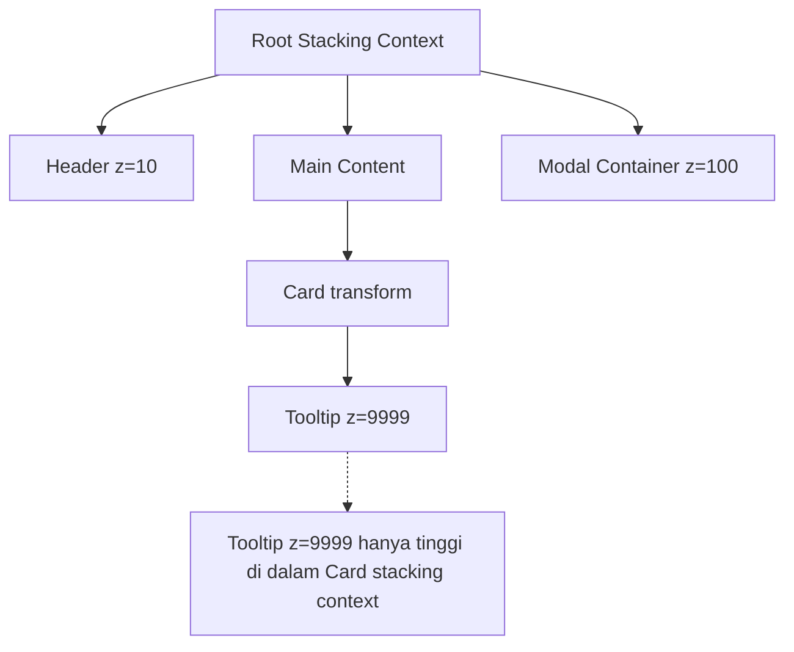
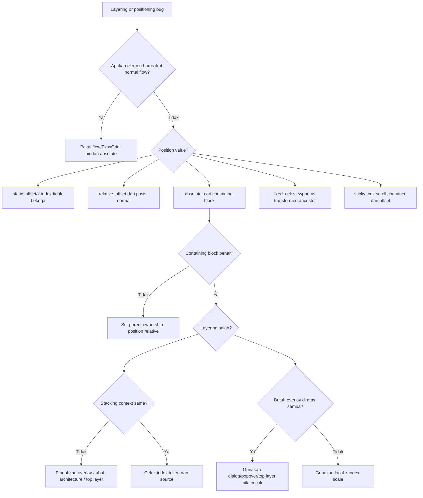

# Part 19 — Positioning, Stacking Context, z-index, Popovers, and Overlay Systems

## 1. Tujuan Pembelajaran

Di bagian sebelumnya, kita membangun mental model layout dari normal flow, block/inline layout, Flexbox, dan Grid. Sekarang kita masuk ke area yang sering menjadi sumber bug paling mahal dalam UI production: **positioning dan layering**.

Setelah menyelesaikan part ini, kamu harus mampu:

1. Menjelaskan perbedaan `static`, `relative`, `absolute`, `fixed`, dan `sticky`.
2. Menentukan **containing block** dari elemen positioned tanpa menebak.
3. Menjelaskan kapan `z-index` bekerja dan kapan tidak.
4. Membaca stacking context sebagai boundary isolasi visual.
5. Mendesain overlay system untuk modal, popover, tooltip, dropdown, command menu, toast, dan floating panel.
6. Memilih kapan memakai native `<dialog>`, Popover API, CSS Anchor Positioning, atau custom JavaScript positioning.
7. Membuat strategi layering yang bisa direview di codebase besar.

Targetnya bukan sekadar “bisa membuat modal muncul di depan”. Targetnya adalah memahami **kontrak visual** antara DOM, CSS layout, focus, accessibility, dan browser top layer.

---

## 2. Mental Model: Positioning Adalah Escape Hatch dari Normal Flow

Normal flow adalah layout default: elemen block menyusun vertikal, inline menyusun dalam line box, Flexbox/Grid menyusun berdasarkan container. Positioning memberi kita kontrol koordinat yang lebih eksplisit.

Namun positioning bukan layout system utama untuk seluruh halaman. Ia adalah alat untuk kasus tertentu:

- badge kecil di pojok card,
- sticky header,
- floating action bar,
- tooltip,
- popover,
- modal,
- menu,
- drawer,
- toast,
- overlay blocking interaction.

Prinsipnya:

> Gunakan normal flow, Flexbox, atau Grid untuk struktur utama. Gunakan positioning untuk lapisan lokal, offset, dan overlay.

Positioning yang dipakai untuk menggantikan layout utama biasanya menghasilkan CSS rapuh: banyak magic number, overlap tak terduga, breakpoint yang pecah, dan accessibility buruk.

---

## 3. `position: static`

`static` adalah nilai default.

```css
.card {
  position: static;
}
```

Ciri-cirinya:

- elemen berada di normal flow,
- `top`, `right`, `bottom`, `left`, dan `inset` tidak berpengaruh,
- `z-index` tidak berlaku pada elemen static,
- tidak membuat positioning context untuk child absolute.

Contoh:

```html
<section class="case-card">
  <span class="badge">Open</span>
  <h2>Case #A-1029</h2>
</section>
```

```css
.badge {
  position: static;
  top: 0; /* tidak berpengaruh */
  z-index: 10; /* tidak berpengaruh */
}
```

Jika `top` tidak bekerja, pertanyaan pertama: **apakah elemen tersebut positioned?**

---

## 4. `position: relative`

`relative` membuat elemen tetap mengambil ruang di normal flow, tetapi visual box-nya dapat digeser relatif terhadap posisi normalnya.

```css
.badge {
  position: relative;
  top: -2px;
}
```

Ciri penting:

- elemen tetap meninggalkan ruang asalnya,
- offset menggeser visual position, bukan layout slot,
- dapat menjadi containing block untuk child `absolute`,
- dapat menerima `z-index` jika positioned.

Contoh paling umum:

```css
.card {
  position: relative;
}

.card__badge {
  position: absolute;
  inset-block-start: 0.75rem;
  inset-inline-end: 0.75rem;
}
```

Di sini `position: relative` pada `.card` bukan untuk menggeser card. Ia dipakai sebagai **anchor lokal** bagi child absolute.

### Anti-pattern

```css
.form-label {
  position: relative;
  top: 7px;
}
```

Ini sering terlihat sebagai patch visual cepat. Masalahnya:

- layout slot tetap di posisi lama,
- alignment bisa pecah saat font berubah,
- spacing system tidak lagi jujur,
- sulit diprediksi pada responsive layout.

Gunakan Flexbox/Grid/alignment terlebih dahulu sebelum memakai offset relatif.

---

## 5. `position: absolute`

`absolute` mengeluarkan elemen dari normal flow. Posisi elemen dihitung relatif terhadap containing block-nya.

```css
.card {
  position: relative;
}

.card__status {
  position: absolute;
  inset-block-start: 1rem;
  inset-inline-end: 1rem;
}
```

Ciri-cirinya:

- tidak mengambil ruang dalam normal flow,
- sibling lain bertindak seolah elemen itu tidak ada,
- offset dihitung terhadap containing block,
- cocok untuk elemen yang secara visual melekat pada area tertentu tetapi tidak menentukan ukuran layout utama.

### Containing Block untuk Absolute

Untuk elemen `position: absolute`, containing block biasanya adalah ancestor terdekat yang memiliki `position` selain `static`.

```html
<div class="page">
  <div class="panel">
    <button class="panel__close">×</button>
  </div>
</div>
```

```css
.panel {
  position: relative;
}

.panel__close {
  position: absolute;
  inset-block-start: 0.5rem;
  inset-inline-end: 0.5rem;
}
```

Jika `.panel` tidak positioned, tombol close dapat mencari ancestor lain, bahkan viewport/initial containing block. Ini penyebab umum close button melayang di tempat aneh.

### Rule of Thumb

Jika child memakai `position: absolute`, parent yang menjadi boundary visual biasanya harus eksplisit:

```css
.component {
  position: relative;
}
```

Ini bukan “hack”; ini adalah deklarasi ownership.

---

## 6. `position: fixed`

`fixed` memosisikan elemen relatif terhadap viewport, bukan normal flow.

```css
.toast-region {
  position: fixed;
  inset-block-start: 1rem;
  inset-inline-end: 1rem;
}
```

Cocok untuk:

- toast,
- floating support widget,
- global loading overlay,
- fixed app header,
- persistent action bar.

Namun `fixed` punya jebakan: beberapa properti pada ancestor seperti `transform`, `filter`, atau `contain` dapat membuat containing block baru untuk positioned descendant. Akibatnya elemen yang kamu pikir fixed ke viewport ternyata fixed terhadap ancestor tertentu.

Contoh failure:

```css
.app-shell {
  transform: translateZ(0);
}

.global-toast {
  position: fixed;
  inset-block-start: 1rem;
  inset-inline-end: 1rem;
}
```

Jika toast berada di dalam `.app-shell`, beberapa browser behavior/spec condition dapat membuatnya terikat pada ancestor tersebut. Solusi arsitektural: letakkan overlay global di root overlay container, bukan jauh di dalam subtree komponen.

---

## 7. `position: sticky`

`sticky` adalah gabungan antara normal flow dan fixed positioning. Elemen tetap berada dalam flow sampai melewati threshold, lalu “menempel” dalam scroll container.

```css
.table-toolbar {
  position: sticky;
  inset-block-start: 0;
  z-index: 2;
  background: Canvas;
}
```

Ciri penting:

- butuh offset (`top`, `inset-block-start`, dsb.),
- sticky terhadap scroll container terdekat,
- tetap constrained oleh parent boundary,
- sangat sensitif terhadap `overflow` pada ancestor.

### Sticky Tidak Bekerja? Periksa Ini

1. Apakah ada offset?

```css
.sticky-header {
  position: sticky;
  top: 0;
}
```

2. Apakah ancestor punya `overflow: hidden`, `auto`, atau `scroll`?
3. Apakah parent terlalu pendek sehingga tidak ada ruang sticky?
4. Apakah elemen berada dalam table/layout context yang punya aturan khusus?
5. Apakah background/z-index membuatnya terlihat seperti tidak sticky?

### Sticky untuk Enterprise UI

Sticky berguna untuk:

- table header,
- filter bar,
- case action toolbar,
- side navigation,
- comparison matrix header,
- timeline date marker.

Contoh:

```css
.case-actions {
  position: sticky;
  inset-block-start: 0;
  z-index: var(--z-sticky);
  display: flex;
  justify-content: space-between;
  gap: 1rem;
  padding: 0.75rem 1rem;
  background: var(--surface);
  border-block-end: 1px solid var(--border-subtle);
}
```

---

## 8. Offset Properties: Physical vs Logical

Physical offsets:

```css
.tooltip {
  top: 100%;
  left: 0;
}
```

Logical offsets:

```css
.tooltip {
  inset-block-start: 100%;
  inset-inline-start: 0;
}
```

Logical properties lebih baik untuk UI yang mendukung:

- right-to-left language,
- vertical writing mode,
- internationalization,
- reusable component library.

Shorthand:

```css
.overlay {
  position: fixed;
  inset: 0;
}
```

Equivalent physical:

```css
.overlay {
  top: 0;
  right: 0;
  bottom: 0;
  left: 0;
}
```

Untuk layout enterprise yang mungkin internasional, gunakan `inset-block-*` dan `inset-inline-*` ketika memungkinkan.

---

## 9. z-index: Bukan Angka Global Sederhana

`z-index` menentukan urutan stacking untuk elemen positioned atau elemen dalam konteks tertentu seperti flex/grid item.

```css
.modal {
  position: fixed;
  z-index: 1000;
}
```

Namun pemahaman yang sering salah:

> “Kalau tidak muncul di depan, tambahkan `z-index: 999999`.”

Ini tidak selalu bekerja karena `z-index` hanya dibandingkan **di dalam stacking context yang sama**.

---

## 10. Stacking Context

Stacking context adalah boundary layering. Elemen dalam satu stacking context disusun terhadap sesamanya, lalu seluruh context itu diperlakukan seperti satu unit terhadap parent context.

Analogi:

- root document adalah map besar,
- stacking context adalah folder transparansi,
- child di dalam folder bisa saling overlap,
- tetapi folder utuh tetap punya posisi terhadap folder lain.

### Diagram Mental Model



Jika `.card` membuat stacking context, tooltip di dalamnya tidak bisa mengalahkan `.modal-container` di luar hanya dengan `z-index: 9999`.

---

## 11. Apa yang Membuat Stacking Context?

Beberapa trigger umum:

- root element,
- positioned element dengan `z-index` selain `auto`,
- `position: fixed` atau `sticky`,
- flex/grid item dengan `z-index` selain `auto`,
- `opacity` kurang dari `1`,
- `transform`,
- `filter`,
- `perspective`,
- `clip-path`,
- `mask`,
- `isolation: isolate`,
- `contain: layout` atau `paint`,
- elemen di top layer,
- beberapa kondisi lain sesuai spesifikasi browser modern.

Contoh jebakan:

```css
.card {
  opacity: 0.999;
}
```

Opacity kurang dari 1 dapat membuat stacking context. Kadang ini berasal dari animasi fade yang tidak dibersihkan.

Contoh lain:

```css
.panel {
  transform: translateY(0);
}
```

Transform walaupun visualnya nol tetap dapat membuat stacking context.

---

## 12. Paint Order Ringkas

Secara sederhana, browser melukis dari belakang ke depan:

1. background/border root,
2. descendant dengan negative z-index,
3. non-positioned block,
4. floats,
5. inline content,
6. positioned dengan `z-index: auto` atau `0`,
7. positioned dengan positive z-index,
8. top layer di atas document stacking normal.

Ini disederhanakan, tetapi cukup untuk debugging mayoritas kasus.

### Debugging Question

Ketika z-index tidak bekerja, jangan langsung menaikkan angka. Tanyakan:

1. Elemen mana yang membuat stacking context?
2. Apakah dua elemen yang dibandingkan berada dalam context yang sama?
3. Apakah ancestor child membatasi z-index child?
4. Apakah elemen target sebenarnya berada di browser top layer?
5. Apakah pointer event/focus problem disangka layering problem?

---

## 13. Strategi z-index Scale

Dalam sistem besar, gunakan token z-index. Jangan menyebarkan angka acak.

```css
:root {
  --z-base: 0;
  --z-raised: 10;
  --z-sticky: 100;
  --z-dropdown: 300;
  --z-popover: 400;
  --z-toast: 500;
  --z-modal: 700;
  --z-critical: 900;
}
```

Contoh:

```css
.app-header {
  position: sticky;
  inset-block-start: 0;
  z-index: var(--z-sticky);
}

.toast-region {
  position: fixed;
  inset-block-start: 1rem;
  inset-inline-end: 1rem;
  z-index: var(--z-toast);
}
```

Namun token bukan pengganti mental model. Token hanya bekerja jika overlay berada dalam stacking architecture yang benar.

### Layer Taxonomy

| Layer | Tujuan | Contoh |
|---|---|---|
| base | normal content | page body |
| raised | card/menu lokal | hover card |
| sticky | header/filter bar | sticky toolbar |
| dropdown | pilihan lokal | select menu |
| popover | floating contextual UI | action popover |
| toast | notification region | success/error toast |
| modal | blocking interaction | confirm dialog |
| critical | emergency overlay | session expired |

---

## 14. `isolation: isolate`

`isolation: isolate` membuat stacking context eksplisit.

```css
.card {
  isolation: isolate;
}
```

Ini berguna ketika kamu ingin memastikan efek internal card tidak keluar mengganggu page.

Contoh:

```css
.status-card {
  position: relative;
  isolation: isolate;
  overflow: hidden;
}

.status-card::before {
  content: "";
  position: absolute;
  inset: 0;
  z-index: -1;
  background: linear-gradient(...);
}
```

Dengan `isolation`, pseudo-element negatif tidak “jatuh” ke belakang ancestor yang tidak dimaksud.

---

## 15. Top Layer

Browser memiliki konsep **top layer**: layer khusus di atas document stacking normal. Elemen seperti modal `<dialog>` dan popover dapat ditempatkan di top layer.

Implikasi penting:

- `z-index` normal tidak bisa mengalahkan top layer,
- elemen top layer berada di atas stacking context document,
- setiap elemen top layer membentuk stacking context sendiri,
- backdrop dapat distyling lewat `::backdrop` untuk elemen yang mendukung.

Contoh modal dialog:

```html
<dialog id="close-case-dialog" class="dialog">
  <form method="dialog" class="dialog__panel">
    <h2>Close case?</h2>
    <p>This action will lock the case for final review.</p>
    <menu class="dialog__actions">
      <button value="cancel">Cancel</button>
      <button value="confirm">Confirm</button>
    </menu>
  </form>
</dialog>
```

```css
.dialog {
  border: 0;
  padding: 0;
  border-radius: 0.75rem;
}

.dialog::backdrop {
  background: rgb(0 0 0 / 0.45);
}

.dialog__panel {
  max-inline-size: 32rem;
  padding: 1.5rem;
}
```

JavaScript minimal:

```js
const dialog = document.querySelector('#close-case-dialog');
const openButton = document.querySelector('[data-open-close-case]');

openButton.addEventListener('click', () => {
  dialog.showModal();
});
```

Native dialog menangani banyak hal yang dulu memerlukan custom code: top layer, backdrop, dan sebagian focus behavior. Namun tetap perlu diuji untuk keyboard, focus return, accessible name, dan browser compatibility policy.

---

## 16. Popover API

Popover API memberi mekanisme native untuk menampilkan konten popover di atas page content.

Contoh deklaratif:

```html
<button popovertarget="case-actions-popover">
  More actions
</button>

<div id="case-actions-popover" popover class="action-popover">
  <button>Assign reviewer</button>
  <button>Request evidence</button>
  <button>Escalate case</button>
</div>
```

```css
.action-popover {
  padding: 0.5rem;
  border: 1px solid var(--border-subtle);
  border-radius: 0.5rem;
  background: var(--surface-elevated);
  box-shadow: var(--shadow-lg);
}
```

Popover cocok untuk:

- action menu sederhana,
- filter panel ringan,
- contextual help,
- non-modal floating UI.

Namun popover bukan otomatis “menu accessibility sempurna”. Jika kontennya adalah menu aplikasi yang butuh arrow-key navigation, roving tabindex, atau role khusus, kamu tetap perlu pattern interaction yang benar.

---

## 17. Dialog vs Popover vs Custom Overlay

| Kebutuhan | Pilihan Utama | Catatan |
|---|---|---|
| Blocking decision | `<dialog>.showModal()` | Untuk konfirmasi, form modal, destructive action |
| Non-blocking contextual panel | Popover API | Cocok untuk action menu/help/filter kecil |
| Tooltip murni informatif | CSS/JS tooltip carefully | Harus tidak menghalangi keyboard/screen reader |
| Complex combobox/select | Custom ARIA pattern atau native select | Kompleks; jangan asal pakai div menu |
| Cross-browser legacy strict | Custom + progressive enhancement | Pastikan fallback dan tests |
| Enterprise command palette | Custom dialog | Butuh focus, search, keyboard contract |

Rule of thumb:

> Pakai native primitive ketika semantics dan behavior-nya cocok. Custom hanya ketika kebutuhan interaksi benar-benar melampaui primitive native.

---

## 18. CSS Anchor Positioning

CSS Anchor Positioning memungkinkan elemen diposisikan relatif terhadap elemen anchor tanpa menghitung koordinat manual di JavaScript.

Contoh konseptual:

```html
<button class="help-button" popovertarget="help-popover">
  Help
</button>

<div id="help-popover" popover class="help-popover">
  Explain this regulatory status.
</div>
```

```css
.help-button {
  anchor-name: --help-button;
}

.help-popover {
  position-anchor: --help-button;
  inset-block-start: anchor(block-end);
  inset-inline-start: anchor(inline-start);
}
```

Manfaat:

- mengurangi dependency pada JavaScript positioning library,
- lebih deklaratif,
- cocok untuk popover/tooltip/dropdown modern,
- dapat dikombinasikan dengan fallback positioning.

Namun karena browser support dan Baseline status bisa berubah, gunakan `@supports` dan compatibility strategy.

```css
@supports (position-anchor: --anchor) {
  .help-popover {
    position-anchor: --help-button;
  }
}
```

---

## 19. Tooltip: Jangan Remehkan Semantics

Tooltip terlihat sederhana, tetapi interaction contract-nya sulit.

Masalah umum:

- hanya muncul saat hover, tidak saat focus,
- mengandung interactive content padahal disebut tooltip,
- hilang saat pointer bergerak ke tooltip,
- tidak terbaca screen reader,
- menutupi trigger,
- clipping oleh `overflow: hidden`,
- z-index kalah oleh stacking context.

Tooltip informatif sederhana:

```html
<button class="icon-button" aria-describedby="case-help">
  <span aria-hidden="true">?</span>
  <span class="visually-hidden">Explain case status</span>
</button>

<span id="case-help" role="tooltip" class="tooltip">
  Case status indicates the current enforcement lifecycle stage.
</span>
```

CSS dasar:

```css
.tooltip {
  position: absolute;
  max-inline-size: 20rem;
  padding: 0.5rem 0.75rem;
  border-radius: 0.375rem;
  background: var(--surface-inverse);
  color: var(--text-inverse);
  font-size: 0.875rem;
}
```

Untuk tooltip production, biasanya perlu JS untuk:

- show on focus and hover,
- hide on Escape,
- delay policy,
- collision detection,
- portal/top layer strategy,
- `aria-describedby` lifecycle.

Jika kontennya interactive, jangan sebut tooltip. Itu popover/dialog kecil.

---

## 20. Dropdown Menu

Dropdown menu bukan sekadar list absolute.

Pertanyaan desain:

1. Apakah ini navigasi? Gunakan link.
2. Apakah ini daftar action? Gunakan button.
3. Apakah ini form select? Pertimbangkan native `<select>`.
4. Apakah menu butuh keyboard arrow navigation?
5. Apakah focus harus masuk ke menu?
6. Apakah klik luar menutup menu?
7. Apakah Escape menutup menu?
8. Apakah menu harus tetap terlihat dalam scroll container?

Markup sederhana dengan popover:

```html
<button popovertarget="case-menu" aria-haspopup="menu">
  Actions
</button>

<div id="case-menu" popover class="menu-panel">
  <button type="button">Assign</button>
  <button type="button">Escalate</button>
  <button type="button">Close</button>
</div>
```

CSS:

```css
.menu-panel {
  min-inline-size: 12rem;
  padding: 0.375rem;
  border: 1px solid var(--border-subtle);
  border-radius: 0.5rem;
  background: var(--surface-elevated);
  box-shadow: var(--shadow-lg);
}

.menu-panel > button {
  display: block;
  inline-size: 100%;
  padding: 0.5rem 0.75rem;
  text-align: start;
}
```

Catatan: `aria-haspopup="menu"` harus dipakai dengan hati-hati. Jika kamu mengklaim role menu, interaction-nya harus mengikuti ekspektasi menu. Untuk banyak kasus enterprise action list, button list dalam popover lebih sederhana dan lebih aman.

---

## 21. Modal Overlay Architecture

Modal bukan hanya “box di tengah”. Modal adalah state yang mengubah interaction model halaman.

Kontrak modal:

- konten di belakang tidak dapat diinteraksi,
- focus masuk ke modal,
- focus tidak bocor ke belakang,
- Escape biasanya menutup modal jika aman,
- focus kembali ke trigger setelah modal ditutup,
- modal punya accessible name,
- scroll behavior jelas,
- destructive action punya confirmation policy,
- background inert/blocked.

Native dialog membantu banyak hal:

```html
<dialog class="confirm-dialog" aria-labelledby="confirm-title">
  <form method="dialog">
    <h2 id="confirm-title">Escalate case?</h2>
    <p>Escalation will notify the supervisory review queue.</p>
    <div class="actions">
      <button value="cancel">Cancel</button>
      <button value="escalate">Escalate</button>
    </div>
  </form>
</dialog>
```

CSS:

```css
.confirm-dialog {
  max-inline-size: min(32rem, calc(100vw - 2rem));
  border: 0;
  border-radius: 0.75rem;
  padding: 0;
}

.confirm-dialog::backdrop {
  background: rgb(0 0 0 / 0.55);
}
```

Modal dengan form panjang:

```css
.form-dialog {
  inline-size: min(48rem, calc(100vw - 2rem));
  max-block-size: min(42rem, calc(100dvh - 2rem));
  overflow: auto;
}
```

Gunakan `dvh` untuk viewport dinamis mobile agar address bar tidak membuat height salah.

---

## 22. Overlay Root Pattern

Untuk aplikasi kompleks, overlay global sebaiknya memiliki root khusus:

```html
<body>
  <div id="app-root"></div>
  <div id="overlay-root"></div>
</body>
```

Manfaat:

- menghindari clipping oleh ancestor `overflow`,
- menghindari stacking context lokal,
- menyederhanakan z-index scale,
- memudahkan focus management,
- memisahkan content layer dari overlay layer.

CSS:

```css
#overlay-root {
  position: relative;
  z-index: var(--z-overlay-root);
}
```

Namun jangan menganggap portal/overlay-root otomatis menyelesaikan semua masalah. Jika memakai native top layer, elemen top layer berada di luar stacking model dokumen. Jika memakai custom overlay, kamu masih bertanggung jawab atas accessibility, inert background, scroll lock, dan focus trap.

---

## 23. Scroll Lock dan Layout Shift

Saat modal terbuka, sering kali body scroll dikunci:

```css
body:has(dialog[open]) {
  overflow: hidden;
}
```

Masalah: scrollbar hilang dapat menyebabkan layout shift. Strategi:

```css
html {
  scrollbar-gutter: stable;
}
```

Atau di aplikasi dengan constraint ketat, gunakan scroll container internal daripada body scroll.

Untuk modal besar:

```css
.dialog__body {
  max-block-size: min(60dvh, 40rem);
  overflow: auto;
}
```

Pikirkan scroll sebagai bagian dari kontrak UX. Modal yang tidak bisa discroll di mobile adalah production bug.

---

## 24. Pointer Events

`pointer-events` dapat mengatur apakah elemen menerima pointer interaction.

```css
.overlay-backdrop {
  pointer-events: auto;
}

.decorative-layer {
  pointer-events: none;
}
```

Gunakan untuk dekorasi yang overlay di atas konten tetapi tidak boleh menghalangi klik.

Jangan gunakan `pointer-events: none` sebagai patch untuk accessibility. Elemen yang tidak menerima pointer mungkin tetap focusable via keyboard jika tidak dikelola. Jika elemen benar-benar inactive, gunakan state semantik seperti `disabled`, `hidden`, `inert`, atau kontrol rendering.

---

## 25. `inert`

`inert` membuat subtree tidak interaktif dan biasanya tidak masuk accessibility tree/focus navigation.

Contoh konseptual:

```html
<main inert>
  <!-- background content while modal is active -->
</main>
```

Native modal dialog biasanya mengelola inert-like behavior untuk background. Dalam custom modal, `inert` dapat menjadi bagian dari strategy, tetapi tetap perlu compatibility dan test.

---

## 26. Enterprise Pattern: Case Action Toolbar + Sticky + Popover + Dialog

Contoh struktur:

```html
<header class="case-toolbar">
  <div>
    <p class="eyebrow">Case #A-1029</p>
    <h1>Unlicensed activity investigation</h1>
  </div>

  <div class="case-toolbar__actions">
    <button type="button">Save draft</button>
    <button type="button" popovertarget="more-actions">More</button>
    <button type="button" data-open-escalate>Escalate</button>
  </div>
</header>

<div id="more-actions" popover class="action-popover">
  <button type="button">Request evidence</button>
  <button type="button">Assign reviewer</button>
  <button type="button">Export summary</button>
</div>

<dialog id="escalate-dialog" class="confirm-dialog" aria-labelledby="escalate-title">
  <form method="dialog">
    <h2 id="escalate-title">Escalate case?</h2>
    <p>This will notify supervisory review.</p>
    <div class="dialog-actions">
      <button value="cancel">Cancel</button>
      <button value="confirm">Escalate</button>
    </div>
  </form>
</dialog>
```

CSS:

```css
.case-toolbar {
  position: sticky;
  inset-block-start: 0;
  z-index: var(--z-sticky);
  display: flex;
  align-items: center;
  justify-content: space-between;
  gap: 1rem;
  padding: 1rem;
  background: var(--surface);
  border-block-end: 1px solid var(--border-subtle);
}

.case-toolbar__actions {
  display: flex;
  flex-wrap: wrap;
  justify-content: end;
  gap: 0.5rem;
}

.action-popover {
  padding: 0.5rem;
  border: 1px solid var(--border-subtle);
  border-radius: 0.5rem;
  background: var(--surface-elevated);
  box-shadow: var(--shadow-lg);
}

.confirm-dialog {
  inline-size: min(32rem, calc(100vw - 2rem));
  border: 0;
  border-radius: 0.75rem;
  padding: 1.5rem;
}

.confirm-dialog::backdrop {
  background: rgb(0 0 0 / 0.5);
}
```

Architecture point:

- sticky toolbar lives in document stacking context,
- popover can use top layer behavior,
- dialog uses modal top layer behavior,
- z-index tokens cover sticky/custom layers,
- top layer handles cases that z-index scale should not fight.

---

## 27. Failure Taxonomy

### 27.1 Element Not Moving

Possible causes:

- `position` masih `static`,
- offset axis salah,
- logical/physical mismatch,
- rule kalah cascade,
- class tidak match.

### 27.2 Absolute Element Appears in Wrong Place

Possible causes:

- parent intended tidak `position: relative`,
- containing block berasal dari ancestor lain,
- transform/contain mengubah containing block,
- element dipindahkan via portal.

### 27.3 z-index Does Not Work

Possible causes:

- elemen tidak positioned,
- dibandingkan di stacking context berbeda,
- ancestor membuat stacking context,
- top layer mengalahkan document layer,
- `opacity`, `transform`, atau `contain` menciptakan boundary.

### 27.4 Sticky Does Not Stick

Possible causes:

- tidak ada `top`/`inset-block-start`,
- ancestor overflow menjadi scroll container,
- parent terlalu pendek,
- z-index/background membuat efek tidak terlihat,
- table/layout special case.

### 27.5 Overlay Clipped

Possible causes:

- ancestor `overflow: hidden`,
- overlay berada di dalam scroll container,
- tidak memakai portal/top layer,
- posisi absolute mengikuti boundary lokal.

### 27.6 Modal Blocks Wrong Things

Possible causes:

- custom modal tanpa inert/focus management,
- backdrop tidak menutupi viewport,
- body scroll tidak dikunci,
- pointer-events salah,
- nested modal tanpa stack policy.

---

## 28. Debugging Algorithm



---

## 29. Code Review Checklist

Gunakan checklist ini untuk PR yang menyentuh positioning/overlay:

- Apakah positioning dipakai untuk kasus yang tepat?
- Apakah layout utama masih memakai flow/Flex/Grid?
- Apakah child absolute memiliki parent ownership eksplisit?
- Apakah `z-index` memakai token, bukan angka acak?
- Apakah stacking context baru disengaja?
- Apakah `transform`, `opacity`, `filter`, `contain`, atau `isolation` menciptakan side effect?
- Apakah sticky bergantung pada scroll container yang jelas?
- Apakah overlay bisa ter-clip oleh `overflow`?
- Apakah modal/popover memakai native primitive jika cocok?
- Apakah focus behavior diuji dengan keyboard?
- Apakah Escape/click outside policy jelas?
- Apakah mobile viewport/scroll diuji?
- Apakah RTL/logical offset dipertimbangkan?
- Apakah top layer dipahami dan tidak dilawan dengan z-index magic number?

---

## 30. Practice: 90-Minute Positioning Drill

### Exercise 1 — Badge and Absolute Ownership

Bangun card dengan status badge di pojok kanan atas.

Constraints:

- card harus tetap responsive,
- badge tidak boleh mempengaruhi heading flow,
- gunakan logical inset,
- parent harus menjadi containing block eksplisit.

### Exercise 2 — Sticky Case Toolbar

Bangun sticky toolbar untuk case detail page.

Constraints:

- sticky di atas viewport,
- background solid,
- z-index token,
- toolbar tetap usable saat action wrap di layar kecil.

### Exercise 3 — z-index Failure Lab

Buat dua card:

- card A punya `transform`,
- tooltip di dalam card A punya `z-index: 9999`,
- modal container di luar punya `z-index: 100`.

Amati kenapa tooltip tidak selalu menang. Dokumentasikan stacking context-nya.

### Exercise 4 — Dialog Confirmation

Buat `<dialog>` untuk destructive action.

Requirements:

- accessible name,
- backdrop,
- focus masuk ke dialog,
- tombol cancel dan confirm,
- max width responsive,
- body tetap tidak scroll kacau di mobile.

### Exercise 5 — Popover Action Menu

Buat action popover untuk case actions.

Requirements:

- trigger button,
- popover content,
- action buttons,
- keyboard smoke test,
- fallback note jika Popover API tidak tersedia.

---

## 31. Engineering Heuristics

1. **Positioning is not page layout.** Gunakan untuk local offset dan overlay.
2. **Every absolute child needs an owner.** Biasanya parent `position: relative`.
3. **z-index is local to stacking context.** Angka besar bukan solusi universal.
4. **Top layer beats normal document stacking.** Jangan melawan dengan `999999`.
5. **Overlay is an interaction system.** Bukan hanya visual layer.
6. **Native primitives reduce accidental complexity.** Tapi tetap test semantics dan behavior.
7. **Use logical offsets.** UI enterprise sering butuh i18n.
8. **Treat scroll as a first-class constraint.** Banyak overlay bug adalah scroll bug.
9. **Make stacking contexts intentional.** Jangan biarkan `transform`/`opacity` random mengubah layering.
10. **Debug from ownership outward.** Containing block → stacking context → top layer → focus/pointer.

---

## 32. Ringkasan

Positioning dan overlay system adalah area di mana CSS bertemu langsung dengan architecture, accessibility, dan product workflow.

Yang perlu kamu kuasai:

- `relative` sering dipakai sebagai ownership boundary.
- `absolute` keluar dari flow dan mengikuti containing block.
- `fixed` biasanya viewport-bound, tetapi ancestor tertentu bisa mengubah behavior.
- `sticky` bergantung pada scroll container dan offset.
- `z-index` hanya meaningful dalam stacking context.
- stacking context adalah boundary isolasi visual.
- top layer berada di atas document stacking normal.
- dialog/popover memberi primitive native untuk overlay modern.
- CSS Anchor Positioning membawa positioning deklaratif untuk floating UI.
- overlay production harus menangani focus, keyboard, scroll, backdrop, pointer, dan accessibility.

Jika kamu bisa menjelaskan kenapa `z-index: 9999` gagal, kamu sudah melewati level CSS trial-and-error dan masuk ke level engineering.

---

## 33. Referensi

- MDN — Stacking context: https://developer.mozilla.org/en-US/docs/Web/CSS/Guides/Positioned_layout/Stacking_context
- MDN — Top layer: https://developer.mozilla.org/en-US/docs/Glossary/Top_layer
- MDN — Using the Popover API: https://developer.mozilla.org/en-US/docs/Web/API/Popover_API/Using
- MDN — CSS anchor positioning: https://developer.mozilla.org/en-US/docs/Web/CSS/Guides/Anchor_positioning
- Chrome Developers — Meet the top layer: https://developer.chrome.com/blog/what-is-the-top-layer
- MDN — position: https://developer.mozilla.org/en-US/docs/Web/CSS/position
- MDN — z-index: https://developer.mozilla.org/en-US/docs/Web/CSS/z-index
