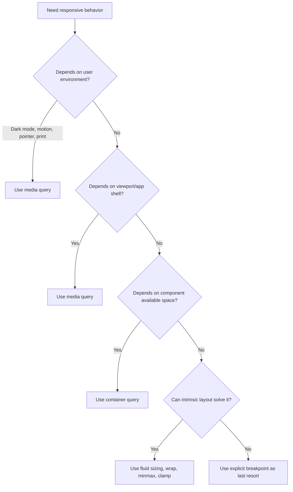
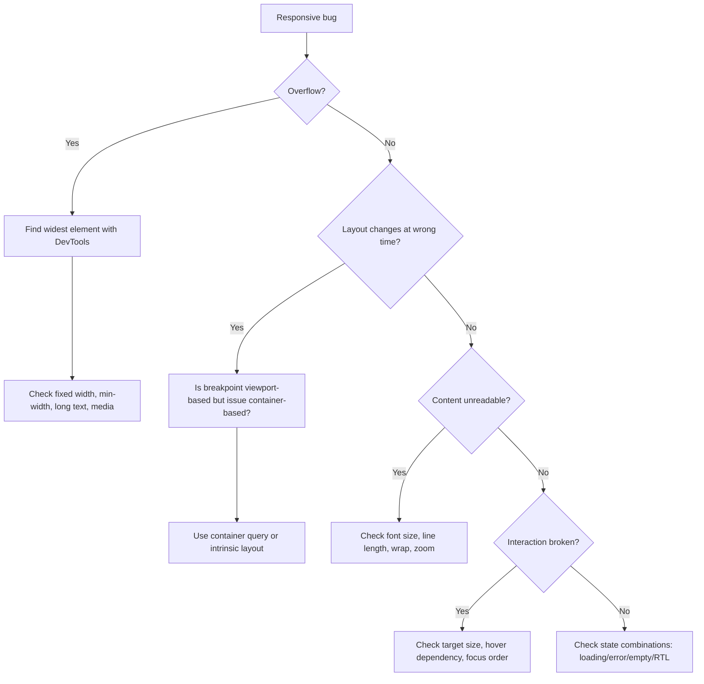

# Part 20 — Responsive Design: Intrinsic Layout, Media Queries, Container Queries, and Fluid Systems

## 1. Tujuan Pembelajaran

Responsive design bukan sekadar “membuat tampilan mobile”. Untuk software engineer, responsive design adalah kemampuan membuat UI yang tetap benar ketika constraints berubah:

- ukuran viewport berbeda,
- container berbeda,
- font user membesar,
- bahasa berubah panjang,
- orientasi berubah,
- input device berbeda,
- density data berubah,
- browser chrome mobile berubah,
- split screen/tablet/foldable muncul,
- komponen dipakai di konteks yang tidak kamu bayangkan.

Setelah part ini, kamu harus mampu:

1. Mendesain layout yang fluid sebelum menambahkan breakpoint.
2. Memilih antara media query dan container query.
3. Menggunakan `min()`, `max()`, `clamp()`, `minmax()`, `auto-fit`, dan `auto-fill` secara tepat.
4. Membuat typography dan spacing yang responsif tanpa breakpoint berlebihan.
5. Memahami viewport units modern seperti `svh`, `lvh`, dan `dvh`.
6. Membuat responsive images yang tidak boros bandwidth.
7. Mendesain responsive component API untuk design system.
8. Menguji responsive UI sebagai failure model, bukan visual check seadanya.

---

## 2. Responsive Design: Masalah Constraint, Bukan Masalah Device

Cara lama berpikir:

> Desktop layout, tablet layout, mobile layout.

Cara engineering yang lebih tepat:

> UI harus memenuhi constraint container, content, interaction, dan accessibility pada berbagai kondisi.

Device categories terlalu kasar. Contoh:

- desktop browser bisa sempit karena side-by-side window,
- tablet bisa besar tapi touch-first,
- mobile landscape bisa lebih lebar dari tablet portrait,
- user bisa zoom sampai 200%,
- enterprise app bisa dibuka di embedded webview,
- sidebar bisa collapse sehingga card punya container sempit meski viewport lebar.

Responsive design modern dimulai dari **intrinsic layout**: biarkan konten dan container bernegosiasi sebanyak mungkin sebelum kamu memaksa breakpoint.

---

## 3. The First Principle: Start Fluid

Sebelum media query, coba gunakan:

- normal flow,
- Flexbox wrapping,
- CSS Grid auto-fit,
- `minmax()`,
- percentage/max-inline-size,
- `clamp()`,
- responsive images,
- logical properties,
- content-aware sizing.

Contoh buruk:

```css
.card-grid {
  display: grid;
  grid-template-columns: repeat(4, 300px);
}
```

Masalah:

- fixed column width,
- overflow pada layar sempit,
- terlalu kaku pada layar lebar,
- butuh banyak breakpoint.

Contoh lebih baik:

```css
.card-grid {
  display: grid;
  grid-template-columns: repeat(auto-fit, minmax(min(100%, 18rem), 1fr));
  gap: 1rem;
}
```

Ini membuat grid beradaptasi berdasarkan ruang yang tersedia.

---

## 4. Viewport, Container, Content

Ada tiga sumber constraint utama:

| Constraint | Contoh | Tool CSS |
|---|---|---|
| Viewport | mobile vs desktop window | media query, viewport units |
| Container | card di sidebar vs main area | container query, container units |
| Content | text panjang, data padat, user zoom | intrinsic sizing, wrap, min/max, overflow strategy |

Responsive bug sering terjadi karena engineer hanya melihat viewport, padahal constraint sebenarnya berasal dari container atau content.

Contoh:

```css
@media (width >= 900px) {
  .case-card {
    grid-template-columns: 1fr auto;
  }
}
```

Ini salah jika `.case-card` bisa muncul di sidebar sempit pada viewport besar. Container query lebih cocok.

---

## 5. Media Queries

Media query merespons karakteristik environment seperti viewport width, pointer type, hover capability, color scheme preference, dan sebagainya.

Contoh width range syntax modern:

```css
.case-layout {
  display: grid;
  gap: 1rem;
}

@media (width >= 64rem) {
  .case-layout {
    grid-template-columns: minmax(0, 1fr) 20rem;
  }
}
```

Gunakan media query untuk keputusan yang memang global terhadap viewport atau user environment:

- app shell berubah dari single-column ke sidebar,
- top navigation menjadi side navigation,
- global page density berubah,
- preferensi user seperti dark mode/reduced motion,
- print layout,
- coarse pointer/touch treatment.

### Common Media Features

```css
@media (prefers-color-scheme: dark) {
  :root {
    color-scheme: dark;
  }
}

@media (prefers-reduced-motion: reduce) {
  *,
  *::before,
  *::after {
    animation-duration: 0.01ms !important;
    animation-iteration-count: 1 !important;
    scroll-behavior: auto !important;
  }
}

@media (hover: hover) and (pointer: fine) {
  .table-row:hover {
    background: var(--surface-hover);
  }
}

@media print {
  .app-sidebar,
  .case-actions {
    display: none;
  }
}
```

### Breakpoints: Content-Driven, Not Device-Driven

Jangan mulai dari daftar device.

Mulai dari pertanyaan:

- pada lebar berapa layout mulai pecah?
- kapan line length terlalu panjang?
- kapan action bar tidak muat?
- kapan table harus berubah strategi?
- kapan sidebar menghabiskan ruang content?

Breakpoints yang baik berasal dari failure point layout.

```css
/* Good: breakpoint berdasarkan kebutuhan layout */
@media (width >= 72rem) {
  .investigation-page {
    grid-template-columns: 16rem minmax(0, 1fr) 22rem;
  }
}
```

Bukan:

```css
/* Fragile: breakpoint berdasarkan nama device */
@media (width >= 768px) {
  /* tablet */
}
```

---

## 6. Container Queries

Container query membuat komponen merespons ukuran ancestor/container, bukan viewport.

Contoh:

```css
.case-card-container {
  container-type: inline-size;
}

.case-card {
  display: grid;
  gap: 0.75rem;
}

@container (inline-size >= 36rem) {
  .case-card {
    grid-template-columns: minmax(0, 1fr) auto;
    align-items: start;
  }
}
```

Sekarang `.case-card` bisa:

- single-column ketika dipakai di sidebar,
- two-column ketika dipakai di main content,
- tetap benar meski viewport besar tetapi container kecil.

### Container Query Ownership

Container query butuh owner eksplisit.

```html
<section class="case-card-container">
  <article class="case-card">
    ...
  </article>
</section>
```

```css
.case-card-container {
  container-type: inline-size;
  container-name: case-card;
}

@container case-card (inline-size >= 36rem) {
  .case-card {
    grid-template-columns: 1fr auto;
  }
}
```

Named container berguna dalam codebase besar agar query tidak ambigu.

### Kapan Pakai Container Query?

Gunakan container query ketika responsivitas adalah sifat komponen.

Contoh:

- card layout,
- data summary widget,
- toolbar action wrapping,
- filter panel,
- dashboard tile,
- timeline item,
- search result item,
- embedded form group.

Gunakan media query ketika responsivitas adalah sifat page/environment.

Contoh:

- app shell,
- sidebar global,
- print,
- reduced motion,
- dark mode,
- viewport-level navigation.

---

## 7. Media Query vs Container Query Decision Tree



---

## 8. Fluid Typography with `clamp()`

Fixed font sizes often create awkward jumps. Fluid typography scales smoothly within boundaries.

```css
:root {
  --font-size-h1: clamp(2rem, 1.5rem + 2vw, 4rem);
  --font-size-h2: clamp(1.5rem, 1.2rem + 1vw, 2.5rem);
  --font-size-body: clamp(1rem, 0.95rem + 0.25vw, 1.125rem);
}

h1 {
  font-size: var(--font-size-h1);
  line-height: 1.1;
}
```

`clamp(min, preferred, max)` berarti:

- jangan lebih kecil dari min,
- idealnya ikuti preferred,
- jangan lebih besar dari max.

Gunakan dengan hati-hati:

- pastikan readability tetap baik,
- jangan membuat body text terlalu kecil,
- test zoom 200%,
- test bahasa dengan kata panjang,
- test line length.

### Fluid Type Berdasarkan Container

Dengan container query units, typography dapat mengikuti container.

```css
.card-shell {
  container-type: inline-size;
}

.card-title {
  font-size: clamp(1rem, 4cqi, 1.5rem);
}
```

`cqi` merujuk pada container query inline size. Ini berguna untuk komponen yang dipakai pada konteks berbeda.

---

## 9. Responsive Spacing

Spacing juga bisa fluid.

```css
:root {
  --space-page: clamp(1rem, 2vw, 3rem);
  --space-section: clamp(1.5rem, 4vw, 5rem);
  --space-card: clamp(1rem, 1.5vw, 1.5rem);
}

.page {
  padding-inline: var(--space-page);
}

.section {
  margin-block: var(--space-section);
}

.card {
  padding: var(--space-card);
}
```

Namun jangan semua nilai dibuat fluid. Gunakan fluid spacing untuk macro layout dan beberapa component padding. Untuk micro spacing, token tetap sering lebih stabil.

Recommended pattern:

```css
:root {
  --space-1: 0.25rem;
  --space-2: 0.5rem;
  --space-3: 0.75rem;
  --space-4: 1rem;
  --space-6: 1.5rem;
  --space-8: 2rem;

  --space-layout: clamp(1rem, 2vw, 3rem);
}
```

---

## 10. Responsive Layout with Grid

Grid sangat kuat untuk responsive layout tanpa breakpoint berlebihan.

### Auto-Fitting Cards

```css
.dashboard-grid {
  display: grid;
  grid-template-columns: repeat(auto-fit, minmax(min(100%, 16rem), 1fr));
  gap: 1rem;
}
```

Makna:

- buat sebanyak mungkin kolom,
- setiap kolom minimal 16rem tetapi tidak melebihi 100%,
- kolom dapat tumbuh dengan `1fr`,
- pada layar sempit tidak overflow.

### App Layout dengan Constraint

```css
.app-main {
  display: grid;
  grid-template-columns:
    minmax(0, 1fr);
  gap: 1rem;
}

@media (width >= 72rem) {
  .app-main {
    grid-template-columns:
      minmax(0, 1fr)
      minmax(18rem, 22rem);
  }
}
```

Gunakan `minmax(0, 1fr)` untuk mencegah content intrinsic width memaksa overflow.

---

## 11. Responsive Layout with Flexbox

Flexbox cocok untuk toolbar, chips, action groups, nav items, dan layout satu dimensi.

```css
.action-bar {
  display: flex;
  flex-wrap: wrap;
  align-items: center;
  justify-content: space-between;
  gap: 0.75rem;
}

.action-bar__primary,
.action-bar__secondary {
  display: flex;
  flex-wrap: wrap;
  gap: 0.5rem;
}
```

Untuk layout yang harus collapse secara elegan:

```css
.media-object {
  display: flex;
  flex-wrap: wrap;
  gap: 1rem;
}

.media-object__content {
  flex: 1 1 20rem;
  min-inline-size: 0;
}

.media-object__aside {
  flex: 0 1 12rem;
}
```

Flexbox bagus ketika urutan utama satu dimensi. Jika kamu mulai mengontrol row dan column sekaligus, Grid biasanya lebih tepat.

---

## 12. Viewport Units Modern

Viewport unit klasik:

- `vw`: 1% viewport width,
- `vh`: 1% viewport height.

Mobile browser membuat `vh` rumit karena address bar dinamis. Unit modern:

- `svh`: small viewport height,
- `lvh`: large viewport height,
- `dvh`: dynamic viewport height.

Contoh modal:

```css
.dialog-panel {
  max-block-size: calc(100dvh - 2rem);
  overflow: auto;
}
```

Contoh full-height shell:

```css
.app-shell {
  min-block-size: 100dvh;
}
```

Gunakan `dvh` ketika layout harus mengikuti viewport dinamis. Gunakan `svh` ketika kamu ingin aman terhadap browser chrome dan menghindari content tertutup.

---

## 13. Responsive Images

Responsive design tidak selesai jika gambar tetap mengirim asset raksasa ke mobile.

### Fluid Image Dasar

```css
img {
  max-inline-size: 100%;
  block-size: auto;
}
```

### Prevent Layout Shift

Set width/height atau aspect ratio:

```html

```

### `srcset` dan `sizes`

```html
= 72rem) 33vw, (width >= 40rem) 50vw, 100vw"
  alt="Evidence photo of storefront signage"
/>
```

`sizes` memberi tahu browser berapa kira-kira ukuran render image. Browser lalu memilih resource paling sesuai dari `srcset`.

### Art Direction dengan `<picture>`

```html
<picture>
  <source media="(width >= 60rem)" srcset="map-wide.jpg" />
  <source media="(width >= 36rem)" srcset="map-medium.jpg" />
  
</picture>
```

Gunakan `<picture>` ketika crop/komposisi gambar berbeda, bukan hanya resolusi berbeda.

---

## 14. Handling Text Overflow Responsively

Teks adalah penyebab responsive bug yang sering diremehkan.

### Long Words

```css
.case-title {
  overflow-wrap: anywhere;
}
```

### Line Length

```css
.prose {
  max-inline-size: 70ch;
}
```

### Truncation

```css
.table-cell--truncate {
  overflow: hidden;
  text-overflow: ellipsis;
  white-space: nowrap;
}
```

Truncation harus punya strategy untuk akses informasi penuh:

- title/tooltip accessible,
- detail page,
- expandable row,
- copy action,
- full text in mobile layout.

Jangan truncate data penting tanpa recovery path.

---

## 15. Responsive Tables

Table data enterprise adalah special case. Jangan langsung mengubah table menjadi cards tanpa memahami semantics.

Strategi:

### 15.1 Horizontal Scroll

```css
.table-scroll {
  overflow-x: auto;
}

.table-scroll table {
  min-inline-size: 48rem;
}
```

Cocok untuk data tabular yang harus mempertahankan perbandingan kolom.

### 15.2 Column Prioritization

```css
@media (width < 48rem) {
  .col-secondary {
    display: none;
  }
}
```

Gunakan hati-hati. Kolom tersembunyi harus tidak krusial atau tersedia di detail row.

### 15.3 Card Transformation

Untuk mobile, beberapa table bisa direpresentasikan sebagai list of records.

```html
<article class="case-record">
  <h3>Case #A-1029</h3>
  <dl>
    <div>
      <dt>Status</dt>
      <dd>Open</dd>
    </div>
    <div>
      <dt>Owner</dt>
      <dd>Review Team A</dd>
    </div>
  </dl>
</article>
```

Tetapi jika user perlu membandingkan banyak row/column, card transformation bisa memperburuk usability.

Decision rule:

- comparison-heavy → horizontal scroll/table tetap,
- record-browsing → card/list bisa cocok,
- action-heavy → list dengan clear primary action,
- dense analyst workflow → desktop-first table + mobile fallback realistis.

---

## 16. Component-Driven Responsive Design

Dalam design system, komponen tidak boleh berasumsi selalu hidup di page tertentu.

Bad:

```css
@media (width >= 1024px) {
  .summary-card {
    grid-template-columns: 1fr auto;
  }
}
```

Good:

```css
.summary-card-shell {
  container-type: inline-size;
}

.summary-card {
  display: grid;
  gap: 0.75rem;
}

@container (inline-size >= 28rem) {
  .summary-card {
    grid-template-columns: 1fr auto;
    align-items: start;
  }
}
```

Komponen sekarang responsif terhadap tempat ia dipasang.

### Component API Pattern

```css
.metric-card {
  --metric-card-density: comfortable;
  container-type: inline-size;

  display: grid;
  gap: var(--space-3);
  padding: var(--space-card);
}

@container (inline-size >= 24rem) {
  .metric-card {
    grid-template-columns: 1fr auto;
  }
}

.metric-card[data-density="compact"] {
  --space-card: var(--space-3);
}
```

Responsive behavior tidak hanya width. Density/state/variant juga bagian dari contract.

---

## 17. Responsive Navigation

Navigation adalah kombinasi layout, information architecture, dan interaction.

Pattern umum:

1. top nav → bottom nav/mobile nav,
2. sidebar collapsible,
3. drawer,
4. priority+ nav,
5. breadcrumb + local nav,
6. command palette/search-first navigation.

Jangan menyembunyikan navigasi penting di hamburger tanpa alasan. Untuk enterprise apps, user sering butuh navigasi cepat dan predictable.

Example shell:

```css
.app-shell {
  display: grid;
  min-block-size: 100dvh;
  grid-template-rows: auto 1fr;
}

.app-body {
  display: grid;
  grid-template-columns: minmax(0, 1fr);
}

@media (width >= 64rem) {
  .app-body {
    grid-template-columns: 16rem minmax(0, 1fr);
  }
}
```

Mobile:

```css
@media (width < 64rem) {
  .app-sidebar {
    display: none;
  }

  .mobile-nav {
    display: flex;
  }
}
```

Butuh accessibility:

- skip link,
- focus management for drawer,
- current page indication,
- keyboard navigation,
- landmark semantics.

---

## 18. Responsive Forms

Forms harus responsive terhadap input method dan content length.

### Two-column to One-column

```css
.form-grid {
  display: grid;
  gap: 1rem;
}

@media (width >= 48rem) {
  .form-grid {
    grid-template-columns: repeat(2, minmax(0, 1fr));
  }

  .form-field--full {
    grid-column: 1 / -1;
  }
}
```

### Better with Container Query

```css
.form-section {
  container-type: inline-size;
}

.form-grid {
  display: grid;
  gap: 1rem;
}

@container (inline-size >= 42rem) {
  .form-grid {
    grid-template-columns: repeat(2, minmax(0, 1fr));
  }
}
```

### Labels

Avoid overly compact label layout on narrow containers.

```css
.field {
  display: grid;
  gap: 0.375rem;
}

@container (inline-size >= 36rem) {
  .field--horizontal {
    grid-template-columns: 12rem minmax(0, 1fr);
    align-items: start;
  }
}
```

Forms are workflows. Responsiveness must preserve:

- label association,
- error visibility,
- focus order,
- submit action visibility,
- touch target size,
- review before destructive action.

---

## 19. Responsive Dashboards

Dashboard layout often fails because cards have different content densities.

Use grid with intrinsic tracks:

```css
.dashboard {
  display: grid;
  grid-template-columns: repeat(auto-fit, minmax(min(100%, 20rem), 1fr));
  gap: 1rem;
  align-items: start;
}
```

For featured panels:

```css
@media (width >= 72rem) {
  .dashboard-card--wide {
    grid-column: span 2;
  }
}
```

Be careful with masonry-like layouts. Visual masonry can break reading order and keyboard order if implemented poorly. For enterprise dashboards, source order should remain meaningful.

---

## 20. Responsive Case Management Screen

Example page:

```html
<main class="case-page">
  <header class="case-header">...</header>
  <section class="case-summary">...</section>
  <section class="case-main">...</section>
  <aside class="case-aside">...</aside>
</main>
```

CSS:

```css
.case-page {
  display: grid;
  gap: 1rem;
  padding: var(--space-layout);
}

.case-header,
.case-summary {
  min-inline-size: 0;
}

@media (width >= 72rem) {
  .case-page {
    grid-template-columns: minmax(0, 1fr) minmax(18rem, 24rem);
  }

  .case-header,
  .case-summary,
  .case-main {
    grid-column: 1;
  }

  .case-aside {
    grid-column: 2;
    grid-row: 1 / span 3;
    align-self: start;
    position: sticky;
    inset-block-start: 1rem;
  }
}
```

Key details:

- `minmax(0, 1fr)` prevents overflow,
- aside sticky only on large viewport,
- source order keeps main content before aside,
- spacing fluid,
- side panel constrained.

---

## 21. Progressive Enhancement

Responsive design should degrade gracefully.

Example:

```css
.card-grid {
  display: grid;
  grid-template-columns: 1fr;
  gap: 1rem;
}

@supports (grid-template-columns: repeat(auto-fit, minmax(16rem, 1fr))) {
  .card-grid {
    grid-template-columns: repeat(auto-fit, minmax(min(100%, 16rem), 1fr));
  }
}
```

Container query fallback:

```css
.summary-card {
  display: grid;
  gap: 0.75rem;
}

@media (width >= 48rem) {
  .summary-card {
    grid-template-columns: 1fr auto;
  }
}

@supports (container-type: inline-size) {
  .summary-card-shell {
    container-type: inline-size;
  }

  @container (inline-size >= 28rem) {
    .summary-card {
      grid-template-columns: 1fr auto;
    }
  }
}
```

Jika menggunakan fallback, pastikan fallback tidak bertentangan dengan enhanced behavior.

---

## 22. Baseline and Browser Support Strategy

Modern CSS cepat berkembang. Jangan hanya bertanya “fitur ini keren?” Tanyakan:

1. Apakah fitur ini tersedia pada browser target?
2. Apakah fitur ini masuk Baseline widely available/newly available?
3. Apakah ada fallback murah?
4. Apakah fitur ini critical path atau enhancement?
5. Apakah test matrix mencakup browser yang relevan?

Contoh decision:

| Feature | Risk | Strategy |
|---|---|---|
| Flexbox/Grid | rendah untuk modern apps | pakai sebagai default |
| Container queries | semakin aman di modern browsers | pakai dengan fallback jika enterprise target lama |
| `:has()` | modern, cek target | pakai untuk enhancement; jangan untuk critical legacy |
| Anchor positioning | cek support aktif | progressive enhancement |
| `dvh` | modern, berguna mobile | fallback `vh`/layout guard |

---

## 23. Responsive Testing Matrix

Minimal test bukan “resize sedikit”. Gunakan matrix.

### Widths

- 320px
- 375px
- 430px
- 768px
- 1024px
- 1280px
- 1440px+

### Conditions

- zoom 200%,
- long text,
- empty states,
- many rows,
- error states,
- loading states,
- RTL direction,
- reduced motion,
- dark mode,
- keyboard only,
- touch target,
- print if relevant.

### Containers

Test component di:

- full page,
- sidebar,
- modal,
- dashboard grid,
- narrow split pane,
- embedded card.

Responsive bugs sering muncul bukan pada viewport width tertentu, tetapi pada kombinasi state + container + content.

---

## 24. Responsive Failure Taxonomy

### 24.1 Horizontal Overflow

Common causes:

- fixed width,
- `min-width` default too large,
- long unbroken text,
- grid/flex item missing `min-width: 0`,
- image not constrained,
- table min width.

Fix candidates:

```css
.container-child {
  min-inline-size: 0;
}

img,
svg,
video {
  max-inline-size: 100%;
}

.long-text {
  overflow-wrap: anywhere;
}
```

### 24.2 Broken Toolbar

Causes:

- no wrapping,
- fixed button group width,
- action labels too long,
- primary/secondary action hierarchy unclear.

Fix:

```css
.toolbar {
  display: flex;
  flex-wrap: wrap;
  gap: 0.5rem;
}
```

### 24.3 Modal Too Tall

Causes:

- fixed height,
- using `100vh` incorrectly on mobile,
- no internal scroll region,
- footer actions not reachable.

Fix:

```css
.dialog {
  max-block-size: calc(100dvh - 2rem);
  overflow: auto;
}
```

### 24.4 Text Becomes Unreadable

Causes:

- font too small,
- line length too long,
- insufficient line height,
- excessive truncation.

Fix:

```css
.prose {
  max-inline-size: 70ch;
  line-height: 1.6;
}
```

### 24.5 Component Looks Good on Page but Fails in Sidebar

Cause:

- viewport media query used for component behavior.

Fix:

- use container query.

---

## 25. Debugging Responsive Layout



---

## 26. Code Review Checklist

Use this checklist for responsive UI PRs:

- Does the layout work before media queries?
- Are breakpoints content-driven?
- Is component responsiveness based on container when appropriate?
- Are Grid/Flex children protected with `min-inline-size: 0` where needed?
- Are images/videos constrained?
- Are long words/IDs handled?
- Is typography readable across widths and zoom?
- Is line length constrained?
- Are touch targets large enough?
- Are hover-only interactions avoided?
- Are sticky/fixed elements tested on mobile?
- Are modal/popover heights using dynamic viewport strategy?
- Are forms usable in one column?
- Are tables given an explicit responsive strategy?
- Is source order meaningful when visual order changes?
- Are RTL/logical properties considered?
- Is print behavior needed?
- Is browser support/Baseline considered?

---

## 27. Practice: 2-Hour Responsive Drill

### Exercise 1 — Fluid Card Grid

Build a card grid with:

- no media query,
- `auto-fit`,
- `minmax()`,
- no horizontal overflow at 320px,
- readable card content.

### Exercise 2 — Container Query Summary Card

Build a summary card that:

- is single-column in narrow container,
- becomes two-column in wide container,
- works inside page main area and sidebar,
- uses named container.

### Exercise 3 — Responsive Case Form

Build a case intake form:

- one-column by default,
- two-column when container allows,
- full-width textarea,
- error messages,
- submit action visible,
- no label/input association broken.

### Exercise 4 — Responsive Table Strategy

Create a case list table.

Implement two strategies:

1. horizontal scroll with preserved table semantics,
2. record-card alternative with `<dl>`.

Write when each is appropriate.

### Exercise 5 — Mobile Modal

Build a dialog:

- max height based on `100dvh`,
- internal scroll,
- sticky footer actions optional,
- no content inaccessible on small screens.

---

## 28. Top 1% Mental Models

### 28.1 Responsive Design Is Constraint Solving

Do not think in devices. Think in constraints:

- available inline size,
- content size,
- interaction type,
- user preferences,
- browser capability,
- information hierarchy.

### 28.2 Breakpoints Are Failure Points

A breakpoint is not where “tablet starts”. It is where the current layout stops satisfying its constraints.

### 28.3 Components Should Respond to Containers

Reusable components should not assume viewport. Container queries are architecture tools, not visual tricks.

### 28.4 Intrinsic Layout Beats Breakpoint Explosion

The best responsive CSS often has fewer media queries because it lets layout algorithms work.

### 28.5 Responsive Includes Accessibility

A layout that looks good but fails zoom, keyboard, touch, screen reader order, or reduced motion is not responsive in the engineering sense.

---

## 29. Ringkasan

Responsive design modern terdiri dari beberapa layer:

1. **Intrinsic layout**: flow, Grid, Flexbox, min/max constraints.
2. **Fluid systems**: `clamp()`, responsive spacing, fluid type.
3. **Media queries**: environment dan viewport-level decisions.
4. **Container queries**: component-level decisions.
5. **Responsive assets**: image/video sizing and bandwidth.
6. **Interaction responsiveness**: touch, keyboard, hover, motion preferences.
7. **Testing matrix**: width, zoom, content, state, browser, accessibility.

Jika kamu hanya menghafal breakpoints, kamu akan terus patch UI. Jika kamu memahami constraints, kamu bisa merancang UI yang tetap stabil ketika produk berubah.

---

## 30. Referensi

- web.dev — Media queries: https://web.dev/learn/design/media-queries
- web.dev — Container queries: https://web.dev/learn/css/container-queries
- web.dev — min(), max(), and clamp(): https://web.dev/articles/min-max-clamp
- web.dev — The new responsive: https://web.dev/articles/new-responsive
- MDN — CSS container queries: https://developer.mozilla.org/en-US/docs/Web/CSS/Guides/Containment/Container_queries
- MDN — CSS media queries: https://developer.mozilla.org/en-US/docs/Web/CSS/CSS_media_queries
- MDN — Responsive images: https://developer.mozilla.org/en-US/docs/Learn_web_development/Core/HTML/Responsive_images
- MDN — Viewport concepts: https://developer.mozilla.org/en-US/docs/Web/CSS/Viewport_concepts
- MDN — CSS values and units: https://developer.mozilla.org/en-US/docs/Web/CSS/CSS_values_and_units
