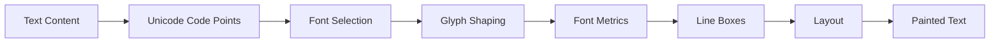
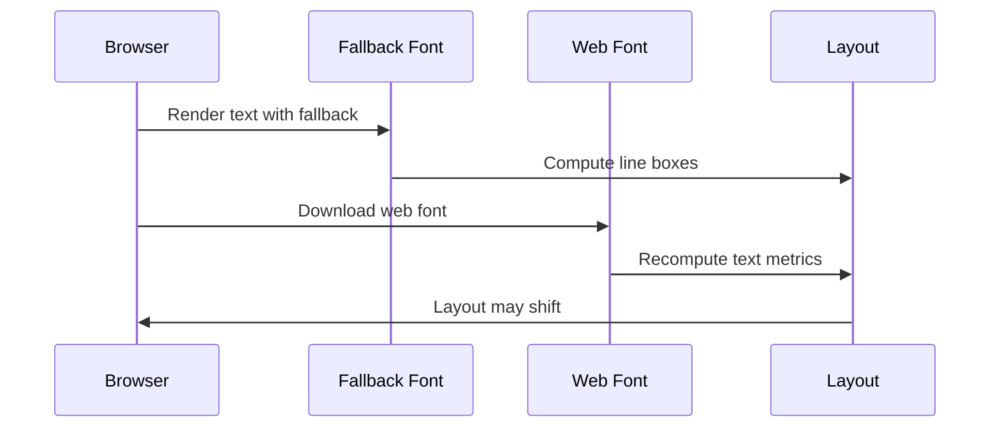
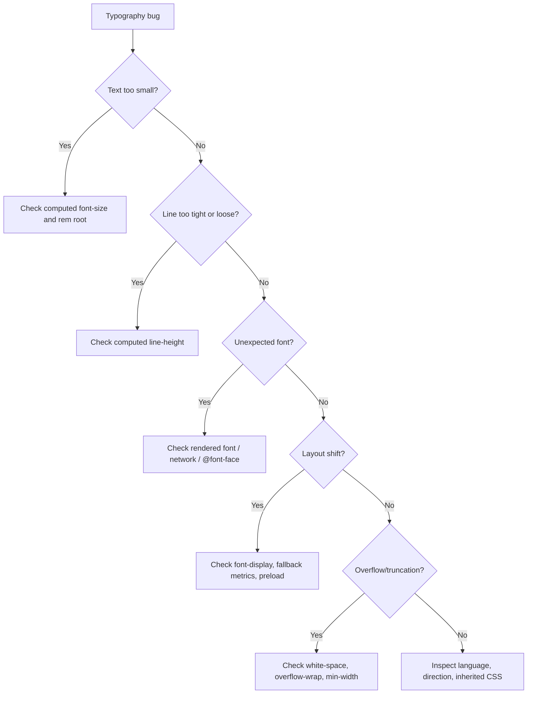

# Part 21 — Typography Engineering: Fonts, Text Metrics, Readability, and Internationalization

Typography di web bukan sekadar memilih font yang terlihat bagus. Untuk software engineer, typography adalah sistem rendering teks yang harus memenuhi beberapa invariant sekaligus:

1. **Readable**: teks bisa dibaca cepat, lama, dan tanpa cognitive load berlebihan.
2. **Accessible**: ukuran, kontras, spacing, focus, dan layout tidak menghalangi pengguna.
3. **Responsive**: teks tetap stabil dari mobile sampai desktop, dari narrow container sampai dense dashboard.
4. **Internationalized**: sistem tidak rusak saat bahasa, script, arah teks, atau panjang string berubah.
5. **Performant**: font tidak menyebabkan blank text, layout shift besar, atau blocking yang tidak perlu.
6. **Maintainable**: typography tidak tersebar sebagai angka acak di seluruh codebase.

Di sistem enterprise, masalah typography biasanya tidak muncul sebagai “font jelek”. Ia muncul sebagai:

- tabel terlalu padat dan sulit dipindai,
- label form tidak jelas hubungannya dengan input,
- status dan angka tidak sejajar,
- teks panjang merusak card,
- dark mode terasa kabur,
- layout shift karena web font terlambat,
- UI gagal saat bahasa Jerman/Indonesia/Arab/Jepang,
- komponen berbeda memakai ukuran teks yang hampir sama tapi tidak konsisten.

Part ini membangun typography sebagai **engineering discipline**.

---

## 1. Target Skill

Setelah menyelesaikan part ini, kamu harus bisa:

- mendesain font stack yang resilient,
- memakai `@font-face` dengan benar,
- memilih strategi `font-display`,
- memahami dampak font loading ke rendering dan layout shift,
- membangun type scale dengan custom properties,
- menggunakan `line-height`, `max-width`, `ch`, dan spacing untuk readability,
- menerapkan fluid typography dengan `clamp()`,
- mengelola wrapping, truncation, dan overflow teks,
- memakai variable fonts secara pragmatis,
- mengantisipasi bahasa panjang, RTL, CJK, angka tabular, dan writing modes,
- melakukan debugging typography dengan DevTools.

> Ukuran keberhasilan bukan “hafal properti font”. Ukuran keberhasilan adalah kamu bisa membuat teks dalam UI tetap terbaca, stabil, dan konsisten dalam kondisi nyata.

---

## 2. Kaufman Deconstruction

Berdasarkan pendekatan *The First 20 Hours*, typography didekonstruksi menjadi sub-skill kecil berikut.

```mermaid
flowchart TD
    A[Typography Engineering] --> B[Font Selection]
    A --> C[Font Loading]
    A --> D[Text Metrics]
    A --> E[Readable Layout]
    A --> F[Responsive Type]
    A --> G[Internationalization]
    A --> H[Accessibility]
    A --> I[Debugging]

    B --> B1[System Font Stack]
    B --> B2[Brand/Web Font]
    B --> B3[Fallback Strategy]

    C --> C1[@font-face]
    C --> C2[font-display]
    C --> C3[Preload Trade-off]

    D --> D1[Font Size]
    D --> D2[Line Height]
    D --> D3[Weight]
    D --> D4[Letter Spacing]

    E --> E1[Measure]
    E --> E2[Paragraph Rhythm]
    E --> E3[Hierarchy]

    F --> F1[clamp]
    F --> F2[Container-aware Type]

    G --> G1[Long Words]
    G --> G2[RTL]
    G --> G3[CJK]
    G --> G4[Tabular Numbers]
```

Untuk 20 jam pertama, jangan mulai dari “font pairing”. Mulai dari **invariant text rendering**:

- body text terbaca,
- heading punya hierarchy,
- line-height tidak saling bertabrakan,
- angka sejajar,
- teks panjang tidak menghancurkan layout,
- font loading tidak menciptakan blank page atau layout shift besar.

---

## 3. Mental Model: Browser Merender Teks Dengan Font Metrics

Browser tidak menggambar huruf berdasarkan “tinggi visual yang kamu lihat”. Browser memakai font metrics: ascent, descent, line gap, em square, glyph bounds, dan shaping engine.



Konsekuensinya:

- dua font dengan `font-size: 16px` bisa terlihat berbeda tinggi,
- fallback font bisa membuat layout berubah saat web font selesai dimuat,
- `line-height: normal` berbeda antar font,
- glyph tertentu bisa keluar dari box yang kamu kira,
- bahasa berbeda dapat membutuhkan line-height berbeda,
- angka dalam tabel bisa terlihat “lompat” jika proportional numerals dipakai.

Typography engineering adalah seni mengendalikan ketidakpastian ini.

---

## 4. CSS Font Properties: Peta Dasar

Properti font utama:

```css
.example {
  font-family: Inter, ui-sans-serif, system-ui, sans-serif;
  font-size: 1rem;
  font-weight: 400;
  font-style: normal;
  line-height: 1.5;
  letter-spacing: normal;
}
```

Shorthand `font` bisa mengatur banyak properti sekaligus:

```css
.example {
  font: 400 1rem/1.5 Inter, ui-sans-serif, system-ui, sans-serif;
}
```

Namun untuk design system dan review readability, longhand sering lebih jelas.

### Practical rule

Gunakan shorthand `font` hanya ketika kamu benar-benar ingin reset seluruh font-related declaration. Untuk komponen, longhand biasanya lebih aman karena tidak diam-diam mengubah `line-height`, `font-style`, atau `font-variant`.

---

## 5. Font Family Strategy

Ada tiga strategi besar.

### 5.1 System font stack

```css
:root {
  --font-sans: ui-sans-serif, system-ui, -apple-system, BlinkMacSystemFont,
    "Segoe UI", sans-serif;
  --font-serif: ui-serif, Georgia, Cambria, "Times New Roman", Times, serif;
  --font-mono: ui-monospace, SFMono-Regular, Menlo, Monaco, Consolas,
    "Liberation Mono", "Courier New", monospace;
}

body {
  font-family: var(--font-sans);
}
```

Kelebihan:

- cepat,
- tidak perlu download font,
- cocok dengan OS user,
- risiko layout shift lebih kecil,
- bagus untuk internal tools dan enterprise dashboards.

Kekurangan:

- visual identity kurang unik,
- perbedaan antar OS lebih besar.

### 5.2 Web font stack

```css
@font-face {
  font-family: "InterVariable";
  src: url("/fonts/inter-var.woff2") format("woff2");
  font-weight: 100 900;
  font-style: normal;
  font-display: swap;
}

:root {
  --font-sans: "InterVariable", ui-sans-serif, system-ui, sans-serif;
}
```

Kelebihan:

- visual consistency lebih tinggi,
- brand expression lebih kuat,
- bisa memakai variable axes.

Kekurangan:

- butuh strategi loading,
- bisa memicu layout shift,
- bisa memperlambat first render,
- perlu lisensi dan subsetting.

### 5.3 Hybrid strategy

Paling umum di produk modern:

- system font untuk internal/admin tools,
- brand web font untuk marketing/public pages,
- monospaced stack untuk code, IDs, logs, hashes, case numbers,
- tabular numeric feature untuk angka penting.

---

## 6. Font Stack as Resilience Mechanism

Font stack adalah fallback chain.

```css
body {
  font-family: "BrandSans", "Segoe UI", Roboto, Helvetica, Arial, sans-serif;
}
```

Browser akan memilih font pertama yang tersedia dan memiliki glyph untuk karakter tertentu. Jika font utama tidak punya glyph Jepang, Arab, emoji, atau simbol tertentu, browser bisa mengambil glyph dari fallback lain.

### Bad assumption

```css
body {
  font-family: "BrandSans";
}
```

Ini rapuh karena:

- jika font gagal dimuat, browser fallback default bisa tidak sesuai,
- glyph missing bisa terlihat sebagai tofu box,
- UI antar platform tidak terkendali.

### Better invariant

Selalu tutup stack dengan generic family:

```css
font-family: "BrandSans", ui-sans-serif, system-ui, sans-serif;
```

---

## 7. `@font-face` as Font Resource Contract

`@font-face` memberitahu browser:

- nama font family internal CSS,
- file font yang bisa diambil,
- range weight/style yang disediakan,
- strategi display saat font belum siap.

```css
@font-face {
  font-family: "Acme Sans";
  src:
    url("/fonts/acme-sans.woff2") format("woff2");
  font-weight: 400;
  font-style: normal;
  font-display: swap;
}
```

Untuk variable font:

```css
@font-face {
  font-family: "Acme Sans Variable";
  src: url("/fonts/acme-sans-variable.woff2") format("woff2");
  font-weight: 300 800;
  font-style: normal;
  font-display: swap;
}
```

### Common mistake

```css
@font-face {
  font-family: "Acme Sans";
  src: url("/fonts/acme-regular.woff2") format("woff2");
}

.card-title {
  font-weight: 700;
}
```

Jika kamu hanya mendefinisikan regular weight tetapi meminta `700`, browser bisa:

- mensintesis bold,
- memakai fallback,
- menghasilkan render yang tidak sesuai desain.

### Better

Definisikan weight yang tersedia:

```css
@font-face {
  font-family: "Acme Sans";
  src: url("/fonts/acme-regular.woff2") format("woff2");
  font-weight: 400;
  font-style: normal;
  font-display: swap;
}

@font-face {
  font-family: "Acme Sans";
  src: url("/fonts/acme-bold.woff2") format("woff2");
  font-weight: 700;
  font-style: normal;
  font-display: swap;
}
```

---

## 8. `font-display`: FOIT, FOUT, and Real Product Trade-offs

Saat web font belum tersedia, browser harus memilih apa yang dilakukan terhadap teks.

Istilah penting:

- **FOIT**: Flash of Invisible Text.
- **FOUT**: Flash of Unstyled Text.
- **FOFT**: Flash of Faux Text or Flash of Fallback Text before font swap.

`font-display` mengatur perilaku display font face.

```css
@font-face {
  font-family: "Acme Sans";
  src: url("/fonts/acme.woff2") format("woff2");
  font-display: swap;
}
```

Pilihan umum:

| Value | Perilaku Praktis | Cocok Untuk |
|---|---|---|
| `auto` | Browser default | Jangan jadikan strategi eksplisit |
| `block` | Teks bisa invisible sementara | Logo/brand display text, jarang untuk body |
| `swap` | Fallback muncul cepat, lalu swap | Body text, admin app, content-heavy UI |
| `fallback` | Fallback muncul, swap window terbatas | Kompromi antara stability dan brand |
| `optional` | Font boleh tidak dipakai jika lambat | Performance-first pages |

### Practical default

Untuk aplikasi dan konten:

```css
font-display: swap;
```

Alasannya: teks terlihat lebih cepat. Trade-off-nya: jika metrics fallback berbeda jauh, swap bisa menimbulkan layout shift.

---

## 9. Font Loading and Layout Shift

Masalah font loading bukan hanya network. Masalah utamanya adalah **metrics mismatch**.



Jika fallback font lebih lebar dari web font, layout bisa menyusut. Jika fallback lebih sempit, layout bisa melebar. Pada card, nav, table, dan button, ini bisa terlihat sebagai CLS atau jank.

### Mitigation checklist

- Gunakan fallback yang metrics-nya mirip.
- Preload hanya font yang benar-benar critical.
- Batasi jumlah weight/style.
- Pakai variable font jika lebih efisien daripada banyak file statis.
- Pakai `font-display` secara sadar.
- Set width/height/layout constraints agar teks tidak mengubah struktur besar.
- Test cold cache.

### Preload with caution

```html
<link
  rel="preload"
  href="/fonts/acme-sans-variable.woff2"
  as="font"
  type="font/woff2"
  crossorigin
/>
```

Preload mempercepat resource penting, tapi jika terlalu banyak dipakai, ia mencuri bandwidth dari resource lain. Preload font sebaiknya untuk font above-the-fold yang benar-benar dipakai pada initial render.

---

## 10. Type Scale: Jangan Sebar Angka Acak

Bad CSS:

```css
.card-title { font-size: 17px; }
.modal-title { font-size: 18px; }
.panel-title { font-size: 17.5px; }
.sidebar-title { font-size: 16px; }
```

Ini sulit dirawat karena tidak ada sistem.

Better:

```css
:root {
  --text-xs: 0.75rem;
  --text-sm: 0.875rem;
  --text-md: 1rem;
  --text-lg: 1.125rem;
  --text-xl: 1.25rem;
  --text-2xl: 1.5rem;
  --text-3xl: 1.875rem;

  --leading-tight: 1.2;
  --leading-normal: 1.5;
  --leading-relaxed: 1.65;
}

body {
  font-size: var(--text-md);
  line-height: var(--leading-normal);
}

.card__title {
  font-size: var(--text-lg);
  line-height: var(--leading-tight);
}
```

### Type scale invariant

Setiap ukuran harus punya fungsi:

| Token | Fungsi |
|---|---|
| `--text-xs` | metadata, timestamp, helper tersembunyi secara visual |
| `--text-sm` | labels, compact table text, secondary text |
| `--text-md` | body, form input, default UI text |
| `--text-lg` | card title, section title |
| `--text-xl` | page subsection heading |
| `--text-2xl+` | page title, marketing heading |

Jangan membuat ukuran baru karena “terlihat kurang pas”. Buat ukuran baru hanya jika ada role visual baru yang berulang.

---

## 11. `rem`, `em`, `px`, and User Preference

### `rem`

`rem` relatif terhadap root font size.

```css
body {
  font-size: 1rem;
}
```

Gunakan `rem` untuk typography scale agar menghormati user preference.

### `em`

`em` relatif terhadap font size elemen saat ini.

```css
.button {
  font-size: var(--text-sm);
  padding: 0.5em 0.875em;
}
```

Bagus untuk padding komponen yang ingin ikut membesar saat font size berubah.

### `px`

Gunakan `px` untuk border hairline, shadow, atau detail visual kecil. Hindari hard-code body text dengan `px` jika bisa menghalangi user scaling.

---

## 12. Line Height: Property Kecil, Dampak Besar

`line-height` menentukan tinggi line box.

```css
body {
  line-height: 1.5;
}
```

Gunakan unitless line-height agar diwariskan sebagai multiplier, bukan fixed computed length.

Bad:

```css
body {
  line-height: 24px;
}
```

Jika child text lebih besar, line-height fixed bisa terlalu sempit.

Better:

```css
body {
  line-height: 1.5;
}
```

### Rule of thumb

| Text Type | Typical Line Height |
|---|---:|
| Dense table | 1.25–1.4 |
| Form/input UI | 1.3–1.5 |
| Body paragraph | 1.5–1.75 |
| Large heading | 1.05–1.25 |
| Small helper text | 1.4–1.6 |

### Why heading line-height smaller?

Heading biasanya lebih besar dan pendek. Jika memakai `line-height: 1.5`, heading multi-line akan terlihat terlalu renggang.

```css
h1, h2, h3 {
  line-height: 1.15;
}
```

---

## 13. Measure: Panjang Baris yang Bisa Dibaca

Measure adalah panjang baris teks. Body text yang terlalu panjang membuat mata sulit menemukan baris berikutnya.

Gunakan `ch` untuk membatasi teks panjang:

```css
.prose {
  max-width: 68ch;
}
```

`ch` kira-kira mengikuti lebar glyph `0` pada font saat ini. Ini tidak sempurna untuk semua script, tapi praktis untuk Latin-based prose.

### Enterprise implication

Jangan biarkan field description, audit note, atau policy explanation memenuhi seluruh layar 1440px.

Bad:

```css
.case-description {
  width: 100%;
}
```

Better:

```css
.case-description {
  max-width: 72ch;
}
```

Jika dalam dashboard, card bisa lebar, tetapi paragraph di dalamnya tetap perlu measure.

---

## 14. Typography Hierarchy

Hierarchy membantu user memindai halaman.

```css
.page-title {
  font-size: var(--text-3xl);
  line-height: 1.1;
  font-weight: 700;
}

.section-title {
  font-size: var(--text-xl);
  line-height: 1.2;
  font-weight: 650;
}

.card-title {
  font-size: var(--text-lg);
  line-height: 1.25;
  font-weight: 600;
}

.meta {
  font-size: var(--text-sm);
  line-height: 1.4;
  color: var(--color-text-muted);
}
```

Hierarchy bukan hanya ukuran. Ia bisa dibangun dari:

- font size,
- font weight,
- color,
- spacing,
- position,
- grouping,
- line-height,
- capitalization.

### Avoid fake hierarchy

```css
.label {
  text-transform: uppercase;
  letter-spacing: 0.2em;
  font-size: 10px;
}
```

Ini sering terlihat “designy”, tetapi bisa menurunkan readability. Gunakan uppercase hati-hati, terutama untuk teks panjang atau localization.

---

## 15. Responsive and Fluid Typography

Hard-coded breakpoints dapat menciptakan lompatan ukuran.

```css
h1 {
  font-size: 2rem;
}

@media (min-width: 64rem) {
  h1 {
    font-size: 3.5rem;
  }
}
```

Lebih fluid:

```css
h1 {
  font-size: clamp(2rem, 4vw + 1rem, 4rem);
  line-height: 1.05;
}
```

Untuk UI app, jangan terlalu agresif. Body text biasanya tidak perlu fluid besar.

```css
:root {
  --text-page-title: clamp(1.75rem, 1.25rem + 1.5vw, 3rem);
  --text-section-title: clamp(1.25rem, 1.1rem + 0.6vw, 1.75rem);
}
```

### Practical rule

- Fluid typography cocok untuk page title, marketing hero, article heading.
- Body text sebaiknya stabil.
- Table text dan form label harus predictable.
- Jangan membuat semua token fluid.

---

## 16. Container-Aware Typography

Viewport tidak selalu mewakili ukuran komponen.

Contoh: card sempit di desktop sidebar tetap butuh typography compact walau viewport besar.

```css
.card-list {
  container-type: inline-size;
}

.card-title {
  font-size: var(--text-md);
}

@container (min-width: 32rem) {
  .card-title {
    font-size: var(--text-lg);
  }
}
```

Gunakan container queries untuk typography komponen yang benar-benar dipengaruhi lebar container.

---

## 17. Text Wrapping and Overflow

Teks nyata tidak sopan. Ia bisa panjang, tidak punya spasi, berisi URL, hash, email, kode kasus, nama legal entity, atau bahasa yang lebih panjang dari English.

### Safe defaults

```css
.text-content {
  overflow-wrap: break-word;
}
```

Untuk URL atau token panjang:

```css
.long-token {
  overflow-wrap: anywhere;
}
```

Untuk heading, gunakan balance jika sesuai dan tersedia:

```css
.heading {
  text-wrap: balance;
}
```

Untuk paragraph, wrapping stabil lebih penting daripada estetika.

### Truncation single-line

```css
.truncate {
  overflow: hidden;
  white-space: nowrap;
  text-overflow: ellipsis;
}
```

Gunakan hanya jika full text tersedia lewat pattern lain, misalnya title attribute bukan solusi accessibility ideal; lebih baik menyediakan detail view, expandable text, atau accessible label yang lengkap.

### Multi-line clamp

```css
.summary {
  display: -webkit-box;
  -webkit-line-clamp: 3;
  -webkit-box-orient: vertical;
  overflow: hidden;
}
```

Cocok untuk preview, bukan untuk data kritis.

### Enterprise rule

Jangan truncate informasi hukum, status enforcement, due date, legal entity name, atau action reason tanpa akses jelas ke versi penuh.

---

## 18. Numbers, Tables, IDs, and Monospace Usage

Angka di tabel harus mudah dibandingkan.

```css
.numeric {
  font-variant-numeric: tabular-nums;
  text-align: right;
}
```

Untuk ID, hash, log, dan code:

```css
.code-token {
  font-family: var(--font-mono);
  font-size: 0.95em;
}
```

Gunakan monospace untuk:

- case ID,
- transaction ID,
- hash,
- log excerpt,
- code snippet,
- machine-generated token.

Jangan gunakan monospace untuk semua data hanya karena terlihat “technical”. Monospace lebih lebar dan bisa menurunkan density.

---

## 19. Variable Fonts

Variable font memungkinkan banyak variasi dalam satu file font, misalnya weight, width, slant, optical size.

```css
@font-face {
  font-family: "Acme VF";
  src: url("/fonts/acme-vf.woff2") format("woff2");
  font-weight: 300 800;
  font-style: normal;
  font-display: swap;
}
```

Lalu:

```css
.card-title {
  font-family: "Acme VF", system-ui, sans-serif;
  font-weight: 650;
}
```

Gunakan high-level properties (`font-weight`, `font-stretch`, `font-style`) jika tersedia. Pakai `font-variation-settings` untuk axis khusus atau saat tidak ada property higher-level.

```css
.logo {
  font-variation-settings: "wght" 720, "wdth" 95;
}
```

### Variable font trade-off

Kelebihan:

- satu file bisa menggantikan banyak weight,
- transisi weight lebih halus,
- bagus untuk design system.

Risiko:

- satu file variable bisa tetap besar,
- axis tidak selalu didukung oleh semua font,
- penggunaan bebas weight bisa merusak type scale,
- desain bisa menjadi terlalu banyak variasi.

### Engineering rule

Variable font bukan izin memakai `font-weight: 537`. Tetap batasi token weight.

```css
:root {
  --weight-regular: 400;
  --weight-medium: 500;
  --weight-semibold: 600;
  --weight-bold: 700;
}
```

---

## 20. Letter Spacing

`letter-spacing` harus dipakai hati-hati.

```css
.eyebrow {
  font-size: var(--text-xs);
  letter-spacing: 0.08em;
  text-transform: uppercase;
}
```

Cocok untuk short label seperti “DASHBOARD”, “AUDIT”, “SYSTEM”. Tidak cocok untuk paragraph panjang.

### Avoid

```css
body {
  letter-spacing: 0.04em;
}
```

Ini dapat menurunkan readability dan merusak metrics lintas bahasa.

---

## 21. Text Transform and Localization

```css
.badge {
  text-transform: uppercase;
}
```

Risiko:

- beberapa bahasa punya aturan casing berbeda,
- uppercase bisa lebih sulit dibaca,
- teks panjang menjadi terlalu dominan,
- screen reader bisa membaca akronim berbeda tergantung konteks.

Untuk status token internal, lebih baik backend/design system menyediakan label final:

```html
<span class="status-badge">Under Review</span>
```

Bukan:

```html
<span class="status-badge">under_review</span>
```

lalu dipaksa dengan CSS.

---

## 22. Internationalization Typography

Internationalization bukan hanya translation. Ia memengaruhi layout dan typography.

### Long words

German, Indonesian legal terms, dan nama organisasi bisa panjang.

```css
.entity-name {
  overflow-wrap: break-word;
}
```

### CJK text

Chinese/Japanese/Korean tidak selalu memakai spasi seperti Latin text. Wrapping behavior berbeda.

```css
.article {
  line-break: auto;
  word-break: normal;
}
```

Hindari `word-break: break-all` sebagai default global karena bisa merusak readability.

### RTL

Untuk Arabic/Hebrew, arah teks bisa kanan ke kiri.

HTML:

```html
<html lang="ar" dir="rtl">
```

CSS:

```css
.card {
  padding-inline: 1rem;
  border-inline-start: 4px solid var(--color-accent);
}
```

Gunakan logical properties:

- `margin-inline-start`
- `padding-inline-end`
- `border-block-start`
- `inset-inline-end`
- `text-align: start`

Bukan:

- `margin-left`
- `padding-right`
- `border-top` jika maksudnya block-start
- `text-align: left`

### Mixed direction text

Case ID, English product name, angka, dan Arabic text bisa bercampur. Gunakan `dir="auto"` untuk user-generated text bila arah tidak diketahui.

```html
<p dir="auto">{{ userGeneratedComment }}</p>
```

---

## 23. Typography in Forms

Form typography harus mengoptimalkan kejelasan, bukan gaya.

```css
.form-field {
  display: grid;
  gap: 0.375rem;
}

.form-label {
  font-size: var(--text-sm);
  font-weight: var(--weight-medium);
  line-height: 1.35;
}

.form-hint,
.form-error {
  font-size: var(--text-sm);
  line-height: 1.45;
}

.input {
  font: inherit;
  line-height: 1.5;
}
```

### Important

Set `font: inherit` pada form controls jika ingin konsisten.

```css
button,
input,
select,
textarea {
  font: inherit;
}
```

Browser default form control font bisa berbeda dari body.

---

## 24. Typography in Data Tables

Data table butuh density, scanability, dan alignment.

```css
.data-table {
  font-size: var(--text-sm);
  line-height: 1.35;
}

.data-table th {
  font-weight: var(--weight-semibold);
  text-align: start;
}

.data-table .number {
  text-align: end;
  font-variant-numeric: tabular-nums;
}

.data-table .case-id {
  font-family: var(--font-mono);
  font-size: 0.95em;
}
```

### Table typography invariant

- Header lebih kuat dari cell, tetapi tidak berteriak.
- Angka sejajar kanan.
- ID memakai mono jika membantu scanning.
- Row height cukup untuk focus outline dan touch/click target bila interaktif.
- Helper text tidak mengalahkan primary cell value.

---

## 25. Typography Tokens for Design Systems

Gunakan token berdasarkan role, bukan hanya ukuran.

```css
:root {
  --font-family-body: ui-sans-serif, system-ui, sans-serif;
  --font-family-mono: ui-monospace, SFMono-Regular, Menlo, monospace;

  --font-size-body: 1rem;
  --font-size-label: 0.875rem;
  --font-size-caption: 0.75rem;
  --font-size-card-title: 1.125rem;
  --font-size-page-title: clamp(1.75rem, 1.25rem + 1.5vw, 3rem);

  --line-height-body: 1.5;
  --line-height-heading: 1.15;
  --line-height-compact: 1.3;

  --font-weight-regular: 400;
  --font-weight-medium: 500;
  --font-weight-semibold: 600;
  --font-weight-bold: 700;
}
```

Role-based token lebih stabil saat desain berubah.

Bad:

```css
--font-size-17: 17px;
```

Better:

```css
--font-size-card-title: 1.125rem;
```

---

## 26. A Practical Typography Base Layer

```css
@layer base {
  :root {
    --font-sans: ui-sans-serif, system-ui, -apple-system, BlinkMacSystemFont,
      "Segoe UI", sans-serif;
    --font-mono: ui-monospace, SFMono-Regular, Menlo, Monaco, Consolas,
      "Liberation Mono", "Courier New", monospace;

    --text-xs: 0.75rem;
    --text-sm: 0.875rem;
    --text-md: 1rem;
    --text-lg: 1.125rem;
    --text-xl: 1.25rem;
    --text-2xl: 1.5rem;
    --text-3xl: clamp(1.875rem, 1.2rem + 2vw, 3rem);

    --leading-tight: 1.15;
    --leading-snug: 1.3;
    --leading-normal: 1.5;
    --leading-relaxed: 1.65;

    --weight-regular: 400;
    --weight-medium: 500;
    --weight-semibold: 600;
    --weight-bold: 700;
  }

  html {
    font-family: var(--font-sans);
    line-height: var(--leading-normal);
    -webkit-text-size-adjust: 100%;
    text-size-adjust: 100%;
  }

  body {
    margin: 0;
    font-size: var(--text-md);
    line-height: var(--leading-normal);
  }

  h1,
  h2,
  h3,
  h4 {
    line-height: var(--leading-tight);
    text-wrap: balance;
  }

  p,
  li {
    max-width: 72ch;
  }

  code,
  kbd,
  samp,
  pre {
    font-family: var(--font-mono);
  }

  button,
  input,
  select,
  textarea {
    font: inherit;
  }
}
```

Catatan: `text-wrap: balance` bagus untuk heading, tetapi jangan dipakai sembarangan untuk semua paragraph panjang.

---

## 27. Debugging Typography With DevTools

Gunakan proses berikut.



### DevTools questions

- Font apa yang benar-benar dipakai?
- Rule mana yang menentukan `font-size`?
- Apakah line-height inherited atau overridden?
- Apakah web font loaded atau fallback?
- Apakah width container terlalu sempit?
- Apakah parent flex/grid item butuh `min-width: 0`?
- Apakah `white-space: nowrap` datang dari utility class?
- Apakah truncation menyembunyikan data kritis?

---

## 28. Common Failure Modes

### 28.1 Global font size reset berbahaya

```css
html {
  font-size: 62.5%;
}
```

Pattern ini populer untuk membuat `1rem = 10px`, tetapi bisa mengganggu ekspektasi user dan library. Untuk engineer modern, benefit-nya kecil dibanding risiko.

### 28.2 Body text terlalu kecil

```css
body {
  font-size: 13px;
}
```

Ini sering terjadi pada enterprise app karena ingin dense. Density yang baik tidak dicapai dengan mengecilkan semua teks. Gunakan hierarchy, spacing, grouping, dan table density mode.

### 28.3 Semua heading pakai visual class tanpa semantic heading

```html
<div class="heading-xl">Case Detail</div>
```

Visual typography tidak menggantikan semantic HTML. Gunakan heading element yang benar.

### 28.4 Truncation sebagai default

```css
* {
  text-overflow: ellipsis;
}
```

Ini buruk. Truncation adalah product decision, bukan global reset.

### 28.5 Terlalu banyak font weights

```css
font-weight: 425;
font-weight: 500;
font-weight: 575;
font-weight: 620;
font-weight: 700;
```

Jika semua weight dipakai, tidak ada hierarchy yang jelas.

---

## 29. Typography Review Checklist

Gunakan checklist ini saat code review.

### Font loading

- [ ] Font stack punya fallback generic.
- [ ] `@font-face` mendefinisikan weight/style yang benar.
- [ ] `font-display` dipilih secara sadar.
- [ ] Tidak terlalu banyak font file critical.
- [ ] Preload hanya untuk font critical.
- [ ] Cold cache sudah diuji.

### Readability

- [ ] Body text minimal nyaman dibaca.
- [ ] Line-height sesuai jenis teks.
- [ ] Paragraph punya max measure.
- [ ] Heading hierarchy jelas.
- [ ] Small text tidak dipakai untuk informasi utama.

### Layout resilience

- [ ] Teks panjang tidak merusak card/table/form.
- [ ] URL/token panjang bisa wrap.
- [ ] Truncation hanya untuk informasi non-critical atau preview.
- [ ] Full value tetap bisa diakses.
- [ ] Flex/grid item memakai `min-width: 0` saat perlu.

### Internationalization

- [ ] Tidak mengasumsikan panjang English.
- [ ] Logical properties dipakai untuk layout directional.
- [ ] `dir="auto"` dipertimbangkan untuk user-generated text.
- [ ] CJK/RTL/long words diuji minimal smoke test.

### Accessibility

- [ ] Text bisa zoom tanpa overlap.
- [ ] Focus outline tidak terpotong oleh line-height/overflow.
- [ ] Typography tidak hanya mengandalkan warna untuk hierarchy.
- [ ] Contrast akan dicek di Part 22.

---

## 30. Practice: 90-Minute Typography Drill

Bangun halaman “Case Detail” kecil dengan requirements berikut.

### HTML content

- page title,
- case ID,
- status,
- due date,
- legal entity name panjang,
- paragraph description 2–3 paragraf,
- evidence table berisi angka,
- audit log dengan timestamp dan actor,
- form action dengan label, hint, dan error.

### CSS requirements

- system font stack,
- mono font untuk ID/log/token,
- type scale berbasis custom properties,
- body line-height unitless,
- heading `text-wrap: balance`,
- paragraph max-width `ch`,
- number cells pakai `tabular-nums`,
- long text tidak overflow,
- form controls inherit font,
- responsive layout tetap terbaca di 320px, 768px, dan 1280px.

### Test data

Gunakan data kasar:

```text
PT Internasional Manufaktur Infrastruktur dan Layanan Teknologi Nusantara Tbk
CASE-2026-ENF-000000000000184293
https://example.internal/regulatory/enforcement/cases/2026/very-long-path/with-token/abc123def456ghi789
```

### Success criteria

- Tidak ada horizontal scroll tidak disengaja.
- Teks panjang tetap bisa dibaca.
- Angka mudah dibandingkan.
- Heading hierarchy terlihat jelas.
- Font loading tidak membuat halaman blank.

---

## 31. Minimal Production Pattern

```css
@layer tokens, base, components;

@layer tokens {
  :root {
    --font-body: ui-sans-serif, system-ui, -apple-system, BlinkMacSystemFont,
      "Segoe UI", sans-serif;
    --font-mono: ui-monospace, SFMono-Regular, Menlo, Monaco, Consolas,
      "Liberation Mono", "Courier New", monospace;

    --text-xs: 0.75rem;
    --text-sm: 0.875rem;
    --text-md: 1rem;
    --text-lg: 1.125rem;
    --text-xl: 1.25rem;
    --text-page-title: clamp(1.75rem, 1.25rem + 1.5vw, 3rem);

    --leading-tight: 1.15;
    --leading-normal: 1.5;
    --leading-compact: 1.35;
  }
}

@layer base {
  html {
    font-family: var(--font-body);
    line-height: var(--leading-normal);
    text-size-adjust: 100%;
  }

  body {
    margin: 0;
    font-size: var(--text-md);
  }

  h1,
  h2,
  h3 {
    line-height: var(--leading-tight);
    text-wrap: balance;
  }

  p {
    max-width: 72ch;
  }

  button,
  input,
  select,
  textarea {
    font: inherit;
  }
}

@layer components {
  .case-title {
    font-size: var(--text-page-title);
    line-height: var(--leading-tight);
  }

  .case-id {
    font-family: var(--font-mono);
    font-size: var(--text-sm);
    overflow-wrap: anywhere;
  }

  .data-table {
    font-size: var(--text-sm);
    line-height: var(--leading-compact);
  }

  .data-table .number {
    text-align: end;
    font-variant-numeric: tabular-nums;
  }
}
```

---

## 32. Key Takeaways

- Typography adalah bagian dari sistem layout dan accessibility, bukan dekorasi.
- Font stack adalah resilience mechanism.
- Web font harus dikelola sebagai network resource dan metrics risk.
- `font-display: swap` sering baik untuk content visibility, tetapi fallback metrics tetap penting.
- Unitless `line-height` adalah default yang lebih aman.
- Type scale harus berbasis role dan token.
- Fluid typography cocok untuk heading besar, bukan semua text.
- Teks panjang, i18n, RTL, dan CJK harus dianggap input normal, bukan edge case.
- Data table butuh numeric alignment dan density yang terukur.
- Typography production-grade selalu diuji dengan real content, bukan lorem ipsum.

---

## 33. References

- MDN Web Docs — CSS Fonts: `https://developer.mozilla.org/en-US/docs/Web/CSS/Guides/Fonts`
- MDN Web Docs — Web Fonts: `https://developer.mozilla.org/en-US/docs/Learn_web_development/Core/Text_styling/Web_fonts`
- MDN Web Docs — Variable Fonts: `https://developer.mozilla.org/en-US/docs/Web/CSS/Guides/Fonts/Variable_fonts`
- MDN Web Docs — `font` property: `https://developer.mozilla.org/en-US/docs/Web/CSS/Reference/Properties/font`
- MDN Web Docs — `font-display`: `https://developer.mozilla.org/en-US/docs/Web/CSS/Reference/At-rules/@font-face/font-display`
- W3C CSS Fonts Module Level 4: `https://www.w3.org/TR/css-fonts-4/`
- W3C CSS Fonts Module Level 5: `https://www.w3.org/TR/css-fonts-5/`
