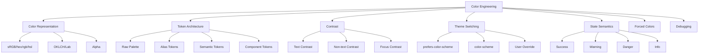
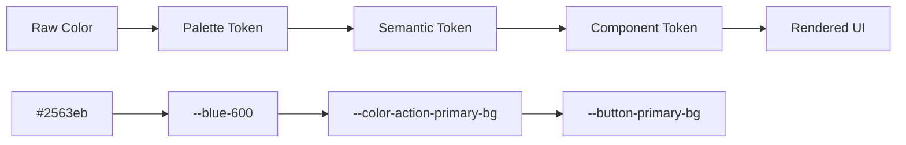
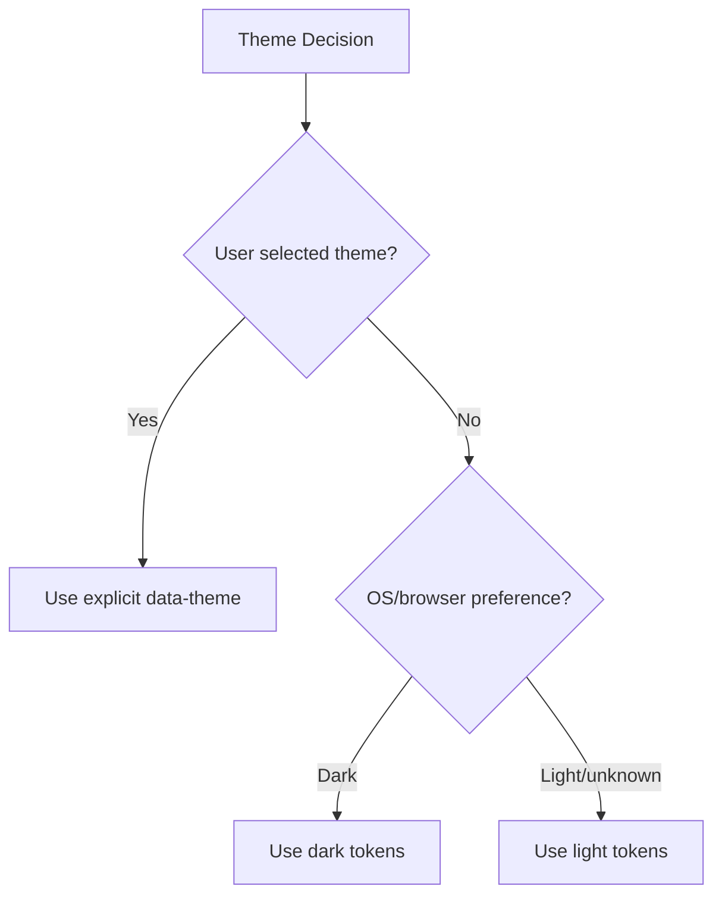
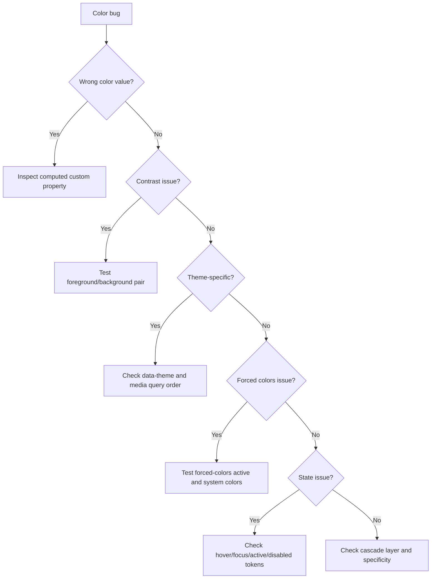

# Part 22 — Color, Theming, Contrast, Dark Mode, and Design Tokens

Color di UI production bukan sekadar memilih palet yang terlihat bagus. Color adalah sistem komunikasi status, hierarchy, affordance, brand, risk, dan accessibility.

Dalam aplikasi enterprise atau regulatory system, warna sering membawa makna operasional:

- merah = error, overdue, destructive, non-compliant,
- kuning/oranye = warning, pending, requires review,
- hijau = approved, compliant, resolved,
- biru = informational, primary action, link,
- abu-abu = disabled, muted, metadata, border,
- ungu/teal/dll = kategori, assignment, entity type.

Masalahnya: warna tidak boleh menjadi satu-satunya carrier makna. Ia harus bekerja bersama teks, ikon, shape, layout, ARIA/semantics, dan state.

Part ini membahas color sebagai **engineering system**.

---

## 1. Target Skill

Setelah menyelesaikan part ini, kamu harus bisa:

- membedakan raw color, palette token, dan semantic token,
- membangun color system dengan CSS custom properties,
- membuat light mode dan dark mode tanpa duplikasi chaos,
- memenuhi contrast minimum untuk teks dan komponen non-text,
- memakai `prefers-color-scheme`, `color-scheme`, dan `forced-colors` secara benar,
- mengelola warna status enterprise tanpa ambigu,
- memahami kapan memakai modern color syntax seperti `oklch()`, `color-mix()`, dan `light-dark()`,
- merancang fallback/progressive enhancement untuk fitur color modern,
- membuat checklist review warna untuk production.

---

## 2. Kaufman Deconstruction



Untuk 20 jam pertama, jangan mulai dari membuat palet 100 warna. Mulai dari invariant:

- body text readable,
- link terlihat sebagai link,
- focus visible,
- error jelas tanpa hanya warna,
- disabled tidak terlihat seperti normal state,
- dark mode tidak sekadar invert,
- forced-colors mode tetap usable.

---

## 3. Mental Model: Color Has Roles, Not Just Values

Nilai warna mentah:

```css
#2563eb
```

Token palet:

```css
--blue-600: #2563eb;
```

Semantic token:

```css
--color-action-primary-bg: var(--blue-600);
```

Component token:

```css
--button-primary-bg: var(--color-action-primary-bg);
```

Urutan ini penting.



Jika komponen langsung memakai `#2563eb`, kamu kehilangan kemampuan mengganti theme, dark mode, brand, dan state secara terpusat.

---

## 4. Color Syntax Overview

CSS mendukung banyak bentuk warna.

```css
.example {
  color: black;
  color: #111827;
  color: rgb(17 24 39);
  color: rgb(17 24 39 / 0.85);
  color: hsl(220 13% 18%);
  color: oklch(25% 0.03 250);
}
```

### Practical interpretation

| Syntax | Use Case |
|---|---|
| named colors | demo, quick prototype; hindari untuk system token |
| hex | umum, kompatibel, mudah dari design tools |
| rgb | bagus untuk alpha modern `rgb(... / alpha)` |
| hsl | mudah dipahami untuk hue/saturation/lightness, tetapi tidak perceptually uniform |
| oklch | lebih baik untuk systematic palette karena lightness/chroma lebih mendekati persepsi manusia |

### Production rule

Untuk app yang membutuhkan compatibility konservatif, hex/rgb masih aman. Untuk design system modern, `oklch()` sangat berguna, tetapi tetap cek browser support dan fallback strategy.

---

## 5. Do Not Encode Meaning in Raw Color Names

Bad:

```css
.alert {
  color: var(--red-600);
}
```

Better:

```css
.alert {
  color: var(--color-status-danger-text);
}
```

Kenapa?

- Dalam dark mode, `--red-600` mungkin terlalu gelap.
- Dalam high contrast theme, merah mungkin tidak boleh dipakai.
- Dalam brand tertentu, danger bisa pakai shade lain.
- Dalam semantic review, `danger` lebih jelas daripada `red`.

---

## 6. Token Architecture

Gunakan layer token.

```css
@layer tokens {
  :root {
    /* Raw palette */
    --gray-0: #ffffff;
    --gray-50: #f9fafb;
    --gray-100: #f3f4f6;
    --gray-200: #e5e7eb;
    --gray-300: #d1d5db;
    --gray-600: #4b5563;
    --gray-700: #374151;
    --gray-900: #111827;

    --blue-600: #2563eb;
    --blue-700: #1d4ed8;
    --red-600: #dc2626;
    --red-700: #b91c1c;
    --green-600: #16a34a;
    --amber-600: #d97706;

    /* Semantic tokens */
    --color-bg-page: var(--gray-50);
    --color-bg-surface: var(--gray-0);
    --color-text-primary: var(--gray-900);
    --color-text-secondary: var(--gray-700);
    --color-text-muted: var(--gray-600);
    --color-border-subtle: var(--gray-200);

    --color-action-primary-bg: var(--blue-600);
    --color-action-primary-bg-hover: var(--blue-700);
    --color-action-primary-text: #ffffff;

    --color-status-danger-text: var(--red-700);
    --color-status-success-text: var(--green-600);
    --color-status-warning-text: #92400e;
  }
}
```

### Token categories

| Category | Example | Owner |
|---|---|---|
| raw palette | `--blue-600` | design system |
| semantic UI | `--color-bg-surface` | design system |
| status | `--color-status-danger-text` | product + design |
| component | `--button-primary-bg` | component library |
| data viz | `--chart-series-1` | analytics/design |

---

## 7. Semantic Token Naming

Good semantic token names describe **role**, not appearance.

Good:

```css
--color-bg-page
--color-bg-surface
--color-bg-elevated
--color-text-primary
--color-text-secondary
--color-border-subtle
--color-border-strong
--color-action-primary-bg
--color-action-primary-text
--color-focus-ring
--color-status-danger-bg
--color-status-danger-text
```

Weak:

```css
--white
--dark-gray
--light-blue
--primary-lightish
--red-for-error-but-also-delete
```

### Naming invariant

A developer should infer safe usage from token name.

`--color-status-danger-text` tells you:

- semantic role = danger,
- usage = text,
- likely contrast-managed.

`--red-600` only tells you hue/shade.

---

## 8. Contrast: Text Is Not Optional

WCAG 2.2 contrast minimum for normal text is commonly applied as:

- **4.5:1** for normal text,
- **3:1** for large text,
- **3:1** for many non-text UI components and graphical objects that carry meaning.

Do not treat this as aesthetic preference. Contrast is accessibility infrastructure.

### Bad

```css
.meta {
  color: #cbd5e1;
  background: #ffffff;
}
```

This may look subtle, but can be unreadable.

### Better

```css
.meta {
  color: var(--color-text-muted);
}
```

Where `--color-text-muted` has been checked against the relevant background.

---

## 9. Contrast Must Be Pair-Based

A color alone is never “accessible”. A foreground/background pair may be accessible.

```css
:root {
  --color-text-primary: #111827;
  --color-bg-surface: #ffffff;
}
```

`#111827` has good contrast on white, but not necessarily on navy, black, red, or image backgrounds.

### Token rule

Define foreground/background pairs where possible:

```css
:root {
  --color-status-danger-bg: #fef2f2;
  --color-status-danger-text: #991b1b;
  --color-status-danger-border: #fecaca;
}
```

Do not let developers freely combine status text and background tokens unless combinations are tested.

---

## 10. Non-Text Contrast

Non-text contrast applies to meaningful UI parts such as:

- focus indicators,
- form input borders,
- checkbox/radio outlines,
- icons that convey meaning,
- graph lines that convey data,
- selected states,
- boundaries required to identify controls.

Bad:

```css
.input {
  border: 1px solid #eeeeee;
}
```

If the border is the only visual boundary of the input, it must be perceivable.

Better:

```css
.input {
  border: 1px solid var(--color-border-strong);
  background: var(--color-bg-surface);
}

.input:focus-visible {
  outline: 3px solid var(--color-focus-ring);
  outline-offset: 2px;
}
```

---

## 11. Color Must Not Be the Only Signal

Bad:

```html
<p class="field-message field-message--error">Invalid value</p>
```

```css
.field-message--error {
  color: red;
}
```

Better:

```html
<p class="field-message field-message--error" id="amount-error">
  <span aria-hidden="true">⚠</span>
  Amount must be greater than zero.
</p>
```

```css
.field-message--error {
  color: var(--color-status-danger-text);
}
```

The message includes text, icon/shape, and semantic relation via `aria-describedby` from the input.

### Enterprise invariant

Status must be understandable in grayscale and by screen reader.

---

## 12. Link Color and Affordance

Links should be identifiable as links.

```css
a {
  color: var(--color-link-text);
  text-decoration-line: underline;
  text-underline-offset: 0.15em;
}

a:hover {
  color: var(--color-link-text-hover);
}

a:focus-visible {
  outline: 3px solid var(--color-focus-ring);
  outline-offset: 2px;
}
```

Do not remove underline globally unless you provide an equally clear affordance.

Bad:

```css
a {
  color: inherit;
  text-decoration: none;
}
```

This hides links in body text.

---

## 13. Focus Color

Focus indicator is an interaction safety mechanism.

```css
:root {
  --color-focus-ring: #2563eb;
}

:focus-visible {
  outline: 3px solid var(--color-focus-ring);
  outline-offset: 2px;
}
```

### Better robust pattern

Use a two-layer focus ring when background can vary:

```css
:focus-visible {
  outline: 2px solid var(--color-focus-ring-inner, #ffffff);
  box-shadow: 0 0 0 4px var(--color-focus-ring-outer, #2563eb);
}
```

But ensure this does not get clipped by `overflow: hidden`.

---

## 14. Dark Mode Is Not Inversion

Bad dark mode:

```css
.dark {
  filter: invert(1);
}
```

This breaks images, brand colors, shadows, semantic colors, and contrast.

Better dark mode uses semantic tokens.

```css
:root {
  --color-bg-page: #f9fafb;
  --color-bg-surface: #ffffff;
  --color-text-primary: #111827;
  --color-text-secondary: #374151;
  --color-border-subtle: #e5e7eb;
}

@media (prefers-color-scheme: dark) {
  :root {
    --color-bg-page: #030712;
    --color-bg-surface: #111827;
    --color-text-primary: #f9fafb;
    --color-text-secondary: #d1d5db;
    --color-border-subtle: #374151;
  }
}
```

Components do not need to know the active theme:

```css
.card {
  background: var(--color-bg-surface);
  color: var(--color-text-primary);
  border: 1px solid var(--color-border-subtle);
}
```

---

## 15. `prefers-color-scheme`

`prefers-color-scheme` detects whether user requested light/dark color theme at OS or user-agent level.

```css
@media (prefers-color-scheme: dark) {
  :root {
    --color-bg-page: #030712;
    --color-text-primary: #f9fafb;
  }
}
```

### User override architecture

Real apps often need user-controlled theme.

```html
<html data-theme="dark">
```

```css
:root {
  color-scheme: light;
  --color-bg-page: #f9fafb;
  --color-text-primary: #111827;
}

@media (prefers-color-scheme: dark) {
  :root:not([data-theme]) {
    color-scheme: dark;
    --color-bg-page: #030712;
    --color-text-primary: #f9fafb;
  }
}

:root[data-theme="dark"] {
  color-scheme: dark;
  --color-bg-page: #030712;
  --color-text-primary: #f9fafb;
}

:root[data-theme="light"] {
  color-scheme: light;
  --color-bg-page: #f9fafb;
  --color-text-primary: #111827;
}
```

### Priority model



---

## 16. `color-scheme`

`color-scheme` tells the browser which color schemes the page supports. It can affect built-in UI such as form controls, scrollbars, and native rendering.

```css
:root {
  color-scheme: light dark;
}
```

If you are actively setting dark tokens, use:

```css
:root[data-theme="dark"] {
  color-scheme: dark;
}
```

This helps native controls align visually with the theme.

---

## 17. `light-dark()`

Modern CSS includes `light-dark()` for selecting a color depending on used color scheme.

```css
:root {
  color-scheme: light dark;
  --color-bg-page: light-dark(#ffffff, #030712);
  --color-text-primary: light-dark(#111827, #f9fafb);
}
```

This can simplify token definitions, but still requires support check. For broad enterprise compatibility, explicit `@media` plus custom properties may be easier to audit.

---

## 18. Forced Colors and High Contrast Modes

Forced colors mode means the user agent enforces a limited user-chosen palette. Windows Contrast Themes are a common example.

Do not fight it.

```css
@media (forced-colors: active) {
  .button {
    border: 1px solid ButtonText;
  }

  .status-badge {
    border: 1px solid CanvasText;
  }
}
```

System colors become important:

- `Canvas`
- `CanvasText`
- `ButtonFace`
- `ButtonText`
- `LinkText`
- `Highlight`
- `HighlightText`

### Bad

```css
@media (forced-colors: active) {
  * {
    forced-color-adjust: none;
  }
}
```

This prevents the user’s chosen accessibility colors from working. Only use `forced-color-adjust: none` in rare controlled cases where you fully replace semantics with system colors.

### Practical checklist

- Icons that communicate state need text or border fallback.
- Badges need borders, not just background color.
- Focus ring should remain visible.
- Do not rely on subtle box-shadow only.
- Test keyboard navigation in forced colors.

---

## 19. `prefers-contrast`

`prefers-contrast` can detect whether the user requested more or less contrast.

```css
@media (prefers-contrast: more) {
  :root {
    --color-border-subtle: var(--color-border-strong);
    --color-text-muted: var(--color-text-secondary);
  }
}
```

Use this to strengthen subtle boundaries and muted text. Do not use it to create a completely separate untested theme unless necessary.

---

## 20. Status Color System

Status color must be semantic and paired.

```css
:root {
  --status-info-bg: #eff6ff;
  --status-info-text: #1e40af;
  --status-info-border: #bfdbfe;

  --status-success-bg: #f0fdf4;
  --status-success-text: #166534;
  --status-success-border: #bbf7d0;

  --status-warning-bg: #fffbeb;
  --status-warning-text: #92400e;
  --status-warning-border: #fde68a;

  --status-danger-bg: #fef2f2;
  --status-danger-text: #991b1b;
  --status-danger-border: #fecaca;
}
```

Usage:

```css
.badge--danger {
  color: var(--status-danger-text);
  background: var(--status-danger-bg);
  border: 1px solid var(--status-danger-border);
}
```

### Enterprise status modeling

Do not overload one color for multiple concepts.

Bad:

- red = rejected,
- red = deleted,
- red = high priority,
- red = overdue,
- red = blocked,
- red = fraud risk.

Better:

- danger = destructive/error,
- overdue = temporal breach,
- blocked = workflow state,
- risk-high = risk classification,
- rejected = decision outcome.

They may share a hue family, but semantic token should remain distinct.

```css
--color-risk-high-bg
--color-risk-high-text
--color-workflow-blocked-bg
--color-workflow-blocked-text
--color-decision-rejected-bg
--color-decision-rejected-text
```

---

## 21. Component Color Contracts

A button should not directly use global action tokens everywhere. Give it component-level hooks.

```css
.button {
  --button-bg: var(--color-action-secondary-bg);
  --button-text: var(--color-action-secondary-text);
  --button-border: var(--color-action-secondary-border);

  color: var(--button-text);
  background: var(--button-bg);
  border: 1px solid var(--button-border);
}

.button--primary {
  --button-bg: var(--color-action-primary-bg);
  --button-text: var(--color-action-primary-text);
  --button-border: var(--color-action-primary-bg);
}

.button--danger {
  --button-bg: var(--color-action-danger-bg);
  --button-text: var(--color-action-danger-text);
  --button-border: var(--color-action-danger-bg);
}
```

This allows composition:

```html
<button class="button button--danger">Delete evidence</button>
```

The component owns where colors apply. Theme owns what the tokens mean.

---

## 22. State Colors

Interactive states need deterministic rules.

```css
.button {
  color: var(--button-text);
  background: var(--button-bg);
  border-color: var(--button-border);
}

.button:hover {
  background: var(--button-bg-hover);
}

.button:active {
  background: var(--button-bg-active);
}

.button:disabled {
  color: var(--color-text-disabled);
  background: var(--color-bg-disabled);
  border-color: var(--color-border-disabled);
  cursor: not-allowed;
}
```

### Avoid opacity-only disabled

Bad:

```css
.button:disabled {
  opacity: 0.4;
}
```

Opacity reduces contrast of text and border together. It can produce inaccessible color pairs.

Better:

```css
:root {
  --color-text-disabled: #6b7280;
  --color-bg-disabled: #f3f4f6;
  --color-border-disabled: #d1d5db;
}
```

Disabled state still needs readable label if it is visible.

---

## 23. Shadows, Borders, and Dark Mode

Light mode often uses shadows for elevation.

```css
.card {
  box-shadow: 0 1px 2px rgb(0 0 0 / 0.08);
}
```

In dark mode, shadow may be invisible. Use borders and surface contrast.

```css
:root[data-theme="dark"] {
  --color-bg-surface: #111827;
  --color-bg-elevated: #1f2937;
  --color-border-subtle: #374151;
}

.card {
  background: var(--color-bg-surface);
  border: 1px solid var(--color-border-subtle);
}
```

### Practical rule

Elevation in light mode can be shadow-heavy. Elevation in dark mode usually needs surface contrast + border.

---

## 24. Alpha Colors

Alpha is useful but dangerous.

```css
.overlay {
  background: rgb(0 0 0 / 0.5);
}
```

For borders and subtle backgrounds:

```css
.card {
  border-color: rgb(17 24 39 / 0.12);
}
```

Risk: final color depends on background. Contrast can change unpredictably.

### Rule

Use alpha for decorative layers, overlays, shadows, and non-critical subtle effects. Avoid alpha for critical text color unless tested on all backgrounds.

---

## 25. Modern Color Functions

### `color-mix()`

```css
.button:hover {
  background: color-mix(in oklch, var(--color-action-primary-bg), black 12%);
}
```

This can generate hover/active states from base tokens. It is powerful, but the resulting contrast must still be tested.

### Relative color syntax

Modern CSS allows deriving colors from other colors in some contexts.

```css
.example {
  color: oklch(from var(--brand) calc(l - 0.1) c h);
}
```

Use carefully. Derivation can reduce token sprawl but can also hide contrast failures.

### Engineering position

Modern color functions are excellent for design system internals. For application code, semantic tokens are usually clearer.

---

## 26. Data Visualization Colors

Data visualization has different constraints from UI status.

Rules:

- Do not reuse status colors blindly for chart series.
- Ensure adjacent series are distinguishable.
- Do not rely only on hue; use labels, patterns, line styles, markers.
- Consider color vision deficiency.
- Provide table alternative or accessible summary for critical charts.

Token example:

```css
:root {
  --chart-series-1: #2563eb;
  --chart-series-2: #16a34a;
  --chart-series-3: #d97706;
  --chart-series-4: #7c3aed;

  --chart-grid-line: var(--color-border-subtle);
  --chart-axis-text: var(--color-text-secondary);
}
```

Do not name chart series as `--chart-blue`, `--chart-green`. Sequence tokens are better when series meaning is dynamic.

---

## 27. Color in Forms

Form states need color + text + structure.

```css
.field {
  display: grid;
  gap: 0.375rem;
}

.input {
  color: var(--color-text-primary);
  background: var(--color-bg-surface);
  border: 1px solid var(--color-border-strong);
}

.input[aria-invalid="true"] {
  border-color: var(--color-status-danger-border-strong);
}

.field-error {
  color: var(--color-status-danger-text);
}
```

HTML:

```html
<div class="field">
  <label for="amount">Amount</label>
  <input id="amount" name="amount" aria-invalid="true" aria-describedby="amount-error" />
  <p id="amount-error" class="field-error">
    Amount must be greater than zero.
  </p>
</div>
```

The color helps, but the text and ARIA relationship carry the actual meaning.

---

## 28. Color in Tables and Dense Screens

Dense UI often abuses subtle grays.

Bad:

```css
.table td {
  color: #9ca3af;
}
```

This can make actual data look disabled.

Better:

```css
.table td {
  color: var(--color-text-primary);
}

.table .metadata {
  color: var(--color-text-secondary);
}

.table .muted {
  color: var(--color-text-muted);
}
```

### Row state pattern

```css
tr[data-state="selected"] {
  background: var(--color-row-selected-bg);
}

tr[data-state="overdue"] {
  border-inline-start: 4px solid var(--color-status-danger-border-strong);
}
```

Do not use only red text for overdue. Use label/icon/border as redundant signal.

---

## 29. Theme Architecture: Attribute-Based

```css
@layer tokens {
  :root {
    color-scheme: light;
    --color-bg-page: #f9fafb;
    --color-bg-surface: #ffffff;
    --color-text-primary: #111827;
    --color-text-secondary: #374151;
    --color-border-subtle: #e5e7eb;
    --color-link-text: #1d4ed8;
    --color-focus-ring: #2563eb;
  }

  :root[data-theme="dark"] {
    color-scheme: dark;
    --color-bg-page: #030712;
    --color-bg-surface: #111827;
    --color-text-primary: #f9fafb;
    --color-text-secondary: #d1d5db;
    --color-border-subtle: #374151;
    --color-link-text: #93c5fd;
    --color-focus-ring: #60a5fa;
  }
}
```

Components:

```css
@layer components {
  .page {
    background: var(--color-bg-page);
    color: var(--color-text-primary);
  }

  .card {
    background: var(--color-bg-surface);
    border: 1px solid var(--color-border-subtle);
  }

  .card a {
    color: var(--color-link-text);
  }
}
```

### Benefit

- Component CSS tidak bercabang untuk light/dark.
- Review theme terjadi di token layer.
- Dark mode bisa ditambah tanpa rewrite semua komponen.

---

## 30. Avoid Theme-Specific Component Branch Explosion

Bad:

```css
.card { background: white; color: black; }
.dark .card { background: #111; color: white; }

.button { background: blue; color: white; }
.dark .button { background: lightblue; color: black; }

.input { border-color: #ddd; }
.dark .input { border-color: #444; }
```

This does not scale.

Better:

```css
.card {
  background: var(--color-bg-surface);
  color: var(--color-text-primary);
}

.button {
  background: var(--color-action-primary-bg);
  color: var(--color-action-primary-text);
}

.input {
  border-color: var(--color-border-strong);
}
```

Only tokens switch.

---

## 31. Brand Color vs Product Semantics

Brand color should not hijack every interactive or status role.

Bad:

```css
:root {
  --color-danger: var(--brand-primary);
}
```

If brand primary is red, it does not mean every primary action should look destructive.

Separate:

```css
--color-brand-primary
--color-action-primary-bg
--color-status-danger-bg
--color-link-text
--color-focus-ring
```

Sometimes they share values, but their semantic identity remains separate.

---

## 32. Print and Color

Some enterprise screens need print/export.

```css
@media print {
  :root {
    --color-bg-page: #ffffff;
    --color-bg-surface: #ffffff;
    --color-text-primary: #000000;
    --color-text-secondary: #333333;
    --color-border-subtle: #999999;
  }

  .status-badge {
    background: transparent;
    border: 1px solid currentColor;
  }
}
```

### Print rule

Printed documents should not depend on background color. Use text labels and borders.

---

## 33. Debugging Color and Theme Issues



### DevTools questions

- What is the computed value of the custom property?
- Which selector defined the current token?
- Is the active theme applied to `:root`/`html`?
- Is `color-scheme` aligned with the theme?
- Does foreground/background pair pass contrast?
- Is text color inherited unexpectedly?
- Is disabled implemented via opacity?
- Is focus ring clipped or too subtle?

---

## 34. Review Checklist

### Token architecture

- [ ] Components do not use raw hex directly except rare local decorative cases.
- [ ] Semantic tokens exist for text, background, border, focus, action, and status.
- [ ] Dark mode changes tokens, not all component rules.
- [ ] Status tokens are paired: bg/text/border.
- [ ] Brand tokens are separate from semantic status/action tokens.

### Contrast

- [ ] Body text passes contrast on page and surface backgrounds.
- [ ] Muted text still readable.
- [ ] Link color is distinguishable.
- [ ] Focus indicator visible on all relevant backgrounds.
- [ ] Input borders are visible if they define the control boundary.
- [ ] Disabled text remains readable if displayed.

### Accessibility

- [ ] Color is not the only status signal.
- [ ] Error state includes text.
- [ ] Required/invalid/success states are semantically represented.
- [ ] Forced-colors mode has been smoke-tested.
- [ ] Data viz has labels or alternative representation.

### Theming

- [ ] `prefers-color-scheme` handled if auto theme is supported.
- [ ] Explicit user theme override beats OS preference.
- [ ] `color-scheme` set appropriately.
- [ ] Print mode does not rely on background colors.

---

## 35. Practice: Build a Themeable Status System

Create a small page with:

- page background,
- surface card,
- primary button,
- secondary button,
- danger button,
- link in paragraph,
- form input normal/focus/error/disabled,
- status badges: info/success/warning/danger,
- data table with selected and overdue rows,
- dark mode toggle via `data-theme`,
- forced-colors override smoke test.

### Required token layers

```css
@layer tokens, base, components, utilities;
```

### Required semantic tokens

```css
--color-bg-page
--color-bg-surface
--color-text-primary
--color-text-secondary
--color-text-muted
--color-border-subtle
--color-border-strong
--color-link-text
--color-focus-ring
--color-action-primary-bg
--color-action-primary-text
--color-status-danger-bg
--color-status-danger-text
--color-status-danger-border
```

### Success criteria

- No raw hex in component layer except local non-semantic decorative value.
- Dark mode works by changing tokens.
- Error state understandable without color.
- Focus ring visible on button, link, input, and table row action.
- Disabled state does not rely only on opacity.
- Forced colors mode remains navigable.

---

## 36. Minimal Production Pattern

```css
@layer tokens, base, components;

@layer tokens {
  :root {
    color-scheme: light;

    --color-bg-page: #f9fafb;
    --color-bg-surface: #ffffff;
    --color-text-primary: #111827;
    --color-text-secondary: #374151;
    --color-text-muted: #4b5563;
    --color-border-subtle: #e5e7eb;
    --color-border-strong: #9ca3af;
    --color-link-text: #1d4ed8;
    --color-focus-ring: #2563eb;

    --color-action-primary-bg: #2563eb;
    --color-action-primary-bg-hover: #1d4ed8;
    --color-action-primary-text: #ffffff;

    --color-status-danger-bg: #fef2f2;
    --color-status-danger-text: #991b1b;
    --color-status-danger-border: #fecaca;
  }

  :root[data-theme="dark"] {
    color-scheme: dark;

    --color-bg-page: #030712;
    --color-bg-surface: #111827;
    --color-text-primary: #f9fafb;
    --color-text-secondary: #d1d5db;
    --color-text-muted: #9ca3af;
    --color-border-subtle: #374151;
    --color-border-strong: #6b7280;
    --color-link-text: #93c5fd;
    --color-focus-ring: #60a5fa;

    --color-action-primary-bg: #3b82f6;
    --color-action-primary-bg-hover: #60a5fa;
    --color-action-primary-text: #030712;

    --color-status-danger-bg: #450a0a;
    --color-status-danger-text: #fecaca;
    --color-status-danger-border: #991b1b;
  }
}

@layer base {
  body {
    margin: 0;
    background: var(--color-bg-page);
    color: var(--color-text-primary);
  }

  a {
    color: var(--color-link-text);
    text-decoration-line: underline;
    text-underline-offset: 0.15em;
  }

  :focus-visible {
    outline: 3px solid var(--color-focus-ring);
    outline-offset: 2px;
  }
}

@layer components {
  .card {
    background: var(--color-bg-surface);
    color: var(--color-text-primary);
    border: 1px solid var(--color-border-subtle);
  }

  .button--primary {
    color: var(--color-action-primary-text);
    background: var(--color-action-primary-bg);
    border: 1px solid var(--color-action-primary-bg);
  }

  .button--primary:hover {
    background: var(--color-action-primary-bg-hover);
  }

  .badge--danger {
    color: var(--color-status-danger-text);
    background: var(--color-status-danger-bg);
    border: 1px solid var(--color-status-danger-border);
  }
}

@media (forced-colors: active) {
  .card,
  .badge--danger,
  .button--primary {
    border: 1px solid CanvasText;
  }
}
```

---

## 37. Key Takeaways

- Color accessibility is about foreground/background pairs, not isolated colors.
- Semantic tokens make theme changes possible without component rewrites.
- Dark mode is not inversion; it is a separate semantic mapping.
- `prefers-color-scheme` handles OS/user-agent preference; explicit user override should win.
- `color-scheme` helps native UI align with supported theme.
- Forced-colors mode must be respected, not disabled globally.
- Status colors need text, icon/shape, border, and semantics.
- Opacity-only disabled states often create contrast problems.
- Brand color, action color, status color, and data visualization color must remain distinct concepts.
- Production color systems require review checklists and real accessibility testing.

---

## 38. References

- WCAG 2.2 — Contrast Minimum: `https://www.w3.org/WAI/WCAG22/Understanding/contrast-minimum`
- WCAG 2.2 — Non-text Contrast: `https://www.w3.org/WAI/WCAG22/Understanding/non-text-contrast.html`
- MDN Web Docs — `prefers-color-scheme`: `https://developer.mozilla.org/en-US/docs/Web/CSS/@media/prefers-color-scheme`
- MDN Web Docs — `forced-colors`: `https://developer.mozilla.org/en-US/docs/Web/CSS/@media/forced-colors`
- MDN Web Docs — `prefers-contrast`: `https://developer.mozilla.org/en-US/docs/Web/CSS/@media/prefers-contrast`
- MDN Web Docs — CSS custom properties: `https://developer.mozilla.org/en-US/docs/Web/CSS/--*`
- MDN Web Docs — `light-dark()`: `https://developer.mozilla.org/en-US/docs/Web/CSS/color_value/light-dark`
- CSS Color Module Level 4: `https://www.w3.org/TR/css-color-4/`
- CSS Color Module Level 5: `https://www.w3.org/TR/css-color-5/`
