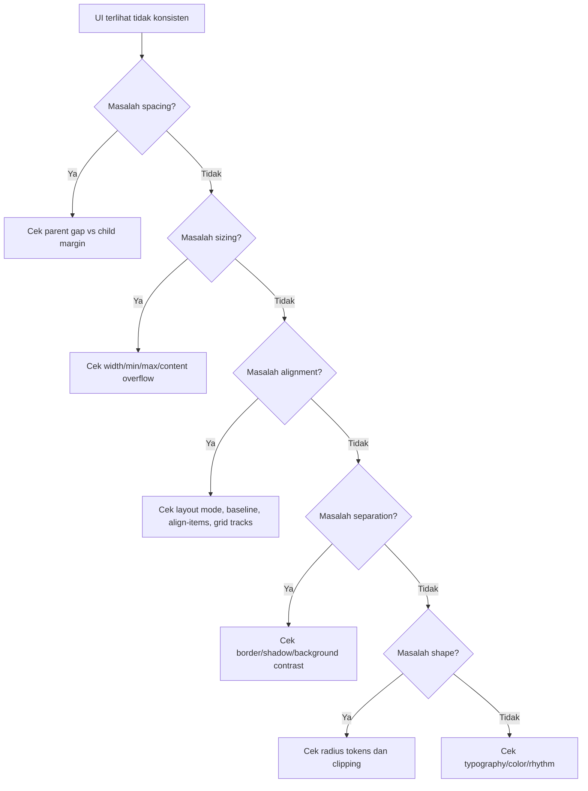

# Part 23 — Spacing, Sizing, Borders, Shadows, Radius, and Visual Rhythm

Pada tahap ini kamu sudah punya fondasi HTML, accessibility, cascade, box model, normal flow, Flexbox, Grid, responsive design, typography, dan color. Sekarang kita masuk ke lapisan visual yang terlihat sederhana tetapi menentukan apakah UI terasa rapi, konsisten, dan profesional: **spacing, sizing, border, shadow, radius, dan rhythm**.

Banyak engineer menganggap bagian ini sebagai urusan “desain visual”. Itu keliru. Dalam produk nyata, terutama aplikasi internal, dashboard, sistem case management, workflow enforcement, atau platform regulasi, visual primitives adalah bagian dari **interface correctness**.

Spacing yang buruk membuat hierarchy kabur. Sizing yang tidak konsisten membuat komponen sulit dikomposisi. Border dan shadow yang tidak sistematis membuat state ambigu. Radius yang acak membuat UI terlihat tambalan. Rhythm yang tidak stabil membuat user sulit memindai informasi.

Part ini membahas visual primitives sebagai **sistem constraint**, bukan dekorasi.

---

## 1. Target Skill

Setelah menyelesaikan part ini, kamu harus bisa:

- membangun spacing scale yang konsisten,
- membedakan spacing internal, spacing antar komponen, dan spacing layout,
- memilih unit sizing yang tepat: `px`, `rem`, `%`, `fr`, `ch`, `min-content`, `max-content`, `fit-content`, `min()`, `max()`, `clamp()`, dan `aspect-ratio`,
- membuat komponen yang punya ukuran minimum/maksimum jelas,
- menggunakan border, outline, radius, dan shadow sebagai semantic visual primitives,
- memahami kapan memakai border dan kapan memakai shadow,
- menghindari “magic number CSS”,
- membangun density system untuk UI enterprise,
- membuat visual rhythm untuk card, table, form, dashboard, dan navigation,
- men-debug alignment, overflow, clipping, dan visual inconsistency secara sistematis.

Target akhirnya: kamu bisa melihat UI dan tahu **constraint visual apa yang hilang**, bukan sekadar “kelihatannya kurang rapi”.

---

## 2. Kaufman Deconstruction

```mermaid
flowchart TD
    A[Visual Primitives] --> B[Spacing]
    A --> C[Sizing]
    A --> D[Shape]
    A --> E[Separation]
    A --> F[Rhythm]
    A --> G[Density]
    A --> H[Debugging]

    B --> B1[Inline gap]
    B --> B2[Block gap]
    B --> B3[Component padding]
    B --> B4[Layout margin]

    C --> C1[Intrinsic size]
    C --> C2[Min/max constraints]
    C --> C3[Fluid constraints]
    C --> C4[Aspect ratio]

    D --> D1[Radius]
    D --> D2[Shape semantics]

    E --> E1[Border]
    E --> E2[Shadow]
    E --> E3[Outline]
    E --> E4[Background contrast]

    F --> F1[Vertical rhythm]
    F --> F2[Grid rhythm]
    F --> F3[Typographic rhythm]

    G --> G1[Compact]
    G --> G2[Comfortable]
    G --> G3[Spacious]
```



Untuk 20 jam pertama, jangan mulai dari “membuat UI cantik”. Mulai dari invariant:

- elemen yang berhubungan harus terlihat berhubungan,
- elemen yang berbeda konteks harus punya separation,
- komponen yang sama harus punya dimensi dan spacing yang sama,
- hierarchy harus terlihat tanpa membaca semua teks,
- state harus terlihat tanpa mengandalkan warna saja,
- layout harus tetap stabil saat content berubah.

---

## 3. Visual Primitives sebagai Contract

Dalam sistem UI yang sehat, spacing, sizing, border, shadow, dan radius tidak ditentukan ad-hoc per komponen. Mereka menjadi contract.

Contoh buruk:

```css
.card {
  padding: 17px 23px;
  border-radius: 11px;
  box-shadow: 0 3px 9px rgb(0 0 0 / 17%);
}

.panel {
  padding: 18px 20px;
  border-radius: 9px;
  box-shadow: 0 4px 12px rgb(0 0 0 / 14%);
}
```

Masalahnya bukan angka itu “salah”. Masalahnya tidak ada alasan sistemik. Ketika UI tumbuh, angka semacam ini menjadi entropy.

Contoh lebih sehat:

```css
:root {
  --space-1: 0.25rem;
  --space-2: 0.5rem;
  --space-3: 0.75rem;
  --space-4: 1rem;
  --space-5: 1.25rem;
  --space-6: 1.5rem;
  --space-8: 2rem;

  --radius-sm: 0.25rem;
  --radius-md: 0.5rem;
  --radius-lg: 0.75rem;

  --border-subtle: 1px solid var(--color-border-subtle);
  --shadow-raised: 0 0.25rem 0.75rem rgb(0 0 0 / 0.12);
}

.card {
  padding: var(--space-4);
  border: var(--border-subtle);
  border-radius: var(--radius-md);
  background: var(--color-bg-surface);
}
```

Sekarang angka punya nama. Nama memberi intent. Intent membuat review dan refactor mungkin.

---

## 4. Spacing: Jarak sebagai Bahasa Hierarchy

Spacing menjawab pertanyaan: “mana yang satu kelompok, mana yang berbeda kelompok, dan bagaimana user harus memindai halaman?”

Ada empat jenis spacing yang perlu dibedakan:

| Jenis | Contoh | Tujuan |
|---|---|---|
| Internal spacing | padding dalam button/card/input | membuat konten bernapas dan target mudah digunakan |
| Inter-item spacing | `gap` antar item dalam list/toolbar | menunjukkan item berada dalam satu grup |
| Section spacing | jarak antar section | menunjukkan perubahan konteks |
| Layout spacing | padding page/container/sidebar | menjaga halaman tidak menempel ke viewport |

Kesalahan umum: memakai `margin-bottom` di semua elemen tanpa membedakan level spacing.

```css
/* Rapuh */
.card { margin-bottom: 24px; }
.form-field { margin-bottom: 18px; }
.button { margin-right: 12px; }
```

Lebih sehat: gunakan parent layout dan `gap`.

```css
.stack {
  display: grid;
  gap: var(--stack-gap, var(--space-4));
}

.cluster {
  display: flex;
  flex-wrap: wrap;
  gap: var(--space-2);
  align-items: center;
}

.form {
  --stack-gap: var(--space-5);
}
```

Prinsipnya: **parent controls relationship spacing**. Child tidak seharusnya membawa margin acak yang bocor ke konteks lain.

---

## 5. Spacing Scale

Spacing scale adalah daftar nilai jarak yang boleh dipakai. Tujuannya bukan membatasi kreativitas, tetapi mengurangi keputusan kecil yang tidak penting.

Contoh scale sederhana:

```css
:root {
  --space-0: 0;
  --space-1: 0.25rem;  /* 4px jika root 16px */
  --space-2: 0.5rem;   /* 8px */
  --space-3: 0.75rem;  /* 12px */
  --space-4: 1rem;     /* 16px */
  --space-5: 1.25rem;  /* 20px */
  --space-6: 1.5rem;   /* 24px */
  --space-8: 2rem;     /* 32px */
  --space-10: 2.5rem;  /* 40px */
  --space-12: 3rem;    /* 48px */
  --space-16: 4rem;    /* 64px */
}
```

Mengapa tidak cukup pakai 4, 8, 16, 32, 64? Untuk UI enterprise, kamu sering perlu density yang lebih halus: 12, 20, dan 24 sangat berguna untuk form, table, toolbar, dan card.

Namun jangan terlalu banyak token. Scale dengan 40 nilai biasanya menunjukkan sistem belum punya intent.

---

## 6. Relationship-Based Spacing

Spacing harus menggambarkan relationship.

Rule praktis:

- spacing antar label dan input: kecil,
- spacing antar field: sedang,
- spacing antar field group: lebih besar,
- spacing antar section: paling besar.

Contoh:

```css
.form-section {
  display: grid;
  gap: var(--space-6);
}

.field-group {
  display: grid;
  gap: var(--space-4);
}

.field {
  display: grid;
  gap: var(--space-1);
}
```

HTML:

```html
<section class="form-section" aria-labelledby="case-details-title">
  <h2 id="case-details-title">Case details</h2>

  <div class="field-group">
    <div class="field">
      <label for="case-title">Case title</label>
      <input id="case-title" name="caseTitle" />
    </div>

    <div class="field">
      <label for="priority">Priority</label>
      <select id="priority" name="priority">
        <option>Low</option>
        <option>Medium</option>
        <option>High</option>
      </select>
    </div>
  </div>
</section>
```

Yang penting: jarak tidak dipilih karena “terlihat enak”, tetapi karena relationship.

---

## 7. Margin vs Gap vs Padding

Gunakan mental model ini:

- `padding` = ruang internal komponen,
- `gap` = hubungan antar child dalam layout parent,
- `margin` = escape hatch untuk hubungan eksternal tertentu,
- `margin-inline: auto` = alignment/distribution tool,
- negative margin = advanced escape hatch, harus sangat jarang.

Contoh toolbar:

```css
.toolbar {
  display: flex;
  align-items: center;
  gap: var(--space-2);
  padding: var(--space-3) var(--space-4);
  border-bottom: 1px solid var(--color-border-subtle);
}

.toolbar__spacer {
  margin-inline-start: auto;
}
```

Di sini:

- toolbar punya padding,
- item punya gap,
- spacer memakai auto margin untuk mendorong action ke kanan.

Tidak perlu memberi `margin-right` pada setiap button.

---

## 8. Sizing: Ukuran sebagai Constraint

Sizing CSS bukan hanya `width` dan `height`. Browser punya intrinsic sizing algorithm yang lebih kaya.

Ada tiga kategori ukuran:

1. **Fixed size**: ukuran eksplisit, misalnya `width: 240px`.
2. **Fluid size**: mengikuti konteks, misalnya `width: 100%`.
3. **Intrinsic size**: mengikuti konten, misalnya `max-content`, `min-content`, `fit-content`.

UI yang resilient biasanya menggabungkan ketiganya.

Contoh:

```css
.case-summary {
  width: min(100%, 72rem);
  margin-inline: auto;
  padding-inline: var(--space-4);
}
```

Artinya:

- boleh menyusut sampai viewport kecil,
- tidak melebar lebih dari 72rem,
- tetap center,
- punya padding horizontal.

Ini lebih baik daripada `width: 1152px`.

---

## 9. `min-width`, `max-width`, dan `width`

Urutan berpikir:

1. `width` menentukan preferred size.
2. `min-width` menentukan batas minimum.
3. `max-width` menentukan batas maksimum.

Contoh button:

```css
.button {
  min-inline-size: 2.75rem;
  padding-inline: var(--space-3);
  padding-block: var(--space-2);
}
```

Jangan membuat button hanya dengan `height` dan `width` fixed kecuali ada alasan kuat. Button harus bisa menampung teks berbeda, bahasa berbeda, dan zoom user.

Contoh dialog:

```css
.dialog {
  inline-size: min(100% - 2rem, 42rem);
  max-block-size: min(80vh, 48rem);
  overflow: auto;
}
```

Ini lebih robust daripada:

```css
.dialog {
  width: 600px;
  height: 500px;
}
```

Karena versi kedua mudah rusak di mobile, zoom, atau konten panjang.

---

## 10. Logical Sizing

Gunakan logical properties untuk layout yang lebih siap i18n:

```css
.panel {
  inline-size: min(100%, 64rem);
  padding-inline: var(--space-4);
  padding-block: var(--space-5);
  border-inline-start: 4px solid var(--color-accent);
}
```

Daripada:

```css
.panel {
  width: min(100%, 64rem);
  padding-left: 1rem;
  padding-right: 1rem;
  padding-top: 1.25rem;
  padding-bottom: 1.25rem;
  border-left: 4px solid blue;
}
```

`inline-size` dan `block-size` mengikuti writing mode. Ini penting jika UI perlu mendukung RTL atau bahasa non-Latin.

---

## 11. Intrinsic Sizing Keywords

CSS menyediakan keyword ukuran yang sangat berguna:

```css
.badge {
  inline-size: max-content;
}

.table-column-name {
  inline-size: min-content;
}

.filter-popover {
  inline-size: fit-content;
}
```

Makna praktis:

| Keyword | Mental model |
|---|---|
| `min-content` | ukuran terkecil sebelum overflow/wrapping ekstrem |
| `max-content` | ukuran konten jika tidak dipaksa wrap |
| `fit-content` | shrink-to-fit dalam batas available space |

Gunakan hati-hati. `max-content` pada konten panjang bisa menyebabkan overflow horizontal.

---

## 12. `min()`, `max()`, dan `clamp()` untuk Constraint Fluid

Tiga fungsi ini mengurangi kebutuhan breakpoint manual.

```css
.page {
  inline-size: min(100% - 2rem, 72rem);
  margin-inline: auto;
}

.sidebar {
  inline-size: max(16rem, 20vw);
}

.hero-title {
  font-size: clamp(2rem, 5vw, 4rem);
}
```

Mental model:

- `min(a, b)` memilih nilai yang lebih kecil,
- `max(a, b)` memilih nilai yang lebih besar,
- `clamp(min, preferred, max)` menjaga nilai fluid dalam batas minimum dan maksimum.

Untuk spacing responsive:

```css
.section {
  padding-block: clamp(var(--space-6), 6vw, var(--space-16));
  padding-inline: clamp(var(--space-4), 4vw, var(--space-8));
}
```

Ini membuat spacing membesar secara natural tanpa banyak breakpoint.

---

## 13. `aspect-ratio`

`aspect-ratio` memberi preferred width-to-height ratio. Ini sangat berguna untuk card media, avatar, preview dokumen, chart placeholder, video embed, dan evidence thumbnail.

```css
.evidence-card__preview {
  aspect-ratio: 16 / 9;
  overflow: hidden;
  border-radius: var(--radius-md);
  background: var(--color-bg-muted);
}

.evidence-card__preview > img {
  inline-size: 100%;
  block-size: 100%;
  object-fit: cover;
}
```

Untuk avatar:

```css
.avatar {
  inline-size: 2.5rem;
  aspect-ratio: 1;
  border-radius: 999px;
  overflow: hidden;
}
```

`aspect-ratio` membantu mengurangi layout shift karena browser bisa menghitung ruang sebelum asset selesai dimuat.

---

## 14. Border: Garis sebagai Struktur, Bukan Dekorasi

Border sering dipakai untuk:

- memisahkan surface,
- menunjukkan boundary input,
- menunjukkan selected state,
- menunjukkan focus/error/warning,
- membuat data table lebih scannable.

Token dasar:

```css
:root {
  --border-width-thin: 1px;
  --border-width-thick: 2px;

  --border-subtle: var(--border-width-thin) solid var(--color-border-subtle);
  --border-strong: var(--border-width-thin) solid var(--color-border-strong);
  --border-focus: var(--border-width-thick) solid var(--color-focus-ring);
  --border-danger: var(--border-width-thin) solid var(--color-status-danger-border);
}
```

Contoh input:

```css
.input {
  inline-size: 100%;
  min-block-size: 2.5rem;
  padding-inline: var(--space-3);
  border: var(--border-subtle);
  border-radius: var(--radius-sm);
  background: var(--color-bg-field);
  color: var(--color-text-primary);
}

.input:focus-visible {
  outline: 2px solid var(--color-focus-ring);
  outline-offset: 2px;
}

.input[aria-invalid="true"] {
  border-color: var(--color-status-danger-border);
}
```

Jangan menghapus outline focus lalu menggantinya dengan border yang menyebabkan layout shift. Border menambah ukuran box kecuali sudah dikompensasi. Outline tidak mempengaruhi layout.

---

## 15. Outline vs Border

Perbedaan penting:

| Property | Mempengaruhi layout? | Umum untuk |
|---|---:|---|
| `border` | ya | boundary permanen, input, card, table |
| `outline` | tidak | focus ring, temporary highlight |
| `box-shadow` | tidak | elevation, glow, fake outline |

Untuk focus state, default yang aman:

```css
:focus-visible {
  outline: 2px solid var(--color-focus-ring);
  outline-offset: 2px;
}
```

Jika komponen punya radius besar, outline bisa terlihat kurang menyatu. Alternatif:

```css
.button:focus-visible {
  outline: none;
  box-shadow:
    0 0 0 2px var(--color-bg-surface),
    0 0 0 4px var(--color-focus-ring);
}
```

Tetapi pastikan visible di forced-colors mode.

```css
@media (forced-colors: active) {
  .button:focus-visible {
    outline: 2px solid Highlight;
    outline-offset: 2px;
    box-shadow: none;
  }
}
```

---

## 16. Border Radius: Shape sebagai Consistency System

Radius memberi shape language. Jangan membuat semua radius acak.

Token umum:

```css
:root {
  --radius-none: 0;
  --radius-xs: 0.125rem;
  --radius-sm: 0.25rem;
  --radius-md: 0.5rem;
  --radius-lg: 0.75rem;
  --radius-xl: 1rem;
  --radius-pill: 999px;
}
```

Mapping praktis:

| Token | Cocok untuk |
|---|---|
| `--radius-xs` | checkbox-like decoration, small tags |
| `--radius-sm` | input, compact button |
| `--radius-md` | card, menu, popover |
| `--radius-lg` | modal, large panel |
| `--radius-pill` | badge, avatar, pill button |

Jangan memakai `border-radius: 999px` untuk semua hal. Shape harus menyampaikan affordance dan sistem visual.

---

## 17. Radius dan Overflow

`border-radius` tidak selalu memotong konten child. Jika child memiliki background/image, kamu sering perlu `overflow: hidden`.

```css
.card {
  border-radius: var(--radius-lg);
  overflow: hidden;
  border: var(--border-subtle);
}

.card__media img {
  inline-size: 100%;
  block-size: 100%;
  object-fit: cover;
}
```

Namun `overflow: hidden` punya konsekuensi:

- bisa memotong focus ring,
- bisa memotong dropdown/popover child,
- bisa membuat sticky child tidak bekerja sesuai harapan,
- bisa membuat shadow internal hilang.

Jika tujuannya hanya clip media, lebih baik clip media wrapper, bukan seluruh card.

```css
.card {
  border-radius: var(--radius-lg);
  border: var(--border-subtle);
}

.card__media {
  overflow: hidden;
  border-start-start-radius: inherit;
  border-start-end-radius: inherit;
}
```

---

## 18. Shadow: Elevation dan Layering

Shadow sebaiknya punya makna:

- surface raised,
- popover floating,
- modal prominent,
- sticky header separation,
- focus/error glow jika memang tokenized.

Token:

```css
:root {
  --shadow-xs: 0 1px 2px rgb(0 0 0 / 0.08);
  --shadow-sm: 0 2px 6px rgb(0 0 0 / 0.10);
  --shadow-md: 0 8px 24px rgb(0 0 0 / 0.14);
  --shadow-lg: 0 16px 48px rgb(0 0 0 / 0.18);
}
```

Mapping:

| Token | Cocok untuk |
|---|---|
| `--shadow-xs` | subtle raised card |
| `--shadow-sm` | sticky toolbar/header |
| `--shadow-md` | dropdown, popover |
| `--shadow-lg` | modal/dialog |

Jangan mengandalkan shadow saja untuk separation. Di dark mode, shadow sering kurang terlihat. Gunakan border/background contrast juga.

```css
.popover {
  border: 1px solid var(--color-border-subtle);
  box-shadow: var(--shadow-md);
  background: var(--color-bg-surface);
}
```

---

## 19. Multi-Layer Shadow

Shadow realistis sering terdiri dari beberapa layer:

```css
:root {
  --shadow-popover:
    0 0.5rem 1rem rgb(0 0 0 / 0.10),
    0 0.125rem 0.25rem rgb(0 0 0 / 0.08);
}
```

Namun jangan overdo. Shadow yang terlalu berat membuat UI terlihat muddy dan melelahkan.

Prinsip:

- elevation rendah = blur kecil, opacity rendah,
- elevation tinggi = blur lebih besar, offset lebih jauh,
- dark mode = sering butuh border/overlay lebih dari shadow,
- focus ring jangan kalah oleh shadow.

---

## 20. Visual Rhythm

Visual rhythm adalah konsistensi jarak, ukuran, alignment, dan hierarchy sehingga mata user bisa memindai UI tanpa friction.

Contoh rhythm buruk:

```css
.card h2 { margin-bottom: 13px; }
.card p { margin-bottom: 21px; }
.card footer { margin-top: 19px; }
```

Contoh rhythm lebih sehat:

```css
.card {
  display: grid;
  gap: var(--space-4);
  padding: var(--space-4);
}

.card__header {
  display: grid;
  gap: var(--space-1);
}

.card__body {
  display: grid;
  gap: var(--space-3);
}

.card__footer {
  display: flex;
  justify-content: end;
  gap: var(--space-2);
}
```

Rhythm harus dipikirkan per level: page, section, component, dan inline elements.

---

## 21. Density System

Aplikasi enterprise sering butuh density berbeda:

- comfortable untuk task umum,
- compact untuk data-heavy table,
- spacious untuk onboarding atau public-facing page.

Jangan membuat komponen terpisah untuk setiap density. Gunakan token.

```css
:root {
  --density-control-block-size: 2.5rem;
  --density-control-padding-inline: var(--space-3);
  --density-row-block-size: 2.75rem;
}

[data-density="compact"] {
  --density-control-block-size: 2rem;
  --density-control-padding-inline: var(--space-2);
  --density-row-block-size: 2.25rem;
}

[data-density="comfortable"] {
  --density-control-block-size: 2.75rem;
  --density-control-padding-inline: var(--space-4);
  --density-row-block-size: 3rem;
}

.input,
.button {
  min-block-size: var(--density-control-block-size);
  padding-inline: var(--density-control-padding-inline);
}

.data-table tr {
  block-size: var(--density-row-block-size);
}
```

Dengan ini, density adalah mode sistem, bukan class ad-hoc di setiap komponen.

---

## 22. Spacing dan Touch Target

UI yang terlalu compact bisa melanggar usability. Untuk interactive control, jangan hanya melihat visual height. Lihat target area.

Contoh:

```css
.icon-button {
  inline-size: 2.5rem;
  block-size: 2.5rem;
  display: inline-grid;
  place-items: center;
  border-radius: var(--radius-sm);
}
```

Jika visual icon hanya 16px, target tetap 40px. Ini membantu pointer/touch/keyboard usability.

Untuk dense data table, action kecil bisa tetap punya target cukup dengan padding internal atau row-level action area.

---

## 23. Component Primitive: Button

Button yang baik punya sizing, spacing, border, radius, dan state yang konsisten.

```css
.button {
  --button-bg: var(--color-bg-action);
  --button-fg: var(--color-text-on-action);
  --button-border: transparent;

  display: inline-flex;
  align-items: center;
  justify-content: center;
  gap: var(--space-2);

  min-inline-size: 2.5rem;
  min-block-size: var(--density-control-block-size, 2.5rem);
  padding-inline: var(--space-3);

  border: 1px solid var(--button-border);
  border-radius: var(--radius-sm);
  background: var(--button-bg);
  color: var(--button-fg);
  font: inherit;
  line-height: 1;
  text-decoration: none;
  cursor: pointer;
}

.button:hover {
  --button-bg: var(--color-bg-action-hover);
}

.button:focus-visible {
  outline: 2px solid var(--color-focus-ring);
  outline-offset: 2px;
}

.button:disabled,
.button[aria-disabled="true"] {
  cursor: not-allowed;
  opacity: 0.6;
}
```

Catatan: `opacity: 0.6` untuk disabled bisa bermasalah jika contrast turun terlalu jauh. Untuk sistem serius, lebih baik pakai token disabled khusus.

---

## 24. Component Primitive: Card

Card adalah surface. Card bukan sekadar kotak putih dengan shadow.

```css
.card {
  display: grid;
  gap: var(--space-4);
  padding: var(--space-4);
  border: 1px solid var(--color-border-subtle);
  border-radius: var(--radius-lg);
  background: var(--color-bg-surface);
}

.card--raised {
  box-shadow: var(--shadow-xs);
}

.card--interactive {
  cursor: pointer;
  transition: border-color 150ms ease, box-shadow 150ms ease;
}

.card--interactive:hover {
  border-color: var(--color-border-strong);
  box-shadow: var(--shadow-sm);
}

.card--interactive:focus-within {
  outline: 2px solid var(--color-focus-ring);
  outline-offset: 2px;
}
```

Jika seluruh card clickable, pastikan markup/accessibility benar. Jangan membungkus semua konten kompleks dalam link jika ada button lain di dalamnya.

---

## 25. Component Primitive: Badge

Badge/status pill sering muncul di workflow UI.

```css
.badge {
  display: inline-flex;
  align-items: center;
  gap: var(--space-1);
  inline-size: max-content;
  min-block-size: 1.5rem;
  padding-inline: var(--space-2);
  border: 1px solid var(--badge-border, transparent);
  border-radius: var(--radius-pill);
  background: var(--badge-bg);
  color: var(--badge-fg);
  font-size: 0.8125rem;
  font-weight: 600;
  line-height: 1;
}

.badge--warning {
  --badge-bg: var(--color-status-warning-bg);
  --badge-fg: var(--color-status-warning-text);
  --badge-border: var(--color-status-warning-border);
}
```

Badge harus punya teks. Jangan hanya warna.

```html
<span class="badge badge--warning">
  <svg aria-hidden="true" viewBox="0 0 16 16"><!-- icon --></svg>
  Pending review
</span>
```

---

## 26. Component Primitive: Form Field

Form field yang konsisten biasanya punya struktur:

```css
.field {
  display: grid;
  gap: var(--space-1);
}

.field__label {
  font-weight: 600;
}

.field__hint,
.field__error {
  font-size: 0.875rem;
}

.field__error {
  color: var(--color-status-danger-text);
}

.input {
  inline-size: 100%;
  min-block-size: var(--density-control-block-size, 2.5rem);
  padding-inline: var(--space-3);
  border: 1px solid var(--color-border-strong);
  border-radius: var(--radius-sm);
  background: var(--color-bg-field);
}

.input[aria-invalid="true"] {
  border-color: var(--color-status-danger-border);
}
```

Spacing antara label, hint, input, dan error harus stabil. Error message tidak boleh membuat user kehilangan context.

---

## 27. Component Primitive: Data Table

Table membutuhkan density dan rhythm berbeda dari card.

```css
.data-table {
  inline-size: 100%;
  border-collapse: collapse;
  font-size: 0.875rem;
}

.data-table th,
.data-table td {
  padding-block: var(--space-2);
  padding-inline: var(--space-3);
  border-block-end: 1px solid var(--color-border-subtle);
  text-align: start;
  vertical-align: top;
}

.data-table th {
  background: var(--color-bg-muted);
  color: var(--color-text-secondary);
  font-weight: 600;
}

.data-table tbody tr:hover {
  background: var(--color-bg-row-hover);
}
```

Untuk table data-heavy:

- jangan memakai padding card besar,
- jaga alignment angka ke kanan,
- gunakan `font-variant-numeric: tabular-nums`,
- pertahankan row height cukup untuk target interaksi,
- jangan hanya mengandalkan zebra striping.

---

## 28. Visual Alignment

Alignment adalah bagian besar dari visual quality. Banyak UI terlihat amatir bukan karena warna buruk, tetapi karena alignment tidak konsisten.

Prinsip:

- align text dengan text,
- align controls dengan controls,
- align label dengan input,
- align icon optical center, bukan sekadar mathematical center,
- jangan mencampur left/right physical properties jika sistem butuh RTL.

Contoh metadata list:

```css
.metadata-list {
  display: grid;
  grid-template-columns: max-content 1fr;
  gap: var(--space-2) var(--space-4);
}

.metadata-list dt {
  color: var(--color-text-secondary);
}

.metadata-list dd {
  margin: 0;
  min-inline-size: 0;
}
```

HTML:

```html
<dl class="metadata-list">
  <dt>Case ID</dt>
  <dd>ENF-2026-00142</dd>
  <dt>Assigned unit</dt>
  <dd>Market Conduct Supervision</dd>
</dl>
```

`max-content 1fr` membuat label mengikuti konten terpanjang dan value mengisi sisa ruang.

---

## 29. Visual Rhythm untuk Page Layout

Page-level rhythm:

```css
.page-shell {
  min-block-size: 100dvh;
  display: grid;
  grid-template-rows: auto 1fr;
}

.page-main {
  inline-size: min(100% - 2rem, 80rem);
  margin-inline: auto;
  padding-block: var(--space-6);
}

.page-stack {
  display: grid;
  gap: var(--space-6);
}
```

Section-level rhythm:

```css
.section {
  display: grid;
  gap: var(--space-4);
}

.section__header {
  display: flex;
  align-items: start;
  justify-content: space-between;
  gap: var(--space-4);
}
```

Component-level rhythm:

```css
.summary-grid {
  display: grid;
  gap: var(--space-4);
  grid-template-columns: repeat(auto-fit, minmax(min(100%, 16rem), 1fr));
}
```

---

## 30. Enterprise Case Detail Layout Example

HTML:

```html
<main class="case-page">
  <header class="case-header">
    <div class="case-header__title-block">
      <p class="eyebrow">Case ENF-2026-00142</p>
      <h1>Unlicensed advisory activity investigation</h1>
      <p class="case-header__summary">Opened by Market Conduct Supervision on 26 June 2026.</p>
    </div>

    <div class="case-header__actions cluster">
      <button class="button button--secondary">Assign</button>
      <button class="button button--primary">Start review</button>
    </div>
  </header>

  <div class="case-layout">
    <section class="card case-main" aria-labelledby="case-overview-title">
      <h2 id="case-overview-title">Overview</h2>
      <p>Initial complaint indicates multiple advisory communications without registration.</p>
    </section>

    <aside class="card case-sidebar" aria-labelledby="case-meta-title">
      <h2 id="case-meta-title">Metadata</h2>
      <dl class="metadata-list">
        <dt>Status</dt>
        <dd><span class="badge badge--warning">Pending review</span></dd>
        <dt>Priority</dt>
        <dd>High</dd>
      </dl>
    </aside>
  </div>
</main>
```

CSS:

```css
.case-page {
  inline-size: min(100% - 2rem, 80rem);
  margin-inline: auto;
  padding-block: clamp(var(--space-4), 4vw, var(--space-8));
  display: grid;
  gap: var(--space-6);
}

.case-header {
  display: flex;
  align-items: start;
  justify-content: space-between;
  gap: var(--space-4);
}

.case-header__title-block {
  display: grid;
  gap: var(--space-2);
  min-inline-size: 0;
}

.case-header__summary {
  max-inline-size: 68ch;
  color: var(--color-text-secondary);
}

.case-layout {
  display: grid;
  gap: var(--space-4);
  grid-template-columns: minmax(0, 1fr) minmax(18rem, 24rem);
  align-items: start;
}

@media (max-width: 56rem) {
  .case-header,
  .case-layout {
    grid-template-columns: 1fr;
  }

  .case-header {
    display: grid;
  }
}
```

Catatan: `minmax(0, 1fr)` mencegah overflow karena konten panjang di grid item.

---

## 31. Anti-Pattern: Magic Number Alignment

Contoh buruk:

```css
.icon {
  margin-top: 3px;
  margin-left: 7px;
}
```

Kadang optical adjustment memang perlu, tetapi jika terlalu sering, berarti layout primitive salah.

Coba perbaiki dengan:

```css
.item {
  display: inline-flex;
  align-items: center;
  gap: var(--space-2);
}

.item__icon {
  flex: none;
  inline-size: 1em;
  block-size: 1em;
}
```

Jika icon tetap terlihat tidak center, masalahnya mungkin viewBox SVG, bukan CSS.

---

## 32. Anti-Pattern: Fixed Height untuk Konten Dinamis

Contoh buruk:

```css
.card {
  height: 240px;
}
```

Jika content berubah, bahasa lebih panjang, zoom aktif, atau error muncul, layout rusak.

Lebih baik:

```css
.card {
  min-block-size: 15rem;
}
```

atau:

```css
.card-grid {
  display: grid;
  grid-auto-rows: 1fr;
}
```

Gunakan fixed height untuk area yang memang punya ratio/viewport constraint, bukan teks dinamis.

---

## 33. Anti-Pattern: Shadow sebagai Border

Shadow halus sering dipakai untuk mengganti border:

```css
.card {
  box-shadow: 0 0 0 1px rgb(0 0 0 / 0.08);
}
```

Ini bisa valid, tetapi hati-hati:

- shadow tidak muncul di beberapa forced-colors scenario,
- shadow bisa hilang saat print,
- shadow tidak selalu terlihat di dark mode,
- shadow tidak ikut layout.

Untuk boundary penting, border lebih defensible.

---

## 34. Responsive Visual Rhythm

Spacing responsive bukan berarti semua jarak berubah di setiap breakpoint.

Gunakan fluid token:

```css
:root {
  --page-padding-inline: clamp(var(--space-4), 4vw, var(--space-8));
  --section-gap: clamp(var(--space-5), 5vw, var(--space-10));
}

.page {
  padding-inline: var(--page-padding-inline);
}

.page-stack {
  display: grid;
  gap: var(--section-gap);
}
```

Untuk komponen kecil, spacing sering tidak perlu fluid. Button padding yang berubah terlalu banyak bisa membuat UI terasa tidak stabil.

---

## 35. Print-Friendly Visual Primitives

Enterprise/regulatory UI sering perlu print/export.

```css
@media print {
  :root {
    --shadow-xs: none;
    --shadow-sm: none;
    --shadow-md: none;
    --shadow-lg: none;
  }

  .card {
    break-inside: avoid;
    border: 1px solid #000;
    box-shadow: none;
  }

  .button,
  .toolbar,
  .navigation {
    display: none;
  }
}
```

Print stylesheet harus mempertahankan hierarchy dan boundary tanpa shadow/color dependency berlebihan.

---

## 36. Debugging Visual Inconsistency

Gunakan flow ini:



Checklist DevTools:

- lihat box model,
- lihat computed `display`, `gap`, `margin`, `padding`, `width`, `min-width`, `max-width`,
- aktifkan grid/flex overlay,
- cek inherited custom properties,
- cek apakah ada utility class yang override token,
- cek zoom 200%,
- cek content panjang,
- cek RTL jika relevan,
- cek forced colors/print jika boundary penting.

---

## 37. Failure Taxonomy

| Gejala | Penyebab umum | Solusi |
|---|---|---|
| Card tidak sejajar | fixed height/content berbeda | gunakan grid alignment atau min-height |
| Text overflow di grid | `min-width: auto`/missing `minmax(0, 1fr)` | set `min-inline-size: 0` atau `minmax(0, 1fr)` |
| Focus ring terpotong | parent `overflow: hidden` | pindahkan clipping ke child atau adjust outline |
| Button berbeda tinggi | line-height/padding/font berbeda | token sizing control |
| Spacing tidak konsisten | margin child ad-hoc | parent `gap` + stack/cluster primitive |
| Shadow tidak terlihat di dark mode | shadow only separation | tambah border/background contrast |
| Table terlalu padat | padding/line-height terlalu kecil | density token + minimum row target |
| Modal overflow viewport | fixed width/height | `min()`, `max-block-size`, `overflow: auto` |

---

## 38. Practice 1 — Build a Spacing Scale

Buat file CSS:

```css
:root {
  --space-0: 0;
  --space-1: 0.25rem;
  --space-2: 0.5rem;
  --space-3: 0.75rem;
  --space-4: 1rem;
  --space-5: 1.25rem;
  --space-6: 1.5rem;
  --space-8: 2rem;
  --space-10: 2.5rem;
  --space-12: 3rem;
}
```

Buat primitives:

```css
.stack {
  display: grid;
  gap: var(--stack-gap, var(--space-4));
}

.cluster {
  display: flex;
  flex-wrap: wrap;
  gap: var(--cluster-gap, var(--space-2));
  align-items: center;
}

.box {
  padding: var(--box-padding, var(--space-4));
}
```

Latihan:

- buat form section,
- buat toolbar,
- buat card list,
- ubah hanya custom property `--stack-gap`, bukan CSS child.

---

## 39. Practice 2 — Build a Case Summary Card

Requirement:

- card punya header, body, footer,
- status badge,
- action button,
- responsive,
- tidak ada magic margin,
- focus visible tetap terlihat.

Skeleton:

```html
<article class="case-card">
  <header class="case-card__header">
    <div>
      <p class="eyebrow">Case ENF-2026-00142</p>
      <h2>Unlicensed advisory activity</h2>
    </div>
    <span class="badge badge--warning">Pending review</span>
  </header>

  <p>Complaint submitted by investor protection unit.</p>

  <footer class="case-card__footer">
    <a class="button button--secondary" href="/cases/ENF-2026-00142">Open case</a>
  </footer>
</article>
```

CSS harus memakai token spacing, radius, border, dan shadow.

---

## 40. Practice 3 — Build Density Modes

Requirement:

- `data-density="compact"`, `comfortable`, dan `spacious`,
- mempengaruhi button, input, table row,
- tidak mengubah semantic HTML,
- tetap accessible.

Contoh root:

```html
<div class="app" data-density="compact">
  <!-- components -->
</div>
```

Evaluasi:

- apakah table masih readable?
- apakah touch target masih masuk akal?
- apakah form error tetap terlihat?
- apakah spacing antar section tetap cukup?

---

## 41. Code Review Checklist

Review spacing/sizing/rhythm dengan pertanyaan ini:

- Apakah spacing memakai token, bukan angka acak?
- Apakah spacing relationship dikontrol parent dengan `gap`?
- Apakah component internal spacing memakai `padding`?
- Apakah ada fixed width/height yang tidak perlu?
- Apakah `min-width: 0`/`minmax(0, 1fr)` diperlukan di grid/flex?
- Apakah radius konsisten dengan token?
- Apakah border/shadow punya semantic purpose?
- Apakah focus ring tidak terpotong?
- Apakah dark mode/forced colors/print tetap punya separation?
- Apakah UI tahan content panjang dan localization?
- Apakah density mode bisa diatur sistemik?
- Apakah visual hierarchy jelas tanpa membaca seluruh teks?

---

## 42. Key Takeaways

- Visual primitives adalah engineering contract, bukan dekorasi.
- Spacing harus menggambarkan relationship.
- Parent layout sebaiknya mengontrol gap antar child.
- `padding`, `gap`, dan `margin` punya peran berbeda.
- Sizing yang baik memakai constraint: `min`, `max`, fluid, intrinsic.
- `aspect-ratio` membantu media/card/preview tetap stabil.
- Border cocok untuk boundary permanen; outline cocok untuk focus; shadow cocok untuk elevation.
- Radius harus tokenized dan punya shape language.
- Shadow tidak boleh menjadi satu-satunya separation penting.
- Visual rhythm membuat UI mudah dipindai.
- Density harus menjadi mode sistem, bukan override acak.
- Debugging visual inconsistency harus dimulai dari box model, layout mode, dan token inheritance.

---

## 43. References

- MDN Web Docs — CSS box model: `https://developer.mozilla.org/en-US/docs/Web/CSS/CSS_box_model/Introduction_to_the_CSS_box_model`
- MDN Web Docs — `aspect-ratio`: `https://developer.mozilla.org/en-US/docs/Web/CSS/aspect-ratio`
- MDN Web Docs — `box-shadow`: `https://developer.mozilla.org/en-US/docs/Web/CSS/box-shadow`
- MDN Web Docs — `border-radius`: `https://developer.mozilla.org/en-US/docs/Web/CSS/border-radius`
- MDN Web Docs — `outline`: `https://developer.mozilla.org/en-US/docs/Web/CSS/outline`
- MDN Web Docs — CSS values and units: `https://developer.mozilla.org/en-US/docs/Web/CSS/CSS_values_and_units`
- CSS Box Sizing Module Level 3: `https://www.w3.org/TR/css-sizing-3/`
- CSS Logical Properties and Values Level 1: `https://www.w3.org/TR/css-logical-1/`
