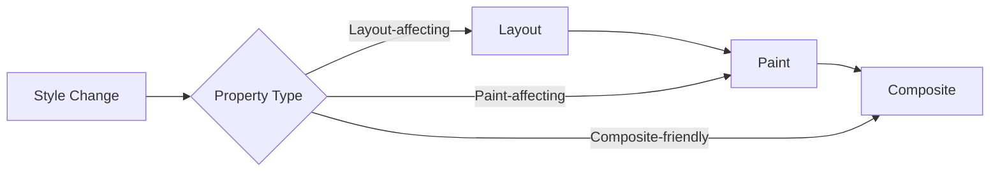
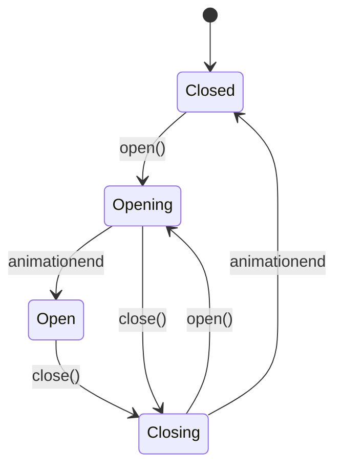
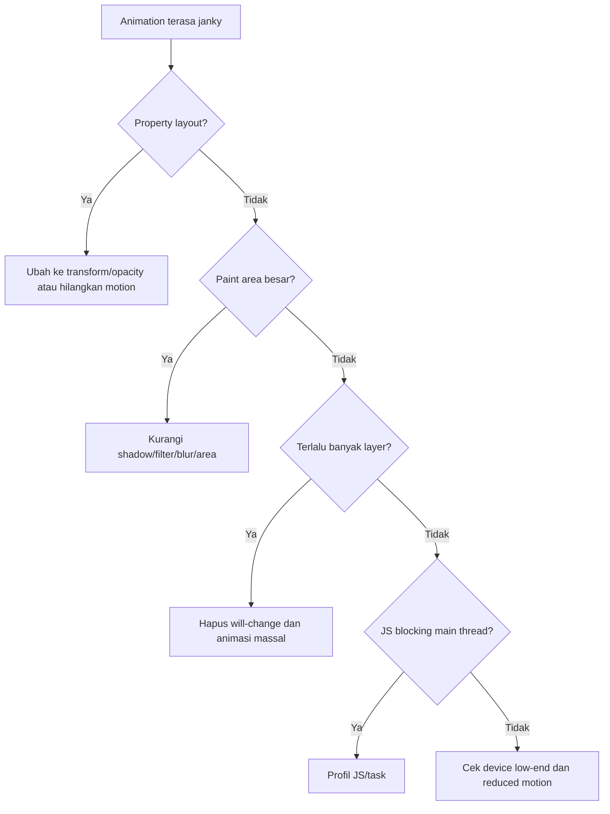

# Part 24 — Transitions, Animations, Motion Design, and Reduced Motion

Motion di UI bukan hiasan. Motion adalah feedback system.

Motion yang baik membantu user memahami:

- sesuatu berubah,
- action diterima,
- elemen muncul/hilang,
- fokus berpindah,
- proses sedang berlangsung,
- hierarchy atau relationship antar elemen.

Motion yang buruk membuat UI terasa lambat, mengganggu, memicu motion sickness, atau menyembunyikan state yang seharusnya jelas.

Part ini membahas CSS transition dan animation sebagai **interaction contract**: kapan dipakai, apa yang aman dianimasikan, bagaimana menghindari jank, dan bagaimana menghormati user yang memilih reduced motion.

---

## 1. Target Skill

Setelah menyelesaikan part ini, kamu harus bisa:

- membedakan transition, animation, transform, dan JavaScript-driven animation,
- memilih property yang aman dianimasikan,
- memahami hubungan animation dengan rendering pipeline,
- membuat hover/focus/active feedback yang tidak mengganggu,
- membuat dialog/popover/toast masuk dan keluar dengan jelas,
- membuat loading/skeleton state yang tidak menipu,
- memakai `prefers-reduced-motion` secara benar,
- membuat motion tokens untuk duration/easing/distance,
- menghindari animation yang menyebabkan layout shift atau motion sickness,
- men-debug animation performance di browser DevTools.

Target akhirnya: kamu bisa membuat motion yang **purposeful, accessible, performant, dan maintainable**.

---

## 2. Kaufman Deconstruction

```mermaid
flowchart TD
    A[Motion Engineering] --> B[State Change]
    A --> C[CSS Mechanism]
    A --> D[Performance]
    A --> E[Accessibility]
    A --> F[Design Tokens]
    A --> G[Debugging]

    B --> B1[Hover/focus/active]
    B --> B2[Enter/exit]
    B --> B3[Loading]
    B --> B4[Feedback]

    C --> C1[transition]
    C --> C2[@keyframes]
    C --> C3[transform]
    C --> C4[opacity]

    D --> D1[Layout]
    D --> D2[Paint]
    D --> D3[Composite]

    E --> E1[prefers-reduced-motion]
    E --> E2[WCAG motion]
    E --> E3[Keyboard/focus]

    F --> F1[Duration]
    F --> F2[Easing]
    F --> F3[Distance]
```

Untuk latihan awal, jangan membuat animasi kompleks. Mulai dari:

- button state,
- focus state,
- disclosure expand/collapse,
- modal enter/exit,
- toast notification,
- skeleton/loading indicator,
- reduced-motion fallback.

---

## 3. Motion sebagai State Communication

Motion harus menjawab salah satu pertanyaan user:

- “Apakah klik saya diterima?”
- “Apa yang baru muncul?”
- “Ke mana elemen itu pergi?”
- “Apakah proses masih berjalan?”
- “Apakah ini state berbeda?”

Jika motion tidak menjawab pertanyaan, mungkin ia hanya noise.

Contoh motion yang punya purpose:

```css
.button {
  transition:
    background-color 150ms ease,
    border-color 150ms ease,
    transform 100ms ease;
}

.button:hover {
  background: var(--color-bg-action-hover);
}

.button:active {
  transform: translateY(1px);
}
```

Klik memberi tactile feedback ringan. Tidak ada gerakan besar, tidak mengubah layout, dan durasinya singkat.

---

## 4. Transition vs Animation

Gunakan `transition` ketika perubahan dipicu oleh perubahan state dan browser bisa interpolate dari nilai awal ke nilai akhir.

Contoh:

```css
.card {
  border-color: var(--color-border-subtle);
  box-shadow: none;
  transition: border-color 150ms ease, box-shadow 150ms ease;
}

.card:hover {
  border-color: var(--color-border-strong);
  box-shadow: var(--shadow-sm);
}
```

Gunakan `animation` ketika kamu butuh sequence yang tidak sekadar state A ke state B.

Contoh:

```css
@keyframes pulse {
  0%, 100% { opacity: 1; }
  50% { opacity: 0.55; }
}

.skeleton {
  animation: pulse 1.2s ease-in-out infinite;
}
```

Rule praktis:

| Kebutuhan | Mekanisme |
|---|---|
| hover/focus/active state | `transition` |
| menu/dialog enter | `transition` atau animation sederhana |
| loading indicator | `animation` |
| repeated attention cue | `animation`, hati-hati |
| route/page transition | View Transitions/JS/CSS, tergantung architecture |
| physics/drag gesture | JavaScript/Web Animations API |

---

## 5. Transition Anatomy

Properti penting:

```css
.element {
  transition-property: opacity, transform;
  transition-duration: 180ms;
  transition-timing-function: ease-out;
  transition-delay: 0ms;
}
```

Shorthand:

```css
.element {
  transition:
    opacity 180ms ease-out,
    transform 180ms ease-out;
}
```

Hindari:

```css
.element {
  transition: all 300ms ease;
}
```

Mengapa?

- property yang tidak dimaksud bisa ikut dianimasikan,
- debugging lebih sulit,
- future CSS change bisa menyebabkan animasi aneh,
- property layout seperti `width`, `height`, `margin`, `top`, `left` bisa ikut berubah dan memicu jank.

Gunakan property eksplisit.

---

## 6. Animatable Properties dan Rendering Cost

Tidak semua property sama biayanya.

Mental model rendering:



Property yang umumnya lebih aman untuk animation:

- `transform`,
- `opacity`.

Property yang sering mahal:

- `width`, `height`,
- `margin`, `padding`,
- `top`, `right`, `bottom`, `left`,
- `font-size`,
- `box-shadow` besar/kompleks,
- `filter`,
- properties yang memicu repaint besar.

Catatan: “transform/opacity selalu gratis” juga mitos. Mereka lebih mudah di-composite, tetapi terlalu banyak layer, gambar besar, blur/filter, atau animasi fullscreen tetap bisa mahal.

---

## 7. Transform Fundamentals

`transform` mengubah coordinate space visual elemen tanpa mengubah layout normal flow.

Contoh:

```css
.popover {
  opacity: 0;
  transform: translateY(-0.25rem) scale(0.98);
  transition:
    opacity 120ms ease,
    transform 120ms ease;
}

.popover[data-open="true"] {
  opacity: 1;
  transform: translateY(0) scale(1);
}
```

Transform umum:

```css
.item { transform: translateX(1rem); }
.item { transform: translateY(-0.25rem); }
.item { transform: scale(0.98); }
.item { transform: rotate(2deg); }
```

Modern CSS juga punya individual transform properties:

```css
.item {
  translate: 0 -0.25rem;
  scale: 0.98;
}
```

Namun untuk compatibility strategy, cek Baseline/support sebelum memilih individual properties sebagai default.

---

## 8. Opacity

`opacity` berguna untuk fade in/out.

```css
.toast {
  opacity: 0;
  transform: translateY(var(--space-2));
  transition: opacity 180ms ease, transform 180ms ease;
}

.toast[data-visible="true"] {
  opacity: 1;
  transform: translateY(0);
}
```

Hati-hati: `opacity: 0` hanya membuat elemen transparan. Elemen masih bisa berada di accessibility tree dan bisa menerima pointer/focus tergantung property lain.

Untuk hidden state:

```css
.toast[hidden] {
  display: none;
}
```

Untuk transisi exit, biasanya butuh koordinasi state dari JavaScript atau API seperti `@starting-style`/popover/dialog transition pattern. Jangan mengandalkan opacity saja untuk menyembunyikan konten interaktif.

---

## 9. Duration

Duration harus pendek untuk micro-interaction.

Practical default:

```css
:root {
  --duration-instant: 0ms;
  --duration-fast: 100ms;
  --duration-normal: 180ms;
  --duration-slow: 280ms;
  --duration-slower: 400ms;
}
```

Mapping:

| Interaction | Duration umum |
|---|---:|
| button active press | 75–120ms |
| hover color | 120–180ms |
| tooltip/popover enter | 120–200ms |
| dialog enter | 180–280ms |
| large page transition | 250–400ms |
| loading pulse | 900–1600ms loop |

Jangan membuat user menunggu animasi. Motion harus membantu memahami state, bukan memblokir pekerjaan.

---

## 10. Easing

Easing menentukan rasa gerakan.

Token:

```css
:root {
  --ease-standard: cubic-bezier(0.2, 0, 0, 1);
  --ease-enter: cubic-bezier(0, 0, 0, 1);
  --ease-exit: cubic-bezier(0.4, 0, 1, 1);
  --ease-emphasized: cubic-bezier(0.2, 0, 0, 1);
}
```

Rule praktis:

- enter: cepat selesai, terasa ringan,
- exit: boleh sedikit lebih cepat,
- hover/focus: simple ease cukup,
- destructive/error motion: jangan playful,
- enterprise UI: prioritaskan clarity dibanding theatrical motion.

---

## 11. Motion Tokens

Buat motion system seperti color/spacing system.

```css
:root {
  --motion-duration-fast: 100ms;
  --motion-duration-normal: 180ms;
  --motion-duration-slow: 280ms;

  --motion-ease-standard: cubic-bezier(0.2, 0, 0, 1);
  --motion-ease-enter: cubic-bezier(0, 0, 0, 1);
  --motion-ease-exit: cubic-bezier(0.4, 0, 1, 1);

  --motion-distance-sm: 0.25rem;
  --motion-distance-md: 0.5rem;
}
```

Component menggunakan token:

```css
.menu {
  opacity: 0;
  transform: translateY(calc(-1 * var(--motion-distance-sm)));
  transition:
    opacity var(--motion-duration-fast) var(--motion-ease-enter),
    transform var(--motion-duration-fast) var(--motion-ease-enter);
}
```

Keuntungan:

- konsisten,
- mudah dikurangi untuk reduced motion,
- mudah di-review,
- tidak ada angka animasi acak.

---

## 12. Reduced Motion sebagai Requirement, Bukan Bonus

User dapat mengaktifkan setting reduce motion di OS/browser. CSS bisa membaca preferensi ini dengan media feature `prefers-reduced-motion`.

```css
@media (prefers-reduced-motion: reduce) {
  *,
  *::before,
  *::after {
    animation-duration: 0.01ms !important;
    animation-iteration-count: 1 !important;
    scroll-behavior: auto !important;
    transition-duration: 0.01ms !important;
  }
}
```

Snippet global seperti ini populer, tetapi jangan berhenti di sini. Untuk produk serius, lebih baik desain reduced motion secara semantic.

```css
@media (prefers-reduced-motion: reduce) {
  :root {
    --motion-duration-fast: 0ms;
    --motion-duration-normal: 0ms;
    --motion-duration-slow: 0ms;
    --motion-distance-sm: 0;
    --motion-distance-md: 0;
  }

  .skeleton {
    animation: none;
  }
}
```

Tujuan reduced motion bukan selalu “hapus semua perubahan visual”. Tujuannya menghapus/mengurangi motion yang tidak diperlukan, terutama motion besar, parallax, zoom, spinning, dan movement yang mengikuti interaksi.

---

## 13. WCAG Motion Considerations

WCAG membahas motion dan flashing karena sebagian user dapat terganggu atau terdampak secara fisik oleh animasi tertentu.

Prinsip praktis:

- motion dari interaksi harus bisa dinonaktifkan kecuali essential,
- jangan membuat flashing/strobing,
- jangan pakai motion sebagai satu-satunya cara menyampaikan informasi,
- jangan membuat animasi yang mengganggu focus/reading,
- jangan membuat auto-playing motion yang tidak bisa dikontrol.

Untuk engineering review, tanyakan:

- Apakah animasi ini essential?
- Apakah ada reduced-motion variant?
- Apakah informasi tetap jelas tanpa animasi?
- Apakah keyboard user terkena efek yang sama?
- Apakah focus berpindah secara predictable?

---

## 14. Hover, Focus, Active Feedback

Micro-interaction paling umum:

```css
.interactive-surface {
  transition:
    background-color var(--motion-duration-fast) ease,
    border-color var(--motion-duration-fast) ease,
    box-shadow var(--motion-duration-fast) ease;
}

.interactive-surface:hover {
  background: var(--color-bg-surface-hover);
}

.interactive-surface:focus-visible {
  outline: 2px solid var(--color-focus-ring);
  outline-offset: 2px;
}

.interactive-surface:active {
  transform: translateY(1px);
}

@media (prefers-reduced-motion: reduce) {
  .interactive-surface:active {
    transform: none;
  }
}
```

Catatan: jangan membuat focus indicator bergantung pada transition lambat. Keyboard user perlu feedback langsung.

---

## 15. Menu/Popover Enter Motion

Popover sebaiknya muncul cepat, jelas, dan tidak bergerak jauh.

```css
.popover {
  opacity: 0;
  transform: translateY(-0.25rem);
  transform-origin: top;
  transition:
    opacity var(--motion-duration-fast) var(--motion-ease-enter),
    transform var(--motion-duration-fast) var(--motion-ease-enter);
}

.popover[data-open="true"] {
  opacity: 1;
  transform: translateY(0);
}

@media (prefers-reduced-motion: reduce) {
  .popover {
    transform: none;
  }
}
```

Jangan memakai slide 40px untuk popover kecil. Movement terlalu besar membuat UI terasa tidak stabil.

---

## 16. Dialog Motion

Dialog punya dua layer: backdrop dan panel.

```css
.dialog-backdrop {
  opacity: 0;
  transition: opacity var(--motion-duration-normal) ease;
}

.dialog-panel {
  opacity: 0;
  transform: translateY(var(--motion-distance-md)) scale(0.98);
  transition:
    opacity var(--motion-duration-normal) var(--motion-ease-enter),
    transform var(--motion-duration-normal) var(--motion-ease-enter);
}

.dialog[data-open="true"] .dialog-backdrop,
.dialog[data-open="true"] .dialog-panel {
  opacity: 1;
}

.dialog[data-open="true"] .dialog-panel {
  transform: translateY(0) scale(1);
}

@media (prefers-reduced-motion: reduce) {
  .dialog-panel {
    transform: none;
  }
}
```

Motion dialog harus selaras dengan focus management:

- ketika dialog terbuka, focus masuk ke dialog,
- background tidak dapat diakses,
- Escape menutup jika sesuai pattern,
- setelah close, focus kembali ke trigger.

CSS motion tidak menggantikan accessibility behavior.

---

## 17. Toast Notification Motion

Toast harus muncul tanpa mengganggu task utama.

```css
.toast-region {
  position: fixed;
  inset-block-end: var(--space-4);
  inset-inline-end: var(--space-4);
  display: grid;
  gap: var(--space-2);
  inline-size: min(100% - 2rem, 24rem);
}

.toast {
  opacity: 0;
  transform: translateY(var(--motion-distance-md));
  transition:
    opacity var(--motion-duration-normal) ease,
    transform var(--motion-duration-normal) ease;
}

.toast[data-visible="true"] {
  opacity: 1;
  transform: translateY(0);
}

@media (prefers-reduced-motion: reduce) {
  .toast {
    transform: none;
  }
}
```

Untuk accessibility, toast penting harus memakai live region yang tepat. Jangan membuat toast hilang terlalu cepat jika isinya penting.

---

## 18. Disclosure / Expand-Collapse

Animating height dari `0` ke `auto` historically sulit. Banyak implementasi memakai `max-height`, tetapi itu hack.

Contoh sederhana tanpa animasi height:

```css
.disclosure__panel {
  border-block-start: 1px solid var(--color-border-subtle);
  padding-block-start: var(--space-3);
}
```

Jika ingin motion, gunakan opacity/transform untuk konten kecil:

```css
.disclosure__panel {
  opacity: 0;
  transform: translateY(-0.25rem);
  transition: opacity 150ms ease, transform 150ms ease;
}

.disclosure[open] .disclosure__panel {
  opacity: 1;
  transform: translateY(0);
}
```

Namun hati-hati: jika panel masih mengambil layout space, motion ini hanya visual. Untuk expand/collapse yang benar, behavior perlu dipikirkan bersama HTML state.

---

## 19. Loading Indicators

Loading indicator harus jujur.

Gunakan spinner untuk durasi tidak diketahui, skeleton untuk konten yang struktur layout-nya sudah diketahui, progress bar untuk progress yang bisa diukur.

Skeleton:

```css
@keyframes skeleton-pulse {
  0%, 100% { opacity: 1; }
  50% { opacity: 0.55; }
}

.skeleton {
  border-radius: var(--radius-sm);
  background: var(--color-bg-muted);
  animation: skeleton-pulse 1.2s ease-in-out infinite;
}

@media (prefers-reduced-motion: reduce) {
  .skeleton {
    animation: none;
  }
}
```

Jangan membuat skeleton terlalu lama jika data sudah gagal. Loading state harus punya timeout/error state di level aplikasi.

---

## 20. Attention Animation

Kadang UI perlu menarik perhatian: error, new item, updated row, successful save.

Gunakan motion ringan dan terbatas.

```css
@keyframes highlight-row {
  from { background-color: var(--color-status-info-bg); }
  to { background-color: transparent; }
}

.row--updated {
  animation: highlight-row 1.2s ease-out 1;
}

@media (prefers-reduced-motion: reduce) {
  .row--updated {
    animation: none;
    outline: 2px solid var(--color-status-info-border);
    outline-offset: -2px;
  }
}
```

Di reduced motion, ganti temporal movement dengan static indicator.

---

## 21. Scroll Behavior

Smooth scroll bisa membantu orientasi, tetapi juga bisa mengganggu user reduced motion.

```css
html {
  scroll-behavior: smooth;
}

@media (prefers-reduced-motion: reduce) {
  html {
    scroll-behavior: auto;
  }
}
```

Untuk aplikasi enterprise, smooth scroll jangan menyembunyikan error. Jika user submit form dan ada error, pindahkan focus ke error summary atau field pertama yang invalid secara jelas.

---

## 22. `will-change`

`will-change` memberi hint ke browser bahwa property akan berubah. Ini bukan performance magic.

```css
.popover[data-open="true"] {
  will-change: opacity, transform;
}
```

Hati-hati:

- jangan memasang `will-change` global,
- jangan dipakai permanen di banyak elemen,
- terlalu banyak layer bisa meningkatkan memory dan menurunkan performance,
- gunakan hanya ketika ada bukti perlu.

Default: jangan pakai sampai kamu melihat masalah nyata.

---

## 23. Motion dan Layout Shift

Animasi yang mengubah layout bisa menyebabkan elemen lain bergerak.

Buruk:

```css
.sidebar {
  transition: width 250ms ease;
}

.sidebar[data-collapsed="true"] {
  width: 4rem;
}
```

Jika content utama ikut bergeser, user bisa kehilangan focus.

Alternatif:

- buat layout state change langsung, tanpa animasi,
- animasikan transform pada overlay sidebar,
- gunakan transition hanya untuk opacity/icon label,
- hormati reduced motion.

Tidak semua perubahan layout perlu dianimasikan.

---

## 24. Motion dan State Machine UI

Untuk aplikasi serius, motion harus mengikuti state machine.



Masalah umum:

- user klik open lalu close sebelum animation selesai,
- component unmount sebelum exit animation selesai,
- focus pindah sebelum dialog benar-benar siap,
- `display: none` diterapkan terlalu cepat,
- animationend tidak terpanggil karena reduced motion atau tab background.

Jika framework JS dipakai, state visual harus sinkron dengan state accessibility.

---

## 25. CSS-Only State vs Application State

CSS cocok untuk:

- hover,
- focus,
- active,
- simple transition,
- media preference,
- visual feedback lokal.

Application state diperlukan untuk:

- async loading,
- dialog lifecycle,
- toast queue,
- route transitions,
- drag/drop,
- interrupted animations,
- exit before unmount.

Jangan memaksa CSS menyelesaikan state management kompleks sendirian.

---

## 26. View Transitions Overview

View Transitions API memungkinkan transisi visual antar state/halaman dengan snapshot yang dianimasikan. Ini menarik untuk route/page transition, tetapi harus dipakai selektif.

Prinsip:

- cocok untuk menjaga orientasi antar view yang jelas berhubungan,
- jangan dipakai untuk semua navigasi tanpa alasan,
- pastikan reduced-motion fallback,
- pastikan tidak mengganggu focus/navigation semantics,
- cek browser support/Baseline sebelum production strategy.

Contoh CSS konseptual:

```css
::view-transition-old(root),
::view-transition-new(root) {
  animation-duration: var(--motion-duration-slow);
}

@media (prefers-reduced-motion: reduce) {
  ::view-transition-old(root),
  ::view-transition-new(root) {
    animation-duration: 0ms;
  }
}
```

View transition adalah enhancement, bukan core usability requirement.

---

## 27. Enterprise Patterns

### Save Feedback

```css
.save-indicator {
  transition: color var(--motion-duration-fast) ease;
}

.save-indicator[data-state="saved"] {
  color: var(--color-status-success-text);
}
```

Jangan hanya flash hijau. Tampilkan teks seperti “Saved” atau “All changes saved”.

### Row Update

```css
@keyframes row-update {
  from { background: var(--color-status-info-bg); }
  to { background: transparent; }
}

.data-table tr[data-updated="true"] {
  animation: row-update 1200ms ease-out 1;
}
```

### Destructive Confirmation

Destructive action tidak perlu animasi playful. Clarity lebih penting.

```css
.destructive-dialog {
  border-color: var(--color-status-danger-border);
}
```

Motion boleh membantu entrance, tetapi jangan mengurangi seriousness.

---

## 28. Performance Debugging

Gunakan DevTools:

- Performance panel untuk melihat long frames,
- rendering tools untuk paint flashing/layer borders jika tersedia,
- animation inspector untuk timeline/easing,
- computed styles untuk memastikan property yang dianimasikan eksplisit,
- FPS/performance monitor untuk jank.

Debugging flow:



---

## 29. Animation Failure Taxonomy

| Gejala | Penyebab umum | Solusi |
|---|---|---|
| UI terasa lambat | duration terlalu panjang | turunkan duration, pakai direct state |
| Jank saat expand | animasi width/height/layout | gunakan transform/opacity atau no animation |
| Focus hilang | motion tidak sinkron dengan focus management | sinkronkan state accessibility |
| User mual/terganggu | movement besar/parallax/zoom | reduced motion + kurangi motion |
| Hidden element masih clickable | opacity saja | pakai `hidden`, `display`, `inert`, pointer/focus handling |
| Transition aneh setelah CSS berubah | `transition: all` | property eksplisit |
| Infinite animation boros | banyak skeleton/spinner | batasi jumlah, stop saat tidak perlu |
| Focus indicator terlambat | transition pada outline/focus | focus harus immediate |

---

## 30. Motion Accessibility Checklist

- Apakah motion punya purpose jelas?
- Apakah informasi tetap tersedia tanpa motion?
- Apakah ada `prefers-reduced-motion` handling?
- Apakah focus state langsung terlihat?
- Apakah motion tidak membuat user kehilangan posisi?
- Apakah elemen hidden benar-benar tidak bisa difokuskan/clicked?
- Apakah animation tidak flashing?
- Apakah loading animation berhenti saat selesai/error?
- Apakah toast penting tidak hilang terlalu cepat?
- Apakah keyboard dan screen reader flow tetap benar?

---

## 31. Motion Code Review Checklist

- Hindari `transition: all`.
- Animasi property eksplisit.
- Prioritaskan `transform` dan `opacity`.
- Jangan animasikan layout kecuali sudah diuji dan punya alasan.
- Duration pendek untuk micro-interaction.
- Gunakan motion tokens.
- Reduced motion tersedia.
- Tidak ada infinite animation tanpa kebutuhan.
- `will-change` tidak dipakai sembarangan.
- Dialog/popover motion sinkron dengan lifecycle/focus.
- Motion tidak menjadi satu-satunya carrier makna.
- Test di low-end device atau throttled environment.

---

## 32. Practice 1 — Button Interaction States

Buat button dengan:

- hover background,
- active tactile feedback,
- focus visible immediate,
- disabled state,
- reduced-motion fallback.

Skeleton:

```css
.button {
  transition:
    background-color var(--motion-duration-fast) ease,
    transform var(--motion-duration-fast) ease;
}

.button:hover {
  background: var(--color-bg-action-hover);
}

.button:active {
  transform: translateY(1px);
}

.button:focus-visible {
  outline: 2px solid var(--color-focus-ring);
  outline-offset: 2px;
}

@media (prefers-reduced-motion: reduce) {
  .button:active {
    transform: none;
  }
}
```

Evaluasi:

- apakah focus terlihat tanpa delay?
- apakah active feedback terlalu besar?
- apakah disabled tetap readable?

---

## 33. Practice 2 — Popover Motion

Requirement:

- muncul cepat,
- tidak bergerak jauh,
- reduced motion menghapus translate,
- state hidden tidak bisa difokuskan.

HTML konseptual:

```html
<button aria-expanded="false" aria-controls="filter-popover">Filters</button>
<div id="filter-popover" class="popover" hidden>
  <!-- filter controls -->
</div>
```

CSS:

```css
.popover {
  opacity: 0;
  transform: translateY(-0.25rem);
  transition: opacity 120ms ease, transform 120ms ease;
}

.popover[data-open="true"] {
  opacity: 1;
  transform: translateY(0);
}

@media (prefers-reduced-motion: reduce) {
  .popover {
    transform: none;
  }
}
```

Catatan: `hidden` perlu dikelola oleh JavaScript jika kamu ingin exit animation.

---

## 34. Practice 3 — Skeleton with Reduced Motion

Requirement:

- skeleton tidak menyebabkan layout shift,
- loop tidak terlalu cepat,
- reduced motion menghentikan animation,
- error state menggantikan loading jika gagal.

CSS:

```css
.skeleton-line {
  inline-size: var(--skeleton-width, 100%);
  block-size: 1rem;
  border-radius: var(--radius-sm);
  background: var(--color-bg-muted);
  animation: skeleton-pulse 1.2s ease-in-out infinite;
}

@keyframes skeleton-pulse {
  0%, 100% { opacity: 1; }
  50% { opacity: 0.55; }
}

@media (prefers-reduced-motion: reduce) {
  .skeleton-line {
    animation: none;
  }
}
```

---

## 35. Practice 4 — Row Update Indicator

Buat row table yang baru diperbarui:

- highlight selama 1.2 detik,
- reduced motion mengganti highlight temporal dengan outline statis,
- teks/status tetap menjelaskan perubahan.

```css
@keyframes row-highlight {
  from { background-color: var(--color-status-info-bg); }
  to { background-color: transparent; }
}

tr[data-updated="true"] {
  animation: row-highlight 1.2s ease-out 1;
}

@media (prefers-reduced-motion: reduce) {
  tr[data-updated="true"] {
    animation: none;
    outline: 2px solid var(--color-status-info-border);
    outline-offset: -2px;
  }
}
```

---

## 36. Capstone Mini-Exercise

Tambahkan motion system ke case management UI dari part sebelumnya:

- button states,
- card hover untuk clickable case card,
- filter popover enter,
- dialog enter,
- toast saved notification,
- updated row highlight,
- skeleton loading,
- reduced-motion mode.

Batasan:

- tidak boleh `transition: all`,
- tidak boleh animasi layout besar,
- semua duration/easing dari token,
- motion tetap clear di keyboard navigation,
- reduced motion menghapus movement besar,
- tidak ada informasi yang hanya disampaikan lewat motion.

---

## 37. Key Takeaways

- Motion adalah feedback system, bukan dekorasi.
- Transition cocok untuk state A ke state B; animation cocok untuk sequence/keyframes.
- Hindari `transition: all`.
- `transform` dan `opacity` biasanya lebih aman daripada property layout.
- Duration micro-interaction harus pendek.
- Easing memberi rasa dan harus konsisten.
- Motion tokens membuat animasi maintainable.
- Reduced motion adalah requirement accessibility.
- Opacity tidak sama dengan hidden.
- Dialog/popover motion harus sinkron dengan focus dan lifecycle.
- Infinite animation harus dibatasi dan dihentikan saat tidak perlu.
- Debug animation dengan memahami rendering pipeline: layout, paint, composite.

---

## 38. References

- CSS Transitions Module Level 1: `https://www.w3.org/TR/css-transitions-1/`
- CSS Transitions Module Level 2: `https://www.w3.org/TR/css-transitions-2/`
- CSS Animations Module Level 1: `https://www.w3.org/TR/css-animations-1/`
- CSS Transforms Module Level 1: `https://www.w3.org/TR/css-transforms-1/`
- CSS Transforms Module Level 2: `https://www.w3.org/TR/css-transforms-2/`
- CSS View Transitions Module Level 1: `https://www.w3.org/TR/css-view-transitions-1/`
- MDN Web Docs — CSS transitions: `https://developer.mozilla.org/en-US/docs/Web/CSS/CSS_transitions`
- MDN Web Docs — CSS animations: `https://developer.mozilla.org/en-US/docs/Web/CSS/CSS_animations`
- MDN Web Docs — `transition`: `https://developer.mozilla.org/en-US/docs/Web/CSS/transition`
- MDN Web Docs — `animation`: `https://developer.mozilla.org/en-US/docs/Web/CSS/animation`
- MDN Web Docs — `transform`: `https://developer.mozilla.org/en-US/docs/Web/CSS/transform`
- MDN Web Docs — `prefers-reduced-motion`: `https://developer.mozilla.org/en-US/docs/Web/CSS/@media/prefers-reduced-motion`
- WCAG 2.2 — Animation from Interactions: `https://www.w3.org/WAI/WCAG22/Understanding/animation-from-interactions.html`
- WCAG 2.2 — Three Flashes or Below Threshold: `https://www.w3.org/WAI/WCAG22/Understanding/three-flashes-or-below-threshold.html`
