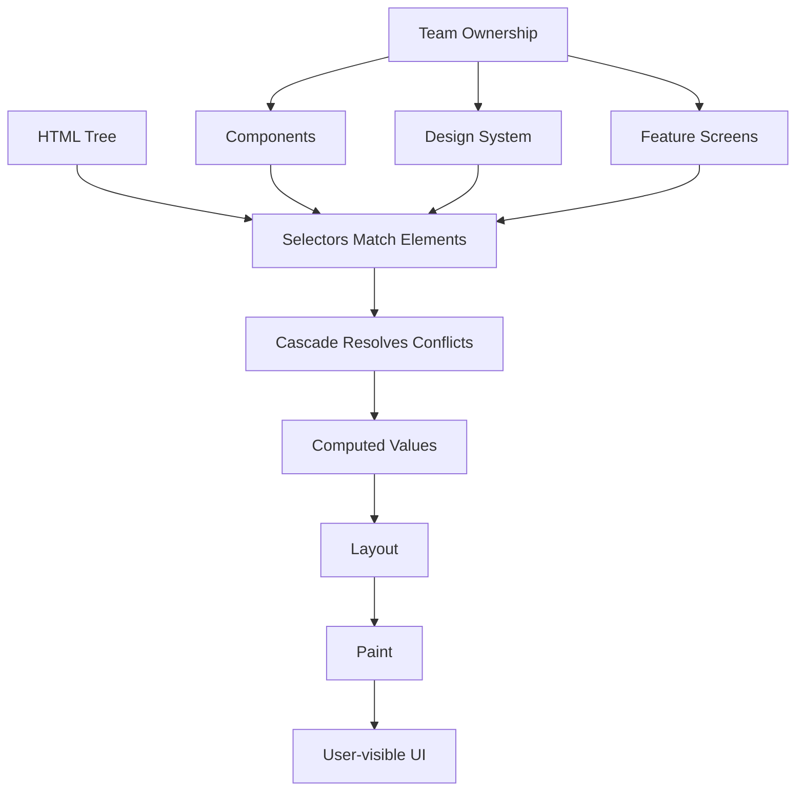
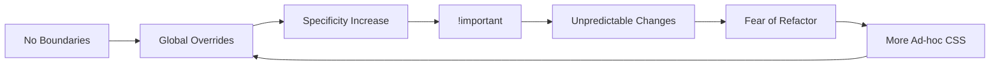
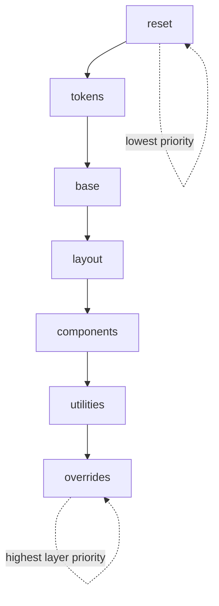
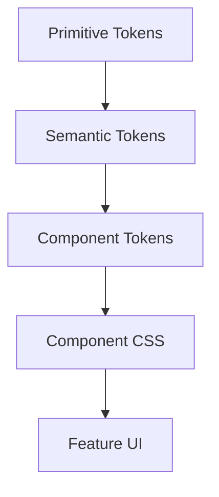
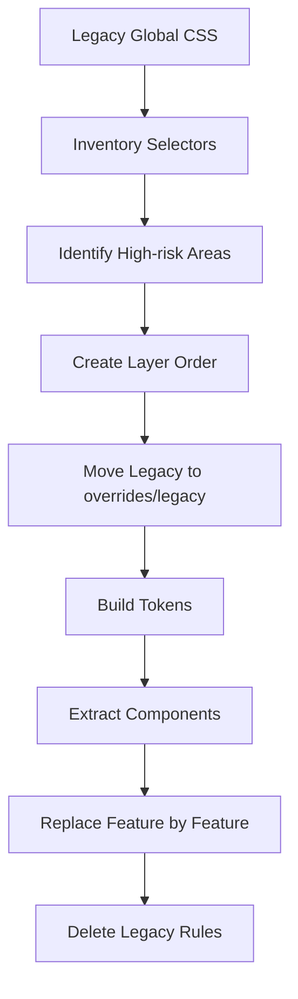

# Part 25 — CSS Architecture: Naming, Boundaries, Layers, Utilities, Components, and Design Systems

## 1. Tujuan Part Ini

Di part sebelumnya, kita sudah membangun fondasi CSS: cascade, specificity, selector, box model, layout, responsive design, typography, color, spacing, dan motion. Semua itu masih belum cukup untuk sistem nyata.

Dalam aplikasi kecil, CSS bisa terasa sederhana. Dalam aplikasi besar, CSS berubah menjadi sistem dependensi global yang sulit dikendalikan:

- perubahan satu class memecahkan halaman lain,
- selector makin spesifik karena saling menimpa,
- `!important` menjadi senjata harian,
- komponen punya style tersebar di banyak file,
- design token tidak konsisten,
- dark mode dan high contrast menjadi patch belakangan,
- tim tidak tahu rule mana yang boleh diubah,
- UI menjadi kumpulan pengecualian.

Arsitektur CSS adalah disiplin untuk mengelola risiko itu.

Target part ini: setelah selesai, kamu mampu merancang struktur CSS yang scalable untuk aplikasi production, bukan hanya menulis style yang “kelihatan benar”.

---

## 2. Mental Model: CSS Itu Global Constraint System

CSS bukan modul lokal secara default. CSS adalah sistem global yang bekerja berdasarkan:

1. selector matching,
2. cascade,
3. inheritance,
4. source order,
5. specificity,
6. layer order,
7. runtime state DOM,
8. viewport/container state,
9. user preferences,
10. browser defaults.

Artinya, CSS bukan hanya “style file”. CSS adalah constraint system yang memutuskan bagaimana seluruh document tree direpresentasikan secara visual.

Masalah arsitektur muncul karena CSS punya kekuatan global, tetapi produk biasanya butuh ownership lokal.



Arsitektur CSS yang baik menyelaraskan dua hal:

- cara browser menyelesaikan style,
- cara tim mengorganisasi ownership.

Kalau dua hal ini tidak selaras, CSS akan membusuk.

---

## 3. Apa Itu CSS Architecture?

CSS architecture adalah kumpulan keputusan yang menjawab pertanyaan berikut:

| Pertanyaan | Contoh Keputusan |
|---|---|
| Di mana rule global boleh hidup? | `base`, `reset`, `tokens`, typography defaults |
| Bagaimana style component diberi nama? | BEM, CSS Modules, scoped class, utility composition |
| Bagaimana mencegah specificity war? | `@layer`, low-specificity selectors, `:where()` |
| Bagaimana theme bekerja? | custom properties dan semantic tokens |
| Bagaimana spacing/typography/color dikontrol? | design tokens |
| Apa boundary antara design system dan feature CSS? | public component API vs private implementation |
| Apa yang boleh di-override? | documented escape hatches |
| Bagaimana menghapus CSS lama? | ownership, grep-ability, visual regression |
| Bagaimana handle vendor/framework CSS? | dedicated layer/vendor import |

CSS architecture bukan tentang memilih BEM atau Tailwind. Itu hanya salah satu detail.

Intinya: membuat perubahan CSS menjadi predictable.

---

## 4. Failure Mode Utama: CSS Entropy

CSS entropy adalah kondisi ketika style system kehilangan struktur sampai setiap perubahan menjadi berisiko.

Gejalanya:

- class tidak bermakna: `.box`, `.left`, `.blue`, `.new-style`, `.fix-2`, `.card2`,
- selector panjang: `.page .content .panel .header .title span`,
- override berantai,
- file CSS besar tanpa ownership,
- rule tidak jelas masih dipakai atau tidak,
- banyak nilai hardcoded,
- variasi komponen dibuat dengan copy-paste,
- dark mode menumpuk selector baru,
- responsive behavior tersebar acak,
- accessibility state tidak distyling konsisten.

CSS entropy biasanya bukan karena developer tidak paham CSS. Penyebabnya adalah tidak ada architecture constraints.



---

## 5. Prinsip Arsitektur CSS yang Baik

Ada tujuh prinsip utama.

### 5.1 Explicit Boundary

Setiap rule harus punya boundary:

- global base,
- token,
- utility,
- component,
- layout,
- feature,
- vendor,
- override.

Rule tanpa boundary adalah future bug.

### 5.2 Low Specificity by Default

Specificity tinggi membuat extension sulit. Default terbaik adalah class-based, shallow, dan predictable.

Buruk:

```css
main .case-page .panel .panel-header h2.title span {
  color: red;
}
```

Lebih baik:

```css
.case-panel__title {
  color: var(--color-text-strong);
}
```

Atau dengan utility:

```html
<h2 class="text-strong">Case Details</h2>
```

### 5.3 Tokenize Decisions, Not Everything

Token dipakai untuk keputusan desain yang perlu konsisten:

- color,
- spacing,
- radius,
- shadow,
- typography,
- z-index,
- duration/easing,
- breakpoints/container sizes.

Tidak semua nilai harus menjadi token. Token yang terlalu banyak membuat sistem tidak bisa dipakai.

### 5.4 Components Own Their Internal Structure

Feature screen boleh menyusun component, tetapi tidak boleh bergantung pada internal markup component.

Buruk:

```css
.case-page .button span:first-child {
  margin-right: 8px;
}
```

Lebih baik:

```html
<button class="button button--with-icon">
  <svg class="button__icon"></svg>
  <span class="button__label">Submit</span>
</button>
```

### 5.5 Prefer Composition Over Override

Kalau variasi komponen dibuat dengan override selector, sistem akan rapuh.

Buruk:

```css
.card {
  padding: 1rem;
  background: white;
}

.case-page .card {
  padding: 2rem;
  background: #f9fafb;
}
```

Lebih baik:

```html
<section class="card card--comfortable card--muted"></section>
```

Atau tokenized:

```css
.card {
  padding: var(--card-padding, var(--space-4));
  background: var(--card-bg, var(--color-surface));
}

.card--comfortable {
  --card-padding: var(--space-6);
}

.card--muted {
  --card-bg: var(--color-surface-muted);
}
```

### 5.6 Separate Semantic State From Visual Style

State harus merepresentasikan kondisi domain atau UI, bukan warna.

Buruk:

```html
<span class="badge badge--green">Approved</span>
```

Lebih baik:

```html
<span class="badge" data-status="approved">Approved</span>
```

```css
.badge[data-status="approved"] {
  --badge-bg: var(--color-success-bg);
  --badge-fg: var(--color-success-fg);
}
```

### 5.7 Make Deletion Safe

CSS architecture yang baik membuat rule bisa dihapus dengan confidence.

Syaratnya:

- class names searchable,
- ownership jelas,
- file structure jelas,
- visual regression tersedia,
- selector tidak terlalu generik,
- legacy layer terisolasi.

---

## 6. Layered CSS Architecture

CSS modern punya fitur penting: cascade layers (`@layer`). Dengan layer, kita bisa mengatur prioritas kategori style tanpa menaikkan specificity.

Contoh struktur:

```css
@layer reset, tokens, base, layout, components, utilities, overrides;
```

Layer yang dideklarasikan belakangan punya prioritas lebih tinggi dalam origin yang sama. Jadi `utilities` bisa menang dari `components` tanpa perlu selector lebih spesifik.

```css
@layer reset {
  *,
  *::before,
  *::after {
    box-sizing: border-box;
  }
}

@layer tokens {
  :root {
    --space-1: 0.25rem;
    --space-2: 0.5rem;
    --space-4: 1rem;
    --color-text: #111827;
    --color-surface: #ffffff;
  }
}

@layer base {
  body {
    margin: 0;
    color: var(--color-text);
    background: var(--color-surface);
    font-family: system-ui, sans-serif;
  }
}

@layer components {
  .button {
    display: inline-flex;
    align-items: center;
    gap: var(--space-2);
    padding: var(--space-2) var(--space-4);
  }
}

@layer utilities {
  .hidden {
    display: none;
  }
}
```

Diagram layer:



### Kenapa Layer Berguna?

Tanpa layer, CSS sering memaksa kita menaikkan specificity.

Dengan layer:

- reset tidak perlu melawan component,
- component tidak perlu selector panjang,
- utility bisa sengaja override component,
- vendor CSS bisa ditaruh di layer rendah,
- legacy CSS bisa dikurung,
- design system bisa punya kontrak prioritas.

### Contoh Vendor Isolation

```css
@import url("vendor-datepicker.css") layer(vendor);

@layer reset, vendor, tokens, base, components, utilities, overrides;
```

Dengan ini, style vendor tidak diam-diam mengalahkan component system kecuali sengaja diberi layer lebih tinggi.

---

## 7. Recommended Layer Contract

Untuk aplikasi production, struktur ini cukup kuat:

```css
@layer reset, vendor, tokens, base, layout, components, patterns, utilities, overrides;
```

| Layer | Isi | Boleh Override? | Catatan |
|---|---|---:|---|
| `reset` | reset kecil, `box-sizing`, media defaults | tidak | jangan isi visual design |
| `vendor` | library eksternal | tidak langsung | wrap/override di layer lain |
| `tokens` | custom properties global | ya, via theme scope | tidak berisi selector component |
| `base` | default element: body, headings, links, form basics | jarang | low specificity |
| `layout` | page shell, grid utilities, regions | ya | jangan style component detail |
| `components` | button, card, input, badge, table | via API | pemilik internal UI |
| `patterns` | composition: toolbar, filter panel, timeline | terbatas | lebih besar dari component |
| `utilities` | single-purpose helpers | ya | sengaja override kecil |
| `overrides` | temporary exceptions | harus tracked | wajib punya ticket/komentar |

Rule penting: `overrides` bukan tempat tinggal permanen.

---

## 8. Reset vs Normalize vs Base

Reset bukan architecture. Reset hanya baseline.

Ada tiga kategori yang sering dicampur:

### 8.1 Reset

Menghapus default yang menyulitkan konsistensi.

```css
@layer reset {
  *,
  *::before,
  *::after {
    box-sizing: border-box;
  }

  body {
    margin: 0;
  }

  img,
  picture,
  svg,
  video,
  canvas {
    display: block;
    max-inline-size: 100%;
  }
}
```

### 8.2 Normalize

Membuat default browser lebih konsisten tanpa menghapus semua style.

### 8.3 Base

Memberikan default project-specific.

```css
@layer base {
  body {
    font-family: var(--font-sans);
    line-height: 1.5;
    color: var(--color-text);
    background: var(--color-bg);
  }

  a {
    color: var(--color-link);
    text-underline-offset: 0.18em;
  }

  :focus-visible {
    outline: var(--focus-ring-width) solid var(--color-focus-ring);
    outline-offset: var(--focus-ring-offset);
  }
}
```

Base layer boleh punya opini, tetapi jangan terlalu banyak. Jika semua elemen HTML diberi style agresif, component sulit diprediksi.

---

## 9. Naming Strategy

Naming adalah API manusia untuk CSS.

Class name yang baik harus:

- menggambarkan purpose,
- stabil terhadap perubahan visual,
- mudah dicari,
- tidak terlalu generik,
- tidak bocor ke domain lain kecuali memang domain component,
- mendukung states/variants.

### 9.1 Bad Names

```html
<div class="box blue big left old-v2"></div>
```

Masalah:

- `box` terlalu generik,
- `blue` visual, bukan makna,
- `big` relatif,
- `left` layout-specific,
- `old-v2` tidak menjelaskan kontrak.

### 9.2 Better Names

```html
<section class="case-summary-card case-summary-card--priority-high"></section>
```

Atau design-system oriented:

```html
<section class="card card--elevated" data-priority="high"></section>
```

Pilihan tergantung boundary:

- `case-summary-card` cocok jika component spesifik domain,
- `card` cocok jika component reusable design system.

---

## 10. BEM: Block, Element, Modifier

BEM adalah convention lama tapi masih berguna karena eksplisit.

Format umum:

```text
.block
.block__element
.block--modifier
.block__element--modifier
```

Contoh:

```html
<article class="case-card case-card--urgent">
  <header class="case-card__header">
    <h2 class="case-card__title">Case #A-2041</h2>
    <span class="case-card__status">Escalated</span>
  </header>
  <p class="case-card__summary">Potential breach detected.</p>
</article>
```

```css
@layer components {
  .case-card {
    padding: var(--space-4);
    border: 1px solid var(--color-border);
    border-radius: var(--radius-md);
    background: var(--color-surface);
  }

  .case-card__header {
    display: flex;
    justify-content: space-between;
    gap: var(--space-3);
  }

  .case-card__title {
    margin: 0;
    font-size: var(--font-size-lg);
  }

  .case-card--urgent {
    border-color: var(--color-danger-border);
  }
}
```

### Kelebihan BEM

- searchable,
- low specificity,
- ownership jelas,
- mudah dipakai tanpa build tool,
- cocok untuk server-rendered HTML,
- cocok untuk design system static.

### Kekurangan BEM

- class panjang,
- markup verbose,
- modifier bisa meledak,
- tidak otomatis membatasi scope,
- butuh disiplin manual.

### BEM yang Sehat

Gunakan BEM jika:

- project tidak memakai scoped CSS,
- banyak server-rendered templates,
- tim butuh convention eksplisit,
- design system perlu CSS plain.

Hindari BEM ekstrem:

```html
<div class="page__section__card__header__title"></div>
```

Element BEM bukan path tree. Element adalah bagian langsung dari konsep block.

---

## 11. Utility-First Thinking

Utility class adalah class kecil dengan satu responsibility.

Contoh:

```html
<div class="flex items-center gap-2 p-4 rounded-md border"></div>
```

Utility-first populer karena mempercepat development dan mengurangi custom CSS. Namun utility-first bukan berarti tanpa arsitektur.

### Kapan Utility Cocok?

Utility cocok untuk:

- spacing kecil,
- layout composition,
- typography adjustment,
- visibility,
- alignment,
- responsive tweaks,
- prototyping,
- design-token-backed styling.

### Kapan Utility Tidak Cukup?

Utility kurang cocok jika:

- komponen punya banyak state,
- style butuh semantic contract,
- markup menjadi terlalu sulit dibaca,
- ada repeated pattern besar,
- design rule butuh invariant,
- accessibility state perlu konsisten.

Contoh utility overuse:

```html
<button class="inline-flex items-center justify-center gap-2 rounded-md border px-4 py-2 text-sm font-medium shadow-sm transition hover:bg-gray-50 focus:outline-none focus:ring-2 disabled:opacity-50 disabled:pointer-events-none">
  Submit
</button>
```

Ini mungkin efektif di sistem tertentu, tetapi untuk design system internal, `button` seharusnya punya component contract.

Lebih maintainable:

```html
<button class="button button--primary">Submit</button>
```

### Hybrid Strategy

Strategi hybrid biasanya paling sehat:

- component class untuk primitive reusable,
- utility class untuk composition dan small layout adjustments,
- token system sebagai sumber nilai,
- cascade layers untuk mengatur prioritas.

```css
@layer components {
  .button {
    display: inline-flex;
    align-items: center;
    justify-content: center;
    gap: var(--space-2);
    min-block-size: var(--control-height-md);
    padding-inline: var(--space-4);
    border-radius: var(--radius-md);
  }
}

@layer utilities {
  .mt-4 {
    margin-block-start: var(--space-4);
  }

  .full-width {
    inline-size: 100%;
  }
}
```

---

## 12. Component CSS

Component CSS adalah style yang dimiliki oleh satu component boundary.

Boundary bisa berupa:

- BEM block,
- Vue single-file component,
- React component dengan CSS Modules,
- Web Component Shadow DOM,
- design system package,
- server-rendered partial.

Komponen yang baik punya:

- root class,
- internal elements,
- variants,
- states,
- public CSS custom properties bila perlu,
- documented slots/composition points,
- accessibility contract.

Contoh:

```html
<button class="button button--primary" data-size="md">
  <span class="button__label">Approve</span>
</button>
```

```css
@layer components {
  .button {
    --button-bg: var(--color-action-primary-bg);
    --button-fg: var(--color-action-primary-fg);
    --button-border: transparent;
    --button-height: var(--control-height-md);

    display: inline-flex;
    align-items: center;
    justify-content: center;
    gap: var(--space-2);
    min-block-size: var(--button-height);
    padding-inline: var(--button-padding-inline, var(--space-4));
    border: 1px solid var(--button-border);
    border-radius: var(--radius-md);
    color: var(--button-fg);
    background: var(--button-bg);
    font: inherit;
    font-weight: var(--font-weight-medium);
    cursor: pointer;
  }

  .button--secondary {
    --button-bg: var(--color-action-secondary-bg);
    --button-fg: var(--color-action-secondary-fg);
    --button-border: var(--color-border-strong);
  }

  .button[data-size="sm"] {
    --button-height: var(--control-height-sm);
    --button-padding-inline: var(--space-3);
  }

  .button:disabled {
    cursor: not-allowed;
    opacity: 0.55;
  }
}
```

Perhatikan bahwa modifier/state tidak menimpa banyak property. Mereka mengubah custom properties. Ini membuat variant lebih terkontrol.

---

## 13. CSS Modules Mental Model

CSS Modules, scoped CSS, atau build-time scoping mengubah class lokal menjadi nama unik.

Contoh source:

```css
.card {
  padding: 1rem;
}
```

Output bisa menjadi:

```css
.Card_card__x91ad {
  padding: 1rem;
}
```

Kelebihan:

- mengurangi collision,
- ownership component jelas,
- cocok untuk React/Vue/Svelte build pipeline,
- refactor lebih aman.

Namun CSS Modules tidak menghapus cascade. Ia hanya membatasi naming collision.

Masalah yang tetap ada:

- token strategy,
- global reset,
- utility ordering,
- theme inheritance,
- specificity,
- responsive behavior,
- accessibility state,
- composition antar component.

Jadi, CSS Modules bukan pengganti arsitektur. Ia adalah tool boundary.

---

## 14. Scoped CSS dan Shadow DOM

Ada beberapa cara membuat style lebih lokal.

| Mekanisme | Boundary | Catatan |
|---|---|---|
| BEM | convention manusia | tidak enforced |
| CSS Modules | build-time class renaming | bagus untuk app components |
| Vue scoped style | attribute scoping | tetap perlu desain global |
| Shadow DOM | browser-enforced encapsulation | kuat, tetapi theming/slots perlu desain |
| Inline style | element-level | buruk untuk pseudo-state/media queries |
| CSS-in-JS | runtime/build-time tergantung library | trade-off performance/ergonomics |

Shadow DOM sangat kuat untuk encapsulation, tetapi tidak otomatis membuat design system lebih mudah. Kamu tetap perlu mendesain API:

- CSS custom properties apa yang boleh di-override,
- part apa yang exposed via `::part`,
- slot apa yang tersedia,
- state apa yang direfleksikan ke attribute.

---

## 15. Design Tokens

Design token adalah nama untuk keputusan desain.

Contoh:

```css
@layer tokens {
  :root {
    --space-1: 0.25rem;
    --space-2: 0.5rem;
    --space-3: 0.75rem;
    --space-4: 1rem;

    --radius-sm: 0.25rem;
    --radius-md: 0.5rem;

    --color-neutral-0: #ffffff;
    --color-neutral-900: #111827;

    --color-text: var(--color-neutral-900);
    --color-surface: var(--color-neutral-0);
  }
}
```

Ada dua level token penting:

### 15.1 Primitive Tokens

Primitive token merepresentasikan nilai mentah.

```css
--blue-600: #2563eb;
--space-4: 1rem;
--font-size-3: 1rem;
```

### 15.2 Semantic Tokens

Semantic token merepresentasikan makna pemakaian.

```css
--color-action-primary-bg: var(--blue-600);
--color-danger-text: var(--red-700);
--space-card-padding: var(--space-4);
```

Komponen sebaiknya memakai semantic token, bukan primitive token langsung.

Buruk:

```css
.button {
  background: var(--blue-600);
}
```

Lebih baik:

```css
.button {
  background: var(--color-action-primary-bg);
}
```

Dengan semantic token, dark mode dan rebranding lebih mudah.

---

## 16. Token Taxonomy untuk Engineering System

Struktur token yang sehat:

```text
tokens/
  primitive/
    color.css
    size.css
    typography.css
  semantic/
    color.css
    spacing.css
    shadow.css
    motion.css
  component/
    button.css
    input.css
    card.css
```

Contoh:

```css
@layer tokens {
  :root {
    /* primitive */
    --color-blue-600: #2563eb;
    --color-blue-700: #1d4ed8;
    --color-gray-50: #f9fafb;
    --color-gray-900: #111827;

    /* semantic */
    --color-bg: var(--color-gray-50);
    --color-text: var(--color-gray-900);
    --color-action-primary-bg: var(--color-blue-600);
    --color-action-primary-bg-hover: var(--color-blue-700);

    /* component */
    --button-primary-bg: var(--color-action-primary-bg);
    --button-primary-bg-hover: var(--color-action-primary-bg-hover);
  }
}
```

Layering token seperti ini membuat dependency jelas:



Rule penting: arah dependency hanya turun. Component tidak boleh mengubah primitive token global.

---

## 17. Theme Architecture

Theming bukan mengganti warna satu per satu. Theming adalah mengganti token semantic pada scope tertentu.

```css
@layer tokens {
  :root {
    color-scheme: light;
    --color-bg: #ffffff;
    --color-text: #111827;
    --color-surface: #f9fafb;
    --color-border: #d1d5db;
  }

  [data-theme="dark"] {
    color-scheme: dark;
    --color-bg: #030712;
    --color-text: #f9fafb;
    --color-surface: #111827;
    --color-border: #374151;
  }
}
```

Komponen tidak perlu tahu theme saat ini.

```css
.card {
  color: var(--color-text);
  background: var(--color-surface);
  border-color: var(--color-border);
}
```

Ini separation of concerns yang benar:

- theme layer menentukan nilai semantic,
- component layer memakai semantic.

---

## 18. Public vs Private CSS API

Komponen harus punya API yang jelas.

### Private Implementation

Hal-hal ini tidak boleh diandalkan consumer:

- internal element class,
- child order,
- internal selector,
- exact spacing internal,
- implementation markup.

### Public API

Hal-hal yang boleh dipakai consumer:

- root class,
- documented modifiers,
- documented data attributes,
- CSS custom properties yang sengaja diekspos,
- slots,
- part names jika memakai Web Components,
- accessible behavior.

Contoh public component API:

```html
<button class="button button--primary" data-size="md">
  Save
</button>
```

Allowed:

```css
.product-form {
  --button-radius: var(--radius-lg);
}
```

Not allowed:

```css
.product-form .button > span:first-child {
  margin-left: 12px;
}
```

---

## 19. Layout vs Component Boundary

Layout dan component harus dipisah.

Component bertanggung jawab atas internal appearance:

```css
.card {
  padding: var(--space-4);
  border: 1px solid var(--color-border);
  border-radius: var(--radius-md);
}
```

Parent layout bertanggung jawab atas posisi component dalam konteks:

```css
.case-dashboard {
  display: grid;
  grid-template-columns: repeat(auto-fit, minmax(18rem, 1fr));
  gap: var(--space-4);
}
```

Anti-pattern:

```css
.card {
  margin-block-end: var(--space-6);
}
```

Kenapa buruk? Karena component memaksakan spacing eksternal di semua konteks.

Lebih baik:

```css
.stack {
  display: grid;
  gap: var(--stack-gap, var(--space-4));
}
```

```html
<div class="stack">
  <article class="card"></article>
  <article class="card"></article>
</div>
```

---

## 20. Layout Primitives

Layout primitive adalah reusable layout class yang tidak membawa visual skin.

Contoh:

```css
@layer layout {
  .stack {
    display: grid;
    gap: var(--stack-gap, var(--space-4));
  }

  .cluster {
    display: flex;
    flex-wrap: wrap;
    align-items: center;
    gap: var(--cluster-gap, var(--space-2));
  }

  .sidebar-layout {
    display: grid;
    grid-template-columns: minmax(16rem, 22rem) minmax(0, 1fr);
    gap: var(--space-6);
  }

  .center {
    box-sizing: content-box;
    max-inline-size: var(--center-size, 72rem);
    margin-inline: auto;
    padding-inline: var(--space-4);
  }
}
```

Markup:

```html
<main class="center stack" style="--stack-gap: var(--space-6)">
  <section class="card">...</section>
  <section class="card">...</section>
</main>
```

Catatan: inline custom property kadang acceptable untuk composition token, tetapi jangan pakai inline style untuk arbitrary visual hack.

---

## 21. Patterns Layer

Component adalah unit kecil. Pattern adalah composition yang lebih besar.

Contoh component:

- Button,
- Input,
- Badge,
- Card,
- Table,
- Dialog.

Contoh pattern:

- Filter panel,
- Case timeline,
- Approval workflow toolbar,
- Master-detail shell,
- Empty state,
- Search result list,
- Audit trail.

Pattern layer berguna agar feature screen tidak membuat ulang composition berulang kali.

```css
@layer patterns {
  .case-header {
    display: grid;
    grid-template-columns: minmax(0, 1fr) auto;
    gap: var(--space-4);
    align-items: start;
  }

  .case-header__meta {
    display: flex;
    flex-wrap: wrap;
    gap: var(--space-2);
  }

  .case-header__actions {
    display: flex;
    gap: var(--space-2);
  }

  @container (max-width: 40rem) {
    .case-header {
      grid-template-columns: 1fr;
    }
  }
}
```

Pattern boleh domain-aware. Component design system sebaiknya tidak.

---

## 22. File Structure

Tidak ada satu struktur universal, tetapi struktur harus mencerminkan architecture.

Contoh untuk CSS plain:

```text
src/styles/
  index.css
  reset.css
  tokens/
    primitive.css
    semantic.css
    themes.css
  base/
    document.css
    typography.css
    forms.css
  layout/
    stack.css
    cluster.css
    shell.css
  components/
    button.css
    card.css
    input.css
    badge.css
    table.css
    dialog.css
  patterns/
    case-header.css
    filter-panel.css
    timeline.css
  utilities/
    display.css
    spacing.css
    text.css
  overrides/
    legacy-migration.css
```

`index.css`:

```css
@layer reset, vendor, tokens, base, layout, components, patterns, utilities, overrides;

@import url("./reset.css") layer(reset);
@import url("./tokens/primitive.css") layer(tokens);
@import url("./tokens/semantic.css") layer(tokens);
@import url("./tokens/themes.css") layer(tokens);
@import url("./base/document.css") layer(base);
@import url("./base/typography.css") layer(base);
@import url("./layout/stack.css") layer(layout);
@import url("./components/button.css") layer(components);
@import url("./components/card.css") layer(components);
@import url("./patterns/case-header.css") layer(patterns);
@import url("./utilities/display.css") layer(utilities);
@import url("./overrides/legacy-migration.css") layer(overrides);
```

Keuntungan:

- order eksplisit,
- import mudah diaudit,
- layer tidak bergantung pada urutan file acak,
- ownership terlihat dari path.

---

## 23. Specificity Budget

Arsitektur CSS harus punya specificity budget.

Rekomendasi:

| Kategori | Specificity Ideal | Contoh |
|---|---:|---|
| reset | 0–1 class max | `:where(*)` |
| base | element atau low specificity | `body`, `a` |
| component | 1 class | `.button` |
| component state | 1 class + pseudo/data | `.button:hover`, `.button[data-size="sm"]` |
| pattern | 1 class + child element | `.case-header__actions` |
| utility | 1 class | `.mt-4` |
| override | documented only | `.legacy .button` |

Gunakan `:where()` untuk menurunkan specificity reset/base.

```css
@layer reset {
  :where(ul, ol) {
    padding-inline-start: 1.25em;
  }
}
```

Jangan jadikan `id` selector sebagai styling default. `id` terlalu spesifik dan lebih cocok untuk anchors, form association, atau scripting target spesifik.

---

## 24. Utility Layer With Tokens

Utility yang baik sebaiknya token-backed.

```css
@layer utilities {
  .sr-only {
    position: absolute;
    inline-size: 1px;
    block-size: 1px;
    padding: 0;
    margin: -1px;
    overflow: hidden;
    clip: rect(0, 0, 0, 0);
    white-space: nowrap;
    border: 0;
  }

  .flow > * + * {
    margin-block-start: var(--flow-space, var(--space-4));
  }

  .text-muted {
    color: var(--color-text-muted);
  }

  .visually-hidden-focusable:not(:focus):not(:focus-within) {
    position: absolute;
    inline-size: 1px;
    block-size: 1px;
    overflow: hidden;
    clip: rect(0, 0, 0, 0);
    white-space: nowrap;
  }
}
```

Hindari utility yang menjadi arbitrary value dumping ground tanpa governance.

---

## 25. Handling Overrides Without Chaos

Override kadang perlu:

- vendor bug,
- legacy migration,
- urgent production fix,
- third-party embed,
- feature flag transition,
- A/B test.

Tetapi override harus temporary dan traceable.

Contoh acceptable:

```css
@layer overrides {
  /* TODO CASE-4821: remove after legacy datepicker is replaced. */
  .legacy-datepicker .button {
    min-block-size: 2rem;
  }
}
```

Override rule:

1. harus berada di `overrides` layer,
2. harus punya alasan,
3. harus punya owner/ticket,
4. harus punya removal condition,
5. tidak boleh menjadi pattern permanen.

---

## 26. Enterprise Case Management Example

Bayangkan aplikasi case management regulatory.

Screen utama:

- app shell,
- sidebar navigation,
- case header,
- status badge,
- action toolbar,
- evidence table,
- timeline,
- decision form,
- audit trail.

Arsitektur CSS:

```text
base:
  document, typography, focus, forms
layout:
  app-shell, content-region, split-pane
components:
  button, badge, card, table, input, select, dialog
patterns:
  case-header, evidence-table, audit-trail, workflow-stepper
utilities:
  sr-only, text-muted, full-width, flow, cluster
feature:
  minimal glue only
```

HTML:

```html
<main class="app-shell__main">
  <div class="center stack" style="--stack-gap: var(--space-6)">
    <header class="case-header">
      <div class="case-header__content">
        <p class="eyebrow">Case #ENF-2026-1842</p>
        <h1>Potential Reporting Breach</h1>
        <div class="case-header__meta">
          <span class="badge" data-status="escalated">Escalated</span>
          <span class="text-muted">Updated 2 hours ago</span>
        </div>
      </div>

      <div class="case-header__actions cluster">
        <button class="button button--secondary">Assign</button>
        <button class="button button--primary">Open Review</button>
      </div>
    </header>

    <section class="card">
      <h2>Evidence</h2>
      <div class="table-scroll">
        <table class="data-table">...</table>
      </div>
    </section>
  </div>
</main>
```

CSS ownership:

- `.button` belongs to design system,
- `.badge` belongs to design system,
- `.card` belongs to design system,
- `.cluster` and `.center` belong to layout primitives,
- `.case-header` belongs to pattern layer,
- `.app-shell` belongs to layout layer,
- feature page should not style `.button__label` internals.

---

## 27. CSS Architecture Decision Record

Untuk tim besar, setiap perubahan architecture harus dicatat seperti ADR.

Contoh:

```md
# ADR: Adopt Cascade Layers for CSS Ordering

## Context
Current CSS relies on import order and specificity. Vendor styles and feature styles frequently override design system components unintentionally.

## Decision
Adopt global layer order:
reset, vendor, tokens, base, layout, components, patterns, utilities, overrides.

## Consequences
- All CSS imports must specify layer.
- Existing legacy CSS will be placed in overrides temporarily.
- New component CSS must live in components layer.
- Utility classes intentionally win over component defaults.
```

Architecture tanpa decision record akan hilang saat tim berubah.

---

## 28. CSS Code Review Checklist

Gunakan checklist ini untuk review CSS production.

### Boundary

- Apakah rule berada di layer yang benar?
- Apakah selector punya ownership jelas?
- Apakah component internal diubah dari luar?
- Apakah ada global selector yang terlalu luas?

### Specificity

- Apakah selector bisa dibuat lebih sederhana?
- Apakah ada `id` selector?
- Apakah ada `!important`?
- Apakah override bisa diganti dengan layer/order/API?

### Tokens

- Apakah warna/spacing/font/shadow memakai token?
- Apakah component memakai semantic token, bukan primitive token langsung?
- Apakah state color accessible?

### Component

- Apakah states lengkap?
- Apakah variants eksplisit?
- Apakah loading/disabled/error/empty state terpikirkan?
- Apakah component punya public API yang jelas?

### Responsive

- Apakah layout pakai intrinsic/container-aware strategy?
- Apakah breakpoint tidak arbitrary?
- Apakah component tetap jalan dalam container kecil?

### Accessibility

- Apakah focus visible jelas?
- Apakah state visual tidak hanya warna?
- Apakah disabled/loading state tetap bisa dipahami?
- Apakah reduced motion dihormati?

### Maintainability

- Apakah class searchable?
- Apakah rule bisa dihapus aman?
- Apakah override temporary punya alasan?
- Apakah CSS duplication perlu diekstrak ke component/pattern?

---

## 29. Refactoring Legacy CSS

Legacy CSS tidak bisa diperbaiki sekaligus. Gunakan strangler pattern.



Langkah praktis:

1. freeze penambahan CSS global acak,
2. buat layer order,
3. pindahkan legacy ke layer terisolasi,
4. buat token minimal,
5. extract component paling sering dipakai,
6. migrasi screen by screen,
7. tambahkan visual regression,
8. hapus rule lama.

Jangan mulai dari membuat design system sempurna. Mulai dari boundary.

---

## 30. Practice: Build a Mini CSS Architecture

Buat struktur berikut:

```text
styles/
  index.css
  reset.css
  tokens.css
  base.css
  layout.css
  components.css
  patterns.css
  utilities.css
```

Buat UI:

- app shell,
- header,
- card,
- button,
- badge,
- table,
- filter panel.

Syarat:

- semua import memakai `@layer`,
- tidak boleh pakai `!important`,
- selector component maksimal 1 class + state,
- semua warna lewat semantic token,
- utility hanya single-purpose,
- layout spacing tidak dipasang di component root,
- dark mode hanya mengubah token,
- focus style ada di base/component.

Review hasil dengan checklist part ini.

---

## 31. Common Anti-Patterns

### 31.1 Global Page Selector

```css
.case-page .button {
  background: red;
}
```

Ini override component dari luar. Gunakan variant atau token API.

### 31.2 Visual Naming

```css
.green-badge {}
```

Gunakan semantic state.

```css
.badge[data-status="approved"] {}
```

### 31.3 Component With External Margin

```css
.card {
  margin-bottom: 2rem;
}
```

Gunakan layout primitive.

### 31.4 Specificity Arms Race

```css
body main .page .card.card.card h2 {}
```

Gunakan layer dan class sederhana.

### 31.5 Token Explosion

```css
--blue-button-special-case-modal-admin-hover-bg: #123456;
```

Token terlalu spesifik menjadi hardcoded value dengan nama panjang.

### 31.6 Override Layer Menjadi Tempat Sampah

Kalau semua fix masuk `overrides`, architecture gagal. Override harus temporary.

---

## 32. Top 1% Engineer Mental Model

Engineer kuat tidak menulis CSS berdasarkan tampilan satu layar. Ia mendesain sistem dengan invariants.

Invariants untuk CSS architecture:

- CSS global by default, jadi boundary harus eksplisit.
- Specificity adalah budget, bukan resource tak terbatas.
- Component harus punya public API dan private implementation.
- Token merepresentasikan keputusan desain, bukan sekadar value.
- Theme mengganti semantic token, bukan component satu per satu.
- Layout eksternal bukan tanggung jawab component visual.
- Override adalah hutang dengan tanggal jatuh tempo.
- Accessibility state adalah bagian dari component contract.
- Deletion safety adalah indikator architecture sehat.

---

## 33. Ringkasan

CSS architecture adalah disiplin untuk membuat UI system bisa berubah tanpa runtuh.

Kamu tidak perlu memilih satu dogma. Dalam praktik production, kombinasi yang sering paling kuat adalah:

- cascade layers untuk ordering,
- design tokens untuk keputusan visual,
- component CSS untuk reusable primitives,
- layout primitives untuk composition,
- utility class untuk small adjustments,
- pattern layer untuk UI domain yang berulang,
- documented overrides untuk migration,
- visual/accessibility testing untuk safety.

Part berikutnya akan memperdalam component sebagai contract: states, variants, slots, composition, custom properties sebagai API, data attributes, dan invariant-driven styling.

---

## 34. Referensi Utama

- W3C / CSSWG — CSS Cascading and Inheritance Level 5: `https://www.w3.org/TR/css-cascade-5/`
- CSSWG Draft — CSS Cascade 5 editor draft: `https://drafts.csswg.org/css-cascade-5/`
- MDN — Cascade layers: `https://developer.mozilla.org/en-US/docs/Learn_web_development/Core/Styling_basics/Cascade_layers`
- MDN — Specificity: `https://developer.mozilla.org/en-US/docs/Web/CSS/CSS_cascade/Specificity`
- MDN — CSS custom properties: `https://developer.mozilla.org/en-US/docs/Web/CSS/Guides/Cascading_variables/Using_custom_properties`
- MDN — Attribute selectors: `https://developer.mozilla.org/en-US/docs/Web/CSS/Reference/Selectors/Attribute_selectors`
