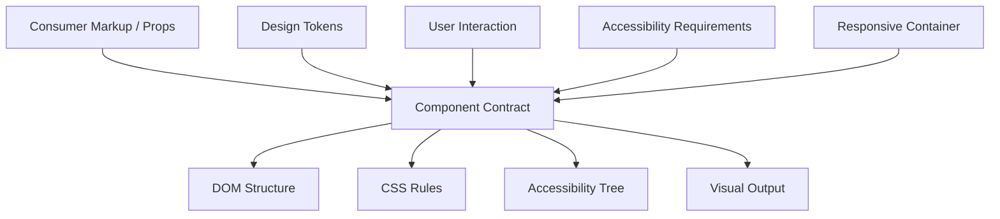
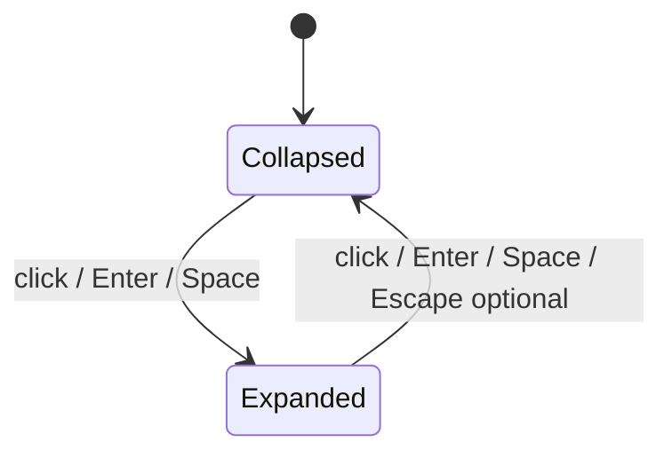

# Part 26 — Component Contracts: States, Variants, Slots, Composition, and UI Invariants

## 1. Tujuan Part Ini

Part sebelumnya membahas arsitektur CSS pada level sistem: layer, naming, tokens, utility, component, pattern, dan design system boundaries.

Part ini turun satu level: bagaimana mendesain satu komponen UI agar kuat.

Komponen UI production bukan sekadar potongan HTML dengan class. Komponen adalah contract antara:

- consumer,
- design system,
- accessibility tree,
- browser behavior,
- state machine aplikasi,
- CSS architecture,
- testing strategy,
- product workflow.

Target part ini: kamu mampu mendesain komponen seperti engineer, bukan hanya stylist.

---

## 2. Mental Model: Component = Contract

Komponen adalah boundary dengan input, output, state, invariant, dan failure mode.



Komponen yang buruk hanya mendefinisikan tampilan default.

Komponen yang baik mendefinisikan:

- apa yang boleh dikonfigurasi,
- apa yang tidak boleh disentuh,
- state apa yang didukung,
- variant apa yang valid,
- layout apa yang diasumsikan,
- accessibility behavior apa yang wajib,
- bagaimana komponen bereaksi pada container kecil,
- bagaimana komponen bekerja dalam theme berbeda,
- bagaimana komponen gagal secara aman.

---

## 3. Anatomy of a Component

Setiap komponen bisa dianalisis dengan anatomy berikut:

| Bagian | Fungsi |
|---|---|
| Root | boundary utama komponen |
| Parts/elements | struktur internal |
| Content slot | tempat consumer memasukkan konten |
| Variant | pilihan style bermakna |
| State | kondisi runtime |
| Size/density | skala ukuran |
| Tokens | nilai desain yang dikonsumsi |
| Public API | class/attribute/custom property yang boleh dipakai |
| Private implementation | detail internal yang tidak boleh diandalkan |
| Accessibility contract | semantic role, name, keyboard, focus |
| Layout contract | apakah komponen inline/block/fluid/fixed |
| Failure handling | overflow, empty, loading, disabled, error |

Contoh komponen `Button`:

```html
<button class="button button--primary" data-size="md" type="button">
  <span class="button__label">Approve</span>
</button>
```

Contract minimal:

- root: `.button`,
- variants: `.button--primary`, `.button--secondary`, `.button--danger`,
- sizes: `data-size="sm|md|lg"`,
- states: `:hover`, `:focus-visible`, `:active`, `:disabled`, `[aria-busy="true"]`,
- internal: `.button__label`, `.button__icon`,
- layout: inline-flex,
- accessible name: content atau `aria-label`,
- action semantics: gunakan native `<button>`, bukan `<div role="button">`.

---

## 4. State, Variant, and Mode: Jangan Dicampur

Tiga konsep ini sering dicampur.

### 4.1 Variant

Variant adalah pilihan desain stabil yang dipilih consumer.

Contoh:

- primary,
- secondary,
- ghost,
- danger,
- success,
- compact,
- elevated.

Variant biasanya bukan kondisi sementara.

```html
<button class="button button--danger">Delete</button>
```

### 4.2 State

State adalah kondisi runtime atau interaksi.

Contoh:

- hover,
- focus,
- active,
- disabled,
- loading,
- expanded,
- selected,
- invalid,
- checked,
- current,
- busy.

State bisa berasal dari:

- pseudo-class: `:hover`, `:focus-visible`, `:disabled`,
- attribute HTML: `disabled`, `open`, `checked`, `required`,
- ARIA: `aria-expanded`, `aria-selected`, `aria-invalid`,
- data attribute: `data-state="loading"`,
- framework state.

### 4.3 Mode

Mode adalah konteks lebih luas yang mengubah beberapa komponen sekaligus.

Contoh:

- dark mode,
- high contrast,
- compact density,
- print mode,
- readonly mode,
- reduced motion.

Mode biasanya bekerja lewat scope token.

```css
[data-density="compact"] {
  --control-height-md: 2rem;
  --space-control-gap: var(--space-1);
}
```

Rule: jangan pakai variant untuk state, jangan pakai state untuk theme, jangan pakai theme untuk domain status.

---

## 5. State Taxonomy untuk UI Production

Komponen production harus memikirkan state lebih banyak daripada “normal dan hover”.

| State | Contoh | Catatan |
|---|---|---|
| default | button idle | baseline |
| hover | pointer over | jangan satu-satunya feedback |
| focus-visible | keyboard focus | wajib jelas |
| active/pressed | mouse down/touch | immediate feedback |
| disabled | tidak bisa dipakai | semantic disabled jika native control |
| readonly | bisa dibaca, tidak diedit | beda dari disabled |
| loading | request berjalan | cegah double-submit |
| busy | region sedang update | bisa pakai `aria-busy` |
| invalid | input error | `aria-invalid`, message association |
| expanded/collapsed | disclosure | `aria-expanded` |
| selected | tabs/listbox | `aria-selected` sesuai pattern |
| checked | checkbox/switch | native atau ARIA sesuai pattern |
| current | nav current page/step | `aria-current` |
| empty | no data | bukan error |
| error | gagal memuat/submit | actionable recovery |
| success | operasi berhasil | transient atau persisted |
| warning | risiko/perhatian | jangan hanya warna |

Komponen yang tidak mendefinisikan state akan dipatch oleh screen-specific CSS. Itulah awal entropy.

---

## 6. Attribute-Driven State

Untuk state yang bermakna pada DOM/accessibility, gunakan attribute semantic bila tersedia.

Contoh native:

```html
<button disabled>Submit</button>
<input required aria-invalid="true" aria-describedby="email-error" />
<details open>...</details>
```

Contoh ARIA:

```html
<button aria-expanded="false" aria-controls="filters-panel">
  Filters
</button>
```

Contoh data attribute untuk state internal visual:

```html
<button class="button" data-state="loading" aria-busy="true">
  <span class="button__spinner" aria-hidden="true"></span>
  <span class="button__label">Saving</span>
</button>
```

CSS:

```css
.button[data-state="loading"] {
  cursor: progress;
}

.button[aria-busy="true"] .button__spinner {
  display: inline-block;
}
```

Gunakan data attribute untuk state yang tidak punya semantic HTML/ARIA bawaan, tetapi tetap dokumentasikan nilainya.

---

## 7. Data Attributes as Component API

`data-*` berguna untuk component state dan variant karena:

- valid HTML,
- mudah dibaca,
- bisa dipilih CSS dengan attribute selector,
- bisa diubah JS/framework,
- tidak menambah class explosion.

Contoh:

```html
<span class="badge" data-tone="warning" data-size="sm">
  Pending Review
</span>
```

```css
.badge {
  --badge-bg: var(--color-neutral-bg);
  --badge-fg: var(--color-neutral-fg);
  --badge-padding-inline: var(--space-2);

  display: inline-flex;
  align-items: center;
  gap: var(--space-1);
  padding-inline: var(--badge-padding-inline);
  border-radius: var(--radius-pill);
  background: var(--badge-bg);
  color: var(--badge-fg);
}

.badge[data-tone="warning"] {
  --badge-bg: var(--color-warning-bg);
  --badge-fg: var(--color-warning-fg);
}

.badge[data-size="sm"] {
  --badge-padding-inline: var(--space-1);
}
```

### Data Attribute Rules

- gunakan nilai terbatas,
- dokumentasikan enum,
- jangan menyimpan data sensitif,
- jangan jadikan data attribute dumping ground,
- gunakan semantic attribute native/ARIA jika memang ada.

Buruk:

```html
<div data-color="#ff0000" data-margin="17px" data-click="delete-user-now"></div>
```

Lebih baik:

```html
<span class="badge" data-tone="danger">Blocked</span>
```

---

## 8. Custom Properties as Component API

CSS custom properties bisa menjadi API komponen.

Contoh:

```css
.card {
  --card-padding: var(--space-4);
  --card-bg: var(--color-surface);
  --card-border-color: var(--color-border);

  padding: var(--card-padding);
  background: var(--card-bg);
  border: 1px solid var(--card-border-color);
  border-radius: var(--radius-md);
}
```

Consumer bisa mengubah konfigurasi yang sengaja dibuka:

```html
<section class="card" style="--card-padding: var(--space-6)">
  ...
</section>
```

Atau dari parent scope:

```css
.case-summary-region {
  --card-padding: var(--space-6);
}
```

### Custom Property API yang Baik

- punya fallback,
- memakai semantic token,
- jumlah terbatas,
- mendukung theme,
- tidak membuka semua detail internal,
- documented.

Buruk:

```css
.button {
  --button-padding-left-special: 13px;
  --button-label-transform-hover-danger: translateX(2px);
  --button-internal-border-debug: red;
}
```

API terlalu besar membuat komponen tidak punya invariant.

---

## 9. Component Invariants

Invariant adalah kondisi yang harus selalu benar.

Untuk button:

- harus punya accessible name,
- harus terlihat focus saat keyboard navigation,
- tidak boleh submit form secara tidak sengaja jika bukan submit action,
- disabled state tidak boleh clickable,
- loading state tidak boleh double-submit,
- label tidak boleh hilang saat loading kecuali ada alternative name,
- icon-only button harus punya `aria-label`,
- touch target harus cukup besar untuk konteks produk,
- text harus tetap terbaca dalam high contrast/dark mode.

Untuk card:

- content tidak boleh overflow horizontal tanpa alasan,
- heading hierarchy harus masuk akal,
- clickable card tidak boleh menelan interactive child secara salah,
- status tidak boleh disampaikan hanya warna.

Untuk table:

- header association harus benar,
- sorting state harus jelas,
- horizontal scroll tidak boleh menyembunyikan context penting,
- row selection harus keyboard-accessible jika interaktif.

Invariants lebih penting daripada style default.

---

## 10. Button Contract Deep Dive

### 10.1 Markup

```html
<button class="button button--primary" data-size="md" type="button">
  <span class="button__label">Approve Case</span>
</button>
```

Kenapa `type="button"`? Di dalam form, default `<button>` adalah submit. Untuk action non-submit, eksplisitkan type.

### 10.2 Variants

```html
<button class="button button--primary">Save</button>
<button class="button button--secondary">Cancel</button>
<button class="button button--danger">Delete</button>
<button class="button button--ghost">View Details</button>
```

### 10.3 CSS

```css
@layer components {
  .button {
    --button-bg: var(--color-button-bg);
    --button-fg: var(--color-button-fg);
    --button-border: var(--color-button-border);
    --button-bg-hover: var(--color-button-bg-hover);
    --button-height: var(--control-height-md);
    --button-padding-inline: var(--space-4);

    display: inline-flex;
    align-items: center;
    justify-content: center;
    gap: var(--space-2);
    min-block-size: var(--button-height);
    padding-inline: var(--button-padding-inline);
    border: 1px solid var(--button-border);
    border-radius: var(--radius-md);
    background: var(--button-bg);
    color: var(--button-fg);
    font: inherit;
    font-weight: var(--font-weight-medium);
    line-height: 1;
    text-decoration: none;
    cursor: pointer;
  }

  .button:hover {
    background: var(--button-bg-hover);
  }

  .button:focus-visible {
    outline: var(--focus-ring-width) solid var(--color-focus-ring);
    outline-offset: var(--focus-ring-offset);
  }

  .button:disabled,
  .button[aria-disabled="true"] {
    cursor: not-allowed;
    opacity: 0.55;
  }

  .button--primary {
    --button-bg: var(--color-action-primary-bg);
    --button-fg: var(--color-action-primary-fg);
    --button-border: transparent;
    --button-bg-hover: var(--color-action-primary-bg-hover);
  }

  .button--danger {
    --button-bg: var(--color-danger-bg);
    --button-fg: var(--color-danger-fg);
    --button-border: transparent;
    --button-bg-hover: var(--color-danger-bg-hover);
  }

  .button[data-size="sm"] {
    --button-height: var(--control-height-sm);
    --button-padding-inline: var(--space-3);
  }
}
```

### 10.4 Loading State

```html
<button class="button button--primary" data-state="loading" aria-busy="true" disabled>
  <span class="button__spinner" aria-hidden="true"></span>
  <span class="button__label">Saving</span>
</button>
```

Rule:

- loading action yang sedang submit biasanya disabled,
- label tetap ada,
- spinner dekoratif diberi `aria-hidden="true"`,
- jika label berubah menjadi “Saving”, user mendapat konteks.

---

## 11. Link vs Button Contract

Gunakan link untuk navigasi. Gunakan button untuk action.

```html
<a class="link" href="/cases/ENF-2026-1842">Open case</a>
<button class="button" type="button">Approve case</button>
```

Anti-pattern:

```html
<a href="#" onclick="approveCase()">Approve</a>
```

Masalah:

- semantic salah,
- keyboard behavior bisa tidak konsisten,
- URL tidak bermakna,
- screen reader mendapat role link padahal action.

Jika visualnya harus sama, style link dan button dengan class yang sama atau shared tokens, tetapi jangan tukar semantic.

```html
<a class="button button--secondary" href="/cases">Back to cases</a>
<button class="button button--primary" type="submit">Save</button>
```

Contract:

- anchor harus punya `href` valid,
- button harus punya `type`,
- visual style tidak menentukan semantic.

---

## 12. Input Contract Deep Dive

Input bukan hanya kotak teks. Input adalah boundary validasi dan data capture.

### 12.1 Markup

```html
<div class="field">
  <label class="field__label" for="case-title">Case title</label>
  <input
    class="input"
    id="case-title"
    name="caseTitle"
    type="text"
    autocomplete="off"
    required
    aria-describedby="case-title-hint"
  />
  <p class="field__hint" id="case-title-hint">Use a short operational title.</p>
</div>
```

### 12.2 Invalid State

```html
<div class="field" data-state="invalid">
  <label class="field__label" for="reporting-date">Reporting date</label>
  <input
    class="input"
    id="reporting-date"
    name="reportingDate"
    type="date"
    aria-invalid="true"
    aria-describedby="reporting-date-error"
  />
  <p class="field__error" id="reporting-date-error">Reporting date is required.</p>
</div>
```

CSS:

```css
.field {
  display: grid;
  gap: var(--space-1);
}

.input {
  inline-size: 100%;
  min-block-size: var(--control-height-md);
  padding-inline: var(--space-3);
  border: 1px solid var(--color-input-border);
  border-radius: var(--radius-md);
  background: var(--color-input-bg);
  color: var(--color-text);
  font: inherit;
}

.input:focus-visible {
  outline: var(--focus-ring-width) solid var(--color-focus-ring);
  outline-offset: var(--focus-ring-offset);
}

.field[data-state="invalid"] .input,
.input[aria-invalid="true"] {
  border-color: var(--color-danger-border);
}

.field__error {
  color: var(--color-danger-text);
}
```

Contract:

- label wajib,
- error message harus dihubungkan via `aria-describedby`,
- invalid state tidak hanya warna,
- server-side validation tetap wajib,
- disabled dan readonly dibedakan.

---

## 13. Slot and Composition

Slot adalah area di mana consumer boleh memasukkan content.

Dalam HTML plain, slot bisa berupa struktur terdokumentasi.

```html
<article class="card">
  <header class="card__header">
    <h2 class="card__title">Case Summary</h2>
    <div class="card__actions">
      <button class="button button--secondary">Edit</button>
    </div>
  </header>
  <div class="card__body">
    ...
  </div>
</article>
```

Contract:

- `card__header` opsional,
- `card__actions` hanya untuk action controls,
- `card__body` untuk content utama,
- card tidak menentukan heading level; consumer harus memilih heading sesuai document outline.

### Slot Anti-Pattern

```html
<article class="card">
  <div class="card__header">
    <button class="button">...</button>
    <table>...</table>
    <aside>...</aside>
  </div>
</article>
```

Header slot menjadi dumping ground. Slot harus punya tujuan.

---

## 14. Composition Rules

Composition adalah menggabungkan component tanpa merusak contract masing-masing.

Contoh benar:

```html
<div class="toolbar cluster" aria-label="Case actions">
  <button class="button button--secondary">Assign</button>
  <button class="button button--primary">Open Review</button>
</div>
```

`toolbar/cluster` mengatur layout. `button` mengatur tampilan dan interaction button.

Contoh buruk:

```css
.toolbar .button:first-child {
  border-radius: 999px 0 0 999px;
}
```

Toolbar mengubah internal visual button berdasarkan posisi. Jika memang butuh segmented control, buat component/pattern khusus.

```html
<div class="segmented-control" role="group" aria-label="View mode">
  <button class="segmented-control__item" aria-pressed="true">List</button>
  <button class="segmented-control__item" aria-pressed="false">Board</button>
</div>
```

---

## 15. Component Layout Contract

Setiap component harus menyatakan layout behavior:

| Component | Display Default | External Size | Catatan |
|---|---|---|---|
| Button | `inline-flex` | content-sized | bisa `full-width` via utility/modifier |
| Input | block/inline-size 100% | container-sized | cocok dalam field layout |
| Card | block | fills container | external spacing oleh parent |
| Badge | `inline-flex` | content-sized | jangan block default |
| Table wrapper | block scroll container | fills container | handles overflow |
| Dialog | top-layer/fixed behavior | constrained | focus management |

Contoh:

```css
.button {
  display: inline-flex;
}

.button[data-block="true"] {
  inline-size: 100%;
}
```

Atau gunakan utility:

```html
<button class="button button--primary full-width">Submit</button>
```

Jangan membuat button default `width: 100%` hanya karena satu form membutuhkannya.

---

## 16. Variant Explosion

Variant explosion terjadi ketika kombinasi style tumbuh tanpa model.

Contoh buruk:

```text
button-primary-large-loading-left-icon-danger-rounded-admin-mobile
```

Lebih baik pecah dimensi:

- intent: primary / secondary / danger,
- size: sm / md / lg,
- state: loading / disabled,
- adornment: icon-start / icon-end / icon-only,
- layout: inline / block.

Markup:

```html
<button
  class="button button--danger"
  data-size="lg"
  data-icon="start"
  data-state="loading"
>
  ...
</button>
```

CSS dimensi harus independen jika memungkinkan.

```css
.button--danger {
  --button-bg: var(--color-danger-bg);
}

.button[data-size="lg"] {
  --button-height: var(--control-height-lg);
}

.button[data-state="loading"] {
  cursor: progress;
}
```

Jika kombinasi tertentu tidak valid, dokumentasikan.

---

## 17. State Machine Thinking

Komponen interaktif sebaiknya dimodelkan sebagai state machine.

Contoh disclosure:



Markup:

```html
<button class="disclosure__trigger" aria-expanded="false" aria-controls="case-filters">
  Filters
</button>
<div class="disclosure__panel" id="case-filters" hidden>
  ...
</div>
```

Expanded:

```html
<button class="disclosure__trigger" aria-expanded="true" aria-controls="case-filters">
  Filters
</button>
<div class="disclosure__panel" id="case-filters">
  ...
</div>
```

CSS:

```css
.disclosure__panel[hidden] {
  display: none;
}

.disclosure__trigger[aria-expanded="true"] .icon {
  transform: rotate(180deg);
}
```

Contract:

- `aria-expanded` merefleksikan state,
- `hidden` merefleksikan visibility,
- CSS membaca state dari attribute,
- JS mengubah state secara atomik.

---

## 18. Accessible Name Contract

Komponen interaktif harus punya accessible name.

Contoh baik:

```html
<button class="icon-button" type="button" aria-label="Close dialog">
  <svg aria-hidden="true">...</svg>
</button>
```

Contoh buruk:

```html
<button class="icon-button" type="button">
  <svg>...</svg>
</button>
```

Jika visual label ada, biasanya cukup:

```html
<button class="button" type="button">
  Save changes
</button>
```

Jika ada icon dekoratif:

```html
<button class="button" type="button">
  <svg aria-hidden="true">...</svg>
  <span>Save changes</span>
</button>
```

Rule:

- jangan mengandalkan tooltip sebagai satu-satunya name,
- icon-only control wajib `aria-label` atau equivalent,
- `aria-label` tidak boleh berbeda makna dari visual action,
- loading state jangan menghapus accessible name.

---

## 19. Focus Contract

Focus adalah bagian dari behavior, bukan dekorasi.

Contract focus:

- interactive element harus reachable dengan keyboard,
- focus order mengikuti visual/logical order,
- focus indicator jelas,
- focus tidak hilang saat state berubah,
- modal/dialog mengelola focus,
- disabled element native tidak fokus,
- `aria-disabled` element mungkin tetap fokus tergantung pattern.

CSS base:

```css
:focus-visible {
  outline: var(--focus-ring-width) solid var(--color-focus-ring);
  outline-offset: var(--focus-ring-offset);
}
```

Component-specific:

```css
.button:focus-visible {
  outline: var(--focus-ring-width) solid var(--color-focus-ring);
  outline-offset: var(--focus-ring-offset);
}
```

Jangan lakukan ini tanpa replacement:

```css
*:focus {
  outline: none;
}
```

---

## 20. Disabled vs aria-disabled

Native `disabled`:

```html
<button disabled>Submit</button>
```

Efek:

- tidak bisa fokus,
- tidak submit,
- tidak click,
- browser tahu state disabled.

`aria-disabled`:

```html
<a href="/dangerous-action" aria-disabled="true" class="button">Delete</a>
```

`aria-disabled` hanya mengubah accessibility semantics. Kamu masih harus mencegah action via JS dan styling.

Gunakan native `disabled` untuk form controls jika bisa.

Gunakan `aria-disabled` saat element tetap harus discoverable/focusable dalam pattern tertentu, misalnya menu item unavailable.

CSS:

```css
.button:disabled,
.button[aria-disabled="true"] {
  opacity: 0.55;
  cursor: not-allowed;
}
```

JS contract untuk `aria-disabled`:

```js
document.addEventListener('click', (event) => {
  const target = event.target.closest('[aria-disabled="true"]');
  if (!target) return;
  event.preventDefault();
  event.stopPropagation();
});
```

---

## 21. Card Contract

Card terlihat sederhana, tetapi sering menjadi anti-pattern.

### 21.1 Static Card

```html
<section class="card" aria-labelledby="case-summary-title">
  <h2 id="case-summary-title">Case Summary</h2>
  <p>Potential reporting breach detected.</p>
</section>
```

### 21.2 Clickable Card

Jangan menjadikan seluruh card button jika di dalamnya ada link/button lain.

Buruk:

```html
<div class="card" onclick="openCase()">
  <a href="/cases/1">Case</a>
  <button>Assign</button>
</div>
```

Lebih baik:

```html
<article class="card case-card">
  <h2>
    <a class="case-card__link" href="/cases/1">Case #1</a>
  </h2>
  <p>Potential reporting breach detected.</p>
  <button class="button button--secondary">Assign</button>
</article>
```

Jika ingin clickable area besar, gunakan pseudo-element link overlay dengan hati-hati dan pastikan interactive child tetap bisa dipakai.

### 21.3 Card CSS

```css
.card {
  padding: var(--card-padding, var(--space-4));
  border: 1px solid var(--card-border-color, var(--color-border));
  border-radius: var(--card-radius, var(--radius-md));
  background: var(--card-bg, var(--color-surface));
}
```

Invariant:

- card tidak punya external margin,
- card tidak menentukan heading level,
- card tidak memaksa interactivity,
- card menyediakan surface/layout only.

---

## 22. Badge Contract

Badge sering dipakai untuk status. Status harus semantic.

```html
<span class="badge" data-status="escalated">Escalated</span>
```

CSS:

```css
.badge {
  --badge-bg: var(--color-status-neutral-bg);
  --badge-fg: var(--color-status-neutral-fg);
  --badge-border: transparent;

  display: inline-flex;
  align-items: center;
  gap: var(--space-1);
  padding: var(--space-1) var(--space-2);
  border: 1px solid var(--badge-border);
  border-radius: var(--radius-pill);
  background: var(--badge-bg);
  color: var(--badge-fg);
  font-size: var(--font-size-sm);
  font-weight: var(--font-weight-medium);
}

.badge[data-status="escalated"] {
  --badge-bg: var(--color-status-warning-bg);
  --badge-fg: var(--color-status-warning-fg);
  --badge-border: var(--color-status-warning-border);
}

.badge[data-status="closed"] {
  --badge-bg: var(--color-status-success-bg);
  --badge-fg: var(--color-status-success-fg);
  --badge-border: var(--color-status-success-border);
}
```

Rule:

- jangan gunakan `green/red` sebagai API,
- status label harus ada teks,
- warna hanya penguat,
- status enum harus didokumentasikan.

---

## 23. Table Component Contract

Table component harus membedakan native table semantics dan visual wrapper.

```html
<div class="table-region" aria-labelledby="evidence-title">
  <div class="table-region__header">
    <h2 id="evidence-title">Evidence</h2>
  </div>

  <div class="table-scroll" tabindex="0" aria-label="Evidence table, horizontally scrollable">
    <table class="data-table">
      <caption>Evidence submitted for this case</caption>
      <thead>
        <tr>
          <th scope="col">Document</th>
          <th scope="col">Type</th>
          <th scope="col">Submitted</th>
          <th scope="col">Status</th>
        </tr>
      </thead>
      <tbody>
        <tr>
          <th scope="row">report-q2.pdf</th>
          <td>PDF</td>
          <td>2026-06-20</td>
          <td><span class="badge" data-status="accepted">Accepted</span></td>
        </tr>
      </tbody>
    </table>
  </div>
</div>
```

Contract:

- table semantics tetap native,
- scroll wrapper bukan pengganti table,
- caption/label jelas,
- status tetap text,
- sort state jika ada harus semantic,
- row action harus keyboard-accessible.

---

## 24. Dialog Contract

Dialog bukan hanya overlay. Dialog punya focus dan modal contract.

Native:

```html
<dialog class="dialog" aria-labelledby="confirm-title">
  <form method="dialog" class="dialog__surface">
    <h2 id="confirm-title">Confirm escalation</h2>
    <p>This action will notify the enforcement review team.</p>
    <div class="dialog__actions">
      <button class="button button--secondary" value="cancel">Cancel</button>
      <button class="button button--danger" value="confirm">Escalate</button>
    </div>
  </form>
</dialog>
```

CSS:

```css
.dialog {
  border: 0;
  padding: 0;
  background: transparent;
}

.dialog::backdrop {
  background: rgb(0 0 0 / 0.45);
}

.dialog__surface {
  inline-size: min(100% - 2rem, 32rem);
  padding: var(--space-6);
  border-radius: var(--radius-lg);
  background: var(--color-surface);
  color: var(--color-text);
}
```

Contract:

- trigger harus mengembalikan focus setelah close,
- modal harus mencegah interaksi background,
- close mechanism jelas,
- destructive action jelas,
- `Esc` behavior sesuai requirement,
- jangan pakai `display: none` pada open dialog secara sembarang.

---

## 25. Empty, Loading, and Error States

Komponen data harus punya state non-happy-path.

### 25.1 Empty

```html
<div class="empty-state">
  <h2>No evidence yet</h2>
  <p>Upload supporting documents before submitting the case for review.</p>
  <button class="button button--primary">Upload evidence</button>
</div>
```

Empty bukan error. Empty harus membantu next action.

### 25.2 Loading

```html
<section class="card" aria-busy="true" aria-labelledby="case-summary-title">
  <h2 id="case-summary-title">Case Summary</h2>
  <div class="skeleton" aria-hidden="true"></div>
  <p class="sr-only">Loading case summary...</p>
</section>
```

Loading state harus mempertimbangkan:

- skeleton dekoratif,
- accessible message jika perlu,
- reduced motion,
- layout stability.

### 25.3 Error

```html
<div class="alert" data-tone="danger" role="alert">
  <h2>Could not load evidence</h2>
  <p>Try again or contact support if the issue continues.</p>
  <button class="button button--secondary">Retry</button>
</div>
```

Error harus actionable.

---

## 26. Alert Contract

Alert menyampaikan informasi penting. Jangan semua notification menjadi `role="alert"`.

```html
<div class="alert" data-tone="warning">
  <h2>Review deadline approaching</h2>
  <p>This case must be reviewed by 2026-07-01.</p>
</div>
```

Untuk dynamic urgent update:

```html
<div class="alert" data-tone="danger" role="alert">
  Submission failed. Please retry.
</div>
```

Rule:

- `role="alert"` untuk pesan dynamic/urgent,
- static page alert tidak selalu perlu role alert,
- tone tidak boleh hanya warna,
- title/message/action harus jelas.

---

## 27. Component Documentation Template

Setiap component production sebaiknya punya dokumentasi seperti ini:

```md
# Button

## Purpose
Trigger an action or submit a form.

## Anatomy
- root: `.button`
- label: `.button__label`
- optional icon: `.button__icon`

## Variants
- `.button--primary`
- `.button--secondary`
- `.button--danger`
- `.button--ghost`

## Sizes
- `data-size="sm"`
- `data-size="md"` default
- `data-size="lg"`

## States
- `:hover`
- `:focus-visible`
- `:active`
- `:disabled`
- `[aria-busy="true"]`
- `[data-state="loading"]`

## Accessibility
- Use native `<button>` for actions.
- Use `type="button"` unless submitting a form.
- Icon-only buttons require `aria-label`.

## Public CSS API
- `--button-height`
- `--button-padding-inline`

## Invariants
- Must have accessible name.
- Must show focus indicator.
- Must not allow double-submit in loading state.
```

Dokumentasi bukan birokrasi. Dokumentasi adalah contract untuk mencegah improvisasi liar.

---

## 28. Invariant-Driven Styling

Daripada mulai dari “bagaimana tampilannya”, mulai dari invariant.

Contoh: input field.

Invariants:

1. label selalu visible,
2. error selalu terhubung ke input,
3. focus selalu jelas,
4. invalid tidak hanya warna,
5. layout tidak overflow pada mobile,
6. hint dan error tidak saling menggantikan tanpa state jelas,
7. readonly berbeda dari disabled.

Baru kemudian CSS:

```css
.field {
  display: grid;
  gap: var(--space-1);
}

.field__label {
  font-weight: var(--font-weight-medium);
}

.field__hint {
  color: var(--color-text-muted);
}

.field__error {
  display: none;
  color: var(--color-danger-text);
}

.field[data-state="invalid"] .field__hint {
  display: none;
}

.field[data-state="invalid"] .field__error {
  display: block;
}
```

Ini lebih kuat daripada sekadar menyalin visual dari Figma.

---

## 29. Component Testing Checklist

### Markup

- Apakah semantic element benar?
- Apakah accessible name tersedia?
- Apakah heading/label/description terhubung?
- Apakah attribute state sinkron dengan visual state?

### CSS

- Apakah component memakai token?
- Apakah custom property API terbatas?
- Apakah selector low specificity?
- Apakah variant tidak saling override secara tidak sengaja?
- Apakah responsive behavior jelas?

### Accessibility

- Apakah keyboard interaction sesuai pattern?
- Apakah focus visible?
- Apakah disabled/loading/error state dipahami screen reader?
- Apakah motion menghormati reduced motion?
- Apakah high contrast masih usable?

### State

- Default,
- hover,
- focus-visible,
- active,
- disabled,
- loading,
- error,
- empty,
- long text,
- icon only,
- RTL,
- small container,
- dark mode.

### Failure

- Label terlalu panjang,
- data kosong,
- network error,
- nested interactive element,
- text wrapping,
- zoom 200%,
- font loading delay,
- forced colors.

---

## 30. Practical Exercise: Design a Case Status Component

Buat component status untuk case management.

Requirements:

- status values: `draft`, `submitted`, `under-review`, `escalated`, `closed`, `rejected`,
- harus accessible,
- tidak boleh menyampaikan status hanya warna,
- mendukung ukuran `sm` dan `md`,
- mendukung dark mode via tokens,
- bisa dipakai di table cell dan header,
- tidak punya external margin,
- enum status terdokumentasi,
- long label tidak merusak layout.

Markup:

```html
<span class="case-status" data-status="under-review" data-size="md">
  Under review
</span>
```

CSS skeleton:

```css
.case-status {
  --case-status-bg: var(--color-status-neutral-bg);
  --case-status-fg: var(--color-status-neutral-fg);
  --case-status-border: var(--color-status-neutral-border);

  display: inline-flex;
  align-items: center;
  max-inline-size: 100%;
  padding: var(--space-1) var(--space-2);
  border: 1px solid var(--case-status-border);
  border-radius: var(--radius-pill);
  background: var(--case-status-bg);
  color: var(--case-status-fg);
  font-size: var(--font-size-sm);
  font-weight: var(--font-weight-medium);
  white-space: nowrap;
}

.case-status[data-status="under-review"] {
  --case-status-bg: var(--color-status-info-bg);
  --case-status-fg: var(--color-status-info-fg);
  --case-status-border: var(--color-status-info-border);
}

.case-status[data-status="escalated"] {
  --case-status-bg: var(--color-status-warning-bg);
  --case-status-fg: var(--color-status-warning-fg);
  --case-status-border: var(--color-status-warning-border);
}
```

Review:

- Apakah API menggunakan status semantic, bukan warna?
- Apakah label text tetap ada?
- Apakah status bisa dibaca tanpa warna?
- Apakah bisa dipakai dalam dark mode?
- Apakah ukuran kecil tetap readable?

---

## 31. Practical Exercise: Build a Review Action Toolbar

Requirements:

- actions: Assign, Request Info, Escalate, Close,
- destructive action harus visually distinct,
- toolbar responsive,
- keyboard focus jelas,
- tidak menggunakan nested interactive elements,
- actions bisa disabled berdasarkan permission,
- jika action loading, cegah double-submit.

Markup:

```html
<div class="review-toolbar" aria-label="Case review actions">
  <button class="button button--secondary" type="button">Assign</button>
  <button class="button button--secondary" type="button">Request Info</button>
  <button class="button button--danger" type="button">Escalate</button>
  <button class="button button--primary" type="button">Close</button>
</div>
```

CSS:

```css
.review-toolbar {
  display: flex;
  flex-wrap: wrap;
  gap: var(--space-2);
  align-items: center;
}

@container (max-width: 30rem) {
  .review-toolbar .button {
    inline-size: 100%;
  }
}
```

Question:

- Apakah toolbar ini component atau pattern?
- Apakah button tetap punya contract sendiri?
- Apakah toolbar mengubah internal button? Seharusnya tidak.

---

## 32. Common Anti-Patterns

### 32.1 Div Button

```html
<div class="button" onclick="save()">Save</div>
```

Gunakan native button.

### 32.2 Visual-Only State

```html
<span class="badge red"></span>
```

Tidak ada label/status semantic.

### 32.3 Slot Tanpa Batas

Komponen menerima semua hal di semua tempat sampai contract tidak berarti.

### 32.4 Component Mengatur Parent Layout

```css
.button {
  margin-left: auto;
}
```

Ini tanggung jawab parent.

### 32.5 Loading Menghilangkan Label

```html
<button><span class="spinner"></span></button>
```

Accessible name hilang jika tidak ada label.

### 32.6 Disabled Hanya CSS

```css
.button.disabled {
  opacity: 0.5;
}
```

Visual disabled tanpa behavior disabled adalah bug.

### 32.7 Variant Tidak Terkontrol

```html
<button class="button button--primary button--danger button--ghost"></button>
```

Buat API yang mencegah kombinasi tidak valid, atau enforce di framework layer.

---

## 33. Top 1% Engineer Mental Model

Engineer kuat melihat component sebagai stateful contract.

Pertanyaan yang harus selalu muncul:

- Apa semantic element yang benar?
- Apa accessible name/role/state/value?
- Apa state machine-nya?
- Apa variant yang valid?
- Apa mode yang memengaruhi component?
- Apa public CSS API?
- Apa private implementation yang tidak boleh disentuh?
- Apa invariant yang harus selalu benar?
- Apa failure mode paling mungkin?
- Bagaimana component behave dalam small container?
- Bagaimana dalam dark mode, forced colors, reduced motion?
- Bagaimana consumer bisa compose tanpa override internal?
- Bagaimana testing membuktikan contract ini?

Komponen production bukan visual snapshot. Komponen production adalah unit perilaku, semantik, dan style yang stabil.

---

## 34. Ringkasan

Part ini membangun cara berpikir component contract:

- state, variant, dan mode harus dipisahkan,
- data attribute cocok untuk enum/state visual yang terdokumentasi,
- native/ARIA attribute dipakai untuk semantic state,
- custom properties bisa menjadi API komponen,
- slot harus punya tujuan,
- composition tidak boleh merusak internal component,
- layout eksternal bukan tanggung jawab component,
- invariant lebih penting daripada tampilan default,
- accessibility contract adalah bagian inti, bukan tambahan,
- setiap komponen harus punya checklist state/failure.

Part berikutnya akan menerapkan semua ini ke pola UI enterprise: forms, tables, dashboards, navigation, workflow stepper, timeline, audit trail, dan case management screens.

---

## 35. Referensi Utama

- WAI-ARIA Authoring Practices Guide: `https://www.w3.org/WAI/ARIA/apg/`
- WAI-ARIA 1.2 Specification: `https://www.w3.org/TR/wai-aria-1.2/`
- MDN — ARIA roles: `https://developer.mozilla.org/en-US/docs/Web/Accessibility/ARIA/Reference/Roles`
- MDN — Use data attributes: `https://developer.mozilla.org/en-US/docs/Web/HTML/How_to/Use_data_attributes`
- MDN — Attribute selectors: `https://developer.mozilla.org/en-US/docs/Web/CSS/Reference/Selectors/Attribute_selectors`
- MDN — CSS custom properties: `https://developer.mozilla.org/en-US/docs/Web/CSS/Guides/Cascading_variables/Using_custom_properties`
- WHATWG HTML Living Standard — Forms and interactive elements: `https://html.spec.whatwg.org/`
