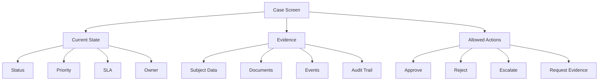
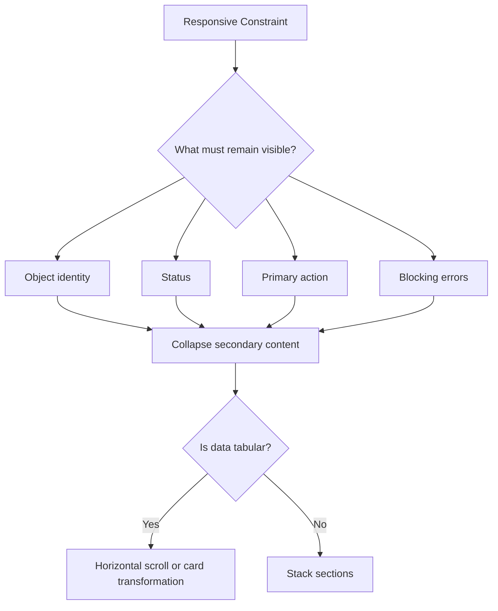

# Enterprise UI Patterns: Forms, Tables, Dashboards, Navigation, Case Management Screens

Enterprise UI berbeda dari landing page, blog, atau marketing site. Di aplikasi internal, regulatory platform, enforcement lifecycle system, fraud tooling, CRM, compliance dashboard, dan case management platform, UI harus menampung **state kompleks**, **data padat**, **perubahan status**, **auditability**, **role-based action**, dan **error yang mahal**.

HTML dan CSS di area ini bukan dekorasi. Mereka adalah lapisan representasi dari proses bisnis.

Target bagian ini: kamu mampu mendesain struktur HTML/CSS untuk layar enterprise yang:

- semantik,
- aksesibel,
- tahan data panjang,
- responsive,
- mudah di-review,
- mudah di-debug,
- cocok untuk workflow kompleks,
- dan tidak runtuh ketika requirement berubah.

---

## 1. Mental Model: Enterprise UI Is State + Evidence + Action

Sebagian besar enterprise screen bisa dimodelkan sebagai kombinasi dari tiga hal:

1. **State** — status objek saat ini.
2. **Evidence** — data pendukung yang membuat state tersebut defensible.
3. **Action** — tindakan yang boleh dilakukan user berdasarkan state, role, policy, dan constraint.

Contoh pada case management:



Dari sisi HTML/CSS, ini berarti layout tidak boleh hanya “bagus”. Layout harus menjawab:

- Apa objek utama di halaman ini?
- Apa statusnya?
- Apa data yang mendukung status tersebut?
- Apa tindakan yang valid?
- Apa risiko jika user salah membaca informasi?
- Apa yang perlu tetap terlihat saat layar sempit?
- Apa yang perlu muncul di print view atau export?
- Apa yang harus terbaca oleh keyboard dan assistive technology?

---

## 2. Core Screen Taxonomy

Enterprise UI biasanya berulang pada pola layar berikut.

| Pattern | Tujuan | Risiko utama |
|---|---|---|
| List / Queue | memilih item untuk dikerjakan | user tidak tahu prioritas |
| Detail Page | membaca satu entity lengkap | informasi penting tenggelam |
| Edit Form | mengubah data | error input, kehilangan data |
| Decision Screen | mengambil keputusan | action salah konteks |
| Dashboard | memonitor kondisi agregat | metrik misleading |
| Audit Trail | membuktikan perubahan | sulit ditelusuri |
| Workflow Stepper | menunjukkan lifecycle | state tidak jelas |
| Search / Filter | menemukan data | query tidak transparan |
| Review Screen | validasi sebelum submit | user tidak melihat dampak |
| Exception Handling | menyelesaikan kasus anomali | status/error ambigu |

HTML/CSS production-grade harus punya komponen untuk pola-pola ini, bukan menulis ulang setiap layar dari nol.

---

## 3. Application Shell

Enterprise app biasanya butuh shell stabil:

- header,
- sidebar/global nav,
- content region,
- optional detail panel,
- action bar,
- footer/status area.

Struktur HTML dasar:

```html
<body>
  <a class="skip-link" href="#main-content">Skip to main content</a>

  <header class="app-header">
    <div class="app-header__brand">RegOps</div>
    <nav class="app-header__nav" aria-label="Global">
      <ul>
        <li><a href="/cases" aria-current="page">Cases</a></li>
        <li><a href="/reports">Reports</a></li>
        <li><a href="/admin">Admin</a></li>
      </ul>
    </nav>
  </header>

  <div class="app-shell">
    <aside class="app-sidebar" aria-label="Workspace navigation">
      <nav>
        <ul>
          <li><a href="/cases/assigned">Assigned to me</a></li>
          <li><a href="/cases/escalated">Escalated</a></li>
          <li><a href="/cases/closed">Closed</a></li>
        </ul>
      </nav>
    </aside>

    <main id="main-content" class="app-main">
      <h1>Case queue</h1>
      <!-- page content -->
    </main>
  </div>
</body>
```

CSS shell:

```css
.app-shell {
  display: grid;
  grid-template-columns: minmax(14rem, 18rem) minmax(0, 1fr);
  min-block-size: 100dvb;
}

.app-header {
  position: sticky;
  inset-block-start: 0;
  z-index: 20;
  display: flex;
  align-items: center;
  justify-content: space-between;
  gap: 1rem;
  padding-block: 0.75rem;
  padding-inline: 1rem;
  border-block-end: 1px solid var(--color-border-subtle);
  background: var(--color-surface);
}

.app-sidebar {
  padding: 1rem;
  border-inline-end: 1px solid var(--color-border-subtle);
  background: var(--color-surface-muted);
}

.app-main {
  min-inline-size: 0;
  padding: clamp(1rem, 2vw, 2rem);
}

@media (max-width: 54rem) {
  .app-shell {
    grid-template-columns: 1fr;
  }

  .app-sidebar {
    border-inline-end: 0;
    border-block-end: 1px solid var(--color-border-subtle);
  }
}
```

Kunci penting: `minmax(0, 1fr)` dan `min-inline-size: 0` mencegah konten panjang mendorong grid keluar viewport.

---

## 4. Navigation Patterns

Navigation enterprise harus menjelaskan konteks dan lokasi user.

Gunakan beberapa tipe navigation dengan label yang berbeda:

```html
<nav aria-label="Global">
  <!-- top-level app modules -->
</nav>

<nav aria-label="Workspace">
  <!-- module-specific navigation -->
</nav>

<nav aria-label="Breadcrumb">
  <ol class="breadcrumb">
    <li><a href="/cases">Cases</a></li>
    <li><a href="/cases/enforcement">Enforcement</a></li>
    <li aria-current="page">CASE-2026-0417</li>
  </ol>
</nav>
```

### Breadcrumb Rules

Breadcrumb bukan hiasan. Breadcrumb menjawab “di mana saya dalam hierarchy?”.

```css
.breadcrumb {
  display: flex;
  flex-wrap: wrap;
  gap: 0.25rem 0.5rem;
  padding: 0;
  margin: 0;
  list-style: none;
  font-size: 0.875rem;
  color: var(--color-text-muted);
}

.breadcrumb li:not(:last-child)::after {
  content: "/";
  margin-inline-start: 0.5rem;
  color: var(--color-text-subtle);
}
```

Avoid:

```html
<div class="breadcrumb">Cases / Enforcement / CASE-2026-0417</div>
```

Karena ini menghilangkan struktur list dan current page semantics.

---

## 5. Page Header Pattern

Setiap enterprise page butuh header yang stabil:

- title,
- subtitle/context,
- status,
- metadata penting,
- primary actions.

```html
<header class="page-header">
  <div class="page-header__body">
    <nav aria-label="Breadcrumb">...</nav>
    <h1>CASE-2026-0417</h1>
    <p class="page-header__summary">
      Suspicious transaction review for PT Example Nusantara.
    </p>

    <dl class="metadata-list metadata-list--inline">
      <div>
        <dt>Status</dt>
        <dd><span class="badge badge--warning">Pending review</span></dd>
      </div>
      <div>
        <dt>Owner</dt>
        <dd>Ari</dd>
      </div>
      <div>
        <dt>SLA</dt>
        <dd><time datetime="2026-06-28T17:00:00+07:00">28 Jun 2026, 17:00</time></dd>
      </div>
    </dl>
  </div>

  <div class="page-header__actions" aria-label="Case actions">
    <button type="button" class="button button--secondary">Request evidence</button>
    <button type="button" class="button button--primary">Escalate</button>
  </div>
</header>
```

CSS:

```css
.page-header {
  display: flex;
  align-items: start;
  justify-content: space-between;
  gap: 1rem;
  margin-block-end: 1.5rem;
}

.page-header__body {
  min-inline-size: 0;
}

.page-header h1 {
  margin-block: 0.25rem 0;
  font-size: clamp(1.5rem, 2vw, 2rem);
  line-height: 1.15;
}

.page-header__summary {
  max-inline-size: 72ch;
  margin-block: 0.5rem 0;
  color: var(--color-text-muted);
}

.page-header__actions {
  display: flex;
  flex-wrap: wrap;
  justify-content: end;
  gap: 0.5rem;
}

@media (max-width: 48rem) {
  .page-header {
    display: grid;
  }

  .page-header__actions {
    justify-content: start;
  }
}
```

Invariant:

- Page title harus satu `h1`.
- Status utama harus terlihat dekat title.
- Primary action tidak boleh ambiguous.
- Metadata critical tidak boleh hanya disampaikan via warna.

---

## 6. Metadata List Pattern

Enterprise screen sering menampilkan key-value data. Gunakan `dl`, bukan table jika datanya bukan matrix dua dimensi.

```html
<dl class="metadata-list">
  <div>
    <dt>Case ID</dt>
    <dd>CASE-2026-0417</dd>
  </div>
  <div>
    <dt>Created</dt>
    <dd><time datetime="2026-06-21T09:14:00+07:00">21 Jun 2026, 09:14</time></dd>
  </div>
  <div>
    <dt>Risk score</dt>
    <dd>82 / 100</dd>
  </div>
</dl>
```

CSS:

```css
.metadata-list {
  display: grid;
  grid-template-columns: repeat(auto-fit, minmax(12rem, 1fr));
  gap: 1rem;
  margin: 0;
}

.metadata-list > div {
  min-inline-size: 0;
}

.metadata-list dt {
  font-size: 0.75rem;
  font-weight: 600;
  color: var(--color-text-muted);
  text-transform: uppercase;
  letter-spacing: 0.04em;
}

.metadata-list dd {
  margin: 0.25rem 0 0;
  overflow-wrap: anywhere;
}

.metadata-list--inline {
  display: flex;
  flex-wrap: wrap;
  gap: 0.75rem 1rem;
}
```

Avoid:

```html
<div class="label">Status</div>
<div class="value">Pending</div>
```

Karena relationship label-value tidak eksplisit.

---

## 7. Status Badge Pattern

Status badge harus semantic secara visual dan tekstual.

```html
<span class="badge badge--warning">Pending review</span>
<span class="badge badge--danger">SLA breach</span>
<span class="badge badge--success">Closed</span>
```

CSS token-based:

```css
.badge {
  --badge-bg: var(--color-neutral-bg);
  --badge-fg: var(--color-neutral-fg);
  --badge-border: var(--color-neutral-border);

  display: inline-flex;
  align-items: center;
  gap: 0.375rem;
  max-inline-size: 100%;
  padding-block: 0.125rem;
  padding-inline: 0.5rem;
  border: 1px solid var(--badge-border);
  border-radius: 999px;
  background: var(--badge-bg);
  color: var(--badge-fg);
  font-size: 0.75rem;
  font-weight: 600;
  line-height: 1.5;
  white-space: nowrap;
}

.badge--success {
  --badge-bg: var(--color-success-bg);
  --badge-fg: var(--color-success-fg);
  --badge-border: var(--color-success-border);
}

.badge--warning {
  --badge-bg: var(--color-warning-bg);
  --badge-fg: var(--color-warning-fg);
  --badge-border: var(--color-warning-border);
}

.badge--danger {
  --badge-bg: var(--color-danger-bg);
  --badge-fg: var(--color-danger-fg);
  --badge-border: var(--color-danger-border);
}
```

Rules:

- Jangan pakai warna tanpa teks.
- Jangan pakai status label yang mirip tetapi berbeda makna: `Pending`, `Waiting`, `Open`, `In Progress` tanpa glossary.
- Status harus berasal dari domain state machine, bukan improvisasi UI.

---

## 8. Queue / Worklist Pattern

Queue screen adalah tempat user memilih pekerjaan.

Informasi minimal:

- title/item identifier,
- owner/assignee,
- status,
- priority,
- age/SLA,
- last update,
- next required action.

Untuk data padat, table sering lebih tepat:

```html
<section aria-labelledby="assigned-cases-title">
  <header class="section-header">
    <div>
      <h2 id="assigned-cases-title">Assigned cases</h2>
      <p>Cases currently assigned to your review queue.</p>
    </div>
  </header>

  <div class="table-wrap" tabindex="0" aria-label="Assigned cases table">
    <table class="data-table">
      <caption class="visually-hidden">Assigned cases</caption>
      <thead>
        <tr>
          <th scope="col">Case</th>
          <th scope="col">Subject</th>
          <th scope="col">Status</th>
          <th scope="col">Priority</th>
          <th scope="col">SLA</th>
          <th scope="col">Next action</th>
        </tr>
      </thead>
      <tbody>
        <tr>
          <th scope="row"><a href="/cases/CASE-2026-0417">CASE-2026-0417</a></th>
          <td>PT Example Nusantara</td>
          <td><span class="badge badge--warning">Pending review</span></td>
          <td>High</td>
          <td><time datetime="2026-06-28T17:00:00+07:00">2 days</time></td>
          <td>Review evidence</td>
        </tr>
      </tbody>
    </table>
  </div>
</section>
```

CSS:

```css
.table-wrap {
  overflow-x: auto;
  border: 1px solid var(--color-border-subtle);
  border-radius: var(--radius-lg);
}

.data-table {
  inline-size: 100%;
  min-inline-size: 48rem;
  border-collapse: collapse;
}

.data-table th,
.data-table td {
  padding-block: 0.75rem;
  padding-inline: 1rem;
  border-block-end: 1px solid var(--color-border-subtle);
  text-align: start;
  vertical-align: top;
}

.data-table thead th {
  background: var(--color-surface-muted);
  color: var(--color-text-muted);
  font-size: 0.75rem;
  text-transform: uppercase;
  letter-spacing: 0.04em;
}

.data-table tbody tr:hover {
  background: var(--color-surface-hover);
}
```

Important: kalau table horizontal scrollable, pastikan container bisa difokuskan keyboard jika overflow tidak terlihat jelas. Namun jangan membuat setiap table wrapper `tabindex="0"` tanpa alasan; gunakan hanya ketika keyboard user perlu mengakses scroll region.

---

## 9. Filter Panel Pattern

Search/filter enterprise harus menjelaskan query state. Filter bukan sekadar input.

```html
<form class="filter-panel" action="/cases" method="get" aria-labelledby="filter-title">
  <h2 id="filter-title">Filter cases</h2>

  <div class="field-grid">
    <div class="field">
      <label for="q">Keyword</label>
      <input id="q" name="q" type="search" autocomplete="off" />
    </div>

    <div class="field">
      <label for="status">Status</label>
      <select id="status" name="status">
        <option value="">Any status</option>
        <option value="pending_review">Pending review</option>
        <option value="escalated">Escalated</option>
        <option value="closed">Closed</option>
      </select>
    </div>

    <fieldset class="field">
      <legend>Priority</legend>
      <label><input type="checkbox" name="priority" value="high" /> High</label>
      <label><input type="checkbox" name="priority" value="medium" /> Medium</label>
      <label><input type="checkbox" name="priority" value="low" /> Low</label>
    </fieldset>
  </div>

  <div class="button-row">
    <button type="submit" class="button button--primary">Apply filters</button>
    <a class="button button--secondary" href="/cases">Clear</a>
  </div>
</form>
```

CSS:

```css
.filter-panel {
  padding: 1rem;
  border: 1px solid var(--color-border-subtle);
  border-radius: var(--radius-lg);
  background: var(--color-surface);
}

.field-grid {
  display: grid;
  grid-template-columns: repeat(auto-fit, minmax(14rem, 1fr));
  gap: 1rem;
}

.field {
  display: grid;
  gap: 0.375rem;
  min-inline-size: 0;
}

.button-row {
  display: flex;
  flex-wrap: wrap;
  gap: 0.5rem;
  margin-block-start: 1rem;
}
```

Filter invariants:

- Filter state harus bisa direpresentasikan di URL bila memungkinkan.
- Clear action harus jelas.
- Label harus eksplisit.
- Default state harus terlihat.
- Banyak filter sebaiknya dikelompokkan berdasarkan konsep domain.

---

## 10. Long Form Pattern

Long form adalah sumber error besar. Gunakan struktur, grouping, dan review.

```html
<form class="case-form" action="/cases/CASE-2026-0417/actions/escalate" method="post">
  <header class="form-header">
    <h2>Escalate case</h2>
    <p>Provide a reason and assign the case to the next review level.</p>
  </header>

  <section aria-labelledby="decision-section-title" class="form-section">
    <h3 id="decision-section-title">Decision</h3>

    <div class="field">
      <label for="reason">Escalation reason</label>
      <textarea id="reason" name="reason" required rows="5" aria-describedby="reason-hint"></textarea>
      <p id="reason-hint" class="field-hint">
        Include the policy trigger, evidence reference, and expected next action.
      </p>
    </div>

    <div class="field">
      <label for="next-team">Assign to</label>
      <select id="next-team" name="nextTeam" required>
        <option value="">Select a team</option>
        <option value="senior_review">Senior review</option>
        <option value="legal">Legal</option>
        <option value="investigation">Investigation</option>
      </select>
    </div>
  </section>

  <section aria-labelledby="confirmation-section-title" class="form-section">
    <h3 id="confirmation-section-title">Confirmation</h3>

    <label class="checkbox-card">
      <input type="checkbox" name="confirmed" required />
      <span>I confirm the evidence has been reviewed and the escalation is justified.</span>
    </label>
  </section>

  <footer class="form-actions">
    <button type="submit" class="button button--primary">Submit escalation</button>
    <button type="button" class="button button--secondary">Save draft</button>
  </footer>
</form>
```

CSS:

```css
.case-form {
  display: grid;
  gap: 1.5rem;
  max-inline-size: 56rem;
}

.form-section {
  display: grid;
  gap: 1rem;
  padding: 1rem;
  border: 1px solid var(--color-border-subtle);
  border-radius: var(--radius-lg);
  background: var(--color-surface);
}

.form-actions {
  position: sticky;
  inset-block-end: 0;
  display: flex;
  flex-wrap: wrap;
  gap: 0.5rem;
  padding-block: 1rem;
  background: var(--color-page);
  border-block-start: 1px solid var(--color-border-subtle);
}
```

Long form rules:

- Group fields by domain, not by visual convenience.
- Use `fieldset` + `legend` for related controls.
- Use section headings for large form regions.
- Preserve user input on validation failure.
- Show all blocking errors near top and near fields.
- Make irreversible actions explicit.
- For sensitive changes, show review screen before commit.

---

## 11. Error Summary Pattern

Form errors in enterprise apps must be navigable.

```html
<div class="error-summary" role="alert" aria-labelledby="error-summary-title">
  <h2 id="error-summary-title">There are 3 problems with your submission</h2>
  <ul>
    <li><a href="#reason">Escalation reason is required.</a></li>
    <li><a href="#next-team">Assign to is required.</a></li>
    <li><a href="#confirmed">Confirmation is required.</a></li>
  </ul>
</div>
```

Field error:

```html
<div class="field field--error">
  <label for="reason">Escalation reason</label>
  <textarea id="reason" name="reason" required aria-invalid="true" aria-describedby="reason-error"></textarea>
  <p id="reason-error" class="field-error">Enter an escalation reason.</p>
</div>
```

CSS:

```css
.error-summary {
  padding: 1rem;
  border: 2px solid var(--color-danger-border);
  border-radius: var(--radius-lg);
  background: var(--color-danger-bg);
}

.field--error :is(input, select, textarea) {
  border-color: var(--color-danger-border);
}

.field-error {
  color: var(--color-danger-fg);
  font-weight: 600;
}
```

Invariant:

- Error harus textual.
- Error harus terhubung ke field dengan `aria-describedby`.
- Summary harus berisi link ke field.
- Jangan hanya mengandalkan border merah.

---

## 12. Detail Page Pattern

Detail page enterprise sering butuh dua hal secara bersamaan:

- overview cepat,
- detail lengkap.

Gunakan layout dengan summary panel dan content sections.

```html
<div class="detail-layout">
  <aside class="detail-layout__summary" aria-labelledby="summary-title">
    <h2 id="summary-title">Case summary</h2>
    <dl class="metadata-list">
      <div><dt>Status</dt><dd><span class="badge badge--warning">Pending review</span></dd></div>
      <div><dt>Risk</dt><dd>High</dd></div>
      <div><dt>Owner</dt><dd>Ari</dd></div>
    </dl>
  </aside>

  <div class="detail-layout__content">
    <section aria-labelledby="evidence-title">
      <h2 id="evidence-title">Evidence</h2>
      <!-- evidence table/cards -->
    </section>

    <section aria-labelledby="history-title">
      <h2 id="history-title">History</h2>
      <!-- timeline -->
    </section>
  </div>
</div>
```

CSS:

```css
.detail-layout {
  display: grid;
  grid-template-columns: minmax(16rem, 22rem) minmax(0, 1fr);
  gap: 1.5rem;
  align-items: start;
}

.detail-layout__summary {
  position: sticky;
  inset-block-start: calc(var(--app-header-height, 4rem) + 1rem);
  padding: 1rem;
  border: 1px solid var(--color-border-subtle);
  border-radius: var(--radius-lg);
  background: var(--color-surface);
}

.detail-layout__content {
  display: grid;
  gap: 1.5rem;
  min-inline-size: 0;
}

@media (max-width: 64rem) {
  .detail-layout {
    grid-template-columns: 1fr;
  }

  .detail-layout__summary {
    position: static;
  }
}
```

Rules:

- Summary panel tidak boleh menjadi satu-satunya tempat critical data berada.
- Sticky summary harus fallback dengan baik di mobile.
- Jangan membuat layout tiga kolom jika data sering panjang.

---

## 13. Timeline / Audit Trail Pattern

Audit trail adalah bukti perubahan. Jangan membuatnya sekadar list visual.

```html
<section aria-labelledby="audit-title">
  <h2 id="audit-title">Audit trail</h2>

  <ol class="timeline">
    <li class="timeline__item">
      <article>
        <header>
          <h3>Case escalated</h3>
          <p>
            <time datetime="2026-06-25T14:32:00+07:00">25 Jun 2026, 14:32</time>
            by Ari
          </p>
        </header>
        <p>Escalated to Senior Review due to high-risk policy trigger.</p>
      </article>
    </li>

    <li class="timeline__item">
      <article>
        <header>
          <h3>Evidence uploaded</h3>
          <p>
            <time datetime="2026-06-24T10:10:00+07:00">24 Jun 2026, 10:10</time>
            by Sinta
          </p>
        </header>
        <p>Uploaded transaction statement PDF.</p>
      </article>
    </li>
  </ol>
</section>
```

CSS:

```css
.timeline {
  display: grid;
  gap: 1rem;
  padding: 0;
  margin: 0;
  list-style: none;
}

.timeline__item {
  position: relative;
  padding-inline-start: 1.5rem;
}

.timeline__item::before {
  content: "";
  position: absolute;
  inset-inline-start: 0;
  inset-block-start: 0.375rem;
  inline-size: 0.625rem;
  block-size: 0.625rem;
  border-radius: 50%;
  background: var(--color-accent);
}

.timeline__item:not(:last-child)::after {
  content: "";
  position: absolute;
  inset-inline-start: 0.28125rem;
  inset-block-start: 1.25rem;
  inset-block-end: -1rem;
  border-inline-start: 1px solid var(--color-border-subtle);
}
```

Audit trail invariants:

- Use `time datetime`.
- Actor harus jelas.
- Action harus domain-specific.
- Jangan hanya menampilkan “updated”.
- Sorting harus jelas: newest first atau oldest first.
- Untuk compliance, pertimbangkan immutable event ID jika perlu.

---

## 14. Workflow Stepper Pattern

Stepper sering salah dipakai sebagai dekorasi. Di enterprise UI, stepper harus merepresentasikan state machine.

```html
<nav aria-label="Case workflow">
  <ol class="stepper">
    <li class="stepper__item stepper__item--complete">
      <span class="stepper__marker" aria-hidden="true">1</span>
      <span>Intake</span>
    </li>
    <li class="stepper__item stepper__item--current" aria-current="step">
      <span class="stepper__marker" aria-hidden="true">2</span>
      <span>Review</span>
    </li>
    <li class="stepper__item">
      <span class="stepper__marker" aria-hidden="true">3</span>
      <span>Decision</span>
    </li>
    <li class="stepper__item">
      <span class="stepper__marker" aria-hidden="true">4</span>
      <span>Closure</span>
    </li>
  </ol>
</nav>
```

CSS:

```css
.stepper {
  display: flex;
  flex-wrap: wrap;
  gap: 0.75rem;
  padding: 0;
  margin: 0;
  list-style: none;
}

.stepper__item {
  display: inline-flex;
  align-items: center;
  gap: 0.5rem;
  color: var(--color-text-muted);
}

.stepper__marker {
  display: grid;
  place-items: center;
  inline-size: 1.75rem;
  block-size: 1.75rem;
  border-radius: 50%;
  border: 1px solid var(--color-border-strong);
  font-size: 0.875rem;
}

.stepper__item--complete .stepper__marker {
  background: var(--color-success-bg);
  color: var(--color-success-fg);
}

.stepper__item--current {
  color: var(--color-text);
  font-weight: 700;
}
```

Rules:

- Current step gunakan `aria-current="step"`.
- Stepper harus mengikuti lifecycle yang benar.
- Jangan tampilkan step yang tidak mungkin dicapai oleh objek tersebut.
- Jika workflow bercabang, pertimbangkan status panel daripada linear stepper palsu.

---

## 15. Dashboard Pattern

Dashboard bukan kumpulan card. Dashboard adalah monitoring system.

Pertanyaan utama:

- Metrik apa yang actionable?
- Dibandingkan dengan baseline apa?
- Dalam periode apa?
- Siapa owner jika metrik buruk?
- Apakah warna menunjukkan severity atau kategori?

HTML:

```html
<section aria-labelledby="dashboard-title">
  <header class="section-header">
    <div>
      <h2 id="dashboard-title">Operational overview</h2>
      <p>Summary for 26 Jun 2026, Asia/Jakarta.</p>
    </div>
  </header>

  <div class="metric-grid">
    <article class="metric-card">
      <h3>Open cases</h3>
      <p class="metric-card__value">1,248</p>
      <p class="metric-card__note">+8% from previous week</p>
    </article>

    <article class="metric-card metric-card--warning">
      <h3>SLA at risk</h3>
      <p class="metric-card__value">73</p>
      <p class="metric-card__note">Requires assignment review</p>
    </article>

    <article class="metric-card">
      <h3>Median review time</h3>
      <p class="metric-card__value">3h 12m</p>
      <p class="metric-card__note">Target: under 4h</p>
    </article>
  </div>
</section>
```

CSS:

```css
.metric-grid {
  display: grid;
  grid-template-columns: repeat(auto-fit, minmax(14rem, 1fr));
  gap: 1rem;
}

.metric-card {
  display: grid;
  gap: 0.5rem;
  padding: 1rem;
  border: 1px solid var(--color-border-subtle);
  border-radius: var(--radius-lg);
  background: var(--color-surface);
}

.metric-card h3 {
  margin: 0;
  font-size: 0.875rem;
  color: var(--color-text-muted);
}

.metric-card__value {
  margin: 0;
  font-size: clamp(1.75rem, 4vw, 2.5rem);
  font-weight: 750;
  line-height: 1;
}

.metric-card__note {
  margin: 0;
  color: var(--color-text-muted);
}
```

Dashboard anti-patterns:

- KPI tanpa periode.
- Warna merah/hijau tanpa label.
- Card terlalu banyak tanpa hierarchy.
- Chart tanpa fallback data/table.
- “Vanity metric” yang tidak mengubah action.

---

## 16. Master-Detail Pattern

Master-detail umum di case management: list di kiri, detail di kanan.

```html
<div class="master-detail">
  <aside class="master-detail__list" aria-labelledby="case-list-title">
    <h2 id="case-list-title">Cases</h2>
    <ul class="entity-list">
      <li>
        <a href="/cases/CASE-2026-0417" aria-current="page">
          <span>CASE-2026-0417</span>
          <span>Pending review</span>
        </a>
      </li>
    </ul>
  </aside>

  <main class="master-detail__detail" id="main-content">
    <h1>CASE-2026-0417</h1>
    <!-- detail -->
  </main>
</div>
```

CSS:

```css
.master-detail {
  display: grid;
  grid-template-columns: minmax(18rem, 24rem) minmax(0, 1fr);
  min-block-size: 100dvb;
}

.master-detail__list {
  overflow: auto;
  border-inline-end: 1px solid var(--color-border-subtle);
}

.master-detail__detail {
  min-inline-size: 0;
  overflow: auto;
  padding: 1.5rem;
}

.entity-list {
  padding: 0;
  margin: 0;
  list-style: none;
}

.entity-list a {
  display: grid;
  gap: 0.25rem;
  padding: 0.75rem 1rem;
  text-decoration: none;
}

.entity-list a[aria-current="page"] {
  background: var(--color-accent-bg);
  color: var(--color-accent-fg);
}

@media (max-width: 58rem) {
  .master-detail {
    grid-template-columns: 1fr;
  }

  .master-detail__list {
    max-block-size: 16rem;
    border-inline-end: 0;
    border-block-end: 1px solid var(--color-border-subtle);
  }
}
```

Failure mode:

- Two independent scroll regions can confuse users.
- Mobile often needs list-first or detail-first navigation instead of forced split view.
- Active item must be clearly indicated semantically and visually.

---

## 17. Split Pane / Inspector Pattern

Inspector panel berguna untuk evidence detail, comments, or metadata.

```html
<div class="inspector-layout">
  <main class="inspector-layout__main">
    <h1>Evidence review</h1>
  </main>

  <aside class="inspector-layout__panel" aria-labelledby="inspector-title">
    <h2 id="inspector-title">Selected evidence</h2>
    <dl class="metadata-list">...</dl>
  </aside>
</div>
```

CSS:

```css
.inspector-layout {
  display: grid;
  grid-template-columns: minmax(0, 1fr) minmax(18rem, 24rem);
  gap: 1rem;
}

.inspector-layout__main,
.inspector-layout__panel {
  min-inline-size: 0;
}

.inspector-layout__panel {
  border-inline-start: 1px solid var(--color-border-subtle);
  padding-inline-start: 1rem;
}

@media (max-width: 64rem) {
  .inspector-layout {
    grid-template-columns: 1fr;
  }

  .inspector-layout__panel {
    border-inline-start: 0;
    border-block-start: 1px solid var(--color-border-subtle);
    padding-inline-start: 0;
    padding-block-start: 1rem;
  }
}
```

---

## 18. Empty, Loading, Error, and Permission States

Enterprise UI harus memodelkan state yang tidak ideal.

### Empty State

```html
<section class="empty-state" aria-labelledby="empty-title">
  <h2 id="empty-title">No escalated cases</h2>
  <p>Cases that require senior review will appear here.</p>
  <a class="button button--secondary" href="/cases">View all cases</a>
</section>
```

### Loading State

```html
<div class="loading-state" role="status" aria-live="polite">
  <span class="spinner" aria-hidden="true"></span>
  <span>Loading assigned cases...</span>
</div>
```

### Error State

```html
<section class="error-state" role="alert" aria-labelledby="load-error-title">
  <h2 id="load-error-title">Cases could not be loaded</h2>
  <p>Try again. If the problem continues, contact support with trace ID ABC-123.</p>
  <button type="button" class="button button--primary">Retry</button>
</section>
```

### Permission State

```html
<section class="permission-state" aria-labelledby="permission-title">
  <h2 id="permission-title">You do not have access to this case</h2>
  <p>Access is restricted to assigned reviewers and compliance administrators.</p>
</section>
```

Rules:

- Empty state should explain what should happen next.
- Loading state should not trap focus.
- Error state should include recovery action.
- Permission state should avoid leaking sensitive data.

---

## 19. Action Bar Pattern

Critical enterprise actions should be stable and grouped.

```html
<div class="action-bar" aria-label="Case actions">
  <div class="action-bar__secondary">
    <button type="button" class="button button--secondary">Save draft</button>
  </div>
  <div class="action-bar__primary">
    <button type="button" class="button button--danger">Reject</button>
    <button type="submit" class="button button--primary">Approve</button>
  </div>
</div>
```

CSS:

```css
.action-bar {
  display: flex;
  align-items: center;
  justify-content: space-between;
  gap: 1rem;
  padding: 1rem;
  border-block-start: 1px solid var(--color-border-subtle);
  background: var(--color-surface);
}

.action-bar__primary,
.action-bar__secondary {
  display: flex;
  flex-wrap: wrap;
  gap: 0.5rem;
}

@media (max-width: 40rem) {
  .action-bar,
  .action-bar__primary,
  .action-bar__secondary {
    display: grid;
    inline-size: 100%;
  }
}
```

Action invariants:

- Primary action should be visually primary and semantically correct.
- Destructive actions need confirmation when consequences are large.
- Disabled action should explain why unavailable.
- Buttons must remain `button`, links remain `a`.

---

## 20. Confirmation / Review Screen Pattern

For irreversible or regulatory actions, review before submit.

```html
<section aria-labelledby="review-title" class="review-panel">
  <h2 id="review-title">Review escalation</h2>

  <dl class="metadata-list">
    <div>
      <dt>Case</dt>
      <dd>CASE-2026-0417</dd>
    </div>
    <div>
      <dt>Escalation target</dt>
      <dd>Senior Review</dd>
    </div>
    <div>
      <dt>Reason</dt>
      <dd>High-risk policy trigger with incomplete supporting documentation.</dd>
    </div>
  </dl>

  <form action="/cases/CASE-2026-0417/escalate/confirm" method="post">
    <button type="submit" class="button button--primary">Confirm escalation</button>
    <a href="/cases/CASE-2026-0417/escalate" class="button button--secondary">Edit</a>
  </form>
</section>
```

Review screen must show:

- object affected,
- action performed,
- reason,
- target state,
- downstream effect,
- actor if relevant,
- timestamp if committed.

---

## 21. Print-Friendly Enterprise Screens

Regulatory and case-management apps often need printable views.

CSS:

```css
@media print {
  .app-header,
  .app-sidebar,
  .action-bar,
  .button,
  .filter-panel {
    display: none !important;
  }

  body {
    background: white;
    color: black;
  }

  .app-shell,
  .detail-layout,
  .inspector-layout {
    display: block;
  }

  a[href]::after {
    content: " (" attr(href) ")";
    font-size: 0.85em;
  }

  .data-table {
    min-inline-size: 0;
  }

  .page-break-before {
    break-before: page;
  }
}
```

Print rules:

- Remove navigation and buttons.
- Keep document title, ID, timestamp, and status.
- Avoid hiding critical content behind collapsed panels.
- Test with real PDF output.

---

## 22. Responsive Enterprise Layout Strategy

Do not treat enterprise responsive design as “make everything stack”.

Responsive priority order:

1. Keep task continuity.
2. Keep primary object identity visible.
3. Preserve critical status/action.
4. Collapse secondary navigation.
5. Transform tables only when needed.
6. Avoid hiding filters/actions without discoverability.



Patterns:

- table: horizontal scroll first for dense data,
- cards: stack naturally,
- form: one column on small screens,
- nav: collapse to disclosure/drawer,
- action bar: full-width buttons on narrow screens,
- summary panel: move above content or below header.

---

## 23. CSS Token Baseline for Enterprise UI

A minimal token set:

```css
:root {
  color-scheme: light dark;

  --space-1: 0.25rem;
  --space-2: 0.5rem;
  --space-3: 0.75rem;
  --space-4: 1rem;
  --space-6: 1.5rem;
  --space-8: 2rem;

  --radius-sm: 0.25rem;
  --radius-md: 0.5rem;
  --radius-lg: 0.75rem;

  --color-page: Canvas;
  --color-surface: Canvas;
  --color-surface-muted: color-mix(in srgb, CanvasText 5%, Canvas);
  --color-surface-hover: color-mix(in srgb, CanvasText 8%, Canvas);

  --color-text: CanvasText;
  --color-text-muted: color-mix(in srgb, CanvasText 70%, Canvas);
  --color-text-subtle: color-mix(in srgb, CanvasText 50%, Canvas);

  --color-border-subtle: color-mix(in srgb, CanvasText 18%, Canvas);
  --color-border-strong: color-mix(in srgb, CanvasText 35%, Canvas);

  --color-accent: Highlight;
  --color-accent-bg: color-mix(in srgb, Highlight 15%, Canvas);
  --color-accent-fg: CanvasText;

  --color-success-bg: #e7f7ed;
  --color-success-fg: #0f5f2f;
  --color-success-border: #9ed8b5;

  --color-warning-bg: #fff4d6;
  --color-warning-fg: #6b4a00;
  --color-warning-border: #e8c66a;

  --color-danger-bg: #ffe8e8;
  --color-danger-fg: #8a1f1f;
  --color-danger-border: #e49a9a;
}
```

Note: token warna harus divalidasi contrast-nya. Jangan copy token tanpa test.

---

## 24. Enterprise UI Review Checklist

Gunakan checklist ini saat code review.

### Document and Landmarks

- [ ] Ada satu `h1` yang jelas.
- [ ] `main`, `nav`, `header`, `aside`, `section` dipakai sesuai makna.
- [ ] Navigation punya `aria-label` jika lebih dari satu.
- [ ] Breadcrumb memakai `nav` + ordered list + `aria-current`.

### Forms

- [ ] Semua input punya label programmatic.
- [ ] Field terkait dikelompokkan dengan `fieldset`/`legend` atau section heading.
- [ ] Error terhubung dengan `aria-describedby`.
- [ ] Required field dijelaskan.
- [ ] Submit action jelas konsekuensinya.
- [ ] Server validation tetap ada.

### Tables

- [ ] Table dipakai untuk data matrix, bukan layout.
- [ ] Ada caption atau label accessible.
- [ ] Header memakai `th` + `scope` atau `headers` untuk table kompleks.
- [ ] Responsive strategy jelas.
- [ ] Sorting/filtering state terlihat.

### Actions

- [ ] Button vs link benar.
- [ ] Destructive action butuh confirmation bila konsekuensinya besar.
- [ ] Disabled action menjelaskan penyebab.
- [ ] Focus visible jelas.

### State

- [ ] Empty/loading/error/permission state tersedia.
- [ ] Status tidak hanya warna.
- [ ] Audit trail punya actor, action, timestamp.
- [ ] Current workflow step jelas.

### Layout

- [ ] Layout tahan data panjang.
- [ ] `min-inline-size: 0` dipakai pada grid/flex child yang perlu shrink.
- [ ] Sticky tidak menutupi content.
- [ ] Print view diuji jika dibutuhkan.

---

## 25. Practice: Build a Case Detail Screen

Latihan 90–120 menit.

Bangun satu halaman static HTML/CSS:

- app shell,
- breadcrumb,
- page header,
- status badge,
- metadata summary,
- workflow stepper,
- evidence table,
- audit trail,
- action bar,
- error/empty state variant,
- responsive layout,
- print CSS.

Acceptance criteria:

- Bisa dinavigasi keyboard.
- Tidak ada input tanpa label.
- Tidak ada action tanpa accessible name.
- Table tetap usable di 360px width.
- Status tidak hanya warna.
- Print view tidak membawa sidebar/nav/button.

---

## 26. Summary

Enterprise UI pattern yang kuat bukan berasal dari visual polish saja. Ia berasal dari mapping domain yang benar:

- entity,
- state,
- evidence,
- action,
- constraint,
- audit,
- role,
- failure mode.

HTML memberi struktur dan semantic contract. CSS memberi layout, hierarchy, dan state visualization. Untuk mencapai level senior/top-tier, kamu harus membaca screen enterprise sebagai **workflow representation**, bukan kumpulan component.

Part berikutnya masuk ke performance: bagaimana HTML/CSS memengaruhi critical rendering path, LCP, CLS, font loading, image loading, containment, dan production budget.
