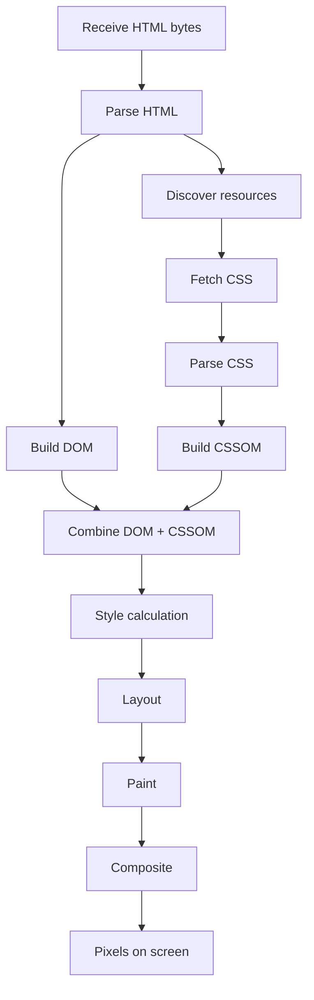
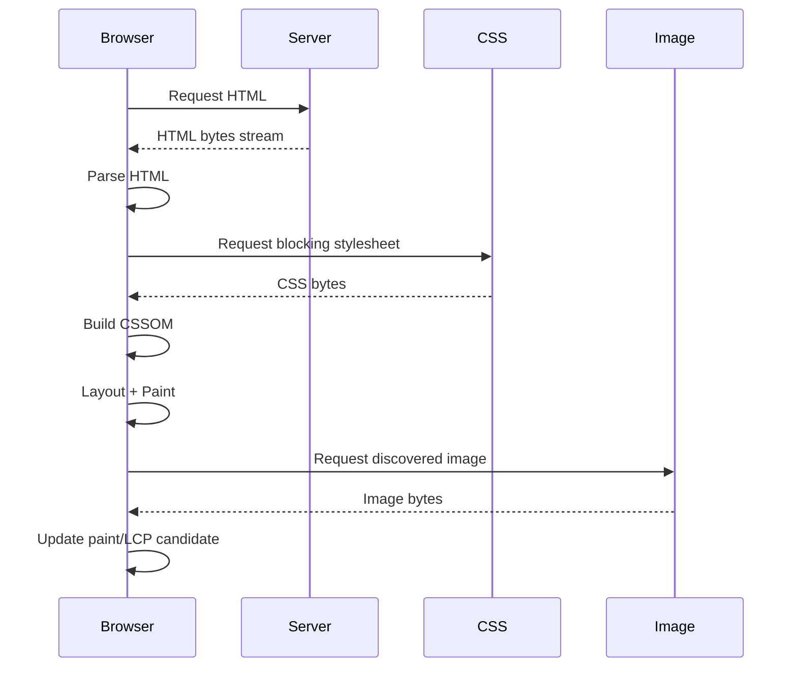
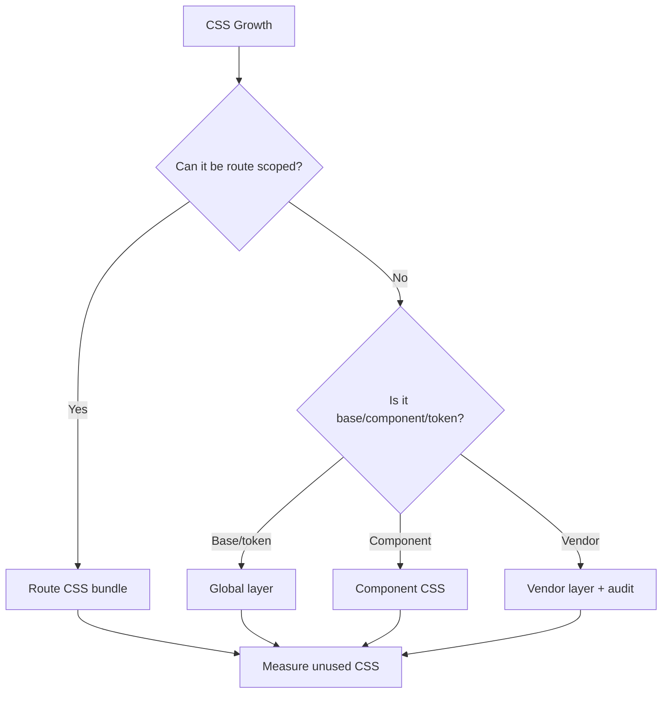
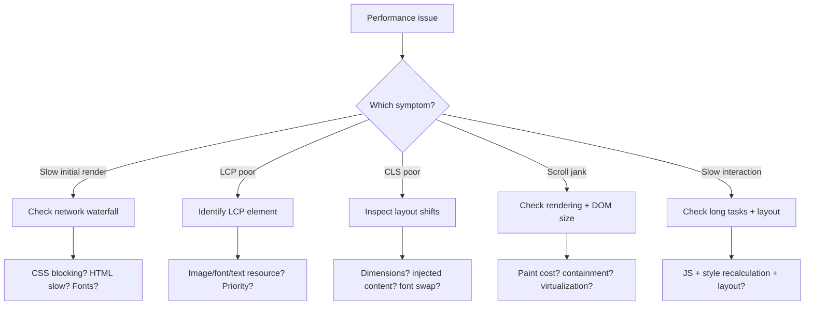

# CSS and HTML Performance: Critical Rendering Path, Assets, Fonts, and Layout Stability

Performance HTML/CSS bukan micro-optimization selector. Dalam production web, performa HTML/CSS terutama ditentukan oleh:

- seberapa cepat browser bisa menemukan resource penting,
- seberapa cepat CSSOM bisa dibangun,
- apakah layout stabil,
- apakah gambar dan font dimuat dengan strategi yang benar,
- apakah CSS terlalu besar atau terlalu global,
- apakah rendering offscreen bisa ditunda,
- dan apakah UI mengirim terlalu banyak pekerjaan ke browser sebelum user bisa melihat/menggunakan halaman.

Target bagian ini: kamu mampu menganalisis performa HTML/CSS sebagai pipeline, bukan sebagai daftar tips acak.

---

## 1. Performance Mental Model

Browser tidak “menampilkan HTML”. Browser melakukan pipeline:



Dari pipeline ini, bottleneck HTML/CSS biasanya muncul di:

- HTML terlalu lambat sampai browser,
- resource penting ditemukan terlambat,
- CSS blocking terlalu besar,
- font menyebabkan text delay/layout shift,
- image utama terlalu besar atau terlambat,
- layout berubah setelah render awal,
- offscreen content tetap dirender terlalu awal,
- hidden expensive UI tetap ikut layout/paint.

---

## 2. Core Web Vitals Context

Core Web Vitals adalah metrik user experience utama:

| Metric | Mengukur | Threshold baik |
|---|---|---|
| LCP | loading performance | <= 2.5s |
| INP | responsiveness/interactivity | <= 200ms |
| CLS | visual stability | <= 0.1 |

HTML/CSS paling langsung memengaruhi:

- **LCP** lewat HTML delivery, CSS blocking, image discovery, image priority, font rendering, server rendering.
- **CLS** lewat image dimension, font metric mismatch, injected content, responsive layout instability.
- **INP** secara tidak langsung lewat CSS complexity, layout cost, forced reflow dari JS, expensive rendering, dan heavy DOM.

Jangan menganggap Core Web Vitals hanya urusan JavaScript. HTML/CSS sering menentukan apakah browser bisa menampilkan meaningful pixels dengan cepat.

---

## 3. Critical Rendering Path

Critical rendering path adalah jalur minimal yang harus ditempuh browser sebelum render awal.

Simplified:



CSS external stylesheet normally blocks render because browser needs CSSOM to know what elements look like. Ini benar secara prinsip: render tanpa CSS bisa menyebabkan flash of unstyled content dan layout ulang besar.

Performance goal: **buat resource critical kecil, cepat ditemukan, dan prioritasnya benar**.

---

## 4. HTML Delivery and Resource Discovery

HTML adalah dependency root. Browser menemukan banyak resource dari HTML:

```html
<link rel="stylesheet" href="/assets/app.css" />
<script type="module" src="/assets/app.js"></script>

<link rel="preload" as="font" href="/fonts/inter-var.woff2" type="font/woff2" crossorigin />
```

Resource yang ditemukan lebih awal bisa dimuat lebih awal.

### Good HTML head ordering

```html
<head>
  <meta charset="utf-8" />
  <meta name="viewport" content="width=device-width, initial-scale=1" />
  <title>Case Queue</title>

  <link rel="preconnect" href="https://static.example.com" />
  <link rel="preload" href="/fonts/inter-var.woff2" as="font" type="font/woff2" crossorigin />
  <link rel="stylesheet" href="/assets/app.css" />
  <script type="module" src="/assets/app.js"></script>
</head>
```

Rules:

- `charset` harus sangat awal.
- CSS critical ditemukan awal.
- Font preload hanya untuk font yang benar-benar critical.
- Jangan preload semua resource.
- Jangan menaruh stylesheet utama terlalu bawah jika render awal butuh CSS tersebut.

---

## 5. Render-Blocking CSS

CSS eksternal adalah render-blocking untuk dokumen karena browser perlu CSSOM.

Masalah umum:

```html
<link rel="stylesheet" href="/assets/everything.css" />
```

Jika `everything.css` berisi seluruh design system, halaman admin, marketing, editor, charts, dan legacy CSS, maka render awal halaman kecil ikut membayar seluruh biaya CSS besar.

Strategi:

1. Split CSS berdasarkan route atau area produk.
2. Jaga base CSS kecil.
3. Hindari komponen non-critical masuk bundle critical.
4. Load CSS component berat hanya ketika dibutuhkan.
5. Hapus unused CSS dengan build analysis, bukan manual guessing.

### Layered CSS loading example

```html
<link rel="stylesheet" href="/assets/base.css" />
<link rel="stylesheet" href="/assets/components.css" />
<link rel="stylesheet" href="/assets/case-detail.css" />
```

Ini belum tentu selalu lebih cepat daripada satu file karena extra request. Dengan HTTP/2/3, trade-off berubah. Ukur dengan real network waterfall.

---

## 6. Critical CSS

Critical CSS adalah CSS minimal untuk render awal above-the-fold atau first viewport.

Contoh inline minimal:

```html
<style>
  :root {
    color-scheme: light dark;
    --space-4: 1rem;
    --color-page: Canvas;
    --color-text: CanvasText;
  }

  body {
    margin: 0;
    font-family: system-ui, sans-serif;
    background: var(--color-page);
    color: var(--color-text);
  }

  .app-header {
    display: flex;
    align-items: center;
    justify-content: space-between;
    padding: var(--space-4);
  }
</style>
<link rel="stylesheet" href="/assets/app.css" />
```

Trade-off:

- Inline CSS mengurangi blocking request untuk critical rules.
- Tetapi inline CSS tidak cacheable per file.
- Jika terlalu besar, HTML membengkak.
- Critical CSS extraction bisa kompleks dan rawan stale.

Use when:

- page sangat performance-sensitive,
- above-the-fold predictable,
- CSS utama besar,
- kamu punya pipeline yang menjaga critical CSS tetap akurat.

Avoid when:

- app internal kecil tanpa performance bottleneck,
- maintenance cost lebih besar dari benefit,
- CSS critical berubah terus.

---

## 7. Images and LCP

LCP sering berupa image besar: hero image, banner, product image, atau first large content block.

HTML/CSS mistakes yang memperburuk LCP:

- LCP image sebagai CSS background sehingga terlambat ditemukan.
- Tidak ada `width`/`height`.
- Image terlalu besar secara byte atau dimensi.
- Lazy-loading image above-the-fold.
- Resource priority rendah.
- Format tidak optimal.
- `sizes` salah sehingga browser memilih source terlalu besar.

### Preferred LCP image pattern

```html

```

Rules:

- Jangan lazy-load LCP image.
- Beri `width` dan `height` untuk reserve aspect ratio.
- Gunakan `srcset` dan `sizes` bila responsive image.
- Gunakan `fetchpriority="high"` hanya untuk resource yang benar-benar critical.
- Jangan memakai CSS background untuk content image yang critical atau butuh alt text.

### CSS background image problem

```css
.hero {
  background-image: url("/images/hero.webp");
}
```

Browser baru tahu URL ini setelah CSS diunduh dan diparse. Untuk image critical, ini bisa lebih lambat daripada `` di HTML.

Jika harus pakai background image critical, pertimbangkan preload:

```html
<link rel="preload" as="image" href="/images/hero.webp" />
```

Tetapi jangan jadikan preload sebagai patch untuk desain asset yang salah.

---

## 8. Lazy Loading Strategy

Lazy loading menunda resource non-critical sampai dibutuhkan.

```html


<iframe
  src="/embedded/report"
  width="800"
  height="600"
  loading="lazy"
  title="Embedded compliance report"
></iframe>
```

Use lazy loading for:

- below-the-fold images,
- embedded maps/reports,
- thumbnails in long pages,
- optional media.

Do not lazy-load:

- logo if it affects first render identity,
- LCP image,
- first viewport critical content,
- images needed immediately after navigation.

Lazy loading is not a replacement for image optimization.

---

## 9. Layout Stability and CLS

CLS buruk terjadi ketika elemen bergeser setelah user mulai melihat halaman.

Common causes:

- image tanpa dimensions,
- ad/embed injected tanpa reserved space,
- font swap metric mismatch,
- loading banners inserted above content,
- async content pushing existing content,
- skeleton berbeda ukuran dari final content,
- responsive layout berubah setelah CSS/JS load.

### Reserve media space

```html

```

CSS:

```css
.chart-image {
  inline-size: 100%;
  block-size: auto;
}
```

Browser bisa menghitung aspect ratio dari `width`/`height` sebelum image selesai load.

### Reserve embed space

```css
.report-frame {
  aspect-ratio: 16 / 9;
  inline-size: 100%;
  border: 1px solid var(--color-border-subtle);
}
```

### Stable skeleton

Bad:

```css
.skeleton-row {
  height: 2rem;
}

.real-row {
  min-height: 4rem;
}
```

Good:

```css
.skeleton-row,
.real-row {
  min-block-size: 4rem;
}
```

---

## 10. Font Loading Performance

Fonts can affect:

- text visibility,
- layout shift,
- LCP if text is LCP candidate,
- visual consistency.

Basic `@font-face`:

```css
@font-face {
  font-family: "InterVariable";
  src: url("/fonts/inter-var.woff2") format("woff2");
  font-weight: 100 900;
  font-display: swap;
}

body {
  font-family: "InterVariable", system-ui, sans-serif;
}
```

`font-display` choices:

| Value | Behavior | Use case |
|---|---|---|
| auto | browser default | rarely intentional |
| block | short invisible text period | brand-heavy, risky |
| swap | fallback immediately, swap later | common performance-friendly choice |
| fallback | short block, limited swap | balanced |
| optional | may skip custom font | performance-first |

### Font preload

```html
<link
  rel="preload"
  href="/fonts/inter-var.woff2"
  as="font"
  type="font/woff2"
  crossorigin
/>
```

Only preload fonts that are actually used in initial viewport. Preloading every weight/style wastes bandwidth.

### System font strategy

For internal enterprise tools, system font stack is often the best default:

```css
body {
  font-family:
    system-ui,
    -apple-system,
    BlinkMacSystemFont,
    "Segoe UI",
    sans-serif;
}
```

Benefits:

- no font request,
- fast first render,
- familiar OS rendering,
- less CLS risk.

Trade-off:

- less brand control,
- cross-platform visual differences.

---

## 11. CSS Size and Unused CSS

CSS cost includes:

- download bytes,
- parse time,
- CSSOM memory,
- style recalculation complexity,
- maintenance cost.

Unused CSS usually grows because:

- global stylesheet accumulates old components,
- design system ships everything to every page,
- utility framework output is not purged,
- route-level CSS not split,
- third-party CSS imported wholesale,
- legacy screens never removed.

Architecture strategies:



Practical rules:

- Keep reset/base small.
- Keep tokens global.
- Keep page-specific layout near page.
- Avoid shipping rare components globally.
- Audit third-party CSS.
- Track CSS bundle size in CI if product is public/performance-sensitive.

---

## 12. Selector Performance: Reality Check

Selector performance is usually not your biggest issue. Modern browser engines are optimized. However, selector choices still matter for maintainability and style recalculation.

Avoid pathological patterns:

```css
body * * * * * .button { ... }

.app :not(:has(.x)) > *:nth-child(odd) [data-state="open"] { ... }
```

Prefer stable class/data selectors:

```css
.case-card { ... }
.case-card[data-state="selected"] { ... }
```

Important: selector performance matters most when combined with:

- huge DOM,
- frequent DOM mutations,
- dynamic class toggles high in tree,
- expensive relational selectors over broad scopes,
- uncontrolled global CSS.

Maintainability remains the stronger reason to write simple selectors.

---

## 13. Layout and Paint Cost

CSS properties do not cost the same.

Rough mental model:

| Change type | Usually triggers | Example |
|---|---|---|
| Layout | layout + paint + composite | width, height, margin, grid-template-columns |
| Paint | paint + composite | background-color, box-shadow, border-color |
| Composite | composite only | transform, opacity |

This matters for animation and frequent UI updates.

Bad animation:

```css
.panel {
  transition: width 200ms ease;
}

.panel[data-open="true"] {
  width: 24rem;
}
```

Better when appropriate:

```css
.panel {
  transform: translateX(100%);
  transition: transform 200ms ease;
}

.panel[data-open="true"] {
  transform: translateX(0);
}
```

But do not blindly use transform if layout reflow is actually needed. Overlay panels are good candidates; content layout expansion may not be.

---

## 14. Containment

CSS containment tells browser that a subtree is independent from the rest of the page.

```css
.case-card {
  contain: layout paint;
}
```

Types:

| Containment | Meaning |
|---|---|
| `layout` | internal layout does not affect outside except through box size |
| `paint` | descendants do not paint outside bounds |
| `style` | style effects scoped in specific ways |
| `size` | size independent of children |
| `content` | shorthand for layout, paint, style |
| `strict` | stronger containment including size |

Use cases:

- repeated cards,
- widgets,
- panels,
- dashboard regions,
- offscreen lists,
- expensive sections.

Risks:

- `size` containment can collapse if size not explicitly defined.
- `paint` containment clips visual overflow.
- Containment can change behavior of positioning and effects.

Use containment intentionally, not as global magic.

---

## 15. `content-visibility`

`content-visibility` lets browser skip rendering work for content not currently relevant.

```css
.long-section {
  content-visibility: auto;
  contain-intrinsic-size: auto 32rem;
}
```

Use cases:

- long documentation pages,
- long audit trails,
- below-the-fold sections,
- repeated heavy cards,
- dashboards with many widgets.

Key concept: `contain-intrinsic-size` provides a placeholder size so layout can remain stable before actual rendering.

Without intrinsic size, skipped content can cause layout jumps when it becomes visible.

Pattern:

```css
.audit-entry {
  content-visibility: auto;
  contain-intrinsic-size: auto 8rem;
}
```

Cautions:

- Test find-in-page behavior.
- Test anchor navigation.
- Test accessibility implications for your target browsers/AT.
- Do not apply blindly to interactive content above the fold.

---

## 16. Large Tables and Lists

HTML table with thousands of rows can be expensive. CSS cannot solve all large-list performance issues.

Options:

1. Server-side pagination.
2. Cursor pagination.
3. Filtering before rendering.
4. Virtualization via JS.
5. Summary + drill-down.
6. CSS containment for repeated rows/cards.

CSS for table stability:

```css
.data-table {
  table-layout: fixed;
  inline-size: 100%;
}

.data-table th,
.data-table td {
  overflow-wrap: anywhere;
}
```

`table-layout: fixed` can improve predictability because column layout depends on table width and first row/col definitions rather than all cell content. But it can make content truncation worse if not designed carefully.

For dense enterprise tables:

- cap row count per page,
- avoid rendering hidden columns in DOM when not needed,
- keep row height stable,
- avoid complex box shadows per row,
- avoid nested heavy controls in every row,
- provide detail view for complex row interactions.

---

## 17. Hidden Content Is Not Always Free

CSS hiding methods differ.

| Method | In layout? | Visible? | Accessible? | Use case |
|---|---:|---:|---:|---|
| `display: none` | no | no | no | remove from UI |
| `visibility: hidden` | yes | no | usually no | preserve layout slot |
| `opacity: 0` | yes | no | yes | transitions, risky |
| offscreen positioning | yes-ish | no | yes | visually hidden text if carefully done |
| `hidden` attribute | no | no | no | semantic hidden |

Anti-pattern:

```css
.modal {
  opacity: 0;
  pointer-events: none;
}
```

If modal content remains focusable/accessible, keyboard users may reach invisible controls. Prefer `hidden`, `inert`, or dialog/popover primitives when appropriate.

---

## 18. Responsive Performance

Responsive design can waste resources if browser downloads assets that are never used.

Bad:

```html

```

Better:

```html

```

CSS responsive pitfalls:

- loading desktop background image on mobile,
- hiding large DOM with CSS instead of not rendering it,
- changing layout after hydration,
- using viewport breakpoints where container queries would reduce layout churn,
- using expensive shadows/filters on many elements.

---

## 19. Preload, Prefetch, Preconnect, Modulepreload

Resource hints can help or hurt.

### Preload

Use for resources needed very soon for current page.

```html
<link rel="preload" href="/assets/case-detail.css" as="style" />
<link rel="preload" href="/fonts/inter-var.woff2" as="font" type="font/woff2" crossorigin />
<link rel="preload" href="/images/lcp.webp" as="image" />
```

### Prefetch

Use for likely future navigation/resource, lower priority.

```html
<link rel="prefetch" href="/assets/reports-route.js" />
```

### Preconnect

Use to warm connection to important third-party origin.

```html
<link rel="preconnect" href="https://cdn.example.com" />
```

### Modulepreload

Use for ES modules needed early.

```html
<link rel="modulepreload" href="/assets/app.js" />
```

Rules:

- Do not preload everything.
- Preload wrong resources competes with critical resources.
- Measure network priority/waterfall.
- Use resource hints to express certainty, not hope.

---

## 20. HTML/CSS Performance Budget

A performance budget creates constraints before regression happens.

Example budget for public-facing app:

| Area | Budget |
|---|---:|
| Initial CSS compressed | <= 50 KB |
| Route CSS compressed | <= 20 KB |
| LCP image compressed | <= 150 KB |
| Webfont initial subset | <= 40 KB |
| CLS | <= 0.1 |
| LCP p75 | <= 2.5s |
| INP p75 | <= 200ms |

For internal enterprise app, threshold may differ, but budget still matters:

- slower VPN,
- old laptops,
- shared desktops,
- large data tables,
- long sessions,
- lower-end devices in field operations.

Budget should be tied to user/task risk, not vanity.

---

## 21. Debugging Performance With DevTools

A practical flow:



Checklist in Chrome/Edge DevTools:

- Network waterfall: is CSS blocking large?
- Coverage: unused CSS percentage?
- Performance panel: LCP marker, layout shifts, long tasks.
- Rendering panel: paint flashing, layout shift regions.
- Lighthouse: directional, not final truth.
- Performance Insights: high-level diagnosis.
- Core Web Vitals field data: real users, p75.

Synthetic tests are useful, but field data is what real users experience.

---

## 22. Common Performance Failure Modes

### Failure 1: CSS bundle includes entire product

Symptom:

- render blocked by 300 KB compressed CSS,
- high unused CSS,
- slow style recalculation.

Fix:

- route splitting,
- component-level CSS,
- remove legacy CSS,
- enforce budget.

### Failure 2: LCP image discovered late

Symptom:

- LCP image starts after CSS/JS,
- hero uses background-image.

Fix:

- use `` when semantically content,
- preload only if needed,
- set `fetchpriority="high"`,
- optimize format/size.

### Failure 3: CLS from images

Symptom:

- content jumps when image loads.

Fix:

- set `width`/`height`,
- use `aspect-ratio`,
- reserve space for embeds.

### Failure 4: Font causes invisible text or shift

Symptom:

- blank text,
- text shifts after font load.

Fix:

- use `font-display`,
- system fonts where acceptable,
- preload critical font only,
- align fallback metrics if needed.

### Failure 5: Giant hidden UI

Symptom:

- slow load despite visible UI being small.

Fix:

- do not render hidden heavy panels,
- lazy render tabs/modals,
- use `hidden`/conditional rendering,
- containment/content-visibility for long below-fold content.

### Failure 6: Layout jank from dynamic banners

Symptom:

- notification inserted above content shifts page.

Fix:

- reserve banner area,
- overlay non-critical notice,
- insert below stable header,
- avoid late top insertion.

---

## 23. Enterprise-Specific Performance Risks

Enterprise apps often have different bottlenecks than public marketing pages.

| Risk | Example | Mitigation |
|---|---|---|
| Dense DOM | 2,000 table rows | pagination/virtualization |
| Long session | CSS leaks through global states | scoped architecture |
| Data mutation | frequent row updates | stable row layout |
| Slow devices | old office laptops | reduce paint/shadow/filter cost |
| VPN/network | high latency static assets | caching, compression, local CDN |
| Embedded docs | PDF/iframe heavy | lazy load, explicit dimensions |
| Audit trails | thousands of entries | pagination, content-visibility |
| Print/export | huge layout | print stylesheet optimization |

Do not optimize only for your MacBook on office Wi-Fi.

---

## 24. CSS for Stable Enterprise Components

Button:

```css
.button {
  display: inline-flex;
  align-items: center;
  justify-content: center;
  gap: 0.5rem;
  min-block-size: 2.5rem;
  padding-block: 0.5rem;
  padding-inline: 0.875rem;
  border: 1px solid transparent;
  border-radius: var(--radius-md);
  font: inherit;
  font-weight: 600;
  line-height: 1.2;
}
```

Why stable:

- min height reserves predictable size,
- font inherit avoids inconsistent metrics,
- inline-flex aligns icon/text,
- no layout-affecting hover change.

Avoid hover that changes border width:

```css
.button:hover {
  border-width: 2px;
}
```

Better:

```css
.button {
  border: 1px solid var(--button-border);
}

.button:hover {
  background: var(--button-hover-bg);
}
```

Card:

```css
.card {
  display: grid;
  gap: 0.75rem;
  padding: 1rem;
  border: 1px solid var(--color-border-subtle);
  border-radius: var(--radius-lg);
  background: var(--color-surface);
  contain: layout paint;
}
```

Use containment only if card visual overflow is not needed.

---

## 25. Performance-Oriented HTML Review Checklist

### HTML Head

- [ ] `charset` and viewport are early.
- [ ] Critical stylesheet is discoverable early.
- [ ] Preloads are limited to truly critical resources.
- [ ] Font preload includes `crossorigin` when needed.
- [ ] No unnecessary third-party blocking resources.

### Images

- [ ] Content images use ``/`picture`, not CSS background.
- [ ] Images include `width` and `height`.
- [ ] Above-the-fold/LCP image is not lazy-loaded.
- [ ] Responsive images use correct `srcset`/`sizes`.
- [ ] Decorative images have empty alt or CSS treatment.

### CSS

- [ ] Initial CSS is not a product-wide dump.
- [ ] Unused CSS is monitored.
- [ ] Selectors are simple and scoped.
- [ ] Layout uses stable dimensions where needed.
- [ ] Expensive effects are not repeated at huge scale.

### Fonts

- [ ] System font stack considered.
- [ ] Only needed weights/styles loaded.
- [ ] `font-display` chosen intentionally.
- [ ] Critical fonts preloaded only when justified.

### Layout Stability

- [ ] Media/embed/ad/iframe space is reserved.
- [ ] Skeleton matches final size.
- [ ] Banners/toasts do not push content unexpectedly.
- [ ] Loading states do not change layout dramatically.

### Long Content

- [ ] Long tables/lists are paginated or virtualized.
- [ ] `content-visibility` considered for long below-fold regions.
- [ ] `contain-intrinsic-size` used when needed.
- [ ] Hidden heavy content is not rendered unnecessarily.

---

## 26. Practice: Performance Audit a Case Detail Page

Take the case detail page from Part 27 and audit it.

Tasks:

1. Add one hero/summary chart image with `width`, `height`, `srcset`, and `sizes`.
2. Add a below-the-fold evidence gallery using `loading="lazy"`.
3. Add a font strategy: system font or one preloaded variable font.
4. Add `content-visibility: auto` to long audit trail entries.
5. Add print stylesheet without loading unnecessary assets.
6. Use DevTools to inspect:
   - network waterfall,
   - LCP element,
   - layout shifts,
   - unused CSS,
   - DOM size.

Acceptance criteria:

- No image causes layout shift.
- LCP candidate is not lazy-loaded.
- No more than one critical font file is preloaded.
- Table remains stable when rows load.
- Audit trail does not render all heavy content eagerly if long.
- CSS remains organized by layers/components.

---

## 27. Production Policy Template

For a team, convert performance practice into policy.

```md
# HTML/CSS Performance Policy

## Resource Loading
- Main stylesheet must be discoverable in the document head.
- Route-specific CSS should not be included globally unless justified.
- Preload requires justification in code review.

## Images
- All content images must include width and height.
- LCP images must not use loading="lazy".
- Responsive images must define sizes when srcset uses width descriptors.

## Fonts
- System font stack is default for internal tools.
- Custom fonts require documented product reason.
- Preloaded fonts must be used in initial viewport.

## Layout Stability
- Async content inserted above existing content must reserve space.
- Skeleton dimensions must match final layout.
- Embeds must define dimensions or aspect-ratio.

## CSS Bundle
- Initial CSS budget: <team-defined>.
- Unused CSS must be monitored before major releases.
- Vendor CSS must be isolated and audited.
```

---

## 28. Summary

HTML/CSS performance is mostly about dependency management and stability:

- HTML should reveal critical resources early.
- CSS should be small enough and scoped enough not to block unnecessarily.
- Images should be properly sized, prioritized, and dimensioned.
- Fonts should be loaded intentionally.
- Layout should reserve space before async content arrives.
- Long content should not force browser to render everything immediately.
- Metrics should be measured with real user impact in mind.

The senior engineering move is not memorizing tips. It is building a model of the rendering pipeline, then using that model to predict where cost is introduced.

Part berikutnya membahas debugging HTML/CSS secara sistematis: DevTools, computed styles, cascade inspection, grid/flex overlays, accessibility inspector, performance panel, dan failure modelling.

---

## References

- web.dev — Web Vitals and Core Web Vitals.
- web.dev — Understanding the critical path.
- web.dev — Optimize Largest Contentful Paint.
- web.dev — Browser-level image lazy loading.
- MDN Web Docs — Lazy loading.
- MDN Web Docs — `content-visibility`.
- MDN Web Docs — `contain`.
- MDN Web Docs — HTML image element and responsive images.
- MDN Web Docs — CSS and web performance guides.
