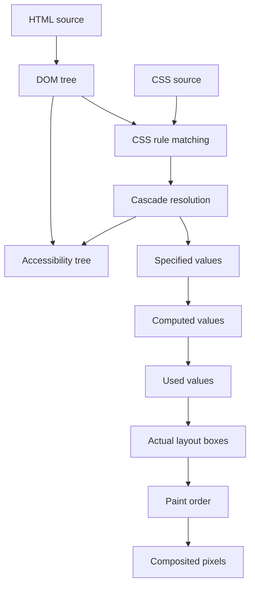
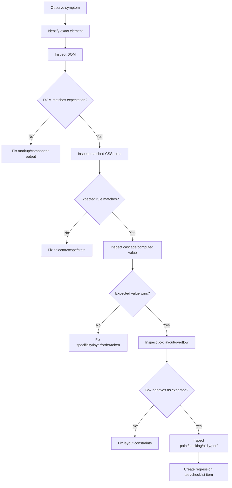
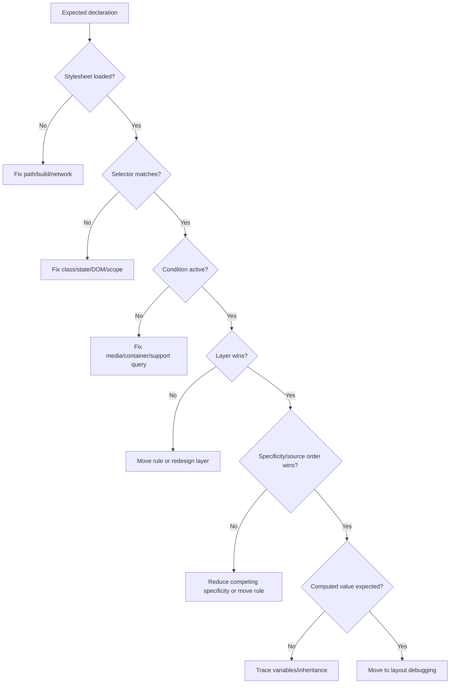
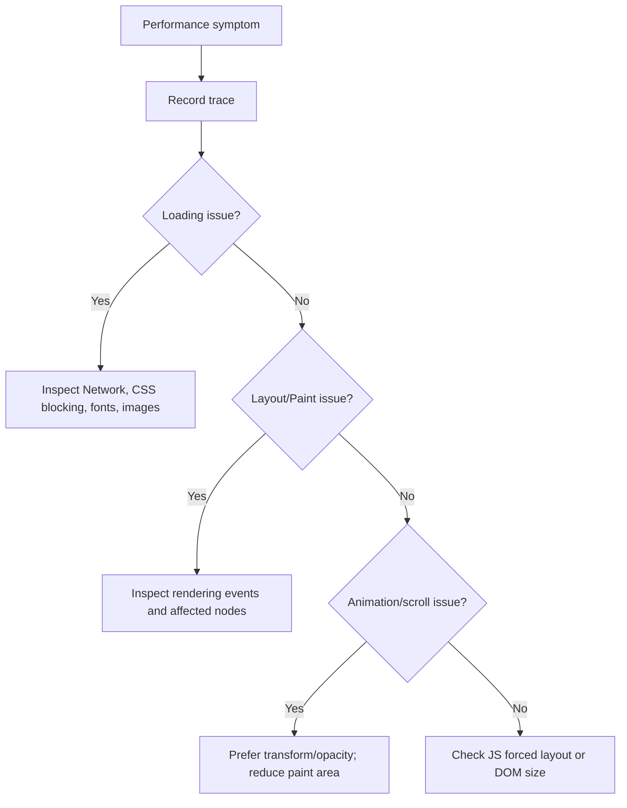

# Debugging HTML/CSS Like an Engineer: DevTools, Computed Styles, Layout Inspection, and Failure Modelling

Debugging HTML/CSS bukan aktivitas menebak-nebak properti sampai tampilan terlihat benar. Untuk engineer, debugging adalah proses membangun model sebab-akibat:

- elemen mana yang sedang dirender,
- rule CSS mana yang menang,
- nilai computed mana yang dipakai browser,
- box mana yang menghasilkan ukuran/posisi,
- konteks layout mana yang aktif,
- stacking context mana yang berlaku,
- state aksesibilitas apa yang terekspos,
- dan kapan perubahan style/layout/paint terjadi.

Target bagian ini: kamu mampu mendiagnosis bug HTML/CSS dengan metode yang repeatable, bukan trial and error.

---

## 1. Debugging Mindset

Bug HTML/CSS biasanya terlihat visual, tetapi penyebabnya struktural.

Contoh:

| Gejala | Penyebab yang mungkin |
|---|---|
| Button tidak berubah warna | selector tidak match, layer kalah, specificity kalah, custom property tidak tersedia |
| Card overflow horizontal | `min-width: auto`, fixed width, long unbroken text, image tanpa constraint |
| Sticky tidak bekerja | ancestor punya overflow, offset tidak diset, container salah |
| Modal tertutup header | stacking context baru, `z-index` tidak satu konteks, top layer tidak dipakai |
| Layout mobile rusak | breakpoint viewport-only, intrinsic size terlalu besar, container tidak adaptif |
| Label form tidak dibaca screen reader | `label` tidak terasosiasi, accessible name tidak ada |
| Focus tidak terlihat | `outline: none`, focus style terlalu low contrast, state hanya hover |

Engineer yang baik tidak bertanya “properti apa yang kurang?”. Engineer yang baik bertanya:

> Browser sedang mengambil keputusan apa, dan input mana yang membuat keputusan itu salah?

---

## 2. The Browser Decision Stack

Setiap tampilan akhir adalah hasil dari beberapa keputusan browser.



Debugging berarti menentukan pada tahap mana deviasi terjadi:

1. **DOM salah**: markup tidak seperti yang diasumsikan.
2. **Selector tidak match**: CSS tidak pernah berlaku.
3. **Cascade kalah**: CSS match, tetapi dikalahkan rule lain.
4. **Computed value salah**: nilai final berbeda dari niat desain.
5. **Used value berbeda**: browser menghitung ukuran/posisi berdasarkan constraint lain.
6. **Paint/stacking salah**: elemen ada, tetapi tertutup/terclip.
7. **Accessibility tree salah**: tampilan visual benar, tetapi kontrak aksesibilitas rusak.

---

## 3. DevTools as Ground Truth

Source code bukan ground truth. Framework template bukan ground truth. Figma bukan ground truth.

Ground truth untuk debugging HTML/CSS adalah browser runtime:

- DOM yang sudah diparse,
- stylesheet yang sudah dimuat,
- rule yang benar-benar match,
- computed style final,
- layout box aktual,
- scroll container aktual,
- stacking context aktual,
- accessibility tree aktual,
- network resource aktual,
- performance trace aktual.

Chrome DevTools, Firefox DevTools, Safari Web Inspector, dan Edge DevTools memiliki variasi UI, tetapi mental model yang dicari sama.

Bagian ini memakai istilah generik DevTools, dengan contoh yang paling sering ditemui di Chrome/Edge karena tooling-nya luas.

---

## 4. Fast Debugging Loop

Gunakan loop ini setiap kali bug tampilan muncul.



Jangan lompat langsung ke solusi. Tentukan dulu titik kegagalannya.

---

## 5. Inspecting the DOM

Langkah pertama: pilih elemen yang bermasalah dan lihat DOM runtime.

Periksa:

- apakah elemen benar-benar ada,
- apakah element type benar,
- apakah nesting sesuai ekspektasi,
- apakah class/data attribute/state attribute muncul,
- apakah attribute disabled/hidden/aria ada,
- apakah framework menghasilkan wrapper tambahan,
- apakah node berpindah karena portal/teleport,
- apakah elemen ada di Shadow DOM,
- apakah elemen berada di iframe,
- apakah markup invalid telah dikoreksi parser browser.

Contoh bug:

```html
<p>
  Case owner:
  <div class="owner-card">Ayu</div>
</p>
```

`div` tidak valid sebagai child langsung `p`. Browser akan menutup `<p>` sebelum `<div>`, sehingga DOM runtime berbeda dari source yang kamu bayangkan.

Debugging rule:

> Selalu debug DOM yang terlihat di DevTools, bukan template mentah.

---

## 6. Inspecting Matched Rules

Di panel Styles, DevTools menampilkan rule yang match terhadap elemen.

Yang harus diperiksa:

- rule mana yang aktif,
- rule mana yang dicoret,
- selector mana yang match,
- stylesheet mana yang menyediakan rule,
- urutan stylesheet,
- layer CSS,
- media/container condition,
- pseudo-class state,
- inherited styles,
- custom property source.

Contoh:

```css
.button {
  color: white;
}

.action-bar .button {
  color: black;
}
```

Jika `.button { color: white; }` dicoret, itu bukan berarti rule-nya tidak ada. Artinya rule itu kalah dalam cascade.

Pertanyaan debugging:

- Apakah selector match?
- Apakah property dicoret?
- Rule mana yang menang?
- Kenapa rule itu menang: specificity, layer, order, atau `!important`?

---

## 7. Computed Styles

Computed style adalah tempat melihat nilai final setelah cascade, inheritance, dan default browser diterapkan.

Gunakan Computed tab untuk menjawab:

- nilai final `display` apa?
- nilai final `position` apa?
- ukuran final `width`/`height` berapa?
- apakah `box-sizing` benar?
- apakah `overflow` berasal dari ancestor?
- apakah `font-size` berasal dari `rem`, `em`, inheritance, atau user-agent style?
- apakah `color` berasal dari token yang benar?
- apakah `line-height` computed berbeda dari yang kamu kira?

Contoh:

```css
.card {
  width: 100%;
  padding: 24px;
}
```

Jika `box-sizing: content-box`, actual rendered width bisa menjadi `100% + 48px`, menyebabkan overflow. Computed style membantu melihat `box-sizing` final.

---

## 8. Specified, Computed, Used, and Actual Values

CSS memiliki beberapa tahap nilai.

| Tahap | Arti | Contoh |
|---|---|---|
| Specified value | Nilai hasil cascade | `width: 50%` |
| Computed value | Nilai setelah resolving sebagian dependency | `font-size: 16px` |
| Used value | Nilai yang dipakai setelah layout constraint | `width: 480px` |
| Actual value | Nilai setelah limit device/browser | pixel rendered |

Contoh:

```css
.panel {
  width: 50%;
}
```

`50%` tidak bisa dipahami penuh tanpa ukuran containing block. Karena itu debugging layout tidak cukup dengan melihat CSS source; kamu harus melihat box aktual.

---

## 9. Debugging the Cascade

Cascade bug biasanya muncul sebagai “CSS saya tidak jalan”. Padahal CSS-nya jalan, hanya kalah.

Urutan investigasi:

1. Apakah stylesheet loaded?
2. Apakah selector match?
3. Apakah rule berada di media/container query aktif?
4. Apakah rule berada di layer yang kalah?
5. Apakah specificity kalah?
6. Apakah source order kalah?
7. Apakah property inherited atau tidak?
8. Apakah custom property fallback aktif?
9. Apakah `!important` terlibat?
10. Apakah style berasal dari inline style/framework?

Diagram cascade debugging:



---

## 10. Debugging Cascade Layers

Dengan `@layer`, rule yang secara source-order lebih awal bisa menang/kalah berdasarkan deklarasi layer.

Contoh:

```css
@layer reset, base, components, utilities;

@layer utilities {
  .text-danger {
    color: red;
  }
}

@layer components {
  .alert {
    color: black;
  }
}
```

Jika `utilities` dideklarasikan setelah `components` dalam layer order, utility bisa override component meskipun selector sederhana.

Checklist:

- Apakah layer order dideklarasikan satu kali di entry stylesheet?
- Apakah vendor CSS masuk layer yang tepat?
- Apakah utilities memang boleh override components?
- Apakah unlayered CSS tidak sengaja mengalahkan layered CSS?
- Apakah `revert-layer` dipakai dengan sengaja?

Rule praktis:

> Jangan memperbaiki layer bug dengan menaikkan specificity. Perbaiki boundary layer-nya.

---

## 11. Debugging Custom Properties

Custom properties sering menjadi sumber bug theming.

Contoh:

```css
.card {
  color: var(--card-fg, var(--color-fg-default));
}
```

Jika warna salah, trace urutan:

1. Apakah `--card-fg` tersedia pada elemen atau ancestor?
2. Apakah value-nya valid?
3. Jika tidak, apakah fallback `--color-fg-default` tersedia?
4. Apakah theme root sudah aktif?
5. Apakah scope dark mode benar?
6. Apakah custom property di-shadow oleh komponen nested?

Failure example:

```css
:root {
  --color-danger: #b00020;
}

.button {
  color: var(--color-dangr, red);
}
```

Typo menyebabkan fallback aktif. UI terlihat “masih jalan” tetapi token system tidak dipakai.

Debugging discipline:

- Klik property di Computed panel.
- Trace variable resolution.
- Jangan hanya lihat nilai akhir; lihat sumber token.
- Untuk design system, bug token adalah bug contract.

---

## 12. Debugging the Box Model

Box model bug biasanya muncul sebagai ukuran yang “tidak masuk akal”.

Periksa:

- `box-sizing`,
- width/height/min/max,
- padding,
- border,
- margin,
- gap,
- overflow,
- display type,
- containing block,
- intrinsic content size.

Contoh overflow umum:

```css
.page {
  width: 100vw;
  padding-inline: 24px;
}
```

`100vw` mencakup scrollbar width pada beberapa konteks. Ditambah padding, bisa menyebabkan horizontal overflow.

Lebih aman:

```css
.page {
  width: 100%;
  padding-inline: 24px;
}
```

Debugging horizontal overflow:

```css
* {
  outline: 1px solid red;
}
```

Hanya gunakan sementara. Jangan commit.

Strategi lebih sistematis:

1. Buka DevTools.
2. Pilih `body` atau container utama.
3. Cari elemen dengan width lebih besar dari viewport/container.
4. Periksa intrinsic content: long text, image, table, flex item, grid item.
5. Tambahkan constraint yang tepat: `min-width: 0`, `max-width: 100%`, `overflow-wrap: anywhere`, `overflow: auto`, atau redesign layout.

---

## 13. Debugging Flexbox

Flexbox bug paling sering berasal dari salah memahami shrink/grow/min-size.

### 13.1 Flex Item Tidak Mau Mengecil

Gejala:

- card keluar container,
- text menyebabkan row overflow,
- sidebar/content tidak shrink.

Penyebab umum:

```css
.item {
  min-width: auto; /* default for flex items */
}
```

Fix umum:

```css
.item {
  min-width: 0;
}
```

Contoh:

```css
.case-row {
  display: flex;
  gap: 1rem;
}

.case-row__summary {
  flex: 1 1 auto;
  min-width: 0;
}

.case-row__title {
  overflow: hidden;
  text-overflow: ellipsis;
  white-space: nowrap;
}
```

### 13.2 `justify-content` Tidak Bekerja

Pertanyaan:

- Apakah container punya free space?
- Apakah item memakai `flex-grow` sehingga free space habis?
- Apakah axis yang kamu pikir main axis benar?
- Apakah `flex-direction` berubah?

### 13.3 `align-items` Tidak Seperti Ekspektasi

Pertanyaan:

- Apakah cross axis benar?
- Apakah item memiliki height sendiri?
- Apakah baseline alignment terlibat?
- Apakah stretch terjadi karena default `align-items: stretch`?

Gunakan Flexbox overlay untuk melihat axis dan distribusi.

---

## 14. Debugging CSS Grid

Grid bug biasanya berasal dari track sizing, auto-placement, atau intrinsic size item.

### 14.1 Grid Overflow

Contoh:

```css
.grid {
  display: grid;
  grid-template-columns: repeat(3, 1fr);
}
```

Jika item punya konten panjang, `1fr` tidak selalu membuat item bebas shrink di bawah min-content size.

Pattern lebih aman:

```css
.grid {
  display: grid;
  grid-template-columns: repeat(3, minmax(0, 1fr));
}
```

### 14.2 `auto-fit` vs `auto-fill`

Jika layout tampak punya kolom kosong atau collapse aneh, periksa apakah kamu benar-benar butuh:

```css
grid-template-columns: repeat(auto-fit, minmax(16rem, 1fr));
```

atau:

```css
grid-template-columns: repeat(auto-fill, minmax(16rem, 1fr));
```

Mental model:

- `auto-fit`: track kosong collapse; cocok untuk card fluid.
- `auto-fill`: track kosong tetap disediakan; cocok jika struktur grid harus stabil.

### 14.3 Named Area Tidak Bekerja

Periksa:

- setiap row string punya jumlah kolom sama,
- named area membentuk rectangle,
- item memakai nama yang tepat,
- tidak ada typo,
- media query tidak meninggalkan area lama.

```css
.layout {
  display: grid;
  grid-template-areas:
    "header header"
    "nav    main"
    "footer footer";
}
```

Area tidak boleh berbentuk L.

---

## 15. Debugging Positioning

Positioning bug muncul saat elemen tidak berada di tempat yang diharapkan.

### 15.1 Absolute Position Salah Referensi

`position: absolute` mencari containing block dari ancestor positioned terdekat.

```css
.card {
  position: relative;
}

.card__badge {
  position: absolute;
  inset-block-start: 0.5rem;
  inset-inline-end: 0.5rem;
}
```

Jika `.card` tidak `position: relative`, badge mungkin relatif ke ancestor lain.

### 15.2 Fixed Tidak Fixed

`position: fixed` bisa dipengaruhi ancestor dengan transform/filter/perspective tertentu. Jika fixed element bergerak bersama container, cari ancestor yang membentuk containing block baru.

### 15.3 Sticky Tidak Sticky

Checklist sticky:

- apakah elemen punya `position: sticky`?
- apakah offset diset, misalnya `top: 0` atau `inset-block-start: 0`?
- apakah ancestor punya `overflow: hidden/auto/scroll`?
- apakah scroll container yang benar?
- apakah elemen lebih tinggi dari scroll container?
- apakah table/layout context membatasi sticky?

Contoh:

```css
.table-header {
  position: sticky;
  inset-block-start: 0;
  z-index: 1;
}
```

Sticky selalu harus dipahami relatif terhadap scroll container.

---

## 16. Debugging z-index and Stacking Context

`z-index` bug hampir selalu karena developer menganggap semua elemen berada dalam satu global stack. Itu salah.

Stacking context bisa dibuat oleh banyak hal, misalnya:

- positioned element dengan `z-index`,
- `opacity < 1`,
- `transform`,
- `filter`,
- `isolation: isolate`,
- `contain: paint`,
- `will-change`,
- top layer elements.

Contoh bug:

```css
.app-header {
  position: sticky;
  z-index: 100;
}

.card {
  position: relative;
  z-index: 9999;
}
```

`9999` tidak otomatis mengalahkan header jika berada di stacking context berbeda.

Debugging checklist:

1. Pilih elemen yang harus tampil di atas.
2. Trace ancestor yang membuat stacking context.
3. Bandingkan sibling stacking context, bukan hanya child.
4. Hindari z-index random.
5. Untuk modal/popover native, pahami top layer.

Pattern z-index scale:

```css
:root {
  --z-base: 0;
  --z-sticky: 100;
  --z-dropdown: 200;
  --z-modal: 300;
  --z-toast: 400;
}
```

Tetapi scale hanya bekerja jika stacking context architecture juga terkendali.

---

## 17. Debugging Overflow and Clipping

Overflow bug bisa berupa:

- content keluar container,
- shadow terpotong,
- dropdown terclip,
- scroll ganda,
- page horizontal scroll,
- sticky tidak bekerja karena scroll container tidak sengaja.

Checklist:

- ancestor mana yang punya `overflow` bukan `visible`?
- apakah `overflow: hidden` dipakai untuk border-radius clipping?
- apakah overlay seharusnya keluar container?
- apakah element perlu portal/top layer?
- apakah `contain: paint` memotong paint?
- apakah transform membuat positioning context baru?

Contoh anti-pattern:

```css
.card {
  overflow: hidden;
  border-radius: 12px;
}

.card .dropdown {
  position: absolute;
}
```

Dropdown bisa terclip oleh card. Solusi bukan menaikkan `z-index`; overflow clipping tetap berlaku. Solusinya mungkin:

- render dropdown di overlay root,
- gunakan Popover API/top layer jika sesuai,
- ubah struktur DOM,
- atau jangan tempatkan overlay sebagai child dari clipping container.

---

## 18. Debugging Responsive Layout

Responsive bug harus direproduksi dengan kondisi realistis:

- viewport width,
- viewport height,
- DPR,
- zoom,
- text scaling,
- orientation,
- dynamic viewport on mobile,
- safe area,
- input keyboard,
- container size,
- user preference: dark mode/reduced motion/forced colors.

Jangan hanya tes 375px dan 1440px.

### 18.1 Breakpoint Bug

Jika layout rusak di antara breakpoint, kemungkinan rule terlalu discrete.

Bad:

```css
.card-grid {
  grid-template-columns: repeat(4, 1fr);
}

@media (max-width: 768px) {
  .card-grid {
    grid-template-columns: 1fr;
  }
}
```

Better:

```css
.card-grid {
  display: grid;
  grid-template-columns: repeat(auto-fit, minmax(min(100%, 18rem), 1fr));
  gap: 1rem;
}
```

### 18.2 Container Query Bug

Jika container query tidak jalan, periksa:

```css
.card-list {
  container-type: inline-size;
}

@container (min-width: 40rem) {
  .case-card {
    grid-template-columns: 1fr auto;
  }
}
```

Checklist:

- apakah ancestor yang benar punya `container-type`?
- apakah query ditulis untuk ukuran container, bukan viewport?
- apakah komponen berada di dalam container tersebut?
- apakah containment mengubah layout yang tidak diantisipasi?

---

## 19. Debugging Accessibility

Accessibility debugging tidak bisa hanya melihat UI visual.

Periksa:

- accessible name,
- role,
- state,
- focus order,
- keyboard behavior,
- form label/error association,
- hidden content,
- live region behavior,
- landmarks,
- heading hierarchy,
- contrast,
- reduced motion.

### 19.1 Button Tidak Bernama

Bad:

```html
<button class="icon-button">
  <svg aria-hidden="true">...</svg>
</button>
```

Tidak ada accessible name.

Good:

```html
<button class="icon-button" aria-label="Close dialog">
  <svg aria-hidden="true" focusable="false">...</svg>
</button>
```

### 19.2 Label Tidak Terasosiasi

Bad:

```html
<span>Case ID</span>
<input name="caseId" />
```

Good:

```html
<label for="case-id">Case ID</label>
<input id="case-id" name="caseId" />
```

### 19.3 Focus Order Salah

Penyebab umum:

- DOM order tidak sesuai visual order,
- `tabindex` positif,
- hidden element tetap focusable,
- modal tidak mengelola focus,
- offcanvas nav tidak inert ketika tertutup.

Debugging rule:

> Jalankan keyboard test sebelum screen reader test. Jika keyboard flow rusak, accessibility flow hampir pasti rusak.

---

## 20. Debugging Performance from CSS/HTML

Untuk HTML/CSS, DevTools Performance panel membantu melihat:

- style recalculation,
- layout cost,
- paint cost,
- composite cost,
- layout shift,
- long rendering tasks,
- expensive DOM size,
- forced synchronous layout dari JS,
- large image/font loading,
- render-blocking CSS.

HTML/CSS performance bug sering terlihat seperti:

- scroll janky pada list/table besar,
- modal open terasa berat,
- resize lambat,
- initial render lambat,
- layout shift setelah font/image load,
- hover effect membuat repaint besar,
- animation tidak smooth.

Debugging flow:



Rule praktis:

- Jangan optimize selector sebelum melihat trace.
- Jangan menebak paint cost; rekam.
- Jangan menganggap CSS murah jika DOM besar.
- Jangan menganggap animation smooth karena properti animatable.

---

## 21. Debugging with Binary Search

Jika CSS besar dan penyebab tidak jelas, gunakan binary search.

Strategi:

1. Reproduce bug stabil.
2. Disable stylesheet besar satu per satu.
3. Disable layer satu per satu.
4. Disable rule group satu per satu.
5. Setelah area sempit, inspect computed style.
6. Buat minimal reproducible case.
7. Tambahkan regression test atau checklist.

Contoh:

```css
/* temporary debugging only */
@layer components {
  /* disable suspected component rules */
}
```

Atau di DevTools, uncheck declarations/rules langsung.

Tujuannya bukan menemukan “CSS yang salah” secara acak. Tujuannya menemukan smallest causal difference.

---

## 22. Minimal Reproducible Case

HTML/CSS sering berinteraksi dengan banyak state. Minimal reproducible case membantu memisahkan faktor.

Template:

```html
<!doctype html>
<html lang="en">
<head>
  <meta charset="utf-8" />
  <meta name="viewport" content="width=device-width, initial-scale=1" />
  <title>CSS Repro</title>
  <style>
    * { box-sizing: border-box; }

    /* Put only relevant CSS here */
  </style>
</head>
<body>
  <!-- Put only relevant HTML here -->
</body>
</html>
```

MRC yang baik:

- tidak memakai framework jika tidak perlu,
- tidak memakai design system penuh,
- hanya memuat HTML/CSS relevan,
- bisa dijalankan lokal,
- menunjukkan expected vs actual,
- mempertahankan kondisi penting seperti width, overflow, writing mode, atau state.

---

## 23. Failure Taxonomy

Gunakan taxonomy ini untuk mempercepat diagnosis.

### 23.1 Source/Loading Failure

Gejala:

- CSS tidak ada efek sama sekali,
- font tidak berubah,
- image tidak muncul.

Cek:

- Network tab,
- path salah,
- MIME type,
- CSP,
- cache,
- bundler output,
- import order,
- source map.

### 23.2 DOM/Structure Failure

Gejala:

- selector tidak match,
- screen reader membaca aneh,
- layout berubah tanpa alasan.

Cek:

- parsed DOM,
- invalid nesting,
- duplicated id,
- framework wrapper,
- portal,
- Shadow DOM,
- iframe.

### 23.3 Cascade Failure

Gejala:

- property dicoret,
- theme token tidak berlaku,
- utility tidak override.

Cek:

- specificity,
- layer,
- source order,
- inheritance,
- `!important`,
- inline style,
- custom property fallback.

### 23.4 Layout Constraint Failure

Gejala:

- overflow,
- wrong size,
- item tidak align,
- grid/flex tidak seperti ekspektasi.

Cek:

- containing block,
- min/max,
- intrinsic size,
- flex/grid algorithm,
- `min-width: 0`,
- `box-sizing`,
- writing mode.

### 23.5 Paint/Stacking Failure

Gejala:

- element ada tapi tidak terlihat,
- overlay tertutup,
- shadow terpotong,
- dropdown hilang.

Cek:

- opacity,
- visibility,
- display,
- overflow clipping,
- stacking context,
- top layer,
- transform,
- containment.

### 23.6 Interaction State Failure

Gejala:

- hover works, keyboard tidak,
- focus hilang,
- disabled state ambigu,
- menu tidak close/open benar.

Cek:

- `:hover`, `:focus`, `:focus-visible`, `:active`, `:disabled`,
- ARIA state,
- data-state,
- JS event state,
- keyboard contract.

### 23.7 Accessibility Failure

Gejala:

- visual benar, assistive tech salah.

Cek:

- semantic element,
- accessible name,
- role,
- state,
- focus order,
- label association,
- error association,
- hidden semantics.

### 23.8 Compatibility Failure

Gejala:

- works in Chrome, fails in Safari/Firefox,
- modern CSS ignored,
- mobile viewport wrong.

Cek:

- Baseline/compatibility,
- `@supports`,
- vendor quirks,
- feature fallback,
- mobile viewport units,
- input browser defaults.

---

## 24. Debugging Playbooks

### 24.1 “CSS Rule Does Not Apply”

1. Inspect element.
2. Search selector in Styles panel.
3. If absent, selector does not match or stylesheet not loaded.
4. If present but crossed out, cascade issue.
5. Check media/container/support condition.
6. Check layer/specificity/source order.
7. Check custom property fallback.

### 24.2 “Element Is Wider Than Container”

1. Inspect box model width.
2. Check `box-sizing`.
3. Check fixed width/min-width.
4. Check long unbroken text.
5. Check image/table intrinsic width.
6. For flex/grid children, try `min-width: 0` only if correct.
7. Add `max-width: 100%` for media.
8. Use `overflow-wrap` for untrusted text.

### 24.3 “Text Ellipsis Does Not Work”

Requirement:

```css
.truncate {
  overflow: hidden;
  text-overflow: ellipsis;
  white-space: nowrap;
}
```

Also ensure:

- element has constrained width,
- flex/grid item can shrink,
- parent does not expand to content,
- `min-width: 0` if inside flex/grid.

### 24.4 “z-index Does Not Work”

1. Identify both elements.
2. Find nearest stacking context ancestors.
3. Compare siblings in same stacking context.
4. Check overflow clipping separately.
5. Consider top layer for modal/popover.
6. Avoid random escalation like `999999`.

### 24.5 “Sticky Header Does Not Stick”

1. Confirm offset.
2. Find scroll container.
3. Remove accidental overflow on ancestors.
4. Check height constraints.
5. Check table/layout context.
6. Check z-index only after sticky behavior works.

### 24.6 “Form Looks Right But Is Not Accessible”

1. Inspect label association.
2. Check accessible name.
3. Check required/error state.
4. Check `aria-describedby` for hint/error.
5. Use keyboard only.
6. Verify screen reader announcement.

---

## 25. DevTools Habits for Senior Engineers

Good habits:

- inspect runtime DOM first,
- use Computed tab before changing CSS,
- toggle declarations one at a time,
- force states instead of trying to hover manually,
- use layout overlays for Flex/Grid,
- inspect accessibility tree,
- emulate user preferences,
- test zoom/text scaling,
- record performance trace when performance is claimed,
- preserve minimal repros for recurring bugs,
- convert fixes into regression tests/checklists.

Bad habits:

- adding `!important`,
- adding random `z-index`,
- wrapping elements until layout works,
- changing semantic elements for styling convenience,
- relying on pixel-perfect width hacks,
- ignoring keyboard/focus,
- debugging source instead of runtime,
- fixing symptom without understanding cascade/layout cause.

---

## 26. Debugging Checklist

Before declaring an HTML/CSS bug fixed:

- [ ] I inspected the actual runtime DOM.
- [ ] I identified the exact element causing the symptom.
- [ ] I checked matched rules and computed styles.
- [ ] I know whether this was a DOM, cascade, layout, paint, accessibility, or compatibility issue.
- [ ] I avoided unnecessary `!important`.
- [ ] I avoided random z-index escalation.
- [ ] I tested keyboard/focus if interaction was involved.
- [ ] I tested relevant responsive widths.
- [ ] I checked at least one non-Chrome browser if compatibility risk exists.
- [ ] I added or updated a regression check.
- [ ] I can explain the root cause in one paragraph.

---

## 27. Practice: Debugging Drills

### Drill 1 — Cascade Conflict

Create conflicting button styles across layers:

- base button,
- component button,
- utility color,
- disabled state.

Task:

- predict winner,
- inspect in DevTools,
- explain why,
- refactor without `!important`.

### Drill 2 — Flex Overflow

Build a row with:

- avatar,
- long title,
- status badge,
- action button.

Make long title overflow. Fix it with correct shrink constraints.

### Drill 3 — Grid Dashboard

Build a responsive grid with `auto-fit` and card minimum width. Create one card with long unbroken ID. Fix overflow while preserving layout.

### Drill 4 — Sticky Table Header

Build a scrollable table with sticky header. Break it using ancestor overflow. Diagnose and fix.

### Drill 5 — Overlay Clipping

Create a dropdown inside a card with `overflow: hidden`. Diagnose why z-index does not help. Refactor with overlay root or native popover.

### Drill 6 — Accessibility Inspector

Create an icon-only button without accessible name. Inspect accessibility tree. Fix and verify.

---

## 28. First 20 Hours Connection

Dalam framework Kaufman, debugging adalah feedback loop utama.

Tanpa debugging skill, kamu hanya bisa:

- meniru contoh,
- copy-paste pattern,
- dan berharap UI bekerja.

Dengan debugging skill, kamu bisa self-correct. Itu yang mengubah belajar HTML/CSS dari “hafal properti” menjadi engineering capability.

Alokasi latihan dari 20 jam pertama:

| Waktu | Aktivitas |
|---:|---|
| 30 menit | inspect 5 website production dan baca computed styles |
| 30 menit | debug cascade conflicts |
| 45 menit | debug flex/grid overflow |
| 30 menit | debug z-index/overlay/sticky |
| 30 menit | debug accessibility tree |
| 45 menit | buat minimal repro untuk 3 bug |

Tujuan latihan bukan banyak membuat UI, tetapi cepat menemukan root cause.

---

## 29. Senior-Level Root Cause Report Template

Gunakan template ini saat code review atau incident UI.

```md
## Symptom
What did the user see?

## Affected Context
Viewport, browser, route, state, theme, user preference.

## Root Cause
DOM/cascade/layout/paint/accessibility/compatibility cause.

## Evidence
DevTools observation: computed style, layout box, rule source, trace, screenshot.

## Fix
Minimal change and why it fixes root cause.

## Regression Coverage
Manual/automated check added.

## Risk
Potential side effects and impacted components.
```

Contoh root cause yang baik:

> The case title overflowed on narrow screens because `.case-row__summary` was a flex item with default `min-width: auto`, so it refused to shrink below its min-content width. The fix adds `min-width: 0` to the flexible content column and applies truncation only to the title node. This preserves action button visibility and does not change desktop layout.

Contoh root cause yang buruk:

> CSS bug fixed by adding width and overflow.

---

## 30. Summary

Debugging HTML/CSS yang matang berarti:

- memulai dari runtime DOM,
- memahami cascade sebagai decision system,
- membaca computed styles,
- melihat layout box aktual,
- menggunakan Flex/Grid overlays,
- memahami stacking context dan overflow clipping,
- memeriksa accessibility tree,
- memakai performance trace saat perlu,
- membuat minimal repro,
- dan mengubah bug menjadi checklist/regression test.

Skill ini adalah pembeda besar antara engineer yang hanya bisa membuat tampilan dan engineer yang bisa menjaga UI tetap benar ketika produk, tim, dan kompleksitas tumbuh.

---

## Rujukan

- Chrome DevTools CSS features reference — https://developer.chrome.com/docs/devtools/css/reference
- Chrome DevTools: Inspect CSS grid layouts — https://developer.chrome.com/docs/devtools/css/grid
- MDN: Specificity — https://developer.mozilla.org/en-US/docs/Web/CSS/CSS_cascade/Specificity
- MDN: CSS Cascade — https://developer.mozilla.org/en-US/docs/Web/CSS/CSS_cascade/Cascade
- MDN: Stacking context — https://developer.mozilla.org/en-US/docs/Web/CSS/CSS_positioned_layout/Stacking_context
- MDN: Basic concepts of flexbox — https://developer.mozilla.org/en-US/docs/Web/CSS/CSS_flexible_box_layout/Basic_concepts_of_flexbox
- MDN: Basic concepts of grid layout — https://developer.mozilla.org/en-US/docs/Web/CSS/CSS_grid_layout/Basic_concepts_of_grid_layout
- WAI-ARIA Authoring Practices Guide — https://www.w3.org/WAI/ARIA/apg/
- WCAG 2.2 — https://www.w3.org/TR/WCAG22/
