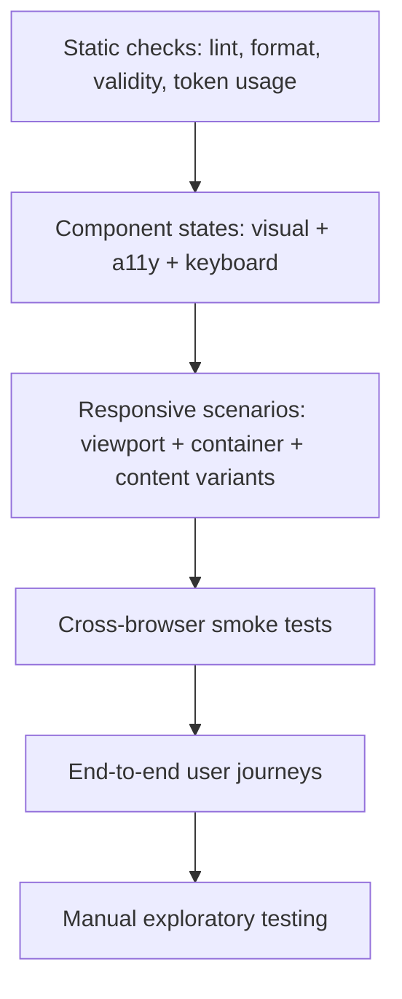
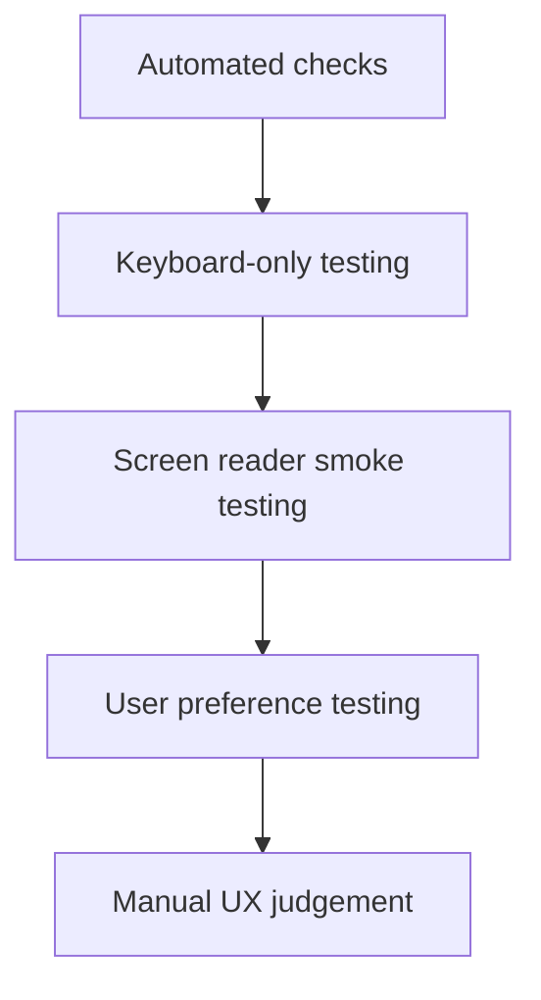
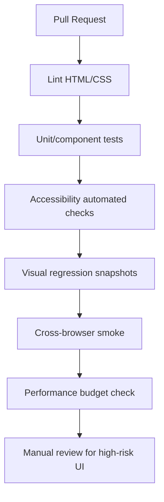
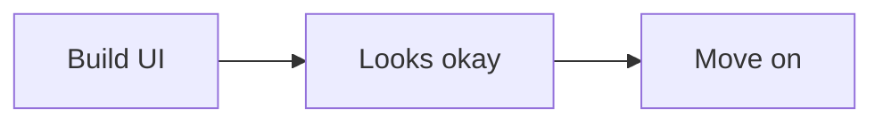
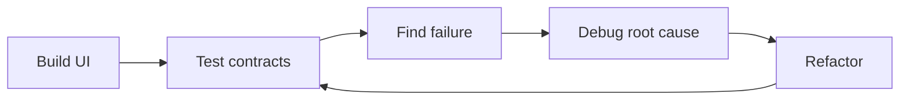

# Testing HTML/CSS: Accessibility Tests, Visual Regression, Cross-Browser Strategy, and Baseline

Testing HTML/CSS bukan hanya membandingkan screenshot. HTML/CSS membawa kontrak yang lebih luas:

- struktur dokumen,
- semantics,
- accessibility,
- layout responsiveness,
- visual consistency,
- browser compatibility,
- theming,
- print behavior,
- performance stability,
- dan graceful degradation.

Target bagian ini: kamu mampu mendesain strategi testing HTML/CSS yang defensible untuk production, bukan hanya “kelihatan benar di laptop saya”.

---

## 1. What Are We Testing?

HTML/CSS menghasilkan UI, tetapi UI bukan hanya pixel.

Kita menguji beberapa contract:

| Contract | Pertanyaan |
|---|---|
| Semantic contract | Apakah elemen HTML menyatakan makna yang benar? |
| Accessibility contract | Apakah keyboard/screen reader/user preferences didukung? |
| Layout contract | Apakah layout stabil dalam constraint berbeda? |
| Visual contract | Apakah tampilan konsisten dengan design system? |
| Interaction state contract | Apakah hover/focus/active/disabled/loading/error benar? |
| Browser contract | Apakah fitur yang dipakai didukung target browser? |
| Performance contract | Apakah CSS/HTML tidak merusak LCP/CLS/render cost? |
| Content resilience contract | Apakah UI tahan terhadap data panjang/kosong/aneh? |

Jika test hanya mengecek screenshot desktop default, sebagian besar kontrak di atas tidak teruji.

---

## 2. HTML/CSS Testing Pyramid



Pyramid ini sengaja berbeda dari backend testing. Untuk HTML/CSS, banyak bug hanya muncul saat kombinasi state, content, browser, viewport, dan user preference berubah.

---

## 3. Testing Strategy by Risk

Tidak semua UI butuh coverage yang sama.

### 3.1 Low-Risk UI

Contoh:

- static marketing text,
- simple card,
- decorative layout.

Cukup:

- semantic review,
- responsive smoke,
- basic visual check,
- basic accessibility check.

### 3.2 Medium-Risk UI

Contoh:

- forms,
- navigation,
- responsive dashboard,
- filter panel,
- modal.

Butuh:

- keyboard testing,
- accessibility state testing,
- visual regression untuk key states,
- responsive matrix,
- cross-browser smoke.

### 3.3 High-Risk UI

Contoh:

- regulatory case action,
- payment/submit flow,
- evidence table,
- destructive action modal,
- compliance report view,
- workflow stepper.

Butuh:

- semantic review,
- manual keyboard test,
- screen reader smoke test,
- automated accessibility test,
- visual regression across states,
- responsive and zoom test,
- browser compatibility review,
- print/export check jika relevan,
- domain-specific review.

Rule:

> UI yang berpengaruh pada keputusan, uang, status hukum, atau irreversible action harus diuji sebagai workflow, bukan sebagai component screenshot saja.

---

## 4. Static Checks

Static checks murah dan cepat. Mereka tidak membuktikan UI benar, tetapi menangkap banyak kesalahan awal.

Yang bisa dicek:

- HTML validity,
- duplicate id,
- missing `alt`,
- invalid ARIA attribute,
- CSS syntax,
- unknown custom properties,
- design token usage,
- disallowed raw colors,
- disallowed `!important`,
- max specificity,
- layer ordering,
- unused selectors,
- browser support via compatibility tooling.

Contoh policy CSS:

```css
/* Allowed */
@layer reset, base, tokens, components, utilities, overrides;

/* Discouraged */
.component .nested .deep .selector .chain {
  color: red;
}

/* Usually forbidden in product CSS */
.some-rule {
  color: #ff0000;
  z-index: 999999;
  outline: none;
}
```

Static checks harus memperkuat architecture. Jangan menjadikan linter sebagai daftar selera personal.

---

## 5. Semantic HTML Testing

Semantic testing menjawab: apakah markup mengekspresikan struktur dan makna dengan benar?

Checklist:

- [ ] Satu halaman punya struktur heading yang masuk akal.
- [ ] `main` merepresentasikan konten utama.
- [ ] Navigation memakai `nav` jika memang navigation utama/sekunder.
- [ ] Button untuk action, link untuk navigation.
- [ ] Table hanya untuk data tabular.
- [ ] Form control punya label.
- [ ] Error/hint terasosiasi dengan input.
- [ ] Icon decorative disembunyikan dari assistive tech.
- [ ] Image informative punya `alt` bermakna.
- [ ] Language dokumen diset dengan `lang`.
- [ ] Directionality dipikirkan jika multi-language/RTL.

Cara test:

1. Matikan CSS secara mental atau secara tooling.
2. Baca HTML structure.
3. Pastikan urutan konten tetap masuk akal.
4. Pastikan interaksi masih bisa dipahami tanpa visual styling.

---

## 6. Accessibility Testing Layers

Accessibility tidak bisa diuji hanya dengan tool otomatis.



Tool otomatis bisa menangkap sebagian issue, misalnya:

- missing label,
- missing alt,
- color contrast tertentu,
- invalid ARIA,
- duplicate id,
- missing document language.

Tetapi tool otomatis sering tidak bisa memastikan:

- apakah `alt` benar secara konteks,
- apakah focus order masuk akal,
- apakah keyboard interaction sesuai pola,
- apakah error message membantu,
- apakah screen reader announcement jelas,
- apakah workflow terlalu membebani user.

Rule:

> Automated accessibility testing adalah safety net, bukan sertifikasi kualitas.

---

## 7. Keyboard Testing

Keyboard test adalah minimum wajib untuk UI interaktif.

### 7.1 Keyboard Checklist

- [ ] Semua interactive element reachable dengan `Tab`.
- [ ] Urutan focus mengikuti urutan visual/logis.
- [ ] Focus indicator terlihat jelas.
- [ ] `Enter`/`Space` bekerja sesuai elemen.
- [ ] Escape menutup dialog/popover jika sesuai.
- [ ] Arrow keys bekerja untuk widget yang memang butuh arrow navigation.
- [ ] Focus tidak masuk ke hidden/inert content.
- [ ] Modal mengembalikan focus ke trigger setelah close.
- [ ] Tidak ada keyboard trap.
- [ ] Disabled item tidak membingungkan.

### 7.2 Test Script

Untuk setiap page:

```md
1. Load page.
2. Jangan pakai mouse.
3. Tekan Tab sampai semua control utama terlewati.
4. Aktifkan setiap action dengan Enter/Space.
5. Buka dan tutup modal/popover/menu.
6. Submit form invalid.
7. Pastikan error dapat ditemukan.
8. Pastikan focus tidak hilang.
```

Jika test ini gagal, jangan lanjut ke screen reader. Perbaiki keyboard contract dulu.

---

## 8. Screen Reader Smoke Testing

Screen reader testing mendalam membutuhkan pengalaman, tetapi smoke test dasar tetap bisa dilakukan oleh engineer.

Yang dicek:

- page title dibaca benar,
- heading navigation masuk akal,
- landmarks tersedia,
- form label dibaca,
- required/error state dibaca,
- dialog diumumkan sebagai dialog,
- button/link name jelas,
- table header terbaca dengan cell,
- live region tidak terlalu berisik,
- hidden content tidak dibaca.

Minimal matrix:

| Platform | Screen reader |
|---|---|
| macOS | VoiceOver + Safari/Chrome |
| Windows | NVDA + Firefox/Chrome |
| iOS | VoiceOver + Safari |
| Android | TalkBack + Chrome |

Tidak semua tim bisa menjalankan semua kombinasi setiap PR. Namun high-risk workflow minimal harus punya periodic/manual coverage.

---

## 9. Color and Contrast Testing

Contrast testing harus mencakup:

- normal text,
- large text,
- disabled text policy,
- link text,
- focus ring,
- border input,
- icon-only button,
- status badge,
- chart/data encoding,
- selected row,
- error state,
- hover/focus state,
- dark mode,
- forced colors.

Jangan test warna hanya pada happy path.

Contoh token strategy:

```css
:root {
  --color-text-default: #1f2937;
  --color-surface-default: #ffffff;
  --color-border-focus: #2563eb;
  --color-danger-text: #991b1b;
  --color-danger-surface: #fee2e2;
}
```

Test yang perlu:

- text vs background,
- icon vs background,
- focus ring vs adjacent colors,
- status badge text vs badge background,
- color not as sole indicator.

---

## 10. Forms Testing

Forms adalah workflow boundary, jadi test-nya harus domain-aware.

### 10.1 Form Structure Checklist

- [ ] Setiap input punya label.
- [ ] `name` benar untuk submission.
- [ ] `id` unik.
- [ ] `autocomplete` sesuai.
- [ ] `inputmode` sesuai untuk mobile.
- [ ] Required state jelas secara visual dan programmatic.
- [ ] Hint terasosiasi dengan `aria-describedby`.
- [ ] Error terasosiasi dengan input.
- [ ] Error summary muncul dan focusable.
- [ ] Disabled/readonly dipakai sesuai makna.

### 10.2 Form State Matrix

| State | Yang dicek |
|---|---|
| Empty | layout, hint, required marker |
| Partially filled | validation timing |
| Invalid | error text, focus, announcement |
| Valid | submit enabled/flow |
| Loading | duplicate submit prevention |
| Success | confirmation semantics |
| Server error | field/global error handling |
| Permission denied | action unavailable clarity |

### 10.3 Domain Validation

HTML validation bukan pengganti backend validation.

Layer:

1. HTML constraints for fast local feedback.
2. Client-side validation for richer UX.
3. Server validation for source of truth.
4. Domain/business validation for workflow correctness.

Test harus memastikan layer-layer ini tidak saling kontradiktif.

---

## 11. Table and Data Grid Testing

Data-heavy UI butuh test khusus.

Checklist:

- [ ] Caption atau heading konteks jelas.
- [ ] Header cell memakai `th` dan `scope`/`headers` sesuai kompleksitas.
- [ ] Sorting control punya name/state jelas.
- [ ] Pagination tidak menghilangkan context.
- [ ] Row action keyboard-accessible.
- [ ] Selection state jelas dan programmatic.
- [ ] Empty state jelas.
- [ ] Loading state tidak menyebabkan layout shift besar.
- [ ] Long values tidak menghancurkan layout.
- [ ] Horizontal scroll jika perlu tetap usable.
- [ ] Sticky header/column tidak menutup focus.
- [ ] Responsive fallback tidak kehilangan relasi data.

Test content variants:

- very long case ID,
- missing optional value,
- many status values,
- narrow viewport,
- zoom 200%,
- RTL if supported,
- many rows,
- no rows.

---

## 12. Responsive Testing Matrix

Responsive testing bukan hanya ukuran layar.

### 12.1 Viewport Matrix

| Category | Example widths |
|---|---|
| Small mobile | 320–375px |
| Modern mobile | 390–430px |
| Tablet | 768–1024px |
| Laptop | 1280–1440px |
| Large desktop | 1600px+ |

### 12.2 Additional Conditions

- zoom 200%,
- text scaling,
- landscape orientation,
- short viewport height,
- mobile browser dynamic toolbar,
- virtual keyboard open,
- container constrained by sidebar,
- split view/windowed app,
- print view,
- dark mode,
- reduced motion,
- forced colors.

### 12.3 Content Stress Cases

- long words,
- long names,
- localization expansion,
- missing data,
- many chips/tags,
- many nav items,
- dense table columns,
- user-uploaded image with odd aspect ratio.

A robust responsive system should pass content stress, not only viewport stress.

---

## 13. Visual Regression Testing

Visual regression testing compares screenshots between known-good baseline and new output.

Useful for:

- unintended spacing changes,
- broken layout,
- missing styles,
- theme regression,
- component state regression,
- browser rendering differences,
- icon/font loading problems,
- design token mistakes.

Not enough for:

- semantic correctness,
- accessibility correctness,
- keyboard behavior,
- form submission logic,
- dynamic workflow correctness.

### 13.1 What to Screenshot

For components:

- default,
- hover/focus if possible,
- disabled,
- loading,
- error,
- long content,
- empty content,
- dark mode,
- narrow container.

For pages:

- first meaningful viewport,
- main workflow state,
- modal/popover open,
- validation error,
- data-heavy state,
- empty state,
- permission denied state.

### 13.2 Stabilizing Screenshots

Visual tests are noisy if environment is unstable.

Stabilize:

- fonts,
- time/date,
- animations,
- random data,
- network data,
- viewport size,
- device scale factor,
- scroll position,
- prefers-color-scheme,
- reduced motion,
- image placeholders.

CSS for test mode:

```css
@media (prefers-reduced-motion: reduce) {
  *,
  *::before,
  *::after {
    animation-duration: 0.001ms !important;
    animation-iteration-count: 1 !important;
    scroll-behavior: auto !important;
    transition-duration: 0.001ms !important;
  }
}
```

Gunakan hati-hati. Jangan mengandalkan ini sebagai production behavior tunggal.

---

## 14. Cross-Browser Testing

HTML/CSS adalah web platform, bukan Chrome-only platform.

Minimum browser classes:

- Chromium family: Chrome, Edge,
- Gecko: Firefox,
- WebKit: Safari desktop/iOS.

Safari iOS penting karena semua browser iOS memakai WebKit engine. UI yang bekerja di Chrome desktop belum tentu aman di mobile Safari.

### 14.1 What Breaks Cross-Browser

Sering bermasalah:

- newest CSS features,
- viewport units,
- form control rendering,
- date/time inputs,
- sticky inside tables/overflow,
- font rendering,
- subgrid/anchor positioning timing support,
- `:has()` edge cases in older browsers,
- scroll behavior,
- focus styles,
- forced colors/high contrast support,
- print CSS.

### 14.2 Smoke Matrix

| Area | Chrome/Edge | Firefox | Safari/macOS | Safari/iOS |
|---|---:|---:|---:|---:|
| App shell | yes | yes | yes | yes |
| Forms | yes | yes | yes | yes |
| Modal/popover | yes | yes | yes | yes |
| Data table | yes | yes | yes | yes |
| Responsive nav | yes | yes | yes | yes |
| Dark/reduced motion | yes | yes | yes | yes |
| Print | yes | optional | yes | optional |

High-risk products should define supported browser policy explicitly.

---

## 15. Baseline Strategy

Baseline helps answer: is this web platform feature generally safe to use for the project’s browser target?

Use Baseline as an input, not as the only decision.

Decision matrix:

| Feature status | Strategy |
|---|---|
| Baseline widely available | Use normally, still test critical paths |
| Baseline newly available | Use with awareness of organizational browser lag |
| Not Baseline | Use progressive enhancement or avoid in critical path |
| Browser-specific gap | Add fallback or isolate enhancement |

Example:

```css
.card-grid {
  display: grid;
  gap: 1rem;
}

@supports (container-type: inline-size) {
  .card-list {
    container-type: inline-size;
  }

  @container (min-width: 40rem) {
    .case-card {
      grid-template-columns: 1fr auto;
    }
  }
}
```

If container queries are unavailable in a target browser, base layout still works.

---

## 16. Feature Queries with `@supports`

`@supports` lets CSS branch based on browser support for a property/value.

Basic pattern:

```css
.panel {
  display: block;
}

@supports (display: grid) {
  .panel {
    display: grid;
    grid-template-columns: 16rem 1fr;
  }
}
```

Negative query:

```css
@supports not (selector(:has(*))) {
  .field:focus-within .field__label {
    color: var(--color-focus);
  }
}
```

Combined query:

```css
@supports ((container-type: inline-size) and (display: grid)) {
  .dashboard {
    container-type: inline-size;
  }
}
```

Guidelines:

- Put safe baseline outside `@supports`.
- Put enhancement inside `@supports`.
- Do not duplicate complex layout twice unless feature is critical.
- Prefer progressive enhancement over browser sniffing.

---

## 17. Progressive Enhancement and Graceful Degradation

Progressive enhancement means base experience works with simpler platform capabilities; richer features enhance it.

Example:

```html
<button popovertarget="filters-panel">Filters</button>

<div id="filters-panel" popover>
  <!-- filters -->
</div>
```

If using newer platform features, define fallback:

- native behavior where supported,
- JS polyfill only if justified,
- non-modal inline fallback,
- or simpler interaction.

For enterprise systems, the question is not “can we use modern CSS?”. The question is:

> What happens to the workflow if the feature is unavailable?

If answer is “user cannot complete the task”, the feature must have fallback or be avoided.

---

## 18. User Preference Testing

Modern CSS responds to user preferences.

Test:

```css
@media (prefers-color-scheme: dark) {
  :root {
    color-scheme: dark;
  }
}

@media (prefers-reduced-motion: reduce) {
  .animated {
    animation: none;
  }
}

@media (forced-colors: active) {
  .button {
    border: 1px solid ButtonText;
  }
}
```

Checklist:

- [ ] Dark mode contrast remains valid.
- [ ] Theme switch does not cause unreadable transient state.
- [ ] Reduced motion disables non-essential motion.
- [ ] Focus indicator visible in forced colors.
- [ ] Icons do not disappear in high contrast.
- [ ] Status is not communicated by color alone.

---

## 19. Print Testing

Print is often forgotten in internal/regulatory systems, but important for reports, evidence, case summaries, invoices, and audit records.

Print checklist:

- [ ] Navigation/sidebar hidden if irrelevant.
- [ ] Content order remains logical.
- [ ] Important metadata included.
- [ ] Links show destination if useful.
- [ ] Tables do not become unreadable.
- [ ] Page breaks avoid splitting key blocks.
- [ ] Background colors not required to understand status.
- [ ] Form/report state is clear.
- [ ] Confidentiality markers appear if required.

Example:

```css
@media print {
  .app-sidebar,
  .action-bar,
  .no-print {
    display: none !important;
  }

  .case-report {
    color: black;
    background: white;
  }

  .case-section {
    break-inside: avoid;
  }

  a[href]::after {
    content: " (" attr(href) ")";
    font-size: 0.85em;
  }
}
```

Use `!important` carefully in print CSS; print styles often need to override app UI layers.

---

## 20. Performance Regression Testing

HTML/CSS testing should catch performance regressions relevant to rendering.

Watch:

- CSS bundle size,
- unused CSS growth,
- render-blocking CSS,
- font file count/size,
- LCP image discovery,
- CLS from missing dimensions,
- large DOM count,
- layout/paint cost,
- animation cost,
- scroll performance.

Quality gate examples:

```md
- CSS initial route <= agreed budget
- Critical images have width/height or aspect-ratio
- LCP image not lazy-loaded
- Fonts use font-display strategy
- No new CLS above threshold in core pages
- No component introduces unbounded DOM rendering
```

Do not make every metric a hard gate too early. Start with budget visibility, then enforce high-signal gates.

---

## 21. Design Token and Theme Testing

Design tokens create consistency, but also create hidden coupling.

Test token contracts:

- components use semantic tokens, not raw colors,
- dark mode maps semantic tokens correctly,
- danger/warning/success/info states meet contrast,
- focus token works on all surfaces,
- density/spacing tokens do not break layout,
- component-level custom properties have fallback,
- token rename fails visibly in CI/lint.

Bad:

```css
.alert {
  color: #b91c1c;
  background: #fee2e2;
}
```

Better:

```css
.alert[data-tone="danger"] {
  color: var(--color-danger-fg);
  background: var(--color-danger-bg);
  border-color: var(--color-danger-border);
}
```

Visual regression should include theme variants.

---

## 22. Component State Testing

Each component should define supported states explicitly.

Example button matrix:

| Variant | States |
|---|---|
| primary | default, hover, focus, active, disabled, loading |
| secondary | default, hover, focus, active, disabled |
| danger | default, hover, focus, active, disabled, loading |
| ghost | default, hover, focus, active, disabled |

Example input matrix:

| State | Required checks |
|---|---|
| default | label, hint, value |
| focus | focus ring, label clarity |
| invalid | border, message, aria state |
| disabled | non-interactive, readable policy |
| readonly | selectable/readable, distinct from disabled |
| loading | if async validation exists |

A state not in the matrix is either unsupported or undocumented. Unsupported states should fail predictably, not silently degrade into ambiguous UI.

---

## 23. Content Resilience Testing

Production content is messy.

Test with:

- extremely long names,
- long unbroken IDs,
- localized text 30–80% longer,
- missing optional fields,
- null/unknown status,
- many tags,
- large numbers,
- dates in different formats,
- uploaded images with odd ratios,
- tables with many columns,
- nested comments/timelines.

Example CSS for resilient text:

```css
.case-id {
  overflow-wrap: anywhere;
}

.case-title {
  min-width: 0;
}

.case-title__text {
  overflow: hidden;
  text-overflow: ellipsis;
  white-space: nowrap;
}
```

Do not truncate everything by default. Truncation is a product decision because it hides information.

---

## 24. CI Quality Gates

A mature pipeline can include:



Not every team can implement all gates immediately. Recommended adoption order:

1. lint + formatting,
2. component state examples,
3. automated accessibility checks,
4. keyboard checklist in PR template,
5. visual regression for design system primitives,
6. browser smoke for critical routes,
7. performance budget,
8. full workflow regression.

---

## 25. PR Review Checklist for HTML/CSS

Use this checklist in code review.

### Semantics

- [ ] Elements match meaning, not just style.
- [ ] Headings are logical.
- [ ] Links/buttons are not misused.
- [ ] Tables are semantic where data is tabular.

### Accessibility

- [ ] All controls have accessible names.
- [ ] Keyboard flow works.
- [ ] Focus visible.
- [ ] Error states are programmatic and visible.
- [ ] ARIA does not override good native semantics unnecessarily.

### Layout

- [ ] Layout handles narrow/wide containers.
- [ ] Long content tested.
- [ ] No accidental horizontal overflow.
- [ ] Flex/Grid min-size issues handled.
- [ ] Overlay/stacking architecture is sane.

### CSS Architecture

- [ ] Styles are in correct layer/scope.
- [ ] Specificity is controlled.
- [ ] Tokens are used instead of raw values where required.
- [ ] No random `!important`/`z-index`.

### Compatibility

- [ ] New CSS features checked against support policy.
- [ ] Fallback exists where required.
- [ ] Relevant browsers tested.

### Performance

- [ ] No unnecessary render-blocking resource.
- [ ] Images have dimensions/strategy.
- [ ] Fonts are intentional.
- [ ] Animations avoid expensive properties.

---

## 26. Example Test Plan: Case Management Detail Page

For an enterprise case detail page:

### 26.1 Scope

Components:

- app shell,
- breadcrumb,
- case header,
- status badge,
- timeline,
- evidence table,
- action form,
- modal confirmation,
- audit trail,
- print view.

### 26.2 Test Matrix

| Area | Tests |
|---|---|
| Semantics | headings, landmarks, table headers, form labels |
| Accessibility | keyboard flow, dialog focus, error summary, screen reader smoke |
| Responsive | mobile, tablet, desktop, narrow split panel |
| Content | long case ID, missing owner, many evidence rows, long comments |
| Visual | default, loading, error, empty, dark mode |
| Browser | Chrome, Firefox, Safari, iOS Safari for smoke |
| Performance | LCP header, no major CLS, table scroll cost |
| Print | case summary and audit trail readable |

### 26.3 Acceptance Criteria

```md
- User can understand case status without relying on color alone.
- User can navigate all actions with keyboard.
- User can identify invalid form fields and their messages.
- Evidence table remains usable at narrow width.
- Confirmation modal traps and restores focus correctly.
- Print output includes case id, status, parties, audit trail, and timestamp.
- No critical layout shift occurs after fonts/images load.
```

---

## 27. Manual Exploratory Testing Script

Use this for high-risk UI.

```md
## Environment
Browser:
Viewport:
Theme:
Zoom:
Input mode:

## Scenario
Describe user workflow.

## Steps
1.
2.
3.

## Observations
- Visual:
- Keyboard:
- Screen reader:
- Responsive:
- Data edge cases:
- Performance:

## Issues
- Severity:
- Repro:
- Expected:
- Actual:
- Suggested root cause:
```

Manual testing is not less professional than automation. It is where ambiguous product/accessibility failures are often found.

---

## 28. Failure Modes Missed by Screenshot Tests

Screenshot tests may pass while UI is broken if:

- button has no accessible name,
- form label is not associated,
- focus ring is absent until keyboard use,
- DOM order differs from visual order,
- modal does not restore focus,
- table headers are not associated,
- color is sole status indicator,
- `aria-hidden` hides meaningful content,
- text truncation hides critical information,
- browser support fallback is absent,
- print output is unusable,
- forced-colors mode is broken.

Therefore, visual regression is necessary but insufficient.

---

## 29. First 20 Hours Connection

Dalam framework Kaufman, testing adalah feedback system.

Tanpa testing, practice loop seperti ini:



Dengan testing, practice loop menjadi:



Untuk 20 jam pertama, alokasi testing minimal:

| Waktu | Aktivitas |
|---:|---|
| 30 menit | semantic checklist untuk 3 halaman |
| 45 menit | keyboard testing untuk forms/dialog/nav |
| 45 menit | accessibility automated + manual review |
| 45 menit | responsive/content stress testing |
| 30 menit | cross-browser smoke |
| 45 menit | visual regression mindset/manual snapshots |
| 30 menit | write PR checklist dan acceptance criteria |

Testing bukan fase akhir. Testing adalah cara mempercepat belajar karena ia memberi feedback objektif.

---

## 30. Summary

Testing HTML/CSS production-grade berarti menguji lebih dari pixel:

- semantics,
- accessibility,
- keyboard behavior,
- responsive constraints,
- content resilience,
- visual consistency,
- browser compatibility,
- user preferences,
- performance stability,
- print/export behavior,
- dan workflow risk.

Senior engineer tidak hanya bertanya “apakah tampilannya sama?”. Senior engineer bertanya:

> Kontrak apa yang harus tetap benar ketika browser, data, viewport, theme, user preference, dan workflow state berubah?

Jika kamu bisa menjawab dan menguji pertanyaan itu, HTML/CSS-mu sudah berada di level production engineering, bukan sekadar styling.

---

## Rujukan

- WCAG 2.2 — https://www.w3.org/TR/WCAG22/
- W3C WAI: WCAG Overview — https://www.w3.org/WAI/standards-guidelines/wcag/
- WAI-ARIA Authoring Practices Guide — https://www.w3.org/WAI/ARIA/apg/
- web.dev Baseline — https://web.dev/baseline
- MDN: `@supports` — https://developer.mozilla.org/en-US/docs/Web/CSS/@supports
- MDN: Using feature queries — https://developer.mozilla.org/en-US/docs/Web/CSS/CSS_conditional_rules/Using_feature_queries
- MDN: Browser compatibility data — https://developer.mozilla.org/en-US/docs/MDN/Writing_guidelines/Page_structures/Compatibility_tables
- Chrome DevTools CSS features reference — https://developer.chrome.com/docs/devtools/css/reference
- web.dev Core Web Vitals — https://web.dev/vitals/
