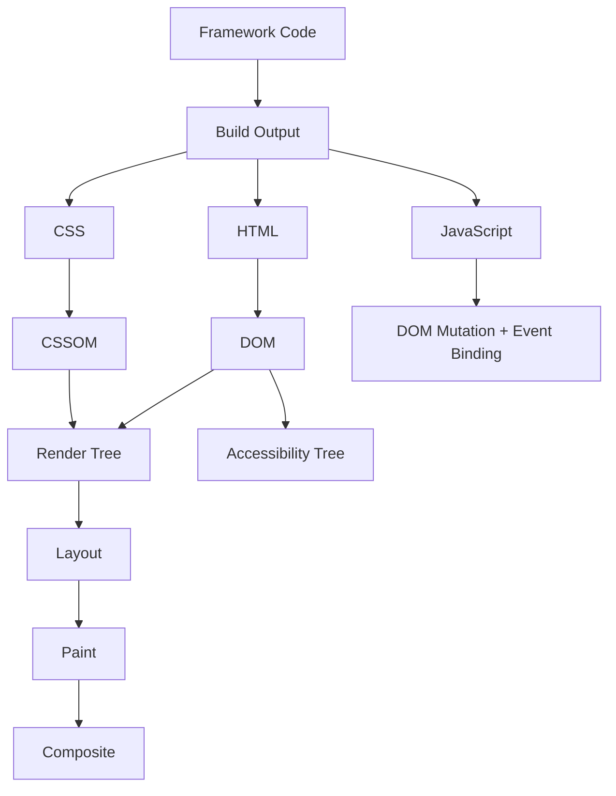
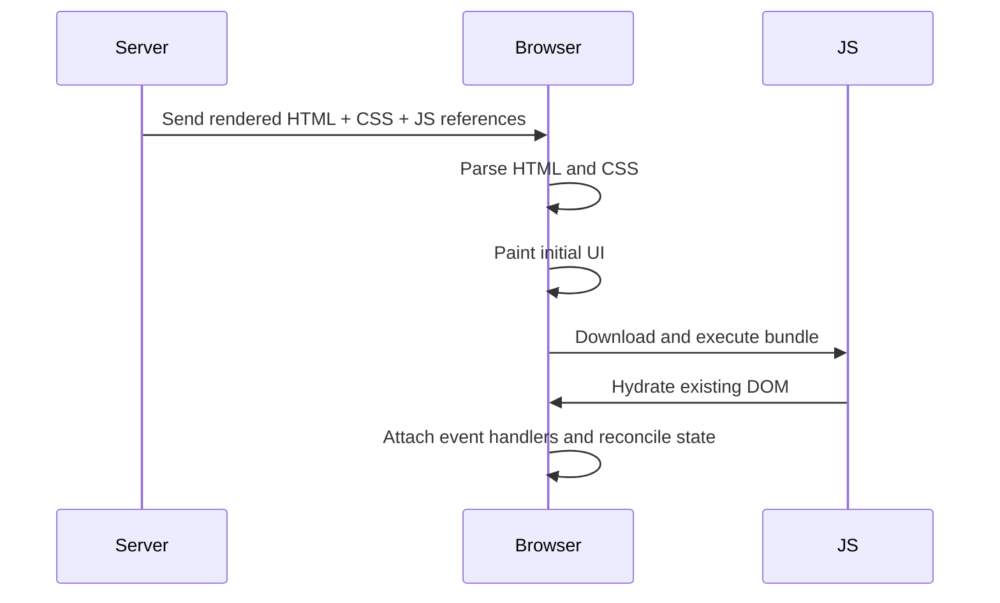
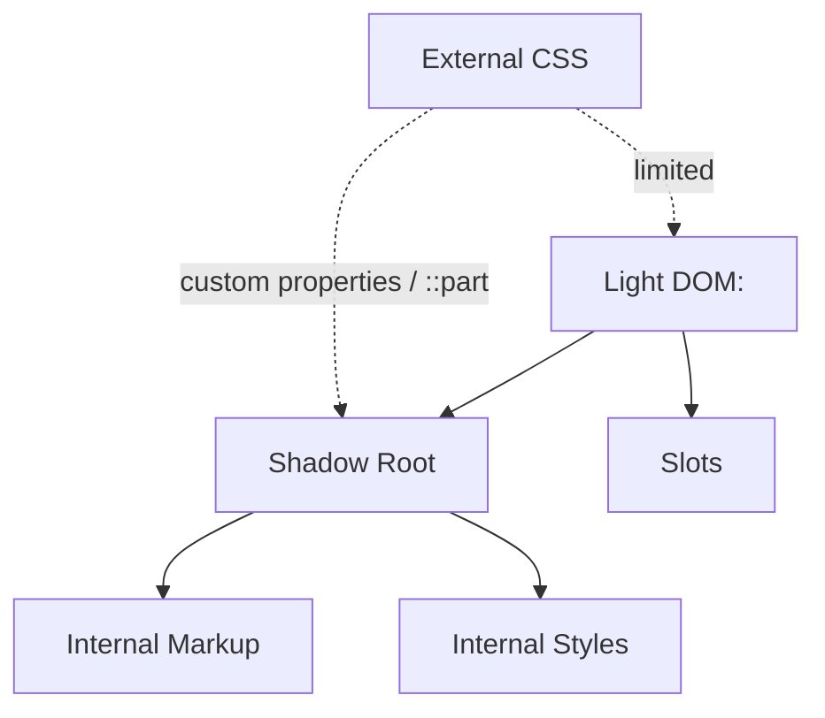
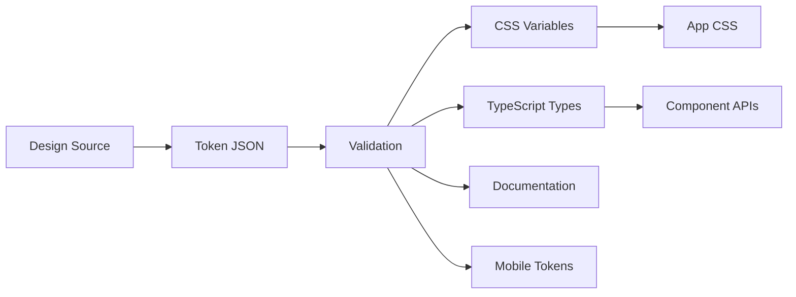
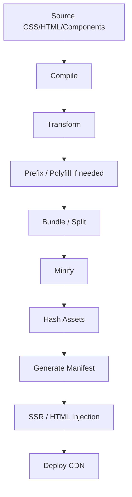
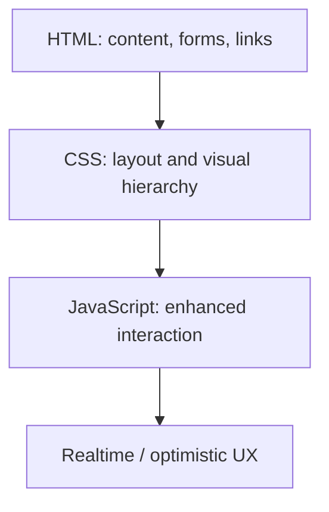

# HTML/CSS in Modern Apps: SSR, Hydration, SPAs, Web Components, Frameworks, and Build Pipelines

Modern frontend framework tidak menghapus HTML dan CSS. Framework hanya mengubah **di mana**, **kapan**, dan **bagaimana** HTML/CSS dibuat, dikirim, di-hydrate, di-scope, di-cache, dan di-debug.

Banyak engineer keliru berpikir:

> “Saya pakai React/Vue/Svelte/Angular, jadi HTML/CSS detail tidak terlalu penting.”

Itu salah. Semakin modern stack-nya, semakin penting memahami HTML/CSS sebagai **runtime contract**.

Framework dapat mengabstraksi authoring model, tetapi browser tetap menerima:

- HTML document,
- DOM tree,
- CSS rules,
- CSSOM,
- layout constraints,
- accessibility tree,
- resource graph,
- JavaScript event handlers,
- dan rendering work.

Target bagian ini: kamu mampu menempatkan HTML/CSS secara benar dalam arsitektur frontend modern, memilih strategi styling dengan sadar, dan mendeteksi failure mode yang muncul karena SSR, hydration, SPA routing, style injection, build pipeline, atau component encapsulation.

---

## 1. Mental Model: Framework Is Not the Runtime

Browser tidak menjalankan “React UI” atau “Vue UI” sebagai konsep visual. Browser menjalankan:

1. HTML yang diterima atau dibuat JavaScript.
2. CSS yang dimuat dari stylesheet, style tag, constructable stylesheet, inline style, atau framework runtime.
3. JavaScript yang membuat/mengubah DOM.
4. Layout, paint, compositing, accessibility tree, dan event dispatch.



Framework mempermudah authoring, tetapi invariant browser tetap sama:

| Area | Invariant |
|---|---|
| Semantics | Elemen HTML akhir tetap menentukan makna dokumen. |
| Accessibility | Accessibility tree berasal dari DOM, attributes, CSS visibility, ARIA, dan browser mapping. |
| Layout | Flexbox, Grid, normal flow, positioning, cascade tetap bekerja sesuai CSS. |
| Performance | CSS bisa render-blocking; JS hydration bisa mahal; image/font bisa merusak LCP/CLS. |
| Forms | Browser-native form behavior tetap punya nilai progressive enhancement. |
| Compatibility | Feature harus divalidasi terhadap browser target/Baseline, bukan asumsi framework. |

Prinsip top-level:

> Jangan tanya “framework saya membuat apa?” saja. Tanya “browser akhirnya menerima kontrak HTML/CSS seperti apa?”

---

## 2. Rendering Models in Modern Frontend

Ada beberapa model rendering yang umum. Tiap model punya konsekuensi HTML/CSS berbeda.

### 2.1 Static HTML

HTML dibuat saat build time.

Cocok untuk:

- dokumentasi,
- marketing pages,
- blog,
- sebagian dashboard read-only,
- help center,
- public knowledge base.

Kelebihan:

- first HTML cepat,
- mudah di-cache CDN,
- SEO sederhana,
- dependency runtime kecil,
- failure mode lebih sedikit.

Risiko:

- konten dinamis butuh client fetch,
- authorization/personalization terbatas,
- stale content kalau invalidation buruk.

HTML/CSS concern:

- metadata harus sudah benar di HTML awal,
- image dimensions harus tersedia untuk mencegah layout shift,
- CSS bisa diekstrak statis,
- route-level CSS splitting mudah.

---

### 2.2 Traditional Server-Side Rendering / MPA

Setiap navigasi meminta HTML baru dari server.

Cocok untuk:

- sistem enterprise internal,
- admin panel,
- form-heavy workflow,
- aplikasi regulatory/case management,
- aplikasi yang butuh progressive enhancement kuat.

Kelebihan:

- HTML awal sudah bermakna,
- browser navigation semantics natural,
- form fallback lebih mudah,
- SEO dan accessibility lebih langsung,
- interactivity bisa ditambahkan bertahap.

Risiko:

- full page reload,
- state client lebih sulit dipertahankan,
- butuh server rendering discipline.

HTML/CSS concern:

- setiap page harus punya semantic skeleton lengkap,
- CSS architecture harus lintas halaman,
- focus dan scroll behavior biasanya native,
- error page harus semantic, bukan hanya JSON.

---

### 2.3 Client-Side Rendering / SPA

Server mengirim HTML shell, lalu JavaScript membangun DOM.

```html
<div id="app"></div>
<script type="module" src="/assets/app.js"></script>
```

Cocok untuk:

- highly interactive apps,
- complex client-side state,
- offline-ish interactions,
- product dengan rich interactions.

Kelebihan:

- navigasi terasa cepat setelah bundle loaded,
- client state mudah dipertahankan,
- interactivity fleksibel,
- shared component model kuat.

Risiko:

- HTML awal miskin semantics,
- loading bergantung JS,
- SEO/preview metadata lebih kompleks,
- accessibility navigation harus direkonstruksi manual,
- initial bundle bisa berat,
- error boundary bisa menggantikan document structure dengan fallback kosong.

HTML/CSS concern:

- `<title>` dan metadata harus di-update per route,
- focus harus dipindahkan setelah route change,
- skip link dan landmarks tetap dibutuhkan,
- loading state harus semantic,
- broken JS tidak boleh membuat halaman kritis kosong bila domain butuh resilience.

---

### 2.4 SSR + Hydration

Server mengirim HTML yang sudah dirender. Browser menampilkan HTML itu, lalu JavaScript “menghidupkan” elemen dengan event handlers dan state.



Kelebihan:

- first content lebih cepat daripada CSR murni,
- HTML awal lebih semantic,
- SEO lebih baik,
- perceived performance lebih baik.

Risiko:

- hydration cost bisa besar,
- hydration mismatch,
- UI terlihat ada tetapi belum interactive,
- double work: render server + hydrate client,
- layout shift jika client output berbeda,
- style order bisa berubah saat client boot.

Hydration bukan “gratis”. Hydration adalah pekerjaan JavaScript untuk mencocokkan runtime component tree dengan DOM yang sudah ada.

---

### 2.5 Islands / Partial Hydration

Tidak semua halaman perlu di-hydrate. Model islands meng-hydrate hanya komponen interaktif tertentu.

Contoh pembagian:

| UI Area | Strategy |
|---|---|
| Header static | HTML + CSS only |
| Case summary | server-rendered HTML |
| Filter widget | hydrated island |
| Chart interactive | lazy hydrated island |
| Audit trail | static/list server-rendered |
| Modal action form | hydrate on interaction |

Kelebihan:

- JS awal lebih kecil,
- HTML tetap semantic,
- interactivity dikirim hanya saat perlu,
- cocok untuk documentation, dashboards, case pages.

Risiko:

- state sharing antar island lebih kompleks,
- event coordination perlu desain,
- hydration boundary harus jelas,
- CSS scoping/order tetap perlu dikendalikan.

Prinsip:

> Jadikan static HTML sebagai default. Tambahkan JavaScript hanya pada boundary yang benar-benar butuh interactivity.

---

### 2.6 Streaming and Progressive Rendering

Server dapat mengirim HTML bertahap. Bagian awal page muncul lebih cepat, bagian lambat menyusul.

HTML/CSS implications:

- layout skeleton harus menjaga ruang agar tidak CLS,
- heading/landmark order harus tetap masuk akal,
- loading placeholders harus accessible,
- CSS untuk above-the-fold harus tersedia lebih awal,
- komponen yang datang belakangan tidak boleh merusak focus.

Anti-pattern:

```html
<main>
  <div class="spinner"></div>
</main>
```

Lebih baik:

```html
<main aria-busy="true">
  <h1>Case Detail</h1>
  <section aria-label="Case summary">
    <p>Loading case summary...</p>
  </section>
</main>
```

---

## 3. The HTML Contract Across Rendering Models

Apa pun framework-nya, HTML akhir harus memenuhi beberapa contract.

### 3.1 Document Contract

Setiap route/page harus punya:

- satu tujuan dokumen yang jelas,
- `<title>` relevan,
- heading utama,
- landmark structure,
- language direction yang benar,
- metadata yang sesuai konteks,
- error/loading/empty state yang semantic.

Contoh route case detail:

```html
<title>Case C-2026-00014 — Enforcement Portal</title>

<header class="app-header">...</header>
<nav aria-label="Primary">...</nav>

<main id="main-content">
  <nav aria-label="Breadcrumb">...</nav>
  <h1>Case C-2026-00014</h1>
  <p>Status: Under Review</p>

  <section aria-labelledby="summary-title">
    <h2 id="summary-title">Summary</h2>
    ...
  </section>
</main>
```

Jika framework menghasilkan `<div>` nested tanpa heading dan landmark, masalahnya bukan “style”; masalahnya adalah document contract rusak.

---

### 3.2 Component Contract

Komponen modern harus menghasilkan HTML yang benar, bukan hanya prop API yang nyaman.

Contoh button component yang buruk:

```jsx
function Button({ children, onClick }) {
  return <div className="button" onClick={onClick}>{children}</div>;
}
```

Masalah:

- tidak keyboard-clickable secara native,
- tidak punya button role native,
- tidak punya disabled behavior,
- tidak ikut form behavior,
- harus meniru banyak semantics manual.

Lebih baik:

```jsx
function Button({ children, type = 'button', ...props }) {
  return <button type={type} {...props}>{children}</button>;
}
```

Invariant:

> Component API boleh abstrak. HTML output tidak boleh kehilangan native semantics.

---

### 3.3 Form Contract

Di aplikasi modern, form sering diubah menjadi controlled component yang sepenuhnya ditangani JavaScript. Itu boleh, tetapi jangan menghapus native form contract tanpa alasan.

Native form memberi:

- label association,
- autocomplete,
- keyboard submit,
- constraint validation,
- form data serialization,
- browser password manager integration,
- mobile input optimization,
- accessible error association.

Bentuk dasar yang kuat:

```html
<form method="post" action="/cases/C-2026-00014/actions/escalate">
  <fieldset>
    <legend>Escalation details</legend>

    <label for="reason">Reason</label>
    <textarea id="reason" name="reason" required></textarea>

    <button type="submit">Escalate case</button>
  </fieldset>
</form>
```

Framework boleh meningkatkan UX, tetapi fallback semantics sebaiknya tetap terlihat.

---

## 4. Hydration: Failure Modes and Engineering Rules

Hydration adalah salah satu area paling sering menghasilkan bug halus.

### 4.1 Hydration Mismatch

Hydration mismatch terjadi ketika HTML dari server tidak cocok dengan output client render pertama.

Penyebab umum:

| Cause | Example |
|---|---|
| Non-deterministic value | `Date.now()`, `Math.random()` saat render |
| Locale difference | server `en-US`, client `id-ID` |
| Timezone difference | server UTC, client Asia/Jakarta |
| Auth state difference | server guest, client logged-in |
| Feature detection during render | client-only branch mengubah DOM |
| Data race | cache server dan client berbeda |
| Invalid HTML nesting | browser memperbaiki DOM sebelum hydration |

Contoh buruk:

```jsx
function RenderedAt() {
  return <p>Rendered at {new Date().toLocaleString()}</p>;
}
```

Server dan client bisa menghasilkan string berbeda.

Lebih stabil:

```jsx
function RenderedAt({ renderedAtISO }) {
  return <time dateTime={renderedAtISO}>{renderedAtISO}</time>;
}
```

Atau render dynamic value setelah hydration dalam client effect, dengan placeholder yang tidak merusak layout.

---

### 4.2 Interactive Before Hydrated

SSR membuat UI terlihat siap, tetapi event handler belum tentu aktif.

Pertanyaan desain:

- Apakah tombol aman diklik sebelum hydration?
- Apakah form bisa submit native?
- Apakah link tetap bekerja tanpa JS?
- Apakah destructive action harus disabled sampai hydrated?

Untuk action kritis, gunakan progressive enhancement:

```html
<form method="post" action="/cases/C-2026-00014/assign">
  <input type="hidden" name="assigneeId" value="U-901" />
  <button type="submit">Assign to me</button>
</form>
```

Client JS bisa intercept submit untuk optimistic UI, tetapi form tetap punya server path.

---

### 4.3 Layout Shift During Hydration

Penyebab umum:

- server tidak tahu ukuran image,
- font berubah setelah hydration,
- client-only component muncul tanpa reserved space,
- conditional content berbeda antara server dan client,
- CSS loaded setelah JS membuat class.

Mitigasi:

- gunakan `width`/`height` atau `aspect-ratio`,
- reserve space untuk widget async,
- hindari render branch yang berbeda,
- kirim CSS kritis sebelum HTML bergantung padanya,
- gunakan stable skeleton.

```css
.chart-shell {
  min-block-size: 20rem;
}
```

```html
<section class="chart-shell" aria-busy="true">
  <h2>Case volume</h2>
  <p>Loading chart...</p>
</section>
```

---

## 5. SPA Routing: Rebuilding Browser Semantics Manually

SPA mengganti page tanpa full navigation. Karena itu, beberapa behavior native browser harus dipulihkan.

### 5.1 Title and Metadata

Setiap route harus update:

- document title,
- canonical metadata jika relevan,
- social metadata untuk SSR/pre-render route,
- `aria-current` pada navigation,
- breadcrumb.

Anti-pattern:

```html
<title>App</title>
```

Untuk semua route.

Lebih baik:

```text
Queue — Enforcement Portal
Case C-2026-00014 — Enforcement Portal
Create Notice — Enforcement Portal
```

---

### 5.2 Focus After Navigation

Native page navigation memindahkan konteks pembaca. SPA route change sering tidak.

Setelah route change, strategi umum:

1. update title,
2. scroll ke posisi yang benar,
3. pindahkan focus ke landmark atau heading utama,
4. umumkan perubahan jika diperlukan.

Contoh target:

```html
<main id="main-content" tabindex="-1">
  <h1>Case C-2026-00014</h1>
</main>
```

`tabindex="-1"` memungkinkan programmatic focus tanpa memasukkan elemen ke tab order normal.

---

### 5.3 Links Must Remain Links

SPA router sering membungkus navigation dalam component. Output akhirnya tetap sebaiknya `<a href="...">`, bukan `<button>` atau `<div>`.

Benar:

```html
<a href="/cases/C-2026-00014">Open case</a>
```

Buruk:

```html
<div onclick="router.push('/cases/C-2026-00014')">Open case</div>
```

Link native memberi:

- open in new tab,
- copy link,
- browser history,
- status bar URL preview,
- keyboard navigation,
- assistive semantics.

---

## 6. CSS Delivery Models

CSS modern bisa dikirim dengan banyak cara. Tidak ada satu strategi yang selalu terbaik.

### 6.1 Global CSS

Contoh:

```html
<link rel="stylesheet" href="/assets/app.css" />
```

Kelebihan:

- sederhana,
- cache-friendly,
- mudah dianalisis DevTools,
- cocok untuk design system dan base layer.

Risiko:

- global namespace collision,
- specificity creep,
- dead CSS,
- urutan import rawan.

Cocok untuk:

- reset/base styles,
- typography,
- tokens,
- utilities,
- app shell,
- enterprise app dengan design system stabil.

---

### 6.2 Component CSS

CSS ditulis dekat komponen.

```text
Button.tsx
Button.css
```

Kelebihan:

- ownership jelas,
- mudah refactor,
- component boundary kuat,
- states/variants dekat dengan markup.

Risiko:

- style order sulit jika banyak lazy chunk,
- shared token harus disiplin,
- duplication bila primitive tidak jelas.

Prinsip:

> Colocation baik untuk ownership, tetapi bukan pengganti architecture.

---

### 6.3 CSS Modules

Class name di-scope oleh build tool.

```css
.button {
  border-radius: var(--radius-sm);
}
```

Output bisa menjadi:

```html
<button class="Button_button__a1b2c">Save</button>
```

Kelebihan:

- mengurangi collision,
- class local by default,
- masih CSS asli,
- DevTools relatif jelas.

Risiko:

- global cascade tetap ada untuk reset/tokens,
- composition antar module perlu pattern,
- class generated bisa mengganggu debugging jika sourcemap buruk.

---

### 6.4 CSS-in-JS

Style dibuat melalui JavaScript.

Kelebihan:

- dynamic styling dekat state,
- theming bisa tightly integrated,
- unused style bisa terkait component lifecycle,
- variant API kuat.

Risiko:

- runtime injection cost,
- style order complexity,
- SSR extraction complexity,
- hydration mismatch style,
- CSP nonce issue,
- debugging bisa lebih sulit,
- bundle JS bertambah.

CSS-in-JS bukan buruk. Tetapi untuk HTML/CSS production, tanyakan:

| Question | Why it matters |
|---|---|
| Apakah CSS diekstrak saat build/SSR? | Mengurangi runtime injection. |
| Bagaimana order style dijamin? | Menghindari cascade bug. |
| Bagaimana SSR style dikirim? | Menghindari FOUC. |
| Bagaimana CSP nonce ditangani? | Security compliance. |
| Bagaimana theming bekerja tanpa re-render besar? | Runtime performance. |

---

### 6.5 Utility-First CSS

Utility-first memakai class kecil yang merepresentasikan deklarasi CSS.

Contoh:

```html
<button class="inline-flex items-center gap-2 rounded-md px-3 py-2 text-sm font-medium">
  Save
</button>
```

Kelebihan:

- cepat membuat UI,
- specificity rendah,
- dead CSS bisa kecil jika build purge benar,
- mudah menjaga token spacing/color jika konfigurasi disiplin.

Risiko:

- markup bisa padat,
- component invariant tersebar di class list,
- review semantic/visual intent lebih sulit,
- variant kompleks bisa menghasilkan string logic rumit,
- dependency pada framework CSS tertentu.

Rule praktis:

- utility bagus untuk layout primitives dan prototyping,
- komponen reusable tetap butuh contract,
- token harus semantic, bukan hanya numeric,
- jangan encode business state dengan class list acak.

---

### 6.6 Atomic CSS Runtime

Atomic CSS menghasilkan rule kecil seperti satu deklarasi per class.

Kelebihan:

- deduplication tinggi,
- CSS output stabil,
- predictable specificity,
- style reuse besar.

Risiko:

- class name opaque,
- debugging bergantung tooling,
- dynamic generation harus SSR-compatible,
- CSP/build complexity.

Cocok jika tim punya tooling kuat dan discipline design tokens matang.

---

## 7. Style Ordering and Cascade Control

Style bug di aplikasi modern sering bukan karena property salah, tetapi karena order tidak deterministic.

### 7.1 Ordering Problem

Contoh:

```css
.card { padding: 1rem; }
.card.compact { padding: .5rem; }
```

Jika chunk CSS lazy loaded mengubah order, hasil bisa berubah.

Masalah makin besar saat:

- component CSS di-code-split,
- CSS-in-JS inject style saat component mount,
- microfrontend punya stylesheet sendiri,
- vendor styles masuk setelah app styles,
- utility class dan component class dicampur tanpa layer.

---

### 7.2 Use Cascade Layers as Architecture

```css
@layer reset, base, tokens, vendor, components, utilities, overrides;

@layer reset {
  *, *::before, *::after { box-sizing: border-box; }
}

@layer tokens {
  :root {
    --color-accent: #2251ff;
    --space-3: .75rem;
  }
}

@layer components {
  .button {
    padding: var(--space-2) var(--space-3);
  }
}

@layer utilities {
  .hidden { display: none !important; }
}
```

Layer memberi order eksplisit lintas file.

Prinsip:

- layer order didefinisikan satu kali,
- vendor CSS masuk layer vendor,
- utilities boleh menang atas components jika memang policy,
- overrides harus kecil dan diaudit.

---

## 8. Web Components and Shadow DOM

Web Components adalah suite teknologi untuk membuat custom elements yang reusable dan encapsulated.

Komponen utama:

| Technology | Role |
|---|---|
| Custom Elements | Mendefinisikan elemen HTML baru. |
| Shadow DOM | Encapsulation DOM/CSS internal. |
| HTML templates | Template inert yang bisa di-clone. |
| Slots | Composition boundary untuk light DOM children. |
| CSS custom properties | Theme hook lintas boundary. |
| `::part` | Expose bagian internal untuk styling eksternal. |

### 8.1 Custom Element Example

```html
<case-status status="under-review"></case-status>
```

Custom element bisa bagus untuk design system lintas framework, tetapi jangan lupa:

- accessibility tetap harus benar,
- keyboard behavior tetap harus benar,
- form integration perlu desain,
- SSR support tidak otomatis,
- style encapsulation bukan berarti style architecture selesai.

---

### 8.2 Shadow DOM Encapsulation

Shadow DOM menyembunyikan internal DOM/CSS dari page luar.



Kelebihan:

- style leakage berkurang,
- internal markup terlindungi,
- reusable component lebih aman di host berbeda,
- cocok untuk design system lintas stack.

Risiko:

- global CSS reset tidak masuk shadow root,
- typography/theme harus diteruskan lewat custom properties,
- accessibility debugging bisa lebih kompleks,
- SSR/declarative shadow DOM support harus dicek,
- styling slot content punya aturan khusus,
- E2E selector bisa rapuh jika menembus shadow boundary.

---

### 8.3 Styling API for Shadow Components

Gunakan custom properties sebagai token hooks:

```css
:host {
  --case-status-bg: var(--color-status-review-bg, #fff7d6);
  --case-status-fg: var(--color-status-review-fg, #5c4300);
}

.badge {
  background: var(--case-status-bg);
  color: var(--case-status-fg);
}
```

Expose part jika host perlu styling area tertentu:

```html
<case-card>
  #shadow-root
    <article part="container">
      <h2 part="title">...</h2>
    </article>
</case-card>
```

```css
case-card::part(title) {
  font-weight: 700;
}
```

Jangan expose semua internal. Expose hanya styling surface yang stabil.

---

### 8.4 Web Components Accessibility Rules

Custom element tidak otomatis accessible.

Buruk:

```html
<x-button>Save</x-button>
```

Tanpa role, keyboard behavior, form behavior, dan focus handling, ini bukan button native.

Lebih aman:

- gunakan native element di dalam shadow root,
- expose accessible name,
- delegasikan focus dengan hati-hati,
- ikuti APG untuk widget kompleks,
- test keyboard dan screen reader.

```html
<x-button>
  #shadow-root
    <button part="button"><slot></slot></button>
</x-button>
```

Tetapi wrapper tetap perlu memastikan host behavior, disabled state, dan focus ring tidak membingungkan.

---

## 9. Design Tokens in Build Pipelines

Design tokens adalah nilai desain yang diberi nama dan dipakai lintas platform.

Token bukan hanya warna atau spacing. Token adalah contract antara design, frontend, mobile, documentation, dan QA.

### 9.1 Token Layers

| Layer | Example | Meaning |
|---|---|---|
| Primitive | `blue-600`, `space-4` | Nilai mentah. |
| Semantic | `color-action-primary-bg` | Makna UI. |
| Component | `button-primary-bg` | Contract komponen. |
| State | `button-primary-bg-hover` | State-specific value. |
| Mode | dark/high-contrast | Context override. |

Contoh CSS output:

```css
:root {
  --color-blue-600: #2251ff;
  --color-action-primary-bg: var(--color-blue-600);
  --button-primary-bg: var(--color-action-primary-bg);
}

[data-theme="dark"] {
  --color-action-primary-bg: #8ea2ff;
}
```

Komponen memakai semantic/component token, bukan primitive langsung:

```css
.button--primary {
  background: var(--button-primary-bg);
  color: var(--button-primary-fg);
}
```

---

### 9.2 Token Build Pipeline



Validation penting:

- token name konsisten,
- contrast minimum terpenuhi,
- duplicate semantic intent terdeteksi,
- deprecated token diberi migration path,
- mode override lengkap,
- generated docs sinkron.

---

## 10. Framework Styling Trade-Off Matrix

| Strategy | Best For | Main Risk | Governance Need |
|---|---|---|---|
| Global CSS | app-wide base, tokens, simple apps | collision, dead CSS | layers, naming, lint |
| BEM | long-lived CSS without build dependency | verbosity | naming convention |
| CSS Modules | component-scoped CSS | composition complexity | shared token policy |
| Scoped SFC CSS | Vue/Svelte component styles | deep selectors, leakage assumptions | component boundary rules |
| CSS-in-JS | dynamic variants, design systems | runtime/SSR/style order | extraction, nonce, perf budget |
| Utility-first | speed, low specificity | dense markup, intent diffusion | token config, component wrappers |
| Shadow DOM | cross-framework components | integration/a11y complexity | public styling API |
| Inline style | dynamic one-off values | no pseudo-class/media queries | strict limitation |

Tidak ada strategi absolut. Pilihan terbaik tergantung:

- ukuran tim,
- lifecycle produk,
- performance target,
- SSR requirement,
- design system maturity,
- regulatory/audit needs,
- browser support policy,
- migration cost.

---

## 11. Microfrontends and CSS Isolation

Microfrontend memperbesar risiko CSS karena beberapa aplikasi hidup di page yang sama.

Failure mode umum:

- reset CSS dari satu microfrontend merusak lainnya,
- duplicate token name berbeda nilai,
- z-index scale konflik,
- font loading duplikat,
- modal overlay saling menutup,
- CSS-in-JS injection order tidak deterministic,
- global class `.button` collision,
- different framework hydration boundaries.

Strategi mitigasi:

1. Shared design tokens.
2. Shared base CSS contract.
3. Cascade layers untuk vendor/app/microfrontend.
4. Namespace untuk app-specific class.
5. Overlay manager bersama.
6. Z-index scale bersama.
7. Font loading dikonsolidasikan.
8. Shadow DOM untuk widget yang benar-benar butuh isolation.
9. Contract testing lintas microfrontend.

Contoh layer microfrontend:

```css
@layer reset, tokens, shell, mf-case, mf-billing, mf-reports, utilities, overrides;
```

---

## 12. Build Pipeline Concerns

Build pipeline CSS/HTML modern bukan hanya minify.

### 12.1 Common Pipeline Steps



Area yang harus jelas:

| Area | Questions |
|---|---|
| Browser target | Browser apa yang didukung? Bagaimana policy berubah? |
| Baseline | Apakah fitur sudah Baseline atau butuh fallback? |
| Prefixing | Apakah transform sesuai target browser? |
| Minification | Apakah aman untuk custom properties/layers? |
| CSS splitting | Apakah critical route styles tersedia tepat waktu? |
| Asset hashing | Apakah cache invalidation benar? |
| Source maps | Apakah debugging production/staging realistis? |
| CSP | Apakah inline styles/scripts punya nonce/hash? |
| SSR manifest | Apakah server tahu CSS chunk untuk route/component? |

---

### 12.2 CSS Code Splitting

CSS splitting mengurangi initial CSS tetapi bisa menciptakan flash atau style delay.

Risiko:

- route transition tanpa CSS,
- component muncul sebelum CSS chunk,
- CSS chunk loaded setelah render,
- layer order berubah,
- visual regression hanya terjadi pada cold cache.

Mitigasi:

- preload CSS route yang akan dipakai,
- ensure CSS chunk order deterministic,
- extract critical shell CSS,
- test cold cache route navigation,
- avoid component style dependency yang terlalu tersembunyi.

---

### 12.3 Purging / Tree-Shaking CSS

Unused CSS removal bisa berbahaya jika class name dinamis.

Buruk:

```js
const className = `status-${status}`;
```

Build tool mungkin tidak melihat `status-approved`, `status-rejected`, dll.

Lebih aman:

```js
const statusClass = {
  approved: 'status-approved',
  rejected: 'status-rejected',
  pending: 'status-pending',
}[status];
```

Atau safelist secara eksplisit.

---

## 13. CSP and Inline Styles

Aplikasi enterprise sering memakai Content Security Policy ketat.

Implication untuk CSS:

- inline `<style>` mungkin butuh nonce,
- CSS-in-JS runtime injection harus mendukung nonce,
- inline `style` attribute bisa dibatasi,
- third-party style injection perlu diaudit,
- SSR style extraction harus kompatibel dengan CSP.

Pertanyaan review:

- Apakah styling strategy akan lolos CSP production?
- Apakah nonce disalurkan dari server ke runtime?
- Apakah ada fallback jika style injection gagal?
- Apakah third-party widget menyisipkan style tanpa kontrol?

---

## 14. Progressive Enhancement in Modern Apps

Progressive enhancement bukan nostalgia. Untuk workflow penting, ini adalah resilience strategy.

Layering:



Contoh case action:

1. HTML form bisa submit ke server.
2. CSS membuat form usable dan responsive.
3. JS menambahkan confirmation dialog.
4. JS menambahkan optimistic update.
5. Jika JS gagal, action masih mungkin dilakukan.

Untuk domain kritis, pertanyaan utamanya:

> Apakah kegagalan JavaScript boleh memblokir user menyelesaikan tugas utama?

Jawabannya tergantung produk. Tetapi keputusan ini harus sadar, bukan akibat framework default.

---

## 15. Modern Feature Adoption Strategy

Fitur CSS/HTML modern berkembang cepat. Jangan asal memakai semua fitur terbaru, tetapi jangan juga terjebak polyfill lama.

Adoption framework:

1. Identifikasi target browser dan user base.
2. Cek Baseline/browser support.
3. Tentukan apakah fitur critical atau enhancement.
4. Pakai `@supports` untuk progressive enhancement.
5. Sediakan fallback jika fitur memengaruhi task utama.
6. Dokumentasikan keputusan.

Contoh:

```css
.card-grid {
  display: grid;
  grid-template-columns: repeat(auto-fit, minmax(16rem, 1fr));
}

@supports (container-type: inline-size) {
  .card-list {
    container-type: inline-size;
  }

  @container (min-width: 40rem) {
    .case-card {
      grid-template-columns: 1fr auto;
    }
  }
}
```

Fallback bukan berarti tampilan identik. Fallback berarti tugas user tetap bisa dilakukan.

---

## 16. Architecture Decision Records for Styling

Untuk tim besar, styling strategy perlu dicatat sebagai ADR.

Template singkat:

```md
# ADR: Styling Strategy for Enforcement Portal

## Status
Accepted

## Context
We need scalable styling across SSR pages, SPA islands, and shared design system components.

## Decision
Use global token/base CSS, cascade layers, CSS Modules for product components, and limited utility classes for layout primitives.

## Consequences
- Global styles limited to reset/base/tokens/utilities.
- Component classes are local by default.
- Cascade layers define cross-file order.
- Dynamic theme values use CSS custom properties.
- CSS-in-JS is not used for core UI because of CSP and SSR extraction complexity.

## Alternatives Considered
- Utility-first only
- Runtime CSS-in-JS
- Shadow DOM for all components
```

ADR menghindari diskusi berulang dan membuat trade-off terlihat.

---

## 17. Failure Taxonomy

| Symptom | Likely Cause | Investigation |
|---|---|---|
| Page flashes unstyled | CSS chunk late, SSR extraction missing | Network + coverage + SSR manifest |
| Hydration warning | server/client DOM mismatch | compare server HTML and client render |
| Button visible but dead | not hydrated, JS error, wrong element | console + event listeners + progressive fallback |
| Style works locally only | order/chunk/cache issue | inspect loaded CSS order |
| Dark mode partial | token override incomplete | inspect custom property chain |
| Modal under header | stacking context/top layer issue | inspect stacking contexts |
| SPA route screen reader confusing | no focus/title update | test keyboard/screen reader |
| Microfrontend style leak | global reset/class collision | isolate layers/namespaces |
| Production CSP breaks styles | runtime style injection lacks nonce | inspect CSP reports |
| Visual regression after unused CSS purge | dynamic class removed | inspect build output/safelist |

---

## 18. Production Review Checklist

### Rendering

- [ ] Apakah route critical punya meaningful HTML awal?
- [ ] Apakah CSR-only route memang diterima secara product/performance?
- [ ] Apakah SSR hydration deterministic?
- [ ] Apakah loading/error/empty states semantic?
- [ ] Apakah streaming/lazy content menjaga layout stability?

### Semantics and Accessibility

- [ ] Apakah component output memakai native element bila tersedia?
- [ ] Apakah SPA route update title dan focus?
- [ ] Apakah forms tetap punya label/name/error association?
- [ ] Apakah custom widgets mengikuti APG atau native alternative?
- [ ] Apakah Shadow DOM components diuji keyboard/screen reader?

### CSS Architecture

- [ ] Apakah style order deterministic?
- [ ] Apakah cascade layers dipakai atau ada policy setara?
- [ ] Apakah global CSS surface terbatas?
- [ ] Apakah tokens semantic dan mode-aware?
- [ ] Apakah CSS splitting tidak menyebabkan FOUC?

### Build and Runtime

- [ ] Apakah browser target terdokumentasi?
- [ ] Apakah fitur modern dicek terhadap Baseline/support?
- [ ] Apakah CSP kompatibel dengan styling strategy?
- [ ] Apakah source maps tersedia untuk debugging?
- [ ] Apakah CSS purge aman terhadap dynamic class?

### Performance

- [ ] Apakah CSS critical dikirim tepat waktu?
- [ ] Apakah hydration cost terukur?
- [ ] Apakah image/font strategy tidak merusak LCP/CLS?
- [ ] Apakah runtime style injection tidak besar?
- [ ] Apakah route cold cache diuji?

---

## 19. Practice: Modern App Architecture Review

Ambil satu aplikasi frontend yang pernah kamu buat. Review dengan pertanyaan ini:

1. Rendering model apa yang dipakai per route?
2. Route mana yang harus punya HTML awal bermakna?
3. Apakah SPA navigation mengelola title, focus, dan scroll?
4. Styling strategy apa yang dipakai?
5. Apa risiko style ordering?
6. Apakah ada hydration mismatch risk?
7. Bagaimana token/theme dikirim ke CSS?
8. Apa yang terjadi jika JS gagal load?
9. Apa yang terjadi jika CSS chunk lambat?
10. Apa feature modern yang perlu fallback?

Deliverable:

```md
# Frontend HTML/CSS Architecture Review

## Rendering Model
...

## HTML Contract
...

## CSS Delivery
...

## Hydration Risk
...

## Accessibility Risk
...

## Performance Risk
...

## Recommended Changes
...
```

---

## 20. What Top 1% Engineers Do Differently

Engineer biasa bertanya:

> “Framework styling apa yang paling populer?”

Engineer kuat bertanya:

> “Kontrak HTML/CSS apa yang harus stabil di production, dan strategi mana yang paling mengurangi failure mode untuk konteks ini?”

Perbedaannya:

| Average | Strong |
|---|---|
| Memilih berdasarkan trend | Memilih berdasarkan constraints |
| Fokus component API | Fokus browser output contract |
| Menganggap hydration implementation detail | Mengukur hydration risk |
| Mengandalkan CSS scoping tool | Mendesain cascade boundaries |
| Menerima SPA default | Memulihkan semantics navigation |
| Menganggap design tokens sebagai warna | Mengelola token sebagai governance system |
| Debug dari framework | Debug dari DOM/CSSOM/accessibility tree |

---

## 21. References

- MDN Web Performance: https://developer.mozilla.org/en-US/docs/Web/Performance
- MDN JavaScript Performance and Hydration: https://developer.mozilla.org/en-US/blog/fix-javascript-performance/
- MDN Web Components: https://developer.mozilla.org/en-US/docs/Web/API/Web_components
- MDN Using Shadow DOM: https://developer.mozilla.org/en-US/docs/Web/API/Web_components/Using_shadow_DOM
- web.dev Baseline: https://web.dev/baseline
- WAI-ARIA Authoring Practices Guide: https://www.w3.org/WAI/ARIA/apg/
- WAI Dialog Modal Pattern: https://www.w3.org/WAI/ARIA/apg/patterns/dialog-modal/

---

## 22. Summary

HTML/CSS di aplikasi modern bukan layer sederhana. Ia adalah kontrak antara rendering model, accessibility, build pipeline, performance, design system, dan runtime framework.

Hal paling penting dari bagian ini:

1. Framework bukan runtime akhir; browser tetap menerima HTML/CSS/JS.
2. SSR dan hydration punya failure mode sendiri: mismatch, dead UI, CLS, style order.
3. SPA harus memulihkan semantics browser: title, focus, links, scroll, landmarks.
4. CSS delivery strategy harus dipilih berdasarkan constraints, bukan trend.
5. Cascade layers, tokens, dan component contracts membuat CSS scalable.
6. Web Components memberi encapsulation, tetapi tidak otomatis menyelesaikan accessibility.
7. Build pipeline harus memvalidasi support, CSP, CSS splitting, source maps, dan purge safety.

Setelah ini, kita tutup seri dengan capstone production-grade: membangun mini UI system dan halaman aplikasi internal yang responsive, accessible, maintainable, dan siap direview seperti engineering artifact nyata.
