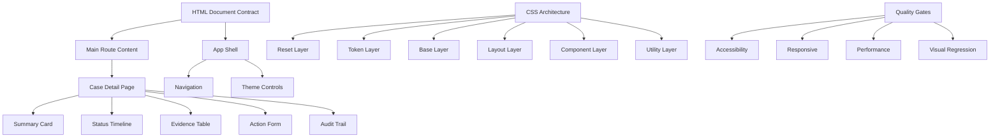
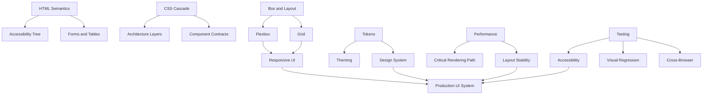

# Capstone: Build a Production-Grade Responsive, Accessible, Maintainable UI System

Ini adalah bagian terakhir dari seri utama.

Target capstone: membangun mini UI system dan halaman aplikasi internal yang cukup realistis untuk menguji semua skill HTML/CSS yang sudah dipelajari:

- semantic HTML,
- accessibility,
- forms,
- tables,
- media/assets,
- metadata,
- cascade,
- layout,
- responsive design,
- design tokens,
- component contracts,
- enterprise UI patterns,
- performance,
- debugging,
- testing,
- dan integration dengan frontend architecture modern.

Kita akan membangun blueprint untuk aplikasi fiktif:

> **Enforcement Case Management Portal**

Ini sengaja dipilih karena UI case management memaksa banyak masalah nyata muncul: status lifecycle, action forms, evidence, audit trail, dense data, role-based actions, responsive layout, accessibility, printability, dan production review.

---

## 1. Capstone Goal

Bukan membuat UI yang “cantik” saja.

Goal capstone:

> Mampu membuktikan bahwa kamu bisa merancang, mengimplementasikan, mengevaluasi, dan mereview HTML/CSS sebagai engineering artifact production-grade.

Output minimal:

1. App shell.
2. Primary navigation.
3. Case detail page.
4. Status timeline.
5. Evidence table.
6. Action form.
7. Responsive dashboard summary.
8. Accessible dialog/popup pattern.
9. Dark mode/theme tokens.
10. Print-friendly view.
11. Accessibility checklist.
12. Performance budget.
13. Code review rubric.
14. Failure-mode analysis.

---

## 2. Product Context

Aplikasi digunakan oleh officer untuk mengelola enforcement case.

User goals:

- melihat queue case,
- membuka detail case,
- memahami status dan timeline,
- melihat parties/evidence/actions,
- menambahkan note,
- melakukan escalation,
- assign/reassign case,
- review decision history,
- mencetak summary untuk audit/review.

Constraints:

| Constraint | Impact |
|---|---|
| Data sensitif | UI harus jelas, tidak ambigu, dan tidak misleading. |
| Long-running workflow | Status/timeline harus mudah dipahami. |
| Dense enterprise data | Table dan layout harus resilient. |
| Accessibility requirement | Keyboard, focus, labels, contrast wajib benar. |
| Multiple screen sizes | Desktop, laptop kecil, tablet, mobile review mode. |
| Auditability | Print view dan semantic structure penting. |
| Performance | Page detail tidak boleh berat karena data bisa banyak. |
| Maintainability | Komponen harus punya contract, bukan CSS acak. |

---

## 3. System Architecture Overview



Capstone harus menunjukkan bahwa UI bukan kumpulan screen. UI adalah sistem kontrak.

---

## 4. Folder Structure

Struktur minimal framework-agnostic:

```text
capstone/
  index.html
  case-detail.html
  dashboard.html
  print-case.html
  css/
    app.css
    layers.css
    reset.css
    tokens.css
    base.css
    layout.css
    components.css
    utilities.css
    print.css
  assets/
    logo.svg
    evidence-placeholder.svg
  docs/
    accessibility-checklist.md
    performance-budget.md
    code-review-rubric.md
    failure-model.md
```

Jika memakai framework:

```text
src/
  app/
  components/
  styles/
    reset.css
    tokens.css
    base.css
    layout.css
    components.css
    utilities.css
  routes/
  docs/
```

Prinsipnya sama: layer dan contract harus jelas.

---

## 5. CSS Layer Architecture

File `app.css`:

```css
@layer reset, tokens, base, layout, components, utilities, overrides;

@import url('./reset.css') layer(reset);
@import url('./tokens.css') layer(tokens);
@import url('./base.css') layer(base);
@import url('./layout.css') layer(layout);
@import url('./components.css') layer(components);
@import url('./utilities.css') layer(utilities);
@import url('./print.css') layer(overrides);
```

Kenapa layer eksplisit?

- mencegah order acak,
- memisahkan responsibility,
- mengurangi specificity war,
- membantu review,
- membuat override lebih terkontrol.

Policy:

| Layer | Allowed |
|---|---|
| reset | normalization dan box sizing. |
| tokens | custom properties global dan theme overrides. |
| base | element defaults: body, headings, links, forms. |
| layout | app shell, grid, page regions. |
| components | reusable component classes. |
| utilities | small single-purpose helpers. |
| overrides | print, emergency, migration-only. |

---

## 6. Token System

File `tokens.css`:

```css
:root {
  color-scheme: light;

  --font-sans: system-ui, -apple-system, BlinkMacSystemFont, "Segoe UI", sans-serif;
  --font-mono: ui-monospace, SFMono-Regular, Menlo, Consolas, monospace;

  --text-xs: 0.75rem;
  --text-sm: 0.875rem;
  --text-md: 1rem;
  --text-lg: 1.125rem;
  --text-xl: 1.375rem;
  --text-2xl: clamp(1.5rem, 1.2rem + 1vw, 2rem);

  --line-tight: 1.2;
  --line-normal: 1.5;
  --line-relaxed: 1.7;

  --space-0: 0;
  --space-1: 0.25rem;
  --space-2: 0.5rem;
  --space-3: 0.75rem;
  --space-4: 1rem;
  --space-5: 1.5rem;
  --space-6: 2rem;
  --space-7: 3rem;

  --radius-sm: 0.25rem;
  --radius-md: 0.5rem;
  --radius-lg: 0.75rem;

  --shadow-sm: 0 1px 2px rgb(0 0 0 / 0.08);
  --shadow-md: 0 0.5rem 1.5rem rgb(0 0 0 / 0.12);

  --color-bg: #f7f8fb;
  --color-surface: #ffffff;
  --color-surface-subtle: #f1f4f8;
  --color-text: #17202a;
  --color-text-muted: #5f6b7a;
  --color-border: #d9e0ea;

  --color-action-bg: #174ea6;
  --color-action-fg: #ffffff;
  --color-action-bg-hover: #0f3d86;

  --color-danger-bg: #b42318;
  --color-danger-fg: #ffffff;

  --color-status-open-bg: #e8f1ff;
  --color-status-open-fg: #174ea6;
  --color-status-review-bg: #fff5d6;
  --color-status-review-fg: #6f4e00;
  --color-status-escalated-bg: #fde7e9;
  --color-status-escalated-fg: #8a1c1c;
  --color-status-closed-bg: #e8f5e9;
  --color-status-closed-fg: #1b5e20;

  --focus-ring: 0 0 0 3px rgb(23 78 166 / 0.35);

  --app-header-block-size: 4rem;
  --app-sidebar-inline-size: 17rem;
  --content-max-inline-size: 82rem;
}

[data-theme="dark"] {
  color-scheme: dark;

  --color-bg: #111827;
  --color-surface: #182235;
  --color-surface-subtle: #1f2a3d;
  --color-text: #f5f7fb;
  --color-text-muted: #bbc5d3;
  --color-border: #344056;

  --color-action-bg: #8ab4f8;
  --color-action-fg: #07101f;
  --color-action-bg-hover: #aecbfa;
}
```

Token rule:

- komponen memakai semantic token,
- jangan hardcode warna status di banyak tempat,
- dark mode override harus semantic,
- focus ring wajib global dan visible,
- spacing pakai scale, bukan nilai acak.

---

## 7. Base HTML Document

File `case-detail.html`:

```html
<!doctype html>
<html lang="en" data-theme="light">
  <head>
    <meta charset="utf-8" />
    <meta name="viewport" content="width=device-width, initial-scale=1" />
    <title>Case C-2026-00014 — Enforcement Portal</title>
    <meta
      name="description"
      content="Review enforcement case C-2026-00014, including summary, timeline, evidence, actions, and audit trail."
    />
    <link rel="stylesheet" href="/css/app.css" />
  </head>
  <body>
    <a class="skip-link" href="#main-content">Skip to main content</a>

    <div class="app-shell">
      <header class="app-header">
        <a class="app-brand" href="/dashboard.html" aria-label="Enforcement Portal home">
          
          <span>Enforcement Portal</span>
        </a>

        <div class="app-header__actions">
          <button class="button button--ghost" type="button">Switch theme</button>
          <a class="button button--secondary" href="/help.html">Help</a>
        </div>
      </header>

      <nav class="app-sidebar" aria-label="Primary navigation">
        <ul class="nav-list">
          <li><a href="/dashboard.html">Dashboard</a></li>
          <li><a href="/queue.html" aria-current="page">Case Queue</a></li>
          <li><a href="/reports.html">Reports</a></li>
          <li><a href="/settings.html">Settings</a></li>
        </ul>
      </nav>

      <main class="app-main" id="main-content" tabindex="-1">
        <!-- Page content goes here -->
      </main>
    </div>
  </body>
</html>
```

Key decisions:

- skip link ada sebelum shell,
- navigation memakai `<nav>` dan list,
- brand image decorative karena text sudah ada,
- main punya `tabindex="-1"` untuk SPA focus restoration bila dipakai,
- title spesifik,
- metadata relevan,
- layout shell tidak mengorbankan semantic document.

---

## 8. App Shell Layout

File `layout.css`:

```css
.app-shell {
  min-block-size: 100dvb;
  display: grid;
  grid-template-areas:
    "header header"
    "sidebar main";
  grid-template-columns: var(--app-sidebar-inline-size) minmax(0, 1fr);
  grid-template-rows: var(--app-header-block-size) minmax(0, 1fr);
}

.app-header {
  grid-area: header;
  display: flex;
  align-items: center;
  justify-content: space-between;
  gap: var(--space-4);
  padding-inline: var(--space-5);
  border-block-end: 1px solid var(--color-border);
  background: var(--color-surface);
}

.app-sidebar {
  grid-area: sidebar;
  border-inline-end: 1px solid var(--color-border);
  background: var(--color-surface);
  padding: var(--space-4);
}

.app-main {
  grid-area: main;
  min-inline-size: 0;
  padding: var(--space-5);
  overflow: auto;
}

.page {
  max-inline-size: var(--content-max-inline-size);
  margin-inline: auto;
}

@media (max-width: 56rem) {
  .app-shell {
    grid-template-areas:
      "header"
      "main";
    grid-template-columns: 1fr;
    grid-template-rows: auto 1fr;
  }

  .app-sidebar {
    display: none;
  }

  .app-main {
    padding: var(--space-4);
  }
}
```

Notes:

- `minmax(0, 1fr)` mencegah overflow karena min-content default.
- `100dvb` memakai dynamic viewport block unit untuk mobile browser UI modern.
- Sidebar disembunyikan pada layar kecil; produksi nyata perlu mobile navigation alternative.
- `overflow: auto` pada main membuat shell tetap stabil, tetapi harus diuji keyboard/focus.

---

## 9. Page Header and Breadcrumb

HTML:

```html
<div class="page">
  <nav class="breadcrumb" aria-label="Breadcrumb">
    <ol>
      <li><a href="/dashboard.html">Dashboard</a></li>
      <li><a href="/queue.html">Case Queue</a></li>
      <li><a href="/cases/C-2026-00014.html" aria-current="page">C-2026-00014</a></li>
    </ol>
  </nav>

  <header class="page-header">
    <div>
      <p class="eyebrow">Enforcement Case</p>
      <h1>Case C-2026-00014</h1>
      <p class="page-header__summary">
        Suspicious transaction pattern involving multiple reporting entities.
      </p>
    </div>

    <div class="page-header__actions" aria-label="Case actions">
      <a class="button button--secondary" href="/cases/C-2026-00014/print.html">Print summary</a>
      <button class="button button--primary" type="button">Escalate</button>
    </div>
  </header>
</div>
```

CSS:

```css
.breadcrumb ol {
  display: flex;
  flex-wrap: wrap;
  gap: var(--space-2);
  padding: 0;
  margin: 0 0 var(--space-4);
  list-style: none;
  color: var(--color-text-muted);
  font-size: var(--text-sm);
}

.breadcrumb li + li::before {
  content: "/";
  margin-inline-end: var(--space-2);
  color: var(--color-text-muted);
}

.page-header {
  display: flex;
  align-items: start;
  justify-content: space-between;
  gap: var(--space-5);
  margin-block-end: var(--space-5);
}

.page-header h1 {
  margin: 0;
  font-size: var(--text-2xl);
  line-height: var(--line-tight);
}

.page-header__summary {
  max-inline-size: 65ch;
  color: var(--color-text-muted);
}

.page-header__actions {
  display: flex;
  flex-wrap: wrap;
  gap: var(--space-2);
}

@media (max-width: 44rem) {
  .page-header {
    display: grid;
  }

  .page-header__actions {
    inline-size: 100%;
  }

  .page-header__actions > * {
    flex: 1 1 12rem;
  }
}
```

---

## 10. Button Component Contract

HTML examples:

```html
<button class="button button--primary" type="button">Escalate</button>
<button class="button button--secondary" type="button">Assign</button>
<button class="button button--danger" type="button">Close case</button>
<a class="button button--secondary" href="/cases/C-2026-00014/print.html">Print summary</a>
```

CSS:

```css
.button {
  --button-bg: var(--color-surface);
  --button-fg: var(--color-text);
  --button-border: var(--color-border);

  display: inline-flex;
  align-items: center;
  justify-content: center;
  gap: var(--space-2);
  min-block-size: 2.5rem;
  padding: var(--space-2) var(--space-4);
  border: 1px solid var(--button-border);
  border-radius: var(--radius-md);
  background: var(--button-bg);
  color: var(--button-fg);
  font: inherit;
  font-weight: 600;
  line-height: 1.2;
  text-decoration: none;
  cursor: pointer;
}

.button:hover {
  filter: brightness(0.97);
}

.button:focus-visible {
  outline: none;
  box-shadow: var(--focus-ring);
}

.button:disabled,
.button[aria-disabled="true"] {
  opacity: 0.55;
  cursor: not-allowed;
}

.button--primary {
  --button-bg: var(--color-action-bg);
  --button-fg: var(--color-action-fg);
  --button-border: transparent;
}

.button--danger {
  --button-bg: var(--color-danger-bg);
  --button-fg: var(--color-danger-fg);
  --button-border: transparent;
}

.button--secondary {
  --button-bg: var(--color-surface);
  --button-fg: var(--color-text);
}

.button--ghost {
  --button-bg: transparent;
  --button-border: transparent;
}
```

Invariants:

- action in-page memakai `<button>`,
- navigation memakai `<a>`,
- visible focus wajib,
- disabled native untuk button,
- `aria-disabled` pada link hanya jika benar-benar perlu dan behavior dicegah,
- component tidak menghapus accessible name.

---

## 11. Case Summary Card

HTML:

```html
<section class="card case-summary" aria-labelledby="case-summary-title">
  <div class="card__header">
    <h2 id="case-summary-title">Case summary</h2>
    <span class="status-badge status-badge--review">Under Review</span>
  </div>

  <dl class="metadata-grid">
    <div>
      <dt>Case ID</dt>
      <dd>C-2026-00014</dd>
    </div>
    <div>
      <dt>Priority</dt>
      <dd>High</dd>
    </div>
    <div>
      <dt>Owner</dt>
      <dd>R. Tan</dd>
    </div>
    <div>
      <dt>Created</dt>
      <dd><time datetime="2026-05-18">18 May 2026</time></dd>
    </div>
    <div>
      <dt>Last updated</dt>
      <dd><time datetime="2026-06-26T09:42:00+07:00">26 Jun 2026, 09:42</time></dd>
    </div>
    <div>
      <dt>Regime</dt>
      <dd>AML monitoring</dd>
    </div>
  </dl>
</section>
```

CSS:

```css
.card {
  border: 1px solid var(--color-border);
  border-radius: var(--radius-lg);
  background: var(--color-surface);
  box-shadow: var(--shadow-sm);
}

.card__header {
  display: flex;
  align-items: start;
  justify-content: space-between;
  gap: var(--space-3);
  padding: var(--space-4);
  border-block-end: 1px solid var(--color-border);
}

.card__header h2 {
  margin: 0;
  font-size: var(--text-lg);
}

.metadata-grid {
  display: grid;
  grid-template-columns: repeat(auto-fit, minmax(12rem, 1fr));
  gap: var(--space-4);
  padding: var(--space-4);
  margin: 0;
}

.metadata-grid div {
  min-inline-size: 0;
}

.metadata-grid dt {
  color: var(--color-text-muted);
  font-size: var(--text-sm);
}

.metadata-grid dd {
  margin: var(--space-1) 0 0;
  font-weight: 600;
  overflow-wrap: anywhere;
}
```

Kenapa `<dl>`?

Karena summary adalah kumpulan term-value. Ini lebih semantic daripada grid `<div>` acak.

---

## 12. Status Badge

CSS:

```css
.status-badge {
  display: inline-flex;
  align-items: center;
  gap: var(--space-1);
  border-radius: 999px;
  padding: var(--space-1) var(--space-2);
  font-size: var(--text-sm);
  font-weight: 700;
  line-height: 1.2;
  white-space: nowrap;
}

.status-badge::before {
  content: "";
  inline-size: 0.5rem;
  block-size: 0.5rem;
  border-radius: 999px;
  background: currentColor;
}

.status-badge--open {
  background: var(--color-status-open-bg);
  color: var(--color-status-open-fg);
}

.status-badge--review {
  background: var(--color-status-review-bg);
  color: var(--color-status-review-fg);
}

.status-badge--escalated {
  background: var(--color-status-escalated-bg);
  color: var(--color-status-escalated-fg);
}

.status-badge--closed {
  background: var(--color-status-closed-bg);
  color: var(--color-status-closed-fg);
}
```

Rule accessibility:

- jangan hanya mengandalkan warna,
- text status harus ada,
- icon/dot boleh dekoratif,
- status harus konsisten di seluruh app.

---

## 13. Case Detail Layout

HTML:

```html
<div class="case-layout">
  <div class="case-layout__main">
    <section class="card case-summary" aria-labelledby="case-summary-title">...</section>
    <section class="card timeline" aria-labelledby="timeline-title">...</section>
    <section class="card evidence" aria-labelledby="evidence-title">...</section>
  </div>

  <aside class="case-layout__aside" aria-labelledby="actions-title">
    <section class="card action-panel" aria-labelledby="actions-title">...</section>
  </aside>
</div>
```

CSS:

```css
.case-layout {
  display: grid;
  grid-template-columns: minmax(0, 1fr) minmax(18rem, 24rem);
  gap: var(--space-5);
  align-items: start;
}

.case-layout__main {
  display: grid;
  gap: var(--space-5);
  min-inline-size: 0;
}

.case-layout__aside {
  position: sticky;
  top: var(--space-5);
}

@media (max-width: 64rem) {
  .case-layout {
    grid-template-columns: 1fr;
  }

  .case-layout__aside {
    position: static;
  }
}
```

Layout reasoning:

- main content mendapat ruang utama,
- action panel sticky pada desktop,
- pada layar kecil action panel masuk flow normal,
- `minmax(0, 1fr)` mencegah overflow dari table/content panjang.

---

## 14. Status Timeline

HTML:

```html
<section class="card timeline" aria-labelledby="timeline-title">
  <div class="card__header">
    <h2 id="timeline-title">Status timeline</h2>
  </div>

  <ol class="timeline-list">
    <li class="timeline-item">
      <div class="timeline-marker" aria-hidden="true"></div>
      <div>
        <h3>Case opened</h3>
        <p>Automated rule AML-17 matched transaction cluster.</p>
        <p class="timeline-meta"><time datetime="2026-05-18T08:30:00+07:00">18 May 2026, 08:30</time> by System</p>
      </div>
    </li>
    <li class="timeline-item">
      <div class="timeline-marker" aria-hidden="true"></div>
      <div>
        <h3>Assigned for review</h3>
        <p>Assigned to R. Tan for initial investigation.</p>
        <p class="timeline-meta"><time datetime="2026-05-19T10:15:00+07:00">19 May 2026, 10:15</time> by Supervisor</p>
      </div>
    </li>
    <li class="timeline-item timeline-item--current">
      <div class="timeline-marker" aria-hidden="true"></div>
      <div>
        <h3>Under review</h3>
        <p>Evidence collection in progress.</p>
        <p class="timeline-meta"><time datetime="2026-06-26T09:42:00+07:00">26 Jun 2026, 09:42</time> by R. Tan</p>
      </div>
    </li>
  </ol>
</section>
```

CSS:

```css
.timeline-list {
  list-style: none;
  margin: 0;
  padding: var(--space-4);
}

.timeline-item {
  display: grid;
  grid-template-columns: 1rem minmax(0, 1fr);
  gap: var(--space-3);
  position: relative;
}

.timeline-item + .timeline-item {
  margin-block-start: var(--space-5);
}

.timeline-item::before {
  content: "";
  position: absolute;
  inset-block-start: 1rem;
  inset-block-end: calc(-1 * var(--space-5));
  inset-inline-start: 0.45rem;
  inline-size: 2px;
  background: var(--color-border);
}

.timeline-item:last-child::before {
  display: none;
}

.timeline-marker {
  inline-size: 1rem;
  block-size: 1rem;
  border: 2px solid var(--color-action-bg);
  border-radius: 999px;
  background: var(--color-surface);
  margin-block-start: 0.25rem;
  z-index: 1;
}

.timeline-item--current .timeline-marker {
  background: var(--color-action-bg);
}

.timeline-item h3 {
  margin: 0;
  font-size: var(--text-md);
}

.timeline-item p {
  margin: var(--space-1) 0 0;
}

.timeline-meta {
  color: var(--color-text-muted);
  font-size: var(--text-sm);
}
```

Reasoning:

- timeline memakai `<ol>` karena urutan penting,
- marker dekoratif memakai `aria-hidden`,
- status/current tidak hanya disampaikan lewat dot warna; heading/text tetap ada.

---

## 15. Evidence Table

HTML:

```html
<section class="card evidence" aria-labelledby="evidence-title">
  <div class="card__header">
    <div>
      <h2 id="evidence-title">Evidence</h2>
      <p class="section-description">Documents and signals collected for this case.</p>
    </div>
    <button class="button button--secondary" type="button">Add evidence</button>
  </div>

  <div class="table-scroll" tabindex="0" aria-labelledby="evidence-title">
    <table class="data-table">
      <caption>
        Evidence collected for case C-2026-00014
      </caption>
      <thead>
        <tr>
          <th scope="col">Evidence ID</th>
          <th scope="col">Type</th>
          <th scope="col">Source</th>
          <th scope="col">Received</th>
          <th scope="col">Status</th>
          <th scope="col">Action</th>
        </tr>
      </thead>
      <tbody>
        <tr>
          <th scope="row">EV-1029</th>
          <td>Transaction report</td>
          <td>Reporting Entity A</td>
          <td><time datetime="2026-06-01">1 Jun 2026</time></td>
          <td><span class="status-badge status-badge--review">Review</span></td>
          <td><a href="/evidence/EV-1029.html">Open</a></td>
        </tr>
        <tr>
          <th scope="row">EV-1031</th>
          <td>Identity document</td>
          <td>Registry Service</td>
          <td><time datetime="2026-06-04">4 Jun 2026</time></td>
          <td><span class="status-badge status-badge--open">New</span></td>
          <td><a href="/evidence/EV-1031.html">Open</a></td>
        </tr>
      </tbody>
    </table>
  </div>
</section>
```

CSS:

```css
.table-scroll {
  overflow-x: auto;
  max-inline-size: 100%;
}

.table-scroll:focus-visible {
  outline: none;
  box-shadow: var(--focus-ring);
}

.data-table {
  inline-size: 100%;
  border-collapse: collapse;
  font-size: var(--text-sm);
}

.data-table caption {
  text-align: start;
  padding: var(--space-3) var(--space-4);
  color: var(--color-text-muted);
}

.data-table th,
.data-table td {
  padding: var(--space-3) var(--space-4);
  border-block-start: 1px solid var(--color-border);
  text-align: start;
  vertical-align: top;
}

.data-table thead th {
  background: var(--color-surface-subtle);
  color: var(--color-text);
  font-weight: 700;
  white-space: nowrap;
}

.data-table tbody tr:hover {
  background: var(--color-surface-subtle);
}

.data-table th[scope="row"] {
  font-family: var(--font-mono);
  font-weight: 700;
}
```

Rules:

- gunakan `<table>` untuk data tabular,
- caption menjelaskan data,
- row header memakai `th scope="row"`,
- horizontal scroll lebih baik daripada menghancurkan table menjadi layout ambigu,
- interactive table kompleks harus punya keyboard model jelas.

---

## 16. Action Form

HTML:

```html
<section class="card action-panel" aria-labelledby="actions-title">
  <div class="card__header">
    <h2 id="actions-title">Take action</h2>
  </div>

  <form class="action-form" method="post" action="/cases/C-2026-00014/actions/escalate">
    <fieldset>
      <legend>Escalation request</legend>

      <div class="field">
        <label for="escalation-reason">Reason</label>
        <textarea
          id="escalation-reason"
          name="reason"
          rows="5"
          required
          aria-describedby="escalation-reason-hint"
        ></textarea>
        <p class="field-hint" id="escalation-reason-hint">
          Summarize the risk indicators and why supervisor review is required.
        </p>
      </div>

      <div class="field">
        <label for="priority">Priority</label>
        <select id="priority" name="priority" required>
          <option value="">Select priority</option>
          <option value="standard">Standard</option>
          <option value="high">High</option>
          <option value="urgent">Urgent</option>
        </select>
      </div>

      <div class="checkbox-field">
        <input id="notify-supervisor" name="notifySupervisor" type="checkbox" checked />
        <label for="notify-supervisor">Notify supervisor immediately</label>
      </div>

      <div class="form-actions">
        <button class="button button--primary" type="submit">Submit escalation</button>
        <button class="button button--secondary" type="reset">Reset</button>
      </div>
    </fieldset>
  </form>
</section>
```

CSS:

```css
.action-form {
  padding: var(--space-4);
}

.action-form fieldset {
  border: 0;
  padding: 0;
  margin: 0;
}

.action-form legend {
  font-weight: 700;
  margin-block-end: var(--space-4);
}

.field {
  display: grid;
  gap: var(--space-2);
  margin-block-end: var(--space-4);
}

.field label,
.checkbox-field label {
  font-weight: 600;
}

.field input,
.field select,
.field textarea {
  inline-size: 100%;
  border: 1px solid var(--color-border);
  border-radius: var(--radius-md);
  padding: var(--space-2) var(--space-3);
  background: var(--color-surface);
  color: var(--color-text);
  font: inherit;
}

.field textarea {
  resize: vertical;
}

.field input:focus-visible,
.field select:focus-visible,
.field textarea:focus-visible {
  outline: none;
  box-shadow: var(--focus-ring);
  border-color: var(--color-action-bg);
}

.field-hint {
  margin: 0;
  color: var(--color-text-muted);
  font-size: var(--text-sm);
}

.checkbox-field {
  display: grid;
  grid-template-columns: auto minmax(0, 1fr);
  gap: var(--space-2);
  align-items: start;
  margin-block-end: var(--space-4);
}

.form-actions {
  display: flex;
  flex-wrap: wrap;
  gap: var(--space-2);
}
```

Form invariants:

- setiap input punya label,
- `name` ada untuk submission,
- hint dihubungkan dengan `aria-describedby`,
- native required dipakai,
- fieldset/legend memberi grouping,
- action server path ada untuk progressive enhancement.

---

## 17. Dialog Pattern

HTML:

```html
<dialog class="dialog" id="close-case-dialog" aria-labelledby="close-case-title">
  <form method="dialog" class="dialog__surface">
    <header class="dialog__header">
      <h2 id="close-case-title">Close case?</h2>
      <button class="button button--ghost" value="cancel" aria-label="Close dialog">×</button>
    </header>

    <div class="dialog__body">
      <p>
        Closing this case will mark the investigation as complete and record the decision in the audit trail.
      </p>
    </div>

    <footer class="dialog__actions">
      <button class="button button--secondary" value="cancel">Cancel</button>
      <button class="button button--danger" value="confirm">Close case</button>
    </footer>
  </form>
</dialog>
```

CSS:

```css
.dialog {
  border: 0;
  padding: 0;
  border-radius: var(--radius-lg);
  background: transparent;
  color: var(--color-text);
  max-inline-size: min(90vi, 34rem);
}

.dialog::backdrop {
  background: rgb(0 0 0 / 0.55);
}

.dialog__surface {
  background: var(--color-surface);
  border-radius: var(--radius-lg);
  box-shadow: var(--shadow-md);
  overflow: hidden;
}

.dialog__header,
.dialog__body,
.dialog__actions {
  padding: var(--space-4);
}

.dialog__header {
  display: flex;
  align-items: start;
  justify-content: space-between;
  gap: var(--space-3);
  border-block-end: 1px solid var(--color-border);
}

.dialog__header h2 {
  margin: 0;
  font-size: var(--text-lg);
}

.dialog__actions {
  display: flex;
  justify-content: end;
  gap: var(--space-2);
  border-block-start: 1px solid var(--color-border);
}
```

Accessibility rules:

- modal dialog harus punya accessible name,
- focus harus masuk ke dialog saat dibuka,
- focus kembali ke trigger saat ditutup,
- `Esc` behavior harus jelas,
- destructive action harus eksplisit,
- jangan buat custom modal dari `<div>` kecuali benar-benar paham focus trap.

---

## 18. Dashboard Summary

HTML:

```html
<section class="dashboard-summary" aria-labelledby="dashboard-summary-title">
  <h2 id="dashboard-summary-title">Queue summary</h2>

  <div class="metric-grid">
    <article class="metric-card">
      <h3>Open cases</h3>
      <p class="metric-card__value">128</p>
      <p class="metric-card__meta">+12 since yesterday</p>
    </article>

    <article class="metric-card">
      <h3>High priority</h3>
      <p class="metric-card__value">24</p>
      <p class="metric-card__meta">Requires review today</p>
    </article>

    <article class="metric-card">
      <h3>Escalated</h3>
      <p class="metric-card__value">9</p>
      <p class="metric-card__meta">Pending supervisor decision</p>
    </article>
  </div>
</section>
```

CSS:

```css
.metric-grid {
  display: grid;
  grid-template-columns: repeat(auto-fit, minmax(min(100%, 14rem), 1fr));
  gap: var(--space-4);
}

.metric-card {
  border: 1px solid var(--color-border);
  border-radius: var(--radius-lg);
  background: var(--color-surface);
  padding: var(--space-4);
}

.metric-card h3 {
  margin: 0;
  color: var(--color-text-muted);
  font-size: var(--text-sm);
}

.metric-card__value {
  margin: var(--space-2) 0;
  font-size: clamp(2rem, 1.5rem + 2vw, 3.25rem);
  line-height: 1;
  font-weight: 800;
}

.metric-card__meta {
  margin: 0;
  color: var(--color-text-muted);
  font-size: var(--text-sm);
}
```

Dashboard rule:

- metric harus punya label, value, context,
- jangan hanya menampilkan angka besar tanpa meaning,
- gunakan cards sebagai `article` jika tiap card bisa berdiri sendiri sebagai unit informasi.

---

## 19. Empty, Loading, Error, and Permission States

Production UI gagal bukan hanya saat happy path.

### 19.1 Empty State

```html
<section class="empty-state" aria-labelledby="empty-evidence-title">
  <h2 id="empty-evidence-title">No evidence added yet</h2>
  <p>Add supporting documents or signals before escalating this case.</p>
  <button class="button button--primary" type="button">Add evidence</button>
</section>
```

### 19.2 Loading State

```html
<section class="card" aria-busy="true" aria-labelledby="loading-case-title">
  <div class="card__header">
    <h2 id="loading-case-title">Loading case summary</h2>
  </div>
  <div class="skeleton-block" aria-hidden="true"></div>
  <p class="visually-hidden">Case summary is loading.</p>
</section>
```

### 19.3 Error State

```html
<section class="alert alert--error" role="alert" aria-labelledby="case-error-title">
  <h2 id="case-error-title">Case could not be loaded</h2>
  <p>Try refreshing the page. If the problem continues, contact support with reference ERR-C-102.</p>
  <button class="button button--secondary" type="button">Retry</button>
</section>
```

### 19.4 Permission State

```html
<section class="alert alert--warning" aria-labelledby="permission-title">
  <h2 id="permission-title">Limited access</h2>
  <p>You can view this case, but you do not have permission to submit enforcement actions.</p>
</section>
```

Rule:

- state harus menjelaskan apa yang terjadi,
- user harus tahu tindakan berikutnya,
- jangan hanya spinner tanpa text,
- error harus punya reference jika domain/support membutuhkannya.

---

## 20. Reduced Motion and Animation

CSS:

```css
@media (prefers-reduced-motion: no-preference) {
  .dialog[open] .dialog__surface {
    animation: dialog-enter 160ms ease-out;
  }

  @keyframes dialog-enter {
    from {
      opacity: 0;
      transform: translateY(0.5rem) scale(0.98);
    }
    to {
      opacity: 1;
      transform: translateY(0) scale(1);
    }
  }
}

@media (prefers-reduced-motion: reduce) {
  *,
  *::before,
  *::after {
    animation-duration: 0.01ms !important;
    animation-iteration-count: 1 !important;
    scroll-behavior: auto !important;
    transition-duration: 0.01ms !important;
  }
}
```

Motion policy:

- motion untuk feedback, bukan dekorasi berlebihan,
- transform/opacity lebih aman daripada layout property,
- reduced motion harus dihormati,
- state change penting tidak boleh hanya terlihat dari animasi.

---

## 21. Print View

File `print.css`:

```css
@media print {
  :root {
    --color-bg: #ffffff;
    --color-surface: #ffffff;
    --color-text: #000000;
    --color-text-muted: #333333;
    --color-border: #999999;
  }

  body {
    background: #ffffff;
    color: #000000;
  }

  .app-header,
  .app-sidebar,
  .page-header__actions,
  .action-panel,
  .skip-link {
    display: none !important;
  }

  .app-shell,
  .case-layout {
    display: block;
  }

  .app-main {
    padding: 0;
    overflow: visible;
  }

  .card {
    break-inside: avoid;
    box-shadow: none;
    border-color: #999999;
    margin-block-end: 1rem;
  }

  a[href]::after {
    content: " (" attr(href) ")";
    font-size: 0.85em;
  }

  .data-table {
    font-size: 10pt;
  }
}
```

Print rules:

- hide navigation/action controls,
- keep content meaningful,
- avoid breaking cards/tables badly,
- show link URLs if useful,
- use black text on white,
- test actual browser print preview.

---

## 22. Responsive Test Matrix

Minimum scenarios:

| Scenario | Width | What to Check |
|---|---:|---|
| Mobile narrow | 320px | no horizontal page overflow; actions usable |
| Mobile modern | 390px | forms readable; table scroll clear |
| Tablet | 768px | layout transitions cleanly |
| Laptop | 1280px | sidebar + main readable |
| Wide desktop | 1440px+ | content max width prevents over-stretching |
| Zoom | 200% | content remains usable |
| Long content | variable | no broken cards/table overflow |
| RTL smoke | variable | logical properties hold |
| Dark mode | variable | contrast OK |
| Print | A4/Letter | summary readable |

---

## 23. Accessibility Checklist

### Document

- [ ] Page has one meaningful `<h1>`.
- [ ] Landmarks exist: header/nav/main where appropriate.
- [ ] Skip link works.
- [ ] Page title is specific.
- [ ] `lang` is correct.

### Navigation

- [ ] Current page uses `aria-current="page"`.
- [ ] Links are real links.
- [ ] Keyboard order follows visual/task order.
- [ ] Focus is visible.

### Forms

- [ ] Every field has a label.
- [ ] Required fields are indicated.
- [ ] Error messages identify the field and problem.
- [ ] Hints use `aria-describedby`.
- [ ] Submit works with keyboard.

### Tables

- [ ] Data table uses `<table>`.
- [ ] Caption exists.
- [ ] Column headers use `scope="col"`.
- [ ] Row headers use `scope="row"` when applicable.
- [ ] Responsive behavior does not destroy meaning.

### Dialog

- [ ] Dialog has accessible name.
- [ ] Focus moves into dialog.
- [ ] Focus is trapped while modal is open.
- [ ] Escape/close behavior exists.
- [ ] Focus returns to trigger.

### Visual

- [ ] Text contrast passes target.
- [ ] Non-text indicators are clear.
- [ ] Status is not color-only.
- [ ] Reduced motion is respected.
- [ ] High contrast/forced colors checked if required.

---

## 24. Performance Budget

Minimum budget for capstone page:

| Metric / Asset | Budget |
|---|---:|
| Initial CSS compressed | <= 60 KB |
| Total route JS for static version | 0 KB required |
| LCP target | <= 2.5 s on test profile |
| CLS target | <= 0.1 |
| Critical images | explicit width/height or aspect-ratio |
| Web fonts | optional; system font default preferred |
| Unused CSS | reviewed per route |
| Animations | transform/opacity preferred |
| Table rows initial render | paginated/virtualized if very large |

Performance review:

- Does page render meaningful content without JS?
- Does CSS block more than needed?
- Are images dimensioned?
- Are fonts necessary?
- Is table rendering bounded?
- Are offscreen sections heavy?
- Does dark mode switch cause layout shift?

---

## 25. Debugging Playbook

### Layout Broken

1. Inspect element.
2. Check computed `display`, `position`, `box-sizing`.
3. Inspect parent constraints.
4. Check `min-width:auto` / `minmax(0, 1fr)` issues.
5. Check overflow source.
6. Reduce to minimal markup.

### Style Not Applied

1. Check selector match.
2. Check cascade layer.
3. Check specificity.
4. Check source order.
5. Check custom property value.
6. Check invalid property/value.

### Table Overflow

1. Confirm table is inside scroll wrapper.
2. Check unbreakable strings.
3. Add `overflow-wrap` where safe.
4. Avoid forcing table columns too narrow.
5. Test keyboard access to scroll area.

### Focus Missing

1. Use keyboard only.
2. Check `:focus-visible` rule.
3. Ensure outline not removed globally.
4. Check disabled/inert/hidden ancestors.
5. Inspect accessibility tree.

---

## 26. Failure-Mode Analysis

| Failure | Impact | Prevention |
|---|---|---|
| Action button is a div | Keyboard users blocked | Native button contract |
| Status only color-coded | Color-blind users miss status | Text label + color |
| Sticky aside overlaps footer | Content inaccessible | Responsive static fallback |
| Table converted to cards poorly | Header associations lost | Keep table + horizontal scroll |
| Modal custom div no focus trap | Keyboard escapes behind overlay | Native dialog/APG pattern |
| CSS variables missing in dark mode | unreadable text | semantic token audit |
| Print includes action controls | audit output noisy | print stylesheet |
| Long evidence ID breaks layout | overflow | `minmax(0,1fr)`, wrapping policy |
| Hydration changes content | CLS/confusion | deterministic server/client output |
| Focus ring removed | accessibility fail | global focus-visible policy |

---

## 27. Code Review Rubric

Score each category from 1 to 5.

| Category | 1 | 3 | 5 |
|---|---|---|---|
| Semantics | mostly divs | basic landmarks/headings | precise native semantics |
| Accessibility | mouse-only | keyboard mostly works | labels/focus/dialog/table robust |
| Layout | fixed widths | responsive basics | intrinsic/resilient layouts |
| CSS Architecture | ad hoc | some naming structure | layered, tokenized, low specificity |
| Component Contracts | visual only | states exist | states/variants/invariants documented |
| Performance | unmeasured | obvious issues avoided | budgeted and inspected |
| Testing | manual glance | viewport checks | a11y/responsive/print/visual matrix |
| Maintainability | hard to change | understandable | scalable for team ownership |

Minimum acceptance:

- no category below 3,
- accessibility >= 4,
- semantics >= 4,
- layout >= 4,
- no critical keyboard blocker,
- no status conveyed by color only,
- no missing labels on forms.

---

## 28. Capstone Implementation Checklist

### Required Files

- [ ] `index.html` or dashboard route.
- [ ] `case-detail.html` or equivalent route.
- [ ] `app.css` with layer imports.
- [ ] `tokens.css`.
- [ ] `base.css`.
- [ ] `layout.css`.
- [ ] `components.css`.
- [ ] `print.css`.
- [ ] `accessibility-checklist.md`.
- [ ] `performance-budget.md`.
- [ ] `failure-model.md`.

### Required Components

- [ ] App shell.
- [ ] Header.
- [ ] Sidebar/nav.
- [ ] Breadcrumb.
- [ ] Page header.
- [ ] Button variants.
- [ ] Status badge.
- [ ] Card.
- [ ] Metadata grid.
- [ ] Timeline.
- [ ] Data table.
- [ ] Action form.
- [ ] Alert.
- [ ] Dialog.
- [ ] Empty/loading/error state.

### Required Behavior

- [ ] Keyboard navigation works.
- [ ] Focus visible everywhere.
- [ ] Dialog focus behavior defined.
- [ ] Forms submit structurally.
- [ ] Responsive layout works from 320px upward.
- [ ] Dark mode works.
- [ ] Reduced motion respected.
- [ ] Print view readable.

---

## 29. Suggested 6-Hour Capstone Schedule

Ini bukan mengganti 20-hour practice, tetapi final integration block.

| Time | Activity |
|---:|---|
| 45 min | Set up files, tokens, reset, base. |
| 60 min | Build app shell, navigation, page header. |
| 60 min | Build case summary, timeline, evidence table. |
| 45 min | Build action form and dialog. |
| 45 min | Add responsive rules, dark mode, print. |
| 45 min | Accessibility and keyboard pass. |
| 30 min | Performance and layout stability pass. |
| 30 min | Write failure model and review notes. |

Rule latihan:

- jangan copy-paste tanpa memahami,
- setelah implementasi, sengaja ubah content jadi panjang/kosong/error,
- gunakan keyboard penuh,
- test zoom 200%,
- inspect computed styles,
- tulis root cause untuk setiap bug yang ditemukan.

---

## 30. Final Knowledge Map



---

## 31. What “Top 1% HTML/CSS Skill” Looks Like

Bukan berarti hafal semua property.

Top 1% berarti:

1. Bisa memilih semantic HTML yang benar untuk domain problem.
2. Bisa menjelaskan layout dari constraints, bukan trial and error.
3. Bisa memprediksi cascade dan specificity.
4. Bisa mendesain CSS architecture yang bertahan lama.
5. Bisa membuat component contract yang accessible.
6. Bisa menangani edge case content, viewport, locale, theme, user preference.
7. Bisa debug lewat DOM, computed styles, accessibility tree, dan performance tools.
8. Bisa membuat trade-off SSR/SPA/hydration/styling strategy secara sadar.
9. Bisa menulis checklist/rubric yang membuat kualitas UI repeatable di tim.
10. Bisa melihat UI sebagai workflow system, bukan kumpulan pixel.

---

## 32. References

- WHATWG HTML Living Standard: https://html.spec.whatwg.org/
- MDN HTML: https://developer.mozilla.org/en-US/docs/Web/HTML
- MDN CSS: https://developer.mozilla.org/en-US/docs/Web/CSS
- MDN Web Performance: https://developer.mozilla.org/en-US/docs/Web/Performance
- MDN Web Components: https://developer.mozilla.org/en-US/docs/Web/API/Web_components
- WCAG 2.2: https://www.w3.org/TR/WCAG22/
- WAI-ARIA Authoring Practices Guide: https://www.w3.org/WAI/ARIA/apg/
- web.dev Baseline: https://web.dev/baseline
- web.dev Core Web Vitals: https://web.dev/articles/vitals

---

## 33. Seri Selesai

Seri utama **Learn HTML and CSS for Software Engineers** selesai di bagian ini.

Total part: **32**

Bagian terakhir:

> **Part 32 — Capstone: Build a Production-Grade Responsive, Accessible, Maintainable UI System**

Setelah menyelesaikan capstone, langkah berikutnya bukan menambah teori HTML/CSS lagi, melainkan menggunakannya untuk membangun beberapa variasi UI nyata:

- design system mini,
- admin dashboard,
- case management workflow,
- public content site,
- form-heavy application,
- data-heavy reporting interface,
- dan accessible component library.

Skill HTML/CSS matang ketika kamu mampu menjaga invariants di bawah tekanan perubahan: data berubah, design berubah, browser berubah, framework berubah, dan user context berubah.
