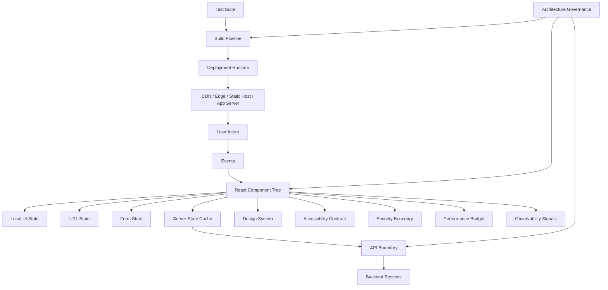
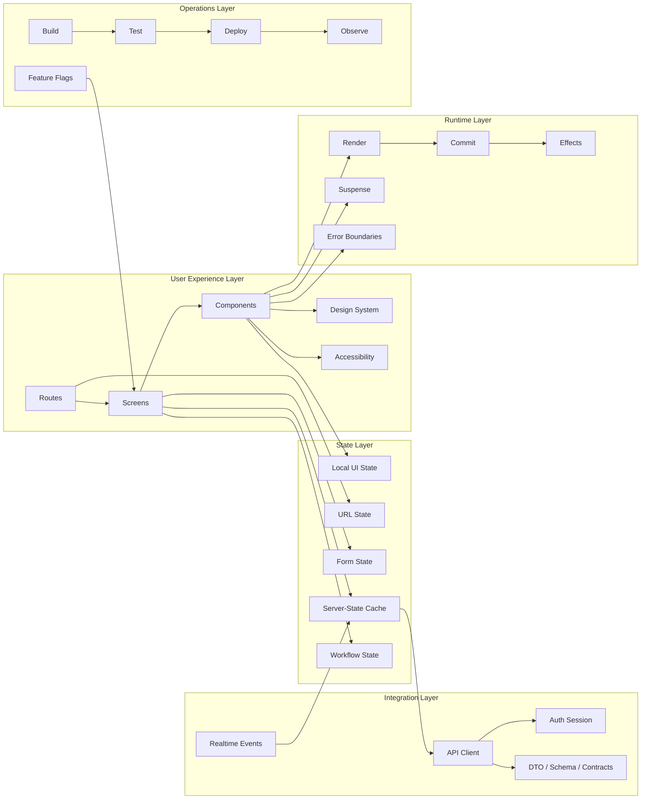

------
title: Learn Frontend React Production Architecture - Part 001
description: Kaufman-style skill map for mastering React production architecture as an advanced frontend engineering discipline.
series: learn-frontend-react-production-architecture
seriesTitle: Learn Frontend React Production Architecture
order: 1
partTitle: Kaufman Skill Map for React Production Architecture
tags:
- react
- frontend
- production-architecture
- kaufman
- skill-map
- series
date: 2026-06-28
---

# Part 001 — Kaufman Skill Map for React Production Architecture

## 1. Why This Series Exists

React at production scale is not mainly about remembering API names.

A basic React developer can:

- create components,
- pass props,
- use `useState`,
- call APIs,
- render lists,
- handle simple forms.

A production React engineer must be able to reason about:

- rendering strategy,
- state ownership,
- server-state lifecycle,
- URL and navigation semantics,
- component boundaries,
- accessibility,
- security,
- performance budgets,
- testing strategy,
- deployment topology,
- observability,
- migration risk,
- team-level governance.

The goal of this series is to develop the kind of engineering judgment required to design and maintain React applications that can survive real production pressure.

That means we care about:

- failure modes,
- architectural trade-offs,
- long-term maintainability,
- debugging cost,
- incident response,
- user experience under bad network conditions,
- degraded backend behavior,
- cross-team ownership,
- release safety,
- compliance and auditability where relevant.

This is not a beginner React tutorial.

This is a React production architecture track.

---

## 2. The Kaufman Frame

Josh Kaufman’s learning model can be adapted into four practical moves:

1. **Deconstruct the skill** into smaller sub-skills.
2. **Learn enough to self-correct**, not enough to read forever.
3. **Remove practice barriers** so deliberate practice actually happens.
4. **Practice deliberately** against real feedback.

For this series, the skill is:

> Design, build, operate, review, and evolve production-grade React frontend systems.

That skill is too large to learn directly. So we decompose it into operational sub-skills.

---

## 3. What “Top 1% React Engineer” Means Here

The phrase “top 1%” can be misleading if treated as ego language.

In this series, it means operational competence:

- You can explain why a frontend architecture is structured a certain way.
- You can identify which state belongs where.
- You can prevent component APIs from turning into unstable internal protocols.
- You can read a rendering bug and classify it as identity, closure, effect, cache, hydration, or event-ordering failure.
- You can choose SPA, SSR, streaming, Server Components, or static generation based on constraints.
- You can create test strategy without testing implementation details.
- You can debug bad INP, hydration mismatch, memory leak, stale data, or layout shift.
- You can design UI for workflow-heavy systems, not just CRUD screens.
- You can write frontend architecture decision records that future engineers can understand.
- You can govern a codebase without turning every pull request into subjective taste debate.

A strong production frontend engineer does not merely ask:

> “How do I implement this component?”

They ask:

> “What invariant must this UI preserve, where should the state live, how will it fail, how will we observe it, and how expensive will it be to change later?”

---

## 4. Production React as a System

A React app is not only a component tree.

A production React app is a system made of interacting layers:



The component tree is only one part of the system.

The architecture includes:

- how code is split,
- how routes map to business capabilities,
- how data enters the application,
- how data is cached and invalidated,
- how design primitives are reused,
- how permissions affect visible actions,
- how releases are validated,
- how errors are captured,
- how performance is measured,
- how accessibility is enforced,
- how dependencies are updated,
- how teams avoid accidental coupling.

---

## 5. Core Learning Constraint

The fastest way to become dangerous in React is to learn patterns without understanding the runtime.

For example:

- using `useEffect` for every data fetch,
- putting all state in Redux,
- wrapping everything in `useMemo`,
- making every Next.js component a Client Component,
- using Context as a high-frequency reactive store,
- hiding permissions inside button components,
- mocking everything in tests,
- treating accessibility as a QA-only activity.

These are not always wrong in isolation. They become wrong when applied without understanding:

- ownership,
- lifetime,
- identity,
- synchronization,
- observability,
- failure mode,
- cost of change.

So the rule for this series is:

> No pattern without the invariant it protects.

---

## 6. Skill Decomposition

### 6.1 Runtime Skill

You need to understand how React thinks.

| Sub-skill | Production relevance |
|---|---|
| Render vs commit | Prevent render-time side effects and UI inconsistency |
| Component identity | Fix state reset/preservation bugs |
| Keys | Control list reconciliation and forced remounts |
| Purity | Prepare code for concurrent rendering and compiler optimization |
| Hooks ordering | Avoid invisible state corruption |
| Closures | Debug stale state and delayed async behavior |
| Effects | Synchronize safely with non-React systems |
| Error boundaries | Contain failures to UI subtrees |

A weak React engineer debugs symptoms.

A strong React engineer identifies which part of the runtime contract was violated.

---

### 6.2 Rendering Architecture Skill

Modern React is used through multiple rendering strategies.

| Strategy | Typical use | Main risk |
|---|---|---|
| SPA | Authenticated tools, dashboards, internal apps | Slow first load, SEO limits, large JS |
| SSR | Public/product pages needing fast first paint and SEO | Hydration mismatch, server cost |
| SSG | Mostly static content | Stale content, rebuild complexity |
| ISR/revalidation | Static pages with periodic freshness | Cache invalidation complexity |
| Streaming SSR | Faster progressive rendering | Boundary design complexity |
| React Server Components | Reduce client JS and move data access server-side | server/client boundary confusion |
| Edge rendering | Low-latency personalized response | runtime constraints and vendor lock-in |

The production question is not:

> “Which one is modern?”

The production question is:

> “Which one fits the page’s freshness, interactivity, latency, SEO, security, and operational constraints?”

---

### 6.3 State Architecture Skill

Most large React bugs are state-boundary bugs.

You need to classify state before choosing a tool.

| State type | Owner | Lifetime | Common mistake |
|---|---|---|---|
| Local UI state | component/subtree | short | lifting too early |
| Derived state | render calculation | derived | storing duplicate state |
| URL state | router/browser | shareable | hiding deep-linkable state in memory |
| Form state | form boundary | until submit/reset | globalizing form fields |
| Server state | backend/cache | remote freshness | copying into client store |
| Workflow state | domain process | long-lived | modeling with booleans |
| Session state | browser/session | medium | confusing auth presence with authorization |
| Feature flag state | platform/config | variable | branching everywhere |
| Cross-tab state | browser channel/storage | medium | assuming single-tab user behavior |

The default rule:

> State should live at the narrowest boundary that can preserve the invariant.

---

### 6.4 Data and API Boundary Skill

A production React app should not scatter `fetch()` calls across components.

It needs an API boundary.

That boundary usually handles:

- base URLs,
- auth headers,
- request cancellation,
- retry policy,
- timeout behavior,
- schema validation,
- response normalization,
- error taxonomy,
- pagination,
- idempotency metadata,
- correlation IDs,
- observability hooks,
- cache invalidation hints.

Bad API integration often looks simple at first:

```tsx
useEffect(() => {
  fetch("/api/cases")
    .then((r) => r.json())
    .then(setCases);
}, []);
```

The production questions are:

- What happens if the component unmounts before the response?
- What happens if the token expires?
- What happens if the user opens the same page in two tabs?
- Is the response cached?
- Is stale data acceptable?
- Are errors user-actionable?
- Is retry safe?
- Is the request observable?
- Is pagination stable?
- Are filters represented in the URL?
- Can this query be preloaded?
- Can this query be invalidated after mutation?

---

### 6.5 Component Architecture Skill

React components are not only visual units.

They can represent:

- UI primitives,
- domain components,
- layout structures,
- route screens,
- interaction controllers,
- data boundary adapters,
- feature modules,
- workflow surfaces.

A production component boundary should make it clear:

- who owns state,
- who owns data fetching,
- who owns accessibility,
- who owns validation,
- who owns side effects,
- who owns styling,
- who owns error presentation,
- who owns permission visibility.

Weak boundary:

```tsx
<CasePage />
```

Everything happens inside.

Better boundary:

```tsx
<CaseRoute>
  <CasePageShell>
    <CaseSummaryPanel />
    <CaseTimelinePanel />
    <CaseActionsPanel />
    <CaseDocumentsPanel />
  </CasePageShell>
</CaseRoute>
```

Even better: route, data, permission, layout, and interaction concerns are separated deliberately.

---

### 6.6 Testing Skill

A mature frontend test strategy is not “write more tests”.

It is a risk model.

| Test type | Best for | Bad for |
|---|---|---|
| Unit test | pure functions, reducers, formatters | DOM behavior |
| Component test | component interactions | full backend workflows |
| Integration test | multiple UI modules + API boundary | every minor variant |
| E2E test | critical user journeys | exhaustive edge cases |
| Contract test | API compatibility | styling issues |
| Visual regression | layout/design drift | business logic |
| Accessibility test | automated violations | complete manual a11y assurance |

The question is:

> Which failure would hurt users or releases, and what is the cheapest reliable test that catches it?

---

### 6.7 Performance Skill

Performance is not just “make React faster”.

Frontend performance includes:

- network cost,
- JavaScript parse/evaluate cost,
- render cost,
- hydration cost,
- layout cost,
- memory pressure,
- interaction latency,
- image/video delivery,
- third-party script cost,
- cache strategy,
- CPU variability across devices.

A production React engineer knows when to:

- reduce JavaScript,
- split bundles,
- move work server-side,
- colocate state,
- virtualize lists,
- defer non-critical work,
- simplify component trees,
- prefetch data,
- avoid layout shift,
- optimize event handlers,
- measure field data.

The anti-pattern is optimizing based on vibes.

The invariant is:

> Measure before optimizing, but design to avoid obvious waste.

---

### 6.8 Accessibility Skill

Accessibility is not a plugin.

It is part of the component contract.

A production component must define:

- semantic role,
- keyboard behavior,
- focus behavior,
- labeling,
- error announcement,
- disabled behavior,
- loading behavior,
- reduced motion behavior where relevant,
- screen-reader behavior,
- color contrast,
- touch target behavior.

Bad pattern:

```tsx
<div onClick={submit}>Submit</div>
```

Better:

```tsx
<button type="submit">Submit</button>
```

The stronger pattern is to design primitives that make the accessible path the default path.

---

### 6.9 Security Skill

Frontend security is often misunderstood.

The frontend cannot enforce authorization. The backend must enforce it.

But the frontend can still:

- prevent XSS,
- avoid leaking sensitive data,
- handle tokens safely,
- avoid insecure local persistence,
- respect CSP constraints,
- avoid exposing privileged operations in client bundles,
- avoid dangerous HTML injection,
- validate user-controlled rendering paths,
- avoid dependency supply-chain risk,
- avoid logging secrets,
- minimize attack surface.

The key distinction:

> UI permission hiding is user experience. Backend authorization is security.

---

### 6.10 Observability Skill

A production frontend app needs signals.

At minimum:

- error rate,
- route-level failures,
- unhandled promise rejections,
- API failure rate,
- latency by route,
- Core Web Vitals,
- release version,
- feature flag context,
- user journey drop-off,
- source-map-backed stack traces,
- session correlation where allowed,
- backend trace correlation when available.

A backend incident without frontend observability looks like a backend problem.

A frontend incident without frontend observability looks like user complaints.

---

## 7. The React Production Architecture Map



This map is the reference model for the rest of the series.

Whenever we discuss a pattern, we will place it somewhere on this map.

---

## 8. The 20-Hour Advanced Practice Plan

This series is longer than 20 hours, but the Kaufman-style first-practice loop can still be expressed in a focused 20-hour plan.

The first 20 hours are not about mastery. They are about becoming self-correcting.

### Hours 0–2: Runtime Calibration

Goal:

- understand render,
- understand commit,
- understand effects,
- understand identity,
- understand keys,
- understand hook ordering.

Deliverable:

- build a small component lab that demonstrates:
  - state preservation,
  - key reset,
  - stale closure,
  - effect cleanup,
  - conditional hook failure,
  - unnecessary re-render.

Self-correction question:

> Can I explain this bug using React runtime terms instead of guessing?

---

### Hours 2–5: Component Boundary Practice

Goal:

- design component APIs deliberately.

Deliverable:

- build a modal/dialog primitive,
- a data table boundary,
- a page shell,
- a compound component,
- a headless interaction primitive.

Self-correction question:

> Is this component hiding too much policy, accepting too many props, or owning state it should not own?

---

### Hours 5–8: State Taxonomy Practice

Goal:

- classify state before choosing tools.

Deliverable:

- take one screen and mark every piece of state as:
  - local,
  - derived,
  - URL,
  - form,
  - server,
  - workflow,
  - session.

Self-correction question:

> If this state is wrong or stale, who has authority to correct it?

---

### Hours 8–11: Data Boundary Practice

Goal:

- separate server state from UI state.

Deliverable:

- create an API client boundary,
- implement query cache usage,
- implement mutation invalidation,
- model user-facing errors,
- add request cancellation.

Self-correction question:

> Does a component know too much about HTTP details?

---

### Hours 11–14: Rendering Strategy Practice

Goal:

- choose rendering mode by constraint.

Deliverable:

- compare one feature implemented as:
  - SPA route,
  - SSR route,
  - static route,
  - streaming route,
  - server/client split.

Self-correction question:

> What is the cost of JavaScript, freshness, personalization, and interactivity here?

---

### Hours 14–16: Performance Practice

Goal:

- measure before optimizing.

Deliverable:

- profile a slow screen,
- identify wasted renders,
- inspect bundle size,
- add route-level splitting,
- set basic performance budget.

Self-correction question:

> Did I optimize the bottleneck, or did I optimize what was easy to see?

---

### Hours 16–18: Testing Practice

Goal:

- test behavior and risk.

Deliverable:

- write:
  - unit tests for pure logic,
  - component tests for interactions,
  - integration tests with network mocking,
  - one E2E happy path,
  - one E2E failure path.

Self-correction question:

> Would this test fail if the user-visible behavior broke?

---

### Hours 18–20: Architecture Review Practice

Goal:

- review the whole system.

Deliverable:

- write a frontend architecture decision record for a real screen:
  - constraints,
  - state model,
  - data model,
  - rendering strategy,
  - component boundaries,
  - testing plan,
  - performance budget,
  - observability signals,
  - known trade-offs.

Self-correction question:

> Can another senior engineer maintain this without reading my mind?

---

## 9. What We Will Not Repeat

This series assumes you already understand:

- HTML and CSS basics,
- JavaScript syntax,
- async/await,
- modules,
- arrays/objects,
- basic DOM events,
- basic React component creation,
- basic JSX,
- basic hooks.

We will not waste parts on:

- “what is JSX?”,
- “how to install Node.js?”,
- “how to create your first button?”,
- “what is CSS flexbox?”,
- “what is an HTTP request?”,
- “what is JSON?”.

We may briefly revisit concepts only when they matter to production architecture.

---

## 10. Mental Model: React App as a Set of Contracts

A production React codebase is easier to reason about when you see it as contracts.

### 10.1 Runtime Contract

Components must be pure during render.

Effects synchronize with external systems.

Hooks must be called consistently.

Keys control identity.

State updates trigger renders.

Breaking these contracts causes subtle bugs.

---

### 10.2 Component Contract

A component should make clear:

- required props,
- optional props,
- controlled vs uncontrolled behavior,
- error states,
- loading states,
- empty states,
- accessibility behavior,
- styling extension points,
- event semantics,
- ownership boundaries.

A component is not just UI. It is an API.

---

### 10.3 State Contract

Every state value needs:

- owner,
- source of truth,
- lifetime,
- reset rule,
- persistence rule,
- invalidation rule,
- visibility rule,
- synchronization rule.

If you cannot answer these, the state will eventually drift.

---

### 10.4 Data Contract

Every API interaction needs:

- request shape,
- response shape,
- error shape,
- retry semantics,
- cancellation semantics,
- cache semantics,
- auth semantics,
- observability semantics.

The UI cannot be reliable if the API boundary is informal.

---

### 10.5 User Interaction Contract

A user action needs:

- enabled/disabled rule,
- validation rule,
- optimistic behavior,
- rollback rule,
- loading rule,
- error rule,
- audit/logging rule where relevant,
- accessibility behavior.

A button is often not just a button. In production systems it may represent a command.

---

### 10.6 Delivery Contract

A frontend release needs:

- build validation,
- tests,
- type checks,
- lint checks,
- security checks,
- preview environment,
- rollback plan,
- feature flag strategy,
- observability tag.

Without delivery discipline, architecture quality decays under release pressure.

---

## 11. Production Frontend Invariants

These are invariants this series will repeatedly use.

### Invariant 1: Render Must Be Pure

Render calculates UI.

Render should not:

- mutate global state,
- write to storage,
- subscribe to external systems,
- start network calls as uncontrolled side effects,
- modify DOM imperatively,
- schedule timers directly,
- emit analytics directly.

The reason is simple: React may render more than once before committing.

If rendering has side effects, duplicate render attempts create duplicate external effects.

---

### Invariant 2: State Must Have One Source of Truth

Duplicate state causes drift.

Bad example:

```tsx
const [selectedUser, setSelectedUser] = useState<User | null>(null);
const [selectedUserId, setSelectedUserId] = useState<string | null>(null);
```

If `selectedUser.id !== selectedUserId`, which one is correct?

Better:

```tsx
const [selectedUserId, setSelectedUserId] = useState<string | null>(null);
const selectedUser = users.find((user) => user.id === selectedUserId) ?? null;
```

Store the minimal source. Derive the rest.

---

### Invariant 3: Server State Is Not Client State

Server state is owned by the backend.

The client may cache it, display it, optimistically update it, and invalidate it.

But the client is not the source of truth.

Copying server data into a global store often creates stale duplicated state.

---

### Invariant 4: URL State Should Be Shareable

If a UI state should survive refresh, be bookmarkable, or be shareable, it probably belongs in the URL.

Examples:

- selected tab,
- search query,
- filters,
- sort order,
- pagination,
- entity ID,
- view mode.

Not everything belongs in the URL, but hiding navigational state in memory causes poor user experience.

---

### Invariant 5: Component APIs Should Minimize Invalid Combinations

Bad component API:

```tsx
<Banner success error warning message="Saved!" />
```

What does it mean if all variants are true?

Better:

```tsx
<Banner tone="success" message="Saved!" />
```

Even better with TypeScript:

```tsx
type BannerProps =
  | { tone: "success"; message: string }
  | { tone: "error"; message: string; retry?: () => void }
  | { tone: "warning"; message: string };
```

Good APIs make invalid states difficult to represent.

---

### Invariant 6: Accessibility Must Be Default, Not Optional

If every team must remember accessibility manually, the organization will fail.

Accessibility should be encoded into:

- primitives,
- lint rules,
- design system,
- test strategy,
- review checklist.

The best path should also be the accessible path.

---

### Invariant 7: Performance Must Be Budgeted

Performance cannot be an afterthought.

A production frontend should know:

- target LCP,
- target INP,
- target CLS,
- initial JavaScript budget,
- route-level bundle budget,
- image budget,
- third-party script budget.

Without budgets, performance regressions become invisible until users complain.

---

### Invariant 8: Errors Need Ownership

An error state should answer:

- Was this caused by user input?
- Was this caused by authentication?
- Was this caused by authorization?
- Was this caused by network failure?
- Was this caused by validation?
- Was this caused by backend state conflict?
- Can the user retry?
- Should support be contacted?
- Should the app recover automatically?

“Something went wrong” is a last-resort fallback, not a complete error strategy.

---

### Invariant 9: Workflow UI Must Represent Domain State Explicitly

Workflow-heavy UIs often fail because they hide domain transitions inside component logic.

Bad:

```tsx
if (caseData.status === "OPEN" && user.role === "SUPERVISOR") {
  return <ApproveButton />;
}
```

Better:

```tsx
const availableActions = getAvailableCaseActions({
  caseStatus: caseData.status,
  permissions,
  policyVersion,
});
```

The UI should render policy decisions. It should not bury policy rules inside unrelated view code.

---

### Invariant 10: Observability Is Part of the Feature

A production feature is incomplete if you cannot answer:

- Is it failing?
- For whom?
- Since which release?
- On which browser/device?
- At which route?
- Which API calls are involved?
- Which feature flags were active?
- What did the user experience?

Frontend work does not end at merge.

---

## 12. The Architecture Review Lens

When reviewing a React feature, use these questions.

### 12.1 Runtime Questions

- Are components pure during render?
- Are effects used only for synchronization?
- Are effect dependencies correct?
- Are keys stable and meaningful?
- Are callbacks relying on stale closure behavior?
- Are subscriptions cleaned up?
- Are async operations cancellable or safely ignored after unmount?

### 12.2 State Questions

- What is the source of truth?
- Is any state duplicated?
- Is derived state stored unnecessarily?
- Does this belong in URL, form, server cache, or local state?
- Can impossible states occur?
- Is reset behavior explicit?
- Is optimistic state reconciled correctly?

### 12.3 Data Questions

- Where is the API boundary?
- Are errors normalized?
- Is retry safe?
- Is cancellation handled?
- Is stale data acceptable?
- Are mutations invalidating correct queries?
- Is pagination stable?
- Are filters represented consistently?

### 12.4 Component Questions

- Is the component API too wide?
- Are concerns separated?
- Does a component own data it should not own?
- Are loading/empty/error states modeled?
- Is accessibility encoded?
- Are extension points controlled?
- Is styling predictable?

### 12.5 Performance Questions

- How much JavaScript is shipped?
- Is this route code-split?
- Are large lists virtualized?
- Are expensive calculations repeated?
- Are images optimized?
- Is hydration cost acceptable?
- Are third-party scripts controlled?
- Do we measure field performance?

### 12.6 Testing Questions

- What behavior is protected?
- What risk is not covered?
- Are tests user-centric?
- Are mocks too coupled to implementation?
- Are E2E tests limited to critical journeys?
- Are failure paths tested?
- Are tests deterministic?

### 12.7 Security Questions

- Is user-controlled content safely rendered?
- Are secrets ever logged or stored?
- Is authorization enforced server-side?
- Are privileged operations exposed unnecessarily?
- Is dependency risk managed?
- Is token handling appropriate?
- Is CSP considered?

### 12.8 Delivery Questions

- Is the feature behind a flag if risky?
- Is rollback possible?
- Are source maps available securely?
- Is release version tracked?
- Is there a preview environment?
- Are quality gates meaningful?

---

## 13. Common Production React Anti-Patterns

### 13.1 The `useEffect` Everything App

Symptoms:

- every component fetches its own data,
- effects trigger effects,
- state is synchronized manually,
- dependency arrays are suppressed,
- race conditions appear under slow networks.

Root cause:

> Treating effects as lifecycle events instead of synchronization boundaries.

---

### 13.2 The Global Store Junk Drawer

Symptoms:

- global store contains API data, form fields, modals, filters, auth, toasts, and temporary UI flags,
- every component subscribes to broad state,
- unrelated changes cause re-renders,
- state reset is unclear.

Root cause:

> Confusing “shared” with “global”.

---

### 13.3 The Page God Component

Symptoms:

- one route file owns fetching, permissions, layout, form state, modals, tables, business rules, and mutations,
- small changes risk regressions,
- tests are difficult,
- reuse is impossible.

Root cause:

> No component boundary strategy.

---

### 13.4 The Design System Graveyard

Symptoms:

- component library exists,
- teams still copy custom components,
- variants are inconsistent,
- accessibility differs per product area,
- tokens are bypassed.

Root cause:

> Design system treated as assets, not governance.

---

### 13.5 The Memoization Blanket

Symptoms:

- every callback is wrapped in `useCallback`,
- every derived value is wrapped in `useMemo`,
- dependencies become complex,
- performance does not improve,
- bugs become harder to read.

Root cause:

> Optimizing identity without measuring render cost.

---

### 13.6 The Invisible Authorization Bug

Symptoms:

- buttons are hidden for unauthorized users,
- direct API calls still succeed,
- route access assumes client-side guard is enough,
- sensitive data appears in client payloads.

Root cause:

> Confusing UI visibility with security enforcement.

---

### 13.7 The Test Pyramid Inversion

Symptoms:

- hundreds of brittle E2E tests,
- few component tests,
- flaky CI,
- slow releases,
- developers ignore failed tests.

Root cause:

> Testing through the most expensive layer by default.

---

### 13.8 The Hydration Surprise

Symptoms:

- SSR page renders differently on client,
- random values or dates differ,
- local storage affects first client render,
- warnings appear but are ignored.

Root cause:

> Not treating server render and client hydration as separate phases with strict consistency requirements.

---

## 14. Decision Records for Frontend Architecture

Production teams should record major decisions.

A lightweight ADR template:

```md
# ADR: <Decision Title>

## Status

Accepted | Proposed | Superseded

## Context

What problem are we solving?
What constraints exist?
What failure modes matter?

## Decision

What did we choose?

## Alternatives Considered

What else could we have done?

## Consequences

What gets easier?
What gets harder?
What risk remains?

## Review Trigger

When should we revisit this decision?
```

Example:

```md
# ADR: Use URL Search Params for Case List Filters

## Status

Accepted

## Context

Case officers share filtered case lists during escalation review.
Filters must survive refresh and be linkable in support tickets.

## Decision

Store search text, status, owner, priority, sort, and page in URL search params.
Keep transient panel state local.

## Alternatives Considered

1. Store all filters in local component state.
2. Store all filters in global Zustand store.
3. Persist filters to localStorage.

## Consequences

Deep-linking improves.
Back/forward navigation becomes meaningful.
URL parsing and validation must be maintained.

## Review Trigger

Revisit if filter state becomes too large or includes sensitive values.
```

A strong frontend architecture culture turns subjective preference into explicit decision-making.

---

## 15. Deliberate Practice: Skill Map Exercise

Take one existing React screen and answer the following.

### 15.1 Runtime

- Which components render frequently?
- Which effects synchronize with external systems?
- Are any effects actually derived-state calculations?
- Are keys stable?
- Can state accidentally reset?

### 15.2 State

List every state value.

For each one, fill this table:

| State | Type | Owner | Lifetime | Source of truth | Reset rule |
|---|---|---|---|---|---|
| Example: selected case tab | URL state | router | until navigation | URL search param | reset when case ID changes |

### 15.3 Data

- Where does server data enter?
- Is data cached?
- How is stale data handled?
- How are mutations reconciled?
- What errors can happen?
- Can requests be cancelled?

### 15.4 Component Boundaries

- Which components are primitives?
- Which are domain components?
- Which are route components?
- Which are data containers?
- Which are policy renderers?
- Which are too large?

### 15.5 Performance

- What is the initial bundle cost?
- Which interactions are slow?
- Which components re-render unnecessarily?
- Which data loads block useful rendering?
- Which assets affect LCP?

### 15.6 Testing

- What is the critical user journey?
- What failure path must be tested?
- Which logic can be unit-tested?
- Which interaction should be component-tested?
- Which journey deserves E2E?

### 15.7 Observability

- What errors are captured?
- Is the route name included?
- Is the release version included?
- Are API failures correlated?
- Can product/support reproduce user reports?

---

## 16. Review Rubric

Use this rubric to evaluate your answer.

| Level | Description |
|---|---|
| 1 | Can describe components visually |
| 2 | Can identify props, state, and effects |
| 3 | Can classify state by ownership and lifetime |
| 4 | Can identify rendering/data/testing/performance risks |
| 5 | Can propose architecture changes with trade-offs |
| 6 | Can define invariants and governance for future changes |

The target for this series is level 5–6.

---

## 17. What Comes Next

The next part covers the React runtime mental model.

Before designing production architecture, you need to understand what React is actually doing when your component function runs.

We will cover:

- component as UI description,
- render phase,
- commit phase,
- browser paint,
- state preservation,
- keys,
- render purity,
- hooks order,
- closures,
- effects as synchronization,
- common runtime failure modes.

---

## 18. Sources and Further Reading

- React documentation — React overview: https://react.dev/
- React documentation — Render and Commit: https://react.dev/learn/render-and-commit
- React documentation — Synchronizing with Effects: https://react.dev/learn/synchronizing-with-effects
- React documentation — You Might Not Need an Effect: https://react.dev/learn/you-might-not-need-an-effect
- React documentation — Preserving and Resetting State: https://react.dev/learn/preserving-and-resetting-state
- React documentation — Rules of Hooks: https://react.dev/reference/rules/rules-of-hooks
- React documentation — Components and Hooks must be pure: https://react.dev/reference/rules/components-and-hooks-must-be-pure
- React documentation — React Compiler: https://react.dev/learn/react-compiler
- Josh Kaufman — The First 20 Hours: How to Learn Anything... Fast
