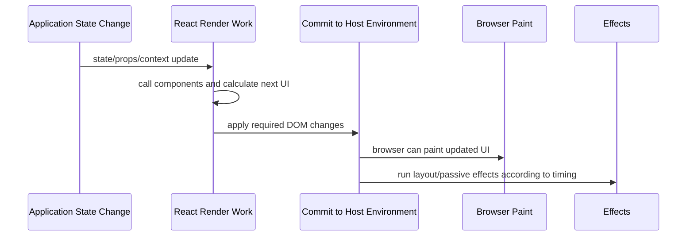

------
title: Learn Frontend React Production Architecture - Part 002
description: Deep mental model of the React runtime: render, commit, identity, keys, purity, hooks, closures, and effects for production-grade React systems.
series: learn-frontend-react-production-architecture
seriesTitle: Learn Frontend React Production Architecture
order: 2
partTitle: React Runtime Mental Model
tags:
- react
- frontend
- runtime
- hooks
- effects
- rendering
- series
date: 2026-06-28
---

# Part 002 — React Runtime Mental Model

## 1. Why Runtime Mental Model Matters

Many React bugs look unrelated at the surface:

- a form resets unexpectedly,
- an effect runs twice,
- a modal keeps old state,
- a list item shows the wrong value,
- a callback reads stale data,
- a subscription leaks,
- a fetch response updates the wrong screen,
- a server-rendered page has hydration warnings,
- a component re-renders too often,
- a memoized value does not update.

Most of these are not random bugs.

They usually come from misunderstanding one of React’s runtime contracts:

- render should be pure,
- state belongs to component identity,
- identity is determined by type, position, and key,
- hooks rely on call order,
- closures capture values from a render,
- effects synchronize with external systems after rendering,
- React may render before deciding whether to commit,
- the DOM is updated during commit, not during render.

If you understand these contracts, you stop debugging React by superstition.

---

## 2. React Is Not a DOM Mutation Script

In old imperative UI code, you might write:

```ts
const button = document.querySelector("#save");
button.textContent = "Saving...";
button.disabled = true;
```

That code directly mutates the DOM.

In React, a component describes what the UI should look like for a given state:

```tsx
function SaveButton({ status }: { status: "idle" | "saving" | "saved" }) {
  return (
    <button disabled={status === "saving"}>
      {status === "saving" ? "Saving..." : "Save"}
    </button>
  );
}
```

The component does not directly update the DOM.

It returns a description of UI.

React compares the new description with the previous one and commits the necessary changes.

The production consequence:

> Component functions should describe UI. They should not perform external work while describing UI.

---

## 3. The Three-Level Runtime Model

A useful simplified model:



React work can be understood in three broad steps:

1. **Trigger**: something causes an update.
2. **Render**: React calls components to calculate what UI should be.
3. **Commit**: React applies changes to the host environment, usually the DOM.

Effects happen after rendering/commit timing depending on effect type.

This model is simplified, but it is strong enough to diagnose most application-level bugs.

---

## 4. What Triggers a Render?

Common render triggers:

- state update,
- parent render,
- context value change,
- external store subscription update,
- route change,
- server/client hydration process,
- suspense boundary resolution,
- framework-driven data refresh.

Example:

```tsx
function Counter() {
  const [count, setCount] = useState(0);

  return (
    <button onClick={() => setCount((value) => value + 1)}>
      Count: {count}
    </button>
  );
}
```

Clicking the button calls `setCount`.

That schedules an update.

React renders the component again with the new state value.

Important:

> Calling a component function is not the same as committing DOM changes.

React may call components to calculate work before updating the DOM.

---

## 5. Render Phase

During render, React calls your component functions.

Example:

```tsx
function UserBadge({ user }: { user: User }) {
  const displayName = `${user.firstName} ${user.lastName}`;

  return <span>{displayName}</span>;
}
```

This is a good render function:

- it reads props,
- computes a display value,
- returns UI,
- does not mutate external systems.

Render should be deterministic for the same inputs.

Same props/state/context should produce the same output.

### 5.1 What Belongs in Render

Good render-phase work:

```tsx
function InvoiceSummary({ invoice }: { invoice: Invoice }) {
  const total = invoice.items.reduce((sum, item) => {
    return sum + item.quantity * item.unitPrice;
  }, 0);

  return <strong>Total: {formatCurrency(total)}</strong>;
}
```

This is fine if the calculation is cheap enough.

Render can contain:

- derived values,
- conditional UI,
- mapping arrays to elements,
- formatting,
- selecting values,
- pure calculations.

### 5.2 What Does Not Belong in Render

Bad render-phase work:

```tsx
function AuditPanel({ caseId }: { caseId: string }) {
  localStorage.setItem("lastCaseId", caseId);

  return <section>Audit</section>;
}
```

Why bad?

Because render may happen more than once.

Render may happen and then be discarded.

Render should not write to external systems.

Other bad render-time side effects:

```tsx
function BadComponent() {
  analytics.track("rendered");
  document.title = "Dashboard";
  window.addEventListener("resize", () => {});
  fetch("/api/data");

  return <div />;
}
```

These belong in event handlers, framework loaders, server components, query libraries, or effects depending on the use case.

---

## 6. Commit Phase

After render, React commits changes.

The commit phase is where React applies updates to the host environment.

In a browser app, that usually means DOM changes.

Example:

```tsx
function StatusLabel({ status }: { status: "open" | "closed" }) {
  return <span>{status}</span>;
}
```

If `status` changes from `"open"` to `"closed"`, React eventually commits the text update to the DOM.

Your component does not perform the DOM mutation directly.

React does.

### 6.1 Why Render/Commit Separation Matters

This explains why render-time side effects are dangerous.

If React renders a component but does not commit it, any side effect executed during render has escaped into the world even though the UI was not committed.

That creates bugs such as:

- duplicate analytics events,
- stale storage writes,
- leaked subscriptions,
- fetches for screens the user never saw,
- timers that should not exist,
- inconsistent DOM mutations.

The invariant:

> External effects must be tied to committed UI state, not speculative render work.

---

## 7. Browser Paint

After DOM changes are committed, the browser may paint.

Painting is not controlled by React alone.

The browser considers:

- DOM changes,
- style recalculation,
- layout,
- paint,
- compositing,
- main-thread availability,
- frame budget,
- device performance.

A React render optimization may not improve user-visible performance if the real bottleneck is:

- layout thrashing,
- image loading,
- CSS complexity,
- third-party scripts,
- expensive event handlers,
- JavaScript parse/evaluation,
- network latency.

So React runtime knowledge must eventually connect to browser performance knowledge.

---

## 8. Component Identity

State in React is associated with a component’s identity in the UI tree.

Identity is determined by:

- component type,
- position in the tree,
- key when provided.

This is one of the most important React production concepts.

### 8.1 State Is Not Stored “Inside the Function”

Consider:

```tsx
function Counter() {
  const [count, setCount] = useState(0);

  return (
    <button onClick={() => setCount(count + 1)}>
      {count}
    </button>
  );
}
```

It is tempting to think `count` lives inside the function.

More accurately:

> React stores state for a component instance associated with a position in the rendered tree.

The function is called repeatedly.

The state persists because React matches the next rendered component to the previous component identity.

---

## 9. Position-Based State Preservation

Example:

```tsx
function App({ showDetails }: { showDetails: boolean }) {
  return (
    <main>
      <Counter />
      {showDetails ? <Details /> : null}
    </main>
  );
}
```

`Counter` remains in the same position under `<main>`.

Its state is preserved when `showDetails` changes.

Now consider:

```tsx
function App({ mode }: { mode: "counter" | "details" }) {
  return (
    <main>
      {mode === "counter" ? <Counter /> : <Details />}
    </main>
  );
}
```

At that tree position, React sees either `Counter` or `Details`.

Switching type resets the previous component subtree because the identity changes.

---

## 10. Keys and Identity

Keys are commonly taught as list requirements.

But production React engineers understand keys as identity controls.

### 10.1 List Identity

Bad:

```tsx
{users.map((user, index) => (
  <UserRow key={index} user={user} />
))}
```

Using array index as key is risky when the list can be reordered, inserted into, filtered, or deleted from.

React may preserve state for the wrong row.

Better:

```tsx
{users.map((user) => (
  <UserRow key={user.id} user={user} />
))}
```

Stable domain identity gives React the right matching information.

### 10.2 Forced Reset with Key

Keys can intentionally reset state.

```tsx
function CaseEditorPage({ caseId }: { caseId: string }) {
  return <CaseEditor key={caseId} caseId={caseId} />;
}
```

When `caseId` changes, React treats `CaseEditor` as a new instance.

That can be correct if the editor has local draft state that must not leak across cases.

But it can also be dangerous if used casually.

Key reset should be explicit architecture, not accidental patching.

---

## 11. Identity Failure Example

Imagine a case review queue.

```tsx
function ReviewQueue({ cases }: { cases: Case[] }) {
  return (
    <ul>
      {cases.map((caseItem, index) => (
        <CaseReviewRow key={index} caseItem={caseItem} />
      ))}
    </ul>
  );
}
```

Inside each row:

```tsx
function CaseReviewRow({ caseItem }: { caseItem: Case }) {
  const [expanded, setExpanded] = useState(false);

  return (
    <li>
      <button onClick={() => setExpanded((value) => !value)}>
        {caseItem.reference}
      </button>
      {expanded ? <CaseDetails caseId={caseItem.id} /> : null}
    </li>
  );
}
```

If a new high-priority case is inserted at the top, index keys shift.

React may preserve `expanded` state by position rather than by case identity.

The wrong row appears expanded.

This is not a random UI bug.

It is an identity bug.

Fix:

```tsx
function ReviewQueue({ cases }: { cases: Case[] }) {
  return (
    <ul>
      {cases.map((caseItem) => (
        <CaseReviewRow key={caseItem.id} caseItem={caseItem} />
      ))}
    </ul>
  );
}
```

---

## 12. Render Purity

React components and hooks should be pure during render.

A pure render:

- does not mutate external variables,
- does not mutate props,
- does not mutate state objects,
- does not subscribe,
- does not write to storage,
- does not perform network calls,
- does not cause observable external effects.

### 12.1 Mutating Props

Bad:

```tsx
function SortableList({ items }: { items: Item[] }) {
  items.sort((a, b) => a.name.localeCompare(b.name));

  return (
    <ul>
      {items.map((item) => (
        <li key={item.id}>{item.name}</li>
      ))}
    </ul>
  );
}
```

This mutates the array passed from the parent.

The parent may rely on the original order.

Better:

```tsx
function SortableList({ items }: { items: Item[] }) {
  const sortedItems = [...items].sort((a, b) => {
    return a.name.localeCompare(b.name);
  });

  return (
    <ul>
      {sortedItems.map((item) => (
        <li key={item.id}>{item.name}</li>
      ))}
    </ul>
  );
}
```

### 12.2 Mutating State Objects

Bad:

```tsx
function ProfileForm() {
  const [profile, setProfile] = useState({ name: "", title: "" });

  function updateName(name: string) {
    profile.name = name;
    setProfile(profile);
  }

  return <input value={profile.name} onChange={(event) => updateName(event.target.value)} />;
}
```

This mutates the same object reference.

React may not detect meaningful change the way you expect, and the code breaks the immutability contract.

Better:

```tsx
function ProfileForm() {
  const [profile, setProfile] = useState({ name: "", title: "" });

  function updateName(name: string) {
    setProfile((current) => ({
      ...current,
      name,
    }));
  }

  return <input value={profile.name} onChange={(event) => updateName(event.target.value)} />;
}
```

---

## 13. Hooks Are Ordered Runtime Slots

Hooks are not ordinary function calls from React’s perspective.

React relies on the order of hook calls.

Example:

```tsx
function ProfileCard() {
  const [expanded, setExpanded] = useState(false);
  const [tab, setTab] = useState<"overview" | "activity">("overview");

  return <section />;
}
```

On each render, React expects the first state hook to represent `expanded` and the second state hook to represent `tab`.

### 13.1 Conditional Hook Bug

Bad:

```tsx
function CasePanel({ enabled }: { enabled: boolean }) {
  if (enabled) {
    const [expanded, setExpanded] = useState(false);
  }

  const [tab, setTab] = useState("summary");

  return <section />;
}
```

If `enabled` changes from true to false, the hook order changes.

React can no longer match hook state correctly.

Fix:

```tsx
function CasePanel({ enabled }: { enabled: boolean }) {
  const [expanded, setExpanded] = useState(false);
  const [tab, setTab] = useState("summary");

  if (!enabled) {
    return null;
  }

  return <section />;
}
```

Hook calls stay at the top level.

---

## 14. Custom Hooks

A custom hook is a way to extract reusable stateful logic.

Example:

```tsx
function useDisclosure(initialValue = false) {
  const [open, setOpen] = useState(initialValue);

  const show = useCallback(() => setOpen(true), []);
  const hide = useCallback(() => setOpen(false), []);
  const toggle = useCallback(() => setOpen((value) => !value), []);

  return { open, show, hide, toggle };
}
```

Usage:

```tsx
function DeleteCaseButton() {
  const confirmation = useDisclosure();

  return (
    <>
      <button onClick={confirmation.show}>Delete</button>
      {confirmation.open ? (
        <ConfirmDialog onCancel={confirmation.hide} />
      ) : null}
    </>
  );
}
```

A custom hook is good when it exposes a clear behavioral contract.

A custom hook is bad when it hides too many global dependencies.

Bad:

```tsx
function useCaseActions() {
  const router = useRouter();
  const analytics = useAnalytics();
  const permissions = usePermissions();
  const queryClient = useQueryClient();
  const toast = useToast();

  // 400 lines of mixed orchestration
}
```

This hook may become a hidden service locator.

Use custom hooks to clarify boundaries, not to hide architecture.

---

## 15. Closures and Render Snapshots

Each render has its own values.

When you create a function during a render, that function closes over the values from that render.

Example:

```tsx
function Counter() {
  const [count, setCount] = useState(0);

  function alertLater() {
    setTimeout(() => {
      alert(count);
    }, 3000);
  }

  return (
    <>
      <button onClick={() => setCount((value) => value + 1)}>Increment</button>
      <button onClick={alertLater}>Alert later</button>
    </>
  );
}
```

If `count` is 5 when `alertLater` is clicked, the alert will show 5 even if the user increments to 10 before the timer fires.

That is not React being stale.

That is JavaScript closure behavior.

The function captured a render snapshot.

### 15.1 When This Is Good

Render snapshots are good when you want event logic to refer to the state at the time of the event.

Example:

```tsx
function SubmitButton({ draft }: { draft: Draft }) {
  function submit() {
    sendDraft(draft);
  }

  return <button onClick={submit}>Submit</button>;
}
```

The handler submits the draft from the render where the user clicked.

### 15.2 When This Is Risky

Stale closures are risky when delayed async work expects the latest state.

Example:

```tsx
function AutosaveEditor() {
  const [text, setText] = useState("");

  useEffect(() => {
    const id = setInterval(() => {
      saveDraft(text);
    }, 5000);

    return () => clearInterval(id);
  }, []);
}
```

The interval captures the initial `text`.

The dependency array lies.

The effect says it does not depend on `text`, but it does.

Fix options depend on intent:

1. include `text` in dependencies,
2. use a ref for latest value,
3. move save logic into a debounced event/update flow,
4. use a dedicated form/server-state library,
5. use an effect event pattern when appropriate.

---

## 16. Effects Are Synchronization, Not Lifecycle Buckets

An effect should synchronize your component with something outside React.

External systems include:

- browser APIs,
- DOM APIs not controlled by React,
- subscriptions,
- timers,
- analytics,
- WebSocket/SSE connections,
- third-party widgets,
- imperative libraries.

Example:

```tsx
function ChatRoom({ roomId }: { roomId: string }) {
  useEffect(() => {
    const connection = createConnection(roomId);
    connection.connect();

    return () => {
      connection.disconnect();
    };
  }, [roomId]);

  return <section>Connected to {roomId}</section>;
}
```

This effect has a clear synchronization contract:

- when `roomId` is active, connect,
- when `roomId` changes or component unmounts, disconnect old connection.

---

## 17. You Might Not Need an Effect

Many effects are unnecessary.

Bad:

```tsx
function FullName({ firstName, lastName }: Props) {
  const [fullName, setFullName] = useState("");

  useEffect(() => {
    setFullName(`${firstName} ${lastName}`);
  }, [firstName, lastName]);

  return <span>{fullName}</span>;
}
```

This stores derived state and causes an extra render.

Better:

```tsx
function FullName({ firstName, lastName }: Props) {
  const fullName = `${firstName} ${lastName}`;

  return <span>{fullName}</span>;
}
```

Rule:

> If you can calculate it during render, do not synchronize it with an effect.

---

## 18. Effects and Dependency Arrays

The dependency array is not a scheduling preference.

It is a declaration of what reactive values the effect uses.

Bad:

```tsx
function CaseWatcher({ caseId, userId }: Props) {
  useEffect(() => {
    subscribeToCase(caseId, userId);
  }, []);
}
```

The effect uses `caseId` and `userId`, but the dependency array says it uses nothing.

Correct structure:

```tsx
function CaseWatcher({ caseId, userId }: Props) {
  useEffect(() => {
    const subscription = subscribeToCase(caseId, userId);

    return () => {
      subscription.unsubscribe();
    };
  }, [caseId, userId]);

  return null;
}
```

If adding dependencies causes problems, that usually means the effect is doing too much or some value needs stable identity.

Do not silence the linter as the first move.

Restructure the code.

---

## 19. Effect Cleanup

Effects that create resources should clean them up.

Resource examples:

- subscriptions,
- timers,
- event listeners,
- observers,
- connections,
- in-flight async operations,
- third-party widgets.

Bad:

```tsx
function WindowSizeLogger() {
  useEffect(() => {
    window.addEventListener("resize", () => {
      console.log(window.innerWidth);
    });
  }, []);

  return null;
}
```

Problems:

- listener is never removed,
- anonymous function cannot be removed later,
- repeated mounts leak listeners.

Better:

```tsx
function WindowSizeLogger() {
  useEffect(() => {
    function handleResize() {
      console.log(window.innerWidth);
    }

    window.addEventListener("resize", handleResize);

    return () => {
      window.removeEventListener("resize", handleResize);
    };
  }, []);

  return null;
}
```

---

## 20. Async Effects and Race Conditions

A common production bug:

```tsx
function CaseDetails({ caseId }: { caseId: string }) {
  const [caseDetails, setCaseDetails] = useState<CaseDetails | null>(null);

  useEffect(() => {
    fetchCase(caseId).then(setCaseDetails);
  }, [caseId]);

  return <CaseDetailsView data={caseDetails} />;
}
```

Suppose:

1. user opens case A,
2. request A starts,
3. user quickly opens case B,
4. request B starts,
5. request B finishes,
6. request A finishes later,
7. state is overwritten with case A while route shows case B.

This is a race condition.

Fix with cancellation/ignore flag:

```tsx
function CaseDetails({ caseId }: { caseId: string }) {
  const [caseDetails, setCaseDetails] = useState<CaseDetails | null>(null);

  useEffect(() => {
    let ignore = false;

    async function load() {
      const result = await fetchCase(caseId);

      if (!ignore) {
        setCaseDetails(result);
      }
    }

    load();

    return () => {
      ignore = true;
    };
  }, [caseId]);

  return <CaseDetailsView data={caseDetails} />;
}
```

Better in production:

- use a data-fetching library with cancellation/cache semantics,
- move fetch to framework loader/server component where appropriate,
- model loading/error/stale states explicitly.

The lesson:

> Async work must be tied to the UI state that requested it.

---

## 21. Event Handlers vs Effects

Many developers put event-driven logic in effects.

Bad:

```tsx
function SaveToast({ saved }: { saved: boolean }) {
  useEffect(() => {
    if (saved) {
      toast.success("Saved");
    }
  }, [saved]);

  return null;
}
```

If `saved` is a state flag set by a submit action, the toast likely belongs in the submit flow:

```tsx
async function handleSubmit() {
  await save();
  toast.success("Saved");
}
```

Effects are for synchronization caused by rendering.

Event handlers are for actions caused by user intent.

Ask:

> Did this happen because the component appeared/changed, or because the user did something?

---

## 22. Refs as Mutable Cells

`useRef` gives you a stable mutable object.

Example:

```tsx
function Stopwatch() {
  const startedAtRef = useRef<number | null>(null);

  function start() {
    startedAtRef.current = Date.now();
  }

  function stop() {
    if (startedAtRef.current === null) {
      return;
    }

    const elapsed = Date.now() - startedAtRef.current;
    console.log(elapsed);
  }

  return (
    <>
      <button onClick={start}>Start</button>
      <button onClick={stop}>Stop</button>
    </>
  );
}
```

Updating a ref does not trigger render.

Refs are useful for:

- DOM nodes,
- imperative handles,
- latest values for non-reactive callbacks,
- timer IDs,
- mutable integration objects.

Refs are dangerous when used as hidden state that should affect UI.

Bad:

```tsx
function BadCounter() {
  const countRef = useRef(0);

  return (
    <button onClick={() => countRef.current++}>
      Count: {countRef.current}
    </button>
  );
}
```

The UI will not update because ref changes do not render.

Use state for values that affect rendering.

---

## 23. Derived State

Derived state is one of the most common sources of React bugs.

Bad:

```tsx
function CaseList({ cases }: { cases: Case[] }) {
  const [openCases, setOpenCases] = useState<Case[]>([]);

  useEffect(() => {
    setOpenCases(cases.filter((caseItem) => caseItem.status === "OPEN"));
  }, [cases]);

  return <CaseTable cases={openCases} />;
}
```

Better:

```tsx
function CaseList({ cases }: { cases: Case[] }) {
  const openCases = cases.filter((caseItem) => caseItem.status === "OPEN");

  return <CaseTable cases={openCases} />;
}
```

If filtering is expensive, use memoization only after identifying it as a real cost:

```tsx
function CaseList({ cases }: { cases: Case[] }) {
  const openCases = useMemo(() => {
    return cases.filter((caseItem) => caseItem.status === "OPEN");
  }, [cases]);

  return <CaseTable cases={openCases} />;
}
```

But do not memoize by reflex.

---

## 24. Batching and Update Semantics

React may batch state updates.

Example:

```tsx
function Counter() {
  const [count, setCount] = useState(0);

  function incrementThreeTimesWrong() {
    setCount(count + 1);
    setCount(count + 1);
    setCount(count + 1);
  }

  function incrementThreeTimesRight() {
    setCount((value) => value + 1);
    setCount((value) => value + 1);
    setCount((value) => value + 1);
  }

  return (
    <>
      <button onClick={incrementThreeTimesWrong}>Wrong</button>
      <button onClick={incrementThreeTimesRight}>Right</button>
      <span>{count}</span>
    </>
  );
}
```

The first function repeatedly uses the same captured `count`.

The second uses updater functions, so each update receives the latest queued value.

Rule:

> When next state depends on previous state, use an updater function.

---

## 25. Strict Mode Development Behavior

In development, React Strict Mode may intentionally run certain logic more than once to help reveal unsafe patterns.

Production behavior differs, but you should not “fix” duplicate development behavior by making effects impure.

If an effect breaks when setup/cleanup is repeated, the effect is probably not resilient.

Good effects should tolerate:

- setup,
- cleanup,
- setup again.

This matters because production navigation, remounting, feature flags, suspense, and conditional rendering can also expose bad cleanup logic.

---

## 26. Concurrent Rendering Mindset

Modern React can prepare UI work before committing it.

You do not need to know every internal implementation detail to write good application code.

You do need to respect the contract:

- render must be pure,
- external effects must be in effects or event handlers,
- state should be immutable,
- hook order must be stable,
- components should not depend on being called exactly once.

The practical mindset:

> A render is a calculation, not an event.

If your render code cannot safely be repeated, paused, or discarded, it is probably doing too much.

---

## 27. Error Boundaries

An error boundary catches rendering errors in a subtree and shows fallback UI.

Conceptually:

```tsx
<CaseWorkspaceErrorBoundary>
  <CaseWorkspace />
</CaseWorkspaceErrorBoundary>
```

Production use cases:

- isolate route failures,
- prevent entire app crash,
- show recoverable fallback,
- capture error context,
- include release version,
- allow retry,
- reset boundary on navigation/entity change.

Important:

- error boundaries do not replace proper error handling for async event handlers,
- error boundaries do not make invalid data safe,
- error boundaries should be part of route architecture.

---

## 28. Suspense Mental Model

Suspense lets a subtree wait for something and show fallback UI.

Simplified:

```tsx
<Suspense fallback={<CaseSkeleton />}>
  <CaseDetails />
</Suspense>
```

In production architecture, Suspense boundaries are not only loading spinners.

They are user experience boundaries.

They define:

- what can render immediately,
- what can wait,
- what should stream,
- what fallback is acceptable,
- what error boundary should pair with it.

Poor Suspense boundary design can cause:

- large blank areas,
- layout shift,
- duplicated loading states,
- poor perceived performance,
- confusing error recovery.

---

## 29. Runtime Failure Taxonomy

Use this table to classify bugs.

| Symptom | Likely root cause | Diagnostic question |
|---|---|---|
| State resets unexpectedly | identity/key/type change | Did component position or key change? |
| State sticks to wrong list item | unstable key | Are keys based on stable domain IDs? |
| Effect uses old value | stale closure / wrong deps | Does dependency array match used values? |
| Effect loops forever | unstable dependency | Is object/function identity recreated each render? |
| UI does not update | state mutation/ref misuse | Did you create a new state value? |
| Fetch overwrites newer screen | async race | Can old request still update state? |
| Component renders too often | broad parent/context updates | Who subscribes to changing state? |
| Hydration warning | server/client mismatch | Does initial client render equal server output? |
| Event handler sees old state | closure snapshot | Does logic require latest value or event-time value? |
| Memory grows over time | missing cleanup | Are listeners/timers/subscriptions removed? |

This table should become part of your debugging reflex.

---

## 30. Anti-Pattern Catalog

### 30.1 Side Effects in Render

Bad:

```tsx
function Component() {
  analytics.track("render");
  return <div />;
}
```

Why bad:

- render may repeat,
- render may be discarded,
- analytics becomes inaccurate.

Fix:

- event handler if tracking user action,
- effect if tracking committed appearance,
- framework instrumentation if tracking route.

---

### 30.2 Derived State in Effect

Bad:

```tsx
useEffect(() => {
  setVisibleItems(items.filter(matchesFilter));
}, [items, matchesFilter]);
```

Fix:

```tsx
const visibleItems = items.filter(matchesFilter);
```

Use `useMemo` only for measured expensive calculations or identity-sensitive dependencies.

---

### 30.3 Dependency Array Lying

Bad:

```tsx
useEffect(() => {
  connect(roomId);
}, []);
```

Fix:

```tsx
useEffect(() => {
  const connection = connect(roomId);
  return () => connection.disconnect();
}, [roomId]);
```

---

### 30.4 Index Keys for Dynamic Lists

Bad:

```tsx
items.map((item, index) => <Row key={index} item={item} />);
```

Fix:

```tsx
items.map((item) => <Row key={item.id} item={item} />);
```

---

### 30.5 Ref as Render State

Bad:

```tsx
const openRef = useRef(false);
```

If `open` affects rendering, use state.

---

### 30.6 Global Mutable Module State

Bad:

```tsx
let currentUser: User | null = null;

function Profile() {
  currentUser = useCurrentUser();
  return <div />;
}
```

This creates cross-render, cross-user, and possibly server-side leakage risks depending on runtime.

Use proper state, context, request scope, or server data boundaries.

---

### 30.7 Effect as Workflow Engine

Bad:

```tsx
useEffect(() => {
  if (status === "APPROVED" && shouldNotify && hasPermission) {
    sendNotification();
    navigate("/next");
    updateCache();
    audit();
  }
}, [status, shouldNotify, hasPermission]);
```

This hides domain workflow in a rendering synchronization tool.

Better:

- model workflow as a command,
- run it in the event/mutation flow,
- make transitions explicit,
- record audit behavior server-side where required,
- invalidate cache deliberately.

---

## 31. Debugging Playbook

### Step 1: Classify the Bug

Is it:

- identity,
- state ownership,
- stale closure,
- effect dependency,
- async race,
- mutation,
- context over-render,
- hydration,
- external subscription,
- browser performance?

Do not start by adding `useMemo`.

### Step 2: Find the Owner

Ask:

- Who owns this value?
- Who is allowed to change it?
- Is it derived?
- Is it cached?
- Is it remote?
- Is it URL-based?

### Step 3: Inspect Identity

Ask:

- Did the component remount?
- Did the key change?
- Is the list using index keys?
- Is the component type changing at same position?

### Step 4: Inspect Effects

Ask:

- What external system does this effect synchronize with?
- Are dependencies complete?
- Is cleanup correct?
- Can old async work update new state?
- Is this effect actually unnecessary?

### Step 5: Inspect Closures

Ask:

- Which render created this callback?
- Does it need latest state or event-time state?
- Should it use an updater function?
- Should it use a ref?
- Should logic move to the event/mutation layer?

### Step 6: Measure If Performance-Related

Ask:

- Is render slow?
- Is commit slow?
- Is browser layout slow?
- Is JavaScript load slow?
- Is network slow?
- Is hydration slow?
- Is interaction handler slow?

---

## 32. Deliberate Practice Lab

Create a small React lab with the following examples.

### 32.1 Identity Lab

Build a list of rows with local expanded state.

First use index keys.

Then insert an item at the top.

Observe wrong state preservation.

Fix using stable IDs.

### 32.2 Key Reset Lab

Build a form with local draft state.

Switch `caseId`.

First preserve state accidentally.

Then add `key={caseId}`.

Observe reset behavior.

Decide when reset is correct and when it is data loss.

### 32.3 Effect Cleanup Lab

Build a component that subscribes to `resize`.

First forget cleanup.

Mount/unmount repeatedly.

Then add cleanup.

Observe listener count behavior.

### 32.4 Stale Closure Lab

Build a delayed alert counter.

Observe snapshot behavior.

Then implement one version that intentionally uses event-time state and one version that reads latest state through a ref.

### 32.5 Async Race Lab

Build a fake fetch that resolves in random order.

Switch entity IDs quickly.

Observe old response overwriting new state.

Fix with ignore flag or abort controller.

Then replace manual fetching with query-library semantics later in the series.

---

## 33. Runtime Review Checklist

Use this checklist in code reviews.

### Render

- [ ] Component render is pure.
- [ ] No external mutations during render.
- [ ] Derived values are calculated directly where possible.
- [ ] Expensive calculations are measured before memoization.
- [ ] Props/state are not mutated.

### Identity

- [ ] Dynamic lists use stable keys.
- [ ] Key resets are intentional.
- [ ] Component type changes are understood.
- [ ] Local state does not leak across entities.

### Hooks

- [ ] Hooks are called at top level.
- [ ] Custom hooks expose clear contracts.
- [ ] Hooks do not hide unrelated service orchestration.
- [ ] Updater functions are used when next state depends on previous state.

### Effects

- [ ] Each effect has an external synchronization purpose.
- [ ] Dependencies are complete.
- [ ] Cleanup is implemented for resources.
- [ ] Async races are handled.
- [ ] Effects are not used for pure derivation.
- [ ] Event-driven logic is not unnecessarily moved into effects.

### Closures

- [ ] Delayed callbacks intentionally use snapshot or latest value.
- [ ] Stale closure risks are understood.
- [ ] Stable callback identity is used only when needed.

---

## 34. Production Heuristics

### Heuristic 1: Render Is Math

If render is not safe to repeat, it is not pure enough.

### Heuristic 2: Effects Need a System

If you cannot name the external system, you probably do not need an effect.

### Heuristic 3: Keys Are Identity, Not Warning Suppressors

A key tells React what is the same thing across renders.

### Heuristic 4: Closures Are Snapshots

A callback sees the values from the render that created it.

### Heuristic 5: State Must Have Ownership

Every state bug becomes easier once ownership is clear.

### Heuristic 6: Memoization Is Not Architecture

Memoization may reduce work. It does not fix unclear state ownership or poor component boundaries.

### Heuristic 7: Cleanup Is Part of Setup

Any effect that sets something up should usually define how it is torn down.

---

## 35. What Comes Next

The next part moves from runtime mechanics to the modern React architecture landscape.

We will compare:

- React as a library,
- React as used through frameworks,
- SPA,
- SSR,
- SSG,
- streaming,
- React Server Components,
- Next.js App Router,
- React Router modes,
- Vite production model.

The goal is to choose architecture based on constraints, not fashion.

---

## 36. Sources and Further Reading

- React documentation — Render and Commit: https://react.dev/learn/render-and-commit
- React documentation — Components and Hooks must be pure: https://react.dev/reference/rules/components-and-hooks-must-be-pure
- React documentation — Preserving and Resetting State: https://react.dev/learn/preserving-and-resetting-state
- React documentation — Rules of Hooks: https://react.dev/reference/rules/rules-of-hooks
- React documentation — Synchronizing with Effects: https://react.dev/learn/synchronizing-with-effects
- React documentation — You Might Not Need an Effect: https://react.dev/learn/you-might-not-need-an-effect
- React documentation — Lifecycle of Reactive Effects: https://react.dev/learn/lifecycle-of-reactive-effects
- React documentation — useEffect: https://react.dev/reference/react/useEffect
- React documentation — exhaustive-deps lint: https://react.dev/reference/eslint-plugin-react-hooks/lints/exhaustive-deps
- React documentation — React Compiler: https://react.dev/learn/react-compiler
