------
title: Learn Frontend React Production Architecture - Part 003
description: Modern React architecture landscape: React as a UI runtime, framework selection, rendering strategies, SPA/SSR/SSG/streaming/RSC trade-offs, and production decision-making.
series: learn-frontend-react-production-architecture
seriesTitle: Learn Frontend React Production Architecture
order: 3
partTitle: Modern React Architecture Landscape
tags:
- react
- frontend
- architecture
- rendering
- nextjs
- vite
- react-router
- production
date: 2026-06-28
---

# Part 003 — Modern React Architecture Landscape

## 0. Core Thesis

React production architecture is not decided by asking:

> "Should we use React?"

That question is too small.

The real production question is:

> "Where should each unit of UI work happen: build time, request time, server runtime, edge runtime, browser runtime, cache layer, or background data layer?"

React is the UI model. Production architecture is the placement of work.

A weak React engineer thinks in components only.

A strong React engineer thinks in:

- rendering location
- data ownership
- cache boundary
- hydration cost
- network path
- security boundary
- deployment topology
- user-perceived latency
- failure mode
- operational observability
- long-term change cost

This part builds the landscape map so later parts can go deep without mixing unrelated decisions.

---

## 1. Kaufman Frame

Josh Kaufman's method starts by deconstructing the skill.

For React production architecture, the skill is not one skill. It is a cluster of decisions.

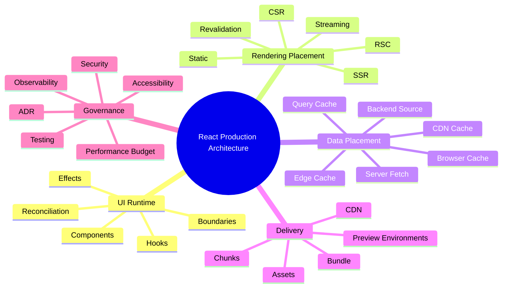

The goal of this part is to make you able to self-correct architectural decisions.

You should be able to look at a React system and say:

- "This does not need SSR."
- "This route should be static."
- "This dashboard is client-heavy, but the shell can be server-rendered."
- "This admin module should not be coupled to the public website framework."
- "This server component boundary is leaking browser-only assumptions."
- "This app chose Next.js, but is still architected like a single client bundle."
- "This Vite SPA is valid because the domain is authenticated, workflow-heavy, and not SEO-sensitive."

---

## 2. React Is Not the Whole Architecture

React lets us build UI from components. That is the base.

But a production frontend also needs:

| Concern | Typical Owner | React Solves It Alone? |
|---|---|---:|
| UI composition | React | Yes |
| render scheduling | React runtime | Mostly |
| routing | framework/router | No |
| data fetching | framework/query layer/API client | No |
| server rendering | framework/runtime | No |
| bundling | Vite/Next/Rspack/Rollup/etc. | No |
| deployment | platform/CDN/container | No |
| observability | tooling/platform | No |
| auth/session | app/platform/backend | No |
| authorization | backend/domain policy | No |
| accessibility | engineering discipline | Partly |
| performance | architecture + tooling | Partly |
| security | architecture + platform | Partly |

A top-level mental model:

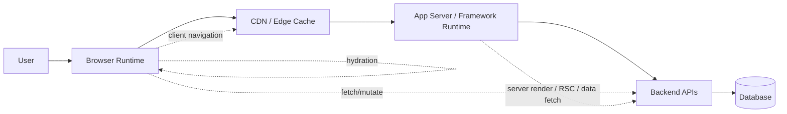

React lives mostly in the browser and server/framework render layer, but the system behavior is produced by the whole chain.

---

## 3. The Main Production Question

Every React route should answer:

> "What is the cheapest correct place to compute this UI?"

"Cheapest" does not mean cheapest infrastructure cost only.

It means cheapest across:

- latency
- CPU cost
- memory cost
- JavaScript shipped
- implementation complexity
- cacheability
- security exposure
- operational debugging
- correctness risk
- team capability

A public product page and a private regulatory case management console should not have the same architecture.

A product page needs SEO, fast first paint, cacheability, structured metadata, and stable URLs.

A case management console needs correctness, workflow state, action gating, auditability, optimistic/pessimistic command handling, realtime updates, and strong failure visibility.

---

## 4. Rendering Strategy Vocabulary

The biggest source of confusion in React architecture is mixing rendering terms.

Let's define the practical vocabulary.

---

## 4.1 CSR — Client-Side Rendering / SPA

In a pure SPA, the browser receives a minimal HTML shell and JavaScript bundle. React renders the app in the browser.

### Typical Flow

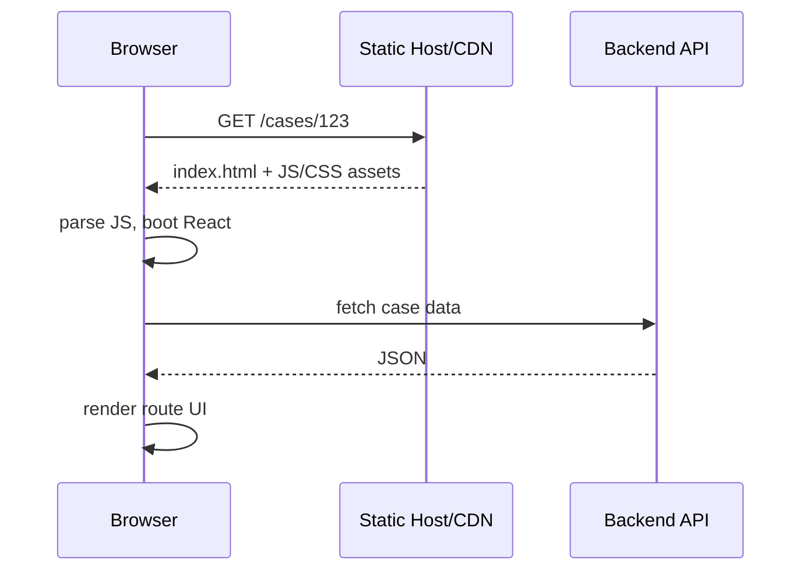

### Strengths

- simple deployment to static hosting
- great for authenticated internal apps
- clear separation between frontend and backend
- easy to use with Vite, React Router, TanStack Query, Zustand, Redux Toolkit
- easier runtime model than server-rendered frameworks
- fewer server rendering mismatch issues
- fewer framework-specific cache semantics

### Weaknesses

- slower first meaningful render on poor devices/networks
- SEO must be handled separately or may be weak
- initial JS cost can become high
- auth bootstrap can block app render
- direct URL access must be routed to `index.html`
- page metadata is harder to tailor per route without server support

### Best Fit

Use CSR SPA when:

- app is authenticated
- SEO is not important
- users return often
- app is interaction-heavy
- routes require complex client state
- backend APIs already exist
- static hosting/CDN simplicity matters
- team wants low framework complexity

### Bad Fit

Avoid pure CSR when:

- public content must rank in search
- first render matters for anonymous users
- content is cacheable and should be generated close to the server
- device/network conditions are poor
- marketing pages and transactional app are mixed without clear boundary

### Production Examples

Good CSR candidates:

- admin consoles
- internal workflow tools
- regulatory case management
- trading dashboards behind login
- monitoring consoles
- developer portals behind auth
- complex configuration UIs

Bad CSR candidates:

- public landing pages
- product catalogs
- news sites
- documentation sites needing crawlable content
- content-heavy public portals

---

## 4.2 SSR — Server-Side Rendering

SSR means the server renders HTML for a request. The browser receives HTML that can be displayed before all client-side JavaScript finishes loading.

### Typical Flow

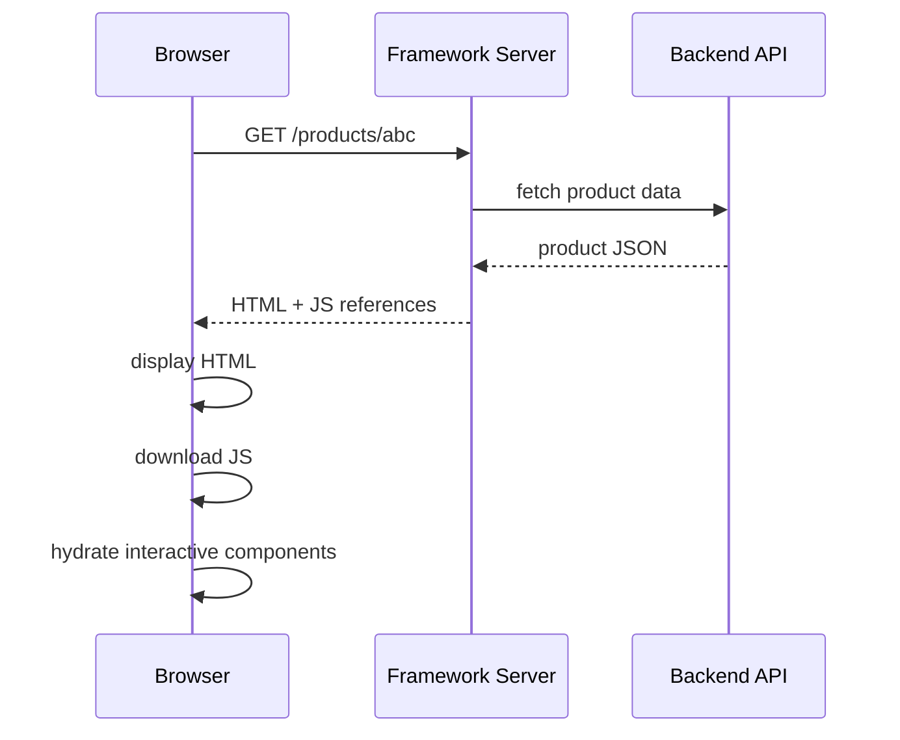

### Strengths

- better initial HTML for users and crawlers
- can improve perceived first load
- route-specific metadata is natural
- useful for dynamic pages
- can reduce blank-screen risk

### Weaknesses

- server runtime becomes part of frontend architecture
- hydration can be expensive
- data fetching may increase TTFB
- cache strategy becomes more complex
- browser-only code can break server render
- debugging spans browser and server
- server capacity matters

### Best Fit

Use SSR when:

- content is dynamic per request
- SEO matters
- first render matters
- metadata changes per route
- personalization exists but is not too expensive
- app has clear server runtime ownership

### Bad Fit

Avoid SSR when:

- all routes are behind login and heavily interactive
- content cannot be meaningfully rendered before client data loads
- server infrastructure maturity is low
- team cannot operate server rendering failures
- route mostly renders skeletons anyway

---

## 4.3 Streaming SSR

Streaming SSR sends HTML progressively instead of waiting for the entire page.

### Mental Model

You divide the page into boundaries. Fast parts are sent early. Slow parts stream later.

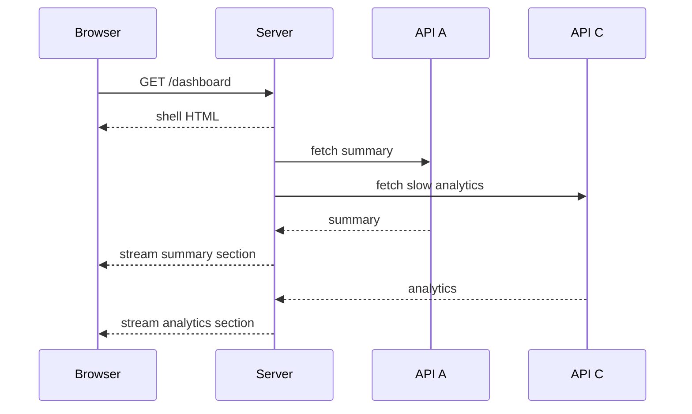

### Strengths

- better progressive rendering
- reduces all-or-nothing waiting
- works well with Suspense boundary design
- useful for mixed-latency pages

### Weaknesses

- boundary design becomes architecture
- loading states must be intentional
- partial failure handling matters
- monitoring must distinguish shell vs section latency
- careless streaming can create visual instability

### Good Fit

Use streaming when:

- page has independent sections
- data sources have different latency profiles
- user benefits from early partial content
- framework supports streaming well
- design system supports skeleton/fallback states

---

## 4.4 SSG — Static Site Generation

Static generation renders pages at build time.

### Strengths

- very fast at runtime
- CDN-friendly
- low server cost
- reliable for mostly-static content
- strong for docs, marketing, blogs, public information

### Weaknesses

- rebuild needed for changes unless paired with revalidation
- not ideal for highly personalized content
- build time can grow with page count
- runtime freshness needs explicit design

### Good Fit

Use SSG when:

- content changes slowly
- route count is manageable
- SEO matters
- pages are public
- CDN caching is valuable

---

## 4.5 ISR / Revalidation / Incremental Freshness

Different frameworks use different terms, but the production idea is:

> Generate or cache HTML/data, then refresh it according to a freshness policy.

### Decision Questions

- How stale may this route be?
- Who can tolerate stale data?
- What event invalidates the page?
- Is revalidation time-based or event-based?
- What happens when regeneration fails?
- Can users see old data during regeneration?
- Is stale content legally or operationally risky?

For regulatory/workflow systems, stale data can be dangerous. For marketing content, stale data may be acceptable for minutes or hours.

---

## 4.6 RSC — React Server Components

React Server Components are components that render ahead of time in a server environment separate from the client app or SSR server.

They change the architectural boundary.

Instead of asking:

> "Can the server produce HTML?"

You ask:

> "Which components never need to become client JavaScript?"

### RSC Mental Model

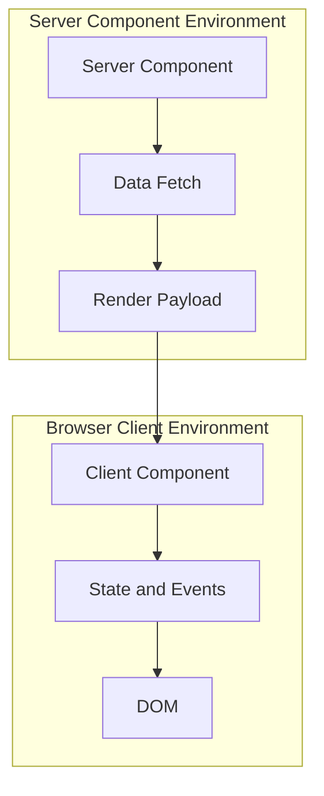

### Good Server Component Candidates

- data-reading components
- static layout fragments
- content sections
- components using server-only libraries
- components that do not need browser state/effects/events
- components that would otherwise ship heavy dependencies to the browser

### Good Client Component Candidates

- forms with live interaction
- buttons with event handlers
- drag and drop
- charts requiring browser APIs
- local stateful widgets
- effects/subscriptions
- focus management
- browser storage
- client-only telemetry wrappers

### Common RSC Mistake

The common mistake is adding `"use client"` at the top of large route files because one child needs interactivity.

That turns the whole subtree into client-rendered code.

Better architecture:

```tsx
// Server component
export default async function CasePage({ params }: Props) {
  const caseData = await getCase(params.caseId);

  return (
    <CasePageShell caseData={caseData}>
      <CaseActionPanel caseId={caseData.id} allowedActions={caseData.allowedActions} />
    </CasePageShell>
  );
}

// Client component
"use client";

export function CaseActionPanel({ caseId, allowedActions }: Props) {
  const [selectedAction, setSelectedAction] = useState<Action | null>(null);

  return (
    <ActionPicker
      caseId={caseId}
      actions={allowedActions}
      selectedAction={selectedAction}
      onSelect={setSelectedAction}
    />
  );
}
```

The server component owns data access and composition. The client component owns interaction.

---

## 5. Framework Landscape

There are many tools around React. The point is not to memorize brands. The point is to map responsibility.

---

## 5.1 Vite + React + Router

Vite is a modern build tool and dev server. A Vite React app is commonly used for SPA architecture.

### Production Shape

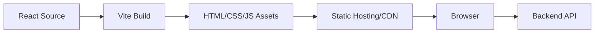

### Good Fit

- authenticated business apps
- dashboards
- internal tools
- micro-frontends
- embeddable widgets
- apps with existing backend APIs
- teams wanting explicit control over data/routing/state choices

### Watch Out

- SEO is not automatic
- route metadata needs special handling
- bundle discipline is your responsibility
- browser-only runtime can create slower first load
- app shell design matters

---

## 5.2 Next.js App Router

Next.js App Router uses filesystem routing and modern React features such as Server Components, Suspense, and Server Functions.

### Production Shape

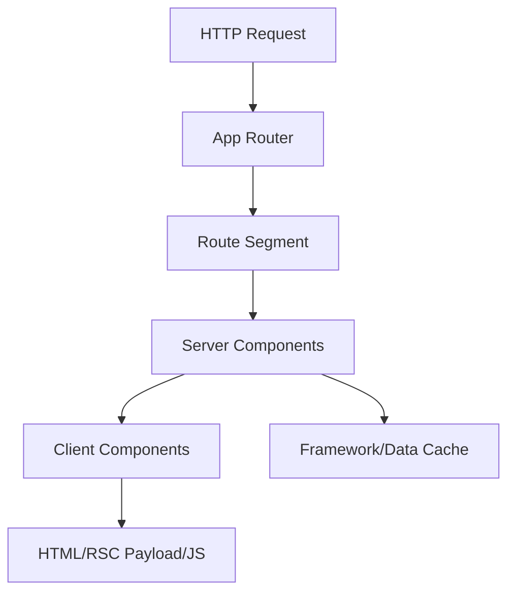

### Good Fit

- public + authenticated hybrid apps
- SEO-sensitive apps
- content + application mixed products
- teams needing server rendering and app framework conventions
- pages that benefit from static/dynamic/streaming segmentation
- route-level layouts and nested loading/error boundaries

### Watch Out

- caching semantics require discipline
- `"use client"` boundary mistakes are expensive
- server/client mental model is harder than SPA
- framework upgrades can affect architecture
- coupling to deployment platform may appear subtly
- server actions require security review

---

## 5.3 React Router Modes

Modern React Router can be used in multiple modes:

- Declarative mode
- Data mode
- Framework mode

The important architecture distinction:

| Mode | Primary Use |
|---|---|
| Declarative | classic client routing |
| Data | routes plus loaders/actions/pending states |
| Framework | more integrated routing, data, rendering conventions |

### Good Fit

Use React Router when:

- you want routing without adopting a full Next-style framework
- you need SPA or data-router architecture
- you want explicit route objects
- your app is authenticated/internal
- you want gradual complexity adoption

### Watch Out

- loaders/actions introduce data ownership decisions
- route modules become architecture boundaries
- route-level error handling must be designed
- mixing ad hoc fetches with loaders can create duplicate data paths

---

## 5.4 Other React Frameworks and Meta-Frameworks

You may encounter:

- Remix heritage through React Router framework mode
- Astro with React islands
- Gatsby for static/content-heavy sites
- TanStack Router/Start
- Rspack/Rsbuild-based setups
- custom SSR stacks

This series will stay focused on React production architecture rather than tool fandom.

The architectural question remains stable:

> What is rendered where, loaded when, cached how, invalidated by whom, and observed with what signal?

---

## 6. Decision Axes

A mature React architecture decision does not start from popularity. It starts from constraints.

---

## 6.1 Audience

| Audience | Typical Bias |
|---|---|
| anonymous public users | SSR/SSG/streaming/static |
| authenticated employees | SPA/data router |
| search crawlers | SSR/SSG |
| mobile web on weak devices | less JS, server/static rendering |
| power users | client-heavy interactivity |
| regulated users | auditability and correctness over trendiness |

---

## 6.2 Content Freshness

| Freshness Need | Suitable Strategy |
|---|---|
| changes yearly/monthly | SSG |
| changes daily/hourly | SSG + revalidation |
| changes per request | SSR |
| changes per user | SSR or CSR after auth |
| changes per interaction | CSR/server state |
| changes through workflow commands | client UI + backend authority |

---

## 6.3 Interactivity

| Interactivity Level | Suitable Strategy |
|---|---|
| static content | SSG |
| content plus simple forms | SSR/SSG + client islands |
| dashboard filters/charts | CSR or hybrid SSR |
| complex workflow | CSR/data router/hybrid |
| realtime collaboration | CSR-heavy with event ingestion |
| editor-like UI | client-heavy architecture |

---

## 6.4 SEO and Metadata

| SEO Need | Suitable Strategy |
|---|---|
| none | SPA |
| basic indexability | SSR/SSG |
| high SEO competition | SSG/SSR with metadata discipline |
| user-specific private routes | SEO irrelevant |
| documentation | SSG |
| public case/status lookup | SSR/SSG depending freshness |

---

## 6.5 Cacheability

Ask:

- Can this route be cached?
- Is the same response valid for many users?
- Does auth affect the HTML?
- Is data public, private, or permission-scoped?
- Can the CDN cache it safely?
- What invalidates it?
- Is stale data acceptable?

Cacheability often determines architecture more than React preference.

---

## 6.6 Failure Mode

A rendering strategy also defines how the app fails.

| Strategy | Failure Shape |
|---|---|
| SPA | blank screen, failed JS, API fetch failure |
| SSR | server error page, slow TTFB, hydration mismatch |
| SSG | stale page, broken build, missing generated route |
| Streaming | partial page, stuck boundary, inconsistent fallback |
| RSC | server/client boundary errors, serialization errors |
| Data router | loader/action failures, pending-state bugs |

Design for failure before choosing architecture.

---

## 7. Decision Matrix

Use this as a starting point, not a dogma.

| Scenario | Recommended Default | Why |
|---|---|---|
| Internal admin console | Vite SPA + React Router/Data Router | Fast iteration, auth-only, interaction-heavy |
| Public marketing site | SSG/SSR framework | SEO, metadata, CDN, fast first paint |
| E-commerce product page | SSR/SSG + revalidation | SEO + freshness + cacheability |
| Checkout flow | SSR shell + client transactional UI | reliability + interaction |
| Regulatory case management | SPA or hybrid app, strong API boundary | workflow correctness dominates SEO |
| Public case status lookup | SSR or SSG+revalidation | public URL + freshness constraints |
| Analytics dashboard | SPA/hybrid with server-state cache | client filters/charts, API-driven |
| Documentation portal | SSG | stable content, CDN-friendly |
| Realtime collaboration tool | client-heavy + event architecture | browser state and events dominate |
| Mixed public/private SaaS | Next.js App Router or split apps | public SEO + authenticated app complexity |

---

## 8. Split App vs One App

One of the most important architecture decisions is whether to build one frontend or multiple frontends.

### Bad Default

```text
One repo, one framework, one deployment, one routing tree, every route inside it forever.
```

This can work, but often becomes accidental monolith.

### Better Question

> "Do these surfaces share lifecycle, audience, security boundary, performance budget, and deployment cadence?"

### Split Candidate Matrix

| Surface | Split? | Reason |
|---|---:|---|
| marketing site vs admin console | often yes | different SEO/performance/auth needs |
| public docs vs SaaS app | often yes | docs can be static |
| customer portal vs internal ops | maybe | different roles and compliance |
| checkout vs catalog | maybe | failure isolation |
| design system package | yes | shared governed dependency |
| workflow module inside same app | not always | domain cohesion may matter more |

### Split Architecture

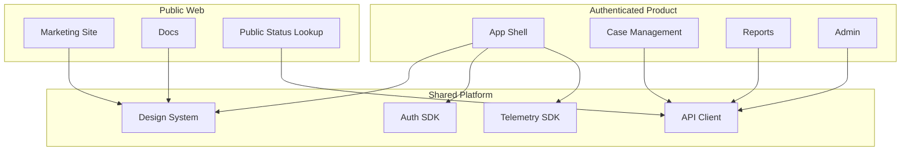

Do not split because of organizational politics. Split because boundaries differ.

---

## 9. Architecture Smells

### Smell 1 — Framework Chosen Before Constraints

```text
"We use Next.js because everyone does."
```

Better:

```text
"We use Next.js because this product combines public SEO-sensitive pages, authenticated dashboards, route-level layouts, and server-rendered content with clear caching policies."
```

### Smell 2 — SPA Used for Public Content Without Intent

If the page must be indexed, shared, previewed, and loaded quickly by anonymous users, a pure SPA may be the wrong default.

### Smell 3 — SSR Used but Still Fetches Everything After Hydration

If server-rendered HTML is mostly skeleton and all data is fetched after hydration, you may be paying SSR complexity without getting the benefit.

### Smell 4 — RSC Converted to Client Components Accidentally

A single interactive child should not force the entire route subtree into client JavaScript.

### Smell 5 — One Frontend for Incompatible Surfaces

A marketing site, docs, customer portal, and admin console have different constraints. One repo may be fine. One app runtime may not be.

### Smell 6 — No Cache Invalidation Story

Caching without invalidation policy is not architecture. It is a future incident.

### Smell 7 — No Failure Model

If the team cannot answer "what does the user see when this loader/API/stream/chunk fails?", the architecture is incomplete.

---

## 10. Production Decision Flow

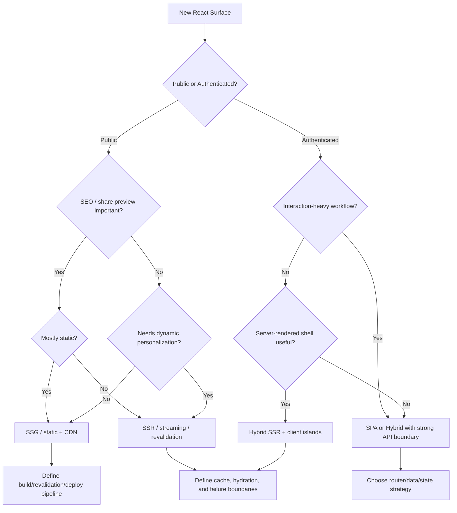

---

## 11. Architecture Records

Every non-trivial frontend architecture should produce an ADR.

### ADR Template

```md
# ADR: Rendering Strategy for <Surface>

## Status

Accepted / Proposed / Superseded

## Context

- audience:
- public/authenticated:
- SEO need:
- freshness:
- interactivity:
- data sensitivity:
- expected traffic:
- device/network assumptions:
- team constraints:

## Decision

We will use:

- rendering:
- router:
- data fetching:
- caching:
- deployment:
- observability:
- fallback strategy:

## Consequences

Positive:

- ...

Negative:

- ...

Risks:

- ...

Mitigations:

- ...

## Revisit Trigger

Revisit this decision if:

- traffic changes
- SEO requirements change
- latency budget is violated
- auth model changes
- framework support changes
- team operational maturity changes
```

An ADR prevents "architecture by memory".

---

## 12. Case Study — Regulatory Case Management Frontend

Assume you are building a regulatory enforcement lifecycle UI.

Characteristics:

- authenticated
- role-based
- workflow-heavy
- long-lived cases
- audit-sensitive
- action availability depends on case state
- complex filters/search
- large tables
- attachments
- comments
- escalation
- realtime-ish updates
- data freshness matters
- SEO irrelevant

### Bad Default

Use SSR everywhere because it is trendy.

### Better Default

Use either:

1. Vite SPA + React Router/Data Router + TanStack Query/RTK Query + strong API contracts, or
2. Hybrid framework with server-rendered shell and client-heavy workflow modules.

### Why

The system's hardest problem is not first public paint. It is correct workflow behavior.

Key architectural concerns:

- API contract
- permission-aware UI
- command idempotency
- optimistic vs pessimistic updates
- action-state consistency
- stale data handling
- observability for failed actions
- table virtualization
- form validation
- audit trace presentation
- resilient navigation

### Possible Architecture

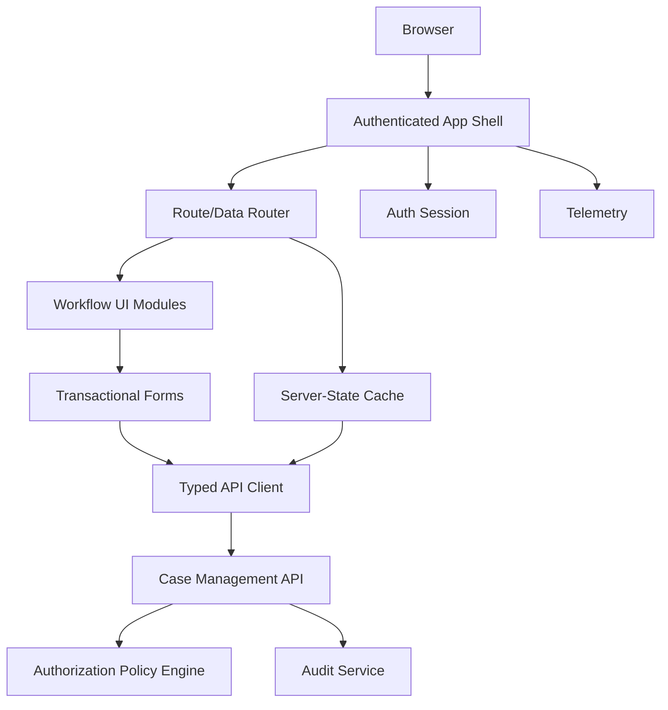

The key boundary is not "page vs component". It is "query vs command", "view vs action", "client affordance vs backend authority".

---

## 13. Case Study — Public Enforcement Decision Portal

Assume the same organization has a public page where citizens can search published enforcement decisions.

Characteristics:

- public
- SEO important
- shareable URLs
- maybe cacheable
- data freshness matters but perhaps not by the second
- filtering/search
- public metadata
- legal correctness matters

### Better Default

SSR or static generation with revalidation.

### Why

- public pages need stable URLs
- crawlers need meaningful content
- metadata should be route-specific
- many users can share cached content
- not all interactivity requires full SPA

### Possible Architecture

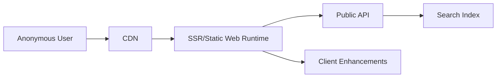

Same organization. Same React ecosystem. Different architecture.

That is the point.

---

## 14. Anti-Pattern Catalog

## 14.1 The Hype-Driven Framework

Symptom:

- framework selected before constraints
- team cannot explain rendering mode
- no cache policy
- no failure model
- no performance budget

Consequence:

- over-complex architecture
- slow delivery
- hidden operational cost

Corrective action:

- write an ADR
- classify routes by rendering need
- split incompatible surfaces
- remove unused framework features

---

## 14.2 The "Everything Is SPA" Default

Symptom:

- public pages are blank without JS
- metadata is generic
- social previews are wrong
- LCP is poor
- crawlers get thin content

Corrective action:

- move public content to SSG/SSR
- split marketing/docs from app
- make app shell explicit
- preserve SPA only where it fits

---

## 14.3 The "Everything Is SSR" Default

Symptom:

- authenticated app pays server cost for little benefit
- server render outputs skeletons
- all useful data loads after hydration
- server runtime becomes bottleneck

Corrective action:

- measure actual first content value
- move interaction-heavy modules to client
- use static/client architecture when SEO is irrelevant
- keep SSR for routes that benefit

---

## 14.4 The Accidental Client Boundary

Symptom:

- `"use client"` appears at the top of page/layout modules
- server data fetching moves into effects
- bundle grows
- RSC benefits disappear

Corrective action:

- isolate interactivity to leaf components
- pass serializable props
- keep server-only work server-side
- audit client bundle composition

---

## 14.5 The Cache Without Owner

Symptom:

- stale data incidents
- multiple caches disagree
- no invalidation trigger
- "refresh page" becomes support advice

Corrective action:

- document cache owner
- define freshness policy
- define invalidation events
- instrument cache hit/miss/staleness
- avoid caching sensitive personalized data unsafely

---

## 15. What Top Engineers Do Differently

A top frontend engineer does not ask:

> "Which framework is best?"

They ask:

- What is the user journey?
- What must be visible before JS?
- Which data is public/private?
- Which data can be stale?
- Which route is cacheable?
- Which route is mostly interaction?
- Which page is SEO-sensitive?
- What fails independently?
- What can be statically generated?
- What must run close to data?
- What must run in the browser?
- What must be observed?
- What must be reversible?

That is architecture.

---

## 16. Deliberate Practice

Take any existing React app and classify 10 routes.

For each route, fill this table:

| Route | Public/Auth | SEO | Freshness | Interactivity | Data Sensitivity | Recommended Rendering |
|---|---|---:|---|---|---|---|
| `/` | Public | High | Weekly | Low | Public | SSG |
| `/cases/:id` | Auth | None | Seconds/minutes | High | Private | SPA/Hybrid |
| `/decisions/:id` | Public | High | Daily/event | Medium | Public | SSR/SSG+revalidation |

Then write one ADR for the most ambiguous route.

---

## 17. Self-Correction Checklist

Before choosing an architecture, answer:

- [ ] Is the route public or authenticated?
- [ ] Does SEO matter?
- [ ] Does social preview matter?
- [ ] Can the content be cached?
- [ ] How fresh must the data be?
- [ ] Is stale data safe?
- [ ] How interactive is the route?
- [ ] What is the user device/network assumption?
- [ ] What happens before JavaScript loads?
- [ ] What happens if hydration fails?
- [ ] What happens if the API fails?
- [ ] What happens if a streamed section fails?
- [ ] What is the rollback strategy?
- [ ] Who owns cache invalidation?
- [ ] Who operates the server runtime?
- [ ] How will performance be measured?
- [ ] How will errors be observed?
- [ ] Is the chosen framework solving a real problem?

---

## 18. Production Heuristics

Use these as defaults, not laws.

1. Public content should usually not be pure CSR.
2. Authenticated workflow-heavy apps do not automatically need SSR.
3. Static generation is underrated for stable public content.
4. Server rendering is useful only if server-rendered content is meaningful.
5. Streaming helps only when boundaries map to real latency differences.
6. RSC helps when server/client boundaries are intentionally designed.
7. Framework features are liabilities unless you understand their failure modes.
8. Cache invalidation is part of the feature, not post-deployment cleanup.
9. Splitting apps is acceptable when surfaces have different constraints.
10. Architecture should be documented as decisions, not tribal knowledge.

---

## 19. Summary

React production architecture is about placing work correctly.

The main rendering choices are:

- CSR SPA
- SSR
- streaming SSR
- static generation
- revalidation
- React Server Components
- hybrid combinations

No strategy is universally superior.

The best architecture is the one whose constraints match:

- audience
- interactivity
- SEO
- freshness
- cacheability
- security
- failure model
- operational maturity
- team capability

In the next part, we move from app-level architecture to component-level architecture.

You will learn how to design component boundaries so a React codebase stays composable, testable, and evolvable instead of degenerating into page-sized scripts with JSX.

---

## 20. Source Anchors

Use these official docs as anchors for keeping this part current:

- React docs — React components and UI model: `https://react.dev/`
- React docs — Server Components: `https://react.dev/reference/rsc/server-components`
- Next.js docs — App Router: `https://nextjs.org/docs/app`
- Next.js docs — Server and Client Components: `https://nextjs.org/docs/app/getting-started/server-and-client-components`
- React Router docs — Picking a Mode: `https://reactrouter.com/start/modes`
- Vite docs — Guide and production build: `https://vite.dev/guide/`, `https://vite.dev/guide/build`
