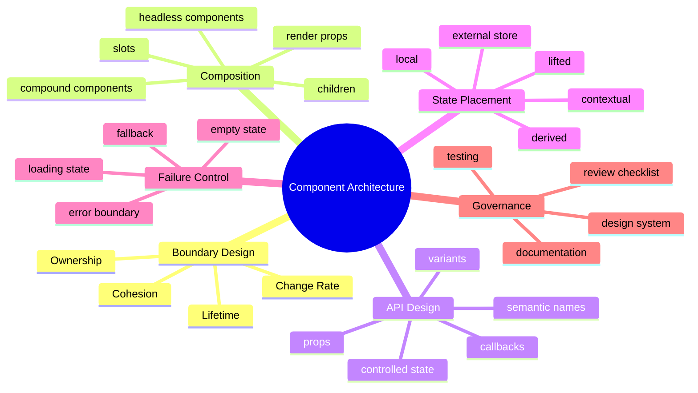
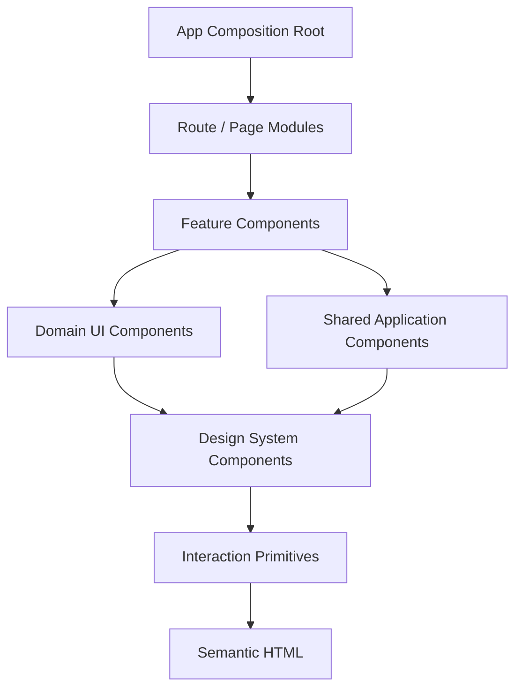
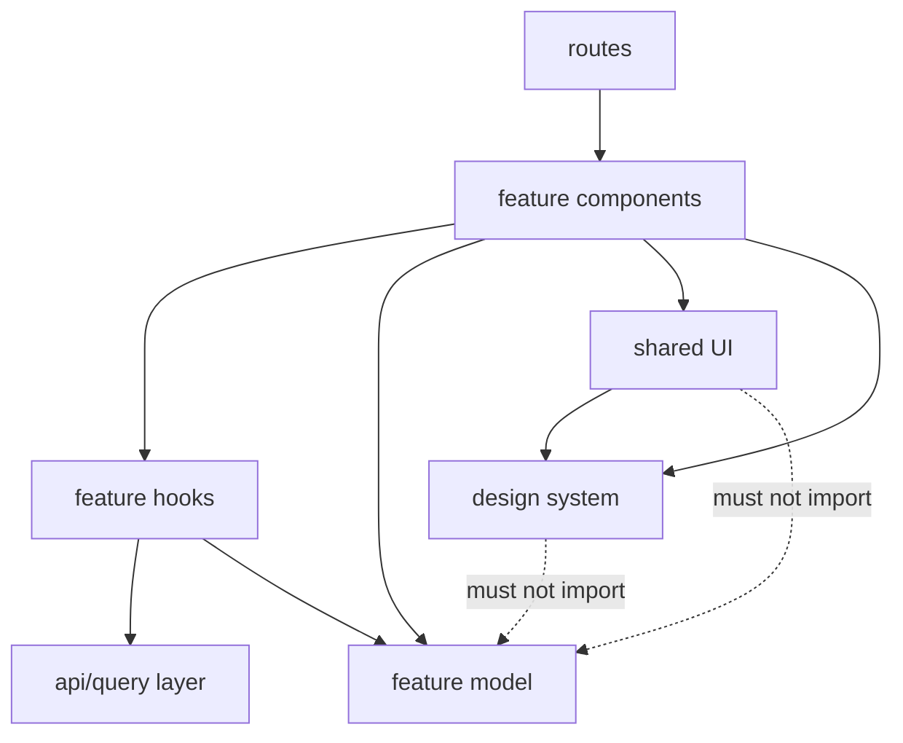
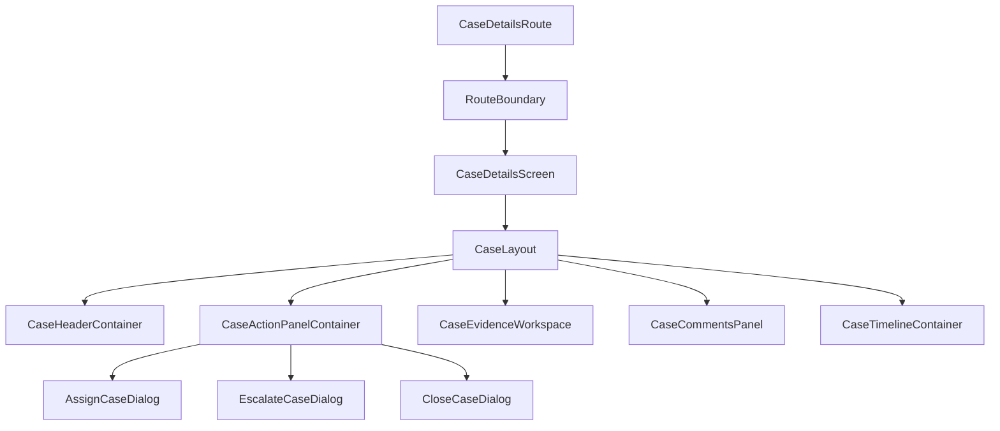

------
title: Learn Frontend React Production Architecture - Part 004
description: Component boundaries and composition architecture for production React: ownership, slots, compound components, headless components, API design, and anti-patterns.
series: learn-frontend-react-production-architecture
seriesTitle: Learn Frontend React Production Architecture
order: 4
partTitle: Component Boundaries and Composition Architecture
tags:
- react
- frontend
- components
- composition
- architecture
- patterns
- anti-patterns
- production
date: 2026-06-28
---

# Part 004 — Component Boundaries and Composition Architecture

## 0. Core Thesis

A React component is not just a reusable visual fragment.

In production architecture, a component boundary is also a boundary of:

- ownership
- state lifetime
- data dependency
- render cost
- test responsibility
- accessibility behavior
- error handling
- styling contract
- permission logic
- change frequency
- domain vocabulary

Weak React codebases fail because the component tree becomes an accidental mirror of the screen.

Strong React codebases survive because component boundaries encode intent.

---

## 1. Kaufman Frame

From Josh Kaufman's approach, we deconstruct component architecture into smaller sub-skills:



The goal of this part is to make you able to self-correct component design before the codebase becomes hard to change.

---

## 2. Component Boundary as Architecture Boundary

When a component is created, ask:

> "What decision does this component own?"

If the answer is only "it renders some divs", the boundary is probably weak.

A good component owns a coherent decision.

Examples:

| Component | Owns |
|---|---|
| `CaseStatusBadge` | visual representation of case status |
| `CaseActionPanel` | available user actions for a case |
| `CaseTimeline` | chronological event presentation |
| `PermissionGate` | conditional rendering based on permission result |
| `DataTable` | table interaction contract |
| `Dialog` | modal accessibility behavior |
| `FormField` | label, error, hint, input association |
| `PageShell` | global layout and navigation structure |
| `QueryBoundary` | loading/error/empty handling around server state |
| `WorkflowStepIndicator` | workflow progress presentation |

Bad boundary:

```tsx
function CasePage() {
  // 700 lines of state, effects, fetches, table rendering,
  // action buttons, modals, permissions, comments, attachments,
  // validation, and error handling.
}
```

Good boundary:

```tsx
export function CasePage() {
  return (
    <CasePageBoundary>
      <CaseHeader />
      <CaseWorkflowSummary />
      <CaseActionPanel />
      <CaseEvidenceTabs />
      <CaseTimeline />
    </CasePageBoundary>
  );
}
```

The second version is not automatically better. It is better only if each child owns a real decision and has a clean contract.

---

## 3. React's Native Bias: Composition

React code reuse is achieved primarily through composition, not inheritance.

That matters architecturally.

Composition means:

- parent chooses arrangement
- child owns behavior/detail
- data flows explicitly
- behavior can be passed as callbacks
- reusable structures can wrap arbitrary children

Inheritance-style thinking often leads to rigid hierarchies:

```tsx
class BaseTable {}
class CaseTable extends BaseTable {}
class EnforcementCaseTable extends CaseTable {}
class EscalatedEnforcementCaseTable extends EnforcementCaseTable {}
```

Composition thinking leads to smaller contracts:

```tsx
<DataTable
  rows={cases}
  columns={caseColumns}
  getRowId={(row) => row.id}
  onRowClick={(row) => navigate(`/cases/${row.id}`)}
/>
```

The production question is not "how do I reuse code?"

The better question is:

> "Which decisions should be fixed by the component and which decisions should be supplied by the caller?"

---

## 4. Component Layering Model

A production React app benefits from explicit component layers.



### Layer Definitions

| Layer | Example | Responsibility |
|---|---|---|
| App composition root | `App`, providers | bootstrapping, providers, global shell |
| Route/page module | `CaseDetailsRoute` | URL-level composition |
| Feature component | `CaseEvidencePanel` | feature-specific orchestration |
| Domain UI component | `CaseStatusBadge` | domain concept visualization |
| Shared app component | `QueryBoundary` | app-wide pattern |
| Design system component | `Button`, `Dialog` | reusable UI contract |
| Primitive | `FocusTrap`, `RovingList` | low-level behavior |
| HTML | `button`, `form`, `fieldset` | semantic platform base |

A frequent architecture bug is letting upper layers leak downward.

Bad:

```tsx
<Button caseStatus="UNDER_REVIEW" enforcementRole="SUPERVISOR" />
```

A design system button should not know enforcement workflow.

Better:

```tsx
const canEscalate = allowedActions.includes("ESCALATE");

<Button disabled={!canEscalate}>
  Escalate Case
</Button>
```

Even better, if action rules are recurring:

```tsx
<CaseActionButton action="ESCALATE" caseId={caseId} />
```

Here `CaseActionButton` is a domain component. `Button` remains generic.

---

## 5. Smart vs Dumb Components: Useful but Incomplete

You may hear:

- smart/container components
- dumb/presentational components

This distinction is sometimes useful, but dangerous when treated as law.

### Why It Helps

It separates:

- data loading
- orchestration
- presentation

Example:

```tsx
function CaseHeaderContainer({ caseId }: Props) {
  const caseQuery = useCase(caseId);

  return (
    <QueryBoundary query={caseQuery}>
      {(caseData) => <CaseHeader caseData={caseData} />}
    </QueryBoundary>
  );
}
```

### Why It Fails

Real production components often own a mix of:

- presentation
- local interaction
- accessibility
- formatting
- controlled/uncontrolled behavior

A dialog component is "dumb" about domain data but "smart" about focus management.

A table component may be domain-agnostic but behavior-heavy.

Better taxonomy:

| Type | Owns |
|---|---|
| Presentational | visual mapping |
| Container | data and orchestration |
| Headless | behavior without visual style |
| Primitive | accessibility/platform behavior |
| Domain | business vocabulary |
| Layout | spatial arrangement |
| Boundary | loading/error/permission behavior |
| Feature | use-case-level composition |

Use the type that matches the decision.

---

## 6. State Ownership and Component Boundaries

React component architecture is inseparable from state ownership.

A component should own state when:

- the state is private to its interaction
- no sibling needs it
- no URL should preserve it
- no server should persist it
- no parent needs to coordinate it
- the state lifetime matches the component lifetime

Example:

```tsx
function ExpandableSection({ title, children }: Props) {
  const [expanded, setExpanded] = useState(false);

  return (
    <section>
      <button onClick={() => setExpanded((value) => !value)}>
        {title}
      </button>

      {expanded ? children : null}
    </section>
  );
}
```

This is good local ownership.

But this is suspicious:

```tsx
function CaseActionButton({ caseId }: Props) {
  const [caseStatus, setCaseStatus] = useState("UNDER_REVIEW");
  const [allowedActions, setAllowedActions] = useState<string[]>([]);
}
```

A button should not own case workflow state. It may display or trigger an action, but the server/domain model owns the truth.

---

## 7. The Boundary Questions

Before extracting a component, ask:

1. Does this component represent a real concept?
2. Who owns its data?
3. Who owns its state?
4. Who owns its side effects?
5. What should be configurable?
6. What should not be configurable?
7. Is it domain-specific or generic?
8. Is it reusable now or just extracted for readability?
9. Can it be tested independently?
10. Can it fail independently?
11. Does it need accessibility behavior?
12. Does it have a stable API?
13. Will the caller understand the props without reading internals?

If you cannot answer these, extraction may create fragmentation rather than architecture.

---

## 8. Prop Design

Props are a component's public API.

Treat them like method signatures in a backend service.

### 8.1 Prefer Semantic Props

Bad:

```tsx
<Badge color="yellow" />
```

Better for domain UI:

```tsx
<CaseStatusBadge status="UNDER_REVIEW" />
```

Why?

`yellow` is a rendering detail. `UNDER_REVIEW` is domain meaning.

For design system UI, `color` or `variant` can be appropriate:

```tsx
<Badge variant="warning">Under Review</Badge>
```

The right API depends on layer.

---

### 8.2 Avoid Boolean Flag Explosion

Bad:

```tsx
<Button
  primary
  secondary={false}
  danger
  loading
  small
  rounded
  iconOnly
/>
```

This creates impossible combinations.

Better:

```tsx
<Button variant="danger" size="sm" isLoading iconOnly />
```

Even better for constrained domain action:

```tsx
<CaseActionButton action="CLOSE_CASE" state="submitting" />
```

### Boolean Matrix Smell

If a component has many boolean props, ask:

- Are these mutually exclusive variants?
- Should this be a state machine?
- Should this be multiple components?
- Should the caller provide composition instead?

---

### 8.3 Prefer Explicit Event Names

Bad:

```tsx
<CaseActionPanel onClick={handleAction} />
```

Better:

```tsx
<CaseActionPanel onActionRequested={handleActionRequested} />
```

Best when the action domain matters:

```tsx
<CaseActionPanel
  onEscalateRequested={handleEscalate}
  onCloseRequested={handleClose}
  onAssignRequested={handleAssign}
/>
```

Generic events are fine for generic components. Domain components should speak domain language.

---

### 8.4 Separate Value and Event

For controlled components, prefer the standard pattern:

```tsx
type AssigneeSelectProps = {
  value: UserId | null;
  onChange: (nextValue: UserId | null) => void;
  options: UserOption[];
};
```

Avoid hidden internal state when the parent must coordinate selection.

---

### 8.5 Avoid Props That Leak Internals

Bad:

```tsx
<DataTable
  internalSelectionMap={selectionMap}
  updateInternalSelectionMap={setSelectionMap}
/>
```

Better:

```tsx
<DataTable
  selectedRowIds={selectedRowIds}
  onSelectedRowIdsChange={setSelectedRowIds}
/>
```

The caller should not know internal representation.

---

## 9. Composition Patterns

## 9.1 Basic `children`

Use `children` when a component owns structure around arbitrary content.

```tsx
function Card({ title, children }: PropsWithChildren<{ title: string }>) {
  return (
    <section className="card">
      <h2>{title}</h2>
      <div>{children}</div>
    </section>
  );
}
```

Usage:

```tsx
<Card title="Case Summary">
  <CaseSummary caseId={caseId} />
</Card>
```

Good for:

- layout wrappers
- panels
- cards
- sections
- shells
- providers
- boundaries

Bad for:

- deeply structured component APIs where specific regions matter

---

## 9.2 Named Slots

React has no special slot syntax, but props can model named slots.

```tsx
type PageLayoutProps = {
  header: ReactNode;
  sidebar?: ReactNode;
  actions?: ReactNode;
  children: ReactNode;
};

function PageLayout({ header, sidebar, actions, children }: PageLayoutProps) {
  return (
    <div className="page-layout">
      <header>{header}</header>
      {sidebar ? <aside>{sidebar}</aside> : null}
      <main>{children}</main>
      {actions ? <div className="page-actions">{actions}</div> : null}
    </div>
  );
}
```

Usage:

```tsx
<PageLayout
  header={<CaseHeader caseId={caseId} />}
  sidebar={<CaseNavigation caseId={caseId} />}
  actions={<CaseActionPanel caseId={caseId} />}
>
  <CaseEvidenceTabs caseId={caseId} />
</PageLayout>
```

Good for:

- page shells
- dialogs
- cards with actions
- complex layout

Risk:

- too many slots can become a layout DSL
- slot content may bypass intended accessibility structure

---

## 9.3 Compound Components

Compound components are useful when multiple subcomponents share an implicit parent context.

Example:

```tsx
<Tabs defaultValue="overview">
  <Tabs.List>
    <Tabs.Trigger value="overview">Overview</Tabs.Trigger>
    <Tabs.Trigger value="evidence">Evidence</Tabs.Trigger>
    <Tabs.Trigger value="timeline">Timeline</Tabs.Trigger>
  </Tabs.List>

  <Tabs.Panel value="overview">
    <CaseOverview />
  </Tabs.Panel>

  <Tabs.Panel value="evidence">
    <CaseEvidence />
  </Tabs.Panel>

  <Tabs.Panel value="timeline">
    <CaseTimeline />
  </Tabs.Panel>
</Tabs>
```

### Why It Works

The API expresses structure.

`Tabs` owns:

- selected tab state
- keyboard interaction
- ARIA relationships
- panel visibility

The caller owns:

- tab labels
- panel content
- default/controlled selection

### Risk

Compound components often use context internally. Overuse can make behavior implicit.

Use them when child components are meaningful only within the parent.

Good candidates:

- tabs
- menus
- accordions
- select/combobox
- data table sections
- wizard steps

Bad candidates:

- arbitrary domain flows where explicit props are clearer

---

## 9.4 Render Props

Render props pass a rendering function as a prop.

```tsx
<QueryBoundary query={caseQuery}>
  {(caseData) => (
    <CaseHeader caseData={caseData} />
  )}
</QueryBoundary>
```

This is useful when the wrapper owns state or lifecycle but caller owns rendering.

Another example:

```tsx
<PermissionCheck permission="case:escalate">
  {({ allowed }) => (
    <Button disabled={!allowed}>
      Escalate
    </Button>
  )}
</PermissionCheck>
```

### Strengths

- explicit data flow
- flexible rendering
- useful for boundaries
- good for cross-cutting concerns

### Weaknesses

- nested render props hurt readability
- can create unnecessary inline functions
- TypeScript inference can become noisy

Use sparingly and intentionally.

---

## 9.5 Headless Components

A headless component owns behavior but not visual styling.

Example shape:

```tsx
function useDisclosure(defaultOpen = false) {
  const [open, setOpen] = useState(defaultOpen);

  return {
    open,
    openDialog: () => setOpen(true),
    closeDialog: () => setOpen(false),
    toggleDialog: () => setOpen((value) => !value),
  };
}
```

Usage:

```tsx
function AssignCaseButton({ caseId }: Props) {
  const disclosure = useDisclosure();

  return (
    <>
      <Button onClick={disclosure.openDialog}>
        Assign Case
      </Button>

      {disclosure.open ? (
        <AssignCaseDialog
          caseId={caseId}
          onClose={disclosure.closeDialog}
        />
      ) : null}
    </>
  );
}
```

More advanced headless components may manage:

- keyboard navigation
- focus
- ARIA attributes
- open/close state
- selected item
- active descendant

### Good Fit

Use headless patterns when:

- behavior is reusable
- visual design varies
- accessibility is complex
- component consumers need layout control

### Bad Fit

Avoid headless abstractions when:

- behavior is simple
- styling and structure should be fixed
- the abstraction leaks too many internals
- users of the component must understand implementation details

---

## 10. Controlled vs Uncontrolled Components

A component is controlled when parent owns its state.

```tsx
<Dialog open={isOpen} onOpenChange={setIsOpen} />
```

It is uncontrolled when component owns its own state.

```tsx
<Dialog defaultOpen />
```

A robust reusable component may support both:

```tsx
type DialogProps = {
  open?: boolean;
  defaultOpen?: boolean;
  onOpenChange?: (open: boolean) => void;
  children: ReactNode;
};
```

### Controlled Mode

Use when:

- parent coordinates multiple components
- URL must reflect state
- form state owns value
- workflow logic depends on state
- test setup needs deterministic control

### Uncontrolled Mode

Use when:

- state is purely local
- parent does not care
- simpler usage matters
- component is isolated

### Anti-Pattern

Do not switch between controlled and uncontrolled accidentally.

Bad:

```tsx
<Dialog open={maybeUndefined} />
```

If `maybeUndefined` changes from `undefined` to `true`, behavior becomes confusing.

Better:

```tsx
<Dialog open={isDialogOpen} onOpenChange={setIsDialogOpen} />
```

or:

```tsx
<Dialog defaultOpen={false} />
```

---

## 11. Component API Design Checklist

A production component API should be:

- explicit
- stable
- small
- semantic
- type-safe
- difficult to misuse
- accessible by default
- composable
- observable when needed
- testable

### Example: Weak API

```tsx
<CaseCard
  data={caseData}
  type="full"
  showButtons
  showMeta
  button1
  button2
  button3
  callback={doThing}
/>
```

Problems:

- vague `data`
- vague `type`
- boolean flags
- unclear button meaning
- unclear callback meaning
- component owns too many decisions

### Better API

```tsx
<CaseCard
  caseSummary={caseSummary}
  metadata={<CaseMetadata caseSummary={caseSummary} />}
  actions={<CaseActionList caseId={caseSummary.id} />}
/>
```

Here `CaseCard` owns layout. Metadata and actions are composed.

### Alternative Domain API

```tsx
<CaseSummaryCard
  caseSummary={caseSummary}
  allowedActions={allowedActions}
  onActionRequested={handleActionRequested}
/>
```

This is also valid if `CaseSummaryCard` intentionally owns domain presentation and action placement.

There is no universal right answer. The correct API depends on ownership.

---

## 12. Data Dependency Boundaries

A component may receive data or load data itself.

### Option A — Parent Loads, Child Receives

```tsx
function CasePage({ caseId }: Props) {
  const caseQuery = useCase(caseId);

  return (
    <QueryBoundary query={caseQuery}>
      {(caseData) => <CaseHeader caseData={caseData} />}
    </QueryBoundary>
  );
}
```

Good when:

- multiple children need the same data
- route owns data loading
- server rendering loads data at route boundary
- you want fewer duplicate queries

Risk:

- prop drilling
- parent becomes orchestration-heavy

---

### Option B — Child Loads Its Own Data

```tsx
function CaseHeader({ caseId }: Props) {
  const caseQuery = useCase(caseId);

  return (
    <QueryBoundary query={caseQuery}>
      {(caseData) => <CaseHeaderView caseData={caseData} />}
    </QueryBoundary>
  );
}
```

Good when:

- component is independently reusable
- data is isolated
- route does not need data
- query cache deduplicates requests

Risk:

- hidden waterfalls
- too many loading states
- harder server rendering
- implicit data dependency

---

### Option C — Split Container and View

```tsx
function CaseHeaderContainer({ caseId }: Props) {
  const caseQuery = useCase(caseId);

  return (
    <QueryBoundary query={caseQuery}>
      {(caseData) => <CaseHeaderView caseData={caseData} />}
    </QueryBoundary>
  );
}

function CaseHeaderView({ caseData }: { caseData: CaseSummary }) {
  return (
    <header>
      <h1>{caseData.referenceNumber}</h1>
      <CaseStatusBadge status={caseData.status} />
    </header>
  );
}
```

Good when:

- you want testable pure view
- data loading is replaceable
- storybook examples matter
- server/client boundary needs control

This is often the best production compromise.

---

## 13. Page Components Should Compose, Not Implement Everything

A route/page component should normally:

- read route params
- define high-level layout
- connect feature modules
- provide route-level boundaries
- declare loading/error behavior

It should not contain:

- every form field
- table cell rendering logic
- modal internals
- permission algorithms
- workflow transition mapping
- fetch implementation details
- reusable formatting logic

Bad:

```tsx
export function CaseDetailsRoute() {
  // route params
  // 8 queries
  // 13 useState calls
  // 4 useEffect calls
  // table column definitions inline
  // modals inline
  // validation inline
  // permission logic inline
  // action mutation logic inline
  // JSX with 500 lines
}
```

Better:

```tsx
export function CaseDetailsRoute() {
  const { caseId } = useParams();

  return (
    <RouteBoundary>
      <CaseDetailsScreen caseId={caseId} />
    </RouteBoundary>
  );
}

function CaseDetailsScreen({ caseId }: { caseId: CaseId }) {
  return (
    <CaseLayout
      header={<CaseHeaderContainer caseId={caseId} />}
      actions={<CaseActionPanelContainer caseId={caseId} />}
      sidebar={<CaseNavigation caseId={caseId} />}
    >
      <CaseEvidenceWorkspace caseId={caseId} />
      <CaseTimelineContainer caseId={caseId} />
    </CaseLayout>
  );
}
```

The route remains legible.

---

## 14. Feature Module Organization

A component boundary is supported by file boundaries.

Example:

```text
src/
  features/
    cases/
      routes/
        CaseDetailsRoute.tsx
        CaseSearchRoute.tsx
      components/
        CaseHeader/
          CaseHeaderContainer.tsx
          CaseHeaderView.tsx
          CaseHeader.test.tsx
          CaseHeader.stories.tsx
        CaseStatusBadge/
          CaseStatusBadge.tsx
          CaseStatusBadge.test.tsx
        CaseActionPanel/
          CaseActionPanelContainer.tsx
          CaseActionPanelView.tsx
          caseActionPanel.types.ts
      api/
        caseApi.ts
        caseQueries.ts
        caseMutations.ts
      model/
        caseStatus.ts
        caseActions.ts
        casePermissions.ts
      hooks/
        useCaseActionCommand.ts
```

Rules:

- `routes` compose feature screens.
- `components` render feature UI.
- `api` owns backend integration.
- `model` owns domain mapping and state transitions.
- `hooks` own reusable feature behavior.
- generic UI does not import feature domain code.

### Dependency Direction



A design system importing `caseStatus.ts` is a boundary violation.

---

## 15. Domain Components vs Generic Components

### Domain Component

```tsx
<CaseStatusBadge status="UNDER_REVIEW" />
```

Owns:

- case status vocabulary
- mapping status to label
- mapping status to variant
- maybe tooltip/help text

### Generic Component

```tsx
<Badge variant="warning">Under Review</Badge>
```

Owns:

- visual badge behavior
- style variants
- accessibility baseline

### Relationship

```tsx
function CaseStatusBadge({ status }: { status: CaseStatus }) {
  const badge = mapCaseStatusToBadge(status);

  return (
    <Badge variant={badge.variant}>
      {badge.label}
    </Badge>
  );
}
```

This is clean layering.

---

## 16. Boundary Components

Boundary components encode cross-cutting states.

Examples:

- `QueryBoundary`
- `PermissionBoundary`
- `ErrorBoundary`
- `EmptyStateBoundary`
- `FeatureFlagBoundary`
- `SuspenseBoundary`
- `AuthBoundary`

### Example

```tsx
function CaseWorkspace({ caseId }: Props) {
  const query = useCaseWorkspace(caseId);

  return (
    <QueryBoundary
      query={query}
      loading={<CaseWorkspaceSkeleton />}
      error={(error) => <CaseWorkspaceError error={error} />}
      empty={(data) => data.sections.length === 0}
      emptyFallback={<EmptyCaseWorkspace />}
    >
      {(workspace) => <CaseWorkspaceView workspace={workspace} />}
    </QueryBoundary>
  );
}
```

Boundary components reduce repetition, but they must not hide important failure semantics.

Bad boundary:

```tsx
<QueryBoundary query={query}>
  <CaseWorkspace />
</QueryBoundary>
```

If it always renders the same generic spinner/error for every query, it may harm UX.

Good boundary:

- allows feature-specific loading
- allows feature-specific error copy
- supports retry
- exposes enough information for observability
- does not swallow errors silently

---

## 17. Accessibility as Boundary Responsibility

Components that implement interaction must own accessibility behavior.

A `Dialog` owns:

- focus trap
- initial focus
- Escape key
- restore focus
- `aria-modal`
- labelled title
- scroll locking
- background inertness or equivalent behavior

A `Tabs` component owns:

- tablist semantics
- tab semantics
- panel relationships
- arrow key navigation
- selected state
- focus movement

A `Button` owns:

- native button semantics
- disabled behavior
- loading state semantics

Do not push accessibility responsibility to every caller.

Bad:

```tsx
<div onClick={onSubmit}>Submit</div>
```

Better:

```tsx
<button type="submit">Submit</button>
```

For design systems, accessibility is not a checklist. It is part of the component contract.

---

## 18. Performance Boundary

Every component has render cost.

A component boundary can help performance when:

- it limits state updates
- it isolates expensive rendering
- it enables memoization
- it supports virtualization
- it permits lazy loading
- it avoids rerendering large subtrees

But extraction alone does not improve performance.

Bad assumption:

> "Splitting into more components makes React faster."

Not necessarily.

Performance improves when state and props boundaries reduce unnecessary work.

Example smell:

```tsx
function DashboardPage() {
  const [searchText, setSearchText] = useState("");

  return (
    <>
      <SearchBox value={searchText} onChange={setSearchText} />
      <VeryExpensiveChart />
      <LargeTable />
      <AuditTimeline />
    </>
  );
}
```

Every keystroke rerenders the whole page.

Better:

```tsx
function DashboardPage() {
  return (
    <>
      <DashboardSearch />
      <DashboardMetrics />
      <DashboardTable />
      <AuditTimeline />
    </>
  );
}
```

If `DashboardSearch` owns local search draft state and commits filters intentionally, expensive siblings avoid keystroke churn.

The boundary is useful because state moved.

---

## 19. Anti-Pattern Catalog

## 19.1 Prop Explosion

Symptom:

```tsx
<UserCard
  showAvatar
  showEmail
  showRole
  showDepartment
  showLastLogin
  showActions
  compact
  highlight
  withBorder
  withShadow
/>
```

Problem:

- too many variants
- unclear ownership
- hard to test combinations
- caller controls internals

Fix:

- split components
- use slots
- use variant objects
- create domain-specific versions

```tsx
<UserSummaryCard user={user} actions={<UserActions userId={user.id} />} />
```

---

## 19.2 Mega Component

Symptom:

- 300+ lines
- many unrelated states
- many effects
- inline tables/forms/modals
- hard to name
- hard to test

Fix:

- identify decisions
- extract boundary components
- split container/view
- isolate mutations
- extract domain mapping
- move repeated UI to design system/shared layer

---

## 19.3 Fake Reusability

Symptom:

```tsx
<UniversalCard type="case" mode="review" section="evidence" />
```

Problem:

- one component becomes a mini framework
- many optional props
- internal branching explosion
- hard to reason about

Fix:

- prefer composition
- create focused components
- share primitives, not business branching

---

## 19.4 Domain Leakage into Design System

Symptom:

```tsx
<Button enforcementAction="ESCALATE" />
```

Problem:

- generic component depends on domain
- design system cannot be reused
- release coupling increases

Fix:

```tsx
<CaseEscalateButton>
  <Button variant="warning">Escalate</Button>
</CaseEscalateButton>
```

or:

```tsx
<CaseActionButton action="ESCALATE" />
```

with internal composition.

---

## 19.5 Hidden Side Effects in UI Components

Symptom:

```tsx
<CaseStatusBadge status={status} caseId={caseId} />
```

and inside it:

```tsx
useEffect(() => {
  auditViewedStatus(caseId);
}, [caseId]);
```

Problem:

- display component triggers domain side effect
- impossible to reason about usage
- repeated rendering can trigger unintended events

Fix:

- move side effect to explicit boundary
- name the behavior honestly

```tsx
<CaseStatusViewedTracker caseId={caseId}>
  <CaseStatusBadge status={status} />
</CaseStatusViewedTracker>
```

Even then, be careful. Telemetry should usually be centralized.

---

## 19.6 Over-Abstracted Layout

Symptom:

```tsx
<Flex
  direction="row"
  gap="lg"
  align="center"
  justify="between"
  desktopDirection="column"
  tabletGap="md"
  mobileHidden={false}
/>
```

Not always wrong, but often turns JSX into layout prop soup.

Fix:

- use semantic layout components
- use CSS where appropriate
- create domain layout only when meaningful

```tsx
<CasePageLayout
  header={...}
  sidebar={...}
  actions={...}
/>
```

---

## 19.7 Context as Invisible Props

Symptom:

- component reads many contexts
- dependencies invisible at call site
- hard to reuse/test
- provider ordering matters

Fix:

- use context for stable ambient dependencies
- pass domain data explicitly when local
- create provider near true ownership
- document required providers

Good context candidates:

- theme
- locale
- auth session
- feature flags
- router
- design system config

Suspicious context candidates:

- current form field value
- selected row in one table
- current modal's temporary state
- one page's filter draft

---

## 20. Refactoring Playbook

When you find a large React component, do not extract randomly.

Use this sequence.

### Step 1 — Mark Responsibilities

Identify:

- data fetching
- local state
- derived state
- effects
- event handlers
- domain mapping
- layout
- presentational fragments
- boundary states
- accessibility behavior

### Step 2 — Extract Pure Domain Mapping

Before extracting JSX, extract domain logic.

```ts
export function getCaseStatusBadge(status: CaseStatus): BadgeDescriptor {
  switch (status) {
    case "UNDER_REVIEW":
      return { label: "Under Review", variant: "warning" };
    case "CLOSED":
      return { label: "Closed", variant: "neutral" };
    case "ESCALATED":
      return { label: "Escalated", variant: "danger" };
  }
}
```

### Step 3 — Extract View Components

```tsx
function CaseStatusBadge({ status }: { status: CaseStatus }) {
  const badge = getCaseStatusBadge(status);

  return <Badge variant={badge.variant}>{badge.label}</Badge>;
}
```

### Step 4 — Extract Boundary Components

```tsx
function CaseTimelineContainer({ caseId }: Props) {
  const timelineQuery = useCaseTimeline(caseId);

  return (
    <QueryBoundary query={timelineQuery}>
      {(events) => <CaseTimeline events={events} />}
    </QueryBoundary>
  );
}
```

### Step 5 — Move State Down or Up Intentionally

- move state down when only one child needs it
- lift state up when siblings must coordinate
- move state to URL when navigation/share/back-forward matters
- move state to server state cache when it comes from backend
- move state to external store only when lifetime and ownership justify it

### Step 6 — Add Tests/Stories Around New Boundaries

Do not refactor without a safety net.

---

## 21. Component Review Checklist

Use this in pull requests.

- [ ] Does the component have one clear responsibility?
- [ ] Is the name domain-accurate?
- [ ] Are props semantic and minimal?
- [ ] Are invalid prop combinations prevented?
- [ ] Is state owned at the correct level?
- [ ] Are side effects explicit and necessary?
- [ ] Is accessibility handled inside the component when relevant?
- [ ] Is the component generic or domain-specific by design?
- [ ] Does it avoid importing from the wrong layer?
- [ ] Are loading/error/empty states represented?
- [ ] Can it be tested without excessive setup?
- [ ] Can it be documented in Storybook if reusable?
- [ ] Does it avoid prop explosion?
- [ ] Does it avoid hidden global dependencies?
- [ ] Does it preserve performance boundaries?

---

## 22. Deliberate Practice

Take a large page component from an existing app.

Create a responsibility map:

```md
# Component Responsibility Map

Component: CaseDetailsRoute

## Current Responsibilities

- route params:
- data fetching:
- mutations:
- local state:
- forms:
- tables:
- modals:
- permissions:
- layout:
- formatting:
- side effects:
- loading/error:
- accessibility:

## Proposed Boundaries

| New Component | Type | Owns | Inputs | Outputs |
|---|---|---|---|---|
| CaseHeaderContainer | container | case summary query | caseId | rendered header |
| CaseHeaderView | view | header presentation | caseSummary | none |
| CaseActionPanel | domain/feature | action display | allowedActions | action requested |
| AssignCaseDialog | feature/form | assignment transaction | caseId | submitted/cancelled |
| CaseTimeline | domain view | event list presentation | events | none |

## Risks

- duplicated queries:
- prop drilling:
- unclear ownership:
- missing tests:
- accessibility regression:

## Refactor Order

1.
2.
3.
4.
```

Do not refactor everything at once. Extract the lowest-risk stable boundary first.

---

## 23. Mini Capstone

Design the component boundaries for a regulatory case detail page.

Requirements:

- show case header
- show status
- show assigned officer
- show allowed actions
- show evidence tabs
- show comments
- show audit timeline
- allow assignment
- allow escalation
- allow closure
- handle loading/error/empty
- prevent unauthorized actions
- support future realtime status updates

Proposed architecture:



Key boundaries:

| Component | Type | Owns |
|---|---|---|
| `CaseDetailsRoute` | route | params and route-level boundary |
| `CaseDetailsScreen` | feature composition | page feature arrangement |
| `CaseLayout` | layout | spatial structure |
| `CaseHeaderContainer` | container | case summary loading |
| `CaseHeaderView` | view | header presentation |
| `CaseActionPanelContainer` | feature/container | allowed action query/mutation coordination |
| `CaseActionPanelView` | domain view | action display and user intent |
| `AssignCaseDialog` | transactional form | assignment command UI |
| `CaseEvidenceWorkspace` | feature | evidence tabs/table/upload |
| `CaseTimelineContainer` | container | timeline query |
| `CaseTimeline` | domain view | event presentation |

The action panel should not decide whether escalation is legally allowed. It should display allowed actions returned by backend policy. The backend remains authority. The UI can make the user journey clear, but it must not become the authorization system.

---

## 24. Summary

Component boundaries are architecture boundaries.

Good React component design is not about making everything reusable. It is about assigning ownership correctly.

The most useful patterns are:

- composition via `children`
- named slots
- compound components
- render props
- headless components
- controlled/uncontrolled contracts
- container/view split
- boundary components
- domain components wrapping generic design system components

The most dangerous anti-patterns are:

- prop explosion
- mega components
- fake reusability
- domain leakage into generic components
- hidden side effects
- uncontrolled context sprawl
- boolean flag matrices
- design system components that know business rules

In the next part, we will go deeper into hooks as runtime contracts.

Hooks look like functions, but they are governed by ordering, dependency, closure, and synchronization rules. Misunderstanding those rules is one of the fastest ways to create subtle production bugs.

---

## 25. Source Anchors

Use these docs as anchors for keeping this part current:

- React docs — Thinking in React: `https://react.dev/learn/thinking-in-react`
- React docs — Sharing State Between Components: `https://react.dev/learn/sharing-state-between-components`
- React docs — Choosing the State Structure: `https://react.dev/learn/choosing-the-state-structure`
- React docs — React component model: `https://react.dev/`
- Legacy React docs — Composition over inheritance: `https://legacy.reactjs.org/docs/react-component.html`
